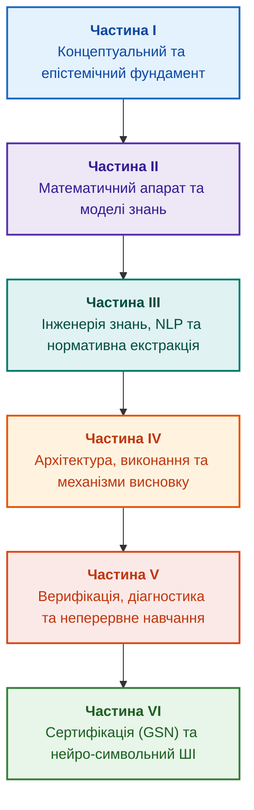

# Архітектура доказових експертних систем: від формальних онтологій до нейро-символьного ШІ

**Електронна книга про проєктування, математичні моделі, архітектуру та верифікацію інтелектуальних систем високого рівня довіри (Safety-Critical & Evidence-Grounded AI)**

**Автор:** Микола Федчик (Mykola Fedchyk)  
**Формат:** Інженерна монографія / Настільна книга архітектора ШІ  
**Рік:** 2026  

---

## Про книгу

У добу тріумфу великих генеративних моделей інженерна спільнота зіткнулася з парадоксом: розмовні нейромережі вражають мовною ерудицією, але виявляються безпорадними або катастрофічно небезпечними там, де ціна помилки вимірюється життями людей, мільярдними збитками чи відкликанням ліцензій — в авіації, функціональній безпеці автотранспорту, енергетиці, клінічній медицині та регуляторному аудиті.

Ця книга присвячена інженерній реконкісті детермінізму, доказовості та епістемічної чесності. Вона систематизує перехід від класичних експертних систем на базі правил до сучасних **нейро-символьних архітектур (Neuro-Symbolic AI)**. Тут досліджується весь ланцюг перетворення сирих розрізнених артефактів (стандартів, логів, схем, коду, датчиків) на математично доведені, побайтово верифіковані та криптографічно підтверджені інженерні рішення.

---

## Структура книги

Книга складається з шести тематичних частин, 29 розділів та практичного додатка.

---

### [Частина I. Концептуальний та епістемічний фундамент](part-01-foundations.md)

*Визначення природи знань, межі між даними та судженнями, витоки доказовості від Байєса до сучасності.*

* [Глава 1. Вступ до експертних систем: від хаосу до керованих знань](ch01-introduction-to-expert-systems.md)
* [Глава 2. Філософія для інженера: що машина має право називати знанням](ch02-epistemology-of-machine-knowledge.md)
* [Глава 3. Експертна система — це більше, ніж інформаційно-довідкова система](ch03-beyond-reference-information-systems.md)
* [Глава 4. Еволюція експертних систем: від теореми Байєса до доказових рішень ШІ](ch04-evolution-from-bayes-to-evidence-ai.md)
* [Глава 5. Тріада довіри: експертна система, доказова рекомендація та корпоративна пам'ять](ch05-triad-of-trust-and-corporate-memory.md)

---

### [Частина II. Математичний апарат та моделі знань](part-02-knowledge-models.md)

*Формальний математичний базис: предикатна логіка, ймовірнісні графи, онтології, інженерні артефакти та EKG.*

* [Глава 6. Прикладна математика експертних систем: правила, ймовірності, графи та причинність](ch06-applied-mathematics-for-expert-systems.md)
* [Глава 7. Типологія баз знань: правила, фрейми, онтології та прецеденти](ch07-knowledge-base-typology.md)
* [Глава 8. Інженерні артефакти як первинні дані експертної системи](ch08-engineering-artifacts-as-data.md)
* [Глава 9. Інженерний граф знань (EKG): інтеграція вимог, вихідного коду, тестів та апаратури](ch09-engineering-knowledge-graph-traceability.md)

---

### [Частина III. Інженерія знань: здобуття, NLP та екстракція з нормативів](part-03-knowledge-engineering-nlp.md)

*Методології вилучення знань у людей-експертів, подолання варіативності мови, парсинг вимог SHALL/MUST та побудова інваріантів.*

* [Глава 10. Системи здобуття знань: архітектура збирання інженерного досвіду без втрат і витоку даних](ch10-knowledge-acquisition-systems.md)
* [Глава 11. Вилучення знань у експертів: інтерв'ювання, когнітивні карти та формалізація досвіду](ch11-knowledge-elicitation-from-experts.md)
* [Глава 12. Лінгвістичний аналіз та локальні моделі: як система розуміє текст без втрати джерела](ch12-linguistic-analysis-and-local-models.md)
* [Глава 13. Варіативність природної мови проти детермінізму: компіляція сенсу запитання](ch13-language-variability-vs-determinism.md)
* [Глава 14. Детекція вимог у стандартах: витяг нормативних предикатів (SHALL/MUST) та побудова інваріантів](ch14-requirements-detection-and-formalization.md)
* [Глава 15. Автоматизована екстракція знань: від тексту специфікацій до онтологій і кінцевих автоматів (FSM)](ch15-knowledge-extraction-and-kb-construction.md)

---

### [Частина IV. Архітектура, виконання та механізми висновку](part-04-architecture-and-inference.md)

*Стек реалізації, логічні машини виведення, рушій пояснень, контроль повноважень та кібернетичні контури.*

* [Глава 16. Архітектура експертної системи: від формального знання до доказового рішення](ch16-expert-systems-architecture.md)
* [Глава 17. Технологічний стек: критерії вибору інструментів, мов програмування та рушіїв правил](ch17-implementation-stack.md)
* [Глава 18. Інфраструктура виконання: локальні моделі, апаратні прискорювачі, Edge та On-Premise](ch18-execution-infrastructure.md)
* [Глава 19. Від запитання до доказу: як система трансформує неструктурований запит на ланцюг фактів](ch19-from-question-to-evidence.md)
* [Глава 20. Рушій пояснень: як система обґрунтовує рішення, відмову та межі компетентності](ch20-explanation-engine.md)
* [Глава 21. Від рекомендації до дії: контроль повноважень та безпечне виконання у виробничих контурах](ch21-from-recommendation-to-action.md)
* [Глава 22. Кібернетичний контур XXI століття: від сенсорів на Edge до центру прийняття рішень](ch22-cybernetics-edge-to-backend.md)

---

### [Частина V. Верифікація, діагностика та неперервне навчання](part-05-verification-and-learning.md)

*Формальна верифікація бази правил, діагностика першопричин (RCA), екзаменаційні набори та навчання без катастрофічного забування.*

* [Глава 23. Верифікація бази знань: як перевірити несуперечливість, повноту та надійність правил](ch23-knowledge-base-verification.md)
* [Глава 24. Технічна діагностика: як не сплутати симптом із першопричиною в умовах неповноти](ch24-system-diagnosis.md)
* [Глава 25. Як навчати експертну систему: екзаменаційні матриці, аудит знань та контроль регресій](ch25-how-expert-systems-learn.md)
* [Глава 26. Неперервне навчання (Continual Learning) на досвіді та подолання зсуву системного журналу](ch26-continual-learning.md)

---

### [Частина VI. Передовий край: регуляторна сертифікація та нейро-символьний ШІ](part-06-frontiers-neuro-symbolic.md)

*Синтез доказів безпеки за стандартом GSN, дворежимні системи (Fail-Closed) та гібридний Neuro-Symbolic AI на Go та Ollama.*

* [Глава 27. Синтез сертифікаційних доказів за Goal Structuring Notation (GSN): від графа EKG до аудиторського звіту](ch27-safety-case-gsn-synthesis.md)
* [Глава 28. Дворежимні експертні системи: поєднання строгої дедукції (Fail-Closed) та евристичного дорадчого виведення (CBR)](ch28-dual-mode-expert-systems.md)
* [Глава 29. Нейро-символьна архітектура (Neuro-Symbolic AI): поєднання мовних моделей та детермінованої доказовості на Go та Ollama](ch29-neuro-symbolic-architecture.md)

---

### Додатки

* [Додаток А. Практичний фреймворк доказового дослідження в складних інженерних проєктах](appendix-a-evidence-governed-framework.md)

---

## Рекомендовані маршрути вивчення

* **Швидкий інженерний старт (для розробників):**  
  `Глава 01 → 06 → 07 → 16 → 17 → 19 → 29`
* **Knowledge Engineering & NLP (для дата-інженерів та лінгвістів):**  
  `Глава 07 → 08 → 09 → 10 → 11 → 12 → 13 → 14 → 15`
* **Safety-Critical & Regulatory Compliance (для архітекторів та аудиторів безпеки):**  
  `Глава 02 → 06 → 09 → 14 → 23 → 27 → 28 → 29`
