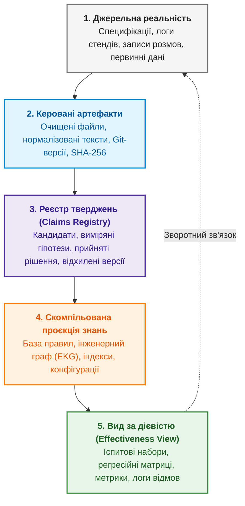

# Додаток А. Практичний фреймворк доказового дослідження в складних інженерних проєктах

> **Книга:** [Архітектура доказових експертних систем](README.md) · Додатки  
> **Попередня глава:** [Глава 29. Нейро-символьна архітектура (Neuro-Symbolic AI): поєднання мовних моделей та детермінованої доказовості на Go та Ollama](ch29-neuro-symbolic-architecture.md)  
> **Зміст книги:** [README.md](README.md)  
> **Рівень:** керівники R&D, системні архітектори, провідні дослідники, інженери знань: середній / просунутий  
> **Призначення додатку:** практичний посібник з організації дослідницької пам'яті (Research Memory), реєстрації тверджень, ізоляції випробувальних наборів та побудови наскрізного ланцюга від сирого джерела до виробничого рішення в умовах високої невизначеності.

---

У понеділок команда знаходить помилку: невелика предметна система не відповідає
на просте запитання, хоча відповідь є в її документах. У вівторок змінюють
пошук. У середу — спосіб поділу тексту. У четвер — інструкцію для мовної
моделі. У п'ятницю нова версія нарешті проходить контрольний приклад.

Наступного понеділка те саме запитання формулюють трохи інакше — і система
знову помиляється.

Команда працювала весь тиждень. Є код, звіти, журнали виконання, кілька нових
наборів даних і навіть красивий показник точності. Проте ніхто вже не може
коротко відповісти:

- яку загальну проблему ми перевіряли;
- що саме доведено;
- який результат був лише розвідувальним;
- які приклади система вже бачила під час розробки;
- скільки незалежних перевірок залишилося;
- за якої умови дослідження нарешті завершиться.

Це не рідкісний випадок і не проблема винятково штучного інтелекту. Так
відбувається з компіляторами, пошуковими рушіями, системами керування знаннями,
аналізаторами коду, робототехнікою й апаратними прототипами. Чим більше в
проєкті невизначеності, тим легше переплутати кількість виконаної роботи з
накопиченим знанням.

Після тривалої серії таких експериментів у нас сформувався практичний
дослідницький фреймворк (*Research Framework*). Це не нова методологія замість
наукового методу, Scrum, системної інженерії чи інженерії життєвого циклу
моделей (*Machine Learning Operations*, MLOps). Це спосіб з'єднати їхні
корисні частини в одну пам'ять дослідження: від сирого джерела до твердження,
від твердження до рішення, від рішення до зміни продукту, а від зміни — до
незалежного випробування.

## Головний продукт дослідження — не звіт

У програмному проєкті легко назвати продукт: виконуваний файл, бібліотека,
сервіс. У дослідженні все менш очевидно. Скрипт не є результатом сам по собі.
Набір завантажених документів — теж. Таблиця метрик ще нічого не каже без
питання, популяції та правила рішення.

Корисною одиницею виявилося **дослідницьке твердження**:

> У визначених умовах метод A має таку властивість порівняно з методом B; це
> підтверджується такими спостереженнями, з такими обмеженнями й рівнем
> перевірки.

У твердження має бути стабільний ідентифікатор, область чинності, статус,
докази та відомі обмеження. Статуси теж мають значення:

- кандидат — ідея або зовнішнє повідомлення, яке ще не перевірено;
- виміряно — є відтворювані спостереження у визначеній області;
- прийнято — чинне методологічне чи архітектурне рішення;
- відхилено — перевірка не виконала зафіксований критерій;
- замінено — старий висновок збережено, але діє новіший.

Це дисциплінує мову. «Ми реалізували» не означає «ми незалежно перевірили».
«Тест пройшов» не означає «гіпотезу підтверджено». «Модель відповіла правильно»
не означає «вона використала правильний доказ».

## П'ять шарів дослідницької пам'яті



Зручна тека з Markdown-файлами не розв'язує проблему сама. Потрібно розділити
те, що часто несвідомо змішують.

### 1. Джерельна реальність

Це сирі документи, вимірювання, версії коду, виконувані файли, ваги моделей і
людські оцінки. Вони мають бути незмінними в межах знімка й мати точну
ідентичність: криптографічний хеш, версію або інший однозначний ідентифікатор.

Якщо ми цитуємо технічний документ, недостатньо записати його назву. Потрібно
знати версію, байти, сторінку або діапазон, спосіб розбору і перетворення.

### 2. Керовані артефакти

Це протоколи, маніфести, нормалізовані дані, журнали, результати кожного
випадку, агреговані метрики й рішення. Вони пояснюють, що ми зробили із
джерельною реальністю.

Тут корисна модель походження консорціуму W3C (*World Wide Web Consortium*)
PROV: сутності, діяльності й агенти, які
брали участь у створенні результату. Не обов'язково впроваджувати повний
семантичний стек W3C. Важливий принцип: результат повинен показувати не лише
«що отримано», а й «з чого, ким і якою операцією».

### 3. Реєстр тверджень

Довгий звіт чудово пояснює історію, але погано відповідає на запитання «що ми
вважаємо чинним зараз?». Для цього потрібен компактний машинно-читаний реєстр.
Кожне твердження посилається на доказові файли, а не на пам'ять автора.

Якщо висновок змінився, старий запис не переписують заднім числом. Новий
запис явно замінює старий. Так негативні результати й помилки не зникають із
історії.

### 4. Скомпільована проєкція знань

Коли артефактів стає кілька сотень, читати їх послідовно неможливо. Тут
корисною виявилася ідея Андрея Карпаті про постійну пов'язану Markdown-вікі,
яка накопичує синтез джерел, а не виконує весь пошук заново для кожного
запитання.

У дослідницькому проєкті цю ідею треба обмежити. Мовна модель може допомагати
оновлювати сторінки про поняття, компоненти, результати й відкриті питання, але
ця вікі залишається похідною проєкцією. Джерела, протоколи, вимірювання і
прийняті рішення мають вищу силу.

Інакше ми лише замінимо хаотичну теку документів на переконливо написану, але
неперевірену енциклопедію.

### 5. Вид за дієвістю

Науковий тип файлу й поточна увага — різні речі. Тут добре працює спрощена
адаптація PARA Тіаго Форте:

- **проєкти** — активна обмежена робота з критерієм завершення;
- **напрями відповідальності** — постійні процеси на кшталт походження даних,
  безпеки чи курування корпусу;
- **ресурси** — джерела, методи й інструменти для можливого повторного
  використання;
- **архів** — завершене, відкладене, помилкове або замінене.

Але ми не перебудовуємо за цими чотирма папками весь репозиторій. Це лише
операційний вид поверх канонічної структури. Архівне негативне спостереження не
перестає бути доказом, а корисний ресурс не стає істиною.

## Вхідна черга не повинна автоматично народжувати експеримент

Нова стаття, бібліотека або цікава ідея спокушає негайно «щось перевірити».
Через місяць проєкт має десятки розпочатих напрямів і жодного завершеного
питання.

Тому новий матеріал спочатку потрапляє до дослідницької вхідної черги. Під час
тріажу він отримує одну долю:

- допомагає чинному проєкту;
- стає постійним правилом або відповідальністю;
- зберігається як довідковий ресурс;
- переходить до архіву;
- видаляється, якщо не має навіть аудиторської цінності.

Щоб перетворитися на експеримент, ідея повинна закривати конкретне невідоме
твердження або виміряний дефект. Потрібні питання, протокол, вхідні дані,
метрика й правило рішення. Сам факт існування цікавої технології цього не
виправдовує.

## Дорожня карта має бути скінченною

Одна з найнеприємніших ознак слабкого дослідження — відповідь «ще один
експеримент» на кожне прохання продовжити. Так можна працювати нескінченно.

Правильна дорожня карта містить зафіксовані контрольні точки. Наприклад:

1. підготувати корпус і походження;
2. заморозити еталонний набір;
3. порівняти представлення;
4. порівняти пошукові методи;
5. перевірити перенесення між доменами;
6. виміряти вартість;
7. провести фінальний аудит.

Новий блок можна додати, але лише явно: змінити дорожню карту, пов'язати його з
гіпотезою й пояснити, яке рішення без нього неможливе. Фраза «давайте ще
спробуємо» не є достатньою підставою.

Кожний робочий пакет має бути логічно цілісним. Не обов'язково виконувати рівно
чотири пункти або один експеримент за розмову. Пакет завершується тоді, коли
дає рішення: протокол, виконання, аналіз, перевірені артефакти й оновлену
карту знань.

## Попередня реєстрація — це план, а не в'язниця

Відкрита наука давно використовує попередню реєстрацію: дослідник фіксує
гіпотезу, метод і критерії до перегляду результату. Її сенс не в забороні
думати після старту. Сенс у тому, щоб читач бачив різницю між передбаченим і
поясненим заднім числом.

Для інженерного експерименту достатньо локального протоколу з хешем. До
виконання варто записати:

- питання й область;
- популяцію, вибірку та винятки;
- базову й нову версії;
- основні й діагностичні метрики;
- критерії прийняття, відхилення та інвалідації;
- умови зупинки;
- форму запису кожного випадку;
- ідентичності коду, моделі, конфігурації й даних.

Після цього ніхто не забороняє зробити новий розвідувальний експеримент. Але
його треба так і назвати, а не додати до підтверджувального набору після того,
як ми вже побачили відповіді.

## Чотири різні види «тест пройшов»

У складних системах найбільше плутанини виникає між тестами різного
призначення.

### Відомі тести розробника

Модульні, контрактні, негативні й регресійні тести містять уже відомі приклади.
Вони доводять, що реалізація виконує відомий контракт і не повторює знайому
помилку. Вони не доводять узагальнення.

### Незалежний прихований набір

Його обирають лише після замороження виконуваного файла, моделі, конфігурації й
даних. Система отримує запитання, але не очікувані відповіді. Випробовувач
порівнює результат із закритим еталоном.

Щойно випадок розкрито, він більше не прихований. Під час наступної ітерації
він стає регресійним тестом розробника.

### Підтверджувальний науковий набір

Він потрібний для рішення про гіпотезу. Якщо правильність має семантичну
складову, потрібні незалежні оцінки людей, вимірювання згоди й розбір
розбіжностей. Мовна модель може бути допоміжним оцінювачем, але не незалежним
еталоном власної ж системи.

### Приймання власником або користувачем

Воно перевіряє практичну корисність, взаємодію й відповідність очікуванню.
Воно не замінює три попередні рівні. Людина може бути задоволена красивою
демонстрацією, яка не має відтворюваної доказової основи.

## Чому один правильний приклад іноді є поганою новиною

Уявімо, що система має повернути число з одиницею. Після кількох виправлень
відомий запит стабільно дає `8 байтів`. Розробник чесно показує правильний
доказ, координати й цитату.

Це хороший регресійний результат. Але якщо зовнішній випробовувач одразу
повторить те саме запитання, ми отримаємо не незалежне підтвердження, а другу
копію відомого тесту.

Наступний незалежний пакет повинен взяти інші документи й перетнути дві осі:

- форму значення: число з одиницею, префікс, ідентифікатор, точна фраза,
  багаторядкове значення, довга константа;
- форму звернення: пряме питання, прохання, запит на доказ, підтвердження.

Якщо три формулювання одного факту дають різні результати, це одна групова
невдача, а не «два з трьох майже добре». Діалогова система повинна зберігати
значення під час перефразування.

## Шукаємо перший несправний шар

Фінальна неправильна відповідь не завжди показує, що саме треба лагодити.
Корисна діагностика фіксує першу стадію, де правильний стан зник:

1. аналіз запиту;
2. пошук;
3. вибір доказового фрагмента;
4. виявлення потрібного твердження;
5. видобування його складових;
6. прив'язування до джерела;
7. семантична перевірка;
8. формування тексту;
9. перевірка цитати;
10. фінальний допуск.

Якщо пошук не знайшов доказ, не треба переписувати модуль відповіді. Якщо
доказ уже правильний, але число втратило одиницю під час формування тексту, не
треба перебудовувати індекс. Якщо відповідь правильна, але цитата її не
підтримує, це теж невдача — правильність могла бути випадковою.

Саме тут проявляється різниця між дослідницьким і демонстраційним журналом.
Демонстраційний показує останню красиву відповідь. Дослідницький зберігає стан
кожного шару, включно з безпечними відмовами.

## Негативний результат не треба викидати

Під час реальної роботи бувають щонайменше три різні «невдачі».

**Продуктова невдача:** система справді виконала операцію й дала неправильний
результат або неправильно відмовилася.

**Інфраструктурно недійсний запуск:** закінчився час на завантаження моделі,
не відкрився кеш, змінився виконуваний файл, тестовий скрипт передав неправильну
схему. Це важлива інформація про стенд, але не про якість відповіді.

**Інвалідований експеримент:** після запуску виявили витік між навчальною й
тестовою вибіркою, помилку протоколу або неправильну популяцію. Його артефакти
не можна використовувати для початкового висновку, але їх треба зберегти з
позначкою й причиною.

Якщо все невдале просто видаляти, команда приречена повторювати ті самі
помилки. Якщо ж усе невдале без розбору включати в одну метрику, оцінка теж
втратить сенс.

## Дані мають паспорт, а результати — родовід

Принципи FAIR (*Findable, Accessible, Interoperable, Reusable*) пропонують
робити цифрові об'єкти знаходжуваними, доступними,
сумісними й придатними до повторного використання. Для практичного проєкту це
означає стабільні ідентифікатори, метадані, формати й умови використання, які
може прочитати не лише людина, а й програма.

Підхід «паспорти наборів даних» (*Datasheets for Datasets*) додає питання, які
легко пропустити: навіщо
зібрано набір, із чого він складається, кого або чого він не представляє, як
його збирали, для яких задач він придатний і де може нашкодити.

Але доступність не означає дозвіл на все. Документ може бути публічно
завантажуваним і водночас мати обмеження на повторне розповсюдження. Тому
доступ, локальне дослідження, похідне індексування, навчання моделі й публікація
повних текстів мають бути окремими політичними рішеннями.

## Модель допомагає розуміти, але не володіє джерелом

Сучасна мовна модель чудово зіставляє перефразування, пропонує змістовні ролі,
узагальнює результати й пояснює технічний текст. Було б нерозумно відмовлятися
від цих здібностей.

Так само нерозумно доручати їй те, що детермінована програма перевіряє краще:

- точні байти;
- ідентичність і версію документа;
- координати;
- криптографічні хеші;
- права доступу;
- чинність конфігурації;
- фінальний допуск непідтвердженої відповіді.

Практичний симбіоз виглядає так: модель пропонує зміст і дослівні опорні
сегменти, а програма знаходить ці сегменти в незмінному джерелі, перевіряє
однозначність, будує координати й дозволяє відповідь лише після перевірки
повного твердження.

Той самий поділ корисний у самому дослідженні. Модель може підтримувати
проєкцію знань і допомагати писати звіт. Але вона не повинна оголошувати
власний переказ новим доказом.

## Мінімальний комплект без важкої платформи

Такий фреймворк не вимагає дорогого сервісу. Для початку достатньо кількох
Markdown- і JSON-файлів:

```text
RESEARCH-GOAL.md       навіщо існує дослідження
RESEARCH-MAP.md        де ми зараз і які контрольні точки лишилися
HYPOTHESES.md          твердження та критерії їх перевірки
experiments/           заморожені протоколи
datasets/              маніфести, еталонні набори й паспорти даних
claims.jsonl           поточні твердження та їхні докази
knowledge/             тематична похідна проєкція
BACKLOG.md             робота й залежності
TRACEABILITY.md        зв'язок питання, експерименту, результату й рішення
```

До цього варто додати невелику автоматичну перевірку цілісності (`lint`), яка
перевіряє зламані посилання,
дубльовані ідентифікатори, відсутні докази, цикли заміни й застарілий статус у
головному README. Документи врядування є інтерфейсом проєкту, тому їх теж
потрібно тестувати.

## Як зрозуміти, що фреймворк працює

У здоровому дослідницькому проєкті команда може за кілька хвилин відповісти:

- Яке головне питання?
- Який поточний статус кожної гіпотези?
- Які результати лише розвідувальні?
- Де лежать точні спостереження й вихідні дані?
- Який виконуваний файл, модель і конфігурація створили результат?
- Які приклади відомі розробнику, а які ще приховані?
- Яка перша несправна стадія для кожного провалу?
- Який один клас дефектів виправляється зараз?
- Скільки контрольних точок залишилося?
- За якої умови відкриється наступна?

І ще важливіше: команда може відповісти «ми поки не знаємо» без спокуси
заповнити прогалину впевненим текстом.

## Що цей підхід не гарантує

Жодна структура файлів не зробить слабку гіпотезу сильною. Хеш не доводить
семантичну правильність — він лише фіксує ідентичність. Походження не робить
джерело авторитетним. Попередня реєстрація не виправляє поганий дизайн.
Прихований набір може бути нерепрезентативним. Незалежні люди можуть однаково
помилятися.

Фреймворк потрібний не для усунення невизначеності. Він робить її видимою і не
дозволяє непомітно перетворити на готовий висновок.

## Висновок

Складне дослідження схоже не на пряму дорогу, а на мережу гіпотез, джерел,
реалізацій і невдач. Гнучкість тут необхідна: інженер повинен змінити напрям,
коли докази спростували початковий задум. Але гнучкість без пам'яті швидко
перетворюється на блукання.

Практичний дослідницький фреймворк поєднує дві властивості, які часто помилково
протиставляють. Він заморожує те, що не можна змінювати після перегляду
результату, і залишає відкритим те, що треба адаптувати після нового знання.
Він відділяє джерело від переказу, розробку від незалежного випробування,
пошук від доказу, невдалий продукт від невдалого стенда, активну роботу від
архівної пам'яті.

Найважливіша зміна відбувається не у файловій системі. Команда перестає
запитувати «який експеримент зробимо далі?» і починає запитувати «яке
невирішене твердження зараз блокує рішення і який найменший чесний тест може
його змінити?»

Саме в цей момент дослідження починає накопичувати знання, а не лише артефакти.

## Посилання на інших авторів і публікації

1. Mark D. Wilkinson та ін. [The FAIR Guiding Principles for scientific data
   management and stewardship](https://doi.org/10.1038/sdata.2016.18),
   *Scientific Data*, 2016.
2. W3C Provenance Working Group. [PROV-Overview](https://www.w3.org/TR/prov-overview/)
   і [PROV Model Primer](https://www.w3.org/TR/prov-primer/), 2013.
3. Timnit Gebru та ін. [Datasheets for
   Datasets](https://doi.org/10.1145/3458723), *Communications of the ACM*,
   2021.
4. Center for Open Science. [Preregistration: A Plan, Not a
   Prison](https://www.cos.io/blog/preregistration-plan-not-prison).
5. Elham Tabassi. [Artificial Intelligence Risk Management Framework
   1.0](https://doi.org/10.6028/NIST.AI.100-1), NIST, 2023. На момент
   підготовки статті версію 1.0 переглядають; тут використано її загальний
   життєцикловий принцип керування, картографування, вимірювання й реагування на
   ризик.
6. Andrej Karpathy. [Нотатка про постійну Markdown-вікі, яку підтримує
   LLM](https://gist.github.com/karpathy/442a6bf555914893e9891c11519de94f),
   2026. Це концептуальна ідея, а не експериментально підтверджена методологія.
7. Tiago Forte. [The PARA Method](https://fortelabs.com/blog/para/); Daniel
   Mackay. [Organising Notes with
   PARA](https://www.dandoescode.com/blog/organising-notes-with-para).
8. Dongyu Ru та ін. [RAGChecker: A Fine-grained Framework for Diagnosing
   Retrieval-Augmented Generation](https://arxiv.org/abs/2408.08067), NeurIPS
   2024.
9. Sewon Min та ін. [FActScore](https://aclanthology.org/2023.emnlp-main.741/),
   EMNLP 2023.
10. Tianyu Gao та ін. [Enabling Large Language Models to Generate Text with
    Citations](https://aclanthology.org/2023.emnlp-main.398/), EMNLP 2023.

## Питання до читачів

- Чи можете ви назвати точний момент, коли результат вашого експерименту стає
  знанням про систему?
- Чи відрізняє ваш процес відоме регресійне випробування від справді незалежного
  випробування?
- Яке твердження у вашому поточному проєкті досі вважається правдивим лише
  тому, що його багато разів повторили?

---

[← Глава 29](ch29-neuro-symbolic-architecture.md) · [Частина VI](part-06-frontiers-neuro-symbolic.md) · [Зміст книги](README.md)
