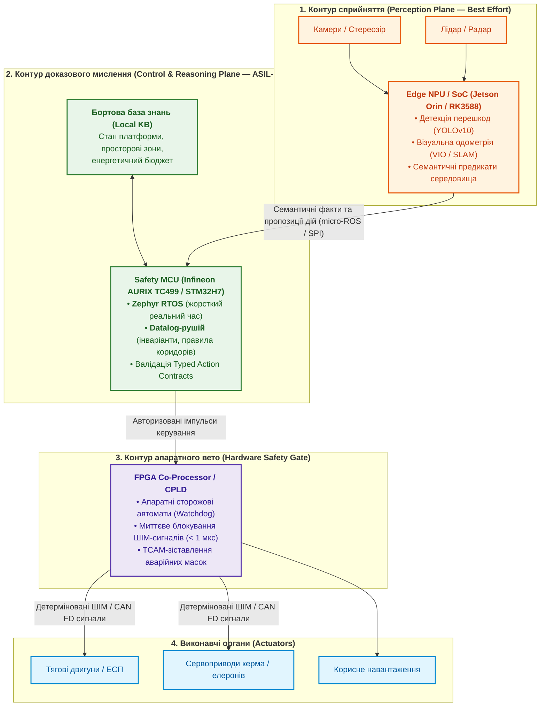
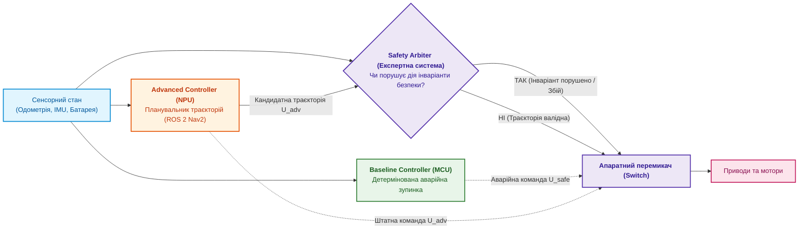
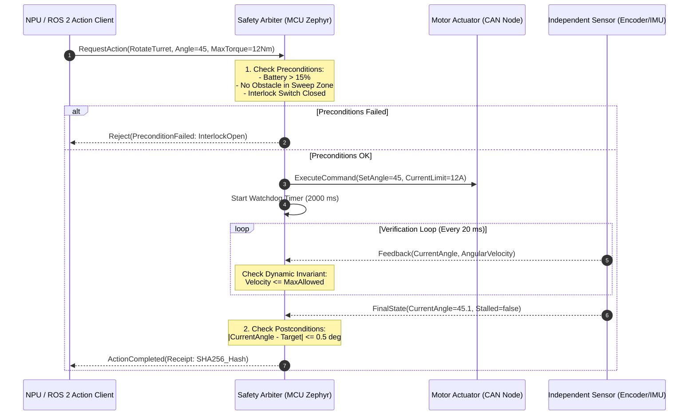
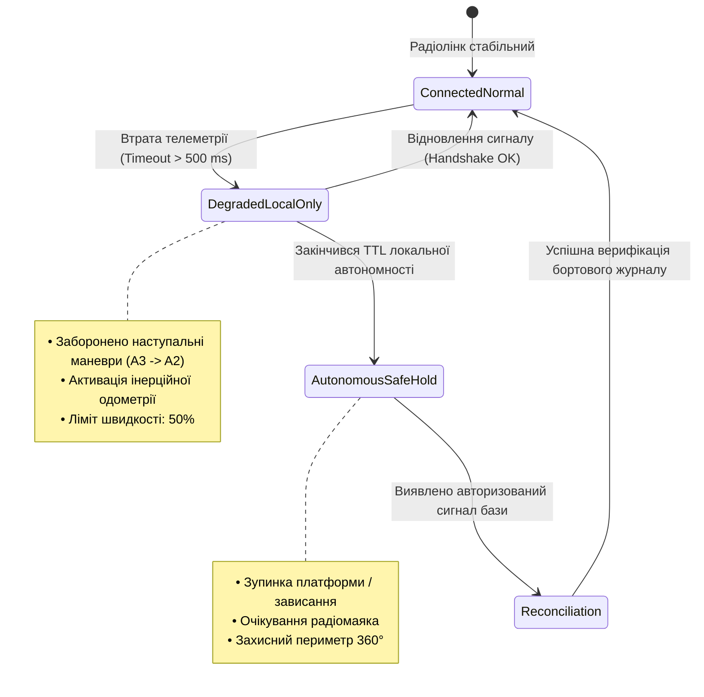
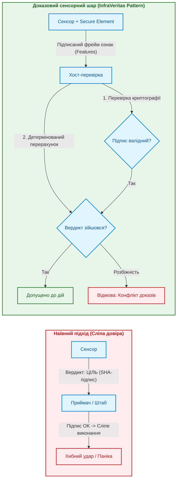
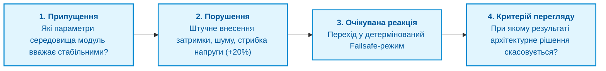

# Додаток Б. Доказові експертні системи в автономній робототехніці та кіберфізичних комплексах

> **Книга:** [Архітектура доказових експертних систем](README.md) · Додатки  
> **Попередня частина:** [Додаток А. Практичний фреймворк доказового дослідження](appendix-a-evidence-governed-framework.md)  
> **Зміст книги:** [README.md](README.md)  
> **Пов'язані глави книги:** [Глава 18. Інфраструктура виконання](ch18-execution-infrastructure.md) · [Глава 21. Від рекомендації до дії](ch21-from-recommendation-to-action.md) · [Глава 22. Кібернетичний контур Edge-to-Backend](ch22-cybernetics-edge-to-backend.md) · [Глава 29. Нейро-символьна архітектура](ch29-neuro-symbolic-architecture.md)  
> **Суміжні дослідження автора:** [Військові експертні системи: БПЛА, ППО, РЕР/РЕБ](../MilTech/DOU-Military-Expert-Systems-UAS-AD-ELINT-EW-UA.md) · [Військова кібернетика](../MilTech/DOU-Ukrainian-Military-Cybernetics-UA.md)  
> **Рівень:** архітектори автономних платформ, embedded-інженери, фахівці з робототехніки (ROS 2 / Zephyr), розробники критичних систем реального часу  
> **Призначення:** інженерне керівництво з проєктування бортових експертних систем для мобільних роботів, безпілотних апаратів (UAS/UGV) та промислових маніпуляторів, де статистичний штучний інтелект сприйняття відокремлений від контуру прийняття рішень за допомогою детермінованого символьного ядра та апаратного вето (Simplex Architecture).

---

## 1. Проблема: Чому робот — це не «чат-бот на колесах»

В інженерії споживчого штучного інтелекту помилка мовної моделі чи рекомендаційного алгоритму означає невдало згенерований текст, повторний запит або перезавантаження сторінки. У кіберфізичних системах (Cyber-Physical Systems, CPS) та автономній робототехніці ціна помилки принципово інша:

* **Зміна фізичного світу:** програмний агент безпосередньо керує напругою на силових інверторах, тиском у гідравліці, кутами відхилення елеронів чи швидкістю обертання безколекторних моторів.
* **Необоротність фізичних наслідків:** команда `DropPayload()`, `EmergencyBraking()` або поворот сервопривода на $90^\circ$ на швидкості 60 км/год споживають кінетичну енергію і змінюють матеріальний стан середовища. Їх неможливо «скасувати» через `Ctrl+Z`.
* **Стохастична прірва надійності:** як показано в [Главі 29](ch29-neuro-symbolic-architecture.md), найкращі нейромережеві моделі сприйняття та генеративні планувальники мають частоту помилок близько $10^{-3} \dots 10^{-4}$ на крок інференсу. У контурі стабілізації робота з частотою 50 Гц це означає гарантовану критичну помилку кожні кілька хвилин автономного руху.

> [!CRITICAL]
> **Головний принцип кіберфізичної безпеки:**
> Жодна ймовірнісна нейромережа (чи то згорткова мережа комп'ютерного зору, чи мультимодальна LLM/VLM) не має права володіти прямим доступом до шини керування приводами (Actuation Bus). Між сенсорним інтелектом і виконавчими органами зобов'язаний стояти детермінований **шлюз допуску (Admission Gate)** — експертна система, реалізована на надійному кремнії.

Цей посібник демонструє, як транслювати теоретичні моделі онтологій, стратифікованого Datalog та кібернетичного регулювання у практичну бортову архітектуру робота.

---

## 2. Гетерогенний апаратний стек бортового обчислювача (HW/SW Co-Design)

Мобільний робот, дрон або польова платформа обмежені жорсткими рамками **SWaP-C (Size, Weight, Power, and Cost)**. Спроба розмістити на борту важкі сервери з універсальними GPU призводить до швидкого вичерпання акумулятора, надлишкового нагріву та втрати корисного навантаження.

Згідно з концепцією [Глави 18](ch18-execution-infrastructure.md), обчислювальна архітектура робота розділяється на три взаємодоповнюючі субстрати:



### Специфікація апаратних ролей

1. **Edge NPU (Neural Processing Unit):**
   * *Обладнання:* NVIDIA Jetson Orin Nano/NX, Rockchip RK3588 або інтегровані NPU.
   * *Операційне середовище:* Embedded Linux (Ubuntu Core, Yocto) з ROS 2 (Humble/Jazzy).
   * *Завдання:* обробка сирих сенсорних потоків високої пропускної здатності ($> 1\text{ ГБ/с}$), швидке розпізнавання перешкод, побудова хмари точок.
   * *Статус надійності:* **Unsafe / Complex Controller**. Може перезавантажуватися або давати збої без зупинки базової стабілізації платформи.
2. **Safety MCU (Microcontroller Unit):**
   * *Обладнання:* багатоядерний мікроконтролер із апаратним резервуванням (Infineon AURIX TC3xx/TC4xx з ядрами TriCore у режимі Lockstep, або STM32H7 dual-core).
   * *Операційне середовище:* **Zephyr RTOS** — забезпечує детерміноване планування потоків із витісненням, низьку латентність переривань та нульове динамічне виділення пам'яті.
   * *Завдання:* підтримка локальної бази фактів, виконання скомпільованих правил експертної системи, перевірка передумов і постумов.
   * *Статус надійності:* **Deterministic / ASIL-D / SIL 3**.
3. **FPGA / CPLD Gate (Апаратний арбітр):**
   * *Обладнання:* низькоспоживаюча ПЛІС (Lattice iCE40, Microchip PolarFire або Xilinx Artix-7).
   * *Завдання:* апаратний моніторинг шин живлення, контроль лімітів струму, апаратне блокування драйверів моторів у разі перевищення критичних кутів крену або виходу за межі геозони (*Geofencing*).
   * *Час реакції:* менше 1 мікросекунди.

---

## 3. Програмна архітектура: Simplex-контур безпеки

Для гарантування надійності використовується перевірена в авіації та критичній автоматиці **архітектура Сімплекс (Simplex Architecture)**. Вона складається з трьох ключових блоків:

1. **Advanced Controller (Складний оптимізаційний планувальник):** працює на NPU у середовищі ROS 2 (Nav2). Він використовує нейромережі та складні алгоритми траєкторного планування для пошуку найбільш енергоефективного шляху.
2. **Safety / Baseline Controller (Простий детермінований контролер):** реалізований на Safety MCU. Він містить примітивну, але математично доведену логіку безаварійного сповільнення, зависання на місці або аварійної посадки.
3. **Decision / Safety Arbiter (Експертний арбітр допуску):** символьний рушій, що в реальному часі зіставляє запропоновану складним контролером команду з поточною моделлю стану робота:



### Формалізація інваріанта безпеки

Нехай $X(t)$ — фазовий вектор стану робота (координати, лінійна швидкість $v$, кутова швидкість $\omega$, дистанція до найближчої перешкоди $d_{obs}$). Запропоноване керування $U_{adv} = (a, \alpha)$ схвалюється тоді й лише тоді, коли прогнозований гальмівний шлях $S_{stop}(v, a_{max})$ задовольняє умову:

$$d_{obs} - S_{stop}(v, a_{max}) \ge D_{margin} + v \cdot \tau_{reaction}$$

де:

* $D_{margin}$ — гарантований захисний бар'єр (наприклад, 0.5 м);
* $\tau_{reaction}$ — максимальний час затримки реакції апаратного контуру (для Zephyr RTOS на AURIX — $< 2\text{ мс}$).

Якщо $U_{adv}$ порушує цю нерівність або якщо NPU не надав наступну команду за визначений таймаут watchdog ($50\text{ мс}$), арбітр миттєво знеструмлює лінію $U_{adv}$ і передає керування на $U_{safe}$ (гальмування з прискоренням $-a_{max}$).

---

## 4. База знань на борту: скомпільований Datalog без динамічної пам'яті

На вбудованих контролерах мікросекундного класу пам'ять RAM обмежена сотнями кілобайт (наприклад, 512 КБ у STM32H7 або кілька мегабайт локальної SRAM у AURIX TC499). Використання стандартних інтерпретаторів Prolog або рушіїв RETE з динамічним виділенням об'єктів (`malloc` / `new`) **категорично заборонено** стандартами функціональної безпеки через ризик фрагментації пам'яті та недетермінованих пауз.

### Концепція скомпільованих правил (Knowledge-to-C)

Відповідно до архітектури [Глави 18](ch18-execution-infrastructure.md), правила бази знань транслюються під час збірки (*Compile-Time*) у компактні C-структури, маски бітових прапорів та статичні таблиці переходів.

Розглянемо фрагмент системи оцінки польотного завдання для БПЛА на мові Datalog:

```prolog
% Бортові правила безпеки польоту
hazard(critical_battery) :- 
    telemetry(battery_voltage, V), V < 21.0.

hazard(geofence_breach) :- 
    position(Alt, Dist), Dist > 5000.

hazard(sensor_blindness) :- 
    sensor_health(lidar, failed), 
    sensor_health(optical_flow, degraded).

% Рішення про перехід у Failsafe
action(emergency_landing) :- 
    hazard(critical_battery).

action(return_to_home) :- 
    hazard(geofence_breach), 
    not hazard(critical_battery).

action(hold_position) :- 
    hazard(sensor_blindness), 
    not hazard(critical_battery).
```

### Генерація коду для Zephyr RTOS

Під час компіляції генератор знань перетворює ці правила на високооптимізований код мовою C без жодного динамічного виділення:

```c
/* Generated by KnowledgeCompiler for Zephyr RTOS */
#include <zephyr/kernel.h>
#include <stdint.h>
#include <stdbool.h>

typedef struct {
    float battery_voltage;
    float distance_from_home;
    float altitude;
    uint8_t lidar_status;       /* 0=OK, 1=Degraded, 2=Failed */
    uint8_t opt_flow_status;
} RobotTelemetry_t;

typedef enum {
    ACTION_CONTINUE = 0,
    ACTION_HOLD_POSITION,
    ACTION_RETURN_TO_HOME,
    ACTION_EMERGENCY_LANDING
} SafetyVerdict_t;

SafetyVerdict_t evaluate_safety_rules(const RobotTelemetry_t *const telem) {
    /* 1. Атомарна перевірка інваріантів у регістрах */
    const bool critical_battery = (telem->battery_voltage < 21.0f);
    if (critical_battery) {
        return ACTION_EMERGENCY_LANDING; /* Найвищий пріоритет */
    }

    const bool geofence_breach = (telem->distance_from_home > 5000.0f);
    if (geofence_breach) {
        return ACTION_RETURN_TO_HOME;
    }

    const bool sensor_blind = (telem->lidar_status == 2) && 
                              (telem->opt_flow_status >= 1);
    if (sensor_blind) {
        return ACTION_HOLD_POSITION;
    }

    return ACTION_CONTINUE;
}
```

Ця функція виконується за **12–15 тактів процесора** (менше $0.05\text{ мкс}$ на частоті 300 МГц), має суворо константний час виконання $\mathcal{O}(1)$ і нульовий стек, що усуває будь-яку загрозу переповнення пам'яті.

---

## 5. Типізовані контракти дій (Typed Action Contracts) та транзакції фізичного світу

У [Главі 21](ch21-from-recommendation-to-action.md) детально розібрано проблему: *виконання команди у фізичному світі вимагає зворотного зв'язку*. Робот не може просто «відправити байти в шину CAN» і вважати задачу виконаною.

Будь-яка складна дія оформлюється у вигляді контракту, що реалізує шаблон **Saga**:



### Структура контракту дії на C (Zephyr RTOS)

```c
struct ActionContract {
    uint32_t action_id;
    uint32_t timeout_ms;
    
    /* Preconditions: повертає true, якщо залізо готове */
    bool (*check_preconditions)(void);
    
    /* Dispatch: безпосередній запис у регістри/CAN */
    int (*execute_command)(void *params);
    
    /* Postconditions: незалежне підтвердження датчиками */
    bool (*verify_postconditions)(void *params);
    
    /* Compensation / Safe Rollback: аварійна дія при зриві */
    void (*compensate_failure)(void);
};
```

Якщо під час повороту привода датчик струму фіксує перевантаження ($I > 15\text{ А}$), а енкодер не реєструє зміну кута (механічне заклинювання редуктора), контракт зривається: спрацьовує процедура `compensate_failure()`, яка миттєво знімає напругу з обмоток двигуна, фіксує механічне гальмо та повертає статус аномалії на верхній рівень.

---

## 6. Автономність при втраті зв'язку та радіоелектронній боротьбі (РЕБ)

У реальних сценаріях польової робототехніки та військових застосуваннях ([Військові експертні системи](../MilTech/DOU-Military-Expert-Systems-UAS-AD-ELINT-EW-UA.md)) зв'язок із пунктом керування зазнає навмисного придушення, спотворення або повної втрати.

Бортова система реалізує **4-стадійний кібернетичний автомат деградації** згідно з [Главою 22](ch22-cybernetics-edge-to-backend.md):



### Правила поведінки за відсутності GPS/GNSS

При попаданні в зону спуфінгу супутникової навігації експертна система на MCU виконує детекцію аномалій:

1. **Інваріант консистентності одометрії:**
   $$|\mathbf{v}_{GNSS} - \mathbf{v}_{Wheel/IMU}| > \Delta V_{threshold}$$
   Якщо супутниковий приймач повідомляє про швидкість 80 км/год, тоді як інтегровані показання колісних енкодерів та акселерометра вказують на 10 км/год, супутниковий канал позначається як скомпрометований (`Status = SPOOFED`).
2. **Апаратна реакція:** джерело координат GNSS виключається з фільтра Калмана; система переходить у режим чистої інерційно-оптичної навігації зі збереженням останньої доведеної точки бази в енергонезалежній пам'яті FRAM.

---

## 7. Доказовий шар сенсорних вимірювань: підпис ознак замість неперевірюваних вердиктів

У розподілених сенсорних мережах і бойових контурах ситуаційної обізнаності (наприклад, акустичні пеленгатори, радіочастотні сканери, сейсмодатчики) існує критична вразливість: **підписане повідомлення доводить автентичність відправника, але не доводить фізичну істинність його висновку**.

Як сформулював інженер вбудованих систем Петро Сідлярчук (*InfraVeritas LLC*):

- Якщо захоплений противником або пошкоджений датчик надсилає підписаний статус `TARGET_DETECTED`, приймальна сторона штабу чи робота змушена сліпо вірити цьому вердикту, оскільки підпис є валідним.
- Якщо датчик помилився через фізичну заваду середовища (наприклад, гармоніка 84 Гц від лінії електропередач, яку алгоритм детектора прийняв за двигун БПЛА), система приймає хибну ціль за реальну.



### Архітектурний контракт доказового сенсора

1. **Заборона передачі голих вердиктів:** Вузол ніколи не декларує категоричне твердження «Ціль». Він формує канонічний двійковий фрейм цілочисельних фізичних ознак (*Canonical Feature Frame*): межі вікна вимірювання, SNR над фоном, стабільність основного тону, спектральна плоскість, кількість гармонік, лічильник перевантажень.
2. **Апаратний корінь довіри (Hardware Root of Trust):** Приватний ключ генерується всередині криптографічного чипа (ATECC608 / TPM / Secure Element) і ніколи не покидає кристал. Робочі константи шифруються динамічним ключем введення в експлуатацію.
3. **Блокування фізично неможливих станів ДО підпису:** Якщо кількість кадрів у ядрі перевищує загальну кількість гармонічних кадрів, внутрішній верифікатор мікроконтролера апаратно блокує підпис: суперечливі дані не мають права отримати цифровий сертифікат.
4. **Незалежний хостовий перерахунок:** Приймальний центр або бортовий Safety MCU перевіряє підпис і **заново обчислює вердикт за тими самими правилами**. Якщо вузол заявляв `ЦІЛЬ`, а перерахунок за ознаками дає `НЕМАЄ` (наприклад, сигнал нижче рівня фонового шуму), довіра блокується (`до відома: НІ`).

---

## 8. Аналіз нефункціональних інтерфейсів та межі припущень перед інтеграцією

Парадокс складних кіберфізичних систем полягає в явищі **«дві справні підсистеми утворюють одну несправну систему»**.

Як відзначає засновник компанії *Sequtr* Олександр Бондар, компонент A (наприклад, тепловізійна камера чи модуль радіозв'язку) і компонент B (наприклад, GNSS-приймач чи польотний контролер) можуть повністю відповідати індивідуальним специфікаціям і проходити модульні тести, але відмовляти після фізичного складання платформи.

Причиною є **приховані нефункціональні інтерфейси**:

- **Спільне живлення та земляні петлі (Ground Loops):** імпульсні сплески струму від моторів спричиняють просідання напруги на цифровій шині датчиків.
- **Електромагнітні завади (EMI/RF Interference):** як показав досвід CTO *Frontline Robotics* Павла Косолапкіна, високочастотне випромінювання цифрової камери на борту дрона здатне повністю засліпити поруч розташовану антену навігаційного приймача (проблема, яку на перших прототипах діагностували фізичним екрануванням консервною банкою).
- **Термічний та вібраційний вплив:** локальне нагрівання силового драйвера змінює температурний дрейф гіроскопів IMU.

### Чотири кроки валідації інженерних припущень

Перед проведенням дорогих натурних випробувань експертна система проєктування зобов'язана вимагати заповнення матриці припущень (*Assumption Boundary Mapping*):



Особлива увага приділяється **«сірій зоні» часткової деградації**: система повинна перевірятися не лише на повну відмову (обрив дроту), а й на поступовий дрейф калібрувань після $N$ термічних циклів, короткі серії нерівномірних затримок по шині та джитер тактових генераторів.

---

## 9. Покрокове керівництво з розгортання прототипу (Quickstart)

Для створення мінімального стенду бортової експертної системи робота рекомендується наступний інженерний конвеєр:

### Крок 1. Конфігурація середовища розробки

Встановіть оточення для крос-компіляції під STM32 / AURIX та ROS 2:

```bash
# Встановлення Zephyr SDK та west tool
python3 -m venv ~/zephyrproject/.venv
source ~/zephyrproject/.venv/bin/activate
pip install west
west init ~/zephyrproject
cd ~/zephyrproject && west update
west zephyr-export
pip install -r ~/zephyrproject/zephyr/scripts/requirements.txt
```

### Крок 2. Формування правил безпеки (Datalog Rules)

Створіть файл правил `safety_rules.dl` у директорії проєкту:

```prolog
% Вхідні предикати: distance(SensorID, Centimeters)
unsafe_zone(SensorID) :- distance(SensorID, D), D < 30.
emergency_stop :- unsafe_zone(_).
```

### Крок 3. Складання мікро-сервісу на Zephyr RTOS

Створіть потік нагляду (*Supervisor Thread*) із фіксованим періодом $10\text{ мс}$:

```c
#include <zephyr/kernel.h>
#include <zephyr/drivers/gpio.h>

#define SUPERVISOR_PERIOD_MS 10
#define MOTOR_ENABLE_PIN     4

static const struct gpio_dt_spec motor_en = GPIO_DT_SPEC_GET(DT_NODELABEL(motor_switch), gpios);

void safety_supervisor_thread(void *arg1, void *arg2, void *arg3) {
    gpio_pin_configure_dt(&motor_en, GPIO_OUTPUT_ACTIVE);

    while (1) {
        /* Зчитування дистанції з апаратного АЦП/SPI */
        uint16_t front_distance = read_sonar_distance();

        /* Перевірка інваріанта безпеки */
        if (front_distance < 30) {
            /* Миттєве апаратне вимкнення живлення приводів */
            gpio_pin_set_dt(&motor_en, 0);
            printk("SAFETY INTERLOCK: Obstacle at %d cm! Motors DISABLED.\n", front_distance);
        } else {
            gpio_pin_set_dt(&motor_en, 1);
        }

        k_msleep(SUPERVISOR_PERIOD_MS);
    }
}

K_THREAD_DEFINE(safety_thread_id, 1024, safety_supervisor_thread, NULL, NULL, NULL, 1, 0, 0);
```

### Крок 4. HIL-симуляція перед фізичним виїздом

Перед завантаженням у фізичний контролер проведіть моделювання в контурі **Hardware-in-the-Loop (HIL)**:

1. Запустіть симулятор середовища (Gazebo Sim або Isaac Sim) на робочій станції.
2. Підключіть плату контролера через USB-CAN адаптер до віртуальної шини `vcan0`.
3. Переконайтеся, що при штучному внесенні шуму в топік `/cmd_vel` плата контролера стабільно перехоплює керування за визначений норматив часу ($< 5\text{ мс}$).

---

## 10. Чекліст перевірки автономного робота перед виходом на полігон

Перед польовими випробуваннями кіберфізичної платформи заповніть чекліст аудиту безпеки:

| № | Перевірка безпеки | Механізм контролю | Статус |
| :-: | :--- | :--- | :-: |
| 1 | **Фізична ізоляція приводів** | Апаратний перемикач (Kill-Switch) розриває силове коло акумулятора незалежно від прошивки MCU | [ ] |
| 2 | **Апаратний сторожовий пес** | Активовано незалежний апаратний Watchdog Timer (WDT) на MCU з таймаутом $\le 100\text{ мс}$ | [ ] |
| 3 | **Нульові динамічні алокації** | У коді безпекового наглядача відсутні виклики `malloc()`, `free()`, динамічні списки та рекурсія | [ ] |
| 4 | **Коридори швидкостей** | Максимальні кутові швидкості обмежені апаратним насиченням (Saturation) на рівні драйвера двигуна | [ ] |
| 5 | **Перевірка зворотного зв'язку** | Кожна команда переміщення має тайм-аут постумови, що опитує незалежний енкодер або датчик струму | [ ] |
| 6 | **Захист від засліплення** | Вихід з ладу камер або лідара призводить до переходу в режим `AutonomousSafeHold` | [ ] |
| 7 | **Шлюз розмежування NPU-MCU** | Обмін між високорівневим Linux-планувальником та безпековим MCU ведеться через суворо типізовані пакети CRC32 | [ ] |
| 8 | **Захист від спуфінгу GNSS** | Алгоритм крос-валідації відсікає супутникові стрибки координат, що суперечать показанням IMU | [ ] |
| 9 | **Підписана конфігурація** | Бандл правил та уставка геозон підписані цифровим підписом розробника ([Глава 22](ch22-cybernetics-edge-to-backend.md)) | [ ] |
| 10 | **Імутабельний чорний ящик** | Останні 10 хвилин телеметрії, станів скінченного автомата та дій бекапляться в енергонезалежну FRAM-пам'ять | [ ] |

---

## 11. Резюме

Поєднання сучасного нейромережевого сприйняття (Perception AI) та доказових експертних систем на базі формальної логіки (Reasoning Engine) відкриває шлях до створення дійсно надійних автономних роботів нового покоління.

Розподіл системи на **ймовірнісного радника** на базі NPU та **детермінованого арбітра** на базі Lockstep MCU під керуванням Zephyr RTOS дозволяє використовувати всі переваги глибокого навчання, не поступаючись жодним відсотком функціональної безпеки та надійності у фізичному світі.

---

## 12. Рекомендовані першоджерела

- Lui Sha. [Using Simplex to Build Reliable Systems from Unreliable Components](https://doi.org/10.1109/HCW.1998.666548), *IEEE Proceedings of Software Engineering*, 1998.
- Petro Sidliarchuk. [Hardware Root of Trust and Evidence-Signed Measurement Layers in Embedded Networks](http://github.com/sidliarchukpetro), InfraVeritas LLC, 2024.
- Oleksandr Bondar. [Non-Functional Physical Coupling and Mismatched Engineering Assumptions in Complex Systems Integration](https://sequtr.com/), Sequtr, 2024.
- Pavlo Kosolapkin. [Lessons in Hardware-Software Co-Design and RF Shielding for Autonomous Robotics](https://frontlinerobotics.com/), Frontline Robotics, 2024.
