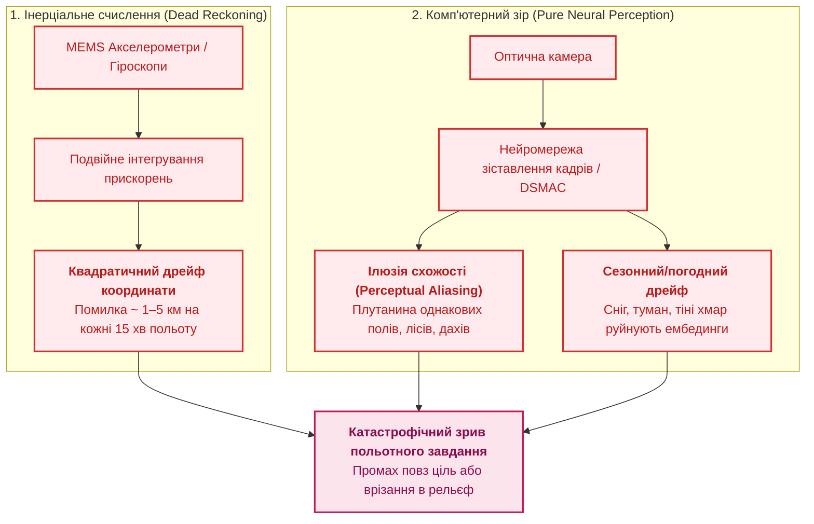
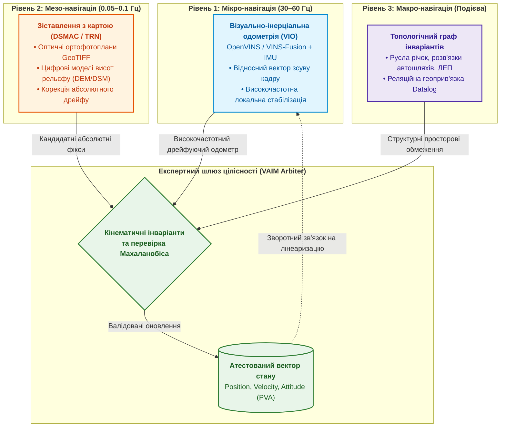
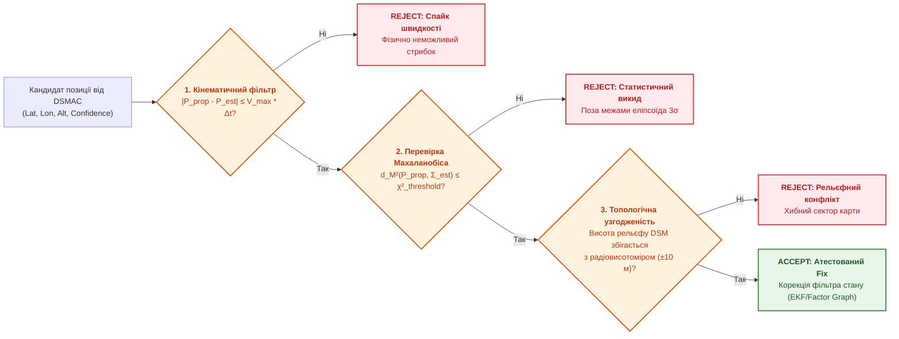
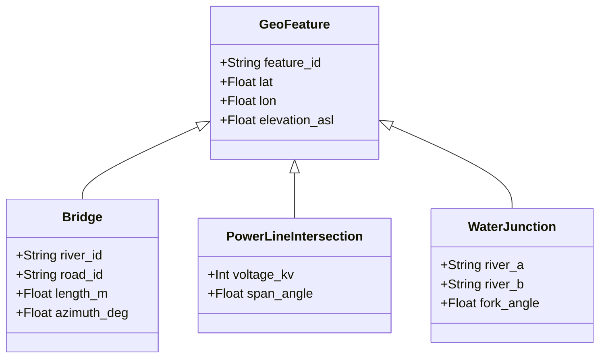
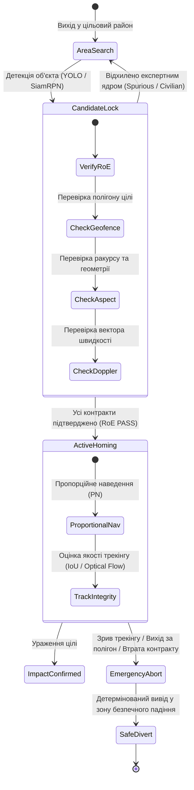
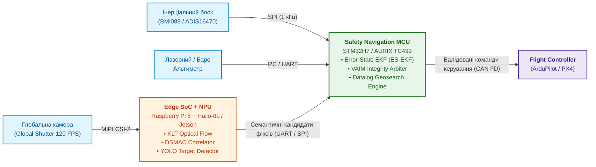

# Додаток В. Автономна навігація без GNSS: геопросторове зіставлення (TRN/DSMAC), візуальна одометрія (VIO) та експертний арбітраж сенсорного злиття

> **Книга:** [Архітектура доказових експертних систем](README.md) · Додатки  
> **Попередній додаток:** [Додаток Б. Практичний посібник: Доказові експертні системи в автономній робототехніці](appendix-b-robotics-and-cyber-physical-systems.md)  
> **Зміст книги:** [README.md](README.md)  
> **Пов'язані глави книги:** [Глава 18. Інфраструктура виконання](ch18-execution-infrastructure.md) · [Глава 21. Від рекомендації до дії](ch21-from-recommendation-to-action.md) · [Глава 22. Кібернетичний контур Edge-to-Backend](ch22-cybernetics-edge-to-backend.md) · [Глава 29. Нейро-символьна архітектура](ch29-neuro-symbolic-architecture.md)  
> **Суміжні дослідження автора:** [Військові експертні системи: БПЛА, ППО, РЕР/РЕБ](../MilTech/DOU-Military-Expert-Systems-UAS-AD-ELINT-EW-UA.md) · [Військова кібернетика](../MilTech/DOU-Ukrainian-Military-Cybernetics-UA.md)  
> **Рівень:** архітектори автономних БПЛА, embedded-інженери, фахівці з комп'ютерного зору та навігації (INS/VIO), розробники критичних MilTech/DefTech комплексів  
> **Призначення:** практичне інженерне керівництво з проєктування бортових систем оптичної та рельєфної автономної навігації, геопросторового пошуку і термінального автонаведення для безпілотних апаратів в умовах тотального придушення/спуфінгу супутникового сигналу (GNSS-Denied) та жорсткого режиму радіомовчання.

---

## 1. Проблема: Чому безпілотники «сліпнуть» і втрачають орієнтацію без GNSS

У сучасних бойових діях та ворожих середовищах використання супутникових систем позиціонування (GPS, GLONASS, Galileo) більше не є гарантією навігації. Засоби радіоелектронної боротьби (РЕБ) створюють зони тотального придушення на сотні кілометрів або здійснюють складний просторово-часовий спуфінг, транслюючи фальшиві координати та підміняючи час. Одночасно режим радіомовчання (*Radio Silence*) унеможливлює корекцію траєкторії оператором через радіолінк.

У такій ізоляції автономний безпілотний літальний апарат (БПЛА) опиняється сам на сам із бортовими сенсорами:



### Фізика накопичення похибок

1. **Дрейф інерціальної системи (INS):** Недорогі тактичні MEMS-датчики мають зміщення нуля (*Bias Drift*). Подвійне інтегрування шуму акселерометра спричиняє зростання похибки положення за квадратичним законом:

   ```math
   \Delta \mathbf{p}(t) \approx \frac{1}{2} \mathbf{b}_a t^2 + \frac{1}{6} \mathbf{b}_g \mathbf{g} t^3
   ```

   де $\mathbf{b}_a$ — дрейф нуля акселерометра, $\mathbf{b}_g$ — дрейф гіроскопа, $\mathbf{g}$ — вектор гравітації. За 20 хвилин автономного польоту дрейф зміщує апарат на $3\dots10\text{ км}$.

2. **Пастка зорових галюцинацій (Perceptual Aliasing):** Спроба коригувати дрейф винятково ймовірнісними нейромережами (наприклад, порівнянням ембедингів поточного кадру із завантаженою супутниковою картою) наштовхується на проблему одноманітних ландшафтів. Нейромережа може з високою впевненістю ($p > 0.95$) «впізнати» лісосмугу або поворот польової дороги, які насправді знаходяться за 20 км праворуч.

> [!CRITICAL]
> **Принцип доказової навігації:**
> Жодне окреме оптичне або висотне зіставлення не може вважатися істиною без проходження через **експертний фільтр цілісності (Visual Autonomous Integrity Monitor — VAIM)**. Тільки детермінована перевірка кінематичних інваріантів та топологічних графів рельєфу дозволяє відсікти спайки комп'ютерного зору.

---

## 2. Трирівнева архітектура навігаційного стека (Hierarchical Nav-Stack)

Для надійного подолання сотень кілометрів без супутників бортовий обчислювач розділяє навігацію на три взаємодоповнюючі часові та просторові рівні:



### 1. Мікро-рівень: Візуально-інерціальна одометрія (VIO)

* **Завдання:** Швидка оцінка швидкості та відносного переміщення $\Delta \mathbf{x}_{k-1 \to k}$ між послідовними кадрами камери.
* **Алгоритми:** Відстеження кутових ознак (FAST/ORB), пірамідальний оптичний потік Лукаса-Канаде (KLT), ковзне вікно оптимізації (*Sliding-Window Bundle Adjustment*) спільно з інтегруванням показань IMU.
* **Властивість:** Нульова затримка, висока частота ($30\dots60\text{ кадрів/с}$), але неминуче повільне накопичення похибки (близько $0.5\dots1\%$ від пройденої дистанції).

### 2. Мезо-рівень: Кореляційне зіставлення з картою (DSMAC / TRN)

* **Завдання:** Періодичне скидання накопиченого дрейфу VIO шляхом знаходження абсолютних координат на цифровій карті місцевості.
* **Алгоритми:**
  * **DSMAC (Digital Scene Matching Area Correlator):** Нормалізована крос-кореляція (NCC) або зіставлення контурних дескрипторів ортофотопланів.
  * **TRN (Terrain Reference Navigation):** Зіставлення профілю висот барометричного/лазерного альтиметра з цифровою моделлю рельєфу (**DEM / DSM — Digital Surface Model**).
* **Частота:** Один раз на $10\dots60\text{ секунд}$ під час прольоту над інформативними ділянками.

### 3. Макро-рівень: Топологічні реляційні інваріанти

* **Завдання:** Глобальна релокалізація у разі повної втрати траєкторії (наприклад, після тривалого прольоту крізь суцільну хмарність).
* **Механізм:** Векторний аналіз взаємного перетину магістралей, водойм, залізниць та берегових ліній за допомогою стратифікованих Datalog-запитів над базою просторових фактів.

---

## 3. Експертна система як фільтр цілісності (Visual RAIM / VAIM)

В авіації давно стандартизовано алгоритм **RAIM (Receiver Autonomous Integrity Monitoring)** для супутникових приймачів. У контурі оптичної навігації ми впроваджуємо його аналог — **Visual Autonomous Integrity Monitor (VAIM)**, реалізований як детермінована експертна система правил.



### Математична формалізація відстані Махаланобіса

Нехай $\hat{\mathbf{x}}_k \in \mathbb{R}^3$ — вектор оцінки координат апарату в момент часу $t_k$, розрахований інерціально-візуальним інтегратором, а $\mathbf{P}_k \in \mathbb{R}^{3 \times 3}$ — відповідна матриця коваріації невизначеності.

Коли підсистема DSMAC пропонує вимірювання $\mathbf{z}_k = (\text{lat}_m, \text{lon}_m, h_m)^T$ із власною коваріацією вимірювання $\mathbf{R}_k$, експертний арбітр обчислює інноваційний залишок $\mathbf{y}_k = \mathbf{z}_k - \mathbf{H}\hat{\mathbf{x}}_k$ та квадрат відстані Махаланобіса $d_M^2$:

```math
d_M^2 = \mathbf{y}_k^T \left( \mathbf{H} \mathbf{P}_k \mathbf{H}^T + \mathbf{R}_k \right)^{-1} \mathbf{y}_k
```

Гіпотеза схвалюється для корекції тільки у випадку виконання предикату:

```math
\text{ValidMeasurement}(\mathbf{z}_k) \iff d_M^2 \le \chi^2_{3, 1-\alpha} \quad \land \quad \left| h_{\text{baro}} - h_{\text{DEM}}(\mathbf{z}_k) - h_{\text{range}} \right| \le \epsilon_{\text{alt}}
```

де $\chi^2_{3, 0.99} \approx 11.34$ — квантиль розподілу хі-квадрат для трьох ступенів свободи з довірчою ймовірністю 99%.

---

## 4. Топологічний геопошук на базі стратифікованого Datalog

Якщо безпілотник вийшов із зони хмарності після 30 хвилин сліпого польоту, невизначеність положення $\mathbf{P}_k$ стає занадто великою для класичного корелятора DSMAC. У цей момент вмикається **топологічний геопошук**.

Бортова база знань містить векторизований граф характерних просторових інваріантів району операцій:



### Формалізація правил ідентифікації орієнтира на Datalog

Комп'ютерний зір виділяє у поточному кадрі перехрестя річки та автомобільної дороги під кутом $60^\circ \pm 10^\circ$, а лазерний висотомір фіксує висоту поверхні $135\text{ м}$:

```prolog
% Бортові правила топологічної релокалізації
candidate_bridge(ID, Lat, Lon) :-
    detected_bridge(VisAngle, VisLen),
    kb_bridge(ID, Lat, Lon, TrueAngle, TrueLen, Elev),
    abs(VisAngle - TrueAngle) < 10,
    abs(VisLen - TrueLen) < 15,
    estimated_position(EstLat, EstLon, MaxRadius),
    geo_distance(EstLat, EstLon, Lat, Lon, Dist),
    Dist < MaxRadius,
    current_altitude_asl(CurAlt),
    abs(CurAlt - Elev) < 25.

% Предикат затвердження позиції
verified_relocalization(Lat, Lon) :-
    candidate_bridge(ID, Lat, Lon),
    % Вимога унікальності: не повинно бути іншого схожого мосту в радіусі пошуку
    not ambiguous_candidate(ID).
```

Цей механізм виключає ризик зіставлення з однотипними об'єктами (*Ambiguity Rejection*), оскільки стратифікований Datalog-рушій автоматично перевіряє унікальність знайденої структури у поточному коваріаційному колі невизначеності.

---

## 5. Контур термінального наведення (Terminal Optical Homing & Engagement Rules)

На фінальному відрізку польоту ударний або розвідувальний дрон переходить у режим виявлення та автозахоплення конкретної цілі (*Optical Target Tracking*).

Саме тут виникає найвищий ризик помилки нейромережі: підміна цілі іншим об'єктом, захоплення цивільної техніки або зрив супроводу на хибну теплову/контрастну пастку.



### Контракти правил застосування (Rules of Engagement — RoE Contracts)

Перед перемиканням автопілота в режим пікірування експертна система перевіряє строгий набір інваріантів:

1. **Контракт цільового геополігону (Strict Target Geofencing):**

   ```math
   \mathbf{P}_{\text{target}} \in \mathcal{P}\text{oly}_{\text{authorized}} \quad \land \quad \mathbf{P}_{\text{target}} \notin \bigcup \mathcal{P}\text{oly}_{\text{no\_strike}}
   ```

2. **Кінематичний контракт пропорційного наведення (Proportional Navigation Invariant):**
   Кутова швидкість лінії візування $\dot{\lambda}$ повинна прагнути до нуля при зближенні:

   ```math
   a_c = N V_c \dot{\lambda} \le A_{\text{max\_g}}
   ```

   Якщо для утримання цілі потрібне перевантаження, що перевищує аеродинамічні ліміти $A_{\text{max\_g}}$, захоплення вважається зірваним.
3. **Контракт оптичної цілісності (Visual Persistence Contract):**
   Якщо оптичний трекер втрачає кореляцію (коефіцієнт $IoU < 0.4$ або різка зміна спектрального дескриптора на $N$ послідовних кадрах), система забороняє «вгадування» точки ураження і миттєво ініціює команду `EmergencyAbort()`.

---

## 6. Апаратно-програмна реалізація бортового навігаційного вузла

Практична побудова такого комплексу вимагає оптимізованого розподілу завдань між спеціалізованими апаратними блоками:



### Формат зберігання бортових геоданих

Щоб укластися у флеш-пам'ять бортового SBC ($32\dots128\text{ ГБ}$), геодані оптимізуються:

* **Тайлова піраміда Cloud-Optimized GeoTIFF (COG):** Базовий шар розрізнення 5 м/піксель для всього маршруту; цільові райони деталізуються до 0.3 м/піксель.
* **Стислі карти градієнтів (Edge Gradients):** Збереження лише контурних карт перепаду яскравості, що зменшує обсяг у 8–10 разів та усуває чутливість до зміни денного освітлення.
* **Векторні шари інваріантів у FlatBuffers / SQLite (SpatiaLite):** Миттєвий доступ до просторових об'єктів без десеріалізаційного навантаження на CPU.

---

## 7. Повний робочий код навігаційного арбітра (Go)

Нижче наведено практичну реалізацію ядра експертного навігаційного арбітра на мові Go, що інтегрує перевірку Махаланобіса, висотний допуск рельєфу та кінематичні обмеження:

```go
package navigation

import (
	"errors"
	"fmt"
	"math"
)

// Position3D описує точку в системі координат NED (North-East-Down) або WGS84
type Position3D struct {
	North float64 // метри
	East  float64 // метри
	Down  float64 // метри (від'ємна висота)
}

// NavState представляє поточний оцінений стан фільтра навігації
type NavState struct {
	Pos       Position3D
	Vel       Position3D
	Covariance [3][3]float64 // Коваріаційна матриця позиції (N, E, D)
	Timestamp float64        // Секунди від старту
}

// VisualFixProposal представляє гіпотезу позиції від підсистеми комп'ютерного зору (DSMAC/TRN)
type VisualFixProposal struct {
	Pos         Position3D
	MeasureCov  [3][3]float64 // Коваріація вимірювання
	Confidence  float64       // Впевненість нейромережі (0.0 .. 1.0)
	DemAltitude float64       // Очікувана висота рельєфу за моделлю DEM
	Timestamp   float64
}

// VAIMConfig параметри експертного шлюзу цілісності
type VAIMConfig struct {
	MaxVelocityThreshold float64 // Максимальна фізична швидкість апарата (м/с)
	MahalanobisChi2Limit float64 // Порогове значення Хі-квадрат (наприклад, 11.34 для 3 DOF, p=0.01)
	MaxAltDiscrepancy    float64 // Допустима розбіжність із висотоміром/DEM (метри)
	MinConfidenceLimit   float64 // Мінімальний довірений поріг нейромережі
}

// NavigationIntegrityArbiter здійснює експертну валідацію візуальних фіксів
type NavigationIntegrityArbiter struct {
	config VAIMConfig
}

// NewNavigationIntegrityArbiter створює екземпляр арбітра
func NewNavigationIntegrityArbiter(cfg VAIMConfig) *NavigationIntegrityArbiter {
	return &NavigationIntegrityArbiter{config: cfg}
}

// ValidateVisualFix перевіряє пропозицію оптичного вимірювання за формальними інваріантами
func (a *NavigationIntegrityArbiter) ValidateVisualFix(
	current NavState,
	proposal VisualFixProposal,
	radarAltitude float64,
) (bool, string, error) {

	// 1. Предикат мінімальної впевненості моделі сприйняття
	if proposal.Confidence < a.config.MinConfidenceLimit {
		return false, "REJECT_LOW_CONFIDENCE", fmt.Errorf("confidence %.2f below threshold %.2f", proposal.Confidence, a.config.MinConfidenceLimit)
	}

	dt := proposal.Timestamp - current.Timestamp
	if dt <= 0 {
		return false, "REJECT_INVALID_TIMESTAMP", errors.New("stale or future measurement timestamp")
	}

	// 2. Кінематичний інваріант допустимої швидкості зміщення
	dx := proposal.Pos.North - current.Pos.North
	dy := proposal.Pos.East - current.Pos.East
	dist2D := math.Hypot(dx, dy)
	impliedSpeed := dist2D / dt

	if impliedSpeed > a.config.MaxVelocityThreshold {
		return false, "REJECT_KINEMATIC_VIOLATION", fmt.Sprintf(
			"implied speed %.1f m/s exceeds max vehicle velocity %.1f m/s",
			impliedSpeed, a.config.MaxVelocityThreshold,
		), nil
	}

	// 3. Топологічний інваріант висоти рельєфу (DEM vs Baro vs RangeFinder)
	// Поточна абсолютна барометрична висота повинна збігатися з: Висота DEM + Висотомір
	currentAlt := -current.Pos.Down
	expectedBaroAlt := proposal.DemAltitude + radarAltitude
	altDiff := math.Abs(currentAlt - expectedBaroAlt)

	if altDiff > a.config.MaxAltDiscrepancy {
		return false, "REJECT_TERRAIN_CONFLICT", fmt.Sprintf(
			"altitude discrepancy %.1f m exceeds limit %.1f m",
			altDiff, a.config.MaxAltDiscrepancy,
		), nil
	}

	// 4. Статистичний інваріант: Відстань Махаланобіса
	dM2, err := a.calculateMahalanobisDistance(current, proposal)
	if err != nil {
		return false, "REJECT_MATH_ERROR", err.Error(), err
	}

	if dM2 > a.config.MahalanobisChi2Limit {
		return false, "REJECT_MAHALANOBIS_OUTLIER", fmt.Sprintf(
			"mahalanobis dM2=%.2f exceeds chi2 limit %.2f",
			dM2, a.config.MahalanobisChi2Limit,
		), nil
	}

	// Усі доказові контракти виконані — фікс атестовано для корекції
	return true, "ACCEPT_VERIFIED_FIX", "All safety invariants satisfied", nil
}

// calculateMahalanobisDistance розраховує dM² для 2D вектора позиції (North, East)
func (a *NavigationIntegrityArbiter) calculateMahalanobisDistance(state NavState, prop VisualFixProposal) (float64, error) {
	// Інновація (залишок)
	dyN := prop.Pos.North - state.Pos.North
	dyE := prop.Pos.East - state.Pos.East

	// Сумарна коваріація S = P + R (спрощено для 2D)
	s00 := state.Covariance[0][0] + prop.MeasureCov[0][0]
	s01 := state.Covariance[0][1] + prop.MeasureCov[0][1]
	s10 := state.Covariance[1][0] + prop.MeasureCov[1][0]
	s11 := state.Covariance[1][1] + prop.MeasureCov[1][1]

	// Визначник матриці 2x2
	det := s00*s11 - s01*s10
	if math.Abs(det) < 1e-9 {
		return 0, errors.New("singular covariance matrix in Mahalanobis calculation")
	}

	// Обернена матриця S⁻¹
	inv00 := s11 / det
	inv01 := -s01 / det
	inv10 := -s10 / det
	inv11 := s00 / det

	// dM² = [dyN, dyE] * S⁻¹ * [dyN, dyE]^T
	dM2 := dyN*(inv00*dyN+inv01*dyE) + dyE*(inv10*dyN+inv11*dyE)
	return dM2, nil
}
```

---

## 8. Чекліст підготовки навігаційного комплексу до польоту в режимі радіомовчання

Перед завантаженням польотного завдання та стартом місії інженерна група зобов'язана провести валідацію навігаційного бандлу:

| № | Перевірка цілісності | Механізм контролю | Статус |
| :-: | :--- | :--- | :-: |
| 1 | **Покриття тайлами GeoTIFF** | Векторний маршрут на 100% покритий ортофотопланами з бічним буфером $\ge 5\text{ км}$ | [ ] |
| 2 | **Актуальність карт висот (DEM)** | Модель рельєфу SRTM/Copernicus валідована за контрольними геодезичними точками | [ ] |
| 3 | **Калібрування камери (Intrinsics/Extrinsics)** | Матриця дисторсії та просторове зміщення камери відносно IMU зафіксовані з похибкою $< 1\text{ мм}$ | [ ] |
| 4 | **Апаратний глобальний затвор** | Камера працює в режимі Global Shutter, виключаючи артефакти Rolling Shutter при вібраціях | [ ] |
| 5 | **Контракт заборонених зон (No-Strike)** | Усі цивільні та нейтральні об'єкти внесені у підписаний бінарний полігон заборони ураження | [ ] |
| 6 | **Ліміти Махаланобіса** | Встановлено поріг бракування спайків $\chi^2_{3} \le 11.34$ ($p=0.01$) | [ ] |
| 7 | **Failsafe на випадок втрати цілі** | Налаштовано алгоритм виходу в безпечний сектор утилізації у разі зриву термінального супроводу | [ ] |
| 8 | **Стійкість до відблисків/хмар** | Протестовано сценарій переходу в чистий Dead Reckoning при перекритті об'єктива на 10 хвилин | [ ] |
| 9 | **Підпис навігаційного маніфесту** | Польотне завдання, тайли карт та уставки правил підписані ключем розробника (Ed25519) | [ ] |

---

## 9. Резюме

Поєднання високоефективних нейромережевих прискорювачів (NPU) та детермінованих експертних систем правил створює надійний фундамент для автономних систем нового покоління.

Нейромережі беруть він себе важку ймовірнісну роботу з розпізнавання образів та оптичного потоку (System 1), тоді як символьне експертне ядро (System 2) забезпечує безапеляційний арбітраж цілісності, захищаючи платформу від галюцинацій, візуального обману та накопичення інерціального дрейфу у найбільш ворожих умовах радіоелектронного придушення.

---

## 10. Рекомендовані першоджерела та стандарти

- RTCA. [DO-311: Minimum Operational Performance Standards for Airborne GNSS / Optical Hybrid Systems](https://www.rtca.org/standards/), 2008.
- Kevin Leahy et al. [Visual-Inertial Navigation Systems in GNSS-Denied Environments: A Review of VIO and Factor Graph Architectures](https://doi.org/10.1109/JPROC.2020.2985678), *IEEE Proceedings*, 2020.
- Geneva P. et al. [OpenVINS: A Research Platform for Visual-Inertial Navigation](https://openvins.github.io/), *IEEE ICRA*, 2020.
- United Unmanned Systems & DOD Solution. [AURA AI: Edge-Computed Autonomous Optical Navigation and Target Engagement in Contested Environments](https://dou.ua/lenta/news/dod-solution-and-uus-partnership/), 2024.
- NATO STANAG 4586. [Standard Interfaces of UAV Control System (UCS) for NATO UAV Interoperability](https://standards.globalspec.com/std/14299557/STANAG%204586), Edition 4, 2017.
- Golden, J. P. [Terrain Contour Matching (TERCOM) and Digital Scene Matching Area Correlator (DSMAC) Applications in Guided Missiles](https://doi.org/10.1117/12.956897), *SPIE Proceedings*, 1980.
- Petro Sidliarchuk. [Hardware Root of Trust and Evidence-Signed Measurement Layers in Embedded Networks](http://github.com/sidliarchukpetro), InfraVeritas LLC, 2024.

---

[← Додаток Б](appendix-b-robotics-and-cyber-physical-systems.md) · [Зміст книги](README.md) · [Про автора →](about-the-author.md)
