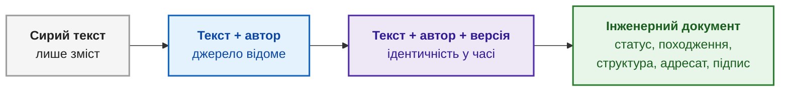
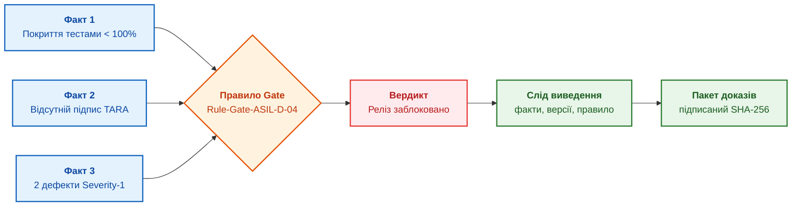
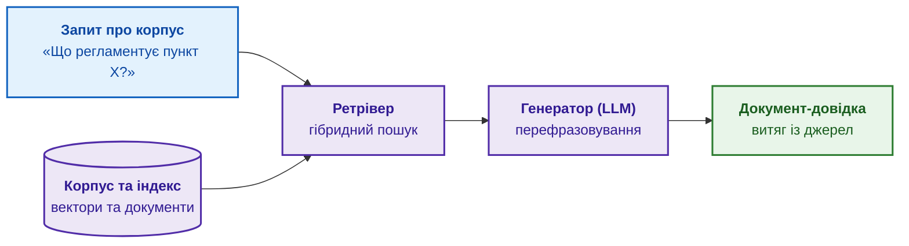
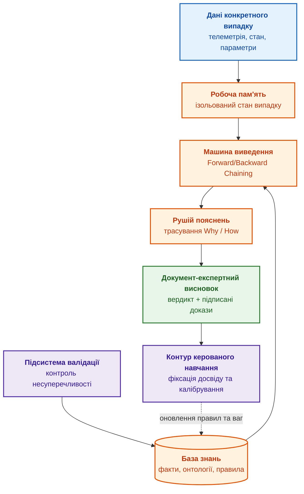
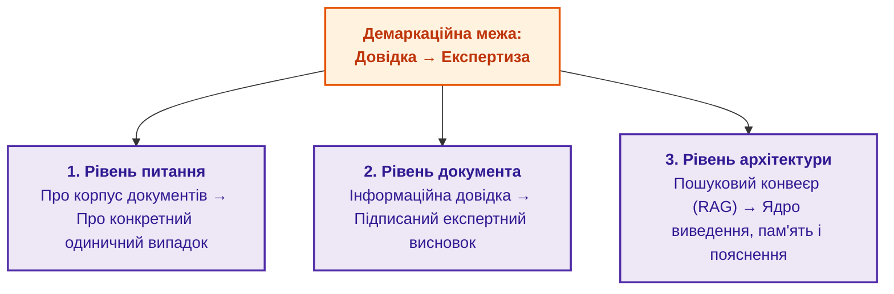

# Глава 3. Експертна система — це більше, ніж інформаційно-довідкова система

> **Книга:** [Архітектура доказових експертних систем](README.md) · [Частина I: Концептуальний та епістемічний фундамент](part-01-foundations.md)  
> **Попередня глава:** [Глава 2. Філософія для інженера: що машина має право називати знанням](ch02-epistemology-of-machine-knowledge.md)  
> **Наступна глава:** [Глава 4. Еволюція експертних систем: від теореми Байєса до доказових рішень ШІ](ch04-evolution-from-bayes-to-evidence-ai.md)  
> **Зміст книги:** [README.md](README.md)  
> **Рівень:** впевнений інженерний (middle / senior)  
> **Очікувані результати:** чітко розмежовувати пошук у корпусі, генеративне перефразовування та дедуктивний висновок для конкретного випадку; ідентифікувати компоненти експертного ядра (робоча пам'ять, машина виведення, рушій пояснень); розуміти різницю між документом-довідкою та підписаним пакетом експертного висновку.

Попередні глави заклали велику картину: навіщо R&D потрібні експертні системи ([Глава 1](ch01-introduction-to-expert-systems.md)) та чому доказ і епістемічний контракт важливіші за гладку правдоподібну відповідь ([Глава 2](ch02-epistemology-of-machine-knowledge.md)). У наступних частинах ми дослідимо математику висновків ([Глава 6](ch06-applied-mathematics-for-expert-systems.md)), інструментальний стек ([Глава 17](ch17-implementation-stack.md)), архітектуру компонентів ([Глава 16](ch16-expert-systems-architecture.md)) та апаратну інфраструктуру ([Глава 18](ch18-execution-infrastructure.md)).

Мій погляд на цю тему спирається на тривалу інженерну практику: Linux-системи, телеком, інформаційну безпеку, системи електронної звітності, захищені електронні документи, цифрові сертифікати, підпис і шифрування, керування постачанням, automotive firmware, процеси ASPICE, нормативний контекст ISO 26262/ISO 21434, трасування вимог і пакети доказів. Для мене «відповідь системи» ніколи не є просто текстом на екрані. У контрольованому інжинірингу кожна відповідь зобов'язана мати джерело, версію, відповідального власника, аудиторський слід і практичний наслідок для ухвалення рішень.

Часто першим кроком здається найпростіший шлях: узяти папку з технічною документацією, запустити над нею пошукову утиліту чи векторну базу з LLM (RAG), які «вивчають» файли та відповідають на запитання. Виникає ілюзія, що готова «експертна система». У цій главі ми детально розберемо, чому цього абсолютно замало. Описане рішення є **інформаційно-довідковою системою**, і між нею та справжньою експертною системою проходить фундаментальна інженерна межа.

Ми проведемо цю демаркаційну лінію на трьох рівнях:

1. **Рівень питання:** пошук за корпусом проти вердикту для конкретного випадку.
2. **Рівень артефакту:** документ-довідка проти документа-експертного висновку.
3. **Рівень архітектури:** прямий пошуковий конвеєр проти циклу виведення з робочою пам'яттю, поясненням і верифікацією.

Спершу зафіксуймо понятійний апарат, щоб уникнути змішування інтерфейсу, функціонального призначення та внутрішньої обчислювальної архітектури.

| Клас системи | Головне призначення | Що повертає | Чого для нього недостатньо |
|---|---|---|---|
| **Інформаційно-довідкова** | знайти та структуровано подати відоме про корпус | витяг, посилання, переказ джерел | пошук не здатний синтезувати висновок про конкретний випадок |
| **Консультаційна** | вести діалог, пояснити альтернативи, зібрати дані для фахівця | порада, запит на уточнення, сценарій дій | діалоговий інтерфейс сам по собі не створює верифікованого виводу |
| **Підтримка рішень (DSS)** | допомогти людині порівняти варіанти та оцінити наслідки | ранжування, прогноз, сценарій, рекомендація | рекомендація часто спирається на статистику, але не має формального логічного доведення |
| **Експертна** | застосувати кодифіковані знання до фактів конкретного випадку | виведений висновок або обґрунтована відмова, факти, правила і докази | текст, пошуковий рейтинг або прогноз без відтворюваного доведення не є експертним висновком |

Ці класи систем можуть перетинатися на практиці. Консультаційна система описує інтерфейсний шар взаємодії, тому вона може стояти над довідковою базою, аналітичним дашбордом або експертною системою. Система підтримки рішень описує бізнес-призначення: експертна система в дорадчому режимі є її окремим, найбільш суворо формалізованим підвидом. Водночас не кожна система підтримки рішень є експертною: оптимізатори, моделі прогнозування чи системи статистичного скорингу корисні самі по собі, але функціонують без бази продукційних правил, робочої пам'яті конкретного випадку та доказового ланцюга висновків.

Крім того, зріла експертна система має ключову динамічну відмінність: вона не може залишатися замороженою після релізу. Застарівають нормативні акти, оновлюються версії компонентів, виправляються помилки в базах знань. Тому експертна система вимагає **періодичного керованого навчання та донавчання**, де кожне оновлення бази фактів чи правил супроводжується регресійним тестуванням і збереженням повного аудиторського журналу змін.

---

## Довідка відповідає про корпус, експертиза — про конкретний випадок

Фундаментальна різниця полягає у фокусі та механізмі генерації відповіді:

* **Інформаційно-довідкова система** відповідає на питання **про корпус знань**: «Що написано в стандарті про максимальну температуру силового модуля?», «Де описані вимоги до ізоляції?». Її відповідь — це знайдений або перефразований фрагмент тексту. Навіть коли поверх індексу встановлена сучасна нейромережа, яка гладко переказує джерела, сутність залишається незмінною: це **пошук плюс виклад**. Система повертає те, що вже буквально існує в сховищі.
* **Експертна система** відповідає на питання **про конкретний одиничний випадок**: «Чи дозволено проводити стендовий тест вузла X за температури 95 °C у такій конфігурації?», «Що робити в разі спрацювання захисту Y?». Відповідь є новим синтезованим судженням, якого **немає дослівно в жодному документі**. Це судження виведене правилами з поточних фактів ситуації, із чітким поясненням, яке саме правило спрацювало та які передумови його активували.

Корпус є загальним і статичним; випадок — конкретним, динамічним і унікальним. Пошуковий механізм піднімає загальний нормативний контекст, але неспроможний побудувати місток до поточної аварійної ситуації чи конкретного стенда. Цей місток будує машина виведення.

> **Тест на клас системи:**  
> Якщо на будь-яке запитання відповідь завжди зводиться до форми: «Ось що про це сказано в джерелах», перед нами інформаційно-довідкова система.  
> Якщо система здатна згенерувати вердикт виду: «Для випадку C операцію заборонено за правилом R на підставі фактів F1 та F2 із посиланням на версію стандарту S; ось ланцюг доведення», це повноцінна експертна система.

---

## Де тут відкриті онлайн-моделі (LLM)

Широковідомі відкриті та хмарні мовні моделі (ChatGPT, Claude, Gemini) нерідко помилково називають то довідковими, то експертними системами. Проте універсальна генеративна модель сама по собі не є закінченою системою: це **архітектурний компонент**.

* **Генератор тексту з параметричної пам'яті:** модель генерує правдоподібні послідовності токенів на основі ваг нейронної мережі, натренованої на колосальному відкритому масиві даних. Її «знання» розмиті у вагах матриць, а не зафіксовані у верифікованих джерелах.
* **Не є довідковою системою про проєкт:** вона не знає внутрішнього корпусу вашої компанії. На запитання «Де це регламентовано в нашій документації?» вона запропонує стилістично впевнений, але потенційно вигаданий (галюцинований) переказ.
* **Не є експертною системою:** її текст часто має вигляд авторитетного вердикту, але за ним немає робочої пам'яті випадку, немає дискретного ланцюга «факт → правило → висновок», немає верифікованого походження фактів і немає персональної відповідальності за результат.

Клас інформаційної системи визначається не використовуваною нейромережею, а повною архітектурою, у яку її інтегровано:

1. **LLM + семантичний пошук по контрольованому сховищу (RAG)** формує сучасну **інформаційно-довідкову систему**: тепер відповіді мають посилання на документи компанії.
2. **LLM + символьна база правил + машина виведення + робоча пам'ять + рушій пояснень** рухає розробку до **нейро-символьної експертної системи** ([Глава 29](ch29-neuro-symbolic-architecture.md)), де модель відіграє роль лінгвістичного транслятора, а не арбітра істини.

Крім того, використання відкритих хмарних LLM в інженерному R&D часто обмежене політикою безпеки: щоб отримати висновок щодо критичного дефекту, параметри цього дефекту доводиться передавати зовнішньому провайдеру, що неприпустимо для конфіденційних розробок. У таких умовах доказовий контур розгортається локально ([Глава 18](ch18-execution-infrastructure.md)).

---

## Що робить інженерний артефакт документом

Перш ніж порівнювати вихідні артефакти довідкових та експертних систем, важливо простежити градацію перетворення довільного тексту на офіційний документ. Кожен відсутній атрибут знижує статус артефакту та унеможливлює його використання в доказовому аудиті:

1. **Сирий текст:** наявний лише зміст. Невідомо, хто його створив, коли, для кого та чи є він чинним. Такий фрагмент неможливо валідувати чи долучити до звіту.
2. **Текст + автор:** джерело відоме, але за відсутності дати неможливо встановити актуальність, а за відсутності ревізії — фінальність формулювання.
3. **Текст + автор + дата й версія:** з'являється часова ідентичність; можна однозначно співвіднести цитату з конкретним релізом.
4. **Повноцінний інженерний документ:** артефакт, що містить повний набір метаданих:
   * **Ідентифікатор:** стабільний URI або інвентарний номер.
   * **Авторство та відповідальний власник:** хто сформував документ і хто несе інженерну відповідальність.
   * **Статус життєвого циклу:** чернетка (Draft), на рецензії (In Review), затверджено (Approved), відкликано (Deprecated).
   * **Походження (Provenance):** джерела вхідних даних та обчислювальний ланцюг обробки.
   * **Структура:** строго типізовані розділи, поля та предикати, придатні для машинної інтерпретації.
   * **Призначення та адресат:** визначений контур застосування та рівень доступу.



У системах юридично значущого документообігу та електронної звітності діє непорушне правило: **завірений електронний документ** має юридичну силу лише за наявності кваліфікованого електронного підпису (КЕП/ЕЦП), перевіреного через ланцюжок чинних сертифікатів.

У контексті доказового ШІ справедливий точний аналог: висновок експертної системи не набуває технічної ваги від того, що він бездоганно сформульований. Він стає доказовим лише тоді, коли нерозривно пов'язаний із криптографічно підписаним слідом свого виведення.

---

## Документ-довідка проти документа-експертного висновку

Різниця між двома класами систем безпосередньо матеріалізується у вихідних артефактах, які вони генерують:

### 1. Документ-довідка

Документ-довідка переказує наявні знання: витяг із державного стандарту, паспорта безпеки (MSDS), даташиту на транзистор або інструкції з калібрування.

* **Критерій істинності:** вірність першоджерелу (точність цитування).
* **Слід:** посилання на розділ або сторінку документа.
* **Новизна:** відсутня; довідка відтворює лише те, що вже зафіксовано в корпусі.
* **Відповідальність:** укладач довідки відповідає лише за коректність реферування, але не за наслідки застосування вимоги на практиці.

### 2. Документ-експертний висновок

Документ-експертний висновок — це синтезоване судження щодо конкретного прецеденту (оцінка безпеки електронного вузла, вердикт щодо готовності прошивки до випробувань, локалізація дефекту).

* **Критерій істинності:** коректність дедуктивного виведення з вхідних фактів за затвердженими правилами.
* **Слід:** повний граф «факт → правило → проміжний факт → вердикт» із фіксацією версій та походження.
* **Новизна:** містить твердження, якого немає в жодному вихідному документі.
* **Невизначеність:** містить явно вказану область застосовності, допущення та оцінку достовірності.
* **Відповідальність:** містить підпис експерта або авторизований цифровий сертифікат системи.

| Вимір аналізу | Документ-довідка | Документ-експертний висновок |
|---|---|---|
| **Природа артефакту** | Переказ відомого знання | Виведене нове судження про ситуацію |
| **Критерій істинності** | Відповідність тексту оригіналу | Валідність логічного виводу з фактів |
| **Семантична новизна** | Нульова (компіляція відомого) | Висока (синтезований вердикт) |
| **Аудиторський слід** | Перелік посилань на джерела | Формальний ланцюг виведення (Proof Trace) |
| **Оцінка меж** | Не потрібна (зафіксована в джерелі) | Явні граничні умови, припущення, статус |
| **Юридична вага** | Довідкова інформація | Доказовий документ для сертифікації/аудиту |

---

## Сходинки доказовості: від витягу до експертного вердикту

Між простим копіюванням рядка з файлу та комплексним експертним висновком лежить спектр із чотирьох якісних сходинок:

1. **Витяг:** буквальний фрагмент джерела без жодних змін (наприклад, точна цитата пункту регламенту).
2. **Довідка:** структурована компіляція фрагментів кількох джерел (зведена таблиця параметрів, тематичний конспект). Нового знання ще не виникло.
3. **Не-експертний висновок:** твердження, що звучить як відповідь на запитання, але **не підкріплене формальним ланцюгом фактів і правил** (типовий вихід сирої LLM: «Схоже, цей компонент підійде для вашої схеми»). Такий висновок неможливо верифікувати.
4. **Експертний висновок:** судження про випадок, підкріплене нерозривним доказовим слідом «факт + правило = висновок», походженням кожної передумови та електронним підписом пакета доказів.


### Практичний приклад: рішення про випуск прошивки (Release Gate)

Уявімо критичний момент у розробці автомобільної системи: ухвалення рішення про допуск нової ревізії прошивки до випробувального треку.

* **Інформаційно-довідкова система** знайде: чекліст релізу, звіт тестувальників, нотатки з кібербезпеки та посилання на стандарт ISO 26262.
* **Не-експертна система (чат-бот)** підсумує: «Більшість тестів успішні, прошивка виглядає готовою до тестування».
* **Експертна система** сформує верифікований вердикт:
  > **Рішення:** Реліз прошивки v2.4.1 заблоковано для передачі на контрольний гейт.  
  > **Підстави (факти):**  
  > 1. Покриття MC/DC становить 94.2% при регламентному мінімумі 100% для ASIL D (Стандарт безпеки, розділ 8.4).  
  > 2. Звіт статичного аналізу коду містить 2 відкриті дефекти класу Severity-1 (Журнал аналізатора від 2026-09-26, commit `a1f9c8`).  
  > 3. Документ аналізу загроз (TARA) не підписаний офіцером безпеки.  
  > **Активоване правило:** `Rule-Gate-ASIL-D-04` забороняє перехід на етап інтеграційного тесту за наявності відкритих блокуючих умов.  
  > **Хеш пакета доказів:** `sha256:8b4a7...`



Такий висновок дозволяє вести аргументований інженерний діалог: можна оскаржити конкретний факт (наприклад, довести, що дефект є false-positive і закритий документально) або оновити правило через офіційний процес управління змінами. З не-експертним «схоже, все гаразд» сперечатися неможливо, бо під ним немає обчислювального фундаменту.

---

## Архітектурний розрив: три машини пошуку проти символьного ядра

Відмінність між довідкою та експертизою є структурною та визначає склад апаратних і програмних компонентів:

### Архітектура інформаційно-довідкової системи (RAG)

Довідкова система побудована як лінійний конвеєр обробки з трьох компонентів:

1. **Індекс:** повнотекстовий або векторний індекс технічного корпусу.
2. **Ретрівер:** компонент вилучення найбільш релевантних чанків за косинусною відстанню чи BM25.
3. **Генератор:** мовна модель, яка переказує знайдені шматки людино-зрозумілою мовою.



### Архітектура експертної системи

Експертна система спирається на принципово ширший комплекс компонентів:



Компоненти ядра, відсутні в звичайному RAG:

* **База знань (Knowledge Base):** структуроване представлення онтологій, деонтичних вимог, математичних інваріантів та продукційних правил, відокремлене від тексту.
* **Машина виведення (Inference Engine):** детермінований алгоритм (на базі Rete, SLD-резолюції чи Datalog), що застосовує правила до фактів.
* **Робоча пам'ять (Working Memory):** динамічний стан аналізованого випадку, ізольований від глобальної пам'яті.
* **Рушій пояснень (Explanation Engine):** модуль, який генерує строге математичне доведення кроків.
* **Підсистема валідації та контролю несуперечливості:** автоматична перевірка правил на відсутність логічних тупиків, конфліктів та циклів.
* **Контур керованого навчання:** механізм оновлення знань на основі реального досвіду.

Якщо з експертної системи вилучити машину виведення, робочу пам'ять та рушій пояснень — вона деградує до рівня звичайної довідкової системи.

---

## Зведена матриця технологічних відмінностей

Щоб отримати наочне зіставлення можливостей, зведемо основні класи систем у порівняльну матрицю:

* `✓` — присутнє як строго кодифікований детермінований механізм.
* `~` — присутнє частково, у неявному вигляді або як неперевірювані дані.
* `—` — відсутнє за визначенням архітектури.

| Характеристика | Пошук / СКБД | Довідкова (RAG) | Підтримка рішень (DSS) | Генеративна LLM | Експертна система |
|---|---|---|---|---|---|
| **Головна роль** | Знайти збережений запис | Знайти й переказати джерела | Допомогти людині обрати дію | Згенерувати текст за шаблоном | Синтезувати доведений вердикт |
| **Явні правила виведення** | — | — | ~ опціонально | — приховані у вагах | ✓ ядро системи |
| **Машинні моделі (ML/SLM)** | ~ ранжування | ✓ ембеддери, LLM | ✓ прогноз, оптимізація | ✓ сама модель | ✓ як мовний/ймовірнісний компонент |
| **Структуровані об'єкти знань** | ~ рядки таблиць | ~ текстові чанки | ~ фактори оцінки | — неструктуровані | ✓ типізовані онтології та факти |
| **Кодифікація стандартів** | ~ файл у базі | ~ індексований текст | ~ фактори оцінки | ~ у навчальній вибірці | ✓ перевірювані предикати й інваріанти |
| **Рушій пояснень (Explainability)** | — | ~ цитування джерела | ~ аналіз чутливості | — імітація пояснення | ✓ покроковий Proof Trace |
| **Аудит і походження (Provenance)** | ~ системний лог | ~ перелік цитат | ~ звіт про розрахунок | — відсутнє | ✓ W3C PROV-O на кожну передумову |
| **Робоча пам'ять прецеденту** | — | — | ~ змінні сесії | ~ контекстне вікно | ✓ ізольований стан об'єкта |
| **Машина логічного виведення** | — | — | ~ рідко (рушій правил) | — | ✓ детермінований алгоритм |
| **Калібрована достовірність** | — | — | ✓ математичний скоринг | ~ некалібрований softmax | ✓ калібрована оцінка ризику |
| **Життєвий цикл знань** | CRUD записів | переіндексація корпусу | переналаштування моделі | донавчання ваг | ✓ регресійний аудит та іспит бази знань |
| **Вихідний артефакт** | Набір записів | Документ-довідка | Аналітичний звіт / прогноз | Текст у чаті | Завірений експертний висновок |

Матриця наочно підтверджує: експертна система не просто має «кращу якість генерації». Вона реалізує цілісний клас вимог до детермінізму, аудиту та формального виведення, яких інші системи не містять на рівні своєї архітектури.

---

## Контур керованого навчання та адаптації знань

Експертна система не має права безконтрольно модифікувати власні правила після кожної сесії. Спроби автоматичного «самонавчання на льоту» у критичних доменах гарантовано призводять до деградації бази знань, закріплення випадкових помилок та руйнування відтворюваності.

Справжнє інженерне самонавчання експертної системи є **строго керованим процесом**:


### Формальний критерій допуску ревізії знань

Кандидат на зміну знань допускається до промислової експлуатації лише тоді, коли на зафіксованому еталонному наборі ситуацій (Golden Benchmark Set) він забезпечує статистично значуще покращення точності, повністю виключає критичні регресії та отримує електронний підпис уповноваженого аудитора:

```math
\mathrm{accept}(v_{new}) =
\left[Q(v_{new}) - Q(v_{old}) \ge \delta\right]
\land \left[F_{critical}(v_{new}) = 0\right]
\land \left[\mathrm{approved}(v_{new}) = 1\right].
```

Де:

* $Q$ — комплексна метрика якості висновків (наприклад, повнота виявлення порушень норм).
* $\delta$ — мінімальний встановлений поріг покращення.
* $F_{critical}$ — кількість критичних відмов і регресійних збоїв на золотому наборі тестів.
* $\mathrm{approved}$ — булевий статус успішного проходження верифікаційного шлюзу відповідальним інженером.

### Матеріали для навчання системи в інженерному R&D

В інженерних проєктах матеріалом для оновлення знань виступають структуровані інженерні артефакти ([Глава 8](ch08-engineering-artifacts-as-data.md)), а не випадкові інтернет-тексти:

1. **Нормативи та специфікації:** зміни в міжнародних стандартах або вимогах замовника.
2. **Результати апаратних тестів:** вимірювання на тестових стендах, кліматичні випробування, температурні карти.
3. **Дані виробничого контролю:** дефекти монтажу плат, статистика відбракування компонентів.
4. **Інциденти та дефекти:** аналіз першопричин збоїв (RCA), зареєстрованих під час випробувань.
5. **Рішення провідних інженерів:** протоколи рецензування архітектури, підтверджені прецеденти (CBR).

---

## Калібрування експертної системи: чи можна довіряти її впевненості

В експертній системі оцінка впевненості — це не декоративне число. Якщо система стверджує, що певний висновок має достовірність 90%, це означає, що у 100 подібних ситуаціях вона зобов'язана бути правою приблизно у 90 випадках. Якщо ж на практиці вона помиляється в третині таких кейсів — система **некалібрована**, а її оцінки дезінформують інженера.

Для числового контролю каліброваності діапазон упевненості розбивається на $M$ інтервалів (кошиків) $B_m$, і обчислюється очікувана похибка калібрування (**Expected Calibration Error, ECE**):

```math
\mathrm{ECE} = \sum_{m=1}^{M}\frac{|B_m|}{n}
\left|\mathrm{acc}(B_m)-\mathrm{conf}(B_m)\right|,
\quad
\mathrm{acc}(B_m)=\frac{1}{|B_m|}\sum_{i\in B_m}\mathbf{1}[\hat y_i=y_i].
```

Де:

* $n$ — загальна кількість контрольних верифікованих ситуацій.
* $\mathrm{conf}(B_m)$ — середня заявлена впевненість системи в кошику $B_m$.
* $\mathrm{acc}(B_m)$ — реальна емпірична точність відповідей системи в цьому ж кошику.

Чим ближче значення ECE до 0, тим чесніше система оцінює межі власної компетентності та тим надійнішою є підстава для автоматичного ухвалення рішень.

---

## Спектр автономності: від дорадчого висновку до дії

У більшості застосувань експертна система працює у форматі **Human-in-the-Loop** («система обґрунтовує — людина затверджує»). Проте в реальних виробничих середовищах частину рутинних і критичних операцій необхідно делегувати машині:

* Автоматичне блокування розгортання коду у разі непроходження тестів безпеки.
* Аварійна зупинка високовольтного стенда в разі виходу температури за межі допуску.
* Автоматична маршрутизація та класифікація інцидентів у трекері дефектів.

Рівень автономності системи підпорядковується суворому правилу: **делегувати можна дію, але не можна делегувати доказовість**. Що вищим є ступінь автономії машинного агента, то суворішими мають бути вимоги до цілісності аудиторського сліду, наявності аварійного вимикача (Kill Switch) та персональної відповідальності власника алгоритму ([Глава 21](ch21-from-recommendation-to-action.md)).

---

## Висновок

Простий запуск утиліти семантичного пошуку чи чат-бота над технічною документацією створює корисну **інформаційно-довідкову систему**, але не робить її експертною.

Різниця між цими класами проходить на трьох взаємопов'язаних рівнях:



**Експертиза починається тоді**, коли система припиняє бути пасивним ретранслятором чужих слів і починає **синтезувати нові доведені судження про поточну інженерну ситуацію**, підкріплюючи кожен свій крок нерозривним аудиторським ланцюгом перевірених фактів.

У наступній главі ми дослідимо історичну еволюцію цього підходу: як інженерія рішень пройшла шлях від класичної формули Байєса до сучасного доказового ШІ ([Глава 4. Еволюція експертних систем: від теореми Байєса до доказових рішень ШІ](ch04-evolution-from-bayes-to-evidence-ai.md)).

---

## Питання до читачів

1. Чи траплялися у вашій практиці випадки, коли гарно скомпільовану текстову довідку від чат-бота сприйняли за перевірений експертний висновок, що призвело до технічної помилки?
2. Які критичні рішення у вашому процесі розробки чи виробництва вже виконуються автоматично, і чи забезпечений для них повний побайтовий аудит вихідних фактів?
3. Як у вашій команді вирішується питання верифікації оновлень бази знань, щоб запобігти появі суперечливих або застарілих вимог?
4. Чи оцінювали ви коли-небудь фактичне калібрування впевненості (ECE) моделей, які використовуються у ваших внутрішніх інструментах?

---

## Посилання на інших авторів і публікації

1. Elham Tabassi. [*Artificial Intelligence Risk Management Framework (AI RMF 1.0)*](https://doi.org/10.6028/NIST.AI.100-1). NIST, 2023.
2. Timothy Lebo, Satya Sahoo, Deborah McGuinness (eds.). [*PROV-O: The PROV Ontology*](https://www.w3.org/TR/prov-o/). W3C Recommendation, 2013.
3. Patrick Lewis et al. [*Retrieval-Augmented Generation for Knowledge-Intensive NLP Tasks*](https://arxiv.org/abs/2005.11401). NeurIPS, 2020.
4. Margaret Mitchell et al. [*Model Cards for Model Reporting*](https://arxiv.org/abs/1810.03993). Proceedings of the Conference on Fairness, Accountability, and Transparency (FAT*), 2019.
5. Chuan Guo, Geoff Pleiss, Yu Sun, Kilian Q. Weinberger. [*On Calibration of Modern Neural Networks*](https://arxiv.org/abs/1706.04599). Proceedings of the 34th International Conference on Machine Learning (ICML), 2017.

---

[← Глава 2. Філософія для інженера](ch02-epistemology-of-machine-knowledge.md) | [Зміст книги](README.md) | [Частина I](part-01-foundations.md) | [Глава 4. Еволюція експертних систем →](ch04-evolution-from-bayes-to-evidence-ai.md)
