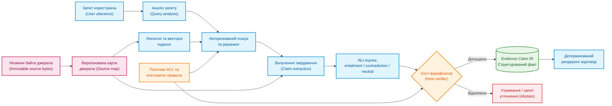
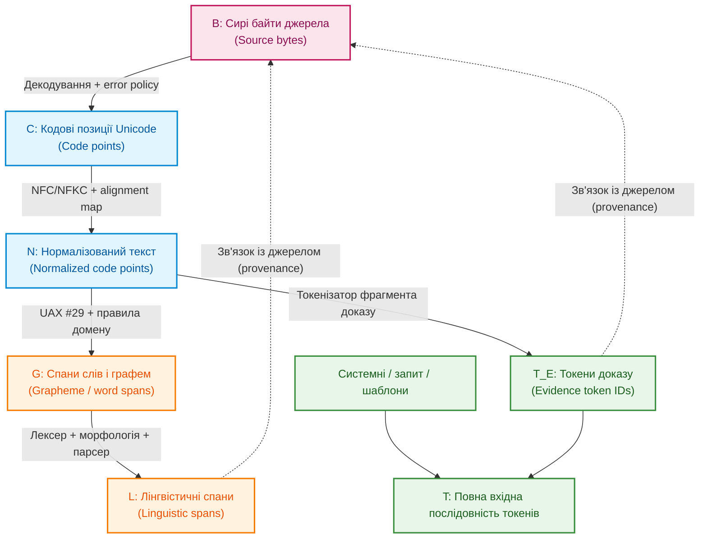
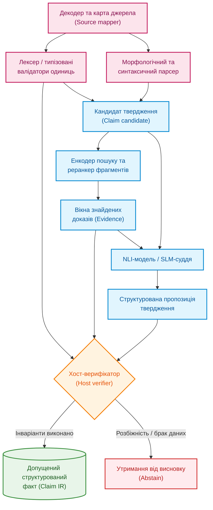
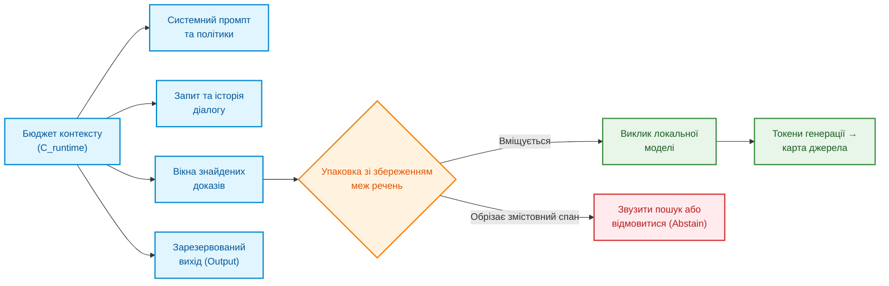

# Глава 12. Лінгвістичний аналіз та локальні моделі: як система розуміє текст без втрати джерела

> **Книга:** [Архітектура доказових експертних систем](README.md) · [Частина III: Інженерія знань: здобуття, NLP та екстракція з нормативів](part-03-knowledge-engineering-nlp.md)  
> **Попередня глава:** [Глава 11. Вилучення знань у експертів: інтерв'ювання, когнітивні карти та формалізація досвіду](ch11-knowledge-elicitation-from-experts.md)  
> **Наступна глава:** [Глава 13. Варіативність природної мови проти детермінізму: компіляція сенсу запитання](ch13-language-variability-vs-determinism.md)  
> **Зміст книги:** [README.md](README.md)  
> **Рівень:** розробники та інженери знань: середній  
> **Очікувані результати:** простежувати шлях від фрази користувача до цитати в документі, розрізняти векторну схожість і логічний доказ, перевіряти локальну модель перед оновленням.

---

Користувач запитує: «Яка мінімальна довжина заголовка?» У документі відповідь записано як `eight octets`. Система може знайти це речення, але все ще помилитися: перетворити «октети» на «байти» без перевірки, загубити одиницю або цитувати іншу версію документа. Отже, розуміння мови починається не з великої моделі, а з уміння не втратити зміст і походження тексту.

У нашому прикладі правильна відповідь — не голе `8` і не автоматично «8 байтів». Вона містить значення, оригінальну одиницю, умову, за якої правило чинне, та точний фрагмент дозволеної версії документа. Саме цей повний ланцюжок, а не красиве перефразування, робить відповідь експертної системи перевірюваною.

Надійна мовна частина системи є гібридною: детермінований код відповідає за байти, координати й правила доступу; аналізатор пропонує форму та будову речення; моделі знаходять схожі фрагменти й перевіряють вузькі твердження; мовна модель допомагає перефразувати питання. До відповіді потрапляє лише те, що окрема перевірка може відтворити з доказу.

> **Межа практичного досвіду.** У локальних прототипах спостерігається втрата одиниць, руйнування складених токенів і розбіжність model offsets із source bytes. Без відкритих сирих логів і замороженого корпусу це інженерне спостереження, а не загальний бенчмарк. Архітектура та протокол нижче — дизайн, який треба верифікувати на власному корпусі знань.

## Від людської репліки до права стверджувати

[Глава 19](ch19-from-question-to-evidence.md) розділяє процес здобуття знань на виявлення, вилучення, прив'язку до першоджерела (grounding) та верифікацію. [Глава 2](ch02-epistemology-of-machine-knowledge.md) встановила епістемічний контракт: семантична схожість не є доведенням, стан `unknown` не є запереченням, а факт, дедуктивний висновок і прогнозна ймовірність мають принципово різні підстави. Мовна підсистема поєднує ці рівні.



Етапи моделей машинного навчання можна вільно оновлювати. Незмінні байти, карта першоджерела, перевірка повноважень та предикати допуску — це стабільні інженерні межі. Оновлення токенізатора не має права мовчки змінити семантику та прив'язку цитати.

Авторизація виконується двічі: до етапу пошуку (retrieval) і повторно безпосередньо перед допуском факту (admission). Недоступний фрагмент не можна спочатку передати контекстом у генеративну модель, а потім спробувати приховати цитату: його зміст уже безповоротно вплинув на генерацію. Класифікація вихідного твердження успадковує мітки доступу всіх вихідних матеріалів; відмова у доступі не повинна розкривати сам факт існування закритого документа.

## Як не загубити зв’язок між текстом і джерелом

Твердження «позиція символу 42» не має сенсу без чітко визначеної координатної системи. Це може бути зміщення (offset) у байтах UTF-8, кодових одиницях UTF-16, кодових позиціях (code points) Unicode, розширених кластерах графем, словах, токенах синтаксичного аналізатора або токенах мовної моделі.



Кожна трансформація створює нове текстове представлення та відношення походження. Нехай $R_{X\leftarrow Y}\subseteq X\times Y$ відображає спан похідного представлення $Y$ у відповідні області батьківського представлення $X$. Тоді карта зв'язку токена доказу з байтами є композицією відношень. Нехай $T_E\subseteq T$ — токени моделі, що походять саме з доказу:

```math
R_{B\leftarrow T_E}=R_{B\leftarrow C}\circ R_{C\leftarrow N}
\circ R_{N\leftarrow T_E}.
```

Це відображення не є взаємно однозначною функцією. Один токен може охоплювати кілька кодових позицій; одна графема складається з базового символу та діакритики; нормалізована позиція може утворюватися злиттям декількох вхідних символів.

Службові токени шаблону, системні інструкції та токени запиту користувача не мають штучного походження з байтів документа: вони мапляться на власні сутності або позначаються як згенеровані. Цитата експертної системи має спиратися виключно на множину $T_E$.

### Чому нормалізація може звести різні записи до одного

У формі NFC послідовність `U+0065` (латинська 'e') + `U+0301` (combining acute accent) перетворюється на один символ `U+00E9` ('é'). Різні байти джерела дають однаковий нормалізований вихід. Форма NFKC додатково стирає сумісні відмінності (наприклад, перетворює надрядкові індекси на звичайні цифри або зливає лігатури), тому стандарт UAX #15 застерігає від її сліпого застосування. Зворотне відображення неможливо відновити згодом, якщо вирівнювання (alignment) не було зафіксоване під час трансформації.

Для похідного спану $s$ нехай $M_B(s)$ — мінімальна впорядкована множина байтових інтервалів джерела, $Bytes_B(M)$ — байти джерела в оригінальному порядку, а $Frame_B(M)$ — канонічні фреймовані записи `(start, end, bytes)`. Тоді двосторонній інваріант (round-trip invariant):

```math
Normalize_v(Decode_e(Bytes_B(M_B(s))))=Surface_N(s),
```

а інваріант незмінності первинного доказу:

```math
SHA256(Frame_B(M_B(s)))=evidence\_sha256(s).
```

Параметр $e$ фіксує кодування й політику обробки помилок, а $v$ — версію стандарту Unicode та форму нормалізації. Після зміни порядку комбінованих символів карта джерела може бути списком незв'язних інтервалів, а не єдиним монолітним діапазоном. Для PDF-документів або сканів потрібен довший ланцюг: `байти PDF → геометрія сторінки / растрове зображення → OCR-текст → нормалізований текст`. Координати цитати з OCR прив'язуються до тексту розпізнавання та обмежувальних рамок (bounding boxes) на сторінці; їх не можна подавати як простий байтовий офсет усередині бінарного PDF-файлу.

Стандарт UAX #29 задає базові правила сегментації, але для технічних сутностей на кшталт `10.0.0.0/8`, `v2.1.4` потрібні правила конкретного домену. Для токенізатора мовної моделі обов'язково контролюється інваріант:

```math
Detok_v(Tok_v(x;special=false);cleanup=false)=x.
```

## Як текст може приховати підміну

Текст може виглядати для людини звичайним, але по-різному інтерпретуватися парсерами або містити приховані інструкції для мовної моделі. Перед пошуком відповіді система мусить перевірити не тільки зміст документа, а й спосіб його кодування.

Нормалізація не усуває спуфінг повністю. Латинська літера `a` та кирилична `а` візуально ідентичні. Невидимі керівні символи змінюють порядок відображення, а символи нульової ширини розривають ідентифікатори. Алгоритм двонапрямленого тексту (Bidi override) створює розбіжність між візуальним і логічним порядком символів — клас вразливостей, описаний у дослідженні *Trojan Source*.

| Загроза | Наслідок | Інженерний контроль |
|---|---|---|
| Невалідне кодування | Різні компоненти бачать різний текст | Строге декодування або карантин; заборона мовчазної заміни символів у доказах |
| Змішані алфавіти (confusable scripts) | `heаder` обходить точний текстовий пошук | Профіль писемності, скелетон UTS #39 як сигнал валідатора |
| Bidi та невидимі керівні символи | Рецензент бачить інший порядок слів | Сканування за UAX #9, екранований перегляд кодових позицій, білі списки |
| Надмірна нормалізація | Втрата важливої семантичної різниці | Незмінність вихідних байтів, окремі політики для технічних полів |
| Отруєння корпусу (poisoning) | Фальшивий фрагмент виграє ранжування | Верифікація джерел, геші вмісту, перевірка аномалій |
| Непрямі ін'єкції промптів (Prompt Injection) | Текст документа намагається командувати моделлю | Ізольований канал даних, заборона інструментів за замовчуванням |
| Фальсифікація цитати (Citation spoofing) | Відображений фрагмент не відповідає оригіналу | Перевірка round-trip через карту джерела та контроль гешу |

```mermaid
flowchart LR
    accTitle: Контур санітизації тексту та захисту від атак
    accDescr: Етапи фільтрації вхідних байтів: від строгого декодування до передачі довіреного тексту в захищений канал моделі.

    IN["Зовнішні байти<br/>(External bytes)"] --> DEC{"Строге<br/>декодування?"}
    DEC -->|Помилка| QUAR["Карантин"]
    DEC -->|Успіх| US["Сканування безпеки<br/>Unicode (UTS #39 / UAX #9)"]
    US --> RAW["Незмінний об'єкт<br/>першоджерела"]
    US --> FLAGS["Прапорці підозрілих<br/>символів і напрямку"]
    RAW --> NORM["Нормалізація з фіксацією<br/>вирівнювання"]
    FLAGS --> POL{"Політика допуску<br/>документа"}
    NORM --> POL
    POL -->|Дозволено| IDX["Індексування як<br/>недовірених даних"]
    POL -->|Заблоковано| QUAR
    IDX --> LLM["Ізольований канал<br/>цитованого доказу"]
    LLM --> HOST["Хост-верифікатор"]

    classDef ext fill:#ffebee,stroke:#c62828,stroke-width:2px,color:#b71c1c;
    classDef check fill:#fff3e0,stroke:#f57c00,stroke-width:2px,color:#e65100;
    classDef safe fill:#e8f5e9,stroke:#388e3c,stroke-width:2px,color:#1b5e20;
    classDef proc fill:#e1f5fe,stroke:#0288d1,stroke-width:2px,color:#01579b;

    class IN,QUAR ext;
    class DEC,US,FLAGS,POL,HOST check;
    class RAW,IDX,LLM safe;
    class NORM proc;
```



Знайдена в документі фраза «ігноруй усі попередні інструкції» залишається лише пасивними даними. Навіть найкращий детектор ін'єкцій не є периметром безпеки: захист будується на тому, що текст із документа принципово не має права викликати системні інструменти чи змінювати права доступу.

## Як розподілити відповідальність між складниками

Жоден модуль не повинен одночасно знаходити текст, інтерпретувати його значення та самостійно ухвалювати висновок. Чіткий поділ обов'язків гарантує, що при помилці локалізація очевидна: збій стався на рівні байтів, синтаксичного розбору чи логічного висновку.



| Компонент | Що видає | Чим НЕ є і на що НЕ має права |
|---|---|---|
| Декодер і карта джерела | Кодові позиції, зв'язки з байтами, помилки декодування | Не інтерпретує намір користувача та істинність фактів |
| Детермінований лексер / валідатор | Типізовані атоми (числа, одиниці, UUID) і точні спани | Не призначає семантичну роль твердження |
| Синтаксичний парсер | Леми, частини мови, дерево синтаксичних залежностей | Не доводить нормативну силу вимоги та права доступу |
| Енкодер і реранкер | Семантичні вектори, оцінки близькості | Не доводить логічне слідування (entailment) чи істинність |
| NLI-модель | Оцінки ймовірностей `entailment`, `contradiction`, `neutral` | Не встановлює істину поза наданим фрагментом |
| SLM / LLM | Пропозиція інтенту, нормалізоване формулювання, якір у тексті | Не підміняє байти, геші та політики безпеки |
| Хост-верифікатор | Рішення про допуск (Admitted IR) або код причини відмови | Не перефразовує текст мовою користувача |
| Рендерер | Читабельну відповідь із точними посиланнями на цитати | Не створює нових тверджень поза верифікованим IR |

## Бюджет контексту, токенізація та керування пам'яттю моделі

Токен мовної моделі не еквівалентний слову чи символу. Кількість токенів варіюється залежно від мови, токенізатора та службових шаблонів. Бюджет контексту повинен строго контролюватися:

```math
L_{sys}+L_{schema}+L_{dialog}+L_{query}+L_{evidence}+L_{tools}
+L_{output}\le C_{runtime}.
```

Тут $C_{runtime}$ — апаратно верифікована межа конкретного профілю розгортання. Якщо релевантний фрагмент не вміщується в контекст повністю, система не має права обрізати винятки посередині речення — вона звужує діапазон пошуку або відмовляється від відповіді.



### Фрагментація підслів та коефіцієнт плодючості токенізатора (Fertility Ratio)

У багатомовних інженерних і нормативних системах критичним фактором є архітектура словника токенізатора (*Vocabulary Size*). Як показали дослідження Юрія Паніва та команди проєкту **LapaLLM** (Український католицький університет / обчислювальний кластер EuroHPC JUPITER), застарілі або англоцентричні словники (наприклад, стандартні 32k токенів у ранніх LLaMA або Mistral) призводять до катастрофічної фрагментації слів у синтетично багатих та флективних мовах (зокрема, в українській): одне технічне слово розпадається на 4–6 підслівних фрагментів (байтових токенів).

Це створює три критичні деградації:

1. **Швидке вичерпання вікна уваги:** Коефіцієнт плодючості токенізатора ($\text{Fertility} = \frac{N_{\text{tokens}}}{N_{\text{words}}}$) зростає до 3.5–4.5, зменшуючи реальний обсяг документів, який можна подати в $C_{runtime}$, у 3–4 рази порівняно з англійським текстом.
2. **Розмивання матриць уваги (Attention Dilution):** Довгі послідовності з дрібних уламків ускладнюють для трансформера відстеження синтаксичних зв'язків між термінами та їхніми модифікаторами.
3. **Руйнування карт вирівнювання з джерелом ($R_{N\leftarrow T_E}$):** Злиття і дроблення байтів кирилиці ускладнює точну зворотну прив'язку згенерованого токена до незмінних байтів вихідного документа.

Використання моделей із розширеним словником (наприклад, родина **Google Gemma** із 256k токенами) знижує коефіцієнт плодючості для української мови до 1.2–1.4 токена на слово. Це забезпечує еквівалентну щільність представлення інформації та суттєво заощаджує обчислювальні ресурси під час роботи локальних моделей на edge-серверах і персональних робочих станціях.

### Епістемічна межа нейромереж: інтерполяція проти екстраполяції

Фундаментальне обмеження великих мовних моделей полягає в природі їхньої оптимізації: **глибокі нейронні мережі є високоефективними інтерполяторами всередині опуклої оболонки (convex hull) свого навчального розподілу, але не здатні до надійної екстраполяції за її межі**.

Якщо модель стикається з вузькоспеціалізованою інженерною специфікацією, новим стандартом або конфіденційним корпоративним регламентом, якого не було у відкритому навчальному корпусі, спроба змусити LLM «здогадатися» про правила поведінки призводить до правдоподібних, але хибних інтерполяцій — генеративних галюцинацій та калькованих тавтологій.

Тому в доказовій експертній системі мовна модель **ніколи не є первинним джерелом знань**. Її роль обмежена лінгвістичним інтерфейсом:

- розбір синтаксичних зв'язків і вилучення сутностей;
- генерація структурованих запитів (AST/IR) до бази знань;
- оцінка локального слідування (NLI) між ізольованим фрагментом і твердженням.

Всі логічні висновки, квантифікація правил та перевірка інваріантів делегуються детермінованій машині виведення (Rule Engine / SMT-solver).

Пам'ять під KV-кеш зростає лінійно від довжини вхідної послідовності. Для повнотекстової уваги на одну активну сесію з $n_l$ шарами, $n_{kv}$ ключовими/значеннєвими головами, розмірністю голови $d_h$, довжиною $L$ та $b$ байтами на елемент:

```math
M_{KV}\approx2n_lLn_{kv}d_hb.
```

## Чому схожість тексту ще не є доказом

Для двох ембеддингів $\mathbf q,\mathbf d\in\mathbb R^m$ косинусна схожість:

```math
s_{dense}(q,d)=\frac{\mathbf q^\top\mathbf d}
{\lVert\mathbf q\rVert_2\lVert\mathbf d\rVert_2}.
```

Косинусна схожість визначена лише для ненульових векторів однакової розмірності; будь-яке значення `NaN` або розбіжність розмірностей мають блокувати кандидата ще до етапу ранжування.

Цей показник — суто оцінка сортування, а не ймовірність логічної підтримки. Лексичний пошук знаходить точні символьні збіги, тоді як щільні векторні представлення виявляють парафрази. Метод Reciprocal Rank Fusion (RRF) дозволяє надійно об'єднувати списки без змішування неоднорідних шкал:

```math
s_{RRF}(d)=\sum_{r\in\mathcal R(d)}\frac{1}{k_0+rank_r(d)}.
```

Модель логічного слідування (NLI) оцінює твердження $c$ відносно фрагмента $e$:

```math
p_\theta(y\mid c,e)=\mathrm{softmax}(z_\theta(c,e)),\quad
y\in\{entailment,contradiction,neutral\}.
```

Нейтральна категорія в NLI означає лише брак інформації в конкретному реченні. Системний стан `unknown` ширший: він охоплює неповноту доказів, неможливість зв'язати змінні або невизначену область застосовності. Тому остаточне рішення формує хост-система:

```math
Admit(c,e,q,u,t)=I_{authz}(c,e,u,t)\land I_{integrity}
\land I_{material\ spans}\land I_{applicable}(c,q,t)
\land[y_{ver}=entailment]\land[p_{cal}(entailment)\ge\tau]
\land\neg I_{conflict}\land I_{epistemic\ type}.
```

Цей комплексний предикат гарантує, що чернетка не буде видана за чинний норматив, а гіпотеза — за доведений факт.

## Профілі розгортання локальних моделей

Локальне виконання критичне, коли конфіденційні дані не повинні залишати захищений контур підприємства. Проте маркування «локальна модель» фіксує лише місце виконання, а не гарантує автоматичної точності чи відсутності мережевих звернень.

| Профіль | Переваги | Обмеження |
|---|---|---|
| `llama.cpp` + GGUF | Висока портативність CPU/GPU, edge/offline, широкий вибір бекендів | Вимагає фіксації коміту збірки, хешу квантованого файлу GGUF |
| Ollama | Зручний локальний REST API, підтримка структурованого виводу JSON Schema | Обгортка не додає верифікації фактів; потрібен контроль версій моделі |
| vLLM | Висока пропускна здатність паралельних запитів, безперервне батчування | Складніша інфраструктура розгортання, залежність від версій CUDA |
| MLX LM | Оптимізація під Apple Silicon, швидке локальне квантування та донавчання | Артефакти MLX не переносяться на архітектури CUDA чи ROCm |
| TensorRT-LLM | Максимальна продуктивність на серверах NVIDIA, paged attention | Тісна прив'язка до драйверів та конкретних графічних процесорів |
| ONNX Runtime | Швидкі спеціалізовані енкодери та моделі NLI на CPU/GPU/NPU | Різні провайдери обчислень можуть давати числові розбіжності |

## Контроль регресій при квантуванні та оновленні моделей

Спрощене афінне квантування ваг моделі:

```math
q(w)=\mathrm{clip}\left(\mathrm{round}\left(\frac{w}{s}\right)+z,q_{min},q_{max}\right),
\qquad\hat w=s(q(w)-z).
```

Квантована модель є новим кандидатом, який вимагає окремої повної валідації. Зміна якості (дрейф):

```math
\Delta_{m,s}=m(model_q,s)-m(model_{base},s).
```

Оцінювання обов'язково розбивають на окремі зрізи: українська мова, точність вилучення числових параметрів, стійкість структурованого виводу, коректність утримання від відповіді. Усереднений результат може приховати критичну деградацію в рідкісних технічних термінах.

Маніфест розгортання строго фіксує: знімок версії корпусу документів, правила нормалізації Unicode, версії синтаксичних аналізаторів, геші ваг моделей, параметри квантування, версії середовища виконання та пороги калібрування.

```mermaid
flowchart LR
    accTitle: Пайплайн безпечного розгортання та відкату моделі
    accDescr: Етапи перевірки від підписаного маніфесту через парне тестування до канаркового розгортання з можливістю автоматичного відкату.

    MF["Підписаний маніфест<br/>(Signed manifest)"] --> ST["Завантаження на<br/>staging-середовище"]
    ST --> SELF["Перевірка гешів,<br/>схем та бекенду"]
    SELF --> PAIR["Парне оцінювання<br/>baseline vs candidate"]
    PAIR --> G{"Шлюзи якості,<br/>безпеки та SLO"}
    G -->|Успіх| SH["Shadow-трафік →<br/>Canary-випуск"]
    G -->|Помилка| STOP["Відхилення кандидата"]
    SH --> PR["Атомарне підвищення<br/>версії (Promotion)"]
    SH -->|Аномалія| RB["Повний відкат залежностей<br/>(Rollback closure)"]
    PR --> MON["Моніторинг якості,<br/>пам'яті та затримок"]
    MON -->|Порушення SLO| RB

    classDef doc fill:#fce4ec,stroke:#c2185b,stroke-width:2px,color:#880e4f;
    classDef proc fill:#e1f5fe,stroke:#0288d1,stroke-width:2px,color:#01579b;
    classDef check fill:#fff3e0,stroke:#f57c00,stroke-width:2px,color:#e65100;
    classDef ok fill:#e8f5e9,stroke:#388e3c,stroke-width:2px,color:#1b5e20;
    classDef fail fill:#ffebee,stroke:#d32f2f,stroke-width:2px,color:#b71c1c;

    class MF doc;
    class ST,SELF,PAIR,SH,MON proc;
    class G check;
    class PR ok;
    class STOP,RB fail;
```



## Методологія валідації мовної підсистеми

Метрика виявлення правильного документа $Hit@k$ для запитів, на які існує відповідь:

```math
Hit@k=\frac{1}{|Q_+|}\sum_{q\in Q_+}
\mathbb{1}[G_q\cap R_k(q)\ne\varnothing].
```

Якщо повне твердження потребує кількох джерел, розраховують повноту:

```math
Recall@k=\frac{1}{|Q_+|}\sum_{q\in Q_+}
\frac{|G_q\cap R_k(q)|}{|G_q|}.
```

Стійкість до синонімії та варіативності формулювань вимірюють на групах парафраз:

```math
GroupPass=\frac{1}{|G|}\sum_{g\in G}\prod_{i\in V_g}Success_i.
```

Загальний успіх $Success_i=1$ фіксується виключно тоді, коли система коректно визначила контракт запиту, знайшла валідні байти доказу, зберегла типізовані числові значення, пройшла перевірку прав доступу та правильно відобразила результат.

```mermaid
flowchart LR
    accTitle: Процес порівняльної оцінки мовних кандидатів
    accDescr: Схема експерименту від фіксованого спліту до парного бутстрепу та діагностики помилок.

    MF["Заморожені маніфести"] --> SPL["Розбиття на групи та<br/>аудит витоку даних"]
    SPL --> B["Базовий рівень<br/>(Baseline)"]
    SPL --> C["Новий кандидат<br/>(Candidate)"]
    B --> TR["Синхронізовані трейси<br/>виконання"]
    C --> TR
    TR --> MET["Метрики: джерело, IR,<br/>NLI, E2E, ресурси"]
    MET --> SL["Аналіз зрізів за мовами,<br/>термінами та загрозами"]
    SL --> CI["Груповий бутстреп та<br/>парний статистичний тест"]
    CI --> G{"Погоджені шлюзи<br/>допуску"}
    G -->|Успіх| DEP["Shadow / Canary"]
    G -->|Відхилено| DIAG["Діагностика першої<br/>точки відмови"]

    classDef src fill:#fce4ec,stroke:#c2185b,stroke-width:2px,color:#880e4f;
    classDef test fill:#e1f5fe,stroke:#0288d1,stroke-width:2px,color:#01579b;
    classDef gate fill:#fff3e0,stroke:#f57c00,stroke-width:2px,color:#e65100;
    classDef pass fill:#e8f5e9,stroke:#388e3c,stroke-width:2px,color:#1b5e20;
    classDef err fill:#ffebee,stroke:#d32f2f,stroke-width:2px,color:#b71c1c;

    class MF,SPL src;
    class B,C,TR,MET,SL,CI test;
    class G gate;
    class DEP pass;
    class DIAG err;
```



## Підсумки

Мовна підсистема доказової експертної системи розв'язує фундаментальну суперечність: вона розширює коло формулювань, які система здатна сприйняти від людини, але водночас звужує множину тверджень системи лише до тих, які спираються на конкретні незмінні байти першоджерела.

Локальні моделі та синтаксичні аналізатори дають системі змогу висувати гіпотези щодо змісту документів. Проте вирішальне слово завжди залишається за детермінованим хост-верифікатором, який спирається на маніфести, цифрові підписи, карти походження та строгі правила доступу.

У [Главі 13](ch13-language-variability-vs-determinism.md) ми розглянемо, як долати варіативність природної мови на етапі трансляції запитання користувача в однозначні предикати машинного виведення.

---

### Питання для самоперевірки

1. Чому координати цитати повинні спиратися на незмінні байти джерела, а не на токени мовної моделі?
2. У чому полягає небезпека безконтрольної нормалізації тексту за формою NFKC для інженерної документації?
3. Чому високий бал косинусної схожості не може бути підставою для ствердження факту?
4. Які компоненти входять до повного маніфесту розгортання локальної моделі?
5. Чому статус `neutral` у моделі NLI відрізняється від загальносистемного стану `unknown`?

---

### Рекомендовані джерела

- Unicode Consortium. [Unicode Normalization Forms, UAX #15](https://www.unicode.org/reports/tr15/), Unicode 17.0.0.
- Unicode Consortium. [Unicode Text Segmentation, UAX #29](https://www.unicode.org/reports/tr29/).
- Unicode Consortium. [Unicode Security Mechanisms, UTS #39](https://www.unicode.org/reports/tr39/).
- Nicholas Boucher, Ross Anderson. [Trojan Source: Invisible Vulnerabilities](https://www.usenix.org/conference/usenixsecurity22/presentation/boucher), USENIX Security 2022.
- Marie-Catherine de Marneffe et al. [Universal Dependencies](https://doi.org/10.1162/coli_a_00402), *Computational Linguistics*, 2021.
- Patrick Lewis et al. [Retrieval-Augmented Generation for Knowledge-Intensive NLP Tasks](https://proceedings.neurips.cc/paper/2020/hash/6b493230205f780e1bc26945df7481e5-Abstract.html), NeurIPS 2020.
- Nils Reimers, Iryna Gurevych. [Sentence-BERT: Sentence Embeddings using Siamese BERT-Networks](https://aclanthology.org/D19-1410/), EMNLP 2019.
- Alexis Conneau et al. [XNLI: Evaluating Cross-lingual Sentence Representations](https://aclanthology.org/D18-1269/), EMNLP 2018.
- Sewon Min et al. [FActScore: Fine-grained Atomic Evaluation of Factual Precision in Long Form Text Generation](https://aclanthology.org/2023.emnlp-main.741/), EMNLP 2023.
- Tianyu Gao et al. [Enabling Large Language Models to Generate Text with Citations](https://aclanthology.org/2023.emnlp-main.398/), EMNLP 2023.
- Yurii Paniv et al. [LapaLLM: Open Pre-trained and Instruction-Tuned Multilingual Language Models](https://github.com/lang-uk/lapallm), Ukrainian Catholic University / EuroHPC, 2024.

---

[← Попередня глава](ch11-knowledge-elicitation-from-experts.md) · [Частина III](part-03-knowledge-engineering-nlp.md) · [Зміст](README.md) · [Наступна глава →](ch13-language-variability-vs-determinism.md)
