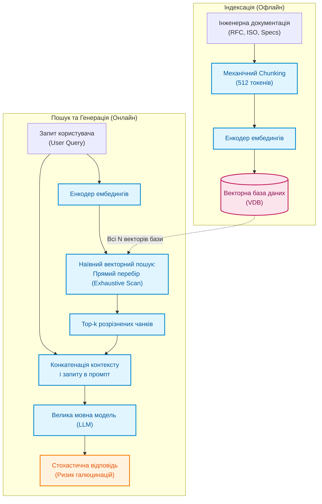
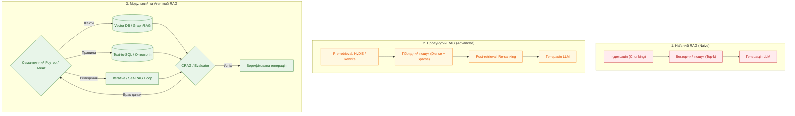
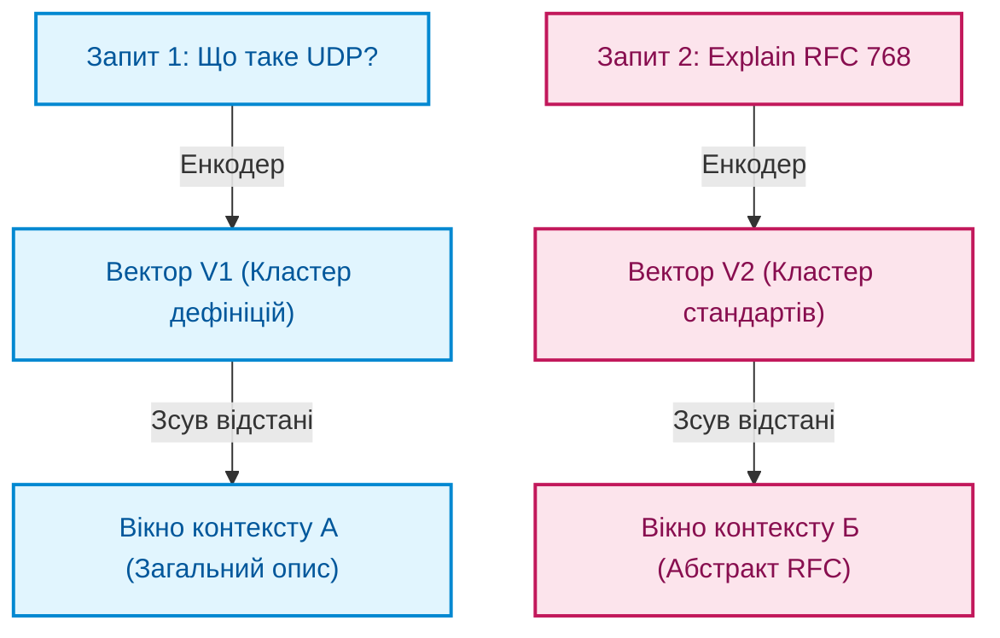
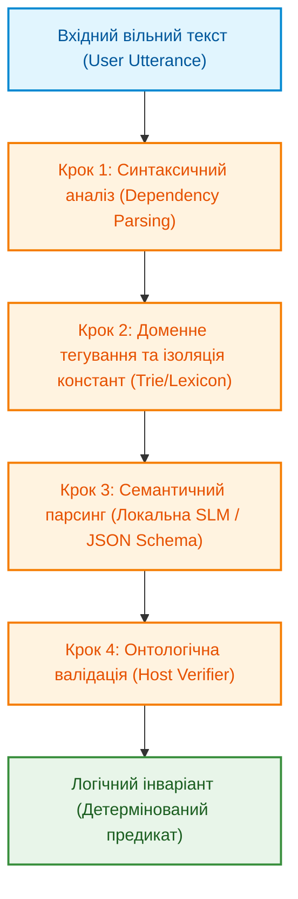
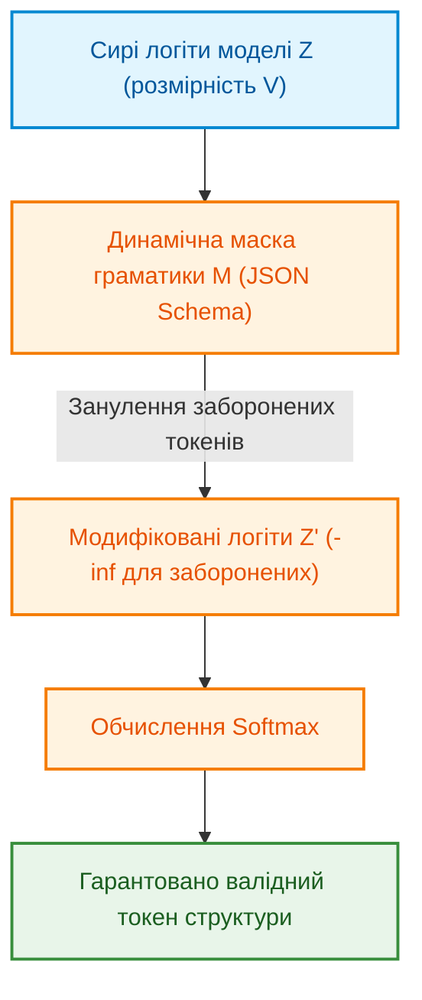
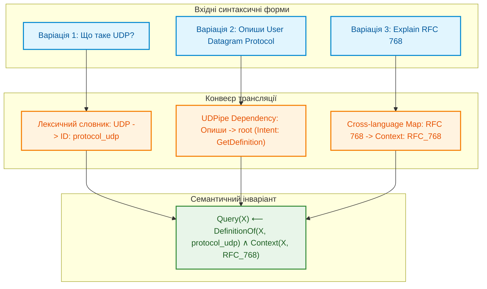
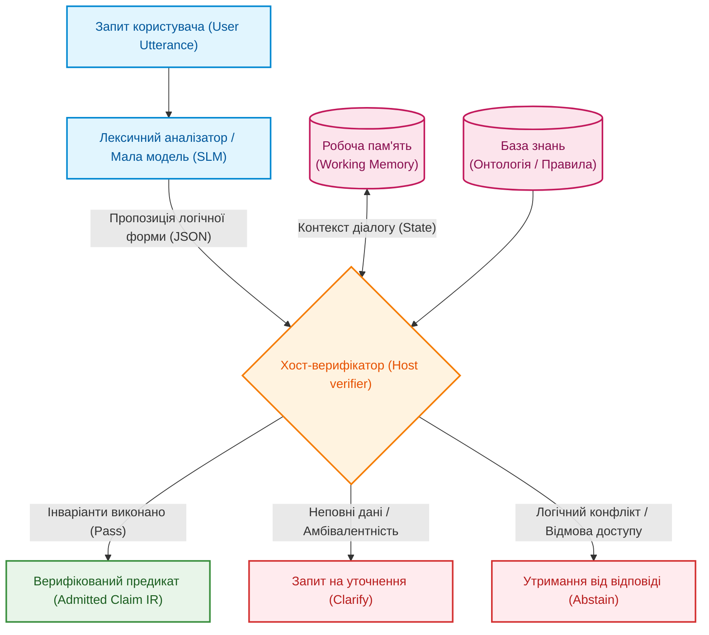

# Глава 13. Варіативність природної мови проти детермінізму: компіляція сенсу запитання

> **Книга:** [Архітектура доказових експертних систем](README.md) · [Частина III: Інженерія знань: здобуття, NLP та екстракція з нормативів](part-03-knowledge-engineering-nlp.md)  
> **Попередня глава:** [Глава 12. Лінгвістичний аналіз та локальні моделі: як система розуміє текст без втрати джерела](ch12-linguistic-analysis-and-local-models.md)  
> **Наступна глава:** [Глава 14. Детекція вимог та модальностей: від SHALL/MUST до формальних інваріантів](ch14-requirements-detection-and-formalization.md)  
> **Зміст книги:** [README.md](README.md)  
> **Рівень:** розробники та інженери знань: середній  
> **Очікувані результати:** здатність розрізняти синтаксичну варіативність і семантичну суть запиту, проєктувати гібридні конвеєри семантичного парсингу та калібрувати інтерфейс системи через групи еквівалентних запитань.

---

Сучасний мейнстрим у розробці інтелектуальних систем прийняття рішень та інтерфейсів до корпоративних баз знань майже повністю капітулював перед парадигмою наївного векторного пошуку (*Dense Retrieval* / *RAG*). Загальноприйнятий підхід виглядає лінійно: перетворити запит користувача на ембединг, знайти за косинусною схожістю суміжні вектори у векторній базі даних (*VDB*) і передати знайдений контекст у велику мовну модель (*LLM*) для генерації кінцевої відповіді.

Проте в інженерних доменах з високою ціною помилки (таких як *Automotive R&D*, *Embedded Systems* чи авіоніка) цей підхід демонструє фундаментальну архітектурну вразливість — **критичну чутливість до синтаксичної варіативності**. Природна мова людини має колосальну надлишковість та гнучкість формулювань. Користувач може запитати про одне й те саме архітектурне обмеження, параметр специфікації або вимогу стандарту (*ISO 26262*, *Automotive SPICE*) мільйоном різних синтаксичних способів, використовуючи професійний сленг, абревіатури або змішуючи мови (*код-світчинг*).

Для наївного *RAG* будь-яка синтаксична зміна формулювання означає неминуче переміщення координат вектора в багатовимірному просторі. Як наслідок, косинусна відстань «пливе», система витягує з бази зовсім інші фрагменти вихідних документів, а генеративна модель видає іншу за суттю відповідь. В експертних системах (*ЕС*), де на висновок машини спирається доказова база інженерного аудиту, нормативного комплаєнсу або *safety review*, така стохастичність є абсолютно неприпустимою.

Користувач запитує: *«Яка мінімальна довжина заголовка?»* або *«Explain the core concept of RFC 768»* — для системи це не повинно бути пошуком схожих букв чи «вгадуванням» релевантного абзацу. Експертна система зобов'язана звести лінгвістичну різноманітність до єдиного детермінованого логічного токена, обчислити його над верифікованою базою знань і повернути сувору відповідь, що інваріантна до форми запиту та жорстко прив'язана до *immutable source bytes* джерела. Розуміння мови починається не з великої моделі, а з уміння скомпілювати синтаксис у семантичний інваріант і не втратити точність доказу.

Мета цієї глави — розкрити методологію переходу від текстоцентричного пошуку за ключовими або векторними словами до **семантичної компіляції запиту**. Ми розглянемо, як побудувати конвеєр, що нівелює синтаксичну варіативність на етапі лексико-семантичного аналізу, забезпечуючи суворе логічне виведення та можливість надійного крос-синтаксичного калібрування інтерфейсу взаємодії.

```mermaid
flowchart LR 
    accTitle: Компіляція синтаксичних варіацій запиту в детерміновану відповідь
    accDescr: Схема перетворення довільного формулювання запиту через лексико-семантичний аналіз у предикат над базою знань.

    U["Синтаксичні варіації запиту<br/>(User utterances)"] --> QA["Лексико-семантичний аналіз<br/>та ізоляція констант"]
    QA --> SI["Семантичний інваріант<br/>(Логічний предикат)"]
    SI --> KB[("База знань<br/>(Граф / Аксіоми)")]
    KB --> DET["Детермінована перевірена<br/>відповідь"]

    classDef in fill:#e1f5fe,stroke:#0288d1,stroke-width:2px,color:#01579b;
    classDef proc fill:#fff3e0,stroke:#f57c00,stroke-width:2px,color:#e65100;
    classDef store fill:#e8f5e9,stroke:#388e3c,stroke-width:2px,color:#1b5e20;
    classDef out fill:#f3e5f5,stroke:#7b1fa2,stroke-width:2px,color:#4a148c;

    class U in;
    class QA,SI proc;
    class KB store;
    class DET out;
```



## Еволюція парадигм RAG: від наївного пошуку до модульних та агентних архітектур

**Векторний пошук (Vector Search)** — це базовий інструмент знаходження суміжних об'єктів у латентному векторному просторі. У найпростішому варіанті — **наївному векторному пошуку (Naive Vector Search)** — він полягає у прямому переборі (*exhaustive linear scan*) усіх наявних у сховищі векторів для визначення найбільш схожих на вектор-запит за метрикою відстані (найчастіше косинусною схожістю).

З алгоритмічного погляду такий метод є класичним точним пошуком найближчих сусідів ($k\text{-NN}$) з обчислювальною складністю $\mathcal{O}(N \cdot d)$, де $N$ — кількість збережених векторів, а $d$ — розмірність простору ембедингів (наприклад, 768, 1536 або 3072 дійсних чисел). Для невеликих масивів документів прямий перебір забезпечує вичерпну точність вибірки без похибок апроксимації, властивих графовим (*HNSW*) чи кластеризаційним (*IVF*) індексам. Проте він діє за суто геометричним принципом, залишаючись абсолютно сліпим до логічного змісту, ієрархії вимог та причинно-наслідкових зв'язків між фактами.

У міру розвитку систем доповнення генерації зовнішніми знаннями (*Retrieval-Augmented Generation*, RAG) інженерна та наукова спільнота пройшла шлях від примітивних конвеєрів до складних адаптивних і модульних комплексів. Згідно з фундаментальним дослідженням Гао та співавторів (*Gao et al., arXiv:2312.10997*), розвиток технологій RAG класифікується на **три базові парадигми**:

1. **Наївний RAG (Naive RAG)**
2. **Просунутий RAG (Advanced RAG)**
3. **Модульний RAG (Modular RAG)**

Поряд із цими трьома класичними парадигмами активно формується клас **новітніх RAG-технологій та патернів** (зокрема *GraphRAG*, *Self-RAG*, *Corrective RAG*, *Adaptive RAG*, *RAPTOR* та *Agentic RAG*), покликаних подолати принципові бар'єри векторного вилучення інформації в комплексних промислових завданнях.

### Парадигма 1. Наївний RAG (Naive RAG: Retrieve-Read)

На ранньому етапі масового впровадження мовних моделей сформувався так званий **наївний RAG (Naive RAG)** — класичний лінійний конвеєр додавання зовнішніх даних у контекст LLM, що реалізує схему «знайти і прочитати» (*Retrieve-Read*):

1. **Фрагментація та індексація (Chunking):** Вихідні технічні документи конвертуються у текст і розрізаються на фіксовані текстові фрагменти (наприклад, по 256–512 токенів із довільним перекриттям у 10–20%). Розбиття виконується механічно — за кількістю символів чи слів, без урахування семантичних меж розділів, таблиць, лістингів коду чи правил специфікації. Кожен чанк пропускається крізь енкодер ембедингів і зберігається у векторній базі даних (*VDB*).
2. **Наївне вилучення (Retrieval):** Запит інженера кодується тим самим енкодером у вектор. За допомогою прямого перебору чи базового векторного індексу система знаходить підмножину з $k$ векторів (*Top-k chunks*), які мають найвищу косинусну схожість із запитом.
3. **Генерація без верифікації (Generation):** Знайдені фрагменти конкатенуються у спільний контекст і підставляються у промпт мовної моделі разом із початковим запитом. Очікується, що модель самостійно відфільтрує шум, зв'яже розрізнені факти докупи та синтезує точну відповідь.



В інженерних доменах R&D такий підхід спричиняє критичні ризики:

* **Втрата цілісності знань (Fragmentation loss):** Якщо умова застосування стандарту та його числове обмеження опинилися в різних чанках, система може підтягнути умову без обмеження.
* **Низька точність та повнота (Low Precision & Recall):** Семантичний простір змішує термінологію; релевантні фрагменти не потрапляють у *Top-k*, або витягуються зовні схожі, але неактуальні уривки.
* **Ефект «Загубленого посередині» (Lost in the Middle):** Моделі схильні фокусуватися на початку та кінці довгого контексту, повністю ігноруючи ключові обмеження, розташовані всередині переданого масиву чанків.
* **Ілюзія релевантності:** Висока векторна схожість свідчить лише про спільність лексичного контексту, але не гарантує нормативної сили твердження.
* **Відсутність доказового зв'язку:** Згенерована відповідь не має чіткої прив'язки до *immutable bytes* джерела, що робить її непридатною для нормативного аудиту чи верифікації безпеки.

### Парадигма 2. Просунутий RAG (Advanced RAG: Pre-retrieval та Post-retrieval)

**Просунутий RAG (Advanced RAG)** зберігає загальний лінійний потік «пошук-генерація», але впроваджує спеціалізовані оптимізації на двох ключових стиках конвеєра: до моменту вилучення (*Pre-retrieval*) та після нього (*Post-retrieval*), підвищуючи якість та релевантність відібраного контексту.

#### Допошукова оптимізація (Pre-retrieval Strategies)

На цьому етапі вирішуються проблеми недосконалості синтаксису користувача та грубості базового індексування:

* **Оптимізація індексації та гранулярності:** Замість механічного нарізання на однакові шматки застосовується ковзне вікно (*sliding window*) з перекриттям, ієрархічне індексування (*Parent-Document Retrieval* або поділ *Parent/Child*), де пошук здійснюється за малими інформативними фрагментами (child chunks), а в контекст передається ширший батьківський розділ (parent chunk).
* **Вилучення вікна речень (Sentence-Window Retrieval):** Векторизуються окремі атомарні речення, а після знаходження точного збігу модель отримує навколишні сусідні речення для збереження повного локального контексту.
* **Збагачення метаданими:** До кожного фрагмента додаються структуровані теги (номер розділу стандарту, версія документа, дата випуску, інженерний рівень ASIL, хеш вихідного файлу), що дає змогу комбінувати векторний пошук із суворою фільтрацією за метаданими.
* **Оптимізація та переписування запиту (Query Rewriting & Expansion):**
  * *Query Rewriting:* LLM перефразовує вхідний запит інженера, усуваючи неоднозначності, виправляючи синтаксичні дефекти або перетворюючи розмовний стиль на нормативну технічну термінологію.
  * *Multi-Query Expansion:* Генерація кількох паралельних варіацій одного й того самого запиту для покриття ширшого спектра синонімів та споріднених формулювань.
  * *HyDE (Hypothetical Document Embeddings):* Модель спочатку генерує гіпотетичну чорнову відповідь на запит користувача, після чого ембединг цієї гіпотези використовується для пошуку реальних документів у базі, оскільки текст відповіді семантично ближчий до цільового документа, ніж вихідне запитання.
* **Гібридний пошук (Hybrid Search):** Паралельне об'єднання щільного векторного пошуку (*Dense Retrieval* на основі векторних ембедингів) та класичного розрідженого повнотекстового пошуку (*Sparse Retrieval* за алгоритмами BM25 або SPLADE). Це гарантує знаходження як семантично близьких пасажів, так і точних технічних ідентифікаторів, номерів регістрів чи констант, які векторні моделі схильні «розмивати».

#### Післяпошукова оптимізація (Post-retrieval Strategies)

Коли система витягла множину кандидатів, пряма передача всього знайденого масиву перевантажує мовну модель шумом та зайвими витратами обчислень. Застосовуються такі методи:

* **Переранжування (Re-ranking):** Первинний векторний пошук швидко відбирає широке коло кандидатів (наприклад, $k = 50$). Потім спеціалізована нейромережева модель-реранкер класу *Cross-Encoder* (наприклад, *BGE-Reranker* чи *Cohere Rerank*) попарно оцінює зв'язку `[Запит + Документ]`, враховуючи глибоку взаємодію токенів, та відбирає 3–5 найбільш релевантних уривків із високим ступенем достовірності.
* **Стиснення та селекція контексту (Context Compression):** Видалення неінформативних частин знайдених текстів (наприклад, за допомогою інструментів класу *LLMLingua*), фільтрація речень, що не містять фактичних відповідей на запит, що зменшує ризик галюцинацій та скорочує розмір промпту.
* **Оптимізація позиціонування (Context Ordering):** Перестановка відібраних фрагментів у промпті таким чином, щоб найважливіші докази розташовувалися на початку та в самому кінці контекстного вікна, нейтралізуючи ефект *Lost in the Middle*.

### Парадигма 3. Модульний RAG (Modular RAG: Компонентна гнучкість)

**Модульний RAG (Modular RAG)** здійснює якісний перехід від монолітного послідовного ланцюжка до декомпонованої, архітектурно гнучкої системи незалежних функціональних модулів. Замість фіксованої схеми «допошукова обробка $\to$ ретривал $\to$ післяпошукова обробка $\to$ генерація», модульний RAG дозволяє вільно комбінувати, динамічно маршрутизувати та замінювати компоненти залежно від типу та складності задачі.

* **Модуль пошуку (Search Module):** Інтеграція з векторними сховищами, повнотекстовими базами, *Text-to-SQL* або графами знань через декларативні мови запитів Cypher/SPARQL (*Text-to-Cypher*).
* **Модуль пам'яті (Memory Module):** Використовує контекст попередніх сесій та історію рішень для динамічного уточнення пошукового простору.
* **Модуль маршрутизації (Routing Module):** Аналізує намір і складність запиту, спрямовуючи його за оптимальною гілкою: прості визначення — на генерацію, факти — у векторну базу, структурні залежності — у граф знань.
* **RAG-Fusion:** Мультизапитний пошук, за якого запитання розмножується на кілька паралельних запитів, а їхні результати об'єднуються через *Reciprocal Rank Fusion (RRF)*:

```math
\mathrm{RRF\_Score}(d \in D) = \sum_{m \in M} \frac{1}{k + r_m(d)}
```

де $M$ — множина виконаних пошукових запитів, $r_m(d)$ — ранг документа $d$ у результатах запиту $m$, а $k$ — константа згладжування ($k \approx 60$).



## Чому схожість тексту не є доказом розуміння

Векторні індекси спираються на косинусну схожість векторних ембеддингів:

```math
s_{\mathrm{dense}}(\mathbf{q}, \mathbf{d}) = \frac{\mathbf{q}^\top \mathbf{d}}{\lVert\mathbf{q}\rVert_2 \lVert\mathbf{d}\rVert_2} = \frac{\sum_{i=1}^{m} q_i d_i}{\sqrt{\sum_{i=1}^{m} q_i^2} \sqrt{\sum_{i=1}^{m} d_i^2}}
```

Проте з погляду логіки значення $s_{\mathrm{dense}}$ є лише ранговим балом у латентному просторі моделі, а не доведенням твердження.



Слабкість суто векторного підходу в R&D виявляється у трьох аспектах:

1. **Чутливість до заперечень та синтаксису:** Частка «не» або зміна стану дієслова мінімально змінює евклідову відстань (схожість >0.95), хоча змінює логічне значення на протилежне.
2. **Дрейф векторної відстані:** Зміна розмовного стилю на формальний витягує зовсім інші вікна контексту.
3. **Відсутність композиційності:** Векторний пошук не здатний обчислити транзитивний зв'язок між вимогами, якщо вони описані в різних розділах.

## Архітектура та конвеєр семантичної компіляції запиту

Для розв'язання цієї проблеми архітектура взаємодії експертної системи проєктується як гібридний конвеєр:



### Крок 1. Лінгвістичний розбір (Dependency Parsing)

Інструменти класу UDPipe або Stanza розбирають речення на дерево залежностей (Universal Dependencies) з POS-тегами та лемами, відокремлюючи синтаксичний скелет (`root`, `nsubj`, `obj`) від морфологічних форм.

### Крок 2. Доменне тегування та ізоляція констант

Префіксні дерева (*Trie*) та регулярні вирази сканують текст на наявність точних технічних ідентифікаторів. Рядки «UDP», «User Datagram Protocol», «юдіпі» або «RFC 768» замінюються неподільними атомами онтології `Entity(ID: protocol_udp, source: RFC_768)` до подачі в нейромережу.

### Крок 3. Семантичний парсинг за допомогою SLM

Мала мовна модель (SLM класу Phi-3 чи Llama-3-8B), обмежена вихідною схемою JSON Schema, визначає намір (інтент) та пов'язує його з аргументами:

```json
{
  "intent": "GetDefinition",
  "arguments": {
    "target": "protocol_udp",
    "scope": "RFC_768"
  }
}
```

### Крок 4. Онтологічна валідація (Host Verifier)

Детермінований код хосту звіряє згенерований JSON з поточною версією онтології та правами доступу. Після успішної перевірки формується предикат числення предикатів першого порядку:

$$\text{Query}(X) \leftarrow \text{DefinitionOf}(X, \text{protocol}\_\text{udp}) \wedge \text{Context}(X, \text{RFC}\_\text{768})$$

## Обмежене декодування за граматикою як запобіжник галюцинацій

У вільному режимі ймовірність токена $i$ розраховується через Softmax від сирих логітів $\mathbf{z}$:

```math
p_i = \frac{e^{z_i}}{\sum_{j \in V} e^{z_j}}
```

При обмеженому декодуванні рантайм на кожному кроці будує динамічну логічну маску $M \subseteq V$, занулюючи ($-\infty$) логіти заборонених граматикою токенів:

```math
z'_i = \begin{cases} 
z_i, & \text{якщо } i \in M, \\ 
-\infty, & \text{якщо } i \notin M 
\end{cases}
```

```math
p'_i = \frac{e^{z'_i}}{\sum_{j \in V} e^{z'_j}}
```

Завдяки цьому ймовірність синтаксично невалідного токена строго дорівнює нулю ($p'_i = 0$), що унеможливлює помилки форматування JSON.



## Калібрування стійкості через іспит на варіативність

Одиницею тестування лінгвістичного інтерфейсу виступає не окрема фраза, а **об'єкт знань (Knowledge Object)** та група еквівалентних за змістом запитів.

Розглянемо калібрування на прикладі трьох варіацій:

1. *«Що таке UDP?»* (прямий дефінітивний запит, українська мова)
2. *«Опиши User Datagram Protocol»* (розгорнута технічна назва)
3. *«Explain the core concept of RFC 768»* (англомовне посилання на стандарт)



Калібрування інтерфейсу вважається успішним лише тоді, коли для всієї групи варіацій $V_g$ виконується критерій проходження:

```math
\mathrm{GroupPass} = \frac{1}{|G|}\sum_{g \in G} \prod_{i \in V_g} \mathrm{Success}_i
```

Якщо хоча б одне формулювання групи призводить до викривлення логічного виведення ($Success_i = 0$), оновлення інтерфейсу блокується релізним гейтом.

## Розподіл відповідальності в архітектурі інтерактивної взаємодії

Чітка ізоляція обов'язків гарантує надійність системи:



Коли інженер ставить коротке неповне запитання («яка мінімальна довжина заголовка?» без назви протоколу), система діє за алгоритмом:

1. SLM вилучає неповну структуру `{"intent": "GetMinimumLength", "arguments": {"target": "header"}}`.
2. Хост-верифікатор фіксує відсутність обов'язкового аргументу `scope`.
3. Хост звертається до **Робочої пам'яті (Working Memory)**: якщо в попередній репліці розглядалися параметри UDP, контекст підставляється автоматично.
4. Якщо пам'ять сесії порожня, хост відмовляється від добудовування гіпотез і повертає детермінований запит на уточнення (`decision=CLARIFY`): «Уточніть протокол або стандарт».

## Підсумки

Розуміння природної мови в доказових експертних системах для R&D — це не ймовірнісна магія великих векторних просторів, а строгий інженерний процес компіляції тексту в семантичний інваріант.

Гібридний конвеєр поєднує гнучкість малих локальних моделей (SLM), обмежених граматиками, із безкомпромісною суворістю детермінованого хост-верифікатора та онтології.

У наступній главі ([Глава 14. Детекція вимог та модальностей: від SHALL/MUST до формальних інваріантів](ch14-requirements-detection-and-formalization.md)) ми перейдемо до автоматизованого аналізу нормативних інженерних текстів, розрізнення модальностей вимог та їх перетворення на формальні специфікації.

---

### Питання для самоперевірки

1. Чому геометрична косинусна близькість у векторних базах даних не є гарантією логічної еквівалентності тверджень?
2. Які завдання вирішує етап доменного тегування та ізоляції констант перед передачею тексту в мовну модель?
3. Як працює механізм маскування логітів (Logit Masking) при обмеженому за граматикою декодуванні?
4. У чому полягає метрика `GroupPass` для крос-синтаксичного калібрування інтерфейсу?
5. Як детермінований хост-верифікатор реагує на амбівалентний запит користувача за відсутності контексту в робочій пам'яті?

---

### Рекомендовані джерела

- Noam Chomsky. [Three Models for the Description of Language](https://doi.org/10.1109/TIT.1956.1056813), *IRE Transactions on Information Theory*, 1956.
- Patrick Lewis et al. [Retrieval-Augmented Generation for Knowledge-Intensive NLP Tasks](https://proceedings.neurips.cc/paper/2020/hash/6b493230205f780e1bc26945df7481e5-Abstract.html), NeurIPS 2020.
- Yunfan Gao et al. [Retrieval-Augmented Generation for Large Language Models: A Survey](https://arxiv.org/abs/2312.10997), *arXiv:2312.10997*, 2023.
- Darren Edge et al. [From Local to Global: A Graph RAG Approach to Query-Focused Summarization](https://arxiv.org/abs/2404.16130), *arXiv:2404.16130*, 2024.
- Akari Asai et al. [Self-RAG: Learning to Retrieve, Generate, and Critique through Self-Reflection](https://arxiv.org/abs/2310.11511), *arXiv:2310.11511*, 2023.
- Shi-Qi Yan et al. [Corrective Retrieval Augmented Generation](https://arxiv.org/abs/2401.15884), *arXiv:2401.15884*, 2024.
- Brandon T. Willard, Rémi Louf. [Efficient Guided Generation for Large Language Models](https://arxiv.org/abs/2307.09702), *arXiv:2307.09702*, 2023.
- Minghao Yan et al. [XGrammar: Flexible and Efficient Structured Generation Engine for Large Language Models](https://arxiv.org/abs/2411.15100), *arXiv:2411.15100*, 2024.
- Postel J. [User Datagram Protocol](https://www.rfc-editor.org/rfc/rfc768), *RFC 768*, 1980.
- Milan Straka et al. [UDPipe: Trainable Pipeline for Syntactic and Morphological Analysis via Universal Dependencies](https://aclanthology.org/L16-1680/), LREC 2016.

---

[← Попередня глава](ch12-linguistic-analysis-and-local-models.md) · [Частина III](part-03-knowledge-engineering-nlp.md) · [Зміст](README.md) · [Наступна глава →](ch14-requirements-detection-and-formalization.md)
