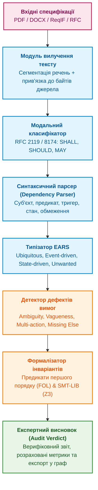
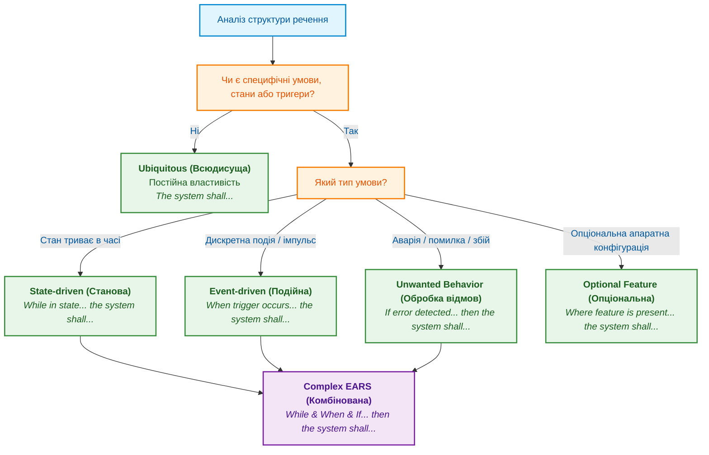
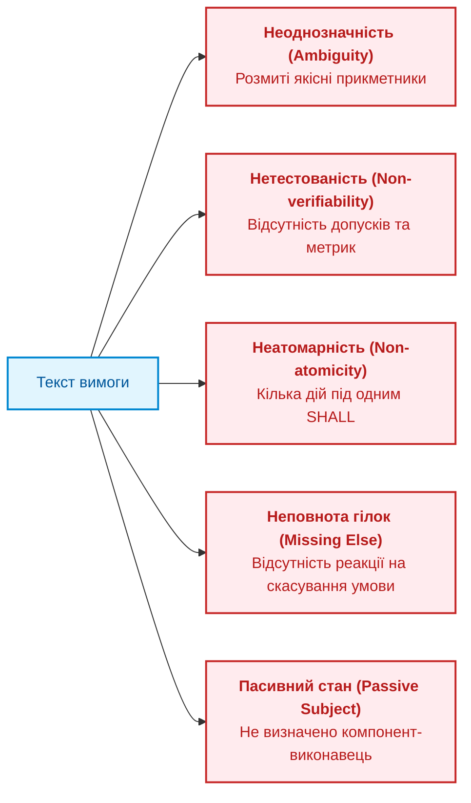
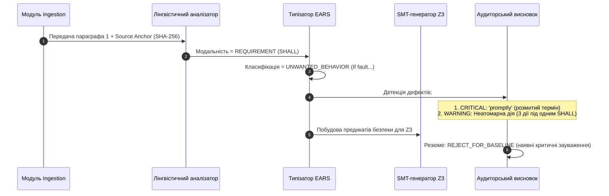

# Глава 14. Детекція вимог та модальностей: від SHALL/MUST до формальних інваріантів

> **Книга:** [Архітектура доказових експертних систем](README.md) · [Частина III: Інженерія знань: здобуття, NLP та екстракція з нормативів](part-03-knowledge-engineering-nlp.md)  
> **Попередня глава:** [Глава 13. Варіативність природної мови проти детермінізму: компіляція сенсу запитання](ch13-language-variability-vs-determinism.md)  
> **Наступна глава:** [Глава 15. Екстракція знань і побудова бази знань: від тексту специфікацій до онтологій](ch15-knowledge-extraction-and-kb-construction.md)  
> **Зміст книги:** [README.md](README.md)  
> **Рівень:** системні інженери, архітектори, розробники та фахівці з V&V: середній / просунутий  
> **Очікувані результати:** проєктувати надійні конвеєри автоматичної екстракції вимог із неструктурованих специфікацій і стандартів (PDF, DOCX, ReqIF), транслювати модальну лексику (RFC 2119, RFC 8174, ISO/IEC Directives) у типізовані шаблони EARS, будувати математичні інваріанти першого порядку та SMT-формули, а також формувати детермінований аудиторський висновок щодо якості, повноти й верифіковності вимог.

---

В інженерних дослідженнях і розробках (*R&D*) створення складного виробу — чи то блоку керування батареєю електромобіля (*BMS ECU*), авіоніки (*DO-178C / DO-254*), імплантованого дефібрилятора (*IEC 62304*), чи нового телекомунікаційного чипа (*ASIC / SoC*) — починається не з написання вихідного коду чи топології кристала. Воно починається з тисяч сторінок нормативних документів.

Типовий інженерний проєкт спирається на три гетерогенні пласти нормативного знання:

1. **Міжнародні та галузеві стандарти:** формальні правила на зразок *ISO 26262* (функціональна безпека автомобілів), *MISRA C/C++*, *AUTOSAR*, протоколи *IEEE 802.3*, специфікації *RFC* або регламенти *FDA / FAA*.
2. **Технічні завдання та вимоги замовника (*Customer Requirement Documents, CRD / SRS*):** документи на сотні сторінок, передані у форматах PDF, DOCX чи експортах систем керування вимогами (*IBM DOORS*, *PTC Windchill*, *Siemens Polarion*).
3. **Технічні описи та обмеження елементної бази (*Hardware Datasheets & Errata*):** описи регістрів, таймінгів, температурних діапазонів і споживання струму мікроконтролерів і сенсорів.

Головний парадокс сучасного інжинірингу полягає в тому, що всі подальші етапи — проєктування архітектури, написання коду, верифікація (*V&V*) і сертифікація — вимагають абсолютної математичної точності. Проте фундаментальне першоджерело, з якого виводяться ці артефакти, зафіксоване розмитою, багатослівною і повною синтаксичних пасток природною мовою людини.

Коли інженерна команда намагається автоматизувати роботу з документами за допомогою наївного векторного пошуку (*RAG*) чи універсальних великих мовних моделей (*LLM*), система неминуче стикається з катастрофічною ненадійністю: стохастичні моделі галюцинують кванторами, «ковтають» граничні часові інтервали, плутають сувору заборону (*SHALL NOT*) із рекомендацією (*SHOULD NOT*) і не здатні надати гарантію повноти покриття. Для сертифікаційного аудиту відповідь нейромережі «вимога, найімовірніше, задоволена» не має жодної юридичної чи інженерної сили.

## Семантична інженерія проти стохастичного вгадування промптів (Semantic Engineering vs. Prompt Guessing)

Як зазначає дослідник семантичних систем Борис Пупченко, фундаментальна вада сучасного промпт-інжинірингу полягає в тому, що він намагається стохастично «вгадувати» формулювання у безструктурному просторі природної мови. Такий метод проб і помилок принципово неприйнятний у критичних контурах інженерії та оборонних систем.

Альтернативою є **семантична інженерія** (*Semantic Engineering*), яка будує так званий **«шар нульової інформації» (онтологічні рейки / Ontological Rails)**. Замість того, щоб дозволяти нейромережі генерувати довільний текст чи неструктуровані судження, семантична інженерія створює жорстку матрицю понять, станів, переходів та модальних операторів домену. У такому середовищі галюцинація стає структурно і математично неможливою: будь-яке висловлювання або вимога, що виходить за межі онтологічних рейок, негайно відкидається на етапі типізації та синтаксичного розбору.

Справжня експертна система розглядає специфікацію не як пасивний текст для читання, а як **нескомпільований вихідний код специфікації**. Мета експертної системи — виконати детермінований семантичний парсинг природномовного тексту, виявити нормативні модальні оператори, виокремити контекст і предикати поведінки, нормалізувати їх до типізованих шаблонів **EARS** (*Easy Approach to Requirements Syntax*), а потім скомпілювати у формальні логічні інваріанти (предикати першого порядку $FOL$, темпоральну логіку $LTL$ та вирази $SMT$). Лише на цій основі машина отримує право сформувати обґрунтований експертний висновок про якість специфікації та готовність вимог до трасування.



---

## Анатомія нормативної лексики: модальність за RFC 2119, RFC 8174 та ISO/IEC Directives

Не кожне речення у технічній документації є вимогою. Значна частина тексту — це вступний опис системи (*Rationale*), коментарі архітекторів, приклади застосування або рекомендації щодо зручності експлуатації. Якщо експертна система індексуватиме весь текст поспіль без розрізнення модальності, база знань перетвориться на хаотичне звалище неперевірюваних фактів.

У світовій інженерній практиці розроблені суворі лексичні регламенти, що визначають юридичну та технічну силу тверджень. Найвідомішими є стандарти **IETF RFC 2119** (доповнений **RFC 8174**), а також директиви **ISO/IEC Directives, Part 2** (Розділ 7: *Verbal forms for expressions of provisions*).

### Рівні нормативної сили тверджень

Експертна система зобов'язана класифікувати кожне речення за рівнями нормативної градації:

| Градація нормативності | Ключові маркери (EN) | Ключові маркери (UA) | Семантичне значення для експертної системи | Інженерний статус артефакту |
|---|---|---|---|---|
| **Суворе зобов'язання (Requirement)** | `SHALL`, `MUST`, `REQUIRED` | *повинен*, *зобов'язаний*, *необхідно* | Абсолютна вимога специфікації. Невиконання веде до бракування релізу або непроходження сертифікації. | Формує обов'язковий логічний інваріант $\forall s : \mathit{Inv}(s)$. Потребує 100% покриття тестами та верифікацією. |
| **Сувора заборона (Prohibition)** | `SHALL NOT`, `MUST NOT` | *не повинен*, *заборонено* | Абсолютна заборона стану або переходу. Порушення є критичною загрозою безпеці (*Safety Violation*). | Формує інваріант безпеки $\Box\,\neg\,\mathit{ForbiddenState}$. Автоматично генерує негативні тести (*Fault Injection*). |
| **Рекомендація (Recommendation)** | `SHOULD`, `RECOMMENDED` | *слід*, *рекомендовано* | Допускається відхилення за наявності обґрунтованої інженерної причини (*Waiver / Justification*). | Фіксується як м'яке обмеження (*Soft Constraint*). Потребує наявності підписаного інженерного обґрунтування у разі відхилення. |
| **Небажана дія (Deprecation)** | `SHOULD NOT`, `NOT RECOMMENDED` | *не слід*, *не рекомендовано* | Поведінка, якої треба уникати, якщо немає вагомих архітектурних обмежень. | Генерує попередження статичного аналізу (*Warning*), що потребує рев'ю архітектора. |
| **Дозвіл (Permission)** | `MAY`, `OPTIONAL` | *може*, *допускається* | Повністю опціональна поведінка або додатковий функціонал вендора. | Реєструється як опціональна фіча. Не може бути підставою для відхилення релізу. |
| **Твердження про факт (Statement of Fact)** | `WILL`, `IS`, `CAN` | *буде*, *є*, *здатний* | Опис властивості системи, поведінки зовнішнього середовища або фізичного закону. | Не є вимогою до системи. Відноситься до розділу передумов або опису контексту (*Environment Assumption*). |

### Синтаксичні пастки природної мови в інженерних специфікаціях

Прямий пошук слів за регулярними виразами (на зразок **`SHALL`**) виявляє лише вершину айсберга. Реальні інженерні документи створюються різними авторами, часто неносіями мови, і містять типові дефекти формулювань:

1. **Пасивний стан без зазначення суб'єкта (*Passive Voice without Agent*):**
   *Приклад:* *"Data shall be validated before transmission."*
   *Проблема для ЕС:* Хто саме зобов'язаний валідувати дані? Драйвер сенсора? Комунікаційний контролер? Застосунок верхнього рівня? Відсутність чітко визначеного суб'єкта дії робить вимогу нерозподіленою і блокує призначення відповідального модуля в коді.
2. **Прихована нормативність (*Concealed Modality*):**
   *Приклад:* *"The ECU is responsible for monitoring battery voltage."* або *"The firmware needs to reboot if a watchdog timeout occurs."*
   Формально слово `SHALL` відсутнє, але за інженерним змістом це сувора функціональна вимога. Система лінгвістичного аналізу повинна володіти онтологією квазімодальних дієслівних конструкцій (`is responsible for`, `has to`, `needs to`, `is required to`).
3. **Розщеплені квантори та складені винятки (*Split Quantifiers & Exception Clauses*):**
   *Приклад:* *"The system shall maintain 50 Hz PWM frequency under all load conditions, except during initial power-up calibration where 20 Hz is permitted for a maximum of 200 ms."*
   Таке речення поєднує в собі загальну вимогу, стан винятку, альтернативну поведінку та часове обмеження. Експертна система зобов'язана декомпонувати таку складну конструкцію на атомарні логічні гілки.

---

## Синтаксична типізація: шаблони EARS (Easy Approach to Requirements Syntax)

Щоб перетворити хаотичний синтаксис природної мови на строгу математичну конструкцію, у сучасній інженерії вимог застосовують методологію **EARS** (*Easy Approach to Requirements Syntax*), створену Алістером Мевіном (*Alistair Mavin*) під час розробки авіаційних двигунів у компанії Rolls-Royce.

EARS стандартизує синтаксис вимог до п'яти базових патернів і одного комбінованого. Перевага EARS для експертної системи полягає в тому, що кожен шаблон має пряме, однозначне відображення в логіку предикатів.



### Детальна структура шаблонів EARS

#### 1. Всюдисуща вимога (Ubiquitous Requirement)

Вимога, що діє безперервно протягом усього життєвого циклу системи, без прив'язки до подій чи станів.

* **Канонічний синтаксис:** `The <system name> shall <system response>.`
* **Інженерний приклад:** *"The CAN controller shall support extended 29-bit identifiers."*
* **Логічна інтерпретація:** $\forall t \ge 0 : \text{Capability}(\mathit{CAN\_Controller},\; \mathit{Ext29Bit}) = \top$.

#### 2. Подійна вимога (Event-driven Requirement)

Реакція системи на зовнішню подію або зміну сигналу, що відбувається миттєво або ініціює перехід.

* **Канонічний синтаксис:** `When <trigger>, the <system name> shall <system response>.`
* **Інженерний приклад:** *"When the E-STOP button is pressed, the motor driver shall disable gate drive outputs within 5 ms."*
* **Логічна інтерпретація:** $\Box\bigl(\mathit{Pressed}(\mathit{E\text{-}STOP}) \Rightarrow \Diamond_{\le 5\,\mathrm{ms}}\, \mathit{Disabled}(\mathit{GateOutputs})\bigr)$.

#### 3. Станова вимога (State-driven Requirement)

Вимога, що активна лише тоді, коли система перебуває у визначеному робочому режимі.

* **Канонічний синтаксис:** `While <in state>, the <system name> shall <system response>.`
* **Інженерний приклад:** *"While in PRE-CHARGE mode, the BMS shall limit the pre-charge resistor current to 10 A."*
* **Логічна інтерпретація:** $\forall t :\; (\mathit{State}(t) = \mathit{PRE\text{-}CHARGE}) \Rightarrow (\mathit{Current}(t) \le 10\,\mathrm{A})$.

#### 4. Обробка нештатних ситуацій та відмов (Unwanted Behavior Requirement)

Реакція на збій, порушення протоколу або вихід за межі безпечного діапазону.

* **Канонічний синтаксис:** `If <trigger/fault condition>, then the <system name> shall <system response>.`
* **Інженерний приклад:** *"If the cell temperature exceeds 65°C, then the cooling controller shall activate the refrigerant pump at 100% duty cycle."*
* **Логічна інтерпретація:** $\forall t :\; (\mathit{Temp}(t) > 65^{\circ}\mathrm{C}) \Rightarrow (\mathit{PumpDutyCycle}(t) = 1.0)$.

#### 5. Опціональна функціональність (Optional Feature Requirement)

Вимога, що реалізується лише за наявності відповідного апаратного модуля чи ліцензії.

* **Канонічний синтаксис:** `Where <feature is included>, the <system name> shall <system response>.`
* **Інженерний приклад:** *"Where the hardware watchdog is populated, the CPU supervisor shall toggle the WDI pin every 50 ms."*
* **Логічна інтерпретація:** $\mathit{HasHW}(\mathit{Watchdog}) \Rightarrow \Box\,(\mathit{ToggleInterval} = 50\,\mathrm{ms})$.

#### 6. Комплексна вимога (Complex EARS Requirement)

Поєднує передумови стану, події та відмови:

* **Канонічний синтаксис:** `While <state>, When <trigger>, If <fault>, then the <system name> shall <system response>.`
* **Інженерний приклад:** *"While in CHARGING state, when the charge plug is unlocked, if the current exceeds 0.5 A, then the charger shall immediately trigger the high-voltage interlock loop (HVIL) disconnect."*

---

## Математична та логічна формалізація вимог

Перехід від шаблону EARS до виконуваного інженерного інваріанта вимагає трансляції в строгі формальні мови: **предикати першого порядку ($FOL$)**, **темпоральну логіку ($LTL/STL$)** та мову **$SMT\text{-}LIB\text{ v2}$** для автоматизованої перевірки за допомогою $SMT$-рішувачів (таких як *Z3*, *CVC5* або *Yices*).

### Логіка предикатів першого порядку (FOL)

Узагальнена вимога до системи моделюється як відношення над простором станів системи $\mathcal{S}$ та вектором вхідних сигналів $\mathbf{x} \in \mathcal{X}$:

```math
\forall s \in \mathcal{S},\; \forall \mathbf{x} \in \mathcal{X}:\quad \Phi_{\mathrm{pre}}(s, \mathbf{x}) \Rightarrow \Phi_{\mathrm{post}}(s', \mathbf{y}) \land \mathcal{T}(s, s')
```

де:

- $\Phi_{\mathrm{pre}}(s, \mathbf{x})$ — предикат передумови (*Precondition*), що агрегує активний стан (`While`), ініціюючу подію (`When`) та умови відмови (`If`);
- $\Phi_{\mathrm{post}}(s', \mathbf{y})$ — предикат післяумови (*Postcondition*), що визначає новий стан системи $s'$ та вихідні керівні сигнали $\mathbf{y}$ (`shall <action>`);
- $\mathcal{T}(s, s')$ — часовий або фазовий контракт переходу (наприклад, $\Delta t \le t_{\mathrm{timeout}}$).

### Лінійна темпоральна логіка (LTL) та сигнальна темпоральна логіка (STL)

Оскільки реальні вбудовані системи працюють у неперервному або дискретному часі, статичних предикатів недостатньо для моделювання реактивності. Експертна система транслює подійні вимоги у формули $LTL$:

**1. Інваріант безпеки (Safety Invariant — «нічого поганого не станеться»):**

```math
\Box\,\neg\bigl(\mathit{Current} > I_{\max} \land \mathit{ContactorState} = \mathit{CLOSED}\bigr)
```

Оператор $\Box$ означає «завжди в усіх майбутніх станах».

**2. Вимога живучості та обмеженого часу реакції (Bounded Liveness):**

```math
\Box\,\Bigl(\mathit{FaultTriggered} \Rightarrow \Diamond_{\le \tau}\,\mathit{SafeStateAchieved}\Bigr)
```

Оператор $\Diamond_{\le \tau}$ означає «не пізніше ніж через час $\tau$ настане подія».

### Формалізація в синтаксисі SMT-LIB v2

Для автоматичного пошуку логічних суперечностей (наприклад, коли одна вимога вимагає розімкнути реле, а інша в цьому ж стані — замкнути його) експертна система генерує декларативні скрипти для SMT-рішувача:

```lisp
;; Декларація типів станів
(declare-datatypes () ((BmsState INIT STANDBY CHARGE DISCHARGE FAULT)))

;; Змінні системи
(declare-const state BmsState)
(declare-const cell_temp_c Real)
(declare-const contactor_closed Bool)
(declare-const alarm_broadcast Bool)

;; Інваріант Вимоги REQ-BMS-042 (Unwanted Behavior):
;; If cell_temp_c > 60.0 then contactor_closed = false and alarm_broadcast = true
(assert (=> (> cell_temp_c 60.0) 
            (and (not contactor_closed) alarm_broadcast)))

;; Перевірка на суперечність: чи може бути температура > 60.0 при замкнутому контакторі?
(assert (and (> cell_temp_c 60.0) contactor_closed))
(check-sat)
;; Результат рішувача: unsat (протиріччя доведено, інваріант безпеки непорушний)
```

---

## Алгоритми аудиту та детекції дефектів вимог (Requirement Smells)

Повноцінна експертна система не просто витягує предикати, а здійснює формальний аудит вимог згідно зі стандартами **IEEE 29148:2018** (*Systems and software engineering — Life cycle processes — Requirements engineering*) та **INCOSE Requirements Working Group Guide**.

### Каталог інженерних дефектів у специфікаціях



#### 1. Неоднозначність та якісні евфемізми (*Vagueness / Ambiguity*)

* **Суть дефекту:** використання слів, які не мають точного фізичного або математичного вираження.
* **Чорний список лексики для експертної системи:**
  - *Швидкісні показники:* `fast`, `promptly`, `immediately`, `as soon as possible`, `low latency` — замінити на точний числовий дедлайн, наприклад: $t \le 15\,\mathrm{ms}$.
  - *Якісні показники:* `user-friendly`, `adequate`, `robust`, `efficient`, `suitable`, `optimal`.
  - *Кількісні невизначеності:* `mostly`, `high throughput`, `large capacity`, `approximately`, `etc.`

#### 2. Неатомарність (*Non-Atomicity / Multiple Actions*)

* **Суть дефекту:** об'єднання кількох незалежних функціональних дій під одним нормативним маркером через сполучники `and`, `as well as`.
* **Приклад:** *"The gateway shall parse the incoming CAN message, verify the CRC, update the internal state machine, and transmit an acknowledgment frame."*
* **Чому це небезпечно:** якщо провалюється тест верифікації CRC, статус вимоги стає частковим (*Partially Met*). Для сертифікації за *ISO 26262* вимога повинна бути декомпонована на чотири незалежні атомарні вимоги, кожна з яких має власний трасований тест.

#### 3. Відсутність парної гілки (*Missing Alternative / Dangling Else*)

* **Суть дефекту:** наявність умови `If <fault>`, але повна відсутність інструкції щодо того, як система повинна виходити з режиму аварії, коли параметр повертається в норму.
* **Приклад:** *"If the battery temperature exceeds 55°C, the cooling fan shall turn ON."*
* **Питання експертної системи:** А коли вентилятор повинен вимкнутися? При 54.9°C (що спричинить небезпечний брязкіт реле на межі спрацьовування — *chattering*)? Чи є петля гістерезису ($T \le 48^{\circ}\mathrm{C}$)? Без парної вимоги розробник коду зробить власне довільне припущення, що є джерелом серйозних дефектів.

---

## Практична реалізація: Експертний конвеєр екстракції та аудиту вимог

Нижче наведено модульний код мовою **Go 1.22+**, що реалізує виробничий конвеєр: вилучення нормативних маркерів, мапінг на EARS, аудит інженерних дефектів і генерацію SMT-перевірок.

```go
// Файл: requirement_extractor.go
// Призначення: детермінована детекція нормативних вимог, класифікація за
// шаблонами EARS, виявлення дефектів та генерація SMT-LIB фрагментів.
package main

import (
	"fmt"
	"regexp"
	"strings"
)

// ModalityLevel визначає нормативну силу речення згідно з RFC 2119 / ISO Directives.
type ModalityLevel string

const (
	ModalityRequirement    ModalityLevel = "REQUIREMENT"    // SHALL, MUST
	ModalityProhibition    ModalityLevel = "PROHIBITION"    // SHALL NOT, MUST NOT
	ModalityRecommendation ModalityLevel = "RECOMMENDATION" // SHOULD
	ModalityPermission     ModalityLevel = "PERMISSION"     // MAY
	ModalityInformational  ModalityLevel = "INFORMATIONAL"  // без маркерів
)

// EARSType відповідає одному з шаблонів Easy Approach to Requirements Syntax.
type EARSType string

const (
	EARSUbiquitous       EARSType = "UBIQUITOUS"
	EARSEventDriven      EARSType = "EVENT_DRIVEN"
	EARSStateDriven      EARSType = "STATE_DRIVEN"
	EARSUnwantedBehavior EARSType = "UNWANTED_BEHAVIOR"
	EARSOptionalFeature  EARSType = "OPTIONAL_FEATURE"
	EARSComplex          EARSType = "COMPLEX"
	EARSInvalid          EARSType = "INVALID"
)

// SourceAnchor зберігає прив'язку речення до байтового діапазону у джерельному файлі.
type SourceAnchor struct {
	FilePath        string
	SHA256Hash      string
	SectionID       string
	ByteOffsetStart int
	ByteOffsetEnd   int
}

// QualitySmell описує один виявлений дефект вимоги.
type QualitySmell struct {
	SmellType    string // наприклад, AMBIGUITY_FUZZY_TERM
	Severity     string // CRITICAL | WARNING | INFO
	Detail       string
	SuggestedFix string
}

// FormalizedRequirement — результат аналізу одного нормативного речення.
type FormalizedRequirement struct {
	ReqID      string
	RawText    string
	Anchor     SourceAnchor
	Modality   ModalityLevel
	EARSType   EARSType
	Subject    string
	Trigger    string
	State      string
	Fault      string
	Action     string
	TimingMs   float64 // 0 означає «не задано»
	Smells     []QualitySmell
	SMTFormula string
}

// IsAcceptableForBaseline повертає true, якщо вимога не містить критичних дефектів.
func (r *FormalizedRequirement) IsAcceptableForBaseline() bool {
	for _, s := range r.Smells {
		if s.Severity == "CRITICAL" {
			return false
		}
	}
	return true
}

var (
	reShallNot = regexp.MustCompile(`(?i)\b(shall not|must not|cannot)\b`)
	reShall    = regexp.MustCompile(`(?i)\b(shall|must|is required to)\b`)
	reShould   = regexp.MustCompile(`(?i)\b(should|recommended)\b`)
	reMay      = regexp.MustCompile(`(?i)\b(may|optional)\b`)

	reTiming = regexp.MustCompile(
		`(?i)\b(?:within|less than|max|maximum of)\s+(\d+(?:\.\d+)?)\s*(ms|s|sec|seconds|milliseconds)\b`,
	)

	reComplex = regexp.MustCompile(
		`(?i)^While\s+(?P<state>.+?),\s*(?:When\s+(?P<trigger>.+?),\s*)?` +
			`(?:If\s+(?P<fault>.+?),\s*)?(?:then\s+)?the\s+(?P<subject>[A-Za-z0-9_ -]+?)\s+shall\s+(?P<action>.+?)\.?$`,
	)
	reUnwanted = regexp.MustCompile(
		`(?i)^If\s+(?P<fault>.+?),\s*(?:then\s+)?the\s+(?P<subject>[A-Za-z0-9_ -]+?)\s+shall\s+(?P<action>.+?)\.?$`,
	)
	reState = regexp.MustCompile(
		`(?i)^While\s+(?P<state>.+?),\s*the\s+(?P<subject>[A-Za-z0-9_ -]+?)\s+shall\s+(?P<action>.+?)\.?$`,
	)
	reEvent = regexp.MustCompile(
		`(?i)^When\s+(?P<trigger>.+?),\s*the\s+(?P<subject>[A-Za-z0-9_ -]+?)\s+shall\s+(?P<action>.+?)\.?$`,
	)
	reOptional = regexp.MustCompile(
		`(?i)^Where\s+(?P<feature>.+?),\s*the\s+(?P<subject>[A-Za-z0-9_ -]+?)\s+shall\s+(?P<action>.+?)\.?$`,
	)
	reUbiquitous = regexp.MustCompile(
		`(?i)^The\s+(?P<subject>[A-Za-z0-9_ -]+?)\s+shall\s+(?P<action>.+?)\.?$`,
	)

	fuzzyTerms = []struct {
		re  *regexp.Regexp
		fix string
	}{
		{regexp.MustCompile(`(?i)\bpromptly\b`), "Замініть на максимальний час у мілісекундах (наприклад, <= 10 ms)."},
		{regexp.MustCompile(`(?i)\bquickly\b`), "Вкажіть точний часовий дедлайн."},
		{regexp.MustCompile(`(?i)\bas soon as possible\b`), "Замініть на детерміноване обмеження часу відповіді."},
		{regexp.MustCompile(`(?i)\buser[- ]friendly\b`), "Неможливо верифікувати. Вкажіть вимоги до UI/UX у термінах кроків."},
		{regexp.MustCompile(`(?i)\brobust\b`), "Вкажіть конкретні діапазони стійкості (напруга, температура, шум)."},
		{regexp.MustCompile(`(?i)\bapproximately\b`), "Вкажіть номінал та допустиме відхилення (толеранс у % або абс. одиницях)."},
		{regexp.MustCompile(`(?i)\betc\b`), "Перелік має бути вичерпним і замкненим."},
	}
)

func namedGroups(re *regexp.Regexp, s string) map[string]string {
	match := re.FindStringSubmatch(s)
	if match == nil {
		return nil
	}
	result := make(map[string]string, len(re.SubexpNames()))
	for i, name := range re.SubexpNames() {
		if name != "" {
			result[name] = match[i]
		}
	}
	return result
}

func ClassifyModality(text string) ModalityLevel {
	switch {
	case reShallNot.MatchString(text):
		return ModalityProhibition
	case reShall.MatchString(text):
		return ModalityRequirement
	case reShould.MatchString(text):
		return ModalityRecommendation
	case reMay.MatchString(text):
		return ModalityPermission
	default:
		return ModalityInformational
	}
}

func ParseEARSPattern(text string) (EARSType, map[string]string) {
	text = strings.TrimSpace(text)

	if groups := namedGroups(reComplex, text); groups != nil {
		if groups["trigger"] != "" || groups["fault"] != "" {
			return EARSComplex, groups
		}
	}
	if groups := namedGroups(reUnwanted, text); groups != nil {
		return EARSUnwantedBehavior, groups
	}
	if groups := namedGroups(reState, text); groups != nil {
		return EARSStateDriven, groups
	}
	if groups := namedGroups(reEvent, text); groups != nil {
		return EARSEventDriven, groups
	}
	if groups := namedGroups(reOptional, text); groups != nil {
		return EARSOptionalFeature, groups
	}
	if groups := namedGroups(reUbiquitous, text); groups != nil {
		return EARSUbiquitous, groups
	}

	return EARSInvalid, map[string]string{"raw": text}
}

func ExtractTimingMs(text string) float64 {
	m := reTiming.FindStringSubmatch(text)
	if m == nil {
		return 0
	}
	var value float64
	fmt.Sscanf(m[1], "%f", &value)
	unit := strings.ToLower(m[2])
	if unit == "s" || unit == "sec" || unit == "seconds" {
		return value * 1000.0
	}
	return value
}

func DetectQualitySmells(text string, modality ModalityLevel, earsType EARSType, groups map[string]string) []QualitySmell {
	var smells []QualitySmell

	for _, ft := range fuzzyTerms {
		if loc := ft.re.FindString(text); loc != "" {
			smells = append(smells, QualitySmell{
				SmellType:    "AMBIGUITY_FUZZY_TERM",
				Severity:     "CRITICAL",
				Detail:       fmt.Sprintf("Знайдено неприпустимий евфемізм %q.", loc),
				SuggestedFix: ft.fix,
			})
		}
	}

	action := groups["action"]
	if action != "" {
		reMultiAction := regexp.MustCompile(`(?i)\b(and|as well as)\s+(?:shall\s+)?[a-z]+(?:s|ed|ing)?\b`)
		if (strings.Contains(action, " and ") || strings.Contains(action, " as well as ")) &&
			reMultiAction.MatchString(action) {
			smells = append(smells, QualitySmell{
				SmellType:    "NON_ATOMIC_REQUIREMENT",
				Severity:     "WARNING",
				Detail:       "Вимога містить кілька дій під одним SHALL.",
				SuggestedFix: "Декомпозуйте речення на окремі вимоги для кожної дії.",
			})
		}
	}

	subject := strings.ToLower(strings.TrimSpace(groups["subject"]))
	if subject == "" || subject == "system" || subject == "software" || subject == "it" {
		smells = append(smells, QualitySmell{
			SmellType:    "GENERIC_OR_MISSING_SUBJECT",
			Severity:     "WARNING",
			Detail:       fmt.Sprintf("Суб'єкт %q занадто абстрактний або відсутній.", subject),
			SuggestedFix: "Вкажіть точну назву компонента (наприклад, 'BMS_Gateway').",
		})
	}

	if earsType == EARSEventDriven || earsType == EARSUnwantedBehavior {
		if !reTiming.MatchString(text) {
			smells = append(smells, QualitySmell{
				SmellType:    "MISSING_TIMING_BOUND",
				Severity:     "CRITICAL",
				Detail:       "Подійна вимога або реакція на збій не містить максимального часу реакції.",
				SuggestedFix: "Додайте детермінований ліміт часу (наприклад, 'within 50 ms').",
			})
		}
	}

	if modality == ModalityRequirement && earsType == EARSInvalid {
		smells = append(smells, QualitySmell{
			SmellType:    "NON_CONFORMANT_EARS_STRUCTURE",
			Severity:     "CRITICAL",
			Detail:       "Структура речення не відповідає жодному канонічному шаблону EARS.",
			SuggestedFix: "Переформулюйте у формі: When/While/If... the <system> shall...",
		})
	}

	return smells
}

func CompileToSMT(req *FormalizedRequirement) string {
	if req.EARSType != EARSUnwantedBehavior || req.Fault == "" || req.Action == "" {
		return ""
	}
	return fmt.Sprintf(
		";; SMT Contract for %s\n(assert (=> (and true ; Condition: %s\n            )\n            (and true ; Action: %s\n            )))\n",
		req.ReqID, req.Fault, req.Action,
	)
}

func AnalyzeRequirement(reqID, rawText string, anchor SourceAnchor) *FormalizedRequirement {
	modality := ClassifyModality(rawText)
	earsType, groups := ParseEARSPattern(rawText)
	timingMs := ExtractTimingMs(rawText)
	smells := DetectQualitySmells(rawText, modality, earsType, groups)

	req := &FormalizedRequirement{
		ReqID:    reqID,
		RawText:  rawText,
		Anchor:   anchor,
		Modality: modality,
		EARSType: earsType,
		Subject:  groups["subject"],
		Trigger:  groups["trigger"],
		State:    groups["state"],
		Fault:    groups["fault"],
		Action:   groups["action"],
		TimingMs: timingMs,
		Smells:   smells,
	}
	req.SMTFormula = CompileToSMT(req)
	return req
}

func main() {
	anchor := SourceAnchor{
		FilePath:        "specs/ISO26262_BMS_Subsystem.docx",
		SHA256Hash:      "e3b0c44298fc1c149afbf4c8996fb92427ae41e4649b934ca495991b7852b855",
		SectionID:       "Section 4.2.1",
		ByteOffsetStart: 1240,
		ByteOffsetEnd:   1410,
	}

	samples := []struct{ id, text string }{
		{
			"REQ-BMS-001",
			"When cell temperature exceeds 60 C, the BMS shall open the main contactor within 100 ms.",
		},
		{
			"REQ-BMS-002",
			"The system shall promptly validate all incoming CAN messages and flash an LED.",
		},
		{
			"REQ-BMS-003",
			"While in CHARGING mode, the BatteryManager shall limit charge current to 20 A.",
		},
	}

	for _, s := range samples {
		r := AnalyzeRequirement(s.id, s.text, anchor)
		fmt.Printf("\n--- Результат аналізу: %s ---\n", r.ReqID)
		fmt.Printf("Текст:       %s\n", r.RawText)
		fmt.Printf("Модальність: %s\n", r.Modality)
		fmt.Printf("Тип EARS:    %s\n", r.EARSType)
		fmt.Printf("Суб'єкт:     %q  Час реакції: %.1f ms\n", r.Subject, r.TimingMs)
		fmt.Printf("Готовність до базелайну: %v\n", r.IsAcceptableForBaseline())
		if len(r.Smells) > 0 {
			fmt.Println("Виявлені інженерні дефекти:")
			for _, sm := range r.Smells {
				fmt.Printf("  [%s] %s: %s -> %s\n", sm.Severity, sm.SmellType, sm.Detail, sm.SuggestedFix)
			}
		}
		if r.SMTFormula != "" {
			fmt.Println("SMT-LIB фрагмент:")
			fmt.Println(r.SMTFormula)
		}
	}
}
```

---

## Інженерний кейс: Аудит специфікації блоку керування батареєю (BMS ECU — ISO 26262 ASIL-C)

Для демонстрації практичної цінності підходу розглянемо фрагмент реальної технічної специфікації автомобільного контролера тягової батареї.

### Вхідний сирий текст специфікації замовника

```text
Document: SRS_HV_Battery_Management_v2.4.docx
Section: 5.3 Safety Mechanisms and Thermal Runaway Prevention

Paragraph 1:
"If an over-temperature condition (cell temperature > 60°C) is detected by the analog front-end, 
the BMS controller shall promptly open the pyrotechnic switch, set the fault register to 0xEF, 
and notify the vehicle VCU via CAN message within 50 ms."

Paragraph 2:
"The battery status should be robust and user-friendly under normal driving states."
```

### Покроковий результат роботи експертної системи



1. **Ідентифікація та прив'язка до першоджерела (*Provenance*):**
   - Файл: `SRS_HV_Battery_Management_v2.4.docx`
   - Контрольна сума: `sha256:8f4c2e...`
   - Рядки: Розділ 5.3, Параграф 1.
2. **Семантична декомпозиція та виявлення конфлікту:**
   - **Тригер/Аварія:** `cell temperature > 60°C`.
   - **Дії:**
     - Дія 1: `open the pyrotechnic switch` (час: `promptly` — **CRITICAL SMELL: нетестовано**).
     - Дія 2: `set the fault register to 0xEF` (час: не вказано).
     - Дія 3: `notify the vehicle VCU via CAN message` (час: $\le 50\,\mathrm{ms}$).
3. **Експертний висновок системи (Automated Review Conclusion):**
   - **Статус вимоги:** `REJECTED (Baseline Blocked)`.
   - **Обґрунтування для системного архітектора:**
     > Вимогу розділу 5.3, Параграф 1 неможливо верифікувати для рівня безпеки ASIL-C через наявність евфемізму `promptly` для критичної апаратної дії (відстріл піропатрона). Відсутність явного таймінгу розмикання кола унеможливлює розрахунок показника *Fault Tolerant Time Interval (FTTI)* згідно з ISO 26262-5. Крім того, три різні дії мають бути розділені на три атомарні вимоги з власними ідентифікаторами для незалежного трасування тестів.
4. **Рекомендоване виправлення (Generated Refactoring):**
   - `REQ-BMS-053-A (Unwanted Behavior):`  
     *If cell temperature exceeds 60°C, the BMS shall trigger the pyrotechnic disconnect switch within 10 ms.*
   - `REQ-BMS-053-B (State-driven):`  
     *While over-temperature state is active, the BMS shall set the internal fault register to 0xEF within 5 ms.*
   - `REQ-BMS-053-C (Event-driven):`  
     *When over-temperature state is entered, the BMS shall transmit the CAN fault frame 0x120 to the vehicle VCU within 50 ms.*

---

## Формат машиночитаного експертного висновку (JSON Audit Artifact)

Для інтеграції в автоматизовані конвеєри безперервної інтеграції інженерних знань (*CI/CD for Knowledge Bases*), експертна система серіалізує висновок у структурований формат:

```json
{
  "$schema": "https://specs.expert-systems.rnd/v1/requirement-audit.json",
  "audit_run_id": "audit-run-2026-09-20-0042",
  "source_document": {
    "filename": "SRS_HV_Battery_Management_v2.4.docx",
    "hash_sha256": "8f4c2e17a3b94091d32a0fbc556281e0129a00b21a8f902345bc7981ef40a012",
    "section": "5.3 Safety Mechanisms and Thermal Runaway Prevention"
  },
  "verdict": "REJECTED_FOR_BASELINE",
  "statistics": {
    "total_sentences_scanned": 142,
    "requirements_detected": 38,
    "ears_compliant_ratio": 0.763,
    "critical_smells_count": 3,
    "warnings_count": 8
  },
  "findings": [
    {
      "requirement_id": "DRAFT_REQ_042",
      "raw_text": "If an over-temperature condition (cell temperature > 60°C) is detected by the analog front-end, the BMS controller shall promptly open the pyrotechnic switch, set the fault register to 0xEF, and notify the vehicle VCU via CAN message within 50 ms.",
      "modality": "REQUIREMENT",
      "ears_pattern": "UNWANTED_BEHAVIOR",
      "formal_invariants": {
        "fault_condition": "cell_temperature > 60.0",
        "action_predicates": [
          "open(pyro_switch)",
          "set(fault_register, 0xEF)",
          "broadcast_can(VCU_ALARM)"
        ]
      },
      "blocking_issues": [
        {
          "code": "AMBIGUITY_FUZZY_TERM",
          "severity": "CRITICAL",
          "target_token": "promptly",
          "explanation": "ASIL-C functional safety forbids qualitative time bounds."
        },
        {
          "code": "NON_ATOMIC_REQUIREMENT",
          "severity": "WARNING",
          "target_token": "and",
          "explanation": "Three concurrent actions must have separate traceability IDs."
        }
      ]
    }
  ]
}
```

---

## Підсумки

Детекція та формалізація вимог — це фундамент, без якого побудова детермінованої експертної системи для інженерії неможлива. Перехід від хаотичного природномовного тексту до типізованих EARS-шаблонів та SMT-предикатів гарантує:

1. **Інваріантність до синтаксичного шуму:** експертна система взаємодіє не з випадковими словами автора специфікації, а з математично визначеними передумовами та наслідками.
2. **Нульову толерантність до розмитості:** інженерні дефекти усуваються на етапі приймання специфікації, до того, як розробники апаратури чи коду почнуть витрачати ресурси на реалізацію хибних концепцій.
3. **Готовність до формальної верифікації:** отримані математичні контракти безпосередньо транслюються у тестові сценарії, монітори асертів у коді (*Runtime Verification*) або формальні доведення безпеки.

У наступній главі ([Глава 15. Екстракція знань і побудова бази знань: від тексту специфікацій до онтологій](ch15-knowledge-extraction-and-kb-construction.md)) ми розглянемо повний конвеєр перетворення специфікацій на формальну базу знань з FSM-автоматами та графами підстановки.

---

### Питання для самоперевірки

1. Як у ваших проєктах перевіряється якість та однозначність вимог перед початком розробки: ручним рецензуванням чи автоматизованими лінтерами?
2. Які терміни з «чорного списку» розмитих слів (*promptly*, *user-friendly*, *adequate*) найчастіше потрапляють у ваші технічні завдання?
3. Чи використовуєте ви нормативні маркери за RFC 2119 / RFC 8174 у внутрішніх регламентах компанії, чи обмежуєтеся вільним формулюванням?
4. Який відсоток вимог у вашому поточному домені можна безпосередньо транслювати в шаблони EARS без втрати суті?
5. Як ваша команда вирішує проблему «dangling else» (коли описано лише дію на випадок аварії, але не визначено умов відновлення системи)?

---

### Рекомендовані джерела

- S. Bradner. [RFC 2119: Key words for use in RFCs to Indicate Requirement Levels](https://www.rfc-editor.org/rfc/rfc2119), IETF Network Working Group, 1997.
- B. Leiba. [RFC 8174: Ambiguity of Uppercase vs Lowercase in RFC 2119 Key Words](https://www.rfc-editor.org/rfc/rfc8174), IETF, 2017.
- Alistair Mavin, Philip Wilkinson, Adrian Harwood, Mark Novak. [Easy Approach to Requirements Syntax (EARS)](https://doi.org/10.1109/RE.2009.9), *17th IEEE International Requirements Engineering Conference*, 2009.
- ISO/IEC. [ISO/IEC Directives, Part 2: Principles and rules for the structure and drafting of ISO and IEC documents](https://www.iso.org/sites/directives/current/part2/index.xhtml), 2021.
- ISO. [ISO 26262-1:2018 — Road vehicles: Functional safety](https://www.iso.org/standard/68383.html).
- RTCA / EUROCAE. [DO-178C / ED-12C: Software Considerations in Airborne Systems and Equipment Certification](https://www.rtca.org/standards/).
- IEEE Computer Society. [IEEE 29148:2018 — Systems and software engineering: Life cycle processes — Requirements engineering](https://standards.ieee.org/ieee/29148/7136/).
- INCOSE. [Guide for Writing Requirements](https://www.incose.org/publications/working-group-products/guide-for-writing-requirements), INCOSE-TP-2010-006-03, International Council on Systems Engineering, 2019.
- Leonardo de Moura, Nikolaj Bjørner. [Z3: An Efficient SMT Solver](https://doi.org/10.1007/978-3-540-78800-3_24), *TACAS*, Springer, 2008.
- Clark Barrett, Pascal Fontaine, Cesare Tinelli. [The SMT-LIB Standard: Version 2.6](https://smtlib.cs.uiowa.edu/papers/smt-lib-reference-v2.6-r2021-05-12.pdf), 2021.
- Oded Maler, Dejan Nickovic. [Monitoring Temporal Properties of Continuous Signals](https://doi.org/10.1007/978-3-540-30206-3_12), *Formal Techniques, Modelling and Analysis of Timed and Fault-Tolerant Systems*, Springer, 2004.
- Boris Pupchenko. [Semantic Engineering and Ontological Rails for Machine Reasoning](https://github.com/semantic-engineering), 2024.

---

[← Попередня глава](ch13-language-variability-vs-determinism.md) · [Частина III](part-03-knowledge-engineering-nlp.md) · [Зміст](README.md) · [Наступна глава →](ch15-knowledge-extraction-and-kb-construction.md)
