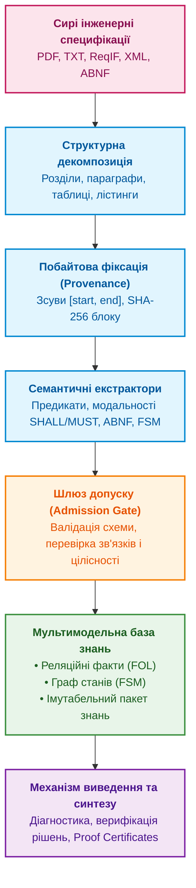
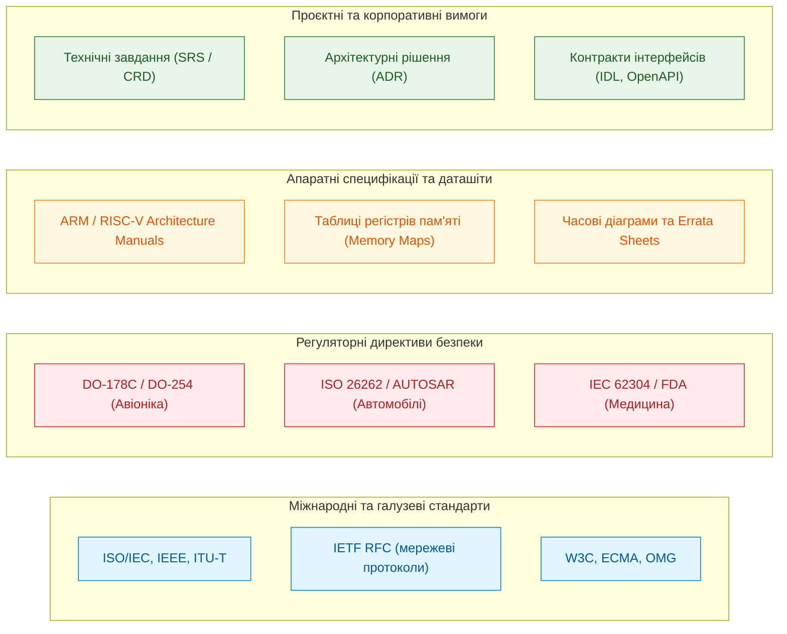
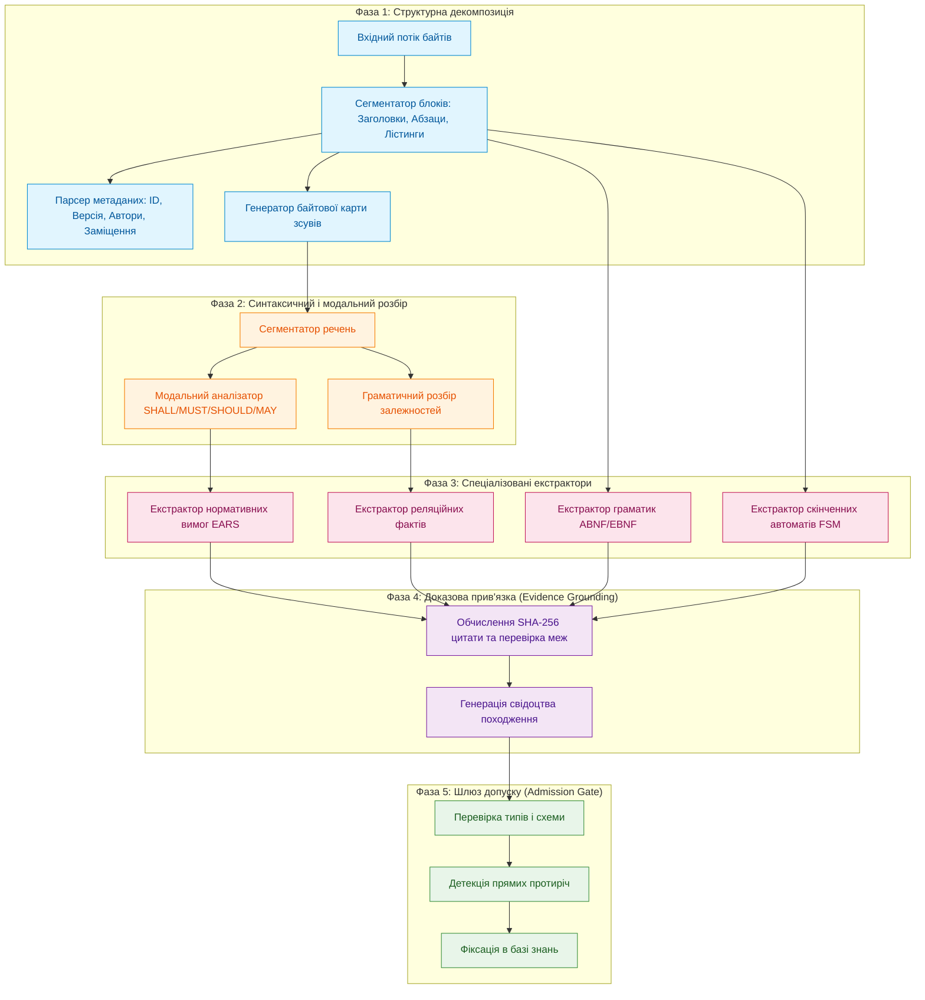
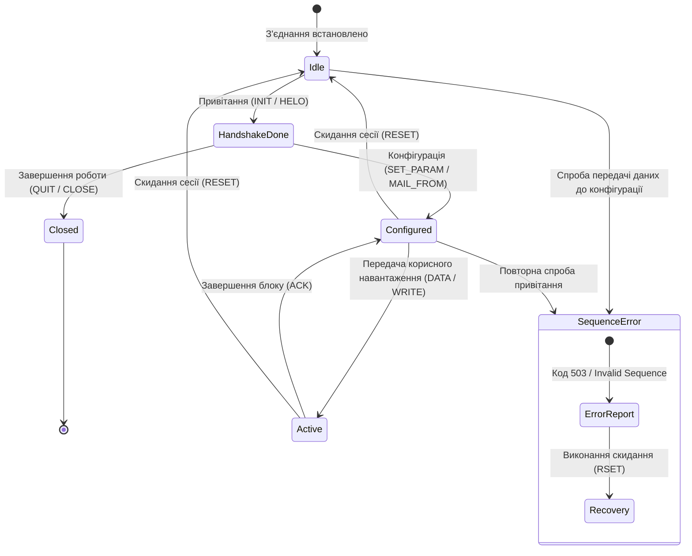
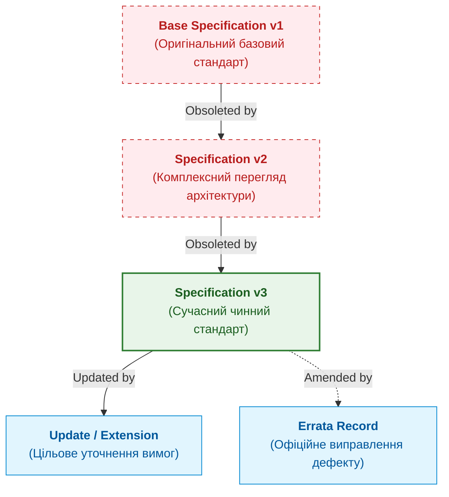
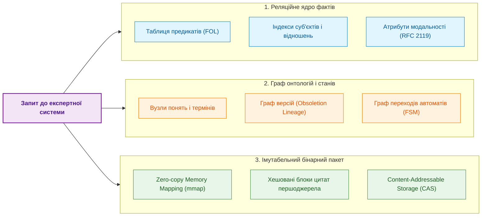
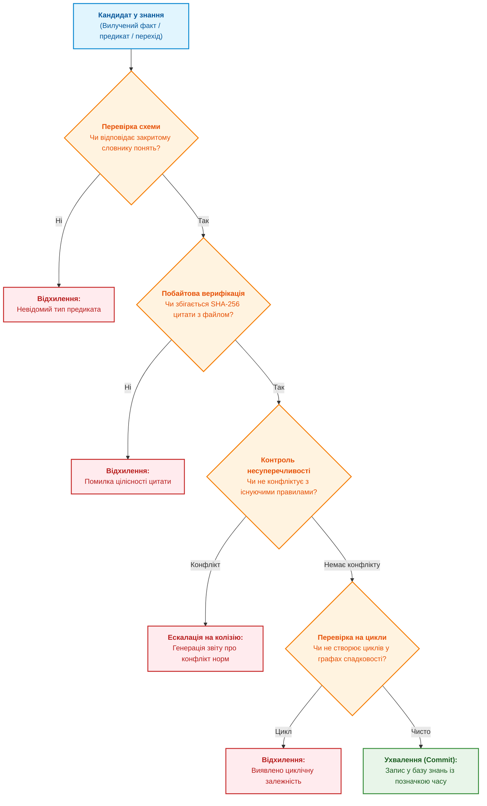
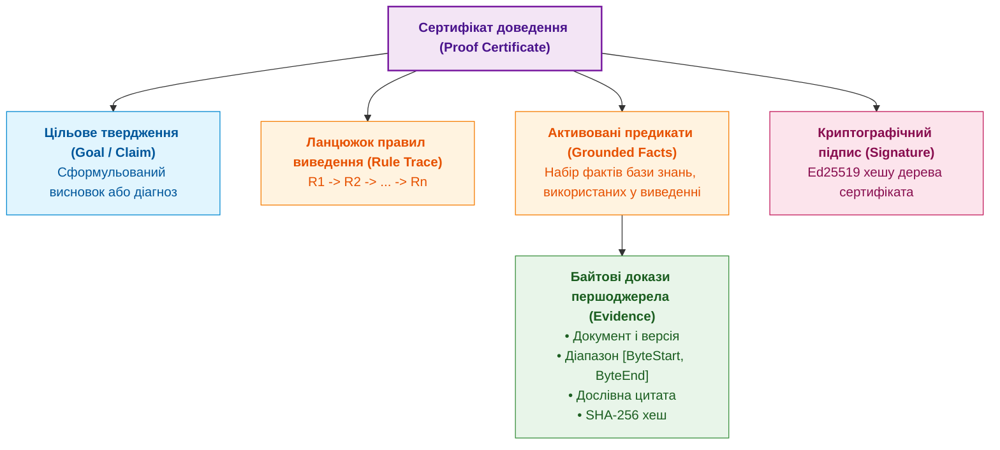

# Глава 15. Екстракція знань і побудова бази знань: від тексту специфікацій до онтологій

> **Книга:** [Архітектура доказових експертних систем](README.md) · [Частина III: Інженерія знань: здобуття, NLP та екстракція з нормативів](part-03-knowledge-engineering-nlp.md)  
> **Попередня глава:** [Глава 14. Детекція вимог та модальностей: від SHALL/MUST до формальних інваріантів](ch14-requirements-detection-and-formalization.md)  
> **Наступна частина:** [Частина IV: Архітектура ядра та логічний висновок](part-04-architecture-and-inference.md)  
> **Наступна глава:** [Глава 16. Архітектура експертної системи: від формального знання до доказового рішення](ch16-expert-systems-architecture.md)  
> **Зміст книги:** [README.md](README.md)  
> **Рівень:** системні архітектори, інженери знань, розробники експертних систем та аналітики складних систем: середній / просунутий  
> **Очікувані результати:** проєктувати наскрізні конвеєри екстракції фактів, предикатів, правил і скінченних автоматів із неструктурованих інженерних корпусів; будувати детерміновані бази знань із доказовою прив'язкою до байтів першоджерела (Evidence Grounding); організовувати комбіновані моделі зберігання (реляційні предикати, графові зв'язки, імутабельні бінарні пакети без копіювання в пам'яті); верифікувати несуперечливість знань і формувати машинно-перевірювані сертифікати доведення (Proof Certificates).

---

В інженерних дослідженнях і розробках складних промислових систем — в авіоніці, автомобільній електроніці, телекомунікаціях чи проектуванні мікропроцесорів — ключовим активом організації є не просто вихідний код чи схемотехніка, а знання, зафіксовані в нормативних документах. Коли інженер розробляє мережевий контролер, захищену операційну систему реального часу або модуль керування приводом, він зобов'язаний дотримуватися сотень взаємопов'язаних специфікацій, стандартів і регламентів.

Проте сучасні інженерні корпуси страждають від трьох хронічних проблем:

1. **Фрагментарність і гігантський обсяг:** десятки тисяч сторінок тексту, схем і таблиць, розподілених між міжнародними стандартами, галузевими директивами, технічними умовами замовника та апаратними описами мікросхем (*datasheets*).
2. **Несумісність форматів і синтаксису:** від структурованих машинозчитуваних схем до сканованих PDF-документів із розмитим форматуванням та неформальними текстовими примітками.
3. **Еволюція та взаємні заміщення:** стандарти регулярно оновлюються, анулюють попередні версії (*obsoletion*), вводять виправлення помилок (*errata*) та специфікують розширення (*extensions*), створюючи багаторівневий лабіринт залежностей.

Спроби вирішити цю проблему за допомогою популярного сьогодні тандему «векторний пошук + велика мовна модель» (*RAG + LLM*) у промисловому інжинірингу зазнають передбачуваного фіаско. Векторний пошук повертає схожі за семантикою фрагменти, але не розуміє суворої логіки відношень: чи замінює стандарт $B$ окремий параграф стандарту $A$, чи вимагає команда $X$ обов'язкового попереднього виконання команди $Y$, і які саме байти першоджерела юридично закріплюють цю вимогу. Генеративна модель може згенерувати переконливий текст, але вона схильна до стохастичних галюцинацій і неспроможна надати математичне доведення того, що її відповідь або синтезоване рішення є детерміновано істинними.

Справжня експертна система працює інакше. Вона розглядає корпус технічної документації не як статичну бібліотеку для читання людиною, а як **нескомпільований вихідний код знання**. Завдання системи — автоматично виконати синтаксичний і семантичний аналіз, витягти атомарні факти, предикати, граматичні контракти й скінченні автомати поведінки, верифікувати їхню цілісність і скомпілювати у формальну базу знань (*Knowledge Base, KB*), придатну для символьного логічного виведення (*Automated Reasoning*) та синтезу рішень.



---

## Таксономія джерел інженерних знань: гетерогенність і семантичні шари

Перед проектуванням екстрактора необхідно розібратися, з якими саме типами артефактів працює експертна система у науково-дослідних та дослідно-конструкторських розробках (*R&D*). Універсального формату інженерного знання не існує: знання зафіксоване в документах різного рівня формалізації, суворості й цільового призначення.



### 1. Міжнародні та галузеві стандарти

Стандарти формулюють універсальні правила взаємодії компонентів, протоколів і систем. Приклади:

- **Стандарти комп'ютерних мереж та інтерфейсів:** наприклад, специфікації *IETF RFC*, які описують роботу протоколів прикладного, транспортного та мережевого рівнів (*HTTP*, *SMTP*, *BGP*, *TLS*). RFC є класичним прикладом текстової специфікації, де поряд із природною мовою обов'язково використовуються формальні граматики **ABNF** (*Augmented Backus-Naur Form*, RFC 5234) для опису синтаксису пакетів і команд.
- **Міжнародні стандарти загального призначення:** *ISO/IEC* (наприклад, стандарти на мови програмування C/C++, формати даних, криптографічні алгоритми) та *IEEE* (наприклад, специфікації локальних мереж *IEEE 802.3 Ethernet* або *IEEE 802.11 Wi-Fi*).

### 2. Регуляторні директиви функціональної безпеки

У критичних доменах стандарт визначає не лише синтаксис інтерфейсу, а й суворий життєвий цикл розробки та верифікації:

- **Авіабудування:** *DO-178C* (програмне забезпечення) та *DO-254* (складна електронна апаратура). Тут кожна нормативна вимога має бути простежена до коду, тестів низького рівня та результатів структурного покриття (*MC/DC*).
- **Автомобільна галузь:** *ISO 26262* (функціональна безпека автомобілів) та стандарти консорціуму *AUTOSAR*, де детально специфіковані рівні цілісності безпеки (*ASIL A–D*) та поведінка базового програмного забезпечення (*BSW*).
- **Медичне обладнання:** *IEC 62304*, що регламентує процеси життєвого циклу ПЗ медичних виробів та класифікує програмні системи за потенційним ризиком для пацієнта.

### 3. Апаратні специфікації та технічні описи мікросхем

Апаратне знання істотно відрізняється від алгоритмічного. Воно зосереджене в описах архітектури процесорів (*Reference Manuals* для архітектур *x86-64*, *ARM*, *RISC-V*), даташітах контролерів і документах опису відомих апаратних помилок (*Errata Sheets*).

Знання тут подано у вигляді:

- Карт розподілу пам'яті (*Memory Maps*), бітових масок і режимів доступу до регістрів (*Read/Write/Clear-on-read*).
- Часових діаграм і граничних параметрів електричних сигналів (частоти тактування, затримки перемикання шин, температурні коефіцієнти).
- Апаратних обмежень та обхідних шляхів (*workarounds*) для невиправних дефектів кремнію.

### 4. Внутрішні проєктні вимоги та архітектурні рішення

Внутрішня документація підприємства (*Customer Requirements*, *Software Requirements Specification*, *Architecture Decision Records*) фіксує конкретні бізнес-правила, обрані патерни проєктування та межі системи. Вона має найвищу динаміку змін, але обов'язково повинна узгоджуватися з вищими за ієрархією галузевими стандартами.

---

## Архітектура конвеєра екстракції знань

Екстракція знань із технічного тексту — це не пошук ключових слів і не «підсумовування» тексту (*summarization*) нейромережею. Це багатостадійний детермінований процес, що перетворює сирий потік символів на типізовані предикати та графи поведінки.



### Фаза 1: Структурна декомпозиція та ідентифікація контексту

Технічний документ володіє суворою внутрішньою ієрархією. Змістове навантаження речення докорінно змінюється залежно від того, де саме воно розташоване: у нормативній частині стандарту, в інформаційному додатку (*Informative Annex*), у секції «Вступ і мотивація» чи в розділі «Зауваження щодо безпеки».

Конвеєр на першому етапі розпізнає структурний каркас:

1. **Ієрархія розділів:** деревовидна структура заголовків (наприклад, `Section 3.2.1`), що визначає локальний контекст дієвості вимог.
2. **Типізація текстових блоків:** відокремлення звичайного тексту від таблиць, кодових лістингів, формальних граматик і ASCII-діаграм.
3. **Метадані версійності:** фіксація глобальних атрибутів документа — унікального ідентифікатора (наприклад, `ISO/IEC 9899:2018`, `DO-178C`, `RFC 5321`), дати публікації, статусу чинності, а також зв'язків заміщення (*Obsoletes*, *Replaces*, *Amends*).

### Фаза 2: Побайтове закріплення першоджерела (Evidence Grounding)

Фундаментальний інженерний інваріант доказової експертної системи говорить: **жоден факт, предикат чи правило не можуть з'явитися в базі знань без прямого зв'язку з незмінним першоджерелом**.

Для забезпечення цього інваріанта під час екстракції формується кортеж доказової прив'язки:

```math
\mathcal{E} = \langle \mathrm{DocID}, \mathrm{ByteStart}, \mathrm{ByteEnd}, \mathrm{SectionPath}, H_{\mathrm{quote}} \rangle
```

де:

- $\mathrm{DocID}$ — незмінний ідентифікатор документа (наприклад, його криптографічний хеш або канонічна назва).
- $\mathrm{ByteStart}, \mathrm{ByteEnd}$ — точні цілочисельні індекси початкового та кінцевого байтів у сирому файлі першоджерела (0-індексація).
- $\mathrm{SectionPath}$ — канонічний шлях у дереві документа (наприклад, `3.5.1 -> Protocol State Machine`).
- $H_{\mathrm{quote}} = \mathrm{SHA256}(\mathrm{bytes}[\mathrm{ByteStart} : \mathrm{ByteEnd}])$ — контрольна сума вилученої текстової цитати.

Такий підхід повністю виключає феномен «фантомних знань». У будь-який момент часу компілятор, аудитор або кінцевий користувач може виконати операцію побайтового зчитування з вихідного файлу та звірити хеш. Якщо файл першоджерела було несанкціоновано модифіковано хоча б на один байт, контрольна сума $H_{\mathrm{quote}}$ стає недійсною, і факт негайно блокується механізмами верифікації.

### Фаза 3: Семантична екстракція компонентів

На цьому етапі працюють паралельні спеціалізовані аналізатори, націлені на вилучення різних типів знання.

#### 1. Екстракція реляційних фактів і параметрів

Технічні специфікації містять велику кількість фіксованих параметрів: порти протоколів, розміри буферів, граничні значення тайм-аутів, бітові маски та діапазони температур.

Екстрактор реляційних фактів виявляє сутності та предикати зв'язку між ними, приводячи їх до атомарної структури:

```math
\mathrm{Fact} = \langle \mathrm{Subject}, \mathrm{Relation}, \mathrm{Value}, \mathrm{Unit}, \mathcal{E} \rangle
```

#### 2. Екстракція модальних вимог та інваріантів

Речення, що містять нормативні модальні оператори (*SHALL*, *MUST*, *REQUIRED* — суворий обов'язок; *SHALL NOT*, *MUST NOT* — безумовна заборона; *SHOULD* — сильна рекомендація; *MAY* — дозвіл), нормалізуються за синтаксичними шаблонами **EARS** (*Easy Approach to Requirements Syntax*). Детальні правила класифікації таких вимог розглянуто в [Главі 14](ch14-requirements-detection-and-formalization.md).

#### 3. Екстракція формальних граматик

Багато стандартів (зокрема протоколи мережного обміну IETF, описи мов консорціуму W3C, промислові шини CAN/Modbus) містять формальні описи синтаксису у нотаціях ABNF або EBNF. Екстрактор виявляє блоки формальної нотації та компілює їх у синтаксичні дерева, перевіряючи коректність визначень правил:

```abnf
command-line   = command-name [ SP command-argument ] CRLF
command-name   = 4ALPHA
```

Скомпільована граматика перетворюється на валідатор синтаксису в складі бази знань, що дозволяє системі під час аналізу інженерних логів чи вихідного коду миттєво перевіряти коректність сформованих пакетів і повідомлень.

#### 4. Ієрархічний структурний чанкінг та оцінка моделей семантичного пошуку

При роботі з масивними нормативними корпусами (державні стандарти, регламенти функціональної безпеки, законодавство) наївне розбиття тексту на фрагменти фіксованої довжини (наприклад, 500 чи 1000 токенів) призводить до руйнування логічних зв'язків.

Як показали практичні дослідження **Володимира Шельмука** під час розробки системи аналізу нормативно-правових корпусів [Юстай](https://yust.ai/) (на масиві понад 308 тисяч фрагментів), ефективна екстракція вимагає **ієрархічного структурного чанкінгу**:

1. **Природні межі документа:** текст ділиться виключно за структурно-ієрархічними одиницями:
   $$\text{Стандарт / Закон} \longrightarrow \text{Розділ} \longrightarrow \text{Глава} \longrightarrow \text{Стаття / Пункт} \longrightarrow \text{Частина / Підпункт}$$
2. **Наскрізні хлібні крихти (Breadcrumbs Metadata):** кожен чанк обов'язково містить повний контекстний шлях розташування норми. Якщо стаття регламентує «Вимоги до гальмівної системи», а підпункт містить лише фразу «має спрацьовувати за 15 мс», чанк забезпечується метаданими про батьківський розділ, усуваючи неоднозначність.
3. **Бенчмаркінг ембедингів для спеціалізованих корпусів:** загальні міжнародні рейтинги (наприклад, MTEB Leaderboard) не відображають якість пошуку для вузькодоменних та україномовних текстів. Емпіричне порівняння моделей (OpenAI `text-embedding-3-large`, Cohere `embed-multilingual-v3.0`, BAAI `bge-m3`, Microsoft `multilingual-e5-large`) доводить:
   * Чистий векторний пошук (Dense Cosine Similarity) втрачає точність при пошуку точних номерів статей, числових допусків і специфічних інженерних термінів.
   * **Гібридний стандарт пошуку:** обов'язкове поєднання векторного індексу HNSW (наприклад, у PostgreSQL через розширення `pgvector`) та повнотекстового лексичного пошуку BM25 за алгоритмом **Reciprocal Rank Fusion (RRF)**:
   $$RRF\_Score(d) = \sum_{m \in \{Dense, BM25\}} \frac{1}{k + \mathrm{rank}_m(d)}$$
   де $k \approx 60$ — константа згладжування рангу. Лише такий гібрид гарантує потрапляння точного нормативного положення до вибірки `top-K`.

---

## Екстракція динаміки: моделювання скінченних автоматів (FSM)

Знання в інженерії — це не лише статичні параметри та обмеження. Більшість технічних систем мають **стан** (*State*), змінюють свою поведінку під дією зовнішніх подій (*Events / Inputs*) і переходять у нові стани (*Transitions*).

Протоколи зв'язку, драйвери периферії, алгоритми керування живленням і захисні інтерлоки завжди функціонують як дискретні автомати. Якщо експертна система не здатна вилучити автоматну логіку зі специфікації, вона не зможе виконати діагностику порушень послідовності дій і не зможе згенерувати коректний сценарій роботи.

### Математична модель скінченного автомата

Скінченний автомат поведінки системи формально визначається класичною п'ятіркою:

```math
\mathcal{M} = \langle S, \Sigma, \delta, s_0, F \rangle
```

де:

- $S = \{s_0, s_1, s_2, \dots, s_n\}$ — скінченна множина допустимих станів системи.
- $\Sigma = \{e_1, e_2, \dots, e_m\}$ — вхідний алфавіт подій або команд.
- $\delta: S \times \Sigma \to S \cup \{\bot\}$ — функція переходів, що ставить у відповідність поточному стану $s \in S$ і вхідній події $e \in \Sigma$ новий стан $s' \in S$ або повертає стан помилки $\bot$, якщо перехід заборонений.
- $s_0 \in S$ — початковий стан системи (наприклад, `IDLE` або `SESSION_OPENED`).
- $F \subseteq S$ — множина кінцевих або термінальних станів (наприклад, `CLOSED`).



### Як вилучається автоматна логіка з тексту

У реальних стандартах скінченні автомати описуються у двох формах:

1. **Явні таблиці переходів або діаграми:** таблиці з колонками «Поточний стан», «Команда», «Наступний стан», «Код відповіді». Вони вилучаються за допомогою табличних парсерів і транслюються у функцію $\delta$ безпосередньо.
2. **Описові текстові вимоги послідовності (*Sequence Rules*):** абзаци природномовного тексту, де зафіксовані попередні умови та обмеження порядку.

Типові лінгвістичні маркери автоматних залежностей:

- **Пререквізити (Prerequisites):** *«Command X MUST NOT be issued before Command Y has completed successfully»*, *«State S requires that Event E has occurred»*.
- **Прив'язка до стану (State-Binding):** *«When in State S, the device SHALL accept only commands A, B, or C»*, *«Any other command in this state MUST be rejected with error code K»*.
- **Переходи скидання (Reset Transitions):** *«Receipt of signal R causes immediate transition to State S_0 regardless of the current state»*.

Екстрактор автоматних правил розпізнає ці шаблони і будує спрямований граф переходів. Для кожного переходу обов'язково фіксуються:

- Допустимі наступні команди: $\mathrm{ValidNextCommands}(s) = \{e \in \Sigma \mid \delta(s, e) \neq \bot\}$.
- Заборонені команди та коди помилок: якщо система отримує $e \notin \mathrm{ValidNextCommands}(s)$, автомат переходить у стан помилки з формуванням діагностичного повідомлення.
- Побайтова прив'язка $\mathcal{E}$ до конкретного пункту стандарту, де описано цей стан і заборону.

---

## Граф походження, версійності та заміщень (Obsoletion & Lineage)

Жоден стандарт або нормативний документ не існує у вакуумі. Інженерне знання розвивається ітеративно: нові версії замінюють старі, доповнюють функціонал або виправляють критичні вразливості та неточності.



### Типологія зв'язків між версіями документів

1. **Повне заміщення (Obsoletes / Supersedes):** документ $B$ повністю анулює документ $A$.
2. **Часткове оновлення (Updates / Amends):** документ $B$ модифікує окремі секції документа $A$.
3. **Офіційні виправлення помилок (Errata):** точкові виправлення дефектів у тексті.
4. **Оголошення застарілим (Deprecates):** функціонал оголошується небажаним для нових розробок.

Для кожного вилученого факту база знань підтримує темпоральні межі достовірності:

```math
\mathrm{Status}(P, \mathrm{Version}) = \begin{cases}
\mathrm{Active}, & \text{якщо } \exists \mathrm{Doc} \in \mathrm{Lineage}(\mathrm{Version}) : \mathrm{Defines}(P, \mathrm{Doc}) \land \neg \mathrm{Obsoleted}(P, \mathrm{Version}) \\
\mathrm{Deprecated}, & \text{якщо } \exists \mathrm{Doc} \in \mathrm{Lineage}(\mathrm{Version}) : \mathrm{Deprecates}(P, \mathrm{Doc}) \\
\mathrm{Obsolete}, & \text{якщо } \exists \mathrm{Doc} \in \mathrm{Lineage}(\mathrm{Version}) : \mathrm{Revokes}(P, \mathrm{Doc})
\end{cases}
```

---

## Організація сучасної бази знань: мультимодельна архітектура

Сучасна база знань для інженерних експертних систем будується як триєдина мультимодельна архітектура.



1. **Реляційно-предикатне ядро:** структуровані таблиці предикатів першого порядку для швидкої детермінованої фільтрації.
2. **Граф онтологій, станів і трасування:** транзитивні обходи залежностей, спадкування та FSM.
3. **Імутабельний бінарний пакет знань (Zero-Copy):** файли пам'яті (`mmap`), вирівняні по межах слів, що забезпечують доступ до знань за $\mathcal{O}(1)$ без алокацій у купі.

---

## Шлюз допуску фактів (Admission Gate) та верифікація цілісності

Кожна порція нових знань проходить обов'язкову перевірку перед збереженням:



### Двокомпонентний конвеєр без галюцинацій: Neural Proposer ➔ Verbatim Host Gate

Поєднання високої семантичної повноти (Recall) мовних моделей із абсолютною строгістю (Precision = 1.0) експертного ядра досягається розподілом ролей:

1. **Нейронний генератор кандидатів (Neural Proposer):**  
   Локальна або хмарна модель читає фрагмент специфікації та пропонує кандидатські атоми у структурованому форматі:
   ```json
   {
     "subject": "TCP Peer",
     "relation": "must_requirement",
     "value": "Send Challenge ACK upon receiving RST with valid SEQ",
     "quote_candidate": "the peer MUST send a Challenge ACK to verify"
   }
   ```
2. **Дослівний шлюз хосту (Verbatim Host Gate / `hostevidence.VerifySpan`):**  
   Детерміноване ядро на Go зчитує вихідний двійковий файл на диску і виконує суворий побайтовий пошук фрагмента `quote_candidate`:
   - Якщо підрядок знайдено дослівно байт-у-байт: обчислюються фізичні координати `[ByteStart, ByteEnd]`, генерується хеш SHA-256 цитати, і факт отримує статус **Admitted**.
   - Якщо знайдено хоча б один змінений символ (парафраз, друкарська помилка, галюцинація): факт **відкидається негайно без шансу на апеляцію** (*Fail-Closed Rejection*).

### Автоматичний конвеєр безперервного збагачення (Continuous Harvesting Pipeline)

Для опрацювання великих нормативних бібліотек (тисячі томів IETF RFC, W3C, ISO) реалізовано фоновий пакетний конвеєр:
- Текстовий корпус автоматично сегментується за заголовками розділів або вікнами з фіксованим перекриттям.
- Екстрактори запускаються паралельно у пулі воркерів із синхронним проходженням через Verbatim Host Gate.
- Усі верифіковані атоми інкрементально додаються до бази знань, а потенційні колізії передаються в детектор суперечностей (*ConflictDetector*).

---

## Верифікація бази знань і машинно-перевірювані сертифікати доведення (Proof Certificates)

В інженерних експертних системах відповідь супроводжується автономним сертифікатом доведення:



Верифікація такого сертифіката виконується автономним валідатором за частки секунди:

```bash
$ system-verifier verify-proof --certificate session_diag_proof.cert
[OK] Certificate signature valid (Ed25519)
[OK] Logical derivation tree verified: 4 inference steps
[OK] Byte evidence matches source documents:
     - RFC 5321 (bytes 45120-45280, SHA-256: 3a9f... matched)
     - RFC 5321 (bytes 51200-51340, SHA-256: c81b... matched)
[VERDICT] PROOF VALID: Claim is mathematically grounded.
```

---

## Порівняльний аналіз: Експертна система vs. Стохастичний підхід (LLM/RAG)

| Характеристика | Експертна система з верифікованою КБ | Наївний підхід (RAG + LLM) |
|---|---|---|
| **Природа результату** | Детерміноване логічне виведення | Ймовірнісна генерація наступного токена |
| **Прив'язка до джерела** | Побайтова точність `[start, end]` із SHA-256 цитати | Приблизний векторний чанк тексту |
| **Обробка станів і послідовностей** | Скінченні автомати (FSM), точна діагностика | Відсутність моделі стану, схильність до плутанини в кроках |
| **Синтаксичні обмеження** | Компіляція граматик ABNF/EBNF у валідатори | Генерація за зразком із можливими синтаксичними помилками |
| **Версійність і заміщення** | Граф походження (Lineage): Obsoletes, Updates | Змішування даних із різних версій у спільній векторній базі |
| **Верифікація результату** | Автономні сертифікати доведення (Proof Certificates) | Неможлива без повторного ручного аудиту людиною |
| **Швидкість повторного виведення** | Мікросекунди (Zero-Copy бінарний пакет у пам'яті) | Секунди (виклики нейромережних API або локальних GPU) |
| **Ціна помилки** | Нульова толерантність (Fail-Closed відмова за відсутності фактів) | Псевдопереконливі галюцинації (мовчазний збій) |

---

## Підсумки Частини III

Ця глава підсумовує **Частину III: Інженерія знань: здобуття, NLP та екстракція з нормативів**. Ми розглянули повний ланцюг:

1. **Здобуття знань (Глави 10–11):** побудова конвеєрів збору, інвентаризації джерел та протоколів інтерв'ювання експертів із фіксацією неявного досвіду.
2. **Лінгвістична обробка (Глави 12–13):** застосування локальних моделей та токенізаторів без втрати побайтової прив'язки до джерела, подолання варіативності мови через компіляцію запиту в семантичний інваріант.
3. **Нормативна екстракція (Глави 14–15):** виявлення предикатів SHALL/MUST, формалізація в EARS/SMT, синтез скінченних автоматів (FSM) та пакування знань в імутабельні бінарні артефакти.

У наступній частині — **[Частині IV: Архітектура ядра та логічний висновок](part-04-architecture-and-inference.md)** — ми перейдемо до серця експертної системи: архітектури рушія виведення, інтерпретації правил Rete/CLIPS, доказових пояснень (Explanation Engines) та контракту безпечних дій у фізичному світі.

---

### Питання для самоперевірки

1. Чому наївний векторний пошук (RAG) не спроможний розв'язати проблему заміщення стандартів (Obsoletion)?
2. Які компоненти входять до кортежу доказової прив'язки (Evidence Grounding) $\mathcal{E}$?
3. Як FSM-модель дозволяє автоматично генерувати негативні тести на конформантність протоколу?
4. Які переваги надає мультимодельна архітектура бази знань у порівнянні з унімодельним сховищем?
5. У чому полягає фундаментальна відмінність сертифіката доведення (Proof Certificate) від пояснення мовної моделі?

---

### Рекомендовані джерела

- D. Crockford. [RFC 5234: Augmented BNF for Syntax Specifications: ABNF](https://www.rfc-editor.org/rfc/rfc5234), IETF, 2008.
- J. Klensin. [RFC 5321: Simple Mail Transfer Protocol](https://www.rfc-editor.org/rfc/rfc5321), IETF, 2008.
- S. Bradner. [RFC 2119: Key words for use in RFCs to Indicate Requirement Levels](https://www.rfc-editor.org/rfc/rfc2119), IETF, 1997.
- ISO/IEC. [ISO/IEC Directives, Part 2: Principles and rules for the structure and drafting of ISO and IEC documents](https://www.iso.org/sites/directives/current/part2/index.xhtml), 2021.
- RTCA / EUROCAE. [DO-178C: Software Considerations in Airborne Systems and Equipment Certification](https://www.rtca.org/standards/), 2011.
- ISO. [ISO 26262-1:2018 — Road vehicles: Functional safety](https://www.iso.org/standard/68383.html), 2018.
- IEC. [IEC 62304:2006+AMD1:2015 — Medical device software: Software life cycle processes](https://webstore.iec.ch/publication/22794), 2015.
- Alistair Mavin, Philip Wilkinson, Adrian Harwood, Mark Novak. [Easy Approach to Requirements Syntax (EARS)](https://doi.org/10.1109/RE.2009.9), *17th IEEE International Requirements Engineering Conference*, 2009.
- John F. Sowa. [Knowledge Representation: Logical, Philosophical, and Computational Foundations](https://www.jfsowa.com/krbook/), Brooks/Cole, 2000.
- Stuart Russell, Peter Norvig. [Artificial Intelligence: A Modern Approach](https://aima.cs.berkeley.edu/), 4th Edition, Pearson, 2020.
- Robin Milner. [A Theory of Type Polymorphism in Programming](https://doi.org/10.1016/0022-0000(78)90014-4), *Journal of Computer and System Sciences*, 1978.
- Володимир Шельмук. [Практика побудови доменних RAG-систем: ієрархічний чанкінг та бенчмаркінг ембедингів для складних нормативних корпусів](https://yust.ai/), Yust.ai Engineering, 2026.

---

[← Попередня глава](ch14-requirements-detection-and-formalization.md) · [Частина III](part-03-knowledge-engineering-nlp.md) · [Зміст](README.md) · [Наступна частина →](part-04-architecture-and-inference.md)
