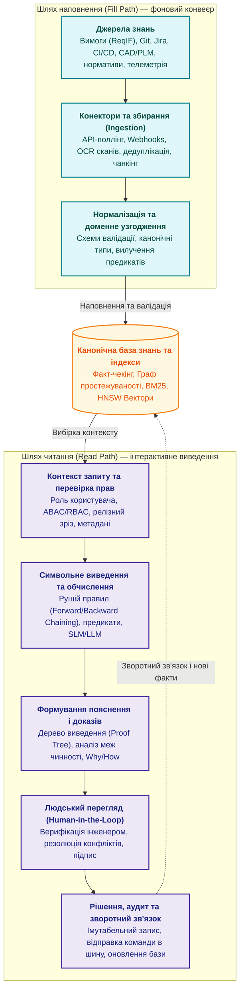
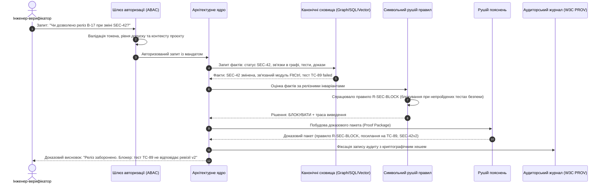
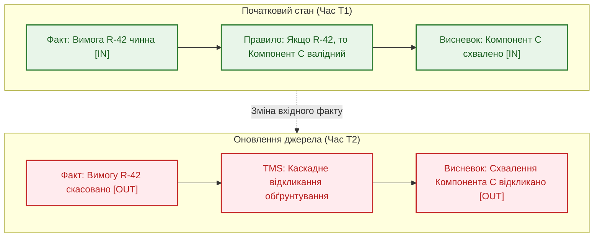
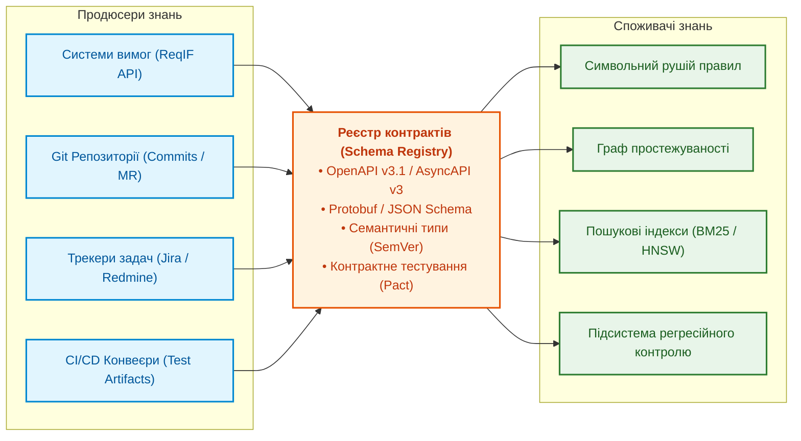

# Глава 16. Архітектура експертної системи: від формального знання до доказового рішення

> **Книга:** [Архітектура доказових експертних систем](README.md) · [Частина IV: Архітектура, виконання та механізми висновку](part-04-architecture-and-inference.md)  
> **Попередня глава:** [Глава 15. Екстракція знань та конструювання бази знань](ch15-knowledge-extraction-and-kb-construction.md)  
> **Наступна глава:** [Глава 17. Технологічний стек: критерії вибору інструментів, мов програмування та рушіїв правил](ch17-implementation-stack.md)  
> **Зміст книги:** [README.md](README.md)  
> **Рівень:** системні архітектори, інженери знань, розробники експертних систем: середній / просунутий  
> **Очікувані результати:** проєктувати модульну архітектуру промислової експертної системи; розмежовувати канонічне архітектурне ядро та адаптери виконання; організовувати незалежні потоки наповнення знань (Fill Path) та детермінованого виведення (Read Path); проєктувати фізичні форми зберігання фактів і правил під строгі гарантії відтворюваності; будувати контракти даних між підсистемами та впроваджувати багаторівневий регресійний контроль.

Попередні глави розібрали математичний апарат експертних систем та методи формалізації інженерних знань. Але набір бібліотек і моделей ще не є цілісною системою. Потрібна архітектура: чіткі межі відповідальності, розділені потоки знань, надійні сховища, правила, вектори, механізми пояснення, людський перегляд і доказовий аудит.

Ця глава відкриває архітектурний блок книги. Тут ми зосередимося на логічному шарі: що таке знання в інженерному сенсі, де воно зберігається, чому векторна база не може бути єдиним джерелом істини, як проходить один запит, як працюють підтримання істинності, безпека, контракти, режими відмов, калібрування і походження (provenance). Фізичний бік інфраструктури (де це виконується, як живуть моделі на CPU/GPU/NPU, вимоги до затримок та апаратні обмеження) буде детально розглянуто у [Главі 18](ch18-execution-infrastructure.md).

Сучасна експертна система для досліджень і розробки (*Research and Development*, R&D) не має єдиного монолітного центру. Це не «великий чат над документами» і не «один рушій правил над таблицею». У ній співіснують кілька класів істини: детерміновані факти, логічні правила, граф зв'язків, лексичний пошук, векторні подання, навчені моделі, пояснення, людські рішення і машинно-перевірюваний доказовий слід. Архітектура відповідає на питання, *з чого* складається система і *чому* саме так.

Доказовість тут — не окремий тип системи, а фундаментальна властивість її відповідей: будь-який висновок зобов'язаний спиратися на першоджерела, факти, формальні правила, версії, зафіксовані припущення, явно виявлені прогалини і верифіковану роль експерта, який відповідає за перегляд.

> **Практичний досвід.** Практичні зауваження в тексті описують рішення, перевірені в реальних інженерних проєктах. Вони демонструють експлуатаційний досвід і межі конкретних архітектурних патернів, але вимагають адаптації під специфіку домену, профіль навантаження, формати даних і регуляторні вимоги безпеки.

> **Трасування архітектурних шарів.** Наскрізні системні властивості спираються на конкретні класи технологічних інструментів та формальний математичний апарат:
>
> | Архітектурний шар | Технологічний клас | Математичний апарат |
> |---|---|---|
> | Безпека і політики доступу | Рушії політик доступу | Формальні обмеження, предикатна логіка |
> | Контракти даних між підсистемами | Мови запитів, типізовані схеми | Теорія типів, реляційна алгебра, інваріанти цілісності |
> | Походження і життєвий цикл знань | Інструменти родоводу даних (Lineage) | Графи доказів, орієнтовані ациклічні графи (DAG) |
> | Калібрування якості і регресія | Оцінювання пошуку й генерації | Метрики ранжування, статистика невизначеності |
> | Координація викликів моделей | Оркестрація та обслуговування моделей | Теорія розкладів, скінченні автомати |

---

## Архітектурне ядро і межі системи

**Архітектурне ядро експертної системи** — це контрольована частина системи, яка володіє смисловим змістом рішення: доменною моделлю, канонічними фактами, правилами, обмеженнями, графом зв'язків, доказами, політиками доступу, життєвим циклом знань і повною трасою міркування. Саме ядро дає авторитетні відповіді на ключові питання:

- які знання є чинними на даний момент часу;
- які правила були застосовані і в якому порядку;
- чому саме цей висновок є юридично або технічно дозволеним;
- на які першоджерела спирається кожен крок дедукції;
- як точно відтворити весь ланцюг рішення через місяць чи рік.

Тому ядро не можна ототожнювати з допоміжними інструментами навколо нього. Пошуковий рушій, векторна база даних, велика мовна модель (*Large Language Model*, LLM) або середовище виконання моделей можуть бути вкрай корисними, але вони не мають права самостійно вирішувати, що є істинним. Їхнє завдання — постачати кандидатів, виконувати статистичні розрахунки, знаходити семантичну схожість або формулювати текст. Рішення стає експертним лише тоді, коли архітектурне ядро пропускає ці результати через формальні правила, інваріанти, перевірку походження та формує доказовий слід.

Компоненти системи поділяються на три архітектурні групи:

| Група | Що входить | Хто володіє логікою |
|---|---|---|
| **Архітектурне ядро** | Доменна модель, канонічна база знань, правила, інваріанти, граф доказів, політики, аудит, життєвий цикл знань | Власна експертна система |
| **Власні функціональні підсистеми** | Конектори, збирання даних, нормалізація, нарізання фрагментів, індексація, калібрування, пояснення, людський перегляд, зворотний зв'язок | Власна система (фіксація контрактів і якості знань) |
| **Сторонні інтегровані сервіси** | Сховища даних, пошукові рушії, векторні СУБД, середовища виконання моделей, LLM, модулі OCR, системи PLM/ALM, трекери задач, CI/CD, реєстри моделей | Зовнішні інструменти виконують обчислення, але не володіють експертним рішенням |

Цей розподіл критично важливий для забезпечення керованості системи:

1. Якщо стороння мовна модель припускається галюцинації, ядро розпізнає це як порушення інваріанту або брак доказів і блокує хибний висновок.
2. Якщо пошуковий індекс пошкоджено або застарів, ядро детерміновано перебудовує його з канонічного сховища.
3. Якщо зовнішній трекер задач змінює схему полів, шар конекторів і нормалізації локалізує зміну в межах контракту даних, запобігаючи руйнуванню правил виведення.

> **Практичний досвід.** Практична межа будується суворо: архітектурне ядро не ототожнюється з LLM чи векторним індексом. Ядро володіє доменними сутностями, правилами, статусами, трасою рішення і незмінним журналом аудиту. Пошук, вектори, конектори й нейромережеві рантайми підключаються як змінні виконавчі адаптери: вони можуть тимчасово деградувати або замінюватися, але не мають права приймати остаточні експертні висновки.

---

## Що таке знання в інженерному сенсі

Для експертної системи знання — це не просто неструктурований текст. Інженерний документ може бути первинним джерелом знання, але сам по собі він не є операційним знанням у машинному розумінні.

Операційне знання має типізовану структуру, власника, версію, життєвий статус, джерело походження, область застосування, зв'язки з іншими артефактами, часові межі чинності та формальні правила використання. Затверджена нормативна вимога, чернетка інженерної нотатки, уточнення від постачальника, звіт про випробування та коментар у чаті мають принципово різний онтологічний статус, навіть якщо всі вони написані однією природною мовою.

Структурні складові знання:

- **Факти:** описують верифікований стан системи чи середовища (*вимога REQ-101 затверджена*, *тест TEST-404 провалено*, *дефект DEF-12 має критичний статус*).
- **Правила:** формалізують детерміновані причинно-наслідкові зв'язки та логіку рішень (*якщо критичний дефект зачіпає підсистему безпеки, перехід до етапу польових випробувань блокується*).
- **Онтології:** задають строгу систему понять і відношень предметної області (*що є вимогою, компонентом, тестом, ризиком, сертифікаційним доказом*).
- **Обмеження та інваріанти:** визначають заборонені стани (*вимога рівня Safety Integrity Level 3 не може вважатися закритою без двох незалежних звітів верифікації*).
- **Прецеденти (кейси):** структурований емпіричний досвід (*історія усунення кавітації в насосних вузлах, прецеденти узгодження винятків*).
- **Походження (Provenance):** машинно-перевірюваний родовід знання (*хто вніс факт, на підставі якого нормативу, у якій ревізії, за яких припущень*).

База знань — це не каталог розрізнених файлів. Це суворо контрольований граф взаємопов'язаних артефактів, які система може формально перевіряти на несуперечливість, комбінувати у логічні висновки, пояснювати та відкликати.

---

## Фізичні форми знань

Одне й те саме інженерне знання не має універсального формату зберігання. Вимога, тест, дефект, доказ, логічне правило, ваги моделі та аудиторська подія описують той самий життєвий цикл системи, але запитуються з різними гарантіями: десь потрібні ACID-транзакції, десь обхід зв'язків у графі, десь лексичний пошук BM25, а десь векторизація ембедингами.

```mermaid
flowchart TB
    accTitle: Фізичні форми зберігання знань
    accDescr: Розподіл інженерних знань за трьома категоріями сховищ - структуровані дані, пошук та керованість.

    K["<b>Фізичні форми знань</b>"]

    subgraph Structured["Структуровані дані"]
        direction LR
        R["<b>Реляційна СУБД</b><br/>Таблиці, JOIN, ACID, транзакції"]
        G["<b>Графова СУБД</b><br/>Вузли, ребра, простежуваність"]
        RDF["<b>RDF / OWL Сховище</b><br/>Трійки, дескриптивна логіка"]
        D["<b>Документна СУБД</b><br/>JSON-схеми, гнучкі артефакти"]
    end

    subgraph Retrieval["Пошук і першоджерела"]
        direction LR
        S["<b>Лексичний індекс</b><br/>BM25, токени, фасети, N-грами"]
        V["<b>Векторна СУБД</b><br/>HNSW, IVF, семантична схожість"]
        O["<b>Об'єктне сховище</b><br/>PDF, CAD-моделі, бінарні дампи"]
    end

    subgraph Governance["Керованість і відтворюваність"]
        direction LR
        A["<b>Журнал аудиту</b><br/>Append-only, W3C PROV, хеші"]
        M["<b>Реєстр моделей</b><br/>Картки моделей, ваги, квантування"]
    end

    K --> R
    K --> G
    K --> RDF
    K --> D
    K --> S
    K --> V
    K --> O
    K --> A
    K --> M

    classDef root fill:#e1f5fe,stroke:#0288d1,stroke-width:2px,color:#01579b;
    classDef struct fill:#e8f5e9,stroke:#2e7d32,stroke-width:2px,color:#1b5e20;
    classDef retr fill:#fff3e0,stroke:#e65100,stroke-width:2px,color:#bf360c;
    classDef gov fill:#ede7f6,stroke:#512da8,stroke-width:2px,color:#311b92;

    class K root;
    class R,G,RDF,D struct;
    class S,V,O retr;
    class A,M gov;
```

Специфіка фізичних форм:

- **Реляційні таблиці:** зберігають сутності з фіксованими атрибутами, реляційними ключами та гарантіями цілісності (статуси погоджень, версії специфікацій, користувацькі ролі).
- **Графові структури:** оптимізовані для швидкого пошуку шляхів, аналізу впливу змін (Change Impact Analysis) та простежуваності між вимогами, кодом і тестами.
- **RDF/OWL трійки:** необхідні для автоматичного онтологічного виведення на основі стандартів W3C.
- **Документні сховища:** утримують складні структуровані звіти, налаштування та контекст інженерних сесій.
- **Пошукові індекси:** забезпечують миттєву фільтрацію за точними ідентифікаторами (номер стандарту, пункт регламенту, код деталі), фасетну навігацію та повнотекстовий пошук за лексичними токенами.
- **Векторні індекси:** слугують для пошуку семантично схожих прецедентів, нормативів зі схожим змістом при різній термінології та контекстних фрагментів для генерації.
- **Об'єктні сховища:** надійно зберігають оригінальні бінарні файли (скани актів, нормативні PDF, графіки телеметрії) з фіксацією криптографічних контрольних сум SHA-256.
- **Журнали аудиту:** імутабельні структури (Append-only), що фіксують хронологію виведення, спрацьовані правила та рішення експертів.
- **Реєстри моделей:** версіонують метадані, метрики точності, квантування та артефакти навчених SLM/LLM.

> **Практичний досвід.** Не намагайтеся будувати систему на одній універсальній базі даних. Керовані факти, правила і статуси мають зберігатися в канонічній транзакційній формі; взаємозв'язки — у графі простежуваності; лексичний і векторний шари — як похідні індекси, що підлягають швидкій перебудові; а оригінальні файли — в імутабельному об'єктному сховищі. Такий поліглотний підхід вимагає дисципліни в синхронізації, зате кожен запит обробляється тим рушієм, який спроєктований саме для цього типу операцій.

---

## Чому не можна все покласти у векторну базу

Векторна база даних відповідає на вузьке питання: «які текстові фрагменти мають найближче семантичне представлення у багатовимірному векторному просторі». Векторизація проектує зміст тексту на простір ембедингів, зводячи пошук до обчислення косинусної відстані або скалярного добутку.

Це потужний механізм семантичного зіставлення, але він принципово не здатний самостійно відповісти на інженерні та регуляторні запитання:

- Чи є цей пункт стандарту чинним на дату випуску виробу?
- Чи скасовано цю вимогу пізнішим коригувальним бюлетенем?
- Чи має запитувач допуск безпеки для перегляду зазначеного фрагмента?
- Чи не суперечить знайдений уривок нормативу суворому обмеженню безпеки з іншого документа?

Якщо побудувати систему виключно на векторному пошуку над нарізаними фрагментами (chunks), ми отримаємо семантичний RAG, який упевнено цитуватиме застарілі інструкції, нечинні ГОСТи чи внутрішньо суперечливі правила.

**Архітектурний інваріант:** Векторний пошук повертає виключно кандидатів, збагачених повними метаданими:

- унікальний ідентифікатор канонічного джерела;
- номер ревізії та часова мітка чинності;
- юридичний статус (чинний, відкликаний, на перегляді);
- мітка класифікації доступу (Security Label);
- контрольна сума первинного артефакта;
- fingerprint конвеєра векторизації (назва моделі ембедингу, параметри нормалізації, розмір вікна).

Лише після перевірки метаданих детермінованим шаром правил і графом простежуваності знайдені кандидати можуть отримати статус доказових фактів.

---

## Референсна архітектура

Референсна архітектура доказової експертної системи базується на принциповому розведенні двох асинхронних контурів:

1. **Шлях наповнення (Fill Path):** фоновий конвеєр перетворення різнорідних сирих інженерних джерел на канонічні, структуровані та провалідовані знання.
2. **Шлях читання та виведення (Read Path):** синхронний або квазісинхронний конвеєр обробки запиту через контекст, доступ, вибірку фактів, дедуктивні правила, генерацію пояснень та фіксацію аудиторського сліду.

Функціональні компоненти підсистем:

- **Конектори джерел:** ізолюють протоколи зовнішніх систем (Jira, GitLab, Siemens Polarion, PTC Windchill, Confluence), гарантуючи стабільний імпорт подій та документів.
- **Конвеєр Ingestion:** виконує розбір складних форматів (PDF, DOCX, ReqIF, XML), витягує таблиці й формули, проводить OCR низькоякісних креслень, вираховує геш-суми та формує W3C PROV-O метадані.
- **Шар нормалізації:** конвертує різнорідні дані у єдину онтологічну структуру, перетворює специфічні ідентифікатори на глобальні URN, гармонізує одиниці вимірювання (SI).
- **Символьна машина виведення:** ядро дедуктивних міркувань (алгоритми Rete, Datalog, дескриптивна логіка), що перевіряє правила, знаходить протиріччя та обчислює інженерні формули.
- **Шар пояснення:** формує аудиторське дерево доведення (Proof Tree), надаючи інженеру прозоре обґрунтування: які правила спрацювали, які факти стали основою і яких даних забракло для категоричного твердження.
- **Модуль контролю повноважень (Human-in-the-Loop):** регулює поріг автономності системи, перенаправляючи критичні висновки на затвердження експертам відповідного рівня сертифікації.

---

## Життєвий цикл запиту: від запитання до доказового пакета

Розглянемо проходження запиту на реальному інженерному прикладі:  
*«Чи дозволено випуск релізу бортового програмного забезпечення версії B-17 після зміни вимоги з кібербезпеки SEC-42?»*

Обробка запиту проходить п'ять суворо контрольованих етапів:

Деталізація етапів обробки:

| Крок | Дія підсистеми | Задіяні компоненти | Результат кроку |
|---|---|---|---|
| **1. Контекст і безпека** | Аутентифікація інженера, визначення проєкту, ролі, рівня допуску (ABAC) та релізної гілки | Шлюз безпеки, сервіс політик | Валідований контекст із фільтрами доступу |
| **2. Вибірка фактів** | Отримання статусу вимоги SEC-42, обхід графа простежуваності для пошуку зв'язаних компонентів, вилучення звітів тестів | Графова СУБД, реляційне сховище, пошуковий індекс | Набір перевірених фактів із метаданими ревізій |
| **3. Правила та інференс** | Зіставлення фактів із формальними релізними критеріями безпеки | Символьний рушій правил (Datalog / Rete) | Логічний висновок (Блокування релізу) та перелік порушених інваріантів |
| **4. Синтез пояснення** | Агрегація доказового пакета: зв'язок зміненої вимоги, коду, проваленого тесту TC-89 та правила R-SEC-BLOCK | Рушій пояснень, SLM (якщо потрібен стислий текстовий опис) | Структурований доказовий пакет із точними посиланнями |
| **5. Рішення та аудит** | Фіксація резолюції експерта або автоматичного вето в аудиторському журналі | Підсистема аудиту, брокер подій | Машинно-підписаний сертифікат рішення |

---

## Підтримання істинності: динаміка мінливого знання

В інженерних системах знання динамічне: специфікації оновлюються, стандарти доповнюються, тести повторно виконуються. Будь-яка система, що претендує на доказовість, повинна вирішувати проблему: що відбувається з раніше прийнятими висновками, коли вихідний факт спростовано або змінено?

Без вбудованої системи підтримання істинності (*Truth Maintenance System*, TMS) база знань перетворюється на звалище застарілих і взаємно суперечливих відповідей.

Типи TMS в архітектурі:

1. **Justification-based TMS (JTMS):** кожне твердження маркується як `IN` (дійсне) або `OUT` (недійсне) на основі наявності активного ланцюга обґрунтувань. Якщо факт-підстава відкликається, весь залежний граф тверджень автоматично переводиться у стан `OUT`.
2. **Assumption-based TMS (ATMS):** підтримує множинні контексти одночасно, дозволяючи моделювати гіпотетичні сценарії («що станеться з допуском системи, якщо вага конструкції зросте на 5%»).

> **Практичний досвід.** Реалізувати повний ATMS для всієї інженерної бази — надзвичайно ресурсомістка задача. На практиці ефективно працює прагматичний комбінований підхід: на рівні графа будується DAG (орієнтований ациклічний граф) залежностей між артефактами. Зміна первинного факту ініціює подію недійсності, яка скидає статус готовності залежних вузлів, вимагаючи повторного детермінованого прогону правил виведення для оновлення сертифіката.

---

## Контракти даних між підсистемами

Підсистеми експертної системи повинні взаємодіяти виключно через строго типізовані версіоновані контракти даних (*Data Contracts*). Прямий доступ компонентів до внутрішніх таблиць або випадкових неструктурованих payload призводить до прихованих відмов: коли джерело змінює назву атрибута, правила мовчки перестають знаходити факти, а система формує хибно-позитивні схвалення.

Елементи специфікації контракту:

- **Семантичне версіонування (SemVer):** будь-яка незворотна зміна схеми генерує мажорну версію події (наприклад, `EngineeringRequirementUpdated.v2`).
- **Схема структури (JSON Schema / Protobuf):** суворо фіксує типи полів, діапазони допустимих значень, обов'язковість наявності атрибутів походження та криптографічних підписів.
- **Політика сумісності:** гарантує зворотну сумісність (Backward Compatibility) схем у Schema Registry, запобігаючи зупинці черг обробки.
- **Контрактне тестування:** автоматичні тести у CI/CD перевіряють здатність усіх споживачів коректно розбирати повідомлення продюсера до релізу змін у продакшн.

---

## Режими відмов та архітектурна протидія

Надійна архітектура оцінюється не тим, як вона працює у штатному режимі, а тим, як вона локалізує та компенсує відмови. Для експертної системи критичну небезпеку становлять «тихі» збої — коли сервіс не падає, але генерує юридично чи технічно небезпечний висновок через неповні або спотворені дані.

| Архітектурний шар | Типовий режим прихованої відмови | Наслідки для системи | Механізм протидії та захисний інваріант |
|---|---|---|---|
| **Конектори джерел** | Тихе часткове переривання синхронізації (Network Timeout) | Втрата критичних оновлень; виведення спирається на неповні факти | Watermarking, звірка контрольних сум із джерелом, статус `DEGRADED_SOURCE`, що блокує фінальні рішення |
| **Нормалізація** | Некоректне маплення семантичних статусів (наприклад, `Resolved` як `Closed`) | Правила помилково вважають дефект закритим і пропускають реліз | Карантинний буфер для нерозпізнаних значень, строгі доменні словники (Enum), валідація на вхідному шлюзі |
| **Граф знань** | Виникнення «висячих» вузлів та застарілих зв'язків після видалення сутностей | Невірний аналіз впливу; ризик залишається непоміченим | Каскадні транзакції, періодичні cron-перевірки ізольованих підграфів, W3C PROV-O валідація зв'язків |
| **Рушій правил** | Недетермінований порядок спрацьовування правил при спільній пам'яті | Неповторюваність результату на однакових вхідних фактах | Заборона модифікації глобального стану, сувора детермінована черга пріоритетів (Salience), ізоляція фактів сесії |
| **Векторний індекс** | Змішування ембедингів від різних ревізій моделей або різного chunking | Помилковий семантичний пошук, галюцинації при вибірці контексту | Збереження fingerprint конвеєра з кожним вектором, ізольовані індекси, обов'язкова повна переіндексація при оновленні моделі |
| **Генеративна модель (LLM)** | Непідтверджена галюцинація, генерація тексту без посилань на джерело | Формування хибного доказового пакета, введення аудитора в оману | Attribution Enforcement: автоматичне співставлення тверджень із цитатами з канонічної бази, вето при відсутності посилання |

---

## Калібрування якості та регресійний контроль

Підтримка надійності експертної системи вимагає постійного регресійного тестування всіх її складових. Якщо в системі оновлюється словник, додається нове правило або змінюється модель векторизації, розробник повинен мати об'єктивні метрики, що підтверджують відсутність деградації якості.

Багаторівневий контур оцінювання:

1. **Тестування правил:** набір еталонних інженерних сценаріїв (Gold Test Suites), для кожного з яких зафіксовано обов'язковий набір активованих правил, похідних фактів і фінальних резолюцій.
2. **Оцінювання пошуку (Information Retrieval):** регулярний розрахунок метрик ранжування над еталонними запитами:
   - **Recall@k:** повнота знаходження всіх релевантних нормативів серед перших $k$ результатів;
   - **Precision@k:** частка справді релевантних пунктів у вибірці;
   - **MRR (Mean Reciprocal Rank):** позиція першого критично важливого джерела у видачі;
   - **nDCG (Normalized Discounted Cumulative Gain):** якість ранжування результатів з урахуванням ваги їхньої важливості.
3. **Оцінювання точності генерації (RAG Triad):**
   - *Context Relevance:* наскільки витягнуті фрагменти релевантні запиту;
   - *Groundedness (Faithfulness):* чи кожне слово генеративного пояснення строго спирається на наданий контекст;
   - *Answer Relevance:* чи відповідає сформульований висновок на поставлене запитання.
4. **Калібрування впевненості (Confidence Calibration):** числове значення ймовірності або впевненості, яке повертає статистичний класифікатор чи нейромережа, повинно відповідати емпіричній частоті правильних відповідей (Expected Calibration Error, ECE).

---

## Версіонування та походження (W3C PROV-O)

Головна обіцянка доказової системи — здатність через роки відтворити повний стан знань, на підставі якого було схвалено критичне рішення. Збереження фінального текстового звіту для цього недостатньо.

Версіонуванню підлягають:

- версії нормативних документів і специфікацій вимог;
- пакети логічних правил і декларативних обмежень;
- онтологічні схеми та класифікатори понять;
- моделі ембедингів, ваги квантованих нейромереж і системні промпти;
- конфігурації алгоритмів розбиття на чанки (Chunking Strategies);
- матриці прав доступу користувачів на момент запиту.

Стандарт **W3C PROV-O** формалізує взаємозв'язки між трьома базовими поняттями:

- **Entity (Сутність):** будь-який артефакт даних (документ, факт, правило, ембединг, доказовий пакет).
- **Activity (Діяльність):** процес перетворення (парсинг ReqIF, розрахунок правил, векторизація, людський перегляд).
- **Agent (Агент):** відповідальна сторона процесу (сервісний конектор, модель-екстрактор, конкретний інженер).

Використання W3C PROV-O перетворює журнал аудиту з плоского текстового логу на структурований граф походження (Lineage Graph), придатний для автоматизованого судового аудиту та верифікації регуляторами.

---

## Сім практичних уроків архітектури

1. **Доказовий пакет — це офіційний інтерфейс системи.** Зовнішнім результатом роботи експертної системи є не число, не текстовий рядок і не статус `true/false`, а повний доказовий пакет (Proof Package), що містить висновок, ланцюг використаних правил, цитати з верифікованих джерел, перелік припущень та ідентифікатор особи чи агента, що прийняв рішення.
2. **Індекс — це лише похідна структура, а не джерело істини.** Єдиним авторитетним джерелом істини є канонічна база фактів і правил. Будь-який пошуковий чи векторний індекс може бути знищений і наново детерміновано синтезований з канонічного сховища. Зміна джерела без інвалідації похідних індексів — критичний архітектурний дефект.
3. **Векторний ембединг без метаданих конвеєра не має сенсу.** Семантичний вектор валідний виключно в парі з повним цифровим відбитком (fingerprint) усього конвеєра: `hash(model_name, weights_revision, chunk_size, overlap, tokenizer_version)`. Змішування векторів різного походження в одному просторі неприпустиме.
4. **Імена тем та подій є невіддільною частиною доменної схеми.** Зміна назви події або атрибута в брокері повідомлень без зміни мажорної версії контракту призводить до втрати фактів машиною виведення.
5. **Внутрішня структура СУБД не повинна просочуватися в API.** Публічні та міжсервісні інтерфейси повинні оперувати стійкими доменними поняттями стандарту, приховуючи особливості фізичної оптимізації реляційних таблиць чи графових вузлів.
6. **Журнал знань проєктується як Append-only сховище.** Інженерне знання не видаляється. Будь-яка зміна або анулювання правила чи вимоги є новою транзакцією відкликання, що фіксує автора, час та обґрунтування.
7. **Правила виведення не повинні розділяти спільний змінний стан.** Логічне правило — це чиста детермінована функція вхідних фактів і власного контексту. Будь-які неявні глобальні змінні руйнують відтворюваність і роблять доведення недійсним.

---

## Резюме глави

Референсна архітектура доказової експертної системи об'єднує два взаємопов'язані цикли: асинхронний контур наповнення знань (Fill Path) та інтерактивний контур дедуктивного виведення (Read Path). Її архітектурне ядро володіє доменною онтологією, канонічними фактами, правилами, графом зв'язків та незмінним журналом аудиту, тоді як зовнішні пошукові системи та нейромережеві моделі слугують підпорядкованими адаптерами виконання.

Стійкість такої архітектури спирається на чіткі контракти даних між компонентами, механізми каскадного підтримання істинності (TMS), багаторівневий регресійний контроль і суворе дотримання стандартів походження даних W3C PROV-O.

Наступна глава розглядає практичний технологічний стек: як обрати мови програмування, рушії предикатної логіки та спеціалізовані бібліотеки для побудови компонентів цієї архітектури.

---

## Питання для самоперевірки та дискусії

1. **Архітектурні межі:** У чому полягає принципова різниця між роллю великої мовної моделі (LLM) та роллю символьного ядра експертної системи? Чому LLM не повинна бути джерелом експертного вердикту?
2. **Контури обробки:** Чому архітектурно небезпечно виконувати розбір інженерних нормативів (PDF, ReqIF) безпосередньо під час запиту користувача? Які ризики це створює для контуру читання (Read Path)?
3. **Підтримання істинності:** Як підсистема JTMS реагує на виявлення помилки у первинному регламенті, на підставі якого вже було сертифіковано серію виробів?
4. **Контракти даних:** Які інструменти дозволяють гарантувати, що зміна структури логів у CI/CD конвеєрі не викличе прихованої відмови в предикатних правилах релізного шлюзу?
5. **Аудит і походження:** Яку структуру має граф походження стандарту W3C PROV-O для факту схвалення інженерного вузла? Назвіть відповідні сутності (Entity), процеси (Activity) та агентів (Agent).

---

## Література та першоджерела

- Timothy Lebo, Satya Sahoo, Deborah McGuinness (ред.). [*PROV-O: The PROV Ontology*](https://www.w3.org/TR/prov-o/), W3C Recommendation, 2013. Стандарт побудови графів походження та доказовості знань.
- W3C. [*OWL 2 Web Ontology Language Document Overview*](https://www.w3.org/TR/owl2-overview/) та [*Shapes Constraint Language (SHACL)*](https://www.w3.org/TR/shacl/). Специфікації для онтологічного моделювання та валідації графів знань.
- OpenAPI Initiative. [*OpenAPI Specification v3.1*](https://spec.openapis.org/oas/latest.html). Стандарт опису синхронних інтерфейсів та контрактів даних.
- AsyncAPI Initiative. [*AsyncAPI Specification v3.0*](https://www.asyncapi.com/docs/reference/specification/latest). Індустріальний стандарт для подієво-орієнтованих архітектур та систем обміну повідомленнями.
- Open Policy Agent. [*Policy Language and Architecture (Rego)*](https://www.openpolicyagent.org/docs/latest/policy-language/). Декларативні механізми авторизації та контролю доступу до знань.
- OpenLineage. [*OpenLineage Architecture & Specification*](https://openlineage.io/docs/spec/). Стандарт спостережуваності та трасування життєвого циклу інженерних даних.
- Elham Tabassi. [*Artificial Intelligence Risk Management Framework (NIST AI RMF 1.0)*](https://doi.org/10.6028/NIST.AI.100-1), NIST, 2023. Нормативна основа для побудови надійних, керованих та пояснюваних систем штучного інтелекту.

---

[← Попередня глава](ch15-knowledge-extraction-and-kb-construction.md) · [Частина IV](part-04-architecture-and-inference.md) · [Зміст](README.md) · [Наступна глава →](ch17-implementation-stack.md)
