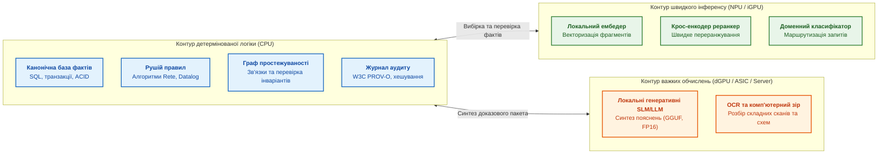
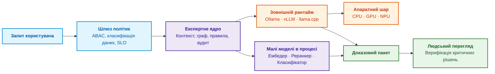
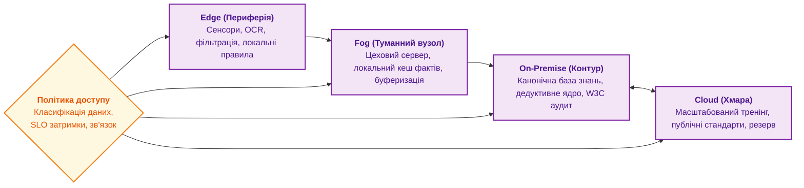
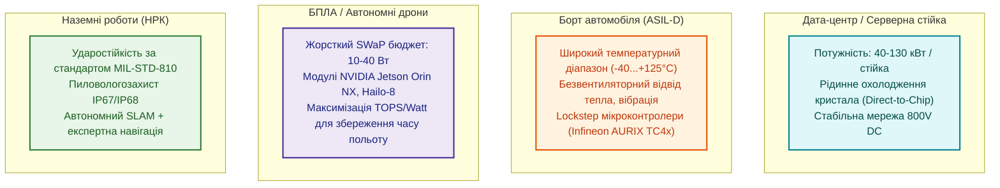

# Глава 18. Інфраструктура виконання: локальні моделі, апаратні прискорювачі, Edge та On-Premise

> **Книга:** [Архітектура доказових експертних систем](README.md) · [Частина IV: Архітектура, виконання та механізми висновку](part-04-architecture-and-inference.md)  
> **Попередня глава:** [Глава 17. Технологічний стек: критерії вибору інструментів, мов програмування та рушіїв правил](ch17-implementation-stack.md)  
> **Наступна глава:** [Глава 19. Від запитання до доказу: як система трансформує неструктурований запит на ланцюг фактів](ch19-from-question-to-evidence.md)  
> **Зміст книги:** [README.md](README.md)  
> **Рівень:** системні інженери, DevOps/MLOps архітектори, розробники embedded/edge систем: середній / просунутий  
> **Очікувані результати:** проєктувати відмовостійку інфраструктуру виконання експертних систем; розділяти ресурси CPU/GPU/NPU відповідно до математичних класів задач; розраховувати наскрізний бюджет затримки (Latency Budget) та пропускну здатність (Tokens/s); забезпечувати числову відтворюваність виведення та контроль дрейфу ембедингів; обирати топології розміщення (Cloud, On-Premise, Fog, Edge) з урахуванням обмежень SWaP (Size, Weight, Power) та суворих вимог кібербезпеки.

У попередніх главах ми визначили логічну архітектуру та технологічний стек експертної системи. Але програмні абстракції не існують у вакуумі. Вони фізично виконуються в оперативній пам'яті, на системних шинах та апаратних регістрах процесорів: центральних (CPU), графічних (GPU) чи нейронних прискорювачах (NPU), у хмарних кластерах, на захищених корпоративних серверах (On-Premise) або на компактних польових контролерах біля сенсорів (Edge).

Інфраструктура виконання повинна відповідати структурі математичних операцій та інженерним ризикам. Логічні правила, транзакції SQL та обхід графа простежуваності вимагають низьколатентної роботи з розгалуженнями на CPU. Векторизація, семантичний пошук та генеративні моделі спираються на масивну лінійну алгебру, вимагаючи широкої пропускної здатності шини пам'яті та апаратних матричних блоків. На периферії до цього додаються жорсткі обмеження бюджету потужності, тепловідведення, маси, вібрації та локальної автономності (SWaP).

---

## Експертна система як координатор виконання

При проєктуванні системи важливо чітко розмежувати ролі: експертна система не повинна перетворюватися на загальний сервер машинного виведення (Inference Server). Її завдання — бути інтелектуальним координатором викликів із шаром політик безпеки, контролю контексту та гарантії доказовості.

Функції координації:

- **Семантична маршрутизація:** класифікація вхідного запиту та вибір спеціалізованої моделі (наприклад, компактна модель під стандарти безпеки ISO 26262 проти моделі загального аналізу специфікацій).
- **Фільтрація контексту за політиками ABAC/RBAC:** недопущення витоку секретних фрагментів документів у генеративний контекст до моменту інференсу.
- **Аудит викликів:** фіксація повного відбитка запиту (хеш моделі, токенізатор, температура генерації, параметри квантування) в імутабельному лозі.
- **Вбудований інференс малих моделей:** безпосереднє виконання ембедерів та класифікаторів у пам'яті процесу для мінімізації накладних витрат мережевого обміну.
- **Делегування важких моделей:** передача задач генерації зовнішнім оптимізованим рантаймам (Ollama, vLLM, llama.cpp).

> **Практичний досвід.** Експертна система діє виключно як розумний клієнт з аудитом. Генерація тексту делегується демону Ollama або vLLM через стабільний REST API, тоді як векторизація ембедингами виконується нативно всередині основного сервісу через бібліотеки OpenVINO або ONNX Runtime. Такий розподіл гарантує стабільність ядра: падіння зовнішнього LLM-сервера фіксується як помилка сервісу без аварійної зупинки основної бази знань.

---

## Шар інференсу: ізоляція процесів та управління пам'яттю

Під час виконання навчених моделей система оперує матрицями, тензорами та апаратними драйверами. Принципове питання надійності: де проходить межа операційного процесу?

1. **In-process інференс (усередині основного процесу):**
   - *Переваги:* нульові накладні витрати на міжпроцесну взаємодію (IPC/gRPC), мінімальна затримка (мікросекунди), спільний адресний простір.
   - *Ризики:* фатальний збій (Segmentation Fault) у C-бібліотеці драйвера прискорювача аварійно завершує роботу всієї експертної системи.
   - *Сфера застосування:* стабільні легкі бібліотеки (OpenVINO CPU/NPU, ONNX Runtime).
2. **Out-of-process інференс (через окремі робочі процеси / мікросервіси):**
   - *Переваги:* повна ізоляція збоїв, захист пам'яті ядра, можливість незалежного горизонтального масштабування та чергування запитів.
   - *Ризики:* накладні витрати на серіалізацію тензорів і мережеві затримки.
   - *Сфера застосування:* великі генеративні моделі, робота з нестабільними експериментальними драйверами GPU.

---

## Топології розгортання: від дата-центру до сенсора

Вибір інфраструктурного розміщення визначається природою чутливості даних, допустимою затримкою та наявністю каналів зв'язку:

Особливості топологій:

- **On-Premise (Власний закритий контур):** обов'язковий вибір для оборонних, авіаційних, енергетичних та медичних застосувань. Дані не покидають периметр безпеки.
- **Edge (Периферія):** виконання критичних інваріантів безпеки безпосередньо на борту машини чи промислового робота. Гарантує роботу при повному обриві мережі.
- **Fog (Туманні / цехові шлюзи):** агрегують потоки телеметрії від десятків периферійних контролерів, проводять дедуплікацію та фільтрацію перед відправкою у центральну базу.
- **Cloud (Хмара):** використовується виключно для неконфіденційних відкритих корпусів знань або як резервний кластер пакетної обробки.

---

## Апаратна база: відповідність математики та кремнію

Різні типи обчислень вимагають спеціалізованої кремнієвої архітектури:

| Обчислювальний клас | Характер операцій | Оптимальне апаратне забезпечення | Програмні платформи / SDK |
|---|---|---|---|
| **Символьна логіка, предикати, SQL** | Розгалужені алгоритми, робота з графами, цілочисельні індекси | Багатоядерні CPU (x86-64, ARM64) | Стандартні компілятори, SIMD (AVX-512, AMX) |
| **Щільна лінійна алгебра** | Матричні множення (GEMM), паралельні тензорні операції | Серверні та робочі GPU | NVIDIA CUDA/TensorRT, AMD ROCm |
| **Енергоефективний інференс (Edge)** | Квантовані тензори (INT8/INT4), згортки | Вбудовані NPU, мобільні прискорювачі | Intel OpenVINO, Qualcomm QNN, Apple Core ML |
| **Потокова обробка сигналів** | Детерміновані мікросекундні конвеєри, sensor fusion | FPGA (ПЛІС), спеціалізовані DSP | AMD Versal, Altera Agilex |

### Математичні моделі продуктивності

Для оцінки апаратних можливостей не можна покладатися лише на рекламні показники виробників.

1. **Піковий теоретичний перформанс обчислювача:**

   $$P_{\text{peak}} = N_{\text{units}} \times f_{\text{clock}} \times \text{FLOP}_{\text{cycle}}$$

   Де $\text{FLOP}_{\text{cycle}} = 2$ для блоків Fused Multiply-Add (FMA, операція $a \cdot b + c$).

2. **Пропускна здатність шини пам'яті (Memory Bandwidth):**

   $$\text{BW} = f_{\text{mem}} \times \frac{W_{\text{bus}}}{8} \times N_{\text{channels}}$$

3. **Roofline-модель (Реальна досяжна продуктивність):**

   $$P_{\text{attainable}} = \min\left(P_{\text{peak}}, \; I \times \text{BW}\right)$$

   Де $I = \frac{\text{FLOP}}{\text{Byte}}$ — арифметична інтенсивність задачі.
   - Якщо $I$ низька (як при векторному пошуку найближчих сусідів HNSW), система впирається в пропускну здатність пам'яті (*Memory-bound*).
   - Якщо $I$ висока (як при множенні матриць у трансформерах із великим пакетом), система впирається в обчислювальні ядра (*Compute-bound*).

---

## Обмеження SWaP (Size, Weight, Power) на периферії

Розгортання експертних систем на борту рухомих об'єктів (автомобілі, БПЛА, наземні роботизовані платформи) підпорядковується суворим інженерним обмеженням:

В автомобільному секторі критичним є розділення поверхів керування: важке тензорне виведення (сприйняття обстановки) виконується на продуктивній системі на кристалі (SoC), тоді як детермінована логіка безпеки та правила зупинки закріплені за спеціалізованим мікроконтролером (наприклад, Infineon AURIX із ядрами TriCore у режимі lockstep).

---

## Бюджет затримки та контроль числового дрейфу

### Наскрізний бюджет затримки (Latency Budget)

Усі вимірювання затримки повинні оцінюватися за перцентилями $p95$ та $p99$, а не за середніми величинами.

$$T_{\text{total}} = T_{\text{retrieval}} + T_{\text{embedding}} + T_{\text{reranking}} + T_{\text{rules}} + T_{\text{LLM}} + T_{\text{overhead}}$$

Приклад розрахунку для інтерактивної інженерної експертизи ($p95$):

- $T_{\text{retrieval}}$ (пошук фактів у SQL / BM25): $40\text{ мс}$;
- $T_{\text{embedding}}$ (векторизація запиту на NPU): $8\text{ мс}$;
- $T_{\text{reranking}}$ (переранжування топ-50 кандидатів): $25\text{ мс}$;
- $T_{\text{rules}}$ (дедуктивне виведення в рушії правил): $5\text{ мс}$;
- $T_{\text{LLM}}$ (потокова генерація доказового обґрунтування): $900\text{ мс}$;
- $T_{\text{overhead}}$ (авторизація ABAC, аудит W3C PROV): $12\text{ мс}$;
- **Разом:** $T_{\text{total}} \approx 990\text{ мс}$.

### Контроль числового дрейфу (Numerical Drift)

Критична вимога доказовості: зміна версії системного драйвера, компілятора чи оновлення прошивки NPU не повинні змінювати результат семантичного зіставлення.

Для цього регулярні регресійні тести вимірюють косинусну відстань між еталонними векторами (Gold Baseline) та поточними виходами рантайму:

$$\cos(\vec{v}_{\text{now}}, \vec{v}_{\text{base}}) = \frac{\vec{v}_{\text{now}} \cdot \vec{v}_{\text{base}}}{\|\vec{v}_{\text{now}}\| \|\vec{v}_{\text{base}}\|} \geq \tau_{\text{drift}}$$

Якщо значення падає нижче порогу $\tau_{\text{drift}} = 0.99$, система блокує промоцію оновлення драйвера, сигналізуючи про зміну геометрії векторного простору, яка вимагає повної переіндексації бази знань.

---

## Мінімальна автономна конфігурація

Повномасштабна експертна інфраструктура може бути згорнута до компактного, але суворо доказового ядра, здатного функціонувати на звичайній робочій станції або польовому ноутбуці:

Ця конфігурація не вимагає дискретних GPU чи хмарних підключень: процесора класу Intel Core Ultra або AMD Ryzen та одного файлу бази даних SQLite достатньо для побудови строгої системи контролю нормативних вимог.

---

## Резюме глави

Інфраструктура виконання експертної системи забезпечує фізичні умови для детермінованої роботи архітектурного ядра. Експертна система координує обчислення, розподіляючи логічні правила на CPU, малі векторизаційні моделі на локальні NPU, а ресурсомістку генерацію тексту на зовнішні ізольовані рантайми на базі GPU.

Надійність такої інфраструктури спирається на наскрізний моніторинг бюджету затримки, суворий контроль числового дрейфу ембедингів при оновленні драйверів та адаптацію до фізичних обмежень енергоспоживання й охолодження на Edge.

У наступній главі ми детально розглянемо перехід від неструктурованого запитання інженера до формального ланцюга дедуктивного доведення.

---

## Питання для самоперевірки та дискусії

1. **Ізоляція інференсу:** Чому розміщення великої генеративної мовної моделі всередині того самого адресного простору процесу, що й рушій правил, створює критичні ризики відмови?
2. **Roofline-аналіз:** Чому збільшення кількості обчислювальних ядер GPU не призводить до пропорційного прискорення пошуку найближчих сусідів (kNN) у великих векторних індексах?
3. **Числовий дрейф:** Які фактори на рівні операційної системи та компілятора можуть призвести до зміни косинусної близькості векторів при збереженні незмінних ваг моделі ембедингу?
4. **Периферійні контури:** Чому на безпілотних апаратах та мобільних роботах метрика TOPS/Watt є пріоритетнішою за абсолютну пікову продуктивність TFLOPS?
5. **Розподіл логіки безпеки:** Як в автомобільних системах (стандарт ISO 26262 ASIL-D) реалізується фізичне розмежування контуру нейромережевого сприйняття та контуру контрольного зупину?

---

## Література та першоджерела

- Samuel Williams, Andrew Waterman, David A. Patterson. [*Roofline: An Insightful Visual Performance Model for Multicore Architectures*](https://doi.org/10.1145/1498765.1498785), Communications of the ACM, 2009. Основоположна стаття про обмеження пам'яті та обчислень.
- MLCommons. [*MLPerf Inference Benchmark Suite*](https://docs.mlcommons.org/inference/). Міжнародний стандарт вимірювання швидкодії та енергоефективності машинного виведення.
- International Organization for Standardization. [*ISO 26262: Road vehicles — Functional safety*](https://www.iso.org/standard/68383.html). Вимоги до апаратної надійності та детермінізму в критичних автомобільних системах.
- Intel Corporation. [*OpenVINO Execution Providers and NPU Deployment Guide*](https://docs.openvino.ai/). Керівництво з оптимізації моделей під вбудовані нейропроцесори та гетерогенні контури.
- NVIDIA Corporation. [*Jetson Orin Technical Brief and SWaP Optimization*](https://developer.nvidia.com/embedded/jetson-modules). Інженерні специфікації для периферійного штучного інтелекту в робототехніці.

---

[← Попередня глава](ch17-implementation-stack.md) · [Частина IV](part-04-architecture-and-inference.md) · [Зміст](README.md) · [Наступна глава →](ch19-from-question-to-evidence.md)
