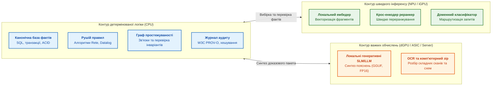
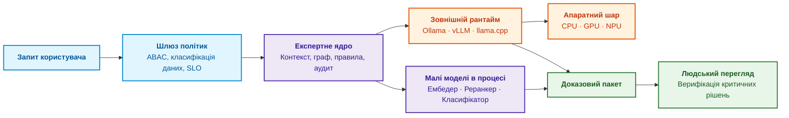
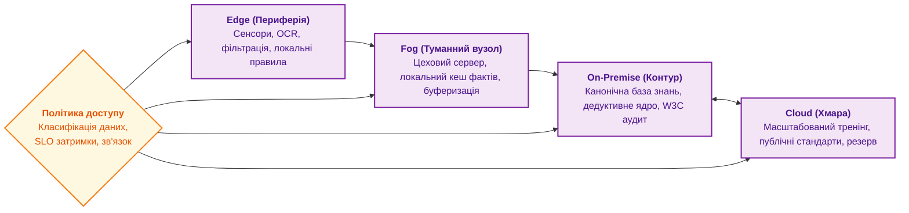
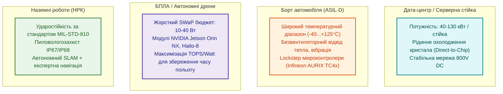
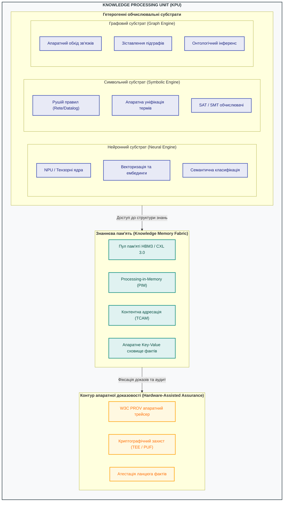
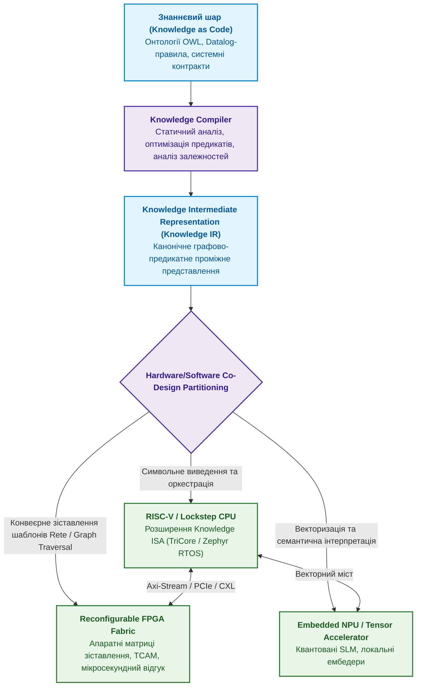
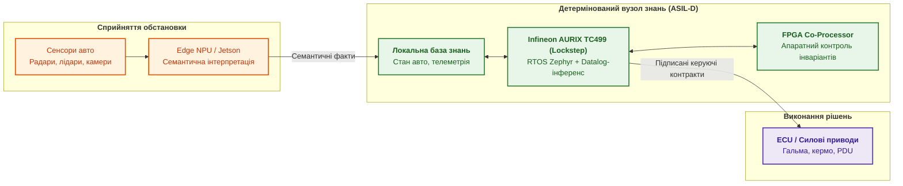

# Глава 18. Інфраструктура виконання: локальні моделі, апаратні прискорювачі, Edge та On-Premise

> **Книга:** [Архітектура доказових експертних систем](README.md) · [Частина IV: Архітектура, виконання та механізми висновку](part-04-architecture-and-inference.md)  
> **Попередня глава:** [Глава 17. Технологічний стек: критерії вибору інструментів, мов програмування та рушіїв правил](ch17-implementation-stack.md)  
> **Наступна глава:** [Глава 19. Від запитання до доказу: як система трансформує неструктурований запит на ланцюг фактів](ch19-from-question-to-evidence.md)  
> **Зміст книги:** [README.md](README.md)  
> **Рівень:** системні інженери, DevOps/MLOps архітектори, розробники embedded/edge систем: середній / просунутий  
> **Очікувані результати:** проєктувати відмовостійку інфраструктуру виконання експертних систем; розділяти ресурси CPU/GPU/NPU відповідно до математичних класів задач; розраховувати наскрізний бюджет затримки (Latency Budget) та пропускну здатність (Tokens/s); забезпечувати числову відтворюваність виведення та контроль дрейфу ембедингів; обирати топології розміщення (Cloud, On-Premise, Fog, Edge) з урахуванням обмежень SWaP (Size, Weight, Power) та суворих вимог кібербезпеки.

У попередніх главах ми визначили логічну архітектуру та технологічний стек експертної системи. Але програмні абстракції не існують у вакуумі. Вони фізично виконуються в оперативній пам'яті, на системних шинах та апаратних регістрах процесорів: центральних (CPU), графічних (GPU) чи нейронних прискорювачах (NPU), у хмарних кластерах, на захищених корпоративних серверах (On-Premise) або на компактних польових контролерах біля сенсорів (Edge).

Інфраструктура виконання повинна відповідати структурі математичних операцій та інженерним ризикам. Логічні правила, транзакції SQL та обхід графа простежуваності вимагають низьколатентної роботи з розгалуженнями на CPU. Векторизація, семантичний пошук та генеративні моделі спираються на масивну лінійну алгебру, вимагаючи широкої пропускної здатності шини пам'яті та апаратних матричних блоків. На периферії до цього додаються жорсткі обмеження бюджету потужності, тепловідведення, маси, вібрації та локальної автономності (SWaP).

---

## Експертна система як координатор виконання

При проєктуванні системи важливо чітко розмежувати ролі: експертна система не повинна перетворюватися на загальний сервер машинного виведення (Inference Server). Її завдання — бути інтелектуальним координатором викликів із шаром політик безпеки, контролю контексту та гарантії доказовості.

Функції координації:

- **Семантична маршрутизація:** класифікація вхідного запиту та вибір спеціалізованої моделі (наприклад, компактна модель під стандарти безпеки ISO 26262 проти моделі загального аналізу специфікацій).
- **Фільтрація контексту за політиками ABAC/RBAC:** недопущення витоку секретних фрагментів документів у генеративний контекст до моменту інференсу.
- **Аудит викликів:** фіксація повного відбитка запиту (хеш моделі, токенізатор, температура генерації, параметри квантування) в імутабельному лозі.
- **Вбудований інференс малих моделей:** безпосереднє виконання ембедерів та класифікаторів у пам'яті процесу для мінімізації накладних витрат мережевого обміну.
- **Делегування важких моделей:** передача задач генерації зовнішнім оптимізованим рантаймам (Ollama, vLLM, llama.cpp).

> **Практичний досвід.** Експертна система діє виключно як розумний клієнт з аудитом. Генерація тексту делегується демону Ollama або vLLM через стабільний REST API, тоді як векторизація ембедингами виконується нативно всередині основного сервісу через бібліотеки OpenVINO або ONNX Runtime. Такий розподіл гарантує стабільність ядра: падіння зовнішнього LLM-сервера фіксується як помилка сервісу без аварійної зупинки основної бази знань.

---

## Шар інференсу: ізоляція процесів та управління пам'яттю

Під час виконання навчених моделей система оперує матрицями, тензорами та апаратними драйверами. Принципове питання надійності: де проходить межа операційного процесу?

1. **In-process інференс (усередині основного процесу):**
   - *Переваги:* нульові накладні витрати на міжпроцесну взаємодію (IPC/gRPC), мінімальна затримка (мікросекунди), спільний адресний простір.
   - *Ризики:* фатальний збій (Segmentation Fault) у C-бібліотеці драйвера прискорювача аварійно завершує роботу всієї експертної системи.
   - *Сфера застосування:* стабільні легкі бібліотеки (OpenVINO CPU/NPU, ONNX Runtime).
2. **Out-of-process інференс (через окремі робочі процеси / мікросервіси):**
   - *Переваги:* повна ізоляція збоїв, захист пам'яті ядра, можливість незалежного горизонтального масштабування та чергування запитів.
   - *Ризики:* накладні витрати на серіалізацію тензорів і мережеві затримки.
   - *Сфера застосування:* великі генеративні моделі, робота з нестабільними експериментальними драйверами GPU.

---

## Топології розгортання: від дата-центру до сенсора

Вибір інфраструктурного розміщення визначається природою чутливості даних, допустимою затримкою та наявністю каналів зв'язку:

Особливості топологій:

- **On-Premise (Власний закритий контур):** обов'язковий вибір для оборонних, авіаційних, енергетичних та медичних застосувань. Дані не покидають периметр безпеки.
- **Edge (Периферія):** виконання критичних інваріантів безпеки безпосередньо на борту машини чи промислового робота. Гарантує роботу при повному обриві мережі.
- **Fog (Туманні / цехові шлюзи):** агрегують потоки телеметрії від десятків периферійних контролерів, проводять дедуплікацію та фільтрацію перед відправкою у центральну базу.
- **Cloud (Хмара):** використовується виключно для неконфіденційних відкритих корпусів знань або як резервний кластер пакетної обробки.

---

## Апаратна база: відповідність математики та кремнію

Різні типи обчислень вимагають спеціалізованої кремнієвої архітектури:

| Обчислювальний клас | Характер операцій | Оптимальне апаратне забезпечення | Програмні платформи / SDK |
|---|---|---|---|
| **Символьна логіка, предикати, SQL** | Розгалужені алгоритми, робота з графами, цілочисельні індекси | Багатоядерні CPU (x86-64, ARM64) | Стандартні компілятори, SIMD (AVX-512, AMX) |
| **Щільна лінійна алгебра** | Матричні множення (GEMM), паралельні тензорні операції | Серверні та робочі GPU | NVIDIA CUDA/TensorRT, AMD ROCm |
| **Енергоефективний інференс (Edge)** | Квантовані тензори (INT8/INT4), згортки | Вбудовані NPU, мобільні прискорювачі | Intel OpenVINO, Qualcomm QNN, Apple Core ML |
| **Потокова обробка сигналів** | Детерміновані мікросекундні конвеєри, sensor fusion | FPGA (ПЛІС), спеціалізовані DSP | AMD Versal, Altera Agilex |

### Математичні моделі продуктивності

Для оцінки апаратних можливостей не можна покладатися лише на рекламні показники виробників.

1. **Піковий теоретичний перформанс обчислювача:**

   $$P_{\text{peak}} = N_{\text{units}} \times f_{\text{clock}} \times \text{FLOP}_{\text{cycle}}$$

   Де $\text{FLOP}_{\text{cycle}} = 2$ для блоків Fused Multiply-Add (FMA, операція $a \cdot b + c$).

2. **Пропускна здатність шини пам'яті (Memory Bandwidth):**

   $$\text{BW} = f_{\text{mem}} \times \frac{W_{\text{bus}}}{8} \times N_{\text{channels}}$$

3. **Roofline-модель (Реальна досяжна продуктивність):**

   $$P_{\text{attainable}} = \min\left(P_{\text{peak}}, \; I \times \text{BW}\right)$$

   Де $I = \frac{\text{FLOP}}{\text{Byte}}$ — арифметична інтенсивність задачі.
   - Якщо $I$ низька (як при векторному пошуку найближчих сусідів HNSW), система впирається в пропускну здатність пам'яті (*Memory-bound*).
   - Якщо $I$ висока (як при множенні матриць у трансформерах із великим пакетом), система впирається в обчислювальні ядра (*Compute-bound*).

---

## Обмеження SWaP (Size, Weight, Power) на периферії

Розгортання експертних систем на борту рухомих об'єктів (автомобілі, БПЛА, наземні роботизовані платформи) підпорядковується суворим інженерним обмеженням:

В автомобільному секторі критичним є розділення поверхів керування: важке тензорне виведення (сприйняття обстановки) виконується на продуктивній системі на кристалі (SoC), тоді як детермінована логіка безпеки та правила зупинки закріплені за спеціалізованим мікроконтролером (наприклад, Infineon AURIX із ядрами TriCore у режимі lockstep).

---

## Бюджет затримки та контроль числового дрейфу

### Наскрізний бюджет затримки (Latency Budget)

Усі вимірювання затримки повинні оцінюватися за перцентилями $p95$ та $p99$, а не за середніми величинами.

$$T_{\text{total}} = T_{\text{retrieval}} + T_{\text{embedding}} + T_{\text{reranking}} + T_{\text{rules}} + T_{\text{LLM}} + T_{\text{overhead}}$$

Приклад розрахунку для інтерактивної інженерної експертизи ($p95$):

- $T_{\text{retrieval}}$ (пошук фактів у SQL / BM25): $40\text{ мс}$;
- $T_{\text{embedding}}$ (векторизація запиту на NPU): $8\text{ мс}$;
- $T_{\text{reranking}}$ (переранжування топ-50 кандидатів): $25\text{ мс}$;
- $T_{\text{rules}}$ (дедуктивне виведення в рушії правил): $5\text{ мс}$;
- $T_{\text{LLM}}$ (потокова генерація доказового обґрунтування): $900\text{ мс}$;
- $T_{\text{overhead}}$ (авторизація ABAC, аудит W3C PROV): $12\text{ мс}$;
- **Разом:** $T_{\text{total}} \approx 990\text{ мс}$.

### Контроль числового дрейфу (Numerical Drift)

Критична вимога доказовості: зміна версії системного драйвера, компілятора чи оновлення прошивки NPU не повинні змінювати результат семантичного зіставлення.

Для цього регулярні регресійні тести вимірюють косинусну відстань між еталонними векторами (Gold Baseline) та поточними виходами рантайму:

$$\cos(\vec{v}_{\text{now}}, \vec{v}_{\text{base}}) = \frac{\vec{v}_{\text{now}} \cdot \vec{v}_{\text{base}}}{\|\vec{v}_{\text{now}}\| \|\vec{v}_{\text{base}}\|} \geq \tau_{\text{drift}}$$

Якщо значення падає нижче порогу $\tau_{\text{drift}} = 0.99$, система блокує промоцію оновлення драйвера, сигналізуючи про зміну геометрії векторного простору, яка вимагає повної переіндексації бази знань.

---

## Перспективні напрями розвитку апаратури: від GPU до Knowledge Processing Unit (KPU)

Сучасна інженерія машинного навчання нерідко зводить апаратну інфраструктуру виключно до «закупівлі найпотужніших GPU для запуску великих мовних моделей». Проте експертна система має принципово відмінний обчислювальний профіль: формальні знання, інваріанти, продукційні правила, графи зв'язків, деревоподібний пошук у просторі станів, обчислення обмежень (*Constraint Satisfaction*), низьколатентний доступ до нерегулярних структур пам'яті, детерміноване логічне виведення, формування ланцюгів пояснень та надійна взаємодія з фізичним світом у режимі реального часу.

Для таких завдань симетричні матричні тензорні ядра GPU є надлишковими або неефективними. Знання впираються не у флопси (FLOPS), а в пропускну здатність та латентність довільного доступу до пам'яті (*Memory Bandwidth & Pointer Chasing*), швидкість зіставлення предикатів і гарантований детермінізм реакції.

### 1. Двадцять перспективних напрямів розвитку апаратури для систем знань

Систематизація векторів апаратного розвитку, які формують технологічний базис сучасних експертних комплексів:

| № | Напрям розвитку | Архітектурна сутність | Цінність для експертних систем |
|:---|:---|:---|:---|
| 1 | **Heterogeneous Knowledge Processor** | Гетерогенний кристал: CPU + NPU + спеціалізовані прискорювачі правил і графів. | Фізичний розподіл символьного міркування, нейронного інференсу та системної координації. |
| 2 | **Graph Processing Accelerator** | FPGA/ASIC для апаратного обходу графів, зіставлення підграфів та SPARQL/Cypher запитів. | Усунення вузького місця пам'яті при обході Engineering Knowledge Graph та онтологічному інференсі. |
| 3 | **Rule Engine Accelerator** | Апаратна реалізація мереж RETE / Treat, паралельного зіставлення шаблонів і Datalog-джойнів. | Перенесення найгарячіших циклів рушія виведення з CPU у високопаралельний апаратний конвеєр. |
| 4 | **Constraint / SAT / SMT Acceleration** | Спеціалізовані мікросхеми розв'язання рівнянь логіки, розповсюдження обмежень (Propagation). | Прискорення планування дій, конфігурації складних виробів, системної діагностики та формальної верифікації. |
| 5 | **Knowledge-Centric FPGA** | Реконфігуровна архітектура потоку даних (*Dataflow Engine*) під поточні правила домену. | Можливість прямої матеріалізації правил і структур бази знань в апаратну логіку (Silicon Compilation). |
| 6 | **Memory-Centric AI** | Використання HBM, інтерфейсу CXL 3.0, пулів спільної пам'яті (Memory Pooling). | Подолання Memory Wall для гігантських графів знань, де критична латентність довільного зчитування вузлів. |
| 7 | **Processing-in-Memory (PIM)** | Виконання обчислень безпосередньо всередині кристала пам'яті (Near-Memory / In-Memory). | Колосальне прискорення обходу ребер графа, обчислення векторних відстаней та асоціативного пошуку. |
| 8 | **Neuro-Symbolic Accelerator** | Об'єднання тензорного NPU та символьного прискорювача на спільній високошвидкісній шині. | Миттєвий перехід: «Нейронне сприйняття $\to$ Семантичні символи $\to$ Детерміноване виведення». |
| 9 | **Associative / CAM Computing** | Контентно-адресовна пам'ять (CAM / TCAM) для миттєвого пошуку за зразком. | Апаратне зіставлення фактів та виявлення конфліктуючих правил за один такт синхронізації. |
| 10 | **Event-Driven Architecture** | Асинхронні нейроморфні або подієві процесори (Event-Based Processors). | Реактивна відповідь на зовнішні сигнали без холостого обчислювального циклу та енерговитрат. |
| 11 | **Edge Expert System SoC** | Інтегрована система на кристалі (MCU/SoC + NPU + локальна база фактів). | Повністю автономне прийняття рішень на борту механізму без підключення до хмари або мережі. |
| 12 | **Distributed Hardware Fabric** | Фабрика взаємопов'язаних Edge-вузлів із розподіленим контуром інференсу. | Гнучкий розподіл знань між сенсорами, мікроконтролерами (ECU), Edge-серверами та хмарним бекендом. |
| 13 | **Secure Knowledge Hardware** | Апаратні анклави безпеки (TEE, AMD SEV, ARM TrustZone, PUF, криптоприскорювачі). | Криптографічний захист чутливої корпоративної онтології, правил та результатів виведення від підміни. |
| 14 | **Verifiable AI Hardware** | Апаратний аудит походження даних (*Provenance Traceability*), криптографічна атестація. | Апаратний доказ коректності та непорушності ланцюга фактів, на основі якого прийнято рішення. |
| 15 | **RISC-V Knowledge SoC** | Відкрита архітектура RISC-V із розширенням команд (*Custom Knowledge ISA*). | Додавання спеціалізованих інструкцій для уніфікації термів, бітових масок предикатів та обходу списків. |
| 16 | **CXL Knowledge Fabric** | Архітектура CXL (Compute Express Link) зі спільним адресним простором пам'яті. | Розподіл терабайтних графів знань між кластером процесорів без накладних витрат на серіалізацію в мережі. |
| 17 | **Hardware Ontology Processing** | Спеціалізовані інструкції для обчислення сабсампції (Subsumption), класифікації та уніфікації. | Апаратне прискорення міркувань у дескриптивних логіках (OWL 2 DL / EL) без падіння швидкодії. |
| 18 | **Hardware Symbolic Execution** | Апаратні блоки для аналізу шляхів виконання та розв'язання умовних переходів. | Інженерний аналіз безпеки прошивок, виявлення вразливостей та автоматизований реверс-інжиніринг. |
| 19 | **Digital-Twin Reasoning Hardware** | Симуляційні співпроцесори реального часу, інтегровані з логічним рушієм. | Перевірка наслідків рішень експертної системи на точній фізичній моделі об'єкта до виконання дії. |
| 20 | **Self-Adaptive Reconfigurable HW** | Динамічна часткова реконфігурація ПЛІС під поточний профіль навантаження знаннями. | Адаптація топології апаратних конвеєрів безпосередньо під час зміни фази виробничого циклу. |

### 2. Архітектурна модель Knowledge Processing Unit (KPU)

Найбільш цілісною відповіддю на виклики інженерії знань є не ізольований чип-прискорювач, а уніфікована архітектурна модель — **Knowledge Processing Unit (KPU)**.

Вона організує три ортогональні обчислювальні субстрати (*Neural $\to$ Symbolic $\to$ Graph*), кожен із яких оптимізовано під власну математичну природу даних:

У KPU процесор не намагається емулювати всі операції через однорідні матричні множення:

1. **Нейронний шар:** приймає мультимодальний сенсорний потік, тексти інженерних звітів або телеметрію та формує семантичні дескриптори.
2. **Символьний шар:** детерміновано перевіряє контракти та вимоги безпеки на основі правил першого порядку.
3. **Графовий шар:** утримує багатовимірний контекст системи та відстежує причинно-наслідкові зв'язки.
4. **Контур доказовості:** апаратно хешує кожен крок логічного виведення у захищеній пам'яті, унеможливлюючи несанкціоновану модифікацію аудиторського сліду.

### 3. Тандем FPGA + RISC-V: апаратно-програмне співпроєктування (HW/SW Co-Design)

Найбільш практичним шляхом до втілення спеціалізованого процесора знань сьогодні є не виготовлення власного ASIC (що коштує десятки мільйонів доларів), а **апаратно-програмне співпроєктування (Hardware/Software Co-Design)** на базі реконфігуровних кристалів FPGA та відкритих ядер RISC-V.

Замість наївного підходу *«запустимо невелику нейромережу на FPGA»*, інженерія знань ставить принципове питання:

> **Які саме операції експертної системи доцільно матеріалізувати в апаратному кремнії?**

Відповідь лежить у конвеєрі трансляції знань:

У цій схемі відкритий набір інструкцій RISC-V доповнюється призначеними для користувача інструкціями (*Custom Extensions*):

* `K_UNIFY rd, rs1, rs2` — апаратне зіставлення двох предикатних термів за один такт;
* `K_SUBGRAPH rd, rs1, imm` — крок переходу за дескриптором ребра в графовій пам'яті;
* `K_RULE_MATCH rd, rs1, rs2` — паралельна перевірка маски бітових активностей для мережі RETE.

### 4. Розподілена апаратура для критичних систем: автомобільний профіль (Automotive Edge)

В автомобільній інженерії та важкій автономній техніці концепція експертної системи розгортається не на одному суперкомп'ютері, а як розподілена гетерогенна мережа контролерів.

Наприклад, критичний вузол безпеки рівня **ISO 26262 ASIL-D** на базі багатоядерного процесора класу **Infineon AURIX TC499 (з ядрами TriCore в режимі Lockstep)** під керуванням детермінованої операційної системи реального часу **Zephyr RTOS** виступає не просто контролером двигуна, а повноцінним детермінованим вузлом логічного виведення:

У цій архітектурі реалізуються фундаментальні вимоги функціональної безпеки:

* **Абсолютний детермінізм і фіксована затримка:** мікроконтролер обробляє предикатні контракти з гарантованою відповіддю за фіксовану кількість тактів без непередбачуваних пауз збирача сміття (*Garbage Collection*).
* **Ізоляція збоїв (Fault Containment):** навіть якщо нейронний модуль сприйняття на NPU тимчасово зависає або видає шум через засліплення камер, FPGA та AURIX утримують фізичні інваріанти безпеки (наприклад, дистанцію аварійного гальмування).
* **Повна автономність (Offline Operation):** експертна система не потребує стільникового зв'язку або хмарного підтвердження для виконання захисних маневрів.

#### Практика DefTech та FPV-перехоплювачів: уроки «Диких Шершнів» та автопоезис на Edge

У бойових застосуваннях та високошвидкісних повітряних перехоплювачах (наприклад, лінійці дронів *Sting* та системі *Hornet Vision* виробництва [Wild Hornets](https://wildhornets.company/)) апаратний дизайн диктується суворими економічними та часовими реаліями:

1. **Апаратний бюджет інтеграції ШІ:** додавання окремого NPU-обчислювача для виявлення швидкісних цілей коштує від \$150 до \$500 на борт, де ключовим викликом є не пікова продуктивність (TFLOPS), а енергетична ефективність (TOPS/Watt) та робота з дефіцитними мікроконтролерами.
2. **Сепарація завдань:** ШІ на базі NPU оптимізується винятково під просторовий пошук та селекцію цілей у повітрі в умовах оптичних завад, тоді як траєкторна стабілізація та безпековий арбітраж делегуються виключно детермінованому мікроконтролеру.
3. **Патерн динамічної адаптації (WASM Autopoiesis на Edge):** як зазначає провідний архітектор систем безпеки **Андрій Акішин** (UAPE / Guardyn), в умовах, коли ворог змінює сітку частот РЕБ кожні кілька днів, класична повна перепрошивка польотного мікроконтролера є занадто повільною і ризикованою. Надійним рішенням стає впровадження легковагового середовища виконання WebAssembly (WASM): нові правила протидії завадам та евристики наведення завантажуються на борт як **криптографічно підписані WASM-маніфести**, що безпечно змінюють логіку обробки подій на льоту без ризику порушення базової стабілізації платформи.

### 5. П'ять пріоритетних науково-технічних векторів апаратного R&D

Для інженерних команд та дослідників, які працюють на стику апаратного проектування та штучного інтелекту, ключовими є п'ять науково-технічних задач:

1. **Hardware-Accelerated Symbolic Reasoning:** створення апаратних конвеєрів для зіставлення правил, резолюції та побудови доказів зі швидкістю, порівнянною з графічними прискорювачами (аналог «ери GPU», але для символьної логіки).
2. **Knowledge Graph Accelerator:** спеціалізовані ASIC/FPGA кристали, оптимізовані для нерегулярного паралельного обходу графів знань, вирішення задачі ізоморфізму підграфів та онтологічної класифікації.
3. **Neuro-Symbolic Processing Architecture:** усунення комунікаційного бар'єра між неперервним векторним простором нейромереж та дискретним простором символьних фактів через спільну надшвидку пам'ять та апаратні мости перетворення.
4. **Distributed Expert System Hardware Fabric:** ієрархічні гетерогенні мережі (MCU класу AURIX $\leftrightarrow$ Edge FPGA $\leftrightarrow$ центральний NPU/SoC $\leftrightarrow$ Cloud), де кожен рівень наділений власною частиною знань і детермінованими правами прийняття рішень.
5. **Knowledge-to-Hardware Compilation (Knowledge as Code $\to$ Silicon):** розвиток компіляторів нового покоління, здатних автоматично транслювати формальні специфікації домену, онтології та правила безпосередньо у бінарні бітстріми для реконфігуровних обчислювачів.

---

## Мінімальна автономна конфігурація

Повномасштабна експертна інфраструктура може бути згорнута до компактного, але суворо доказового ядра, здатного функціонувати на звичайній робочій станції або польовому ноутбуці:

Ця конфігурація не вимагає дискретних GPU чи хмарних підключень: процесора класу Intel Core Ultra або AMD Ryzen та одного файлу бази даних SQLite достатньо для побудови строгої системи контролю нормативних вимог.

---

## Резюме глави

Інфраструктура виконання експертної системи забезпечує фізичні умови для детермінованої роботи архітектурного ядра. Експертна система координує обчислення, розподіляючи логічні правила на CPU, малі векторизаційні моделі на локальні NPU, а ресурсомістку генерацію тексту на зовнішні ізольовані рантайми на базі GPU.

Надійність такої інфраструктури спирається на наскрізний моніторинг бюджету затримки, суворий контроль числового дрейфу ембедингів при оновленні драйверів та адаптацію до фізичних обмежень енергоспоживання й охолодження на Edge.

У наступній главі ми детально розглянемо перехід від неструктурованого запитання інженера до формального ланцюга дедуктивного доведення.

---

## Питання для самоперевірки та дискусії

1. **Ізоляція інференсу:** Чому розміщення великої генеративної мовної моделі всередині того самого адресного простору процесу, що й рушій правил, створює критичні ризики відмови?
2. **Roofline-аналіз:** Чому збільшення кількості обчислювальних ядер GPU не призводить до пропорційного прискорення пошуку найближчих сусідів (kNN) у великих векторних індексах?
3. **Числовий дрейф:** Які фактори на рівні операційної системи та компілятора можуть призвести до зміни косинусної близькості векторів при збереженні незмінних ваг моделі ембедингу?
4. **Периферійні контури:** Чому на безпілотних апаратах та мобільних роботах метрика TOPS/Watt є пріоритетнішою за абсолютну пікову продуктивність TFLOPS?
5. **Розподіл логіки безпеки:** Як в автомобільних системах (стандарт ISO 26262 ASIL-D) реалізується фізичне розмежування контуру нейромережевого сприйняття та контуру контрольного зупину?

---

## Література та першоджерела

- Samuel Williams, Andrew Waterman, David A. Patterson. [*Roofline: An Insightful Visual Performance Model for Multicore Architectures*](https://doi.org/10.1145/1498765.1498785), Communications of the ACM, 2009. Основоположна стаття про обмеження пам'яті та обчислень.
- MLCommons. [*MLPerf Inference Benchmark Suite*](https://docs.mlcommons.org/inference/). Міжнародний стандарт вимірювання швидкодії та енергоефективності машинного виведення.
- International Organization for Standardization. [*ISO 26262: Road vehicles — Functional safety*](https://www.iso.org/standard/68383.html). Вимоги до апаратної надійності та детермінізму в критичних автомобільних системах.
- Intel Corporation. [*OpenVINO Execution Providers and NPU Deployment Guide*](https://docs.openvino.ai/). Керівництво з оптимізації моделей під вбудовані нейропроцесори та гетерогенні контури.
- NVIDIA Corporation. [*Jetson Orin Technical Brief and SWaP Optimization*](https://developer.nvidia.com/embedded/jetson-modules). Інженерні специфікації для периферійного штучного інтелекту в робототехніці.

---

[← Попередня глава](ch17-implementation-stack.md) · [Частина IV](part-04-architecture-and-inference.md) · [Зміст](README.md) · [Наступна глава →](ch19-from-question-to-evidence.md)
