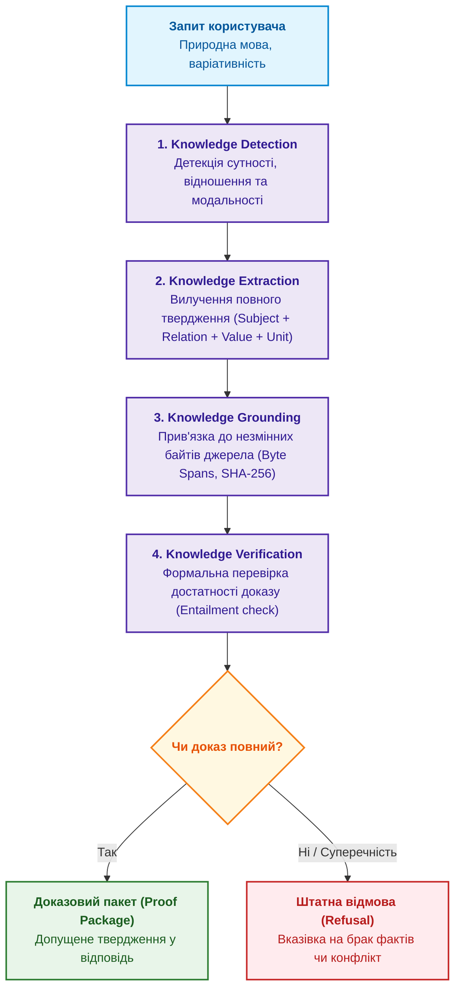
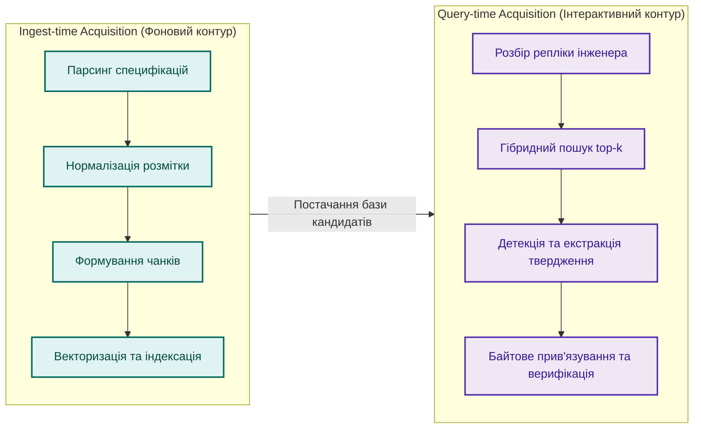
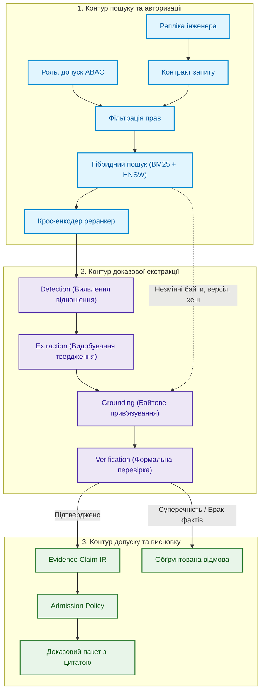
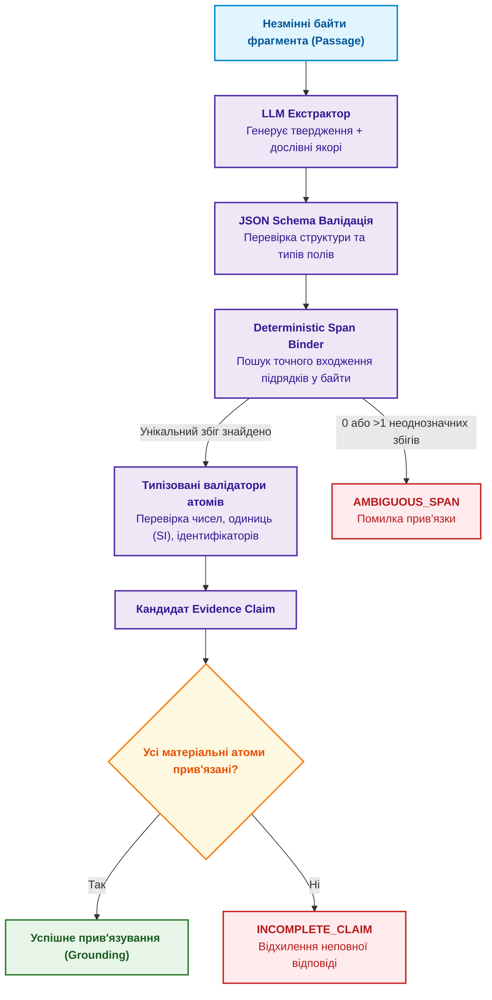
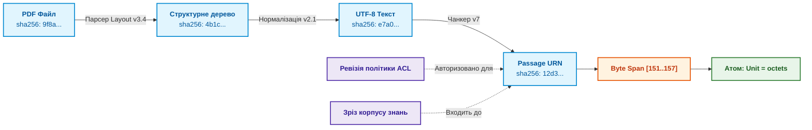
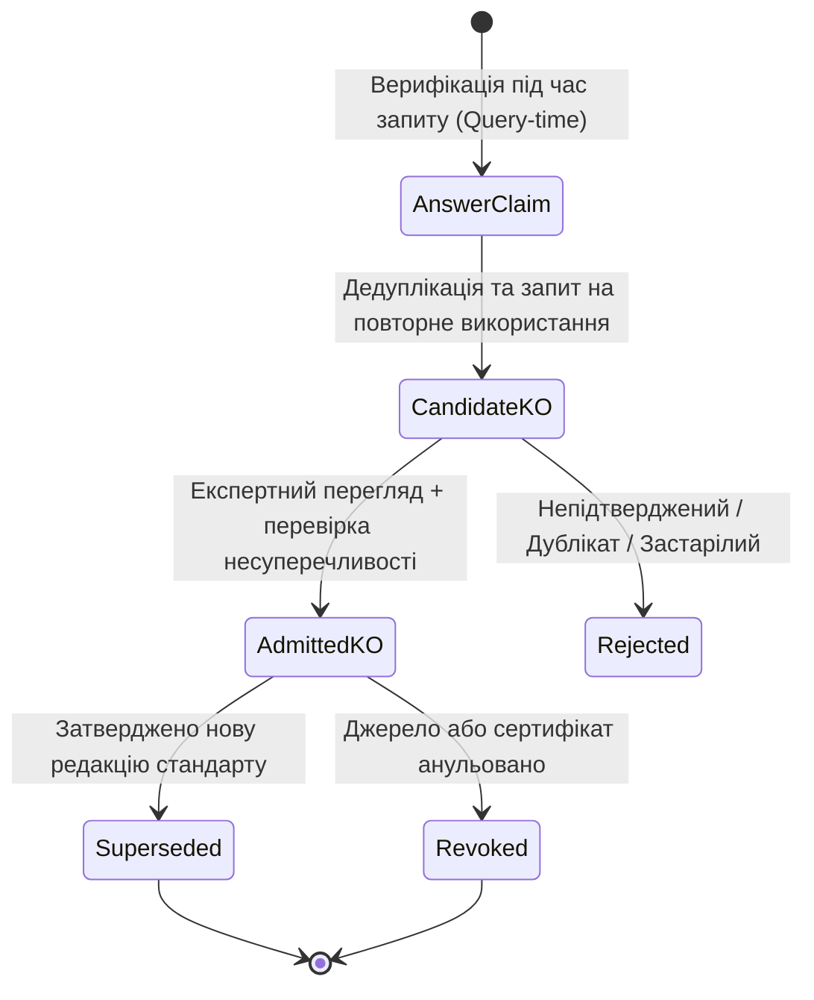

# Глава 19. Від запитання до доказу: як система трансформує неструктурований запит на ланцюг фактів

> **Книга:** [Архітектура доказових експертних систем](README.md) · [Частина IV: Архітектура, виконання та механізми висновку](part-04-architecture-and-inference.md)  
> **Попередня глава:** [Глава 18. Інфраструктура виконання: локальні моделі, апаратні прискорювачі, Edge та On-Premise](ch18-execution-infrastructure.md)  
> **Наступна глава:** [Глава 20. Рушій пояснень: як система обґрунтовує рішення, відмову та межі компетентності](ch20-explanation-engine.md)  
> **Зміст книги:** [README.md](README.md)  
> **Рівень:** розробники, інженери знань і фахівці з мовних моделей: середній / просунутий  
> **Очікувані результати:** проєктувати конвеєр трансформації неструктурованих запитів природною мовою у строгі дедуктивні предикати; розмежовувати етапи Detection, Extraction, Grounding та Verification; будувати проміжне представлення тверджень (Evidence Claim IR); реалізовувати детерміноване зв'язування числових значень з одиницями вимірювання (Units of Measure) та байтовими діапазонами першоджерел; організовувати безпечний допуск тверджень до бази знань.

Уявімо предметну експертну систему, що працює в інженерному чи регуляторному контурі. Її завдання — аналізувати нормативну документацію, технічні стандарти та результати випробувань і відповідати на запитання користувача лише тоді, коли в корпусі є неспростовний доказ.

Користувач запитує: *«Яка мінімальна довжина заголовка транспортного пакета?»*  
У документі стандарту справді є точна відповідь. Пошукова система безпомилково знаходить потрібний документ і правильний абзац. У знайденому тексті є і число, і одиниця вимірювання. Проте типовий наївний RAG-генератор відповідає коротко: *«8»*.

Число знайдене правильно, але інженерна відповідь є хибною. Вісім чого — бітів, байтів, октетів чи 32-розрядних слів? Ба більше, користувач міг сформулювати той самий запит іншими словами:

- *«Яка мінімальна довжина заголовка?»* (пряме запитання);
- *«Підкажи, скільки місця займає транспортний заголовок»* (прохання про розрахунок);
- *«Покажи в документі нормативне підтвердження довжини заголовка»* (запит на доказ);
- *«Чи правильно я розумію, що заголовок має довжину 8 октетів?»* (запит на верифікацію твердження).

Ці репліки мають різну граматичну структуру та комунікативну дію. Проте в їхній основі лежить одне спільне інженерне твердження.

Тут криється головна проблема: **знайти релевантний фрагмент тексту (Passage) — замало**. Між пошуком і фінальним вердиктом повинен працювати детермінований процес здобуття та верифікації знань під час запиту (*Query-Time Knowledge Acquisition*). Він має детектувати знання у знайденому тексті, видобути повне твердження, прив'язати кожен атрибут до точних байтів оригіналу та формально перевірити логічну відповідність.



---

## Де ця проблема розташована в загальній архітектурі

У [Главі 10](ch10-knowledge-acquisition-systems.md) ми розглядали глобальний контур підготовки знань: інвентаризацію корпусів, тріаж документів, розбір розмітки та класифікацію доступу. У [Главі 7](ch07-knowledge-base-typology.md) — типи сховищ та розмежування пошукового кандидата від логічного факту.

У цій главі ми досліджуємо критичний мікроконтур: документ уже авторизований, версіонований і розбитий на фрагменти; пошукова підсистема повернула топ-$k$ кандидатів. Тепер система повинна перетворити сирий текст знайденого фрагмента на формальне машинно-перевірюване твердження.

На цьому короткому шляху правильність результату розпадається на шість незалежних критеріїв:

| Шар обробки | Контрольне запитання | Типовий прихований дефект |
|---|---|---|
| **Retrieval** | Чи потрапив необхідний фрагмент у top-$k$? | Правильний документ знайдено, але повернуто застарілу ревізію |
| **Detection** | Чи містить фрагмент саме те відношення, про яке йдеться? | Згадка терміна прийнята за відповідь без перевірки семантики |
| **Extraction** | Чи збережено повну структуру інженерного значення? | Значення `8 octets` скорочено нейромережею до сирого числа `8` |
| **Grounding** | Чи має кожен атом твердження точні координати в документі? | Цитата правильна, але верифікована за нечинним стандартом |
| **Verification** | Чи повністю знайдений доказ підтверджує твердження? | Не помічено модальності винятку («крім випадків протоколу X») |
| **Admission** | Чи має користувач право отримати цей фрагмент знань? | Модель використала закритий норматив у відкритому запиті |

---

## Чому людський запит є слабо формальним

Запит до реляційної СУБД підпорядковується граматиці SQL. Запит до функціонального API вимагає типізованих параметрів. Людська мова позбавлена такого контракту.

Користувач може опустити суб'єкт: *«А яка його довжина?»* (спираючись на контекст діалогу). Може використати синонім: *«розмір»* замість нормативного *«довжина»*. Може змішати вимогу до змісту з вимогою до формату: *«Стисло поясни та наведи точний пункт стандарту»*.

Тому система повинна розкласти вхідну репліку на три ортогональні компоненти:

1. **Предмет запиту (Subject):** цільовий технічний об'єкт чи підсистема (*транспортний заголовок*).
2. **Цільове відношення (Relation):** характеристика чи інженерна властивість (*мінімальна довжина*).
3. **Комунікативна дія (Speech Act):** намір запитувача (пряма відповідь, наведення доказу, спростування чи підтвердження гіпотези).

Замість написання нескінченних крихких евристик регулярних виразів, сучасна архітектура використовує мовну модель (SLM/LLM) як семантичний парсер, який формує типізований контракт запиту:

```json
{
  "schema_version": "query-contract.v1",
  "subject": "transport header",
  "relation": "minimum length",
  "speech_act": "request_evidence",
  "answer_shape": "quantity",
  "constraints": {
    "standard_family": "ARINC-429",
    "revision_date_lte": "2026-08-01"
  },
  "dialogue_context_refs": ["urn:doc:req-spec-v2#sec-3.1"]
}
```

---

## Два контури здобуття знань: Ingest-time проти Query-time

Здобуття інженерних знань відбувається у двох різних часових контурах:



1. **Ingest-time Acquisition (Фоновий):** виконується під час додавання нових документів до репозиторію. Зберігає вихідну структуру, версії, розпізнає таблиці, розраховує контрольні суми фрагментів.
2. **Query-time Acquisition (Інтерактивний):** активується у відповідь на запит інженера. Той самий абзац нормативу може містити відповіді на десятки різних питань (довжина поля, діапазон напруг, допустима похибка). Система динамічно видобуває та верифікує лише той факт, який адресований у поточному контракті запиту.

---

## Архітектурний конвеєр перетворення запиту

Повний цикл перетворення неструктурованого запиту на перевірений доказовий пакет об'єднує контур пошуку та контур символьного доведення:



---

## Видобування та детерміноване зв'язування (Span Binding)

Головна небезпека генеративних мовних моделей полягає у довільній перефразі та втраті розмірностей. Щоб гарантувати абсолютну точність інженерних даних, система застосовує патерн **Deterministic Span Binder**:



### Формула структурної повноти твердження (Structural Completeness)

Твердження вважається валідним лише тоді, коли всі його ключові інженерні складові (матеріальні атоми: число, одиниця вимірювання, суб'єкт, обмеження) однозначно підтверджені цитатою з тексту:

$$\text{Comp}(C) = \frac{\sum_{a \in A_m(C)} w_a \cdot \mathbb{I}[b(a) \neq \varnothing]}{\sum_{a \in A_m(C)} w_a}$$

Де:

- $A_m(C)$ — множина матеріальних атомів твердження $C$;
- $w_a > 0$ — вага важливості конкретного атома;
- $\mathbb{I}[b(a) \neq \varnothing]$ — індикатор успішного однозначного прив'язування атома до байтів першоджерела.

Якщо значення $\text{Comp}(C) < 1.0$, твердження відхиляється як неповне, запобігаючи втраті одиниць вимірювання чи критичних умов застосування.

---

## Типізовані атоми знань (Typed Atoms)

Система нормалізує видобуті значення у строгі машинні типи:

- **Quantity Atom (Кількісний):** числове значення обов'язково пов'язане з одиницею вимірювання за міжнародною системою SI або стандартом UCUM (*8 octets, 24 V, 100 ms*). Число без одиниці відхиляється на рівні схеми.
- **Identifier Atom (Ідентифікатор):** складені нормативні позначення (*ARINC-429, MIL-STD-1553B, ISO-26262-ASIL-D*), що перевіряються регулярними виразами.
- **Modality Atom (Модальність):** ступінь нормативності (*SHALL, MUST, SHOULD, MAY*).
- **Temporal/Scope Atom (Межі чинності):** версія стандарту, діапазон температур, режим польоту.

---

## Байтове прив'язування та W3C PROV-O походження

У доказовій експертній системі посилання на джерело — це не просто назва файлу, а повний ланцюг цифрового походження:



Канонічний ідентифікатор фрагмента розраховується криптографічно:

$$\text{passage\_id} = H(\text{document\_id} \,\|\, \text{revision} \,\|\, \text{transform\_chain} \,\|\, \text{byte\_start} \,\|\, \text{byte\_end} \,\|\, \text{bytes})$$

Будь-яка зміна алгоритму парсингу, очищення чи нарізання тексту породжує новий `passage_id`, що гарантує стабільність цитувань і унеможливлює ситуацію, коли старе посилання вказує на зміщений текст.

---

## Проміжне представлення: Evidence Claim IR

Ядром контракту між мовною моделлю та детермінованим ядром є структура **Evidence Claim IR** (Intermediate Representation):

```json
{
  "$schema": "https://specs.expert-system.org/v1/evidence-claim.json",
  "claim_id": "claim:2026-09-27:arinc429:hdr-len:8a7f",
  "contract_ref": "query-contract.v1#req-120",
  "statement": {
    "subject": "transport header",
    "relation": "minimum_length",
    "modality": "MANDATORY",
    "value": 8,
    "unit": "octet",
    "qualifiers": {
      "protocol_mode": "STANDARD",
      "extended_addressing": false
    }
  },
  "provenance": {
    "document_urn": "urn:spec:arinc-429:part-1:rev-19",
    "passage_id": "pass:c71e89b2",
    "document_sha256": "9f8a3c...e81",
    "byte_range": [151, 157],
    "verbatim_quote": "The minimum length of the transport header shall be 8 octets."
  },
  "grounding_status": "EXACT_VERBATIM_MATCH",
  "verification": {
    "verdict": "FULLY_ENTAILED",
    "confidence": 1.0,
    "unsupported_atoms": []
  }
}
```

---

## Регресійне тестування конвеєра та випуск релізів

Здобуття знань тестується за схемою **Critical Slice Testing** — якість оцінюється не середнім показником по всій базі, а за найвразливішими інженерними категоріями:

```mermaid
flowchart LR
    accTitle: Конвеєр регресійного оцінювання та валідації якості видобування знань
    accDescr: Порівняння базової та кандидатської моделей за критичними зрізами, статистична перевірка та автоматичний відкат.

    M["<b>Еталонний тестовий маніфест</b>"] --> SPLIT["Розподіл на групи та зрізи"]
    SPLIT --> B["Базовий прогін (Baseline)"]
    SPLIT --> C["Кандидатський прогін (Candidate)"]
    B --> PAIR["Парне зіставлення слідів (Traces)"]
    C --> PAIR
    PAIR --> SL["Метрики за зрізами (Units, IDs, ACL)"]
    SL --> STAT["Статистичний аналіз (Bootstrap / McNemar)"]
    STAT --> GATE{"<b>Релізний шлюз</b><br/>Zero regression?"}
    GATE -->|Успіх| SHADOW["Shadow / Canary розгортання"]
    GATE -->|Провал| DIAG["Діагностика першого дефектного шару"]
    SHADOW --> MON["Моніторинг відхилень у продакшні"]
    MON -->|Аномалія| ROLL["Миттєвий відкат (Rollback)"]

    classDef src fill:#e1f5fe,stroke:#0288d1,stroke-width:2px,color:#01579b;
    classDef run fill:#ede7f6,stroke:#512da8,stroke-width:2px,color:#311b92;
    classDef gate fill:#fff8e1,stroke:#f57f17,stroke-width:2px,color:#e65100;
    classDef res fill:#e8f5e9,stroke:#2e7d32,stroke-width:2px,color:#1b5e20;
    classDef err fill:#ffebee,stroke:#c62828,stroke-width:2px,color:#b71c1c;

    class M,SPLIT src;
    class B,C,PAIR,SL,STAT,SHADOW,MON run;
    class GATE gate;
    class DIAG,ROLL err;
```



Критерій блокування релізу: для зрізів перевірки допусків безпеки (ACL bypass), цілісності походження (Provenance mismatch) та відповідей на суперечливі факти — кількість допустимих помилок дорівнює **нулю**.

---

## Життєвий цикл об'єктів знань: від відповіді до бази

Твердження, синтезоване мовною моделлю під час відповіді на запит, не стає автоматично постійним фактом у базі знань. Щоб стати довготривалим знанням, воно повинно пройти процес промоції (Promotion):



Цей механізм захищає базу знань від **самопідсилювального циклу галюцинацій (Self-reinforcing hallucination loop)**, коли випадкова помилка генеративної моделі записується у векторне сховище і згодом використовується як «авторитетне джерело» для наступних висновків.

---

## Резюме глави

Трансформація людського запитання на доказовий ланцюг фактів — це суворий інженерний процес, який компенсує слабку формальність природної мови детермінованими контрактами. Мовна модель використовується для семантичного розбору та виявлення кандидатів, тоді як типізація значень (Units of Measure), байтове прив'язування до першоджерел (Span Binding) та перевірка повноти (Verification) покладаються на детермінований код.

Проміжне представлення Evidence Claim IR слугує бар'єром надійності, який гарантує, що система ніколи не надасть число без одиниці вимірювання, висновок без посилання на чинну ревізію чи твердження, не підтверджене нормативним доказом.

У наступній главі ми дослідимо рушій пояснень (Explanation Engine): як відкрити внутрішню логіку системи, обґрунтувати кожен крок виведення та пояснити відмову у рішенні.

---

## Питання для самоперевірки та дискусії

1. **Семантична повнота:** Чому відповідь мовної моделі «8», надана на запитання про довжину інженерного поля, є неприпустимою для експертної системи навіть за умови збігу числа з нормативом?
2. **Span Binding:** Як детермінований зв'язувач (Deterministic Span Binder) протидіє галюцинаціям мовної моделі під час вилучення параметрів із тексту стандарту?
3. **W3C PROV-O зв'язок:** Чому для забезпечення доказовості недостатньо зберегти номер сторінки вихідного PDF-файлу, а потрібно фіксувати повний хеш конвеєра нормалізації?
4. **Контур допуску:** Що станеться з експертною базою знань, якщо дозволити системі автоматично зберігати всі успішні генеративні відповіді без перегляду інженером знань?
5. **Тестування за зрізами:** Чому оцінювання загальної точності RAG-конвеєра за усередненою метрикою Accuracy приховує критичні збої на специфічних інженерних доменах?

---

## Література та першоджерела

- Patrick Lewis та ін. [*Retrieval-Augmented Generation for Knowledge-Intensive NLP Tasks*](https://arxiv.org/abs/2005.11401), NeurIPS, 2020. Базова концепція генерації з доповненням пошуку.
- Timothy Lebo, Satya Sahoo, Deborah McGuinness (ред.). [*PROV-O: The PROV Ontology*](https://www.w3.org/TR/prov-o/), W3C Recommendation, 2013. Модель метаданих походження знань.
- UCUM Organization. [*The Unified Code for Units of Measure (UCUM)*](https://unitsofmeasure.org/). Міжнародний стандарт машинного подання одиниць вимірювання.
- Google Research. [*Natural Questions: a Benchmark for Question Answering Research*](https://doi.org/10.1162/tacl_a_00276), TACL, 2019. Методологія оцінювання видобування коротких і довгих відповідей.
- Object Management Group. [*Requirements Interchange Format (ReqIF) Version 1.2*](https://www.omg.org/spec/ReqIF/). Інженерний стандарт обміну нормативними вимогами.

---

[← Попередня глава](ch18-execution-infrastructure.md) · [Частина IV](part-04-architecture-and-inference.md) · [Зміст](README.md) · [Наступна глава →](ch20-explanation-engine.md)
