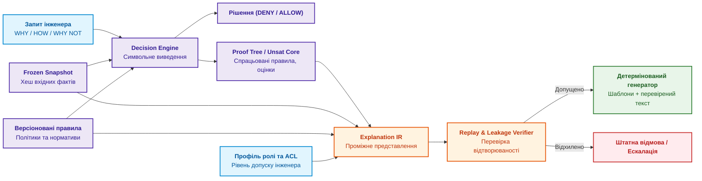
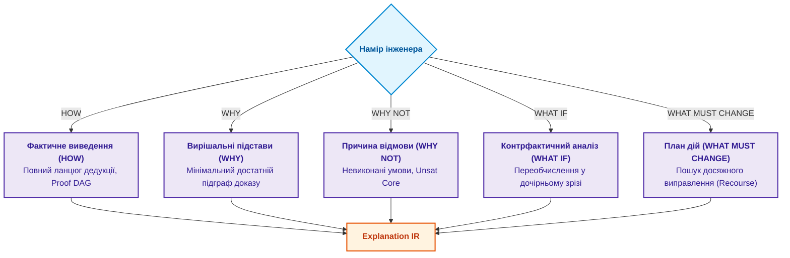
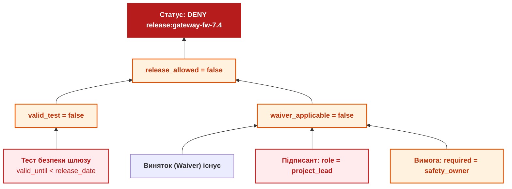
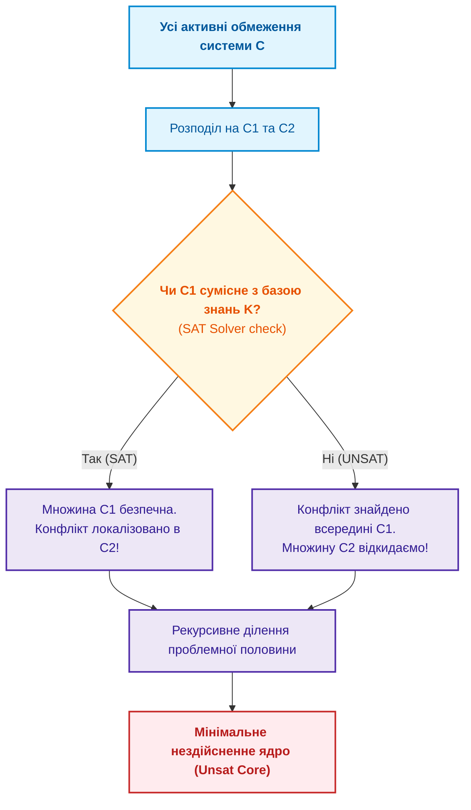
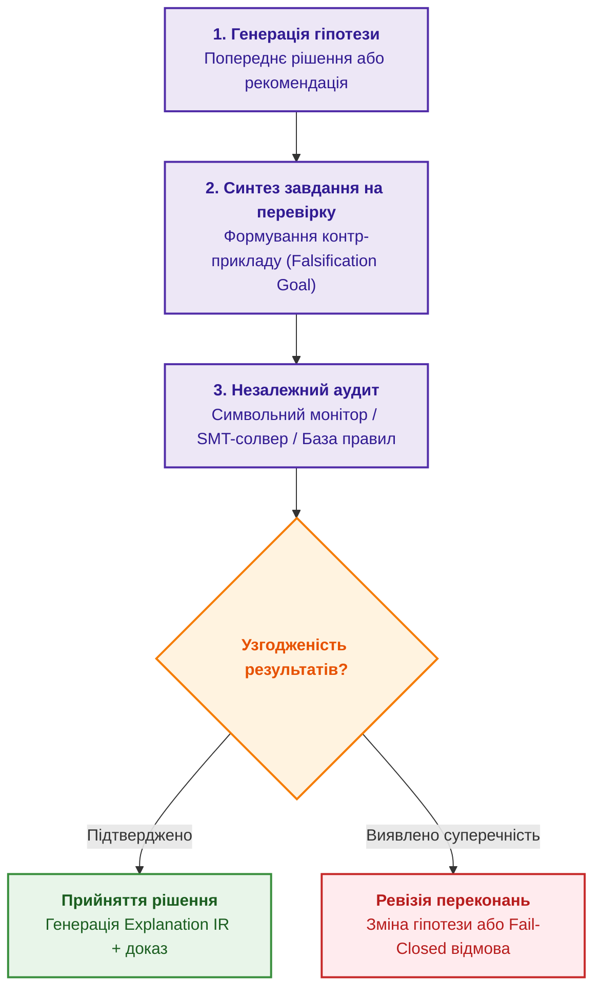
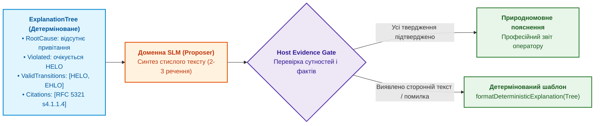

# Глава 20. Рушій пояснень: як система обґрунтовує рішення, відмову та межі компетентності

> **Книга:** [Архітектура доказових експертних систем](README.md) · [Частина IV: Архітектура, виконання та механізми висновку](part-04-architecture-and-inference.md)  
> **Попередня глава:** [Глава 19. Від запитання до доказу: як система трансформує неструктурований запит на ланцюг фактів](ch19-from-question-to-evidence.md)  
> **Наступна глава:** [Глава 21. Від рекомендації до дії: контроль повноважень та безпечне виконання у виробничих контурах](ch21-from-recommendation-to-action.md)  
> **Зміст книги:** [README.md](README.md)  
> **Рівень:** розробники ядра, архітектори систем, інженери знань: середній / просунутий  
> **Очікувані результати:** проєктувати повноцінний рушій пояснень (Explanation Engine); розмежовувати п'ять типів пояснювальних запитів (HOW, WHY, WHY NOT, WHAT IF, WHAT MUST CHANGE); реалізовувати алгоритм QuickXPlain для пошуку мінімального нездійсненного ядра обмежень (Unsat Core); будувати структуру Explanation IR з фільтрацією витоку даних (Explanation Redaction); формувати машинно-перевірювані дерева доведення рішень.

Уявімо критичну виробничу ситуацію: експертна система заблокувала реліз бортової прошивки літака чи мережевого шлюзу. У журналі зафіксовано машинний статус `decision=DENY`, а діалоговий асистент видає користувачеві розпливчасте пояснення: *«Ризик перевищує допустимий рівень безпеки»*.

Така відповідь звучить правдоподібно, але вона абсолютно непридатна для інженерної практики. Вона не відповідає на ключові робочі питання:

- Яке саме нормативне правило спрацювало?
- Які вхідні факти та показники датчиків стали вирішальними?
- Чому підписаний виняток (Waiver) не був застосований системою?
- Яких саме даних забракло для отримання статусу `ALLOW`?
- Чи зміниться рішення, якщо провести повторне випробування вузла?

Пояснення в доказовій експертній системі — це не літературна оповідь, згенерована мовною моделлю «заднім числом» (Post-hoc Rationalization). **Машина пояснень (Explanation Engine)** — це спеціалізована детермінована підсистема, яка транслює реальний граф логічного виведення (Proof DAG) у структуроване представлення для людини, вибираючи лише ті факти, інваріанти та невиконані умови, на основі яких система прийняла рішення.

---

## Пояснення як окремий інженерний артефакт

Машина пояснень не повинна реконструювати історію здогадками. Вона працює безпосередньо над зафіксованим зрізом даних (Snapshot), базою правил і трасою доведення (Proof Trace), які породили рішення.



Структура **Explanation IR** відокремлює логічний зміст пояснення від мови представлення. Генеративна мовна модель може виступати лише вербалізатором перевірених фактів, але їй суворо заборонено додавати будь-які непідтверджені причини.

Контракт зафіксованого рішення:

```json
{
  "decision_id": "dec:gateway-fw-7.4:9f1c",
  "decision": "DENY",
  "subject": "release:gateway-fw-7.4",
  "snapshot_hash": "sha256:d41d8cd98f00b204e9800998ecf8427e",
  "knowledge_version": "kb:release-policy@v7.3",
  "policy_version": "authz-rules@v12",
  "proof_root": "proof:tree:4711",
  "evaluated_at": "2026-09-27T10:15:00Z"
}
```

Без `snapshot_hash`, ревізії нормативів та `proof_root` будь-яке пояснення втрачає юридичну та інженерну силу, перетворюючись на бездоказовий коментар.

---

## П'ять класів пояснювальних запитів

Універсального запитання «чому?» недостатньо для складних технічних систем. Інтерфейс пояснень повинен чітко розрізняти п'ять типів запитів:



Специфікація запитів:

| Запит | Цільова аудиторія | Що обчислює система | Результат |
|---|---|---|---|
| **HOW** | Розробники ядра, верифікатори | Повний трас виведення: усі спрацьовані правила, проміжні предикати | Повний граф доведення (Proof DAG) |
| **WHY** | Аудитори, сертифікаційні органи | Мінімальний набір фактів, що був достатнім для вердикту | Достатній підграф доказу |
| **WHY NOT** | Автори релізу, інженери | Чому бажаний результат `ALLOW` не був виведений машиною | Нездійсненне ядро обмежень (Unsat Core) |
| **WHAT IF** | Аналітики ризиків, архітектори | Що відбудеться, якщо змінити окремі вхідні параметри | Повторний прогін на дочірньому зрізі фактів |
| **WHAT MUST CHANGE** | Інженери-виконавці | Яка мінімальна допустима дія призведе до схвалення | Досяжний та авторизований план дій (Recourse) |

---

## Граф доказу (Proof DAG) на практичному прикладі

Розглянемо блокування релізу прошивки шлюзу версії 7.4.  
Правило випуску вимагає одночасного виконання трьох умов:

1. Наявність чинного звіту про тестування безпеки (`valid_safety_test = true`).
2. Відсутність блокувальних дефектів (`critical_defects = 0`).
3. За наявності відхилень — наявність погодженого винятку (`waiver_applicable = true`), підписаного виключно відповідальним за функціональну безпеку (`safety_owner`).

У системі зафіксовано факти:

- Звіт про тестування прострочений (`valid_until < release_date`).
- Виняток було створено, але підписано керівником проєкту (`project_lead`), а не інженером безпеки.



Для запиту **WHY** система повертає обидві незалежні гілки блокування. Для запиту **HOW** додаються точні хеші нормативних правил та часові мітки. Машина не вигадує гіпотез про те, що «прошивка зламає мережу», а констатує порушення формального регламенту.

---

## Пошук причин відмови (WHY NOT) та алгоритм QuickXPlain

Коли система відмовляє у видачі статусу `ALLOW`, інженеру потрібно знати точну причину. Якщо в базі діють сотні взаємопов'язаних правил, прямий перебір усіх можливих комбінацій вимагає експоненційного часу.

Для миттєвої ізоляції конфлікту застосовується алгоритм **QuickXPlain** (розроблений Ульріхом Юнкером), який реалізує стратегію «розділяй і володарюй» для немонотонних баз знань спільно з SAT/SMT розв'язувачами (наприклад, Z3).



Математичне визначення нездійсненного ядра обмежень:

$$\text{UnsatCore} \subseteq C \quad \text{таке, що} \quad K \cup \text{UnsatCore} \vdash \bot$$

Де $\bot$ позначає логічну суперечність. QuickXPlain знаходить мінімальне ядро за логарифмічний час $O(k \log(n/k) + k^2)$, де $n$ — кількість правил у системі, а $k$ — розмір ядра конфлікту.

---

## Контрфактичний аналіз та допустимі інженерні дії (Recourse)

Запит **WHAT MUST CHANGE** вимагає від системи надати інженеру практичний план подолання відмови. Математично це зводиться до задачі мінімізації відстані між поточним станом $x$ та цільовим станом $x'$, що забезпечує $D(x') = \text{ALLOW}$:

$$x^* = \arg\min_{x'} d(x, x') \quad \text{за умов} \quad x' \in F_{\text{feasible}} \cap F_{\text{actionable}} \cap F_{\text{authorized}}$$

Критичні інженерні обмеження простору пошуку:

1. **$F_{\text{feasible}}$ (Фізична можливість):** виключає логічно чи фізично неможливі стани (наприклад, зміну дати випробувань у минулому).
2. **$F_{\text{actionable}}$ (Дієвість):** містить лише параметри, які людина може реально змінити (наприклад, призначення повторного тесту чи оновлення підпису). Атрибути на кшталт версії скомпільованого ядра вважаються незмінними ($d = \infty$).
3. **$F_{\text{authorized}}$ (Повноваження):** дії, доступні виключно поточній ролі користувача. Зміна ролі підписанта з `project_lead` на `safety_owner` для автора релізу є забороненою маніпуляцією.

Коректна порада системи для автора релізу шлюзу:  
*«1. Проведіть повторне тестування безпеки у лабораторії №2 (найближче вікно: 14:00). АБО 2. Направте запит на підписання винятку до інженера безпеки (safety_owner)»*.

---

## Захист від логічного шпигунства (Explanation Redaction)

Машина пояснень є потенційним каналом витоку конфіденційної інформації через серію запитів `WHY NOT` (Knowledge Extraction Attacks). Якщо підрядник надсилає запит про статус релізу і отримує відповідь: *«DENY: порушено таймінги шини проєкту Project_Titan_v2»*, відбувається несанкціоноване розкриття існування секретного проєкту `Project_Titan`.

Для запобігання цьому хост-система застосовує динамічне маскування Explanation IR:

$$\text{EIR}_{\text{redacted}} = \{e \in \text{EIR} \mid \text{ACL}(e, \text{user\_role}) = \text{ALLOW}\}$$

Якщо елемент доведення має вищий рівень таємності, ніж права запитувача, деталь приховується з генерацією нейтрального замінника: *«Реліз відхилено за регламентом корпоративної безпеки. Деталі доступні аудитору за запитом SEC-AUTH-8»*.

---

## Метакогніція та самоверифікація (Meta-Cognitive & Self-Verifying Loops)

Наступним рівнем розвитку пояснювального контуру є перехід від статичного пояснення до **метакогніції (Meta-Cognition)** — здатності експертної системи усвідомлювати та оцінювати власні процеси міркування (*Reasoning about reasoning*).

Сучасні дослідження в галузі нейро-символьного ШІ показують, що метакогніція залишається найменш опрацьованим напрямом (менше 5% наукових праць), попри її критичну роль у формуванні надійного ШІ.

### 1. Метакогнітивні питання системи до самої себе

Перш ніж видати висновок і пояснення людині, система виконує каскад метакогнітивних самоперевірок:

1. **Межа компетентності (Competence Gate):** *«Чи належить цей запит до моєї формально визначеної предметної області, чи я виходжу за власні інженерні кордони?»*
2. **Достатність знань (Knowledge Sufficiency):** *«Чи достатньо наявних у базі фактів для однозначного висновку, чи відповідь буде спекулятивною здогадкою?»*
3. **Виявлення суперечностей (Contradiction Check):** *«Чи не містять використані нормативні джерела взаємних колізій або застарілих вимог?»*
4. **Вибір стратегії виведення (Strategy Selection):** *«Який метод розв'язання оптимальний: строга дедукція Datalog, аналогія прецедентів (CBR) чи запит на уточнення (Fail-Closed)?»*
5. **Калібрована надійність (Calibrated Confidence):** *«Наскільки математично доведеним є отримане рішення?»*

### 2. Контур самоверифікації (Self-Verifying Architecture)

У критичних системах пояснення стає не післямовною нотаткою, а активним інструментом верифікації:



Такий підхід гарантує, що система спочатку намагається **спростувати власний висновок** через пошук мінімального контрприкладу, і лише після проходження цієї внутрішньої дуелі формує остаточне рішення для інженера.

---

## Нейро-символьний синтез природномовних пояснень ($Q_3$ Grounded Synthesis)

У сучасних промислових системах інженер рідко читає сирий JSON `Explanation IR` чи граф доказів `Proof DAG`. Йому потрібне стисле, людинозрозуміле природномовне пояснення причин збою, але з **абсолютною гарантією відсутності галюцинацій**.

Традиційний підхід передати запит генеративній LLM є катастрофічним: модель вигадує правдоподібні, але неіснуючі пункти стандартів чи хибні кроки відновлення.

У доказовій архітектурі реалізується протокол **$Q_3$ SynthesizeNaturalExplanation**:



### Принцип роботи $Q_3$ у CLI

Кориспондент або оператор ініціює діагностику через інтерфейс командного рядка з прапорцем `--natural`:

```bash
expert-cli explain --protocol SMTP --state IDLE --command DATA --natural
```

Виконавчий контур формує структуру `ExplanationTree`:

```json
{
  "protocol": "SMTP",
  "current_state": "IDLE",
  "attempted_command": "DATA",
  "claim": "Command DATA invalid in state IDLE",
  "root_cause": "Missing greeting and transaction initialization",
  "violated_prerequisite": "Session must be initialized via HELO/EHLO and MAIL FROM",
  "valid_transitions": ["HELO", "EHLO", "QUIT"],
  "remediation_path": ["HELO", "MAIL FROM", "RCPT TO", "DATA"],
  "evidence_grounded": true
}
```

Локальна доменна модель (`slm-rfc-expert:7b`) отримує суворий промпт із вимогою озвучити **виключно зазначені вузли**. Вивід моделі перевіряється шлюзом `Host Evidence Gate`:

- якщо SLM зберегла фактологічну точність, користувач отримує живий лаконічний текст;
- якщо модель додала хоча б одну недоведену команду або втратила зв'язок із протоколом, спрацьовує детермінований fallback:
  *«Протокол SMTP: Помилка послідовності. Команда DATA не дозволена у стані IDLE. Першопричина: відсутність ініціалізації сесії. Дозволені команди: HELO, EHLO, QUIT. Шлях відновлення: HELO -> MAIL FROM -> RCPT TO -> DATA.»*

Тим самим природна мова слугує ергономічним фасадом, але математичний фундамент залишається 100% формалізованим.

---

## Резюме глави

Рушій пояснень перетворює символьну експертну систему на прозорий інструмент прийняття рішень. Він оперує структурованим представленням Explanation IR, що базується на імутабельних зрізах вхідних фактів та графах виведення (Proof DAG).

Завдяки розділенню п'яти типів запитів (HOW, WHY, WHY NOT, WHAT IF, WHAT MUST CHANGE) та застосуванню алгоритму QuickXPlain система локалізує конфлікти за логарифмічний час і генерує здійсненні поради без ризику галюцинацій та витоку закритих даних.

У наступній главі ми дослідимо перехід від аналітичної рекомендації до безпечного виконання керуючих дій у промислових контурах.

---

## Питання для самоперевірки та дискусії

1. **Post-hoc проти доказу:** У чому полягає критична небезпека пояснення рішень за допомогою генерації тексту великою мовною моделлю поверх сирого результату класифікатора?
2. **Типологія запитів:** Чому розробнику системи потрібен режим `HOW`, тоді як автору відхиленого релізу необхідний режим `WHAT MUST CHANGE`?
3. **QuickXPlain:** Як алгоритм QuickXPlain забезпечує знаходження мінімального нездійсненного ядра обмежень (Unsat Core) без повного лінійного перебору всіх правил бази знань?
4. **Actionable Recourse:** Чому формально близький математичний контрфакт (наприклад, «змініть дату калібрування сенсора на вчора») є неприпустимим у практичній експертній системі?
5. **Логічне шпигунство:** Як механізм динамічного маскування підграфів (Explanation Redaction) запобігає витоку комерційних таємниць через аналіз відповідей на запити `WHY NOT`?

---

## Література та першоджерела

- William J. Clancey. [*The Epistemology of a Rule-Based Expert System: A Framework for Explanation*](https://doi.org/10.1016/0004-3702(83)90008-5), Artificial Intelligence, 1983. Класична праця з епістемології машинних пояснень.
- Ulrich Junker. [*QUICKXPLAIN: Preferred Explanations and Critical Relaxations for Over-Constrained Problems*](https://www.aaai.org/Papers/AAAI/2004/AAAI04-027.pdf), AAAI, 2004. Базовий алгоритм пошуку мінімальних конфліктів.
- Tim Miller. [*Explanation in Artificial Intelligence: Insights from the Social Sciences*](https://doi.org/10.1016/j.artint.2018.07.007), Artificial Intelligence, 2019. Психологічні та логічні основи людино-машинного пояснення.
- Sandra Wachter, Brent Mittelstadt, Chris Russell. [*Counterfactual Explanations without Opening the Black Box: Automated Decisions and the GDPR*](https://arxiv.org/abs/1711.00399), Harvard Journal of Law & Technology, 2018. Юридичні та математичні засади контрфактичних пояснень.
- Scott M. Lundberg, Su-In Lee. [*A Unified Approach to Interpreting Model Predictions (SHAP)*](https://papers.nips.cc/paper_files/paper/2017/hash/8a20a8621978632d76c43dfd28b67767-Abstract.html), NeurIPS, 2017. Метод адитивних пояснень внеску ознак.

---

[← Попередня глава](ch19-from-question-to-evidence.md) · [Частина IV](part-04-architecture-and-inference.md) · [Зміст](README.md) · [Наступна глава →](ch21-from-recommendation-to-action.md)
