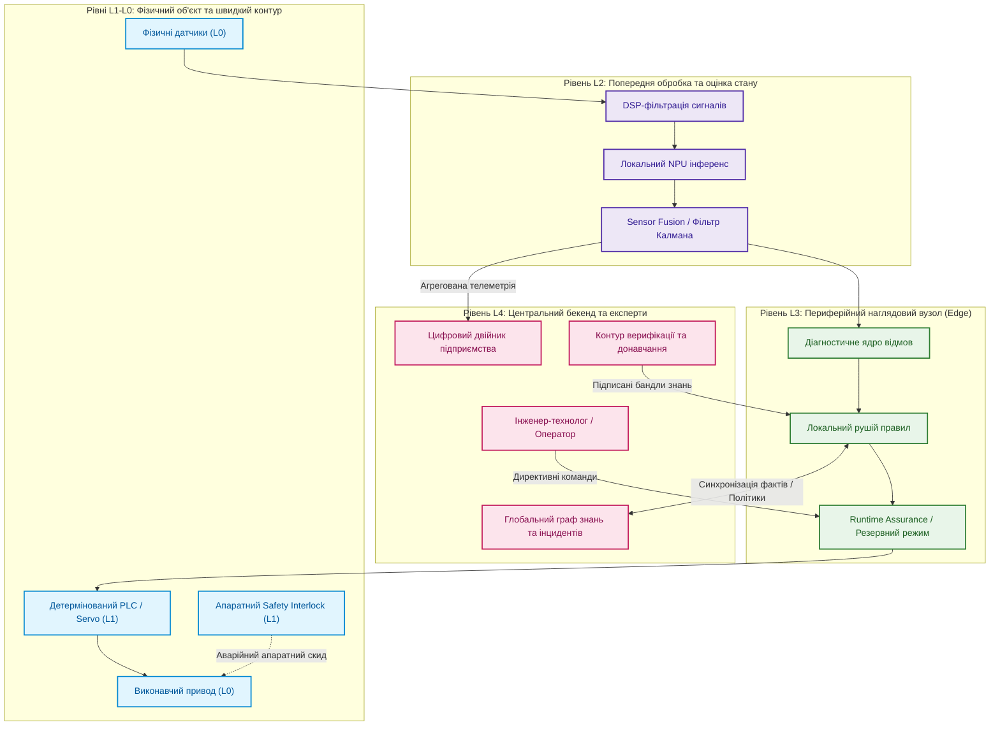
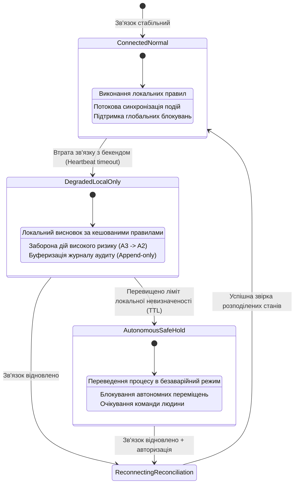
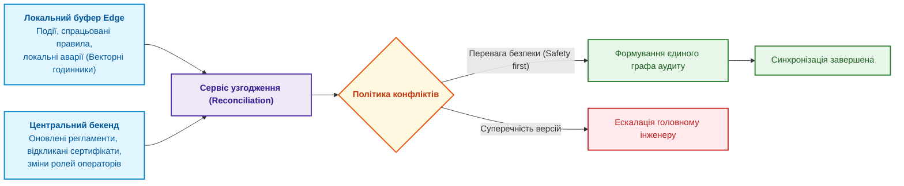

# Глава 22. Кібернетичний контур XXI століття: від сенсорів на Edge до центру прийняття рішень

> **Книга:** [Архітектура доказових експертних систем](README.md) · [Частина IV: Архітектура, виконання та механізми висновку](part-04-architecture-and-inference.md)  
> **Попередня глава:** [Глава 21. Від рекомендації до дії: контроль повноважень та безпечне виконання у виробничих контурах](ch21-from-recommendation-to-action.md)  
> **Наступна частина:** [Частина V: Верифікація, діагностика та неперервне навчання](part-05-verification-and-learning.md)  
> **Наступна глава:** [Глава 23. Верифікація бази знань: несуперечливість, повнота та формальні інваріанти](ch23-knowledge-base-verification.md)  
> **Зміст книги:** [README.md](README.md)  
> **Рівень:** системні архітектори, інженери кіберфізичних комплексів, розробники Edge AI: середній / просунутий  
> **Очікувані результати:** проєктувати розподілені кібернетичні контури з багаторівневим зворотним зв'язком; застосовувати закон необхідної різноманітності Ешбі до архітектури експертних систем; розділяти функції між рівнями L0–L4 за часовими горизонтами; організовувати надійне функціонування локальних вузлів (Edge) в умовах обриву зв'язку (Degraded / Disconnected modes); реалізовувати протоколи узгодження станів і підписані оновлення баз знань.

На автоматизованій виробничій лінії або на борту автономного апарата високочастотний датчик фіксує нетиповий спектральний сплеск вібрації в підшипниковому вузлі. Якою має бути системна реакція?

- Негайно вимкнути приводний двигун в аварійному режимі?
- Направити інженеру сповіщення про необхідність візуального огляду під час регламентної паузи?
- Проігнорувати сигнал як короткочасну перешкоду від сусіднього преса?

Відповідь неможливо отримати з одного лише числового виходу нейромережевого класифікатора. Вона залежить від цілісного контексту: поточної стадії технологічного процесу, достовірності калібрування сенсора, температури мастила, вартості зупинки конвеєра, наявності резервного каналу та повноважень конкретного вузла прийняття рішень.

Якщо зв'язок із центральним сервером раптово обривається, критична логіка захисту повинна спрацювати безпосередньо біля обладнання (Edge). Водночас локальний контролер не володіє повною історією обслуговування парку машин і не має права самовільно змінювати технологічний регламент заводу.

У цій главі ми дослідимо кібернетичний контур сучасної експертної системи: як замкнути зворотний зв'язок між фізичним процесом, локальним інференсом та аналітичним бекендом, забезпечуючи детерміноване керування в умовах невизначеності, затримок та апаратних збоїв.

---

## Кібернетика та закон необхідної різноманітності Ешбі

Кібернетика (у класичному розумінні Норберта Вінера) — це наука про управління та зв'язок у складних динамічних системах зі зворотним зв'язком. У XXI столітті цей фундамент поєднується з розподіленими обчисленнями, сенсорними мережами, цифровими двійниками (Digital Twins) та формальними моделями знань.

### Закон необхідної різноманітності (Law of Requisite Variety)

Сформульований Вільямом Россом Ешбі закон стверджує: **лише різноманітність регулятора здатна знищити (поглинути) різноманітність збурень**.

Міра різноманітності скінченної множини станів $\Omega$:

$$V(\Omega) = \log_2 |\Omega|$$

Якщо зовнішнє фізичне середовище може спричинити $2^{10} = 1024$ різних критичних несправностей, а діагностичний класифікатор на виході видає лише два бінарні статуси `NORMAL` або `FAIL`, система позбавлена необхідної ефективної різноманітності. Вона фізично не здатна вибрати адекватну компенсаційну дію для несумісних між собою аварійних режимів.

```mermaid
flowchart LR
    accTitle: Кібернетичний контур регулювання зі зворотним зв'язком
    accDescr: Цикл взаємодії між фізичним процесом, сенсорами, оцінювачем стану, експертним ядром та виконавчим механізмом за участі оператора.

    ENV["<b>Кіберфізичний процес</b><br/>Механіка, термодинаміка"] --> SEN["<b>Сенсори та телеметрія</b><br/>Вібрація, тиск, струм"]
    SEN --> OBS["<b>Фільтрація та валідація</b><br/>Контроль часу, відсів шумів"]
    OBS --> EST["<b>Оцінювач стану (State Estimator)</b><br/>Фільтр Калмана / Цифровий двійник"]
    EST --> EXP["<b>Експертне наглядове ядро</b><br/>Правила, нормативи, діагностика"]
    EXP --> DEC["<b>Дозволене керуюче рішення</b>"]
    DEC --> ACT["<b>Виконавчий орган (Actuator)</b><br/>Частотний перетворювач, клапан"]
    ACT --> ENV
    ENV -.->|"Фізичний відгук і новий стан"| SEN

    HUM["<b>Людина-оператор</b><br/>Контроль повноважень"] --> DEC
    EXP --> HUM

    classDef env fill:#fff3e0,stroke:#e65100,stroke-width:2px,color:#bf360c;
    classDef sens fill:#e1f5fe,stroke:#0288d1,stroke-width:2px,color:#01579b;
    classDef est fill:#ede7f6,stroke:#512da8,stroke-width:2px,color:#311b92;
    classDef core fill:#e8f5e9,stroke:#2e7d32,stroke-width:2px,color:#1b5e20;
    classDef hum fill:#fce4ec,stroke:#c2185b,stroke-width:2px,color:#880e4f;

    class ENV,ACT env;
    class SEN,OBS sens;
    class EST est;
    class EXP,DEC core;
    class HUM hum;
```



Експертна система забезпечує необхідну різноманітність завдяки багаторівневій онтології відмов: замість грубого бінарного статусу вона формує типізовану діагностичну гіпотезу з рівнем впевненості та прив'язкою до поточної експлуатаційної моделі.

---

## Ієрархія часових горизонтів: рівні L0–L4

Різні типи рішень вимагають принципово різних часових бюджетів:

| Рівень | Часовий горизонт | Функціональне призначення | Неприпустимі компоненти (Захисний інваріант) |
|:---:|---|---|---|
| **L0** | Безперервний | Фізичний об'єкт, динаміка матеріалів, енергетика | Будь-які програмні припущення без сенсорного підтвердження |
| **L1** | $1\text{ мкс} - 10\text{ мс}$ | Жорстке локальне керування: сервоприводи, PLC, ПЛІС, interlock-захист | Недетерміновані нейромережі, LLM, мережеві сокети |
| **L2** | $10\text{ мс} - 1\text{ с}$ | Первинне сприйняття (Perception): DSP-фільтрація, злиття сенсорів (Sensor Fusion), NPU-класифікація | Формування семантичних фактів без метаданих похибки та часової мітки |
| **L3** | $1\text{ с} - 1\text{ хв}$ | Локальний нагляд (Edge Supervisory): продукційні правила, оцінка ризиків, менеджер аварійних режимів | Необмежені повноваження на модифікацію глобальної політики |
| **L4** | $1\text{ хв} - \text{дні}$ | Центральний бекенд (Cloud/On-Prem): глобальний граф знань, ретроспективна аналітика, оновлення моделей | Припущення про постійну доступність зв'язку з периферією |



---

## Контракти сенсорних подій та фільтрація шумів

Сенсорні дані надходять потоково на надвисоких частотах (кілогерци для вібрації чи акустики). Передача кожного сирого відліку в центральну базу знань є технічно неможливою та економічно безглуздою.

Периферійний вузол (L2) перетворює масив сирих сигналів на типізовану подію:

```json
{
  "event_id": "evt:vibr:sensor-42:2026-09-27T10:14:02.105Z",
  "source_urn": "urn:plant:sector-b:motor-07:vibr-probe-1",
  "measurement_window_ms": 100,
  "sampling_rate_hz": 20000,
  "features": {
    "peak_acceleration_g": 4.82,
    "rms_velocity_mms": 11.4,
    "dominant_frequency_hz": 142.5,
    "kurtosis": 5.12
  },
  "signal_integrity": {
    "snr_db": 28.4,
    "sensor_status": "CALIBRATED_VALID",
    "clipping_detected": false
  },
  "local_classification": {
    "anomaly_probability": 0.89,
    "model_fingerprint": "sha256:7c8b...1a0",
    "inference_device": "Intel_Core_Ultra_NPU"
  }
}
```

Лише валідовані події з високим відношенням сигнал/шум (SNR) та неушкодженою структурою стають фактами для предикатних правил рушія.

---

## Режими деградації та обрив зв'язку (Network Partitioning)

Ключова вимога до кіберфізичної системи: **безпека не повинна залежати від стабільності інтернет-з'єднання**.

При зникненні зв'язку з центром локальний Edge-вузол перемикається між чотирма станами надійності:



Правила безпечного функціонування в автономному режимі:

1. **Зниження рівня автономності:** операції, які в штатному режимі дозволялися автоматично (A3), переходять у категорію обов'язкового локального підтвердження оператором (A2).
2. **Обмеження терміну дії (Lease / TTL):** сертифікати дозволів діють обмежений час (наприклад, 30 хвилин). Якщо зв'язок не відновлено — лінія автоматично сповільнюється або зупиняється.
3. **Імутабельний буфер дій:** усі локальні рішення записуються у локальну базу з криптографічними підписами для подальшої відправки в центр.

---

## Протокол узгодження станів (Reconciliation)

Після відновлення зв'язку центральний бекенд і периферійний вузол зобов'язані провести взаємну звірку (Reconciliation) без втрати цілісності:



Вирішення конфліктів базується на інваріанті **«Safety First»**: якщо локальний вузол з міркувань безпеки заблокував агрегат, центральний бекенд не має права скасувати це блокування заднім числом без явного підтвердження інженера на місці.

---

## Безпечне оновлення знань: підписані бандли (Signed Knowledge Bundles)

Оновлення моделей інференсу, правил та онтологій на периферійних пристроях не повинно відбуватися через хаотичні скрипти. Пакет знань — це скомпільований, типізований та криптографічно підписаний артефакт:

$$\text{KnowledgeBundle} = \{\text{Rules}, \; \text{Models}, \; \text{Schemas}, \; \text{Signatures}, \; \text{ValidFrom}, \; \text{ValidTo}\}$$

Процедура оновлення:

1. Нова версія правил тестується на симуляторі у контурі CI/CD.
2. Формується єдиний бінарний пакет із контрольною сумою SHA-256.
3. Пакет підписується закритими ключами відповідальних архітекторів безпеки (Multi-signature).
4. Edge-вузол перевіряє підписи за допомогою апаратного модуля довіри (TPM / Secure Boot).
5. Виконується атомарне перемикання (Blue/Green Deployment) з автоматичним поверненням у разі збою валідації.

---

## Резюме глави та Частини IV

У цій главі ми завершили розгляд архітектурного контуру експертної системи. Ми простежили наскрізний кібернетичний шлях знання: від первинного фізичного сигналу на сенсорі через локальні фільтри (L2) та наглядові правила (L3) до глобального бекенду координації (L4).

Закон необхідної різноманітності Ешбі нагадує: автоматизація надійна лише тоді, коли внутрішні моделі системи здатні розрізнити всі критичні стани об'єкта. Чітке розмежування часових горизонтів, детерміновані протоколи роботи при втраті зв'язку та сувора дисципліна підписаних оновлень гарантують, що доказова експертна система залишається керованою, надійною та безпечною за будь-яких фізичних збурень.

У наступній, **Частині V: Верифікація, діагностика та неперервне навчання**, ми перейдемо до аналізу якості самої системи: як математично довести несуперечливість бази знань, локалізувати дефекти в складних графах правил та організувати неперервне навчання без ризику катастрофічного забування.

---

## Питання для самоперевірки та дискусії

1. **Закон Ешбі:** Як інженер знань може математично оцінити, чи має розроблювана експертна система достатню різноманітність для керування конкретним виробничим процесом?
2. **Розподіл за горизонтами:** Чому розміщення мовної моделі (LLM) у контурі аварійного зупину турбіни (горизонт L1) є грубим порушенням вимог функціональної безпеки?
3. **Обрив зв'язку:** Які механізми запобігають неконтрольованому накопиченню помилок периферійним вузлом у режимі `DegradedLocalOnly`?
4. **Конфлікти узгодження:** За яким правилом вирішується суперечність, якщо під час автономної роботи Edge заблокував двигун, а центральний сервер за розкладом надіслав команду старту нової технологічної партії?
5. **Signed Bundles:** Чому оновлення ваг локальної нейромережі на периферійному контролері вимагає такої самої процедури підпису та сертифікації, як і оновлення логічних правил?

---

## Література та першоджерела

- Norbert Wiener. [*Cybernetics: Or Control and Communication in the Animal and the Machine*](https://mitpress.mit.edu/9780262730099/cybernetics/), MIT Press, 1948 / 1965. Фундаментальна праця з теорії кібернетичного керування.
- W. Ross Ashby. [*An Introduction to Cybernetics*](https://archive.org/details/introductiontocy00ashb), Chapman & Hall, 1956. Формулювання закону необхідної різноманітності.
- Roger C. Conant, W. Ross Ashby. [*Every Good Regulator of a System Must Be a Model of that System*](https://doi.org/10.1080/00207727008920220), International Journal of Systems Science, 1970. Теорема про необхідність внутрішньої моделі для ефективного регулятора.
- Edward A. Lee, Sanjit A. Seshia. [*Introduction to Embedded Systems: A Cyber-Physical Systems Approach*](https://ptolemy.berkeley.edu/books/leeseshia/), MIT Press, 2017. Базовий підручник з кіберфізичних систем.
- International Electrotechnical Commission. [*IEC 62443: Security for industrial automation and control systems*](https://www.isa.org/standards-and-publications/isa-standards/isa-iec-62443-series). Міжнародний комплекс стандартів промислової кібербезпеки.

---

[← Попередня глава](ch21-from-recommendation-to-action.md) · [Частина IV](part-04-architecture-and-inference.md) · [Зміст](README.md) · [Наступна глава →](ch23-knowledge-base-verification.md)
