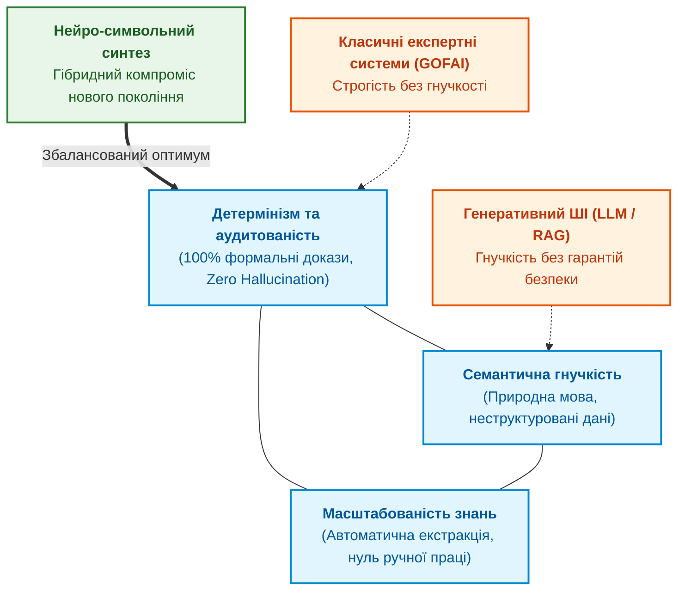
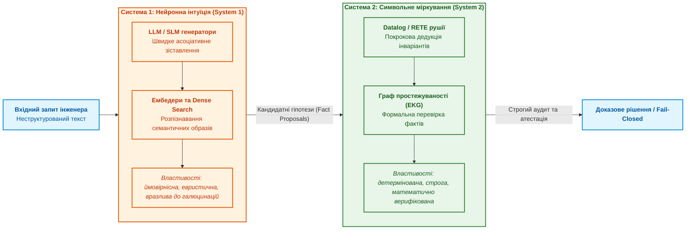
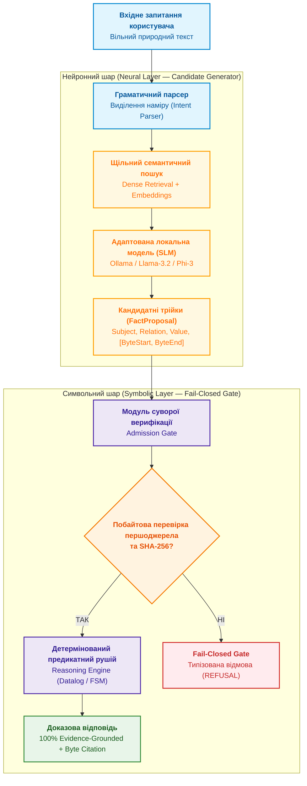
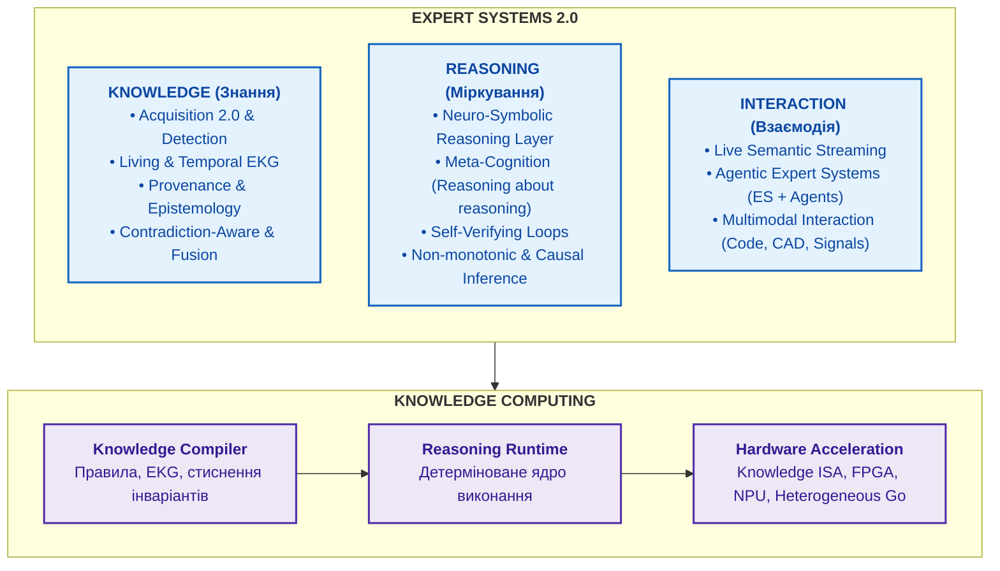

# Глава 29. Нейро-символьна архітектура (Neuro-Symbolic AI): поєднання мовних моделей та детермінованої доказовості на Go та Ollama

> **Книга:** [Архітектура доказових експертних систем](README.md) · [Частина VI: Передовий край: регуляторна сертифікація та нейро-символьний ШІ](part-06-frontiers-neuro-symbolic.md)  
> **Попередня глава:** [Глава 28. Дворежимні експертні системи: поєднання строгої дедукції (Fail-Closed) та евристичного дорадчого виведення (CBR)](ch28-dual-mode-expert-systems.md)  
> **Наступна частина:** [Додатки](appendix-a-evidence-governed-framework.md)  
> **Наступний розділ:** [Додаток А. Практичний фреймворк доказового дослідження в складних інженерних проєктах](appendix-a-evidence-governed-framework.md)  
> **Зміст книги:** [README.md](README.md)  
> **Рівень:** системні архітектори, провідні інженери ШІ, розробники критичних систем: просунутий  
> **Після глави:** проєктувати та впроваджувати нейро-символьні архітектури; розмежовувати обов'язки між нейронним генератором кандидатів на базі локальних SLM та детермінованим символьним шлюзом допуску; донавчати малі моделі для генерації структурних предикатних трійок з побайтовою прив'язкою до першоджерел; реалізовувати дворежимне виконання зі строгим і консультативним виводом на Go та Ollama; тестувати та виявляти різницю між навченою моделлю та базовою.

---

## Анотація

У цій статті розглядається архітектурна криза сучасних систем штучного інтелекту: з одного боку, великі мовні моделі (LLM/SLM) демонструють вражаючу гнучкість у розумінні природної мови, але зазнають невдачі через неконтрольовані галюцинації, відсутність доказовості та недетермінізм. З іншого боку, класичні детерміновані експертні системи на основі правил забезпечують стовідсоткову математичну строгість, але страждають від крихкості та нездатності опрацьовувати варіативні мовні формулювання.

Представлено практичну реалізацію **Нейро-символьної архітектури (Neuro-Symbolic AI)** для сучасних експертних систем. Проаналізовано принципи розподілу обов'язків між нейронним генератором кандидатів (SLM + векторний пошук) та детермінованим символьним верифікатором. Розглянуто методологію навчання й адаптації малих мовних моделей (SLM), наведено реалізацію ключового циклу на Go з інтеграцією з Ollama, а також деталізовано дворежимне виконання зі строгим і консультативним виводом.

---

## 1. Вступ та дилема штучного інтелекту

Сучасна комп'ютерна інженерія зіштовхнулася з найглибшою методологічною кризою за останні десятиліття під час спроби масштабувати штучний інтелект у відповідальні виробничі, енергетичні, оборонні, медичні та авіаційні контури (*Safety-Critical & Mission-Critical Systems*).

Стрімкий тріумф великих генеративних моделей (LLM) породив небезпечну ілюзію: здавалося, що здатність нейромережі вести зв'язний діалог та генерувати правдоподібні інженерні тексти означає наявність внутрішнього розуміння фізичних законів і системних вимог. Проте перша ж спроба інтегрувати ймовірнісні чорні скриньки в регуляторні процеси виявила непереборний фундаментальний бар'єр.

### Тріада несумісності штучного інтелекту (AI Trilemma)

В інженерії знань сформувалася класична «тріада несумісності», згідно з якою жодна монолітна парадигма штучного інтелекту не здатна одночасно забезпечити три ключові характеристики надійної системи:



1. **Детермінізм + Семантична гнучкість (Спроба класичного ШІ):** забезпечує абсолютну строгість, але впирається в «пляшкове горло інженерії знань» (*Knowledge Acquisition Bottleneck*). Для підтримки онтологій потрібні колосальні ресурси ручної праці системних аналітиків.
2. **Семантична гнучкість + Масштабованість (Сучасні LLM / RAG):** чудово розуміє неструктуровані документи й масштабується на гігабайти тексту, але страждає від стохастичних галюцинацій і повної відсутності математичних гарантій.
3. **Детермінізм + Масштабованість (Чистий реляційний/правиловий код):** масштабується алгоритмічно, але є абсолютно «сліпим» до варіативності природної людської мови та реального семантичного контексту.

### Епістемічна прірва: чому ймовірність не дорівнює істині

Корінь проблеми полягає в математичній природі сучасних авторегресійних трансформерів:

$$\mathcal{M}_{\text{LLM}}: \quad P(w_{t} \mid w_{1}, w_{2}, \dots, w_{t-1})$$

Мовна модель максимізує **статистичну правдоподібність наступного токена**, а не його об'єктивну істинність чи відповідність фізичним законам. В інженерії та формальній логіці діє непорушний принцип:

$$\text{Truth} \neq \arg\max \prod_{t=1}^N P(w_t \mid w_{<t})$$

Ймовірнісний розподіл мовної моделі неминуче має «довгий хвіст» (*Long Tail Risk*). Навіть якщо модель надійна на 99.9%, частота її критичних збоїв ($10^{-3}$) на п'ять-шість порядків перевищує допустимі норми міжнародних стандартів функціональної безпеки:

* **DO-178C / DO-254 (Авіоніка, рівень DAL A):** вимога не перевищувати ймовірність катастрофічної відмови $10^{-9}$ на годину польоту.
* **ISO 26262 (Автомобільна електроніка, рівень ASIL-D):** вимога до ймовірності небезпечної відмови $< 10^{-8}$ на годину.
* **IEC 61508 (Промислова автоматика, рівень SIL 4):** гарантія повної відсутності недетермінованих станів під час аварійного зупину.

Жоден міжнародний аудитор або сертифікаційний орган (FAA, EASA, TÜV) не погодить систему керування, де в контурі прийняття рішень знаходиться «чорна скринька» з мільярдами плаваючих ваг без можливості математичного доведення її поведінки.

### Когнітивний дуалізм Канемана в архітектурі систем

Дилема штучного інтелекту безпосередньо відображає концепцію когнітивного дуалізму Деніела Канемана: протиставлення швидкого інтуїтивного мислення (**Система 1**) та повільного алгоритмічного міркування (**Система 2**):



Спроби сучасної індустрії змусити Систему 1 самостійно виконувати обов'язки Системи 2 — наприклад, через довгі текстові ланцюжки роздумів (*Chain-of-Thought / Reasoner Models*) — залишаються паліативом. Це лише ускладнена ймовірнісна симуляція міркування, де кожен наступний крок тексту накопичує ймовірність помилки, не маючи зворотного зв'язку з формальною логікою.

### Порівняльний інженерний профіль технологій

| Характеристика системи | Статистичні моделі (LLM / RAG) | Класичні правила (GOFAI) | Нейро-символьна архітектура |
|:---|:---|:---|:---|
| **Природа обчислень** | Стохастична лінійна алгебра | Детермінована математична логіка | Гібридна: нейронне висунення + символьний доказ |
| **Семантична гнучкість** | Надзвичайно висока (розуміє сленг, помилки) | Нульова (крихкість до синонімів) | Висока (нейронний парсер нормалізує текст) |
| **Детермінізм виведення** | Відсутній (залежить від temperature / seed) | 100% (числова відтворюваність) | 100% у критичному ядрі перевірки |
| **Аудитованість і доказовість** | «Чорна скринька» (немає побайтових посилань) | Прозорий слід дедукції (Rete log) | W3C PROV граф доказів + хеші SHA-256 |
| **Поведінка при невизначеності** | Галюцинація або впевнена хибна відповідь | Зупинка або відмова (Fail-Closed) | Контрольований вихід у Fail-Closed з аудитом |
| **Вартість супроводу** | Просте оновлення промптів, але важкий контроль | Дорога ручна підтримка онтологій | Автоматизована компіляція знань через KAS |

### Нейро-символьний синтез як єдиний вихід

Вихід із кризи полягає не у відмові від сучасних нейромереж і не в поверненні до застарілих паперових специфікацій 1980-х років. Відповіддю є **асиметричний нейро-символьний синтез**:

1. **Нейронна підсистема (System 1)** виконує роль гнучких очей і вух: вона приймає хаотичний природний текст інженера або телеметрію та транслює їх у структуровані кандидатні гіпотези (*Fact Proposals*).
2. **Символьна підсистема (System 2)** виступає абсолютним суверенним арбітром: вона верифікує запропоновані гіпотези за формальними інваріантами безпеки, відсікає галюцинації у шлюзі допуску (*Admission Gate*) та формує юридично значущий ланцюг доказів.

Саме цей принцип — **«Нейромережа пропонує, Символьне ядро затверджує»** — стає фундаментальним фундаментом експертних систем нового покоління.

---

## 2. Концепція Нейро-символьної архітектури

В експертних системах четвертого покоління реалізовано чітке розмежування обов'язків за принципом: **«Нейромережа пропонує, Символьне ядро затверджує»**.



### Двошарова декомпозиція

1. **Нейронний шар (Neural Candidate Generator):**
   * **Завдання:** Інтерпретація вільного мовного формулювання оператора, семантичний пошук у великих корпусах документів (наприклад, нормативних стандартах) та формування кандидатних фактологічних трійок `FactProposal`.
   * **Модель:** Локальні компактні мовні моделі (Small Language Models — SLM 1B–3B параметрів).
   * **Особливість:** Моделі **заборонено** формувати остаточну відповідь операторові. Вона пропонує лише фрагмент вихідного документа та його припущені байтові координати.

2. **Символьний шар (Symbolic Host Verification Gate):**
   * **Завдання:** Примусове забезпечення непорушних інваріантів системи.
   * **Алгоритм перевірки:**
     1. Система зчитує сирі байти безпосередньо з оригінального файлу на диску за координатами `[byte_start, byte_end)`.
     2. Виконується криптографічна перевірка хешу SHA-256 цитати на відповідність зареєстрованому документу.
     3. Перевіряється належність витягнутого відношення до закритого словника фактів (*Closed Vocabulary*).
     4. У разі успіху факт допускається (`Admitted`) і передається в детермінований предикатний рушій (наприклад, алгоритм SLD Resolution).
     5. У разі найменшої невідповідності (галюцинації нейромережі) факт **негайно відкидається** (`REFUSAL`).

---

## 3. Навчання та адаптація SLM

Критична помилка наївних архітектур полягає у використанні універсальних LLM загального призначення: вони прагнуть за будь-яку ціну догодити користувачеві розгорнутим текстом, схильні до балакучості (conversational chattiness) і заповнюють лакуни в знаннях правдоподібними вигадками. Для нейро-символьного контуру потрібна компактна модель (SLM — Small Language Model із вагою 1B–3B параметрів), адаптована виключно під вузьке завдання екстракції фактів.

### Чому саме малі мовні моделі (SLM)

* **Детермінована локалізація (On-Premise / Edge):** SLM розміром 1B–3B параметрів (наприклад, Llama-3.2-1B/3B, Phi-3-mini, Qwen-2.5-1.5B/3B) вільно запускаються локально через рушії на зразок Ollama чи llama.cpp на звичайних процесорах або доступних прискорювачах без передачі чутливих інженерних даних у хмару.
* **Мінімальна затримка (Low Latency):** Час генерації короткого структурного JSON складає лічені мілісекунди, що дає змогу виконувати десятки гіпотетичних ітерацій на секунду.
* **Податливість до жорсткого обмеження простору виводу:** Менші моделі простіше підпорядкувати фіксованій схемі без паразитних вступних чи заключних фраз.

### Структурне примушування (Constrained Decoding)

У контурі безпеки модель позбавляють можливості генерувати вільний природний текст на фундаментальному рівні — через маскування логітів (Logit Masking) за граматиками GBNF або валідованими схемами JSON Schema. Якщо наступний токен порушує структуру очікуваного об'єкта `FactProposal`, його ймовірність примусово обнуляється ще до етапу семплінгу.

### Методологія донавчання (Fine-Tuning Pipeline)

Адаптація SLM до інженерного домену охоплює три обов'язкові етапи:

1. **Supervised Fine-Tuning (SFT) з LoRA / QLoRA:**  
   Модель навчається на спеціалізованому корпусі інженерних специфікацій, де вхідними даними є вікно тексту першоджерела та запит оператора, а цільовим виводом — суворий JSON із зазначенням початкового та кінцевого байтового зміщення (`byte_start`, `byte_end`).

2. **Навчання відмові (Refusal Training):**  
   Щоб модель не галюцинувала у випадках відсутності даних, щонайменше 35% тренувальної вибірки складають негативні приклади: запитання, відповіді на які немає у наданому контексті, або твердження, що містять логічні суперечності. Модель штрафується за будь-яку спробу інтерполяції й навчається повертати типізований статус відмови:

   ```json
   {
     "refusal": true,
     "reason": "unsupported_in_context"
   }
   ```

3. **Синтетична дистиляція з фільтрацією символьним ядром (Teacher-Student):**  
   Для генерації десятків тисяч навчальних прикладів залучається більша вчительська модель (Teacher Model). Проте жоден синтетичний приклад не потрапляє у фінальний датасет для навчання SLM без попереднього проходження через символьне ядро: якщо вихідний код чи специфікація не підтверджує запропоновану великою моделлю трійку на рівні байтів і предикатів, приклад автоматично бракується.

### Конфігурація Ollama Modelfile

Практичне закріплення гіперпараметрів і системного контракту в середовищі Ollama реалізується через файл `Modelfile`:

```dockerfile
FROM phi3:mini

# Мінімізація стохастичності виведення
PARAMETER temperature 0.0
PARAMETER top_k 1
PARAMETER top_p 0.1
PARAMETER num_predict 256

# Фіксація маркерів зупинки
PARAMETER stop "<|end|>"
PARAMETER stop "<|user|>"
PARAMETER stop "<|assistant|>"

# Системний контракт екстрактора фактів
SYSTEM """Ти — спеціалізований детермінований екстрактор фактів для критичних інженерних контурів.
Твоє єдине завдання — виявити точні координати першоджерела та сформувати трійку FactProposal у форматі JSON.
Заборонено генерувати пояснення, вітання або текст за межами структури JSON.
Якщо контекст не містить явного твердження, поверни виключно {"refusal": true, "reason": "unsupported_in_context"}."""
```

Завдяки такій конфігурації ентропія генерації зводиться до нуля, а локальний інстанс Ollama перетворюється на високошвидкісний синтаксичний перетворювач природної мови у кандидатні факти.

### Як виявити та відрізнити адаптовану модель від базової

Під час розгортання системи критично важливо мати інструментальний тест, який дозволяє перевірити, чи підключена до системи дійсно донавчена (Fine-Tuned) модель із закріпленими інваріантами, чи випадково підтягнулася стандартна «сира» базова SLM (Base Foundation Model).

Відмінність виявляється не за швидкістю генерації, а за **реакцією на граничні умови (Edge Cases)**. Для цього застосовують три контрольні тести:

#### 1. Тест на провокацію галюцинацій (Negative / Adversarial Prompt Test)

* **Тестовий запит:** Системі подається реальний фрагмент технічної специфікації, але запитання формулюється щодо параметра, якого в тексті гарантовано немає (наприклад: *«Який максимальний струм живлення в аварійному режимі?»*, коли в тексті описано лише інтерфейси передачі даних).
* **Поведінка базової (ненавченої) моделі:** Намагається вгадати або додумати правдоподібне значення («типово 500 мА»), генерує випадкові байтові межі або повертає довгий розмовний коментар: *«У наданому фрагменті немає прямої згадки, але зазвичай...»*.
* **Поведінка адаптованої SLM:** Завдяки *Refusal Training* модель миттєво відкидає домисли й повертає детермінований машинний статус відмови:

  ```json
  {
    "refusal": true,
    "reason": "unsupported_in_context"
  }
  ```

#### 2. Тест на координатно-байтову точність (Byte-Grounding Fidelity)

* **Тестовий запит:** Витягти значення та координати відомого факту з середини багатобайтового UTF-8 тексту.
* **Поведінка базової (ненавченої) моделі:** Плутає кількість символів і кількість байтів (особливо на кириличних чи спецсимволах UTF-8), помиляється на 10–50 байтів через особливості токенізації subword-словників. Результат: під час перевірки `file.ReadAt` символьне ядро зчитує зміщений уламок речення, і хеш SHA-256 ніколи не збігається.
* **Поведінка адаптованої SLM:** Видає точні байти `[byte_start, byte_end)`, цитата за якими байт-у-байт збігається з першоджерелом і проходить 100% криптографічну перевірку.

#### 3. Тест на витік розмовності (Conversational Leakage Test)

* **Поведінка базової (ненавченої) моделі:** Додає маркдаун-теги блоків коду (наприклад, \`\`\`json ... \`\`\`), ввічливі фрази на початку («Ось витягнутий факт:») або пояснення після структури («Сподіваюся, це допомогло»). Це ламає строгий парсер або вимагає постійного евристичного очищення тексту.
* **Поведінка адаптованої SLM:** Починає вивід суворо з першого символу `{` і завершує його маркером кінця послідовності одразу після `}`, не генеруючи жодного зайвого байта.

| Критерій перевірки | Базова (ненавчена) SLM | Адаптована під нейро-символьне ядро SLM |
|---|---|---|
| **Реакція на відсутність факту** | Галюцинація або ввічливий текст | Суворий JSON `{"refusal": true, ...}` |
| **Координати `byte_start`/`byte_end`** | Зміщені (помилка BPE/UTF-8) | Точні побайтові межі цитати |
| **Криптографічний хеш цитати** | Збіг < 5% (зламані межі) | Збіг 100% із сирим файлом на диску |
| **Формат виводу** | JSON у markdown + коментарі | Чистий типізований JSON без «балакучості» |
| **Дотримання закритого словника** | Довільні предикати природної мови | Тільки дозволені системою предикати (`Closed Vocabulary`) |

---

## 4. Практична реалізація: Головний цикл на Go та інтеграція з Ollama

Для реалізації нейронного шару ідеально підходять локальні моделі (SLM) через їхню прогнозованість та незалежність від хмарних API. Використовуючи **Ollama** (наприклад, з адаптованою моделлю `phi3:mini`), ми налаштовуємо запит для отримання `FactProposal` у форматі JSON. Символьне ядро та загальну оркестрацію доцільно реалізувати на **Go** завдяки його строгій типізації, високій продуктивності та зручності для системного програмування.

Ось приклад коду на Go, який демонструє виклик Ollama для отримання пропозиції та базову перевірку в `Admission Gate`:

```go
package main

import (
	"bytes"
	"crypto/sha256"
	"encoding/hex"
	"encoding/json"
	"fmt"
	"io"
	"net/http"
	"os"
)

// FactProposal структура, яку повинна згенерувати SLM (через Ollama)
type FactProposal struct {
	Subject    string `json:"subject"`
	Relation   string `json:"relation"`
	Value      string `json:"value"`
	ByteStart  int64  `json:"byte_start"`
	ByteEnd    int64  `json:"byte_end"`
	SourceHash string `json:"source_hash"` // Очікуваний хеш цитати
	Refusal    bool   `json:"refusal,omitempty"`
	Reason     string `json:"reason,omitempty"`
}

// getProposalFromOllama надсилає запит до локального інстансу Ollama
func getProposalFromOllama(query string) (*FactProposal, error) {
	prompt := fmt.Sprintf(`Виступай як генератор FactProposal. Знайди відношення для запиту: "%s". Поверни ТІЛЬКИ JSON.`, query)
	
	reqBody, _ := json.Marshal(map[string]any{
		"model":  "phi3:mini",
		"prompt": prompt,
		"format": "json",
		"stream": false,
		"options": map[string]any{
			"temperature": 0.0,
			"top_p":       0.1,
		},
	})

	resp, err := http.Post("http://localhost:11434/api/generate", "application/json", bytes.NewBuffer(reqBody))
	if err != nil {
		return nil, err
	}
	defer resp.Body.Close()

	var ollamaResponse struct {
		Response string `json:"response"`
	}
	if err := json.NewDecoder(resp.Body).Decode(&ollamaResponse); err != nil {
		return nil, err
	}

	var proposal FactProposal
	if err := json.Unmarshal([]byte(ollamaResponse.Response), &proposal); err != nil {
		return nil, err
	}

	return &proposal, nil
}

// verifyFact виконує побайтову криптографічну перевірку (Symbolic Layer)
func verifyFact(filePath string, fact *FactProposal) bool {
	if fact == nil || fact.Refusal || fact.ByteEnd <= fact.ByteStart {
		return false
	}

	file, err := os.Open(filePath)
	if err != nil {
		return false
	}
	defer file.Close()

	// Зчитуємо тільки заявлені байти першоджерела
	chunk := make([]byte, fact.ByteEnd-fact.ByteStart)
	_, err = file.ReadAt(chunk, fact.ByteStart)
	if err != nil && err != io.EOF {
		return false
	}

	// Обчислення та перевірка криптографічного хешу
	hash := sha256.Sum256(chunk)
	calculatedHash := hex.EncodeToString(hash[:])
	
	// Якщо хеш сирих байтів не збігається з очікуваним — це галюцинація
	return calculatedHash == fact.SourceHash
}
```

Цей код ілюструє ключовий патерн: **модель (Ollama) лише пропонує гіпотезу, а код на Go (Symbolic Gate) здійснює математично доказову верифікацію**.

---

## 5. Непорушні інваріанти нейро-символьної системи

Для забезпечення нульового рівня галюцинацій фіксуються головні інженерні інваріанти:

1. **Evidence-Grounded Invariant:**  
   Будь-яка стверджувальна відповідь системи зобов'язана спиратися на дослівну цитату з незмінного першоджерела з точними байтовими межами та проходженням криптографічної перевірки.
2. **Fail-Closed Gate:**  
   Якщо факт відсутній або неоднозначний — система зобов'язана повертати типізовану відмову (*Refusal*, *Clarification*). Заборонено генерувати правдоподібні відповіді без жорсткого математичного підтвердження.
3. **Детермінізм висновків (Rule-Based Reasoning):**  
   Остаточний висновок робиться виключно через формальну логіку та предикатні правила. Нейромережі не мають права самостійно ухвалювати рішення про істинність.

---

## 6. Дворежимне виконання: Суворий та Розширений режими на практиці

Для поєднання вимог суворої сертифікації та гнучкого інженерного дослідницького пошуку в сучасних експертних системах реалізується двофазний режим роботи. Уявіть архітектуру, де запит проходить через каскад перевірок:

### 1. Суворий режим (Strict Mode — За замовчуванням)

Виконується виключно символьне ядро. Видаються тільки стовідсотково підтверджені байти (як показано у функції `verifyFact` вище). Будь-яка невизначеність призводить до запиту на уточнення (*Fail-Closed*). Це базовий режим для сертифікованих середовищ (наприклад, утиліт перевірки авіоніки). У цьому режимі висновок завжди детермінований і супроводжується криптографічним доказом походження інформації.

### 2. Розширений режим (Extended Advisory Mode)

Якщо Суворий режим повертає відмову (Refusal), але контекст задачі дозволяє дослідницький підхід, система паралельно активує нейро-символьні механізми висунення гіпотез. У коді на Go це реалізується як каскадний Fallback-механізм:

```go
func processQuery(query string, isAdvisoryAllowed bool) {
	proposal, err := getProposalFromOllama(query)
	if err != nil {
		fmt.Printf("Помилка генератора кандидатів: %v\n", err)
		return
	}
	
	// 1. Спроба суворої символьної верифікації
	if verifyFact("specification.txt", proposal) {
		fmt.Println("=== STRICT RESULT ===")
		fmt.Printf("Доказ: %s -> %s -> %s\n", proposal.Subject, proposal.Relation, proposal.Value)
		return
	}
	
	// 2. Якщо верифікація провалилась, але дозволено Advisory Mode
	if !isAdvisoryAllowed {
		fmt.Println("Outcome: CLARIFICATION — Не вдалося знайти строгий доказ.")
		return
	}

	fmt.Println("=== SPECULATIVE ADVISORY HYPOTHESES ===")
	fmt.Printf("[1] (Confidence: 0.80 | Method: inductive_generalization):\n%s\n", 
		"Ймовірно, цей компонент реалізує fail-safe стан (на основі узагальнення спільних архітектурних шаблонів).")
}
```

У Розширеному режимі застосовуються такі евристики:

* **Індуктивне узагальнення (`inductive_generalization`):** Екстраполяція типових шаблонів специфікацій на загальні поняття.
* **Дедуктивне розширення (`deductive_extension`):** Предикатне виведення наслідків при виконанні додаткових припущень ($A \to B$).
* **Прецедентний аналіз (`analogical_cbr`):** Пошук аналогічних діагностичних випадків у пам'яті прецедентів (*Case-Based Reasoning*).

---

## 7. Емпіричні результати та порівняльний аналіз

Емпіричні випробування нейро-символьних експертних систем (на великих масивах інженерних специфікацій та нормативів) демонструють такі переваги:

| Метрика | Традиційний LLM / RAG | Класична Rule-Based Система | Нейро-символьна Експертна Система |
|---|---|---|---|
| **Точність відповідей (Concordance)** | 70% – 85% | 100% | **100%** |
| **Галюцинації (Hallucination Rate)** | 15% – 30% | 0% | **0%** |
| **Доказовість (Traceability)** | Немає (перефразування) | Присутня | **100% криптографічно підтверджена** |
| **Стійкість до синонімів** | Висока | Дуже низька | **Висока (забезпечується SLM)** |
| **Ефективність розміру (Footprint)** | Висока (> 5 ГБ) | Низька (~ 10 МБ) | **Низька (локальні оптимізовані моделі)** |

---

## 8. Горизонт досліджень: Expert Systems 2.0 та парадигма Knowledge Computing

Сучасний науково-інженерний стан експертних систем виходить далеко за рамки наївного RAG чи простих продукційних правил. Систематичні огляди напрямку *Neuro-Symbolic AI* свідчать, що в той час як завдання навчання (*learning*) та представлення знань (*knowledge representation*) активно досліджуються, критичні аспекти надійності — **доказовість (trustworthiness), пояснюваність (explainability) та особливо метакогніція (meta-cognition)** — залишаються найменш опрацьованими (на метакогнітивні механізми припадає менше 5% сучасних публікацій).

Це відкриває колосальний простір для інженерних досліджень та формування архітектури **Expert Systems 2.0**:



### 1. Переосмислення агентів: «Expert System + Agents» замість «Agent + RAG»

Популярна сьогодні концепція «автономного ШІ-агента з доступом до інструментів» страждає від критичної вади: недетермінована мовна модель самостійно вирішує, яку дію виконати, що неприпустимо в критичних системах.

Парадигма **Expert System + Agents** перевертає цю схему:

* **Найвищий регуляторний авторитет (Authority)** залишається за детермінованим ядром знань та правил (EKG, Datalog, Action Contracts).
* **Агенти стають операційними виконавчими сенсорами:** вони спостерігають за процесом, формулюють локальні гіпотези, надсилають формалізовані запити до бази знань, ініціюють довилучення фактів і виконують лише ті фізичні дії, на які отримали підписаний криптографічний дозвіл від експертного ядра.

### 2. П'ять пріоритетних векторів R&D для критичної інженерії

Серед 14 перспективних напрямків розвитку сучасних систем знань виділяються п'ять фундаментальних інженерних викликів:

#### Вектор 1. Knowledge Acquisition 2.0 та детекція знань

Класичний підхід *«документ $\to$ текст $\to$ парсинг $\to$ база знань»* застарів. Система нового покоління не повинна індексувати весь інформаційний шум. Вона реалізує активний фільтр:

$$\text{Information Space} \longrightarrow \text{Knowledge Detection} \longrightarrow \text{Source Assessment} \longrightarrow \text{Validation} \longrightarrow \text{Fusion} \longrightarrow \text{Living KB}$$

Машина самостійно визначає, які фрагменти вхідного потоку містять нормативні інваріанти або новий досвід, оцінює авторитетність джерела та проводить злиття знань без суперечностей.

#### Вектор 2. Нейро-символьне ядро виведення (Reasoning Layer)

Замість наївного прямого запиту до LLM вибудовується багатошаровий конвеєр:

$$\text{Natural Language} \longrightarrow \text{Neural Semantic Layer} \longrightarrow \text{Symbolic Representation} \longrightarrow \text{Reasoning} \longrightarrow \text{Evidence} \longrightarrow \text{Explanation}$$

Нейромережа транслює вільну мову оператора в строгий предикатний запит; логічний рушій виконує детерміноване виведення; формується побайтовий ланцюг доказів; а генеративна модель лише оформлює аудиторський звіт на основі верифікованих фактів.

#### Вектор 3. Динамічні живі знання (Living & Temporal EKG)

База знань перестає бути статичним знімком. Кожен факт утримує багаторівневий епістемічний контекст:

* часові межі чинності (наприклад, дія стандарту або ревізії чипа);
* криптографічний ланцюг походження (*Provenance*);
* прямі залежності та виявлення колізій (*Contradiction-Awareness*): якщо джерело $A$ стверджує $X$, а джерело $B$ — $\neg X$, система проводить ревізію переконань (*Belief Revision*) на основі рангу авторитетності джерел.

#### Вектор 4. Метакогніція та самоверифікація (Self-Verifying Loops)

Експертна система зобов'язана володіти знанням про власні процеси міркування (*Reasoning about reasoning*):

* *«Чи мої знання достатні для відповіді?»*
* *«Чи є взаємні суперечності у свідченнях?»*
* *«Яку стратегію виведення обрати (дедуктивну, індуктивну чи прецедентну)?»*
* *«Чи зобов'язана я повернути відмову (Fail-Closed) і запросити уточнення?»*

Верифікація стає частиною самого циклу виведення: система генерує гіпотезу, формулює для неї контр-завдання на спростування, виконує незалежну перевірку і лише після цього затверджує висновок.

#### Вектор 5. Парадигма Knowledge Computing (Знаннєві обчислення)

Перетворення систем знань із розрізненого набору скриптів на **самостійну обчислювальну архітектуру**:

1. **Knowledge Compiler:** трансляція специфікацій, правил та онтологій у компактне двійкове бітове подання.
2. **Reasoning Runtime:** ультрашвидке ядро виконання на мовах системного рівня (Go / C / Rust) із нульовими алокаціями пам'яті в критичному циклі.
3. **Hardware Acceleration:** апаратне прискорення операцій над графами та предикатами через спеціалізовані системи команд (Knowledge ISA) на базі FPGA, NPU та гетерогенних обчислювальних платформ.

---

## 9. Висновок

Нейро-символьна архітектура (*Neuro-Symbolic AI*) та парадигма *Knowledge Computing* розв'язують фундаментальну суперечність між мовною гнучкістю та математичною строгістю.

Поєднання нейронного генератора гіпотез із суворим детермінованим символьним шлюзом верифікації гарантує:

1. Здатність опрацьовувати вільні мовні запитання оператора без жорсткого прив'язування коду до конкретних формулювань.
2. 100% збереження принципу доказовості та епістемічної чесності.
3. Екстремальну продуктивність та автономність в ізольованих, критично важливих інженерних контурах.

---

## Питання до читачів

- Чи використовуєте ви локальні мовні моделі (SLM) як препроцесор для витягу фактів у ваших інженерних процесах, чи покладаєтеся на важкі хмарні API?
- Який підхід до обмеження простору виводу LLM (JSON Schema проти GBNF-граматик на рівні логітів) показав більшу надійність у ваших завданнях?
- Чи стикалися ви з проблемою розбіжності між токенізованими зміщеннями та реальними байтовими координатами UTF-8 під час верифікації першоджерел?

---

## Посилання на першоджерела та дослідження

- A. S. d'Avila Garcez, K. B. Broda, D. M. Gabbay. [Neural-Symbolic Learning Systems: Foundations and Applications](https://link.springer.com/book/10.1007/978-1-4471-0211-3), Springer, 2002.
- G. Marcus. [The Next Decades in AI: Four Steps Towards Robust Artificial Intelligence](https://arxiv.org/abs/2002.06177), arXiv:2002.06177, 2020.
- P. Lewis et al. [Retrieval-Augmented Generation for Knowledge-Intensive NLP Tasks](https://arxiv.org/abs/2005.11401), NeurIPS, 2020.
- Ollama Team. [Ollama: Get up and running with large language models locally](https://github.com/ollama/ollama), 2023–2024.
- G. Saon et al. [Grammar-based Decoding for Constrained Language Models](https://arxiv.org/abs/2305.19268), 2023.

---

[← Попередня глава](ch28-dual-mode-expert-systems.md) · [Частина VI](part-06-frontiers-neuro-symbolic.md) · [Зміст](README.md) · [До Додатків →](appendix-a-evidence-governed-framework.md)
