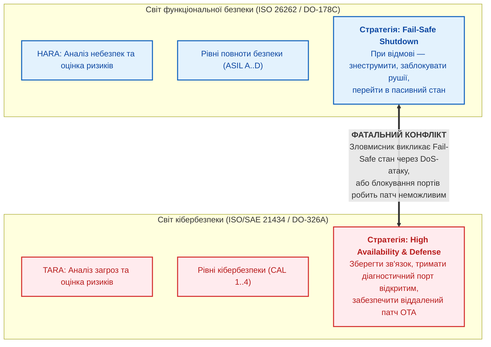
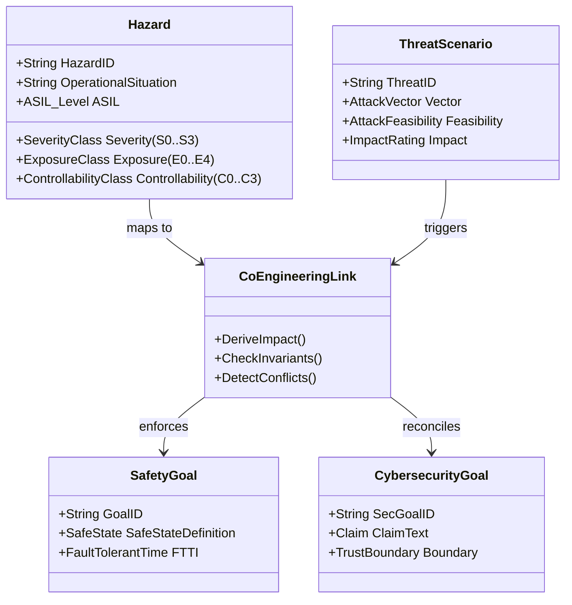
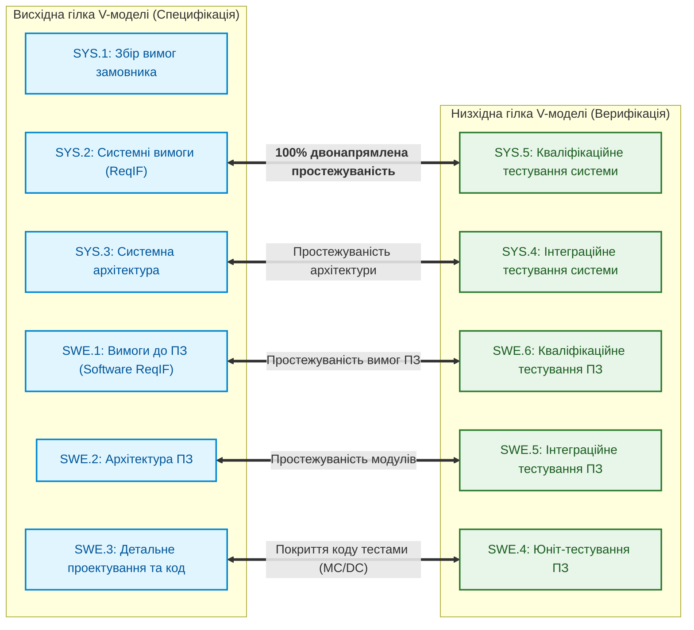
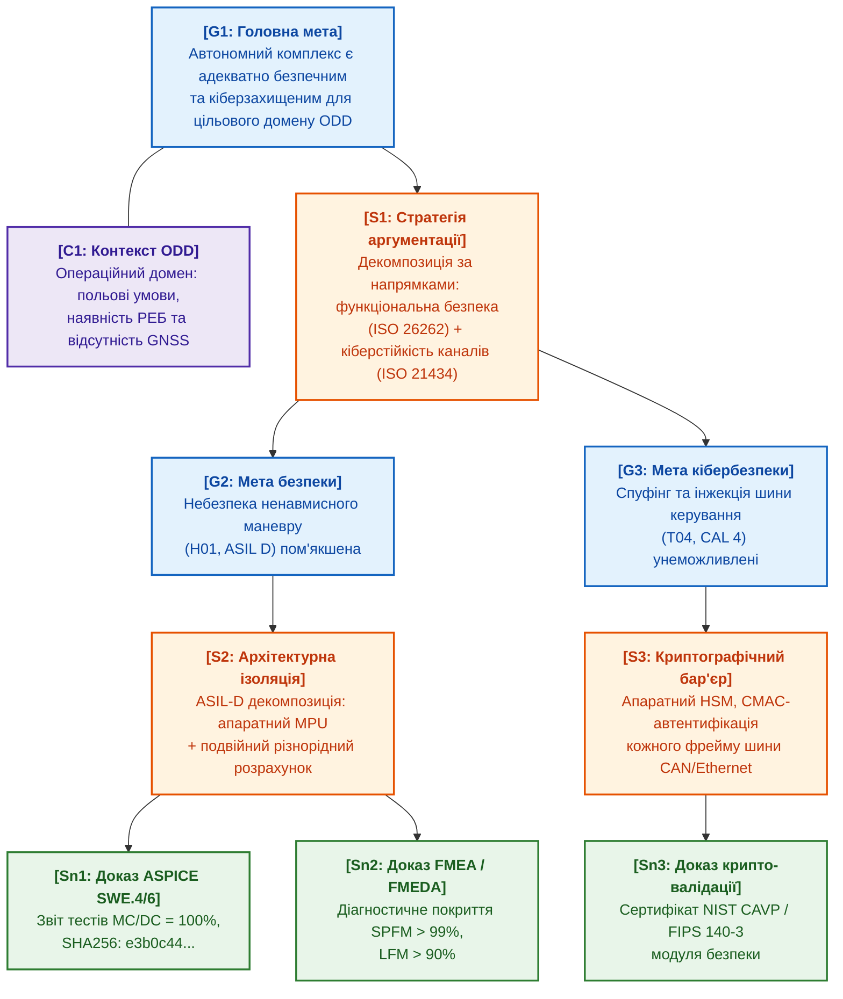

# [Чернетка] Глава 30. Ко-інженерія функціональної безпеки та кібербезпеки: гармонізація суперечливих стандартів та спільний синтез GSN-доказів (ISO 26262, ISO/SAE 21434, ASPICE 4.0)

> **Книга:** [Архітектура доказових експертних систем](README.md) · [Частина VI: Передовий край: регуляторна сертифікація та нейро-символьний ШІ](part-06-frontiers-neuro-symbolic.md)  
> **Попередня глава:** [Глава 29. Нейро-символьна архітектура (Neuro-Symbolic AI)](ch29-neuro-symbolic-architecture.md)  
> **Зміст книги:** [README.md](README.md)  
> **Пов'язані глави книги:** [Глава 9. Інженерний граф знань (EKG)](ch09-engineering-knowledge-graph-traceability.md) · [Глава 14. Детекція вимог у стандартах](ch14-requirements-detection-and-formalization.md) · [Глава 27. Синтез сертифікаційних доказів за Goal Structuring Notation (GSN)](ch27-safety-case-gsn-synthesis.md)  
> **Суміжні дослідження автора:** [Військові експертні системи: БПЛА, ППО, РЕР/РЕБ](../MilTech/Military-Expert-Systems-UAS-AD-ELINT-EW-UA.md) · [Військова кібернетика](../MilTech/Ukrainian-Military-Cybernetics-UA.md)  
> **Рівень:** системні інженери безпеки (Safety Managers), архітектори кібербезпеки (Security Engineers), лід-розробники вбудованих та автономних систем (Robotics, DefTech, Automotive): просунутий  
> **Очікувані результати:** проєктувати контури ко-інженерії функціональної безпеки (*Safety*) та кібербезпеки (*Cybersecurity*); автоматично зіставляти сценарії загроз TARA із небезпеками HARA; детектувати та формально розв'язувати колізії між безпечними аварійними станами (*Fail-Safe States*) та доступністю для кіберзахисту; парсити інженерні вимоги у форматі ReqIF за стандартом ASPICE 4.0; синтезувати єдині верифіковані дерева доказів безпеки у нотації Goal Structuring Notation (GSN) із криптографічним зв'язком із першоджерелами.

---

## Анотація

У цій главі розглядається подолання класичного інженерного розриву між функціональною безпекою (*Functional Safety*, ISO 26262) та кібербезпекою (*Cybersecurity*, ISO/SAE 21434) у складних кіберфізичних, автономних та оборонних комплексах. Історично ці дві дисципліни розвивалися ізольовано: команди функціональної безпеки проектували системи захисту від випадкових апаратних відмов та систематичних помилок ПЗ, тоді як фахівці з кібербезпеки аналізували навмисні дії зловмисника.

Проте в сучасних роботизованих платформах, безпілотних апаратах та підключених транспортних засобах будь-яка кібератака (спуфінг сенсорів, інжекція пакетів у шину CAN/Ethernet) безпосередньо генерує фізичну небезпеку життю людини чи зрив бойового завдання (*Cyber-Induced Physical Hazard*). На базі практичного досвіду проєктування ядра експертної системи `Znavets` розглядаються математичні моделі та алгоритми ко-інженерного виведення: автоматичне виведення тяжкості впливу TARA з рівнів HARA, перевірка простежуваності V-моделі ASPICE 4.0 над форматом ReqIF та автоматичний наскрізний синтез GSN-дерев сертифікаційних доказів із вивантаженням у криптографічні сертифікати `.zproof`.

---

## 1. Проблема відокремлених силосів (The Silo Problem)

У промисловості та оборонному секторі традиційно склався розкол між двома інженерними культурами:



### Основні типи міжкатегоріальних колізій

1. **Кібер-індуковані фізичні аварії (Cyber-Induced Physical Hazards):**  
   Зловмисник, що здійснює спуфінг пакетів на шині бортової мережі або інжектує хибні координати в навігаційний тракт безпілотника, не просто порушує конфіденційність чи цілісність даних — він безпосередньо провокує небезпечну подію (наприклад, аварійне скидання висоти або блокування поворотного керма на повній швидкості).
2. **Конфлікт «Fail-Safe проти Availability»:**  
   Класичний алгоритм функціональної безпеки при виявленні невідповідності контрольної суми CRC у шині вимагає негайного переходу в безпечний стан (*Fail-Safe State*) — наприклад, припинення подачі струму на двигун. Для зловмисника це створює ідеальний вектор атаки: достатньо згенерувати низькоінтенсивний пакетний шум (DoS), щоб автоматика безпеки сама заглушила двигун у польоті чи посеред поля бою.
3. **Конфлікт сертифікаційних вимог:**  
   Вимога кібербезпеки оперативно закривати вразливості нульового дня шляхом швидких оновлень «по повітрю» (OTA) вступає в пряму суперечність із вимогами функціональної безпеки, згідно з якими будь-яка зміна бінарного коду вимагає повного циклу повторної сертифікації V-моделі (тривалістю від кількох місяців до року).

---

## 2. Математичний та онтологічний апарат ко-інженерії

Щоб експертна система могла в автоматичному режимі гармонізувати стандарти, вимоги ISO 26262 та ISO/SAE 21434 відображаються у спільний топологічний простір інженерного графа EKG.



### 2.1. Відображення TARA на HARA

В аналізі загроз TARA (розділ 15 стандарту ISO/SAE 21434) оцінка впливу на безпеку (*Safety Impact*) не може призначатися довільно чи на основі суб'єктивних припущень. Вона математично та детерміновано виводиться з оцінки тяжкості шкоди HARA (*Severity*, $S_0\dots S_3$ згідно з ISO 26262-3):

$$
\text{SafetyImpact}_{\text{TARA}}(\text{Threat}) = \begin{cases}
\text{Severe}, & \text{якщо } \exists H \in \text{ImpactedHazards}(\text{Threat}) : \text{Severity}(H) = S_3 \\
\text{Major}, & \text{якщо } \exists H : \text{Severity}(H) = S_2 \land \forall H : \text{Severity}(H) \le S_2 \\
\text{Moderate}, & \text{якщо } \exists H : \text{Severity}(H) = S_1 \land \forall H : \text{Severity}(H) \le S_1 \\
\text{Negligible}, & \text{якщо } \forall H : \text{Severity}(H) = S_0
\end{cases}
$$

де:
- $S_3$ — небезпека зі смертельними наслідками або катастрофічними руйнуваннями;
- $S_2$ — тяжкі травми із загрозою життю;
- $S_1$ — легкі та середні ушкодження;
- $S_0$ — відсутність травм.

### 2.2. Загальна матриця сумісного ризику

Сукупний кібер-фізичний ризик активу обчислюється як композиція ймовірності успіху атаки та інженерного рівня критичності безпеки:

$$
\mathcal{R}_{\text{co-eng}} = \Psi \Big( \text{ASIL}(H), \; \text{CAL}(\text{Threat}) \Big)
$$

де рівень кібербезпеки $\text{CAL} \in \{1, 2, 3, 4\}$ встановлюється на основі складності реалізації загрози (*Attack Feasibility* за шкалою CVSS/ISO 21434: High, Medium, Low, Very Low). Якщо актив має найвищий рівень функціональної безпеки ($\text{ASIL D}$) та критичний кібер-вектор ($\text{CAL 4}$), експертна система накладає суворий інваріант: **заборона програмної реалізації без апаратної ізоляції пам'яті (MPU/IOMMU) та криптографічного підтвердження кожного командного кадру**.

---

## 3. Обробка та верифікація вимог у форматі ReqIF (ASPICE 4.0)

В авіаційній та автомобільній індустрії обмін вимогами між замовником, генеральним підрядником (Tier-1) та розробниками мікроелектроніки (Tier-2) здійснюється через відкритий XML-стандарт **ReqIF (Requirements Interchange Format)**, стандартизований консорціумом OMG.



### 3.1. Парсинг та типізація ReqIF-артефактів

Експертна система транслює XML-елементи `<SPEC-OBJECT>` у канонічні вершини інженерного графа EKG:
- Ідентифікатор вимоги (`ReqID`);
- Нормативний текст із модальними маркерами (`SHALL`, `MUST`);
- Атрибути безпеки (`ASIL_Allocation`, `CAL_Allocation`);
- Відношення спадкоємності `<SPEC-RELATION>`:

  ```math
  \text{Req}_{\text{SWE.1}} \xrightarrow{\text{refines}} \text{Req}_{\text{SYS.2}} \xrightarrow{\text{satisfies}} \text{SafetyGoal}
  ```

### 3.2. Автоматична перевірка метрик повноти ASPICE

Формальний валідатор графа знань перевіряє інваріанти сертифікації ASPICE 4.0:

1. **Відсутність «висячих» вимог (Orphan Requirements):**  
   Кожна програмна вимога $\text{SWE.1}_i$ зобов'язана мати хоча б одне ребро `satisfies` до системної вимоги $\text{SYS.2}_j$.
2. **100% покриття тестами (Test Coverage Invariant):**  
   Для кожної вимоги рівня ASIL B, C або D зобов'язаний існувати тестовий випадок у звіті SWE.6:

   ```math
   \forall r \in \text{Reqs}_{\text{SWE.1}} : \text{ASIL}(r) \ge B \implies \exists t \in \text{Tests}_{\text{SWE.6}} : \text{Verifies}(t, r) \land \text{Status}(t) = \text{Passed}
   ```
3. **Метрика MC/DC для ASIL D:**  
   Для критичного ПЗ рівня ASIL D автоматично верифікується звіт покриття за критерієм модифікованої умови/рішення (*Modified Condition / Decision Coverage — MC/DC = 100%*).

---

## 4. Синтез доказів безпеки за стандартом Goal Structuring Notation (GSN)

Замість написання сотень сторінок суб'єктивних текстових звітів, сучасний регуляторний аудит вимагає побудови формальних дерев аргументації у нотації **Goal Structuring Notation (GSN)**.



### Генерація сертифікатів доказів `.zproof`

Кожен листовий вузол рішення (*Solution, Sn*) формується не текстовим описом, а строгим криптографічним фактом. Експертна система синтезує JSON-документ формату `.zproof`:
1. `AssertionID`: ідентифікатор твердження або мета GSN.
2. `ProofType`: `ASIL_Decomposition`, `MC_DC_Coverage`, `Hardware_Root_Of_Trust`.
3. `EvidenceDigests`: масив хешів SHA-256 та точних байтових меж у первинних тестових протоколах і коді.
4. `Signature`: цифровий підпис ECDSA експертного ядра.

---

## 5. Архітектурне втілення в експертній системі (на прикладі ядра Znavets)

У проєкті `Znavets` підсистема ко-інженерії функціональної безпеки та кібербезпеки реалізована у пакеті `internal/compliance`:

```go
package compliance

import (
    "fmt"
    "github.com/znavets/internal/reasoning"
)

type SeverityClass string
const (
    SeverityS0 SeverityClass = "S0" // Negligible
    SeverityS1 SeverityClass = "S1" // Moderate
    SeverityS2 SeverityClass = "S2" // Major
    SeverityS3 SeverityClass = "S3" // Severe
)

type ThreatScenario struct {
    ID               string
    ImpactedAssets   []string
    AttackFeasibility string
    SafetySeverity   SeverityClass
}

// DeriveTARAImpact автоматично виводить рівень шкоди TARA за шкалою HARA
func DeriveTARAImpact(s SeverityClass) string {
    switch s {
    case SeverityS3:
        return "Severe"
    case SeverityS2:
        return "Major"
    case SeverityS1:
        return "Moderate"
    default:
        return "Negligible"
    }
}

// DetectCoEngineeringConflicts перевіряє колізію між Fail-Safe станом та доступністю
func DetectCoEngineeringConflicts(safetyState string, secRequirements []string) []string {
    var conflicts []string
    if safetyState == "SHUTDOWN_COMMUNICATION" {
        for _, req := range secRequirements {
            if req == "MAINTAIN_INCIDENT_LOGGING_STREAM" || req == "ALLOW_EMERGENCY_PATCH" {
                conflicts = append(conflicts, fmt.Sprintf(
                    "КРИТИЧНИЙ КОНФЛІКТ: Безпечний стан '%s' блокує вимогу кібербезпеки '%s'",
                    safetyState, req,
                ))
            }
        }
    }
    return conflicts
}
```

---

## 6. Практичний інженерний розрахунковий кейс: Автономний безпілотний перехоплювач

### 6.1. Постановка задачі
Дрон-перехоплювач ППО виконує термінальне автонаведення на швидкісну ціль.
- **Аналіз небезпек HARA:** Випадковий зрив керування або відмова кермових приводів у зоні дружніх військ призводить до катастрофічних наслідків ($S_3, E_4, C_3 \implies \text{ASIL D}$).
- **Аналіз загроз TARA:** Ворожий РЕБ здійснює спробу інжекції фальшивих CAN-фреймів з нульовою кутовою швидкістю, щоб викликати стабілізацію та промах повз ціль ($CAL = 4$).
- **Ко-інженерна колізія:** Стандартний модуль безпеки вимагає «перейти в режим плавного планування при 3 послідовних збоях шини», що під час атаки РЕБ гарантує зрив перехоплення та знищення об'єкта, що прикривається.

### 6.2. Рішення експертної системи
Символьний рушій синтезує гібридний ко-інженерний контракт:
1. **ASIL-D декомпозиція:** Замість відключення шини активується резервний аналоговий гіроскопічний контур (див. [Додаток Г](appendix-d-analog-expert-systems-and-neuromorphic-computing.md)).
2. **Кібер-рубіж:** Автентифікований обмін CAN-FD із крипто-тегом CMAC (AES-128). Усі спотворені фрейми відкидаються на рівні апаратного контролера за 15 наносекунд без повідомлення системного процесора (запобігання DoS-перевантаженню ядра).
3. **GSN-сертифікат:** Формується сертифікат безпеки, що підтверджує: перехоплювач не втрачає керування навіть при 100% придушенні цифрової шини зв'язку.

---

## Висновки

1. **Кібербезпека та функціональна безпека нероздільні:** Сучасні кіберфізичні та оборонні системи вимагають єдиного простору інженерних вимог.
2. **Математична суворість замість компромісів:** Використання формальних правил виведення усуває суб'єктивні помилки узгодження стандартів ISO 26262 та ISO/SAE 21434.
3. **Машиночитна сертифікація:** Інтеграція ReqIF, EKG та дерев GSN перетворює виснажливий процес аудиту на автоматизоване компілювання криптографічно верифікованих доказів.

---

## Питання для самоперевірки

1. Чому оцінка тяжкості TARA повинна детерміновано виводитися з HARA, і які ризики несе їх роздільне визначення?
2. Як експертна система розв'язує конфлікт між вимогою безпеки *Fail-Safe Shutdown* та потребою в кібербезпековій доступності (*High Availability*)?
3. Які метрики покриття коду вимагаються стандартом ISO 26262 для програмного забезпечення рівня ASIL D, і як вони перевіряються в EKG?
4. У чому полягає перевага нотації Goal Structuring Notation (GSN) порівняно з традиційними текстовими сертифікаційними звітами?

---

[← Глава 29. Нейро-символьна архітектура](ch29-neuro-symbolic-architecture.md) · [Зміст книги](README.md) · [До Додатків →](appendix-a-evidence-governed-framework.md)
