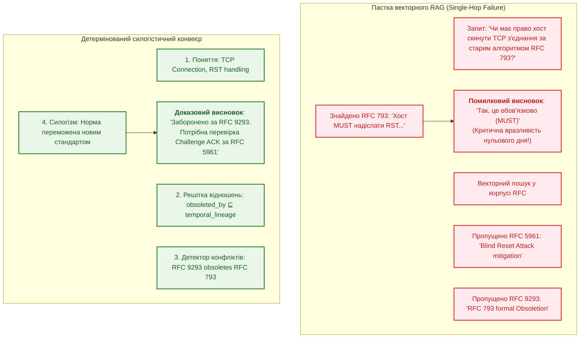
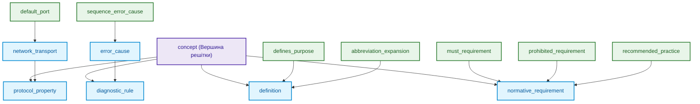
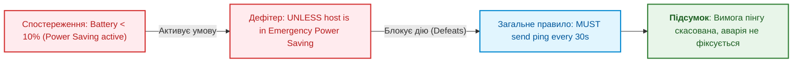
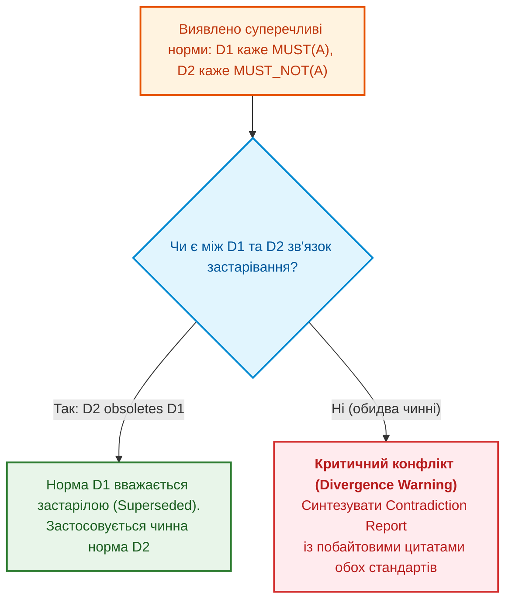

# [Чернетка] Глава 31. Силогістичний рушій та решітки знань: багатоходова дедукція, дефітери та розв'язання суперечностей у багатодоменних стандартах

> **Книга:** [Архітектура доказових експертних систем](README.md) · [Частина VI: Передовий край: регуляторна сертифікація та нейро-символьний ШІ](part-06-frontiers-neuro-symbolic.md)  
> **Попередня глава:** [Глава 30. Ко-інженерія функціональної безпеки та кібербезпеки](draft-ch30-safety-cybersecurity-co-engineering.md)  
> **Зміст книги:** [README.md](README.md)  
> **Пов'язані глави книги:** [Глава 2. Філософія для інженера](ch02-epistemology-of-machine-knowledge.md) · [Глава 6. Прикладна математика експертних систем](ch06-applied-mathematics-for-expert-systems.md) · [Глава 13. Варіативність природної мови](ch13-language-variability-vs-determinism.md) · [Глава 20. Рушій пояснень](ch20-explanation-engine.md) · [Глава 29. Нейро-символьна архітектура](ch29-neuro-symbolic-architecture.md)  
> **Суміжні дослідження автора:** [Військові експертні системи: БПЛА, ППО, РЕР/РЕБ](../MilTech/Military-Expert-Systems-UAS-AD-ELINT-EW-UA.md) · [Військова кібернетика](../MilTech/Ukrainian-Military-Cybernetics-UA.md)  
> **Рівень:** розробники логічних рушіїв, системні архітектори, інженери знань, фахівці з формальних методів: просунутий  
> **Очікувані результати:** проєктувати багатоходові силогістичні ядра виведення; будувати ациклічні онтологічні решітки відношень (*Relation Lattices*) зі спрямованою субсумцією; реалізовувати тризначну логіку Кліні (Strong Kleene 3VL) для подолання хиби замкненого світу; автоматично виявляти деонтичні колізії та лінії застарівання між стандартами; парсити складнопідрядні умовні запитання оператора; будувати інтерактивні дерева доведень (Proof DAG) із побайтовою прив'язкою до першоджерел.

---

## Анотація

У цій главі розглядається фундаментальний перехід від поверхневого пошуку збігів тексту (характерного для RAG та наївних експертних систем) до багатоходового детермінованого логічного міркування. Більшість прикладних систем страждають від «однокрокової сліпоти» (*Single-Hop Retrieval Bias*): вони здатні знайти пряму відповідь, якщо вона зафіксована в одному реченні, але зазнають невдачі або галюцинують, коли відповідь вимагає з'єднання 3–5 розрізнених норм із різних специфікацій, урахування винятків (*Defeaters*) та перевірки ліній застарівання.

Спираючись на досвід створення ядра `Znavets v3`, ми розглядаємо тріаду класичної логіки: **«Поняття — Судження — Висновок/Силогізм»**. Детально досліджено математику онтологічних решіток відношень (Relation Lattice DAG), тризначну логіку Кліні (Strong Kleene 3VL), алгоритми виявлення міжспецифікаційних суперечностей та архітектуру інтерактивного інспектора дерев доведень (Proof DAG) у термінальному інтерфейсі.

---

## 1. Проблема однокрокової сліпоти та криза дедукції

Сучасні пошукові конвеєри штучного інтелекту та векторні бази даних проєктуються під пошук схожості за косинусною відстанню:
$$\text{Query} \xrightarrow{\text{Embed}} \mathbf{v}_q \implies \arg\max_k \cos(\mathbf{v}_q, \mathbf{v}_k)$$

Такий підхід демонструє повну неспроможність у складних інженерних завданнях:



### Чому наївні системи роблять критичні помилки?
1. **Ізоляція засновків:** Норма загального правила знаходиться в одній специфікації, виняток — у додатку іншої, а заміна застарілого правила — у третьому документі через 20 років. Жоден векторний ембединг не здатний зв'язати ці три документи в один логічний ланцюг без структурної моделі знань.
2. **Плутанина модальностей:** Наївний аналізатор вважає, що слова `MUST` та `SHOULD` мають однаковий пріоритет «важливості», ігноруючи формальну деонтичну логіку.
3. **Хиба замкненого світу (Closed-World Fallacy):** Якщо в базі фактів немає запису про заборону певної дії, система автоматично робить хибний висновок, що дія дозволена.

---

## 2. Тріада мислення: Поняття — Судження — Висновок (Concept — Judgment — Inference)

Справжнє експертне ядро спирається на класичну епістемологічну тріаду формальної логіки:

```mermaid
flowchart LR
    accTitle: Тріада мислення: Поняття, Судження, Висновок
    accDescr: Структурний перехід від сутностей та предикатів до доведених силогізмів.

    subgraph Level1["1. Рівень Понять (Concepts)"]
        direction TB
        TERM["<b>Термін (Terminus)</b><br/>• Інтенсіонал (Ознаки)<br/>• Екстенсіонал (Обсяг)"]
        LATTICE["<b>Онтологічна решітка</b><br/>Субсумція: Sub ⊑ Super"]
    end

    subgraph Level2["2. Рівень Суджень (Judgments)"]
        direction TB
        PROP["<b>Пропозиція (Proposition)</b><br/>Subject — Relation — Object"]
        MODAL["<b>Деонтична модальність</b><br/>MUST, SHOULD, MAY, MUST_NOT"]
        DEFEAT["<b>Дефітери (Defeaters)</b><br/>Умови винятків (UNLESS)"]
    end

    subgraph Level3["3. Рівень Висновку (Inference)"]
        direction TB
        PREM["<b>Засновки силогізму</b><br/>Major Premise + Minor Premise"]
        RULES["<b>Правила виводу</b><br/>Modus Ponens / Subsumption"]
        DAG["<b>Merkle Proof DAG</b><br/>Криптографічне дерево доказу"]
    end

    Level1 ==> Level2 ==> Level3

    classDef c1 fill:#e1f5fe,stroke:#0288d1,stroke-width:2px,color:#01579b;
    classDef c2 fill:#fff3e0,stroke:#e65100,stroke-width:2px,color:#bf360c;
    classDef c3 fill:#e8f5e9,stroke:#2e7d32,stroke-width:2px,color:#1b5e20;

    class TERM,LATTICE c1;
    class PROP,MODAL,DEFEAT c2;
    class PREM,RULES,DAG c3;
```



### 2.1. Поняття (Concept / Terminus)
Поняття фіксує сутність інженерного домену. Воно характеризується двома математичними множинами:
- **Інтенсіонал (Зміст):** Множина суттєвих ознак, властивостей та інваріантів, які визначають сутність:
  $$\text{Intension}(C) = \{ P_1, P_2, \dots, P_k \}$$
- **Екстенсіонал (Обсяг):** Множина всіх конкретних об'єктів або підпонять, що задовольняють ці ознаки:
  $$\text{Extension}(C) = \{ x \mid \forall P \in \text{Intension}(C) : P(x) = \text{True} \}$$

### 2.2. Судження (Judgment / Proposition)
Судження є твердженням про наявність або відсутність відношення між поняттями. У доказовій експертній системі судження типізується деонтичним оператором:
$$\mathcal{J} = \langle \text{Subject}, \; \mathcal{R}, \; \text{Object}, \; \mathcal{M}, \; \mathcal{D}, \; \text{Provenance} \rangle$$
де:
- $\mathcal{M} \in \{ \text{MUST}, \text{MUST\_NOT}, \text{SHOULD}, \text{SHOULD\_NOT}, \text{MAY} \}$ — нормативна модальність;
- $\mathcal{D}$ — множина умов спростування (*Defeaters*);
- $\text{Provenance}$ — криптографічний хеш першоджерела з байтовими координатами.

### 2.3. Висновок (Inference / Syllogism)
Силогізм виводить нове знання з двох або більше вихідних суджень:
- **Велика посилка ($P_1$, Major Premise):** Загальний нормативний закон або правило специфікації.
- **Мала посилка ($P_2$, Minor Premise):** Фактичний стан або частковий спостережуваний факт.
- **Висновок ($C$, Conclusion):** Результуюча дія або твердження.

$$
\frac{\forall x : \big( \text{Packet}(x) \land \text{InvalidCRC}(x) \implies \text{MUST\_DROP}(x) \big), \quad \text{Packet}(p_1) \land \text{InvalidCRC}(p_1)}{\text{MUST\_DROP}(p_1)}
$$

---

## 3. Онтологічна решітка відношень (Relation Lattice DAG) та семантика субсумції

Коли користувач запитує: *«Які вимоги до безпеки протоколу X?»*, система не має права обмежуватися лише пошуком предикату `security_requirement`. Факти в реальних базах сформульовані різними авторами як `must_encrypt`, `authenticate_peer`, `check_signature` тощо.

Замість крихких конструкцій `switch-case` чи неточного нечіткого порівняння тексту, відношення організуються у формальний ациклічний орієнтований граф — **Решітку відношень (Relation Lattice DAG)**:

$$
R_{\text{sub}} \sqsubseteq R_{\text{super}}
$$



### Математичні правила субсумції:

1. **Спрямована дедукція (Query Generalization):**  
   Якщо запит шукає узагальнене відношення $R_{\text{query}}$ (наприклад, `normative_requirement`), будь-який факт із специфічним предикатом $R_{\text{fact}} \sqsubseteq R_{\text{query}}$ (наприклад, `must_requirement`) задовольняє умову пошуку:
   $$\text{Subsumes}(R_{\text{query}}, R_{\text{fact}}) \iff (R_{\text{fact}} = R_{\text{query}}) \lor (R_{\text{fact}} \sqsubseteq^* R_{\text{query}})$$
2. **Сувора спеціалізація (Strict Specialization):**  
   Зворотна підстановка категорично заборонена. Якщо запит запитує суворий `must_requirement`, загальний рекомендаційний факт `recommended_practice` не може вважатися прямою стверджувальною відповіддю.
3. **Метрика семантичної дистанції:**  
   Якщо за запитом знайдено кілька фактів, пріоритет віддається факту з мінімальною довжиною шляху в графі решітки ($d = 0$ — точний збіг).

---

## 4. Тризначна логіка Кліні (Strong Kleene 3VL) та граф спростувачів (DefeaterGraph)

Класична булева логіка ($B = \{ \text{True}, \text{False} \}$) непридатна для відкритих інженерних світів. Якщо факт не знайдено в локальній базі знань, це не означає, що він хибний — він просто **невідомий** ($\text{Unknown}$).

### 4.1. Таблиці істинності Strong Kleene 3VL

| $A$ | $B$ | $A \land B$ | $A \lor B$ | $\neg A$ |
| :---: | :---: | :---: | :---: | :---: |
| $\text{True}$ | $\text{True}$ | $\text{True}$ | $\text{True}$ | $\text{False}$ |
| $\text{True}$ | $\text{False}$ | $\text{False}$ | $\text{True}$ | $\text{False}$ |
| $\text{True}$ | $\text{Unknown}$ | $\mathbf{Unknown}$ | $\text{True}$ | $\text{False}$ |
| $\text{False}$ | $\text{Unknown}$ | $\text{False}$ | $\mathbf{Unknown}$ | $\text{True}$ |
| $\text{Unknown}$ | $\text{Unknown}$ | $\mathbf{Unknown}$ | $\mathbf{Unknown}$ | $\mathbf{Unknown}$ |

> [!CRITICAL]
> **Принцип Fail-Closed на базі 3VL:**  
> Якщо результат оцінки інваріанта безпеки повертає $\text{Unknown}$ (наприклад, відсутній звіт про випробування підтвердження тайм-ауту), система **забороняє допуск дії**, трактуючи стан як потенційно небезпечний, та формує уточнюючий запит оператору (`KindClarification`).

### 4.2. Граф спростувачів (DefeaterGraph)

Норми рідко діють безумовно. Більшість специфікацій містять застереження: «Правило діє, *КРІМ ВИПАДКІВ, КОЛИ...*».



---

## 5. Крос-специфікаційний критичний аналіз суперечностей

Стандарти еволюціонують роками, породжуючи міждокументні конфлікти:
- **Часова спадкоємність (Lineage):** Стандарт $D_2$ скасовує (`obsoletes`) або доповнює (`updates`) стандарт $D_1$.
- **Юрисдикційні розбіжності:** Корпус IETF (мережеві RFC) та консорціум W3C (веб-стандарти) по-різному трактують кодування одного й того самого символу в URL/URI.

### Алгоритм детекції конфліктів у Znavets:



---

## 6. Багатоходова умовна граматика запитань (Conditional Syllogistic NLQ)

Експерт рідко запитує пласкі факти. Типовий запит системного архітектора:  
*«Якщо наш бортовий клієнт реалізує протокол SMTP за RFC 5321, чи зобов'язаний він надсилати команду EHLO перед MAIL FROM, і що станеться, якщо сервер підтримує лише RFC 821?»*

Граматичний процесор ядра розбиває такий запит на **План умовного доведення (`ConditionalQueryPlan`)**:
1. `HypotheticalPremises`: локальні аксіоми користувача, що діють лише під час цієї сесії міркування:
   $$\mathcal{H}_1: \text{Implements}(\text{Client}, \text{RFC 5321})$$
2. `TargetGoal`: цільовий предикат, який необхідно довести або спростувати:
   $$\mathcal{T}: \text{MustSendBefore}(\text{Client}, \text{EHLO}, \text{MAIL\_FROM})$$
3. `ContextBranch`: сервер підтримує застарілий RFC 821 (активація дефітера зворотного зв'язку).

Рушій будує шлях через граматику правил:
$$\mathcal{H}_1 \land \text{FactBase}(\text{RFC 5321}) \vdash \text{EHLO First} \quad \xrightarrow{\text{Defeater(RFC 821)}} \quad \text{Fallback to HELO}$$

---

## 7. Інтерактивна інспекція дерева доведень (Interactive Proof DAG)

Для побудови абсолютної довіри до системи інженер повинен мати можливість "помацати" кожен логічний перехід. У термінальному інтерфейсі TUI (стиль Midnight Commander) для цього реалізовано інспектор **F7 Proof**:

```text
┌─ [F7] Дерево силогістичного доведення (Proof DAG) ───────────────────────────┐
│                                                                             │
│ [GOAL] Клієнт зобов'язаний відправити EHLO перед виконанням транзакції      │
│   │                                                                         │
│   ├── [STRATEGY] Дедукція Modus Ponens (Правило RFC 5321 Розділ 4.1.1.1)    │
│   │     │                                                                   │
│   │     ├── [MAJOR PREMISE] Усі клієнти SMTP MUST ініціювати сесію EHLO     │
│   │     │     └── [EVIDENCE] RFC 5321 (байти 14200..14350, SHA256: 4a2f...) │
│   │     │                                                                   │
│   │     └── [MINOR PREMISE] Цільова система є клієнтом SMTP                 │
│   │           └── [HYPOTHESIS] Задано в запитанні користувача               │
│   │                                                                         │
│   └── [DEFEATER CHECK] Перевірка підтримки застарілих серверів (RFC 821)    │
│         ├── [EXCEPTION CLAUSE] Якщо сервер відповів 500/502 (Command Unrec) │
│         └── [FALLBACK ACTION] Дозволено надіслати HELO (RFC 5321 Розділ 3.2)│
│                                                                             │
├─────────────────────────────────────────────────────────────────────────────┤
│ <Enter> Переглянути фізичні байти першоджерела (F5) | <F2> Експорт .zproof  │
└─────────────────────────────────────────────────────────────────────────────┘
```

Натискання клавіші `Enter` на будь-якому вузлі дерева миттєво відкриває відповідний документ у вбудованому шлюзі першоджерел, виділяючи дослівно перевірений текстовий фрагмент.

---

## Висновки

1. **Кінець епохи однокрокових евристик:** Інженерні стандарти вимагають багатоходового силогістичного виведення, що поєднує нормативні засновки, винятки та факти середовища.
2. **Онтологічна решітка як фундамент повноти:** Ациклічний DAG предикатів забезпечує спрямовану субсумцію, дозволяючи відповідати на абстрактні запитання без втрати детермінізму.
3. **Строга доказовість:** Інспекція Proof DAG та тризначна логіка Кліні гарантують відсутність сліпих зон і галюцинацій у регуляторних висновках.

---

## Питання для самоперевірки

1. Чому однокроковий векторний пошук (RAG) виявляється безпорадним у ситуаціях, коли стандарт $A$ скасований стандартом $B$?
2. У чому полягає різниця між спрямованою субсумцією узагальненого запиту та забороною спеціалізації для суворого правила?
3. Як таблиця істинності тризначної логіки Кліні захищає систему від хиби замкненого світу (*Closed-World Fallacy*)?
4. Які елементи входять до криптографічного сертифіката доведення `.zproof`, і як аудитор може перевірити його валідність?

---

[← Глава 30. Ко-інженерія безпеки](draft-ch30-safety-cybersecurity-co-engineering.md) · [Зміст книги](README.md) · [До Додатків →](appendix-a-evidence-governed-framework.md)
