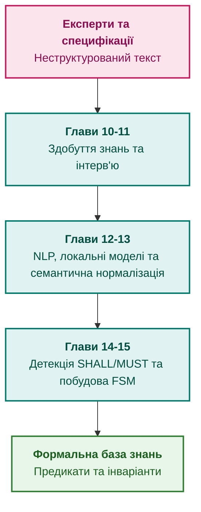

# Частина III. Інженерія знань: здобуття, NLP та екстракція з нормативів

[← До Частини II](part-02-knowledge-models.md) | [До змісту книги](README.md) | [До Частини IV →](part-04-architecture-and-inference.md)

---

## Мета частини

Мета цієї частини — вирішити проблему «вузького місця інженерії знань» (Feigenbaum's Knowledge Acquisition Bottleneck):

1. Побудувати ефективні людино-машинні процедури вилучення знань у провідних інженерів та експертів домену.
2. Застосувати локальні моделі та сучасні методи NLP для синтаксичного й семантичного аналізу текстів без втрати координатного зв'язку з оригіналом.
3. Долати природну варіативність і неоднозначність людської мови через компіляцію суті запитання в канонічні предикати.
4. Автоматизувати детекцію модальностей нормативних документів (SHALL, MUST, SHOULD) та екстрагувати перевірювані інваріанти й кінцеві автомати (FSM).

---

## Анотація теми та взаємозв'язку глав

Ця частина розглядає повний життєвий шлях вилучення знань: від діалогу з людиною та розбору неструктурованих документів — до побайтової верифікації тексту та автоматичної побудови предикатів для бази знань.

---

## Глави частини

### [Глава 10. Системи здобуття знань: архітектура збирання інженерного досвіду без втрат і витоку даних](ch10-knowledge-acquisition-systems.md)

* **Анотація:** Проєктування підсистем здобуття знань (Knowledge Acquisition). Робота з джерелами інформації, контроль версійності знань, захист конфіденційності та запобігання витоку комерційної таємниці під час аналізу специфікацій.

### [Глава 11. Вилучення знань у експертів: інтерв'ювання, когнітивні карти та формалізація досвіду](ch11-knowledge-elicitation-from-experts.md)

* **Анотація:** Психологічні та інженерні методики вилучення неявного знання (Tacit Knowledge). Структуровані протоколи опитування, побудова когнітивних карт (Concept Maps) та усунення евристичних перекосів.

### [Глава 12. Лінгвістичний аналіз та локальні моделі: як система розуміє текст без втрати джерела](ch12-linguistic-analysis-and-local-models.md)

* **Анотація:** Застосування компактних мовних моделей (SLM) для синтаксичного розбору. Прив'язка витягнутих сутностей до точних побайтових офсетів першоджерела (Byte-level Grounding).

### [Глава 13. Варіативність природної мови проти детермінізму: компіляція сенсу запитання](ch13-language-variability-vs-determinism.md)

* **Анотація:** Як перетворити багатозначне формулювання запитання користувача на строгий предикатний запит. Подолання синонімії та мовної омонімії без втрати строгості висновку.

### [Глава 14. Детекція вимог у стандартах: витяг нормативних предикатів (SHALL/MUST) та побудова інваріантів](ch14-requirements-detection-and-formalization.md)

* **Анотація:** Формалізація стандартів (ISO, IEEE, RTCA). Виявлення регуляторних модальностей, перетворення природного тексту на деонтичну логіку та автоматична генерація системних інваріантів.

### [Глава 15. Автоматизована екстракція знань: від тексту специфікацій до онтологій і кінцевих автоматів (FSM)](ch15-knowledge-extraction-and-kb-construction.md)

* **Анотація:** Пайплайн побудови баз знань: граматики ABNF, екстракція протоколів обміну та автоматичний синтез скінченних автоматів станів безпосередньо зі специфікацій.

---

[← До Частини II](part-02-knowledge-models.md) | [До змісту книги](README.md) | [До Частини IV →](part-04-architecture-and-inference.md)
