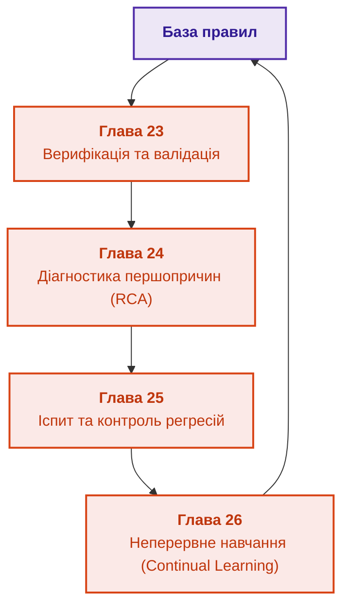

# Частина V. Верифікація, діагностика та неперервне навчання

[← До Частини IV](part-04-architecture-and-inference.md) | [До змісту книги](README.md) | [До Частини VI →](part-06-frontiers-neuro-symbolic.md)

---

## Мета частини

Мета цієї частини — гарантувати життєздатність та безперервне вдосконалення експертної системи:

1. Забезпечити математичну несуперечливість, повноту та коректність бази знань у процесі її постійного оновлення.
2. Побудувати алгоритми надійної діагностики технічних несправностей за умов неповноти спостережень.
3. Розробити методологію «іспиту для машини» (екзаменаційні матриці, аудит регресій).
4. Організувати безпечне неперервне навчання (Continual Learning) на реальних кейсах без ризику катастрофічного забування чи спотворення перевірених правил.

---

## Анотація теми та взаємозв'язку глав

Експертна система не є статичним кодом — це жива база знань, яка постійно зустрічається з новими аварійними ситуаціями та аномаліями. У цій частині ми показуємо, як верифікувати правила перед релізом, як розділяти першопричину та симптоми аварії, як тестувати систему на золотих інженерних бенчмарках та як фіксувати новий досвід через механізм прецедентів (CBR) без зсуву системного журналу.

---

## Глави частини

### [Глава 23. Верифікація бази знань: як перевірити несуперечливість, повноту та надійність правил](ch23-knowledge-base-verification.md)

* **Анотація:** Статичний аналіз бази правил: виявлення циклів, надлишковості, мертвого коду знань та взаємно виключних предикатів. Застосування SAT/SMT-солверів.

### [Глава 24. Технічна діагностика: як не сплутати симптом із першопричиною в умовах неповноти](ch24-system-diagnosis.md)

* **Анотація:** Діагностика несправностей складних систем. Моделі на основі симптомів проти моделей на основі фізичної структури (Model-Based Diagnosis). Мінімізація вартості наступної перевірки.

### [Глава 25. Як навчати експертну систему: екзаменаційні матриці, аудит знань та контроль регресій](ch25-how-expert-systems-learn.md)

* **Анотація:** Процедура атестації експертної системи: розробка іспитових тестових сценаріїв, оцінка повноти покриття бази знань та захист від регресійних збоїв.

### [Глава 26. Неперервне навчання (Continual Learning) на досвіді та подолання зсуву системного журналу](ch26-continual-learning.md)

* **Анотація:** Самонавчання на основі відмов: фіксація невідомих ситуацій у пам'яті прецедентів, усунення вибіркового зміщення власних журналів та контрольований перегляд правил.

---

[← До Частини IV](part-04-architecture-and-inference.md) | [До змісту книги](README.md) | [До Частини VI →](part-06-frontiers-neuro-symbolic.md)
