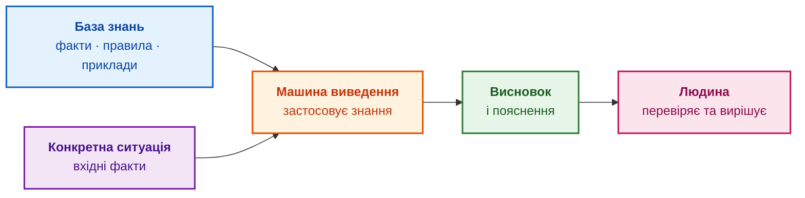
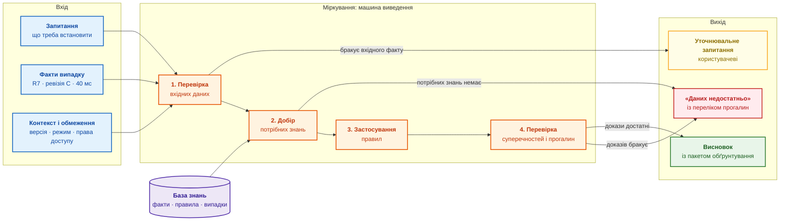
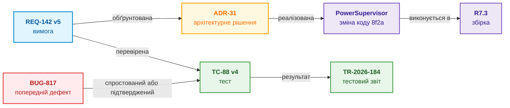
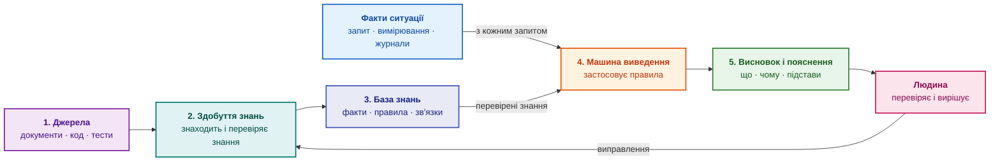

# Глава 1. Вступ до експертних систем: від хаосу до керованих знань

> **Книга:** [Архітектура доказових експертних систем](README.md) · [Частина I: Концептуальний та епістемічний фундамент](part-01-foundations.md)  
> **Попередня глава:** [Частина I. Концептуальний та епістемічний фундамент](part-01-foundations.md)  
> **Наступна глава:** [Глава 2. Філософія для інженера: що машина має право називати знанням](ch02-epistemology-of-machine-knowledge.md)  
> **Зміст книги:** [README.md](README.md)  
> **Автор:** [Микола Федчик](about-the-author.md)  
> **Рівень:** базовий інженерний  
> **Очікувані результати:** відрізняти перевірювану експертну відповідь від результату пошуку й відповіді чатбота; знати складники експертної системи та межі її відповідальності; оцінити, чи варто будувати експертну систему для задачі вашої команди; обрати маршрут читання книги.

Експертні системи належать до перших практичних напрямів штучного інтелекту. У 1960–1970-х роках програма DENDRAL визначала структуру хімічних сполук за результатами вимірювань [[1]](#src-1), а програма MYCIN пропонувала лікарям схеми лікування бактеріальних інфекцій і пояснювала хід свого міркування [[2]](#src-2). Ці проєкти показали, що знання фахівців можна записати у вигляді явних фактів і правил, а програма здатна застосувати записані знання до нового випадку. Едвард Фейгенбаум назвав таку роботу інженерією знань [[3]](#src-3).

Сьогодні штучний інтелект переживає нову хвилю. Великі мовні моделі читають, переказують і пишуть тексти, а організації отримали змогу машинно опрацьовувати накопичені людьми знання: стандарти, специфікації, журнали випробувань, звіти про інциденти. Разом із цими можливостями загострилося давнє запитання: як переконатися, що машинний висновок спирається на чинні знання, а не лише звучить переконливо? У відповіді на це запитання й полягає перспектива експертних систем: мовні моделі допомагають знаходити й читати знання, а експертна система застосовує перевірені знання за явними правилами й показує підстави висновку. Почнімо з прикладу, на якому видно різницю між правдоподібною і перевірюваною відповіддю.

## Одне запитання, три відповіді

Розробник бачить у модулі `PowerSupervisor` константу `40` і хоче збільшити таймаут холодного старту до 60 мілісекунд. Запитання просте: чи можна? Відповідь розкидана між вимогою, коментарем у коді, звітами тестів, старим дефектом і пам'яттю інженера, який рік тому перейшов в іншу команду. Таку ситуацію знає кожен, хто супроводжував продукт довше за один цикл випуску.

Порівняймо, що розробник отримає від трьох різних інструментів.

| Інструмент | Відповідь | Що розробнику робити далі |
|---|---|---|
| Пошук у документації | вимога `REQ-142`, дефект `BUG-817`, коментар у коді та 40 сторінок специфікації | самостійно прочитати все знайдене й визначити, що з цього чинне |
| Чатбот на основі мовної моделі | «Так, 60 мс безпечно: вимоги задають мінімум 50 мс» | з'ясувати, звідки взялося число 50; у цьому умовному прикладі число походить із ревізії вимоги, яка вже не діє |
| Експертна система | «40 мс порушує правило для апаратної ревізії C у холодному старті. 60 мс задовольняє мінімум 55 мс, але зміна потребує повторного тесту `TC-88`. Джерела: `REQ-142` v5, `ADR-31` v3. Рішення ухвалює відповідальний інженер після тесту» | перевірити кожен крок за вказаними джерелами й запустити тест |

Жодна з трьох відповідей не гарантує істини. Відмінність в іншому: лише третю відповідь можна перевірити крок за кроком, не повторюючи всього пошуку. Пошук залишає міркування людині. Чатбот міркує, але не показує, на яких чинних фактах тримається висновок. Експертна система показує факти, застосоване правило, джерела з версіями, межі висновку й людину, яка ухвалює рішення.

Ця книга про програми третього типу: як їх будувати, перевіряти й навчати так, щоб перевірюваність не зникала з ростом бази знань. Глава 1 пояснює, що таке експертна система, чому тема знову стала практичною і де закінчуються можливості такої програми.

## Чому ця тема повернулася саме зараз

Експертні системи часто вважають сторінкою історії штучного інтелекту 1980-х. Три зміни останніх років повернули їм практичний сенс.

**Правдоподібний текст подешевшав, перевірка ні.** Велика мовна модель за секунди пише зв'язну відповідь на технічне запитання. Інженеру, який відповідає за зміну, від цього не легше: він мусить встановити, чи спирається відповідь на чинну вимогу, потрібну ревізію обладнання й результат реального тесту. Якщо відповідь не показує шляху до джерел, перевірка коштує майже стільки ж, скільки самостійний пошук. Вузьким місцем стала не генерація відповіді, а її перевірка.

**Регулювання вимагає простежуваних рішень.** Регламент ЄС про штучний інтелект 2024/1689 для систем штучного інтелекту високого ризику вимагає автоматичного журналювання подій, прозорості для організацій, які впроваджують такі системи штучного інтелекту, і людського нагляду (статті 12–14) [[4]](#src-4). Управління з продовольства і медикаментів США (*Food and Drug Administration*, FDA) у настанові щодо програм підтримки клінічних рішень зважає на те, чи може медичний працівник самостійно перевірити підстави рекомендації [[5]](#src-5). Стандарт функціональної безпеки автомобілів ISO 26262 вимагає простежуваності вимог безпеки [[6]](#src-6). Відповідь без видимих підстав у цих галузях не стане доказом.

**Досвід залишає команди швидше, ніж продукти.** Автомобільний блок керування, авіаційний компонент або промисловий контролер експлуатують десятиліттями. Команди, які створили ці вироби, змінюються за кілька років. Причини рішень залишаються в пам'яті людей, листуванні й розрізнених документах. Коли причину рішення втрачено, кожна наступна зміна починається з повторного розслідування.

Звідси головна теза книги: **сучасна експертна система є не реліктом 1980-х, а шаром, який перетворює правдоподібну відповідь на перевірювану.** Мовна модель в експертній системі допомагає працювати з текстом, але висновок формують явні знання, правила й джерела, які людина може переглянути.

Для українських інженерів є ще одна причина. В обороні, енергетиці та медицині воєнного часу рішення ухвалюють під тиском, за неповних даних і з високою ціною помилки. Саме там потрібні висновки, які показують власні підстави й прямо повідомляють про нестачу даних. Приклади з автономної робототехніки та навігації без глобальних навігаційних супутникових систем (*Global Navigation Satellite System*, GNSS) розглянуто в [Додатку Б](appendix-b-robotics-and-cyber-physical-systems.md) і [Додатку В](appendix-c-autonomous-navigation-and-geosearch.md).

## Хіба експертні системи не померли у 1980-х?

Скепсис має підстави. Перші експертні системи довели практичну цінність: DENDRAL визначала структуру хімічних сполук за результатами вимірювань, MYCIN допомагала лікарям обирати лікування бактеріальних інфекцій, XCON конфігурувала комп'ютерні системи компанії DEC [[7]](#src-7). Після комерційного піднесення 1980-х настав спад, який називають «зимою штучного інтелекту».

Причини спаду були інженерними:

- **здобуття знань було повільним і дорогим:** кожне правило доводилося вручну формулювати в розмовах з експертами, тому це обмеження назвали вузьким місцем здобуття знань (*knowledge acquisition bottleneck*);
- **експертні системи були крихкими на межах предметної області:** для випадків, яких не передбачили автори правил, експертна система давала хибний або безглуздий висновок;
- **великі бази правил важко було супроводжувати:** тисячі взаємопов'язаних правил без версій, тестів і власників ставали некерованими;
- **спеціалізоване обладнання програло звичайним процесорам:** дорогі LISP-машини втратили сенс, коли робочі станції та персональні комп'ютери стали швидшими.

Частина цих обмежень сьогодні виглядає інакше. Мовні моделі та засоби аналізу тексту допомагають знаходити кандидатів у знання серед тисяч документів, хоча перевіряти кандидатів і далі мають правила та людина. Системи керування версіями, графові бази даних і безперервна інтеграція дають змогу тримати знання як код: із версіями, тестами й історією змін. Обчислення, які колись потребували спеціальних машин, виконує звичайний ноутбук.

Незмінним залишилося головне: знання потребує власника, джерела, перевірки й меж застосування. Мета книги не повернутися до експертних систем 1980-х, а поєднати їхній сильний бік, явне й пояснюване міркування, із сучасними засобами роботи з текстом і даними. Історію методів від теореми Байєса до сучасних підходів розглядає [Глава 4](ch04-evolution-from-bayes-to-evidence-ai.md), поєднання мовних моделей із детермінованим виведенням описує [Глава 29](ch29-neuro-symbolic-architecture.md).

## Хто такий експерт і що з його знань можна передати програмі

**Експертом** у цій книзі називаємо людину, яка має глибокі знання й перевірений практичний досвід у визначеній предметній області, уміє розв'язувати нетипові задачі та може пояснити підстави свого висновку.

Наприклад, інженер може бути експертом із живлення конкретного сімейства пристроїв. Такий інженер знає не лише написані вимоги, а й типові відмови, винятки, обмеження вимірювань і наслідки змін. Водночас експерт із живлення не стає автоматично експертом із медицини чи законодавства.

Практично важливі п'ять ознак експерта:

1. **Знання:** володіє фактами, поняттями, правилами й методами галузі.
2. **Досвід:** бачив достатньо реальних випадків, зокрема невдалих.
3. **Міркування:** уміє перейти від фактів конкретної ситуації до висновку.
4. **Пояснення:** може показати, чому обрав один висновок і відкинув інший.
5. **Розуміння меж:** знає, коли даних недостатньо або потрібен інший фахівець.

Посада, сертифікат чи впевнена манера говорити не роблять людину експертом. Пошукова система, архів документів або мовна модель теж не є експертами: вони містять чи переказують відомості, але не мають практичного досвіду й не відповідають за висновок. Треба також розрізняти **компетентність** і **повноваження**. Експерт готує рекомендацію, а формальне рішення про випуск продукту, лікування пацієнта чи застосування норми закону ухвалює визначена відповідальна особа.

Не весь досвід експерта можна записати. Відчуття ризику чи вміння помітити нетипову деталь часто залишаються неявними. Експертна система працює лише з тією частиною знань, яку вдалося виразити явно: фактами, правилами, зв'язками й описаними випадками. Способи систематично отримувати такі знання від фахівців описує [Глава 11](ch11-knowledge-elicitation-from-experts.md).

## Що таке експертна система

У різних підручниках межі поняття відрізняються. Книга використовує таке інженерне визначення:

> **Експертною системою** називаємо програму, яка зберігає частину знань експертів у визначеній предметній області, застосовує ці знання до конкретної ситуації та пояснює отриманий висновок.

Експертна система не перетворює комп'ютер на людину-експерта. У програми немає власного досвіду, професійної відповідальності чи інтуїції. Натомість програма однаково й багаторазово застосовує явно записану частину експертних знань. Предметна область завжди обмежена: діагностика пристрою, перевірка комплектності випуску, підбір способу ремонту або пошук чинної норми закону. Експертна система корисна саме тому, що працює у визначених межах.

Експертну систему можна впізнати за такими характеристиками:

| Характеристика | Що це означає для користувача |
|---|---|
| Визначена предметна область | Експертна система прямо описує, які задачі розв'язує, а які ні |
| Окремо збережені знання | Факти й правила можна переглядати, оновлювати та перевіряти |
| Міркування над конкретним випадком | Однакові знання застосовуються до нових вхідних фактів |
| Пояснюваний висновок | Видно використані факти, правила й джерела |
| Робота з неповнотою | Експертна система може відповісти «даних недостатньо», а не вигадувати |
| Оновлення знань | Новий досвід додають без повного переписування програми |
| Визначені повноваження | Видно, де закінчується рекомендація експертної системи й починається рішення людини |

Найважливіша технічна ознака: знання предметної області відокремлено від механізму, який ці знання застосовує. У найпростішій експертній системі є дві головні частини:

1. **База знань** зберігає те, що відомо про предметну область.
2. **Машина виведення** застосовує знання з бази до фактів конкретної ситуації.

Результат показують користувачеві разом із поясненням:



### Що таке база знань

**База знань** не є просто папкою з документами й не обов'язково є однією базою даних. База знань є впорядкованим поданням того, що експертна система має право використовувати під час міркування:

- факти: «виріб має апаратну ревізію C»;
- правила: «для ревізії C під час холодного старту таймаут має бути не меншим за 55 мілісекунд»;
- зв'язки: «вимогу `REQ-142` перевіряє тест `TC-88`»;
- відомі випадки: «подібний збій уже виникав у версії R6»;
- джерела й межі: хто встановив твердження, для якої версії та доки твердження чинне.

Документи можуть бути джерелами для бази знань, але самі документи ще не утворюють базу знань. Експертна система повинна знати хоча б тип відомості, версію та зв'язок з іншими відомостями.

### Що таке машина виведення

**Машина виведення** є програмним механізмом, який бере факти конкретної ситуації, знаходить придатні правила й отримує новий висновок. Машина виведення не обов'язково є нейронною мережею чи мовною моделлю.

Найпростіший приклад правила:

```text
ЯКЩО апаратна ревізія = C
І режим запуску = холодний старт
І таймаут < 55 мс,
ТО потрібна зміна таймауту та повторний тест.
```

Якщо експертна система отримала на вході ревізію C, холодний старт і таймаут 40 мс, машина виведення зіставить ці факти з умовами правила. Висновок звучатиме не «мені здається, 60 краще», а «правило спрацювало через три конкретні факти; перед зміною потрібен повторний тест».

Реальні машини виведення працюють не лише з правилами «ЯКЩО … ТО». Вони використовують логіку, ймовірності, обмеження, графи зв'язків і попередні випадки. Принцип залишається тим самим: знання зберігаються окремо від механізму, який ці знання застосовує.

### Перший виконуваний приклад: перевірка зміни інтерфейсу

Для звичайної програмної команди експертна задача може бути невеликою: чи достатньо підстав передати зміну програмного інтерфейсу на перегляд перед випуском? Навчальна політика вимагає схваленого успішного запуску `TEST-API` для випуску 3.2 з часом відповіді не більше 100 мс. Числа й ідентифікатори вигадані. Виняток може дозволити більшу затримку лише для конкретних політики, випуску й звіту; він не виправляє проваленого тесту або відсутності доказу.

Код нижче відокремлює запис політики від звіту й функції перевірки. Він не шукає документів і не генерує текст. Для запуску потрібний встановлений Go; програму й тест розміщують у навчальному каталозі та виконують `go run release.go` і `go test -v release.go release_test.go`. Весь приклад наведено в згорнутому блоці, тож знати решту технологічного стека для першої перевірки не потрібно.

<details>
<summary>Мінімальна перевірка на Go: програма та тести меж її застосування</summary>

Програма `release.go`:

```go
package main

import "fmt"

type Policy struct {
    Version, RequiredTest string
    MaxLatencyMS          int
}

type Report struct {
    ID, Release, TestID          string
    LatencyMS                    int
    Passed, Approved, Revoked    bool
}

type Exception struct {
    PolicyVersion, Release, ReportID string
    MaxLatencyMS                     int
    Approved, Revoked                bool
}

func Assess(policy Policy, release string, reports []Report, exception *Exception) (string, []string) {
    if policy.Version == "" || policy.RequiredTest == "" || policy.MaxLatencyMS <= 0 || release == "" {
        return "UNKNOWN", []string{"incomplete policy or release"}
    }
    basis := []string{"policy:" + policy.Version}
    var applicable []Report
    for _, report := range reports {
        if report.ID != "" && report.Release == release && report.TestID == policy.RequiredTest && report.Approved && !report.Revoked {
            applicable = append(applicable, report)
        }
    }
    if len(applicable) == 0 {
        return "UNKNOWN", append(basis, "no admissible report for this release")
    }
    if len(applicable) > 1 {
        return "CONFLICT", append(basis, "multiple reports require an explicit selection policy")
    }
    report := applicable[0]
    basis = append(basis, "report:"+report.ID)
    if report.LatencyMS < 0 {
        return "UNKNOWN", append(basis, "invalid measurement")
    }
    if !report.Passed {
        return "BLOCKED", append(basis, "required test failed")
    }
    if report.LatencyMS <= policy.MaxLatencyMS {
        return "READY_FOR_REVIEW", basis
    }
    if exception != nil && exception.Approved && !exception.Revoked &&
        exception.PolicyVersion == policy.Version && exception.Release == release &&
        exception.ReportID == report.ID && report.LatencyMS <= exception.MaxLatencyMS {
        return "REVIEW_EXCEPTION", append(basis, "approved scoped latency exception")
    }
    return "BLOCKED", append(basis, "latency exceeds the project limit")
}

func main() {
    policy := Policy{Version: "P1", RequiredTest: "TEST-API", MaxLatencyMS: 100}
    report := Report{ID: "RUN-32-1", Release: "3.2", TestID: "TEST-API", LatencyMS: 90, Passed: true, Approved: true}
    status, basis := Assess(policy, "3.2", []Report{report}, nil)
    fmt.Printf("%s: %v\n", status, basis)
}
```

Тест `release_test.go`:

```go
package main

import "testing"

func TestAssessmentBoundaries(t *testing.T) {
    policy := Policy{Version: "P1", RequiredTest: "TEST-API", MaxLatencyMS: 100}
    base := Report{ID: "RUN-32-1", Release: "3.2", TestID: "TEST-API", LatencyMS: 100, Passed: true, Approved: true}
    for _, testCase := range []struct {
        name     string
        mutate   func(*Report)
        expected string
    }{
        {"boundary", func(report *Report) {}, "READY_FOR_REVIEW"},
        {"over limit", func(report *Report) { report.LatencyMS = 101 }, "BLOCKED"},
        {"negative measurement", func(report *Report) { report.LatencyMS = -1 }, "UNKNOWN"},
        {"other release", func(report *Report) { report.Release = "3.1" }, "UNKNOWN"},
        {"revoked", func(report *Report) { report.Revoked = true }, "UNKNOWN"},
        {"unapproved", func(report *Report) { report.Approved = false }, "UNKNOWN"},
        {"test failed", func(report *Report) { report.Passed = false }, "BLOCKED"},
    } {
        t.Run(testCase.name, func(t *testing.T) {
            report := base
            testCase.mutate(&report)
            status, basis := Assess(policy, "3.2", []Report{report}, nil)
            if status != testCase.expected || len(basis) == 0 {
                t.Fatalf("got %s %v, want %s", status, basis, testCase.expected)
            }
        })
    }
    for _, reports := range [][]Report{nil, {base, base}} {
        status, _ := Assess(policy, "3.2", reports, nil)
        if status == "READY_FOR_REVIEW" {
            t.Fatal("missing or competing evidence must not pass")
        }
    }
    base.LatencyMS = 110
    exception := Exception{PolicyVersion: "P1", Release: "3.2", ReportID: base.ID, MaxLatencyMS: 120, Approved: true}
    if status, _ := Assess(policy, "3.2", []Report{base}, &exception); status != "REVIEW_EXCEPTION" {
        t.Fatal("scoped approved exception not recognized")
    }
    exception.PolicyVersion = "P0"
    if status, _ := Assess(policy, "3.2", []Report{base}, &exception); status != "BLOCKED" {
        t.Fatal("exception from another policy applied")
    }
    exception.PolicyVersion = "P1"
    exception.Revoked = true
    if status, _ := Assess(policy, "3.2", []Report{base}, &exception); status != "BLOCKED" {
        t.Fatal("revoked exception applied")
    }
}
```

</details>

Програма друкує `READY_FOR_REVIEW: [policy:P1 report:RUN-32-1]`. Вердикт означає лише проходження цієї політики, не дозвіл на випуск усього продукту. Тести показують інші результати: відсутній або відкликаний звіт дає `UNKNOWN`, провал тесту чи перевищення порогу дає `BLOCKED`, конкурентні звіти дають `CONFLICT`. Виняток потребує окремого перегляду, а не автоматичної дії.

Межі прикладу: прапорці схвалення й відкликання є вхідними фактами. Програма не перевіряє підпису, не підключає реєстр дозволів, не доводить достатності тесту й не встановлює чинності політики самостійно. Такі перевірки додають окремо; починати з мовної моделі або графового сервера для цієї задачі не потрібно. [Глава 17](ch17-implementation-stack.md) пояснює, коли мінімальної реалізації вже недостатньо, а [Глава 25](ch25-how-expert-systems-learn.md) показує зміну й відкликання знання в часі.

### Які бувають експертні системи

Фредерік Гейз-Рот, Дональд Вотерман і Дуглас Ленат у книзі *Building Expert Systems* (1983) виділили десять типових задач експертних систем [[8]](#src-8):

1. **Інтерпретація:** описати ситуацію за даними сенсорів або вимірювань. DENDRAL, наприклад, визначала структуру хімічної сполуки за результатами мас-спектрометрії.
2. **Прогнозування:** вивести ймовірні наслідки поточної ситуації, наприклад оцінити, коли вузол вийде з ладу за теперішнього зношення.
3. **Діагностика:** за спостережуваними симптомами знайти несправність. Як не сплутати симптом із першопричиною, розглядає [Глава 24](ch24-system-diagnosis.md).
4. **Проєктування:** скласти конфігурацію об'єкта, що задовольняє технічні обмеження. XCON за таким принципом добирала сумісні компоненти комп'ютерів DEC.
5. **Планування:** визначити послідовність дій для досягнення мети з урахуванням ресурсів і часу.
6. **Моніторинг:** безперервно порівнювати спостереження з очікуваним станом і вчасно повідомляти про небезпечні відхилення.
7. **Налагодження:** для вже знайденої несправності запропонувати спосіб її усунення.
8. **Ремонт:** виконати або супроводити план усунення несправності крок за кроком.
9. **Навчання:** виявити помилки в розумінні того, хто навчається, і підказати виправлення.
10. **Керування:** поєднати інтерпретацію, прогнозування, ремонт і моніторинг, щоб утримувати поведінку об'єкта в заданих межах.

Реальна експертна система часто поєднує кілька таких задач, наприклад діагностику, налагодження й ремонт. Сучасні експертні системи додатково розрізняють за моделлю знань (правила, фрейми, графи, прецеденти), вимогами до часу відповіді, способом роботи з невизначеністю та місцем розгортання: від серверного кластера до мікроконтролера. Моделі знань порівнює [Глава 7](ch07-knowledge-base-typology.md). Роботі з невизначеністю присвячено [Главу 4](ch04-evolution-from-bayes-to-evidence-ai.md) і [Главу 6](ch06-applied-mathematics-for-expert-systems.md). Розміщення обчислень біля сенсорів і на серверах описують [Глава 18](ch18-execution-infrastructure.md) та [Глава 22](ch22-cybernetics-edge-to-backend.md).

## Вхід, міркування і вихід

Для користувача експертна система працює як звичайна програма: дані надходять на вхід, машина виведення їх опрацьовує, а на виході з'являється результат. Відмінність від звичайної програми полягає в тому, що правильним результатом може бути не лише висновок, а й уточнювальне запитання чи обґрунтована відмова. Схема показує всі три етапи.



Схема читається зліва направо. Синім позначено те, що надає користувач, помаранчевим кроки машини виведення, фіолетовим базу знань, яку користувач не вводить. Три кольори справа відповідають трьом можливим виходам, і кожен вихід має власну причину: жовтий вихід означає, що бракує факту від користувача, червоний означає, що бракує знань чи доказів, зелений означає, що докази достатні.

### Вхід

На вхід надходять чотири види даних:

- **запитання або мета:** що треба встановити;
- **факти конкретного випадку:** що вже відомо про виріб, пацієнта, документ чи подію;
- **контекст:** версія, час, режим роботи, юрисдикція;
- **обмеження:** які джерела дозволено використати й хто запитує.

Для прикладу з таймаутом вхід виглядає так:

```text
Запитання: чи можна змінити таймаут із 40 до 60 мс?
Виріб: R7
Апаратна ревізія: C
Режим: холодний старт
Чинна вимога: REQ-142, версія 5
```

Базу знань користувач не вводить заново для кожного запиту: перевірені правила, зв'язки й попередні випадки вже зберігаються в експертній системі. Вхід описує лише конкретний випадок.

### Міркування

Міркування виконує машина виведення за чотири кроки:

1. **Перевірка вхідних даних.** Машина виведення з'ясовує, чи зрозуміле запитання і чи вистачає фактів. Без апаратної ревізії правило для таймауту застосувати неможливо, тому на цьому кроці машина виведення зупиняється й просить уточнення.
2. **Добір знань.** З бази знань машина виведення вибирає лише те, що стосується цього випадку: правило для ревізії C у холодному старті, вимогу `REQ-142` v5, тест `TC-88`.
3. **Застосування правил.** Машина виведення зіставляє факти з умовами правил або порівнює випадок із відомими прикладами. Для таймауту 40 мс спрацьовує правило «для ревізії C у холодному старті таймаут має бути не меншим за 55 мс».
4. **Перевірка суперечностей і прогалин.** Машина виведення з'ясовує, чи немає суперечливих правил, застарілих джерел або відсутніх доказів. Якщо, наприклад, для `REQ-142` уже затверджено новішу ревізію, висновок треба будувати на новішій ревізії.

Кожен крок залишає слід: які факти перевірено, які знання відібрано, яке правило спрацювало й що виявила перевірка. З цього сліду потім складається пояснення висновку.

### Вихід

Результат залежить від того, чим завершилося міркування. Можливі три виходи:

- **Висновок із пакетом обґрунтування,** коли докази достатні. Для таймауту висновок такий: «40 мс порушує правило для ревізії C, 60 мс допустимо після повторного тесту `TC-88`».
- **Уточнювальне запитання,** коли бракує вхідного факту, який може надати користувач. Наприклад: «У якому режимі запускається виріб?».
- **Відповідь «даних недостатньо» з переліком прогалин,** коли потрібних знань або доказів немає в базі знань. Наприклад, для нової апаратної ревізії D ще ніхто не встановив мінімального таймауту, тому експертна система називає відсутнє правило замість того, щоб переносити на ревізію D правило для ревізії C.

Усі три виходи є правильною роботою експертної системи. Помилкою був би четвертий варіант: упевнена відповідь без доказів. Вигадана відповідь не стає експертною лише тому, що добре сформульована. Як поєднати сувору відмову з дорадчими гіпотезами, які експертна система явно позначає як припущення, показує [Глава 28](ch28-dual-mode-expert-systems.md). Що саме містить перший вихід, висновок із пакетом обґрунтування, пояснює наступний розділ.

## Експертна відповідь і пакет обґрунтування

> **Експертною відповіддю** називаємо висновок для конкретного випадку разом із достатнім поясненням: які факти враховано, які знання застосовано, на які джерела спирається висновок, чого експертна система не знає та що робити далі.

Назва «експертна» не гарантує істинності. Експертна відповідь може виявитися помилковою, якщо помилкові вхідні дані або знання. Перевага в іншому: шлях до висновку видимий, тому помилку можна знайти, обговорити й виправити.

Повна версія відповіді з першого розділу виглядає так:

```text
Висновок: значення 40 мс не задовольняє правило для ревізії C у режимі
холодного старту. Значення 60 мс перевищує мінімум 55 мс, але зміна потребує
повторного тесту.

Враховані факти: виріб R7; ревізія C; холодний старт; поточне значення 40 мс.
Застосоване правило: для ревізії C у холодному старті таймаут має бути ≥ 55 мс.
Джерела: REQ-142 v5; ADR-31 v3; тест TC-88 v4.
Не перевірено: поведінку в інших режимах і вплив на суміжні компоненти.
Наступна дія: встановити 60 мс у тестовій збірці та повторити TC-88.
Остаточне рішення: відповідальний інженер після результату тесту.
```

Такий набір матеріалів книга називає **пакетом обґрунтування** (*proof packet*). Пакет обґрунтування містить висновок, факти й правила, які до висновку привели, джерела з версіями, відомі суперечності та прогалини, межі застосування й відповідальну за рішення людину. Мовна модель може переказати пакет обґрунтування природною мовою, але список джерел, слід застосування правил і повноваження формують визначені компоненти експертної системи, а не модель із власної пам'яті. Як експертна система будує пояснення висновку й відмови, розглядає [Глава 20](ch20-explanation-engine.md).

Експертність відповіді визначає не довжина, не складні слова й не впевнений тон. Експертність визначає можливість перевірити шлях від вхідних фактів і знань до висновку.

## Простежуваність: чому один таймаут пов'язаний із шістьма артефактами

Повернімося до модуля `PowerSupervisor`. Пошук знайшов вимогу `REQ-142`, старий дефект `BUG-817`, коментар у коді та 40 сторінок специфікації. Щоб ухвалити рішення, треба встановити:

1. яка ревізія `REQ-142` чинна для продукту `R7`;
2. яке архітектурне рішення пояснює початкове значення таймауту;
3. чи дефект `BUG-817` справді мав ту саму причину;
4. які тести підтверджують вимогу на поточному апаратному забезпеченні;
5. чи потребує зміна перегляду з функціональної безпеки та кібербезпеки;
6. хто має право дозволити зміну й зафіксувати виняток.



Схема корисніша за папку документів, бо показує тип зв'язку. Проте стрілка теж може бути помилковою або застарілою. Тому кожен вузол і кожен зв'язок мають джерело, автора або процес походження, час спостереження, область застосування, версію та статус перевірки. Як будувати й перевіряти такий граф для цілої організації, розповідає [Глава 9](ch09-engineering-knowledge-graph-traceability.md). Як виділяти самі вимоги з тексту стандартів і специфікацій та перетворювати вимоги на перевірювані правила, пояснює [Глава 14](ch14-requirements-detection-and-formalization.md).

## Документ не дорівнює знанню

Схема простежуваності з попереднього розділу з'єднує між собою цілі документи: вимогу, архітектурне рішення, тест і тестовий звіт. Для рішення про таймаут цього ще замало, бо машина виведення застосовує не документ цілком, а окремі факти й правила з документа. Усередині одного документа такі відомості перемішані з припущеннями, цитатами та пропозиціями. Подивімося на тестовий звіт `TR-2026-184` зі схеми простежуваності. Звіт фіксує результат тесту `TC-88` на виробі `R7`:

```text
Звіт про тестування TR-2026-184
Тест: TC-88 v4, холодний старт модуля PowerSupervisor
Виріб: R7, апаратна ревізія C, збірка R7.3
Дата: 18.07.2026
Результат: не пройдено

Під час холодного старту виріб перезапустився. За записом осцилографа
scope-441 напруга живлення стабілізувалася через 52 мс після ввімкнення,
а таймаут модуля PowerSupervisor (40 мс) спрацював раніше.

Висновок: таймаут 40 мс замалий для ревізії C.
Згідно з REQ-142 v5, для ревізії C у холодному старті таймаут має бути
не меншим за 55 мс.
Пропозиція: встановити 60 мс і повторити TC-88 після перегляду безпеки.

Вкладення: scope-441.csv
```

Інженер, який читає звіт, одразу розрізняє, що виміряли, що з вимірювання припустили, звідки взялося число 55 мс і що пропонують зробити. Пошуковий індекс, до якого звіт завантажили цілим текстом, такого розрізнення не робить. Якщо так само завантажити звіт до бази знань, машина виведення отримає припущення автора звіту з тією самою вагою, що й вимірювання. Переказ вимоги `REQ-142` залишиться в базі знань і після того, як саму вимогу оновлять. Так само перемішані відомості в картці дефекту, у протоколі наради чи в ланцюжку листів: поруч стоять виміряне, припущене, процитоване й запропоноване.

Тому перед записом до бази знань документ розбирають на окремі відомості. Кожну відомість експертна система зберігає як окремий запис бази знань разом із джерелом, областю застосування та статусом перевірки. Такий запис книга називає **об'єктом знань**. Інженерній експертній системі потрібно розрізняти щонайменше п'ять типів об'єктів знань. Таблиця показує, до якого типу належить кожна частина звіту `TR-2026-184` і що треба зберегти разом з об'єктом знань кожного типу.

| Тип об'єкта знань | Частина звіту `TR-2026-184` | Що зберегти разом з об'єктом знань |
|---|---|---|
| **Спостереження** (*observation*): що виміряли або побачили | «напруга живлення стабілізувалася через 52 мс, таймаут 40 мс спрацював раніше, виріб перезапустився» | хто або який прилад вимірював, час вимірювання, умови (виріб, ревізія, режим), одиниці й точність вимірювання |
| **Твердження** (*claim*): висновок людини або програми | «таймаут 40 мс замалий для ревізії C» | автора, область застосування, статус перевірки, період чинності |
| **Доказове джерело** (*evidence*): файл, у якому зафіксовано спостереження | файл звіту `TR-2026-184` і файл запису осцилографа `scope-441.csv` | стале посилання на файл, версію й хеш вмісту файлу, права доступу до файлу |
| **Правило** (*rule*): загальна залежність «якщо … то …» | «для ревізії C у холодному старті таймаут не менший за 55 мс» (переказ `REQ-142` v5) | умову, висновок, винятки, першоджерело з версією, власника правила й тести, які перевіряють правило |
| **Рекомендація або рішення** (*recommendation*, *decision*): що пропонують зробити або що вже вирішили | «встановити 60 мс і повторити `TC-88` після перегляду безпеки» | факти й правила, на яких ґрунтується рекомендація, відкинуті варіанти, хто ухвалив рішення і чим завершилося виконання рішення |

Розділення на типи потрібне не для порядку в базі знань, а для того, щоб машина виведення не зробила хибного висновку. Кожне розрізнення запобігає окремій помилці:

- **Спостереження описує один випадок.** Запис осцилографа стосується одного прогону тесту на одному зразку виробу. Чи стабілізується напруга так само пізно на інших зразках ревізії C, зі спостереження невідомо.
- **Твердження буває ширшим за спостереження.** Автор звіту виміряв один зразок, а написав «для ревізії C», тобто про всі вироби цієї ревізії. Статус перевірки показує, чи твердження вже підтвердили на інших зразках, чи твердження поки спирається на один прогін. Твердження не стає істинним лише тому, що його написав досвідчений інженер.
- **Доказове джерело підтверджує лише власний зміст.** Звіт `TR-2026-184` доводить, що сталося під час одного прогону тесту `TC-88` v4 на збірці R7.3. Для іншої версії тесту чи іншої збірки потрібен інший звіт. Хеш, тобто контрольна сума вмісту файлу (за таким самим принципом Git ідентифікує коміти), дає змогу помітити, що файл змінили після перевірки.
- **Правило беруть із першоджерела, а не з переказу.** Звіт лише переказує вимогу `REQ-142` v5. Якщо вимогу оновлять до версії 6, переказ у звіті застаріє, а правило в базі знань має змінитися разом із вимогою. Правило без власника й тестів ніхто не оновлює й не перевіряє, тому з часом таке правило перестає відповідати виробу.
- **Рекомендація ще не є рішенням.** Пропозицію «встановити 60 мс» написав автор звіту. Рішенням пропозиція стає тоді, коли відповідальна особа затверджує зміну після перегляду безпеки.

У розділі [«Що таке база знань»](#що-таке-база-знань) перелічено вміст бази знань: факти, правила, зв'язки, відомі випадки, джерела й межі. П'ять типів об'єктів знань не замінюють той перелік, а показують, як вміст бази знань отримують із документів. Фактом у базі знань стає спостереження або твердження, яке пройшло перевірку. Правило виділяють із вимоги чи стандарту. Відомий випадок, як-от збій у версії R6, об'єднує спостереження, підтверджену причину й ухвалене рішення щодо одного розібраного збою. Джерела зберігають як об'єкти знань типу «доказове джерело», на які посилаються інші об'єкти знань. Межі, тобто область застосування й період чинності, стають полями кожного об'єкта знань. Зв'язки з'єднують об'єкти знань між собою так само, як стрілки на схемі простежуваності з'єднують документи.

### Мінімальний об'єкт знань

Щоб експертна система однаково зберігала, знаходила й перевіряла об'єкти знань різних типів, усі об'єкти знань записують за однією структурою. Для першої експертної системи в команді не потрібна велика онтологія, тобто формальна модель усіх понять предметної області та зв'язків між поняттями. Достатньо, щоб кожен об'єкт знань мав такі поля:

- ідентифікатор і тип об'єкта знань;
- зміст одним реченням, наприклад «таймаут 40 мс замалий для ревізії C»;
- предмет і область застосування: про який компонент ідеться і для яких виробів, ревізій і режимів зміст чинний;
- автора й джерело з версією: хто сформулював зміст і з якого документа зміст узято;
- посилання на доказові джерела;
- статус перевірки;
- період чинності;
- власника, який відповідає за актуальність об'єкта знань;
- політику доступу: хто має право читати об'єкт знань.

Кожне поле потрібне для однієї з перевірок, описаних вище. Область застосування не дає перенести твердження з ревізії C на ревізію D. Джерело з версією показує, які об'єкти знань треба переглянути після оновлення документа. Поле власника називає людину або команду, яка виконає цей перегляд.

<details>
<summary>Необов'язковий технічний приклад у форматі JSON</summary>

**Текстовий формат обміну даними (JavaScript Object Notation, JSON)** дає змогу передати той самий об'єкт знань між програмами. Нижче твердження з таблиці записано як об'єкт знань:

```json
{
  "id": "claim:power-timeout:r7-rev-c-cold-start",
  "type": "claim",
  "statement": "A 40 ms timeout is too short for hardware revision C during cold start",
  "subject": "component:PowerSupervisor",
  "scope": {
    "product": "R7",
    "hardware_revision": "C",
    "mode": "cold_start"
  },
  "author": "team:power-validation",
  "source": "test-report:TR-2026-184@v1",
  "evidence": [
    "observation:TR-2026-184:power-settling-52ms",
    "trace:scope-441@v1"
  ],
  "status": "candidate",
  "valid_from": "2026-07-18T00:00:00Z",
  "valid_to": null,
  "owner": "team:power-safety",
  "access_policy": "project:R7/safety-engineering",
  "schema_version": "knowledge-object@1.0"
}
```

`status=candidate` означає, що твердження поки спирається на один прогін тесту. Після перевірки на інших зразках власник твердження, команда `power-safety`, може змінити статус на `verified_for_scope`, тобто «перевірено для зазначеної області застосування». Навіть перевірене твердження стосується лише ревізії C у холодному старті й нічого не каже про ревізію D. `valid_to=null` означає, що кінцеву дату чинності ще не встановлено, а не те, що твердження чинне назавжди. Поле `evidence` посилається на об'єкт знань типу «спостереження» і на файл запису осцилографа, тому від твердження можна перейти до вимірювання, на якому твердження ґрунтується.

`access_policy` визначає, хто може читати об'єкт знань. Та сама політика доступу має діяти для всього, що експертна система створює з об'єкта знань: пошукових індексів, векторних представлень (*embeddings*) для пошуку за змістом, кешів і згенерованих відповідей. Інакше закрите твердження потрапить до користувача без права доступу, наприклад у переказі мовної моделі. `schema_version` вказує версію самої структури запису: коли структуру змінять, програми зможуть розрізнити старі й нові записи. Англійські назви полів потрібні програмам для обміну даними; щоб зрозуміти принцип, назви полів запам'ятовувати не треба.

</details>

Об'єкт знань відповідає на запитання, що саме зберігати в базі знань. Хто розбирає документи на об'єкти знань, хто перевіряє результат і як перевірені об'єкти знань доходять до машини виведення, показує наступний розділ.

## Як знання потрапляють в експертну систему і повертаються до людини

База знань і машина виведення утворюють основу експертної системи, але для практичної роботи потрібні ще три частини. **Здобуття знань** переносить перевірені відомості з документів, вимірювань і досвіду людей до бази знань. **Пояснення** показує факти, правила й джерела висновку. **Інтерфейс користувача** (форма, звіт, програмний інтерфейс або діалог) приймає запитання й повертає результат. До машини виведення ведуть два різні шляхи: знання надходять через здобуття знань і зберігаються в базі знань, а факти ситуації надходять разом із кожним запитом.



1. **Джерела.** Вимоги, код, результати тестів, описи рішень, дефекти, технічні керівництва й досвід фахівців. Для кожного джерела потрібна версія: інакше завтра за тим самим посиланням буде вже інший текст.
2. **Система здобуття знань** (*Knowledge Acquisition System*, KAS) не «стягує все». KAS знаходить джерела, перевіряє право їх обробляти, зберігає відомості про походження, виділяє з документів об'єкти знань і зв'язки між об'єктами знань та передає записи-кандидати на автоматичну або людську перевірку. Докладно KAS розглядає [Глава 10](ch10-knowledge-acquisition-systems.md).
3. **База знань** отримує перевірені факти, правила, зв'язки й випадки разом із посиланням на першоджерело. Якщо документ оновили або відкликали, експертна система знає, які твердження треба переглянути.
4. **Машина виведення** поєднує два входи: перевірені знання з бази знань і факти ситуації з запиту. Машина виведення добирає знання, придатні для поточного випадку, перевіряє умови правил на фактах ситуації й будує висновок. Знайдений документ тут стає не готовою відповіддю, а одним із матеріалів для міркування.
5. **Висновок і пояснення** повертаються людині у вигляді пакета обґрунтування. Виправлення, які вносить людина, повертаються до системи здобуття знань.

**Факти ситуації** потрапляють до машини виведення іншим шляхом, ніж знання, і відрізняються від знань за призначенням. База знань містить загальні й довготривалі знання, чинні для багатьох випадків: правило для ревізії C діє для кожного виробу з цією ревізією. Факти ситуації описують один конкретний випадок і потрібні лише для поточного запиту: виріб R7, ревізія C, холодний старт, поточне значення 40 мс. Факти ситуації надає користувач або беруть із систем вимірювання, журналів подій і звітів тестів.

Факти ситуації теж перевіряють: звідки взято значення, для якої версії виробу, в яких одиницях і чи не застаріло воно. Помилка у факті ситуації псує висновок так само, як помилка в правилі. Якщо в запиті помилково вказано ревізію D замість C, машина виведення не знайде правила для ревізії D і відповість «даних недостатньо», хоча для справжньої ревізії C відповідь існує. Які саме факти надходять на вхід і що робить машина виведення, коли фактів бракує, описує розділ [«Вхід, міркування і вихід»](#вхід-міркування-і-вихід).

Факти ситуації не стають знаннями автоматично. Коли випадок розібрано й результат підтверджено, людина може передати випадок до системи здобуття знань як новий відомий приклад або як підставу для уточнення правила. Саме цей шлях показує стрілка «виправлення» від людини до системи здобуття знань.

Складніші способи пошуку, спеціалізовані сховища й розподілене виконання першому проєкту зазвичай не потрібні. Архітектуру повної експертної системи описує [Глава 16](ch16-expert-systems-architecture.md), шлях від запитання до доказової відповіді [Глава 19](ch19-from-question-to-evidence.md).

## Експертна система серед пошуку, чатботів і RAG

Спочатку введемо потрібні терміни:

- **чатбот** веде діалог природною мовою;
- **повнотекстовий пошук** знаходить точні слова та фрази;
- **пошук за змістом**, або векторний пошук, знаходить схожі за змістом фрагменти, навіть якщо в них інші слова;
- **генерація з пошуковим доповненням** (*retrieval-augmented generation*, RAG) спочатку знаходить фрагменти документів, а потім передає знайдені фрагменти мовній моделі для підготовки відповіді [[9]](#src-9);
- **граф знань** подає об'єкти та зв'язки між об'єктами як мережу;
- **механізм правил** автоматично застосовує явно записані правила.

| Інструмент | Що він робить добре | Чого він сам не робить |
|---|---|---|
| Чатбот | Допомагає сформулювати питання й відповідь зрозумілою мовою | Не гарантує, що відповідь спирається на чинні факти |
| Повнотекстовий пошук | Знаходить назву, код вимоги, номер помилки або точну фразу | Не робить висновок замість користувача |
| Пошук за змістом | Знаходить схожі фрагменти за різних формулювань | Не доводить, що схожий фрагмент правильний і чинний |
| RAG | Поєднує пошук із підготовкою зв'язної відповіді | Не гарантує повноти джерел або правильності міркування |
| Граф знань | Показує об'єкти, їхні версії та зв'язки | Не вирішує сам, яке правило застосувати |
| Механізм правил | Однаково застосовує записані правила до однакових фактів | Не виправляє неповні або хибні правила |
| Експертна система | Поєднує знання, виведення, пояснення й межі відповідальності | Потребує постійного оновлення та перевірки знань |

RAG може бути зручним способом роботи з документами, граф знань способом показати зв'язки, а мовна модель способом зрозуміти запитання й пояснити результат. Експертною системою програмне рішення стає лише тоді, коли має керовані знання, визначений спосіб міркування і перевірюване пояснення. Докладніше порівняння пошукових систем, реляційних баз даних, мовних моделей та експертних систем наводить [Глава 3](ch03-beyond-reference-information-systems.md).

### Де корисні машинне навчання й мовні моделі

Після такого порівняння природно запитати: якщо висновок експертної системи тримається на явних правилах, навіщо їй машинне навчання й мовні моделі? Відповідь видно на тому самому прикладі з таймаутом. Правило «для ревізії C таймаут має бути не меншим за 55 мс» легко записати явно. Але щоб правило взагалі з'явилося в базі знань, хтось мав знайти потрібний абзац серед 40 сторінок специфікації, зрозуміти, що `PowerSupervisor` у коді й «модуль нагляду за живленням» у вимозі означають той самий компонент, і пригадати, що схожий збій уже розбирали в дефекті `BUG-817`. Такі задачі погано описуються жорсткими правилами, і саме для них потрібні статистичні методи.

**Машинне навчання** (*Machine Learning*, ML) допомагає класифікувати документи, розпізнавати назви компонентів, будувати векторні представлення для пошуку за змістом, знаходити схожі інциденти й помічати аномалії в журналах. **Мала мовна модель** (*Small Language Model*, SLM) і **велика мовна модель** (*Large Language Model*, LLM) розбирають неоднорідний текст, готують чернетки записів до бази знань і переказують пакет обґрунтування зрозумілою мовою.

Мовна модель у цій роботі пропонує, а не вирішує. Припустімо, модель прочитала старі документи й написала: «`REQ-142` вимагає щонайменше 50 мс». Це твердження отримує статус кандидата, а не факту. Експертна система звіряє кандидата з текстом чинної `REQ-142` v5, знаходить там 55 мс і відхиляє кандидата, тобто робить саме ту перевірку, якої бракувало чатботу на початку глави. Так само перевіряють кожне посилання, яке згенерувала модель: воно має вести на справжнє джерело й конкретний фрагмент, а не на правдоподібно названий документ. Результат пошуку за змістом теж лише підказує, де шукати, і доказом сам по собі не є.

З того самого принципу випливає ще кілька обмежень. Мовна модель бачить лише ті документи, які дозволено бачити користувачеві, і не може розширити собі права доступу. Упевненість моделі не замінює доказів: якщо доказів бракує, експертна система відповідає «даних недостатньо», ставить уточнювальне запитання або передає випадок експертові, навіть коли модель готова відповісти. Нарешті, оновлення моделі чи інструкції для моделі фіксують як версійовану зміну, так само як зміну правила. Інакше після оновлення той самий запит отримає іншу відповідь, і ніхто не зможе пояснити чому.

У [Главі 8](ch08-engineering-artifacts-as-data.md) я описую експеримент на корпусі з майже десяти тисяч технічних специфікацій. У зафіксованій конфігурації пошук по видобутих об'єктах знань випереджав пошук по сирому тексту, а як контекст для мовної моделі ті самі об'єкти давали не гіршу відповідь за меншого обсягу контексту. Це результат одного корпусу й однієї конфігурації, а не універсальний ефект: іншій організації експеримент треба повторити на власних запитах і даних.

## П'ять галузей, до яких повертається книга

Користь експертних систем найлегше побачити на конкретних задачах. Книга постійно повертається до п'яти галузей. Загальна будова експертної системи придатна для кожної з них, але знання, ризики й повноваження різні: правило ремонту автомобіля не можна перенести в авіацію, а медичну пораду в законодавство.

| Галузь | Приклад задачі | Що надходить на вхід | Що повертає експертна система | Хто приймає рішення |
|---|---|---|---|---|
| Автомобільна інженерія (*Automotive*) | знайти причину відмови або оцінити вплив зміни | будова автомобіля, коди несправностей, вимоги, версії компонентів і результати тестів | імовірні причини, пов'язані вимоги, потрібні перевірки та відсутні докази | інженер із розробки, діагностики або безпеки |
| Авіація (*Aviation*) | допомогти з технічним обслуговуванням і аналізом події | конфігурація повітряного судна, повідомлення про відмови, журнал робіт і затверджені керівництва | обґрунтована послідовність перевірок, можливі причини та прогалини у відомостях | уповноважений авіаційний фахівець |
| Медицина (*Medicine*) | підтримати діагностику або перевірити протипоказання | симптоми, результати досліджень, ліки, історія пацієнта й клінічні настанови | можливі пояснення, попередження та рекомендацію з указаними підставами | медичний працівник у межах своїх повноважень |
| Військові й оборонні технології (*Military/Defence*) | зіставити повідомлення, оцінити технічний стан або спланувати забезпечення | дані сенсорів, повідомлення, стан техніки, запаси, керівництва й правила | суперечності у відомостях, оцінку стану та варіанти подальших дій | командир або інша уповноважена посадова особа |
| Законодавство (*Legislation*) | знайти норму, чинну для певної ситуації та дати | факти справи, дата, юрисдикція, офіційні тексти законів і їхні редакції | перелік застосовних норм, точні посилання, можливі колізії та невизначеність | юрист, суд, регулятор або інший уповноважений орган |

Спільне для всіх п'яти прикладів: експертна система не просто знаходить документ, а застосовує знання до конкретного випадку й пояснює результат. Водночас експертна система не отримує професійних чи владних повноважень людини.

**Автомобільна інженерія.** Експертна система збирає та зіставляє докази для процесів функціональної безпеки, кібербезпеки й оцінювання розробки, але не може сама оголосити продукт відповідним стандарту. Орієнтирами є ISO 26262:2018 [[6]](#src-6), ISO/SAE 21434:2021 [[10]](#src-10) та Automotive SPICE 4.0 [[11]](#src-11); використану редакцію кожного документа треба фіксувати. Типовий промисловий приклад, система сервісної діагностики, зіставляє код несправності, модель і версію автомобіля, вимірювання та відомі випадки й пропонує механіку порядок перевірок.

**Авіація.** Дорожня карта забезпечення безпеки штучного інтелекту Федерального управління цивільної авіації США (*Federal Aviation Administration*, FAA) [[12]](#src-12) і матеріали Агентства авіаційної безпеки Європейського Союзу (*European Union Aviation Safety Agency*, EASA) [[13]](#src-13) наголошують на поступовому впровадженні та окремому обґрунтуванні безпеки. Тому практичний перший крок стосується не керування польотом, а знань про конфігурацію, обслуговування й події. Близький аерокосмічний приклад: система модельної діагностики **Livingstone 2** від NASA у бортовому експерименті на супутнику Earth Observing One стежила за штатною роботою апарата й показала бортову діагностику збоїв [[14]](#src-14). Переносити такий результат на цивільний літак без окремої перевірки не можна.

**Медицина.** Настанова FDA щодо програм підтримки клінічних рішень, фінально оновлена в січні 2026 року [[5]](#src-5), показує, що назви «порадник лікаря» недостатньо: важать призначення програми, користувачі, вхідні та вихідні дані й можливість медичного працівника самостійно перевірити підстави рекомендації. Історична експертна система **MYCIN** була впливовим дослідницьким проєктом, а не програмою, що самостійно лікувала пацієнтів. MYCIN досі корисна для навчання явними правилами, оцінюванням упевненості та поясненням ланцюга міркувань.

**Військові й оборонні технології.** Оновлена стратегія НАТО щодо штучного інтелекту 2024 року [[15]](#src-15) та британський документ JSP 936 (*Joint Service Publication*) [[16]](#src-16) вимагають відповідальності, пояснюваності, надійності, керованості та перевірки. Тому книга зосереджується на доказовій підтримці рішень, технічній готовності, логістиці та діагностиці. Історична система на основі знань **DART** (*Dynamic Analysis and Replanning Tool*) підтримувала планування перевезень і постачання [[17]](#src-17), але не ухвалювала бойових рішень. Розподіл обчислень між сенсорами, роботами й серверною частиною розглядає [Глава 22](ch22-cybernetics-edge-to-backend.md).

**Законодавство.** Тут недостатньо текстової схожості й дати публікації. Треба відрізняти ухвалення, набрання чинності, застосовність до події, консолідовану редакцію, перехідні положення, юрисдикцію, пріоритет спеціальної та пізнішої норми, правовий статус джерела. **Європейський ідентифікатор законодавства** (*European Legislation Identifier*, ELI) дає сталі вебідентифікатори й структуровані відомості про акти [[18]](#src-18), а мова **LegalRuleML** допомагає формально записувати норми [[19]](#src-19), хоча не усуває неоднозначності тлумачення. Експертна система може показати, яка редакція діяла на потрібну дату, де виникає можлива колізія й на яких офіційних джерелах тримається висновок, але не повинна видавати згенеровану юридичну думку за остаточне рішення. Дослідницькі експертні системи **TAXMAN** (оподаткування реорганізації компаній) [[20]](#src-20) і **HYPO** (порівняння справ за суттєвими ознаками) [[21]](#src-21) показали різні способи подання юридичних знань, не замінюючи судового чи професійного рішення.

Поза цими п'ятьма галузями експертні системи доречні там, де складне запитання регулярно повторюється, а знання можна перевірити й упорядкувати: DENDRAL у хімії, PROSPECTOR у геологічній розвідці [[22]](#src-22), XCON у конфігуруванні комп'ютерів, а також діагностика виробництва й енергомереж, кібербезпека, фінансовий контроль, агрономія та технічна підтримка.

Наступні глави використовують п'ять галузей як перевірку повноти: кожний метод, тип бази знань, спосіб навчання чи виконання дій оцінюється для всіх п'яти галузей без припущення, що межі ризику в них однакові.

## Межі: коли експертна система не допоможе

Експертна система менш придатна, якщо задача не має зрозумілої мети, знання неможливо перевірити, умови змінюються швидше, ніж команда встигає оновлювати знання, або ніхто не відповідає за результат. У таких випадках упевнений текст лише приховує проблему.

Навіть у придатній задачі є три межі, про які варто знати з першого дня.

**Права доступу поширюються на всі похідні дані.** Типова помилка полягає в тому, щоб захистити документ, але відкрити всім його текстові фрагменти, векторні представлення, збережені відповіді чи зв'язки графа. Список контролю доступу (*Access Control List*, ACL) першоджерела має переходити на кожне похідне подання, а заборонений доступ треба перевіряти тестами так само, як дозволений. Локальне розгортання зменшує передавання даних назовні, але само не забезпечує найменших повноважень, журналювання й захисту від внутрішнього порушника. Авторитет і доступ до знань розглядає [Глава 2](ch02-epistemology-of-machine-knowledge.md), класифікацію та знеособлення корпоративних даних [Глава 10](ch10-knowledge-acquisition-systems.md).

**Знання мають власників.** Потрібні щонайменше чотири різні відповідальності: власник предметної області визначає значення тверджень і межі правил; власник джерела відповідає за актуальність першоджерела; власник технічної платформи забезпечує завантаження, індекси, виконання та журналювання; власник перевірки визначає оцінювання, умови випуску й реагування на інциденти. У пробному проєкті одна людина може поєднувати кілька ролей, але експертна система має зберігати, у якій ролі людина схвалила зміну. Власник платформи не стає автоматично медичним, юридичним чи безпековим експертом. Кожен об'єкт знань проходить життєвий цикл від кандидата до випуску, заміни чи відкликання; життєвий цикл знань описує [Глава 25](ch25-how-expert-systems-learn.md). Як експертна система навчається на досвіді експлуатації, не псуючи вже перевірених знань, розглядає [Глава 26](ch26-continual-learning.md).

**Висока точність не дає права на автоматичну дію.** Рекомендація й дія мають різні контракти. Перехід від поради до виконання команди потребує окремих повноважень, підтвердження людини та перевірки; цю межу розглядає [Глава 21](ch21-from-recommendation-to-action.md).

Типові невдалі скорочення:

| Скорочення | Що ламається | Найменша корисна протидія |
|---|---|---|
| «Під'єднаємо мовну модель до всіх документів» | застарілі або конфіденційні дані, приховані шкідливі інструкції, невідомі версії | перелік джерел, права доступу, знімки версій і вузький пробний проєкт |
| «Перший результат пошуку і є відповіддю» | схожість підміняє доказ | поділ типів відомостей, перевірка суперечностей і пакет обґрунтування |
| «Граф автоматично побудує модель предметної області» | помилкові об'єкти й зв'язки створюють видимість точності | погоджена структура, відомості про походження та людська перевірка |
| «Усе локально, тому безпечно» | немає найменших повноважень, журналювання, оновлень чи ізоляції | модель загроз і засоби захисту незалежно від місця розгортання |
| «Експерт підтвердив, отже це безумовна істина» | компетенція має межі, люди помиляються й не погоджуються | повноваження, докази, фіксація незгоди, строк чинності й додаткова перевірка для високого ризику |
| «Експертна система доводить відповідність стандарту» | результат інструмента підміняє незалежне оцінювання або сертифікацію | підтримка доказами з явною межею відповідальності |

## Як довести, що експертна система корисна

Уявімо, що пробна експертна система місяць відповідала інженерам на запитання про зміни вимог. Інженери кажуть, що з нею зручно, а керівник проєкту має вирішити, чи поширювати експертну систему на інші продукти. Фраза «користувачам подобається» не допоможе ухвалити таке рішення, бо не відповідає на три запитання:

1. Чи бачить експертна система всі зв'язки, потрібні для висновку?
2. Чи спираються відповіді експертної системи на докази?
3. Чи не досягає експертна система малої кількості помилок тим, що відмовляється відповідати на складні запитання?

Щоб порівняти стан до і після впровадження, кожне запитання перетворюють на число й вимірюють на тому самому наборі реальних запитів двічі: до пробного впровадження і після нього. Нижче три прості відношення, по одному на кожне запитання.

### Чи бачить експертна система всі потрібні зв'язки

У прикладі з таймаутом рішення залежало від ланцюга «вимога → архітектурне рішення → тест». Якщо хоча б одного зв'язку в базі знань немає, експертна система не зможе показати повну підставу висновку, і інженер повернеться до ручного пошуку. Тому перше вимірювання показує, яку частку потрібних зв'язків уже перевірено:

```math
C_{\mathrm{trace}}=\frac{L_{\mathrm{validated}}}{L_{\mathrm{required}}},
\qquad L_{\mathrm{required}}>0.
```

Позначення для відношення повноти:

- $L_{\mathrm{required}}$ є кількістю зв'язків, яких вимагає процес розробки; наприклад, кожна вимога безпеки має посилатися на архітектурне рішення й тест;
- $L_{\mathrm{validated}}$ є кількістю таких зв'язків, які є в базі знань і пройшли перевірку;
- умова $L_{\mathrm{required}}>0$ вимагає, щоб для вимірювання існував хоча б один потрібний зв'язок.

Нехай для десяти вимог безпеки потрібні зв'язки з архітектурними рішеннями й тестами, тобто двадцять зв'язків, а перевірено п'ятнадцять. Тоді $C_{\mathrm{trace}}=15/20=0{,}75$: для чверті необхідного ланцюга експертна система не зможе показати підставу, і команда бачить, які саме зв'язки треба додати, перш ніж покладатися на відповіді. Межа цієї метрики: навіть $C_{\mathrm{trace}}=1$ не доводить, що самі вимоги правильні. Метрика показує лише повноту ланцюга.

### Чи спираються відповіді на докази

Головний ризик, з якого почалася глава, це відповідь, що звучить експертно, але не має доказів. Друге вимірювання показує, як часто таке трапляється серед змістовних відповідей експертної системи:

```math
R_{\mathrm{unsupported}}=\frac{A_{\mathrm{unsupported}}}{A_{\mathrm{answered}}},
\qquad A_{\mathrm{answered}}>0.
```

Розшифрування величин у цій частці:

- $A_{\mathrm{answered}}$ є кількістю змістовних відповідей, тобто всіх відповідей, крім «даних недостатньо»;
- $A_{\mathrm{unsupported}}$ є кількістю змістовних відповідей, для яких рецензент не знайшов достатніх доказів у пакеті обґрунтування;
- умова $A_{\mathrm{answered}}>0$ вимагає принаймні однієї змістовної відповіді для обчислення частки.

Якщо з 80 змістовних відповідей 4 не мають достатніх доказів, $R_{\mathrm{unsupported}}=4/80=0{,}05$: кожну двадцяту відповідь людині доведеться перевіряти вручну від початку. Значення лежить від 0 до 1; що ближче воно до нуля, то рідше трапляються відповіді без достатнього доказу.

### Чи не ховається експертна система за відмовою

$R_{\mathrm{unsupported}}$ легко покращити штучно. Якщо експертна система відповідає лише на прості запитання, а на складні каже «даних недостатньо», частка відповідей без доказів падає до нуля, але разом із нею зникає й користь. Тому поруч рахують, на яку частку запитів експертна система взагалі дала змістовну відповідь:

```math
C_{\mathrm{answer}}=\frac{A_{\mathrm{answered}}}{Q_{\mathrm{eligible}}},
\qquad Q_{\mathrm{eligible}}>0.
```

Складники формули охоплення:

- $A_{\mathrm{answered}}$ є кількістю запитів із змістовною відповіддю;
- $Q_{\mathrm{eligible}}$ є кількістю запитів, які належать до заявленої предметної області експертної системи;
- умова $Q_{\mathrm{eligible}}>0$ вимагає хоча б одного запиту, придатного для оцінювання.

Якщо зі 100 таких запитів змістовну відповідь отримали 80, то $C_{\mathrm{answer}}=0{,}8$. Частка лежить від 0 до 1. Дві останні метрики читають разом: експертна система відповіла на 80% запитів, і 95% цих відповідей мали достатні докази. Якщо одна метрика покращилася за рахунок іншої, експертна система не стала кращою.

Решту 20 відмов розбирають окремо. Відмова правильна, якщо потрібних фактів у базі знань справді немає. Відмова є пропуском, якщо знання в базі знань було, але експертна система його не знайшла. Такі пропуски показують, де доповнити пошук або базу знань.

### Що вимірюють додатково

Три наведені відношення відповідають на запитання про повноту й доказовість. Для рішення про поширення пробного проєкту зазвичай потрібні ще такі вимірювання:

- медіана й 95-й процентиль часу до знаходження доказів: чи економить експертна система час інженера;
- точність посилань на джерело й конкретний фрагмент: чи веде посилання туди, де факт справді записано;
- частка застарілих зв'язків: чи встигає база знань за змінами документів;
- спроби доступу поза правами: чи не показує експертна система те, чого користувач не має права бачити;
- час експерта на перевірку одного кандидата до бази знань: скільки коштує поповнення бази знань.

Кожну метрику рахують окремо для класів завдань і рівнів ризику. Середнє значення може приховати, що експертна система добре відповідає на довідкові запитання, але погано на запитання безпеки. Як перетворити ці вимірювання на іспит для кожної нової версії бази знань, пояснює [Глава 25](ch25-how-expert-systems-learn.md).

## З чого почати в команді

Для першого пробного проєкту (*Proof of Concept*, PoC) не потрібна платформа на все підприємство:

1. Оберіть одне дороге повторюване запитання, наприклад аналіз впливу зміни вимоги.
2. Зафіксуйте 30–100 реальних запитів, правильні набори доказів, очікуваний результат і випадки, де правильна відповідь «даних недостатньо».
3. Підключіть два-три джерела з визначеними версіями, а не весь вміст організації.
4. Почніть із точного пошуку й мінімальної структури об'єкта знань; пошук за змістом, граф і мовну модель додавайте лише тоді, коли вимірювання показують потребу.
5. Перевірте права доступу, зокрема заборонений доступ, ще до демонстрації.
6. Формуйте пакет обґрунтування, а не лише текстову відповідь, і порівняйте результат із початковим станом за правильністю, часом пошуку доказів і ризиком.

Розширювати джерела й повноваження варто лише після окремого перегляду результатів. Покрокову методику доказового дослідження, придатну для такого пробного проєкту, наведено в [Додатку А](appendix-a-evidence-governed-framework.md).

## Як читати цю книгу далі

Книга складається з шести частин і чотирьох додатків:

- **[Частина I](part-01-foundations.md) (глави 1–5)** визначає, що машина має право називати знанням, чим експертна система відрізняється від довідкової, як розвивалися методи від теореми Байєса до сучасних підходів і як пов'язані експертна система, доказова рекомендація та корпоративна пам'ять.
- **[Частина II](part-02-knowledge-models.md) (глави 6–9)** дає математичний апарат, порівнює типи баз знань і показує, як інженерні артефакти стають даними та інженерним графом знань.
- **[Частина III](part-03-knowledge-engineering-nlp.md) (глави 10–15)** пояснює, як здобувати знання з документів і від експертів, аналізувати текст локальними моделями та формалізувати вимоги.
- **[Частина IV](part-04-architecture-and-inference.md) (глави 16–22)** описує архітектуру, технологічний стек, інфраструктуру виконання, шлях від запитання до доказу, пояснення, безпечне виконання дій і розподіл обчислень від сенсорів до серверів.
- **[Частина V](part-05-verification-and-learning.md) (глави 23–26)** присвячена перевірці бази знань, технічній діагностиці та навчанню експертної системи.
- **[Частина VI](part-06-frontiers-neuro-symbolic.md) (глави 27–29)** розглядає синтез сертифікаційних доказів, дворежимні експертні системи та поєднання мовних моделей із детермінованим виведенням.
- **Додатки А–Д** містять практичну методику доказового дослідження ([Додаток А](appendix-a-evidence-governed-framework.md)) та приклади з робототехніки ([Додаток Б](appendix-b-robotics-and-cyber-physical-systems.md)), автономної навігації ([Додаток В](appendix-c-autonomous-navigation-and-geosearch.md)), аналогових обчислень ([Додаток Г](appendix-d-analog-expert-systems-and-neuromorphic-computing.md)) й змішаних аналого-цифрових експертних систем ([Додаток Д](appendix-e-mixed-signal-neuromorphic-expert-systems.md)).

Читати книгу підряд не обов'язково. Якщо ви прийшли з конкретною роллю, почніть із глав, які відповідають вашій задачі:

| Ваша роль | З чого почати | Що отримаєте |
|---|---|---|
| Розробник програмного забезпечення | глави [7](ch07-knowledge-base-typology.md), [8](ch08-engineering-artifacts-as-data.md), [16](ch16-expert-systems-architecture.md), [17](ch17-implementation-stack.md), [29](ch29-neuro-symbolic-architecture.md) | як будувати базу знань, рушій правил та інтеграцію з локальною мовною моделлю |
| ML-інженер | глави [12](ch12-linguistic-analysis-and-local-models.md), [13](ch13-language-variability-vs-determinism.md), [19](ch19-from-question-to-evidence.md), [29](ch29-neuro-symbolic-architecture.md) | де мовна модель корисна і де результат моделі треба перевіряти детерміновано |
| Інженер функціональної безпеки або аудитор | глави [2](ch02-epistemology-of-machine-knowledge.md), [5](ch05-triad-of-trust-and-corporate-memory.md), [9](ch09-engineering-knowledge-graph-traceability.md), [23](ch23-knowledge-base-verification.md), [27](ch27-safety-case-gsn-synthesis.md) | як зберігати докази, перевіряти базу знань і збирати аргументацію безпеки |
| Архітектор знань або керівник досліджень | глави [4](ch04-evolution-from-bayes-to-evidence-ai.md), [10](ch10-knowledge-acquisition-systems.md), [11](ch11-knowledge-elicitation-from-experts.md), [15](ch15-knowledge-extraction-and-kb-construction.md), [25](ch25-how-expert-systems-learn.md) | як наповнювати базу знань із документів і від експертів та як навчати експертну систему |

Повні маршрути читання наведено у [змісті книги](README.md).

## Висновки

Чим експертна система корисна інженеру, у якого вже є пошук і мовна модель? Експертна система дає відповідь, яку можна перевірити: з фактами, правилом, джерелами з версіями, межами й відповідальною людиною. Пошук залишає міркування людині, мовна модель не показує підстав власного міркування, а експертна система робить шлях до висновку видимим.

Глава показала, чому потреба в експертних системах виникла знову: правдоподібний текст подешевшав, регулювання вимагає простежуваних рішень, а досвід залишає команди швидше, ніж продукти. Причини спаду 1980-х були інженерними, і сучасні засоби пом'якшили частину цих причин, хоча знання, як і раніше, потребує власника, джерела й перевірки. Основу експертної системи утворюють база знань і машина виведення, а результатом роботи є пакет обґрунтування.

Межі теж треба назвати прямо. Експертна система не гарантує істини: якість висновку не перевищує якості знань. Експертна система не отримує повноважень людини, не замінює сертифікації й не допоможе там, де знання неможливо перевірити.

Залишається запитання, з якого починається наступна глава: що саме машина має право вважати знанням, а що лише текстом, схожим на знання? [Глава 2](ch02-epistemology-of-machine-knowledge.md) відповідає на це запитання з погляду інженера.

## Запитання до читачів

1. У яких підсистемах вашого поточного інженерного проєкту відповідь чатбота без посилань на першоджерела є абсолютно неприйнятною через регуляторні або безпекові ризики?
2. Як у вашій команді на практиці розрізняються поняття «довідкова інформація» (пошук) та «експертний висновок із повним пакетом обґрунтування»?
3. Що у вашому домені повинно відбутися, якщо для нового випадку в базі знань відсутнє правило: мовчазне наближення, евристична екстраполяція чи типізована відмова з фіксацією прогалини?
4. Хто у вашій організації є уповноваженим «власником знань», який має формальне право затверджувати інженерні інваріанти та виправляти виявлені дефекти правил?
5. Яку ціну платить інженерна команда, коли експертні знання залишаються неявними («в головах ветеранів») замість матеріалізації у формі перевірюваних артефактів?

## Словник

| Український термін | Англійський відповідник | Коротке пояснення |
|---|---|---|
| Експерт | *expert* | Людина з глибокими знаннями й перевіреним досвідом у визначеній предметній області |
| Предметна область | *domain* | Обмежене коло об'єктів, понять, правил і задач |
| Компетентність | *expertise* | Знання та здатність обґрунтовано розв'язувати задачі предметної області |
| Повноваження | *authority* | Формальне право прийняти або затвердити рішення |
| Експертна система | *expert system* | Програма, що застосовує збережені знання до конкретного випадку й пояснює висновок |
| База знань | *knowledge base* | Перевірені факти, правила, зв'язки й випадки, придатні для машинного міркування |
| Об'єкт знань | *knowledge object* | Один запис бази знань (спостереження, твердження, доказове джерело, правило, рекомендація або рішення) разом із джерелом, областю застосування, статусом перевірки й власником |
| Спостереження | *observation* | Зафіксований результат вимірювання або події в конкретних умовах |
| Твердження | *claim* | Висновок людини або програми, чинний лише в межах своєї області застосування й статусу перевірки |
| Доказове джерело | *evidence* | Файл або запис із версією, у якому зафіксовано спостереження чи твердження |
| Онтологія | *ontology* | Формальна модель понять предметної області та зв'язків між поняттями |
| Машина виведення | *inference engine* | Механізм, який застосовує знання до фактів конкретної ситуації |
| Система здобуття знань | *Knowledge Acquisition System* | Підсистема, яка переносить знання з джерел до бази знань із перевіркою походження та прав |
| Пошук інформації | *information retrieval* | Знаходження документів або фрагментів, пов'язаних із запитом |
| Векторне представлення | *embedding* | Числовий вектор, що приблизно відображає зміст об'єкта для пошуку за схожістю |
| Граф знань | *knowledge graph* | Подання об'єктів і типізованих зв'язків між ними |
| Пакет обґрунтування | *proof packet* | Висновок разом із фактами, правилами, джерелами, версіями та обмеженнями |
| Походження даних | *provenance* | Відомості про джерело, автора, спосіб отримання й перетворення даних |
| Пробний проєкт | *Proof of Concept* | Невелика реалізація для перевірки, чи дає підхід вимірювану користь |

## Абревіатури

| Скорочення | Розшифрування | Значення |
|---|---|---|
| ACL | Access Control List | список контролю доступу |
| EASA | European Union Aviation Safety Agency | Агентство авіаційної безпеки Європейського Союзу |
| ELI | European Legislation Identifier | Європейський ідентифікатор законодавства |
| FAA | Federal Aviation Administration | Федеральне управління цивільної авіації США |
| FDA | Food and Drug Administration | Управління з продовольства і медикаментів США |
| GNSS | Global Navigation Satellite System | глобальна навігаційна супутникова система |
| JSON | JavaScript Object Notation | текстовий формат обміну даними |
| JSP | Joint Service Publication | нормативний документ Міністерства оборони Великої Британії |
| KAS | Knowledge Acquisition System | система здобуття знань |
| LLM | Large Language Model | велика мовна модель |
| ML | Machine Learning | машинне навчання |
| PoC | Proof of Concept | пробний проєкт |
| RAG | Retrieval-Augmented Generation | генерація з пошуковим доповненням |
| SLM | Small Language Model | мала мовна модель |

## Джерела

1. <a id="src-1"></a>Robert K. Lindsay, Bruce G. Buchanan, Edward A. Feigenbaum, Joshua Lederberg. [*DENDRAL: A Case Study of the First Expert System for Scientific Hypothesis Formation*](https://doi.org/10.1016/0004-3702(93)90068-M). *Artificial Intelligence*, 61(2), 209–261, 1993.
2. <a id="src-2"></a>Bruce G. Buchanan, Edward H. Shortliffe (ред.). [*Rule-Based Expert Systems: The MYCIN Experiments of the Stanford Heuristic Programming Project*](https://www.shortliffe.net/Buchanan-Shortliffe-1984/MYCIN%20Book.htm). Addison-Wesley, 1984. Тексти всіх розділів книги відкрито на сайті Едварда Шортліффа.
3. <a id="src-3"></a>Edward A. Feigenbaum. [*The Art of Artificial Intelligence: Themes and Case Studies of Knowledge Engineering*](https://doi.org/10.21236/ADA046289). Stanford University, 1977; також *Proceedings of the 5th International Joint Conference on Artificial Intelligence (IJCAI-77)*. Першоджерело про здобуття, подання, використання знань і пояснення міркування в системах на основі знань.
4. <a id="src-4"></a>European Union. [*Regulation (EU) 2024/1689 (Artificial Intelligence Act)*](https://eur-lex.europa.eu/eli/reg/2024/1689/oj). *Official Journal of the European Union*, 2024. Статті 12–14 стосуються журналювання, прозорості та людського нагляду.
5. <a id="src-5"></a>FDA. [*Clinical Decision Support Software: Guidance for Industry and Food and Drug Administration Staff*](https://www.fda.gov/regulatory-information/search-fda-guidance-documents/clinical-decision-support-software). Остаточна редакція, січень 2026 року.
6. <a id="src-6"></a>ISO. [*ISO 26262-8:2018. Road vehicles: Functional safety: Part 8: Supporting processes*](https://www.iso.org/standard/68390.html). Частина 8 стандарту ISO 26262:2018 охоплює допоміжні процеси розроблення, зокрема керування вимогами безпеки. З 8 липня 2024 року ця частина має стадію ISO 90.92, тобто її вирішено переглянути.
7. <a id="src-7"></a>John McDermott. [*R1: A Rule-Based Configurer of Computer Systems*](https://doi.org/10.1016/0004-3702(82)90021-2). *Artificial Intelligence*, 19(1), 39–88, 1982. Першоджерело про систему, яку згодом широко називали XCON.
8. <a id="src-8"></a>Frederick Hayes-Roth, Donald A. Waterman, Douglas B. Lenat (ред.). [*Building Expert Systems*](https://openlibrary.org/works/OL16444441W). Addison-Wesley, 1983. Класифікація типових задач експертних систем.
9. <a id="src-9"></a>Patrick Lewis та ін. [*Retrieval-Augmented Generation for Knowledge-Intensive NLP Tasks*](https://arxiv.org/abs/2005.11401). *Advances in Neural Information Processing Systems 33* (NeurIPS 2020).
10. <a id="src-10"></a>ISO, SAE International. [*ISO/SAE 21434:2021. Road vehicles: Cybersecurity engineering*](https://www.iso.org/standard/70918.html). На час цієї редакції стандарт проходить систематичний перегляд (стадія ISO 90.20).
11. <a id="src-11"></a>VDA QMC. [*Automotive SPICE Process Assessment / Reference Model 4.0*](https://vda-qmc.de/wp-content/uploads/2023/12/Automotive-SPICE-PAM-v40.pdf). 2023.
12. <a id="src-12"></a>FAA. [*Roadmap for Artificial Intelligence Safety Assurance, Version I*](https://www.faa.gov/aircraft/air_cert/step/roadmap_for_AI_safety_assurance). 2024.
13. <a id="src-13"></a>EASA. [*Artificial Intelligence and Aviation*](https://www.easa.europa.eu/en/light/topics/artificial-intelligence-and-aviation-0). Оглядова сторінка з посиланнями на EASA Artificial Intelligence Roadmap 2.0 (травень 2023), концептуальні документи (*concept papers*) і дослідницький проєкт MLEAP.
14. <a id="src-14"></a>Sandra C. Hayden, Adam J. Sweet, Scott E. Christa. [*Livingstone Model-Based Diagnosis of Earth Observing One Infusion Experiment*](https://ntrs.nasa.gov/citations/20050019523). NASA, 2004. Звіт про бортовий експеримент із системою модельної діагностики Livingstone 2 на супутнику Earth Observing One.
15. <a id="src-15"></a>NATO. [*Summary of NATO's Revised Artificial Intelligence (AI) Strategy*](https://www.nato.int/en/about-us/official-texts-and-resources/official-texts/2024/07/10/summary-of-natos-revised-artificial-intelligence-ai-strategy). 10 липня 2024 року.
16. <a id="src-16"></a>UK Ministry of Defence. [*JSP 936: Dependable Artificial Intelligence (AI) in Defence, Part 1: Directive*](https://www.gov.uk/government/publications/jsp-936-dependable-artificial-intelligence-ai-in-defence-part-1-directive). 13 листопада 2024 року.
17. <a id="src-17"></a>S. R. Hedberg. [*DART: Revolutionizing Logistics Planning*](https://doi.org/10.1109/MIS.2002.1005635). *IEEE Intelligent Systems*, 17(3), 81–83, 2002.
18. <a id="src-18"></a>Publications Office of the European Union. [*European Legislation Identifier (ELI)*](https://op.europa.eu/en/web/eu-vocabularies/eli). Стандартизовані ідентифікатори, метадані й машинно-читаний обмін законодавством.
19. <a id="src-19"></a>OASIS. [*LegalRuleML Core Specification Version 1.0*](https://docs.oasis-open.org/legalruleml/legalruleml-core-spec/v1.0/os/legalruleml-core-spec-v1.0-os.html). OASIS Standard, 2021.
20. <a id="src-20"></a>L. Thorne McCarty. [*Reflections on "Taxman": An Experiment in Artificial Intelligence and Legal Reasoning*](https://doi.org/10.2307/1340132). *Harvard Law Review*, 90(5), 1977.
21. <a id="src-21"></a>Kevin D. Ashley. [*Modeling Legal Argument: Reasoning with Cases and Hypotheticals*](https://openlibrary.org/works/OL4793441W). MIT Press, 1990. Докладний опис системи HYPO.
22. <a id="src-22"></a>John Gaschnig. [*An Application of the Prospector System to DOE's National Uranium Resource Evaluation*](https://cdn.aaai.org/AAAI/1980/AAAI80-084.pdf). *Proceedings of the First National Conference on Artificial Intelligence (AAAI-80)*, 1980.

---

[← До Частини I](part-01-foundations.md) | [Зміст книги](README.md) | [Глава 2: Філософія для інженера →](ch02-epistemology-of-machine-knowledge.md)
