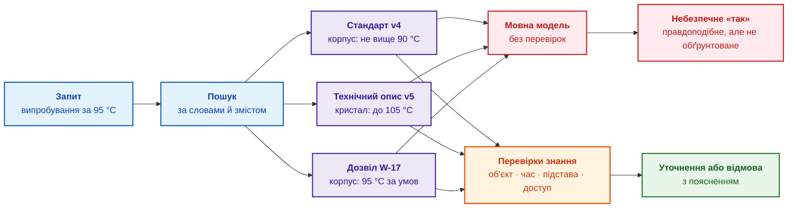
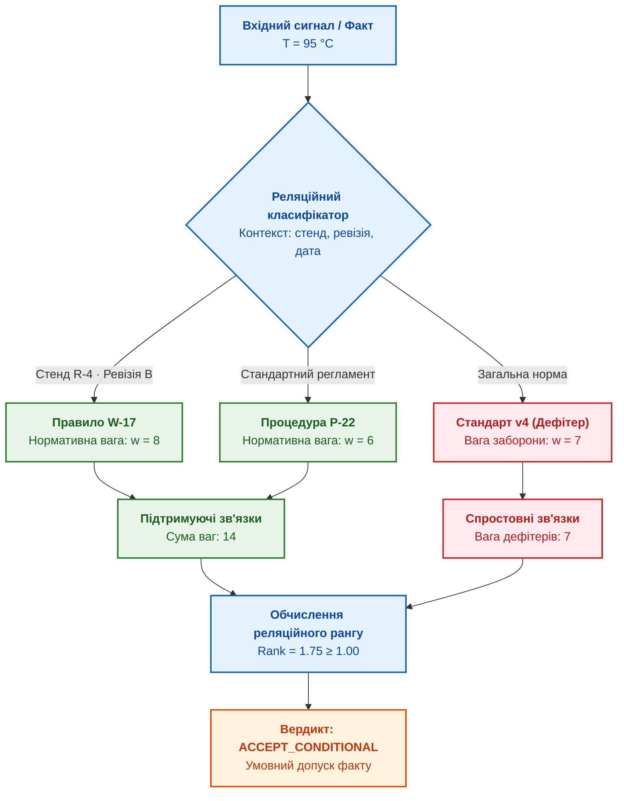
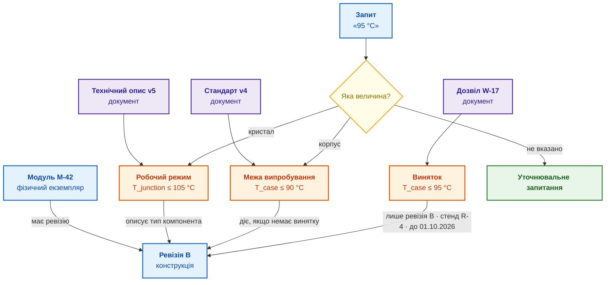
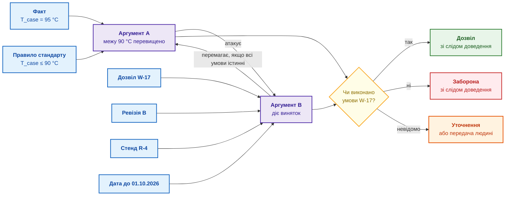
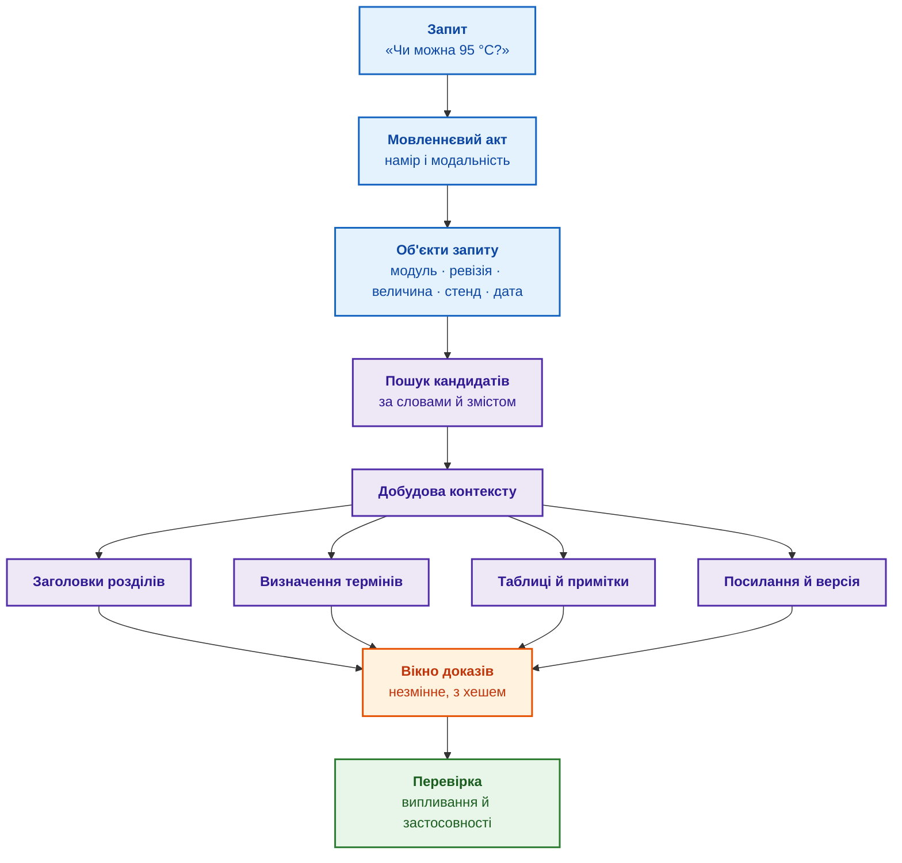
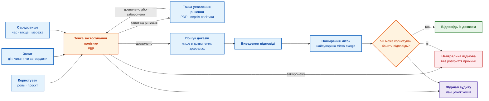
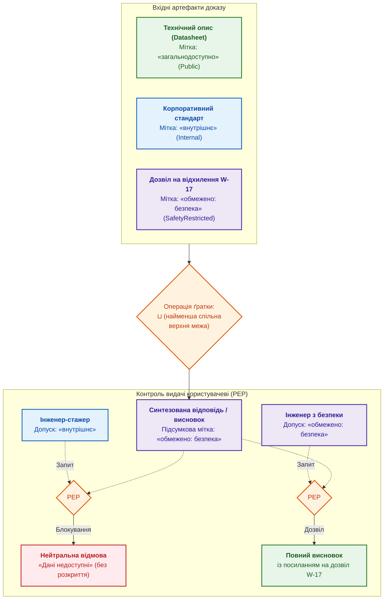
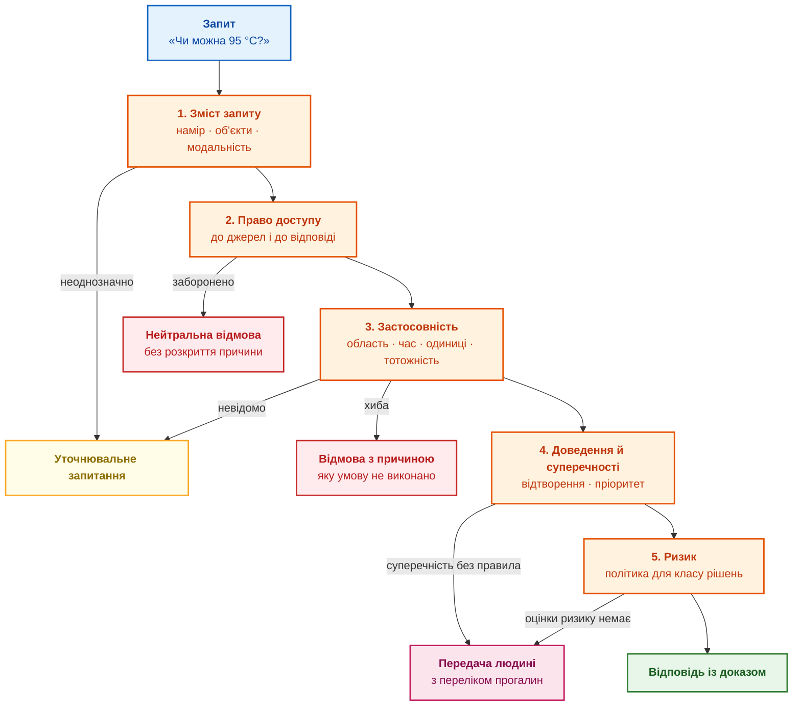

# Глава 2. Філософія для інженера: що машина має право називати знанням

> **Книга:** [Архітектура доказових експертних систем](README.md) · [Частина I: Концептуальний та епістемічний фундамент](part-01-foundations.md)  
> **Попередня глава:** [Глава 1. Вступ до експертних систем: від хаосу до керованих знань](ch01-introduction-to-expert-systems.md)  
> **Наступна глава:** [Глава 3. Чим експертна система відрізняється від інформаційно-довідкової системи](ch03-beyond-reference-information-systems.md)  
> **Зміст книги:** [README.md](README.md)  
> **Автор:** [Микола Федчик](about-the-author.md)  
> **Рівень:** базовий інженерний; приклади коду винесено в згорнуті блоки, формальні записи позначено словом «Формально»  
> **Очікувані результати:** пояснити, чому правдоподібна відповідь ще не є знанням; розкласти інженерне запитання на сім перевірок (підстава, об'єкт, спосіб виведення, зміст запиту, контекст цитати, спосіб перевірки, повноваження); сформулювати умову, за якої експертна система відповідає, уточнює запитання, передає рішення людині або відмовляє.

## Анотація

У цій главі закладено епістемічний фундамент архітектури експертних систем: формалізовано критерії, за якими символьне ядро відрізняє верифіковане знання від статистично правдоподібного, але фактологічно необґрунтованого тексту. Досліджено епістемічний розрив між стохастичними мовними моделями та детермінованими правилами логічного виведення, що є критичним для унеможливлення катастрофічних відмов у місійно-критичних застосунках (ISO 26262, IEC 61508, DO-178C). Показано, як фундаментальні категорії епістемології, онтології, математичної логіки, герменевтики та безпеки перетворюються на сім обов'язкових перевірок контрольно-пропускного шлюзу допуску фактів. Сформульовано процедурне визначення машинного знання, розкрито реляційну природу фактів на основі моделі «Сенсорного порядку» Фрідріха Гаєка, формалізовано математичний предикат застосовності у тризначній логіці Кліні, модель бітемпорального обліку валідності фактів та алгебраїчний критерій права на твердження (Entitlement to Assert). Наскрізний інженерний кейс випробування силового модуля за температури 95 °C ілюструє роботу відтворюваного сліду доведення та механізмів безпечної відмови (fail-closed).

## 1. Інженерний контракт доказової відповіді: сім епістемічних критеріїв

Впровадження експертної системи в процес прийняття інженерних рішень вимагає суворого контракту допуску фактів: жоден висновок не може бути виданий користувачеві чи переданий виконавчому механізму без проходження багаторівневого аудиту достовірності. На відміну від генеративних мовних моделей чи інформаційно-пошукових систем, які генерують неперевірені відповіді на основі кореляційної правдоподібності, доказова експертна система розглядає кожне вихідне твердження як технічно й юридично зобов'язуючий акт. Якщо цим контрактом знехтувати, перша ж семантична колізія у документації призведе до небезпечної дезінформації або аварійної відмови обладнання. Інженерний контракт доказовості встановлює сім обов'язкових епістемічних перевірок: підставу твердження, онтологічну тотожність об'єкта, детермінований спосіб виведення, модальний зміст запиту, герменевтичний контекст першоджерела, емпіричний спосіб верифікації та повноваження доступу. Невідомий параметр генерує запит на уточнення; дефіцит підстав активує безпечну відмову; брак прав доступу блокує несанкціоноване розкриття інформації.

Для першого читання пройдіть приклад із температурою, [робоче визначення](#робоче-визначення-знання-експертної-системи) й підсумкові перевірки. Розділи про Платона, Геттієра та філософію мови розкривають теоретичне підґрунтя контракту, що захищає архітектуру від прихованих логічних пасток. Виконуваний приклад [Глави 1](ch01-introduction-to-expert-systems.md) уже демонструє практичне застосування спрощеного контракту для випуску бортового ПЗ.

## 2. Практичний кейс: семантична колізія трьох першоджерел при випробуваннях силового модуля

Складність інженерної практики полягає в тому, що нормативні артефакти ніколи не існують у вигляді абсолютно узгодженої бази знань: загальні стандарти, технічні специфікації виробників компонентів та тимчасові регламенти випробувань неминуче вступають у семантичний конфлікт. Щоб побачити, як наївна інформаційна система зазнає аварійного краху там, де експертна система успішно локалізує неоднозначність, розглянемо сертифікаційну задачу випробувань апаратного модуля. Інженер-випробувач запитує експертну систему: «Чи можна проводити стендове випробування силового модуля за температури 95 °C?» Пошуковий компонент експертної системи знаходить три документи. Кожен документ стосується запитання, але жоден не дає готової відповіді, і в кожному документі слово «температура» означає різне.

Третій знайдений документ є **дозволом на відхилення** (*waiver*): погодженим документом, який дозволяє відступити від вимоги стандарту в обмежених умовах і на обмежений час. Таблиця показує, що каже кожен документ і чого документ не каже.

| Документ | Що в документі сказано | Про яку температуру | Чого документ не каже |
|---|---|---|---|
| Корпоративний стандарт випробувань, версія 4 | під час випробування не вище 90 °C | температура корпусу модуля | чи бувають винятки |
| Технічний опис компонента (*datasheet*) від постачальника, версія 5, новіший за стандарт | компонент працює до 105 °C | температура кристала, тобто напівпровідникової структури всередині корпусу | чи дозволено випробування за такої температури |
| Дозвіл на відхилення W-17 | випробування за 95 °C дозволено | температура корпусу модуля | чи діє дозвіл поза своїми умовами: дозвіл чинний лише для прототипу ревізії B, на стенді R-4, до 1 жовтня 2026 року й після додаткової перевірки |

Є й четверта температура, про яку документи мовчать: температура повітря в термокамері. Випробувачі часто кажуть «95 градусів», маючи на увазі саме налаштування камери. У запиті жодну з чотирьох температур не названо.

Велика мовна модель, яка отримає три знайдені фрагменти, легко складе переконливе «так»: 95 менше за 105, а дозвіл на відхилення нібито підтверджує виняток. Така відповідь звучить доречно й граматично правильна, але небезпечна з трьох причин:

1. Технічний опис компонента описує фізичну здатність кристала витримати температуру, а не дозвіл проводити випробування.
2. Дозвіл на відхилення може не стосуватися модуля, стенда чи дати із запиту, а користувач може не мати права бачити цей дозвіл.
3. Число 95 °C без назви вимірюваної величини не можна порівняти з жодною межею: 95 °C повітря в камері, корпусу й кристала означають три різні режими випробування.

Експертна система, побудована за правилами цієї глави, відповідає інакше:

> Дозволити випробування за наданим запитом експертна система не може. Для прототипу ревізії B існує потенційно застосовний виняток, але спершу треба уточнити, яку температуру мають на увазі, на якому стенді й коли відбудеться випробування та чи має користувач повноваження на таке рішення. До уточнення чинною лишається межа корпоративного стандарту: 90 °C для корпусу модуля.

Якщо користувач не має права бачити дозвіл W-17, експертна система не повинна навіть натякати на виняток, бо сам факт існування закритого документа може бути закритою інформацією:

> Доступних підстав недостатньо, щоб дозволити випробування. Передайте запит інженерові, відповідальному за безпеку випробувань.

Обидві відповіді коротші й менш зручні за «так», але обидві правильні. Безпечна відмова тут є ознакою якісної роботи експертної системи, а не невдалим пошуком. Схема нижче порівнює два шляхи від знайдених документів до відповіді.



Схема читається зліва направо. Синім позначено запит і пошук, фіолетовим три знайдені документи. Червоний шлях показує мовну модель, яка отримує документи без перевірок і складає небезпечне «так». Помаранчевий блок означає перевірки знання, які виконує експертна система: про який об'єкт ідеться, чи чинний документ на дату випробування, чи справді документ підтримує висновок і чи має користувач право доступу. Зелений блок показує результат перевірок: уточнювальне запитання або відмову з поясненням.

Розділ [«Одне запитання, три відповіді»](ch01-introduction-to-expert-systems.md#одне-запитання-три-відповіді) Глави 1 уже порівнював пошук, чатбот і експертну систему на прикладі таймауту. Приклад із температурою складніший: у ньому чотири величини з однаковою назвою, документ, що описує можливість замість дозволу, виняток з умовами та закритий доступ. Кожна складність відповідає окремому філософському запитанню, і тому приклад проходить через усю главу.

Знайти документи замало. Експертна система мусить знати, що саме стверджує кожен документ, про який об'єкт, на якій підставі, коли й для кого. Щоб перевіряти ці умови, спершу треба домовитися, що експертна система взагалі вважає знанням.

## 3. Еволюція концепції знання: від обґрунтованого істинного переконання (JTB) до проблеми Геттієра

Ключова проблема інтелектуальних систем полягає в тому, що формально правильна відповідь ще не свідчить про наявність знання чи розуміння в системі. Мовна модель, яка випадково вгадала нормативну межу 90 °C у процесі ймовірнісного передбачення наступного токена, та інженер, який вивів цю саму межу з верифікованого пункту чинного стандарту, формулюють ідентичний рядок тексту. Проте інженер володіє доказовим знанням, тоді як стохастичний генератор породжує епістемічну ілюзію. Епістемологія досліджує це розмежування понад дві тисячі років, і її висновки є безпосереднім інженерним дороговказом для побудови архітектури верифікації експертних систем.

Епістемологія давно відрізняє знання від вдалої здогадки. У діалозі Платона «Теетет» Сократ показує, що істинної думки для знання замало: оратор може переконати суддів у тому, що випадково виявилося правдою, але судді від цього не знають, як усе було насправді [[1]](#src-1). З таких міркувань виросла тричленна формула: людина знає твердження, якщо твердження істинне, людина вірить у твердження і віра обґрунтована. Формулу скорочено називають JTB (*justified true belief*, обґрунтоване істинне переконання). Цю формулу часто називають класичною, хоча, як зауважують автори огляду в Стенфордській філософській енциклопедії, у чіткому вигляді формулу записали переважно у XX столітті, і здебільшого ті, хто формулу критикував [[1]](#src-1).

У 1963 році Едмунд Геттієр опублікував статтю на три сторінки й навів два приклади, у яких усі три умови виконано, а знання немає [[2]](#src-2). У прикладах Геттієра людина робить правильний висновок із хибного, але обґрунтованого припущення, і висновок виявляється істинним випадково. Схожі приклади відомі й раніше. Індійський філософ Дгармоттара у VIII столітті описав мандрівника, який бачить міраж, вирішує, що попереду вода, і справді знаходить воду під каменем. Бертран Рассел описав людину, яка дивиться на зупинений годинник саме тоді, коли годинник показує правильний час [[1]](#src-1). В усіх прикладах переконання істинне й має підставу, але підстава й істина збіглися випадково. Такі приклади називають **випадками Геттієра**.

В інженерії випадки Геттієра трапляються щодня. Датчик температури в термокамері завис і вже годину показує 94 °C. Випадково в камері зараз справді 94 °C. Запис у журналі випробування істинний і спирається на відкалібрований прилад, але правильний лише випадково: через десять хвилин у камері буде 97 °C, а журнал і далі показуватиме 94 °C.

Той самий ефект виникає в мовних моделях, які відповідають за знайденими фрагментами. Мовна модель відповіла, що межа випробування дорівнює 90 °C, і послалася на технічний опис компонента. Число правильне, але технічний опис такого числа не містить: 90 °C узято зі стандарту, фрагмент якого мовна модель бачила поруч. Перевірка, яка порівнює лише кінцеву відповідь з еталоном, зарахує успіх, хоча посилання не підтримує відповідь.

Для експертної системи з випадків Геттієра випливає вимога: перевіряти треба не лише відповідь, а й зв'язок відповіді з підставою. Чи справді вказаний фрагмент документа підтримує саме це твердження? Чи справний прилад, що дав вимірювання? Наступний розділ перетворює вимогу на робоче визначення.

## 4. Канонічне інженерне визначення машинного знання <a id="робоче-визначення-знання-експертної-системи"></a>

Якщо в теоретичній філософії природа пізнання залишається предметом відкритих дискусій, то в системній інженерії відсутність формальної специфікації знання унеможливлює побудову детермінованого логічного ядра. Промислова експертна система не може спиратися на інтуїтивні чи суб'єктивні категорії: кожне твердження, що завантажується в оперативну пам'ять або бере участь у резолюційному виведенні, зобов'язане мати однозначну типізацію та строгий набір критеріїв допуску. Після публікації Геттієра спроби виправити класичну тріаду JTB породили десятки суперечливих концепцій [[1]](#src-1), проте для надійного програмного комплексу необхідне скінченне, алгоритмічно перевірне правило.

Книга пропонує таке правило:

> **Знанням експертної системи** книга називає твердження, яке має версію, перевірну підставу, визначену область застосування й час чинності, відомий спосіб отримання та пройшло всі перевірки й погодження, потрібні для тверджень такого класу.

Визначення навмисно процедурне. Визначення не пояснює, що таке знання взагалі, а описує, що має бути відомо про твердження, щоб експертна система мала право застосувати твердження. Таке визначення є проєктним рішенням, яке можна перевірити тестами: для кожного твердження можна з'ясувати, чи виконано кожну умову. Визначення забороняє вважати знанням те, що часто плутають зі знанням: ймовірність наступного слова в мовній моделі, схожість векторних представлень (*embeddings*), посаду автора документа чи впевнений тон тексту.

Визначення доповнює Главу 1. У розділі [«Документ не дорівнює знанню»](ch01-introduction-to-expert-systems.md#документ-не-дорівнює-знанню) документ розбирають на об'єкти знань п'яти типів: спостереження, твердження, доказове джерело, правило, рекомендацію або рішення. Визначення вище відповідає на наступне запитання: коли об'єкт знань типу «твердження» отримує право брати участь у висновку.

Набір перевірок із визначення книга називає **епістемічним контрактом** (від грецького *epistēmē*, знання). Слово «контракт» запозичене з програмування: у підході «проєктування за контрактом» (*design by contract*) Бертрана Меєра функція оголошує умови, які мають виконуватися до й після виклику функції [[3]](#src-3). Епістемічний контракт так само оголошує умови, але не для функції, а для твердження.

Умови контракту зручно згрупувати за сімома філософськими дисциплінами. Кожна дисципліна ставить до твердження одне запитання, і кожне запитання має інженерну відповідь:

| Дисципліна | Запитання до твердження | Що зберігає експертна система | Типова помилка в прикладі з 95 °C |
|---|---|---|---|
| Епістемологія: наука про знання | На якій підставі твердження допущено? | доказ, походження, заперечувальні обставини | правильне число з хибним посиланням |
| Онтологія: наука про те, що існує і як розрізняти об'єкти | Про який об'єкт, величину й версію йдеться? | ідентифікатори, вимірювані величини, одиниці, область застосування | межу кристала прийнято за межу випробування |
| Логіка | Як саме отримано висновок? | спосіб виведення, слід доведення, стан суперечностей | припущення видано за доведений факт |
| Філософія мови | Що означає запит у цьому контексті? | намір, об'єкти запиту, модальність | «чи можна» як фізичну здатність сплутано з дозволом |
| Герменевтика: теорія тлумачення текстів | Який контекст робить цитату чинною? | розділ, визначення, примітки, версію документа | виняток відірвано від примітки «лише ревізія B» |
| Філософія науки | Як твердження перевірити або спростувати? | метод, невизначеність, протокол, критерій приймання | прогноз моделі видано за вимірювання |
| Соціальна епістемологія | Хто має право бачити, заперечити й затвердити? | ролі, права доступу, рецензування, оскарження | авторитет прирівняно до істини, доступ до дозволу |

Таблиця є картою глави. Наступні розділи йдуть у тому самому порядку: для кожної дисципліни спершу показано проблему на прикладі 95 °C, потім спосіб, яким експертна система розв'язує проблему, і наприкінці короткий підсумок.

## 5. Епістемологічний базис: твердження, докази та походження фактів (Provenance)

В інженерії знань збереження документів у вигляді монолітних неструктурованих файлів є джерелом критичних дефектів простежуваності: три знайдені пошуковим механізмом нормативні тексти ще не утворюють верифікованої фактологічної бази. Стандарт випробувань регламентує десятки фізичних параметрів, специфікація виробника містить сотні характеристик, а для аргументації конкретного допуску потрібні два-три атомарні твердження з точними координатами. Якщо система оперує документом або багатосторінковим фрагментом як неподільним цілим, символьний рушій втрачає здатність довести, яке саме нормативне положення обґрунтовує висновок і чи зберігає воно чинність. Саме в такій непрозорій архітектурі виникають техногенні випадки Геттієра: формальне посилання на релевантний стандарт існує, проте фактичний зміст рішення ним не підтримується.

Тому одиницею знання в експертній системі є не документ і не абзац, а окреме твердження. Для дозволу W-17 твердження має такі частини:

| Частина твердження | Значення для дозволу W-17 |
|---|---|
| Предмет | випробування модуля на стенді |
| Що стверджується | дозволено максимальну температуру корпусу 95 °C |
| Область застосування | прототип ревізії B, стенд R-4, процедура випробування P-22 |
| Час чинності $I_v$ | з 1 липня до 1 жовтня 2026 року, дату закінчення не включено |
| Час запису $I_s$ | з 2 липня 2026 року, 09:15 за всесвітнім координованим часом (UTC) |
| Вид твердження | нормативний виняток |
| Версія | друга редакція документа W-17 |

Два види часу, $I_v$ і $I_s$, пояснює підрозділ «Два часи замість одного поля `updated_at`» нижче.

Доказ є окремим від твердження об'єктом. Доказом може бути незмінний фрагмент доказового джерела (цитата з хешем і точними координатами в конкретній версії документа), запис вимірювання, підписане погодження або слід виведення. Походження (*provenance*) відповідає на запитання, звідки взявся доказ і хто що з доказом робив. Стандарт PROV-O Консорціуму Всесвітньої павутини (World Wide Web Consortium, W3C) пропонує для опису походження базові поняття: сутність (*Entity*), дію (*Activity*), виконавця (*Agent*) і відношення «отримано з» (*wasDerivedFrom*) [[4]](#src-4). Походження не доводить істинності: докладна історія помилкового документа лишається докладною історією помилки.

Третій об'єкт, який експертна система зберігає окремо, це заперечувальні обставини. **Заперечувальною обставиною** (*defeater*) називають обставину, яка скасовує або послаблює підставу твердження. Термін став стандартним у працях Джона Поллока про спростовні міркування, і Поллок розрізняє два види заперечувальних обставин [[5]](#src-5). Обставина першого виду підтримує протилежний висновок: дозвіл W-17 заперечує загальну заборону температур корпусу понад 90 °C, але лише в межах ревізії B і стенда R-4. Обставина другого виду руйнує зв'язок між підставою й висновком, не стверджуючи протилежного: якщо з'ясувалося, що датчик у камері мав помилку калібрування, запис вимірювання перестає підтримувати висновок про температуру, хоча й не доводить, що температура була іншою.

Схема показує, як ці об'єкти пов'язані в прикладі з 95 °C.

```mermaid
flowchart LR
    accTitle: Граф підтримки й заперечення тверджень про 95 °C
    accDescr: Стандарт через незмінну цитату підтримує загальну заборону. Дозвіл на відхилення W-17 підтримує виняток. Загальна заборона й виняток атакують одне одного, а експертна система зберігає обидва твердження до рішення.

    STD["<b>Стандарт v4</b><br/>документ"] -->|"містить"| SP["<b>Цитата з п. 5.3</b><br/>незмінний фрагмент"]
    OWN["<b>Власник стандарту</b>"] -->|"затвердив"| STD
    SP -->|"підтримує"| C1["<b>Твердження C1</b><br/>корпус понад 90 °C заборонено"]
    W["<b>Дозвіл W-17</b><br/>документ"] -->|"підтримує"| C2["<b>Твердження C2</b><br/>95 °C дозволено для ревізії B"]
    SAF["<b>Інженер з безпеки</b>"] -->|"затвердив"| W
    C2 -->|"атакує в межах ревізії B"| C1
    C1 -->|"атакує поза умовами W-17"| C2
    C1 & C2 --> G["<b>Граф аргументів</b><br/>обидва твердження збережено"]
    G --> O["<b>Рішення</b><br/>після перевірки умов"]

    classDef doc fill:#e8eaf6,stroke:#3f51b5,stroke-width:2px,color:#1a237e;
    classDef claim fill:#e1f5fe,stroke:#0288d1,stroke-width:2px,color:#01579b;
    classDef actor fill:#fce4ec,stroke:#c2185b,stroke-width:2px,color:#880e4f;
    classDef grf fill:#fff3e0,stroke:#e65100,stroke-width:2px,color:#bf360c;
    classDef out fill:#e8f5e9,stroke:#2e7d32,stroke-width:2px,color:#1b5e20;

    class STD,SP,W doc;
    class OWN,SAF actor;
    class C1,C2 claim;
    class G grf;
    class O out;
```



Індиговими блоками позначено документи й цитату, рожевими людей, що документи затвердили, блакитними твердження, помаранчевим граф аргументів, зеленим рішення. Стандарт через незмінну цитату з пункту 5.3 підтримує твердження C1 про загальну заборону. Дозвіл W-17 підтримує твердження C2 про виняток. Твердження атакують одне одного: C2 перемагає C1 у межах ревізії B, а C1 перемагає C2 поза умовами дозволу. Експертна система не видаляє жодне твердження, а зберігає обидва до рішення, яке залежить від умов запиту. Як ухвалюють таке рішення, показує розділ про логіку.

На практиці разом із кожним твердженням зберігають щонайменше:

- незмінний ідентифікатор і канонічний запис твердження;
- епістемічний статус: процитовано, спостережено, виведено, припущено або нормативно встановлено;
- фрагмент джерела з хешем і координатами в конкретній версії документа;
- хто або що створило твердження: програма розбору документа, модель видобування, правило чи рецензент;
- область застосування, одиниці, час чинності й час запису;
- докази на підтримку й проти;
- спосіб виведення й слід доведення;
- мітку доступу й рішення рецензента;
- стан життєвого циклу: чинне, замінене, відкликане, оскаржене або невідоме.

Приклад такого запису у форматі JSON наведено в розділі «Умова відповіді» нижче, а життєвий цикл твердження від кандидата до відкликання описує [Глава 25](ch25-how-expert-systems-learn.md).

Одне поле `confidence=0.93` (упевненість) не замінює жодного з цих полів. З такого поля невідомо, що саме має ймовірність 0,93, на яких даних число відкалібровано і чи можна показувати твердження цьому користувачеві.

З епістемології для експертної системи випливає правило: зберігати твердження, доказ, походження й заперечувальні обставини як окремі пов'язані об'єкти. Тільки тоді експертна система може перевірити кожен зв'язок і не потрапити у випадок Геттієра. Але навіть добре підкріплене твердження може стосуватися іншого об'єкта, ніж той, про який питають.

### 5.1. Реляційна природа машинного знання: «Сенсорний порядок» Фрідріха Гаєка проти наївного позитивізму

Реляційна природа машинного знання є фундаментальним бар'єром проти наївного позитивізму, який помилково ототожнює знання з ізольованими фактами або статичними записами у плоских таблицях реляційних баз даних. В інженерії критичних експертних систем один і той самий фізичний сигнал чи нормативне твердження (наприклад, виміряна напруга $`3{,}3\,\text{В}`$ або температура $`95\,^\circ\text{C}`$) не несе жодного нормативного змісту сам по собі; його статус як «допуску», «перевантаження» чи «аварійного відсікання» виникає виключно через топологічне положення в класифікаційній мережі відношень. Якщо архітектор знань знехтує цією реляційною структурою, система втрачає контекстну чутливість, що призводить до катастрофічного плутання штатного тестового режиму з аварійною ситуацією або ігнорування тимчасових дозволів на відхилення.

Цей інженерний принцип безпосередньо спирається на епістемологічну концепцію «Сенсорного порядку» (*The Sensory Order*, 1952) лауреата Нобелівської премії Фрідріха Гаєка [[32]](#src-32). Гаєк довів, що перцепція та знання не є механічними відбитками зовнішнього фізичного світу, а являють собою динамічний процес багаторівневої класифікації зв'язків: кожне нове збудження набуває значення лише в міру того, як воно класифікується відносно раніше сформованої мережі зв'язків та очікувань. У доказовій експертній системі допуск будь-якого факту $`f`$ до участі в логічному виведенні визначається не його ізольованою декларованою «істинністю», а ступенем його включеності в деонтичну решітку аксіом та відсутністю блокуючих спростувань (дефітерів).



Для математичної формалізації класифікаційного процесу Гаєка введемо оператор реляційного рангу факту $`f`$ у базі знань $`\mathcal{K} = \langle \mathcal{F}, \mathcal{R}, \mathcal{D} \rangle`$:

$$
\mathrm{Rank}_{\mathrm{rel}}(f, \mathcal{K}) = \frac{\sum_{r \in \mathcal{R}} \mathbb{I}(f \in \mathrm{Prem}(r)) \cdot w(r)}{1 + \sum_{d \in \mathcal{D}} \mathbb{I}(d \text{ defeats } f) \cdot w(d)}
$$

де:
- $`f \in \mathcal{F}`$ — атомарне твердження-кандидат;
- $`\mathcal{R}`$ — множина чинних нормативних правил із цілочисельними вагами нормативної сили $`w(r) \in [1, 10]`$;
- $`\mathcal{D}`$ — множина активних дефітерів (заперечувальних обставин) із вагами $`w(d) \in [1, 10]`$;
- $`\mathbb{I}(\cdot) \in \{0, 1\}`$ — індикаторна функція входження факту в передумови правила або у сферу дії дефітера;
- $`\mathrm{Rank}_{\mathrm{rel}} \in [0, +\infty)`$ — безрозмірний коефіцієнт реляційної сили факту в класифікаційній мережі.

Імператив замкненого циклу розрахунку регламентує обов'язкові дії системи:

1. **Керування рантаймом і потоком обчислень (Control Flow & Runtime Decisions):**
   Якщо $`\mathrm{Rank}_{\mathrm{rel}}(f, \mathcal{K}) = 0`$ (факт повністю ізольований і не пов'язаний із жодним нормативним правилом), символьне ядро негайно маркує факт статусом `UNGROUNDED_ATOM` та виключає його з ланцюга виведення з формуванням відмови `REFUSAL`. Якщо $`\mathrm{Rank}_{\mathrm{rel}}(f, \mathcal{K}) \ge \tau_{\mathrm{rel}} = 1{,}00`$ за відсутності нездоланних дефітерів, факт автоматично допускається до уніфікації в аргументаційному дереві. При $`0 < \mathrm{Rank}_{\mathrm{rel}} < 1{,}00`$ генерується обов'язковий запит на ескалацію експерту (`QUALIFIED`).

2. **Апаратний сайзинг та інфраструктурні обмеження (Hardware Dimensioning):**
   Обчислення реляційного рангу вимагає швидкого обходу інцидентних ребер графа знань. Для бази обсягом $`\lvert \mathcal{F} \rvert = 50\,000`$ фактів та $`\lvert \mathcal{R} \rvert = 12\,000`$ правил структура стисненого рядкового подання CSR (*Compressed Sparse Row*) займає $`M_{\mathrm{CSR}} = (2 \cdot \lvert \mathcal{E} \rvert + \lvert \mathcal{F} \rvert) \cdot 8\,\text{байт} \approx 3{,}2\,\text{МБ}`$. Цей масив повністю вміщується в L3-кеш процесора або внутрішню пам'ять BRAM апаратного прискорювача виведення, гарантуючи час обчислення рангу $`T_{\mathrm{rank}} \le 180\,\text{нс}`$ без затримок звернення до зовнішньої шини пам'яті DRAM.

3. **Практичний числовий приклад (Worked Numerical Example):**
   Розглянемо вимірювання температури $`T_{\mathrm{case}} = 95\,^\circ\text{C}`$ для прототипу ревізії B на стенді R-4. Факт підтримується правилом дозволу на відхилення W-17 ($`w(r_1) = 8`$) та правилом стандартного регламенту $`P\text{-}22`$ ($`w(r_2) = 6`$). Водночас діє загальна норма стандарту v4 ($`w(d_1) = 7`$), що забороняє температури понад 90 °C і виступає дефітером:

$$
\mathrm{Rank}_{\mathrm{rel}}(f, \mathcal{K}) = \frac{8 \cdot 1 + 6 \cdot 1}{1 + 7 \cdot 1} = \frac{14}{8} = 1{,}75 \ge 1{,}00
$$

   Оскільки $`1{,}75 \ge 1{,}00`$, реляційна сила дозволу W-17 у визначеному контексті перевищує загальну заборону стандарту. Система видає вердикт умовного допуску `ACCEPT_CONDITIONAL`. Якщо ж експеримент проводиться на несертифікованому стенді R-2, правило W-17 втрачає чинність ($`w(r_1) = 0`$), даючи $`\mathrm{Rank}_{\mathrm{rel}} = \frac{6}{8} = 0{,}75 < 1{,}00`$, що негайно ініціює захисне блокування `REFUSAL`.

## 6. Онтологічна ідентифікація: подолання семантичної омонімії та контекстні обмеження

У трьох документах прикладу тричі трапляється слово «температура» і двічі слово «модуль», але за однаковими словами стоять різні об'єкти. Онтологія, розділ філософії про те, що існує і як розрізняти сутності, в інженерії перетворюється на практичне запитання: чи описують два записи той самий об'єкт? В інформатиці онтологією також називають формальну модель понять предметної області (див. Словник [Глави 1](ch01-introduction-to-expert-systems.md)). Онтологічна помилка в робочому коді рідко виглядає філософською. Частіше це з'єднання таблиць за назвою компонента, невдале перетворення одиниць або відношення `owl:sameAs` («той самий, що»), поставлене між схожими, але не тотожними сутностями в мові онтологій W3C (Web Ontology Language, OWL) [[6]](#src-6).

Щоб відповісти на запит про 95 °C, експертна система мусить розрізняти:

- фізичний модуль M-42, тип компонента й ревізію конструкції B;
- технічний опис як документ і допустимий робочий режим, який технічний опис описує;
- межу випробування в стандарті як нормативне обмеження;
- дозвіл на відхилення як тимчасовий виняток, а не нову загальну межу;
- вимірювані величини: температуру корпусу $T_{\mathrm{case}}$, температуру кристала $T_{\mathrm{junction}}$ і температуру повітря в камері $T_{\mathrm{chamber}}$;
- випробування, план випробування, стенд, конфігурацію стенда й результат вимірювання.

**Вимірювана величина** (*measurand*) означає, що саме вимірюють: не просто «температуру», а температуру конкретної частини конкретного об'єкта в конкретних умовах.

Розрізняти об'єкти допомагає правило: назву читає людина, ідентифікатор читає програма. Ідентифікатор об'єкта має бути стабільним. Синоніми, переклади й старі коди зберігають як атрибути або як окремі твердження про відповідність, і кожне таке твердження має власне походження. Об'єднання двох ідентифікаторів в один є версіонованою операцією, яку можна скасувати, а не незворотним перезаписом бази знань. Схема показує, які об'єкти стоять за словами із запиту.



Синім позначено фізичні об'єкти й запит, фіолетовим документи, помаранчевим межі й режими, які документи встановлюють. Кожна межа стосується своєї величини: технічний опис говорить про кристал, стандарт і дозвіл W-17 про корпус. Жовтий ромб показує розгалуження за вимірюваною величиною: якщо запит не називає величину, експертна система не вибирає межу навмання, а ставить уточнювальне запитання (зелений блок).

Найпростіший спосіб не порівняти температуру повітря в камері з межею для корпусу модуля полягає в тому, щоб зберігати разом із числом назву вимірюваної величини й забороняти порівняння різних величин на рівні типів даних. Приклад мовою Go показує такий підхід.

<details>
<summary>Приклад мовою Go: температура з назвою вимірюваної величини</summary>

Програма є повною й запускається командою `go run main.go`. Тип `Temperature` зберігає разом зі значенням назву вимірюваної величини, а метод `NotAbove` порівнює лише однакові величини.

```go
package main

import (
	"errors"
	"fmt"
)

// Measurand називає, що саме виміряно, а не лише одиницю.
type Measurand string

const (
	CaseTemp     Measurand = "T_case"
	JunctionTemp Measurand = "T_junction"
	ChamberTemp  Measurand = "T_chamber"
)

type Temperature struct {
	What   Measurand
	Kelvin float64
}

func Celsius(what Measurand, c float64) Temperature {
	return Temperature{What: what, Kelvin: c + 273.15}
}

var ErrDifferentMeasurands = errors.New("різні вимірювані величини")

func (t Temperature) NotAbove(limit Temperature) (bool, error) {
	if t.What != limit.What {
		return false, fmt.Errorf("%w: %s і %s", ErrDifferentMeasurands, t.What, limit.What)
	}
	return t.Kelvin <= limit.Kelvin, nil
}

func main() {
	standardLimit := Celsius(CaseTemp, 90)

	request := Celsius(ChamberTemp, 95)
	if _, err := request.NotAbove(standardLimit); err != nil {
		fmt.Println("порівняння заборонено:", err)
	}

	measured := Celsius(CaseTemp, 94.6)
	ok, _ := measured.NotAbove(standardLimit)
	fmt.Println("корпус 94,6 °C у межах 90 °C:", ok)
}
```

Програма друкує:

```text
порівняння заборонено: різні вимірювані величини: T_chamber і T_case
корпус 94,6 °C у межах 90 °C: false
```

Перший рядок показує, що порівняння температури повітря в камері з межею для корпусу заборонено: метод повертає помилку, а не `false`, бо «порівнювати не можна» і «межу перевищено» означають різне. Другий рядок показує звичайне порівняння однакових величин: 94,6 °C корпусу перевищують межу 90 °C. Значення зберігаються в кельвінах, базовій одиниці температури в Міжнародній системі одиниць (SI), тому порівняння не залежить від того, в яких одиницях значення ввели.

</details>

Одиниці потребують тієї самої уважності, що й величини. Наприклад, 1024 кілобайти (кБ) дорівнюють 1 024 000 байтів, а 1 048 576 байтів становлять 1024 кібібайти (КіБ). Помилка на 2,4 % непомітна в журналі, але в перевірці межі обсягу пам'яті може дати хибне «так».

Підсумок онтології для інженера: порівнювати можна лише величини одного виду й лише об'єкти, тотожність яких встановлено. Два наступні підрозділи розглядають ще дві властивості, без яких застосувати твердження неможливо: час і область застосування.

### 6.1. Двовимірна темпоральність: бітемпоральний облік валідності фактів (Valid Time vs Transaction Time)

Через місяць після випробування аудитор запитує: чому 22 вересня експертна система дозволила випробування за 95 °C, якщо дозвіл W-17 відкликали 20 вересня? Одне поле `updated_at` (час останнього оновлення запису) не допоможе відповісти: поле показує лише, коли запис змінили востаннє, але не показує, що експертна система знала 22 вересня.

Бази даних, що зберігають історію, розрізняють два незалежні види часу. Цю термінологію запропонували Річард Снодграсс та Ілсу Ан [[7]](#src-7):

- **час чинності** (*valid time*): коли твердження правдиве в предметному світі; для W-17 це проміжок з 1 липня до 1 жовтня 2026 року;
- **час запису** (*transaction time*): коли твердження записали в базу знань і доки запис вважався поточним; для W-17 це проміжок від 2 липня 2026 року.

Нехай W-17 відкликали 20 вересня, а в базі знань відкликання записали лише 25 вересня. Тоді запитання «що експертна система знала 22 вересня про 22 вересня?» має відповідь «W-17 чинний», а запитання «що відомо сьогодні про 22 вересня?» має відповідь «W-17 уже не діяв». Обидві відповіді правильні й потрібні: перша пояснює поведінку експертної системи 22 вересня, друга показує справжній стан справ. Без двох видів часу аудитор не відрізнить помилку експертної системи від запізнілого внесення даних.

**Інженерна задача та вимірюваний результат бітемпорального зрізу:**
При проведенні регуляторного аудиту (наприклад, згідно з вимогами ISO 26262-8, розділ 10 «Кваліфікація програмних інструментів») або ретроспективному розслідуванні інцидентів виникає задача точного відтворення стану знань системи на конкретну дату в минулому. Вимірюваним результатом є дискретна множина тверджень $K(t_v, t_s)$, що одночасно задовольняють дві часові координати у просторі $\mathbb{T} \times \mathbb{T}$ (де $\mathbb{T}$ — шкала посекундного всесвітнього координованого часу UTC).

```math
K(t_v,t_s)=\{\,c \in \mathcal{KB} \mid t_v\in I_v(c)\ \wedge\ t_s\in I_s(c)\,\}
```

Параметри та діапазони значень:
- $c \in \mathcal{KB}$ — версіоноване атомарне твердження з простору бази знань $\mathcal{KB}$;
- $t_v \in \mathbb{T}$ — момент валідності в предметній області (Valid Time), для якого перевіряється фізичний або нормативний стан (наприклад, запланована дата стендового випробування);
- $t_s \in \mathbb{T}$ — момент транзакційної фіксації в системі (Transaction Time), тобто відмітка часу, на яку проводиться аудит бази знань (стан коміту сховища);
- $I_v(c) = [t_{v,\text{start}}, t_{v,\text{end}}) \subset \mathbb{T}$ — інтервал фізичної та нормативної чинності твердження $c$;
- $I_s(c) = [t_{s,\text{commit}}, t_{s,\text{retire}}) \subset \mathbb{T}$ — інтервал системної актуальності запису $c$ у незмінному журналі аудиту (доки версію не було замінено або відкликано);
- $\mid$ відокремлює предикатні умови від елементів множини, $\wedge$ означає логічну кон'юнкцію умов належності точок відповідним інтервалам.

Практичне застосування та інженерні висновки:
Обчислення $K(t_v, t_s)$ викликається шлюзом допуску щоразу під час формування висновку та при кожному аудиторському запиті. За результатами потужності отриманої множини $|K(t_v, t_s)|$ система ухвалює такі детерміновані рішення:
1. **$K(t_v, t_s) = \emptyset$ (Порожня множина):** На момент $t_s$ у системі не було зафіксовано жодного чинного нормативу для дати $t_v$. Система переходить у режим безпечної відмови (*fail-closed abstention*), блокуючи дію та повідомляючи про відсутність нормативного покриття.
2. **$|K(t_v, t_s)| = 1$:** Існує єдине несуперечливе твердження. Факт передається у конвеєр перевірки застосовності.
3. **$|K(t_v, t_s)| > 1$:** Виявлено перетин кількох чинних нормативів (наприклад, загального стандарту та чинного дозволу на відхилення). Система маркує ситуацію як потенційний нормативний конфлікт і спрямовує вибірку до параконсистентного арбітражу або правил пріоритету специфікацій.

Нехай запис W-17 має дві версії. Перша версія: $I_v=[\text{01.07},\ \text{01.10})$, $I_s=[\text{02.07},\ \text{25.09})$. Друга версія, внесена після відкликання: $I_v=[\text{01.07},\ \text{20.09})$, $I_s=[\text{25.09},\ \infty)$. Для $t_v=\text{22.09}$ і $t_s=\text{22.09}$ до множини потрапляє перша версія, тож дозвіл W-17 вважався чинним. Для $t_v=\text{22.09}$ і $t_s=\text{30.09}$ жодна версія не потрапляє до множини: перша вже не поточна, а друга закінчилася 20 вересня.

Різниця між двома результатами сама є інформацією: експертна система діяла на знаннях, які пізніше виправили, і видно, коли саме виправили. Межі формули: формула відбирає записи лише за часом і не перевіряє ні області застосування, ні істинності; правило меж інтервалів (початок включно, кінець виключно) команда визначає сама; формула працює лише тоді, коли старі версії записів не перезаписують.

Стандарт W3C OWL-Time пропонує словник для опису моментів та інтервалів часу [[8]](#src-8), але правила меж інтервалів і політику виправлення минулих записів команда визначає сама. Як система здобуття знань зберігає обидва часи під час завантаження документів, показує [Глава 10](ch10-knowledge-acquisition-systems.md).

Отже, для аудиту й відтворення відповідей експертна система зберігає кожне твердження з двома інтервалами часу й ніколи не перезаписує старі версії. Тоді на запитання «що було відомо тоді?» є точна відповідь.

### 6.2. Верифікація застосовності: оцінка області чинності твердження <a id="чи-застосовне-твердження-до-запиту"></a>

Дозвіл W-17 існує, чинний і правдивий, але стосується лише вузької області: ревізії B, стенда R-4 і певного проміжку дат. Запит «Чи можна 95 °C?» не називає ні ревізії, ні стенда, ні дати. Експертна система мусить вирішити, чи застосовний W-17 до запиту, і не має права вгадувати відсутні дані за схожістю слів.

Для такого рішення двох значень «так» і «ні» замало. Потрібне третє значення, «невідомо», яке означає, що для рішення бракує даних. Правила обчислень із трьома значеннями описує тризначна логіка Стівена Кліні [[9]](#src-9), докладно розглянута в [Главі 6](ch06-applied-mathematics-for-expert-systems.md). Для кон'юнкції, тобто зв'язки «і», правило таке: якщо хоча б одна умова хибна, результат хибний; якщо всі умови істинні, результат істинний; у решті випадків результат невідомий.

**Інженерна задача та вимірюваний результат перевірки застосовності:**
Формальний допуск твердження до резолюційного рушія вимагає перевірки його сумісності з контекстом запиту, що дозволяє уникнути змішування параметрів різних фізичних вузлів. Вимірюваним результатом є значення предиката $\mathrm{Applicable} \in \{\mathbf{T}, \mathbf{F}, \mathbf{U}\}$ у тризначній логіці Стівена Кліні $\mathbb{K}_3$, де $\mathbf{T}$ (True) — істина, $\mathbf{F}$ (False) — хиба, $\mathbf{U}$ (Unknown) — невідомо (брак даних).

```math
\begin{aligned}
\mathrm{Applicable}(c,q,t_v,t_s)={}&\mathrm{Scope}(c,q)\wedge \mathrm{Valid}(c,t_v)\wedge \mathrm{Known}(c,t_s)\\
&\wedge \mathrm{Units}(c,q)\wedge \mathrm{Identity}(c,q)
\end{aligned}
```

Параметри та діапазони значень:
- $c \in \mathcal{KB}$ — твердження-кандидат, $q \in \mathcal{Q}$ — структурований запит користувача, $t_v, t_s \in \mathbb{T}$ — темпоральні координати валідності та транзакції;
- $\mathrm{Scope}(c,q) \in \{\mathbf{T}, \mathbf{F}, \mathbf{U}\}$ — збіг граничних умов застосування (ревізія зразка, тип випробувального стенда, регламент процедури);
- $\mathrm{Valid}(c,t_v) \in \{\mathbf{T}, \mathbf{F}\}$ — перевірка виконання умови $t_v \in I_v(c)$;
- $\mathrm{Known}(c,t_s) \in \{\mathbf{T}, \mathbf{F}\}$ — перевірка присутності факту в сховищі на момент транзакції $t_s \in I_s(c)$;
- $\mathrm{Units}(c,q) \in \{\mathbf{T}, \mathbf{F}\}$ — сумісність розмірностей та фізичних величин (перевірка збігу вимірюваних величин, наприклад $T_{\mathrm{case}} \equiv T_{\mathrm{case}}$, та валідність перерахунку одиниць SI);
- $\mathrm{Identity}(c,q) \in \{\mathbf{T}, \mathbf{F}, \mathbf{U}\}$ — однозначність розпізнавання екземпляра компонента за стабільним глобальним ідентифікатором (UUID / URI);
- $\wedge$ — оператор кон'юнкції у сильній тризначній логіці Кліні (де $\mathbf{F} \wedge \mathbf{U} = \mathbf{F}$, але $\mathbf{T} \wedge \mathbf{U} = \mathbf{U}$).

Практичне застосування та інженерні висновки:
Предикат розраховується модулем фільтрації перед побудовою дерева доведення. Залежно від отриманого значення логічний рушій виконує одну з трьох штатних дій:
- **$\mathrm{Applicable} = \mathbf{T}$:** Твердження кваліфікується як валідне і додається до множини активних аксіом резольвера.
- **$\mathrm{Applicable} = \mathbf{F}$:** Твердження безумовно відкидається. Рушій генерує діагностичний запис у журнал аудиту із зазначенням конкретного порушеного кон'юнкта (наприклад: *«Відхилено за Scope: ревізія зразка C не відповідає ревізії B дозволу W-17»*).
- **$\mathrm{Applicable} = \mathbf{U}$:** Система зупиняє формування висновку й формує автоматичний запит на уточнення (`ClarificationRequest`). Уточнення містить точний перелік атрибутів із невизначеним значенням (наприклад: *«Вкажіть ревізію силового модуля та номер випробувального стенда»*). Будь-яка стохастична екстраполяція за браку даних суворо блокується.

<details>
<summary>Приклад мовою Go: застосовність дозволу W-17 у тризначній логіці</summary>

Програма є повною й запускається командою `go run main.go`. Приклад спрощено: перевірено лише область застосування (ревізію й стенд) і час чинності. Дати записано у форматі РРРР-ММ-ДД, тому звичайне порівняння рядків дає правильний порядок дат.

```go
package main

import "fmt"

// Truth є тризначним значенням; нульове значення навмисно дорівнює Unknown.
type Truth int8

const (
	Unknown Truth = iota
	False
	True
)

func (t Truth) String() string {
	return [...]string{"невідомо", "хиба", "істина"}[t]
}

// And обчислює кон'юнкцію за сильними таблицями Кліні.
func And(values ...Truth) Truth {
	result := True
	for _, v := range values {
		switch v {
		case False:
			return False
		case Unknown:
			result = Unknown
		}
	}
	return result
}

type Query struct {
	Revision string // порожній рядок: користувач ревізію не назвав
	Rig      string
	Date     string // РРРР-ММ-ДД
}

func matches(requested, allowed string) Truth {
	switch {
	case requested == "":
		return Unknown
	case requested == allowed:
		return True
	default:
		return False
	}
}

func within(date, from, toExclusive string) Truth {
	switch {
	case date == "":
		return Unknown
	case date >= from && date < toExclusive:
		return True
	default:
		return False
	}
}

func waiverW17Applies(q Query) Truth {
	return And(
		matches(q.Revision, "B"),
		matches(q.Rig, "R-4"),
		within(q.Date, "2026-07-01", "2026-10-01"),
	)
}

func main() {
	fmt.Println(waiverW17Applies(Query{Rig: "R-4", Date: "2026-09-15"}))
	fmt.Println(waiverW17Applies(Query{Revision: "B", Rig: "R-4", Date: "2026-09-15"}))
	fmt.Println(waiverW17Applies(Query{Revision: "B", Rig: "R-4", Date: "2026-10-15"}))
}
```

Програма друкує:

```text
невідомо
істина
хиба
```

Перший запит не називає ревізію, тому результат невідомий, і експертна система має перепитати. Другий запит містить усі дані й потрапляє в умови W-17. Третій запит має дату після 1 жовтня, тому дозвіл не застосовується. Нульове значення типу `Truth` навмисно дорівнює `Unknown`: якщо програміст забуде заповнити поле, результат буде «невідомо», а не «істина».

</details>

Для перевірки таких умов на рівні всієї бази знань існують стандарти W3C. OWL 2 описує класи й відношення та дає змогу виводити неявні факти [[6]](#src-6). SHACL (Shapes Constraint Language, мова обмежень форми) перевіряє, чи відповідають дані заданим формам, і повертає звіт перевірки [[10]](#src-10). SHACL-перевірка наявності дати початку чинності не доводить, що дата правильна, а несуперечність онтології OWL не означає, що дані повні. Механізми доповнюють один одного, але не замінюють. Докладніше про OWL і SHACL пише [Глава 6](ch06-applied-mathematics-for-expert-systems.md), про перевірку бази знань [Глава 23](ch23-knowledge-base-verification.md).

Твердження застосовують до запиту лише тоді, коли всі п'ять умов істинні, а значення «невідомо» перетворюють на уточнювальне запитання. Наступне запитання стосується вже не твердження, а висновку: як саме експертна система висновок отримала.

## 7. Логічний резольвер: експлікація методів виведення та правила доведення

Поле `inferred=true` («виведено») у записі висновку приховує надто багато. Висновок «межу 90 °C перевищено» і висновок «перезапуск модуля спричинив перегрів кристала» обидва виведені, але мають зовсім різну надійність. Користувач, який бачить лише позначку «виведено», не відрізнить доведений факт від правдоподібної здогадки.

Логіка розрізняє способи отримання висновку, і кожен спосіб має власні гарантії:

- **Дедукція**: якщо засновки й правила прийняті, висновок випливає з необхідністю. Приклад: «температура корпусу 95 °C, стандарт дозволяє не більше 90 °C, отже межу перевищено».
- **Індукція**: спостереження підтримують узагальнення з певною невизначеністю. Приклад: «двадцять модулів ревізії B пройшли випробування за 95 °C без відмов, отже модулі ревізії B, імовірно, витримують 95 °C».
- **Абдукція**: висновок до найкращого пояснення доступних спостережень, який лишається гіпотезою. Термін увів Чарльз Пірс, хоча Пірс мав на увазі насамперед висування гіпотез; сучасне значення терміна описує Ігор Дувен [[11]](#src-11). Приклад: «модуль перезапустився; найкраще пояснення перезапуску полягає в перегріві кристала».
- **Спростовне міркування** (*defeasible reasoning*): висновок чинний, доки не з'явилася заперечувальна обставина. Приклад: «межа 90 °C чинна, якщо не діє дозвіл на відхилення».

Тріаду Пірса (дедукція, індукція, абдукція) докладніше розглядає [Глава 6](ch06-applied-mathematics-for-expert-systems.md), а те, як експертна система відокремлює суворі висновки від дорадчих гіпотез, [Глава 28](ch28-dual-mode-expert-systems.md).

Щоб користувач бачив спосіб отримання висновку, відповідь містить не лише висновок, а й **слід доведення** (*proof trace*): ідентифікатори засновків і правил, версії засновків і правил та проміжні кроки. Слід доведення має бути відтворюваним: повторне виконання на тих самих знімках бази знань і правил дає той самий висновок. **Знімок бази знань** (*snapshot*) є незмінним станом бази знань на певний момент. Якщо висновок залежить від зовнішньої мовної моделі, шаблону запиту до мовної моделі або плаваючого псевдоніма версії на кшталт `latest`, відтворюваність уже порушена, бо за тим самим іменем завтра може стояти інша модель. Як експертна система будує пояснення зі сліду доведення, показує [Глава 20](ch20-explanation-engine.md).

Логіка вимагає від експертної системи двох речей: позначки способу отримання для кожного висновку й відтворюваного сліду доведення. Два підрозділи нижче розглядають дві логічні пастки, у які найчастіше потрапляють програми: відсутній запис і суперечливі записи.

### 7.1. Семантика відкритого та замкненого світу: детермінація стану «не знайдено»

Експертна система шукає в реєстрі дозволів на відхилення запис для модуля M-42 і нічого не знаходить. Що означає порожній результат? Що виняток заборонено, що винятку немає чи що експертна система просто не бачить потрібного запису?

Звичайні бази даних працюють за **припущенням замкненого світу** (*closed-world assumption*, CWA): те, чого немає в базі, вважають хибним. Раймонд Рейтер формально описав це припущення 1978 року [[12]](#src-12). Мова онтологій OWL 2 працює за **припущенням відкритого світу** (*open-world assumption*, OWA): відсутній факт вважають невідомим [[6]](#src-6). Експертній системі потрібні обидва режими, але режим вибирають явно й окремо для кожного виду тверджень:

- реєстр затверджених дозволів на відхилення можна вважати замкненим лише тоді, коли реєстр повний, синхронізований і запит мав доступ до всіх записів реєстру;
- знання про можливі види відмов фізичних компонентів майже завжди відкрите: відсутність запису про відмову не доводить, що відмова неможлива;
- правило політики доступу «заборонено все, що явно не дозволено» (*deny-by-default*) стосується доступу й не означає, що твердження в предметній області хибне.

Тому «не знайдено», «хибно», «немає права доступу» і «не застосовується» є чотирма різними результатами. Якщо звести всі чотири результати до одного значення `null`, виникають і логічні помилки, і вразливості безпеки. Наприклад, відмову в доступі до закритого дозволу W-17 експертна система може помилково витлумачити як відсутність дозволу й заборонити випробування, яке насправді дозволено. Типізовані відповіді на основі тризначної логіки описує [Глава 6](ch06-applied-mathematics-for-expert-systems.md).

Порожній результат є не відповіддю, а приводом з'ясувати причину. Тому для кожного виду тверджень явно вказано, чи вважати світ відкритим, чи замкненим, а різні причини порожнього результату мають різні типи.

### 7.2. Параконсистентна логіка: локалізація суперечностей та запобігання принципу вибуху

У прикладі стандарт підтримує твердження «випробування з температурою корпусу 95 °C заборонено», а дозвіл W-17 підтримує протилежне твердження для вузької області. У класичній логіці з пари суперечливих тверджень випливає будь-яке твердження; цей закон називають принципом вибуху. Для бази знань, у якій суперечності неминучі, класична логіка непридатна: одна суперечність дозволила б вивести що завгодно.

Корисне подання суперечностей запропонував Нуел Белнап у чотиризначній логіці [[13]](#src-13). Замість одного значення «істина чи хиба» експертна система зберігає два незалежні біти: чи є аргумент на підтримку твердження і чи є аргумент проти. Чотири комбінації дають чотири стани: «лише за», «лише проти», «обидва», тобто суперечність, і «жодного», тобто невідомо.

**Інженерна задача та вимірюваний результат параконсистентного обліку:**
У промислових системах суперечність між різними вимогами (наприклад, жорстким стандартом та локальним тимчасовим відхиленням) є штатною ситуацією. Застосування класичної логіки призводить до принципу вибуху ($\text{Ex Falso Quodlibet}$), коли з суперечності випливає довільний хибний висновок. Задача параконсистентного обліку полягає в локалізації суперечностей та недопущенні деградації логічного рушія. Вимірюваним результатом є двійковий вектор доказового статусу твердження $V(c) \in \{0, 1\}^2$ у чотиризначній моделі Белнапа $\mathcal{B}_4$.

```math
V(c)=\bigl(P(c),\,N(c)\bigr)\in\{(1,0),\ (0,1),\ (1,1),\ (0,0)\}
```

Параметри та діапазони значень:
- $c \in \mathcal{KB}$ — цільове інженерне твердження (наприклад, «випробування модуля з температурою корпусу 95 °C дозволено»);
- $P(c) \in \{0, 1\}$ — наявність верифікованого аргументу «ЗА» (позитивне свідчення: $P(c) = 1$, якщо існує хоча б одне чинне застосовне правило або вимірювання на підтримку $c$, інакше 0);
- $N(c) \in \{0, 1\}$ — наявність верифікованого аргументу «ПРОТИ» (негативне свідчення: $N(c) = 1$, якщо існує хоча б один спростовний контрприклад чи обмежувальне правило проти $c$, інакше 0);
- $\in$ — належність вектора до дискретної множини чотирьох станів аргументації Белнапа.

Практичне застосування та інженерні висновки:
Вектор $V(c)$ розраховується модулем детекції конфліктів на етапі оцінки доказової бази. Система детерміновано маршрутизує процес міркувань за чотирма квадрантами станів:
1. **$V(c) = (1, 0)$ [Стан Істини $\mathbf{T}$]:** Одностайна підтримка. Твердження приймається як доведений факт і передається у виконавчий конвеєр.
2. **$V(c) = (0, 1)$ [Стан Хиби $\mathbf{F}$]:** Однозначне спростування. Твердження відхиляється; генерується мотивована відмова з посиланням на заборонне правило.
3. **$V(c) = (1, 1)$ [Стан Суперечності $\mathbf{B}$ (Both)]:** Локалізований конфлікт вимог. Система не деградує за принципом вибуху, а активує аргументаційну схему Зунга (Dung Framework) та запускає алгоритм розв'язання колізій на основі відношення переваги нормативів (лексикографічний порядок або вужча область дії). Якщо конфлікт не має автоматичного правила вирішення, система генерує запит на ескалацію відповідальному інженеру з наданням повної карти протиборчих аргументів.
4. **$V(c) = (0, 0)$ [Стан Незнання $\mathbf{N}$ (None)]:** Епістемічний вакуум. Залежно від конфігурації підсистеми (CWA або OWA) система фіксує відсутність даних і переходить у стан безпечного утримання від відповіді (*abstention*).

Стан «обидва» не вирішує, який аргумент переможе. Для цього використовують аргументаційні схеми. Фан Мінь Зунг (Phan Minh Dung) 1995 року запропонував абстрактну **аргументаційну схему** (*argumentation framework*): множину аргументів і відношення атаки між аргументами [[14]](#src-14). Які аргументи приймаються, визначає обрана семантика, тобто правило вибору узгодженої множини аргументів, і семантику треба фіксувати разом із версією правил. Схема нижче показує аргументи прикладу.



Сині блоки є засновками: факт, правило стандарту, дозвіл W-17 і три умови дозволу. Фіолетові блоки є аргументами, побудованими із засновків. Аргумент A атакує аргумент B, а аргумент B перемагає аргумент A лише тоді, коли всі три умови W-17 істинні. Жовтий ромб перевіряє умови, і результат має три гілки: зелений дозвіл, червона заборона й помаранчеве уточнення, якщо умови невідомі. Кожна гілка несе слід доведення.

Для інженера будову окремого аргументу найзрозуміліше пояснює модель Стівена Тулміна [[15]](#src-15). Тулмін розклав аргумент на шість частин, і кожна частина має відповідник в експертній системі:

| Частина аргументу за Тулміном | Що означає | Відповідник в експертній системі | Приклад з 95 °C |
|---|---|---|---|
| Твердження (*claim*) | що стверджують | висновок | «випробування за 95 °C дозволено» |
| Дані (*data*) | факти, на які спираються | доказ | температура корпусу 95 °C, ревізія B, стенд R-4 |
| Підстава (*warrant*) | чому з даних випливає твердження | версіоноване правило | «виняток W-17 діє для ревізії B на стенді R-4» |
| Підкріплення (*backing*) | чому підставі можна довіряти | джерело правила | дозвіл W-17, затверджений інженером з безпеки |
| Кваліфікатор (*qualifier*) | наскільки сильне твердження або за якої умови діє | умова висновку | «до 1 жовтня 2026 року й після додаткової перевірки» |
| Застереження (*rebuttal*) | за яких обставин твердження не діє | заперечувальна обставина | «якщо W-17 відкликано» |

Кваліфікатор не треба автоматично перетворювати на ймовірність: «до 1 жовтня» є умовою, а не числом.

Лишається правило пріоритету. «Новіший документ перемагає» і «вища посада перемагає» не є законами логіки, це правила керування знаннями, які встановлює організація. Залежно від галузі пріоритет визначають нормативний статус документа, явна заміна старої редакції новою, вужча область застосування, дата або підпис певної ролі. Правило пріоритету має бути записане, протестоване й показане в сліді доведення. Як аргументи безпеки збирають у формальне обґрунтування безпеки, показує [Глава 27](ch27-safety-case-gsn-synthesis.md).

Суперечність не видаляють і не ховають: експертна система зберігає стан «обидва» й розв'язує суперечність записаним правилом пріоритету, а за відсутності такого правила передає рішення людині. Досі йшлося про твердження в базі знань; наступний розділ повертається до самого запиту.

## 8. Філософія мови: формалізація семантичного ядра запиту інженера

Запит «Чи можна проводити випробування за 95 °C?» здається однозначним, але слово «можна» має щонайменше чотири значення, і кожне значення вимагає іншої перевірки. Якщо експертна система мовчки вибере одне значення, експертна система може правильно відповісти на запитання, якого ніхто не ставив.

| Значення «можна» | Приклад формулювання | Що перевіряє експертна система |
|---|---|---|
| Фізична здатність | «Чи витримає компонент 95 °C?» | технічний опис компонента, результати випробувань |
| Нормативний дозвіл | «Чи дозволяє стандарт 95 °C?» | стандарт, дозволи на відхилення, область застосування |
| Практична здійсненність | «Чи здатен стенд R-4 утримувати 95 °C?» | характеристики й калібрування стенда |
| Прохання про погодження | «Погодьте, будь ласка, випробування за 95 °C» | повноваження користувача й процедуру погодження |

Розрізнення дозволу й здатності не вигадане для цієї книги. Правила оформлення міжнародних стандартів Міжнародної організації зі стандартизації (ISO) та Міжнародної електротехнічної комісії (IEC) вимагають розрізняти в тексті стандарту вимогу (англійське *shall*), рекомендацію (*should*), дозвіл (*may*) і можливість або здатність (*can*), бо плутанина цих форм змінює зміст положення стандарту [[16]](#src-16). Українське «можна» покриває і *may*, і *can*, тому для україномовної експертної системи проблема ще гостріша.

Філософія мови пояснює, чому буквального значення слів замало. Джон Остін показав, що висловлювання часто є дією: запитуючи «чи можна?», випробувач може насправді просити дозволу [[17]](#src-17). Джон Серль систематизував такі **мовленнєві акти** (*speech acts*) [[18]](#src-18). Пол Грайс описав **імплікатуру** (*implicature*): зміст, який мовець передає понад буквальне значення слів, розраховуючи, що співрозмовник зрозуміє зміст із контексту [[19]](#src-19). Коли випробувач пише «95 градусів», випробувач розраховує, що співрозмовник зрозуміє, про яку температуру йдеться. Колега з лабораторії зазвичай зрозуміє, а експертна система без явного уточнення не зрозуміє.

Інженерний наслідок: до пошуку доказів запит перетворюють на структурований запис. Такий запис містить:

- намір: дізнатися, отримати дозвіл або погодити;
- об'єкти запиту: модуль, ревізію, стенд, вимірювану величину, процедуру;
- область застосування й час події;
- модальність, тобто одне з чотирьох значень «можна» з таблиці вище;
- які докази потрібні для відповіді;
- хто запитує і в якій ролі;
- контекст політики доступу.

Якщо модальність або об'єкт запиту не визначено, мовна модель не повинна тихо вибирати найзручніше значення. Мовна модель має або поставити уточнювальне запитання, або повернути кілька явно позначених тлумачень запиту. Як локальні мовні моделі й лінгвістичний аналіз будують такий запис, розглядають [Глава 12](ch12-linguistic-analysis-and-local-models.md) і [Глава 13](ch13-language-variability-vs-determinism.md).

З філософії мови для експертної системи випливає правило: відповідати на запит лише після того, як визначено намір, об'єкти й модальність запиту. Але навіть правильно зрозумілий запит може отримати хибну відповідь, якщо знайдену цитату прочитано без контексту.

## 9. Герменевтичний аналіз: цілісність нормативного контексту проти атомарного цитування

Пошук знайшов у дозволі W-17 речення «Допускається температура 95 °C». Відірване від документа, речення нібито підтримує будь-який запит про 95 °C. Насправді зміст речення залежить від заголовка розділу, визначення $T_{\mathrm{case}}$ у першому розділі, примітки «лише для прототипу ревізії B», таблиці з налаштуваннями стенда й посилання на процедуру P-22. Розбиття документа на фрагменти фіксованої довжини (*chunking*), яке часто використовують для пошуку, може відрізати будь-яку з цих умов.

Герменевтика, теорія тлумачення текстів, описує цю проблему як **герменевтичне коло**: щоб зрозуміти частину тексту, треба розуміти ціле, а щоб зрозуміти ціле, треба розуміти частини [[20]](#src-20). В інженерії герменевтичне коло означає таке: знайдений фрагмент перевіряють через контекст документа, а контекст добирають за тим, що потрібно для правильного прочитання фрагмента.

Тому доказом є не голий фрагмент, а **вікно доказів** (*evidence window*): фрагмент разом із контекстом, без якого фрагмент не можна правильно прочитати. Експертна система будує вікно доказів детерміновано, тобто однаково для тієї самої версії документа: додає заголовки розділів, у яких лежить фрагмент, визначення вжитих термінів, заголовки й примітки таблиці та документи, на які фрагмент посилається. Кожен доданий елемент має власний ідентифікатор і причину включення, а хеш усього вікна записують у слід відповіді. Оцінка пошуку визначає лише кандидата на доказ, але не силу доказу.

**Інженерна задача та вимірюваний результат контекстуального заземлення:**
Використання ізольованих фрагментів тексту породжує ризик втрати нормативних обмежень, розташованих у заголовках, примітках чи визначеннях стандарту. Інженерне завдання полягає в детермінованій побудові розширеного вікна доказів, яке містить усі семантично пов'язані елементи, необхідні для однозначної інтерпретації. Вимірюваним результатом є дискретна множина текстових блоків $W(e)$, обчислена відносно атомарного фрагмента $e$.

```math
W(e)=e\ \cup\ \mathrm{Headings}_d(e)\ \cup\ \mathrm{Definitions}(e)\ \cup\ \mathrm{TableContext}(e)\ \cup\ \mathrm{Refs}_k(e)
```

Параметри та допустимі межі:
- $e$ — вилучений атомарний фрагмент тексту (речення, пункт вимоги) з фіксованими байтовими межами $[b_{\text{start}}, b_{\text{end}}]$ у канонічному документі;
- $\mathrm{Headings}_d(e)$ — множина заголовків батьківських розділів структурного дерева документа на глибину підйому $d \in [1, d_{\max}]$ (типово $d_{\max} = 5$ для нормативів ISO/IEC);
- $\mathrm{Definitions}(e)$ — множина термінологічних статей стандарту для лексем, присутніх у $e$ (автоматично вилучаються з розділу «Терміни та визначення» документа);
- $\mathrm{TableContext}(e)$ — структурне оточення таблиці (заголовок таблиці, назви стовпців, примітки до клітинок), якщо $e$ належить до табличних даних;
- $\mathrm{Refs}_k(e)$ — множина нормативно пов'язаних пунктів зовнішніх специфікацій за графом цитувань з глибиною транзитивного переходу $k \in [0, k_{\max}]$ (для запобігання комбінаторному вибуху встановлюють поріг $k_{\max} = 2$);
- $\cup$ — операція теоретико-множинного об'єднання контекстних фрагментів.

Практичне застосування та інженерні висновки:
Формування $W(e)$ виконується парсером на етапі здобуття знань. Якщо при побудові вікна виявляється, що базове визначення терміна відсутнє або посилання є нерозв'язним (битий лінк $\mathrm{Refs}_k(e) = \emptyset$ при наявності посилання), система знижує рівень довіри до фрагмента і позначає правило як «умовно визначене», блокуючи автоматичний допуск до рішень класу ASIL D. Хеш усього вікна $\mathrm{SHA\text{-}256}(W(e))$ записується в аудиторський сертифікат висновку. Межі: параметри $d$ і $k$ обмежують розмір вікна й мають версію; завеликі значення перетворюють вікно на весь документ, замалі відрізають умови.

Схема показує шлях від запиту до вікна доказів.



Сині блоки належать до розуміння запиту: сам запит, мовленнєвий акт і об'єкти запиту. Фіолетові блоки є пошуком і добудовою контексту з чотирьох джерел: заголовків, визначень, таблиць і посилань. Помаранчевий блок є результатом, вікном доказів із хешем. Зелений блок є перевіркою: чи логічно випливає твердження з вікна доказів і чи застосовне твердження до запиту.

Контекст визначає й силу тексту. Правила ISO та IEC поділяють елементи стандарту на нормативні, які встановлюють положення стандарту, і довідкові (*informative*), які лише допомагають зрозуміти документ [[16]](#src-16). Речення «температура не повинна перевищувати 90 °C» у довідковому додатку з прикладом розрахунку не є обов'язковою умовою відповідності стандарту, хоча й сформульоване як вимога. Тому разом із фрагментом зберігають, у якому елементі документа фрагмент стоїть, і нормативну силу надають лише фрагментам із нормативних елементів.

Контекст має й межі доступу. Не можна спершу передати мовній моделі закритий фрагмент, а потім просто прибрати з відповіді посилання на фрагмент: інформація з закритого фрагмента вже вплинула на текст відповіді. Право доступу перевіряють до пошуку, під час переходів між пов'язаними документами і перед видачею відповіді; як саме, пояснює розділ про соціальну епістемологію. Прив'язку відповіді до точних фрагментів джерел докладно описують [Глава 13](ch13-language-variability-vs-determinism.md) і [Глава 19](ch19-from-question-to-evidence.md).

Отже, доказом є вікно доказів, а не окремий фрагмент, і вікно будують однаково для тієї самої версії документа. Контекст відповідає на запитання, що саме каже документ. Наступне запитання: як перевірити, чи правдиве сказане.

## 10. Епістемологія науки: розмежування емпіричних вимірювань, прогнозів та нормативних обмежень

У базі знань експертної системи для досліджень і розробки поруч лежать вимірювання, результати моделювання, прогнози моделей машинного навчання, причинні гіпотези й нормативні вимоги. Якщо всім цим записам дати один статус «факт», експертна система не відрізнить виміряну температуру від передбаченої, а норму від спостереження. Філософія науки якраз досліджує, як різні види тверджень перевіряють і спростовують.

Запис вимірювання має зберігати вимірювану величину, значення, одиницю, метод, прилад, стан калібрування приладу, умови довкілля, ідентифікатор зразка, час і невизначеність. Невизначеність важлива, коли результат близький до межі. Запис «$`T_{\mathrm{case}}=94{,}6`$ °C, $U=1{,}2$ °C, $k=2$» містить розширену невизначеність $U$ з коефіцієнтом охоплення $k=2$. За нормального розподілу похибок такий запис означає, що справжнє значення з імовірністю приблизно 95 % лежить між 93,4 °C і 95,8 °C [[21]](#src-21). Межа 95 °C із дозволу W-17 потрапляє всередину цього інтервалу, тож за самим записом не можна сказати, перевищено межу чи ні.

Тому правило ухвалення рішення про відповідність визначають до випробування, а не після. Настанова JCGM 106 Спільного комітету з настанов у метрології описує кілька таких правил [[22]](#src-22): наприклад, вважати межу дотриманою лише тоді, коли весь інтервал невизначеності лежить нижче межі. За таким правилом результат 94,6 ± 1,2 °C не підтверджує дотримання межі 95 °C, і випробування доведеться повторити з точнішим приладом або явно прийняти ризик.

Прогноз моделі машинного навчання має інший контракт: хеш файлу моделі, схему вхідних ознак, знімок навчальних даних, налаштування запуску, перевірку того, чи не виходять вхідні дані за межі навчального розподілу, і відкалібровану невизначеність на відповідній сукупності випадків. Навіть добре відкалібрований прогноз не стає вимірюванням. Як оновлювати впевненість за нових даних і чому калібрування важливе, пояснює [Глава 4](ch04-evolution-from-bayes-to-evidence-ai.md).

Гіпотеза стає інженерно корисною, коли наперед визначено, як гіпотезу перевірити й що гіпотезу спростує: прогноз, протокол перевірки, контрольні умови, метрику, область результатів, яку вважають підтвердженням, строк і відповідальну людину. Карл Поппер вимагав від наукових тверджень **фальсифікованості**, тобто можливості спростування перевіркою [[23]](#src-23). Вимога корисна, бо не дає підганяти пояснення під будь-який результат заднім числом. Але фальсифікованість не є універсальним тестом для всіх видів знання: нормативний дозвіл перевіряють процедурою ухвалення, а не фізичним експериментом.

Для причинних тверджень кореляції зі спостережень замало. Припустімо, модулі, які довше працювали за 95 °C, частіше відмовляли. Звідси не випливає, що нагрів спричинив відмови: можливо, довше випробовували модулі зі старої партії, у якій був інший дефект. Джудея Перл запропонував числення, яке формально розрізняє спостереження за умовою («модулі, що працювали за 95 °C») і втручання («встановити 95 °C для випадково вибраних модулів») [[24]](#src-24). Причинний висновок потребує або контрольованого експерименту, або явно записаних причинних припущень.

Тому експертна система формулює результат із вказанням способу отримання, наприклад:

- «виміряно за процедурою P-22»;
- «передбачено моделлю TH-3 версії 2»;
- «виведено правилом RULE-12 стандарту випробувань версії 4»;
- «припущено як найкраще пояснення»;
- «дозволено згідно з W-17»;

а не згортає все у фразу «штучний інтелект встановив факт».

Вимірювання, прогноз, гіпотеза й норма мають різні способи перевірки, тому експертна система зберігає для них різні поля й різні статуси. Останнє запитання з таблиці стосується людей: хто вирішує, чому вірити, і хто що має право бачити.

## 11. Соціальна епістемологія: ієрархія авторитетів, решітки безпеки та незмінний аудит

База знань є результатом роботи людей та організацій. Стандарт затвердив власник стандарту, дозвіл W-17 підписав інженер з безпеки, запис вимірювання вніс лаборант. Кожна з цих людей має певний авторитет, і кожен документ має певний рівень доступу. Небезпечно змішати ці властивості з істинністю: підпис керівника не робить твердження правдивим, а знайдений документ не дає користувачеві права документ бачити.

Соціальна епістемологія вивчає, як знання виникає в спільнотах: через свідчення інших людей, довіру, незгоду й установлені практики [[25]](#src-25). Для експертної системи з цього випливають три незалежні осі:

1. **Нормативна вага джерела**: яку силу має джерело в цій області застосування, наприклад стандарт, дозвіл чи технічний опис.
2. **Повноваження на рецензування**: хто може прийняти, оскаржити, замінити або затвердити твердження.
3. **Право доступу**: хто може читати джерело чи похідне твердження.

Жодна вісь не гарантує істинності. Підпис відповідального за безпеку робить рішення організаційно чинним, але не змінює фізики. Думка молодшого інженера може виявитися правильною, тому експертна система має канал оскарження. Водночас доречність документа для запиту не надає користувачеві права документ бачити.

Право доступу перевіряють за політиками. **Керування доступом за атрибутами** (*Attribute-Based Access Control*, ABAC) визначає право через атрибути користувача, об'єкта, дії й середовища [[26]](#src-26). Для прикладу з 95 °C політика може враховувати роль користувача, проєкт, гриф дозволу W-17, дію («читати» чи «затвердити»), місце й час. Простіший підхід, **керування доступом за ролями** (*Role-Based Access Control*, RBAC), враховує лише роль. Та сама настанова Національного інституту стандартів і технологій США (National Institute of Standards and Technology, NIST) описує поділ обов'язків між **точкою ухвалення рішення** (*Policy Decision Point*, PDP), яка обчислює рішення за політикою, і **точкою застосування політики** (*Policy Enforcement Point*, PEP), яка перехоплює запит і виконує рішення [[26]](#src-26). Мова ODRL (Open Digital Rights Language, відкрита мова цифрових прав) уміє записувати дозволи, заборони й обов'язки [[27]](#src-27), але мова запису політик не виконує політики сама: застосування політик, заборону всього, що явно не дозволено, і аудит забезпечує архітектура експертної системи. Схема показує, де перевіряють доступ під час відповіді на запит.



Сині блоки є учасниками й кроками обробки: користувач, запит, середовище, точка ухвалення рішення, пошук, виведення й поширення міток. Помаранчеві блоки є двома місцями перевірки доступу: точка застосування політики перед пошуком і перевірка мітки перед видачею відповіді. Зелений блок є дозволеною відповіддю, червоний нейтральною відмовою, фіолетовий журналом аудиту, куди потрапляють обидва рішення про доступ.

Відповідь експертної системи є похідним документом, і похідний документ теж має мітку доступу. Консервативне правило: мітка відповіді дорівнює найсуворішій мітці серед усіх даних, використаних для відповіді, включно з прихованим контекстом, правилами й проміжними твердженнями, а не лише з показаними посиланнями. Математичну основу такого правила, ґратку класів безпеки, запропонувала Дороті Деннінг 1976 року [[28]](#src-28).

**Формально: інженерна оцінка поширення міток безпеки в ґратці Деннінг.**
Синтез відповіді експертною системою створює критичну загрозу непрямого витоку чутливих даних (Information Flow Leakage): якщо висновок сформовано на основі загальнодоступного стандарту та конфіденційного протоколу дефектів, публікація такого висновку неавторизованому користувачеві порушує політику конфіденційності. Мета розрахунку — детерміновано обчислити результуючий рівень допуску відповіді $\ell(o)$ у визначеній напівґратці безпеки $(L, \sqsubseteq, \sqcup)$ для гарантування принципу «no read up, no write down» (модель Белла — ЛаПадули).

У розрахунку використовуються такі параметри:

```math
\ell(o)=\bigsqcup_{a\,\in\,\mathrm{In}(o)}\ell(a)
```

- $o \in \mathcal{O}$ — синтезований артефакт або твердження відповіді експертної системи;
- $\mathrm{In}(o) \subset \mathcal{A}$ — скінченна множина всіх вхідних сутностей і контекстів, залучених до виведення $o$ (знайдені фрагменти бази знань, системні директиви, онтологічні правила, проміжні леми);
- $a \in \mathrm{In}(o)$ — конкретний атомарний артефакт або факт зі складу входів;
- $\ell: \mathcal{A} \cup \mathcal{O} \to L$ — функція маркування, що зіставляє артефакту елемент решітки безпеки $L$;
- $\bigsqcup$ — операція точної верхньої межі (least upper bound / join) у частково впорядкованій ґратці $(L, \sqsubseteq)$.

**Практичне застосування та інженерні висновки:**
1. Розрахунок викликається автоматично точкою застосування політики (Policy Enforcement Point, PEP) безпосередньо перед формуванням вихідного мережевого пакета відповіді.
2. Для лінійно впорядкованого простору безпеки $L = \{\text{Public} \sqsubset \text{Internal} \sqsubset \text{Confidential} \sqsubset \text{SafetyRestricted}\}$ операція $\bigsqcup$ збігається з вибором максимуму: $\ell(o) = \max_{a \in \mathrm{In}(o)} \ell(a)$. Наприклад, якщо до виведення залучено публічний datasheet ($\ell = \text{Public}$), корпоративний стандарт ($\ell = \text{Internal}$) та дозвіл на відхилення W-17 ($\ell = \text{SafetyRestricted}$), висновок детерміновано отримує мітку $\ell(o) = \text{SafetyRestricted}$.
3. Якщо рівень допуску користувача $u$ задовольняє умову $\ell(o) \sqsubseteq \mathrm{Clearance}(u)$, система санкціонує передачу повної відповіді разом зі слідом доказів.
4. Якщо $\ell(o) \not\sqsubseteq \mathrm{Clearance}(u)$, система блокує видачу (fail-closed) і повертає стандартизовану нейтральну відмову без згадки про наявність закритих документів у складі $\mathrm{In}(o)$, унеможливлюючи витік через побічні канали аналізу метаданих. Пониження мітки (декласифікація) не може виконуватися мовною моделлю чи евристично і вимагає криптографічно підписаної операції офіцера безпеки.



<details>
<summary>Приклад мовою Go: поширення міток доступу</summary>

Програма є повною й запускається командою `go run main.go` (потрібна Go 1.21 або новіша через вбудовану функцію `max`). Приклад використовує спрощений лінійний порядок міток.

```go
package main

import "fmt"

// Level є спрощеним лінійним порядком міток; реальні ґратки можуть бути частковими.
type Level int

const (
	Public Level = iota
	Internal
	ProjectConfidential
	SafetyRestricted
)

func (l Level) String() string {
	return [...]string{"загальнодоступно", "внутрішнє", "конфіденційно для проєкту", "обмежено: безпека"}[l]
}

// OutputLabel повертає найсуворішу мітку всіх входів, включно з прихованим контекстом.
func OutputLabel(inputs ...Level) Level {
	out := Public
	for _, l := range inputs {
		out = max(out, l)
	}
	return out
}

func CanRead(clearance, label Level) bool {
	return clearance >= label
}

func main() {
	standard := Internal
	datasheet := Public
	waiverW17 := SafetyRestricted

	label := OutputLabel(standard, datasheet, waiverW17)
	fmt.Println("мітка відповіді:", label)
	fmt.Println("інженер проєкту може прочитати:", CanRead(ProjectConfidential, label))
	fmt.Println("інженер з безпеки може прочитати:", CanRead(SafetyRestricted, label))
}
```

Програма друкує:

```text
мітка відповіді: обмежено: безпека
інженер проєкту може прочитати: false
інженер з безпеки може прочитати: true
```

Відповідь успадкувала мітку дозволу W-17, хоча два інші джерела мали м'якші мітки. Тому інженер проєкту без допуску до матеріалів безпеки отримає нейтральну відмову, а інженер з безпеки побачить відповідь разом із доказами.

</details>

Знизити мітку (зняти гриф) може лише окрема авторизована дія, а не переказ тексту мовною моделлю: перефразований секрет лишається секретом. Якщо навіть сам факт існування дозволу W-17 є закритою інформацією, відмова не повинна пояснювати приховану причину, бо пояснення розкриє існування документа. Класифікацію корпоративних даних і перевірку доступу під час здобуття знань розглядає [Глава 10](ch10-knowledge-acquisition-systems.md).

Відповідальність потребує журналу. Подія аудиту містить виконавця, мету запиту, версію політики, знімок бази знань, хеш запиту, ідентифікатори використаних доказів, рішення, мітку відповіді й ідентифікатор, за яким зв'язують пов'язані події. Щоб журнал не можна було непомітно змінити, події зв'язують ланцюжком хешів: кожен запис містить хеш попереднього запису. Метод захищених журналів аудиту описали Брюс Шнайєр і Джон Келсі [[29]](#src-29).

**Формально: інженерна модель криптографічного ланцюжка гешів журналу аудиту.**
Інженерна проблема фальсифікації та невідкличності (Non-repudiation) дій експертної системи: у критичних доменах (ISO 26262-8, DO-178C) кожне ухвалене рішення або видана рекомендація повинні мати юридично неспростовний слід аудиту. Якщо журнал подій ведеться у вигляді незв'язаних записів або текстових файлів, скомпрометований процес чи зловмисник може заднім числом модифікувати контекст запиту або видалити свідчення відмови системи безпеки. Мета обчислення — формування криптографічно зв'язаного ланцюжка гешів $h_i \in \{0, 1\}^{256}$, у якому будь-яка спроба модифікації, перестановки чи видалення історичної події детерміновано руйнує цілісність усіх наступних блоків.

У розрахунку використовуються такі параметри:

```math
h_i=H\bigl(h_{i-1}\ \Vert\ \mathrm{canon}(e_i)\bigr),\qquad i=1,2,3,\dots
```

- $e_i \in \mathcal{E}$ — $i$-та подія аудиту (структурований запис: ідентифікатор сесії, знімок бази знань, хеш запиту, виведені предикати, версія політики, статус PEP);
- $\mathrm{canon}: \mathcal{E} \to \{0,1\}^*$ — детермінована функція канонічної серіалізації (наприклад, RFC 8785 Canonical JSON або ASN.1 DER), яка фіксує лексикографічний порядок ключів і схему кодування байтів;
- $\Vert$ — операція конкатенації двійкових послідовностей;
- $H: \{0,1\}^* \to \{0,1\}^{256}$ — криптографічна геш-функція зі стійкістю до колізій і пошуку прообразу (SHA-256 або SHA3-256);
- $h_0 \in \{0,1\}^{256}$ — фіксований ініціалізаційний вектор (Genesis Block Hash), зашитий у конфігурацію системи;
- $h_{i-1}, h_i$ — відповідно попередній та поточний кумулятивні геші стану журналу.

**Практичне застосування та інженерні висновки:**
1. Розрахунок викликається підсистемою аудиту (Audit Logger) синхронно в межах транзакції обробки кожного запиту. Транзакція вважається завершеною (committed) лише після успішного запису кортежу $(i, \mathrm{canon}(e_i), h_i)$ у сховище класу WORM (Write Once, Read Many).
2. Під час регулярного аудиту (Audit Verification Job) або розслідування інциденту процедура валідації послідовно перевіряє рівність $h_i \stackrel{?}{=} H(h_{i-1} \parallel \mathrm{canon}(e_i))$ для всіх $i = 1, \dots, N$.
3. Якщо для будь-якого індексу $k$ виявлено розбіжність ($h_k \ne H(h_{k-1} \parallel \mathrm{canon}(e_k))$), система генерує високорівневу тривогу порушення цілісності (Tamper Alert), блокує нові операції у режимі Fail-Safe та ізолює скомпрометований вузол.
4. Межа моделі: ланцюжок виявляє факт підробки, але не запобігає компрометації процесу запису. Тому автор наполягає на застосуванні цифрових підписів апаратними модулями (HSM / TPM) та періодичній (наприклад, щогодинній) публікації $h_i$ у зовнішнє довірене сховище (External Notarization / RFC 3161 Timestamping) [[29]](#src-29).

Ланцюжок хешів допомагає виявити зміну або вилучення подій, але не запобігає компрометації програми, що записує журнал. Тому потрібні розділення доступу, цифрові підписи або зовнішнє закріплення, тобто періодична публікація поточного хешу в незалежному місці, політика зберігання й регулярна перевірка. Журнал аудиту без процедури розслідування є лише дорогим архівом. Місце журналу аудиту в архітектурі експертної системи показує [Глава 16](ch16-expert-systems-architecture.md).

Підсумок розділу: авторитет, повноваження й доступ є трьома окремими властивостями, і жодна не доводить істинності. Відповідь успадковує найсуворішу мітку вхідних даних, відмова не розкриває закритих джерел, а журнал аудиту дає змогу відтворити, хто, що й на якій підставі вирішив. Тепер усі сім перевірок можна зібрати в одну умову.

## 12. Формальний критерій права на твердження (Entitlement to Assert)

Сім попередніх розділів дали сім груп перевірок. Але користувач отримує одну відповідь, а не сім звітів. Експертній системі потрібна одна умова, яка з результатів усіх перевірок визначає, що робити: відповісти, уточнити запитання, передати рішення людині чи відмовити.

Експертна система має право видати твердження як відповідь лише тоді, коли одночасно виконано шість умов:

1. запис твердження структурно правильний;
2. твердження застосовне до запиту: збігаються область застосування, час, величини, одиниці й тотожність об'єкта;
3. слід доведення відтворюється на тих самих знімках бази знань і правил;
4. суперечності щодо твердження розв'язано записаним правилом пріоритету;
5. користувач має право бачити твердження й усе, з чого твердження виведено;
6. виконано вимоги політики ризику для класу рішень, до якого належить запит.

Результат залежить від того, яка умова не виконана, і має чотири типи. Якщо всі умови істинні, експертна система відповідає з доказом. Якщо предметна умова хибна, експертна система відмовляє й називає причину. Якщо предметна умова невідома або суперечність не має правила пріоритету, експертна система ставить уточнювальне запитання або передає рішення людині з переліком прогалин. Якщо доступ заборонено, експертна система дає нейтральну відмову без причини. Епістемічне «невідомо» і заборону доступу не можна зводити в один стан: перше запрошує уточнити, друге не повинно нічого розкривати. Схема показує порядок перевірок.



Синій блок є запитом, помаранчеві блоки п'ятьма групами перевірок у порядку виконання. Перевірку змісту запиту роблять першою, бо без визначених об'єктів нема що шукати; перевірку доступу роблять до пошуку, щоб закриті джерела не потрапили в обробку. Жовтий блок є уточнювальним запитанням, червоні блоки є двома видами відмови, рожевий блок є передачею рішення людині, зелений блок є відповіддю з доказом. Перевірку мітки відповіді перед видачею, показану на схемі доступу в попередньому розділі, тут включено в групу 2.

**Формально: інженерний критерій допуску висновку до публікації (Entitlement to Assert).**
Інженерна проблема запобігання неавторизованим або недостовірним висновкам: в експлуатації критичних систем неприпустимо спиратися на евристичну «впевненість» моделі. Необхідно мати детермінований булевий предикат шлюзу допуску, який об'єднує результати синтаксичних, епістемічних, часових, нормативних та безпекових валідацій. Мета розрахунку — обчислення бінарного висновку $\mathrm{Answerable} \in \{\mathbf{True}, \mathbf{False}\}$, що санкціонує або категорично забороняє публікацію твердження-кандидата $g$ користувачеві $u$ за запитом $q$.

У розрахунку використовуються такі параметри:

```math
\begin{aligned}
\mathrm{Answerable}(g,u,q,t_v,t_s)={}&\mathrm{Schema}(g)\wedge \mathrm{Applicable}(g,q,t_v,t_s)\wedge \mathrm{Replay}(g)\\
&\wedge \mathrm{Resolved}(g)\wedge \mathrm{Authorized}(u,g)\wedge \mathrm{Risk}(g,q)
\end{aligned}
```

- $g \in \mathcal{G}$ — твердження-кандидат для відповіді, згенероване механізмом логічного виведення;
- $u \in \mathcal{U}$ — суб'єкт запиту з фіксованим профілем повноважень та рівнем допуску $\mathrm{Clearance}(u)$;
- $q \in \mathcal{Q}$ — нормалізований запит користувача з явно виділеними сутностями та модальностями;
- $t_v, t_s \in \mathbb{T}$ — позначки дійсного часу події ($t_v$, valid time) та часу транзакції у базі знань ($t_s$, transaction time);
- $\mathrm{Schema}(g) \in \{\mathbf{True}, \mathbf{False}\}$ — предикат структурної валідності запису твердження (JSON Schema, SHACL);
- $\mathrm{Applicable}(g,q,t_v,t_s) \in \{\mathbf{True}, \mathbf{False}, \mathbf{Unknown}\}$ — тризначний предикат відповідності контексту, часу чинності, фізичних одиниць і тотожності об'єкта;
- $\mathrm{Replay}(g) \in \{\mathbf{True}, \mathbf{False}\}$ — предикат верифікації детермінізму: можливість повторити трасу доведення на зафіксованому знімку бази фактів;
- $\mathrm{Resolved}(g) \in \{\mathbf{True}, \mathbf{False}\}$ — предикат відсутності відкритих конфліктів у графі аргументації Dung або їх розв'язання чинним правилом пріоритету;
- $\mathrm{Authorized}(u,g) \in \{\mathbf{True}, \mathbf{False}\}$ — предикат відповідності допуску користувача результуючій мітці безпеки твердження $\ell(g)$ згідно з ґраткою Деннінг;
- $\mathrm{Risk}(g,q) \in \{\mathbf{True}, \mathbf{False}\}$ — предикат відповідності політиці залишкового ризику для цільового класу критичності (ASIL A-D або SIL 1-4).

**Практичне застосування та інженерні висновки:**
1. Розрахунок є фінальним шлюзом допуску (Final Gatekeeper) і обчислюється консервативно (fail-closed): твердження санкціонується до видачі виключно за умови, коли всі кон'юнкти строго повертають $\mathbf{True}$.
2. Якщо $\mathrm{Answerable} = \mathbf{True}$, система видає відповідь користувачеві, долучаючи повний верифікований ланцюжок доведення (Proof Witness) та ідентифікатори зафіксованих джерел.
3. Якщо $\mathrm{Authorized}(u,g) = \mathbf{False}$, система негайно повертає нейтральну відмову (`DENY_ACCESS`) без надання деталей про те, які саме закриті джерела були залучені.
4. Якщо $\mathrm{Applicable} = \mathbf{Unknown}$ або $\mathrm{Resolved} = \mathbf{False}$, система генерує структурований запит на уточнення (`CLARIFICATION_REQUIRED`) або ескалацію на людину в циклі керування (HITL) із переліком відкритих суперечностей.
5. Якщо $\mathrm{Schema} = \mathbf{False}$, $\mathrm{Replay} = \mathbf{False}$ або $\mathrm{Risk} = \mathbf{False}$ (наприклад, оцінка ризику перевищує поріг $r(g \mid q) > r_{\max}$), твердження блокується як недостовірне, формується відмова з поясненням порушених обмежень, а інцидент реєструється в журналі аудиту. Висока евристична впевненість нейромережі за жодних обставин не може компенсувати невиконання будь-якого з компонентів формули.

Повернімося до запиту про 95 °C і пройдімо умову для чотирьох варіантів запиту:

| Варіант запиту | Що дають перевірки | Відповідь експертної системи |
|---|---|---|
| Величину, ревізію й стенд не вказано | застосовність W-17 невідома | уточнювальне запитання про величину, ревізію, стенд і дату |
| $T_{\mathrm{case}}$, ревізія B, стенд R-4, 15.09.2026, користувач має доступ до W-17 | усі умови істинні; суперечність зі стандартом розв'язано на користь вужчого винятку | дозволено згідно з W-17 за умови додаткової перевірки, яку вимагає W-17, зі слідом доведення |
| Те саме, але дата 15.10.2026 | час чинності W-17 минув, застосовність хибна | заборонено: W-17 не діє після 01.10.2026, чинна межа стандарту 90 °C |
| Те саме, що в другому рядку, але користувач не має доступу до W-17 | доступ заборонено | нейтральна відмова з порадою звернутися до інженера з безпеки випробувань |

Запис твердження, який проходить ці перевірки, можна подати у форматі JSON (JavaScript Object Notation). Приклад у згорнутому блоці показує запис твердження з дозволу W-17 до того, як рецензент перевірив твердження.

<details>
<summary>Приклад у форматі JSON: запис твердження з дозволу W-17</summary>

Приклад показує форму запису, а не готову схему для копіювання. Назви полів англійські, бо запис читають програми.

```json
{
  "claim_id": "claim:W17:max-case-temperature",
  "proposition": {
    "subject": "test-run:pending",
    "predicate": "permittedMaxCaseTemperature",
    "object": {"value": 95, "unit": "°C", "measurand": "T_case"}
  },
  "epistemic_status": "normative-exception",
  "scope": {
    "component_revision": "B",
    "rig": "R-4",
    "procedure": "P-22"
  },
  "valid_time": {"from": "2026-07-01", "to_exclusive": "2026-10-01"},
  "transaction_time": {
    "recorded_from": "2026-07-02T09:15:00Z",
    "recorded_to_exclusive": null
  },
  "evidence": [
    {"span_id": "doc:W17@r2#section-3", "relation": "supports"}
  ],
  "inference": {
    "kind": "defeasible-deduction",
    "rule_set": "test-policy@4.2",
    "proof_id": "proof:7f3a"
  },
  "truth_status": "supported-only",
  "admission_state": "candidate",
  "defeaters": ["missing:component_identity", "missing:test_date"],
  "uncertainty": {"kind": "not-applicable"},
  "policy": {"label": "safety-restricted", "decision_id": "pdp:81ab"},
  "review": {"state": "pending", "owner_role": "safety-reviewer"}
}
```

Поле `truth_status` зі значенням `supported-only` відповідає стану «лише за» з підрозділу про суперечності, але твердження ще не допущене до відповідей: `admission_state` дорівнює `candidate`. Предмет `test-run:pending` означає, що твердження ще не прив'язане до конкретного випробування, тому застосовність твердження не можна оголосити істинною. Поле `defeaters` перелічує відсутні дані, які блокують застосування: тотожність компонента й дату випробування. Поле `uncertainty` має значення `not-applicable`, бо нормативний виняток не є вимірюванням. Поле `policy.label` є міткою доступу, яку успадкує відповідь.

</details>

Різні умови перевіряють різні компоненти експертної системи:

| Умова | Хто перевіряє |
|---|---|
| структура запису | схема JSON або форми SHACL |
| одиниці, інтервали часу, повнота тотожності | предметні валідатори експертної системи |
| відтворення доведення й суперечності | машина виведення |
| право доступу | точка ухвалення рішення рушія політик доступу |
| рішення, яке не можна автоматизувати | рецензент |

Епістемічний контракт не повинен жити лише в інструкції для мовної моделі (промпті): мовна модель може інструкцію не виконати. Умову відповіді обчислюють детерміновані компоненти експертної системи до й після генерації тексту. Мовна модель корисна для тлумачення запиту, видобування тверджень-кандидатів і формулювання відповіді, але не є джерелом дозволу, не встановлює тотожність об'єктів лише за схожістю назв і не обходить перевірку доступу. Де ці компоненти розташовані в архітектурі, показують [Глава 16](ch16-expert-systems-architecture.md) і [Глава 19](ch19-from-question-to-evidence.md), а поєднання мовних моделей із детермінованою перевіркою описує [Глава 29](ch29-neuro-symbolic-architecture.md).

Право стверджувати, як показав розділ, є не властивістю тексту, а результатом обчислення умови відповіді. Умова має чотири можливі результати, і кожен результат є правильною поведінкою експертної системи за відповідних даних. Лишається перевірити, що умова справді працює в конкретній експертній системі.

## 13. Таксономія відмов та методика експрес-аудиту експертної системи

Епістемічний контракт легко описати й легко непомітно порушити: одна зміна в коді пошуку чи в шаблоні запиту до мовної моделі може тихо вимкнути перевірку. Потрібні тести, які ловлять порушення кожної умови, і швидкий спосіб перевірити окрему відповідь.

У таблиці нижче згадано три види тестів. **Тест властивостей** (*property-based testing*) перевіряє правило на тисячах автоматично згенерованих випадків. **Мутаційний тест** (*mutation testing*) навмисно псує програму або базу знань і перевіряє, що тести помітять зміну. **Сигнальний секрет** (*canary*) є випадковим рядком, навмисно вставленим у закритий документ: поява рядка у відповіді доводить витік.

| Вид відмови | Найменший корисний захід | Тест, що перевіряє захід |
|---|---|---|
| Цитата містить потрібне число, але не підтримує твердження | перевірка логічного випливання на рівні твердження й хеш фрагмента | замінити фрагмент нерелевантним і вимагати, щоб перевірка не пройшла |
| Стару версію документа змішано з новою | незмінні версії та явна заміна версій | запит «станом на дату» відтворює історичну відповідь |
| Температуру корпусу сплутано з температурою кристала | типізовані величини з назвою вимірюваної величини | тест властивостей забороняє порівнювати різні величини |
| Відсутність запису сприйнято як заборону або дозвіл | явний вибір відкритого чи замкненого світу для кожного виду тверджень | вилучення факту дає «невідомо» там, де світ відкритий |
| Суперечність сховано ранжуванням джерел | граф аргументів і чотири стани | одночасні аргументи за й проти дають стан «обидва» |
| Дозвіл на відхилення застосовано поза датою чи областю | предикат застосовності | граничні тести на дату закінчення й невідповідну ревізію |
| Закритий фрагмент вплинув на загальнодоступну відповідь | перевірка доступу до пошуку й перед видачею, поширення міток | сигнальний секрет не з'являється у відповіді ні дослівно, ні в переказі |
| Високу схожість пошуку видано за впевненість | окремі типи для оцінок пошуку й ризику | схема запису не приймає оцінку пошуку як оцінку ризику |
| Мовна модель вигадала правило | повторне відтворення доведення й перелік дозволених ідентифікаторів правил | мутаційний тест вилучає правило, і відповідь блокується |
| Рецензент помилився або мав конфлікт інтересів | розподіл обов'язків і оскарження | політика відхиляє схвалення власного запису |
| Журнал аудиту переписано | ланцюжок хешів і зовнішня перевірка | зміна старої події ламає перевірку ланцюжка |

Для перевірки окремої відповіді достатньо приблизно двадцяти хвилин і дванадцяти запитань:

1. Чи можна виділити кожне твердження відповіді, яке піддається зовнішній перевірці?
2. Чи має кожне твердження доказ, який справді підтримує твердження, а не лише схожий за темою?
3. Чи простежується походження доказу до незмінної версії джерела?
4. Чи визначено об'єкт, вимірювану величину, одиниці, область застосування й час чинності?
5. Чи видно окремо дедукцію, індукцію, абдукцію й погодження людиною?
6. Чи збережено контраргументи й заперечувальні обставини?
7. Чи розрізняє експертна система «хибно», «невідомо», «суперечність», «не застосовується» і «немає права доступу»?
8. Чи можна повторно відтворити доведення на тих самих знімках бази знань?
9. Чи перевіряли право доступу до пошуку доказів і перед видачею відповіді?
10. Чи не розкриває відмова існування закритого джерела?
11. Чи має прогноз модель і версію моделі, а вимірювання метод і невизначеність?
12. Хто може затвердити твердження, оскаржити рішення й розслідувати подію аудиту?

Якщо на три запитання поспіль відповідь звучить «це знає мовна модель», експертна система має приховану залежність від мовної моделі, і таку залежність треба замінити явною перевіркою.

Для оцінки експертної системи на сотнях запитів потрібні числа. Частку відповідей без достатніх доказів і частку запитів, на які експертна система дала змістовну відповідь, визначає розділ [«Як довести, що експертна система корисна»](ch01-introduction-to-expert-systems.md#як-довести-що-експертна-система-корисна) Глави 1. До цих чисел варто додати частку відповідей, що спираються на замінені або незастосовні докази, частку успішно відтворених доведень і кількість витоків сигнальних секретів. Для витоків умова випуску нової версії є нульовою, але нуль на малій вибірці не доводить відсутності витоків, тому потрібні атакувальні тести з різними ролями й непрямими посиланнями. Як перетворити вимірювання на іспит для кожної версії бази знань, описує [Глава 25](ch25-how-expert-systems-learn.md).

Впроваджувати контракт варто з одного класу рішень, наприклад з дозволів на стендові випробування, а не з універсальної онтології для всієї організації. Покроковий план першого проєкту наводять розділ [«З чого почати в команді»](ch01-introduction-to-expert-systems.md#з-чого-почати-в-команді) Глави 1 і [Додаток А](appendix-a-evidence-governed-framework.md). Профіль NIST для генеративного штучного інтелекту радить керувати ризиками протягом усього життєвого циклу, а не покладатися на одну метрику моделі [[31]](#src-31), тому критерії приймання, моніторинг і розбір інцидентів є частиною експертної системи, а не завданням «на потім».

Кожна умова контракту має тест, що ловить порушення умови, а кожну окрему відповідь можна перевірити дванадцятьма запитаннями. Без таких тестів епістемічний контракт лишається намірами.

### 13.1. Тріада інженерних інваріантів доказовості: від філософії до виконуваного коду

Теоретичні вимоги епістемології набувають практичної сили лише тоді, коли вони трансформуються у незмінні інваріанти програмної архітектури. Якщо система не здатна автоматично заблокувати твердження без походження або відхилити сумнівний факт, філософські настанови перетворюються на декларації без механізму примусового виконання. У промисловій реалізації доказової експертної системи епістемічний контракт спирається на три фундаментальні інженерні інваріанти:

1. **Інваріант побайтової доказовості (Evidence-Grounded Invariant):**  
   Будь-яке стверджувальне повідомлення системи повинно мати строгу прив'язку до першоджерела у вигляді незмінних байтових меж (`[byte_start, byte_end]`) та криптографічного гешу фрагмента (`quote_sha256`). Перш ніж висновок потрапить до користувача, ізольований шлюз доказовості верифікує наявність цитати в канонічному тексті. Якщо байтовий ланцюг не сходиться — висновок блокується. Це забезпечує коефіцієнт нульових галюцинацій щодо фактуальної основи ($\text{ZHR} = 1{,}00$, *Zero-Hallucination Rate*).

2. **Шлюз безпечної відмови (Fail-Closed Gate Invariant):**  
   Якщо необхідний факт відсутній у базі знань, запит виходить за межі визначеної області застосування або містить взаємовиключні твердження, система реалізує поведінку безпечної відмови (*fail-closed*). Замість евристичного домислювання чи стохастичної інтерполяції формується типізована відмова (`refusal`, `clarification` або `abstention`). Система надійно розрізняє відсутність знання від хибності чи браку прав, демонструючи повну точність блокування необґрунтованих відповідей ($\text{FCP} = 100\%$, *Fail-Closed Precision*).

3. **Детермінізм предикатного виведення (Rule-Based Reasoning Invariant):**  
   Остаточне рішення ухвалюється виключно через простежувані правила предикатної логіки та формальні силогізми в символьному ядрі. Мовні моделі можуть виконувати допоміжну консультативну роль — класифікувати намір запиту, нормалізувати природномовний текст чи видобувати сутності-кандидати, — але позбавлені повноважень самостійно оголошувати гіпотезу доведеним знанням або генерувати нормативні висновки в обхід логічного рушія.

Ці інваріанти піддаються строгій фальсифікації. Для їхньої експериментальної перевірки використовують нормативні інженерні корпуси — наприклад, специфікації стандартів W3C (HTML5, DOM) та стандарти IETF RFC. Такі документи ідеально підходять для перевірки епістемічного контракту: вони мають чітку модальну мову (конвенції RFC 2119), фіксовану історію версій (статуси *Obsoletes* та *Updates*) і не пробачають вигаданих параметрів. На відміну від чисто генеративних систем (RAG), схильних продукувати вигадані атрибути або неіснуючі номери протоколів, доказова система спирається на жорстке заземлення кожного твердження у верифіковані байти першоджерела.

Детальна методологія побудови екзаменаційних матриць знань, стрес-тестування на тисячах дійсних специфікацій та математичний апарат метрик ZHR і FCP розглядаються в [Главі 23](ch23-knowledge-base-verification.md) та [Главі 25](ch25-how-expert-systems-learn.md). Апаратні випробування, детерміноване керування пам'яттю через `mmap` та досягнення мікросекундної швидкодії без десеріалізації описує [Глава 32](ch32-high-performance-knowledge-packs-mmap-and-harvesting.md), тоді як методи виявлення та подолання машинних галюцинацій у порівнянні з нейромережевими підходами викладено в [Главі 38](ch38-curing-machine-hallucinations-and-knowledge-deficits.md).

## Висновки
Глава почалася із запитання, що машина має право називати знанням. Відповідь книги процедурна: знанням експертної системи є твердження, яке має перевірну підставу, визначений об'єкт, область застосування й час чинності, відомий спосіб отримання, розв'язані суперечності, дозволений доступ і пройшло потрібні погодження. Правдоподібний текст, схожість векторних представлень чи авторитет автора такого права не дають.

На прикладі запиту про 95 °C і тріади інженерних інваріантів глава показала, як сім філософських дисциплін стають перевірками:

- епістемологія відокремлює твердження від доказу, походження й заперечувальних обставин;
- онтологія не дає назві підмінити тотожність об'єкта, вимірювану величину й версію;
- логіка фіксує спосіб отримання висновку й зберігає суперечності;
- філософія мови забороняє мовчки вгадувати модальність і об'єкти запиту;
- герменевтика робить вікно доказів відтворюваним;
- філософія науки відділяє вимірювання, прогноз, гіпотезу й норму;
- соціальна епістемологія розводить авторитет, повноваження й доступ.

Разом перевірки утворюють умову відповіді з чотирма результатами: відповідь із доказом, уточнення, передача людині, відмова. У прикладі експертна система не «обрала правильний документ», а встановила, про яку температуру й який модуль ідеться, знайшла чинні твердження, відтворила походження тверджень, зберегла конфлікт, перевірила область застосування, час і доступ і лише тоді відповіла або відмовила.

Межі підходу теж треба назвати. Процедурне визначення не гарантує істинності: якщо джерело помилкове, експертна система застосує помилку, хоча й покаже повний слід походження помилки. Правила пріоритету й політики доступу є рішеннями організації, і організація може задати їх неправильно. Контракт зменшує кількість помилок і робить помилки видимими, але не усуває потреби в людині, яка відповідає за рішення.

Наступна [Глава 3](ch03-beyond-reference-information-systems.md) порівнює експертну систему з інформаційно-довідковими системами (пошуковими системами, базами даних, мовними моделями) і показує, яких складників епістемічного контракту кожній з них бракує. Як мовний аналіз і локальні мовні моделі визначають намір, об'єкти запиту й структуру твердження, не отримуючи права самостійно оголошувати гіпотезу знанням, розглядає [Глава 12](ch12-linguistic-analysis-and-local-models.md).

## Запитання для самоперевірки
1. Який інцидент у вашому програмному продукті стався через змішування «невідомо», «хибно» і «немає права доступу»?
2. Де у вашому конвеєрі обробки запитів закінчується оцінка пошуку і починається доказ?
3. Чи можете ви відтворити відповідь піврічної давності разом із правилами, політиками, доказами й версією моделі?
4. Яка типізована відмова принесла б вашим користувачам найбільше користі: неоднозначність, суперечність, застарілий доказ чи брак права доступу?

## Словник
| Український термін | Англійський відповідник | Коротке пояснення |
|---|---|---|
| Епістемологія | *epistemology* | Розділ філософії про знання, підстави знання й межі знання |
| Обґрунтоване істинне переконання | *justified true belief*, JTB | Тричленний аналіз знання: твердження істинне, людина вірить у твердження, віра обґрунтована |
| Випадок Геттієра | *Gettier case* | Обґрунтоване істинне переконання, яке правильне лише випадково |
| Знання експертної системи | *expert system knowledge* | У цій книзі: твердження, що пройшло епістемічний контракт |
| Епістемічний контракт | *epistemic contract* | Набір перевірок, які твердження мусить пройти, щоб експертна система мала право застосувати твердження |
| Дозвіл на відхилення | *waiver* | Погоджений документ, що дозволяє відступити від вимоги стандарту в обмежених умовах і на обмежений час |
| Технічний опис компонента | *datasheet* | Документ виробника з характеристиками й граничними режимами компонента |
| Вимірювана величина | *measurand* | Величина, яку саме вимірюють, наприклад температура корпусу, а не кристала |
| Заперечувальна обставина | *defeater* | Обставина, що скасовує або послаблює підставу твердження |
| Тотожність | *identity* | Встановлений факт, що два записи описують той самий об'єкт |
| Час чинності | *valid time* | Проміжок, коли твердження правдиве в предметному світі |
| Час запису | *transaction time* | Проміжок, коли запис твердження був поточним у базі знань |
| Знімок бази знань | *snapshot* | Незмінний стан бази знань на певний момент |
| Тризначна логіка | *three-valued logic* | Логіка зі значеннями «істина», «хиба» і «невідомо» |
| Абдукція | *abduction* | Висновок до найкращого пояснення, який лишається гіпотезою |
| Спростовне міркування | *defeasible reasoning* | Міркування, висновок якого чинний, доки не з'явилася заперечувальна обставина |
| Слід доведення | *proof trace* | Перелік засновків, правил, версій і кроків, що привели до висновку |
| Припущення замкненого світу | *closed-world assumption*, CWA | Те, чого немає в базі, вважають хибним |
| Припущення відкритого світу | *open-world assumption*, OWA | Відсутній факт вважають невідомим |
| Аргументаційна схема | *argumentation framework* | Множина аргументів і відношення атаки між аргументами |
| Мовленнєвий акт | *speech act* | Висловлювання як дія: запитання, прохання, дозвіл |
| Імплікатура | *implicature* | Зміст, який мовець передає понад буквальне значення слів |
| Інваріант побайтової доказовості | *evidence-grounded invariant* | Архітектурна вимога прив'язки кожного твердження до незмінних байтових меж і гешу цитати в першоджерелі |
| Модальність запиту | *modality* | Вид «можна» в запиті: здатність, дозвіл, здійсненність або прохання про погодження |
| Герменевтичне коло | *hermeneutic circle* | Принцип тлумачення: частину тексту розуміють через ціле, а ціле через частини |
| Вікно доказів | *evidence window* | Знайдений фрагмент разом із контекстом, потрібним для правильного прочитання фрагмента |
| Розширена невизначеність | *expanded uncertainty* | Інтервал навколо результату вимірювання, який із заданою ймовірністю охоплює справжнє значення |
| Фальсифікованість | *falsifiability* | Здатність твердження бути спростованим перевіркою |
| Мітка доступу | *security label* | Позначка рівня й категорії доступу до даних |
| Поширення міток доступу | *label propagation* | Правило, за яким похідний результат успадковує найсуворішу мітку вхідних даних |
| Утримання від відповіді | *abstention* | Типізована відмова відповідати, коли умову відповіді не виконано |
| Шлюз безпечної відмови | *fail-closed gate* | Механізм типізованої відмови замість евристичного домислювання за браку або суперечливості фактів |

## Абревіатури
| Скорочення | Розшифрування | Значення |
|---|---|---|
| ABAC | Attribute-Based Access Control | керування доступом за атрибутами |
| CWA | Closed-World Assumption | припущення замкненого світу |
| FCP | Fail-Closed Precision | точність безпечної відмови (частка коректних відмов за відсутності доказів) |
| IEC | International Electrotechnical Commission | Міжнародна електротехнічна комісія |
| IETF | Internet Engineering Task Force | інженерна група зі стандартизації інтернету |
| ISO | International Organization for Standardization | Міжнародна організація зі стандартизації |
| JCGM | Joint Committee for Guides in Metrology | Спільний комітет з настанов у метрології |
| JSON | JavaScript Object Notation | текстовий формат обміну даними |
| JTB | Justified True Belief | обґрунтоване істинне переконання |
| NIST | National Institute of Standards and Technology | Національний інститут стандартів і технологій США |
| ODRL | Open Digital Rights Language | відкрита мова цифрових прав |
| OWA | Open-World Assumption | припущення відкритого світу |
| OWL | Web Ontology Language | мова онтологій W3C |
| PDP | Policy Decision Point | точка ухвалення рішення за політикою доступу |
| PEP | Policy Enforcement Point | точка застосування політики доступу |
| PROV-O | PROV Ontology | онтологія W3C для опису походження даних |
| RBAC | Role-Based Access Control | керування доступом за ролями |
| RFC | Request for Comments | серія робочих документів та специфікацій стандартів інтернету |
| SHA-256 | Secure Hash Algorithm, 256 bits | криптографічна хеш-функція з результатом 256 бітів |
| SHACL | Shapes Constraint Language | мова обмежень форми для перевірки графів даних |
| SI | Système international d'unités | Міжнародна система одиниць |
| UTC | Coordinated Universal Time | всесвітній координований час |
| W3C | World Wide Web Consortium | Консорціум Всесвітньої павутини |
| ZHR | Zero-Hallucination Rate | коефіцієнт нульових галюцинацій (частка відповідей із доведеним заземленням) |

## Джерела
1. <a id="src-1"></a>Jonathan Ichikawa, Matthias Steup. [*The Analysis of Knowledge*](https://plato.stanford.edu/entries/knowledge-analysis/). *Stanford Encyclopedia of Philosophy*, перша публікація 2001, редакція 2026. Тричленний аналіз знання, приклад із «Теетета», приклади Дгармоттари й Рассела.
2. <a id="src-2"></a>Edmund L. Gettier. [*Is Justified True Belief Knowledge?*](https://doi.org/10.1093/analys/23.6.121). *Analysis*, 23(6), 121–123, 1963.
3. <a id="src-3"></a>Bertrand Meyer. [*Applying "Design by Contract"*](https://doi.org/10.1109/2.161279). *Computer*, 25(10), 40–51, 1992.
4. <a id="src-4"></a>Timothy Lebo, Satya Sahoo, Deborah McGuinness (ред.). [*PROV-O: The PROV Ontology*](https://www.w3.org/TR/prov-o/). W3C Recommendation, 2013.
5. <a id="src-5"></a>John L. Pollock. [*Defeasible Reasoning*](https://doi.org/10.1207/s15516709cog1104_4). *Cognitive Science*, 11(4), 481–518, 1987.
6. <a id="src-6"></a>W3C OWL Working Group. [*OWL 2 Web Ontology Language: Primer (Second Edition)*](https://www.w3.org/TR/owl2-primer/). W3C Recommendation, 2012.
7. <a id="src-7"></a>Richard Snodgrass, Ilsoo Ahn. [*A Taxonomy of Time in Databases*](https://doi.org/10.1145/318898.318921). *Proceedings of the 1985 ACM SIGMOD International Conference on Management of Data*, 236–246, 1985.
8. <a id="src-8"></a>Simon Cox, Chris Little (ред.). [*Time Ontology in OWL*](https://www.w3.org/TR/owl-time/). W3C Candidate Recommendation Draft, 15 листопада 2022; попередня редакція 2017 року мала статус W3C Recommendation.
9. <a id="src-9"></a>Stephen Cole Kleene. [*Introduction to Metamathematics*](https://openlibrary.org/works/OL5959470W). Amsterdam: North-Holland, 1952. Сильні таблиці тризначної логіки.
10. <a id="src-10"></a>Holger Knublauch, Dimitris Kontokostas (ред.). [*Shapes Constraint Language (SHACL)*](https://www.w3.org/TR/shacl/). W3C Recommendation, 2017.
11. <a id="src-11"></a>Igor Douven. [*Abduction*](https://plato.stanford.edu/entries/abduction/). *Stanford Encyclopedia of Philosophy*, перша публікація 2011, редакція 2025.
12. <a id="src-12"></a>Raymond Reiter. [*On Closed World Data Bases*](https://doi.org/10.1007/978-1-4684-3384-5_3). In H. Gallaire, J. Minker (ред.), *Logic and Data Bases*, 55–76. New York: Plenum Press, 1978.
13. <a id="src-13"></a>Nuel D. Belnap. [*A Useful Four-Valued Logic*](https://doi.org/10.1007/978-94-010-1161-7_2). In J. M. Dunn, G. Epstein (ред.), *Modern Uses of Multiple-Valued Logic*, 5–37. Dordrecht: Reidel, 1977.
14. <a id="src-14"></a>Phan Minh Dung. [*On the Acceptability of Arguments and its Fundamental Role in Nonmonotonic Reasoning, Logic Programming and n-Person Games*](https://doi.org/10.1016/0004-3702(94)00041-X). *Artificial Intelligence*, 77(2), 321–357, 1995.
15. <a id="src-15"></a>Stephen E. Toulmin. [*The Uses of Argument*](https://doi.org/10.1017/CBO9780511840005). Cambridge University Press, оновлене видання 2003; перше видання 1958.
16. <a id="src-16"></a>ISO, IEC. [*ISO/IEC Directives, Part 2: Principles and rules for the structure and drafting of ISO and IEC documents*](https://www.iso.org/sites/directives/current/part2/index.xhtml). 9-те видання, 2021. Нормативні й довідкові елементи (п. 3.2), дієслівні форми вимоги, рекомендації, дозволу й можливості (розділ 7).
17. <a id="src-17"></a>J. L. Austin. [*How to Do Things with Words*](https://openlibrary.org/works/OL6408872W). Oxford: Clarendon Press, 1962.
18. <a id="src-18"></a>John R. Searle. [*Speech Acts: An Essay in the Philosophy of Language*](https://doi.org/10.1017/CBO9781139173438). Cambridge University Press, 1969.
19. <a id="src-19"></a>H. Paul Grice. [*Logic and Conversation*](https://doi.org/10.1163/9789004368811_003). In P. Cole, J. L. Morgan (ред.), *Syntax and Semantics 3: Speech Acts*, 41–58. New York: Academic Press, 1975.
20. <a id="src-20"></a>Theodore George. [*Hermeneutics*](https://plato.stanford.edu/entries/hermeneutics/). *Stanford Encyclopedia of Philosophy*, перша публікація 2020, редакція 2025.
21. <a id="src-21"></a>JCGM. [*Evaluation of Measurement Data: Guide to the Expression of Uncertainty in Measurement*](https://doi.org/10.59161/JCGM100-2008E). JCGM 100:2008 (GUM).
22. <a id="src-22"></a>JCGM. [*Evaluation of Measurement Data: The Role of Measurement Uncertainty in Conformity Assessment*](https://doi.org/10.59161/JCGM106-2012). JCGM 106:2012.
23. <a id="src-23"></a>Karl Popper. [*The Logic of Scientific Discovery*](https://www.routledge.com/The-Logic-of-Scientific-Discovery/Popper/p/book/9780415278447). Перше англійське видання: London: Hutchinson, 1959 (посилання веде на перевидання Routledge Classics); німецьке видання *Logik der Forschung*, 1934.
24. <a id="src-24"></a>Judea Pearl. [*A Causal Calculus for Statistical Research*](https://proceedings.mlr.press/r0/pearl95a.html). *Pre-proceedings of the Fifth International Workshop on Artificial Intelligence and Statistics*, PMLR R0, 430–449, 1995.
25. <a id="src-25"></a>Cailin O'Connor, Sanford Goldberg, Alvin Goldman. [*Social Epistemology*](https://plato.stanford.edu/entries/epistemology-social/). *Stanford Encyclopedia of Philosophy*, перша публікація 2001, редакція 2024.
26. <a id="src-26"></a>Vincent C. Hu та ін. [*Guide to Attribute Based Access Control (ABAC) Definition and Considerations*](https://doi.org/10.6028/NIST.SP.800-162). NIST SP 800-162, 2014, оновлення 2019.
27. <a id="src-27"></a>Renato Iannella, Serena Villata (ред.). [*ODRL Information Model 2.2*](https://www.w3.org/TR/odrl-model/). W3C Recommendation, 2018.
28. <a id="src-28"></a>Dorothy E. Denning. [*A Lattice Model of Secure Information Flow*](https://doi.org/10.1145/360051.360056). *Communications of the ACM*, 19(5), 236–243, 1976.
29. <a id="src-29"></a>Bruce Schneier, John Kelsey. [*Secure Audit Logs to Support Computer Forensics*](https://doi.org/10.1145/317087.317089). *ACM Transactions on Information and System Security*, 2(2), 159–176, 1999.
30. <a id="src-30"></a>Yonatan Geifman, Ran El-Yaniv. [*Selective Classification for Deep Neural Networks*](https://papers.nips.cc/paper_files/paper/2017/hash/4a8423d5e91fda00bb7e46540e2b0cf1-Abstract.html). NeurIPS, 2017.
31. <a id="src-31"></a>NIST. [*Artificial Intelligence Risk Management Framework: Generative Artificial Intelligence Profile*](https://doi.org/10.6028/NIST.AI.600-1). NIST AI 600-1, 2024.
32. <a id="src-32"></a>Friedrich A. Hayek. [*The Sensory Order: An Inquiry into the Foundations of Theoretical Psychology*](https://press.uchicago.edu/ucp/books/book/chicago/S/bo3684126.html). University of Chicago Press, 1952. Реляційна теорія перцепції та класифікаційні мережі знань.

---

[← Глава 1](ch01-introduction-to-expert-systems.md) | [Зміст книги](README.md) | [Частина I](part-01-foundations.md) | [Глава 3 →](ch03-beyond-reference-information-systems.md)
