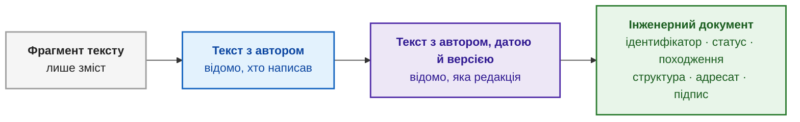
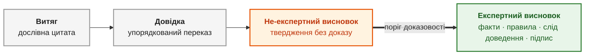
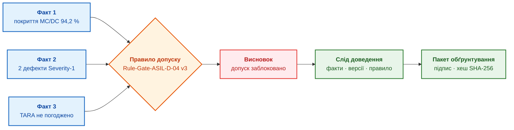
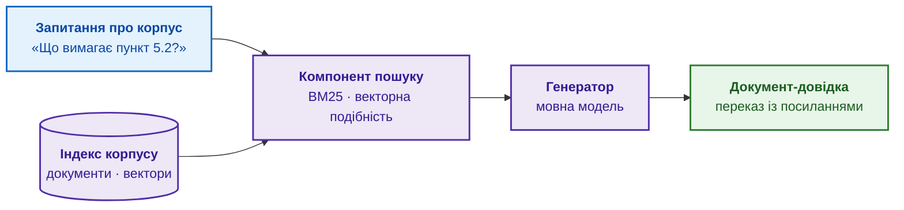
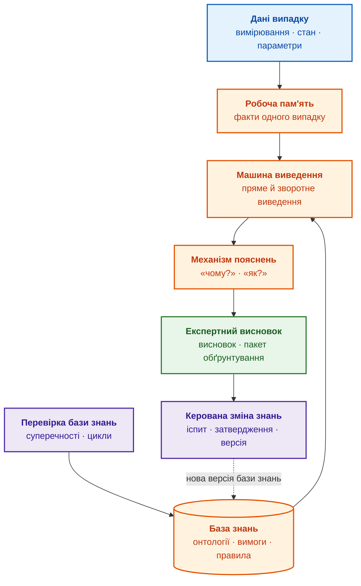
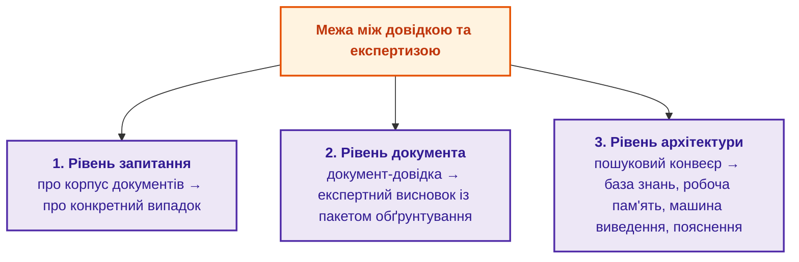

# Глава 3. Чим експертна система відрізняється від інформаційно-довідкової системи

> **Книга:** [Архітектура доказових експертних систем](README.md) · [Частина I: Концептуальний та епістемічний фундамент](part-01-foundations.md)  
> **Попередня глава:** [Глава 2. Філософія для інженера: що машина має право називати знанням](ch02-epistemology-of-machine-knowledge.md)  
> **Наступна глава:** [Глава 4. Еволюція експертних систем: від теореми Байєса до доказових рішень ШІ](ch04-evolution-from-bayes-to-evidence-ai.md)  
> **Зміст книги:** [README.md](README.md)  
> **Автор:** [Микола Федчик](about-the-author.md)  
> **Рівень:** базовий інженерний; приклад коду винесено в згорнутий блок  
> **Очікувані результати:** відрізнити запитання про корпус документів від запитання про конкретний випадок; пояснити, чим документ-довідка відрізняється від експертного висновку; назвати механізми, яких бракує пошуковій системі, базі даних, мовній моделі й генерації з пошуком, щоб стати експертною системою; пояснити, чому експертна система змінює знання лише через перевірену нову версію бази знань.

Перший крок до «експертної системи» команди інженерів часто роблять однаково: беруть теку з технічною документацією й додають до теки пошук або велику мовну модель (*large language model*, LLM), яка читає знайдені фрагменти й відповідає на запитання. Такий інструмент корисний, і в книзі він має власну назву: **інформаційно-довідкова система**, тобто інформаційна система, яка знаходить і подає вже записані відомості. Проблема виникає тоді, коли інформаційно-довідкову систему вважають експертною і довіряють відповіді інформаційно-довідкової системи там, де потрібен доведений висновок про конкретний випадок: про допуск прошивки до випробувань чи про режим стендового випробування.

Мета глави: показати, де саме проходить межа між інформаційно-довідковою та експертною системою, і перевірити межу на трьох рівнях: на рівні запитання, на рівні вихідного документа й на рівні архітектури. Мірилом слугує епістемічний контракт із [Глави 2](ch02-epistemology-of-machine-knowledge.md), тобто набір перевірок, які твердження мусить пройти, перш ніж експертна система застосує твердження. Для кожного класу інформаційних систем, від пошукової системи до мовної моделі, глава показує, яких перевірок контракту бракує. Досвід автора з системами електронної звітності, електронним підписом і процесами функціональної безпеки автомобільної електроніки дає тут одне мірило: відповідь інформаційної системи варта довіри лише тоді, коли відповідь має джерело, версію, відповідального власника й слід перевірки.

## Чотири класи інформаційних систем

Слова «довідкова», «консультаційна», «система підтримки рішень» і «експертна» часто вживають як синоніми. Через таку плутанину команда очікує від інструмента того, чого інструмент не вміє: від пошуку чекає висновку, а від чат-бота чекає відповідальності за висновок. Щоб порівнювати інструменти, спершу треба домовитися, за якою ознакою розрізняти класи інформаційних систем.

Книга розрізняє класи за призначенням і за тим, що інформаційна система повертає користувачеві. Інтерфейс і внутрішня технологія класу не визначають: той самий чат може стояти перед різними інформаційними системами, а нейронна мережа може працювати всередині кожної з них. Таблиця описує чотири класи.

| Клас інформаційної системи | Головне призначення | Що повертає | Межа класу |
|---|---|---|---|
| **Інформаційно-довідкова система** | знайти й подати відомості, уже записані в корпусі документів | цитату, посилання, переказ джерел | пошук не будує висновку про конкретний випадок |
| **Консультаційна (діалогова) система** | вести діалог, пояснити варіанти, зібрати дані для фахівця | пораду, уточнювальне запитання, сценарій дій | діалог сам не створює перевірного висновку |
| **Система підтримки рішень** (*decision support system*, DSS) | допомогти людині порівняти варіанти й оцінити наслідки | рейтинг варіантів, прогноз, рекомендацію | рекомендація часто спирається на статистику без логічного доведення |
| **Експертна система** | застосувати записані знання до фактів конкретного випадку | висновок або обґрунтовану відмову разом із фактами, правилами й доказами | висновок чинний лише в межах бази знань і наданих фактів |

Класи перетинаються. Консультаційна система описує спосіб взаємодії, тому діалог може стояти перед довідковою базою, аналітичною панеллю або експертною системою. Система підтримки рішень описує призначення, і експертна система, яка лише радить людині, є окремим, найсуворіше формалізованим видом системи підтримки рішень. Зворотне твердження неправильне: модель прогнозування попиту чи оптимізатор розкладу допомагають ухвалювати рішення, але не мають записаних правил предметної області й сліду доведення, тобто переліку фактів і правил, які привели до висновку. Тому модель прогнозування й оптимізатор експертними системами не є.

Приклад. Дві команди мають однаковий чат-інтерфейс. У першій команді чат передає запитання пошуковому індексу стандартів і повертає цитати, і за класом такий інструмент є інформаційно-довідковою системою. У другій команді чат передає запитання машині виведення, яка перевіряє факти випуску прошивки за правилами допуску й повертає висновок зі слідом доведення, і за класом такий інструмент є експертною системою. Користувач бачить те саме вікно, але отримує результати різної сили.

Клас інформаційної системи визначають не інтерфейс і не наявність нейронної мережі, а те, що інформаційна система повертає і як обґрунтовує повернене. Далі межу між довідкою та експертизою перевірено на трьох рівнях, і перший рівень стосується самого запитання.

## Рівень запитання: про корпус документів чи про конкретний випадок

Запитання користувачів схожі за формою, але належать до двох різних типів. Якщо типи не розрізняти, інформаційно-довідкова система береться відповідати на запитання, на яке відповісти не може, і відповідь при цьому звучить переконливо.

**Запитання про корпус** стосується того, що написано в документах: «Що корпоративний стандарт випробувань каже про максимальну температуру корпусу модуля?», «Де описано вимоги до ізоляції?». Корпусом називають сукупність документів, у яких шукають відповідь. Відповідь на запитання про корпус уже існує в документі, і завдання інформаційно-довідкової системи полягає в тому, щоб знайти потрібний фрагмент і подати фрагмент зрозуміло. Навіть якщо знайдені фрагменти гладко переказує нейронна мережа, суть роботи не змінюється: інформаційно-довідкова система виконує пошук і виклад.

**Запитання про випадок** стосується однієї конкретної ситуації: «Чи можна 15 вересня 2026 року випробувати прототип ревізії B на стенді R-4 за температури корпусу 95 °C?» Відповіді на таке запитання немає дослівно в жодному документі. У прикладі з [Глави 2](ch02-epistemology-of-machine-knowledge.md) корпоративний стандарт обмежує температуру корпусу 90 °C, а дозвіл на відхилення W-17 дозволяє 95 °C лише для ревізії B, лише на стенді R-4 і лише до 1 жовтня 2026 року. Відповідь з'являється тільки після того, як правила зі стандарту й дозволу застосовано до фактів випадку: ревізії, стенда, дати й вимірюваної величини. Застосування правил до фактів виконує машина виведення, тобто програмний механізм, який бере факти конкретної ситуації, знаходить придатні правила й отримує новий висновок ([Глава 1](ch01-introduction-to-expert-systems.md)).

> **Перевірка класу інформаційної системи.** Якщо на будь-яке запитання інформаційна система відповідає «ось що про це сказано в джерелах», перед вами інформаційно-довідкова система. Якщо інформаційна система відповідає «для випадку C операцію заборонено за правилом R на підставі фактів F1 і F2, взятих із документа S версії 4; ось слід доведення», перед вами експертна система.

Експертна система вміє відповідати й на запитання про корпус, бо пошук є одним із компонентів експертної системи. Зворотне неправильне: інформаційно-довідкова система не має механізму, який застосовує правила до фактів випадку, тому на запитання про випадок інформаційно-довідкова система може відповісти лише цитатою або здогадкою.

Корпус документів спільний для багатьох випадків і змінюється рідко, а кожен випадок має власні факти. Пошук піднімає з корпусу загальні правила, але перенести загальне правило на конкретний випадок пошук не може: таке перенесення виконує машина виведення. Наступний розділ з'ясовує, де в цьому поділі стоїть велика мовна модель, яку найчастіше плутають з експертною системою.

## Де місце великої мовної моделі

Загальнодоступні чат-сервіси на основі великих мовних моделей, такі як ChatGPT, Claude чи Gemini, одні користувачі називають довідковими, інші експертними системами. Обидві назви неточні, бо велика мовна модель сама по собі не є завершеною інформаційною системою. Велика мовна модель є компонентом, і клас результату визначає архітектура, у яку компонент вбудовано.

Велика мовна модель генерує текст на основі параметрів нейронної мережі, навченої на великому масиві текстів. Відомості, засвоєні під час навчання, розподілені по параметрах моделі, тому модель не може надійно вказати документ, з якого взято конкретне твердження. Звідси три обмеження:

- **Мовна модель не знає внутрішнього корпусу компанії.** На запитання «де це записано в нашій документації?» модель без доступу до документації дасть упевнений, але, можливо, вигаданий переказ. Схильність генеративних моделей створювати правдоподібний текст, не підтверджений джерелом, дослідники називають галюцинаціями (*hallucination*) [[1]](#src-1).
- **Мовна модель не зберігає фактів випадку як окремих перевірених записів.** Текст запиту модель бачить у контекстному вікні, тобто у фрагменті тексту, який модель обробляє за один раз. Джерела й версії окремих фактів у контекстному вікні не відстежуються.
- **Мовна модель не будує дискретного ланцюжка «факт, правило, висновок».** Текст моделі може мати вигляд вердикту, але під текстом немає сліду доведення, походження фактів і відповідальної особи.

Від архітектури, у яку вбудовано мовну модель, залежить клас результату:

1. Мовна модель разом із пошуком у контрольованому корпусі утворює **генерацію з пошуком** (*retrieval-augmented generation*, RAG). Патрік Льюїс і співавтори запропонували поєднати параметричну пам'ять мовної моделі з непараметричною пам'яттю, тобто з індексом документів, з якого перед генерацією добирають релевантні фрагменти [[2]](#src-2). Відповіді RAG мають посилання на документи компанії, але за класом RAG є сучасною інформаційно-довідковою системою.
2. Мовна модель разом із базою знань, машиною виведення, робочою пам'яттю випадку й механізмом пояснень утворює **нейро-символьну експертну систему** ([Глава 29](ch29-neuro-symbolic-architecture.md)). У нейро-символьній експертній системі мовна модель перекладає запитання людини мовою фактів і правил та переказує висновок зрозумілою мовою, але не вирішує, що є істинним.

Приклад. На запитання «чи можна випробувати прототип ревізії B за 95 °C?» мовна модель без доступу до документів відповість загальними міркуваннями про температурні режими. RAG знайде стандарт і дозвіл W-17 та перекаже обидва документи з посиланнями, але не перевірить, чи збігаються ревізія, стенд і дата із запиту з умовами дозволу. Нейро-символьна експертна система отримає від мовної моделі структуровані факти запиту, машина виведення перевірить умови W-17, а мовна модель перекаже результат разом зі слідом доведення.

Для інженерних досліджень і розробок є ще одне обмеження. Щоб отримати відповідь від хмарної мовної моделі, параметри дефекту чи конструкції доводиться передати зовнішньому постачальнику послуги, а політика безпеки конфіденційних розробок часто таке передавання забороняє. У таких умовах мовну модель і решту компонентів експертної системи розгортають локально ([Глава 18](ch18-execution-infrastructure.md)).

Велика мовна модель є сильним мовним компонентом, але не арбітром істини. Без пошуку мовна модель переказує засвоєне під час навчання, разом із пошуком мовна модель стає частиною інформаційно-довідкової системи, і лише разом із базою знань і машиною виведення мовна модель стає частиною експертної системи. Наступний рівень розрізнення стосується того, що інформаційна система видає на виході.

## Рівень документа: довідка і експертний висновок

На виході й інформаційно-довідкова, й експертна система видають текст, і обидва тексти можуть мати однаковий вигляд. Проте в аудиті, під час сертифікації чи в суперечці між командами лише один із двох текстів має силу доказу. Щоб побачити різницю, спершу треба з'ясувати, що перетворює текст на документ.

### Коли текст стає документом

Фрагмент тексту на екрані ще не є документом: невідомо, хто фрагмент написав, коли, для кого і чи фрагмент досі чинний. Такий фрагмент не можна ні перевірити, ні долучити до звіту.

Текст набуває статусу документа поступово, і кожен крок додає атрибут, без якого певна перевірка неможлива:

1. **Фрагмент тексту** містить лише зміст.
2. **Текст з автором** показує джерело, але без дати не можна встановити, чи текст актуальний.
3. **Текст з автором, датою й версією** дає змогу однозначно зіставити цитату з конкретною редакцією.
4. **Інженерний документ** має повний набір атрибутів:
   - стабільний ідентифікатор, наприклад інвентарний номер;
   - автора й відповідального власника, тобто людину, яка відповідає за зміст;
   - статус життєвого циклу: чернетка, на рецензії, затверджено або виведено з ужитку;
   - походження (*provenance*): з яких вхідних даних і якими діями документ отримано; модель PROV-O Консорціуму Всесвітньої павутини (World Wide Web Consortium, W3C) описує походження через сутності, дії та учасників [[3]](#src-3);
   - структуру: типізовані розділи й поля, які програма може прочитати;
   - призначення, адресата й рівень доступу;
   - підпис відповідальної особи.

Схема показує ту саму послідовність.



Сірий блок є фрагментом без контексту, синій і фіолетовий блоки додають автора, дату й версію, зелений блок є інженерним документом. Кожна стрілка додає атрибут, який робить можливою нову перевірку: автор дає змогу знайти відповідального, версія дає змогу перевірити актуальність, а статус і підпис дають змогу використати документ в аудиті.

Документообіг із юридичною силою давно розв'язує ту саму задачу. У Європейському Союзі кваліфікований електронний підпис (КЕП) має таку саму юридичну силу, як власноручний підпис, а перевірка кваліфікованого підпису включає перевірку сертифіката підписувача, чинного на момент підписання [[4]](#src-4). Сила документа походить не з гарного оформлення, а з перевірного зв'язку між змістом і відповідальною особою.

Для експертної системи з аналогії випливає вимога: висновок набуває ваги не від вдалого формулювання, а від зв'язку з підписаним і перевірним слідом доведення. Висновок без такого зв'язку залишається фрагментом тексту, хоч би як переконливо висновок звучав.

### Чим експертний висновок відрізняється від довідки

Обидва вихідні документи можуть посилатися на ті самі джерела, тому відмінність між документами треба шукати не в темі, а в природі документа.

**Документ-довідка** переказує наявні знання: витяг із державного стандарту, технічного опису транзистора (*datasheet*) чи інструкції з калібрування. Критерієм правильності довідки є точність переказу першоджерела, слідом є посилання на розділ або сторінку, нових тверджень довідка не містить. Укладач довідки відповідає за точність переказу, але не за наслідки застосування переказаної вимоги.

**Експертний висновок** є новим судженням про конкретний випадок: оцінкою безпеки електронного вузла, рішенням про готовність прошивки до випробувань, локалізацією дефекту. Критерієм правильності висновку є коректність виведення з перевірених фактів за затвердженими правилами. Слідом є ланцюжок «факт, правило, проміжний висновок, висновок» із версіями й походженням кожного елемента. Експертний висновок містить твердження, якого немає в жодному вихідному документі, явно називає область застосування й припущення та має підпис експерта або службовий підпис експертної системи, за яким стоїть відповідальна особа.

| Ознака | Документ-довідка | Експертний висновок |
|---|---|---|
| Природа документа | переказ відомого | нове судження про випадок |
| Критерій правильності | відповідність першоджерелу | коректне виведення з фактів за правилами |
| Нові твердження | немає | є: висновок про випадок |
| Слід | посилання на джерела | слід доведення з версіями й походженням |
| Межі застосування | задані джерелом | названі явно: область, припущення, статус |
| Використання | довідкова інформація | доказ в аудиті чи сертифікації |

Між дослівною цитатою й експертним висновком лежать чотири щаблі доказовості:

1. **Витяг:** дослівний фрагмент джерела, наприклад точна цитата пункту регламенту.
2. **Довідка:** упорядкований переказ фрагментів кількох джерел, наприклад зведена таблиця параметрів. Нового знання на цьому щаблі ще немає.
3. **Не-експертний висновок:** твердження про випадок без ланцюжка фактів і правил. Типовий приклад дає мовна модель без доступу до даних випадку: «схоже, цей компонент підійде для вашої схеми». Перевірити таке твердження неможливо.
4. **Експертний висновок:** судження про випадок зі слідом доведення, походженням кожної передумови й підписаним пакетом обґрунтування. **Пакетом обґрунтування** (*proof packet*) книга називає висновок разом із фактами, правилами, джерелами з версіями, межами застосування й відповідальною особою ([Глава 1](ch01-introduction-to-expert-systems.md)).

Схема показує щаблі й поріг між третім і четвертим щаблем.



Сірі блоки не створюють нового знання, помаранчевий блок створює нове твердження без доказу, зелений блок створює нове твердження з доказом. Подвійна стрілка позначає поріг доказовості: щоб перейти поріг, потрібне не краще формулювання, а факти, правила й слід доведення.

Межу між третім і четвертим щаблем визначає не якість тексту, а наявність фактів, правил і сліду доведення. Наступний підрозділ показує різницю між щаблями на прикладі рішення, від якого залежать подальші випробування.

### Приклад: рішення про допуск прошивки до випробувань

Команда розробляє прошивку, тобто вбудоване програмне забезпечення блока керування автомобіля, і має вирішити, чи допускати ревізію прошивки v2.4.1 до випробувань на треку. Таку контрольну точку в розробці називають рішенням про допуск (*release gate*). Вимоги функціональної безпеки, які реалізує прошивка, мають рівень ASIL D (*Automotive Safety Integrity Level*, рівень повноти безпеки автомобільних систем): стандарт ISO 26262 визначає чотири рівні, від A до D, і рівень D ставить найсуворіші вимоги. Три інформаційні системи відповідають на запитання «чи готова прошивка?» по-різному:

- **Інформаційно-довідкова система** знаходить контрольний перелік випуску, звіт тестувальників, нотатки з кібербезпеки й посилання на стандарт ISO 26262.
- **Чат-бот на основі мовної моделі** підсумовує: «Більшість тестів успішні, прошивка виглядає готовою до випробувань».
- **Експертна система** формує висновок:

> **Рішення:** допуск прошивки v2.4.1 до випробувань на треку заблоковано.  
> **Факти:**  
> 1. Покриття модифікованих умов і рішень (*modified condition/decision coverage*, MC/DC) модульними тестами становить 94,2 %, а внутрішнє правило випуску вимагає 100 % для модулів рівня ASIL D (звіт покриття від 25.09.2026).  
> 2. Звіт статичного аналізу для версії коду `a1f9c8` містить два відкриті дефекти найвищої критичності (*Severity-1*) (журнал аналізатора від 26.09.2026).  
> 3. Аналіз загроз і оцінку ризиків (*threat analysis and risk assessment*, TARA) не погоджено відповідальним за кібербезпеку.  
> **Правило:** `Rule-Gate-ASIL-D-04`, версія 3, забороняє допуск до випробувань, доки відкрита хоча б одна блокувальна умова.  
> **Пакет обґрунтування:** підписаний, хеш SHA-256 `8b4a7…`.

Експертний висновок зберігає джерело кожного правила, бо правила походять із різних документів. ISO 26262-6 для програмних модулів рівня ASIL D наполегливо рекомендує вимірювати саме покриття MC/DC [[5]](#src-5), але поріг 100 % встановлює не стандарт, а внутрішнє правило випуску команди. Аналіз TARA описує стандарт кібербезпеки автомобільних систем ISO/SAE 21434 [[6]](#src-6). Якби висновок посилався на стандарт там, де діє внутрішнє правило, аудитор знайшов би невідповідність уже в першому факті.

Схема показує, як три факти проходять через правило допуску до висновку й пакета обґрунтування.



Сині блоки є перевіреними фактами випадку, помаранчевий ромб є правилом із бази знань, червоний блок є висновком, зелені блоки є слідом доведення й підписаним пакетом обґрунтування. Кожен факт має власне джерело, тому висновок можна перевірити по частинах.

Такий висновок дає змогу вести аргументовану інженерну розмову. Розробник може оскаржити конкретний факт, наприклад довести, що один із дефектів є хибним спрацюванням аналізатора (*false positive*) і вже закритий документально. Власник правила може змінити правило через процедуру керування змінами. Із висновком «схоже, все гаразд» сперечатися неможливо, бо під таким висновком немає ні фактів, ні правила.

Як машина виведення отримує такий висновок, показує короткий приклад мовою Go. Правило в прикладі записано як дані, а не як код програми: умови й пороги можна змінити без зміни програми.

<details>
<summary>Приклад мовою Go: правило допуску як дані й слід спрацювання умов</summary>

Програма є повною й запускається командою `go run main.go`. Правило `Rule-Gate-ASIL-D-04` містить три блокувальні умови; функція `evaluate` перевіряє кожну умову на фактах випадку й друкує слід спрацювання умов. Прошивка v2.4.2 навмисно не має факту про погодження TARA.

```go
package main

import "fmt"

// Condition є однією умовою правила: назва факту, операція порівняння й поріг.
type Condition struct {
	Fact  string
	Op    string // "<", ">" або "=="
	Value float64
}

// Rule зберігається в базі знань як дані з ідентифікатором і версією.
type Rule struct {
	ID       string
	Version  int
	Blockers []Condition // кожна істинна умова блокує допуск
}

// holds повертає значення умови й ознаку того, що факт відомий.
func holds(c Condition, facts map[string]float64) (value, known bool) {
	v, ok := facts[c.Fact]
	if !ok {
		return false, false
	}
	switch c.Op {
	case "<":
		return v < c.Value, true
	case ">":
		return v > c.Value, true
	default:
		return v == c.Value, true
	}
}

// evaluate застосовує правило до фактів випадку й друкує слід спрацювання умов.
func evaluate(r Rule, facts map[string]float64) string {
	blocked, unknown := false, false
	for _, c := range r.Blockers {
		value, known := holds(c, facts)
		switch {
		case !known:
			unknown = true
			fmt.Printf("  %s: факт невідомий\n", c.Fact)
		case value:
			blocked = true
			fmt.Printf("  %s = %g %s %g: умова блокує допуск\n", c.Fact, facts[c.Fact], c.Op, c.Value)
		}
	}
	switch {
	case blocked:
		return "заблоковано"
	case unknown:
		return "потрібне уточнення"
	default:
		return "дозволено"
	}
}

func main() {
	rule := Rule{ID: "Rule-Gate-ASIL-D-04", Version: 3, Blockers: []Condition{
		{Fact: "mcdc_coverage_pct", Op: "<", Value: 100},
		{Fact: "open_sev1_defects", Op: ">", Value: 0},
		{Fact: "tara_approved", Op: "==", Value: 0},
	}}

	cases := []struct {
		firmware string
		facts    map[string]float64
	}{
		{"v2.4.1", map[string]float64{"mcdc_coverage_pct": 94.2, "open_sev1_defects": 2, "tara_approved": 0}},
		{"v2.4.2", map[string]float64{"mcdc_coverage_pct": 100, "open_sev1_defects": 0}},
	}
	for _, c := range cases {
		fmt.Printf("прошивка %s\n", c.firmware)
		fmt.Printf("  висновок: %s за правилом %s v%d\n", evaluate(rule, c.facts), rule.ID, rule.Version)
	}
}
```

Програма друкує:

```text
прошивка v2.4.1
  mcdc_coverage_pct = 94.2 < 100: умова блокує допуск
  open_sev1_defects = 2 > 0: умова блокує допуск
  tara_approved = 0 == 0: умова блокує допуск
  висновок: заблоковано за правилом Rule-Gate-ASIL-D-04 v3
прошивка v2.4.2
  tara_approved: факт невідомий
  висновок: потрібне уточнення за правилом Rule-Gate-ASIL-D-04 v3
```

Для прошивки v2.4.1 спрацювали всі три блокувальні умови, і кожен рядок сліду називає факт, значення й поріг. Для прошивки v2.4.2 покриття й дефекти в нормі, але факту про погодження TARA немає, тому машина виведення не вважає відсутній факт виконаною умовою й повертає «потрібне уточнення». Така поведінка відповідає тризначній логіці з [Глави 2](ch02-epistemology-of-machine-knowledge.md#чи-застосовне-твердження-до-запиту): значення «невідомо» не дорівнює ні «так», ні «ні». Приклад спрощено: справжня машина виведення обробляє тисячі правил, і висновок одного правила може ставати фактом для іншого правила ([Глава 6](ch06-applied-mathematics-for-expert-systems.md), [Глава 16](ch16-expert-systems-architecture.md)).

</details>

Приклад показує різницю трьох результатів. Довідка дає матеріали для рішення, чат-бот дає враження про рішення, а експертна система дає рішення, яке можна перевірити, оскаржити й відтворити.

На рівні документа межа проходить через слід доведення: без сліду доведення навіть правильний за змістом висновок лишається не-експертним. Щоб інформаційна система могла будувати слід доведення, архітектура інформаційної системи потребує компонентів, яких немає в пошуковому конвеєрі.

## Рівень архітектури: пошуковий конвеєр і машина виведення

Різниця між довідкою й експертизою є структурною і визначає склад компонентів інформаційної системи. Щоб побачити склад компонентів, порівняймо дві архітектури: генерацію з пошуком і експертну систему.

### Як влаштована генерація з пошуком

Генерація з пошуком (RAG) є лінійним конвеєром із трьох компонентів:

1. **Індекс** зберігає документи корпусу в повнотекстовому або векторному вигляді. Векторне представлення (*embedding*) перетворює фрагмент тексту на числовий вектор так, щоб близькі за змістом фрагменти мали близькі вектори.
2. **Компонент пошуку** (*retriever*) добирає найрелевантніші фрагменти (*chunks*) за функцією ранжування BM25, яка оцінює документ за частотою слів запиту в документі, рідкістю слів у корпусі й довжиною документа [[7]](#src-7), або за косинусною подібністю векторних представлень. Часто обидва способи поєднують, і такий пошук називають гібридним.
3. **Генератор**, тобто мовна модель, переказує знайдені фрагменти зрозумілою мовою.

Схема показує шлях запитання через конвеєр.



Синій блок є запитанням про корпус, фіолетові блоки є компонентами конвеєра, зелений блок є документом-довідкою. Стрілки йдуть в одному напрямку: базовий конвеєр не зберігає фактів випадку, не застосовує правил і не перевіряє суперечностей між знайденими фрагментами.

Для запитань про корпус такий конвеєр добре підходить і коштує недорого. Для запитань про випадок конвеєру бракує місця, де зберігаються факти випадку, і механізму, який застосовує правила до фактів.

### Як влаштована експертна система

Експертна система містить пошук і мовну модель як допоміжні компоненти, але основу експертної системи утворюють інші компоненти. Схема показує, як дані випадку проходять крізь ядро експертної системи до висновку.



Синій блок є даними випадку, помаранчеві блоки утворюють ядро експертної системи, зелений блок є висновком, фіолетові блоки відповідають за перевірку й зміну знань. Пунктирна стрілка показує, що досвід із висновків повертається до бази знань не напряму, а через перевірку й затвердження нової версії бази знань.

Ядро експертної системи утворюють компоненти, яких немає в базовому конвеєрі RAG:

- **База знань** (*knowledge base*) зберігає онтології, вимоги, обмеження й правила як структуровані дані, окремо від тексту документів ([Глава 7](ch07-knowledge-base-typology.md)).
- **Робоча пам'ять** (*working memory*) зберігає факти одного випадку окремо від фактів інших випадків, тому факти прошивки v2.4.1 не змішуються з фактами прошивки v2.4.2.
- **Машина виведення** (*inference engine*) застосовує правила до фактів детермінованим алгоритмом: той самий набір фактів і правил дає той самий висновок. Пряме виведення (*forward chaining*) рухається від фактів до висновків, зворотне виведення (*backward chaining*) рухається від гіпотези до фактів, які гіпотезу підтверджують. Для швидкого зіставлення тисяч правил із фактами Чарльз Форджі запропонував алгоритм Rete [[8]](#src-8); як працює алгоритм Rete, пояснює [Глава 6](ch06-applied-mathematics-for-expert-systems.md).
- **Механізм пояснень** (*explanation engine*) відповідає на запитання «чому висновок саме такий?» і «як висновок отримано?», показуючи слід доведення ([Глава 20](ch20-explanation-engine.md)).
- **Перевірка бази знань** шукає суперечливі правила, цикли й недосяжні умови до того, як правило потрапить у роботу ([Глава 23](ch23-knowledge-base-verification.md)).
- **Керована зміна знань** перетворює досвід експлуатації на нову перевірену версію бази знань (підрозділ [«Навчання лише через перевірену нову версію бази знань»](#навчання-лише-через-перевірену-нову-версію-бази-знань) нижче).

Якщо з експертної системи прибрати машину виведення, робочу пам'ять і механізм пояснень, експертна система перетвориться на інформаційно-довідкову систему: пошук і мовна модель залишаться, але висновку про випадок уже не буде. Архітектурна різниця пояснює, чому одні класи інформаційних систем проходять перевірки епістемічного контракту, а інші ні. Наступний розділ зводить порівняння в одну таблицю.

## Чого бракує кожному класу: порівняння за епістемічним контрактом

Порівнювати інформаційні системи за враженням від відповіді ненадійно: гладка відповідь мовної моделі справляє сильніше враження, ніж сухий висновок експертної системи. [Глава 2](ch02-epistemology-of-machine-knowledge.md) сформулювала епістемічний контракт: сім перевірок, які твердження мусить пройти, перш ніж експертна система застосує твердження, і чотири допустимі результати відповіді: висновок із доказом, уточнювальне запитання, передачу людині й обґрунтовану відмову. Контракт дає змогу порівнювати інформаційні системи за конкретними механізмами.

Таблиця порівнює шість класів: пошукову систему, базу даних під керуванням системи керування базами даних (СКБД), велику мовну модель, генерацію з пошуком, систему підтримки рішень і експертну систему. Позначка ✓ означає, що механізм є і працює явно, ~ означає, що механізм є частково або неявно, ✗ означає, що механізму немає.

| Перевірка або властивість | Пошукова система | База даних (СКБД) | Велика мовна модель | Генерація з пошуком (RAG) | Підтримка рішень (DSS) | Експертна система |
|---|---|---|---|---|---|---|
| Головне призначення | знайти документ | зберегти й видати записи | згенерувати текст | знайти й переказати фрагменти | допомогти обрати варіант | вивести висновок про випадок |
| Підстава й походження (епістемологія) | ~ посилання на документ | ~ журнал змін записів | ✗ | ~ посилання на фрагменти | ~ вхідні дані розрахунку | ✓ доказ і походження кожної передумови |
| Об'єкт, величина й версія (онтологія) | ✗ збіг слів | ✓ ключі й схема даних | ✗ | ~ схожість векторів | ~ фактори моделі | ✓ ідентифікатори, величини, версії |
| Спосіб виведення й слід доведення (логіка) | ✗ | ~ відтворюваний запит | ✗ | ✗ | ~ модель розрахунку | ✓ правила й слід доведення |
| Намір і модальність запиту (філософія мови) | ✗ | ~ запит формалізує користувач | ~ неявно | ~ неявно | ~ задано формою введення | ✓ визначено або уточнено |
| Контекст цитати (герменевтика) | ~ сторінка документа | ✗ | ✗ | ~ сусідні фрагменти | ✗ | ✓ вікно доказів |
| Спосіб перевірки й невизначеність (філософія науки) | ✗ | ✗ | ✗ | ✗ | ~ точність моделі | ✓ метод, невизначеність, статус |
| Повноваження й доступ (соціальна епістемологія) | ~ права на документи | ✓ права на записи | ✗ | ~ фільтр доступу до фрагментів | ~ ролі користувачів | ✓ ролі, мітки доступу, погодження |
| Уточнення й типізована відмова | ✗ | ✗ порожній результат | ~ відмова без типу причини | ~ відмова без типу причини | ~ залежить від реалізації | ✓ чотири результати відповіді |
| Робоча пам'ять випадку | ✗ | ~ записи сеансу | ~ контекстне вікно | ~ контекстне вікно | ~ змінні сеансу | ✓ факти випадку окремо |
| Зміна знань | переіндексація | зміна записів | донавчання | переіндексація | переналаштування моделі | ✓ нова версія після регресійних тестів |
| Вихідний артефакт | список документів | набір записів | текст | документ-довідка | звіт або прогноз | експертний висновок із пакетом обґрунтування |

Таблицю зручно читати по рядках. Жоден клас, крім експертної системи, не має позначки ✓ у рядку «спосіб виведення й слід доведення», і саме цей рядок відділяє висновок від переказу. База даних випереджає мовну модель за онтологією й доступом, бо схема даних і права на записи задані явно, але звичайна реляційна база даних повертає записи, які відповідають запиту, і не застосовує правил предметної області, якщо правила не запрограмовано окремо. Генерація з пошуком покращує мовну модель посиланнями на джерела, проте посилання на фрагмент не перевіряє, чи фрагмент застосовний до випадку.

Експертна система відрізняється не кращою генерацією тексту, а іншим набором механізмів: явними правилами, слідом доведення, походженням кожної передумови й типізованими результатами відповіді. Інші класи інформаційних систем корисні як компоненти експертної системи, але перелічених механізмів не замінюють. Порівняння описує експертну систему в момент випуску; наступний розділ розглядає, що відбувається з експертною системою під час експлуатації.

## Експертна система в експлуатації: навчання, впевненість і дії

Після випуску експертна система працює місяцями й роками. За цей час змінюються стандарти й компоненти, з'являються нові помилки й нові випадки, а частину рішень хочеться автоматизувати. Кожна з трьох змін може зруйнувати довіру до експертної системи, якщо зміну не контролювати. Три підрозділи коротко описують правила експлуатації й посилаються на глави, де теми розкрито детально.

### Навчання лише через перевірену нову версію бази знань

Застарівають нормативні документи, оновлюються версії компонентів, у базі знань знаходять помилки. Експертна система, яку не оновлюють, поступово стає неправильною. Але експертна система, яка змінює власні правила після кожного сеансу без контролю, стає невідтворюваною: той самий запит сьогодні й завтра отримує різні відповіді, і ніхто не може пояснити причину. У критичних галузях така неконтрольована зміна закріплює випадкові помилки.

Тому експертна система навчається лише через керовану зміну знань. Сигнал з експлуатації, наприклад інцидент чи нова редакція стандарту, породжує кандидата на зміну: нове правило, новий поріг або нову версію моделі. Кандидат проходить перевірку походження, розгляд експертом та іспит на еталонному наборі випадків (*golden set*), тобто на зафіксованому наборі минулих випадків із відомими правильними висновками. Лише після іспиту й затвердження з'являється нова версія бази знань, а попередня версія залишається доступною для відкату. Якщо кандидат містить модель машинного навчання, до кандидата додають картку моделі (*model card*): документ про призначення моделі, умови оцінювання й відомі обмеження, який запропонували Маргарет Мітчелл і співавтори [[9]](#src-9).

Приклад. Нова редакція корпоративного стандарту знижує межу температури корпусу з 90 °C до 88 °C. Інженер знань, тобто фахівець, який переносить знання експертів і документів до бази знань, готує зміну правила. Іспит на 120 минулих випадках показує, що висновок змінився у трьох випадках: випробування за 89 °C раніше дозволялися, а тепер забороняються. Рецензент підтверджує, що зміна висновку очікувана й відповідає новій редакції стандарту, і затверджує нову версію бази знань. Якби іспит показав зміну висновку у випадку, якого нова редакція не стосується, кандидата відхилили б із записаною причиною.

Матеріалом для змін слугують не випадкові тексти з інтернету, а інженерні артефакти: зміни стандартів і вимог, результати стендових і кліматичних випробувань, дані виробничого контролю, звіти про аналіз першопричин дефектів (*root cause analysis*, RCA) і затверджені рішення провідних інженерів ([Глава 8](ch08-engineering-artifacts-as-data.md)). Повний життєвий цикл зміни знань, склад еталонних наборів і критерії допуску змін описує [Глава 25](ch25-how-expert-systems-learn.md), навчання без забування перевірених випадків розглядає [Глава 26](ch26-continual-learning.md).

Експертна система навчається, але кожна зміна знань стає новою версією бази знань з іспитом, рецензентом і можливістю відкату. Відтворюваність зберігається: кожну відповідь можна пов'язати з версією бази знань, на якій відповідь отримано.

### Чи можна довіряти числовій впевненості

Частина висновків експертної системи супроводжується числом, наприклад «ймовірність дефекту 90 %». Таке число корисне лише тоді, коли відповідає дійсності: зі 100 висновків із позначкою 90 % правильними мають виявитися приблизно 90. Відповідність заявленої впевненості фактичній частці правильних висновків називають **калібруванням** (*calibration*).

Спершу треба з'ясувати, що саме означає число. Висновок правила є детермінованим наслідком фактів і не має ймовірності, тому показувати висновок правила як «99 % істина» некоректно. Оцінка релевантності пошуку чи схожості прецедентів теж не є ймовірністю. Має сенс калібрувати лише ті компоненти, які справді видають ймовірність: класифікатори, ймовірнісні моделі, оцінки ризику.

Калібрування перевіряють на перевірених випадках, яких модель не бачила під час навчання. Висновки групують за заявленою впевненістю й у кожній групі порівнюють заявлену впевненість із часткою правильних висновків. Приклад: на 200 перевірених випадках класифікатор ризику дефекту 100 разів заявив упевненість близько 90 % і мав рацію 72 рази, а ще 100 разів заявив близько 60 % і мав рацію 58 разів. У першій групі розрив між заявленою й фактичною часткою становить 18 відсоткових пунктів, у другій групі 2 пункти. Кожна група містить половину випадків, тому середній розрив, зважений за розміром груп, дорівнює $0{,}5 \cdot 18 + 0{,}5 \cdot 2 = 10$ відсоткових пунктів. Таку зважену величину називають очікуваною похибкою калібрування (*expected calibration error*, ECE); показник запропонували Махді Пакдаман Наїні, Грегорі Купер і Мілош Гаускрехт [[10]](#src-10). Значення ECE дорівнює нулю, коли в кожній групі заявлена впевненість збігається з часткою правильних висновків, і що більше значення, то сильніше число впевненості вводить в оману. Чуань Го та співавтори показали, що сучасні глибокі нейронні мережі часто погано калібровані навіть тоді, коли мають високу точність [[11]](#src-11).

У прикладі класифікатор надто впевнений саме там, де впевненість важить найбільше: інженер, який довіряє позначці 90 %, очікує 10 помилок на 100 висновків, а отримує 28. Числову впевненість варто показувати інженерові лише після перевірки калібрування, а до перевірки краще показувати категоріальний статус: «підтверджено правилом», «гіпотеза», «даних недостатньо». Формулу ECE, діаграми надійності й методи перекалібрування розглядає [Глава 25](ch25-how-expert-systems-learn.md), математичні основи ймовірнісних оцінок пояснює [Глава 6](ch06-applied-mathematics-for-expert-systems.md).

### Від дорадчого висновку до автоматичної дії

Найчастіше експертна система працює в дорадчому режимі: експертна система обґрунтовує висновок, а людина затверджує рішення (*human-in-the-loop*). Проте частину дій вигідно доручити програмі: заблокувати розгортання коду, який не пройшов тестів безпеки, зупинити високовольтний стенд, коли температура виходить за допуск, розподілити інциденти в системі обліку дефектів. Постає запитання, чи змінюються вимоги до експертної системи, коли висновок сам запускає дію.

Правило книги таке: доручити програмі можна дію, але не доказовість. Що більше автономії має експертна система, то суворіші вимоги до цілісності сліду доведення, до аварійного вимикача (*kill switch*), який зупиняє автоматичні дії, і до названої відповідальної особи, яка відповідає за правило. Рамка керування ризиками штучного інтелекту NIST AI RMF так само радить організаціям визначати й документувати ролі та відповідальність людей, які наглядають за системами штучного інтелекту [[12]](#src-12).

Приклад. Аварійну зупинку високовольтного стенда зазвичай забезпечує апаратне блокування, яке працює незалежно від програм. Експертна система може ініціювати зупинку раніше, помітивши сукупність ознак перегріву, але апаратного захисту не замінює. Після автоматичної зупинки експертна система записує до журналу аудиту факти, правило й версію бази знань, а інженер переглядає рішення після події й за потреби змінює правило через керовану зміну знань.

Автономність є властивістю не експертної системи загалом, а кожної окремої дії, і рівень автономності кожної дії задають явно. П'ять рівнів автономності, від поради до повністю автоматичної дії, і захист людини від втоми від погоджень описує [Глава 21](ch21-from-recommendation-to-action.md).

Три правила експлуатації мають спільну основу: жодна зміна знань, жодне число впевненості й жодна автоматична дія не з'являються без перевірного сліду. Вимога перевірного сліду та сама, що відрізняє експертний висновок від довідки, лише застосована до експертної системи після випуску.

## Висновки
Глава почалася з поширеного рішення: взяти теку з документацією, додати пошук або мовну модель і назвати результат експертною системою. Результат такого рішення корисний, але є інформаційно-довідковою системою. Межа між інформаційно-довідковою та експертною системою проходить на трьох рівнях, і схема підсумовує всі три рівні.



Помаранчевий блок є межею, фіолетові блоки є трьома рівнями розрізнення. На кожному рівні ліворуч від стрілки стоїть довідка, праворуч експертиза.

Глава показала:

- на рівні запитання довідка відповідає про корпус документів, а експертиза про конкретний випадок, і перенесення загального правила на випадок виконує машина виведення;
- на рівні документа довідку звіряють із джерелом, а експертний висновок перевіряють повторним виведенням за слідом доведення й пакетом обґрунтування;
- на рівні архітектури експертна система має базу знань, робочу пам'ять, машину виведення й механізм пояснень, яких немає в пошуковому конвеєрі;
- за епістемічним контрактом жоден інший клас інформаційних систем не має явного сліду доведення й типізованих результатів відповіді;
- після випуску експертна система змінює знання лише новими перевіреними версіями бази знань, показує числову впевненість лише після перевірки калібрування й доручає програмі дії, але не доказовість.

Межі висновку глави теж треба назвати. Експертна система дорожча у створенні: правила потрібно формалізувати, а кожне правило потребує власника й тестів. Для запитань про корпус документів інформаційно-довідкова система є правильним і дешевшим вибором. Експертна система виправдана там, де потрібен висновок про випадок, за який хтось відповідає: допуск до випробувань, оцінка безпеки, рішення про випуск.

Експертні системи не з'явилися одразу в сучасному вигляді. Наступна [Глава 4](ch04-evolution-from-bayes-to-evidence-ai.md) простежує, як методи ухвалення рішень пройшли шлях від теореми Байєса й перших продукційних систем до сучасних доказових рішень штучного інтелекту.

## Запитання до читачів
1. Чи траплялося у вашій практиці, що переказ документів від чат-бота прийняли за перевірений експертний висновок? До якої помилки призвела така підміна?
2. Які рішення у вашому процесі розробки вже ухвалює програма без людини, і чи можна для кожного такого рішення відновити факти, правило й версію знань?
3. Як ваша команда перевіряє оновлення бази знань чи правил, щоб не допустити суперечливих або застарілих вимог?
4. Чи перевіряли ви калібрування числової впевненості моделей у ваших внутрішніх інструментах?

## Словник

| Український термін | Англійський відповідник | Коротке пояснення |
|---|---|---|
| Інформаційно-довідкова система | *information retrieval system*, *reference system* | Інформаційна система, яка знаходить і подає відомості, уже записані в корпусі документів |
| Консультаційна (діалогова) система | *consultation system*, *dialogue system* | Інформаційна система, яка веде діалог, пояснює варіанти й збирає дані для фахівця |
| Система підтримки рішень | *decision support system* | Інформаційна система, яка допомагає людині порівняти варіанти й оцінити наслідки |
| Корпус документів | *document corpus* | Сукупність документів, у яких шукають відповідь |
| Запитання про корпус | *corpus question* | Запитання про те, що написано в документах; відповідь уже існує в документі |
| Запитання про випадок | *case question* | Запитання про конкретну ситуацію; відповідь виводять із правил і фактів випадку |
| Велика мовна модель | *large language model* | Нейронна мережа, навчена на великому масиві текстів, яка генерує текст |
| Галюцинація мовної моделі | *hallucination* | Правдоподібний текст, не підтверджений джерелом або даними |
| Контекстне вікно | *context window* | Фрагмент тексту, який мовна модель обробляє за один раз |
| Генерація з пошуком | *retrieval-augmented generation* | Поєднання пошуку в індексі документів із мовною моделлю, яка переказує знайдені фрагменти |
| Векторне представлення | *embedding* | Числовий вектор, у якому близькі за змістом фрагменти тексту мають близькі значення |
| Фрагмент | *chunk* | Частина документа, яку індексують і повертають як одиницю пошуку |
| Компонент пошуку | *retriever* | Компонент, який добирає найрелевантніші фрагменти для запитання |
| Походження | *provenance* | Відомості про те, з яких вхідних даних і якими діями отримано документ чи твердження |
| Кваліфікований електронний підпис | *qualified electronic signature* | Електронний підпис, який має таку саму юридичну силу, як власноручний підпис |
| Документ-довідка | *reference document* | Переказ наявних знань із посиланнями на джерела |
| Експертний висновок | *expert conclusion* | Нове судження про конкретний випадок, виведене з фактів за правилами |
| Пакет обґрунтування | *proof packet* | Висновок разом із фактами, правилами, джерелами з версіями, межами застосування й відповідальною особою |
| Слід доведення | *proof trace* | Перелік фактів, правил, версій і кроків, які привели до висновку |
| Рішення про допуск | *release gate* | Контрольна точка, на якій вирішують, чи передавати ревізію на наступний етап |
| Покриття модифікованих умов і рішень | *modified condition/decision coverage* | Метрика тестування: кожна умова в рішенні хоча б в одному тесті має незалежно змінити результат рішення |
| Хибне спрацювання | *false positive* | Повідомлення про дефект там, де дефекту немає |
| База знань | *knowledge base* | Сховище онтологій, вимог, обмежень і правил у структурованому вигляді |
| Робоча пам'ять | *working memory* | Сховище фактів одного випадку, окреме від фактів інших випадків |
| Машина виведення | *inference engine* | Механізм, який застосовує правила з бази знань до фактів конкретного випадку |
| Пряме виведення | *forward chaining* | Виведення від фактів до висновків |
| Зворотне виведення | *backward chaining* | Виведення від гіпотези до фактів, які гіпотезу підтверджують |
| Механізм пояснень | *explanation engine* | Компонент, який відповідає на запитання «чому?» і «як?» за слідом доведення |
| Керована зміна знань | *controlled knowledge update* | Зміна бази знань через іспит, рецензію, затвердження й нову версію |
| Еталонний набір випадків | *golden set* | Зафіксований набір минулих випадків із відомими правильними висновками |
| Картка моделі | *model card* | Документ про призначення моделі машинного навчання, умови оцінювання й обмеження |
| Інженер знань | *knowledge engineer* | Фахівець, який переносить знання експертів і документів до бази знань |
| Калібрування | *calibration* | Відповідність заявленої впевненості фактичній частці правильних висновків |
| Очікувана похибка калібрування | *expected calibration error* | Середній розрив між заявленою впевненістю й часткою правильних висновків, зважений за розміром груп |
| Людина затверджує рішення | *human-in-the-loop* | Режим, у якому експертна система обґрунтовує висновок, а рішення ухвалює людина |
| Аварійний вимикач | *kill switch* | Засіб, який негайно зупиняє автоматичні дії |

## Абревіатури

| Скорочення | Розшифрування | Значення |
|---|---|---|
| AI RMF | Artificial Intelligence Risk Management Framework | рамка керування ризиками штучного інтелекту NIST |
| ASIL | Automotive Safety Integrity Level | рівень повноти безпеки автомобільних систем |
| BM25 | Best Matching 25 | функція ранжування документів у пошуку |
| DSS | Decision Support System | система підтримки рішень |
| ECE | Expected Calibration Error | очікувана похибка калібрування |
| ISO | International Organization for Standardization | Міжнародна організація зі стандартизації |
| LLM | Large Language Model | велика мовна модель |
| MC/DC | Modified Condition/Decision Coverage | покриття модифікованих умов і рішень |
| NIST | National Institute of Standards and Technology | Національний інститут стандартів і технологій США |
| PROV-O | PROV Ontology | онтологія W3C для опису походження даних |
| RAG | Retrieval-Augmented Generation | генерація з пошуком |
| RCA | Root Cause Analysis | аналіз першопричин |
| SAE | SAE International, раніше Society of Automotive Engineers | міжнародна асоціація інженерів автомобільної галузі |
| SHA-256 | Secure Hash Algorithm, 256 bits | криптографічна хеш-функція з результатом 256 бітів |
| TARA | Threat Analysis and Risk Assessment | аналіз загроз і оцінка ризиків |
| W3C | World Wide Web Consortium | Консорціум Всесвітньої павутини |
| КЕП | кваліфікований електронний підпис | *qualified electronic signature* |
| СКБД | система керування базами даних | *database management system* |

## Джерела

1. <a id="src-1"></a>Ziwei Ji, Nayeon Lee, Rita Frieske та ін. [*Survey of Hallucination in Natural Language Generation*](https://doi.org/10.1145/3571730). *ACM Computing Surveys*, 55(12), 1–38, 2023.
2. <a id="src-2"></a>Patrick Lewis, Ethan Perez, Aleksandra Piktus та ін. [*Retrieval-Augmented Generation for Knowledge-Intensive NLP Tasks*](https://arxiv.org/abs/2005.11401). *Advances in Neural Information Processing Systems 33* (NeurIPS), 2020.
3. <a id="src-3"></a>Timothy Lebo, Satya Sahoo, Deborah McGuinness (ред.). [*PROV-O: The PROV Ontology*](https://www.w3.org/TR/prov-o/). W3C Recommendation, 2013.
4. <a id="src-4"></a>[*Regulation (EU) No 910/2014 on electronic identification and trust services for electronic transactions in the internal market (eIDAS)*](https://eur-lex.europa.eu/eli/reg/2014/910/oj). *Official Journal of the European Union*, L 257, 2014. Стаття 25 (юридична сила електронних підписів), стаття 32 (перевірка кваліфікованих електронних підписів).
5. <a id="src-5"></a>ISO. [*ISO 26262-6:2018. Road vehicles: Functional safety. Part 6: Product development at the software level*](https://www.iso.org/standard/68388.html). 2-ге видання, 2018.
6. <a id="src-6"></a>ISO, SAE International. [*ISO/SAE 21434:2021. Road vehicles: Cybersecurity engineering*](https://www.iso.org/standard/70918.html). 2021.
7. <a id="src-7"></a>Stephen Robertson, Hugo Zaragoza. [*The Probabilistic Relevance Framework: BM25 and Beyond*](https://doi.org/10.1561/1500000019). *Foundations and Trends in Information Retrieval*, 2009.
8. <a id="src-8"></a>Charles L. Forgy. [*Rete: A Fast Algorithm for the Many Pattern/Many Object Pattern Match Problem*](https://doi.org/10.1016/0004-3702(82)90020-0). *Artificial Intelligence*, 19(1), 17–37, 1982.
9. <a id="src-9"></a>Margaret Mitchell, Simone Wu, Andrew Zaldivar та ін. [*Model Cards for Model Reporting*](https://doi.org/10.1145/3287560.3287596). *Proceedings of the Conference on Fairness, Accountability, and Transparency*, 220–229, 2019.
10. <a id="src-10"></a>Mahdi Pakdaman Naeini, Gregory Cooper, Milos Hauskrecht. [*Obtaining Well Calibrated Probabilities Using Bayesian Binning*](https://doi.org/10.1609/aaai.v29i1.9602). *Proceedings of the AAAI Conference on Artificial Intelligence*, 29(1), 2015.
11. <a id="src-11"></a>Chuan Guo, Geoff Pleiss, Yu Sun, Kilian Q. Weinberger. [*On Calibration of Modern Neural Networks*](https://proceedings.mlr.press/v70/guo17a.html). *Proceedings of the 34th International Conference on Machine Learning*, PMLR 70, 1321–1330, 2017.
12. <a id="src-12"></a>Elham Tabassi. [*Artificial Intelligence Risk Management Framework (AI RMF 1.0)*](https://doi.org/10.6028/NIST.AI.100-1). NIST AI 100-1, 2023.

---

[← Глава 2. Філософія для інженера](ch02-epistemology-of-machine-knowledge.md) | [Зміст книги](README.md) | [Частина I](part-01-foundations.md) | [Глава 4. Еволюція експертних систем →](ch04-evolution-from-bayes-to-evidence-ai.md)
