# Глава 4. Еволюція експертних систем: від теореми Байєса до доказових рішень ШІ

> **Книга:** [Архітектура доказових експертних систем](README.md) · [Частина I: Концептуальний та епістемічний фундамент](part-01-foundations.md)  
> **Попередня глава:** [Глава 3. Чим експертна система відрізняється від інформаційно-довідкової системи](ch03-beyond-reference-information-systems.md)  
> **Наступна глава:** [Глава 5. Тріада довіри: експертна система, доказова рекомендація та корпоративна пам'ять](ch05-triad-of-trust-and-corporate-memory.md)  
> **Зміст книги:** [README.md](README.md)  
> **Автор:** [Микола Федчик](about-the-author.md)  
> **Рівень:** базовий інженерний; приклади коду винесено в згорнуті блоки, формальні записи позначено словом «Формально»  
> **Очікувані результати:** простежити шлях від логіки й теореми Байєса через перші експертні системи на правилах (DENDRAL, MYCIN, PROSPECTOR, XCON) до сучасних доказових архітектур; обирати математичний апарат за типом невизначеності (правила, ймовірності, нечітка логіка, графи); пояснити інженерні причини «зим штучного інтелекту» й вимоги до доказовості висновку.

Перед випуском нової версії програми критичний регресійний тест упав, а після повторного запуску пройшов. Чи можна випускати версію? Пошукова система знайде звіти, чат-бот сформулює переконливу пораду, але відповідальному інженерові потрібне інше: зрозуміти, наскільки падіння тесту змінило ризик, які правила випуску діють і яких перевірок досі бракує. Експертні системи розв'язували такі задачі за десятиліття до великих мовних моделей, і кожна відповідь залежала від типу невизначеності. Правило дає однозначний висновок, ймовірність оцінює ризик, нечітка належність описує розмиту межу, оцінка пошуку впорядковує джерела. Якщо змішати ці величини в одне число, інформаційна система створить видимість точності, але не дасть перевірного рішення.

Мета глави: простежити, як за шістдесят років склалися основні способи машинного міркування, і навчитися обирати спосіб міркування за типом невизначеності, а не за модною назвою технології. Для кожного методу глава дає одну ідею, один числовий приклад і межу застосування, а повний математичний апарат розглядає [Глава 6](ch06-applied-mathematics-for-expert-systems.md). Для першого читання досить розділів про правила, теорему Байєса й доказовість; розділи про мови LISP і PROLOG, теорію Демпстера–Шафера та пошук можна залишити на потім. Автор познайомився з темою на початку 1990-х із книжки Дж. Елті й М. Кумбса «Експертні системи: концепції та приклади» [[1]](#src-1) і відтоді застосовував ідеї експертних систем в інформаційній безпеці, керуванні розробкою та регульованій автомобільній інженерії. Тому експертна система розглядається тут не як музейна технологія, а як практичний спосіб зробити рішення доказовими й придатними до аудиту.

## Історія методу й інструкція до обчислення

Ця глава пояснює, яку проблему розв'язувала кожна історична хвиля: явні правила, невизначені спостереження, складність супроводу й перевірка підстав. Числові приклади потрібні для розрізнення результатів, не як другий повний курс математики. Якщо вже зрозуміло, чому правило, ймовірність і оцінка пошуку не взаємозамінні, техніку обчислення можна вивчати в [Главі 6](ch06-applied-mathematics-for-expert-systems.md), а тут зосередитися на історичних причинах і межах методів.

## Тип невизначеності визначає метод

Інженерні запитання відрізняються не темою, а видом потрібного результату. Інколи треба з'ясувати, чи випливає висновок із фактів, інколи оцінити, наскільки нове спостереження змінило ризик, інколи виміряти, наскільки об'єкт відповідає розмитому поняттю «достатньо готовий». Для кожного виду результату історія штучного інтелекту виробила окремий метод, і жоден метод не є універсальним. Спершу кілька термінів, потрібних уже в цьому розділі.

| Термін | Пояснення |
|---|---|
| Факт | відомість про конкретний випадок, яку експертна система приймає як вхідні дані |
| Правило | явний зв'язок виду «якщо виконано умови, то випливає висновок» |
| Виведення | застосування правил або математичної моделі до фактів |
| Гіпотеза | можливе пояснення, яке перевіряють, наприклад «реліз проблемний» |
| Невизначеність | стан, у якому наявних відомостей недостатньо для однозначного висновку |
| Свідчення (*evidence*) | нове спостереження, документ чи вимірювання, яке підтримує або послаблює гіпотезу |
| Ймовірність | число від 0 до 1, яке в межах визначеної моделі описує невизначеність події |
| Детерміноване обчислення | обчислення, яке для однакових вхідних даних і версії формули дає однаковий результат |

Таблиця методів показує, на яке запитання відповідає кожен метод і чого метод сам по собі не гарантує.

| Метод | На яке запитання відповідає | Чого сам не гарантує |
|---|---|---|
| Правила й логічне виведення | Чи виконано явну умову, що випливає з перевірених фактів? | повноти правил і правильності вхідних фактів |
| Байєсівська модель | Як новий сигнал змінює оцінку ризику за визначеною ймовірнісною моделлю? | правильності початкових ймовірностей і припущень про залежності |
| Нечітка логіка | Наскільки об'єкт належить до проєктно визначеного поняття на кшталт «достатньо готовий»? | що довільна частка чи оцінка вже є нечіткою належністю |
| Граф знань | Які артефакти, версії та зв'язки утворюють ланцюжок доказів? | рішення без додаткових правил |
| Пошук джерел | Які документи чи фрагменти варто показати людині або мовній моделі? | істинності відповіді й повноти джерел |
| Детерміноване обчислення | Який результат дає зафіксована формула для зафіксованих входів? | правильності самої формули, вхідних даних і меж застосування |

Схема показує, як тип запитання спрямовує вибір методу.

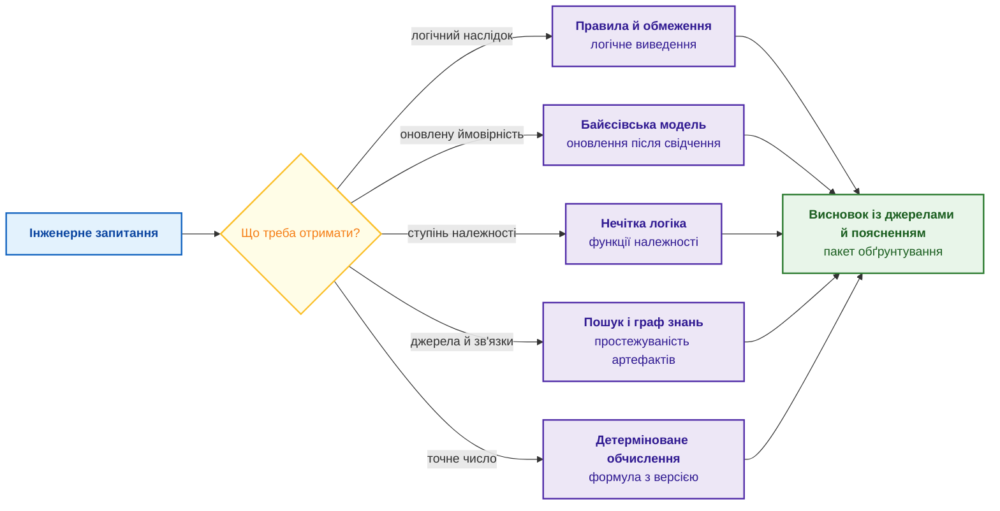

Синій блок є запитанням, жовтий ромб є вибором за типом потрібного результату, фіолетові блоки є методами, зелений блок є пакетом обґрунтування, тобто висновком разом із фактами, правилами, джерелами й межами застосування ([Глава 1](ch01-introduction-to-expert-systems.md)). Методи не конкурують: одна експертна система може використовувати всі п'ять методів, але кожен метод відповідає за свій тип результату.

У прикладі з тестом, який то падає, то проходить, методи розподіляються так: правило випуску каже, чи дозволено повторний запуск; байєсівська модель оцінює, наскільки падіння змінило ризик; граф знань показує, які вимоги перевіряє тест; детермінований розрахунок обчислює метрики покриття. Пошук знаходить звіти, але жодного висновку сам не робить.

Вибір методу починається із запитання «що саме треба отримати?», а не з назви технології. Методи з'являлися в певному порядку, і кожна нова хвиля розв'язувала проблему попередньої. Наступний розділ простежує порядок появи методів.

## Чотири хвилі: чому експертні системи злетіли, впали й повернулися

Історія штучного інтелекту (ШІ) не є лінійним поступом. Періоди надмірних сподівань і промислових бумів чергувалися з розчаруваннями, які називають «зимами ШІ» [[2]](#src-2). Причини зим були інженерними, тому сучасний проєкт може повторити давні помилки в новій обгортці. Поділ історії на чотири хвилі нижче є спрощенням для інженера, а межі хвиль приблизні.

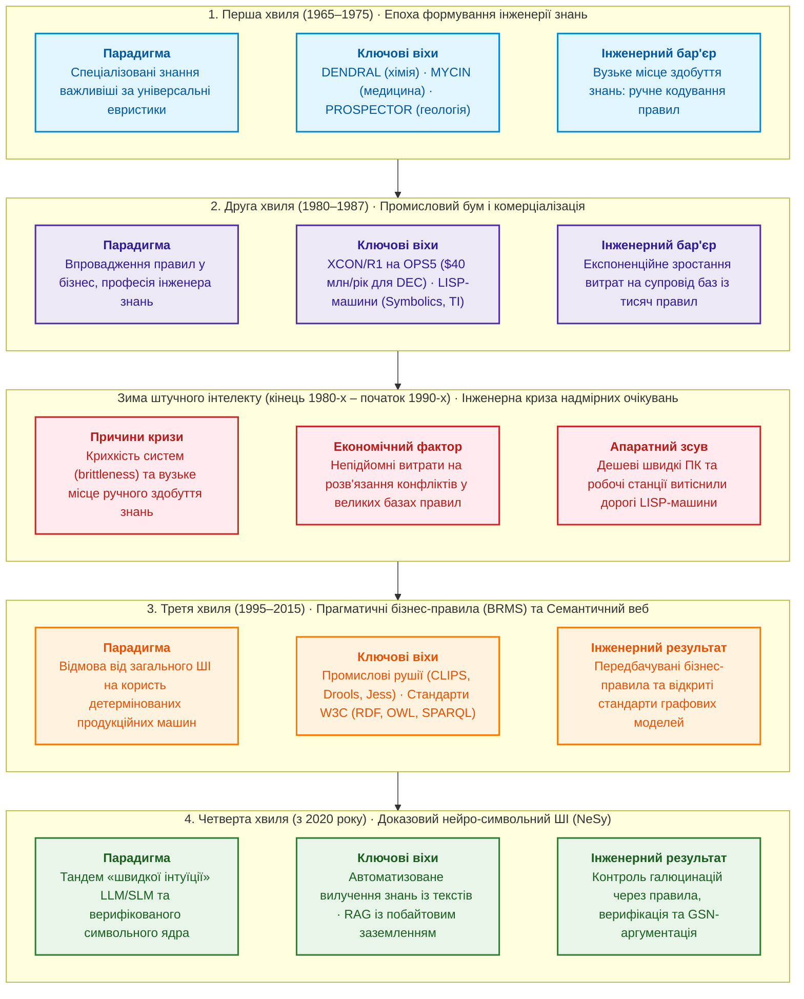

Синя, фіолетова, помаранчева й зелена хвилі є періодами зростання, червоний блок є зимою. Кожна наступна хвиля відповідала на проблему попередньої: промисловий бум виріс із перших успіхів, зима настала через ціну супроводу, третя хвиля відмовилася від претензій на загальний розум, четверта використовує мовні моделі там, де раніше бракувало ручної праці.

### Перша хвиля: знання важливіші за універсальний алгоритм

У 1950–1960-х роках дослідники сподівалися відтворити мислення кількома універсальними законами. Програма «Загальний розв'язувач задач» (*General Problem Solver*) Аллена Ньюелла й Герберта Саймона шукала розв'язок перебором станів, але захлиналася в комбінаторному вибуху, щойно задача виходила за межі головоломок [[2]](#src-2). Едвард Фейгенбаум зі Стенфордського університету сформулював протилежний принцип: сила інтелектуальної програми залежить передусім від кількості та якості знань про конкретну задачу, а не від універсальності алгоритму [[3]](#src-3). Цей принцип став основою інженерії знань (*knowledge engineering*). На принципі Фейгенбаума побудовано перші відомі експертні системи:

- **DENDRAL** (Стенфорд, з 1965 року; Едвард Фейгенбаум, Брюс Бьюкенен, Джошуа Ледерберг разом із лабораторією хіміка Карла Джерассі) пропонувала структурні формули органічних сполук за даними мас-спектрометрії. Автори називають DENDRAL першою експертною системою для формування наукових гіпотез [[4]](#src-4).
- **MYCIN** (Стенфорд, з 1972 року; Едвард Шортліфф) радив лікарям антибактеріальну терапію при бактеріємії та менінгіті й пояснював свої висновки відповідями на запитання «чому?» і «як?» [[5]](#src-5). У MYCIN з'явилися коефіцієнти впевненості, до яких глава повернеться нижче [[6]](#src-6).
- **PROSPECTOR** (SRI International, кінець 1970-х) оцінював перспективність родовищ корисних копалин за правилами геологів. 1982 року за геологічними картами гори Толман у штаті Вашингтон PROSPECTOR указав місце раніше невідомого промислового зруденіння молібдену [[7]](#src-7).

Перша хвиля показала, що експертна система сильна знаннями, а не алгоритмом. Знання доводилося переносити від експертів вручну, і саме ця праця згодом стала вузьким місцем.

### Друга хвиля: промисловий бум

У 1980-х експертні системи перейшли з лабораторій у промисловість. Компанія Digital Equipment Corporation (DEC) продавала міні-комп'ютери VAX у тисячах конфігурацій модулів, кабелів і шасі, і люди-комплектувальники помилялися. Експертна система R1, згодом перейменована на XCON, яку Джон Макдермотт побудував мовою продукційних правил сімейства OPS, автоматизувала конфігурування замовлень [[8]](#src-8). За оцінкою, яку наводять Стюарт Расселл і Пітер Норвіг, до 1986 року XCON заощаджувала DEC близько 40 млн доларів на рік [[2]](#src-2). Виникли компанії, що випускали спеціалізовані LISP-машини (Symbolics, Lisp Machines Inc., Texas Instruments), і нова професія інженера знань: фахівця, який опитує експертів і перетворює досвід експертів на правила.

Друга хвиля довела комерційну цінність правил, але база знань XCON зросла до тисяч правил, і вартість супроводу почала рости швидше за користь.

### Зима ШІ: чотири інженерні причини

Наприкінці 1980-х ринок експертних систем обвалився: багато компаній не виконали обіцянок і збанкрутували [[2]](#src-2). Причин було чотири, і всі чотири інженерні:

1. **Вузьке місце здобуття знань** (*knowledge acquisition bottleneck*). Експерти не могли чітко сформулювати власні неявні евристики, а ручний запис правил тривав роки [[9]](#src-9).
2. **Крихкість** (*brittleness*). Експертна система не знала меж своєї компетентності: випадок, якого не передбачили автори правил, отримував хибний або безглуздий висновок замість відмови [[9]](#src-9).
3. **Складний супровід.** Порядок спрацювання правил залежав від стратегії розв'язання конфліктів і від порядку появи фактів, тому наслідки нового правила в базі з тисяч правил було важко передбачити, а будувати й супроводжувати експертні системи для складних предметних областей виявилося дорого [[2]](#src-2).
4. **Дорога інфраструктура.** Спеціалізовані LISP-машини програли звичайним робочим станціям і персональним комп'ютерам, які швидко дешевшали й наздоганяли LISP-машини за швидкодією.

Кожна з чотирьох причин має сучасний відповідник. Здобуття знань із документів розглядає [Глава 10](ch10-knowledge-acquisition-systems.md), межі компетентності й право на відмову [Глава 2](ch02-epistemology-of-machine-knowledge.md), перевірку бази знань [Глава 23](ch23-knowledge-base-verification.md), доступну обчислювальну інфраструктуру [Глава 18](ch18-execution-infrastructure.md).

### Третя хвиля: рушії правил і семантичний веб

Після зими промисловість відмовилася від претензій на «загальний розум» і зосередилася на вузькій користі. Рушії бізнес-правил (*business rule engines*) CLIPS, Jess і Drools стали вбудованими бібліотеками для мов C і Java та зайняли ніші страхових розрахунків, банківського оцінювання ризиків і логістики. Консорціум Всесвітньої павутини (World Wide Web Consortium, W3C) стандартизував подання знань у вигляді графа: модель RDF описує твердження трійками «суб'єкт, предикат, об'єкт» [[10]](#src-10), мова OWL описує онтології, а мова запитів SPARQL дає змогу шукати в графі.

Третя хвиля зробила правила й графи знань звичайними інженерними компонентами, але не розв'язала проблеми здобуття знань: правила й онтології, як і раніше, писали люди.

### Четверта хвиля: мовні моделі разом із символьним виведенням

Великі мовні моделі (*large language models*, LLM) спершу хитнули маятник у бік чисто статистичного підходу. У регульованих галузях інженерні команди швидко натрапили на обмеження: вигадані твердження, різні відповіді на той самий запит, відсутність простежуваного зв'язку з джерелом і неможливість сертифікації ([Глава 3](ch03-beyond-reference-information-systems.md)). Сучасні доказові експертні системи поєднують два шари. Мовний шар, зокрема локальні мовні моделі, пришвидшує здобуття знань: знаходить у документах сутності, вимоги й зв'язки ([Глава 12](ch12-linguistic-analysis-and-local-models.md)). Символьний шар, тобто правила, графи знань і машина виведення, забезпечує перевірне виведення, відмову за браку доказів і матеріали для обґрунтування безпеки ([Глава 27](ch27-safety-case-gsn-synthesis.md), [Глава 29](ch29-neuro-symbolic-architecture.md)).

Історія повторює один урок: експертна система корисна настільки, наскільки знання експертної системи повні, перевірені й підтримувані. Мовні моделі полегшують здобуття знань, але не знімають потреби в явних правилах. З явних правил і варто почати огляд методів.

## Логіка й продукційні правила

Найпростішим для машини видом знання є явне правило. Правило відповідає на запитання, чи випливає висновок із фактів, і відповідь не є ймовірністю: за прийнятої логіки й істинних засновків висновок або випливає, або ні. Найвідоміше правило логіки називають правилом відокремлення (*modus ponens*):

```math
\frac{A\rightarrow B,\qquad A}{B}.
```

Позначення правила відокремлення:

- $A\rightarrow B$ є правилом «якщо $A$, то $B$»;
- $A$ є встановленим фактом;
- $B$ є висновком;
- горизонтальна риска відокремлює засновки над нею від висновку під нею.

Читається так: якщо правило пов'язує $A$ з $B$ і факт $A$ встановлено, машина виведення отримує висновок $B$. Результат має лише два значення: висновок або виведено, або ні. Інженерною мовою правило звучить так:

```text
Якщо зміна зачіпає вимогу безпеки, то потрібен аналіз впливу.
Зміна CR-17 зачіпає вимогу безпеки SR-42.
Отже, для CR-17 потрібен аналіз впливу.
```

Такий висновок не є «штучним інтелектом» у маркетинговому сенсі, але вже є машинним міркуванням над фактами й правилами. 1965 року Джон Алан Робінсон запропонував принцип резолюції, який дав змогу машині автоматично доводити твердження логіки першого порядку [[11]](#src-11). Ідея була амбітною: якщо знання записано формально, машина виводить нові твердження.

Реальні експерти, однак, мислять не повними теоремами, а правилами з винятками й словами «зазвичай» та «якщо немає інших обмежень». Тому в 1970–1980-х роках поширилися **продукційні правила**. Слово «продукційне» тут не стосується виробництва: продукційне правило є записом «якщо виконано умову, то зробити висновок або дію».

```text
ЯКЩО умова
ТО висновок або дія
```

Машина виведення застосовує продукційні правила двома способами, і обидва способи використовують досі.

**Пряме виведення** (*forward chaining*) рухається від фактів до висновків. Нехай на початку відомі факти $A$, $B$ і $C$, а база знань містить два правила:

```math
F_0=\{A,B,C\},
\qquad
R=\{A\land B\rightarrow D,\;D\land C\rightarrow E\}.
```

Початкові факти й правила позначено так:

- $F_0$ є початковою множиною фактів $A$, $B$ і $C$;
- $R$ є множиною продукційних правил;
- $A$, $B$, $C$, $D$ і $E$ позначають факти;
- $\land$ означає логічне «і», $\rightarrow$ означає «якщо засновок істинний, то висновок»;
- фігурні дужки задають множину її елементів.

У цьому прикладі перше правило додає факт $D$, а друге правило додає факт $E$:

```math
F_1=F_0\cup\{D\},
\qquad
F_2=F_1\cup\{E\}.
```

- $F_0$ є початковою множиною фактів;
- $F_1$ є множиною після додавання факту $D$, а $F_2$ є множиною після додавання факту $E$;
- $D$ і $E$ є новими фактами, отриманими зі спрацювання правил;
- $\cup$ означає об'єднання множин, а фігурні дужки задають множину доданого факту.

Кожен крок лише додає факти, тому виведення зупиняється, коли жодне правило вже не додає нового факту. Пряме виведення зручне для перевірок: які правила порушено, які прогалини є в проєкті.

**Зворотне виведення** (*backward chaining*) рухається від цілі до фактів:

```math
E
\Longleftarrow D\land C
\Longleftarrow (A\land B)\land C.
```

Символи показують шлях від цілі до її умов:

- $E$ є початковою ціллю, яку треба довести;
- $D$ і $C$ є підцілями, потрібними для доведення $E$;
- $A$ і $B$ є фактами, потрібними для доведення $D$;
- $\Longleftarrow$ означає «можна обґрунтувати через» і читається справа наліво як розкладання цілі;
- $\land$ означає, що потрібні всі сполучені факти, а дужки групують умови правила.

Отже, ціль $E$ розкладається на підцілі $D$ і $C$, а підціль $D$ на факти $A$ і $B$. Після розкладання машина виведення перевіряє, чи підтверджено факти $A$, $B$ і $C$. Зворотне виведення зручне для консультації: що треба зробити, щоб досягти цілі. Якщо ціллю є «підготувати пакет випуску», машина виведення йде назад до потрібних тестів, закритих дефектів, погоджених ризиків і підтверджених вимог, і кожна відсутня умова стає конкретною дією, а не текстовою порадою.

Правила дають однозначний і відтворюваний висновок, але лише за повних і правильних фактів. Там, де факти неповні або сигнали суперечливі, потрібні ймовірнісні методи. Перед ними варто коротко глянути на дві мови, у яких правила вперше стали робочим інструментом.

### Дві культури раннього ШІ: LISP і PROLOG

Цей підрозділ необов'язковий. Мови LISP і PROLOG цікаві не як історія програмування, а як дві ідеї, що живуть у сучасних експертних системах.

LISP був природним середовищем для символьного ШІ: списки, дерева, рекурсія й правила як дані, які програма може змінювати й виконувати. Мова правил CLIPS, яку в NASA почали розробляти 1985 року, успадкувала від LISP синтаксис із дужками. Правило в CLIPS є окремим артефактом: правило можна прочитати, протестувати, змінити й зберегти у версіях, а не ховати в довгій інструкції до мовної моделі.

PROLOG пішов іншим шляхом, шляхом логічного програмування: програміст описує факти й правила, а PROLOG сам шукає доведення. Пошук доведення в PROLOG є зворотним виведенням: запит стає ціллю, і PROLOG розкладає ціль на підцілі, доки не дійде до фактів.

<details>
<summary>Приклади мовами CLIPS і PROLOG: правило випуску й прогалини в доказах</summary>

Правило мовою CLIPS блокує випуск, якщо на випуск впливає відкритий критичний дефект. Конструкція `deffacts` задає факти прикладу.

```clips
(defrule vypusk-zablokovano-krytychnym-defektom
   (vypusk ?r)
   (defekt ?d)
   (vplyvaye ?d ?r)
   (seryoznist ?d krytychna)
   (stan ?d vidkrytyy)
   =>
   (assert (status-vypusku ?r zablokovano)))

(deffacts pryklad
   (vypusk v2.4.1)
   (defekt D-4)
   (vplyvaye D-4 v2.4.1)
   (seryoznist D-4 krytychna)
   (stan D-4 vidkrytyy))
```

Після команд `(reset)` і `(run)` правило спрацьовує й додає факт `(status-vypusku v2.4.1 zablokovano)`. Змінні `?r` і `?d` зв'язуються з конкретними випуском і дефектом, тож те саме правило працює для будь-якого випуску.

Мовою PROLOG правило з початку розділу записують так:

```prolog
vymoga_bezpeky(sr_42).
zachipaye(cr_17, sr_42).

potrebuye_analizu_vplyvu(Zmina) :-
    zachipaye(Zmina, Vymoga),
    vymoga_bezpeky(Vymoga).
```

Запит `?- potrebuye_analizu_vplyvu(cr_17).` отримує відповідь «так», а запит `?- potrebuye_analizu_vplyvu(X).` знаходить усі зміни, для яких потрібен аналіз впливу, у прикладі `X = cr_17`. Такий запит уже є не пошуком у документах, а міркуванням над базою фактів.

Той самий підхід знаходить прогалини в доказах. Програма нижче є не реалізацією стандарту функціональної безпеки, а прикладом локальної політики проєкту: політика шукає технічні вимоги безпеки без зв'язку з вищою вимогою, без перевірки або з проваленим тестом.

```prolog
technical_safety_requirement(tsr_enter_degraded_mode).
technical_safety_requirement(tsr_report_diagnostic_fault).

derived_from(tsr_enter_degraded_mode, fsr_detect_sensor_fault).
derived_from(tsr_report_diagnostic_fault, fsr_detect_sensor_fault).

verified_by(tsr_enter_degraded_mode, test_tsr_014).
test_passed(test_tsr_014).

includes(release_2026_05, tsr_enter_degraded_mode).
includes(release_2026_05, tsr_report_diagnostic_fault).

missing_safety_evidence(Req, safety_trace) :-
    technical_safety_requirement(Req),
    \+ derived_from(Req, _).
missing_safety_evidence(Req, verification) :-
    technical_safety_requirement(Req),
    \+ verified_by(Req, _).
missing_safety_evidence(Req, failed_test) :-
    verified_by(Req, Test),
    \+ test_passed(Test).

release_requires_safety_review(Release) :-
    includes(Release, Req),
    missing_safety_evidence(Req, _).
```

Запит `?- missing_safety_evidence(tsr_report_diagnostic_fault, Reason).` повертає `Reason = verification`: вимога має зв'язок із вищою вимогою, але не має перевірки. Запит `?- release_requires_safety_review(release_2026_05).` отримує відповідь «так», бо випуск містить вимогу без перевірки. Оператор `\+` означає «не вдалося довести», тобто PROLOG вважає відсутній факт хибним; таке припущення замкненого світу допустиме лише для повного переліку фактів ([Глава 2](ch02-epistemology-of-machine-knowledge.md)). Так само перевіряють ланцюжок «загроза, рішення щодо ризику, вимога, перевірка» для вимог кібербезпеки автомобільних систем за ISO/SAE 21434 [[12]](#src-12).

</details>

LISP показав, як будувати гнучкі символьні рушії правил, а PROLOG показав, як формально ставити запитання до знань: що доводиться, чого бракує, які факти потрібні. Сучасні експертні системи рідко пишуть цими мовами, але архітектура «база знань, правила, виведення, пояснення» залишилася.

## Теорема Байєса: як оновлювати впевненість після свідчення

Повернімося до тесту, який упав. Правило не скаже, наскільки падіння змінило ризик, бо тест падає й через власну нестабільність. Для таких запитань потрібна ймовірність, а найстаріший інструмент оновлення ймовірності є теоремою Байєса, опублікованою посмертно 1763 року [[13]](#src-13). У цьому розділі слово «свідчення» означає спостереження (*evidence*), а не математичне доведення.

Позначення для оновлення ймовірності:

```math
\Pr(H\mid E)=\frac{\Pr(E\mid H)\,\Pr(H)}{\Pr(E)},\qquad \Pr(E)>0.
```

- $H$ є гіпотезою, наприклад «реліз проблемний»;
- $E$ є новим свідченням, наприклад «критичний регресійний тест упав»;
- $\Pr(H)$ є початковою ймовірністю гіпотези до свідчення $E$;
- $\Pr(E\mid H)$ є правдоподібністю свідчення за умови істинності $H$;
- $\Pr(E)$ є загальною ймовірністю побачити свідчення $E$;
- $\Pr(H\mid E)$ є оновленою ймовірністю гіпотези після свідчення $E$;
- риска $\mid$ означає «за умови», а не ділення; кожна ймовірність лежить у $[0,1]$, і знаменник має бути більшим за нуль.

Читається так: оновлена ймовірність гіпотези дорівнює правдоподібності свідчення за умови гіпотези, помноженій на початкову ймовірність і поділеній на загальну ймовірність свідчення. У загальному випадку $\Pr(E\mid H)\ne\Pr(H\mid E)$: тест може часто падати в проблемних релізах, але якщо проблемні релізи рідкісні, більшість падінь припадатиме на нестабільний тест у нормальних релізах.

Якщо можливі лише дві взаємовиключні ситуації, $H$ і $\neg H$ (гіпотеза хибна), загальну ймовірність свідчення обчислюють так:

```math
\Pr(E)=\Pr(E\mid H)\Pr(H)+\Pr(E\mid\neg H)\Pr(\neg H),
\qquad \Pr(\neg H)=1-\Pr(H).
```

- $\neg H$ означає, що гіпотеза $H$ хибна;
- $\Pr(\neg H)=1-\Pr(H)$ є ймовірністю протилежного випадку;
- $\Pr(E\mid H)$ і $\Pr(E\mid\neg H)$ є ймовірностями свідчення в кожному з двох випадків;
- знак $+$ додає внески взаємовиключних випадків, а $1$ є повною ймовірністю;
- усі ймовірності лежать у $[0,1]$.

Знаменник нормує результат: після оновлення ймовірності $H$ і $\neg H$ знову дають у сумі одиницю.

Нехай історична модель для певного класу релізів задає $\Pr(H)=0{,}05$, $\Pr(E\mid H)=0{,}80$ і $\Pr(E\mid\neg H)=0{,}10$. Замість абстрактних часток уявімо 1000 схожих релізів:

| Стан релізу | Кількість | Тест $E$ упав | Тест не впав |
|---|---:|---:|---:|
| Проблемний, $H$ | 50 | 40 | 10 |
| Нормальний, $\neg H$ | 950 | 95 | 855 |
| **Разом** | **1000** | **135** | **865** |

Серед 135 релізів, у яких тест упав, проблемних лише 40, тому

Підстановка кількостей у формулу Байєса:

```math
\Pr(H\mid E)=\frac{40}{135}=\frac{8}{27}\approx0{,}296.
```

- $\Pr(H\mid E)$ є часткою проблемних релізів серед тих, де тест упав;
- $40$ є кількістю проблемних релізів із падінням тесту, а $135$ є загальною кількістю таких падінь;
- $8/27$ є скороченим дробом $40/135$, а $\approx$ означає приблизне числове значення;
- результат є ймовірністю в $[0,1]$, тобто приблизно $`29{,}6\%`$.

Той самий результат дає формула Байєса: $\Pr(E)=0{,}80\cdot0{,}05+0{,}10\cdot0{,}95=0{,}135$ і $\Pr(H\mid E)=0{,}04/0{,}135\approx0{,}296$. Падіння тесту підняло оцінку ризику з 5 % до приблизно 30 %. Оновлення суттєве, але не є ні доказом проблемності, ні командою заборонити випуск. Схема показує, як оцінка перетворюється на дію.

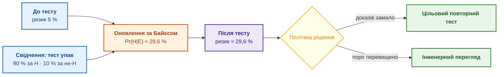

Сині блоки є вхідними оцінками, помаранчевий блок є обчисленням, фіолетовий блок є оновленою оцінкою, жовтий ромб є політикою рішення, зелені блоки є діями. Між оцінкою й дією стоїть політика: модель оновлює ймовірність, а дію визначає записане правило.

Силу самого свідчення, окремо від початкової ймовірності, показує відношення правдоподібностей (*likelihood ratio*):

```math
\mathrm{LR}^{+}=\frac{\Pr(E\mid H)}{\Pr(E\mid\neg H)}=\frac{0{,}80}{0{,}10}=8.
```

Позначення сили свідчення:

- $\mathrm{LR}^{+}$ є додатним відношенням правдоподібностей свідчення $E$;
- чисельник $\Pr(E\mid H)$ є ймовірністю падіння тесту для проблемного релізу;
- знаменник $\Pr(E\mid\neg H)$ є ймовірністю падіння тесту для нормального релізу;
- у прикладі чисельник дорівнює $0{,}80$, знаменник $0{,}10$, а відношення дорівнює 8; знаменник має бути додатним.

Якщо знаменник додатний, $\mathrm{LR}^{+}$ може бути невід'ємним числом: значення більше 1 підтримує гіпотезу, менше 1 послаблює, рівне 1 нічого не змінює. У прикладі падіння тесту у вісім разів імовірніше в проблемному релізі, ніж у нормальному, але $\mathrm{LR}^{+}=8$ не означає «ризик 80 %». Через шанси (*odds*), тобто відношення ймовірності події до ймовірності протилежної події, теорема Байєса набуває простого вигляду:

```math
\frac{\Pr(H\mid E)}{1-\Pr(H\mid E)}=\frac{\Pr(H)}{1-\Pr(H)}\cdot\mathrm{LR}^{+}.
```

- $\Pr(H)$ є початковою ймовірністю, а $\Pr(H\mid E)$ є ймовірністю після свідчення;
- $p/(1-p)$ перетворює ймовірність $p$ на шанси, тобто відношення ймовірності події до ймовірності протилежної події;
- $\mathrm{LR}^{+}$ є відношенням правдоподібностей свідчення, визначеним вище;
- для скінченних шансів потрібні ймовірності строго між 0 і 1.

Початкові шанси множать на силу свідчення й отримують оновлені шанси. Для прикладу $\frac{0{,}05}{0{,}95}\cdot 8=\frac{8}{19}$, звідки $\Pr(H\mid E)=\frac{8}{8+19}=\frac{8}{27}$, тобто ті самі 29,6 %.

**Формально: кілька свідчень.** Для двох свідчень $E_1$ і $E_2$ загальна формула не потребує припущення про незалежність:

```math
\Pr(H\mid E_1,E_2)=\frac{\Pr(E_1,E_2\mid H)\,\Pr(H)}{\Pr(E_1,E_2)}.
```

Складники спільного оновлення:

- $H$ є гіпотезою, а $E_1$ і $E_2$ є двома свідченнями;
- кома між $E_1$ і $E_2$ означає, що спостерігають обидва свідчення разом;
- $\Pr(E_1,E_2\mid H)$ є ймовірністю обох свідчень за умови $H$;
- $\Pr(E_1,E_2)$ є загальною ймовірністю обох свідчень і має бути більшою за нуль;
- $\Pr(H\mid E_1,E_2)$ є ймовірністю гіпотези після обох свідчень; вона лежить у $[0,1]$.

Оновлювати можна й послідовно, якщо на другому кроці взяти правдоподібність, яка вже враховує перше свідчення:

```math
\Pr(H\mid E_1,E_2)=\frac{\Pr(E_2\mid H,E_1)\,\Pr(H\mid E_1)}{\Pr(E_2\mid E_1)}.
```

- $\Pr(H\mid E_1)$ є ймовірністю гіпотези після першого свідчення;
- $\Pr(E_2\mid H,E_1)$ є ймовірністю другого свідчення з урахуванням $H$ і вже відомого $E_1$;
- $\Pr(E_2\mid E_1)$ є ймовірністю другого свідчення після першого й має бути більшою за нуль;
- результат $\Pr(H\mid E_1,E_2)$ знову лежить у $[0,1]$.

Лише коли свідчення $E_1$ і $E_2$ умовно незалежні за кожного зі станів $H$ і $\neg H$, шанси можна множити на відношення правдоподібностей кожного свідчення:

```math
\mathrm{Odds}(H\mid E_1,E_2)=\mathrm{Odds}(H)\cdot\mathrm{LR}_1\cdot\mathrm{LR}_2.
```

- $\mathrm{Odds}(H)$ є початковими шансами гіпотези $H$;
- $\mathrm{LR}_1$ і $\mathrm{LR}_2$ є відношеннями правдоподібностей першого й другого свідчень;
- $\mathrm{Odds}(H\mid E_1,E_2)$ є шансами після обох свідчень; шанси є невід'ємними, але не є ймовірностями в $[0,1]$;
- умова формули: $E_1$ і $E_2$ умовно незалежні за кожного зі станів $H$ і $\neg H$.

Провалений тест і відкритий дефект часто мають спільну причину. Якщо вважати такі свідчення незалежними, модель двічі врахує те саме свідчення й завищить ризик.

Оновлена ймовірність має сенс лише разом із паспортом моделі: визначеннями $H$ і $E$; джерелом і часовим вікном для початкових і умовних ймовірностей; способом обробки пропущених даних; припущеннями про залежності між свідченнями; версією моделі й результатами калібрування ([Глава 25](ch25-how-expert-systems-learn.md)); політикою, що перетворює оцінку на додатковий тест або людський перегляд. Останній пункт відділяє оцінювання від рішення: байєсівська модель оновлює ймовірність, але не вирішує, хто має право випустити автомобільний компонент, обрати лікування чи встановити юридичний наслідок.

Теорема Байєса дає точний спосіб оновлювати впевненість, але вимагає початкових і умовних ймовірностей, які в складній предметній області важко оцінити й підтримувати. Експерт може сказати «це сильний сигнал», але не може обґрунтувати, що $\Pr(E\mid H)=0{,}73$. Тому поряд із теоремою Байєса розвивалися простіші моделі невизначеності.

## Коли повної ймовірнісної моделі немає

Три підходи нижче з'явилися саме тоді, коли повної ймовірнісної моделі побудувати не вдавалося. Кожен підхід вимірює власну величину, і величини трьох підходів не можна змішувати ні між собою, ні з ймовірністю.

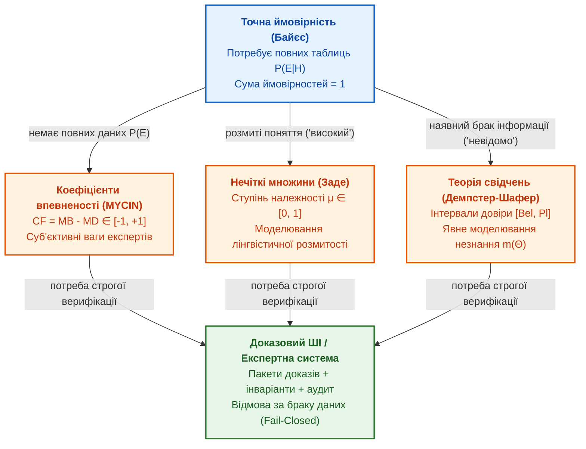

### Коефіцієнти впевненості MYCIN

Творці MYCIN мали справу з лікарями, які не знали сотень апріорних і умовних ймовірностей, але вміли сказати, наскільки ознака підтримує чи спростовує діагноз. Едвард Шортліфф і Брюс Бьюкенен запропонували для таких оцінок коефіцієнти впевненості (*certainty factors*) [[6]](#src-6).

Символи коефіцієнта:

```math
CF(H,E)=MB(H,E)-MD(H,E).
```

- $H$ є гіпотезою, а $E$ є свідченням;
- $MB(H,E)$ є мірою підтримки гіпотези свідченням і лежить у $[0,1]$;
- $MD(H,E)$ є мірою заперечення гіпотези свідченням і лежить у $[0,1]$;
- $CF(H,E)$ є різницею підтримки й заперечення; знак $-$ означає віднімання.

Значення $CF$ лежить у $[-1,1]$: 1 означає повну підтримку, $-1$ повне заперечення, а 0 відсутність підстав. Ця шкала є евристичною, а не ймовірнісною. Два додатні коефіцієнти для однієї гіпотези MYCIN поєднував так:

```math
CF_{1\oplus2}=CF_1+CF_2\,(1-CF_1),\qquad 0\le CF_1,CF_2\le1.
```

- $CF_1$ і $CF_2$ є додатними коефіцієнтами підтримки двох свідчень, кожен у $[0,1]$;
- $CF_{1\oplus2}$ є об'єднаним коефіцієнтом, а $\oplus$ позначає цю операцію поєднання;
- $1-CF_1$ є частиною підтримки, якої ще бракує до 1.

Результат лежить між 0 і 1 та не менший за кожен із двох коефіцієнтів: друге свідчення додає частку від ще не підтриманого залишку $1-CF_1$. Нехай $CF_1=0{,}6$, а коефіцієнт другого свідчення $CF_2=0{,}5$. Тоді $CF_{1\oplus2}=0{,}6+0{,}5\cdot0{,}4=0{,}8$. Це підстава для експертного перегляду, але не автоматична заборона випуску.

Коефіцієнт впевненості не є апостеріорною ймовірністю, і змішувати коефіцієнти з байєсівськими оцінками без перевірки не можна. Сьогодні коефіцієнти в первісній формі використовують рідко, але ідея живе в порогах людського перегляду й в оцінках достатності доказів ([Глава 6](ch06-applied-mathematics-for-expert-systems.md)).

### Нечітка логіка

Деякі поняття мають розмиту межу: «висока температура», «помірний ризик», «майже готовий реліз». Класична множина знає лише «належить» і «не належить». Лотфі Заде 1965 року запропонував нечіткі множини, у яких належність має ступінь [[14]](#src-14). Нечітку множину $A$ задає функція належності:

```math
\mu_A:X\to[0,1],\qquad x\mapsto\mu_A(x).
```

- $A$ є нечіткою множиною, наприклад поняттям «висока температура»;
- $X$ є множиною можливих значень, наприклад температур, а $x$ є одним елементом $X$;
- $\mu_A(x)$ є ступенем належності $x$ до $A$ і лежить у $[0,1]$;
- $\to$ задає функцію з множини $X$ у відрізок $[0,1]$, а $\mapsto$ показує відповідність для конкретного $x$.

Нуль означає повну неналежність, одиниця повну належність. Ступінь належності не є ймовірністю події: температура 80 °C може належати поняттю «висока температура» зі ступенем 0,7, а 95 °C зі ступенем 0,95, і жодне з чисел не означає частоти.

Виміряний показник ще не є ступенем належності. Покриття тестами 84 % є спостережуваною часткою; частка стає ступенем належності до поняття «достатньо готовий» лише після того, як команда визначить і погодить функцію належності. Нехай після застосування трьох погоджених функцій належності отримано ступені $\mu_{\text{тести}}=0{,}70$, $\mu_{\text{погодження}}=0{,}40$ і $\mu_{\text{дефекти}}=0{,}60$. Якщо політика звучить «реліз готовий настільки, наскільки готова найслабша критична умова», нечітке «і» обчислюють як мінімум:

```math
\mu_{\text{готовність}}=\min(0{,}70;\ 0{,}40;\ 0{,}60)=0{,}40.
```

- $\mu_{\text{готовність}}$ є ступенем належності релізу до поняття «готовий»;
- $\min$ обирає найменше зі значень у дужках;
- $0{,}70$, $0{,}40$ і $0{,}60$ є ступенями належності за тестами, погодженням і дефектами, кожен у $[0,1]$.

Реліз має ступінь готовності $0{,}40$, а найслабшим місцем є погодження. Мінімум є лише одним зі способів поєднання; інша предметна область може вимагати іншої нечіткої операції або жорсткого блокувального правила.

Нечітка логіка корисна там, де межі природно розмиті: у керуванні, промисловій автоматиці, оцінюванні якості й пріоритетів. Шкали й нормовані оцінки в сучасних інформаційних системах часто нагадують нечітку логіку, але стають нечіткою логікою лише тоді, коли функції належності визначено й погоджено явно.

#### Зв'язок із мовними моделями та апаратна реалізація

Поширена ілюзія сучасної інженерії полягає в спробі замінити функції належності ймовірнісним виходом великих мовних моделей (LLM). Проте ймовірнісний апарат мовних моделей і нечітка логіка розв'язують різні класи невизначеності:
1. **Ймовірність проти ступеня істинності:** Шар $\mathrm{Softmax}$ мовної моделі розподіляє одиничну ймовірність ($\sum P_i = 1$) між взаємовиключними токенами (випадковість), тоді як нечітка логіка Заде оперує незалежними ступенями відповідності розмитому поняттю ($\mu \in [0, 1]$), де кілька протилежних властивостей можуть бути одночасно істинними зі своїми вагами без вимоги суми в одиницю.
2. **Нейро-символьний розподіл праці:** Мовна модель непридатна для ролі числового рушія нечіткого виведення через арифметичні галюцинації та стохастичний дрейф. Проте в нейро-символьному тандемі ([Глава 29](ch29-neuro-symbolic-architecture.md)) мовна модель є ідеальним інструментом **лінгвістичної фазифікації** (переклад людських описів «дещо завищений», «критично високий» у числові модифікатори) та **лінгвістичної дефазифікації** (пояснення підсумкового числового висновку природною мовою).
3. **Обчислювальні платформи:** Для розрахунку нечітких правил програмно найкраще підходять детерміновані SIMD-векторизовані рушії (AVX-512 / ARM Neon), які виконують паралельні операції $\min$ та $\max$ за одиниці наносекунд без динамічного виділення пам'яті. У критичних до затримок циклах керування (ASIL-D) нечітка логіка розраховується на цифрових ПЛІС (FPGA) без блоків множення або на субпорогових аналогових мікросхемах із транзисторними селекторами струмів та схемами вибору переможця (Winner-Take-All).

Повний математичний апарат нечітких Т-норм, формули дефазифікації Мамдані й Такагі–Сугено, векторну оптимізацію та апаратні архітектури викладено в [Главі 6](ch06-applied-mathematics-for-expert-systems.md#нечітка-логіка-ступінь-замість-різкої-межі); аналогову реалізацію на субпорогових МОН-транзисторах за схемами Такеші Ямакави та Карвера Міда розглядає [Додаток Г](appendix-d-analog-expert-systems-and-neuromorphic-computing.md#апаратна-нечітка-логіка-й-вибір-переможця).

### Теорія Демпстера–Шафера

Інколи свідчення підтримує не одну відповідь, а групу відповідей, і частина впевненості має лишитися «невідомо». Ймовірність розподіляє всю одиницю між окремими гіпотезами й не має місця для незнання. Артур Демпстер [[15]](#src-15) і Гленн Шафер [[16]](#src-16) побудували теорію свідчень, у якій масу довіри можна призначити множині гіпотез, зокрема множині всіх гіпотез, тобто незнанню.

Приклад. Сигнал датчика зник, і можливі дві причини: несправний датчик $S$ або несправна лінія зв'язку $L$. Перше джерело, журнал діагностики, підтримує $S$ з масою 0,6, а решту 0,4 залишає на «невідомо». Друге джерело, звіт монтажника, підтримує $L$ з масою 0,5, а 0,5 залишає на «невідомо». Після поєднання джерел за правилом Демпстера підтримка $S$ лежить в інтервалі від 0,43 до 0,71, підтримка $L$ від 0,29 до 0,57, а 0,3 початкової маси припадало на конфлікт між джерелами. Нижня межа інтервалу є підтвердженою підтримкою, верхня межа показує, що ще не спростовано.

**Формально: правило Демпстера й межі підтримки.** Для двох незалежних джерел і скінченної множини взаємовиключних гіпотез правило поєднання має такий вигляд:

```math
\begin{aligned}
K&=\sum_{B\cap C=\varnothing}m_1(B)\,m_2(C),\\
m_{1\oplus2}(A)&=\frac{\displaystyle\sum_{B\cap C=A}m_1(B)\,m_2(C)}{1-K},\qquad A\ne\varnothing,\ K<1.
\end{aligned}
```

Символи правила поєднання:

- $\Theta$ є скінченною множиною взаємовиключних гіпотез, а $2^{\Theta}$ є множиною всіх підмножин $\Theta$;
- $m:2^{\Theta}\to[0,1]$ є розподілом маси одного джерела, причому $m(\varnothing)=0$ і сума мас усіх підмножин дорівнює 1;
- $m_1$ і $m_2$ є розподілами маси двох незалежних джерел; $m_1(B)$ і $m_2(C)$ є масами, призначеними підмножинам $B$ і $C$;
- $B$ і $C$ є підмножинами $\Theta$, а $A$ є непорожньою цільовою підмножиною; $B\cap C=A$ задає умову для чисельника;
- $K$ є сумою добутків мас для пар неперетинних множин, тобто мірою конфлікту, і лежить у $[0,1]$;
- $m_{1\oplus2}(A)$ є об'єднаною масою; $\oplus$ позначає поєднання джерел, а $\sum$ означає підсумовування членів, що задовольняють умову;
- $\cap$ означає перетин, $\varnothing$ є порожньою множиною, $\ne$ означає «не дорівнює», а $1-K$ є нормувальним знаменником;
- формула визначена лише за $K<1$, бо повний конфлікт дає нульовий знаменник.

За $K=0$ конфлікту немає, а за $K=1$ джерела повністю суперечать одне одному й правило не визначене. У прикладі $K=0{,}6\cdot0{,}5=0{,}3$. Для множини гіпотез $A$ нижню й верхню межі підтримки задають довіра (*belief*) і правдоподібність (*plausibility*):

```math
\mathrm{Bel}(A)=\sum_{B\subseteq A}m(B),\qquad \mathrm{Pl}(A)=\sum_{B\cap A\ne\varnothing}m(B)=1-\mathrm{Bel}(\bar A).
```

Позначення для нижньої та верхньої меж:

- $A$ і $B$ є підмножинами простору гіпотез $\Theta$, а $m(B)$ є масою, призначеною множині $B$;
- $\mathrm{Bel}(A)$ підсумовує маси множин, повністю вкладених у $A$;
- $\mathrm{Pl}(A)$ підсумовує маси множин, що перетинаються з $A$;
- $\bar A$ є доповненням $A$ до $\Theta$;
- $\subseteq$ означає «є підмножиною», $\cap$ означає перетин, а $\ne\varnothing$ означає непорожній перетин;
- обидві межі лежать у $[0,1]$ і виконують $\mathrm{Bel}(A)\le\mathrm{Pl}(A)$.

У прикладі після нормування на $1-K=0{,}7$ маємо $`m(\{S\})=0{,}30/0{,}7\approx0{,}43`$, $`m(\{L\})=0{,}20/0{,}7\approx0{,}29`$ і $m(\Theta)=0{,}20/0{,}7\approx0{,}29$. Звідси $`\mathrm{Bel}(\{S\})\approx0{,}43`$, $`\mathrm{Pl}(\{S\})\approx0{,}71`$, $`\mathrm{Bel}(\{L\})\approx0{,}29`$, $`\mathrm{Pl}(\{L\})\approx0{,}57`$. Джерела мають бути незалежними, а за великого конфлікту нормування на $1-K$ може дати контрінтуїтивні результати, тому політику обробки конфлікту записують явно.

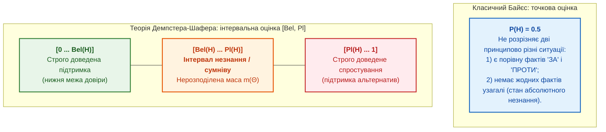

Теорія Демпстера–Шафера не стала масовою, бо теорію складніше пояснювати й підтримувати, ніж простіші оцінки. Проте ідея теорії важлива для доказових експертних систем: джерела можуть підтримувати висновок по-різному й суперечити одне одному, і експертна система має вміти сказати не лише «так» чи «ні», а й «джерела суперечать одне одному». Якщо тест каже одне, статус задачі інше, а вимога змінилася після базової версії, експертна система не вибирає найкрасивіший текст, а показує конфлікт.

Коефіцієнти впевненості, ступені належності й маси довіри вимірюють різні величини. Помилкою є не вибір одного з трьох методів, а змішування шкал у спільне число «впевненості». Наступний розділ переходить від величин до структури: як зберігати зв'язки між фактами, джерелами й досвідом.

## Зв'язки, джерела й досвід

Числа, ймовірності та функції належності позбавлені сенсу, якщо експертна система не знає, як факти структуровані, де розташовані первинні джерела та як спиратися на накопичений інженерний досвід. Доказовий висновок завжди спирається на непорушну тріаду: **Джерело** забезпечує фактологічну автентичність, **Зв'язок** задає семантичну структуру міркування, а **Досвід** дозволяє системі еволюціонувати без повторення минулих помилок.

### Фундаментальна тріада: визначення та таксономія

Щоб відрізнити доказовий штучний інтелект від хаотичного набору неперевірених фрагментів тексту, експертна система спирається на строгі визначення трьох базових складових:

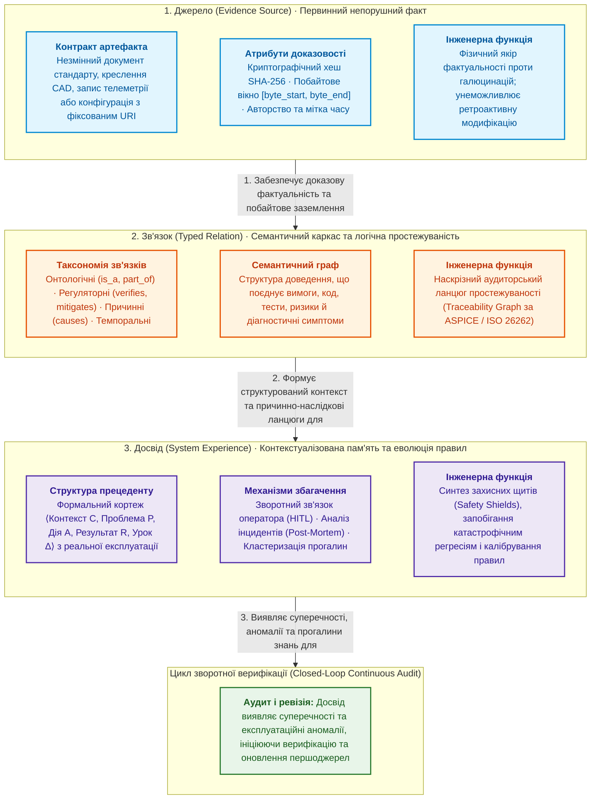

#### 1. Що таке Джерело (Evidence Source)
**Джерело** — це незмінний, однозначно ідентифікований та атрибутований первинний артефакт (документ стандарту, креслення, файл конфігурації, запис системного журналу, протокол випробувань), із якого вилучено факт чи твердження. 

На відміну від «сирих даних» або знеособленої текстової цитати, джерело в доказовій експертній системі ([Глава 8](ch08-engineering-artifacts-as-data.md)) має строгий контракт:
- **Унікальний ідентифікатор і версія:** сталий URI або коміт системи контролю версій;
- **Криптографічний інваріант незмінності:** хеш-сума вмісту (наприклад, SHA-256), що виключає непомітне підмінення або ретроактивну модифікацію тексту;
- **Побайтові координати:** точний діапазон зміщення `[byte_start, byte_end]`, який прив'язує твердження до фізичного рядка в першоджерелі ([Глава 2](ch02-epistemology-of-machine-knowledge.md));
- **Походження (Provenance):** авторство, часова мітка затвердження, статус чинності (дійсний, проєкт, відкликаний).

#### 2. Що таке Зв'язок (Typed Relation) і яким він буває
**Зв'язок** — це спрямоване, семантично типізоване відношення між двома сутностями або об'єктами бази знань, яке визначає, як одне твердження, вимога чи спостереження впливає на інше. Без зв'язків система має лише ізольовані факти; саме зв'язки перетворюють набір документів на перевірюваний ланцюг доведення.

В інженерних експертних системах зв'язки поділяють на чотири фундаментальні класи:

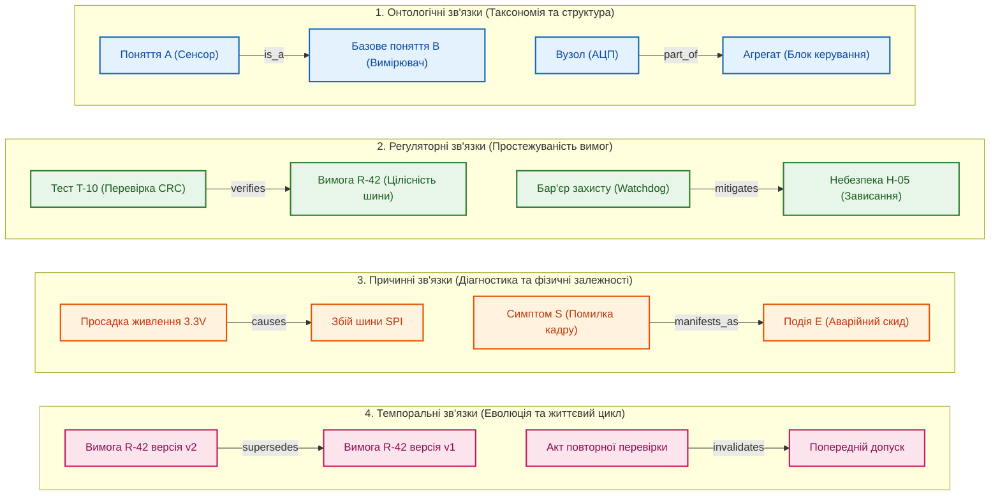

1. **Онтологічні та структурні зв'язки:** формують понятійну ієрархію предметної області (`is_a`, `part_of`, `subClassOf`). Вони дозволяють машині виведення спадкувати властивості понять за дефолтом (наприклад, якщо датчик температури є аналоговим сенсором, він спадкує вимоги до калібрування АЦП).
2. **Регуляторні зв'язки та простежуваність (Traceability):** пов'язують вимоги стандартів, проєктні рішення, код і тести (`satisfies`, `verifies`, `mitigates`, `traces_to`). Саме ці зв'язки формують матрицю відповідності для сертифікаційного аудиту ([Глава 9](ch09-engineering-knowledge-graph-traceability.md)).
3. **Причинно-наслідкові та діагностичні зв'язки:** описують фізичні залежності між дефектами, відмовами та спостережуваними симптомами (`causes`, `manifests_as`, `indicates`). Вони утворюють основу для байєсівських мереж та дерев відмов (FTA) ([Глава 24](ch24-system-diagnosis.md)).
4. **Темпоральні та еволюційні зв'язки:** фіксують хронологію змін і скасувань (`supersedes`, `invalidates`, `precedes`). Вони запобігають використанню застарілих норм і забезпечують відкат рішень у разі відкликання первинних звітів.

#### 3. Що таке Досвід (Engineering Experience)
**Досвід** в експертних системах — це структурований архів розв'язаних ситуацій, ухвалених рішень та їхніх реальних наслідків (успіхів і помилок), що дозволяє системі адаптувати свою поведінку без повторного проходження всього шляху міркувань з нуля. 

На відміну від простого логу або дампу бази даних, одиниця досвіду (прецедент або *case*) формалізується як кортеж:

```math
E = \langle \mathcal{C},\ \mathcal{P},\ \mathcal{A},\ \mathcal{R},\ \Delta \rangle
```

Символи кортежу досвіду мають такий зміст:

- $\mathcal{C}$ є робочим контекстом інженерної системи (версія апаратури, умови довкілля, режим експлуатації);
- $\mathcal{P}$ є сформульованою проблемою або запитом (наприклад, аномальне відхилення сенсора або конфлікт двох вимог стандарту);
- $\mathcal{A}$ є застосованою дією або запропонованим правилом виведення;
- $\mathcal{R}$ є фактично спостережуваним результатом (успішна стабілізація процесу, виявлений хибний допуск або аварійна відмова);
- $\Delta$ є зафіксованим інженерним уроком або корекцією бази знань (нове обмеження, коригування порогу або додане контрправило).

#### Як експертна система набирає досвід
Експертна система не є статичним оракулом; вона накопичує досвід чотирма вивіреними інженерними каналами:

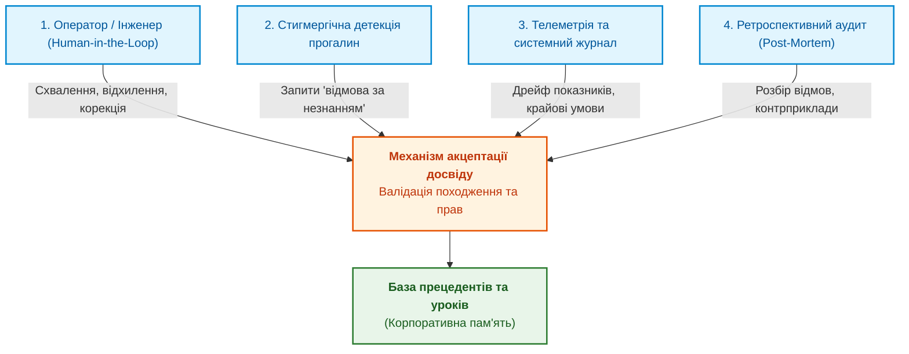

1. **Зворотний зв'язок від уповноваженого експерта (Human-in-the-Loop):** Коли система формує рекомендацію, людина приймає або спростовує її. У разі відхилення обов'язково фіксується причина спростування (*undercutting defeater*), що додає до системи нове негативне обмеження ([Глава 2](ch02-epistemology-of-machine-knowledge.md), [Глава 11](ch11-knowledge-elicitation-from-experts.md)).
2. **Стигмергічне накопичення прогалин (Knowledge Gap Mining):** Ситуації, коли система змушена видати відповідь «недостатньо знань за закритою моделлю» (CWA), не губляться, а кластеризуються. Найбільш повторювані прогалини автоматично висуваються як кандидати для поповнення онтології ([Глава 34](ch34-deterministic-relational-analysis-abduction-and-socratic-dialogue.md)).
3. **Моніторинг розбіжностей у реальній експлуатації:** Порівняння прогнозованої поведінки об'єкта (наприклад, очікуваного струму двигуна) з показаннями фізичних сенсорів. Розбіжність понад гарантований поріг записується як новий граничний стан.
4. **Аналіз інцидентів та ретроспективні випробування (Post-Mortem):** Після кожної аварії чи відмови контрприклад кодується як обов'язковий тест, який система повинна проходити під час кожного оновлення правил ([Глава 25](ch25-how-expert-systems-learn.md)).

#### Як експертна система використовує накопичений досвід
Накопичений досвід задіюється у чотирьох ключових режимах:
- **Міркування за аналогією (CBR):** Пошук прецедентів зі схожим контекстом за комбінованою графово-векторною метрикою для швидкої генерації робочої гіпотези без повного вичерпного перебору.
- **Динамічне оновлення ваг і порогів:** Досвід корегує умовні ймовірності в байєсівських мережах або калібрує функції належності нечіткої логіки, адаптуючи систему до старіння сенсорів чи зміни зовнішніх умов.
- **Синтез формальних щитів безпеки (Safety Shields):** Прецеденти критичних помилок перетворюються на жорсткі предикатні бар'єри: навіть якщо нейромережа чи оператор пропонує небезпечну дію, щит на базі минулого досвіду блокує її виконання ([Глава 27](ch27-safety-case-gsn-synthesis.md), [Глава 38](ch38-curing-machine-hallucinations-and-knowledge-deficits.md)).
- **Безперервний захист від регресій (Continual Learning):** Кожен зафіксований історичний випадок формує частину екзаменаційної матриці знань; нова версія системи не може піти у виробництво, якщо вона порушує хоча б один урок з минулого ([Глава 26](ch26-continual-learning.md), [Глава 36](ch36-knowledge-testing-pyramid-and-variational-calibration.md)).

На ці інженерні виклики послідовно відповіли чотири історичні лінії розвитку: семантичні мережі й графи знань, байєсівські мережі, інформаційний пошук та міркування за прецедентами.

### Від семантичних мереж до графів знань

У 1960–1970-х роках поширилися семантичні мережі й фрейми, тобто подання знань як понять, властивостей і зв'язків:

```text
Вимога R-17 перевіряється тестом T-9.
Тест T-9 упав на базовій версії B-3.
Дефект D-4 зачіпає вимогу R-17.
```

Три рядки вже є не текстом, а графом: вершинами є вимога, тест, версія й дефект, ребрами є типізовані зв'язки. Сучасні графи знань, онтології й графи простежуваності є прямими нащадками семантичних мереж. Граф потрібен там, де важливий ланцюжок: від вимоги до тесту, від тесту до дефекту, від дефекту до ризику, від ризику до рішення про випуск. Мовна модель без графа бачить купу документів, а з графом бачить ланцюжок доказів. Як будувати інженерний граф знань, розповідає [Глава 9](ch09-engineering-knowledge-graph-traceability.md).

### Байєсівські мережі

У 1980-х Джудея Перл поєднав теорему Байєса з графами [[17]](#src-17). Байєсівська мережа є спрямованим ациклічним графом, у якому вершини є випадковими величинами, а ребра показують залежності. Спільний розподіл усіх величин розкладається на локальні множники:

```math
P(X_1,\ldots,X_n)=\prod_{i=1}^{n}P\bigl(X_i\mid \mathrm{Pa}(X_i)\bigr).
```

- $X_1,\ldots,X_n$ є випадковими величинами моделі, а $n$ задає їхню кількість;
- $P(X_1,\ldots,X_n)$ є спільною ймовірністю значень усіх величин і лежить у $[0,1]$;
- $\mathrm{Pa}(X_i)$ є множиною батьківських вершин, від яких $X_i$ безпосередньо залежить;
- $P(X_i\mid\mathrm{Pa}(X_i))$ є умовною ймовірністю величини $X_i$ за значень її батьків;
- $\prod_{i=1}^{n}$ означає перемножити відповідні множники для всіх індексів від 1 до $n$, а риска $\mid$ означає «за умови».

Замість однієї великої таблиці ймовірностей байєсівська мережа зберігає багато малих таблиць, які можна оцінити й перевірити окремо. Розклад правильний лише тоді, коли структура графа відповідає умовним незалежностям предметної області.

Байєсівські мережі використовують у діагностиці, інженерії надійності й аналізі ризиків, але байєсівські мережі не стали універсальним ядром: модель треба будувати, калібрувати й підтримувати. Для багатьох інженерних процесів дешевше поєднати правила, графи й людський перегляд. Докладніше байєсівські мережі розглядає [Глава 6](ch06-applied-mathematics-for-expert-systems.md), діагностичні застосування [Глава 24](ch24-system-diagnosis.md).

### Пошук інформації: від зважування слів до векторів

Жодне символьне виведення чи верифікація не мають сенсу, якщо експертна система не здатна знайти первинні факти та підтверджувальні свідоцтва у масиві технічної документації. Еволюція пошуку пройшла шлях від бінарного збігу слів до **зважування інформаційної сили термінів**, а відтак — до **геометричних векторних просторів контексту**.

#### Що таке зважування слова (Term Weighting)

У наївному пошуку документ розглядають як невпорядкований набір слів, перевіряючи лише присутність або кількість входжень терма. Проте проста частота появи слова ($f_{t,d}$) вводить систему в оману: загальновживані слова (наприклад, «система», «вимога», «помилка», «параметр») зустрічаються в кожному документі, проте мають нульову роздільну здатність. Навпаки, вузькоспеціалізовані терміни (наприклад, `CRC32`, `SPI_ERR_TIMEOUT`, `ISO26262-5`) зустрічаються рідко, але несуть максимальну інформаційну цінність.

**Зважування слова** — це функція, яка ставить у відповідність терму $t$ у документі $d$ числове значення $w(t, d)$, що відображає його інформаційну селективність відносно всієї бази знань $D$.

Джерард Салтон і Кріс Баклі формалізували класичну схему **TF-IDF** (*Term Frequency – Inverse Document Frequency*) [[18]](#src-18):

```math
w(t, d, D) = \mathrm{TF}(t, d) \cdot \mathrm{IDF}(t, D) = \frac{f_{t,d}}{|d|} \cdot \ln\left(1 + \frac{|D|}{|\{d' \in D : t \in d'\}|}\right)
```

Параметри формули зважування:

- $t$ є окремим пошуковим термом (словом або стійкою лексемою);
- $d$ є конкретним документом або фрагментом тексту, а $|d|$ — загальна кількість слів у цьому документі;
- $D$ є всією базою знань (корпусом документів), а $|D|$ — загальна кількість документів у корпусі;
- $f_{t,d}$ є частотою появи терма $t$ у документі $d$; відношення $f_{t,d}/|d|$ задає локальну нормовану частоту $\mathrm{TF}$;
- $|\{d' \in D : t \in d'\}|$ є кількістю документів у корпусі, які містять терм $t$;
- $\mathrm{IDF}(t, D)$ є зворотною частотою документа; додавання 1 під знаком логарифма запобігає множенню на нуль або діленню на нуль, коли терм зустрічається в усіх документах;
- $w(t, d, D)$ є підсумковою вагою терма; вага тим вища, чим частіше терм зустрічається в поточному документі і чим рідше він з'являється в решті корпусу.

Еволюційним розвитком зважування стала ймовірнісна функція **BM25** Стівена Робертсона [[19]](#src-19). Вона розв'язала дві критичні інженерні проблеми лінійного TF-IDF:
1. **Насичення частоти терма (Term Frequency Saturation):** якщо інженерне слово з'явилося в документі 20 разів замість 10, це не робить документ удвічі релевантнішим. Вплив повторень має асимптотично наближатися до граничного порогу.
2. **Нормалізація за довжиною документа:** довгі специфікації не повинні отримувати несправедливу перевагу над короткими лаконічними картками дефектів лише за рахунок свого обсягу.

Застосування зважування слів в експертних системах незамінне для **лексичного пошуку** точних ідентифікаторів: назв функцій, адрес регістрів, кодів несправностей і пунктів специфікацій, де неприпустиме «приблизне» або синонімічне розмиття.

#### Що таке Вектор у контексті пошуку знань

Перехід від зважування окремих слів до векторних моделей розділив інформаційний пошук на два взаємодоповнюючі класи подання знань:

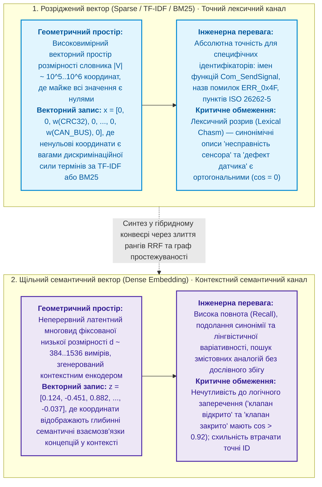

1. **Розріджений вектор (Sparse Vector, простір слів):** Документ подається вектором $\mathbf{x} \in \mathbb{R}^{|V|}$, розмірність якого дорівнює розміру словника мови ($10^5$–$10^6$ елементів). Переважна більшість координат дорівнює нулю, а ненульові координати є вагами $w(t, d)$.
   - *Проблема лексичного розриву:* Якщо у запиті написано «несправність приводу», а в регламенті «дефект сервомотора», їхні розріджені вектори не перетинаються (ортогональні), і традиційний пошук не знайде зв'язку.
2. **Щільний семантичний вектор (Dense Vector / Embedding):** Текст пропускається крізь нейромережевий енкодер (наприклад, трансформерні моделі Sentence-BERT), який відображає фрагмент у неперервний геометричний вектор фіксованої розмірності ($d = 384, 768, 1536$).
   - У цьому просторі координати кодують не окремі літери чи слова, а узагальнені контекстні патерни. Близькі за змістом концепції проектуються у сусідні точки векторного многовиду.

Геометричну близькість контекстів вимірюють косинусом кута між векторами:

```math
\cos(\mathbf a,\mathbf b)=\frac{\mathbf a^{\mathsf T}\mathbf b}{\lVert\mathbf a\rVert_2\,\lVert\mathbf b\rVert_2} = \frac{\sum_{i=1}^d a_i\,b_i}{\sqrt{\sum_{i=1}^d a_i^2}\cdot\sqrt{\sum_{i=1}^d b_i^2}}
```

Символи формули мають такий геометричний зміст:

- $\mathbf a$ і $\mathbf b$ є векторами однакової розмірності $d$, що кодують зміст запиту та документа;
- $\mathbf a^{\mathsf T}\mathbf b$ є скалярним добутком векторів, що підсумовує узгодженість координат за всіма $d$ вимірами;
- $\lVert\mathbf a\rVert_2 = \sqrt{\sum a_i^2}$ є евклідовою нормою (довжиною) вектора; ділення на довжини усуває залежність оцінки від масштабу і нормує значення в діапазон $[-1, 1]$;
- Значення $\cos = 1$ відповідає співнапрямленим векторам (максимальна семантична схожість), $\cos = 0$ — незалежним (ортогональним) векторам, а $\cos < 0$ — протилежним напрямкам.

Для простого двовимірного прикладу: якщо запит має координати $\mathbf q=(1;0)$, а документи — $\mathbf d_1=(0{,}8;0{,}6)$ та $\mathbf d_2=(0{,}1;0{,}99)$, маємо $\cos(\mathbf q,\mathbf d_1)=0{,}80$ і $\cos(\mathbf q,\mathbf d_2)\approx0{,}10$. Перший документ геометрично значно ближчий до запиту за змістом.

#### Критична інженерна межа векторного пошуку

Векторний пошук не є логічним виведенням. Косинусна близькість оцінює **контекстну подібність, а не фактичну істинність чи логічну еквівалентність**. 

Два твердження з прямо протилежним інженерним значенням — наприклад, *«запобіжний клапан відкрито»* та *«запобіжний клапан закрито»* — мають косинусну близькість $\cos > 0{,}92$, оскільки обидві фрази мають спільне лексичне оточення і стосуються одного й того самого фізичного вузла. Довірити векторному пошуку прийняття рішення без детермінованого логічного фільтра — прямий шлях до критичної відмови системи.

#### Двоканальний гібридний пошук інженерних доказів

Сучасна доказова експертна система не обирає між лексичним зважуванням і семантичними векторами, а об'єднує їх у **двоканальний гібридний конвеєр (Hybrid Search Pipeline)** із графовою та логічною верифікацією:

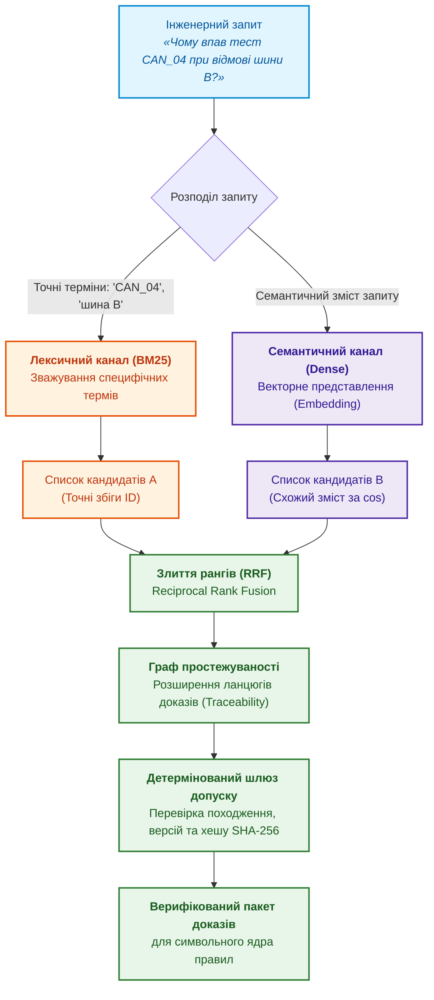

Генерація з пошуком (*retrieval-augmented generation*, RAG) стоїть на тій самій історичній лінії: мовна модель відповідає не з власної пам'яті, а на основі знайдених джерел [[20]](#src-20). Проте для інженерних доказів результати ранжування обов'язково фільтруються через детерміновані правила допуску: знайдені фрагменти повинні мати чинний статус, підтверджені дати затвердження та зафіксовані зміщення `[byte_start, byte_end]`.

Математичні деталі формування векторних просторів, функцію Reciprocal Rank Fusion (RRF) та крос-енкодери детально розглядає [Глава 6](ch06-applied-mathematics-for-expert-systems.md#пошук-інформації-зважування-слів-та-вектори), а практичну побудову конвеєра від запиту до доказу — [Глава 19](ch19-from-question-to-evidence.md).

### Міркування за прецедентами

У 1980–1990-х роках сформувалося міркування за прецедентами (*case-based reasoning*, CBR). Логіка CBR людська: для нового випадку знайти схожий старий, використати рішення старого випадку, переглянути рішення з урахуванням відмінностей і зберегти новий досвід. Агнар Аамодт і Енрік Пласа описали цикл CBR чотирма кроками: знайти, використати, переглянути, зберегти (*retrieve, reuse, revise, retain*) [[21]](#src-21).

У сучасній інженерії прецедентами є схожий дефект, схожа затримка постачальника, схоже зауваження аудитора. Організації мають уроки з минулих проєктів, але уроки не з'являються в момент рішення. Мовна модель допомагає описати випадок і знайти схожі випадки, але остаточне порівняння відмінностей між випадками залишається за правилами й людиною.

Графи зберігають зв'язки, байєсівські мережі розкладають ймовірність на локальні частини, пошук знаходить джерела, прецеденти повертають досвід. Жоден із чотирьох інструментів сам не ухвалює рішення: рішення потребує порівняння альтернатив і точних розрахунків.

## Порівняння альтернатив і точні розрахунки

Багато інженерних рішень не мають ідеальної відповіді: треба обрати архітектуру, постачальника чи сценарій випуску з кількох неідеальних варіантів. Інші рішення, навпаки, вимагають точного числа за формулою стандарту. Для обох випадків історія дала прозорі інструменти.

### Зважене оцінювання альтернатив

Найпростіший прозорий спосіб порівняти альтернативи є зваженою сумою нормованих критеріїв:

```math
S(a)=\frac{\sum_{i=1}^{m}w_i\,x_i(a)}{\sum_{i=1}^{m}w_i},\qquad w_i\ge0,\quad \sum_{i}w_i>0.
```

Позначення зваженої оцінки:

- $a$ є альтернативою, а $i$ є номером критерію від 1 до $m$;
- $m$ є кількістю критеріїв;
- $x_i(a)$ є нормованим значенням критерію $i$ для альтернативи $a$ і лежить у $[0,1]$, де 1 означає найкраще значення;
- $w_i$ є невід'ємною вагою критерію $i$, а $\sum_{i=1}^{m}w_i>0$ вимагає хоча б однієї додатної ваги;
- $w_i$ є невід'ємною вагою критерію $i$;
- $\ge$ означає «більше або дорівнює», а $>$ означає «більше»; умова $\sum_{i=1}^{m}w_i>0$ вимагає хоча б однієї додатної ваги;
- $\ge$ означає «більше або дорівнює», а $>$ означає «більше»; $\sum_{i=1}^{m}w_i>0$ вимагає хоча б однієї додатної ваги;
- $\sum$ означає додавання членів за вказаними індексами, а $S(a)$ є зваженим середнім без одиниць виміру.

Оцінка $S(a)$ також лежить у $[0,1]$, і більша оцінка означає кращу альтернативу за прийнятими вагами.

Нехай треба обрати сценарій випуску. Критерії: цінність для бізнесу з вагою 0,4, низький ризик постачання з вагою 0,3 і готовність за вимогами відповідності з вагою 0,3. Ваги в сумі дають 1, тож знаменник дорівнює одиниці.

| Альтернатива | Цінність, $w=0{,}4$ | Низький ризик постачання, $w=0{,}3$ | Готовність, $w=0{,}3$ | $S$ |
|---|---:|---:|---:|---:|
| A: швидкий випуск | 0,90 | 0,45 | 0,60 | 0,675 |
| B: повільніший випуск із кращою відповідністю | 0,70 | 0,70 | 0,85 | 0,745 |
| C: мінімальний випуск | 0,50 | 0,90 | 0,80 | 0,710 |

За цією моделлю перемагає альтернатива B. Важливіша за перемогу механіка: видно, чому B перемогла, і видно, що буде за інших пріоритетів. Якщо підняти вагу цінності до 0,6, а дві інші ваги знизити до 0,2, оцінки стануть $S(A)=0{,}75$, $S(B)=0{,}73$, $S(C)=0{,}64$, і перемагає A. Такий аналіз чутливості показує, наскільки рекомендація залежить від пріоритетів, а не від «магії» моделі.

Сила зваженого оцінювання в прозорості: якщо бракує даних, прогалину видно, а не сховано в гарному підсумку. Докладніше про багатокритеріальний вибір пише [Глава 6](ch06-applied-mathematics-for-expert-systems.md).

### Детерміновані обчислювальні ядра

Частину чисел в інженерії не можна доручати мовній моделі як генеративну задачу: метрики аналізу видів, наслідків і діагностики відмов (*failure modes, effects and diagnostic analysis*, FMEDA), фінансові й договірні формули. Такі числа рахує детерміноване обчислювальне ядро за схемою «вхідні дані, версія формули, результат, запис аудиту».

Приклад з автомобільної функціональної безпеки. Метрика одноточкових відмов (*single-point fault metric*, SPFM) показує, яка частка відмов апаратури, пов'язаної з безпекою, не є одноточковою чи залишковою, тобто не порушує мету безпеки напряму:

```math
\mathrm{SPFM}=1-\frac{\sum\lambda_{\mathrm{SPF}}+\sum\lambda_{\mathrm{RF}}}{\sum\lambda_{\mathrm{total}}}.
```

Позначення інтенсивностей відмов:

- $\lambda_{\mathrm{SPF}}$ є інтенсивностями одноточкових відмов;
- $\lambda_{\mathrm{RF}}$ є інтенсивностями залишкових відмов;
- $\lambda_{\mathrm{total}}$ є інтенсивностями всіх відмов апаратних елементів, пов'язаних із безпекою, у визначеній області аналізу;
- $\sum$ підсумовує інтенсивності відповідної категорії, а $1$ є повною часткою;
- інтенсивності мають однакові одиниці, зазвичай FIT, тобто відмови на мільярд годин; знаменник має бути додатним;
- за взаємовиключної класифікації відмов частка й SPFM лежать у $[0,1]$.

Якщо $\sum\lambda_{\mathrm{total}}=100$ FIT, $\sum\lambda_{\mathrm{SPF}}=2$ FIT і $\sum\lambda_{\mathrm{RF}}=1$ FIT, тоді

Підстановка чисел у визначення SPFM:

```math
\mathrm{SPFM}=1-\frac{2+1}{100}=0{,}97=97\,\%.
```

- $2$ і $1$ є інтенсивностями одноточкових і залишкових відмов у FIT;
- $100$ є сумарною інтенсивністю всіх відмов у FIT;
- $1-3/100=0{,}97$, а множення на 100 % дає 97 %.

Стандарт ISO 26262-5 як орієнтир для цільових значень наводить SPFM не менше 90 % для ASIL B, 97 % для ASIL C і 99 % для ASIL D [[22]](#src-22), де ASIL (*Automotive Safety Integrity Level*) є рівнем повноти безпеки від A до D. Отже, 97 % досить для орієнтира ASIL C, але замало для ASIL D. Формула тут навчальна: класифікацію відмов, область метрики й чинну редакцію вимог беруть із застосовної частини стандарту.

Детерміноване ядро зберігає для кожного результату версію формули, джерело, межі застосування, хеш вхідних даних і запис виконання. Якщо вхідні дані змінилися, результат відтворювано змінюється; якщо змінилася формула, видно, яка версія формули діяла. Мовна модель може пояснити результат людською мовою, але сам результат рахує перевірений код.

Там, де потрібна відтворюваність, генерація поступається детермінізму. Сучасна експертна система не відкидає старої інженерної дисципліни, а збирає всі описані методи в одну архітектуру.

## Що успадкувала доказова експертна система

Історію методів можна звести в одну таблицю: що було тоді й що з давнього методу виросло тепер.

| Історичний підхід | Що було тоді | Що маємо зараз |
|---|---|---|
| Логіка й правила | ЯКЩО … ТО, пряме й зворотне виведення | рушії правил, політики перевірки, перевірка відповідності |
| LISP і символьний ШІ | правила як дані, списки, дерева | мови правил, подання знань, пояснювана автоматизація |
| PROLOG і логічне програмування | факти, правила, запити, зворотне виведення | бази знань із запитами, виведення політик |
| Теорема Байєса | оновлення ймовірності після свідчення | оцінювання ризику, калібрування впевненості, байєсівські мережі |
| Коефіцієнти впевненості | практична впевненість без повної моделі | оцінки впевненості, пороги людського перегляду |
| Нечітка логіка | розмиті межі й ступені належності | рівні готовності, діапазони ризику |
| Теорія Демпстера–Шафера | поєднання неповних свідчень | явне повідомлення про конфлікт і незнання |
| Семантичні мережі | граф понять і зв'язків | графи знань, онтології, графи простежуваності |
| Пояснення в MYCIN | відповіді на «чому?» і «як?» | сліди доведення, журнали аудиту, пояснення з посиланнями |
| Міркування за прецедентами | пошук схожих випадків | повторне використання уроків, пошук за схожістю |
| Пошук інформації | TF-IDF, BM25, векторна модель | гібридний пошук, RAG, точний пошук ідентифікаторів |
| Аналіз рішень | зважені критерії | досьє рішень, аналіз чутливості |
| Формальні обчислення | окремі моделі й формули | детерміновані ядра з версіями й аудитом |

Сучасна експертна система не заперечує старих методів, а збирає методи в нову архітектуру. Проте та сама математика по-різному обмежена в різних галузях. П'ять галузей, які [Глава 1](ch01-introduction-to-expert-systems.md) обрала наскрізними для книги, показують межі інтерпретації чисел.

| Галузь | Де корисне оновлення впевненості | Типова помилка | Межа рішення |
|---|---|---|---|
| Автомобільна інженерія | діагностика відмов, оцінювання ризику в експлуатації, вибір наступного тесту | перенести частоту дефектів іншої конфігурації на поточний виріб як апріорну ймовірність | модель визначає пріоритет перевірки; обґрунтування безпеки, випуск і рішення про ремонт мають визначених відповідальних [[22]](#src-22) |
| Авіація | діагностика під час обслуговування, аналіз несправностей і аномалій | вважати пов'язані датчики незалежними або переносити статистику між парками й конфігураціями без перевірки | імовірнісний висновок є дорадчим свідченням; затверджені дані, процес забезпечення довіри й повноваження людини залишаються визначальними [[23]](#src-23) |
| Медицина | оновлення діагностичної гіпотези після аналізу, оцінка ризику для визначеної групи пацієнтів | сплутати $\Pr(E\mid H)$ і $\Pr(H\mid E)$, не врахувати поширеність стану чи зміну характеристик пацієнтів | результат підтримує клінічне рішення лише в межах заявленого призначення й не підміняє лікаря [[24]](#src-24) |
| Оборона | об'єднання невизначених повідомлень, технічна діагностика, оцінювання готовності й логістика | повторно врахувати залежні джерела, не врахувати дезінформацію чи деградацію датчиків | експертна система показує походження даних, конфлікт і невизначеність; командні повноваження й правова оцінка до моделі не переходять [[25]](#src-25), [[26]](#src-26) |
| Законодавство | порядок читання норм і справ, оцінка ризику пропустити важливе джерело | видати оцінку відповідності пошуку за юридичну чинність норми | чинність визначають юрисдикція, дата, редакція, ієрархія джерел і компетентна особа |

У законодавстві різниця найпомітніша. Висока оцінка відповідності пошуку допомагає визначити порядок читання документів, але не встановлює, яка норма чинна. Для чинності потрібні стабільний ідентифікатор, офіційне джерело, часові межі, редакція, юрисдикція й зв'язки між актами. Європейський ідентифікатор законодавства (*European Legislation Identifier*, ELI) підтримує ідентифікацію й структуровані метадані законодавчих актів [[27]](#src-27), а стандарт LegalRuleML описує подання юридичних норм і властивостей правил [[28]](#src-28); жоден із двох стандартів не передає машині юридичних повноважень. Схема показує, де закінчується модель і починається відповідальність.

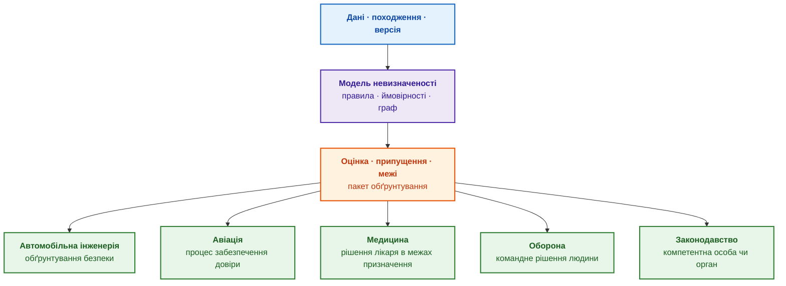

Синій блок є вхідними даними, фіолетовий блок є моделлю, помаранчевий блок є оцінкою разом із пакетом обґрунтування, зелені блоки є галузевими процедурами. Стрілки закінчуються не автоматичним рішенням, а процедурою з відповідальною людиною чи органом.

Математика однакова для всіх галузей, але право на рішення в кожній галузі належить визначеній людині чи органу. Тому головною вимогою до експертної системи є доказовість висновку.

## Доказовість як головна вимога

Найважливіша зміна в експертних системах полягає не в тому, що експертні системи навчилися розмовляти природною мовою, а в переході від відповіді до пакета обґрунтування. Мовна модель може зробити поганий висновок дуже переконливим; експертна система має зробити навіть добрий висновок перевірним. Порівняймо дві відповіді на запитання про готовність випуску.

Слабка відповідь:

```text
Реліз виглядає готовим.
```

Сильна відповідь:

```text
Пакет випуску має 84 % покриття вимог тестами.
Три вимоги змінилися після базової версії B-17.
Два критичні дефекти закрито, але повторного запуску одного тесту немає.
Ризик R-12 прийнято, але погодження ще не підписане.
Висновок: готовність часткова, рішення про випуск потребує перегляду.
Джерела: вимоги, тести, дефекти, ризики, записи погоджень.
```

Різниця між відповідями не в стилі: другу відповідь можна перевірити по кожному рядку. Доказова експертна система повертає не лише висновок, а й джерела, версії, правила, припущення, рівень впевненості, прогалини, конфлікти, відповідального за перегляд і слід доведення. Навіть повноту пакета краще показати числом, а не прикметником «достатній»:

```math
C_{\mathrm{evidence}}=\frac{|V|}{|R|},\qquad |R|>0.
```

Позначення покриття доказами:

- $R$ є множиною обов'язкових для рішення типів доказів;
- $V\subseteq R$ є типами доказів, які експертна система знайшла й перевірила;
- $|V|$ і $|R|$ означають кількість елементів відповідних множин;
- $C_{\mathrm{evidence}}$ є часткою покритих типів доказів; умова $|R|>0$ не допускає ділення на нуль.

Покриття лежить у $[0,1]$. Чотири перевірені типи доказів із п'яти дають $C_{\mathrm{evidence}}=4/5=0{,}8$, але це не ймовірність правильності рішення: одне відсутнє погодження безпеки блокує рішення незалежно від високої частки.

Великі мовні моделі не є ворогами експертних систем: мовні моделі закривають давню слабкість експертних систем, тобто незручний інтерфейс і складну роботу з текстом. Мовна модель формулює запити людською мовою, пояснює правила різним ролям, готує чернетки й допомагає знайти схожі фрагменти. Але правило має бути явним, формула детермінованою, доказ має вести до джерела, а перегляд належати людині. Найсильніша сучасна архітектура є гібридною:

```text
мовна модель для мови й пошуку
+ правила для перевірок
+ граф знань для зв'язків
+ пошук для джерел
+ детерміновані ядра для чисел
+ модель впевненості для невизначеності
+ слід доведення для пояснення
+ людський перегляд для відповідальності
```

Розподіл ролей між мовною моделлю й символьним виведенням докладно описує [Глава 29](ch29-neuro-symbolic-architecture.md). Будь-якого «ШІ-порадника» можна швидко перевірити сімома запитаннями:

1. Чи показує інформаційна система джерело кожного суттєвого твердження?
2. Чи розрізняє інформаційна система факт, припущення, висновок і рекомендацію?
3. Чи має інформаційна система явні правила, чи всі правила сховано в інструкції до моделі?
4. Чи може інформаційна система сказати «даних недостатньо»?
5. Чи видно, яку версію знань, моделі, формули або набору правил використано?
6. Чи можна повторити результат через місяць?
7. Хто ухвалює остаточне рішення: програма чи людина?

Якщо відповіді нечіткі, перед вами, можливо, добрий асистент, але ще не доказова експертна система. Розгорнутий аудит із дванадцяти запитань наводить [Глава 2](ch02-epistemology-of-machine-knowledge.md).

Доказовість не додають наприкінці: пакет обґрунтування має з'являтися з кожним висновком. На практиці доказовість найчастіше ламається в чотирьох місцях, які описує наступний розділ.

## Чотири практичні уроки

Історичні методи добре описано в підручниках, але в щоденній практиці системи ШІ спотикаються в чотирьох місцях, про які підручники говорять рідко. Для уроків знадобляться кілька термінів. **Фрагмент** (*chunk*) є невеликим шматком документа, наприклад абзацом. **Індекс** є покажчиком, який підказує, у якому фрагменті є потрібні слова чи поняття. **Компонент пошуку** (*retriever*) дістає з індексу найвідповідніші фрагменти. **Вхідна інструкція** (*prompt*) є текстом, який отримує мовна модель: запитання користувача, знайдені фрагменти й правила відповіді. **Оцінка відповідності** (*relevance score*) є внутрішнім числом конкретного рушія пошуку, шкала якого залежить від алгоритму й не є ні ймовірністю, ні універсальним числом від 0 до 1.

### Урок 1. Сміття не повинно потрапити в індекс

Уявіть бібліотекаря, у якого зламався сканер: замість літер на сторінках з'являються випадкові знаки, але книжки все одно стають на полицю й потрапляють до каталогу. Читач побачить у каталозі джерело на потрібну тему, хоча прочитати джерело неможливо. Те саме трапляється з документами у форматі PDF (*Portable Document Format*): літери всередині PDF часто записано номерами гліфів, тобто зображень символів у вбудованому шрифті, і для перетворення номерів назад на текст потрібна таблиця відповідності. Якщо таблиці немає або таблиця пошкоджена, програма розбору витягує не текст, а послідовність кодів, схожу на двійковий шум. Для конвеєра обробки шум є звичайним рядком, який потрапляє в індекс, знаходиться на запит користувача, потрапляє до вхідної інструкції, і мовна модель ще й цитує таке «джерело».

Простий захист полягає в тому, щоб перед індексуванням рахувати частку друкованих символів у фрагменті:

```math
r(c)=\frac{N_{\mathrm{print}}(c)}{N_{\mathrm{all}}(c)},\qquad N_{\mathrm{all}}(c)>0.
```

- $c$ є фрагментом документа;
- $N_{\mathrm{all}}(c)$ є кількістю всіх символів у фрагменті, а умова $N_{\mathrm{all}}(c)>0$ вимагає непорожнього фрагмента;
- $N_{\mathrm{print}}(c)$ є кількістю друкованих символів: літер, цифр, розділових знаків і пробілів;
- $r(c)$ є часткою друкованих символів і лежить у $[0,1]$;
- $\ge$ означає «більше або дорівнює», а $\tau$ є порогом допуску, який також задають у $[0,1]$.

Фрагмент допускають до індексу, якщо $r(c)\ge\tau$. Поріг $\tau=0{,}70$ є початковою евристикою, яку треба перевірити на конкретних мовах і форматах: таблиці й програмний код містять багато табуляцій і переведень рядка, які не є друкованими символами, тому такі фрагменти можуть бути корисними за нижчої частки.

Перевірка частки друкованих символів захищає не від помилок мовної моделі, а від помилок розбору документів, які потім виглядають як помилки мовної моделі.

### Урок 2. Між пошуком і мовною моделлю має стояти фільтр

Уявіть оператора кол-центру банку, якому архів видав п'ять папок, і жодна папка не стосується клієнта. Дисциплінований оператор скаже клієнтові, що документів не знайдено, а недисциплінований упевнено зачитає чужі папки, бо «папки ж є». Мовна модель поводиться як другий оператор: якщо до вхідної інструкції покласти будь-які знайдені фрагменти, мовна модель побудує впевнену відповідь навіть тоді, коли всі фрагменти непридатні. Компонент пошуку повертає фрагменти й тоді, коли всі фрагменти мають оцінку нижче порогу, підібраного для цього індексу, або складаються зі сміття з уроку 1, або належать іншому проєкту з тієї самої бази знань. Формально джерела є, а по суті джерел немає.

Рішення полягає в окремому фільтрі між пошуком і мовною моделлю. Фільтр рахує не кількість знайдених фрагментів, а кількість придатних: фрагмент має оцінку не нижче порогу, достатню частку друкованих символів і належить дозволеному корпусу. Якщо придатних фрагментів немає, до мовної моделі йде не сирий пошуковий результат, а явна примітка «релевантні локальні джерела не знайдено». Пороги калібрують окремо для кожної версії індексу, моделі векторних представлень і компонента повторного ранжування.

<details>
<summary>Приклад мовою Go: фільтр придатних фрагментів</summary>

Програма є повною й запускається командою `go run main.go`. Функція `printableRatio` рахує частку друкованих символів з уроку 1, функція `admit` відбирає придатні фрагменти й пояснює кожне відхилення. Пороги 0,35 і 0,70 є ілюстративними.

```go
package main

import (
	"fmt"
	"unicode"
)

// Chunk є фрагментом документа, який повернув компонент пошуку.
type Chunk struct {
	ID     string
	Corpus string
	Score  float64 // нормована оцінка відповідності для цієї версії індексу
	Text   string
}

// printableRatio повертає частку друкованих символів у тексті фрагмента.
func printableRatio(s string) float64 {
	total, printable := 0, 0
	for _, r := range s {
		total++
		if unicode.IsPrint(r) {
			printable++
		}
	}
	if total == 0 {
		return 0
	}
	return float64(printable) / float64(total)
}

// admit залишає лише придатні фрагменти й пояснює кожне відхилення.
func admit(chunks []Chunk, corpus string, minScore, minPrintable float64) []Chunk {
	var ok []Chunk
	for _, c := range chunks {
		switch p := printableRatio(c.Text); {
		case c.Score < minScore:
			fmt.Printf("  %s: відхилено, оцінка %.2f < %.2f\n", c.ID, c.Score, minScore)
		case p < minPrintable:
			fmt.Printf("  %s: відхилено, друкованих символів %.0f %%\n", c.ID, 100*p)
		case c.Corpus != corpus:
			fmt.Printf("  %s: відхилено, чужий корпус %s\n", c.ID, c.Corpus)
		default:
			ok = append(ok, c)
		}
	}
	return ok
}

func main() {
	found := []Chunk{
		{ID: "A-1", Corpus: "project-a", Score: 0.31, Text: "Вимога SR-42 обмежує час реакції 50 мс."},
		{ID: "A-2", Corpus: "project-a", Score: 0.62, Text: "\x02\x03\x1f\x07\x02\x03\x1f\x07 SR-42"},
		{ID: "B-7", Corpus: "project-b", Score: 0.74, Text: "Вимога SR-42 проєкту B: 80 мс."},
	}
	ok := admit(found, "project-a", 0.35, 0.70)
	if len(ok) == 0 {
		fmt.Println("до мовної моделі: «релевантні локальні джерела не знайдено»")
		return
	}
	for _, c := range ok {
		fmt.Println("до мовної моделі:", c.ID)
	}
}
```

Програма друкує:

```text
  A-1: відхилено, оцінка 0.31 < 0.35
  A-2: відхилено, друкованих символів 43 %
  B-7: відхилено, чужий корпус project-b
до мовної моделі: «релевантні локальні джерела не знайдено»
```

Кожен із трьох фрагментів відхилено з окремої причини: низька оцінка відповідності, сміття після розбору PDF і чужий корпус. Фрагмент A-2 має високу оцінку пошуку, але лише 6 друкованих символів із 14, тобто 43 %. Оскільки придатних фрагментів немає, мовна модель отримує явну примітку замість чужих чи пошкоджених джерел.

</details>

Відповідь «за наявними джерелами даних немає» менш ефектна, ніж упевнений абзац із псевдоцитатами, але не вводить користувача в оману.

### Урок 3. Відтворюваність означає знімок і версії

Лікар зробив висновок про пацієнта, а через місяць аудитор просить повторити висновок. Для повтору потрібні не просто «ті самі аналізи», а той самий бланк аналізів конкретного дня, той самий протокол інтерпретації й та сама редакція клінічної настанови. Якщо настанову за місяць оновили, висновок може законно змінитися, і зміна висновку є не помилкою, а наслідком іншої версії правил. В інформаційних системах ШІ відповідь на той самий запит змінюється з тих самих причин: постачальник тихо оновив мовну модель, хтось відредагував системну інструкцію, до бази знань додали чи з бази знань вилучили документи, змінили правило перевірки готовності або перебудували векторний індекс. Кожна зміна окремо не є помилкою, але разом зміни роблять відповідь невідтворюваною.

Рішення полягає в тому, щоб разом із кожною відповіддю зберігати паспорт повтору, тобто перелік версій та ідентифікаторів, від яких залежав результат:

| Поле паспорта | Приклад | Що фіксує |
|---|---|---|
| Знімок корпусу | `snap-2026-06-02-a1b2c3` | стан бази знань у момент відповіді |
| Мовна модель | `local-8b@v1.4` | яка модель і яка версія моделі відповідала |
| Системна інструкція | `v3` | редакцію інструкції для моделі |
| Набір правил | `1.12` | які правила діяли |
| Формули | `SPFM 1.0` | версії детермінованих обчислень |
| Налаштування пошуку | `hash:9f0e…` | пороги, ваги й інші параметри пошуку |

Паспорт повтору відрізняє «експерт сказав» від «експертна система довела й може показати, як саме». Регресійне тестування конвеєра обробки запитів і випуск нових версій розглядає [Глава 19](ch19-from-question-to-evidence.md).

### Урок 4. Впевненість є набором індикаторів, а не одним числом

Приладова панель автомобіля не має однієї лампи «щось не так»: окремі стрілки показують пальне, температуру, тиск оливи й заряд акумулятора, і кожна стрілка підказує окрему дію. Інформаційні системи ШІ натомість часто показують одне число, наприклад «впевненість 0,62», і користувач не знає, що робити. Число 0,62 може означати щонайменше п'ять різних станів: знайдено мало джерел, джерела застаріли, джерела суперечать одне одному, бракує обов'язкового доказу, докази є, але слабкі. Кожен стан вимагає іншої дії.

Корисніша форма впевненості є набором типізованих складників:

| Складник | Значення в прикладі | Що показує | Дія, якщо складник низький |
|---|---:|---|---|
| Покриття | 0,84 | скільки потрібних джерел знайдено | дошукати джерела |
| Свіжість | 0,40 | наскільки джерела актуальні | оновити джерела |
| Узгодженість | 0,55 | чи не суперечать джерела одне одному | розв'язати конфлікт |
| Повнота | 0,70 | чи всі обов'язкові докази на місці | отримати відсутній доказ, наприклад звіт тесту |
| Якість | 0,65 | наскільки сильні самі докази | провести експертний перегляд |

Тоді правило «передати на людський перегляд» спрацьовує не від магічного числа, а від конкретного складника, який «просів», і слід доведення одразу показує діагноз: «узгодженість 0,55, джерело А суперечить джерелу Б щодо поля X». Якщо складник заявлено як ймовірність, складник треба перевірити на розмічених випадках: Чуань Го й співавтори показали, що навіть точні нейронні мережі часто погано калібровані [[29]](#src-29). Методи перевірки калібрування розглядає [Глава 25](ch25-how-expert-systems-learn.md).

Принципи якості даних, відтворюваності й аудиту існували й у класичній інженерії знань, але мовні моделі, зовнішні моделі, що змінюються без попередження, векторні індекси й корпуси з десятків тисяч неоднорідних PDF збільшили масштаб ризиків. Без явної перевірки входу, версій і складників невизначеності експертна система перетворюється на переконливого, але непередбачуваного «оракула».

## Висновки
Глава почалася із запитання, чи можна випускати версію після тесту, який то падає, то проходить. Історія методів відповідає: спершу визначити тип невизначеності, потім обрати метод, а висновок подати разом із пакетом обґрунтування. Глава показала:

- правила дають однозначний і відтворюваний висновок, але лише за повних і правильних фактів;
- теорема Байєса оновлює ймовірність, у прикладі з 5 % до приблизно 30 %, але дію визначає записана політика, а не модель;
- коефіцієнти впевненості, ступені належності й маси довіри вимірюють різні величини, і змішувати шкали в одне число не можна;
- графи знань, пошук і прецеденти забезпечують зв'язки, джерела й досвід, а зважене оцінювання й детерміновані ядра роблять вибір і числа прозорими;
- зими ШІ мали інженерні причини, і сучасна експертна система мусить закривати ті самі ризики: здобуття знань, крихкість, супровід, вартість інфраструктури.

Межі глави теж треба назвати. Глава не заміняє курсу теорії ймовірностей і не є оцінкою безпеки за стандартом: числа в прикладах навчальні, а цільові значення й формули в реальному проєкті беруть із чинних редакцій стандартів.

Майбутнє експертних систем гібридне: мовні моделі роблять знання доступнішими, а класичний математичний та інженерний апарат робить висновки перевірними. Інакше стара помилка повториться в новій обгортці: інформаційна система говорить красиво, але не може довести, чому їй варто вірити. Як експертна система, доказова рекомендація й корпоративна пам'ять поєднуються в одну модель довіри, пояснює [Глава 5](ch05-triad-of-trust-and-corporate-memory.md).

## Запитання до читачів
1. У яких ваших предметних областях відповідь інформаційної системи ШІ вже сьогодні має бути доказовою: з джерелами, правилами, версіями й відповідальним переглядом?
2. Де у ваших інструментах змішують різні шкали: ймовірність, оцінку пошуку, коефіцієнт впевненості й «відсоток готовності»?
3. Чи траплялося, що інформаційна система знайшла нібито відповідні джерела й упевнено відповіла, а фрагменти виявилися пошкодженими, чужими чи застарілими? Як ви помітили проблему?
4. Спробуйте відтворити ту саму відповідь вашого асистента ШІ через тиждень: чи збігаються висновок, джерела й обґрунтування? Що корисніше показати користувачеві: одне число впевненості чи набір складників?

## Словник
| Український термін | Англійський відповідник | Коротке пояснення |
|---|---|---|
| Свідчення | *evidence* | Спостереження, документ чи вимірювання, яке підтримує або послаблює гіпотезу |
| Правило відокремлення | *modus ponens* | Правило логіки: з «якщо $A$, то $B$» і $A$ випливає $B$ |
| Принцип резолюції | *resolution principle* | Метод автоматичного доведення тверджень логіки першого порядку |
| Продукційне правило | *production rule* | Запис «якщо виконано умову, то зробити висновок або дію» |
| Пряме виведення | *forward chaining* | Виведення від фактів до висновків |
| Зворотне виведення | *backward chaining* | Виведення від цілі до фактів, які ціль підтверджують |
| Інженерія знань | *knowledge engineering* | Дисципліна перенесення знань експертів і документів у базу знань |
| Інженер знань | *knowledge engineer* | Фахівець, який опитує експертів і перетворює досвід експертів на правила |
| Вузьке місце здобуття знань | *knowledge acquisition bottleneck* | Обмеження, за якого ручне здобуття знань стає найповільнішою частиною розробки |
| Крихкість | *brittleness* | Хибні висновки експертної системи на випадках, яких не передбачили автори правил |
| Рушій бізнес-правил | *business rule engine* | Бібліотека, яка виконує правила, записані окремо від коду програми |
| Семантичний веб | *Semantic Web* | Набір стандартів W3C для подання знань графами: RDF, OWL, SPARQL |
| Апріорна ймовірність | *prior probability* | Ймовірність гіпотези до нового свідчення |
| Апостеріорна ймовірність | *posterior probability* | Ймовірність гіпотези після нового свідчення |
| Правдоподібність | *likelihood* | Ймовірність свідчення за умови гіпотези |
| Відношення правдоподібностей | *likelihood ratio* | Відношення правдоподібностей свідчення за гіпотези та за її заперечення |
| Шанси | *odds* | Відношення ймовірності події до ймовірності протилежної події |
| Умовна незалежність | *conditional independence* | Незалежність двох свідчень за відомого стану гіпотези |
| Коефіцієнт впевненості | *certainty factor* | Евристична оцінка підтримки гіпотези від $-1$ до 1, запроваджена в MYCIN |
| Нечітка множина | *fuzzy set* | Множина, належність до якої має ступінь від 0 до 1 |
| Функція належності | *membership function* | Функція, що задає ступінь належності значення до нечіткої множини |
| Маса довіри | *basic mass assignment* | Частка впевненості, призначена множині гіпотез у теорії Демпстера–Шафера |
| Довіра й правдоподібність | *belief, plausibility* | Нижня й верхня межі підтримки множини гіпотез |
| Маса конфлікту | *conflict mass* | Сума мас, які джерела призначили множинам, що не перетинаються |
| Семантична мережа | *semantic network* | Подання знань як понять, властивостей і зв'язків |
| Граф знань | *knowledge graph* | Граф, у якому вершини є об'єктами, а ребра типізованими зв'язками |
| Байєсівська мережа | *Bayesian network* | Спрямований ациклічний граф, що розкладає спільний розподіл на локальні множники |
| Векторне представлення | *embedding* | Числовий вектор, що кодує зміст фрагмента тексту |
| Косинусна подібність | *cosine similarity* | Косинус кута між двома векторами як міра їхньої близькості |
| Міркування за прецедентами | *case-based reasoning* | Розв'язання нової задачі за аналогією зі схожими минулими випадками |
| Зважене оцінювання | *weighted scoring* | Порівняння альтернатив за зваженою сумою нормованих критеріїв |
| Аналіз чутливості | *sensitivity analysis* | Перевірка, як зміна ваг чи вхідних даних змінює рекомендацію |
| Детерміноване обчислювальне ядро | *deterministic computation kernel* | Код, що рахує результат за версійною формулою й записує обчислення в аудит |
| Метрика одноточкових відмов | *single-point fault metric* | Частка відмов апаратури, пов'язаної з безпекою, що не є одноточковими чи залишковими |
| Пакет обґрунтування | *proof packet* | Висновок разом із фактами, правилами, джерелами з версіями й межами застосування |
| Покриття доказами | *evidence coverage* | Частка обов'язкових типів доказів, які знайдено й перевірено |
| Фрагмент | *chunk* | Невеликий шматок документа, який індексують і повертають як одиницю пошуку |
| Компонент пошуку | *retriever* | Компонент, що дістає з індексу найвідповідніші фрагменти |
| Вхідна інструкція | *prompt* | Текст, який отримує мовна модель: запитання, фрагменти й правила відповіді |
| Оцінка відповідності | *relevance score* | Внутрішнє число рушія пошуку для впорядкування фрагментів |
| Паспорт повтору | *replay record* | Перелік версій та ідентифікаторів, потрібних для повторення відповіді |
| Калібрування | *calibration* | Відповідність заявленої впевненості фактичній частці правильних висновків |

## Абревіатури
| Скорочення | Розшифрування | Значення |
|---|---|---|
| ASIL | Automotive Safety Integrity Level | рівень повноти безпеки автомобільних систем |
| BM25 | Best Matching 25 | функція ранжування документів у пошуку |
| CBR | Case-Based Reasoning | міркування за прецедентами |
| CF | Certainty Factor | коефіцієнт впевненості |
| CLIPS | C Language Integrated Production System | мова й рушій продукційних правил |
| DEC | Digital Equipment Corporation | американський виробник комп'ютерів |
| ELI | European Legislation Identifier | європейський ідентифікатор законодавства |
| FAA | Federal Aviation Administration | Федеральне управління авіації США |
| FDA | Food and Drug Administration | Управління з контролю за харчовими продуктами й ліками США |
| FIT | Failures In Time | кількість відмов на мільярд годин роботи |
| FMEDA | Failure Modes, Effects and Diagnostic Analysis | аналіз видів, наслідків і діагностики відмов |
| ISO | International Organization for Standardization | Міжнародна організація зі стандартизації |
| JSP | Joint Service Publication | нормативна публікація Міністерства оборони Великої Британії |
| LISP | LISt Processing | мова програмування для обробки списків і символів |
| LLM | Large Language Model | велика мовна модель |
| MB, MD | Measure of Belief, Measure of Disbelief | міри підтримки й заперечення гіпотези в MYCIN |
| NASA | National Aeronautics and Space Administration | Національне управління з аеронавтики й дослідження космічного простору США |
| NATO | North Atlantic Treaty Organization | Організація Північноатлантичного договору |
| OPS | Official Production System | сімейство мов продукційних правил |
| OWL | Web Ontology Language | мова онтологій W3C |
| PDF | Portable Document Format | формат документів |
| PROLOG | PROgrammation en LOGique | мова логічного програмування |
| RAG | Retrieval-Augmented Generation | генерація з пошуком |
| RDF | Resource Description Framework | модель опису ресурсів трійками |
| SAE | SAE International, раніше Society of Automotive Engineers | міжнародна асоціація інженерів автомобільної галузі |
| SPARQL | SPARQL Protocol and RDF Query Language | мова запитів до графів RDF |
| SPFM | Single-Point Fault Metric | метрика одноточкових відмов |
| SRI | SRI International, раніше Stanford Research Institute | американський дослідницький інститут |
| TF-IDF | Term Frequency, Inverse Document Frequency | зважування слова за частотою в документі й рідкістю в корпусі |
| W3C | World Wide Web Consortium | Консорціум Всесвітньої павутини |
| XCON | eXpert CONfigurer | експертна система конфігурування комп'ютерів DEC, раніше R1 |
| ШІ | штучний інтелект | *artificial intelligence*, AI |

## Джерела
1. <a id="src-1"></a>J. L. Alty, M. J. Coombs. [*Expert Systems: Concepts and Examples*](https://openlibrary.org/works/OL24825917W). Manchester: NCC Publications, 1984. ISBN 0-85012-399-2.
2. <a id="src-2"></a>Stuart Russell, Peter Norvig. [*Artificial Intelligence: A Modern Approach*](https://aima.cs.berkeley.edu/). 4-те видання. Pearson, 2020. Розділ 1.3: історія ШІ, промисловий бум і «зима ШІ».
3. <a id="src-3"></a>Edward A. Feigenbaum. [*The Art of Artificial Intelligence: Themes and Case Studies of Knowledge Engineering*](https://doi.org/10.21236/ADA046289). Stanford University, 1977; також *Proceedings of the 5th International Joint Conference on Artificial Intelligence (IJCAI-77)*.
4. <a id="src-4"></a>Robert K. Lindsay, Bruce G. Buchanan, Edward A. Feigenbaum, Joshua Lederberg. [*DENDRAL: A Case Study of the First Expert System for Scientific Hypothesis Formation*](https://doi.org/10.1016/0004-3702(93)90068-M). *Artificial Intelligence*, 61(2), 209–261, 1993.
5. <a id="src-5"></a>Edward H. Shortliffe та ін. [*Computer-Based Consultations in Clinical Therapeutics: Explanation and Rule Acquisition Capabilities of the MYCIN System*](https://doi.org/10.1016/0010-4809(75)90009-9). *Computers and Biomedical Research*, 8(4), 303–320, 1975.
6. <a id="src-6"></a>Edward H. Shortliffe, Bruce G. Buchanan. [*A Model of Inexact Reasoning in Medicine*](https://doi.org/10.1016/0025-5564(75)90047-4). *Mathematical Biosciences*, 23(3–4), 351–379, 1975.
7. <a id="src-7"></a>A. N. Campbell, V. F. Hollister, R. O. Duda, P. E. Hart. [*Recognition of a Hidden Mineral Deposit by an Artificial Intelligence Program*](https://doi.org/10.1126/science.217.4563.927). *Science*, 217(4563), 927–929, 1982.
8. <a id="src-8"></a>John McDermott. [*R1: A Rule-Based Configurer of Computer Systems*](https://doi.org/10.1016/0004-3702(82)90021-2). *Artificial Intelligence*, 19(1), 39–88, 1982.
9. <a id="src-9"></a>Douglas B. Lenat, Mayank Prakash, Mary Shepherd. [*CYC: Using Common Sense Knowledge to Overcome Brittleness and Knowledge Acquisition Bottlenecks*](https://ojs.aaai.org/aimagazine/index.php/aimagazine/article/view/510). *AI Magazine*, 6(4), 65–85, 1985.
10. <a id="src-10"></a>W3C. [*RDF 1.1 Concepts and Abstract Syntax*](https://www.w3.org/TR/rdf11-concepts/). W3C Recommendation, 2014.
11. <a id="src-11"></a>John Alan Robinson. [*A Machine-Oriented Logic Based on the Resolution Principle*](https://doi.org/10.1145/321250.321253). *Journal of the ACM*, 12(1), 23–41, 1965.
12. <a id="src-12"></a>ISO, SAE International. [*ISO/SAE 21434:2021. Road vehicles: Cybersecurity engineering*](https://www.iso.org/standard/70918.html). 2021.
13. <a id="src-13"></a>Thomas Bayes, Richard Price. [*An Essay towards Solving a Problem in the Doctrine of Chances*](https://doi.org/10.1098/rstl.1763.0053). *Philosophical Transactions of the Royal Society of London*, 53, 370–418, 1763. Сучасний запис теореми використовує пізнішу нотацію.
14. <a id="src-14"></a>Lotfi A. Zadeh. [*Fuzzy Sets*](https://doi.org/10.1016/S0019-9958(65)90241-X). *Information and Control*, 8(3), 338–353, 1965.
15. <a id="src-15"></a>A. P. Dempster. [*Upper and Lower Probabilities Induced by a Multivalued Mapping*](https://doi.org/10.1214/aoms/1177698950). *The Annals of Mathematical Statistics*, 38(2), 325–339, 1967.
16. <a id="src-16"></a>Glenn Shafer. [*A Mathematical Theory of Evidence*](https://doi.org/10.1515/9780691214696). Princeton University Press, 1976.
17. <a id="src-17"></a>Judea Pearl. [*Probabilistic Reasoning in Intelligent Systems: Networks of Plausible Inference*](https://doi.org/10.1016/C2009-0-27609-4). San Mateo: Morgan Kaufmann, 1988.
18. <a id="src-18"></a>Gerard Salton, Christopher Buckley. [*Term-Weighting Approaches in Automatic Text Retrieval*](https://doi.org/10.1016/0306-4573(88)90021-0). *Information Processing & Management*, 24(5), 513–523, 1988.
19. <a id="src-19"></a>Stephen Robertson, Hugo Zaragoza. [*The Probabilistic Relevance Framework: BM25 and Beyond*](https://doi.org/10.1561/1500000019). *Foundations and Trends in Information Retrieval*, 2009.
20. <a id="src-20"></a>Patrick Lewis, Ethan Perez, Aleksandra Piktus та ін. [*Retrieval-Augmented Generation for Knowledge-Intensive NLP Tasks*](https://arxiv.org/abs/2005.11401). *Advances in Neural Information Processing Systems 33* (NeurIPS), 2020.
21. <a id="src-21"></a>Agnar Aamodt, Enric Plaza. [*Case-Based Reasoning: Foundational Issues, Methodological Variations, and System Approaches*](https://doi.org/10.3233/AIC-1994-7104). *AI Communications*, 7(1), 39–59, 1994.
22. <a id="src-22"></a>ISO. [*ISO 26262-5:2018. Road vehicles: Functional safety. Part 5: Product development at the hardware level*](https://www.iso.org/standard/68387.html). 2-ге видання, 2018. Частина серії ISO 26262 про функціональну безпеку дорожніх транспортних засобів.
23. <a id="src-23"></a>FAA. [*Roadmap for Artificial Intelligence Safety Assurance, Version I*](https://www.faa.gov/aircraft/air_cert/step/roadmap_for_AI_safety_assurance). Federal Aviation Administration, 2024.
24. <a id="src-24"></a>FDA. [*Clinical Decision Support Software: Guidance for Industry and Food and Drug Administration Staff*](https://www.fda.gov/regulatory-information/search-fda-guidance-documents/clinical-decision-support-software). Остаточна редакція, січень 2026 року.
25. <a id="src-25"></a>NATO. [*Summary of NATO's Revised Artificial Intelligence (AI) Strategy*](https://www.nato.int/en/about-us/official-texts-and-resources/official-texts/2024/07/10/summary-of-natos-revised-artificial-intelligence-ai-strategy). 10 липня 2024 року.
26. <a id="src-26"></a>UK Ministry of Defence. [*JSP 936: Dependable Artificial Intelligence (AI) in Defence, Part 1: Directive*](https://www.gov.uk/government/publications/jsp-936-dependable-artificial-intelligence-ai-in-defence-part-1-directive). 13 листопада 2024 року.
27. <a id="src-27"></a>Publications Office of the European Union. [*European Legislation Identifier (ELI)*](https://op.europa.eu/en/web/eu-vocabularies/eli).
28. <a id="src-28"></a>OASIS. [*LegalRuleML Core Specification Version 1.0*](https://docs.oasis-open.org/legalruleml/legalruleml-core-spec/v1.0/os/legalruleml-core-spec-v1.0-os.html). OASIS Standard, 2021.
29. <a id="src-29"></a>Chuan Guo, Geoff Pleiss, Yu Sun, Kilian Q. Weinberger. [*On Calibration of Modern Neural Networks*](https://proceedings.mlr.press/v70/guo17a.html). *Proceedings of the 34th International Conference on Machine Learning*, PMLR 70, 1321–1330, 2017.

---

[← Глава 3](ch03-beyond-reference-information-systems.md) | [Зміст книги](README.md) | [Частина I](part-01-foundations.md) | [Глава 5 →](ch05-triad-of-trust-and-corporate-memory.md)
