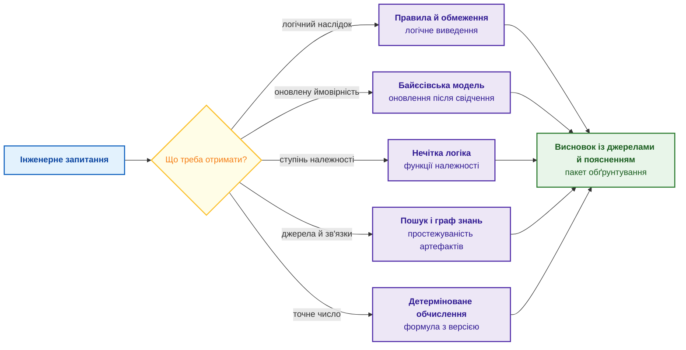
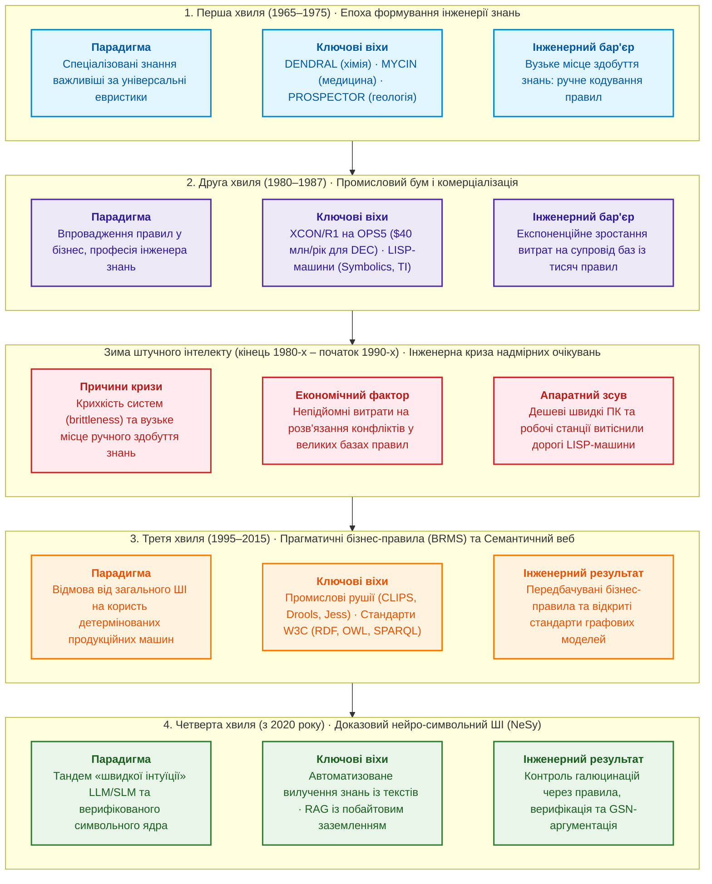
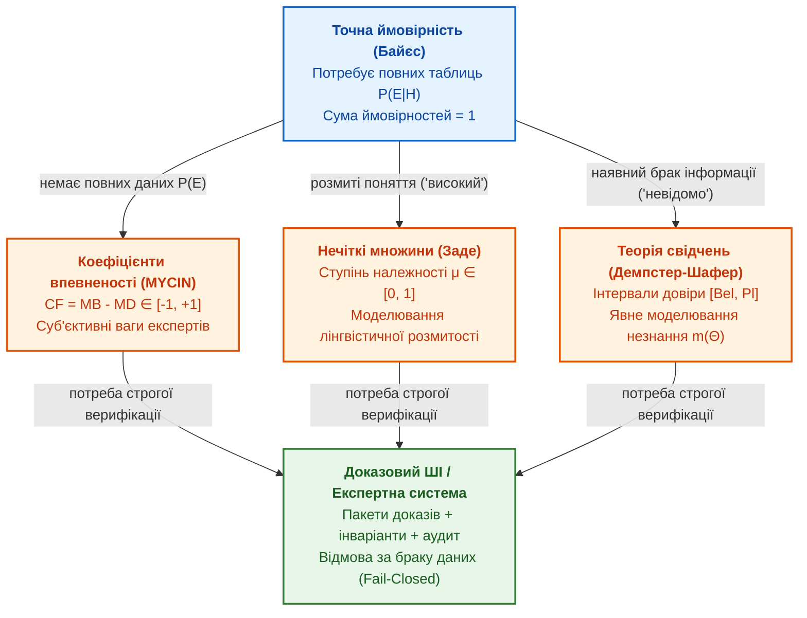
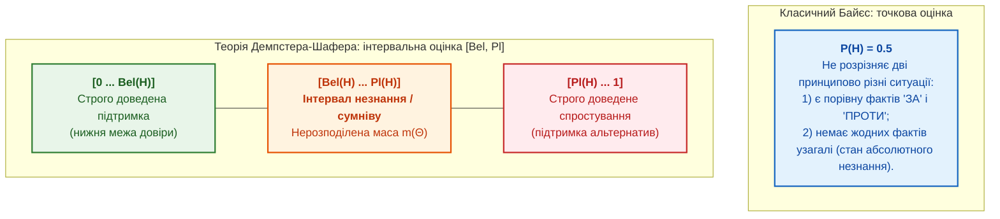
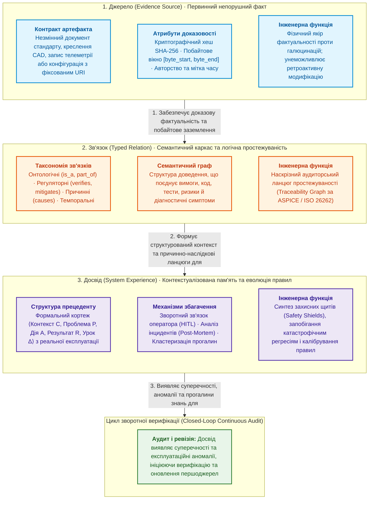
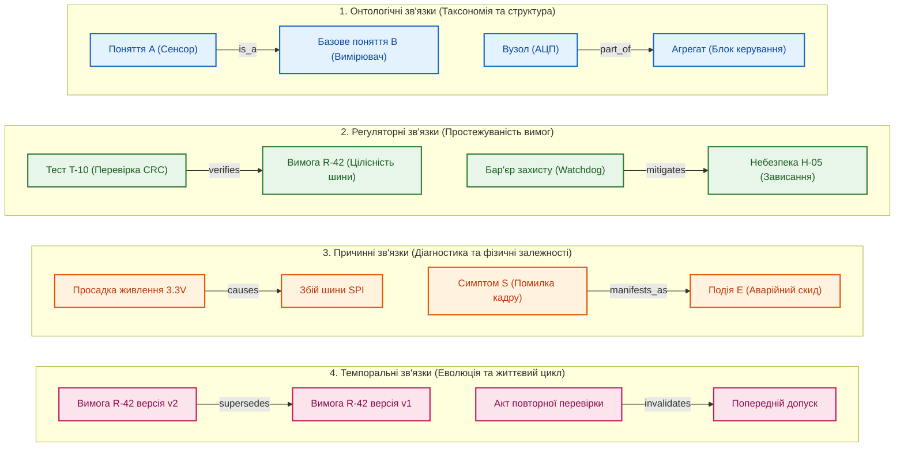
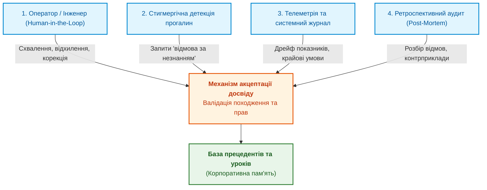
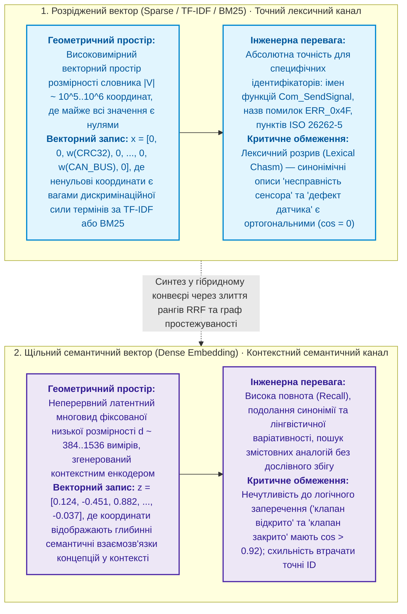
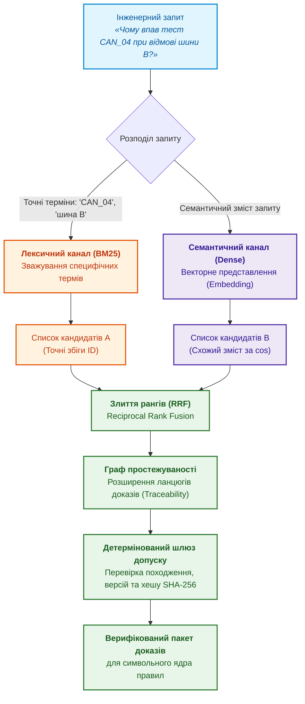
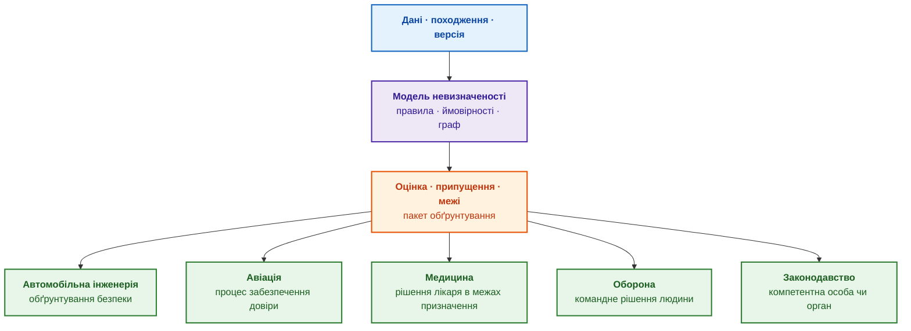

# Глава 4. Еволюція експертних систем: від теореми Байєса до доказових рішень ШІ

> **Книга:** [Архітектура доказових експертних систем](README.md) · [Частина I: Концептуальний та епістемічний фундамент](part-01-foundations.md)  
> **Попередня глава:** [Глава 3. Чим експертна система відрізняється від інформаційно-довідкової системи](ch03-beyond-reference-information-systems.md)  
> **Наступна глава:** [Глава 5. Тріада довіри: експертна система, доказова рекомендація та корпоративна пам'ять](ch05-triad-of-trust-and-corporate-memory.md)  
> **Зміст книги:** [README.md](README.md)  
> **Автор:** [Микола Федчик](about-the-author.md)  
> **Рівень:** базовий інженерний; приклади коду винесено в згорнуті блоки, формальні записи позначено словом «Формально»  
> **Очікувані результати:** простежити шлях від логіки й теореми Байєса через перші експертні системи на правилах (DENDRAL, MYCIN, PROSPECTOR, XCON) до сучасних доказових архітектур; обирати математичний апарат за типом невизначеності (правила, ймовірності, нечітка логіка, графи); пояснити інженерні причини «зим штучного інтелекту» й вимоги до доказовості висновку.

## Анотація
У главі досліджено шістдесятирічну еволюцію парадигм машинного міркування: від класичної математичної логіки, числення предикатів і теореми Байєса до сучасних доказових нейро-символьних архітектур (NeSy). Головна увага зосереджена на ролі формального апарату в архітектурі експертних систем: як саме математичні методи забезпечують детермінізм висновків, верифікованість логічного виведення та неспростовність доказів у критичних інженерних доменах (ISO 26262, IEC 61508, DO-178C). Запропоновано строгу таксономію методів обробки невизначеності (детерміновані продукційні правила, байєсівські мережі довіри, нечітка логіка Заде, теорія свідчень Демпстера–Шафера, графи знань та міркування за прецедентами). Проаналізовано інженерні причини чотирьох історичних хвиль розвитку та спадів («зим ШІ»), визначено фундаментальну тріаду доказовості (Джерело, Зв'язок, Досвід) та сформульовано практичні правила побудови верифікованих експертних систем.

Перед випуском нової версії вбудованого програмного забезпечення критичний регресійний тест упав, а після повторного перезапуску пройшов успішно. Чи дозволяє архітектура системи безпеки підписати дозвіл на випуск? Пошукова система знайде попередні звіти, статистичний чат-бот згенерує правдоподібний текст, але відповідальному інженеру потрібне зовсім інше: детермінований розрахунок того, як саме спостережувана аномалія змістила апостеріорний ризик відмови, чи порушено формальні інваріанти специфікації та яких верифікаційних артефактів бракує в доказовому пакеті. Експертні системи вирішували такі завдання задовго до появи великих мовних моделей, і кожна правильна відповідь вимагала вибору суворого математичного апарату під конкретний тип невизначеності. Логічне правило формує категоричний висновок або заборону, ймовірність калібрує стохастичний ризик, нечітка належність формалізує розмиті інженерні допуски, а детерміноване ядро обчислює метрики надійності за формулами стандартів. Змішування цих сутностей в одне евристичне псевдочисло руйнує доказовість і створює ілюзію впевненості замість гарантій безпеки.

Мета глави — розібрати еволюцію машинного міркування як послідовність інженерних відповідей на системні кризи та навчитися обирати обчислювальний апарат відповідно до типу невизначеності вхідних даних. Кожен метод розглядається крізь призму його ролі в архітектурі експертної системи: фізична сутність, числовий алгоритм, межі застосовності та спосіб передачі результату в шлюз допуску рішень.

## 1. Методологічний базис: класифікація невизначеності та вибір обчислювального апарату

Вибір математичного апарату в архітектурі експертної системи є первинним контрактом безпеки: спроба обробити стохастичну невизначеність детермінованими правилами призводить до комбінаторного вибуху та крихкості бази знань, а підміна нормативних логічних інваріантів імовірнісними оцінками нейромережі відкриває шлях до критичних аварій через пропуск одиничних небезпечних відмов. Класифікація невизначеності визначає, який саме обчислювальний механізм (Inference Engine) повинен обробляти вхідний факт, яку форму матиме сертифікат доведення (Proof Witness) та за якими критеріями система фіксуватиме стан невизначеності або відмовлятиме у видачі рекомендації.

Інженерні запитання відрізняються не стільки предметною темою, скільки типом очікуваного результату. В одних ситуаціях необхідно суворо з'ясувати, чи логічно випливає висновок із зафіксованих фактів; в інших — оцінити, наскільки нове спостереження змістило апостеріорний ризик відмови; у третіх — обчислити ступінь належності об'єкта до нечіткого інженерного критерію на кшталт «достатня зрілість архітектури». Для кожного типу невизначеності в теорії штучного інтелекту розроблено спеціалізований математичний метод, і жоден із них не є універсальною панацеєю. У таблиці нижче наведено базовий понятійний базис цього розділу.

| Термін | Пояснення |
|---|---|
| Факт | відомість про конкретний випадок, яку експертна система приймає як вхідні дані |
| Правило | явний зв'язок виду «якщо виконано умови, то випливає висновок» |
| Виведення | застосування правил або математичної моделі до фактів |
| Гіпотеза | можливе пояснення, яке перевіряють, наприклад «реліз проблемний» |
| Невизначеність | стан, у якому наявних відомостей недостатньо для однозначного висновку |
| Свідчення (*evidence*) | нове спостереження, документ чи вимірювання, яке підтримує або послаблює гіпотезу |
| Ймовірність | число від 0 до 1, яке в межах визначеної моделі описує невизначеність події |
| Детерміноване обчислення | обчислення, яке для однакових вхідних даних і версії формули дає однаковий результат |

Таблиця методів показує, на яке запитання відповідає кожен метод і чого метод сам по собі не гарантує.

| Метод | На яке запитання відповідає | Чого сам не гарантує |
|---|---|---|
| Правила й логічне виведення | Чи виконано явну умову, що випливає з перевірених фактів? | повноти правил і правильності вхідних фактів |
| Байєсівська модель | Як новий сигнал змінює оцінку ризику за визначеною ймовірнісною моделлю? | правильності початкових ймовірностей і припущень про залежності |
| Нечітка логіка | Наскільки об'єкт належить до проєктно визначеного поняття на кшталт «достатньо готовий»? | що довільна частка чи оцінка вже є нечіткою належністю |
| Граф знань | Які артефакти, версії та зв'язки утворюють ланцюжок доказів? | рішення без додаткових правил |
| Пошук джерел | Які документи чи фрагменти варто показати людині або мовній моделі? | істинності відповіді й повноти джерел |
| Детерміноване обчислення | Який результат дає зафіксована формула для зафіксованих входів? | правильності самої формули, вхідних даних і меж застосування |

Схема показує, як тип запитання спрямовує вибір методу.



Синій блок є запитанням, жовтий ромб є вибором за типом потрібного результату, фіолетові блоки є методами, зелений блок є пакетом обґрунтування, тобто висновком разом із фактами, правилами, джерелами й межами застосування ([Глава 1](ch01-introduction-to-expert-systems.md)). Методи не конкурують: одна експертна система може використовувати всі п'ять методів, але кожен метод відповідає за свій тип результату.

У прикладі з тестом, який то падає, то проходить, методи розподіляються так: правило випуску каже, чи дозволено повторний запуск; байєсівська модель оцінює, наскільки падіння змінило ризик; граф знань показує, які вимоги перевіряє тест; детермінований розрахунок обчислює метрики покриття. Пошук знаходить звіти, але жодного висновку сам не робить.

Вибір методу починається із запитання «що саме треба отримати?», а не з назви технології. Методи з'являлися в певному порядку, і кожна нова хвиля розв'язувала проблему попередньої. Наступний розділ простежує порядок появи методів.

## 2. Чотири хвилі еволюції експертних систем: від ранніх прототипів до нейро-символьного ШІ

Історія штучного інтелекту (ШІ) не є лінійним поступом. Періоди надмірних сподівань і промислових бумів чергувалися з розчаруваннями, які називають «зимами ШІ» [[2]](#src-2). Причини зим були інженерними, тому сучасний проєкт може повторити давні помилки в новій обгортці. Поділ історії на чотири хвилі нижче є спрощенням для інженера, а межі хвиль приблизні.



Синя, фіолетова, помаранчева й зелена хвилі є періодами зростання, червоний блок є зимою. Кожна наступна хвиля відповідала на проблему попередньої: промисловий бум виріс із перших успіхів, зима настала через ціну супроводу, третя хвиля відмовилася від претензій на загальний розум, четверта використовує мовні моделі там, де раніше бракувало ручної праці.

### 2.1. Перша хвиля (1965–1975): пріоритет предметних знань над універсальними евристиками

У 1950–1960-х роках дослідники сподівалися відтворити мислення кількома універсальними законами. Програма «Загальний розв'язувач задач» (*General Problem Solver*) Аллена Ньюелла й Герберта Саймона шукала розв'язок перебором станів, але захлиналася в комбінаторному вибуху, щойно задача виходила за межі головоломок [[2]](#src-2). Едвард Фейгенбаум зі Стенфордського університету сформулював протилежний принцип: сила інтелектуальної програми залежить передусім від кількості та якості знань про конкретну задачу, а не від універсальності алгоритму [[3]](#src-3). Цей принцип став основою інженерії знань (*knowledge engineering*). На принципі Фейгенбаума побудовано перші відомі експертні системи:

- **DENDRAL** (Стенфорд, з 1965 року; Едвард Фейгенбаум, Брюс Бьюкенен, Джошуа Ледерберг разом із лабораторією хіміка Карла Джерассі) пропонувала структурні формули органічних сполук за даними мас-спектрометрії. Автори називають DENDRAL першою експертною системою для формування наукових гіпотез [[4]](#src-4).
- **MYCIN** (Стенфорд, з 1972 року; Едвард Шортліфф) радив лікарям антибактеріальну терапію при бактеріємії та менінгіті й пояснював свої висновки відповідями на запитання «чому?» і «як?» [[5]](#src-5). У MYCIN з'явилися коефіцієнти впевненості, до яких глава повернеться нижче [[6]](#src-6).
- **PROSPECTOR** (SRI International, кінець 1970-х) оцінював перспективність родовищ корисних копалин за правилами геологів. 1982 року за геологічними картами гори Толман у штаті Вашингтон PROSPECTOR указав місце раніше невідомого промислового зруденіння молібдену [[7]](#src-7).

Перша хвиля показала, що експертна система сильна знаннями, а не алгоритмом. Знання доводилося переносити від експертів вручну, і саме ця праця згодом стала вузьким місцем.

### 2.2. Друга хвиля (1980–1987): промислова комерціалізація та LISP-машини

У 1980-х експертні системи перейшли з лабораторій у промисловість. Компанія Digital Equipment Corporation (DEC) продавала міні-комп'ютери VAX у тисячах конфігурацій модулів, кабелів і шасі, і люди-комплектувальники помилялися. Експертна система R1, згодом перейменована на XCON, яку Джон Макдермотт побудував мовою продукційних правил сімейства OPS, автоматизувала конфігурування замовлень [[8]](#src-8). За оцінкою, яку наводять Стюарт Расселл і Пітер Норвіг, до 1986 року XCON заощаджувала DEC близько 40 млн доларів на рік [[2]](#src-2). Виникли компанії, що випускали спеціалізовані LISP-машини (Symbolics, Lisp Machines Inc., Texas Instruments), і нова професія інженера знань: фахівця, який опитує експертів і перетворює досвід експертів на правила.

Друга хвиля довела комерційну цінність правил, але база знань XCON зросла до тисяч правил, і вартість супроводу почала рости швидше за користь.

### 2.3. Криза надмірних очікувань: чотири інженерні причини «Зими ШІ»

Наприкінці 1980-х ринок експертних систем обвалився: багато компаній не виконали обіцянок і збанкрутували [[2]](#src-2). Причин було чотири, і всі чотири інженерні:

1. **Вузьке місце здобуття знань** (*knowledge acquisition bottleneck*). Експерти не могли чітко сформулювати власні неявні евристики, а ручний запис правил тривав роки [[9]](#src-9).
2. **Крихкість** (*brittleness*). Експертна система не знала меж своєї компетентності: випадок, якого не передбачили автори правил, отримував хибний або безглуздий висновок замість відмови [[9]](#src-9).
3. **Складний супровід.** Порядок спрацювання правил залежав від стратегії розв'язання конфліктів і від порядку появи фактів, тому наслідки нового правила в базі з тисяч правил було важко передбачити, а будувати й супроводжувати експертні системи для складних предметних областей виявилося дорого [[2]](#src-2).
4. **Дорога інфраструктура.** Спеціалізовані LISP-машини програли звичайним робочим станціям і персональним комп'ютерам, які швидко дешевшали й наздоганяли LISP-машини за швидкодією.

Кожна з чотирьох причин має сучасний відповідник. Здобуття знань із документів розглядає [Глава 10](ch10-knowledge-acquisition-systems.md), межі компетентності й право на відмову [Глава 2](ch02-epistemology-of-machine-knowledge.md), перевірку бази знань [Глава 23](ch23-knowledge-base-verification.md), доступну обчислювальну інфраструктуру [Глава 18](ch18-execution-infrastructure.md).

### 2.4. Третя хвиля (1995–2015): продукційні рушії бізнес-правил (BRMS) та Семантичний веб

Після зими промисловість відмовилася від претензій на «загальний розум» і зосередилася на вузькій користі. Рушії бізнес-правил (*business rule engines*) CLIPS, Jess і Drools стали вбудованими бібліотеками для мов C і Java та зайняли ніші страхових розрахунків, банківського оцінювання ризиків і логістики. Консорціум Всесвітньої павутини (World Wide Web Consortium, W3C) стандартизував подання знань у вигляді графа: модель RDF описує твердження трійками «суб'єкт, предикат, об'єкт» [[10]](#src-10), мова OWL описує онтології, а мова запитів SPARQL дає змогу шукати в графі.

Третя хвиля зробила правила й графи знань звичайними інженерними компонентами, але не розв'язала проблеми здобуття знань: правила й онтології, як і раніше, писали люди.

### 2.5. Четверта хвиля (з 2020 року): доказовий нейро-символьний ШІ та конвергенція з мовними моделями

Великі мовні моделі (*large language models*, LLM) спершу хитнули маятник у бік чисто статистичного підходу. У регульованих галузях інженерні команди швидко натрапили на обмеження: вигадані твердження, різні відповіді на той самий запит, відсутність простежуваного зв'язку з джерелом і неможливість сертифікації ([Глава 3](ch03-beyond-reference-information-systems.md)). Сучасні доказові експертні системи поєднують два шари. Мовний шар, зокрема локальні мовні моделі, пришвидшує здобуття знань: знаходить у документах сутності, вимоги й зв'язки ([Глава 12](ch12-linguistic-analysis-and-local-models.md)). Символьний шар, тобто правила, графи знань і машина виведення, забезпечує перевірне виведення, відмову за браку доказів і матеріали для обґрунтування безпеки ([Глава 27](ch27-safety-case-gsn-synthesis.md), [Глава 29](ch29-neuro-symbolic-architecture.md)).

Історія повторює один урок: експертна система корисна настільки, наскільки знання експертної системи повні, перевірені й підтримувані. Мовні моделі полегшують здобуття знань, але не знімають потреби в явних правилах. З явних правил і варто почати огляд методів.

## 3. Математична логіка та продукційні правила (Modus Ponens, Rete)

Найпростішим і найбільш надійним для верифікації видом знання в архітектурі експертної системи є явне формальне правило. Логічне правило відповідає на запитання, чи випливає висновок із перевірених фактів (Logical Entailment). На відміну від стохастичних нейромереж, результат логічного виведення не є ймовірністю: за умови коректності синтаксису й істинності засновків висновок або строго доведено, або відкинуто.

**Формально: дедуктивне виведення за правилом Modus Ponens.**
Інженерна проблема недетермінізму та галюцинацій у шлюзах допуску: у критичних доменах (ISO 26262, IEC 61508) неприпустимо ухвалювати інженерні рішення на основі статистичної кореляції слів. Потрібен механізм формальної дедукції, який гарантує, що висновок $B$ є строго істинним, якщо істинними є перевірені факти $A$ та нормативне правило $A \rightarrow B$. Мета розрахунку — формування верифікованого кроку виведення в дереві доказів із бінарним результатом $B \in \{\mathbf{True}, \mathbf{False}\}$.

У правилі використовуються такі позначення:

```math
\frac{A\rightarrow B,\qquad A}{B}
```

- $A \in \{\mathbf{True}, \mathbf{False}\}$ — атомарний факт або кон'юнкція фактів, зафіксованих у базі знань (засновок);
- $A\rightarrow B$ — продукційне правило або нормативна вимога: матеріальна імплікація, де істинність $A$ гарантує істинність $B$;
- $B \in \{\mathbf{True}, \mathbf{False}\}$ — цільовий логічний наслідок (висновок або дія безпеки);
- горизонтальна риска — символ дедуктивного відокремлення в численні висловлювань.

**Практичне застосування та інженерні висновки:**
1. Розрахунок викликається алгоритмом зіставлення зі зразком (Pattern Matching у рушіях Rete / Treat) під час кожної зміни робочої пам'яті (Working Memory).
2. Якщо факт $A = \mathbf{True}$ та правило $A \rightarrow B$ активоване, рушій детерміновано додає факт $B$ до робочої пам'яті та записує крок виведення у сертифікат доведення (Proof Witness).
3. Якщо $A = \mathbf{False}$ або $A$ невідоме (умова відкритого світу), правило не спрацьовує; система не має права домислювати істинність $B$ і фіксує відсутність доказу.
4. Приклад у системі функціональної безпеки:
```text
Правило: Якщо зміна зачіпає вимогу безпеки (A), то обов'язковий аналіз впливу (B).
Факт: Зміна CR-17 зачіпає вимогу безпеки SR-42 (A = True).
Висновок: Для CR-17 обов'язковий аналіз впливу (B = True).
```
Будь-яка спроба проігнорувати крок $B$ блокує проходження шлюзу валідації релізу.

1965 року Джон Алан Робінсон запропонував принцип резолюції, який дав змогу машині автоматично доводити твердження логіки першого порядку [[11]](#src-11). Ідея полягала в автоматичному доведенні теорем над формалізованим корпусом знань.

Проте інженерна практика засвідчила, що реальні нормативи формулюються не у вигляді чистих математичних теорем, а у формі **продукційних правил** із пріоритетами та винятками. Продукційне правило фіксує зв'язок:

```text
ЯКЩО умова
ТО висновок або дія
```

Машина виведення застосовує продукційні правила двома основними способами, які залишаються базовими для промислових систем:

**Пряме виведення** (*forward chaining*) рухається від наявних фактів до отримання нових висновків. Нехай на початку відомі факти $A$, $B$ і $C$, а база знань містить два правила:

```math
F_0=\{A,B,C\},
\qquad
R=\{A\land B\rightarrow D,\;D\land C\rightarrow E\}.
```

- $F_0$ — початкова множина верифікованих фактів у робочій пам'яті;
- $R$ — множина скомпільованих продукційних правил;
- $A, B, C, D, E$ — атомарні предикати;
- $\land$ — логічна кон'юнкція, $\rightarrow$ — продукційна дія.

На першому циклі роботи рушія спрацьовує перше правило, додаючи факт $D$, а на наступному — друге правило:

```math
F_1=F_0\cup\{D\},
\qquad
F_2=F_1\cup\{E\}.
```

Виведення завершується, коли досягнуто нерухомої точки (Fixed Point) і жодне нове правило не додає фактів. Пряме виведення використовується в системах моніторингу та перевірки інваріантів: виявлення конфліктів у проєктній документації, діагностика відмов за сигналами телеметрії.

**Зворотне виведення** (*backward chaining*) рухається від поставленої цілі до пошуку підтверджувальних фактів:

```math
E
\Longleftarrow D\land C
\Longleftarrow (A\land B)\land C.
```

- $E$ — цільова гіпотеза, яку необхідно підтвердити або спростувати;
- $D$ і $C$ — підцілі першого рівня редукції;
- $A$ і $B$ — первинні факти, необхідні для виведення підцілі $D$;
- $\Longleftarrow$ — оператор редукції цілі до кон'юнкції підцілей.

Якщо ціллю є «готовність релізу до сертифікації», рушій розгортає дерево вимог униз: до конкретних звітів статичного аналізу, тестів покриття гілок та підписів відповідальних інженерів. Кожен відсутній лист дерева перетворюється на структурований інженерний дефект.

### 3.1. Символьні парадигми раннього ШІ: функціональний LISP та дескриптивний PROLOG

Символьні мови програмування LISP та PROLOG заклали два фундаментальні підходи до виконання логічних правил в експертних системах: імперативно-функціональне маніпулювання символьними структурами та дескриптивне логічне виведення за принципом резолюції Робінсона. Розуміння цих архітектурних концепцій критично важливе для інженера, оскільки саме вони визначають механіку роботи промислових рушіїв правил (Drools, CLIPS) та сучасних верифікаторів знань.

LISP був природним середовищем для символьного ШІ: списки, дерева, рекурсія й правила як дані, які програма може змінювати й виконувати. Мова правил CLIPS, яку в NASA почали розробляти 1985 року, успадкувала від LISP синтаксис із дужками. Правило в CLIPS є окремим артефактом: правило можна прочитати, протестувати, змінити й зберегти у версіях, а не ховати в довгій інструкції до мовної моделі.

PROLOG пішов іншим шляхом, шляхом логічного програмування: програміст описує факти й правила, а PROLOG сам шукає доведення. Пошук доведення в PROLOG є зворотним виведенням: запит стає ціллю, і PROLOG розкладає ціль на підцілі, доки не дійде до фактів.

<details>
<summary>Приклади мовами CLIPS і PROLOG: правило випуску й прогалини в доказах</summary>

Правило мовою CLIPS блокує випуск, якщо на випуск впливає відкритий критичний дефект. Конструкція `deffacts` задає факти прикладу.

```clips
(defrule vypusk-zablokovano-krytychnym-defektom
   (vypusk ?r)
   (defekt ?d)
   (vplyvaye ?d ?r)
   (seryoznist ?d krytychna)
   (stan ?d vidkrytyy)
   =>
   (assert (status-vypusku ?r zablokovano)))

(deffacts pryklad
   (vypusk v2.4.1)
   (defekt D-4)
   (vplyvaye D-4 v2.4.1)
   (seryoznist D-4 krytychna)
   (stan D-4 vidkrytyy))
```

Після команд `(reset)` і `(run)` правило спрацьовує й додає факт `(status-vypusku v2.4.1 zablokovano)`. Змінні `?r` і `?d` зв'язуються з конкретними випуском і дефектом, тож те саме правило працює для будь-якого випуску.

Мовою PROLOG правило з початку розділу записують так:

```prolog
vymoga_bezpeky(sr_42).
zachipaye(cr_17, sr_42).

potrebuye_analizu_vplyvu(Zmina) :-
    zachipaye(Zmina, Vymoga),
    vymoga_bezpeky(Vymoga).
```

Запит `?- potrebuye_analizu_vplyvu(cr_17).` отримує відповідь «так», а запит `?- potrebuye_analizu_vplyvu(X).` знаходить усі зміни, для яких потрібен аналіз впливу, у прикладі `X = cr_17`. Такий запит уже є не пошуком у документах, а міркуванням над базою фактів.

Той самий підхід знаходить прогалини в доказах. Програма нижче є не реалізацією стандарту функціональної безпеки, а прикладом локальної політики проєкту: політика шукає технічні вимоги безпеки без зв'язку з вищою вимогою, без перевірки або з проваленим тестом.

```prolog
technical_safety_requirement(tsr_enter_degraded_mode).
technical_safety_requirement(tsr_report_diagnostic_fault).

derived_from(tsr_enter_degraded_mode, fsr_detect_sensor_fault).
derived_from(tsr_report_diagnostic_fault, fsr_detect_sensor_fault).

verified_by(tsr_enter_degraded_mode, test_tsr_014).
test_passed(test_tsr_014).

includes(release_2026_05, tsr_enter_degraded_mode).
includes(release_2026_05, tsr_report_diagnostic_fault).

missing_safety_evidence(Req, safety_trace) :-
    technical_safety_requirement(Req),
    \+ derived_from(Req, _).
missing_safety_evidence(Req, verification) :-
    technical_safety_requirement(Req),
    \+ verified_by(Req, _).
missing_safety_evidence(Req, failed_test) :-
    verified_by(Req, Test),
    \+ test_passed(Test).

release_requires_safety_review(Release) :-
    includes(Release, Req),
    missing_safety_evidence(Req, _).
```

Запит `?- missing_safety_evidence(tsr_report_diagnostic_fault, Reason).` повертає `Reason = verification`: вимога має зв'язок із вищою вимогою, але не має перевірки. Запит `?- release_requires_safety_review(release_2026_05).` отримує відповідь «так», бо випуск містить вимогу без перевірки. Оператор `\+` означає «не вдалося довести», тобто PROLOG вважає відсутній факт хибним; таке припущення замкненого світу допустиме лише для повного переліку фактів ([Глава 2](ch02-epistemology-of-machine-knowledge.md)). Так само перевіряють ланцюжок «загроза, рішення щодо ризику, вимога, перевірка» для вимог кібербезпеки автомобільних систем за ISO/SAE 21434 [[12]](#src-12).

</details>

LISP показав, як будувати гнучкі символьні рушії правил, а PROLOG показав, як формально ставити запитання до знань: що доводиться, чого бракує, які факти потрібні. Сучасні експертні системи рідко пишуть цими мовами, але архітектура «база знань, правила, виведення, пояснення» залишилася.

## 4. Байєсівська парадигма: оновлення апріорної впевненості за наявності емпіричних свідчень

В експлуатації складних інженерних систем абсолютний детермінізм правил стикається з реальністю стохастичних шумів, неідеальних датчиків та нестабільних тестів. Коли система фіксує одиничне падіння регресійного тесту або аномальний сплеск показників датчика, продукційна логіка пропонує лише крайнощі: або повністю заблокувати випуск, або проігнорувати сигнал. Байєсівська парадигма розв'язує задачу кількісної оцінки ризику: як саме нове емпіричне спостереження (свідчення) зміщує апріорну впевненість системи в наявності прихованого дефекту. У цьому розділі термін «свідчення» означає спостережуваний факт або вимірювання (*evidence*), а не математичне доведення.

**Формально: інженерна модель байєсівського оновлення ризику дефекту.**
Інженерна проблема кількісної оцінки ймовірності відмови на основі неідеальних діагностичних сигналів: одиничне падіння тесту може свідчити як про критичну регресію, так і про нестабільність самого тестового оточення (Flaky Test). Спроба діяти евристично призводить або до зупинки конвеєра через хибні спрацьовування, або до випуску дефектного ПЗ. Мета розрахунку — точне обчислення апостеріорної ймовірності наявності дефекту $\Pr(H\mid E) \in [0, 1]$ на основі зафіксованої чутливості діагностичного тесту та базового рівня дефектності.

У розрахунку використовуються такі параметри:

```math
\Pr(H\mid E)=\frac{\Pr(E\mid H)\,\Pr(H)}{\Pr(E)},\qquad \Pr(E)>0
```

- $H \in \{0, 1\}$ — гіпотеза про наявність критичного дефекту в релізі ($H=1$ — дефект наявний);
- $E \in \{0, 1\}$ — емпіричне свідчення ($E=1$ — тест зафіксував падіння);
- $\Pr(H) \in [0, 1]$ — апріорна ймовірність дефекту (базовий рівень відмов за історичними даними);
- $\Pr(E\mid H) \in [0, 1]$ — чутливість тесту (ймовірність падіння тесту за умови реального дефекту, True Positive Rate);
- $\Pr(E) \in (0, 1]$ — повна ймовірність падіння тесту з урахуванням хибних тривог;
- $\Pr(H\mid E) \in [0, 1]$ — апостеріорна ймовірність дефекту після врахування результату тесту.

Повна ймовірність свідчення для двох взаємовиключних станів ($H$ і $\neg H$) обчислюється за формулою повної ймовірності:

```math
\Pr(E)=\Pr(E\mid H)\Pr(H)+\Pr(E\mid\neg H)\Pr(\neg H),\qquad \Pr(\neg H)=1-\Pr(H)
```

де $\Pr(E\mid\neg H)$ — рівень хибних тривог тесту (False Positive Rate) на стабільних релізах.

**Практичне застосування та інженерні висновки:**
1. Розрахунок викликається автоматично підсистемою контролю якості при отриманні негативного результату автоматизованого тестування.
2. Нехай для певного класу релізів історичний брак становить $\Pr(H)=0{,}05$, чутливість тесту $\Pr(E\mid H)=0{,}80$, а рівень хибних тривог $\Pr(E\mid\neg H)=0{,}10$.
3. Повна ймовірність падіння становить $\Pr(E) = 0{,}80\cdot 0{,}05 + 0{,}10\cdot 0{,}95 = 0{,}135$. Апостеріорний ризик:
```math
\Pr(H\mid E)=\frac{0{,}80\cdot 0{,}05}{0{,}135} = \frac{0{,}04}{0{,}135} \approx 0{,}296\quad (29{,}6\,\%).
```
4. Інженерні висновки експертної системи:
   - Падіння тесту підняло ризик дефекту з 5 % до 29,6 % (зростання у 6 разів).
   - Проте рівень 29,6 % означає, що у 70,4 % випадків це падіння є хибною тривогою. Автоматичне блокування випуску є передчасним, але ігнорування неприпустиме.
   - Система ініціює перехід у контрольований режим: призначає обов'язковий ізольований повторний тест або ручний інженерний перегляд для пошуку підтверджувальних доказів.

**Формально: відношення правдоподібностей (Likelihood Ratio) та фактор сили свідчення.**
Для оцінки діагностичної спроможності самого тесту окремо від апріорного браку обчислюють відношення правдоподібностей:

```math
\mathrm{LR}^{+}=\frac{\Pr(E\mid H)}{\Pr(E\mid\neg H)}=\frac{0{,}80}{0{,}10}=8
```

- $\mathrm{LR}^{+} \in [0, \infty)$ — додатне відношення правдоподібностей для свідчення $E$;
- $\mathrm{LR}^{+} > 1$ свідчить на користь дефекту, $\mathrm{LR}^{+} < 1$ свідчить про відсутність дефекту, $\mathrm{LR}^{+} = 1$ вказує на повну діагностичну марність тесту;
- Значення $\mathrm{LR}^{+}=8$ показує, що падіння тесту у 8 разів більш характерне для дефектного коду, ніж для справного.

Через відношення шансів (*odds*) формула Байєса набуває мультиплікативного вигляду:

```math
\frac{\Pr(H\mid E)}{1-\Pr(H\mid E)}=\frac{\Pr(H)}{1-\Pr(H)}\cdot\mathrm{LR}^{+}
```

Початкові шанси $\frac{0{,}05}{0{,}95} \approx 0{,}0526$, помножені на $\mathrm{LR}^{+}=8$, дають апостеріорні шанси $\approx 0{,}421$, що відповідає ймовірності $\frac{0{,}421}{1 + 0{,}421} \approx 0{,}296$. Якщо для тесту $\mathrm{LR}^{+} < 3$, експертна система маркує його як слабкий діагностичний сигнал і забороняє використовувати його як блокувальний фактор.

- $\Pr(H)$ є початковою ймовірністю, а $\Pr(H\mid E)$ є ймовірністю після свідчення;
- $p/(1-p)$ перетворює ймовірність $p$ на шанси, тобто відношення ймовірності події до ймовірності протилежної події;
- $\mathrm{LR}^{+}$ є відношенням правдоподібностей свідчення, визначеним вище;
- для скінченних шансів потрібні ймовірності строго між 0 і 1.

Початкові шанси множать на силу свідчення й отримують оновлені шанси. Для прикладу $\frac{0{,}05}{0{,}95}\cdot 8=\frac{8}{19}$, звідки $\Pr(H\mid E)=\frac{8}{8+19}=\frac{8}{27}$, тобто ті самі 29,6 %.

**Формально: кілька свідчень.** Для двох свідчень $E_1$ і $E_2$ загальна формула не потребує припущення про незалежність:

```math
\Pr(H\mid E_1,E_2)=\frac{\Pr(E_1,E_2\mid H)\,\Pr(H)}{\Pr(E_1,E_2)}.
```

Складники спільного оновлення:

- $H$ є гіпотезою, а $E_1$ і $E_2$ є двома свідченнями;
- кома між $E_1$ і $E_2$ означає, що спостерігають обидва свідчення разом;
- $\Pr(E_1,E_2\mid H)$ є ймовірністю обох свідчень за умови $H$;
- $\Pr(E_1,E_2)$ є загальною ймовірністю обох свідчень і має бути більшою за нуль;
- $\Pr(H\mid E_1,E_2)$ є ймовірністю гіпотези після обох свідчень; вона лежить у $[0,1]$.

Оновлювати можна й послідовно, якщо на другому кроці взяти правдоподібність, яка вже враховує перше свідчення:

```math
\Pr(H\mid E_1,E_2)=\frac{\Pr(E_2\mid H,E_1)\,\Pr(H\mid E_1)}{\Pr(E_2\mid E_1)}.
```

- $\Pr(H\mid E_1)$ є ймовірністю гіпотези після першого свідчення;
- $\Pr(E_2\mid H,E_1)$ є ймовірністю другого свідчення з урахуванням $H$ і вже відомого $E_1$;
- $\Pr(E_2\mid E_1)$ є ймовірністю другого свідчення після першого й має бути більшою за нуль;
- результат $\Pr(H\mid E_1,E_2)$ знову лежить у $[0,1]$.

Лише коли свідчення $E_1$ і $E_2$ умовно незалежні за кожного зі станів $H$ і $\neg H$, шанси можна множити на відношення правдоподібностей кожного свідчення:

```math
\mathrm{Odds}(H\mid E_1,E_2)=\mathrm{Odds}(H)\cdot\mathrm{LR}_1\cdot\mathrm{LR}_2.
```

- $\mathrm{Odds}(H)$ є початковими шансами гіпотези $H$;
- $\mathrm{LR}_1$ і $\mathrm{LR}_2$ є відношеннями правдоподібностей першого й другого свідчень;
- $\mathrm{Odds}(H\mid E_1,E_2)$ є шансами після обох свідчень; шанси є невід'ємними, але не є ймовірностями в $[0,1]$;
- умова формули: $E_1$ і $E_2$ умовно незалежні за кожного зі станів $H$ і $\neg H$.

Провалений тест і відкритий дефект часто мають спільну причину. Якщо вважати такі свідчення незалежними, модель двічі врахує те саме свідчення й завищить ризик.

Оновлена ймовірність має сенс лише разом із паспортом моделі: визначеннями $H$ і $E$; джерелом і часовим вікном для початкових і умовних ймовірностей; способом обробки пропущених даних; припущеннями про залежності між свідченнями; версією моделі й результатами калібрування ([Глава 25](ch25-how-expert-systems-learn.md)); політикою, що перетворює оцінку на додатковий тест або людський перегляд. Останній пункт відділяє оцінювання від рішення: байєсівська модель оновлює ймовірність, але не вирішує, хто має право випустити автомобільний компонент, обрати лікування чи встановити юридичний наслідок.

Теорема Байєса дає точний спосіб оновлювати впевненість, але вимагає початкових і умовних ймовірностей, які в складній предметній області важко оцінити й підтримувати. Експерт може сказати «це сильний сигнал», але не може обґрунтувати, що $\Pr(E\mid H)=0{,}73$. Тому поряд із теоремою Байєса розвивалися простіші моделі невизначеності.

## 5. Евристичні моделі невизначеності за неповної апріорної інформації

Три підходи нижче з'явилися саме тоді, коли повної ймовірнісної моделі побудувати не вдавалося. Кожен підхід вимірює власну величину, і величини трьох підходів не можна змішувати ні між собою, ні з ймовірністю.



### 5.1. Числення коефіцієнтів впевненості в системі MYCIN

Творці медичної експертної системи MYCIN (Стенфорд, 1970-ті роки) зіткнулися з інженерною проблемою: експерти-практики не володіли точними таблицями апостеріорних і умовних ймовірностей для сотень симптомів, але впевнено оцінювали спрямованість свідчень. Едвард Шортліфф і Брюс Бьюкенен запропонували апарат коефіцієнтів впевненості (*certainty factors*, CF) [[6]](#src-6) як альтернативу байєсівському виведенню, що не потребує знання апріорних розподілів.

**Формально: інженерна модель коефіцієнта впевненості.**
Інженерна проблема агрегування експертних суджень за браку статистичних розподілів: якщо вимагати від інженерів точних ймовірностей відмов рідкісних компонентів, система отримує вигадані або некогерентні числа. Мета розрахунку — обчислення нормованого коефіцієнта $CF(H, E) \in [-1, 1]$, що відображає ступінь підтвердження або спростування гіпотези $H$ свідченням $E$ без вимоги адитивності (сума $CF$ за всіма гіпотезами не зобов'язана дорівнювати 1).

У розрахунку використовуються такі параметри:

```math
CF(H,E)=MB(H,E)-MD(H,E)
```

- $H \in \mathcal{H}$ — аналізована гіпотеза (наприклад, «причиною відмови є пробій ізоляції»);
- $E \in \mathcal{E}$ — спостережуване свідчення (симптом, помилка телеметрії);
- $MB(H,E) \in [0, 1]$ — міра зростання впевненості (Measure of Increased Belief);
- $MD(H,E) \in [0, 1]$ — міра зростання невпевненості (Measure of Increased Disbelief);
- $CF(H,E) \in [-1, 1]$ — результуючий коефіцієнт впевненості.

Для поєднання двох незалежних свідчень $E_1$ та $E_2$, що підтримують одну й ту саму гіпотезу ($CF_1, CF_2 \ge 0$), застосовується асимптотична формула накопичення:

```math
CF_{1\oplus2}=CF_1+CF_2\,(1-CF_1),\qquad 0\le CF_1,CF_2\le1
```

- $CF_1, CF_2 \in [0, 1]$ — первинні коефіцієнти впевненості від двох незалежних евристичних правил;
- $1 - CF_1$ — залишкова частка невизначеності;
- $CF_{1\oplus2} \in [0, 1]$ — кумулятивна впевненість ($CF_{1\oplus2} \ge \max(CF_1, CF_2)$).

**Практичне застосування та інженерні висновки:**
1. Розрахунок виконується рушієм продукційних правил під час обробки експертних діагностичних матриць.
2. Нехай тест шини дав $CF_1 = 0{,}60$, а термодатчик додав свідчення з $CF_2 = 0{,}50$. Підсумкова впевненість становить $CF_{1\oplus2} = 0{,}60 + 0{,}50 \cdot (1 - 0{,}60) = 0{,}80$.
3. Інженерний висновок: досягнення рівня $CF \ge 0{,}75$ є тригером для призначення цільового інспектування вузла. Проте $CF$ не є фізичною ймовірністю і не може використовуватися для розрахунку гарантійних строків чи сертифікаційних метрик надійності (FIT/MTBF).

### 5.2. Апарат нечіткої логіки (Fuzzy Logic) Заде: функції належності та фазифікація

У критичних системах значна частина параметрів має природно розмиті інженерні межі: «висока робоча температура», «критична вібрація підшипника», «високий знос інструменту». Якщо задати жорстке порогове правило «якщо $T \ge 85^\circ\text{C}$, то аварія», виникає граничний брязкіт (boundary chatter): при коливанні температури $84{,}9^\circ\text{C} \leftrightarrow 85{,}1^\circ\text{C}$ система безпеки хаотично вмикатиме й вимикатиме аварійні протоколи. Лотфі Заде 1965 року запропонував апарат нечітких множин, де належність об'єкта до множини є неперервною величиною [[14]](#src-14).

**Формально: інженерна модель функції належності та нечіткої кон'юнкції.**
Інженерна проблема усунення стрибкоподібної дестабілізації в циклі керування: дискретні логічні пороги спричиняють високочастотні перемикання виконавчих механізмів. Мета розрахунку — відображення неперервної фізичної величини $x \in X$ у ступінь належності $\mu_A(x) \in [0, 1]$ з наступним обчисленням узагальненого рівня готовності чи ризику за Т-нормою Заде.

У розрахунку використовуються такі параметри:

```math
\mu_A:X\to[0,1],\qquad x\mapsto\mu_A(x)
```

- $X \subseteq \mathbb{R}$ — фізичний універсум вимірюваної величини (температура в °C, тиск у барах, покриття тестами у %);
- $x \in X$ — конкретне виміряне значення параметра з каліброваного датчика;
- $A$ — нечітка лінгвістична змінна («перегрів», «готовність релізу»);
- $\mu_A(x) \in [0, 1]$ — ступінь належності виміру $x$ до поняття $A$ (0 — повна невідповідність, 1 — ідеальна відповідність).

Для оцінки готовності релізу за трьома критичними критеріями («покриття тестами», «наявність погоджень», «відсутність блокувальних дефектів») застосовується консервативна Т-норма мінімуму (найслабша ланка системи безпеки):

```math
\mu_{\text{готовність}}=\min\bigl(\mu_{\text{тести}}(x_1),\ \mu_{\text{погодження}}(x_2),\ \mu_{\text{дефекти}}(x_3)\bigr)
```

**Практичне застосування та інженерні висновки:**
1. Розрахунок викликається циклічно в оперативному середовищі моніторингу або перед формуванням звіту про готовність.
2. Нехай телеметрія проєкту показує: покриття тестами відповідає нормі зі ступенем $\mu_{\text{тести}} = 0{,}70$; статус закриття дефектів $\mu_{\text{дефекти}} = 0{,}60$; але погодження архітектора безпеки підписано лише частково: $\mu_{\text{погодження}} = 0{,}40$.
3. Підсумкова готовність: $\mu_{\text{готовність}} = \min(0{,}70;\ 0{,}40;\ 0{,}60) = 0{,}40$.
4. Інженерний висновок: система консервативно блокує автоматичний випуск, оскільки найслабша ланка ($\mu = 0{,}40$) не досягає сертифікаційного порогу $\tau_{\text{release}} = 0{,}80$. Нечітка логіка точно вказує на дефіцитний ресурс (погодження), запобігаючи маскуванню проблеми високими балами інших параметрів.

#### 5.2.1. Апаратна реалізація та інтеграція нечіткої логіки з мовними моделями

Поширена ілюзія сучасної інженерії полягає в спробі замінити функції належності ймовірнісним виходом великих мовних моделей (LLM). Проте ймовірнісний апарат мовних моделей і нечітка логіка розв'язують різні класи невизначеності:
1. **Ймовірність проти ступеня істинності:** Шар $\mathrm{Softmax}$ мовної моделі розподіляє одиничну ймовірність ($\sum P_i = 1$) між взаємовиключними токенами (випадковість), тоді як нечітка логіка Заде оперує незалежними ступенями відповідності розмитому поняттю ($\mu \in [0, 1]$), де кілька протилежних властивостей можуть бути одночасно істинними зі своїми вагами без вимоги суми в одиницю.
2. **Нейро-символьний розподіл праці:** Мовна модель непридатна для ролі числового рушія нечіткого виведення через арифметичні галюцинації та стохастичний дрейф. Проте в нейро-символьному тандемі ([Глава 29](ch29-neuro-symbolic-architecture.md)) мовна модель є інструментом **лінгвістичної фазифікації** (переклад описів природною мовою «дещо завищений струм», «критично висока вібрація» у числові модифікатори) та **лінгвістичної дефазифікації** (пояснення підсумкового висновку людині-оператору).
3. **Обчислювальні платформи:** Для розрахунку нечітких правил програмно найкраще підходять детерміновані SIMD-векторизовані рушії (AVX-512 / ARM Neon), які виконують паралельні операції $\min$ та $\max$ за одиниці наносекунд без динамічного виділення пам'яті. У критичних до затримок циклах керування (ASIL-D) нечітка логіка розраховується на цифрових ПЛІС (FPGA) без блоків множення або на субпорогових аналогових мікросхемах із транзисторними селекторами струмів та схемами вибору переможця (Winner-Take-All).

Повний математичний апарат нечітких Т-норм, формули дефазифікації Мамдані й Такагі–Сугено, векторну оптимізацію та апаратні архітектури викладено в [Главі 6](ch06-applied-mathematics-for-expert-systems.md#нечітка-логіка-ступінь-замість-різкої-межі); аналогову реалізацію на субпорогових МОН-транзисторах за схемами Такеші Ямакави та Карвера Міда розглядає [Додаток Г](appendix-d-analog-expert-systems-and-neuromorphic-computing.md#апаратна-нечітка-логіка-й-вибір-переможця).

### 5.3. Теорія свідчень Демпстера–Шафера: базовий розподіл довіри та міри вірогідності

В інженерній діагностиці спостереження часто свідчить не про одну конкретну відмову, а про підмножину можливих несправностей, залишаючи частину довіри на невідомі фактори. Класична теорія ймовірностей змушує розподіляти одиничну міру між атомарними гіпотезами навіть за відсутності інформації (принцип недостатнього обґрунтування Лапласа). Теорія свідчень Демпстера–Шафера [[15]](#src-15), [[16]](#src-16) усуває це обмеження: базова маса довіри призначається підмножинам простору гіпотез, дозволяючи явно моделювати стан невігластва (Epistemic Ignorance) через призначення маси універсальній множині $\Theta$.

**Формально: інженерна модель правила поєднання свідчень Демпстера.**
Інженерна проблема агрегування суперечливих показань гетерогенних датчиків: коли один сенсор вказує на дефект компонента $S$, а інший — на обрив лінії $L$, байєсівська модель може дати хибне усереднення. Необхідно явно кількісно оцінити рівень міжсенсорного конфлікту $K$ та обчислити інтервал довіри $[\mathrm{Bel}(A), \mathrm{Pl}(A)]$, де ширина інтервалу вказує на обсяг браку інформації.

У розрахунку використовуються такі параметри:

```math
\begin{aligned}
K&=\sum_{B\cap C=\varnothing}m_1(B)\,m_2(C),\\
m_{1\oplus2}(A)&=\frac{\displaystyle\sum_{B\cap C=A}m_1(B)\,m_2(C)}{1-K},\qquad A\ne\varnothing,\ K<1
\end{aligned}
```

- $\Theta = \{H_1, H_2, \dots, H_n\}$ — скінченний простір взаємовиключних елементарних гіпотез (Frame of Discernment);
- $2^{\Theta}$ — булеан (множина всіх підмножин $\Theta$);
- $m_1, m_2: 2^{\Theta} \to [0, 1]$ — базові розподіли ймовірнісної маси (Basic Belief Assignment, BBA) двох незалежних джерел, де $m(\varnothing) = 0$ та $\sum_{A \subseteq \Theta} m(A) = 1$;
- $m(\Theta) \in [0, 1]$ — маса, призначена повному незнанню (нерозподілена довіра);
- $K \in [0, 1]$ — коефіцієнт конфлікту між джерелами (сума добутків мас для неперетинних гіпотез);
- $m_{1\oplus2}(A)$ — комбінована маса довіри за ортогональним правилом Демпстера;
- $\mathrm{Bel}(A) = \sum_{B \subseteq A} m(B)$ — функція довіри (нижня межа неспростовного доказу);
- $\mathrm{Pl}(A) = \sum_{B \cap A \ne \varnothing} m(B)$ — функція правдоподібності (верхня межа гіпотези, яка ще не спростована).

**Практичне застосування та інженерні висновки:**
1. Розрахунок викликається підсистемою комплексування інформації (Sensor Fusion) у багатоканальних діагностичних комплексах.
2. Нехай датчик струму підтримує гіпотезу пробою $S$ з масою $m_1(\{S\}) = 0{,}60$ і залишає $m_1(\Theta) = 0{,}40$ на незнання. Зовнішній акустичний датчик підтримує лінію $L$ з масою $m_2(\{L\}) = 0{,}50$ та $m_2(\Theta) = 0{,}50$.
3. Конфлікт між датчиками: $K = m_1(\{S\}) \cdot m_2(\{L\}) = 0{,}60 \cdot 0{,}50 = 0{,}30$.
4. Нормувальний коефіцієнт: $1 - K = 0{,}70$.
5. Об'єднані маси:
   - $m_{1\oplus2}(\{S\}) = (0{,}60 \cdot 0{,}50) / 0{,}70 = 0{,}30 / 0{,}70 \approx 0{,}43$;
   - $m_{1\oplus2}(\{L\}) = (0{,}40 \cdot 0{,}50) / 0{,}70 = 0{,}20 / 0{,}70 \approx 0{,}29$;
   - $m_{1\oplus2}(\Theta) = (0{,}40 \cdot 0{,}50) / 0{,}70 = 0{,}20 / 0{,}70 \approx 0{,}29$.
6. Отримані інтервали довіри $[\mathrm{Bel}, \mathrm{Pl}]$:
   - Для дефекту датчика $S$: $[\mathrm{Bel}(\{S\}), \mathrm{Pl}(\{S\})] = [0{,}43;\ 0{,}72]$;
   - Для обриву лінії $L$: $[\mathrm{Bel}(\{L\}), \mathrm{Pl}(\{L\})] = [0{,}29;\ 0{,}57]$.
7. Критерій аварійного відключення: якщо міра конфлікту перевищує поріг безпеки $K \ge K_{\text{alarm}} = 0{,}75$, класичне правило Демпстера забороняється через парадокс Заде (неадекватне підсилення мізерних спільних підмножин). Система генерує сигнал тривоги «Sensor Discrepancy Fault» і переходить у захисний режим Fail-Safe.



Теорія Демпстера–Шафера не стала масовою, бо теорію складніше пояснювати й підтримувати, ніж простіші оцінки. Проте ідея теорії важлива для доказових експертних систем: джерела можуть підтримувати висновок по-різному й суперечити одне одному, і експертна система має вміти сказати не лише «так» чи «ні», а й «джерела суперечать одне одному». Якщо тест каже одне, статус задачі інше, а вимога змінилася після базової версії, експертна система не вибирає найкрасивіший текст, а показує конфлікт.

Коефіцієнти впевненості, ступені належності й маси довіри вимірюють різні величини. Помилкою є не вибір одного з трьох методів, а змішування шкал у спільне число «впевненості». Наступний розділ переходить від величин до структури: як зберігати зв'язки між фактами, джерелами й досвідом.

## 6. Онтологічний простір: типізовані зв'язки, джерела та моделі інженерного досвіду

Числа, ймовірності та функції належності позбавлені сенсу, якщо експертна система не знає, як факти структуровані, де розташовані первинні джерела та як спиратися на накопичений інженерний досвід. Доказовий висновок завжди спирається на непорушну тріаду: **Джерело** забезпечує фактологічну автентичність, **Зв'язок** задає семантичну структуру міркування, а **Досвід** дозволяє системі еволюціонувати без повторення минулих помилок.

### 6.1. Фундаментальна тріада знань: Джерело, Зв'язок та Інженерний досвід

Щоб відрізнити доказовий штучний інтелект від хаотичного набору неперевірених фрагментів тексту, експертна система спирається на строгі визначення трьох базових складових:



#### 6.1.1. Джерело доказовості (Evidence Source) та його атрибути
**Джерело** — це незмінний, однозначно ідентифікований та атрибутований первинний артефакт (документ стандарту, креслення, файл конфігурації, запис системного журналу, протокол випробувань), із якого вилучено факт чи твердження. 

На відміну від «сирих даних» або знеособленої текстової цитати, джерело в доказовій експертній системі ([Глава 8](ch08-engineering-artifacts-as-data.md)) має строгий контракт:
- **Унікальний ідентифікатор і версія:** сталий URI або коміт системи контролю версій;
- **Криптографічний інваріант незмінності:** хеш-сума вмісту (наприклад, SHA-256), що виключає непомітне підмінення або ретроактивну модифікацію тексту;
- **Побайтові координати:** точний діапазон зміщення `[byte_start, byte_end]`, який прив'язує твердження до фізичного рядка в першоджерелі ([Глава 2](ch02-epistemology-of-machine-knowledge.md));
- **Походження (Provenance):** авторство, часова мітка затвердження, статус чинності (дійсний, проєкт, відкликаний).

#### 6.1.2. Типізовані семантичні зв'язки (Typed Relations)
**Зв'язок** — це спрямоване, семантично типізоване відношення між двома сутностями або об'єктами бази знань, яке визначає, як одне твердження, вимога чи спостереження впливає на інше. Без зв'язків система має лише ізольовані факти; саме зв'язки перетворюють набір документів на перевірюваний ланцюг доведення.

В інженерних експертних системах зв'язки поділяють на чотири фундаментальні класи:



1. **Онтологічні та структурні зв'язки:** формують понятійну ієрархію предметної області (`is_a`, `part_of`, `subClassOf`). Вони дозволяють машині виведення спадкувати властивості понять за дефолтом (наприклад, якщо датчик температури є аналоговим сенсором, він спадкує вимоги до калібрування АЦП).
2. **Регуляторні зв'язки та простежуваність (Traceability):** пов'язують вимоги стандартів, проєктні рішення, код і тести (`satisfies`, `verifies`, `mitigates`, `traces_to`). Саме ці зв'язки формують матрицю відповідності для сертифікаційного аудиту ([Глава 9](ch09-engineering-knowledge-graph-traceability.md)).
3. **Причинно-наслідкові та діагностичні зв'язки:** описують фізичні залежності між дефектами, відмовами та спостережуваними симптомами (`causes`, `manifests_as`, `indicates`). Вони утворюють основу для байєсівських мереж та дерев відмов (FTA) ([Глава 24](ch24-system-diagnosis.md)).
4. **Темпоральні та еволюційні зв'язки:** фіксують хронологію змін і скасувань (`supersedes`, `invalidates`, `precedes`). Вони запобігають використанню застарілих норм і забезпечують відкат рішень у разі відкликання первинних звітів.

#### 6.1.3. Інженерний досвід як формалізований корпус прецедентів <a id="кортеж-інженерного-досвіду"></a>
**Досвід** в архітектурі експертної системи — це структурований архів розв'язаних інженерних колізій, верифікованих рішень та їхніх спостережуваних наслідків (як успішних пусків, так і аварійних зупинок). Накопичений досвід дозволяє системі адаптувати свою поведінку без повторного проходження всього комбінаторного дерева виведення з нуля.

**Формально: інженерна модель прецеденту досвіду.**
Інженерна проблема повторення раніше зафіксованих критичних помилок: якщо знання системи обмежені статичним зводом нормативів, система щоразу наступає на відомі граничні колізії реального обладнання. Мета розрахунку — формалізація одиниці емпіричного досвіду у вигляді структурованого кортежу $E$ для швидкого міркування за аналогією (CBR) та автоматичного формування захисних контрправил (Safety Shields).

У моделі прецеденту використовуються такі параметри:

```math
E = \langle \mathcal{C},\ \mathcal{P},\ \mathcal{A},\ \mathcal{R},\ \Delta \rangle
```

- $\mathcal{C} \in \mathbb{C}$ — робочий контекст інженерного середовища (версія апаратної ревізії, діапазон температур довкілля, режим навантаження);
- $\mathcal{P} \in \mathbb{P}$ — формалізована інженерна проблема або вектор симптомів аномалії;
- $\mathcal{A} \in \mathbb{A}$ — виконана дія керування або застосована гіпотеза виведення;
- $\mathcal{R} \in \{\text{Success}, \text{Degraded}, \text{CriticalFailure}\}$ — фактично зареєстрований фізичний результат;
- $\Delta \in \mathbb{D}$ — зафіксований інженерний інваріант: коригування порогу спрацьовування, нове заборонне правило або контрприклад для валідаційного тестування.

**Практичне застосування та інженерні висновки:**
1. Прецедент витягується з бази знань за умови досягнення порогу контекстної подібності $\mathrm{Sim}(\mathcal{C}_{\text{new}}, \mathcal{C}) \ge \tau_{\mathrm{case}} = 0{,}85$.
2. Якщо в схожому контексті знайдено прецедент із результатом $\mathcal{R} = \text{CriticalFailure}$, застосована в ньому дія $\mathcal{A}$ негайно блокується як заборонена для нового випадку, формуючи захисний щит безпеки (Safety Shield).
3. Якщо $\mathcal{R} = \text{Success}$, дія $\mathcal{A}$ пропонується як пріоритетна робоча гіпотеза для скорочення часу розв'язання задачі.

#### 6.1.4. Протоколи накопичення емпіричного досвіду
Експертна система не є статичним оракулом; вона накопичує досвід чотирма вивіреними інженерними каналами:



1. **Зворотний зв'язок від уповноваженого експерта (Human-in-the-Loop):** Коли система формує рекомендацію, людина приймає або спростовує її. У разі відхилення обов'язково фіксується причина спростування (*undercutting defeater*), що додає до системи нове негативне обмеження ([Глава 2](ch02-epistemology-of-machine-knowledge.md), [Глава 11](ch11-knowledge-elicitation-from-experts.md)).
2. **Стигмергічне накопичення прогалин (Knowledge Gap Mining):** Ситуації, коли система змушена видати відповідь «недостатньо знань за закритою моделлю» (CWA), не губляться, а кластеризуються. Найбільш повторювані прогалини автоматично висуваються як кандидати для поповнення онтології ([Глава 34](ch34-deterministic-relational-analysis-abduction-and-socratic-dialogue.md)).
3. **Моніторинг розбіжностей у реальній експлуатації:** Порівняння прогнозованої поведінки об'єкта (наприклад, очікуваного струму двигуна) з показаннями фізичних сенсорів. Розбіжність понад гарантований поріг записується як новий граничний стан.
4. **Аналіз інцидентів та ретроспективні випробування (Post-Mortem):** Після кожної аварії чи відмови контрприклад кодується як обов'язковий тест, який система повинна проходити під час кожного оновлення правил ([Глава 25](ch25-how-expert-systems-learn.md)).

#### 6.1.5. Механізми застосування накопиченого досвіду у виведенні
Накопичений досвід задіюється у чотирьох ключових режимах:
- **Міркування за аналогією (CBR):** Пошук прецедентів зі схожим контекстом за комбінованою графово-векторною метрикою для швидкої генерації робочої гіпотези без повного вичерпного перебору.
- **Динамічне оновлення ваг і порогів:** Досвід корегує умовні ймовірності в байєсівських мережах або калібрує функції належності нечіткої логіки, адаптуючи систему до старіння сенсорів чи зміни зовнішніх умов.
- **Синтез формальних щитів безпеки (Safety Shields):** Прецеденти критичних помилок перетворюються на жорсткі предикатні бар'єри: навіть якщо нейромережа чи оператор пропонує небезпечну дію, щит на базі минулого досвіду блокує її виконання ([Глава 27](ch27-safety-case-gsn-synthesis.md), [Глава 38](ch38-curing-machine-hallucinations-and-knowledge-deficits.md)).
- **Безперервний захист від регресій (Continual Learning):** Кожен зафіксований історичний випадок формує частину екзаменаційної матриці знань; нова версія системи не може піти у виробництво, якщо вона порушує хоча б один урок з минулого ([Глава 26](ch26-continual-learning.md), [Глава 36](ch36-knowledge-testing-pyramid-and-variational-calibration.md)).

На ці інженерні виклики послідовно відповіли чотири історичні лінії розвитку: семантичні мережі й графи знань, байєсівські мережі, інформаційний пошук та міркування за прецедентами.

### 6.2. Еволюція реляційного подання: від семантичних мереж Квілліана до промислових графів знань

У 1960–1970-х роках поширилися семантичні мережі й фрейми, тобто подання знань як понять, властивостей і зв'язків:

```text
Вимога R-17 перевіряється тестом T-9.
Тест T-9 упав на базовій версії B-3.
Дефект D-4 зачіпає вимогу R-17.
```

Три рядки вже є не текстом, а графом: вершинами є вимога, тест, версія й дефект, ребрами є типізовані зв'язки. Сучасні графи знань, онтології й графи простежуваності є прямими нащадками семантичних мереж. Граф потрібен там, де важливий ланцюжок: від вимоги до тесту, від тесту до дефекту, від дефекту до ризику, від ризику до рішення про випуск. Мовна модель без графа бачить купу документів, а з графом бачить ланцюжок доказів. Як будувати інженерний граф знань, розповідає [Глава 9](ch09-engineering-knowledge-graph-traceability.md).

### 6.3. Байєсівські мережі довіри (DAG) та факторні графи Перла

У 1980-х Джудея Перл поєднав теорему Байєса з графами [[17]](#src-17). Байєсівська мережа є спрямованим ациклічним графом, у якому вершини є випадковими величинами, а ребра показують залежності.

**Формально: інженерна модель факторизації спільного розподілу в байєсівській мережі.**
Інженерна проблема комбінаторного вибуху таблиць спільних імовірностей: для системи з $n$ бінарними випадковими величинами відмов (сенсори, клапани, контролери) повна таблиця вимагає $2^n - 1$ параметрів, що для $n = 50$ перевищує кількість атомів у Всесвіті. Мета розрахунку — розклад спільної ймовірності системи на компактний добуток локальних умовних розподілів, що спирається на локальну марковську властивість графа.

У розрахунку використовуються такі параметри:

```math
P(X_1,\ldots,X_n)=\prod_{i=1}^{n}P\bigl(X_i\mid \mathrm{Pa}(X_i)\bigr)
```

- $X_1, \dots, X_n$ — дискретні випадкові величини станів вузлів системи (наприклад, $X_i \in \{\text{OK}, \text{Fault}\}$);
- $\mathrm{Pa}(X_i)$ — множина безпосередніх предків (батьківських вузлів) вершини $X_i$ в орієнтованому ациклічному графі $\mathcal{G}$;
- $P(X_i\mid\mathrm{Pa}(X_i))$ — таблиця умовних ймовірностей (Conditional Probability Table, CPT) для вузла $X_i$ за заданих значень його батьків;
- $\prod_{i=1}^{n}$ — добуток локальних факторів, сумарний розмір яких масштабується поліноміально від степеня зв'язності графа.

**Практичне застосування та інженерні висновки:**
1. Розрахунок викликається підсистемою онлайн-діагностики при надходженні вектора свідчень телеметрії $\mathbf{e} = \{X_k = x_k\}$.
2. Алгоритм поширення переконань (Belief Propagation) або дерева зчленувань (Junction Tree) обчислює маргінальну апостеріорну ймовірність відмови прихованого компонента $P(X_{\text{target}} = \text{Fault} \mid \mathbf{e})$.
3. Якщо $P(X_{\text{target}} = \text{Fault} \mid \mathbf{e}) \ge 0{,}80$, система генерує директиву на ізоляцію несправного вузла без необхідності опитування всього обладнання. Модель забезпечує повну пояснюваність: кожен крок зміни впевненості простежується за топологією графа причинності. Докладніше байєсівські мережі розглядає [Глава 6](ch06-applied-mathematics-for-expert-systems.md), діагностичні застосування — [Глава 24](ch24-system-diagnosis.md).

### 6.4. Еволюція інформаційного пошуку: від лексичного зважування TF-IDF/BM25 до векторних ембедингів

Жодне символьне виведення чи верифікація не мають сенсу, якщо експертна система не здатна знайти первинні факти та підтверджувальні свідоцтва у масиві технічної документації. Еволюція пошуку пройшла шлях від бінарного збігу слів до **зважування інформаційної сили термінів**, а відтак — до **геометричних векторних просторів контексту**.

#### 6.4.1. Лексичне зважування слів: матриці інцидентності, TF-IDF та BM25

У наївному пошуку документ розглядають як невпорядкований набір слів, перевіряючи лише присутність або кількість входжень терма. Проте проста частота появи слова ($f_{t,d}$) вводить систему в оману: загальновживані слова (наприклад, «система», «вимога», «помилка», «параметр») зустрічаються в кожному документі, проте мають нульову роздільну здатність. Навпаки, вузькоспеціалізовані терміни (наприклад, `CRC32`, `SPI_ERR_TIMEOUT`, `ISO26262-5`) зустрічаються рідко, але несуть максимальну інформаційну цінність.

**Формально: інженерна модель лексичного зважування термінів (TF-IDF).**
Інженерна проблема вилучення специфічних технічних маркерів (кодів помилок, назв регістрів, пунктів стандартів) з великих масивів документації: наївний частотний пошук тоне в загальновживаних словах («система», «вимога»), тоді як критичні ідентифікатори (`CRC32`, `SPI_ERR_TIMEOUT`) зустрічаються рідко. Мета розрахунку — обчислення інформативної ваги слова $w(t, d, D) \ge 0$, що відображає його селективність щодо всієї бази знань $D$.

У розрахунку використовуються такі параметри:

```math
w(t, d, D) = \mathrm{TF}(t, d) \cdot \mathrm{IDF}(t, D) = \frac{f_{t,d}}{\lvert d \rvert} \cdot \ln\left(1 + \frac{\lvert D \rvert}{\lvert\{d' \in D : t \in d'\}\rvert}\right)
```

- $t$ — пошуковий терм (атомарне слово або технічний токен);
- $d \in D$ — аналізований інженерний документ або знімок вимоги;
- $\lvert d \rvert \in \mathbb{N}^+$ — загальна кількість слів у документі $d$;
- $f_{t,d} \in \mathbb{N}$ — абсолютна частота появи терма $t$ у документі $d$;
- $D$ — повна база знань (корпус документів), де $\lvert D \rvert \in \mathbb{N}^+$ — загальна кількість документів;
- $\lvert\{d' \in D : t \in d'\}\rvert$ — кількість документів у базі, які містять терм $t$;
- $w(t, d, D) \in [0, \infty)$ — підсумкова вага дискримінаційної сили терма.

**Практичне застосування та інженерні висновки:**
1. Розрахунок викликається підсистемою індексації при створенні інвертованого індексу бази знань.
2. Якщо терм зустрічається майже в кожному документі ($|\{d'\}| \to |D|$), дріб прямує до 1, а логарифм $\ln(1 + 1) \approx 0{,}693$ або при звичайному логарифмуванні до нуля. Такі слова отримують мінімальну вагу й фільтруються як стоп-слова.
3. Якщо терм є унікальним кодом помилки, що зустрічається лише в 1 документі з $100\,000$, його $\mathrm{IDF} = \ln(1 + 100\,000) \approx 11{,}51$, що максимізує його вагу у видачі.
4. Подальшим розвитком TF-IDF є алгоритм BM25, який вводить насичення частоти (Term Frequency Saturation) і нормалізацію за довжиною документа, захищаючи короткі специфікації від витіснення багатосторінковими інструкціями.

#### 6.4.2. Геометричні векторні простори та семантична щільність

Перехід від зважування окремих слів до векторних моделей розділив інформаційний пошук на два взаємодоповнюючі класи подання знань:



1. **Розріджений вектор (Sparse Vector, простір слів):** Документ подається вектором $\mathbf{x} \in \mathbb{R}^{|V|}$, розмірність якого дорівнює розміру словника мови ($10^5$–$10^6$ елементів). Переважна більшість координат дорівнює нулю, а ненульові координати є вагами $w(t, d)$.
   - *Проблема лексичного розриву:* Якщо у запиті написано «несправність приводу», а в регламенті «дефект сервомотора», їхні розріджені вектори не перетинаються (ортогональні), і традиційний пошук не знайде зв'язку.
2. **Щільний семантичний вектор (Dense Vector / Embedding):** Текст пропускається крізь трансформерний енкодер, який відображає фрагмент у неперервний геометричний вектор фіксованої розмірності ($d = 384, 768, 1536$). Координати кодують латентні семантичні зв'язки.

**Формально: інженерна модель косинусної подібності контекстів.**
Інженерна проблема подолання синонімії в технічній мові (Lexical Chasm): різні інженери описують одну проблему різними словами. Мета розрахунку — визначення кутової близькості контекстних векторів $\cos(\mathbf a, \mathbf b) \in [-1, 1]$ без залежності від масштабу чи довжини тексту.

У розрахунку використовуються такі параметри:

```math
\cos(\mathbf a,\mathbf b)=\frac{\mathbf a^{\mathsf T}\mathbf b}{\lVert\mathbf a\rVert_2\,\lVert\mathbf b\rVert_2} = \frac{\sum_{i=1}^d a_i\,b_i}{\sqrt{\sum_{i=1}^d a_i^2}\cdot\sqrt{\sum_{i=1}^d b_i^2}}
```

- $\mathbf a, \mathbf b \in \mathbb{R}^d$ — нормалізовані вектори вкладень запиту та кандидата з документа, де $d$ — розмірність латентного простору (наприклад, $d = 768$);
- $\mathbf a^{\mathsf T}\mathbf b = \sum_{i=1}^d a_i b_i$ — скалярний добуток, що підсумовує збіг проекцій за всіма латентними осями;
- $\lVert\mathbf a\rVert_2 = \sqrt{\sum a_i^2}$ — евклідова норма (довжина) вектора;
- $\cos(\mathbf a, \mathbf b) \in [-1, 1]$ — косинус кута між векторами.

**Практичне застосування та інженерні висновки:**
1. Розрахунок викликається векторним рушієм пошуку (HNSW / ScaNN) на першому етапі відбору семантичних кандидатів.
2. Калібрування порогів допуску для інженерного корпусу:
   - $\cos \ge 0{,}82$ — висока семантична релевантність;
   - $0{,}65 \le \cos < 0{,}82$ — кандидат потребує обов'язкового повторного ранжування крос-енкодером (Cross-Encoder Reranker);
   - $\cos < 0{,}65$ — документ відхиляється як нерелевантний шум.
3. Критичне інженерне обмеження: векторний пошук не розрізняє логічні заперечення (фрази «клапан відкрито» та «клапан закрито» мають $\cos > 0{,}90$). Тому видача семантичного пошуку передається в детермінований шлюз логічної верифікації перед допуском у контекст генератора.

#### 6.4.3. Семантична короткозорість та фундаментальні межі чисто векторного пошуку

Векторний пошук не є логічним виведенням. Косинусна близькість оцінює **контекстну подібність, а не фактичну істинність чи логічну еквівалентність**. 

Два твердження з прямо протилежним інженерним значенням — наприклад, *«запобіжний клапан відкрито»* та *«запобіжний клапан закрито»* — мають косинусну близькість $\cos > 0{,}92$, оскільки обидві фрази мають спільне лексичне оточення і стосуються одного й того самого фізичного вузла. Довірити векторному пошуку прийняття рішення без детермінованого логічного фільтра — прямий шлях до критичної відмови системи.

#### 6.4.4. Двоканальний гібридний пошук інженерних доказів (Dense + Sparse Retrieval)

Сучасна доказова експертна система не обирає між лексичним зважуванням і семантичними векторами, а об'єднує їх у **двоканальний гібридний конвеєр (Hybrid Search Pipeline)** із графовою та логічною верифікацією:



Генерація з пошуком (*retrieval-augmented generation*, RAG) стоїть на тій самій історичній лінії: мовна модель відповідає не з власної пам'яті, а на основі знайдених джерел [[20]](#src-20). Проте для інженерних доказів результати ранжування обов'язково фільтруються через детерміновані правила допуску: знайдені фрагменти повинні мати чинний статус, підтверджені дати затвердження та зафіксовані зміщення `[byte_start, byte_end]`.

Математичні деталі формування векторних просторів, функцію Reciprocal Rank Fusion (RRF) та крос-енкодери детально розглядає [Глава 6](ch06-applied-mathematics-for-expert-systems.md#пошук-інформації-зважування-слів-та-вектори), а практичну побудову конвеєра від запиту до доказу — [Глава 19](ch19-from-question-to-evidence.md).

### 6.5. Міркування за прецедентами (Case-Based Reasoning, CBR)

У 1980–1990-х роках сформувалося міркування за прецедентами (*case-based reasoning*, CBR). Логіка CBR людська: для нового випадку знайти схожий старий, використати рішення старого випадку, переглянути рішення з урахуванням відмінностей і зберегти новий досвід. Агнар Аамодт і Енрік Пласа описали цикл CBR чотирма кроками: знайти, використати, переглянути, зберегти (*retrieve, reuse, revise, retain*) [[21]](#src-21).

У сучасній інженерії прецедентами є схожий дефект, схожа затримка постачальника, схоже зауваження аудитора. Організації мають уроки з минулих проєктів, але уроки не з'являються в момент рішення. Мовна модель допомагає описати випадок і знайти схожі випадки, але остаточне порівняння відмінностей між випадками залишається за правилами й людиною.

Графи зберігають зв'язки, байєсівські мережі розкладають ймовірність на локальні частини, пошук знаходить джерела, прецеденти повертають досвід. Жоден із чотирьох інструментів сам не ухвалює рішення: рішення потребує порівняння альтернатив і точних розрахунків.

## 7. Багатокритеріальне оцінювання альтернатив та детерміновані обчислювальні ядра

Багато інженерних рішень у критичних доменах не мають єдиної ідеальної відповіді: архітектор змушений обирати між конфліктуючими показниками продуктивності, вартості та повноти покриття вимог. Інші рішення, навпаки, вимагають детермінованого обчислення нормативних інженерних метрик згідно з міжнародними стандартами (ISO 26262, IEC 61508). Для обох випадків експертна система зобов'язана спиратися на прозорі математичні алгоритми, а не на стохастичну генерацію тексту.

### 7.1. Зважене багатокритеріальне оцінювання (Trade-Off Matrix, AHP)

**Формально: інженерна модель зваженого компромісного оцінювання (Trade-Off Matrix).**
Інженерна проблема формалізації компромісів між конфліктуючими цілями проєкту (швидкість постачання, вартість, залишкові ризики безпеки): якщо вибір архітектури ухвалюється суб'єктивно, рішення неможливо захистити перед регулятором чи аудитором. Мета розрахунку — детерміноване обчислення синтетичного балу альтернативи $S(a) \in [0, 1]$ на основі фіксованої матриці пріоритетів і нормованих показників, що забезпечує простежуваність вибору та можливість аналізу чутливості.

У розрахунку використовуються такі параметри:

```math
S(a)=\frac{\sum_{i=1}^{m}w_i\,x_i(a)}{\sum_{i=1}^{m}w_i},\qquad w_i\ge0,\quad \sum_{i=1}^{m}w_i>0
```

- $a \in \mathcal{A}$ — оцінювана інженерна альтернатива (архітектурний шаблон, конфігурація випуску, постачальник компонентів);
- $m \in \mathbb{N}^+$ — кількість незалежних критеріїв оцінювання;
- $x_i(a) \in [0, 1]$ — нормоване значення $i$-го критерію для альтернативи $a$ (де 1 — найкраще значення, 0 — неприпустиме);
- $w_i \ge 0$ — нормативна вага $i$-го критерію, затверджена в політиці проєкту;
- $S(a) \in [0, 1]$ — підсумковий зважений рейтинг альтернативи.

**Практичне застосування та інженерні висновки:**
1. Розрахунок викликається підсистемою підтримки рішень під час вибору архітектурних опцій або сценаріїв випуску.
2. Нехай для трьох сценаріїв релізу визначено три критерії: цінність для бізнесу ($w_1 = 0{,}4$), низький ризик дефектів ($w_2 = 0{,}3$) та повнота нормативної відповідності ($w_3 = 0{,}3$).

| Альтернатива | Цінність ($w=0{,}4$) | Низький ризик ($w=0{,}3$) | Відповідність ($w=0{,}3$) | Рейтинг $S$ |
|---|---:|---:|---:|---:|
| A: терміновий випуск | 0,90 | 0,45 | 0,60 | 0,675 |
| B: випуск із повною сертифікацією | 0,70 | 0,70 | 0,85 | 0,745 |
| C: мінімальний реліз | 0,50 | 0,90 | 0,80 | 0,710 |

3. Система детерміновано обирає варіант $B$ ($S = 0{,}745$).
4. Аналіз стійкості (Sensitivity Analysis): система перевіряє стійкість рекомендації до коливання пріоритетів. Якщо бізнес вимагає підвищити вагу терміновості до $w_1 = 0{,}6$ (знизивши інші до 0,2), рейтинг $A$ зростає до 0,75, і варіант $A$ стає переможцем. Система фіксує в аудиті: «Рекомендація змінена з B на A виключно внаслідок підвищення пріоритету бізнес-цінності над вимогами відповідності».

### 7.2. Інтеграція детермінованих розрахункових ядер та верифікованих фізичних моделей

Критичні інженерні розрахунки (наприклад, FMEDA-аналіз надійності, розрахунок термічного навантаження) категорично заборонено доручати генеративним нейромережам через ризик арифметичних галюцинацій. Їх реалізують у вигляді автономних детермінованих обчислювальних ядер (Deterministic Calculation Cores), сертифікованих за відповідним стандартом.

**Формально: інженерний розрахунок метрики одноточкових відмов (SPFM, ISO 26262-5).**
Інженерна проблема верифікації апаратної відмовостійкості електронних блоків керування (ECU): для допуску компонента в автомобільні системи рівня ASIL B-D стандарт ISO 26262 вимагає доведення того, що критична частка апаратних відмов виявляється та блокується внутрішніми механізмами безпеки. Мета розрахунку — точне обчислення метрики SPFM на основі інтенсивностей відмов елементів схеми у FIT ($10^{-9}\ \text{год}^{-1}$).

У розрахунку використовуються такі параметри:

```math
\mathrm{SPFM}=1-\frac{\sum\lambda_{\mathrm{SPF}}+\sum\lambda_{\mathrm{RF}}}{\sum\lambda_{\mathrm{total}}}
```

- $\lambda_{\mathrm{SPF}} \in \mathbb{R}^+$ — сумарна інтенсивність одноточкових відмов (Single-Point Faults), тобто відмов елементів без захисних механізмів, які напряму призводять до порушення мети безпеки (FIT);
- $\lambda_{\mathrm{RF}} \in \mathbb{R}^+$ — сумарна інтенсивність залишкових відмов (Residual Faults), які не перекриваються діагностикою (FIT);
- $\lambda_{\mathrm{total}} \in \mathbb{R}^+$ — загальна інтенсивність усіх відмов апаратних елементів, що належать до функцій безпеки (FIT);
- $\mathrm{SPFM} \in [0, 1]$ — результуюча метрика одноточкових відмов (безрозмірна величина або у %).

**Практичне застосування та інженерні висновки:**
1. Розрахунок викликається автоматично верифікаційним шлюзом після оновлення переліку компонентів (BOM / FMEDA-таблиць).
2. Нехай аналіз мікроконтролера дав: $\sum\lambda_{\mathrm{total}}=100$ FIT, $\sum\lambda_{\mathrm{SPF}}=2$ FIT, $\sum\lambda_{\mathrm{RF}}=1$ FIT.
```math
\mathrm{SPFM}=1-\frac{2+1}{100}=1-0{,}03=0{,}97\quad (97\,\%)
```
3. Порівняння з нормативними порогами ISO 26262-5:
   - ASIL B: $\mathrm{SPFM} \ge 90\,\%$;
   - ASIL C: $\mathrm{SPFM} \ge 97\,\%$;
   - ASIL D: $\mathrm{SPFM} \ge 99\,\%$.
4. Інженерне рішення експертної системи: значення 97 % задовольняє цільовий рівень ASIL C, проте є неприпустимим для систем вищої критичності ASIL D. У разі спроби заявити архітектуру як ASIL D система блокує випуск сертифіката (Safety Invariant Violation) і формує директиву розробникам: впровадити апаратне дублювання (Lockstep-ядра або контроль пам'яті через ECC), щоб знизити $\lambda_{\mathrm{SPF}} + \lambda_{\mathrm{RF}}$ до рівня $< 1$ FIT. Детерміноване ядро фіксує хеш вхідних даних FMEDA та версію нормативу в незмінному журналі аудиту.

## 8. Синтетична спадщина доказової експертної системи: інтеграція класичних та сучасних методів

Історію методів можна звести в одну таблицю: що було тоді й що з давнього методу виросло тепер.

| Історичний підхід | Що було тоді | Що маємо зараз |
|---|---|---|
| Логіка й правила | ЯКЩО … ТО, пряме й зворотне виведення | рушії правил, політики перевірки, перевірка відповідності |
| LISP і символьний ШІ | правила як дані, списки, дерева | мови правил, подання знань, пояснювана автоматизація |
| PROLOG і логічне програмування | факти, правила, запити, зворотне виведення | бази знань із запитами, виведення політик |
| Теорема Байєса | оновлення ймовірності після свідчення | оцінювання ризику, калібрування впевненості, байєсівські мережі |
| Коефіцієнти впевненості | практична впевненість без повної моделі | оцінки впевненості, пороги людського перегляду |
| Нечітка логіка | розмиті межі й ступені належності | рівні готовності, діапазони ризику |
| Теорія Демпстера–Шафера | поєднання неповних свідчень | явне повідомлення про конфлікт і незнання |
| Семантичні мережі | граф понять і зв'язків | графи знань, онтології, графи простежуваності |
| Пояснення в MYCIN | відповіді на «чому?» і «як?» | сліди доведення, журнали аудиту, пояснення з посиланнями |
| Міркування за прецедентами | пошук схожих випадків | повторне використання уроків, пошук за схожістю |
| Пошук інформації | TF-IDF, BM25, векторна модель | гібридний пошук, RAG, точний пошук ідентифікаторів |
| Аналіз рішень | зважені критерії | досьє рішень, аналіз чутливості |
| Формальні обчислення | окремі моделі й формули | детерміновані ядра з версіями й аудитом |

Сучасна експертна система не заперечує старих методів, а збирає методи в нову архітектуру. Проте та сама математика по-різному обмежена в різних галузях. П'ять галузей, які [Глава 1](ch01-introduction-to-expert-systems.md) обрала наскрізними для книги, показують межі інтерпретації чисел.

| Галузь | Де корисне оновлення впевненості | Типова помилка | Межа рішення |
|---|---|---|---|
| Автомобільна інженерія | діагностика відмов, оцінювання ризику в експлуатації, вибір наступного тесту | перенести частоту дефектів іншої конфігурації на поточний виріб як апріорну ймовірність | модель визначає пріоритет перевірки; обґрунтування безпеки, випуск і рішення про ремонт мають визначених відповідальних [[22]](#src-22) |
| Авіація | діагностика під час обслуговування, аналіз несправностей і аномалій | вважати пов'язані датчики незалежними або переносити статистику між парками й конфігураціями без перевірки | імовірнісний висновок є дорадчим свідченням; затверджені дані, процес забезпечення довіри й повноваження людини залишаються визначальними [[23]](#src-23) |
| Медицина | оновлення діагностичної гіпотези після аналізу, оцінка ризику для визначеної групи пацієнтів | сплутати $\Pr(E\mid H)$ і $\Pr(H\mid E)$, не врахувати поширеність стану чи зміну характеристик пацієнтів | результат підтримує клінічне рішення лише в межах заявленого призначення й не підміняє лікаря [[24]](#src-24) |
| Оборона | об'єднання невизначених повідомлень, технічна діагностика, оцінювання готовності й логістика | повторно врахувати залежні джерела, не врахувати дезінформацію чи деградацію датчиків | експертна система показує походження даних, конфлікт і невизначеність; командні повноваження й правова оцінка до моделі не переходять [[25]](#src-25), [[26]](#src-26) |
| Законодавство | порядок читання норм і справ, оцінка ризику пропустити важливе джерело | видати оцінку відповідності пошуку за юридичну чинність норми | чинність визначають юрисдикція, дата, редакція, ієрархія джерел і компетентна особа |

У законодавстві різниця найпомітніша. Висока оцінка відповідності пошуку допомагає визначити порядок читання документів, але не встановлює, яка норма чинна. Для чинності потрібні стабільний ідентифікатор, офіційне джерело, часові межі, редакція, юрисдикція й зв'язки між актами. Європейський ідентифікатор законодавства (*European Legislation Identifier*, ELI) підтримує ідентифікацію й структуровані метадані законодавчих актів [[27]](#src-27), а стандарт LegalRuleML описує подання юридичних норм і властивостей правил [[28]](#src-28); жоден із двох стандартів не передає машині юридичних повноважень. Схема показує, де закінчується модель і починається відповідальність.



Синій блок є вхідними даними, фіолетовий блок є моделлю, помаранчевий блок є оцінкою разом із пакетом обґрунтування, зелені блоки є галузевими процедурами. Стрілки закінчуються не автоматичним рішенням, а процедурою з відповідальною людиною чи органом.

Математика однакова для всіх галузей, але право на рішення в кожній галузі належить визначеній людині чи органу. Тому головною вимогою до експертної системи є доказовість висновку.

## 9. Доказовість як головна вимога до систем критичного призначення

Найважливіша зміна в експертних системах полягає не в тому, що експертні системи навчилися розмовляти природною мовою, а в переході від відповіді до пакета обґрунтування. Мовна модель може зробити поганий висновок дуже переконливим; експертна система має зробити навіть добрий висновок перевірним. Порівняймо дві відповіді на запитання про готовність випуску.

Слабка відповідь:

```text
Реліз виглядає готовим.
```

Сильна відповідь:

```text
Пакет випуску має 84 % покриття вимог тестами.
Три вимоги змінилися після базової версії B-17.
Два критичні дефекти закрито, але повторного запуску одного тесту немає.
Ризик R-12 прийнято, але погодження ще не підписане.
Висновок: готовність часткова, рішення про випуск потребує перегляду.
Джерела: вимоги, тести, дефекти, ризики, записи погоджень.
```

Різниця між відповідями не в стилі: другу відповідь можна перевірити по кожному рядку. Доказова експертна система повертає не лише висновок, а й джерела, версії, правила, припущення, рівень впевненості, прогалини, конфлікти, відповідального за перегляд і слід доведення. Навіть повноту пакета краще показати числом, а не прикметником «достатній»:

**Формально: інженерна метрика повноти доказового пакета.**
Інженерна проблема кількісної оцінки достатності доказів перед проходженням сертифікаційного шлюзу: доказовий пакет не може оцінюватися суб'єктивними словами («достатній рівень перевірки»). Необхідно мати вимірювану метрику повноти $C_{\mathrm{evidence}} \in [0, 1]$, де базовий знаменник формується вимогами стандартів безпеки (Safety Case Evidence Checklist за ISO 26262-8 або DO-178C).

У розрахунку використовуються такі параметри:

```math
C_{\mathrm{evidence}}=\frac{|V|}{|R|},\qquad |R|>0
```

- $R$ — строго специфікована нормативна множина обов'язкових типів доказів (наприклад, $R = \{\text{StaticAnalysis}, \text{UnitTests}, \text{IntegrationTests}, \text{TraceabilityMatrix}, \text{SafetyReviewSignOff}\}$);
- $V \subseteq R$ — підмножина фактично верифікованих та валідованих артефактів, наданих інженерною командою;
- $|V|, |R| \in \mathbb{N}^+$ — потужності відповідних множин;
- $C_{\mathrm{evidence}} \in [0, 1]$ — частка нормативного покриття доказового пакета.

**Практичне застосування та інженерні висновки:**
1. Розрахунок викликається автоматично контрольно-пропускним шлюзом (Release Gate) перед фінальним підписанням пакета постачання.
2. Нехай перевірено 4 типи артефактів із 5 обов'язкових: $|V| = 4, |R| = 5 \implies C_{\mathrm{evidence}} = 0{,}80$ (80 %).
3. Інженерний висновок експертної системи:
   - Метрика $C_{\mathrm{evidence}}$ не є ймовірністю успішної роботи і не допускає усереднення: навіть $C_{\mathrm{evidence}} = 0{,}99$ означає блокування випуску в режимі Fail-Closed, якщо відсутній критичний артефакт (наприклад, підпис офіцера функціональної безпеки).
   - Система генерує структуровану відмову (`INCOMPLETE_SAFETY_CASE`) із переліком дефіцитних артефактів $R \setminus V$.

Великі мовні моделі не є ворогами експертних систем: мовні моделі закривають давню слабкість експертних систем, тобто незручний інтерфейс і складну роботу з текстом. Мовна модель формулює запити людською мовою, пояснює правила різним ролям, готує чернетки й допомагає знайти схожі фрагменти. Але правило має бути явним, формула детермінованою, доказ має вести до джерела, а перегляд належати людині. Найсильніша сучасна архітектура є гібридною:

```text
мовна модель для мови й пошуку
+ правила для перевірок
+ граф знань для зв'язків
+ пошук для джерел
+ детерміновані ядра для чисел
+ модель впевненості для невизначеності
+ слід доведення для пояснення
+ людський перегляд для відповідальності
```

Розподіл ролей між мовною моделлю й символьним виведенням докладно описує [Глава 29](ch29-neuro-symbolic-architecture.md). Будь-якого «ШІ-порадника» можна швидко перевірити сімома запитаннями:

1. Чи показує інформаційна система джерело кожного суттєвого твердження?
2. Чи розрізняє інформаційна система факт, припущення, висновок і рекомендацію?
3. Чи має інформаційна система явні правила, чи всі правила сховано в інструкції до моделі?
4. Чи може інформаційна система сказати «даних недостатньо»?
5. Чи видно, яку версію знань, моделі, формули або набору правил використано?
6. Чи можна повторити результат через місяць?
7. Хто ухвалює остаточне рішення: програма чи людина?

Якщо відповіді нечіткі, перед вами, можливо, добрий асистент, але ще не доказова експертна система. Розгорнутий аудит із дванадцяти запитань наводить [Глава 2](ch02-epistemology-of-machine-knowledge.md).

Доказовість не додають наприкінці: пакет обґрунтування має з'являтися з кожним висновком. На практиці доказовість найчастіше ламається в чотирьох місцях, які описує наступний розділ.

## 10. Інженерні уроки історії експертних систем для сучасних NeSy-архітектур

Історичні методи добре описано в підручниках, але в щоденній практиці системи ШІ спотикаються в чотирьох місцях, про які підручники говорять рідко. Для уроків знадобляться кілька термінів. **Фрагмент** (*chunk*) є невеликим шматком документа, наприклад абзацом. **Індекс** є покажчиком, який підказує, у якому фрагменті є потрібні слова чи поняття. **Компонент пошуку** (*retriever*) дістає з індексу найвідповідніші фрагменти. **Вхідна інструкція** (*prompt*) є текстом, який отримує мовна модель: запитання користувача, знайдені фрагменти й правила відповіді. **Оцінка відповідності** (*relevance score*) є внутрішнім числом конкретного рушія пошуку, шкала якого залежить від алгоритму й не є ні ймовірністю, ні універсальним числом від 0 до 1.

### 10.1. Фільтрація вхідних даних: санітизація нормативного корпусу перед індексацією

Уявіть бібліотекаря, у якого зламався сканер: замість літер на сторінках з'являються випадкові знаки, але книжки все одно стають на полицю й потрапляють до каталогу. Читач побачить у каталозі джерело на потрібну тему, хоча прочитати джерело неможливо. Те саме трапляється з документами у форматі PDF (*Portable Document Format*): літери всередині PDF часто записано номерами гліфів, тобто зображень символів у вбудованому шрифті, і для перетворення номерів назад на текст потрібна таблиця відповідності. Якщо таблиці немає або таблиця пошкоджена, програма розбору витягує не текст, а послідовність кодів, схожу на двійковий шум. Для конвеєра обробки шум є звичайним рядком, який потрапляє в індекс, знаходиться на запит користувача, потрапляє до вхідної інструкції, і мовна модель ще й цитує таке «джерело».

**Формально: інженерна метрика придатності текстового фрагмента (Printable Ratio).**
Інженерна проблема виявлення пошкоджених артефактів на етапі завантаження знань (ETL Ingestion Gate): якщо пошкоджений файл зі зламаною таблицею гліфів потрапляє в базу, пошуковий компонент підсуне двійковий шум мовній моделі, спричинивши непередбачувану галюцинацію. Мета розрахунку — детермінована фільтрація фрагментів тексту $c$ за часткою друкованих символів $r(c) \in [0, 1]$ перед формуванням векторних ембедингів.

У розрахунку використовуються такі параметри:

```math
r(c)=\frac{N_{\mathrm{print}}(c)}{N_{\mathrm{all}}(c)},\qquad N_{\mathrm{all}}(c)>0
```

- $c$ — екстрагований текстовий фрагмент документа;
- $N_{\mathrm{all}}(c) \in \mathbb{N}^+$ — загальна кількість символів у фрагменті;
- $N_{\mathrm{print}}(c) \in \mathbb{N}$ — кількість друкованих ASCII/Unicode символів (літери, цифри, пунктуація, стандартні пробіли);
- $r(c) \in [0, 1]$ — коефіцієнт якості тексту.

**Практичне застосування та інженерні висновки:**
1. Розрахунок викликається санітарним шлюзом конвеєра індексації для кожного згенерованого чанка.
2. Фрагмент допускається до індексування виключно за умови виконання нерівності $r(c) \ge \tau_{\mathrm{print}}$.
3. Порогові значення калібруються залежно від типу вхідного артефакту:
   - Для нормативних специфікацій та описових звітів: $\tau_{\mathrm{print}} = 0{,}70$;
   - Для вихідного коду, структур даних та таблиць телеметрії: $\tau_{\mathrm{print}} = 0{,}50$ (враховуючи велику кількість символів табуляції та службових роздільників).
4. Якщо $r(c) < \tau_{\mathrm{print}}$, фрагмент автоматично блокується (Quarantine Zone), формується інженерне сповіщення про дефект парсингу PDF, а документ передається на вторинну обробку спеціалізованим рушієм оптичного розпізнавання (OCR).

**Числовий приклад розрахунку:**
Аналізується екстрагований текстовий фрагмент нормативного розділу ISO 26262 загальним обсягом $N_{\mathrm{all}}(c) = 450$ символів. Після вилучення недрукованих керуючих байтів підраховано $N_{\mathrm{print}}(c) = 380$ друкованих символів.
```math
r(c) = \frac{380}{450} \approx 0{,}844
```
Оскільки $r(c) = 0{,}844 \ge \tau_{\mathrm{print}} = 0{,}70$, шлюз допуску пропускає фрагмент на етап генерації ембедингів. Якби через бінарний збій парсингу кодування збереглося лише $N_{\mathrm{print}}(c) = 280$ символів ($r(c) \approx 0{,}622 < 0{,}70$), чанк було б заблоковано та скеровано в карантинний буфер `quarantine_doc_queue`.

### 10.2. Шлюз верифікації: семантичний фільтр між пошуковою видачею та генератором

Уявіть оператора кол-центру банку, якому архів видав п'ять папок, і жодна папка не стосується клієнта. Дисциплінований оператор скаже клієнтові, що документів не знайдено, а недисциплінований упевнено зачитає чужі папки, бо «папки ж є». Мовна модель поводиться як другий оператор: якщо до вхідної інструкції покласти будь-які знайдені фрагменти, мовна модель побудує впевнену відповідь навіть тоді, коли всі фрагменти непридатні. Компонент пошуку повертає фрагменти й тоді, коли всі фрагменти мають оцінку нижче порогу, підібраного для цього індексу, або складаються зі сміття з уроку 1, або належать іншому проєкту з тієї самої бази знань. Формально джерела є, а по суті джерел немає.

Рішення полягає в окремому фільтрі між пошуком і мовною моделлю. Фільтр рахує не кількість знайдених фрагментів, а кількість придатних: фрагмент має оцінку не нижче порогу, достатню частку друкованих символів і належить дозволеному корпусу. Якщо придатних фрагментів немає, до мовної моделі йде не сирий пошуковий результат, а явна примітка «релевантні локальні джерела не знайдено». Пороги калібрують окремо для кожної версії індексу, моделі векторних представлень і компонента повторного ранжування.

<details>
<summary>Приклад мовою Go: фільтр придатних фрагментів</summary>

Програма є повною й запускається командою `go run main.go`. Функція `printableRatio` рахує частку друкованих символів з уроку 1, функція `admit` відбирає придатні фрагменти й пояснює кожне відхилення. Пороги 0,35 і 0,70 є ілюстративними.

```go
package main

import (
	"fmt"
	"unicode"
)

// Chunk є фрагментом документа, який повернув компонент пошуку.
type Chunk struct {
	ID     string
	Corpus string
	Score  float64 // нормована оцінка відповідності для цієї версії індексу
	Text   string
}

// printableRatio повертає частку друкованих символів у тексті фрагмента.
func printableRatio(s string) float64 {
	total, printable := 0, 0
	for _, r := range s {
		total++
		if unicode.IsPrint(r) {
			printable++
		}
	}
	if total == 0 {
		return 0
	}
	return float64(printable) / float64(total)
}

// admit залишає лише придатні фрагменти й пояснює кожне відхилення.
func admit(chunks []Chunk, corpus string, minScore, minPrintable float64) []Chunk {
	var ok []Chunk
	for _, c := range chunks {
		switch p := printableRatio(c.Text); {
		case c.Score < minScore:
			fmt.Printf("  %s: відхилено, оцінка %.2f < %.2f\n", c.ID, c.Score, minScore)
		case p < minPrintable:
			fmt.Printf("  %s: відхилено, друкованих символів %.0f %%\n", c.ID, 100*p)
		case c.Corpus != corpus:
			fmt.Printf("  %s: відхилено, чужий корпус %s\n", c.ID, c.Corpus)
		default:
			ok = append(ok, c)
		}
	}
	return ok
}

func main() {
	found := []Chunk{
		{ID: "A-1", Corpus: "project-a", Score: 0.31, Text: "Вимога SR-42 обмежує час реакції 50 мс."},
		{ID: "A-2", Corpus: "project-a", Score: 0.62, Text: "\x02\x03\x1f\x07\x02\x03\x1f\x07 SR-42"},
		{ID: "B-7", Corpus: "project-b", Score: 0.74, Text: "Вимога SR-42 проєкту B: 80 мс."},
	}
	ok := admit(found, "project-a", 0.35, 0.70)
	if len(ok) == 0 {
		fmt.Println("до мовної моделі: «релевантні локальні джерела не знайдено»")
		return
	}
	for _, c := range ok {
		fmt.Println("до мовної моделі:", c.ID)
	}
}
```

Програма друкує:

```text
  A-1: відхилено, оцінка 0.31 < 0.35
  A-2: відхилено, друкованих символів 43 %
  B-7: відхилено, чужий корпус project-b
до мовної моделі: «релевантні локальні джерела не знайдено»
```

Кожен із трьох фрагментів відхилено з окремої причини: низька оцінка відповідності, сміття після розбору PDF і чужий корпус. Фрагмент A-2 має високу оцінку пошуку, але лише 6 друкованих символів із 14, тобто 43 %. Оскільки придатних фрагментів немає, мовна модель отримує явну примітку замість чужих чи пошкоджених джерел.

</details>

Відповідь «за наявними джерелами даних немає» менш ефектна, ніж упевнений абзац із псевдоцитатами, але не вводить користувача в оману.

### 10.3. Детермінована відтворюваність: фіксація знімків бази знань і хешів правил

Лікар зробив висновок про пацієнта, а через місяць аудитор просить повторити висновок. Для повтору потрібні не просто «ті самі аналізи», а той самий бланк аналізів конкретного дня, той самий протокол інтерпретації й та сама редакція клінічної настанови. Якщо настанову за місяць оновили, висновок може законно змінитися, і зміна висновку є не помилкою, а наслідком іншої версії правил. В інформаційних системах ШІ відповідь на той самий запит змінюється з тих самих причин: постачальник тихо оновив мовну модель, хтось відредагував системну інструкцію, до бази знань додали чи з бази знань вилучили документи, змінили правило перевірки готовності або перебудували векторний індекс. Кожна зміна окремо не є помилкою, але разом зміни роблять відповідь невідтворюваною.

Рішення полягає в тому, щоб разом із кожною відповіддю зберігати паспорт повтору, тобто перелік версій та ідентифікаторів, від яких залежав результат:

| Поле паспорта | Приклад | Що фіксує |
|---|---|---|
| Знімок корпусу | `snap-2026-06-02-a1b2c3` | стан бази знань у момент відповіді |
| Мовна модель | `local-8b@v1.4` | яка модель і яка версія моделі відповідала |
| Системна інструкція | `v3` | редакцію інструкції для моделі |
| Набір правил | `1.12` | які правила діяли |
| Формули | `SPFM 1.0` | версії детермінованих обчислень |
| Налаштування пошуку | `hash:9f0e…` | пороги, ваги й інші параметри пошуку |

Паспорт повтору відрізняє «експерт сказав» від «експертна система довела й може показати, як саме». Регресійне тестування конвеєра обробки запитів і випуск нових версій розглядає [Глава 19](ch19-from-question-to-evidence.md).

### 10.4. Багатовимірна оцінка невизначеності: відмова від єдиного псевдочисла

Приладова панель автомобіля не має однієї лампи «щось не так»: окремі стрілки показують пальне, температуру, тиск оливи й заряд акумулятора, і кожна стрілка підказує окрему дію. Інформаційні системи ШІ натомість часто показують одне число, наприклад «впевненість 0,62», і користувач не знає, що робити. Число 0,62 може означати щонайменше п'ять різних станів: знайдено мало джерел, джерела застаріли, джерела суперечать одне одному, бракує обов'язкового доказу, докази є, але слабкі. Кожен стан вимагає іншої дії.

Корисніша форма впевненості є набором типізованих складників:

| Складник | Значення в прикладі | Що показує | Дія, якщо складник низький |
|---|---:|---|---|
| Покриття | 0,84 | скільки потрібних джерел знайдено | дошукати джерела |
| Свіжість | 0,40 | наскільки джерела актуальні | оновити джерела |
| Узгодженість | 0,55 | чи не суперечать джерела одне одному | розв'язати конфлікт |
| Повнота | 0,70 | чи всі обов'язкові докази на місці | отримати відсутній доказ, наприклад звіт тесту |
| Якість | 0,65 | наскільки сильні самі докази | провести експертний перегляд |

Тоді правило «передати на людський перегляд» спрацьовує не від магічного числа, а від конкретного складника, який «просів», і слід доведення одразу показує діагноз: «узгодженість 0,55, джерело А суперечить джерелу Б щодо поля X». Якщо складник заявлено як ймовірність, складник треба перевірити на розмічених випадках: Чуань Го й співавтори показали, що навіть точні нейронні мережі часто погано калібровані [[29]](#src-29). Методи перевірки калібрування розглядає [Глава 25](ch25-how-expert-systems-learn.md).

Принципи якості даних, відтворюваності й аудиту існували й у класичній інженерії знань, але мовні моделі, зовнішні моделі, що змінюються без попередження, векторні індекси й корпуси з десятків тисяч неоднорідних PDF збільшили масштаб ризиків. Без явної перевірки входу, версій і складників невизначеності експертна система перетворюється на переконливого, але непередбачуваного «оракула».

## Висновки
Глава почалася із запитання, чи можна випускати версію після тесту, який то падає, то проходить. Історія методів відповідає: спершу визначити тип невизначеності, потім обрати метод, а висновок подати разом із пакетом обґрунтування. Глава показала:

- правила дають однозначний і відтворюваний висновок, але лише за повних і правильних фактів;
- теорема Байєса оновлює ймовірність, у прикладі з 5 % до приблизно 30 %, але дію визначає записана політика, а не модель;
- коефіцієнти впевненості, ступені належності й маси довіри вимірюють різні величини, і змішувати шкали в одне число не можна;
- графи знань, пошук і прецеденти забезпечують зв'язки, джерела й досвід, а зважене оцінювання й детерміновані ядра роблять вибір і числа прозорими;
- зими ШІ мали інженерні причини, і сучасна експертна система мусить закривати ті самі ризики: здобуття знань, крихкість, супровід, вартість інфраструктури.

Межі глави теж треба назвати. Глава не заміняє курсу теорії ймовірностей і не є оцінкою безпеки за стандартом: числа в прикладах навчальні, а цільові значення й формули в реальному проєкті беруть із чинних редакцій стандартів.

Майбутнє експертних систем гібридне: мовні моделі роблять знання доступнішими, а класичний математичний та інженерний апарат робить висновки перевірними. Інакше стара помилка повториться в новій обгортці: інформаційна система говорить красиво, але не може довести, чому їй варто вірити. Як експертна система, доказова рекомендація й корпоративна пам'ять поєднуються в одну модель довіри, пояснює [Глава 5](ch05-triad-of-trust-and-corporate-memory.md).

## Запитання для самоперевірки
1. У яких ваших предметних областях відповідь інформаційної системи ШІ вже сьогодні має бути доказовою: з джерелами, правилами, версіями й відповідальним переглядом?
2. Де у ваших інструментах змішують різні шкали: ймовірність, оцінку пошуку, коефіцієнт впевненості й «відсоток готовності»?
3. Чи траплялося, що інформаційна система знайшла нібито відповідні джерела й упевнено відповіла, а фрагменти виявилися пошкодженими, чужими чи застарілими? Як ви помітили проблему?
4. Спробуйте відтворити ту саму відповідь вашого асистента ШІ через тиждень: чи збігаються висновок, джерела й обґрунтування? Що корисніше показати користувачеві: одне число впевненості чи набір складників?

## Словник
| Український термін | Англійський відповідник | Коротке пояснення |
|---|---|---|
| Свідчення | *evidence* | Спостереження, документ чи вимірювання, яке підтримує або послаблює гіпотезу |
| Правило відокремлення | *modus ponens* | Правило логіки: з «якщо $A$, то $B$» і $A$ випливає $B$ |
| Принцип резолюції | *resolution principle* | Метод автоматичного доведення тверджень логіки першого порядку |
| Продукційне правило | *production rule* | Запис «якщо виконано умову, то зробити висновок або дію» |
| Пряме виведення | *forward chaining* | Виведення від фактів до висновків |
| Зворотне виведення | *backward chaining* | Виведення від цілі до фактів, які ціль підтверджують |
| Інженерія знань | *knowledge engineering* | Дисципліна перенесення знань експертів і документів у базу знань |
| Інженер знань | *knowledge engineer* | Фахівець, який опитує експертів і перетворює досвід експертів на правила |
| Вузьке місце здобуття знань | *knowledge acquisition bottleneck* | Обмеження, за якого ручне здобуття знань стає найповільнішою частиною розробки |
| Крихкість | *brittleness* | Хибні висновки експертної системи на випадках, яких не передбачили автори правил |
| Рушій бізнес-правил | *business rule engine* | Бібліотека, яка виконує правила, записані окремо від коду програми |
| Семантичний веб | *Semantic Web* | Набір стандартів W3C для подання знань графами: RDF, OWL, SPARQL |
| Апріорна ймовірність | *prior probability* | Ймовірність гіпотези до нового свідчення |
| Апостеріорна ймовірність | *posterior probability* | Ймовірність гіпотези після нового свідчення |
| Правдоподібність | *likelihood* | Ймовірність свідчення за умови гіпотези |
| Відношення правдоподібностей | *likelihood ratio* | Відношення правдоподібностей свідчення за гіпотези та за її заперечення |
| Шанси | *odds* | Відношення ймовірності події до ймовірності протилежної події |
| Умовна незалежність | *conditional independence* | Незалежність двох свідчень за відомого стану гіпотези |
| Коефіцієнт впевненості | *certainty factor* | Евристична оцінка підтримки гіпотези від $-1$ до 1, запроваджена в MYCIN |
| Нечітка множина | *fuzzy set* | Множина, належність до якої має ступінь від 0 до 1 |
| Функція належності | *membership function* | Функція, що задає ступінь належності значення до нечіткої множини |
| Маса довіри | *basic mass assignment* | Частка впевненості, призначена множині гіпотез у теорії Демпстера–Шафера |
| Довіра й правдоподібність | *belief, plausibility* | Нижня й верхня межі підтримки множини гіпотез |
| Маса конфлікту | *conflict mass* | Сума мас, які джерела призначили множинам, що не перетинаються |
| Семантична мережа | *semantic network* | Подання знань як понять, властивостей і зв'язків |
| Граф знань | *knowledge graph* | Граф, у якому вершини є об'єктами, а ребра типізованими зв'язками |
| Байєсівська мережа | *Bayesian network* | Спрямований ациклічний граф, що розкладає спільний розподіл на локальні множники |
| Векторне представлення | *embedding* | Числовий вектор, що кодує зміст фрагмента тексту |
| Косинусна подібність | *cosine similarity* | Косинус кута між двома векторами як міра їхньої близькості |
| Міркування за прецедентами | *case-based reasoning* | Розв'язання нової задачі за аналогією зі схожими минулими випадками |
| Зважене оцінювання | *weighted scoring* | Порівняння альтернатив за зваженою сумою нормованих критеріїв |
| Аналіз чутливості | *sensitivity analysis* | Перевірка, як зміна ваг чи вхідних даних змінює рекомендацію |
| Детерміноване обчислювальне ядро | *deterministic computation kernel* | Код, що рахує результат за версійною формулою й записує обчислення в аудит |
| Метрика одноточкових відмов | *single-point fault metric* | Частка відмов апаратури, пов'язаної з безпекою, що не є одноточковими чи залишковими |
| Пакет обґрунтування | *proof packet* | Висновок разом із фактами, правилами, джерелами з версіями й межами застосування |
| Покриття доказами | *evidence coverage* | Частка обов'язкових типів доказів, які знайдено й перевірено |
| Фрагмент | *chunk* | Невеликий шматок документа, який індексують і повертають як одиницю пошуку |
| Компонент пошуку | *retriever* | Компонент, що дістає з індексу найвідповідніші фрагменти |
| Вхідна інструкція | *prompt* | Текст, який отримує мовна модель: запитання, фрагменти й правила відповіді |
| Оцінка відповідності | *relevance score* | Внутрішнє число рушія пошуку для впорядкування фрагментів |
| Паспорт повтору | *replay record* | Перелік версій та ідентифікаторів, потрібних для повторення відповіді |
| Калібрування | *calibration* | Відповідність заявленої впевненості фактичній частці правильних висновків |

## Абревіатури
| Скорочення | Розшифрування | Значення |
|---|---|---|
| ASIL | Automotive Safety Integrity Level | рівень повноти безпеки автомобільних систем |
| BM25 | Best Matching 25 | функція ранжування документів у пошуку |
| CBR | Case-Based Reasoning | міркування за прецедентами |
| CF | Certainty Factor | коефіцієнт впевненості |
| CLIPS | C Language Integrated Production System | мова й рушій продукційних правил |
| DEC | Digital Equipment Corporation | американський виробник комп'ютерів |
| ELI | European Legislation Identifier | європейський ідентифікатор законодавства |
| FAA | Federal Aviation Administration | Федеральне управління авіації США |
| FDA | Food and Drug Administration | Управління з контролю за харчовими продуктами й ліками США |
| FIT | Failures In Time | кількість відмов на мільярд годин роботи |
| FMEDA | Failure Modes, Effects and Diagnostic Analysis | аналіз видів, наслідків і діагностики відмов |
| ISO | International Organization for Standardization | Міжнародна організація зі стандартизації |
| JSP | Joint Service Publication | нормативна публікація Міністерства оборони Великої Британії |
| LISP | LISt Processing | мова програмування для обробки списків і символів |
| LLM | Large Language Model | велика мовна модель |
| MB, MD | Measure of Belief, Measure of Disbelief | міри підтримки й заперечення гіпотези в MYCIN |
| NASA | National Aeronautics and Space Administration | Національне управління з аеронавтики й дослідження космічного простору США |
| NATO | North Atlantic Treaty Organization | Організація Північноатлантичного договору |
| OPS | Official Production System | сімейство мов продукційних правил |
| OWL | Web Ontology Language | мова онтологій W3C |
| PDF | Portable Document Format | формат документів |
| PROLOG | PROgrammation en LOGique | мова логічного програмування |
| RAG | Retrieval-Augmented Generation | генерація з пошуком |
| RDF | Resource Description Framework | модель опису ресурсів трійками |
| SAE | SAE International, раніше Society of Automotive Engineers | міжнародна асоціація інженерів автомобільної галузі |
| SPARQL | SPARQL Protocol and RDF Query Language | мова запитів до графів RDF |
| SPFM | Single-Point Fault Metric | метрика одноточкових відмов |
| SRI | SRI International, раніше Stanford Research Institute | американський дослідницький інститут |
| TF-IDF | Term Frequency, Inverse Document Frequency | зважування слова за частотою в документі й рідкістю в корпусі |
| W3C | World Wide Web Consortium | Консорціум Всесвітньої павутини |
| XCON | eXpert CONfigurer | експертна система конфігурування комп'ютерів DEC, раніше R1 |
| ШІ | штучний інтелект | *artificial intelligence*, AI |

## Джерела
1. <a id="src-1"></a>J. L. Alty, M. J. Coombs. [*Expert Systems: Concepts and Examples*](https://openlibrary.org/works/OL24825917W). Manchester: NCC Publications, 1984. ISBN 0-85012-399-2.
2. <a id="src-2"></a>Stuart Russell, Peter Norvig. [*Artificial Intelligence: A Modern Approach*](https://aima.cs.berkeley.edu/). 4-те видання. Pearson, 2020. Розділ 1.3: історія ШІ, промисловий бум і «зима ШІ».
3. <a id="src-3"></a>Edward A. Feigenbaum. [*The Art of Artificial Intelligence: Themes and Case Studies of Knowledge Engineering*](https://doi.org/10.21236/ADA046289). Stanford University, 1977; також *Proceedings of the 5th International Joint Conference on Artificial Intelligence (IJCAI-77)*.
4. <a id="src-4"></a>Robert K. Lindsay, Bruce G. Buchanan, Edward A. Feigenbaum, Joshua Lederberg. [*DENDRAL: A Case Study of the First Expert System for Scientific Hypothesis Formation*](https://doi.org/10.1016/0004-3702(93)90068-M). *Artificial Intelligence*, 61(2), 209–261, 1993.
5. <a id="src-5"></a>Edward H. Shortliffe та ін. [*Computer-Based Consultations in Clinical Therapeutics: Explanation and Rule Acquisition Capabilities of the MYCIN System*](https://doi.org/10.1016/0010-4809(75)90009-9). *Computers and Biomedical Research*, 8(4), 303–320, 1975.
6. <a id="src-6"></a>Edward H. Shortliffe, Bruce G. Buchanan. [*A Model of Inexact Reasoning in Medicine*](https://doi.org/10.1016/0025-5564(75)90047-4). *Mathematical Biosciences*, 23(3–4), 351–379, 1975.
7. <a id="src-7"></a>A. N. Campbell, V. F. Hollister, R. O. Duda, P. E. Hart. [*Recognition of a Hidden Mineral Deposit by an Artificial Intelligence Program*](https://doi.org/10.1126/science.217.4563.927). *Science*, 217(4563), 927–929, 1982.
8. <a id="src-8"></a>John McDermott. [*R1: A Rule-Based Configurer of Computer Systems*](https://doi.org/10.1016/0004-3702(82)90021-2). *Artificial Intelligence*, 19(1), 39–88, 1982.
9. <a id="src-9"></a>Douglas B. Lenat, Mayank Prakash, Mary Shepherd. [*CYC: Using Common Sense Knowledge to Overcome Brittleness and Knowledge Acquisition Bottlenecks*](https://ojs.aaai.org/aimagazine/index.php/aimagazine/article/view/510). *AI Magazine*, 6(4), 65–85, 1985.
10. <a id="src-10"></a>W3C. [*RDF 1.1 Concepts and Abstract Syntax*](https://www.w3.org/TR/rdf11-concepts/). W3C Recommendation, 2014.
11. <a id="src-11"></a>John Alan Robinson. [*A Machine-Oriented Logic Based on the Resolution Principle*](https://doi.org/10.1145/321250.321253). *Journal of the ACM*, 12(1), 23–41, 1965.
12. <a id="src-12"></a>ISO, SAE International. [*ISO/SAE 21434:2021. Road vehicles: Cybersecurity engineering*](https://www.iso.org/standard/70918.html). 2021.
13. <a id="src-13"></a>Thomas Bayes, Richard Price. [*An Essay towards Solving a Problem in the Doctrine of Chances*](https://doi.org/10.1098/rstl.1763.0053). *Philosophical Transactions of the Royal Society of London*, 53, 370–418, 1763. Сучасний запис теореми використовує пізнішу нотацію.
14. <a id="src-14"></a>Lotfi A. Zadeh. [*Fuzzy Sets*](https://doi.org/10.1016/S0019-9958(65)90241-X). *Information and Control*, 8(3), 338–353, 1965.
15. <a id="src-15"></a>A. P. Dempster. [*Upper and Lower Probabilities Induced by a Multivalued Mapping*](https://doi.org/10.1214/aoms/1177698950). *The Annals of Mathematical Statistics*, 38(2), 325–339, 1967.
16. <a id="src-16"></a>Glenn Shafer. [*A Mathematical Theory of Evidence*](https://doi.org/10.1515/9780691214696). Princeton University Press, 1976.
17. <a id="src-17"></a>Judea Pearl. [*Probabilistic Reasoning in Intelligent Systems: Networks of Plausible Inference*](https://doi.org/10.1016/C2009-0-27609-4). San Mateo: Morgan Kaufmann, 1988.
18. <a id="src-18"></a>Gerard Salton, Christopher Buckley. [*Term-Weighting Approaches in Automatic Text Retrieval*](https://doi.org/10.1016/0306-4573(88)90021-0). *Information Processing & Management*, 24(5), 513–523, 1988.
19. <a id="src-19"></a>Stephen Robertson, Hugo Zaragoza. [*The Probabilistic Relevance Framework: BM25 and Beyond*](https://doi.org/10.1561/1500000019). *Foundations and Trends in Information Retrieval*, 2009.
20. <a id="src-20"></a>Patrick Lewis, Ethan Perez, Aleksandra Piktus та ін. [*Retrieval-Augmented Generation for Knowledge-Intensive NLP Tasks*](https://arxiv.org/abs/2005.11401). *Advances in Neural Information Processing Systems 33* (NeurIPS), 2020.
21. <a id="src-21"></a>Agnar Aamodt, Enric Plaza. [*Case-Based Reasoning: Foundational Issues, Methodological Variations, and System Approaches*](https://doi.org/10.3233/AIC-1994-7104). *AI Communications*, 7(1), 39–59, 1994.
22. <a id="src-22"></a>ISO. [*ISO 26262-5:2018. Road vehicles: Functional safety. Part 5: Product development at the hardware level*](https://www.iso.org/standard/68387.html). 2-ге видання, 2018. Частина серії ISO 26262 про функціональну безпеку дорожніх транспортних засобів.
23. <a id="src-23"></a>FAA. [*Roadmap for Artificial Intelligence Safety Assurance, Version I*](https://www.faa.gov/aircraft/air_cert/step/roadmap_for_AI_safety_assurance). Federal Aviation Administration, 2024.
24. <a id="src-24"></a>FDA. [*Clinical Decision Support Software: Guidance for Industry and Food and Drug Administration Staff*](https://www.fda.gov/regulatory-information/search-fda-guidance-documents/clinical-decision-support-software). Остаточна редакція, січень 2026 року.
25. <a id="src-25"></a>NATO. [*Summary of NATO's Revised Artificial Intelligence (AI) Strategy*](https://www.nato.int/en/about-us/official-texts-and-resources/official-texts/2024/07/10/summary-of-natos-revised-artificial-intelligence-ai-strategy). 10 липня 2024 року.
26. <a id="src-26"></a>UK Ministry of Defence. [*JSP 936: Dependable Artificial Intelligence (AI) in Defence, Part 1: Directive*](https://www.gov.uk/government/publications/jsp-936-dependable-artificial-intelligence-ai-in-defence-part-1-directive). 13 листопада 2024 року.
27. <a id="src-27"></a>Publications Office of the European Union. [*European Legislation Identifier (ELI)*](https://op.europa.eu/en/web/eu-vocabularies/eli).
28. <a id="src-28"></a>OASIS. [*LegalRuleML Core Specification Version 1.0*](https://docs.oasis-open.org/legalruleml/legalruleml-core-spec/v1.0/os/legalruleml-core-spec-v1.0-os.html). OASIS Standard, 2021.
29. <a id="src-29"></a>Chuan Guo, Geoff Pleiss, Yu Sun, Kilian Q. Weinberger. [*On Calibration of Modern Neural Networks*](https://proceedings.mlr.press/v70/guo17a.html). *Proceedings of the 34th International Conference on Machine Learning*, PMLR 70, 1321–1330, 2017.

---

[← Глава 3](ch03-beyond-reference-information-systems.md) | [Зміст книги](README.md) | [Частина I](part-01-foundations.md) | [Глава 5 →](ch05-triad-of-trust-and-corporate-memory.md)
