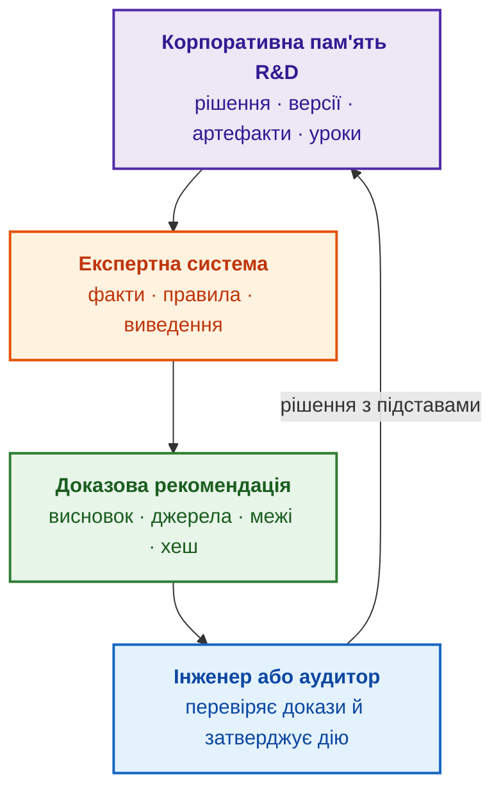
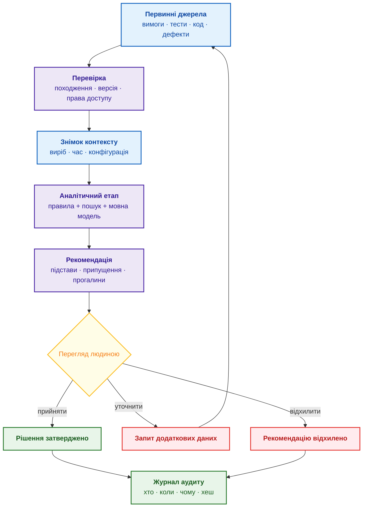
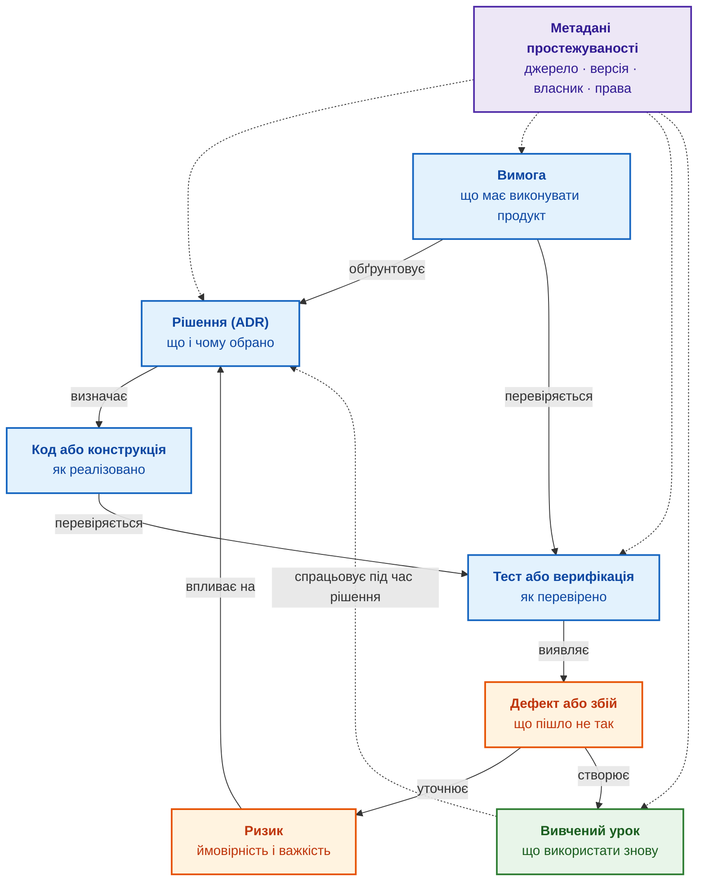
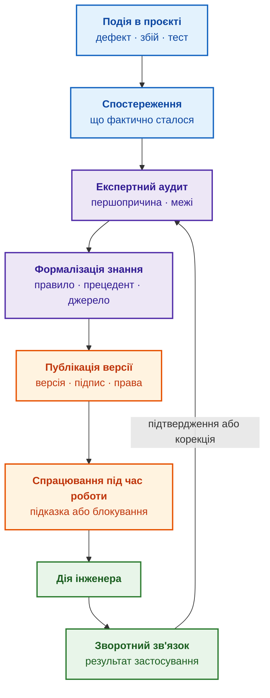

# Глава 5. Тріада довіри: експертна система, доказова рекомендація та корпоративна пам'ять

> **Книга:** [Архітектура доказових експертних систем](README.md) · [Частина I: Концептуальний та епістемічний фундамент](part-01-foundations.md)  
> **Попередня глава:** [Глава 4. Еволюція експертних систем: від теореми Байєса до доказових рішень ШІ](ch04-evolution-from-bayes-to-evidence-ai.md)  
> **Наступна глава:** [Глава 6. Прикладна математика експертних систем: від правил і ймовірностей до графів, причинності та рішень](ch06-applied-mathematics-for-expert-systems.md)  
> **Зміст книги:** [README.md](README.md)  
> **Автор:** [Микола Федчик](about-the-author.md)  
> **Рівень:** базовий інженерний; приклад коду й шаблон запиту до мовної моделі винесено в згорнуті блоки  
> **Очікувані результати:** пояснити, як експертна система, доказова рекомендація й корпоративна пам'ять підтримують одна одну; скласти мінімальний доказовий запис для рекомендації штучного інтелекту (ШІ) і перелік полів журналу аудиту; відрізнити сховище документів від пам'яті інженерних рішень і прецедентів; оцінити зрілість корпоративної пам'яті за адаптацією нових інженерів і повторенням відомих помилок.

Досвідчений інженер перейшов до іншої команди. Новачок бачить у коді вимкнений режим зв'язку й запитує: «Чому режим не використовують?» Пошукова система повертає десяток документів зі словом «режим». Чат-бот над документацією відповідає: «Через нестабільність зв'язку». Але хто вирішив вимкнути режим, для якої версії продукту, після якого тесту й чи досі рішення чинне, залишається невідомим. У новачка лишаються два погані варіанти, які Майкл Найгард описав ще 2011 року: сліпо прийняти старе рішення або сліпо змінити рішення, не знаючи причин і наслідків [[1]](#src-1).

Приклад поєднує три різні потреби, і глава розглядає кожну потребу як кут одного трикутника довіри. **Експертна система** застосовує перевірені знання до конкретного запитання. **Доказова рекомендація** (*evidence-based recommendation*) показує джерела, припущення й межі висновку, тому уповноважена людина може рекомендацію перевірити, прийняти або відхилити. **Корпоративна пам'ять** (*corporate memory*) досліджень і розробки (*Research and Development*, R&D) зберігає не лише файл, а й причину рішення, версію, наслідки та відповідального. Мета глави: показати, чому жоден кут не працює без двох інших, який мінімальний запис робить рекомендацію ШІ придатною до аудиту і як виміряти, чи організація справді пам'ятає власні рішення. Глава завершує Частину I, тому наприкінці підсумовано частину й показано, куди книга рухається далі.

## Пам'ять конкретного рішення

Для новачка з прикладу пам'ять має повернути не абзац про нестабільність, а запис рішення. У навчальному записі команда вимкнула режим для версії 2.1 після проваленого тесту; команда також записала відкинуту альтернативу й умову перегляду.

| Поле | Навчальний зміст |
|---|---|
| рішення й область | `ADR-7`: вимкнути режим лише для версії 2.1 |
| підстави | `RUN-88`: збій у заданій конфігурації; посилання на вимогу й звіт |
| відкинута альтернатива | збільшення числа повторів не прибрало спостережений збій |
| відповідальність | рішення схвалив власник компонента; строк перегляду задано окремо |
| умова перегляду | нова реалізація або застосовний успішний тест породжують кандидата на перегляд |

Експертна система може перевірити, чи нова зміна порушує ще чинне рішення, і показати підстави обмеження. Вона не повинна переносити рішення 2.1 на всі майбутні версії або робити зі старого провалу безумовне правило. Якість пам'яті перевіряють відтворенням причини рішення та пошуком застосовного контрприкладу, а не кількістю заархівованих сторінок. Це практичний зміст тріади, яку далі розглянуто докладніше.

## Трикутник довіри

Три поняття з назви глави часто плутають. Через плутанину команда очікує, що чат-бот над документацією одночасно стане пам'яттю організації, перевірником процесів і системою підтримки рішень. Коли ж рішенню потрібні підстави, інженери перевіряють кожну відповідь чат-бота вручну, і вигода від ШІ зникає.

Кути трикутника залежать один від одного. Експертна система потребує пам'яті, бо без перевірених знань машині виведення нічого застосовувати. Пам'ять цінна лише тоді, коли з пам'яті можна отримати відомості, придатні до перевірки. Рекомендація має вагу лише тоді, коли спирається на джерела й правила, а не на переконливий текст. Схема показує, як три кути з'єднані з людиною, яка ухвалює рішення.



Фіолетовий блок позначає корпоративну пам'ять, помаранчевий експертну систему, зелений доказову рекомендацію, синій людину. Хеш у зеленому блоці є контрольним значенням вмісту рекомендації: за хешем видно будь-яку зміну запису після перевірки, а механізм хешу на прикладі звіту тесту пояснює [Глава 1](ch01-introduction-to-expert-systems.md). Коло замикається на людині: затверджене рішення разом із підставами повертається до пам'яті й стає знанням для наступного випадку. Якщо розірвати будь-яку стрілку, трикутник втрачає цінність. Без пам'яті експертна система працює на застарілих знаннях, без доказового запису рекомендацію неможливо перевірити, а без повернення рішення пам'ять не дізнається, чим закінчився випадок.

Для подальшого читання знадобляться п'ять понять:

| Термін | Просте пояснення |
|---|---|
| Велика мовна модель (*Large Language Model*, LLM) | програма, яка опрацьовує й створює текст; мовна модель може бути частиною експертної системи, але не замінює експертної системи |
| Первинний доказ (*primary evidence*) | безпосередній результат вимірювання чи тесту, затверджена вимога або інший запис із відомим походженням |
| Похідний аналітичний запис (*derived analytical record*) | висновок, створений на основі первинних доказів; похідний запис можна перевірити, але похідний запис не замінює джерел |
| Простежуваність (*traceability*) | можливість пройти від висновку до правил, фактів, версій і первинних джерел |
| Система підтримки рішень (*decision support system*) | інформаційна система, яка допомагає людині ухвалити рішення, але не ухвалює рішення замість людини |

Жоден кут трикутника не працює окремо: довіра виникає з руху по всьому колу, від пам'яті до рішення й назад. Далі глава розглядає кути по черзі й починає з найчастішої плутанини, між експертною системою й чат-ботом.

## Перший кут: експертна система не дорівнює чат-боту

Після кількох років захоплення великими мовними моделями багато команд опинилися в однаковій ситуації: чат-бот під'єднано до документації, відповіді звучать переконливо, а довіри для інженерних рішень немає. Демонстрація вражає, але щойно рішенню потрібні підстави, інженери перевіряють усе вручну. Причина не в мовній моделі, а в очікуванні, що мовна модель сама виконає три різні завдання: пам'ятатиме, перевірятиме й підтримуватиме рішення. Розділ розподіляє ці завдання між мовною моделлю й експертною системою.

### Що вміє велика мовна модель

Сила великої мовної моделі полягає в роботі з мовою. Мовна модель підсумовує різнорідні документи, пояснює складне відповідно до підготовки читача, готує чернетки, виявляє двозначності й знаходить схожі за змістом фрагменти. У проєктній роботі такі вміння справді економлять час.

Корисність залежить від типу моделі. Розмовна модель слугує інтерфейсом і редактором. Модель для коду допомагає з попереднім оглядом реалізації. Модель векторних представлень (*embedding model*) перетворює текст на числові вектори й тому знаходить схожі документи, дефекти чи уроки, навіть коли слова не збігаються. Класифікаційна модель розподіляє документи за типами або рівнями чутливості. Локальна модель, яка працює на серверах організації, потрібна там, де дані не можна передавати назовні.

В експертній системі мовна модель найкорисніша не як «мозок, що все вирішує», а як мовний шар навколо контрольованого міркування. Мовна модель перетворює запит людини на структуроване запитання до бази знань, виділяє з тексту можливі факти, пояснює результат правила й готує чернетку обґрунтування. Остаточні підстави залишаються в правилах, джерелах, версіях і рішенні людини.

### Що додає експертна система

Будову експертної системи описала [Глава 1](ch01-introduction-to-expert-systems.md). База знань (*knowledge base*) зберігає правила, факти, обмеження й приклади предметної області. Робоча пам'ять (*working memory*) зберігає факти поточного випадку, наприклад версію виробу, результати тесту й відкриті дефекти. Машина виведення (*inference engine*) застосовує знання до випадку. Механізм пояснень (*explanation facility*) показує, які правила спрацювали, які факти використано й чого бракує. Система здобуття знань (*knowledge acquisition system*) додає, перевіряє й оновлює знання в базі знань. Чим експертний висновок відрізняється від довідки, пояснила [Глава 3](ch03-beyond-reference-information-systems.md), а архітектуру компонентів докладно розглядає [Глава 16](ch16-expert-systems-architecture.md).

Для тріади важлива одна відмінність. Чат-бот повертає відповідь у тому форматі, у якому отримав запит. Експертна система показує ланцюжок міркування: конкретні правила, факти й обмеження. Чат-бот є інтерфейсом, а підтримка рішень є призначенням. Експертна система в дорадчому режимі є формалізованим видом системи підтримки рішень, але не кожна система підтримки рішень має правила виведення й доказовий слід.

Різниця стає вирішальною там, де рішення залишають довгий слід: у функціональній безпеці, кібербезпеці й відповідності вимогам. Слід складається з обґрунтування безпеки, журналу аудиту, сертифікаційних доказів і договірних зобов'язань. Якщо ШІ каже «випуск прийнятний» без посилань на робочі матеріали, провалені тести й кваліфікацію постачальника, фраза є не підставою рішення, а гіпотезою, яку ще треба перевірити.

### Поділ ролей і рівні знань

Якщо мовна модель і експертна частина виконують ті самі завдання, помилка мовної моделі непомітно стає «висновком». Тому ролі треба розділити явно. У гібридній архітектурі мовна модель відповідає за інтерфейс, пояснення, роботу з документами й пошук за змістом. Експертна частина відповідає за знання предметної області, правила перевірки, виведення, журнал обґрунтування й керування версіями знань. Мовна модель не вдає експерта, а експертна система не вдає співрозмовника.

Знання предметної області живуть на різних рівнях. Рівень організації охоплює політики якості, правила безпеки й класифікацію даних. Рівень підрозділу охоплює практики тестування, архітектури чи роботи з постачальниками. Рівень проєкту охоплює назви компонентів, історичні рішення, винятки й домовленості із замовником. Експертна система має розрізняти рівні, бо знання різних рівнів мають різну вагу, різних власників і різні строки чинності. Наприклад, проєктний виняток може послабити правило підрозділу лише для одного продукту й лише до певної версії.

Експертна система без знань є порожнім рушієм виведення. Тому кожна група правил потребує власника знань (*knowledge owner*): людини, відповідальної за предметну область, наприклад функціональну безпеку, кібербезпеку чи певну категорію компонентів. Життєвий цикл знань охоплює додавання, перевірку, затвердження, версіювання й вилучення застарілого. Без власників і життєвого циклу рекомендації експертної системи швидко втрачають надійність. Як експертна система навчається через нові версії бази знань, розповідають [Глава 25](ch25-how-expert-systems-learn.md) і [Глава 26](ch26-continual-learning.md).

### Як виміряти якість експертної системи

Якість експертної системи не вимірюють природністю розмови. Потрібні інші критерії:

- **правильність:** правила застосовуються стабільно й на тих самих фактах дають той самий висновок;
- **повнота:** експертна система помічає відсутні обов'язкові відомості;
- **пояснюваність:** користувач бачить факти, правила, припущення й прогалини;
- **супроводжуваність:** правило можна оновити, перевірити тестами й відтворити за номером версії;
- **відповідальність:** кожна група правил має власника знань.

Експертна система, яка за браку даних просить уточнення, корисніша за експертну систему, яка завжди відповідає впевнено. Для впровадження критерії перетворюють на перевірки: набір відомих інженерних випадків із правильними відповідями, частку тверджень із коректними посиланнями, частку правильних відмов за браку даних, тести правил і свіжість джерел. Для кожної метрики фіксують початкове значення, допустиму межу й відповідального. Рамка керування ризиками ШІ Національного інституту стандартів і технологій США (*National Institute of Standards and Technology*, NIST) називає такий набір робіт тестуванням, оцінюванням, верифікацією й валідацією (*Test, Evaluation, Verification and Validation*, TEVV) [[2]](#src-2). Практичні запитання для перевірки корисності експертної системи наводить [Глава 1](ch01-introduction-to-expert-systems.md), а формальну верифікацію бази знань розглядає [Глава 23](ch23-knowledge-base-verification.md).

Підсумок розділу: мовна модель і експертна система не конкурують. Мовна модель пояснює, експертна система перевіряє, а явний поділ ролей, власники знань і вимірювані критерії роблять поєднання корисним. Але навіть правильно побудована експертна система видає лише рекомендацію, тому наступне запитання звучить так: коли рекомендацію можна долучити до рішення.

## Другий кут: коли рекомендація ШІ стає доказовою

Сама по собі відповідь ШІ є текстом, а не доказом. Відповідь стає перевірним входом у рішення людини лише тоді, коли зберігає зв'язок із первинними доказами й умовами аналізу. Розділ показує, на якому прикладі автор дійшов такого висновку, що в інженерії вважають доказом і який мінімальний запис перетворює відповідь ШІ на придатний матеріал для рішення.

### Приклад: драйвер пристрою й фраза «ризик прийнятний»

Автор зіткнувся з межею між текстом і доказом під час розробки прототипу складного драйвера пристрою (*Complex Device Driver*, CDD), тобто програмного модуля для нестандартної апаратури, який не покривають типові драйвери. Випуск охоплював понад триста програмних вимог (*software requirements*, SWR), а ручна перевірка відповідності коду вимогам затягувалася. ШІ сформував акуратну рекомендацію «ризик випуску прийнятний». Але на запитання «які саме тести провалено, які дефекти відкрито й які вимоги підтверджено реалізацією?» повної відповіді не було. Рекомендація виглядала корисною, але не мала обґрунтування.

Автор не відмовився від ШІ, а змінив спосіб роботи: ставив точніші запитання, проводив кілька кіл перевірки й вимагав посилань на вимоги, код і тести. Лише після змін висновки ШІ стали корисним підготовленим матеріалом для оцінювання людиною. Приклад описує практичний досвід автора, а не контрольований експеримент чи загальну оцінку ШІ.

### Що вважається доказом в інженерії

У регульованій інженерії доказ має конкретну форму. Первинний доказ, наприклад результат тесту чи затверджена вимога, потребує простежуваного походження й цілісності:

- **джерело:** який інструмент, яка людина й який процес створили доказ;
- **версія або незмінний ідентифікатор:** до якої версії продукту, документа чи базової версії (*baseline*) належить доказ;
- **контекст:** за яких умов доказ отримано, які припущення й обмеження діяли;
- **власник:** хто відповідає за актуальність та інтерпретацію доказу.

Модель походження PROV-O (*PROV Ontology*) Консорціуму Всесвітньої павутини (*World Wide Web Consortium*, W3C) описує походження доказу трьома поняттями: сутністю (*entity*), тобто самим доказом; дією (*activity*), яка сутність створила; агентом (*agent*), тобто людиною, програмою чи організацією, що відповідає за дію [[3]](#src-3). Докладно доказ як окремий від твердження об'єкт розглядає [Глава 2](ch02-epistemology-of-machine-knowledge.md).

Затвердження є окремим атрибутом рішення: хто й коли визнав набір доказів достатнім для конкретної мети. Не кожен сирий журнал виконання чи результат тесту потребує ручного погодження, але кожен такий запис має бути незмінно пов'язаний із запуском, версією й джерелом.

Доказами можуть бути результат тесту, запис перегляду коду, сертифікат кваліфікації постачальника, аналіз видів і наслідків відмов (*Failure Mode and Effects Analysis*, FMEA), аналіз небезпек і затверджена вимога. Текст ШІ без посилань на такі матеріали доказом не є. Текст ШІ є похідним аналітичним записом: похідний запис тлумачить докази, але не замінює доказів.

### Мінімальний доказовий запис

Відповідь ШІ не стає первинним доказом про продукт, але може стати придатним похідним записом. Для цього відповідь супроводжують чотири складники:

- **джерела:** посилання на конкретні матеріали, наприклад вимогу REQ-1234, тест TST-5678, ризик RSK-091, базову версію B-2026.04 і запит на зміну CR-77, а не на «галузеві стандарти» загалом;
- **версії:** прив'язка до версії продукту, базової версії й застосовного нормативного контексту; зміна будь-якої залежності позначає рекомендацію як таку, що потребує повторного оцінювання;
- **припущення:** усі неявні припущення винесено в явний список;
- **рівень упевненості:** оцінка впевненості разом з описом того, що впевненість знижує; чому впевненість краще подавати набором індикаторів, а не одним числом, пояснює урок 4 у [Главі 4](ch04-evolution-from-bayes-to-evidence-ai.md).

До чотирьох складників додають трасований ланцюжок міркування й остаточне рішення людини з власником і датою. У такій обгортці висновок ШІ перестає бути аргументом «ШІ так сказав» і стає перевірним входом у рішення: уповноважена людина може рекомендацію прийняти, доповнити або відхилити разом із посиланнями на первинні докази. Принцип простий: ШІ радить, але не затверджує.

Для базового інженерного сценарію досить одного короткого запису. Запис схожий на пакет обґрунтування з [Глави 1](ch01-introduction-to-expert-systems.md) і [Глави 3](ch03-beyond-reference-information-systems.md), але додає два поля, потрібні саме для ШІ: конфігурацію ШІ й рішення людини щодо рекомендації.

| Поле | Що фіксують |
|---|---|
| Твердження або рекомендація | що саме пропонує експертна система чи мовна модель і для якого рішення |
| Первинні джерела | ідентифікатори вимог, тестів, дефектів, ризиків і посилання на точні фрагменти |
| Знімок контексту | базова версія продукту, знімок корпусу знань і час отримання |
| Правила та припущення | версія правила або політики, застосовані припущення, прогалини й конфлікти |
| Конфігурація ШІ | модель, версія системної інструкції (*system prompt*), налаштування пошуку, версії індексу й засобу повторного впорядкування результатів пошуку (*reranker*) |
| Ідентифікатор аналізу | незмінний ідентифікатор або хеш вхідного пакета й відповіді |
| Рішення людини | хто, коли й чому прийняв, відхилив або повернув рекомендацію на додатковий перегляд |

Запис відділяє доказ від інтерпретації доказу й дає змогу повторити або оскаржити висновок. Чому знімок і версії роблять відповідь відтворюваною, показує урок 3 у [Главі 4](ch04-evolution-from-bayes-to-evidence-ai.md). Поле «Конфігурація ШІ» зручно заповнювати з картки моделі (*model card*): Маргарет Мітчелл і співавтори запропонували фіксувати в картці призначення моделі, умови оцінювання й відомі обмеження [[4]](#src-4). Походження довідкових і навчальних даних описує паспорт набору даних (*datasheet for datasets*), який запропонували Тімніт Гебру та співавтори: паспорт фіксує мотивацію створення набору, склад, спосіб збирання й рекомендоване використання [[5]](#src-5).

Схема показує повний шлях від первинних джерел до рішення, яке можна перевірити.



Сині блоки є вхідними даними: первинні джерела й знімок контексту. Фіолетові блоки є обробкою: перевірка походження, версій і прав доступу, аналітичний етап і сама рекомендація. Жовтий ромб позначає перегляд людиною. Зелені блоки є затвердженим рішенням і журналом аудиту, а червоні блоки є шляхами «уточнити» й «відхилити». Відхилена рекомендація теж потрапляє до журналу аудиту: відмова від поради ШІ є таким самим рішенням із підставами, як і прийняття поради.

Повноту запису легко перевіряти автоматично. Програма нижче не оцінює, чи правильна рекомендація, а відповідає на вужче запитання: чи має рекомендація поля, без яких запис лишається просто текстом.

<details>
<summary>Приклад мовою Go: перевірка мінімального доказового запису</summary>

Програма є повною й запускається командою `go run main.go`. Тип `Recommendation` містить основні поля запису з таблиці, а метод `Missing` повертає назви відсутніх обов'язкових полів. Ідентифікатори й версії в прикладі умовні.

```go
package main

import (
	"fmt"
	"strings"
)

// Recommendation є мінімальним доказовим записом рекомендації ШІ.
type Recommendation struct {
	Claim       string
	Sources     []string // ідентифікатори первинних джерел
	Baseline    string   // базова версія продукту
	Snapshot    string   // знімок корпусу знань
	RuleVersion string
	ModelConfig string // модель, версія інструкції, налаштування пошуку
	AnalysisID  string // хеш вхідного пакета й відповіді
	Decision    string // хто, коли й чому ухвалив рішення
}

// Missing повертає поля, без яких рекомендація лишається лише текстом.
func (r Recommendation) Missing() []string {
	var m []string
	check := func(ok bool, field string) {
		if !ok {
			m = append(m, field)
		}
	}
	check(len(r.Sources) > 0, "первинні джерела")
	check(r.Baseline != "" && r.Snapshot != "", "знімок контексту")
	check(r.RuleVersion != "", "версія правила")
	check(r.ModelConfig != "", "конфігурація ШІ")
	check(r.AnalysisID != "", "ідентифікатор аналізу")
	return m
}

func main() {
	chat := Recommendation{Claim: "Ризик випуску прийнятний"}
	record := Recommendation{
		Claim:       "Ризик випуску прийнятний після повторного тесту TST-5678",
		Sources:     []string{"REQ-1234", "TST-5678", "RSK-091"},
		Baseline:    "B-2026.04",
		Snapshot:    "snap-2026-04-18",
		RuleVersion: "release-policy 2.3",
		ModelConfig: "local-8b@v1.4, prompt v3",
		AnalysisID:  "sha256:5c1e…",
	}
	for _, r := range []Recommendation{chat, record} {
		if m := r.Missing(); len(m) > 0 {
			fmt.Printf("%q: лише текст, бракує: %s\n", r.Claim, strings.Join(m, ", "))
			continue
		}
		status := "чекає рішення людини"
		if r.Decision != "" {
			status = "рішення: " + r.Decision
		}
		fmt.Printf("%q: придатний похідний запис, %s\n", r.Claim, status)
	}
}
```

Програма друкує:

```text
"Ризик випуску прийнятний": лише текст, бракує: первинні джерела, знімок контексту, версія правила, конфігурація ШІ, ідентифікатор аналізу
"Ризик випуску прийнятний після повторного тесту TST-5678": придатний похідний запис, чекає рішення людини
```

Перша рекомендація повторює фразу з прикладу автора: фраза може бути правильною, але без джерел, знімка й версій перевірити фразу неможливо. Друга рекомендація має всі обов'язкові поля, проте поле `Decision` порожнє, тому програма не називає рекомендацію затвердженою. Програма перевіряє лише наявність полів. Чи справді тест TST-5678 існує й чи підтримує висновок, перевіряють експертна система, яка застосовує умову відповіді з [Глави 2](ch02-epistemology-of-machine-knowledge.md), і людина.

</details>

Автоматична перевірка повноти не робить рекомендацію істинною, але відсікає найпоширенішу ваду: переконливий висновок без жодної зачіпки для перевірки.

### Дисципліна запиту на прикладі перевірки коду

Різницю між текстом і доказовим записом добре видно на аналізі відповідності коду. В автомобільній електроніці діють стандарт функціональної безпеки ISO 26262 Міжнародної організації зі стандартизації (*International Organization for Standardization*, ISO), частина 6 якого задає вимоги до розроблення програмного забезпечення [[6]](#src-6), і стандарт інженерії кібербезпеки ISO/SAE 21434, який ISO розробила разом з асоціацією SAE International [[7]](#src-7). У таких проєктах ШІ просять не просто «подивитися код», а знайти дефекти, що порушують конкретні вимоги, правила кодування чи проєктний профіль перевірки (*project verification profile*), тобто затверджений у проєкті набір очікувань до коду. Поганий запит звучить як «Перевір цей код на помилки». Кращий запит задає мовній моделі контракт рецензента: що модель отримує на вході, що саме перевіряє й у якій формі відповідає.

<details>
<summary>Шаблон запиту: контракт рецензента для перевірки відповідності коду</summary>

Шаблон є текстом вхідної інструкції (*prompt*) до мовної моделі. Три крапки в лапках позначають місця, куди вставляють точний текст вимоги, правил кодування й проєктного профілю; ідентифікатори умовні.

```text
Ти виконуєш попередній аналіз відповідності коду вимогам безпеки й кібербезпеки.

Контекст:
- Вимога: REQ-SAFE-017, точний текст: "..."
- Правила кодування: CS-C-012, CS-C-019, точний текст правил: "..."
- Проєктний профіль перевірки: SAF-C-017 і SEC-C-011; точний текст, межа застосування та критерій приймання: "..."
- Нормативний контекст: застосовні частини ISO 26262-6 та ISO/SAE 21434 є джерелом для проєктного профілю, а не самодостатнім правилом.
- Базова версія: B-2026.04
- Файл коду: src/speed_monitor.c, зміна abc123

Завдання:
1. Переформулюй вимогу у перевірні твердження.
2. Перевір код тільки проти наданих вимог, правил кодування і проєктного профілю.
3. Для кожного дефекту наведи: ідентифікатор вимоги, правило кодування, проєктний профіль,
   фрагмент коду, чому це дефект, вплив, рівень упевненості (високий/середній/низький),
   припущення, відсутню інформацію, приклад коректного коду.
4. Якщо доказів недостатньо, не вигадуй дефект. Познач як "потребує перегляду людиною".
5. Не посилайся на стандарти загальними словами. Пояснюй конкретне інженерне очікування.
```

За таким шаблоном рецензент отримує для кожного дефекту однакові поля, тому відповіді різних запусків можна порівнювати між собою.

</details>

Шаблон важливий не стилем, а дисципліною: мовна модель працює не як оракул, а як рецензент, що показує ланцюжок доказів. Не варто просити «перевірити код на відповідність ISO 26262». Частина 6 стандарту ISO 26262 задає вимоги до процесу розроблення програмного забезпечення та робочих продуктів, від вимог безпеки до перевірки модулів та інтеграції [[6]](#src-6), а ISO/SAE 21434 задає інженерні вимоги до керування ризиками кібербезпеки [[7]](#src-7). Жоден зі стандартів не є статичним аналізатором коду. Краще давати мовній моделі конкретні схвалені проєктні очікування: вимога безпеки повинна мати простежувану реалізацію й перевірні тести; пов'язаний із безпекою код має уникати невизначеної поведінки, неініціалізованих значень і виходу за межі масиву; зовнішні дані треба перевіряти до копіювання в пам'ять; критична для захисту дія повинна мати явну перевірку повноважень. Кожне очікування має вести до правила кодування, проєктного профілю чи вимоги, бо перелік очікувань не є прямим текстом стандарту.

Для практичного перегляду від мовної моделі вимагають не вільний текст, а стабільну таблицю для кожного дефекту: ідентифікатор, зв'язок із вимогою, доказ у коді, вплив, рівень упевненості, припущення, відсутні докази, приклад виправлення й потрібні тести. Підтверджений дефект, можливий дефект і випадок для перегляду людиною мають бути різними станами. Рецензент бачить не лише висновок, а й шлях до висновку, а аудитор бачить зв'язок із вимогою, доказ у коді й рішення людини після перегляду.

Поле рівня впевненості тут критичне. Мовна модель може впевнено вказати на ризик переповнення буфера, якщо бачить неперевірену довжину вхідних даних. Щодо авторизації мовна модель має відповісти інакше: «У цьому фрагменті не видно перевірки повноважень; якщо перевірка є вище в ланцюжку викликів, надайте доказ». Така відповідь менш ефектна, але точно називає межу побаченого фрагмента коду.

### Журнал аудиту

У регульованому середовищі взаємодії з ШІ, які вплинули на рішення, мають бути записані. Мінімальний запис журналу аудиту (*audit trail*) містить: хто поставив запит; який контекст передали мовній моделі; які джерела мовна модель використала; яку відповідь і рівень упевненості отримано; яке рішення ухвалила людина й чи відрізнялося рішення від рекомендації ШІ; власника й дату. Без журналу аудиту ШІ в регульованому середовищі залишається чорною скринькою. Як захистити журнал аудиту від непомітних змін ланцюжком хешів, пояснює [Глава 2](ch02-epistemology-of-machine-knowledge.md), а як механізм пояснень відтворює шлях до висновку, показує [Глава 20](ch20-explanation-engine.md).

На рівні інтерфейсу кожна рекомендація має показувати джерела, явні припущення, рівень упевненості з поясненням, умову «що змінило б відповідь», власника й прив'язку до базової версії. Для коду додають трасування до вимоги, правило кодування, доказ у коді й результат перегляду коду. Тоді ШІ перестає бути оракулом і стає одним із входів у звичайний інженерний перегляд.

Рекомендація ШІ стає доказовою не завдяки кращій моделі, а завдяки запису навколо відповіді: джерелам, знімку контексту, версіям, припущенням, рівню впевненості, ідентифікатору аналізу й рішенню людини. Але джерела й версії мусять десь зберігатися разом зі зв'язками між собою. Де саме, пояснює третій кут трикутника.

## Третій кут: корпоративна пам'ять досліджень і розробки

Третій кут тримає два попередні: без пам'яті і експертна система, і дисципліна доказових записів лишаються паперовими. У дослідженнях і розробці знання губляться не від браку документів, адже документів часто забагато, а від браку **зв'язків**: між рішенням і вимогою, дефектом і причиною, проваленим тестом і архітектурним рішенням, старим уроком і новим проєктом.

У практиці автора відповідь на технічне чи управлінське запитання часто вже існувала в минулому проєкті: хтось аналізував подібний дефект, пояснював відхилену архітектуру, писав обхідне рішення для постачальника, проходив таке саме зауваження аудитора. Але назви змінилися, люди перейшли в інші команди, а рішення заховане в коментарях до задач. Тому книга визначає корпоративну пам'ять не як архів документів, а як здатність організації **згадати потрібний контекст у потрібний момент** і застосувати контекст до нового рішення.

### Де живуть знання про дослідження й розробку

Знання розподілені між багатьма місцями. У коді залишаються технічні рішення й обхідні шляхи. У трекері задач (*issue tracker*) залишаються дефекти та причини дефектів. У запитах на злиття коду (*merge request*, *pull request*) залишаються компроміси реалізації. На внутрішніх вікі-сторінках залишаються пояснення архітектури. Системи керування вимогами зберігають формальний задум, звіти тестування зберігають результати перевірок, нотатки до випуску зберігають прийняті обмеження, а в головах людей лишається неявний контекст.

Для архітектурних рішень Майкл Найгард запропонував короткий окремий документ, запис архітектурного рішення (*architecture decision record*, ADR), з п'ятьма частинами: назвою, контекстом, рішенням, статусом і наслідками [[1]](#src-1). Поле статусу розв'язує проблему новачка зі вступу. Скасоване рішення не видаляють, а позначають як замінене новим записом, тому видно, яке рішення діяло раніше й яке діє зараз. Схема показує, як запис рішення пов'язаний з іншими артефактами.



Сині блоки є інженерними артефактами: рішення, вимога, код і тест. Помаранчеві блоки є сигналами проблем: дефект і ризик. Зелений блок є вивченим уроком, а фіолетовий блок є метаданими простежуваності, які додають кожному артефакту джерело, версію, власника й права доступу. Пунктирна стрілка від уроку до рішення означає, що урок має спрацювати в момент нового рішення, а не лежати в архіві.

Джерела знань не рівноцінні й не пов'язуються між собою автоматично. Затверджена вимога й коментар у задачі мають різну вагу, а доказ тестування й знімок екрана в презентації не є одним і тим самим. Якщо інформаційна система пам'яті не розрізняє статус, джерело й відповідального, така інформаційна система не пам'ятає, а лише зберігає текст.

### Чому пошук не розв'язує проблеми

Звичайний пошук допомагає, якщо інженер знає, що шукати. Але корпоративна пам'ять часто потрібна саме тоді, коли інженер не знає правильних слів. Компонент перейменували. Дефект у минулому проєкті мав іншу назву. Постачальник змінив номер деталі. Вимогу переформулювали. Команда використовувала внутрішній жаргон, якого нова команда не знає.

Пошук знаходить документи, а пам'ять має знаходити **зміст рішення**. На запитання «чому ми не використовуємо цей режим зв'язку?» корпоративна пам'ять має повернути не лише документ, а й рішення, відхилену альтернативу, пов'язаний дефект, результат тесту й відповідального. Для цього потрібні зв'язки, метадані й модель предметної області. Граф знань (*knowledge graph*) пов'язує компонент, вимогу, дефект, тест, рішення, ризик і урок; інженерний граф знань і простежуваність від вимог до апаратури докладно розглядає [Глава 9](ch09-engineering-knowledge-graph-traceability.md).

Генерація з пошуком (*Retrieval-Augmented Generation*, RAG) розв'язує проблему лише частково. Патрік Льюїс і співавтори поєднали параметричну пам'ять (*parametric memory*) мовної моделі, тобто знання, закладені у ваги моделі під час навчання, з явною зовнішньою пам'яттю, тобто індексом документів [[8]](#src-8). Але якість зовнішньої пам'яті визначає не мовна модель, а структура індексу. Якщо індекс не знає про перейменування компонента й статус рішення, мовна модель отримає ті самі розрізнені документи, що й звичайний пошук. Чому між пошуком і мовною моделлю потрібен фільтр придатних фрагментів, пояснює урок 2 у [Главі 4](ch04-evolution-from-bayes-to-evidence-ai.md).

### Адаптація новачків як тест пам'яті

Найкращий тест корпоративної пам'яті дає адаптація нових інженерів. Якщо новачок залежить лише від старшого інженера, пам'ять слабка: роль досвідченого фахівця не в тому, щоб щоразу переказувати історію проєкту з нуля. Добра пам'ять пояснює будову продукту, головні рішення й причини рішень, відомі помилки, критичні компоненти, авторитетні джерела й відповідальних людей.

Якщо знання живуть тільки в людях, досвідчені інженери повторюють ті самі пояснення, новачки відтворюють старі помилки, а знання губляться під час зміни команди. Новачок зі вступу глави є саме таким випадком: відповідь на запитання «чому режим вимкнено?» існувала, але пішла з команди разом з інженером.

### Активні вивчені уроки

У багатьох організаціях вивчені уроки (*lessons learned*) залишаються ритуалом після завершення проєкту: команда пише кілька пунктів, кладе документ у папку, і через рік хтось повторює ту саму помилку. Активний урок спрацьовує саме під час нового рішення. Наприклад, запит на зміну в схожій підсистемі автоматично підтягує історичні дефекти й перевірки, які тоді допомогли.

Для цього вивчений урок має бути структурованим: умови виникнення, проблема, першопричина, вплив, виправна дія, межі застосування, власник і пов'язані робочі матеріали. Не кожен урок універсальний: рішення, правильне для однієї продуктової родини, може бути хибним для іншої. Тому межі застосування є обов'язковим полем, а не приміткою. Схема показує, як подія в проєкті перетворюється на активне знання.



Сині блоки фіксують подію та спостереження. Фіолетові блоки є роботою експерта: аудит першопричини й формалізація знання. Помаранчеві блоки є публікацією версії знання та спрацюванням під час роботи експертної системи, тобто підказкою або блокуванням дії. Зелені блоки є дією інженера й зворотним зв'язком. Стрілка від зворотного зв'язку до експертного аудиту робить урок живим: результат застосування підтверджує урок або уточнює межі уроку. Як експертна система навчається з таких повернень, розглядають [Глава 25](ch25-how-expert-systems-learn.md) і [Глава 26](ch26-continual-learning.md).

### Мовна модель, граф знань і експертна система разом

Тут три кути трикутника сходяться. ШІ може зробити пам'ять доступнішою, але лише тоді, коли не працює з хаотичною купою документів. Мовна модель підсумовує й пояснює, граф знань тримає зв'язки, а експертна система застосовує правила й показує, чому історичний випадок стосується нової задачі.

Наприклад, інженер відкриває новий дефект, а помічник на основі мовної моделі знаходить схожі випадки: пов'язані компоненти, причини, виправлення й тести. Правила експертної системи додають вимогу: якщо дефект стосується безпеки, треба перевірити зачеплені вимоги й результати перевірки цих вимог. Керівник проєкту бачить схожі затримки, фахівець із забезпечення якості бачить провали тестування, архітектор бачить відхилені альтернативи.

Відповідь помічника теж має бути доказовою, і тут третій кут повертає до другого: потрібні джерела, версії, рівень упевненості й припущення. Корпоративна пам'ять не має перетворюватися на «модель так згадала». Корпоративна пам'ять має показувати, що саме знайдено й чому знайдене стосується нової задачі.

### Власники знань і неявне знання

Корпоративна пам'ять не з'являється сама. Хтось має визначати авторитетні джерела, позначати застаріле, підтримувати класифікацію знань і правила доступу. Цю роль може виконувати власник знань, проєктний офіс, служба якості або центр експертизи; назва ролі менш важлива за відповідальність.

Найважче зберегти неявне знання (*tacit knowledge*): людина знає більше, ніж записує. Ікудзіро Нонака й Хіротака Такеучі описали перехід між неявним і явним (*explicit*) знанням моделлю SECI з чотирьох кроків [[9]](#src-9): соціалізація (*Socialization*), тобто передавання досвіду через спільну роботу; екстерналізація (*Externalization*), тобто запис неявного знання словами, схемами чи правилами; комбінація (*Combination*), тобто поєднання явних знань із різних джерел; інтерналізація (*Internalization*), тобто засвоєння явного знання в щоденній практиці. Томас Девенпорт і Лоуренс Прусак визначили знання як плинне поєднання структурованого досвіду, цінностей, контекстної інформації й експертного бачення, яке дає рамку для оцінювання нового досвіду й нової інформації [[10]](#src-10). З визначення випливає, що запис у базі без контексту й досвіду лишається даними, а не знанням.

Етьєн Венгер показав, що знання живуть у спільнотах практики (*communities of practice*): групах людей, які через спільну справу й регулярну взаємодію виробляють спільний набір прийомів, історій і понять [[11]](#src-11). Пітер Сенге описав організацію, що навчається (*learning organization*), через п'ять дисциплін: особисту майстерність, ментальні моделі, спільне бачення, командне навчання й системне мислення [[12]](#src-12). Для корпоративної пам'яті обидві ідеї означають одне: вивчений урок корисний лише тоді, коли змінює спосіб роботи спільноти, а не лише додає файл у папку.

Для експертної системи звідси випливає практичне правило: база знань не дорівнює сховищу файлів. Неявне знання експертів треба переводити в правила, приклади, винятки й межі застосування; як проводити інтерв'ю з експертами, пояснює [Глава 11](ch11-knowledge-elicitation-from-experts.md). Явні знання треба регулярно перевіряти, а застарілі знання позначати або вилучати.

### Чутливість і межі доступу

Знання про дослідження й розробку часто конфіденційні: код, звіти постачальників, аналіз вразливостей, вимоги замовника й неопубліковані плани. Існування знання не означає, що знання мають бачити всі. Якщо чутливий документ потрапив до пошукового індексу без належних прав доступу, витік може статися через знайдений фрагмент або через підсумок, який мовна модель склала з фрагмента. Тому класифікація, керування доступом і журнали аудиту є частиною архітектури корпоративної пам'яті, а не надбудовою. Як відповідь успадковує найсуворішу мітку конфіденційності вхідних даних, пояснює [Глава 2](ch02-epistemology-of-machine-knowledge.md), а як система здобуття знань збирає досвід без витоку даних, показує [Глава 10](ch10-knowledge-acquisition-systems.md).

### Як виміряти корпоративну пам'ять

Корпоративну пам'ять можна оцінювати практичними запитаннями. Скільки часу потрібно новому інженерові, щоб зрозуміти головні архітектурні рішення? Скільки разів команда повторює відому помилку? Чи можна знайти причину старого дефекту без людини, яка дефект розслідувала? Чи бачить керівник проєкту історичні затримки перед плануванням схожої роботи?

Ще один показник вимірює залежність від конкретних людей. Якщо відповідь зазвичай звучить як «запитай Олену», організація має пам'ять окремих експертів, а не спільну пам'ять. Корисно вимірювати, скільки попередніх рішень використано повторно й скільки уроків змінили шаблон, контрольний список чи стратегію тестування. Водночас зріла пам'ять позначає або вилучає застаріле.

Для кожного показника фіксують початкове значення й період вимірювання: наприклад, медіанний час, за який новий інженер знаходить потрібне рішення, частку записів про інциденти з власником і джерелом, частку застарілих записів, вилучених із пошуку. Так корпоративну пам'ять оцінюють не за розміром сховища, а за впливом на роботу.

Підсумок розділу: корпоративна пам'ять є мережею пов'язаних рішень, артефактів і уроків із метаданими походження, а не архівом файлів. Пошук і мовна модель роблять мережу доступнішою, власники знань підтримують мережу чинною, а метрики адаптації й повторених помилок показують, чи мережа справді працює. Наступний розділ перевіряє, чи зберігається схема тріади в різних галузях.

## Тріада в п'яти галузях

Книга повертається до п'яти галузей, які [Глава 1](ch01-introduction-to-expert-systems.md) назвала опорними. У кожній галузі схема однакова: пам'ять зберігає перевірений досвід, експертна система застосовує досвід до нового випадку, а людина отримує рекомендацію з джерелами й межами. Відрізняються зміст знань і межі повноважень.

| Галузь | Що має пам'ятати організація | Приклад доказової рекомендації |
|---|---|---|
| Автомобільна інженерія | конфігурації, відмови, вимоги, тести й рішення щодо безпеки | які компоненти та перевірки зачіпає зміна; випуск затверджує відповідальний інженер |
| Авіація | затверджені конфігурації, обслуговування, події та керівництва | можлива причина несправності й послідовність перевірок; рішення ухвалює уповноважений фахівець |
| Медицина | дані пацієнта, настанови, протипоказання й межі застосування | можливі пояснення та потрібні додаткові дослідження; клінічне рішення залишається за медичним працівником |
| Військові й оборонні технології | походження повідомлень, стан техніки, журнали обслуговування й правила | суперечності у відомостях або потреба в технічній перевірці; командні повноваження не переходять до експертної системи |
| Законодавство | юрисдикції, редакції норм, дати чинності, зв'язки між актами й практику застосування | норми, які можуть стосуватися ситуації, з точними джерелами; юридичний наслідок визначає компетентна особа |

Остання колонка таблиці в кожному рядку закінчується однаково: рішення ухвалює уповноважена людина. Галузі відрізняються тим, хто саме уповноважений і якою є ціна помилки, але в жодній галузі рекомендація не переносить відповідальність на експертну систему.

## Висновки

**Трикутник довіри замість чату над документацією.** Глава почалася з новачка, який не може дізнатися, чому режим зв'язку вимкнено. Відповідь потребує всіх трьох кутів: корпоративної пам'яті, яка зберегла рішення зі статусом і зв'язками; експертної системи, яка застосувала правила до поточної версії продукту; доказової рекомендації, яку людина може перевірити й затвердити. Глава показала:

- мовна модель є мовним шаром навколо контрольованого міркування, а експертна система додає правила, простежуваність, власників знань і вимірювані критерії якості;
- рекомендація ШІ стає придатним похідним записом лише разом із джерелами, знімком контексту, версіями правил, конфігурацією ШІ, ідентифікатором аналізу й рішенням людини, а повноту такого запису можна перевіряти автоматично;
- корпоративна пам'ять є мережею пов'язаних рішень, артефактів і уроків, а не архівом файлів, і зрілість пам'яті вимірюють адаптацією новачків та повторенням відомих помилок.

Межі глави теж треба назвати. Приклад із драйвером пристрою описує досвід одного проєкту, а не контрольований експеримент. Метрики корпоративної пам'яті потребують початкових значень, без яких покращення неможливо довести. Жоден доказовий запис не компенсує відсутності власників знань. Технічні засоби глави роблять довіру перевірною, але не створюють довіри без людей, які відповідають за знання.

## Підсумки Частини I

Частина I заклала концептуальну основу книги в п'яти главах:

1. [Глава 1](ch01-introduction-to-expert-systems.md) пояснила, хто такий експерт, що таке експертна система, як експертна система отримує дані й міркує та чим експертна відповідь із пакетом обґрунтування відрізняється від звичайного тексту.
2. [Глава 2](ch02-epistemology-of-machine-knowledge.md) визначила, коли експертна система має право назвати твердження знанням: потрібні доказ із відомим походженням, застосовність до запиту, коректний спосіб виведення й відповідальність за доступ.
3. [Глава 3](ch03-beyond-reference-information-systems.md) відділила експертний висновок від довідки й порівняла чотири класи інформаційних систем за гарантіями, які кожен клас дає користувачеві.
4. [Глава 4](ch04-evolution-from-bayes-to-evidence-ai.md) простежила шістдесят років методів машинного міркування й показала, як обирати метод за типом невизначеності.
5. [Глава 5](ch05-triad-of-trust-and-corporate-memory.md) поєднала експертну систему, доказову рекомендацію й корпоративну пам'ять у трикутник довіри.

Разом п'ять глав дають початкову карту: **знання → міркування → пояснений висновок → рішення людини → збережений досвід**.

## Подальший шлях пізнання

Далі книга переходить від концептуальних засад до інженерних методів:

- **[Частина II. Математичний апарат та моделі знань](part-02-knowledge-models.md)**: прикладна математика правил, ймовірностей, графів і причинності, типи баз знань, інженерні артефакти як дані та інженерний граф знань для простежуваності.
- **[Частина III. Інженерія знань: здобуття, NLP та екстракція з нормативів](part-03-knowledge-engineering-nlp.md)**: системи здобуття знань, інтерв'ю з експертами, обробка природної мови (*Natural Language Processing*, NLP) локальними мовними моделями й перетворення вимог із модальними словами на кшталт англійських SHALL і MUST на формальні інваріанти.
- **[Частина IV. Архітектура, виконання та механізми висновку](part-04-architecture-and-inference.md)**: архітектура експертної системи, вибір технологічного стеку, інфраструктура виконання з локальними моделями, шлях від запитання до доказу, рушій пояснень, безпечний перехід від рекомендації до дії й кібернетичний зв'язок від датчиків до центру ухвалення рішень.
- **[Частина V. Верифікація, діагностика та неперервне навчання](part-05-verification-and-learning.md)**: перевірка несуперечливості й повноти бази знань, технічна діагностика, яка відрізняє симптом від першопричини, і навчання експертної системи з контролем регресій.
- **[Частина VI. Передовий край: регуляторна сертифікація та нейро-символьний ШІ](part-06-frontiers-neuro-symbolic.md)**: синтез сертифікаційних доказів у нотації структурування цілей (*Goal Structuring Notation*, GSN), дворежимні експертні системи, синергетика самоорганізованих баз знань та нейро-символьна архітектура, яка поєднує мовні моделі з детермінованою доказовістю.

## Запитання до читачів

1. Чи траплялося вам, що відповідь ШІ звучала переконливо, але під відповіддю не було джерел, на які можна послатися в рішенні?
2. Де у ваших проєктах відповідь без посилань на первинні джерела вже точно не пройшла б, а де таку відповідь поки що приймають мовчки?
3. Як часто відповідь на запитання вже існувала в минулому проєкті, але відповідь не вдавалося швидко знайти?
4. Що болючіше для вашої команди: розрив між чатом і реальними даними, відсутність зв'язків між документами чи залежність знань від конкретних людей?
5. Скільки часу новому інженерові потрібно, щоб зрозуміти головні рішення у вашому продукті, і від чого залежить цей час?

## Словник

| Український термін | Англійський відповідник | Коротке пояснення |
|---|---|---|
| Тріада довіри | *triad of trust* | Модель, у якій корпоративна пам'ять, експертна система й доказова рекомендація підтримують одна одну |
| Доказова рекомендація | *evidence-based recommendation* | Рекомендація разом із джерелами, версіями, припущеннями, рівнем упевненості й рішенням людини |
| Корпоративна пам'ять | *corporate memory, organizational memory* | Здатність організації зберігати, знаходити, перевіряти й повторно застосовувати знання про рішення та досвід |
| Чат-бот | *chatbot* | Програма, що веде діалог із користувачем природною мовою |
| Велика мовна модель | *large language model* | Модель машинного навчання, що опрацьовує й створює текст |
| Модель векторних представлень | *embedding model* | Модель, що перетворює текст на числові вектори для пошуку схожого змісту |
| База знань | *knowledge base* | Упорядковані правила, факти, обмеження й приклади предметної області |
| Робоча пам'ять | *working memory* | Факти поточного випадку, з якими працює машина виведення |
| Машина виведення | *inference engine* | Компонент, що застосовує знання до фактів випадку й отримує висновок |
| Механізм пояснень | *explanation facility* | Компонент, що показує спрацьовані правила, використані факти й прогалини |
| Система здобуття знань | *knowledge acquisition system* | Засоби додавання, перевірки, оновлення й узгодження знань у базі знань |
| Система підтримки рішень | *decision support system* | Інформаційна система, що допомагає людині ухвалити рішення, але не ухвалює рішення замість людини |
| Власник знань | *knowledge owner* | Людина, відповідальна за актуальність і правильність знань певної предметної області |
| Життєвий цикл знань | *knowledge lifecycle* | Додавання, перевірка, затвердження, версіювання й вилучення застарілих знань |
| Первинний доказ | *primary evidence* | Безпосередній результат вимірювання чи тесту, затверджена вимога або інший запис із відомим походженням |
| Похідний аналітичний запис | *derived analytical record* | Висновок на основі первинних доказів, який тлумачить докази, але не замінює доказів |
| Походження | *provenance* | Відомості про те, з яких вхідних даних, якими діями й ким отримано доказ |
| Простежуваність | *traceability* | Можливість пройти від висновку до правил, фактів, версій і первинних джерел |
| Базова версія | *baseline* | Зафіксований і затверджений стан продукту чи документації, до якого прив'язують докази |
| Знімок контексту | *context snapshot* | Зафіксовані версія продукту, стан корпусу знань і час, на яких побудовано висновок |
| Хеш | *hash* | Контрольне значення фіксованої довжини, обчислене з вмісту; зміна вмісту змінює хеш |
| Мінімальний доказовий запис | *minimal evidence record* | Набір полів, без яких рекомендацію ШІ неможливо перевірити чи відтворити |
| Вхідна інструкція | *prompt* | Текст, який отримує мовна модель: завдання, контекст і правила відповіді |
| Системна інструкція | *system prompt* | Постійна частина вхідної інструкції, яка задає мовній моделі роль і правила відповіді |
| Засіб повторного впорядкування | *reranker* | Модель, яка заново впорядковує знайдені фрагменти за відповідністю запиту |
| Картка моделі | *model card* | Короткий документ про призначення, умови оцінювання й обмеження моделі |
| Паспорт набору даних | *datasheet for datasets* | Документ про мотивацію, склад, спосіб збирання й рекомендоване використання набору даних |
| Проєктний профіль перевірки | *project verification profile* | Затверджений у проєкті набір очікувань до коду, виведений зі стандартів і вимог |
| Статичний аналізатор коду | *static code analyzer* | Програма, що шукає дефекти в коді без запуску коду |
| Журнал аудиту | *audit trail* | Незмінний запис того, хто, що, коли й на якій підставі вирішив |
| Запис архітектурного рішення | *architecture decision record* | Короткий документ із назвою, контекстом, рішенням, статусом і наслідками архітектурного рішення |
| Трекер задач | *issue tracker* | Інформаційна система для обліку задач і дефектів |
| Запит на злиття коду | *merge request, pull request* | Запит на перегляд і внесення змін коду до спільної гілки репозиторію |
| Граф знань | *knowledge graph* | Граф, у якому вершини є об'єктами, а ребра типізованими зв'язками |
| Генерація з пошуком | *retrieval-augmented generation* | Підхід, у якому мовна модель відповідає на основі фрагментів, знайдених у зовнішньому індексі |
| Параметрична пам'ять | *parametric memory* | Знання, закладені у ваги мовної моделі під час навчання |
| Вивчений урок | *lesson learned* | Структурований запис про проблему, першопричину, виправну дію й межі застосування |
| Неявне знання | *tacit knowledge* | Знання, яке людина застосовує, але не записала й часто не може легко сформулювати |
| Явне знання | *explicit knowledge* | Знання, записане в документі, правилі чи моделі |
| Спільнота практики | *community of practice* | Група людей зі спільною справою, яка через регулярну взаємодію виробляє спільні прийоми й поняття |
| Організація, що навчається | *learning organization* | Організація, яка систематично змінює способи роботи на основі досвіду |
| Аналіз видів і наслідків відмов | *failure mode and effects analysis* | Метод систематичного пошуку можливих відмов, наслідків відмов і заходів проти відмов |
| Складний драйвер пристрою | *complex device driver* | Програмний модуль для нестандартної апаратури, який не покривають типові драйвери |
| Програмна вимога | *software requirement* | Вимога до поведінки чи властивостей програмного забезпечення |

## Абревіатури

| Скорочення | Розшифрування | Значення |
|---|---|---|
| ADR | Architecture Decision Record | запис архітектурного рішення |
| CDD | Complex Device Driver | складний драйвер пристрою |
| FMEA | Failure Mode and Effects Analysis | аналіз видів і наслідків відмов |
| GSN | Goal Structuring Notation | нотація структурування цілей для обґрунтування безпеки |
| ISO | International Organization for Standardization | Міжнародна організація зі стандартизації |
| LLM | Large Language Model | велика мовна модель |
| NIST | National Institute of Standards and Technology | Національний інститут стандартів і технологій США |
| NLP | Natural Language Processing | обробка природної мови |
| PROV-O | PROV Ontology | онтологія W3C для опису походження даних |
| R&D | Research and Development | дослідження й розробка |
| RAG | Retrieval-Augmented Generation | генерація з пошуком |
| SAE | SAE International, раніше Society of Automotive Engineers | міжнародна асоціація інженерів автомобільної галузі |
| SECI | Socialization, Externalization, Combination, Internalization | модель перетворення знань Нонаки й Такеучі |
| SWR | Software Requirement | програмна вимога |
| TEVV | Test, Evaluation, Verification and Validation | тестування, оцінювання, верифікація й валідація |
| W3C | World Wide Web Consortium | Консорціум Всесвітньої павутини |
| ШІ | штучний інтелект | *artificial intelligence*, AI |

## Джерела

1. <a id="src-1"></a>Michael Nygard. [*Documenting Architecture Decisions*](https://cognitect.com/blog/2011/11/15/documenting-architecture-decisions). Cognitect Blog, 15 листопада 2011 року.
2. <a id="src-2"></a>Elham Tabassi. [*Artificial Intelligence Risk Management Framework (AI RMF 1.0)*](https://doi.org/10.6028/NIST.AI.100-1). NIST AI 100-1. Gaithersburg: National Institute of Standards and Technology, 2023.
3. <a id="src-3"></a>Timothy Lebo, Satya Sahoo, Deborah McGuinness (ред.). [*PROV-O: The PROV Ontology*](https://www.w3.org/TR/prov-o/). W3C Recommendation, 2013.
4. <a id="src-4"></a>Margaret Mitchell, Simone Wu, Andrew Zaldivar, Parker Barnes, Lucy Vasserman, Ben Hutchinson, Elena Spitzer, Inioluwa Deborah Raji, Timnit Gebru. [*Model Cards for Model Reporting*](https://doi.org/10.1145/3287560.3287596). *Proceedings of the Conference on Fairness, Accountability, and Transparency* (FAT* 2019), 220–229, 2019.
5. <a id="src-5"></a>Timnit Gebru, Jamie Morgenstern, Briana Vecchione, Jennifer Wortman Vaughan, Hanna Wallach, Hal Daumé III, Kate Crawford. [*Datasheets for Datasets*](https://doi.org/10.1145/3458723). *Communications of the ACM*, 64(12), 86–92, 2021.
6. <a id="src-6"></a>ISO. [*ISO 26262-6:2018. Road vehicles: Functional safety. Part 6: Product development at the software level*](https://www.iso.org/standard/68388.html). 2-ге видання, 2018.
7. <a id="src-7"></a>ISO, SAE International. [*ISO/SAE 21434:2021. Road vehicles: Cybersecurity engineering*](https://www.iso.org/standard/70918.html). 2021.
8. <a id="src-8"></a>Patrick Lewis, Ethan Perez, Aleksandra Piktus та ін. [*Retrieval-Augmented Generation for Knowledge-Intensive NLP Tasks*](https://arxiv.org/abs/2005.11401). *Advances in Neural Information Processing Systems 33* (NeurIPS), 2020.
9. <a id="src-9"></a>Ikujiro Nonaka, Hirotaka Takeuchi. [*The Knowledge-Creating Company: How Japanese Companies Create the Dynamics of Innovation*](https://doi.org/10.1093/oso/9780195092691.001.0001). New York: Oxford University Press, 1995.
10. <a id="src-10"></a>Thomas H. Davenport, Laurence Prusak. [*Working Knowledge: How Organizations Manage What They Know*](https://books.google.com/books/about/Working_Knowledge.html?id=-4-7vmCVG5cC). Boston: Harvard Business School Press, 1998.
11. <a id="src-11"></a>Etienne Wenger. [*Communities of Practice: Learning, Meaning, and Identity*](https://doi.org/10.1017/CBO9780511803932). Cambridge University Press, 1998.
12. <a id="src-12"></a>Peter M. Senge. [*The Fifth Discipline: The Art and Practice of the Learning Organization*](https://books.google.com/books/about/The_Fifth_Discipline.html?id=bVZqAAAAMAAJ). New York: Doubleday, 1990.

---

[← Глава 4. Еволюція експертних систем: від теореми Байєса до доказових рішень ШІ](ch04-evolution-from-bayes-to-evidence-ai.md) | [Зміст книги](README.md) | [Частина I](part-01-foundations.md) | [Частина II](part-02-knowledge-models.md) | [Глава 6. Прикладна математика експертних систем →](ch06-applied-mathematics-for-expert-systems.md)
