# Глава 6. Прикладна математика експертних систем: правила, ймовірності, графи та причинність

> **Книга:** [Архітектура доказових експертних систем](README.md) · [Частина II: Математичні моделі, подання та зберігання знань](part-02-knowledge-models.md)  
> **Попередня глава:** [Глава 5. Тріада довіри: експертна система, доказова рекомендація та корпоративна пам'ять](ch05-triad-of-trust-and-corporate-memory.md)  
> **Наступна глава:** [Глава 7. Типологія баз знань: правила, онтології, прецеденти та вектори](ch07-knowledge-base-typology.md)  
> **Зміст книги:** [README.md](README.md)  
> **Автор:** [Микола Федчик](about-the-author.md)  
> **Рівень:** базовий інженерний; кожну формулу пояснено після інтуїції, приклади коду винесено в згорнуті блоки  
> **Очікувані результати:** за типом запитання обирати математичний апарат: логіку й правила, ймовірність, теорію свідчень, прецеденти, графи, багатокритеріальний вибір, пошук, перевірку вимірювань і причинний аналіз; читати формулу кожного апарату й називати межі формули; відрізняти ймовірність, ступінь належності, масу довіри й оцінку ранжування; знати, коли експертна система має відмовити у відповіді.

Експертна система отримала запитання: чи можна випускати версію 2.4 програми блока керування? Вимога безпеки R-17 змінилася після базової версії. Тест T-9, який перевіряє вимогу R-17, упав на стенді. Два документи по-різному описують обмеження для нової апаратної ревізії. Минулого року траплявся схожий дефект. Одне запитання розпадається на кілька різних: що випливає з правил випуску, наскільки падіння тесту змінило ризик, чи узгоджуються джерела, що підказує схожий випадок, які артефакти зачіпає зміна вимоги, чи є зв'язок причинним і чи досить даних для відповіді взагалі. Кожне з цих запитань має власну математику, а спроба відповісти на всі одним числом «впевненості» дає видимість точності замість доказу.

Мета глави: дати інженерові карту математичного апарату експертних систем. Для кожного типу запитання глава називає модель, наводить формулу з поясненням кожного символу, числовий приклад і межу застосування. [Глава 4](ch04-evolution-from-bayes-to-evidence-ai.md) розповіла історію методів і дала для кожного методу одну ідею; тут методи отримують робочі формули, а до карти додаються Datalog, деонтична логіка, підтримання істинності, марковські моделі, відстань Махаланобіса й причинний аналіз. Як знання зберігають у базах знань різних типів, розповідає [Глава 7](ch07-knowledge-base-typology.md). Для першого читання досить розділів про логіку, невизначеність, прецеденти й графи та причинність; розділи про марковські моделі, мовні моделі й відстань Махаланобіса можна залишити на потім.

## Мінімум для першої програмної перевірки

Для прикладу [Глави 1](ch01-introduction-to-expert-systems.md) достатньо логічної умови, стану «невідомо» й прив'язки результату до версії. Для аналізу зміни додають досяжність у графі та правила відкликання похідних висновків. Байєсівські оцінки потрібні, коли рішення залежить від невизначеної гіпотези; причинний аналіз потрібний, коли питають про ефект втручання, а не лише про спостережену залежність.

Наведена далі карта є довідником вибору. Не потрібно реалізовувати всі дев'ять інструментів у першій експертній системі. Історичні причини появи методів залишаються в [Главі 4](ch04-evolution-from-bayes-to-evidence-ai.md), а тут важливі входи, семантика результату й межі формул.

## Карта: дев'ять запитань і дев'ять інструментів

Експертна система не будується на одному методі. Правило не оцінює ризик, ймовірність не показує конфлікт джерел, пошук не доводить причинності. Щоб не підмінити один тип відповіді іншим, спершу визначають тип запитання, а потім обирають інструмент. Таблиця зіставляє запитання з прикладу вступу з математичним апаратом.

| Запитання | Математичний апарат | Приклад | Що обчислюють | Що робить експертна система |
|---|---|---|---|---|
| Що випливає з правил? | логіка, продукційні правила, Datalog | змінена критична вимога R-17 без тесту, що пройшов | найменшу нерухому точку правил | блокує випуск і показує спрацьовані правила |
| Чи досить даних? | тризначна логіка Кліні | результату тесту немає в базі фактів | значення «невідомо» | повертає обґрунтовану відмову з переліком прогалин |
| Наскільки змінився ризик? | теорема Байєса, байєсівські мережі | тест T-9 упав на стенді | апостеріорну ймовірність дефекту | радить наступну перевірку за записаною політикою |
| Чи узгоджуються джерела? | теорія Демпстера–Шафера | два документи по-різному описують обмеження | масу конфлікту $K$ | за великого конфлікту передає питання людині |
| Що схоже траплялося? | міркування за прецедентами | схожий дефект минулого року | зважену схожість випадків | показує прецедент і відмінності від нового випадку |
| Що зачіпає зміна? | графи, онтології | зміна вимоги R-17 | досяжність у графі простежуваності | перелічує зачеплені тести, докази й рішення |
| Який варіант кращий? | багатокритеріальний вибір, оптимізація | три сценарії випуску | оцінки альтернатив і чутливість до ваг | ранжує варіанти й показує, коли рекомендація зміниться |
| Чи правдиве вимірювання? | відстань Махаланобіса | оптичний потік дрона під час засліплення камери | нормоване відхилення вимірювання | відкидає аномальне вимірювання |
| Чи це справді причина? | причинний аналіз Перла | перегляд коду й частка дефектів | ефект втручання $P(Y\mid do(X))$ | відрізняє кореляцію від причини |

Таблиця не замінює проєктування, але захищає від трьох типових підмін: оцінки схожості замість доказу, кореляції замість причини й упевненого тексту замість відмови за браку даних. Розділи глави йдуть приблизно в порядку рядків таблиці, а між ними стоять розділи про механізми, які роблять виведення практичним: рушій правил, підтримання істинності й пошук. Першою йде логіка, бо логіка дає експертній системі найсильнішу гарантію: той самий набір фактів і правил завжди дає той самий висновок.

## Логіка й правила: з чого випливає висновок

Перше запитання зі вступу звучить так: чи випливає з правил випуску, що версію 2.4 треба заблокувати? Відповідь на таке запитання не може бути «ймовірно, так»: правило або спрацювало на перевірених фактах, або не спрацювало. Логіка дає експертній системі мову для таких висновків і гарантію, що висновок можна відтворити й пояснити.

### Продукційне правило

Найпростішою формою знання в експертній системі є продукційне правило (*production rule*): якщо виконано умови, зробити висновок або дію.

```math
c_1 \land c_2 \land \dots \land c_k \Rightarrow a
```

Позначення:

- $c_1,\dots,c_k$ є перевірними умовами правила;
- $k$ є кількістю умов;
- $\land$ означає логічне «і», тобто всі умови мають бути істинними;
- $\Rightarrow$ означає «якщо, то»;
- $a$ є висновком або дією правила.

Практично формула читається так: якщо всі умови істинні, правило додає висновок $a$; інакше правило не спрацьовує. Наприклад, вимога має рівень безпеки ($c_1$), змінилася після затвердженої базової версії ($c_2$) і не має аналізу впливу ($c_3$), тому випуск блокується ($a$). Кожну умову підтверджує окремий факт із посиланням на артефакт.

У робочій експертній системі правило є керованим артефактом, а не рядком `if` у коді програми: правило має власника, версію, область чинності, пріоритет і тестові приклади. Тоді на запитання «чому випуск заблоковано?» експертна система відповідає переліком спрацьованих правил і фактів, а на запитання «хто може змінити правило?» називає власника правила.

### Пряме й зворотне виведення

Правила застосовують у двох напрямках. Пряме виведення (*forward chaining*) рухається від фактів до висновків: надійшли факти «тест упав», «дефект критичний», «вимога пов'язана з випуском», і рушій правил поступово виводить нові факти «випуск ризикований», «потрібне погодження», «контрольну точку заблоковано». Пряме виведення схоже на сигналізацію: датчики спрацювали, і тривога піднімається сама.

Зворотне виведення (*backward chaining*) рухається від запитання до потрібних доказів. На запитання «чи можна випускати?» машина виведення шукає правила, що дають відповідь, і перевіряє умови цих правил: чи пройшли критичні тести, чи погоджено ризики, чи закрито дефекти. Зворотне виведення схоже на аудит: є твердження, і для твердження крок за кроком шукають підстави.

### Логіка предикатів: одне правило для всіх компонентів

Логіка предикатів першого порядку (*first-order logic*, FOL) дозволяє записати умову для змінної, яка перебирає вимоги. Тест описує перевірку, а окремий запуск описує її результат для конкретного випуску. Ці об'єкти не можна ототожнювати, як показує [Глава 7](ch07-knowledge-base-typology.md).

```math
\forall x\,\Big(\mathrm{SafetyCritical}(x)\land\mathrm{Modified}(x)\Rightarrow\exists y,z\,\big(\mathrm{Verifies}(y,x)\land\mathrm{RunOf}(z,y)\land\mathrm{Release}(z,v)\land\mathrm{Verdict}(z,\mathrm{PASS})\big)\Big)
```

Символи формули мають такий зміст:

- $x$ є вимогою заданої базової версії, $y$ є тестом, $z$ є запуском, а $v$ є випуском, який перевіряють;
- $\forall x$ означає «для кожної вимоги», а $\exists y,z$ означає «існують тест і запуск»;
- $\mathrm{SafetyCritical}(x)$ означає, що вимога $x$ критична для безпеки, а $\mathrm{Modified}(x)$ означає, що вимогу $x$ змінено;
- $\mathrm{Verifies}(y,x)$ означає, що тест $y$ перевіряє вимогу $x$;
- $\mathrm{RunOf}(z,y)$ пов'язує запуск із тестом, а $\mathrm{Release}(z,v)$ обмежує запуск потрібним випуском;
- $\mathrm{Verdict}(z,\mathrm{PASS})$ означає, що саме запуск $z$ завершився успішно;
- $\land$ означає логічне «і», а $\Rightarrow$ означає «якщо, то».

Це навчальний інваріант: потрібний успішний запуск застосовного тесту саме для випуску $v$, не успіх будь-якого попереднього випуску. Вхідні записи вже мають бути схвалені, не відкликані й пов'язані з потрібними версіями. За повного реєстру можна перелічити порушення; за неповного знання про запуск бракує. Формула не доводить достатності тесту або сертифікаційної відповідності.

Виразність логіки предикатів має ціну. Алонзо Черч і Алан Тюрінг 1936 року незалежно довели, що не існує загального алгоритму, який для будь-якої формули логіки першого порядку вирішує, чи є формула загальнозначущою [[1]](#src-1), [[2]](#src-2). Звідси практичне правило для експертної системи: машина виведення працює з обмеженим фрагментом логіки, у якому обчислення гарантовано завершується.

### Datalog і найменша нерухома точка

Таким фрагментом є Datalog: мова правил без функціональних символів, у якій кожне правило має одну голову й тіло з атомів. Стефано Чері, Георг Готтлоб і Летиція Танка показали в огляді Datalog, що для фіксованого набору правил виведення завершується за час, поліноміальний від кількості фактів [[3]](#src-3). Правило Datalog має вигляд:

```math
H \leftarrow B_1, B_2, \dots, B_k
```

- У цьому виразі $H$ є головою правила, тобто фактом, який можна вивести;
- $B_1,\dots,B_k$ є атомами тіла правила, тобто умовами, а $k$ є кількістю умов;
- коми між атомами означають логічне «і», а $\leftarrow$ читається «якщо».

Наприклад, правило $\mathrm{NeedsCheck}(X)\leftarrow\mathrm{Critical}(X),\mathrm{Modified}(X)$ для кожної вимоги $X$ виводить факт «потрібна перевірка», якщо вимога критична й змінена.

Один крок прямого виведення описує оператор безпосередніх наслідків (*immediate consequence operator*) $T_P$:

```math
T_P(I)=I\cup\{\,H \mid (H\leftarrow B_1,\dots,B_k)\in P,\ \{B_1,\dots,B_k\}\subseteq I\,\}
```

Розшифрування величин:

- $P$ є програмою, тобто множиною правил, а $I$ є поточною множиною фактів;
- $T_P(I)$ є результатом застосування програми $P$ до множини $I$;
- $\cup$ означає об'єднання множин, а фігурні дужки задають множину фактів, які додаються;
- $H$ є головою правила, $B_1,\dots,B_k$ є його умовами, $\in$ означає належність множині;
- $\mid$ читається «таких, що», а $\subseteq$ означає включення множин;
- умова $`\{B_1,\dots,B_k\}\subseteq I`$ означає, що всі умови правила вже є серед фактів $I$.

Оператор не вилучає фактів: кожен крок додає висновки або залишає множину незмінною. Виведення починають із множини відомих фактів $F$ і застосовують оператор повторно:

```math
I_0=F,\qquad I_{i+1}=T_P(I_i),\qquad I_0\subseteq I_1\subseteq I_2\subseteq\dots
```

Кожна величина означає таке:

- $I_0$ є початковою множиною відомих фактів $F$;
- $I_i$ є множиною фактів після $i$ кроків, а $I_{i+1}$ є множиною після наступного кроку;
- $T_P$ є оператором безпосередніх наслідків для програми $P$;
- $\subseteq$ означає включення множин, а $\dots$ показує продовження послідовності.

Множини фактів послідовно зростають, а кількість можливих фактів скінченна, бо Datalog не має функціональних символів і не створює нових об'єктів. Тому на деякому кроці $n$ виконується $I_{n+1}=I_n$. Множина $I_n$ є найменшою нерухомою точкою: правила вже не можуть її розширити. Маартен ван Емден і Роберт Ковальський показали, що ця точка задає значення логічної програми [[4]](#src-4). Результат не залежить від порядку застосування правил, тому виведення відтворюване.

Правила часто потребують заперечення: «вимогу не перевірено». Заперечення небезпечне в правилі на кшталт $`P\leftarrow\mathrm{not}\,P`$, яке не має сталого значення. Стратифіковане заперечення (*stratified negation*) Кшиштофа Апта, Говарда Блера й Адріана Вокера ділить правила на страти, тобто рівні: правило може заперечувати лише факти, повністю обчислені на нижчій страті [[5]](#src-5). Спершу обчислюють нерухому точку першої страти, потім другої. Програма мовою Go виконує обидва кроки для двох вимог із вступу.

<details>
<summary>Приклад мовою Go: виведення до нерухомої точки зі стратифікованим запереченням</summary>

Програма є повною й запускається командою `go run main.go`. Предикати мають українські назви: «критична», «змінена», «перевіряє», «пройшов». Правило з однією змінною записано один раз і застосовано до кожної вимоги, як це робить машина виведення Datalog. Функція `fixpoint` повторює оператор $T_P$, доки множина фактів росте.

```go
package main

import (
	"fmt"
	"strings"
)

// Rule є правилом Datalog без змінних: голова та атоми тіла.
type Rule struct {
	Head string
	Body []string // атоми, які мають бути вже виведені
	Not  []string // атоми, яких не має бути; дозволено лише з нижчої страти
}

func atom(pred string, args ...string) string {
	return pred + "(" + strings.Join(args, ",") + ")"
}

func holds(facts map[string]bool, r Rule) bool {
	for _, a := range r.Body {
		if !facts[a] {
			return false
		}
	}
	for _, a := range r.Not {
		if facts[a] {
			return false
		}
	}
	return true
}

// fixpoint застосовує оператор T_P, доки множина фактів не перестане зростати.
func fixpoint(name string, facts map[string]bool, rules []Rule) {
	for step := 1; ; step++ {
		var added []string
		seen := map[string]bool{}
		for _, r := range rules {
			if facts[r.Head] || seen[r.Head] || !holds(facts, r) {
				continue
			}
			seen[r.Head] = true
			added = append(added, r.Head)
		}
		if len(added) == 0 {
			fmt.Printf("%s: нерухому точку досягнуто\n", name)
			return
		}
		for _, h := range added {
			facts[h] = true
		}
		fmt.Printf("%s, крок %d: %s\n", name, step, strings.Join(added, ", "))
	}
}

func main() {
	reqs := []string{"R-17", "R-21"}
	verifies := [][2]string{{"T-9", "R-17"}, {"T-4", "R-21"}}
	facts := map[string]bool{
		atom("критична", "R-17"): true, atom("змінена", "R-17"): true,
		atom("критична", "R-21"): true, atom("змінена", "R-21"): true,
		atom("перевіряє", "T-9", "R-17"): true,
		atom("перевіряє", "T-4", "R-21"): true,
		atom("пройшов", "T-4"):           true,
	}

	var stratum1, stratum2 []Rule
	for _, x := range reqs {
		stratum1 = append(stratum1, Rule{Head: atom("потрібна_перевірка", x),
			Body: []string{atom("критична", x), atom("змінена", x)}})
	}
	for _, p := range verifies {
		stratum1 = append(stratum1, Rule{Head: atom("перевірена", p[1]),
			Body: []string{atom("перевіряє", p[0], p[1]), atom("пройшов", p[0])}})
	}
	for _, x := range reqs {
		stratum2 = append(stratum2,
			Rule{Head: atom("непідтверджена", x),
				Body: []string{atom("потрібна_перевірка", x)}, Not: []string{atom("перевірена", x)}},
			Rule{Head: "випуск_заблоковано", Body: []string{atom("непідтверджена", x)}})
	}

	fixpoint("страта 1", facts, stratum1)
	fixpoint("страта 2", facts, stratum2)
}
```

Програма друкує:

```text
страта 1, крок 1: потрібна_перевірка(R-17), потрібна_перевірка(R-21), перевірена(R-21)
страта 1: нерухому точку досягнуто
страта 2, крок 1: непідтверджена(R-17)
страта 2, крок 2: випуск_заблоковано
страта 2: нерухому точку досягнуто
```

На першій страті за один крок виведено, що обидві вимоги потребують перевірки, а вимогу R-21 перевірено тестом T-4. Тест T-9 не пройшов, тому факт «перевірена(R-17)» не виникає. На другій страті правило із запереченням виводить «непідтверджена(R-17)», а наступний крок дає «випуск_заблоковано». Після цього жодне правило не додає фактів: досягнуто найменшої нерухомої точки.

</details>

Ланцюжок кроків виведення сам є поясненням: випуск заблоковано, бо вимога R-17 критична, змінена й не має тесту, що пройшов. Для кожного кроку відомо, яке правило спрацювало й на яких фактах.

### Відкритий світ і тризначна логіка Кліні

Друга страта з прикладу вважала, що відсутність факту «перевірена(R-17)» означає «не перевірена». Таке припущення замкненого світу (*closed-world assumption*) сформулював Реймонд Райтер: усе, що не виведено з бази, вважають хибним [[6]](#src-6). Припущення безпечне лише тоді, коли база повна. Якщо результат тесту T-9 просто не завантажили в базу фактів, експертна система зробить висновок із відсутності даних, а не з даних. Докладно відкритий і замкнений світ розглядає [Глава 2](ch02-epistemology-of-machine-knowledge.md).

Для неповних даних потрібне третє значення. Сильна тризначна логіка Стівена Кліні має значення «істина» (1), «невідомо» ($\tfrac12$) і «хиба» (0) [[7]](#src-7):

```math
v(A\land B)=\min\big(v(A),v(B)\big),\qquad v(A\lor B)=\max\big(v(A),v(B)\big),\qquad v(\lnot A)=1-v(A)
```

Позначення:

- $A$ і $B$ є твердженнями, а $v(A)$ та $v(B)$ є їхніми оцінками з множини $`\{0,\tfrac12,1\}`$;
- $\land$ означає логічне «і», $\lor$ означає «або», а $\lnot$ означає заперечення;
- $\min$ вибирає менше зі значень, $\max$ вибирає більше, а $1-v(A)$ задає заперечену оцінку.

Результат кожної операції належить множині $`\{0,\tfrac12,1\}`$. Кон'юнкція хибна, якщо хибна хоча б одна умова, і невідома, якщо жодна не хибна, але хоча б одна невідома. Диз'юнкція істинна, якщо істинна хоча б одна умова.

```math
v(A\Rightarrow B)=\max\big(1-v(A),\,v(B)\big)
```

де:

- $A$ і $B$ є твердженнями, а $v(A)$ та $v(B)$ є оцінками з множини $`\{0,\tfrac12,1\}`$;
- $\Rightarrow$ означає логічне «якщо, то»;
- $1-v(A)$ є запереченою оцінкою передумови, а $\max$ вибирає більше з двох значень.

Оцінка імплікації належить тій самій множині з трьох значень. Якщо передумова хибна або наслідок істинний, формула повертає істину; невідомі значення можуть дати невідомий результат. Таблиця нижче показує комбінації, крім симетричних.

| $A$ | $B$ | $A \land B$ | $A \lor B$ | $\lnot A$ | $A \Rightarrow B$ |
|---|---|---|---|---|---|
| істина | істина | істина | істина | хиба | істина |
| істина | невідомо | невідомо | істина | хиба | невідомо |
| істина | хиба | хиба | істина | хиба | хиба |
| невідомо | невідомо | невідомо | невідомо | невідомо | невідомо |
| невідомо | хиба | хиба | невідомо | невідомо | невідомо |
| хиба | хиба | хиба | хиба | істина | істина |

Для експертної системи логіка Кліні означає: якщо результату тесту немає в базі, умова «тест пройшов» має значення «невідомо», і правило випуску дає не «дозволено» чи «заблоковано», а «невідомо». Значення «невідомо» перетворюється на обґрунтовану відмову з переліком відсутніх даних, а не на хибне ствердження. Реалізацію кон'юнкції Кліні мовою Go наведено в [Главі 2](ch02-epistemology-of-machine-knowledge.md).

### Деонтична логіка: обов'язок, заборона, дозвіл

Нормативні документи містять не лише факти, а й модальності: що обов'язково, що заборонено, що дозволено. Деонтична логіка (*deontic logic*), яку запропонував Георг Генрік фон Вригт, формалізує три модальності операторами [[8]](#src-8):

```math
\mathcal{O}(p):\ p\ \text{обов'язкове},\qquad \mathcal{F}(p):\ p\ \text{заборонене},\qquad \mathcal{P}(p):\ p\ \text{дозволене}
```

Прочитаємо символи по черзі:

- $p$ є дією чи станом, наприклад шифруванням каналу зв'язку;
- $\mathcal{O}(p)$ означає, що дія $p$ обов'язкова, $\mathcal{F}(p)$ означає заборону, а $\mathcal{P}(p)$ означає дозвіл;
- двокрапка відокремлює позначення оператора від словесного пояснення.

У технічних стандартах обов'язок позначають словами MUST і SHALL, заборону словами MUST NOT і SHALL NOT, дозвіл словами MAY і OPTIONAL; значення цих слів закріпив документ RFC 2119 (*Request for Comments*) Інженерної ради інтернету (*Internet Engineering Task Force*, IETF) [[9]](#src-9). Три оператори пов'язані рівносильностями:

```math
\mathcal{O}(p)\equiv\lnot\mathcal{P}(\lnot p),\qquad \mathcal{F}(p)\equiv\mathcal{O}(\lnot p)\equiv\lnot\mathcal{P}(p)
```

де:

- $p$ є дією чи станом, $\mathcal{O}$ позначає обов'язок, а $\mathcal{P}$ позначає дозвіл;
- $\lnot$ означає заперечення дії або твердження;
- $\equiv$ означає логічну рівносильність, тобто однакове значення за тих самих умов.

Перша рівність читається так: дія $p$ обов'язкова тоді й лише тоді, коли не дозволено не виконувати дію $p$. Друга рівність означає, що заборона $p$ рівносильна обов'язку не виконувати $p$ і відсутності дозволу на $p$. Звідси випливає правило виявлення нормативної колізії:

```math
\mathcal{O}(p)\land\mathcal{F}(p)\vdash\bot
```

- У цьому записі $p$ є дією, $\mathcal{O}(p)$ означає обов'язок її виконати, а $\mathcal{F}(p)$ означає заборону;
- $\land$ означає, що обидві умови діють одночасно;
- $\vdash$ читається «засновки дають змогу вивести»;
- $\bot$ позначає суперечність.

Якщо один стандарт вимагає дію $p$, а інший у тій самій області застосування забороняє дію $p$, експертна система фіксує колізію й блокує автоматичне рішення до її розв'язання людиною. Як виявляти модальності в тексті вимог, розповідає [Глава 14](ch14-requirements-detection-and-formalization.md).

Логіка дає експертній системі відтворювані висновки: продукційне правило пояснює висновок поумовно, Datalog гарантує завершення виведення, логіка Кліні не плутає відсутність даних із хибою, а деонтична логіка виявляє суперечливі вимоги. Але логіка працює лише з уже сформульованими правилами. Звідки беруться нові правила й гіпотези, пояснює класифікація міркувань Чарльза Пірса.

## Методи міркування, виведення та редукція задач

Правило «змінена критична вимога без тесту, що пройшов, блокує випуск» хтось мав сформулювати, а причину падіння тесту на стенді хтось мав здогадатися. Інженер постійно перемикається між різними способами міркування та логічних трансформацій. За вектором руху думки відносно ступеня загальності засновків і висновку виділяють чотири фундаментальні методи:

1. **Дедукція** ($\downarrow$, від загального до часткового): детерміноване застосування загального правила до конкретного факту для отримання строго гарантованого результату;
2. **Індукція** ($\uparrow$, від часткового до загального): узагальнення множини емпіричних спостережень у гіпотезу нового правила;
3. **Абдукція** ($\leftarrow$, від наслідку до причини): формування найбільш імовірної гіпотези першопричини на основі спостереженого результату (симптому) та наявних правил;
4. **Традукція** ($\leftrightarrow$, на однаковому ступені загальності): перенесення перевіреного розв'язку або властивості з одного прецеденту на інший за відношенням структурної чи параметричної аналогії.

Крім чотирьох напрямків виведення, робота машини виведення в експертних системах спирається на три допоміжні, але критичні логічні та структурні операції:
- **Субдукція (субсумпція, підведення під поняття):** логічна операція віднесення менш загального факту або числового спостереження до абстрактного онтологічного класу, що слугує вхідним шлюзом для активації дедуктивних правил;
- **Едукція (безпосередній умовивід):** перетворення форми єдиного судження (контрапозиція, обернення, подвійне заперечення) в еквівалентне нове судження без залучення сторонніх фактів чи правил;
- **Редукція (зведення складної задачі до простіших):** алгоритмічне розкладання складної цілі на дерево підцілей (І/АБО) або факторизація еквівалентних станів автоматів зі збереженням розв'язності й семантики, що робить перевірку обчислювано підйомною.

Лише дедукція, субдукція, еквівалентні едуктивні перетворення та коректна редукція зберігають строгу істинність або еквівалентність рішень за істинності вихідних засновків. Індукція, абдукція й традукція породжують гіпотези різного ступеня правдоподібності, тому доказова експертна система зобов'язана маркувати їх імовірнісними або довірчими коефіцієнтами та верифікувати детермінованими правилами й захисними шлюзами (*Safety Shields*).

### Субдукція: підведення факту під категорію (Subsumption)

Дедуктивне правило не може спрацювати безпосередньо з «сирим» фізичним спостереженням (наприклад, числовим значенням лічильника помилок шини або напругою сенсора в мілівольтах). Необхідний початковий логічний крок — **субдукція** (у комп'ютерних науках та онтологіях — *субсумпція*, від лат. *sub* — під і *ducere* — вести), яка категоризує конкретний об'єкт або факт як екземпляр узагальненого концепту.

```math
\frac{a \in C,\qquad C \sqsubseteq D}{a \in D}
```

Складники правила:

- $a$ є конкретним екземпляром, спостереженням або значенням телеметрії (наприклад, вимір струму `I = 4.8 А`);
- $C$ є вузьким типом або граничним предикатом (наприклад, «струм перевищує допустимий ліміт 4.0 А»);
- $\sqsubseteq$ є оператором субсумпції (включення концептів) у дескриптивній логіці: «концепт $C$ є підкласом концепту $D$»;
- $a \in D$ є висновком: факт $a$ успішно підведено під категорію $D$ («критичне перевантаження лінії живлення»).

В експертних системах субдукція реалізує такі завдання:
1. **Фаза зіставлення шаблонів (Pattern Matching) у RETE:** первинні альфа-вузли RETE-мережі перевіряють, чи відповідає факт із робочої пам'яті атрибутам лівої частини (LHS) продукційного правила ([Глава 16](ch16-expert-systems-architecture.md));
2. **Класифікація в онтологіях (OWL / Description Logics):** семантичні ризонери (HermiT, FaCT++) відносять інженерні артефакти до класів стандартів, перевіряючи ієрархічні відношення `subClassOf` ([Глава 9](ch09-engineering-knowledge-graph-traceability.md));
3. **Нормативна кваліфікація:** підведення внесеної зміни в коді під поняття «зміна архітектурного рівня» за класифікацією безпеки ISO 26262.

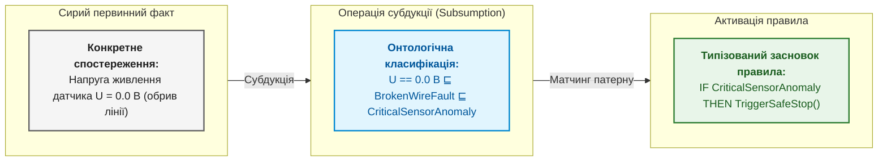

### Дедукція: застосування правила

```math
\frac{P\Rightarrow Q,\qquad P}{Q}
```

Позначення:

- $P$ є засновком, $Q$ є висновком, а $P\Rightarrow Q$ є правилом «якщо $P$, то $Q$»;
- кома між засновками означає, що обидва засновки використовують разом;
- риска відокремлює засновки над нею від висновку під нею.

Це правило відокремлення (*modus ponens*): якщо засновки істинні, висновок теж істинний. Дедукція не створює знання поза засновками. Наприклад, правило каже, що змінена критична вимога без тесту, що пройшов, блокує випуск; для вимоги R-17 умова виконується, отже випуск блокується.

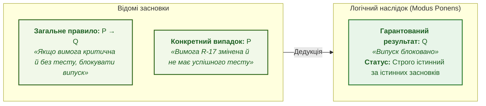

### Індукція: узагальнення спостережень

```math
\frac{P(a_1)\land Q(a_1),\quad P(a_2)\land Q(a_2),\quad\dots,\quad P(a_m)\land Q(a_m)}{\forall x\,\big(P(x)\Rightarrow Q(x)\big)}
```

Розшифрування:

- $a_1,\dots,a_m$ є спостереженими випадками, а $m$ є кількістю випадків;
- $P(a_i)$ означає, що випадок $a_i$ має умову $P$, а $Q(a_i)$ означає, що в цьому випадку спостерігали наслідок $Q$;
- $\land$ означає логічне «і», $\forall x$ означає «для кожного об'єкта $x$», а $\Rightarrow$ означає «якщо, то»;
- риска відокремлює спостережені випадки від узагальнення.

Індукція узагальнює: у всіх $m$ спостереженнях за умови $P$ траплявся наслідок $Q$, отже, можливо, так буває завжди. Висновок є гіпотезою, наступний випадок може її спростувати. Наприклад, у 40 прогонах за температури стенда понад 85 °C тест T-9 падав. Таке узагальнення допомагає планувати перевірки, але в експертній системі відповідального призначення правило-кандидат затверджує експерт ([Глава 25](ch25-how-expert-systems-learn.md)).

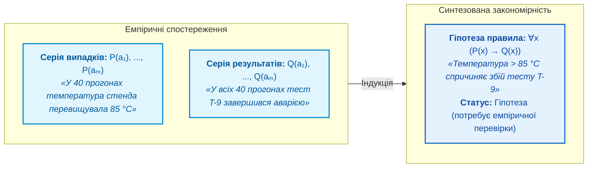

### Абдукція: гіпотеза про причину

```math
\frac{P\Rightarrow Q,\qquad Q}{P\ \ (\text{гіпотеза})}
```

- У формулі $P$ є можливою причиною, $Q$ є спостереженим результатом, а $P\Rightarrow Q$ задає правило між ними;
- $\Rightarrow$ означає «якщо, то», кома показує, що правило й результат є засновками;
- риска відокремлює засновки від висновку $P$;
- напис «гіпотеза» вказує, що висновок не гарантований.

Абдукція рухається від результату до можливої причини: якщо правило пов'язує $P$ з $Q$, а спостерігаємо $Q$, то $P$ може бути поясненням. Інша причина також могла дати $Q$. Сам Пірс називав такий висновок слабким аргументом [[10]](#src-10), а сучасне значення абдукції як висновку до найкращого пояснення описує Ігор Дувен [[11]](#src-11). Наприклад, після перезапуску модуля абдукція пропонує гіпотези «перегрів», «збій живлення» або «спрацював сторожовий таймер», які перевіряють тестами. Докладно діагностику розглядає [Глава 24](ch24-system-diagnosis.md).

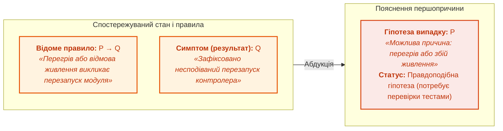

### Традукція: міркування за аналогією та прецедентами (Case-Based Reasoning)

**Традукція** (від лат. *traductio* — переміщення, перенесення) — це умовивід, у якому засновки та висновок мають **однаковий ступінь загальності**: висновок роблять від одиничного випадку до іншого одиничного випадку ($A \to B$), або від однієї системи до іншої системи-аналога. У прикладній інженерії знань традукція є фундаментальним математичним і логічним базисом парадигми **міркування на основі прецедентів** (*Case-Based Reasoning*, CBR) [[12a]](#src-12a).

Якщо дедукція вимагає наявності вже сформульованого загального закону, а індукція — сотень повторень для його виведення, традукція дозволяє експертній системі ухвалити рішення в умовах неповноти знань, спираючись на конкретний архівний досвід:

```math
\frac{\mathrm{Sim}(A, B) \ge \theta,\qquad \mathrm{Solution}(A) = S_A}{\mathrm{CandidateSolution}(B) = \mathrm{Adapt}(S_A)\ \ (\text{за аналогією з довірчим порогом }\theta)}
```

Складники формального виразу:

- $A$ є відомим архівним прецедентом (кортежем $\langle C_A, P_A, A_A, R_A, \Delta_A \rangle$, див. [Главу 4](ch04-evolution-from-bayes-to-evidence-ai.md#L736));
- $B$ є новим, ще не розв'язаним випадком або поточною аномалією з контекстом $C_B$;
- $\mathrm{Sim}(A, B) \in [0, 1]$ є обчисленою функцією схожості між просторами ознак двох випадків;
- $\theta \in (0, 1]$ є каліброваним інженерним порогом довіри, нижче якого перенесення аналогії блокується;
- $\mathrm{Adapt}(S_A)$ є оператором адаптації, що коригує параметри рішення $S_A$ під відмінності контексту $B$.

#### Обчислення міри схожості $\mathrm{Sim}(A, B)$ в експертних системах

Для перенесення розв'язку за традукцією система використовує три взаємодоповнюючі метрики:

**1. Зважена нормалізована дистанція параметрів телеметрії:**

```math
d_W(C_A, C_B) = \sqrt{\sum_{i=1}^n w_i \left(\frac{x_{A,i} - x_{B,i}}{\sigma_i}\right)^2},\qquad \mathrm{Sim}_{\text{metric}}(A, B) = \frac{1}{1 + d_W(C_A, C_B)}
```

де $w_i$ — інженерні ваги значущості фізичних сигналів (напруга, частота, температура), а $\sigma_i$ — дисперсія значень.

**2. Косинусна подібність у латентному семантичному просторі:**

```math
\mathrm{Sim}_{\text{cosine}}(z_A, z_B) = \frac{\mathbf{z}_A \cdot \mathbf{z}_B}{\|\mathbf{z}_A\|\,\|\mathbf{z}_B\|}
```

де $\mathbf{z}_A, \mathbf{z}_B \in \mathbb{R}^d$ — щільні семантичні ембединги інженерного опису дефекту.

**3. Топологічний ізоморфізм підграфів:** обчислення метрики Жаккара або відстані редагування графа знань (*Graph Edit Distance*) між причинно-наслідковими підграфами компонентів.

#### Чотириетапний цикл CBR (4R Cycle)

У класичній моделі Агнара Аамодта й Енріка Плази [[12a]](#src-12a) традуктивний висновок реалізується через чотири кроки:
- **Retrieve (Вилучення):** алгоритм $k\text{NN}$ або векторний індекс знаходить прецедент $A$, найбільш подібний до поточної проблеми $B$;
- **Reuse (Повторне використання):** готове проектне або діагностичне рішення $S_A$ проєктується на випадок $B$;
- **Revise (Ревізія):** фахівець або симуляційна модель перевіряє, чи придатне $S_A$ з урахуванням специфіки $B$, і коригує розбіжності;
- **Retain (Збереження):** новий підтверджений кортеж $\langle C_B, P_B, S_B, R_B, \Delta_B \rangle$ записується в довготривалу пам'ять системи.

#### Традукція в сучасних нейро-символьних архітектурах

Механізм *In-Context Learning* (навчання в контексті) великих і малих мовних моделей під час подачі Few-Shot прикладів у промпт або векторного пошуку RAG є чистою формою обчислювальної традукції. Модель не змінює вагових коефіцієнтів нейромережі (не проводить індукції), але переносить спосіб міркування з наведених у контексті прикладів на нове запитання інженера.

> [!WARNING]
> **Критична небезпека традукції: пастка хибної аналогії (*False Analogy Fallacy*)**  
> Висока зовнішня чи статистична подібність симптомів $\mathrm{Sim}(A, B) \approx 1$ не гарантує збігу внутрішніх фізичних причин. Наприклад, імпульсні завади на шині CAN можуть бути викликані як просадкою напруги 3.3 В (інцидент $A$), так і обривом термінатора 120 Ом (інцидент $B$). Спроба застосувати ліки від $A$ до $B$ призведе до помилкових рішень. Тому в критичних експертних системах кандидатне рішення, виведене традукцією, **ніколи не застосовується наосліп**, а обов'язково передається у дедуктивний шлюз перевірки обмежень безпеки (*Safety Shield*, [Глава 29](ch29-neuro-symbolic-architecture.md)).

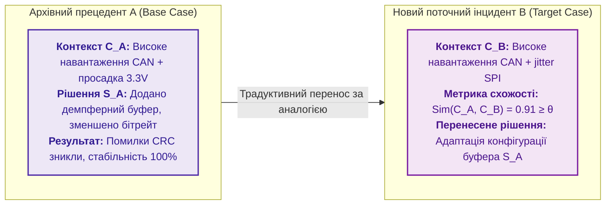

### Едукція: безпосередні умовиводи та еквівалентні трансформації

**Едукція** (від лат. *educere* — виводити, видобувати) у формальній логіці позначає клас **безпосередніх умовиводів** (*immediate inferences*), у яких нове судження отримують із **одного-єдиного засновку** без залучення додаткових правил або емпіричних фактів. Едукція змінює логічну форму твердження, зберігаючи його істиннісне значення.

В інженерних експертних системах використовують три основні види едукції:

#### 1. Протиставлення предикату (Контрапозиція / Contraposition)
Контрапозиція міняє місцями умову та наслідок із одночасним їх запереченням:
```math
\frac{P\Rightarrow Q}{\neg Q\Rightarrow \neg P}
```
У доказових системах контрапозиція є фундаментом зворотного виведення (*Backward Chaining*). Якщо нормативне правило вимагає: *«Якщо модуль допущено до експлуатації ($P$), то всі звіти валідовані ($Q$)»*, то зафіксувавши відсутність звіту ($\neg Q$), машина виведення без додаткових запитів негайно встановлює заборону допуску ($\neg P$).

#### 2. Перетворення (Obversion)
Перетворення змінює якість зв'язки судження на протилежну з одночасним запереченням предиката:
```math
\frac{P\Rightarrow Q}{\neg(P\land \neg Q)}
```
Перетворення усуває суперечності у вимогах: твердження «кожен критичний компонент має бути дубльованим» трансформується у строге обмеження «неприпустимо, щоб компонент був критичним і водночас не дубльованим».

#### 3. Обернення (Conversion)
Обернення міняє місцями суб'єкт і предикат за умови симетричності відношення (наприклад, сумісність пристроїв, взаємне блокування переривань) або з обмеженням квантора:
```math
\frac{\forall x\,(A(x)\land B(x))}{\forall x\,(B(x)\land A(x))}
```

#### Застосування едукції в оптимізації баз знань
- **Канонізація правил:** перед виконанням виведення оптимізатор бази знань застосовує едуктивні перетворення для зведення складних булевих умов до кон'юнктивної нормальної форми (CNF) або диз'юнктів Горна, необхідних для швидкісних SAT/SMT-розв'язувачів (Z3, CVC5);
- **Усунення надлишковості:** едукція виявляє еквівалентні правила, записані авторами в різній синтаксичній формі, запобігаючи подвійному обчисленню та засміченню графа знань.

### Редукція: зведення складної задачі до простіших

Навіть дедукція стає непрактичною, якщо задача велика: сотні умов випуску чи тисячі станів протоколу обміну. Зведення (*reduction*) замінює складну задачу простішою зі збереженням суттєвих властивостей. Два способи зведення особливо корисні для експертних систем.

Перший спосіб розкладає ціль на підцілі деревом І/АБО (*AND/OR tree*), яке описав Нільс Нільссон [[12]](#src-12):

```math
G \Leftarrow g_1\land g_2\land\dots\land g_k,\qquad g_j\Leftarrow h_1\lor h_2\lor\dots\lor h_m
```

Складники формули:

- $G$ є головною ціллю, а $g_1,\dots,g_k$ є її підцілями;
- $k$ є кількістю підцілей, об'єднаних вимогою «І»;
- $g_j$ є однією з підцілей, а $h_1,\dots,h_m$ є альтернативами для її доведення;
- $m$ є кількістю альтернатив, $\land$ означає «і», $\lor$ означає «або»;
- $\Leftarrow$ читається «випливає з», а індекс $j$ вибирає конкретну підціль.

Ціль «випуск дозволено» може вимагати одночасно пройдених критичних тестів, погоджених ризиків і закритих критичних дефектів. Підціль погодження ризику, наприклад, можна довести підписом власника ризику або рішенням комісії. Перевірка листків дерева доводить ціль, а саме дерево пояснює висновок.

Другий спосіб зменшує кількість станів скінченного автомата (*finite automaton*), наприклад моделі протоколу обміну. Два стани можна злити, якщо жодна вхідна послідовність не розрізняє станів:

```math
s_1\sim s_2\iff\forall w\in\Sigma^{\ast}:\ \big(\delta^{\ast}(s_1,w)\in\mathcal{F}\iff\delta^{\ast}(s_2,w)\in\mathcal{F}\big)
```

- Тут $s_1$ і $s_2$ є станами автомата, а $\sim$ означає їхню еквівалентність;
- $\Sigma$ є множиною вхідних символів, $\Sigma^{\ast}$ є множиною скінченних послідовностей цих символів, а $w$ є однією послідовністю;
- $\delta^{\ast}(s,w)$ є станом, до якого автомат переходить зі стану $s$ після входу $w$;
- $\mathcal{F}$ є множиною допустимих, або приймальних, станів, а $\in$ означає належність до цієї множини;
- $\forall$ означає «для кожної послідовності», $\iff$ означає «тоді й лише тоді».

Стани еквівалентні, якщо будь-яка послідовність входів приводить з обох станів або до допустимого стану в обох випадках, або не приводить в обох. Джон Гопкрофт запропонував алгоритм, що знаходить класи еквівалентних станів за час порядку $n\log n$ для автомата з $n$ станами [[13]](#src-13). Результатом є мінімальний автомат із тією самою поведінкою, який легше перевіряти й пояснювати.

### Порівняльна характеристика методів міркування та операцій

| Спосіб / Операція | Вектор виведення | Що є засновками | Що виводять | Епістемологічний статус | Застосування в експертних системах |
|---|---|---|---|---|---|
| **Субдукція** | $\in$ Підведення під категорію | Спостереження $a$ та ієрархія $C \sqsubseteq D$ | Факт належності $a \in D$ | Аналітичний (детермінований онтологією) | Зіставлення шаблонів RETE, таксономія OWL |
| **Дедукція** | $\downarrow$ Від загального до часткового | Загальне правило $P \to Q$ і факт $P$ | Результат $Q$ | Строго істинний (за істинних засновків) | Перевірка критеріїв випуску, допуск, сертифікація |
| **Індукція** | $\uparrow$ Від часткового до загального | Серія випадків $P(a_i)$ і результатів $Q(a_i)$ | Гіпотеза правила $\forall x (P \to Q)$ | Імовірнісна гіпотеза (потребує перевірки) | Автоматизоване навчання на логах тестів |
| **Абдукція** | $\leftarrow$ Від наслідку до причини | Правило $P \to Q$ і симптом $Q$ | Гіпотеза причини $P$ | Правдоподібна гіпотеза (найкраще пояснення) | Технічна діагностика, аналіз аварій (FTA) |
| **Традукція** | $\leftrightarrow$ На рівні прецедентів | Прецедент $A$, рішення $S_A$ і схожість $\mathrm{Sim} \ge \theta$ | Адаптоване рішення для $B$ | Евристична аналогія (потребує захисного щита) | Case-Based Reasoning, Few-Shot RAG, виправлення дефектів |
| **Едукція** | $\equiv$ Еквівалентна трансформація | Єдине судження $P \to Q$ | Нова форма ($\neg Q \to \neg P$) | Тотожно істинний (зберігає істинність) | Нормалізація бази правил, зворотне виведення |
| **Редукція** | $\searrow$ Зведення складного до простого | Складна ціль $G$ або автомат з $n$ станами | Дерево підцілей $g_1 \land \dots \land g_k$ чи мінімальний автомат | Еквівалентний (зберігає розв'язність і семантику) | Декомпозиція цілей І/АБО, мінімізація автоматів (Гопкрофт) |

Субдукція категоризує спостереження, дедукція застосовує нормативні правила, індукція генерує нові правила, абдукція шукає першопричини відмов, традукція переносить досвід прецедентів, едукція нормалізує базу знань, а редукція робить складні задачі обчислювано підйомними. Для експертної системи найважливіше розрізняти статус висновку: дедуктивний, субдуктивний та едуктивний висновки подають як строго гарантований результат, а традуктивний, індуктивний і абдуктивний — як гіпотези з планом перевірки й захисними обмеженнями. Наступне запитання інженерне: як машина виведення застосовує тисячі правил до мільйонів фактів і не сповільнюється.

## Рушій правил: Rete, черга правил і розв'язання конфліктів

Коли правил десятки, машина виведення може після кожної зміни перевіряти всі правила з усіма фактами. Коли правил тисячі, а фактів мільйони, повний перебір на кожному кроці стає надто дорогим, і рушій правил (*rule engine*) не встигає за потоком подій.

Чарльз Форджі 1982 року запропонував алгоритм Rete, назва якого латиною означає «мережа» [[14]](#src-14). Алгоритм спирається на два спостереження. По-перше, за один крок змінюється мало фактів, тому немає сенсу щоразу перевіряти все з нуля. По-друге, різні правила часто мають спільні умови, тому спільну умову варто перевіряти один раз. Rete будує мережу вузлів-умов і зберігає часткові збіги; коли змінюється факт, перераховується лише частина мережі, яку зачіпає змінений факт. Аналогія з програмування: інкрементальна збірка перекомпільовує лише змінені файли. Деніел Міранкер запропонував алгоритм TREAT, який не зберігає проміжних з'єднань умов і тому економить пам'ять ціною повторних обчислень [[15]](#src-15).

Три поняття рушія правил трапляються в документації до кожного рушія. Робоча пам'ять (*working memory*) містить поточні факти. Черга правил (*agenda*) містить правила, чиї умови вже виконано і які готові спрацювати. Розв'язання конфліктів (*conflict resolution*) вибирає, яке з готових правил виконати першим; пріоритет правила в рушіях CLIPS (*C Language Integrated Production System*) і Drools називають `salience`, тобто вагою спрацьовування.

Нехай одночасно готові спрацювати правило «заблокувати випуск через непідтверджену вимогу» і правило «надіслати нагадування власникові тесту». Якщо порядок не зафіксовано, два запуски з тими самими фактами можуть дати різні журнали дій. Тому пріоритети й стратегію розв'язання конфліктів записують явно, а журнал активацій показує, чому одне правило виконалося раніше за інше.

Rete робить виведення швидким, а явна стратегія розв'язання конфліктів робить виведення відтворюваним. Але швидке виведення має ваду: висновок, зроблений учора, може спиратися на підставу, яку сьогодні відкликали.

## Підтримання істинності: відкликання висновку без підстави

Експертна система вивела «випуск готовий» на підставі чотирьох фактів: критичні дефекти закрито, тести пройшли, виняток погоджено, перегляд впливу на безпеку завершено. Наступного дня погодження винятку відкликали. Якщо експертна система просто додасть новий факт, старий висновок лишиться в базі й уведе користувача в оману.

Системи підтримання істинності (*truth maintenance systems*, TMS) пам'ятають, який висновок від яких підстав залежить. Джон Дойл описав систему підтримання істинності на основі обґрунтувань (*justification-based TMS*, JTMS): кожне твердження має обґрунтування, і твердження позначено IN (чинне), якщо хоча б одне обґрунтування чинне, або OUT (нечинне) [[16]](#src-16). Коли підстава стає OUT, позначки поширюються мережею залежностей, і залежні висновки теж стають OUT. Йохан де Клеєр описав систему підтримання істинності на основі припущень (*assumption-based TMS*, ATMS), яка для кожного висновку зберігає мінімальні набори припущень, за яких висновок виводиться [[17]](#src-17):

```math
L(n)=\{\,E\subseteq A \mid E\cup J\vdash n,\ E\ \text{несуперечливий},\ E\ \text{мінімальний}\,\}
```

де:

- $n$ є висновком, $A$ є множиною всіх припущень, а $E$ є однією множиною припущень, або середовищем;
- $J$ є множиною обґрунтувань, тобто правил, а $L(n)$ є множиною альтернативних підстав висновку $n$;
- $\subseteq$ означає «є підмножиною», $\cup$ означає об'єднання множин, а $\vdash$ читається «виводиться»;
- вертикальна риска читається «за умови, що», а обидві умови після неї вимагають несуперечливості й мінімальності набору $E$.

Отже, $L(n)$ перелічує мінімальні й несуперечливі набори припущень, кожен з яких разом із правилами $J$ дає висновок $n$. Наприклад, висновок «випуск готовий» може спиратися на погоджений виняток або на виправлення дефекту D-4. Якщо виняток відкликали, висновок лишається чинним лише за умови виправленого дефекту.

У сучасних реалізаціях ту саму ідею втілюють графом залежностей, журналом подій, до якого лише дописують, і версійними записами доказів. Якщо джерело застаріло, правило змінилося або виняток відкликали, експертна система знаходить усі залежні висновки, позначає висновки для повторної перевірки й повторює лише зачеплений ланцюжок міркування. Роль підтримання істинності в архітектурі розглядає [Глава 16](ch16-expert-systems-architecture.md). Логіка й підтримання істинності працюють із твердженнями «так» чи «ні». Коли ж свідчення лише підвищує чи знижує впевненість, потрібна математика невизначеності.

## Невизначеність: ймовірність, процеси в часі, нечіткість і свідчення

Падіння тесту T-9 не доводить дефекту: тест міг упасти через збій стенда. Друге запитання зі вступу звучить так: наскільки падіння тесту змінило ризик? [Глава 4](ch04-evolution-from-bayes-to-evidence-ai.md) уже порівняла коефіцієнти впевненості MYCIN, теорему Байєса, нечітку логіку й теорію Демпстера–Шафера на числових прикладах і пояснила, чому шкали цих методів не можна змішувати. Цей розділ додає те, що потрібно для побудови експертної системи: чому формула Байєса правильна, як байєсівська мережа економить параметри й зважує альтернативні причини, як моделювати процеси в часі й де правило Демпстера дає абсурдний результат.

### Чому формула Байєса правильна

Теорема Байєса випливає з означення умовної ймовірності (*conditional probability*) у два кроки. Умовна ймовірність гіпотези $H$ за свідчення $E$ є часткою випадків, де істинні обидва, серед випадків, де є $E$:

```math
P(H\mid E)=\frac{P(H\cap E)}{P(E)},\qquad P(E\mid H)=\frac{P(H\cap E)}{P(H)}
```

де:

- $H$ є гіпотезою, $E$ є свідченням, а $P(\cdot)$ задає ймовірність події в межах від 0 до 1;
- $P(H\cap E)$ є ймовірністю одночасної істинності гіпотези й свідчення, а $\cap$ означає перетин подій;
- $P(H\mid E)$ є ймовірністю гіпотези за умови свідчення, а $P(E\mid H)$ є ймовірністю свідчення за умови гіпотези;
- $P(E)$ і $P(H)$ є ймовірностями умовних подій і мають бути більшими за нуль;
- риска дробу означає ділення, а вертикальна риска $\mid$ читається «за умови».

Умовна ймовірність є часткою випадків, у яких істинні обидві події, серед випадків, де істинна подія після риски. З другої рівності маємо $`P(H\cap E)=P(E\mid H)\,P(H)`$; підстановка цього добутку в перший дріб дає теорему Байєса:

```math
P(H\mid E)=\frac{P(E\mid H)\,P(H)}{P(E)}
```

Позначення:

- $H$ є гіпотезою, $E$ є спостереженим свідченням, а $P(H\mid E)$ є ймовірністю гіпотези після врахування свідчення;
- $P(E\mid H)$ є ймовірністю побачити свідчення, якщо гіпотеза істинна, а $P(H)$ є початковою ймовірністю гіпотези;
- $P(E)$ є ймовірністю самого свідчення й має бути більшою за нуль;
- $\mid$ означає «за умови», добуток означає множення, а риска дробу означає ділення.

Результат $P(H\mid E)$ лежить у межах від 0 до 1 і називається апостеріорною ймовірністю. Числовий приклад із тисячею релізів, запис через шанси й правило для кількох залежних свідчень наведено в [Главі 4](ch04-evolution-from-bayes-to-evidence-ai.md). Для застосування формули треба записати джерела початкової ймовірності та умовних ймовірностей.

### Байєсівська мережа: менше параметрів і пояснення через іншу причину

Коли змінних багато, повна таблиця спільних ймовірностей стає величезною: для 20 двійкових змінних таблиця має $2^{20}-1\approx10^6$ незалежних чисел, і жоден експерт не оцінить стільки ймовірностей. Байєсівська мережа (*Bayesian network*) Джудеї Перла розкладає спільний розподіл на малі локальні таблиці [[18]](#src-18):

```math
P(X_1,\dots,X_n)=\prod_{i=1}^{n}P\big(X_i\mid\mathrm{Pa}(X_i)\big)
```

- У формулі $X_1,\dots,X_n$ є змінними моделі, а $n$ є їхньою кількістю;
- $\prod_{i=1}^{n}$ означає перемножити множники для всіх індексів $i$ від 1 до $n$;
- $\mathrm{Pa}(X_i)$ є батьківськими змінними $X_i$ у спрямованому ациклічному графі, тобто його безпосередніми залежностями;
- $P(X_i\mid\mathrm{Pa}(X_i))$ є умовним розподілом змінної $X_i$ за значень її батьків.

Формула розкладає спільну ймовірність усіх змінних на добуток локальних умовних ймовірностей. Якщо кожна з 20 двійкових змінних має не більше двох батьків, локальна таблиця кожної змінної потребує не більше чотирьох чисел, разом не більше 80 замість приблизно мільйона. Такий розклад правильний лише за коректних умовних незалежностей; стрілка графа сама не доводить причинності.

Байєсівська мережа вміє те, чого не вміє набір окремих правил: зважувати одну причину проти іншої. Нехай тест T-9 може впасти через дефект коду або через збій стенда. Схема показує мережу з трьох вершин.

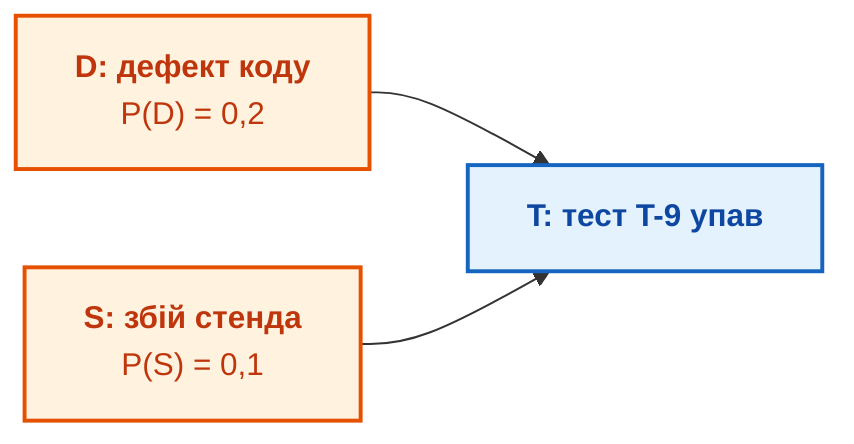

Помаранчеві вершини є причинами, синя вершина є наслідком. Дефект коду $D$ має початкову ймовірність 0,2, збій стенда $S$ має ймовірність 0,1, причини незалежні. Локальна таблиця наслідку задає ймовірність падіння тесту за кожної комбінації причин:

| Дефект коду $D$ | Збій стенда $S$ | $P(T\mid D,S)$ |
|---|---|---:|
| так | так | 0,99 |
| так | ні | 0,90 |
| ні | так | 0,80 |
| ні | ні | 0,05 |

Імовірність падіння тесту є сумою за чотирма комбінаціями причин: $P(T)=0{,}2\cdot0{,}1\cdot0{,}99+0{,}2\cdot0{,}9\cdot0{,}90+0{,}8\cdot0{,}1\cdot0{,}80+0{,}8\cdot0{,}9\cdot0{,}05\approx0{,}282$. Після падіння тесту ймовірність дефекту коду зростає з 0,2 до $P(D\mid T)\approx(0{,}0198+0{,}162)/0{,}282\approx0{,}645$. Якщо ж журнал стенда підтвердив збій, $P(D\mid T,S)=0{,}0198/(0{,}0198+0{,}064)\approx0{,}236$, тобто ймовірність майже повернулася до початкових 0,2. Підтверджена альтернативна причина пояснила падіння тесту, і підозра з коду знялася. Такий ефект називають поясненням через іншу причину (*explaining away*); ефект розглядає Перл [[18]](#src-18). Практичний висновок для інженера простий: перш ніж звинувачувати код, перевір журнал стенда.

### Марковські моделі: процеси в часі

Байєсівська мережа описує стан у певний момент. Інженерні процеси розгортаються в часі: вимога переходить зі стану в стан, проєкт поступово деградує. Андрій Марков запропонував моделювати послідовності, у яких наступний стан залежить лише від поточного, а не від усієї історії. Для послідовності станів $X_0,X_1,\dots$ марковська властивість (*Markov property*) має вигляд:

```math
P(X_{t+1}=j\mid X_t=i,X_{t-1},\dots,X_0)=P(X_{t+1}=j\mid X_t=i)=T_{ij}
```

- У марковській формулі $X_t$ є станом процесу в момент $t$, а $t$ є індексом часу або кроку;
- $i$ та $j$ позначають можливі поточний і наступний стани;
- $P(\cdot\mid\cdot)$ є умовною ймовірністю, $\mid$ означає «за умови», а $T_{ij}$ є ймовірністю переходу зі стану $i$ до стану $j$;
- рівність показує марковське припущення: за відомого поточного стану попередні стани не змінюють розподіл наступного;
- кожне $T_{ij}$ належить відрізку $[0,1]$, а ймовірності всіх переходів із того самого стану в сумі дорівнюють 1.

Модель із такими переходами називають марковським ланцюгом. Наприклад, вимога зі стану «на перегляді» може перейти до затвердження з імовірністю 0,6, на доопрацювання з імовірністю 0,3 або лишитися на перегляді з імовірністю 0,1. Модель описує статистичну поведінку процесу за умов, на яких її оцінили, а не долю конкретної вимоги.

Прихована марковська модель (*hidden Markov model*, HMM) додає стан, якого не видно безпосередньо. Лоренс Рабінер описав алгоритми, які за послідовністю спостережень оцінюють найімовірнішу послідовність прихованих станів [[19]](#src-19). Прихованим станом проєкту може бути «здоровий», «нестабільний» чи «передкризовий», а видимими сигналами зростання кількості дефектів, падіння тестів і прострочені перегляди. Якщо ймовірність стану «передкризовий» перевищує поріг, експертна система радить дію: зібрати додаткові докази, повторити перевірку або залучити експерта.

Марковський процес ухвалення рішень (*Markov decision process*, MDP) додає дії й винагороди: експертна система не лише прогнозує, а й вибирає дію, наприклад запустити додатковий тест, ескалювати ризик чи відкласти випуск. Правило вибору дії в кожному стані називають політикою (*policy*) $\pi$, а цінність політики задає формула, яку докладно розглядає Мартін Путерман [[20]](#src-20):

```math
V^{\pi}(s)=\mathbb{E}_{\pi}\Big[\sum_{t=0}^{\infty}\gamma^{t}r_t\ \Big|\ s_0=s\Big]
```

- У формулі $s$ є початковим станом, а $s_0=s$ задає цей початковий стан;
- $V^{\pi}(s)$ є очікуваною сумарною винагородою політики $\pi$ зі стану $s$;
- $r_t$ є винагородою або вартістю на кроці $t$, а $t$ нумерує кроки від 0 до нескінченності;
- $\gamma\in[0,1)$ є коефіцієнтом дисконтування, $\gamma^t$ задає вагу винагороди на кроці $t$;
- $\sum$ означає суму всіх зважених винагород, а $\mathbb{E}_{\pi}$ означає математичне сподівання за політикою $\pi$;
- вертикальна риска означає, що суму обчислюють за умови початкового стану $s_0=s$.

За $\gamma=0{,}9$ така сама винагорода через 10 кроків важить $0{,}9^{10}\approx0{,}35$ від негайної. Більше значення $V^{\pi}(s)$ означає більшу очікувану сумарну користь за заданої політики, а не гарантований результат. Якщо стан видно лише через непрямі сигнали, застосовують частково спостережуваний марковський процес ухвалення рішень; у першій версії експертної системи часто достатньо спрощеної політики з явним описом станів, вартостей і обмежень безпеки.

### Нечітка логіка: ступінь замість різкої межі

Не всі інженерні поняття мають різку межу: «свіже джерело», «помірний ризик», «майже готовий випуск». Нечітка множина Лотфі Заде задає ступінь належності від 0 до 1 [[21]](#src-21); базове означення та концептуальний контекст наведено в [Главі 4](ch04-evolution-from-bayes-to-evidence-ai.md). Наприклад, команда може домовитися про лінійну функцію свіжості джерела за його віком $a$ у днях:

```math
\mu_{\mathrm{fresh}}(a)=\max\Big(0,\ 1-\frac{a}{180}\Big)
```

Параметри формули:

- $a$ є віком джерела в днях і не може бути від'ємним;
- $\mu_{\mathrm{fresh}}(a)$ є ступенем свіжості від 0 до 1, де індекс $\mathrm{fresh}$ позначає оцінювану властивість;
- $\max$ обирає більше з нуля та виразу $1-a/180$, що гарантує невід'ємність результату;
- 180 є погодженою проєктною межею застарівання в днях, а 1 відповідає максимальному ступеню належності.

За цією шкалою новий документ має ступінь 1, документ віком 90 днів має 0,5, а документ віком 180 днів і старший має 0. Це не статистична ймовірність правильності документа, а детермінована шкала довіри, узгоджена власником знань; її межі не можна екстраполювати на інший контекст без інженерного аудиту.

#### Оператори нечіткої алгебри: Т-норми, S-норми та виведення

Для поєднання кількох нечітких передумов у складних правилах виду $\text{ЯКЩО}\ (x_1 \in A)\ \text{ТА}\ (x_2 \in B)\ \text{ТО}\ (y \in C)$ застосовують трикутні норми (Т-норми для кон'юнкції «І») та трикутні конорми (S-норми для диз'юнкції «АБО»):

1. **Т-норми (кон'юнкція, логічне «І»):** функція $T:[0,1]\times[0,1]\to[0,1]$, що є комутативною, асоціативною, монотонною та задовольняє $T(a, 1) = a$.
   - *Т-норма Геделя (мінімум):* $T_{\min}(a, b) = \min(a, b)$ — найбільш консервативна оцінка найслабшої ланки;
   - *Добуткова Т-норма:* $T_{\mathrm{prod}}(a, b) = a \cdot b$ — враховує взаємне зниження ступеня впевненості;
   - *Т-норма Лукасевича:* $T_{\mathrm{Luk}}(a, b) = \max(0, a + b - 1)$ — моделює жорсткий кумулятивний дефіцит.

2. **S-норми (диз'юнкція, логічне «АБО»):** функція $S:[0,1]\times[0,1]\to[0,1]$, де $S(a, 0) = a$.
   - *S-норма (максимум):* $S_{\max}(a, b) = \max(a, b)$;
   - *Імовірнісна сума:* $S_{\mathrm{sum}}(a, b) = a + b - a \cdot b$.

Перехід від зрізаних вихідних нечітких множин до чіткого керуючого сигналу або рішення називається **дефазифікацією**. У моделі Мамдані найпоширенішим є метод центру тяжіння (Center of Gravity, COG):

```math
z^* = \frac{\int_Z z \cdot \mu_C(z)\,dz}{\int_Z \mu_C(z)\,dz} \approx \frac{\sum_{i=1}^n z_i \cdot \mu_C(z_i)}{\sum_{i=1}^n \mu_C(z_i)}
```

Символи формули мають такий зміст:

- $z^*$ є чітким вихідним числовим значенням (наприклад, кутом повороту сервоприводу або підсумковим числовим пріоритетом аудиту);
- $Z$ є областю визначення вихідної змінної;
- $z_i$ є дискретним значенням вихідної змінної на $i$-му кроці розбиття шкали;
- $\mu_C(z_i)$ є агрегованим ступенем належності виходу на кроці $z_i$, отриманим у результаті композиції активних правил;
- $\sum_{i=1}^n$ позначає підсумовування за всіма $n$ точками дискретизації вихідного інтервалу.

У моделі **Такагі–Сугено–Канга (TSK)** висновок кожного правила задається не нечіткою множиною, а чіткою функцією від входів $f_j(\mathbf{x}) = \mathbf{p}_j^T \mathbf{x} + r_j$. Тоді підсумковий висновок є зваженою сумою:

```math
y^* = \frac{\sum_{j=1}^M w_j \cdot f_j(\mathbf{x})}{\sum_{j=1}^M w_j}
```

де $w_j = T(\mu_{A_j}(x_1), \mu_{B_j}(x_2))$ є силою спрацювання $j$-го правила за відповідною Т-нормою, а $M$ — загальна кількість сформульованих правил.

#### Нечітка логіка та ймовірнісний апарат мовних моделей

Часто виникає спокуса замінити нечітке виведення статистичними ймовірностями сучасних генеративних мовних моделей (LLM/SLM). Проте ці підходи базуються на принципово несумісних математичних аксіомах:

| Критерій порівняння | Нечітка логіка (Fuzzy Logic) | Ймовірнісний підхід мовних моделей (LLM) |
|---|---|---|
| **Семантична сутність** | **Ступінь істинності:** міра відповідності поняттю з нерізкими межами ($\mu \in [0, 1]$). | **Ступінь правдоподібності/частота:** розподіл імовірностей над словником токенів ($P \in [0, 1]$). |
| **Нормування простору** | **Неадитивна:** незалежні функції належності. Одночасно $\mu_{\mathrm{cold}}(x) = 0{,}7$ та $\mu_{\mathrm{warm}}(x) = 0{,}6$. | **Строго адитивна (Колмогоров):** вихідний шар $\mathrm{Softmax}$ гарантує $\sum_{k} P(\mathrm{token}_k) = 1$. |
| **Композиція умов** | Детерміновані Т-норми ($\min$, добуток); відсутність стохастичного шуму. | Стохастична вибірка (температура $T$, top-$p$), авторегресійний дрейф контексту. |
| **Верифіковність** | Математично доказові межі, придатність для стандартів безпеки ISO 26262/IEC 61508. | Схильність до арифметичних галюцинацій та нестабільних числових оцінок. |

З цієї причини **мовна модель не може виступати надійним чисельним обчислювачем нечіткої логіки**. Її ефективна роль лежить в іншій площині — у ролі семантичного інтерфейсу дворівневої нейро-символьної архітектури ([Глава 28](ch28-dual-mode-expert-systems.md), [Глава 29](ch29-neuro-symbolic-architecture.md)):

```mermaid
flowchart LR
    accTitle: Нейро-символьний тандем мовної моделі та нечіткого ядра
    accDescr: Мовна модель виконує лінгвістичну фазифікацію та дефазифікаційне пояснення, а детерміноване ядро обчислює Т-норми.

    IN["Природномовний текст<br/><i>«Тиск помірно завищений, температура критична»</i>"] --> LLM_IN["Локальна модель (SLM)<br/><b>Лінгвістична фазифікація</b><br/>Виділення термів і модифікаторів"]
    LLM_IN --> VEC["Вектор чітких значень / порогів x_k"]
    
    subgraph Core["Детерміноване ядро (SIMD / FPGA / Analog)"]
        VEC --> MF["Функції належності μ(x)"]
        MF --> TNORM["Т-норми (min, prod)<br/>База нечітких правил"]
        TNORM --> DEFUZZ["Дефазифікація (COG / Сугено)"]
    end

    DEFUZZ --> RES["Керуючий вердикт z*<br/>та рівні активації правил"]
    RES --> LLM_OUT["Локальна модель (SLM)<br/><b>Лінгвістичне пояснення</b><br/>Генерація структурованого аргументу"]
    LLM_OUT --> PROOF["Пакет обґрунтування<br/>з побайтовими джерелами"]

    classDef nlp fill:#e1f5fe,stroke:#0288d1,stroke-width:2px,color:#01579b;
    classDef det fill:#fff3e0,stroke:#e65100,stroke-width:2px,color:#bf360c;
    classDef out fill:#e8f5e9,stroke:#2e7d32,stroke-width:2px,color:#1b5e20;

    class LLM_IN,LLM_OUT nlp;
    class MF,TNORM,DEFUZZ det;
    class IN,VEC,RES,PROOF out;
```

1. **Лінгвістична фазифікація через лінгвістичні модифікатори (Hedges):** Людина вводить неформалізоване спостереження: *«температура дещо вища за норму, але вібрація зростає вкрай різко»*. Мовна модель виділяє якісні модифікатори (*«дещо»* $\to \sqrt{\mu}$, *«вкрай різко»* $\to \mu^2$, або оператор концентрації Заде) і транслює їх у конкретні вхідні параметри для формального ядра.
2. **Синтез правил з технічної документації:** Мовна модель вилучає нечіткі асоціативні правила з регламентів виробника або стандартів комплаєнсу ([Глава 14](ch14-requirements-detection-and-formalization.md)), які потім інженерно калібруються й закріплюються у верифікованій базі знань.
3. **Лінгвістична дефазифікація та пояснення рішень:** Отримавши точний математичний результат $z^* = 0{,}42$ та вектор сили спрацювання правил $w_j$, мовна модель синтезує вичерпне, аргументоване пояснення для оператора людською мовою, заземлюючи кожен висновок на пункти первинного регламенту ([Глава 20](ch20-explanation-engine.md)).

#### Програмна оптимізація: векторизація SIMD та верифікація SMT

Для програмного виконання нечітких систем на звичайних процесорах (CPU) застосовують спеціалізовані архітектурні патерни:

- **Векторизація SIMD (AVX2 / AVX-512 / ARM Neon):** Оскільки кусково-лінійні функції належності (трикутні, трапецієподібні) та Т-норми Геделя спираються виключно на операції порівняння $\min(a, b)$ і $\max(a, b)$, векторний регістр шириною 256 або 512 біт здатен паралельно обчислювати 8 або 16 значень належності за один такт процесора (інструкції `_mm256_min_ps` / `_mm256_max_ps`). Це дозволяє оцінювати бази з 10 000 нечітких правил менш ніж за 5 мікросекунд без виділення динамічної пам'яті.
- **Статичні таблиці пошуку (Look-Up Tables, LUT):** Попередній розрахунок складних сигмоїдних або гаусових функцій належності у фіксовані масиви пам'яті виключає виклики повільних математичних функцій `exp` у критичних затримках циклу керування.
- **Формальна перевірка простору правил через SMT-солвери (Z3 / CVC5):** База нечітких правил підлягає обов'язковому аудиту на повноту покриття простору входів (відсутність зон мертвого мовчання, де $\sum w_j = 0$) та на відсутність конфліктів, коли за однакового входу активуються діаметрально протилежні керуючі дії ([Глава 23](ch23-knowledge-base-verification.md)).

#### Апаратна реалізація: FPGA, аналогові ядра та In-Memory кросбари

У системах реального часу високого рівня відповідальності (функціональна безпека ISO 26262 ASIL-D, автономна робототехніка, авіоніка) програмне виконання на операційній системі загального призначення не завжди задовольняє вимоги до гарантованого інтервалу затримки (FTTI). Залежно від вимог застосовують спеціалізовані апаратні платформи:

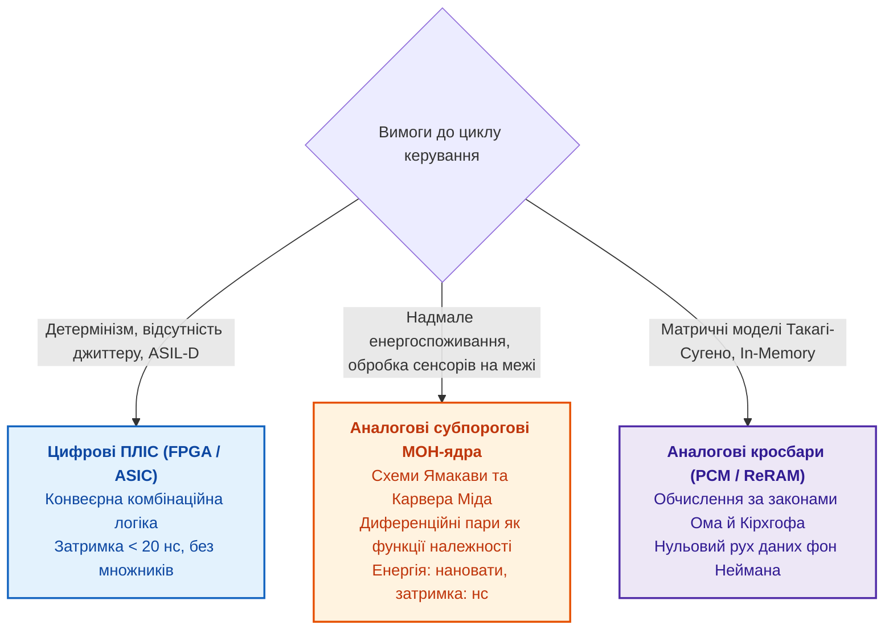

1. **Цифрові ПЛІС (FPGA) та апаратні мікроконтролери:**
   - Нечіткі рушії синтезуються в чисті комбінаційні матриці без потреби в апаратних блоках множення (для моделі Мамдані з Т-нормою $\min$).
   - Забезпечують абсолютно детерміновану реакцію із затримкою у лічені наносекунди (< 20 нс), нульовий джиттер та повну прозорість для сертифікаційних тестів.
2. **Аналогові субпорогові мікросхеми (архітектура Такеші Ямакави та Карвера Міда):**
   - Як докладно розглянуто в [Додатку Г](appendix-d-analog-expert-systems-and-neuromorphic-computing.md#L204-L260), фізика підпорогового каналу польового МОН-транзистора природно реалізує гладку сигмоїдну функцію належності за рахунок експоненційної залежності струму стоку $I_d$ від напруги затвора $V_{gs}$.
   - Т-норми кон'юнкції виконуються струмовими селекторами мінімуму на діодних структурах.
   - Багатоальтернативний вибір серед правил реалізується не пошуком максимуму в циклі, а нелінійною аналоговою схемою «переможець отримує все» (Winner-Take-All, WTA) Лаццаро–Міда зі складністю $O(1)$ від кількості входів. Споживана потужність таких схем становить лічені нановати, що дозволяє інтегрувати нечіткий логічний арбітраж безпосередньо в кристал сенсора.
3. **Мемристорні кросбари (In-Memory Computing):**
   - Для лінійних нечітких правил Такагі–Сугено матрично-векторне множення входів на вагові коефіцієнти виконується на рівні фізичного масиву провідностей за законом Ома ($I = G \cdot V$) та законом струмів Кірхгофа, долаючи затримки передачі даних шиною фон Неймана ([Додаток Д](appendix-e-mixed-signal-neuromorphic-expert-systems.md)).

---


### Теорія свідчень: коли джерела суперечать одне одному

Камера дрона бачить ціль, а тепловізор не бачить. Ймовірність розподіляє всю одиницю між окремими гіпотезами й не має місця для «не знаю». Теорія Артура Демпстера [[22]](#src-22) і Гленна Шафера [[23]](#src-23) дозволяє призначити масу довіри не лише окремій гіпотезі, а й множині гіпотез, зокрема множині всіх гіпотез, тобто незнанню:

```math
m:2^{\Theta}\to[0,1],\qquad m(\varnothing)=0,\qquad\sum_{A\subseteq\Theta}m(A)=1
```

Символи формули мають такий зміст:

- $\Theta$ є множиною взаємовиключних гіпотез, а $2^{\Theta}$ є множиною всіх її підмножин;
- $m$ призначає кожній підмножині масу довіри $m(A)$ у межах від 0 до 1;
- $\varnothing$ є порожньою множиною, якій за умовою призначають нульову масу;
- $\sum_{A\subseteq\Theta}$ означає додати маси всіх підмножин $A$, а сума дорівнює 1.

Отже, масу можна призначити як окремій гіпотезі, так і групі гіпотез, що зберігає незнання між ними. Два джерела поєднують правилом Демпстера; його формулу й числовий приклад наведено в [Главі 4](ch04-evolution-from-bayes-to-evidence-ai.md). Перед поєднанням обчислюють масу конфлікту:

```math
K=\sum_{B\cap C=\varnothing}m_1(B)\,m_2(C)
```

- Тут $K$ є масою конфлікту між двома джерелами;
- $m_1(B)$ і $m_2(C)$ є масами, призначеними множинам $B$ і $C$ першим та другим джерелами;
- $\sum$ означає додавання добутків для всіх пар, де $B\cap C=\varnothing$;
- $\cap$ означає перетин множин, а $\varnothing$ означає порожній перетин;
- $K$ лежить у межах від 0 до 1: нуль означає відсутність конфлікту, одиниця означає повну суперечність.

Правило Демпстера ділить спільні маси на $1-K$, тобто вилучає конфлікт із нормованого результату. За великого $K$ нормування може перебільшити слабку спільну гіпотезу; тому експертна система має порівняти $K$ з погодженим порогом перед поєднанням.

Приклад із дроном: множина гіпотез $`\Theta=\{\text{ціль},\text{немає цілі}\}`$; камера дає $`m_1(\{\text{ціль}\})=0{,}8`$ і лишає $m_1(\Theta)=0{,}2$ на незнання; тепловізор дає $`m_2(\{\text{немає цілі}\})=0{,}7`$ і $m_2(\Theta)=0{,}3$. Маса конфлікту $K=0{,}8\cdot0{,}7=0{,}56$: більше половини спільної маси припадає на пряму суперечність. Після нормування гіпотеза «ціль» отримує масу 0,545, хоча джерела радше сперечаються, ніж погоджуються.

Лотфі Заде показав, куди веде нормування за великого конфлікту [[24]](#src-24). Перший лікар оцінює менінгіт масою 0,99, а пухлину мозку масою 0,01; другий лікар оцінює струс мозку масою 0,99, а пухлину масою 0,01. Обидва лікарі вважають пухлину майже неймовірною, але правило Демпстера дає пухлині масу 1: конфлікт $K=0{,}9999$ викинуто, і лишилася єдина гіпотеза, з якою обидва джерела формально сумісні. Програма мовою Go рахує обидва приклади.

<details>
<summary>Приклад мовою Go: правило Демпстера й маса конфлікту</summary>

Програма є повною й запускається командою `go run main.go`. Множину гіпотез кодує бітова маска: у прикладі з дроном біт 1 означає «ціль», біт 2 означає «немає цілі», а маска 3 є множиною обох гіпотез, тобто незнанням. Функція `combine` множить маси всіх пар множин, накопичує масу конфлікту для пар без перетину й нормує решту на $1-K$.

```go
package main

import (
	"fmt"
	"strings"
)

// Mass призначає масу довіри множинам гіпотез; множину кодує бітова маска.
type Mass map[uint]float64

// combine поєднує два джерела правилом Демпстера й повертає масу конфлікту K.
func combine(m1, m2 Mass) (Mass, float64) {
	out := Mass{}
	k := 0.0
	for b, x := range m1 {
		for c, y := range m2 {
			if a := b & c; a == 0 {
				k += x * y
			} else {
				out[a] += x * y
			}
		}
	}
	if k >= 1 {
		return nil, k
	}
	for a := range out {
		out[a] /= 1 - k
	}
	return out, k
}

func label(a uint, names []string) string {
	var parts []string
	for i, n := range names {
		if a&(1<<i) != 0 {
			parts = append(parts, n)
		}
	}
	return strings.Join(parts, ", ")
}

func show(title string, names []string, m1, m2 Mass) {
	m, k := combine(m1, m2)
	fmt.Printf("%s: K = %.4f\n", title, k)
	if m == nil {
		fmt.Println("  правило Демпстера не визначене: повний конфлікт")
		return
	}
	for a := uint(1); a < 1<<len(names); a++ {
		if v, ok := m[a]; ok {
			fmt.Printf("  m({%s}) = %.3f\n", label(a, names), v)
		}
	}
}

func main() {
	const target, none = 1, 2
	show("камера й тепловізор", []string{"ціль", "немає цілі"},
		Mass{target: 0.8, target | none: 0.2},
		Mass{none: 0.7, target | none: 0.3})

	const men, con, tum = 1, 2, 4
	show("приклад Заде", []string{"менінгіт", "струс мозку", "пухлина"},
		Mass{men: 0.99, tum: 0.01},
		Mass{con: 0.99, tum: 0.01})
}
```

Програма друкує:

```text
камера й тепловізор: K = 0.5600
  m({ціль}) = 0.545
  m({немає цілі}) = 0.318
  m({ціль, немає цілі}) = 0.136
приклад Заде: K = 0.9999
  m({пухлина}) = 1.000
```

У першому прикладі після нормування гіпотеза «ціль» має масу 0,545, «немає цілі» має 0,318, а незнання 0,136; проте маса конфлікту 0,56 зникла з результату. У другому прикладі нормування за $K=0{,}9999$ перетворює майже неймовірну гіпотезу на впевнений висновок.

</details>

Звідси правило для експертної системи: спершу порівняти масу конфлікту $K$ з погодженим порогом і лише потім поєднувати маси. Якщо $K$ перевищує поріг, експертна система повертає «джерела суперечать одне одному» разом із переліком джерел, а не нормований результат. Правило Демпстера також вимагає незалежності джерел: два звіти, що копіюють той самий журнал, не є двома незалежними свідченнями.

Ймовірність, ступінь належності й маса довіри вимірюють різні величини. Байєсівська мережа зважує причини, марковська модель описує процес у часі, нечітка функція задає розмиту межу, а теорія свідчень показує конфлікт джерел. Усі ці моделі працюють із наперед заданими змінними. Досвід, що не вкладається в змінні, зберігають прецеденти й графи.

## Досвід і зв'язки: прецеденти, графи й онтології

Четверте й п'яте запитання зі вступу звучать так: що схоже траплялося раніше і які артефакти зачіпає зміна вимоги R-17? Ні правило, ні ймовірність не відповідають на такі запитання: потрібні міра схожості й структура зв'язків.

### Міркування за прецедентами

Міркування за прецедентами (*case-based reasoning*, CBR) розв'язує нову задачу за аналогією з минулими. Агнар Аамодт і Енрік Пласа описали CBR чотирма кроками: знайти схожий випадок, використати рішення, переглянути рішення з урахуванням відмінностей і зберегти новий досвід [[25]](#src-25). Перший крок потребує міри схожості, яку найпростіше задати зваженою сумою за ознаками:

```math
\mathrm{sim}(q,c)=\frac{\sum_{i=1}^{m}w_i\,\mathrm{sim}_i(q_i,c_i)}{\sum_{i=1}^{m}w_i},\qquad w_i\ge0,\quad\sum_{i=1}^{m}w_i>0
```

де:

- $q$ є новим випадком, $c$ є випадком з архіву, а $m$ є кількістю ознак;
- $q_i$ і $c_i$ є значеннями ознаки $i$ у двох випадках, а $\mathrm{sim}_i(q_i,c_i)$ оцінює їхню схожість від 0 до 1;
- $w_i$ є вагою ознаки, причому кожна вага невід'ємна, а сума ваг більша за нуль;
- чисельник додає зважені оцінки, знаменник ділить суму на суму ваг, тому загальна схожість також лежить у межах від 0 до 1.

Приклад з умовними числами: новий дефект і старий стосуються того самого компонента (схожість 1, вага 0,5), симптоми схожі на 0,6 (вага 0,3), а версії прошивки схожі на 0,5 (вага 0,2). Оскільки ваги в сумі дорівнюють 1, результат дорівнює $0{,}5\cdot1+0{,}3\cdot0{,}6+0{,}2\cdot0{,}5=0{,}78$. Це оцінка ранжування, а не ймовірність, що старе рішення підійде.

Число 0,78 не є ймовірністю того, що старе рішення підійде: число лише пояснює, чому прецедент опинився на початку списку. Тому прецедент зберігають не як довільний текст, а як структурований запис: проблема, контекст, ознаки, рішення, результат і межі застосування. Відмінності між випадками інженер переглядає окремо, і саме відмінності часто вирішують, чи можна повторити старе рішення.

### Графи й онтології

Експертна система майже завжди має справу зі зв'язками: вимогу перевіряє тест, тест дав результат, результат підтримує доказ, доказ належить базовій версії, базова версія належить випуску. Такі зв'язки природно моделювати графом, у якому вершини є артефактами, а ребра типізованими зв'язками. Графові алгоритми відповідають на інженерні запитання: досяжність (*reachability*) показує, що зачіпає зміна вимоги; найкоротший шлях показує ланцюжок від вимоги до доказу; центральність показує критичні вузли; пошук замкнених шляхів знаходить кругові залежності; пошук спільнот знаходить групи тісно пов'язаних компонентів. Як будувати інженерний граф знань, розповідає [Глава 9](ch09-engineering-knowledge-graph-traceability.md).

Онтологія (*ontology*) додає графу типи й смисл: що таке вимога, тест, дефект, ризик, доказ; які зв'язки допустимі; які класи є підкласами інших. Мова онтологій OWL (*Web Ontology Language*) працює в припущенні відкритого світу: відсутність зв'язку в графі не означає, що зв'язку немає. Тому правило «вимога безпеки не може бути затвердженою без доказу перевірки» перевіряють окремо мовою обмежень SHACL (*Shapes Constraint Language*) Консорціуму Всесвітньої павутини (*World Wide Web Consortium*, W3C), яка оцінює конкретний знімок графа як замкнений [[26]](#src-26). Різницю між виведенням в онтології й перевіркою обмежень розглядає [Глава 7](ch07-knowledge-base-typology.md).

Сучасним доповненням є графові нейронні мережі (*graph neural networks*, GNN). Томас Кіпф і Макс Веллінг запропонували шар, який обчислює подання вершини з власних ознак вершини та ознак сусідів [[27]](#src-27):

```math
h_v^{(\ell+1)}=\sigma\Big(W_0\,h_v^{(\ell)}+\sum_{u\in N(v)}\frac{1}{c_{uv}}\,W_1\,h_u^{(\ell)}\Big)
```

- У цьому шарі $v$ є вершиною графа, а $\ell$ є номером шару обчислення;
- $h_v^{(\ell)}$ і $h_v^{(\ell+1)}$ є векторами ознак вершини до й після оновлення;
- $N(v)$ є множиною сусідніх вершин, $u$ позначає одну з них, а $\sum_{u\in N(v)}$ додає їхні внески;
- $c_{uv}$ є нормувальним множником для ребра між $u$ та $v$, а $W_0$ і $W_1$ є матрицями параметрів, які навчаються;
- $\sigma$ є нелінійною функцією активації, що застосовується до суми.

Після кількох шарів вектор вершини враховує сусідів на відстані кількох ребер. Графова нейронна мережа може впорядкувати ділянки графа для ручної перевірки, наприклад вимоги поруч з історично проблемними компонентами. Вона не встановлює причинності й не замінює простежуваності; кожну підказку треба перевірити за конкретними вершинами, ребрами та джерелами.

### Ієрархія відношень

Якщо експертна система зіставляє відношення за точним збігом назви, частина знань губиться. Запит про всі нормативні вимоги до компонента не знайде факту, у якому відношення називається «обов'язкова вимога». Розв'язанням є ієрархія відношень (*relation hierarchy*), у якій одне відношення є окремим випадком іншого:

```math
R_a\sqsubseteq R_b\iff\forall x,y:\ R_a(x,y)\Rightarrow R_b(x,y)
```

де:

- $R_a$ і $R_b$ є типами зв'язків між об'єктами $x$ і $y$;
- $R_a(x,y)$ означає, що пара об'єктів пов'язана відношенням $R_a$, а $R_b(x,y)$ означає зв'язок типу $R_b$;
- $\sqsubseteq$ означає «є окремим випадком», $\forall x,y$ означає «для кожної пари об'єктів», а $\Rightarrow$ означає «якщо, то»;
- $\iff$ означає «тоді й лише тоді», тобто задає визначення відношення підтипу.

Формула каже, що $R_a$ є окремим випадком $R_b$, якщо кожна пара, пов'язана через $R_a$, пов'язана й через $R_b$. Наприклад, «обов'язкова вимога» є окремим випадком «нормативної вимоги». У RDF Schema Консорціуму Всесвітньої павутини цю ідею виражає `rdfs:subPropertyOf` [[28]](#src-28); відношення окремого випадку називають субсумцією (*subsumption*). Далі правило застосовується до факту й запиту:

```math
(s,R_f,o)\models(s,R_q,?)\iff R_f\sqsubseteq^{\ast}R_q
```

- У трійці $(s,R_f,o)$ символи $s$, $R_f$ та $o$ є суб'єктом, фактичним відношенням і об'єктом;
- $(s,R_q,?)$ є запитом про відношення $R_q$, а знак $?$ позначає шуканий об'єкт;
- $\models$ означає «факт відповідає запиту», $\sqsubseteq$ означає «є окремим випадком», а зірочка в $\sqsubseteq^{\ast}$ дозволяє ланцюжок проміжних відношень;
- $\iff$ означає «тоді й лише тоді».

Факт про обов'язкову вимогу відповідає на запит про нормативні вимоги, але загальний факт про нормативну вимогу не доводить, що вимога обов'язкова. Якщо збігів кілька, спершу показують точні збіги відношення, а потім факти з найкоротшим ланцюжком узагальнення.

Прецеденти повертають досвід, графи показують зв'язки, онтології й ієрархії відношень задають смисл зв'язків. Але знайти варіанти ще не означає обрати один із варіантів. Шосте запитання зі вступу стосується саме вибору.

## Вибір і дії: багатокритеріальні рішення, оптимізація, планування

Який із трьох сценаріїв випуску обрати? Сценарії не мають ідеальної відповіді: швидкий випуск цінніший для бізнесу, але ризикованіший, повільний випуск надійніший, але дорожчий. Експертна система має показати не лише переможця, а й те, від яких припущень залежить перемога.

### Багатокритеріальний вибір

[Глава 4](ch04-evolution-from-bayes-to-evidence-ai.md) розібрала зважену суму на прикладі трьох сценаріїв випуску й показала аналіз чутливості до ваг. Зважена сума є компенсаторною моделлю: високий бал за одним критерієм може перекрити провал за іншим. Тому неприпустимі варіанти спершу відсікають жорсткими обмеженнями, а ранжують лише допустимі. Для ранжування існують й інші методи. Метод аналізу ієрархій (*Analytic Hierarchy Process*, AHP) Томаса Сааті виводить ваги критеріїв з попарних порівнянь [[29]](#src-29). Метод TOPSIS (*Technique for Order of Preference by Similarity to Ideal Solution*) Чін-Лая Хвана й Квансуна Юна ранжує альтернативи за близькістю до ідеальної точки [[30]](#src-30). Методи PROMETHEE (*Preference Ranking Organization Method for Enrichment of Evaluations*) Жана-П'єра Бранса й Філіпа Вінке [[31]](#src-31) та ELECTRE (*Élimination et Choix Traduisant la Réalité*) Бернара Руа [[32]](#src-32) порівнюють альтернативи попарно й дозволяють заборонити компенсацію. Формули TOPSIS такі:

```math
\begin{aligned}
v_{ij}&=w_j\,\frac{x_{ij}}{\sqrt{\sum_{k=1}^{n}x_{kj}^{2}}},\qquad v_j^{+}=\max_{i}v_{ij},\qquad v_j^{-}=\min_{i}v_{ij},\\
d_i^{\pm}&=\sqrt{\sum_{j=1}^{m}\big(v_{ij}-v_j^{\pm}\big)^{2}},\qquad C_i=\frac{d_i^{-}}{d_i^{+}+d_i^{-}}
\end{aligned}
```

Позначення:

- $x_{ij}$ є оцінкою альтернативи $i$ за критерієм $j$, $n$ є кількістю альтернатив, а $m$ є кількістю критеріїв;
- $w_j$ є вагою критерію $j$, а $v_{ij}$ є нормованою оцінкою альтернативи з урахуванням цієї ваги;
- $v_j^{+}$ і $v_j^{-}$ є координатами ідеальної та найгіршої точок за критерієм $j$;
- $d_i^{+}$ і $d_i^{-}$ є відстанями альтернативи $i$ до ідеальної та найгіршої точок;
- $C_i$ є коефіцієнтом близькості альтернативи $i$; операції квадратного кореня, суми, максимуму й мінімуму задають відповідні нормування та відстані.

Коефіцієнт $C_i$ лежить від 0 до 1: більше значення означає ближчу альтернативу до ідеальної точки й дальшу від найгіршої. Перед обчисленням оцінки мають бути узгоджені за напрямком, а ваги критеріїв мають бути обґрунтовані. Програма мовою Go рахує зважену суму й TOPSIS для трьох сценаріїв із [Глави 4](ch04-evolution-from-bayes-to-evidence-ai.md).

<details>
<summary>Приклад мовою Go: зважена сума й TOPSIS для трьох сценаріїв випуску</summary>

Програма є повною й запускається командою `go run main.go`. Оцінки й ваги взято з таблиці [Глави 4](ch04-evolution-from-bayes-to-evidence-ai.md): цінність для бізнесу з вагою 0,4, низький ризик постачання з вагою 0,3 і готовність за вимогами відповідності з вагою 0,3.

```go
package main

import (
	"fmt"
	"math"
)

func main() {
	names := []string{"A: швидкий випуск", "B: краща відповідність", "C: мінімальний випуск"}
	// Нормовані оцінки: цінність, низький ризик постачання, готовність.
	x := [][]float64{{0.90, 0.45, 0.60}, {0.70, 0.70, 0.85}, {0.50, 0.90, 0.80}}
	w := []float64{0.4, 0.3, 0.3}

	v := make([][]float64, len(x))
	for i := range x {
		v[i] = make([]float64, len(w))
	}
	for j := range w {
		norm := 0.0
		for i := range x {
			norm += x[i][j] * x[i][j]
		}
		norm = math.Sqrt(norm)
		for i := range x {
			v[i][j] = w[j] * x[i][j] / norm
		}
	}

	// Усі три критерії є вигодами, тому ідеальна точка бере максимум.
	best, worst := make([]float64, len(w)), make([]float64, len(w))
	for j := range w {
		best[j], worst[j] = v[0][j], v[0][j]
		for i := range v {
			best[j] = math.Max(best[j], v[i][j])
			worst[j] = math.Min(worst[j], v[i][j])
		}
	}

	for i, n := range names {
		ws, dPlus, dMinus := 0.0, 0.0, 0.0
		for j := range w {
			ws += w[j] * x[i][j]
			dPlus += (v[i][j] - best[j]) * (v[i][j] - best[j])
			dMinus += (v[i][j] - worst[j]) * (v[i][j] - worst[j])
		}
		c := math.Sqrt(dMinus) / (math.Sqrt(dPlus) + math.Sqrt(dMinus))
		fmt.Printf("%-24s зважена сума %.3f   TOPSIS %.3f\n", n, ws, c)
	}
}
```

Програма друкує:

```text
A: швидкий випуск        зважена сума 0.675   TOPSIS 0.509
B: краща відповідність   зважена сума 0.745   TOPSIS 0.566
C: мінімальний випуск    зважена сума 0.710   TOPSIS 0.480
```

Обидва методи ставлять першою альтернативу B. Друге місце різне: зважена сума віддає друге місце альтернативі C (0,710 проти 0,675), а TOPSIS віддає друге місце альтернативі A (0,509 проти 0,480).

</details>

Метод поєднання критеріїв теж є припущенням моделі. Якщо зміна методу міняє порядок альтернатив, рекомендація має показати обидва результати й пояснити розбіжність, а не видавати одне число за істину. Аналіз чутливості до ваг і до методу є частиною рекомендації, а не додатком.

### Оптимізація, обмеження й планування

Оптимізація відповідає на запитання, як знайти найкраще рішення за обмежень. Загальна постановка задачі оптимізації має вигляд:

```math
\min_{x\in\mathcal{X}} f(x)\quad\text{за умов}\quad g_j(x)\le0,\quad j=1,\dots,k
```

- У постановці $x$ є рішенням, $\mathcal{X}$ є множиною допустимих рішень, а $x\in\mathcal{X}$ означає, що рішення належить цій множині;
- $f(x)$ є цільовою величиною, яку треба мінімізувати;
- $g_j(x)$ є функцією $j$-го обмеження, $g_j(x)\le0$ означає виконання цього обмеження, а $k$ є кількістю обмежень;
- $\min$ означає пошук найменшого значення, $j=1,\dots,k$ задає перелік індексів обмежень.

Результатом є допустиме рішення з найменшим значенням цільової функції або висновок, що допустимих рішень немає. Приклад з умовними числами: вибрати набір тестів, який покриває всі вимоги з високим ризиком і вкладається у вісім годин роботи стенда. Модель не має права порушити жодне з явно записаних обмежень.

Лінійне й цілочисельне програмування добре працює з ресурсами, портфелями й розкладами. Програмування в обмеженнях (*constraint programming*) сильне там, де обмеження дискретні: два тести не можуть займати один стенд одночасно, тест A має йти після тесту B, експерт доступний лише в певні дні. Автоматичне планування (*automated planning*) додає модель дій: мова PDDL (*Planning Domain Definition Language*) описує стани, дії, передумови й наслідки, а планування ієрархічною мережею задач (*hierarchical task network*, HTN) розкладає високорівневу задачу на перевірені підзадачі; обидва підходи докладно описують Малік Галлаб, Дана Нау й Паоло Траверсо [[33]](#src-33). Планувальник корисний, коли експертна система має не лише сказати «є проблема», а запропонувати послідовність дій: які докази зібрати, які перевірки запустити, кого залучити й що означає завершення.

Багатокритеріальний вибір ранжує варіанти, оптимізація шукає найкращий варіант за обмежень, планування будує послідовність дій. Усі три методи потребують вхідних даних, а дані спершу треба знайти.

## Пошук і мовні моделі: від слів до векторів

Щоб застосувати правило чи прецедент, експертна система спершу має знайти потрібні фрагменти знань, а сформулювати відповідь людині часто допомагає мовна модель. [Глава 4](ch04-evolution-from-bayes-to-evidence-ai.md) показала історію пошуку й косинусну подібність на числовому прикладі. Тут наведено формули, на яких стоїть сучасний гібридний пошук, і математику мовної моделі.

### Зважування слів: TF-IDF і BM25

Класичний пошук зважує слова. Схема TF-IDF (*term frequency, inverse document frequency*), яку систематизували Джерард Салтон і Крістофер Баклі, підсилює слова, часті в документі, але рідкісні в корпусі [[34]](#src-34):

```math
\mathrm{tfidf}(t,d)=\mathrm{tf}(t,d)\cdot\ln\frac{N}{\mathrm{df}(t)}
```

- Тут $t$ є словом, $d$ є документом, а $\mathrm{tf}(t,d)$ є кількістю входжень слова $t$ в документ $d$;
- $N$ є кількістю документів у корпусі, а $\mathrm{df}(t)$ є кількістю документів, що містять $t$;
- $\ln$ означає натуральний логарифм, а дріб $N/\mathrm{df}(t)$ порівнює розмір корпусу з кількістю документів, де трапилося слово;
- $\mathrm{tfidf}(t,d)$ є вагою слова в документі; її значення не є ймовірністю й не має заданої верхньої межі.

Логарифм збільшує внесок рідкісного слова. Приклад з умовними числами: у корпусі з 1000 документів «ASIL» трапляється в 10 документах, тому його множник дорівнює $\ln(1000/10)\approx4{,}61$; слово «вимога» трапляється в 600 документах і має множник $\ln(1000/600)\approx0{,}51$. Рідкісне слово отримує приблизно у дев'ять разів більший множник.

Функція ранжування BM25 (*Best Matching 25*), теорію якої виклали Стівен Робертсон і Уго Сарагоса, додає насичення частоти й нормування за довжиною документа [[35]](#src-35):

```math
\mathrm{BM25}(q,d)=\sum_{t\in q}\mathrm{IDF}(t)\cdot\frac{\mathrm{tf}(t,d)\,(k_1+1)}{\mathrm{tf}(t,d)+k_1\Big(1-b+b\,\dfrac{|d|}{\mathrm{avgdl}}\Big)}
```

- У формулі $q$ є запитом, $t$ перебирає слова запиту, а сума складає внески цих слів;
- $d$ є документом, $|d|$ є його довжиною в словах, а $\mathrm{avgdl}$ є середньою довжиною документів корпусу;
- $\mathrm{tf}(t,d)$ є кількістю входжень слова в документ, а $\mathrm{IDF}(t)$ є вагою рідкісності слова;
- $k_1\ge0$ керує насиченням частоти слова, зазвичай $k_1$ беруть від 1,2 до 2;
- $b\in[0,1]$ задає силу нормування за довжиною документа, часто $b=0{,}75$;
- $|d|/\mathrm{avgdl}$ порівнює довжину документа із середньою, а $\sum$ означає додати внески слів запиту.

Дріб зростає повільніше за частоту входжень. Приклад з умовними числами: для документа середньої довжини, $k_1=1{,}2$ і одного входження слово дає множник 1,0, а десять входжень дають $10\cdot2{,}2/11{,}2\approx1{,}96$. Тому десятикратне повторення слова не робить документ удесятеро релевантнішим. Оцінка BM25 не має фіксованої верхньої межі й не є ймовірністю; оцінки різних запитів та індексів напряму не порівнюють.

### Векторні представлення й контрастне навчання

BM25 добре знаходить точні терміни, ідентифікатори й назви стандартів, але не знаходить синонімів. Векторне представлення (*embedding*) кодує зміст фрагмента тексту вектором фіксованої довжини:

```math
f_{\theta}(s)=e_s\in\mathbb{R}^{d}
```

Позначення:

- $s$ є фрагментом тексту, а $f_{\theta}$ є моделлю векторних представлень із параметрами $\theta$;
- $e_s$ є вектором, який модель обчислює для фрагмента $s$;
- $\mathbb{R}^{d}$ є простором векторів із $d$ дійсних координат, типове $d$ становить від кількох сотень до кількох тисяч;
- знак $\in$ означає належність вектора цьому простору.

Формула означає, що модель перетворює текстовий фрагмент на вектор заданої довжини. Координати не мають окремих людських назв, зміст передають відстані й напрямки між векторами. Нільс Реймерс та Ірина Гуревич показали, як отримувати вектори речень для пошуку за косинусною подібністю [[36]](#src-36). Тому запит «розбиття вимог безпеки» може знайти фрагмент із терміном «ASIL decomposition», хоча слова не збігаються.

Модель векторних представлень навчають так, щоб релевантна пара «запит, фрагмент» була ближчою за нерелевантні. Для пошуку Володимир Карпухін і співавтори використали таку функцію втрат [[37]](#src-37):

```math
\mathcal{L}=-\ln\frac{\exp\big(s(q,d^{+})/\tau\big)}{\sum_{d\in D}\exp\big(s(q,d)/\tau\big)},\qquad d^{+}\in D,\quad\tau>0
```

- У формулі $q$ є запитом, $d^{+}$ є релевантним фрагментом, а $D$ є набором кандидатів, який містить цей фрагмент;
- $s(q,d)$ є оцінкою схожості запиту й фрагмента $d$, а $\tau>0$ є температурою, що керує різкістю розподілу;
- $\exp$ є експонентою, $\ln$ є натуральним логарифмом, а дріб задає частку релевантного кандидата серед усіх кандидатів;
- $\mathcal{L}$ є функцією втрат і не може бути від'ємною; $d^{+}\in D$ означає, що релевантний фрагмент входить до набору кандидатів.

Втрата наближається до нуля, коли релевантний фрагмент має значно вищу оцінку за конкурентів. За однакових оцінок восьми кандидатів вона дорівнює $\ln8\approx2{,}08$. Навчання зменшує втрату, але результат залежить від якості позначених пар: застарілі чи випадкові приклади навчать модель шукати шум.

Перед обчисленням вектора текст розбивають на токени, тобто частини слів, знаки й фрагменти коду. Одна думка українською, англійською й в ідентифікаторах коду займає різну кількість токенів, що впливає на вартість, ліміт контексту й розбиття документів на фрагменти. Як токенізатор ділить текст, пояснює [Глава 8](ch08-engineering-artifacts-as-data.md), а як контролювати бюджет токенів, розповідає [Глава 12](ch12-linguistic-analysis-and-local-models.md).

### Гібридний пошук і злиття рангів

В інженерних предметних областях точний збіг і збіг за змістом потрібні одночасно, тому поєднують обидва сигнали. Схема показує конвеєр гібридного пошуку.

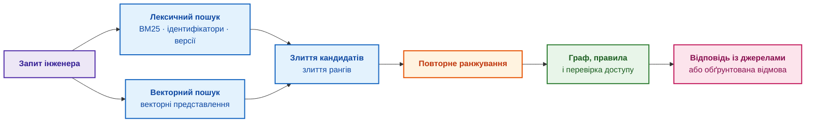

Фіолетовий блок є запитом, сині блоки є пошуком і злиттям кандидатів, помаранчевий блок є повторним ранжуванням, зелений блок є перевіркою, а рожевий блок є відповіддю. Пошук лише пропонує кандидатів на доказ; право відповідати дає зелений блок. Найпростіше злиття є зваженою сумою нормованих оцінок:

```math
S_{\mathrm{hybrid}}(q,d)=\alpha\,\widetilde{S}_{\mathrm{BM25}}(q,d)+(1-\alpha)\,\widetilde{S}_{\mathrm{vec}}(q,d),\qquad 0\le\alpha\le1
```

де:

- $q$ є запитом, $d$ є документом, а $S_{\mathrm{hybrid}}(q,d)$ є їхньою сумарною оцінкою;
- У формулі $q$ є запитом, $d$ є документом, а $`S_{\mathrm{hybrid}}(q,d)`$ є їхньою сумарною оцінкою;
- $`\widetilde{S}_{\mathrm{BM25}}`$ і $`\widetilde{S}_{\mathrm{vec}}`$ є оцінками лексичного й векторного пошуку, попередньо приведеними до спільного масштабу;
- $\alpha\in[0,1]$ є вагою лексичного сигналу, а $1-\alpha$ є вагою векторного сигналу;
- $+$ означає зважене додавання, а межі $0\le\alpha\le1$ забезпечують невід'ємні ваги із сумою 1.

Оцінку $\alpha$ підбирають на відкладеному наборі реальних запитів із позначками релевантності, а не вгадують. Самі оцінки пошуку треба привести до сумісного масштабу; коли таке нормування ненадійне, застосовують злиття рангів (*reciprocal rank fusion*, RRF), яке використовує лише позиції документів у списках:

```math
\mathrm{RRF}(d)=\sum_{r\in R}\frac{1}{k+\mathrm{rank}_r(d)}
```

де:

- $d$ є документом, $R$ є множиною ранжувальників, а $r$ позначає один ранжувальник, наприклад BM25;
- $\mathrm{rank}_r(d)$ є позицією документа $d$ у списку ранжувальника $r$, де перше місце має ранг 1;
- $k$ є сталою згладжування, у прикладі авторів методу використано $k=60$ [[38]](#src-38);
- $\sum_{r\in R}$ додає внески всіх списків; кожен внесок обернено пропорційний сумі $k$ і рангу.

Більша сума означає вищу позицію в об'єднаному списку. Приклад з умовними рангами: документ X стоїть першим у BM25 і десятим у векторному пошуку, тому його сума дорівнює $1/61+1/70\approx0{,}0307$; документ Y стоїть третім в обох списках і має $2/63\approx0{,}0317$. Узгоджено високо оцінений документ Y випереджає X.

### Мовна модель і генерація з пошуком

Велика мовна модель (*large language model*, LLM) навчається передбачати наступний токен. Для послідовності токенів $x_1,\dots,x_n$ мовна модель задає ймовірність усієї послідовності як добуток умовних ймовірностей:

```math
P(x_1,\dots,x_n)=\prod_{t=1}^{n}P(x_t\mid x_1,\dots,x_{t-1})
```

- У формулі $x_1,\dots,x_n$ є послідовністю токенів, $n$ є її довжиною, а $x_t$ є токеном на позиції $t$;
- $t$ перебирає позиції від 1 до $n$, а $\prod$ означає перемножити умовні ймовірності всіх токенів;
- $P(x_t\mid x_1,\dots,x_{t-1})$ є ймовірністю токена за попередніх токенів; для першого токена попередній контекст порожній;
- кожен множник і ймовірність усієї послідовності лежать у межах від 0 до 1.

Модель оцінює ймовірність послідовності як добуток шансів вибрати кожен наступний токен за вже побаченого контексту. Це оцінка мовної моделі для тексту, а не оцінка його фактичної правдивості. На кожному кроці модель обчислює оцінки токенів словника $v\in\mathcal{V}$, а softmax перетворює їх на ймовірності:

```math
P(x_{t+1}=v\mid x_{\le t})=\frac{\exp(a_v)}{\sum_{u\in\mathcal{V}}\exp(a_u)}
```

- У формулі $\mathcal{V}$ є словником можливих токенів, а $v$ є одним токеном із цього словника;
- $a_v$ є сирою оцінкою токена $v$, $\exp(a_v)$ є її експонентою;
- $x_{\le t}$ позначає токени контексту до позиції $t$, а знаменник додає експоненти оцінок усіх токенів словника;
- результат є ймовірністю від 0 до 1, а сума ймовірностей для всіх $v\in\mathcal{V}$ дорівнює 1.

Softmax перетворює оцінки на розподіл імовірностей наступного токена. Ця ймовірність показує перевагу моделі серед продовжень, а не правдивість речення: у формулі немає вимоги спиратися на чинні артефакти. Як обмежувати вибір токенів граматикою, пояснює [Глава 13](ch13-language-variability-vs-determinism.md); без зовнішнього пошуку мовна модель не є базою знань.

Центральною операцією архітектури Transformer, яку запропонували Ашиш Васвані та співавтори, є механізм уваги (*attention*) [[39]](#src-39):

```math
\mathrm{Attention}(Q,K,V)=\mathrm{softmax}\Big(\frac{QK^{\mathsf T}}{\sqrt{d_k}}\Big)V
```

де:

- $Q$ є матрицею запитів, $K$ є матрицею ключів, а $V$ є матрицею значень, які передаються далі;
- $K^{\mathsf T}$ є транспонованою матрицею $K$, а $d_k$ є довжиною вектора ключа;
- $QK^{\mathsf T}$ обчислює оцінки відповідності запитів ключам, $\sqrt{d_k}$ масштабує їх, а $\mathrm{softmax}$ перетворює оцінки на ваги;
- множення на $V$ формує зважені комбінації рядків матриці значень; ваги кожного рядка лежать від 0 до 1 і сумуються до 1.

Ділення на $\sqrt{d_k}$ стримує надмірне зростання оцінок. Кожен рядок результату є зваженою комбінацією рядків $V$, тому механізм уваги може пов'язати віддалені фрагменти коду чи вимоги. Ваги уваги не є поясненням, посиланням на джерело чи доказом причинності.

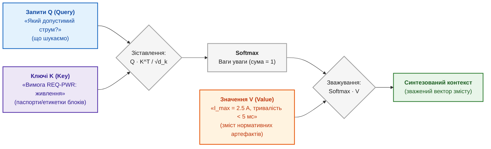

Генерація з пошуком (*retrieval-augmented generation*, RAG) поєднує пошук і генерацію; Патрік Льюїс і співавтори записали модель так [[40]](#src-40):

```math
P(y\mid x)\approx\sum_{d\in D_k}p(d\mid x)\,P(y\mid x,d)
```

- Тут $x$ є запитом, $y$ є відповіддю, а $D_k$ є набором із $k$ знайдених фрагментів;
- $p(d\mid x)$ є вагою фрагмента $d$ за запитом $x$, а ваги фрагментів утворюють розподіл пошуку;
- $P(y\mid x,d)$ є ймовірністю відповіді $y$ за запиту $x$ і фрагмента $d$;
- $\sum_{d\in D_k}$ підсумовує внески знайдених фрагментів, а $\approx$ означає наближене, а не точне представлення.

Формула наближено усереднює ймовірність відповіді за фрагментами, зважуючи кожен результатом пошуку. Пошук дає матеріал для відповіді, але не гарантує, що фрагмент чинний або прочитаний правильно. Потрібні перевірка версії й доступу, точне цитування та відмова за браку достатніх джерел. Шлях від запиту до доказу розглядає [Глава 19](ch19-from-question-to-evidence.md).

Пошук і мовна модель дають експертній системі кандидатів на доказ і зрозумілу людині мову відповіді. Жодна з формул розділу не гарантує істинності: оцінки пошуку впорядковують кандидатів, а ймовірності мовної моделі впорядковують продовження тексту. Для кіберфізичних систем потрібна ще одна перевірка: чи можна довіряти самому вимірюванню датчика.

## Перевірка вимірювань: відстань Махаланобіса

Дрон летить без супутникової навігації й визначає зміщення за оптичним потоком камери. Дим, спалах чи сонячний відблиск створюють хибні вектори зміщення. Якщо навігаційний фільтр прийме хибне вимірювання, дрон втратить орієнтацію. Потрібна міра, яка скаже, наскільки вимірювання незвичне з урахуванням очікуваного шуму датчика й похибки прогнозу.

Звичайна евклідова відстань вважає всі напрямки однаково шумними. У реальних датчиках шум у різних напрямках різний і часто корельований. Відстань Прасанти Чандри Махаланобіса [[41]](#src-41) нормує відхилення на коваріацію:

```math
\tilde{y}=z-\hat{z},\qquad S=H\,P^{-}H^{\mathsf T}+R,\qquad d_M=\sqrt{\tilde{y}^{\mathsf T}S^{-1}\tilde{y}}
```

де:

- $z$ є вектором фактичного вимірювання з $m$ компонентів, а $\hat{z}$ є вектором прогнозу в просторі вимірювань;
- $\tilde{y}=z-\hat{z}$ є інновацією, тобто різницею між виміряним і прогнозованим значеннями;
- $P^{-}$ є коваріаційною матрицею похибки прогнозу стану, $H$ переводить стан у простір вимірювань, а $R$ є коваріацією шуму датчика;
- $S=HP^{-}H^{\mathsf T}+R$ є коваріацією інновації; $\mathsf T$ означає транспонування, а верхній індекс $-1$ у $S^{-1}$ означає обернену матрицю;
- $d_M$ є відстанню Махаланобіса, невід'ємним безрозмірним числом, а $d_M^2$ за узгодженої моделі має розподіл хі-квадрат із $m$ ступенями вільності [[42]](#src-42), [[43]](#src-43).

Відстань нормує відхилення на очікувану коваріацію, тому враховує різний шум і кореляцію напрямків. Поріг відсіювання вимірювань беруть із розподілу хі-квадрат лише за припущення, що фільтр узгоджений із реальністю. Наприклад, за $S=\mathrm{diag}(4,1)$ інновація $(4,0)$ дає $d_M=2$, а $(0,3{,}5)$ дає $d_M=3{,}5$; для 99 % і двох ступенів вільності поріг $d_M^2\le9{,}21$ приймає першу й відкидає другу. Коваріації $P^{-}$ і $S$ обчислює фільтр Калмана [[42]](#src-42); метод порогового відсіювання описують Яаков Бар-Шалом і співавтори [[43]](#src-43).

Приклад. Нехай вимірювання двовимірне, шум уздовж горизонтальної осі має стандартне відхилення 2 пікселі, уздовж вертикальної 1 піксель, кореляції немає, тобто $S=\mathrm{diag}(4,1)$. Для рівня 99 % і двох ступенів вільності поріг становить $d_M^2\le9{,}21$, тобто $d_M\le3{,}03$.

| Інновація, пікселі | Евклідова відстань | $d_M$ | Рішення |
|---|---:|---:|---|
| $(4;\ 0)$ | 4,0 | 2,0 | прийняти: відхилення вздовж шумної осі |
| $(0;\ 3{,}5)$ | 3,5 | 3,5 | відкинути: відхилення вздовж точної осі |

Евклідова відстань вважає першу інновацію більшою аномалією, хоча відхилення на 4 пікселі вздовж осі з шумом 2 пікселі звичайне. Відстань Махаланобіса правильно відкидає другу інновацію: 3,5 пікселя вздовж осі з шумом 1 піксель є рідкісною подією. Якщо $d_M$ не перевищує порогу, фільтр оновлює оцінку положення. Якщо перевищує, вимірювання ізолюють, і дрон продовжує політ за інерційними даними. Якщо кілька вимірювань поспіль відкинуто, навігація перемикається в режим зниженої довіри до камери, а подію записують у журнал. Автономну навігацію без супутникових сигналів та апаратні стенди на базі Jetson Orin і Xilinx Virtex розглядає [Додаток В](appendix-c-autonomous-navigation-and-geosearch.md), реалізацію аналогового шлюзу Махаланобіса на відкритих PDK — [Додаток Г](appendix-d-analog-expert-systems-and-neuromorphic-computing.md), а розподіл обчислень між бортом і серверною частиною — [Глава 22](ch22-cybernetics-edge-to-backend.md).

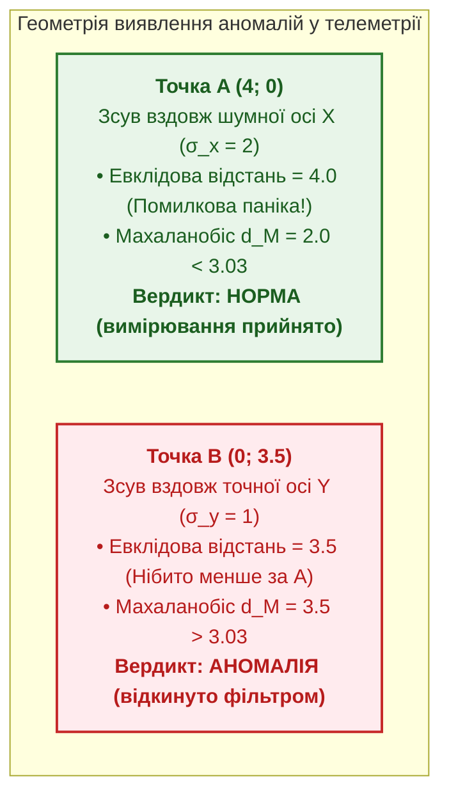

Межа методу: відстань Махаланобіса ловить вимірювання, незвичне щодо прогнозу, але не ловить повільного дрейфу, за якого прогноз і вимірювання псуються разом. Для таких випадків потрібні незалежні джерела й перевірка узгодженості фільтра на тривалому відрізку часу.

## Синергетика: редукція розмірності через параметри порядку та принцип підпорядкування Хакена

Коли експертна система взаємодіє з реальним кіберфізичним комплексом, вона стикається з комбінаторним вибухом у просторі спостережень: десятки сенсорів телеметрії, сотні параметрів вібрації, температур і струмів генерують гігантський фазовий простір станів. Якщо намагатися будувати логічні правила над кожною мікрозмінною окремо, база знань стає непідтримуваною та вкрай крихкою. Виникає фундаментальне завдання: як математично обґрунтовано редукувати високовимірний динамічний хаос до компактного набору дискретних понять?

Відповідь дає **синергетика Германа Хакена** (*Hermann Haken*) — фундаментальна теорія самоорганізації у відкритих нерівноважних системах [[43a]](#src-43a). Центральним відкриттям синергетики є **принцип підпорядкування (Slaving Principle)**: поблизу критичних точок нестійкості поведінка складної системи з нескінченною кількістю ступенів свободи повністю визначається лише кількома макроскопічними змінними — **параметрами порядку (Order Parameters)** $\xi$, тоді як тисячі швидкозгасаючих стійких мод $y_j$ виявляються жорстко підпорядкованими цим повільним макропараметрам:

```math
y_j(t) \approx h_j(\xi(t)), \qquad \dot{\xi} = \lambda \xi - \beta \xi^3 + F(t)
```

де:
- $\xi$ є параметром порядку системи (довгоживуча колективна макромода низької розмірності);
- $y_j$ є швидкорелаксуючими мікроскопічними змінними (високочастотні покази окремих сенсорів);
- $h_j$ є нелінійною функцією зв'язку, що виражає підпорядкування мікростанів параметру порядку;
- $\lambda$ є керуючим параметром (відстань системи до критичного порогу нестійкості чи фазового переходу);
- $\beta > 0$ є коефіцієнтом нелінійного насичення, що стабілізує систему в новому стані;
- $F(t)$ є стохастичною силою (флуктуаціями та шумом вимірювань).

Для доказової експертної системи принцип підпорядкування Хакена виконує дві визначальні інженерні функції:

1. **Онтологічна редукція простору знань:**  
   Експертна система не відстежує кожен піксель камери чи окремий мілівольт вібрації. Вона оперує *семантичними параметрами порядку* (наприклад, $\xi_1 = \text{«кавітаційний дисбаланс ротора»}$, $\xi_2 = \text{«втрата навігаційної цілісності»}$, $\xi_3 = \text{«деградація теплового тракту»}$). Знання про те, що мікрозмінні підпорядковані $\xi$, дозволяє базі знань перевіряти інваріанти над компактним графом понять замість комбінаторного перебору сирих сенсорів.
2. **Передбачення біфуркацій через критичне уповільнення (*Critical Slowing Down*):**  
   Коли керована система наближається до точки біфуркації (наприклад, зриву потоку крила БПЛА чи температурного пробою силового ключа), керуючий параметр $\lambda \to 0$. При цьому час релаксації системи після мікрозбурень прямує до нескінченності: $\tau = 1/|\lambda| \to \infty$.  
   Математичним наслідком цього є різке зростання дисперсії шуму та коефіцієнта автокореляції першого порядку $\rho_1 \to 1$ у часовому ряді вимірювань. Експертна система фіксує це зростання як **передбіфуркаційний дефітер**, сповіщаючи про назрівання аварії задовго до того, як фізична величина перетне аварійний червоний поріг.

## Причинність: кореляція не є причиною

Останнє запитання зі вступу найпідступніше: чи є зв'язок причинним? Команда запровадила обов'язковий перегляд коду (*code review*) для частини задач. За квартал частка задач із дефектами серед переглянутих виявилася 26 %, а серед непереглянутих 20 %. Висновок «перегляд коду шкодить» хибний. Перегляд призначали переважно складним задачам: серед переглянутих задач складних було 80 %, серед непереглянутих лише 20 %, а складні задачі частіше мають дефекти незалежно від перегляду.

| Складність задачі $Z$ | Частка всіх задач | Дефекти з переглядом | Дефекти без перегляду |
|---|---:|---:|---:|
| проста | 0,5 | 10 % | 15 % |
| складна | 0,5 | 30 % | 40 % |

У кожній групі перегляд зменшує частку дефектів, а в загальній статистиці нібито збільшує: $`0{,}2\cdot10\,\%+0{,}8\cdot30\,\%=26\,\%`$ проти $`0{,}8\cdot15\,\%+0{,}2\cdot40\,\%=20\,\%`$. Такий розворот називають парадоксом Сімпсона на честь Едварда Сімпсона [[44]](#src-44). Складність задачі тут є спільною причиною (*confounder*): складність впливає і на те, чи призначать перегляд, і на ймовірність дефекту.

### Драбина причинності

Джудея Перл описав три рівні причинного міркування й назвав опис драбиною причинності [[45]](#src-45). Схема показує рівні знизу вгору.

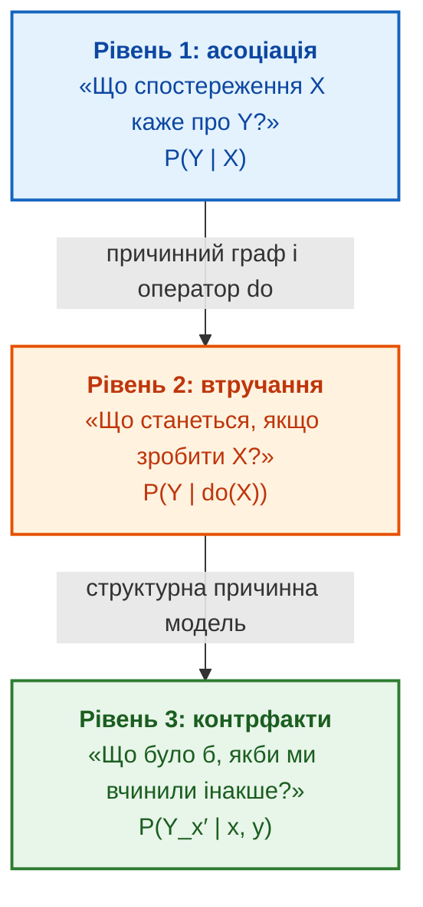

Синій рівень є спостереженням: умовна ймовірність $P(Y\mid X)$ описує, як часто $Y$ трапляється разом з $X$. На думку Перла, моделі машинного навчання, що шукають закономірності в даних, зокрема мовні моделі, працюють переважно на цьому рівні [[45]](#src-45). Помаранчевий рівень є втручанням: що станеться, якщо примусово встановити $X$. Зелений рівень є контрфактом: що сталося б у конкретному минулому випадку за іншої дії. Кожен наступний рівень потребує додаткових знань про причинну структуру, яких немає в самих даних.

### Втручання й коригування за обхідними шляхами

Оператор $do(X=x)$ означає примусове встановлення $X$ у значення $x$, яке розриває всі звичні причини $X$: спостерігати, що перегляд призначили, не те саме, що призначити перегляд кожній задачі. Якщо змінні $Z$ перекривають усі обхідні шляхи (*backdoor paths*), тобто шляхи від $X$ до $Y$, що починаються стрілкою в $X$, і жодна змінна з $Z$ не є наслідком $X$, ефект втручання обчислюють за формулою коригування, яку розглядає Перл [[46]](#src-46):

```math
P\big(Y\mid do(X=x)\big)=\sum_{z}P\big(Y\mid X=x,\,Z=z\big)\,P(Z=z)
```

- У формулі $Y$ є наслідком, наприклад дефектом, $X$ є дією, наприклад переглядом коду, а $x$ задає значення дії;
- $Z$ є набором спільних причин, наприклад складністю задачі, а $z$ перебирає їхні можливі значення;
- $do(X=x)$ означає примусово встановити дію $X$ у значення $x$, а не просто спостерігати її;
- $P(Y\mid X=x,Z=z)$ є ймовірністю наслідку в групі $z$ за дії $x$, а $P(Z=z)$ є часткою групи серед усіх задач;
- $\sum_z$ додає внески всіх груп, результат є ймовірністю від 0 до 1.

Приклад з умовними частками: за однакової частки простих і складних задач перегляд дає $`0{,}5\cdot10\%+0{,}5\cdot30\%=20\%`$ дефектів, а відсутність перегляду дає $`0{,}5\cdot15\%+0{,}5\cdot40\%=27{,}5\%`$. Отже, перегляд зменшує частку дефектів на 7,5 відсоткового пункта. Коригування правильне лише за коректного причинного графа й повного набору спільних причин; неврахована спільна причина спотворить результат.

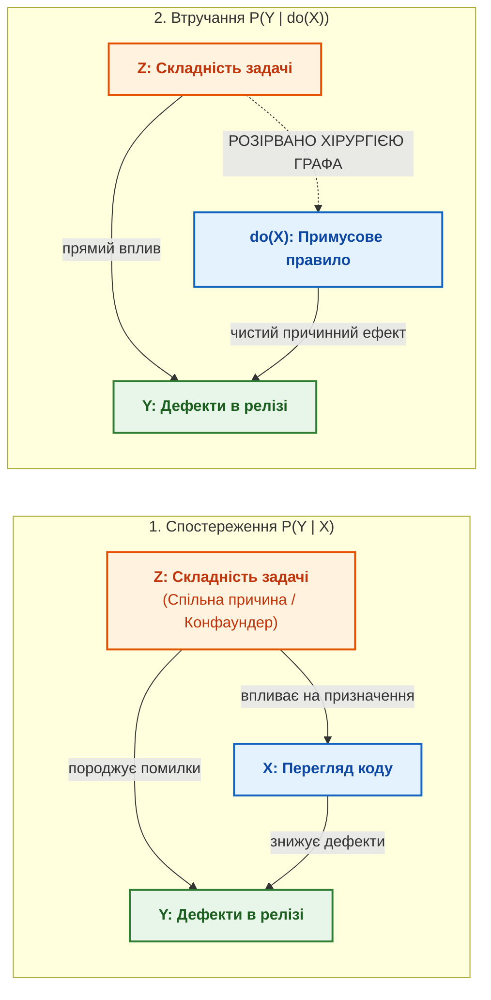

### Структурна причинна модель і контрфакти

Для контрфактичних запитань потрібна структурна причинна модель (*structural causal model*, SCM), у якій кожна змінна задана функцією від своїх прямих причин і неспостережуваного шуму [[46]](#src-46):

```math
X_i=f_i\big(\mathrm{Pa}_i,U_i\big),\qquad i=1,\dots,n
```

- Тут $X_i$ є змінною моделі з індексом $i$, а $i=1,\dots,n$ перебирає всі $n$ змінних;
- $\mathrm{Pa}_i$ є множиною безпосередніх причин змінної $X_i$;
- $U_i$ є зовнішнім неспостережуваним чинником, а $f_i$ є функцією механізму, що задає значення $X_i$;
- дужки показують, що $X_i$ обчислюють за його прямими причинами та зовнішнім чинником.

Модель задає механізм кожної змінної через її прямі причини й зовнішній чинник. Контрфактичне запитання може звучати так: чи вийшов би з ладу агрегат, якби захист спрацював на 20 мілісекунд раніше за тієї самої температури, навантаження й тиску? Для відповіді модель оцінює неспостережуваний чинник за фактичним випадком, змінює механізм захисту й перераховує наслідок. Надійність відповіді залежить від правильності функцій $f_i$; такий аналіз не замінює можливого експерименту.

Для експертної системи з драбини випливає дисципліна рівнів доказовості. Кореляція між оновленням прошивки й відмовою датчика є приводом для гіпотези (рівень 1). Керований діагностичний тест є втручанням і дає ефект дії (рівень 2). Висновок про те, що саме конкретна апаратна ревізія спричинила відмову, потребує структурної моделі й має посилатися на припущення моделі (рівень 3). Експертна система має позначати, на якому рівні отримано висновок.

## Пояснюваність і калібрування

Рекомендацію, яка проходить інженерний перегляд, треба пояснити. Для правил пояснення природне: спрацьовані правила й факти. Для моделей машинного навчання потрібні окремі методи. Метод SHAP (*SHapley Additive exPlanations*) Скотта Лундберга й Су-Ін Лі розкладає передбачення на внески ознак на основі значень Шеплі з теорії ігор [[47]](#src-47). Метод LIME (*Local Interpretable Model-agnostic Explanations*) Марко Рібейру, Самира Сінгха й Карлоса Гестріна пояснює окреме передбачення простою локальною моделлю [[48]](#src-48). Обидва методи показують внесок ознак у конкретне передбачення, але не роблять модель істинною, не встановлюють причинності й не замінюють першоджерел. Пояснення варто перевіряти на стабільність: якщо близькі входи дають зовсім різні пояснення, поясненню не можна довіряти.

Контрфактичне пояснення (*counterfactual explanation*), яке запропонували Сандра Вахтер, Брент Міттельштадт і Кріс Рассел, відповідає на запитання, що треба змінити, щоб рішення стало іншим [[49]](#src-49). Наприклад: «випуск став би можливим, якби дефекти D-17 і D-22 було закрито, а для вимоги R-41 додано доказ перевірки». Таке пояснення перетворюється на план дій. Контрфактичне пояснення моделі не слід плутати з контрфактом структурної причинної моделі з попереднього розділу: пояснення описує поведінку моделі, а не причини у світі.

Калібрування (*calibration*) відповідає на інше запитання: чи збігається заявлена впевненість із фактичною точністю. Якщо синоптик сто разів сказав «ймовірність дощу 70 %», у добре каліброваній системі прогнозування дощ піде приблизно в 70 випадках. Чуань Го й співавтори показали, що сучасні нейронні мережі часто надто впевнені, і запропонували прості методи перекалібрування [[50]](#src-50). Числовий приклад перевірки калібрування наведено в [Главі 3](ch03-beyond-reference-information-systems.md), а формулу очікуваної похибки калібрування й діаграми надійності розглядає [Глава 25](ch25-how-expert-systems-learn.md). Пояснення й каліброване число мають потрапляти не лише в інтерфейс, а й у журнал перегляду, щоб експерт міг прийняти, відхилити або уточнити рекомендацію.

## Два уроки математичного шару

### Урок 1. Оцінка без порогу не є доказом

У багатьох інформаційних системах з'являються гарні числа: ризик 0,72, впевненість 0,85, схожість 0,91. Саме по собі число 0,72 нічого не вирішує, і числа з однаковим виглядом можуть означати різне: ймовірність, ступінь належності, оцінку ранжування або частку покриття. Це як термометр, що показує число, але ніхто не визначив, з якої температури пацієнт вважається хворим. Поки не визначено тип величини, хто затвердив поріг, для якої предметної області поріг чинний і що робити нижче порогу, число є декорацією, а не доказом. Кожна метрика експертної системи має власника, поріг, умови чинності й тестові приклади.

### Урок 2. Модель без сценарію відмови говорить зайве

Найнебезпечнішою є експертна система, яка завжди знаходить відповідь, як співробітник, що ніколи не каже «не знаю» й рано чи пізно впевнено радить хибне. Джерел може бракувати, джерела можуть суперечити одне одному, базова версія може не збігатися, користувач може не мати доступу до потрібних даних. Математика відмови важить стільки ж, скільки математика відповіді: логіка Кліні дає значення «невідомо», маса конфлікту $K$ дає «джерела суперечать», поріг відстані Махаланобіса дає «вимірювання недостовірне». Експертна система має формально розрізняти відповіді «бракує доказів», «джерела суперечать», «доступ заборонено», «поза межами задачі» й «потрібен перегляд експертом». Як рушій пояснень формулює обґрунтовану відмову, розповідає [Глава 20](ch20-explanation-engine.md).

## Висновки
Глава почалася із запитання, чи можна випускати версію 2.4. Тепер відповідь складається з кількох перевірних частин. Datalog виводить блокування випуску, бо вимога R-17 критична, змінена й не має тесту, що пройшов. Байєсівська мережа оцінює ймовірність дефекту коду після падіння тесту в 0,645, але якщо журнал стенда підтвердить збій, оцінка впаде до 0,236. Маса конфлікту показує, чи можна поєднувати два суперечливі документи. Прецедент зі схожістю 0,78 підказує, з чого почати, а граф простежуваності перелічує зачеплені артефакти. Глава показала:

- логіка й Datalog дають відтворюваний висновок і гарантоване завершення виведення, логіка Кліні відрізняє відсутність даних від хиби, а деонтична логіка виявляє суперечливі вимоги;
- дедуктивний висновок можна подавати як результат, а індуктивний і абдуктивний лише як гіпотезу з планом перевірки;
- ймовірність, ступінь належності й маса довіри вимірюють різні величини; байєсівська мережа зважує альтернативні причини, а правило Демпстера за великого конфлікту дає абсурдний результат, тому конфлікт перевіряють окремо;
- схожість прецедентів, оцінки пошуку й оцінки альтернатив є впорядкуванням, а не ймовірністю, і зміна методу агрегування може змінити порядок;
- відстань Махаланобіса відкидає вимірювання з урахуванням шуму датчика, а причинний аналіз відрізняє ефект дії від кореляції, як у прикладі з переглядом коду.

Межі глави теж треба назвати. Глава дає карту й робочі формули, а не повний курс кожної дисципліни: для реальної експертної системи кожну модель калібрують на даних предметної області, а числа в прикладах навчальні. Математика робить висновки експертної системи перевірними, але не усуває потреби в людині, яка затверджує пороги, правила й причинні припущення. Як обрані математичні моделі визначають тип бази знань, пояснює [Глава 7](ch07-knowledge-base-typology.md), а як інженерні артефакти стають даними для цих моделей, розповідають [Глава 8](ch08-engineering-artifacts-as-data.md) і [Глава 9](ch09-engineering-knowledge-graph-traceability.md).

## Запитання до читачів
1. Що у ваших інформаційних системах стається з висновком «випуск готовий», коли відкликали одну з підстав висновку: висновок перераховується автоматично чи лишається в базі застарілим фактом?
2. Коли одночасно готові спрацювати кілька правил, чи зафіксовано у вашому рушії правил порядок спрацювання, і чи зможете ви пояснити, чому одне правило виконалося раніше за інше?
3. Де у ваших оцінках ризику записано початкову ймовірність, надійність джерела й поріг дії, а де підсумкове число з'являється без паспорта?
4. Який із ваших нещодавніх висновків «процес покращив метрику» спирався лише на спостереження, а який на втручання з урахуванням спільних причин?
5. Чи вміє ваша експертна система відрізнити «бракує доказів» від «джерела суперечать одне одному», і чи має експертна система формальне право сказати «не знаю»?

## Словник
| Український термін | Англійський відповідник | Коротке пояснення |
|---|---|---|
| Продукційне правило | *production rule* | Запис «якщо виконано умови, то зробити висновок або дію» |
| Пряме виведення | *forward chaining* | Виведення від фактів до висновків |
| Зворотне виведення | *backward chaining* | Виведення від запитання до фактів, які потрібні для відповіді |
| Логіка предикатів першого порядку | *first-order logic* | Логіка тверджень про об'єкти й відношення з кванторами «для кожного» та «існує» |
| Інваріант | *invariant* | Умова, яка має виконуватися завжди |
| Загальнозначуща формула | *valid formula* | Формула, істинна за будь-якого тлумачення символів |
| Datalog | *Datalog* | Мова правил без функціональних символів із гарантованим завершенням виведення |
| Оператор безпосередніх наслідків | *immediate consequence operator* | Один крок прямого виведення: додає голови правил, чиї тіла вже виконано |
| Найменша нерухома точка | *least fixed point* | Найменша множина фактів, яку правила вже не можуть розширити |
| Стратифіковане заперечення | *stratified negation* | Заперечення лише фактів, повністю обчислених на нижчому рівні правил |
| Страта | *stratum* | Рівень правил, який обчислюють після всіх нижчих рівнів |
| Припущення замкненого світу | *closed-world assumption* | Усе, що не виведено з бази, вважають хибним |
| Припущення відкритого світу | *open-world assumption* | Відсутність факту в базі не означає, що факт хибний |
| Тризначна логіка Кліні | *Kleene's strong three-valued logic* | Логіка зі значеннями «істина», «невідомо» й «хиба» |
| Деонтична логіка | *deontic logic* | Логіка обов'язку, заборони й дозволу |
| Нормативна колізія | *normative conflict* | Одночасна вимога й заборона тієї самої дії в одній області застосування |
| Дедукція | *deduction* | Виведення результату з правила й випадку |
| Індукція | *induction* | Виведення гіпотези правила з випадків і результатів |
| Абдукція | *abduction* | Виведення гіпотези про випадок або причину з правила й результату |
| Відокремлення | *modus ponens* | Правило логіки: з «якщо $P$, то $Q$» і $P$ випливає $Q$ |
| Зведення задачі | *problem reduction* | Заміна складної задачі простішою зі збереженням суттєвих властивостей |
| Дерево І/АБО | *AND/OR tree* | Розклад цілі на підцілі, які мають виконатися всі або з яких досить однієї |
| Скінченний автомат | *finite automaton* | Модель зі скінченною кількістю станів і переходів за вхідними символами |
| Рушій правил | *rule engine* | Програма, що виконує правила, записані окремо від коду програми |
| Робоча пам'ять | *working memory* | Поточні факти, з якими працює рушій правил |
| Черга правил | *agenda* | Правила, умови яких виконано і які готові спрацювати |
| Розв'язання конфліктів | *conflict resolution* | Вибір, яке з готових правил виконати першим |
| Вага спрацьовування | *salience* | Пріоритет правила в черзі правил |
| Система підтримання істинності | *truth maintenance system* | Механізм, що пам'ятає залежності висновків від підстав і відкликає висновки без підстави |
| Обґрунтування | *justification* | Запис про те, з яких тверджень випливає твердження |
| Середовище припущень | *environment* | Набір припущень, за якого висновок виводиться |
| Умовна ймовірність | *conditional probability* | Ймовірність події за умови, що інша подія сталася |
| Апостеріорна ймовірність | *posterior probability* | Ймовірність гіпотези після нового свідчення |
| Байєсівська мережа | *Bayesian network* | Спрямований ациклічний граф, що розкладає спільний розподіл на локальні таблиці |
| Пояснення через іншу причину | *explaining away* | Зниження ймовірності однієї причини після підтвердження іншої причини того самого наслідку |
| Марковська властивість | *Markov property* | Наступний стан залежить лише від поточного стану |
| Марковський ланцюг | *Markov chain* | Модель переходів між станами з імовірностями, що залежать лише від поточного стану |
| Прихована марковська модель | *hidden Markov model* | Марковський ланцюг, стан якого видно лише через спостереження |
| Марковський процес ухвалення рішень | *Markov decision process* | Модель станів, дій, переходів і винагород для вибору дій |
| Політика | *policy* | Правило вибору дії в кожному стані |
| Коефіцієнт дисконтування | *discount factor* | Множник від 0 до 1, що зменшує вагу майбутніх винагород |
| Нечітка множина | *fuzzy set* | Множина, належність до якої має ступінь від 0 до 1 |
| Функція належності | *membership function* | Функція, що задає ступінь належності значення до нечіткої множини |
| Маса довіри | *basic mass assignment* | Частка впевненості, призначена множині гіпотез у теорії Демпстера–Шафера |
| Маса конфлікту | *conflict mass* | Сума добутків мас для пар множин, що не перетинаються |
| Правило Демпстера | *Dempster's rule of combination* | Поєднання мас двох незалежних джерел із нормуванням на відсутність конфлікту |
| Міркування за прецедентами | *case-based reasoning* | Розв'язання нової задачі за аналогією зі схожими минулими випадками |
| Досяжність | *reachability* | Наявність шляху від однієї вершини графа до іншої |
| Онтологія | *ontology* | Формальний опис типів об'єктів, відношень і обмежень предметної області |
| Графова нейронна мережа | *graph neural network* | Модель, що обчислює подання вершин графа з ознак вершин і сусідів |
| Ієрархія відношень | *relation hierarchy* | Упорядкування відношень, у якому одне відношення є окремим випадком іншого |
| Субсумція | *subsumption* | Відношення «є окремим випадком» між поняттями чи відношеннями |
| Багатокритеріальний вибір | *multi-criteria decision analysis* | Порівняння альтернатив за кількома критеріями одночасно |
| Компенсаторна модель | *compensatory model* | Модель, у якій високий бал за одним критерієм може перекрити низький за іншим |
| Коефіцієнт близькості | *closeness coefficient* | Оцінка TOPSIS від 0 до 1: близькість альтернативи до ідеальної точки |
| Програмування в обмеженнях | *constraint programming* | Пошук рішень, що задовольняють набір дискретних обмежень |
| Автоматичне планування | *automated planning* | Побудова послідовності дій, що переводить систему з початкового стану в цільовий |
| Ієрархічна мережа задач | *hierarchical task network* | Розклад високорівневої задачі на перевірені підзадачі |
| Насичення частоти | *term frequency saturation* | Властивість BM25: повторні входження слова додають дедалі менше |
| Векторне представлення | *embedding* | Числовий вектор, що кодує зміст фрагмента тексту |
| Косинусна подібність | *cosine similarity* | Косинус кута між двома векторами як міра їхньої близькості |
| Контрастне навчання | *contrastive learning* | Навчання, що наближає релевантні пари й віддаляє нерелевантні |
| Температура | *temperature* | Параметр, що керує різкістю розподілу ймовірностей |
| Токен | *token* | Частина слова, знак або фрагмент коду, з якими працює мовна модель |
| Гібридний пошук | *hybrid search* | Поєднання лексичного й векторного пошуку |
| Злиття рангів | *reciprocal rank fusion* | Поєднання списків результатів за позиціями документів |
| Повторне ранжування | *reranking* | Уточнення порядку знайдених фрагментів окремою моделлю |
| Механізм уваги | *attention* | Операція, що зважує частини контексту для обчислення наступного подання |
| Генерація з пошуком | *retrieval-augmented generation* | Відповідь мовної моделі на основі фрагментів, знайдених у зовнішньому індексі |
| Відстань Махаланобіса | *Mahalanobis distance* | Відстань, нормована на коваріацію шуму |
| Інновація | *innovation* | Різниця між фактичним і прогнозованим вимірюванням |
| Коваріаційна матриця | *covariance matrix* | Матриця дисперсій і взаємних коваріацій компонентів вектора |
| Фільтр Калмана | *Kalman filter* | Алгоритм оцінювання стану за прогнозом моделі й зашумленими вимірюваннями |
| Відсіювання вимірювань | *gating* | Відкидання вимірювань, відстань яких перевищує поріг |
| Спільна причина | *confounder* | Змінна, що впливає і на дію, і на наслідок |
| Втручання | *intervention* | Примусове встановлення значення змінної, позначене оператором $do$ |
| Обхідний шлях | *backdoor path* | Шлях від дії до наслідку, що починається стрілкою в дію |
| Парадокс Сімпсона | *Simpson's paradox* | Зміна напрямку залежності після поділу даних на групи |
| Структурна причинна модель | *structural causal model* | Модель, у якій кожна змінна є функцією своїх причин і шуму |
| Контрфакт | *counterfactual* | Твердження про те, що сталося б у конкретному випадку за іншої дії |
| Контрфактичне пояснення | *counterfactual explanation* | Мінімальна зміна входу, за якої рішення моделі стало б іншим |
| Калібрування | *calibration* | Відповідність заявленої впевненості фактичній частці правильних висновків |

## Абревіатури
| Скорочення | Розшифрування | Значення |
|---|---|---|
| AHP | Analytic Hierarchy Process | метод аналізу ієрархій |
| ATMS | Assumption-based Truth Maintenance System | система підтримання істинності на основі припущень |
| BM25 | Best Matching 25 | функція ранжування документів у пошуку |
| CBR | Case-Based Reasoning | міркування за прецедентами |
| CLIPS | C Language Integrated Production System | мова й рушій продукційних правил |
| ELECTRE | Élimination et Choix Traduisant la Réalité | сімейство методів багатокритеріального вибору з відношенням переваги |
| FOL | First-Order Logic | логіка предикатів першого порядку |
| GNN | Graph Neural Network | графова нейронна мережа |
| HMM | Hidden Markov Model | прихована марковська модель |
| HTN | Hierarchical Task Network | ієрархічна мережа задач |
| IETF | Internet Engineering Task Force | Інженерна рада інтернету |
| JTMS | Justification-based Truth Maintenance System | система підтримання істинності на основі обґрунтувань |
| LFP | Least Fixed Point | найменша нерухома точка |
| LIME | Local Interpretable Model-agnostic Explanations | метод локальних пояснень передбачень |
| LLM | Large Language Model | велика мовна модель |
| MDP | Markov Decision Process | марковський процес ухвалення рішень |
| OWL | Web Ontology Language | мова онтологій W3C |
| PDDL | Planning Domain Definition Language | мова опису предметної області планування |
| POMDP | Partially Observable Markov Decision Process | частково спостережуваний марковський процес ухвалення рішень |
| PROMETHEE | Preference Ranking Organization Method for Enrichment of Evaluations | метод багатокритеріального ранжування попарними перевагами |
| RAG | Retrieval-Augmented Generation | генерація з пошуком |
| RFC | Request for Comments | нумеровані нормативні документи IETF |
| RRF | Reciprocal Rank Fusion | злиття рангів |
| SCM | Structural Causal Model | структурна причинна модель |
| SHACL | Shapes Constraint Language | мова обмежень форми для графів RDF |
| SHAP | SHapley Additive exPlanations | метод пояснення внесків ознак на основі значень Шеплі |
| TF-IDF | Term Frequency, Inverse Document Frequency | зважування слова за частотою в документі й рідкістю в корпусі |
| TMS | Truth Maintenance System | система підтримання істинності |
| TOPSIS | Technique for Order of Preference by Similarity to Ideal Solution | метод ранжування за близькістю до ідеальної точки |
| W3C | World Wide Web Consortium | Консорціум Всесвітньої павутини |
| ШІ | штучний інтелект | *artificial intelligence*, AI |

## Джерела
1. <a id="src-1"></a>Alonzo Church. [*A Note on the Entscheidungsproblem*](https://doi.org/10.2307/2269326). *Journal of Symbolic Logic*, 1(1), 40–41, 1936.
2. <a id="src-2"></a>Alan M. Turing. [*On Computable Numbers, with an Application to the Entscheidungsproblem*](https://doi.org/10.1112/plms/s2-42.1.230). *Proceedings of the London Mathematical Society*, s2-42(1), 230–265, 1937 (подано 1936 року).
3. <a id="src-3"></a>Stefano Ceri, Georg Gottlob, Letizia Tanca. [*What You Always Wanted to Know About Datalog (and Never Dared to Ask)*](https://doi.org/10.1109/69.43410). *IEEE Transactions on Knowledge and Data Engineering*, 1(1), 146–166, 1989.
4. <a id="src-4"></a>Maarten H. van Emden, Robert A. Kowalski. [*The Semantics of Predicate Logic as a Programming Language*](https://doi.org/10.1145/321978.321991). *Journal of the ACM*, 23(4), 733–742, 1976.
5. <a id="src-5"></a>Krzysztof R. Apt, Howard A. Blair, Adrian Walker. [*Towards a Theory of Declarative Knowledge*](https://doi.org/10.1016/B978-0-934613-40-8.50006-3). In J. Minker (ред.), *Foundations of Deductive Databases and Logic Programming*, 89–148. Los Altos: Morgan Kaufmann, 1988.
6. <a id="src-6"></a>Raymond Reiter. [*On Closed World Data Bases*](https://doi.org/10.1007/978-1-4684-3384-5_3). In H. Gallaire, J. Minker (ред.), *Logic and Data Bases*, 55–76. New York: Plenum Press, 1978.
7. <a id="src-7"></a>Stephen Cole Kleene. [*Introduction to Metamathematics*](https://openlibrary.org/works/OL5959470W). Amsterdam: North-Holland, 1952. Сильні таблиці тризначної логіки.
8. <a id="src-8"></a>Georg Henrik von Wright. [*Deontic Logic*](https://doi.org/10.1093/mind/LX.237.1). *Mind*, 60(237), 1–15, 1951.
9. <a id="src-9"></a>Scott Bradner. [*RFC 2119: Key Words for Use in RFCs to Indicate Requirement Levels*](https://www.rfc-editor.org/rfc/rfc2119). IETF, 1997.
10. <a id="src-10"></a>Charles S. Peirce. [*Illustrations of the Logic of Science. VI. Deduction, Induction, and Hypothesis*](https://en.wikisource.org/wiki/Popular_Science_Monthly/Volume_13/August_1878/Illustrations_of_the_Logic_of_Science_VI). *Popular Science Monthly*, 13, 470–482, 1878.
11. <a id="src-11"></a>Igor Douven. [*Abduction*](https://plato.stanford.edu/entries/abduction/). *Stanford Encyclopedia of Philosophy*, перша публікація 2011, редакція 2025.
12. <a id="src-12"></a>Nils J. Nilsson. [*Problem-Solving Methods in Artificial Intelligence*](https://openlibrary.org/works/OL1311228W). New York: McGraw-Hill, 1971.
12a. <a id="src-12a"></a>Agnar Aamodt, Enric Plaza. [*Case-Based Reasoning: Foundational Issues, Methodological Variations, and System Approaches*](https://doi.org/10.3233/AIC-1994-7104). *AI Communications*, 7(1), 39–59, 1994.
13. <a id="src-13"></a>John Hopcroft. [*An n log n Algorithm for Minimizing States in a Finite Automaton*](https://doi.org/10.1016/B978-0-12-417750-5.50022-1). In Z. Kohavi, A. Paz (ред.), *Theory of Machines and Computations*, 189–196. New York: Academic Press, 1971.
14. <a id="src-14"></a>Charles L. Forgy. [*Rete: A Fast Algorithm for the Many Pattern/Many Object Pattern Match Problem*](https://doi.org/10.1016/0004-3702(82)90020-0). *Artificial Intelligence*, 19(1), 17–37, 1982.
15. <a id="src-15"></a>Daniel P. Miranker. [*TREAT: A New Match Algorithm*](https://doi.org/10.1016/B978-0-273-08793-9.50010-8). In *TREAT: A New and Efficient Match Algorithm for AI Production Systems*, 25–47. London: Pitman, 1990.
16. <a id="src-16"></a>Jon Doyle. [*A Truth Maintenance System*](https://doi.org/10.1016/0004-3702(79)90008-0). *Artificial Intelligence*, 12(3), 231–272, 1979.
17. <a id="src-17"></a>Johan de Kleer. [*An Assumption-Based TMS*](https://doi.org/10.1016/0004-3702(86)90080-9). *Artificial Intelligence*, 28(2), 127–162, 1986.
18. <a id="src-18"></a>Judea Pearl. [*Probabilistic Reasoning in Intelligent Systems: Networks of Plausible Inference*](https://doi.org/10.1016/C2009-0-27609-4). San Mateo: Morgan Kaufmann, 1988.
19. <a id="src-19"></a>Lawrence R. Rabiner. [*A Tutorial on Hidden Markov Models and Selected Applications in Speech Recognition*](https://doi.org/10.1109/5.18626). *Proceedings of the IEEE*, 77(2), 257–286, 1989.
20. <a id="src-20"></a>Martin L. Puterman. [*Markov Decision Processes: Discrete Stochastic Dynamic Programming*](https://doi.org/10.1002/9780470316887). New York: Wiley, 1994.
21. <a id="src-21"></a>Lotfi A. Zadeh. [*Fuzzy Sets*](https://doi.org/10.1016/S0019-9958(65)90241-X). *Information and Control*, 8(3), 338–353, 1965.
22. <a id="src-22"></a>A. P. Dempster. [*Upper and Lower Probabilities Induced by a Multivalued Mapping*](https://doi.org/10.1214/aoms/1177698950). *The Annals of Mathematical Statistics*, 38(2), 325–339, 1967.
23. <a id="src-23"></a>Glenn Shafer. [*A Mathematical Theory of Evidence*](https://doi.org/10.1515/9780691214696). Princeton University Press, 1976.
24. <a id="src-24"></a>Lotfi A. Zadeh. [*A Simple View of the Dempster-Shafer Theory of Evidence and Its Implication for the Rule of Combination*](https://ojs.aaai.org/aimagazine/index.php/aimagazine/article/view/542). *AI Magazine*, 7(2), 85–90, 1986.
25. <a id="src-25"></a>Agnar Aamodt, Enric Plaza. [*Case-Based Reasoning: Foundational Issues, Methodological Variations, and System Approaches*](https://doi.org/10.3233/AIC-1994-7104). *AI Communications*, 7(1), 39–59, 1994.
26. <a id="src-26"></a>Holger Knublauch, Dimitris Kontokostas (ред.). [*Shapes Constraint Language (SHACL)*](https://www.w3.org/TR/shacl/). W3C Recommendation, 2017.
27. <a id="src-27"></a>Thomas N. Kipf, Max Welling. [*Semi-Supervised Classification with Graph Convolutional Networks*](https://arxiv.org/abs/1609.02907). *International Conference on Learning Representations* (ICLR), 2017.
28. <a id="src-28"></a>Dan Brickley, R. V. Guha (ред.). [*RDF Schema 1.1*](https://www.w3.org/TR/rdf-schema/). W3C Recommendation, 2014.
29. <a id="src-29"></a>Thomas L. Saaty. [*How to Make a Decision: The Analytic Hierarchy Process*](https://doi.org/10.1016/0377-2217(90)90057-I). *European Journal of Operational Research*, 48(1), 9–26, 1990.
30. <a id="src-30"></a>Ching-Lai Hwang, Kwangsun Yoon. [*Multiple Attribute Decision Making: Methods and Applications*](https://doi.org/10.1007/978-3-642-48318-9). Berlin: Springer, 1981.
31. <a id="src-31"></a>Jean-Pierre Brans, Philippe Vincke. [*A Preference Ranking Organisation Method (The PROMETHEE Method for Multiple Criteria Decision-Making)*](https://doi.org/10.1287/mnsc.31.6.647). *Management Science*, 31(6), 647–656, 1985.
32. <a id="src-32"></a>Bernard Roy. [*Classement et choix en présence de points de vue multiples (la méthode ELECTRE)*](https://doi.org/10.1051/ro/196802v100571). *Revue française d'informatique et de recherche opérationnelle*, 2(8), 57–75, 1968.
33. <a id="src-33"></a>Malik Ghallab, Dana Nau, Paolo Traverso. [*Automated Planning: Theory and Practice*](https://doi.org/10.1016/B978-1-55860-856-6.X5000-5). San Francisco: Morgan Kaufmann, 2004.
34. <a id="src-34"></a>Gerard Salton, Christopher Buckley. [*Term-Weighting Approaches in Automatic Text Retrieval*](https://doi.org/10.1016/0306-4573(88)90021-0). *Information Processing & Management*, 24(5), 513–523, 1988.
35. <a id="src-35"></a>Stephen Robertson, Hugo Zaragoza. [*The Probabilistic Relevance Framework: BM25 and Beyond*](https://doi.org/10.1561/1500000019). *Foundations and Trends in Information Retrieval*, 2009.
36. <a id="src-36"></a>Nils Reimers, Iryna Gurevych. [*Sentence-BERT: Sentence Embeddings using Siamese BERT-Networks*](https://aclanthology.org/D19-1410/). *Proceedings of EMNLP-IJCNLP 2019*, 2019.
37. <a id="src-37"></a>Vladimir Karpukhin, Barlas Oğuz, Sewon Min та ін. [*Dense Passage Retrieval for Open-Domain Question Answering*](https://doi.org/10.18653/v1/2020.emnlp-main.550). *Proceedings of EMNLP 2020*, 6769–6781, 2020.
38. <a id="src-38"></a>Gordon V. Cormack, Charles L. A. Clarke, Stefan Büttcher. [*Reciprocal Rank Fusion Outperforms Condorcet and Individual Rank Learning Methods*](https://doi.org/10.1145/1571941.1572114). *Proceedings of SIGIR 2009*, 758–759, 2009.
39. <a id="src-39"></a>Ashish Vaswani та ін. [*Attention Is All You Need*](https://arxiv.org/abs/1706.03762). *Advances in Neural Information Processing Systems 30* (NeurIPS), 2017.
40. <a id="src-40"></a>Patrick Lewis, Ethan Perez, Aleksandra Piktus та ін. [*Retrieval-Augmented Generation for Knowledge-Intensive NLP Tasks*](https://arxiv.org/abs/2005.11401). *Advances in Neural Information Processing Systems 33* (NeurIPS), 2020.
41. <a id="src-41"></a>Prasanta Chandra Mahalanobis. [*On the Generalised Distance in Statistics*](https://doi.org/10.1007/s13171-019-00164-5). *Proceedings of the National Institute of Sciences of India*, 2(1), 49–55, 1936; перевидання: *Sankhyā A*, 80, 1–7, 2018.
42. <a id="src-42"></a>Rudolf E. Kalman. [*A New Approach to Linear Filtering and Prediction Problems*](https://doi.org/10.1115/1.3662552). *Journal of Basic Engineering*, 82(1), 35–45, 1960.
43. <a id="src-43"></a>Yaakov Bar-Shalom, X. Rong Li, Thiagalingam Kirubarajan. [*Estimation with Applications to Tracking and Navigation*](https://doi.org/10.1002/0471221279). New York: Wiley, 2001.
43a. <a id="src-43a"></a>Hermann Haken. [*Synergetics: An Introduction. Nonequilibrium Phase Transitions and Self-Organization in Physics, Chemistry, and Biology*](https://doi.org/10.1007/978-3-642-88338-5). Berlin: Springer, 1977; *Advanced Synergetics: Instability Hierarchies of Self-Organizing Systems and Devices*, Springer, 1983.
44. <a id="src-44"></a>Edward H. Simpson. [*The Interpretation of Interaction in Contingency Tables*](https://doi.org/10.1111/j.2517-6161.1951.tb00088.x). *Journal of the Royal Statistical Society, Series B*, 13(2), 238–241, 1951.
45. <a id="src-45"></a>Judea Pearl, Dana Mackenzie. [*The Book of Why: The New Science of Cause and Effect*](https://openlibrary.org/works/OL17872278W). New York: Basic Books, 2018.
46. <a id="src-46"></a>Judea Pearl. [*Causality: Models, Reasoning, and Inference*](https://bayes.cs.ucla.edu/BOOK-2K/). 2-ге видання. Cambridge University Press, 2009.
47. <a id="src-47"></a>Scott M. Lundberg, Su-In Lee. [*A Unified Approach to Interpreting Model Predictions*](https://proceedings.neurips.cc/paper_files/paper/2017/hash/8a20a8621978632d76c43dfd28b67767-Abstract.html). *Advances in Neural Information Processing Systems 30* (NeurIPS), 2017.
48. <a id="src-48"></a>Marco Tulio Ribeiro, Sameer Singh, Carlos Guestrin. [*"Why Should I Trust You?": Explaining the Predictions of Any Classifier*](https://doi.org/10.1145/2939672.2939778). *Proceedings of KDD 2016*, 1135–1144, 2016.
49. <a id="src-49"></a>Sandra Wachter, Brent Mittelstadt, Chris Russell. [*Counterfactual Explanations Without Opening the Black Box: Automated Decisions and the GDPR*](https://doi.org/10.2139/ssrn.3063289). *Harvard Journal of Law & Technology*, 31(2), 2018.
50. <a id="src-50"></a>Chuan Guo, Geoff Pleiss, Yu Sun, Kilian Q. Weinberger. [*On Calibration of Modern Neural Networks*](https://proceedings.mlr.press/v70/guo17a.html). *Proceedings of the 34th International Conference on Machine Learning*, PMLR 70, 1321–1330, 2017.

---

[← Глава 5](ch05-triad-of-trust-and-corporate-memory.md) | [Зміст книги](README.md) | [Частина II](part-02-knowledge-models.md) | [Глава 7 →](ch07-knowledge-base-typology.md)
