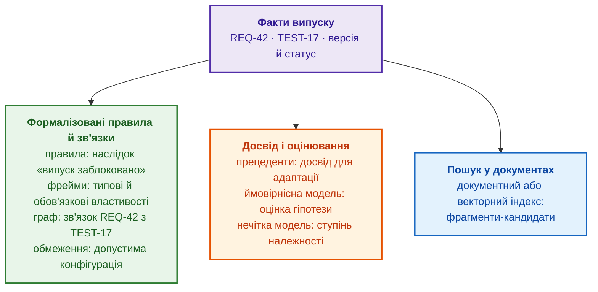
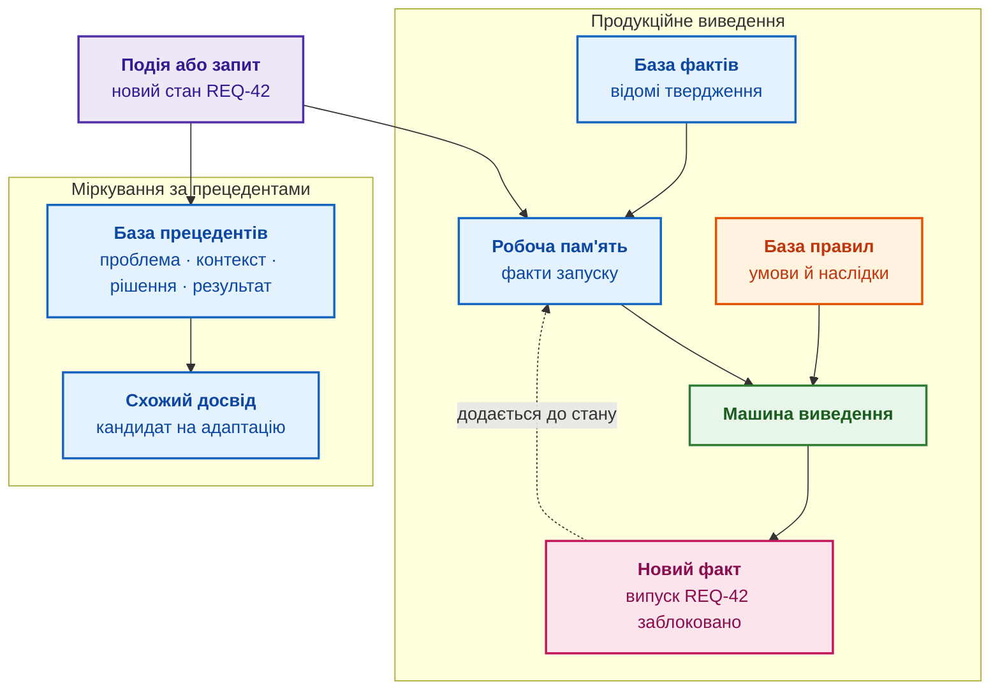
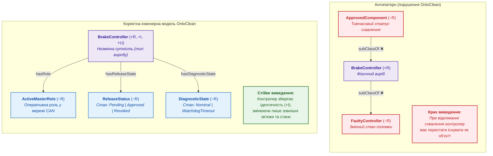
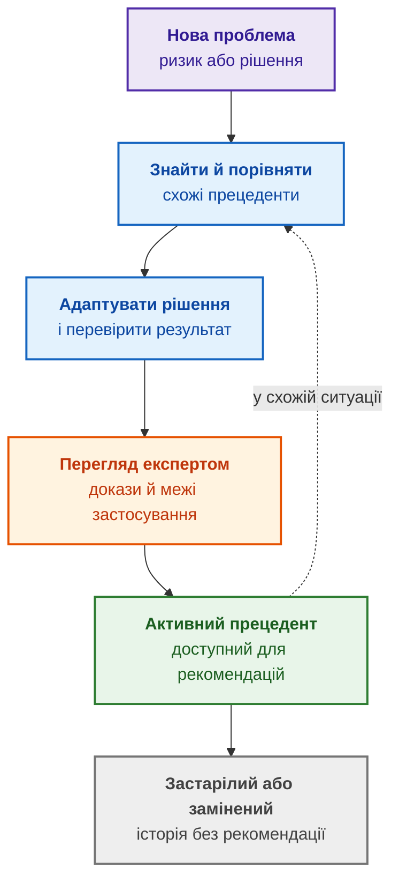
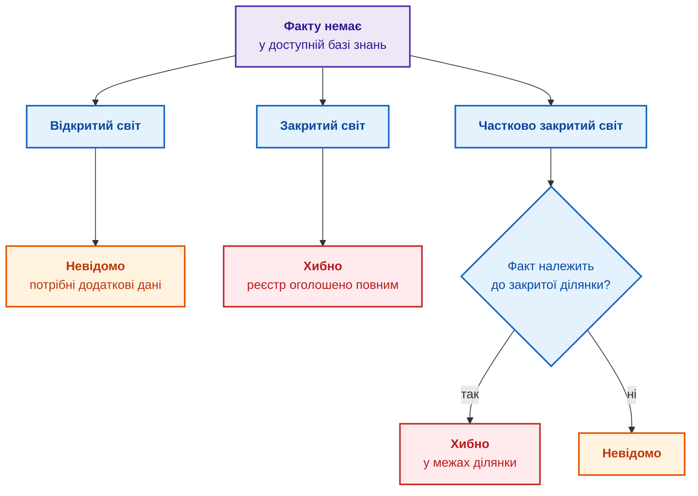
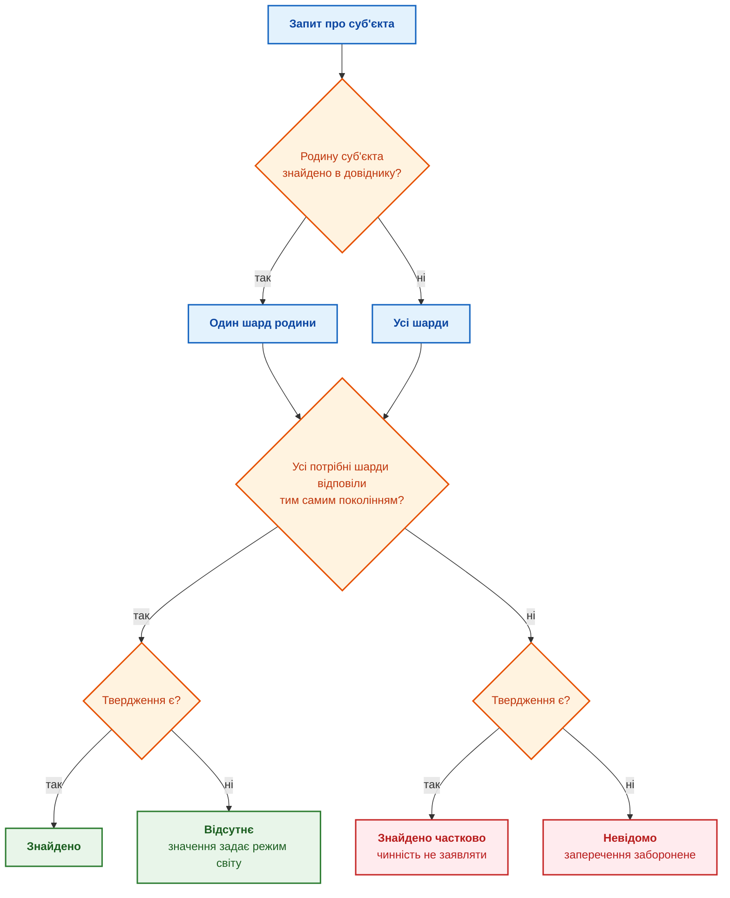

# Глава 7. Типологія баз знань: правила, онтології, прецеденти та вектори

> **Книга:** [Архітектура доказових експертних систем](README.md) · [Частина II: Математичні моделі, подання та зберігання знань](part-02-knowledge-models.md)  
> **Попередня глава:** [Глава 6. Прикладна математика експертних систем: правила, ймовірності, графи та причинність](ch06-applied-mathematics-for-expert-systems.md)  
> **Наступна глава:** [Глава 8. Інженерні артефакти як дані експертної системи](ch08-engineering-artifacts-as-data.md)  
> **Зміст книги:** [README.md](README.md)  
> **Автор:** [Микола Федчик](about-the-author.md)  
> **Рівень:** базовий інженерний; приклади запитів, даних і коду винесено в згорнуті блоки  
> **Очікувані результати:** відрізняти базу знань від бази даних і сховища документів; для кожного типу бази знань (правила, фрейми, онтології, прецеденти, обмеження, ймовірнісні й нечіткі моделі, документні й векторні індекси) називати, що тип зберігає, який результат повертає й чого результат не доводить; обирати тип бази знань за потрібним результатом, а не за назвою продукту; явно задавати, що означає відсутній факт; задавати запитання до компетентності онтології й перевіряти ієрархію понять методом OntoClean; розрізняти фрагментацію, шардування й групування бази знань за ознаками, обирати ключ розбиття за залежностями виведення й не читати мовчання шарда як відсутність факту.

## Анотація

У цій главі розглянуто фундаментальну типологію інженерних баз знань як ядра архітектури доказових експертних систем та встановлено критерії їхньої демаркації від традиційних реляційних баз даних і неструктурованих сховищ документів. Досліджено ключові парадигми формалізації знань, що забезпечують математичний детермінізм, формальну верифікованість та неспростовність висновків: продукційні правила, фреймові структури, формальні онтології (OWL/RDF), прецедентні сховища (CBR), розв'язувачі обмежень (CSP), ймовірнісні мережі Байєса та щільні векторні індекси. Визначено, яку саме роль кожна модель відіграє в життєвому циклі експертної системи для запобігання підміні строгого логічного доведення евристичним пошуком. Особливу увагу приділено семантиці неповноти інформації (припущення відкритого, закритого та частково закритого світу), методології формальної верифікації таксономій OntoClean, а також архітектурним принципам горизонтальної та вертикальної фрагментації й шардування без розриву транзитивного виведення.

Команда каже: «нам потрібна база знань для штучного інтелекту (ШІ)», і під базою знань часто мають на увазі вікі, сховище документів або векторний індекс. Тоді на запитання «чи можна випускати контролер гальм BrakeController 3.2?» інформаційна система повертає абзац зі звіту, схожий на відповідь, і користувач не може зрозуміти, чи перед ним знайдений фрагмент, виведене правилом твердження чи перевірений факт. Продукційний рушій повертає спрацьоване правило, онтологічний рушій повертає клас або суперечність, база прецедентів повертає схожий досвід, розв'язувач обмежень повертає допустиму конфігурацію, а векторний індекс лише добирає схожі фрагменти. Якщо інтерфейс називає всі ці результати однаково «відповіддю ШІ», помилка кожного результату стає невидимою.

Мета глави: показати, що універсальної бази знань не існує, і навчити обирати тип бази знань за потрібним результатом. Для кожного типу глава називає, що тип зберігає, як отримує результат, чого результат не доводить і де тип доречний у дослідженнях і розробці (*Research and Development*, R&D). Усі типи розглянуто на одному наскрізному прикладі: критична вимога REQ-42 до контролера гальм і тест TEST-17, який має вимогу підтвердити. Математику методів пояснила [Глава 6](ch06-applied-mathematics-for-expert-systems.md), а як інженерні артефакти стають даними й зв'язуються в граф, розповідають [Глава 8](ch08-engineering-artifacts-as-data.md) і [Глава 9](ch09-engineering-knowledge-graph-traceability.md).

## 1. Типові інженерні збої: наслідки невідповідності типу знань цільовому запитанню

Більшість збоїв баз знань у промисловій експлуатації мають одну причину: механізм, обраний для одного типу запитання, використовують для іншого. Таблиця показує сім типових збоїв, від яких відштовхується решта глави.

| Проблема | Що бачить користувач | Технічна причина | Шлях виправлення |
|---|---|---|---|
| Пошук замість виведення | на запитання «чи порушено правило?» інформаційна система повертає схожий абзац | векторний пошук підмінює перевірку правила чи обмеження | типізований результат: знайдено, виведено, перевірено, оцінено |
| Хибне тлумачення відсутності | відсутнє в графі ребро до тесту трактують як «тесту немає» | до графа з відкритим світом застосовано припущення закритого світу | оголосити межі повноти й перевіряти повноту окремим правилом |
| Розбіжність версій | правило перевіряє факти іншої базової версії | правила, граф та індекс оновлюються не одночасно | маніфест випуску знань і запити до узгодженого знімка |
| Хибні зв'язки від мовної моделі | у графі з'являється переконливий, але хибний зв'язок | вилучення зв'язків без схеми, фрагмента-джерела й перегляду | обмежене вилучення, перевірка схеми, перевірка джерела, карантин |
| Витік через висновок | користувач не бачить секретного джерела, але бачить висновок із джерела | права доступу застосовано лише до сирих фактів | поширення міток доступу на висновки, пояснення й кеші |
| Вибух виведення | машина виведення не встигає за вимогами до часу відповіді | надмірна виразність мови, замкнені ланцюжки правил, повне обчислення всіх наслідків | обмежений профіль мови, інкрементальне виведення або доведення під час запиту |
| Розрізане виведення | відповідь про чинність норми змінюється залежно від того, який вузол відповів | пов'язані редакції або тести лежать на різних вузлах, мовчання вузла прочитано як «факту немає» | ключ розбиття за родиною документів, «невідомо» замість «хибно» за мовчання шарда |

Кожен рядок таблиці зводиться до одного правила: для кожного способу подання знань треба назвати семантику, алгоритм, доказовий статус результату й безпечну реакцію на невизначеність. Решта глави застосовує правило до кожного типу бази знань, починаючи з різниці між базою знань і базою даних.

## 2. Демаркація понять: база даних, сховище документів та база знань

База даних відповідає на запитання «що збережено?» і повертає записи, які відповідають запиту. База знань (*knowledge base*) додає семантику предметної області, а там, де потрібно, ще й механізм отримання нових висновків із наявних фактів. Не кожна база знань має власну машину виведення: онтологія може лише задавати спільну мову й типи, а пошук чи правила працюватимуть в іншому компоненті.

Реляційна база даних може зберігати вимоги, тести, дефекти й ризики, і запит мовою структурованих запитів (*Structured Query Language*, SQL) знайде вимоги без тестів, якщо програміст явно задасть умову. Продукційна база знань може містити доменне правило «критичну вимогу не можна закривати без доказу верифікації» і застосовувати правило до кожного нового факту. Відмінність не у форматі файла чи назві сервера, а в тому, де зберігається значення правила і хто виконує виведення. Практична база знань має щонайменше чотири складники:

- **подання знань** (*knowledge representation*): факти, правила, фрейми, графи, прецеденти, обмеження або розподіли ймовірностей;
- **механізм виведення:** який компонент отримує нові твердження, оцінки або допустимі варіанти і за якою процедурою;
- **контекст чинності:** для якого продукту, стандарту, версії, замовника чи проміжку часу діє знання;
- **походження й власник:** звідки взялося твердження, хто його затвердив і хто має право змінити або відкликати твердження.

Проста аналогія: документ є сторінкою з текстом, база даних є картотекою, а база знань поєднує картотеку зі значенням термінів і правилами роботи з картками. Межа аналогії: не кожна база знань містить правила «якщо, то». Онтологія класифікує сутності, база прецедентів шукає подібний досвід, а ймовірнісна модель оновлює оцінку впевненості.

### 2.1. Критерії перетворення структурованого набору файлів на базу знань

Папка з файлами вимог ще не є базою знань лише тому, що зберігає корисну інформацію. Три документи можуть містити вимоги REQ-42, REQ-43 і REQ-44, але без ручного аналізу читач не знатиме, яка версія кожної вимоги чинна, який тест вимогу перевіряє, чи належать вимоги до одного виробу й які вимоги критичні для безпеки. Набір файлів стає базою знань, коли організація явно визначає:

- **одиниці знання:** вимога, компонент, тест, дефект, правило, прецедент або звіт;
- **значення полів і термінів:** чим статус «затверджено» відрізняється від «застаріло», а зв'язок «перевіряє» від простого згадування в тексті;
- **ідентифікатори, версії та межі чинності:** який запис є REQ-42 версії 1.2, для якого виробу й часу запис діє;
- **зв'язки між одиницями:** REQ-42 перевіряє тест TEST-17, тест породив звіт, правило використовує статус звіту;
- **спосіб обробки:** пошук, запит до графа, перевірка обмеження, застосування правила або зіставлення прецедентів.

Файли можуть лишатися основним місцем зберігання. Базою знань файли робить не сервер і не формат YAML (*YAML Ain't Markup Language*), а узгоджена модель понять, зв'язків, чинності й операцій. Папка з текстами без таких домовленостей є джерелом матеріалів для майбутньої бази знань, а не базою знань у строгому сенсі.

### 2.2. Корпоративна вікі: межі придатності та архітектура RAG

В організаційному сенсі корпоративна вікі, наприклад Confluence, стає базою знань, коли команда систематично зберігає у вікі інструкції, рішення, поняття предметної області, досвід інцидентів і посилання на першоджерела, а кожна сторінка має власника, статус і дату перегляду. Для керування знаннями в компанії такого рівня часто досить. Проте вікі без власників, статусів, стабільних посилань і правил оновлення є радше архівом документів: пошук знайде згадки, але не відповість, яке правило чинне для версії 3.2 чи який тест перевіряє вимогу, без ручного тлумачення текстів. Вікі добре зберігає пояснення й контекст, але не замінює граф простежуваності, рушій правил чи реєстр вимог там, де потрібні автоматичні перевірки й відтворюване виведення.

Над вікі часто будують генерацію з пошуком (*Retrieval-Augmented Generation*, RAG): застосунок розбиває сторінки на фрагменти, індексує фрагменти, добирає релевантні фрагменти до запиту, а мовна модель формує відповідь. Вікі лишається основним сховищем, а генерація з пошуком є шаром пошуку й пояснення над вікі. Таблиця порівнює генерацію з пошуком із повнотекстовим пошуком.

| Потреба користувача | Повнотекстовий пошук | Генерація з пошуком над вікі |
|---|---|---|
| Запит іншими словами | шукає точні слова, форми слів або заздалегідь задані синоніми | може знайти фрагмент за близьким змістом |
| Відповідь із кількох сторінок | повертає перелік сторінок | поєднує знайдені фрагменти у стислу відповідь із посиланнями |
| Пояснення терміна в контексті | потребує відкрити кілька сторінок самостійно | пояснює термін з урахуванням контексту проєкту |
| Уточнення в діалозі | кожен запит формулюють окремо | враховує попереднє запитання й просить уточнення |

За запитом «чому для REQ-42 потрібна незалежна верифікація?» генерація з пошуком може дібрати фрагмент вимоги, сторінку з політикою безпеки й опис тесту TEST-17 і пояснити зв'язок між ними. Але генерація з пошуком не доводить, що знайдений текст чинний, не встановлює формального зв'язку REQ-42 з TEST-17 і не перевіряє правила. Відповідь «у вікі написано» не дорівнює «вимогу верифіковано», тому відповідь має містити посилання на конкретні сторінки з версіями й бути позначена як пояснення на основі знайдених джерел.

### 2.3. Семантична типізація запитів інженера до бази знань

Користувач не працює з базою знань одним універсальним запитом: формулювання залежить від потрібного результату. Одна тема REQ-42 породжує різні коректні запити.

| Запит користувача | Подання знань або механізм | Коректний результат |
|---|---|---|
| «Яка чинна версія REQ-42?» | реєстр вимог або база даних | запис вимоги та версія |
| «Який тест перевіряє REQ-42?» | семантичний граф | зв'язок REQ-42 з TEST-17 і шлях простежуваності |
| «Чи порушено правило для вимоги ASIL D без незалежного тесту?» | продукційні правила | спрацьоване правило й виведений наслідок |
| «Які конфігурації тесту задовольняють умову незалежності?» | база обмежень | набір допустимих конфігурацій |
| «Чи траплявся подібний дефект?» | база прецедентів | схожий прецедент і умови, за яких рішення спрацювало |
| «Наскільки правдоподібна гіпотеза про відмову сторожового таймера?» | байєсівська модель | умовна ймовірність за моделлю й спостереженнями |
| «Де у звітах згадано REQ-42?» | документний або векторний індекс | фрагменти-кандидати з джерелом і статусом |

Формальний запит має визначену мову, схему даних і семантику виконання: запит прямо називає сутності, зв'язки, умови й форму відповіді. Наприклад, запит мовою SPARQL (*SPARQL Protocol and RDF Query Language*) до графа може означати «поверни всі тести, пов'язані зв'язком «перевіряє» з REQ-42, разом із результатом і звітом».

<details>
<summary>Приклад запиту SPARQL: тести, що перевіряють REQ-42</summary>

Змінні починаються зі знака питання. Властивість `ex:verifies` пов'язує визначення тесту з вимогою, а `ex:ofTest`, `ex:release`, `ex:result` і `ex:hasReport` описують окремий запуск. Запит шукає схвалений запуск саме для випуску 3.2.

```sparql
PREFIX ex: <https://example.org/rd/>

SELECT ?test ?result ?report
WHERE {
    ?test ex:verifies ex:REQ-42 .
    ?run ex:ofTest ?test ;
      ex:release ex:Release3_2 ;
      ex:result ?result ;
      ex:hasReport ?report ;
      ex:status ex:Approved .
}
```

</details>

За незмінних даних, версії графа й прав доступу формальний запит дає відтворюваний результат. Формальна мова не робить відповідь правильною: мова лише фіксує, що саме й за якою процедурою перевірено.

Неформальний запит користувач формулює природною мовою: «чим підтверджено REQ-42?». Мовна модель може розпізнати намір, уточнити неоднозначність і перетворити фразу на один чи кілька формальних запитів, але відповідь мовної моделі не є результатом запиту до бази знань, якщо мовна модель не передала запит механізму виведення й не повернула перевірений результат із джерелами. Надійна взаємодія через мовну модель має такий порядок:

1. мовна модель визначає намір і за потреби просить уточнити терміни, версію чи межі пошуку;
2. служба авторизації звужує доступні дані й дозволені операції;
3. мовна модель формує структурований запит, а застосунок перевіряє синтаксис, типи й межі виконання запиту;
4. механізм виведення виконує запит до реєстру, графа, правил, обмежень, прецедентів чи індексу;
5. мовна модель пояснює результат, не змінюючи змісту результату: називає тип результату, джерела, версії й невизначеності.

На запитання «чи верифіковано REQ-42?» мовна модель не повинна відповідати «так» лише тому, що знайшла фразу «TEST-17 verifies REQ-42». Потрібна формальна перевірка зв'язку з чинним тестом і затвердженим звітом для потрібної версії контролера; якщо виконано лише пошук, результат позначають як добір фрагментів-кандидатів.

### 2.4. Розподілена база знань життєвого циклу: вимоги, вихідний код, тести та дефекти

Вимоги є знанням про те, що має робити виріб, за яких умов і як буде підтверджено виконання. База знань про вимоги зберігає не лише текст, а й рівень, функціональну область, версію, статус, власника, джерело, залежності, ризики, тести й докази. Зміна змісту вимоги породжує нову версію, а не непомітне редагування затвердженого твердження. Код є виконуваною специфікацією поведінки, тест поєднує декларативне очікування («за спрацювання сторожового таймера контролер переходить у безпечний стан за 100 мс») і процедуру перевірки, а звіт безперервної інтеграції (*Continuous Integration*, CI) є доказом, що конкретна версія коду пройшла чи не пройшла конкретний тест у конкретному середовищі.

| Артефакт | Яке знання містить | Де зберігається | Що лишається після завершення проєкту |
|---|---|---|---|
| Вимога й специфікація вимог | ціль, обмеження, версія, простежуваність | репозиторій вимог або контрольований документ | базова версія вимог, історія змін і підстави для супроводу |
| Код і конфігурація | виконувана поведінка, інтерфейси, схеми | репозиторій Git у GitLab чи GitHub | змога відтворити версію й повторно використати компонент |
| Тест | очікувана поведінка й процедура перевірки | репозиторій тестів або система керування тестуванням | регресійний набір і пояснення меж поведінки |
| Звіт тесту, журнал, артефакт CI | доказ запуску тесту для версії й середовища | GitLab CI, GitHub Actions, сховище артефактів | підтвердження версії випуску для аудиту й розбору інцидентів |
| Задача, дефект, ризик, запис архітектурного рішення | план, відповідальність, контекст і прийняте рішення | Jira, GitLab Issues, GitHub Issues, репозиторій записів рішень | причини рішень, уроки й невиконані зобов'язання |

Разом ці артефакти утворюють розподілену базу знань про проєкт, але лише тоді, коли елементи мають типи, версії, зв'язки, статуси й власників. Є три практичні рівні інтеграції. Перший рівень складається з посилань і домовленостей: стабільні ідентифікатори REQ-42, TEST-17, номер задачі, хеш коміту й адреса звіту. Другий рівень є пошуковим індексом над текстами й метаданими з кількох джерел. Третій рівень є інтеграційним шаром знань, який зчитує дані через програмні інтерфейси, зіставляє ідентифікатори, зберігає типи, зв'язки, версії й походження і виконує наскрізні запити на кшталт «які критичні вимоги базової версії не мають затвердженого результату тесту?». Інтеграційний шар не стає ще одним місцем ручного редагування: основним фактом лишається запис в інструменті-джерелі, а шар оновлює проєкцію факту. Невеликій команді варто спершу узгодити ідентифікатори й типи посилань, потім додати пошук, а інтеграційний шар будувати лише для повторюваних наскрізних перевірок.

Підсумок розділу: база знань відрізняється від бази даних і сховища документів не форматом, а наявністю узгодженої семантики, контексту чинності, походження й механізму отримання результату. Відкриті бази знань показують, наскільки різними бувають такі механізми.

## 3. Референтні відкриті бази знань інженерного призначення

База знань не обов'язково належить закритій корпоративній експертній системі. Відкриті проєкти дозволяють переглянути записи, завантажити дані або виконати запит.

| Проєкт | Структура знань | Що можна побачити |
|---|---|---|
| [Wikidata](https://www.wikidata.org/wiki/Wikidata:Introduction) | спільна багатомовна база тверджень і граф знань | сутності `Q…`, властивості `P…`, значення, уточнення й джерела; структуровані дані опубліковано за ліцензією CC0 |
| [ConceptNet](https://conceptnet.io/) | відкрита багатомовна семантична мережа | зв'язки `IsA`, `PartOf`, `UsedFor` між поняттями, ваги й походження тверджень |
| [Gene Ontology](https://geneontology.org/docs/ontology-documentation/) | формальна предметна онтологія | класи біологічних процесів і функцій, відношення `is_a`, `part_of`, стабільні ідентифікатори `GO:…` |
| [OpenFisca](https://openfisca.org/en/) | відкриті виконувані моделі законодавчих правил | формули податків і соціальних виплат, параметри за датами, тести |
| [Bayesian Network Repository](https://www.bnlearn.com/bnrepository/) | колекція ймовірнісних моделей | мережі ASIA, ALARM, CHILD із таблицями умовних ймовірностей |
| [AI Incident Database](https://incidentdatabase.ai/) | відкритий корпус випадків | реальні інциденти з ШІ, звіти й класифікації; база не є готовим рушієм прецедентів, але є базою досвіду |

Вступ до Wikidata показує твердження `Q42 → P69 → Q691283`: Дуглас Адамс навчався в коледжі St John's. У Gene Ontology термін `GO:0019319` має двох батьків, бо біосинтез гексоз одночасно є обміном гексоз і біосинтезом моносахаридів. Добірка навмисно неоднорідна: Wikidata зберігає твердження з джерелами, Gene Ontology визначає класи, OpenFisca виконує правила, а мережі з bnlearn обчислюють ймовірності. Назва «база знань» не гарантує ні одного формату, ні одного способу отримання відповіді. Щоб порівняти типи на інженерному запитанні, потрібен спільний сценарій.

## 4. Наскрізний інженерний прецедент: верифікація випуску BrakeController 3.2

Проєктна команда готує випуск R2026.3 контролера гальм BrakeController версії 3.2. Перед випуском кожна критична вимога має реалізацію, метод верифікації й затверджений доказ виконання. Вигадана системна вимога REQ-42 описує поведінку контролера, коли внутрішній сторожовий таймер (*watchdog*) перестає отримувати очікуваний сигнал; вимогу класифіковано за найвищим рівнем повноти безпеки автомобільних систем (*Automotive Safety Integrity Level*, ASIL) D. Усі ідентифікатори й значення в сценарії навчальні.

<details>
<summary>Приклад даних YAML: запис вимоги REQ-42 і специфікація вимог</summary>

Запис вимоги задано у форматі YAML, а специфікація вимог збирає погоджені версії вимог для випуску.

```yaml
requirement_id: REQ-42
requirement_version: "1.2"
requirement_level: system
functional_area: safety
title: "Перехід BrakeController у безпечний стан за відмови watchdog"
component: BrakeController
component_version: "3.2"
safety_integrity_level: ASIL-D
trigger: "watchdog_timeout"
required_behavior: "перейти в безпечний стан не пізніше ніж за 100 ms"
verification_method: "незалежний стендовий тест"
verification_test: TEST-17
release_condition: "потрібен затверджений результат independent verification"
```

```yaml
specification_id: BrakeController-SyRS
specification_version: "3.2"
applies_to: BrakeController
release: R2026.3
requirements:
  - id: REQ-42
    version: "1.2"
    role: "безпека: перехід у безпечний стан за watchdog_timeout"
  - id: REQ-43
    version: "2.0"
    role: "інтерфейс: передавання статусу відмови на CAN"
status: approved
```

</details>

Запис YAML не є базою знань: запис є структурованим джерелом, з якого різні бази знань беруть факти. Для REQ-42 основним місцем зв'язків є семантичний граф, а решту функцій виконують інші подання знань.

| Потреба навколо REQ-42 | База знань або індекс | Що зберігає |
|---|---|---|
| простежити, який тест перевіряє вимогу | семантичний граф або онтологія | вимогу, компонент, тест, звіт і зв'язки |
| задати обов'язкові поля критичної вимоги | фреймова база | рівень ASIL, метод верифікації, доказ, стан випуску |
| заблокувати випуск без незалежного тесту | продукційна база правил | факти про статус тесту й правило політики випуску |
| знайти звіт TEST-17 у документації | документний або векторний індекс | фрагменти звіту, метадані й вектори |

Глава розглядає дві контрольні точки. Перед TEST-17 для REQ-42 є вимога, рівень ASIL D і план тестування, але немає затвердженого результату незалежної верифікації, тому перевірка випуску має заблокувати R2026.3. Після TEST-17 звіт має статус «затверджено», результат «пройдено» й посилання на REQ-42; звіт підтверджує саме цю перевірку, але не готовність усього випуску. Схема показує три групи механізмів, які обробляють факти випуску.



Фіолетовий блок є вхідними фактами. Зелений блок дає формальні результати: наслідок, клас, зв'язок, допустиму конфігурацію. Помаранчевий блок дає досвід і оцінки, які потребують перевірки. Синій блок дає лише кандидатів на доказ. Жоден механізм не замінює інших, тож наступний розділ зводить відмінності в одну таблицю.

## 5. Порівняльна таксономія типів баз знань

Онтологія, продукційні правила, база прецедентів і векторний пошук не виключають одне одного, і одна експертна система часто використовує всі чотири. Розрізняти типи потрібно тому, що помилка кожного результату має інший характер.

| Тип бази знань або індексу | Що зберігає | Що повертає механізм | Чого результат не доводить |
|---|---|---|---|
| продукційні правила | факти й правила «якщо, то» | наслідок і ланцюжок спрацьованих правил | що правила повні й актуальні |
| фрейми | типові об'єкти, слоти, значення за замовчуванням, винятки | успадковані або заповнені властивості | що значення підтверджене для конкретного об'єкта |
| онтологія й семантичний граф | класи, відношення, аксіоми, обмеження | клас, новий зв'язок або суперечність | що відсутній факт хибний |
| база прецедентів | минулі проблеми, контекст, рішення, наслідки | схожий прецедент і кандидат на адаптацію | що старе рішення придатне без перевірки |
| база обмежень | змінні, домени, дозволені комбінації | один або кілька допустимих варіантів | що знайдений варіант найкращий |
| ймовірнісна модель | залежності, спостереження, ймовірності | оновлена ймовірність гіпотези | що гіпотезу доведено |
| нечітка модель | функції належності, нечіткі правила | ступінь належності або керівна оцінка | статистичну ймовірність події |
| документний або векторний індекс | тексти, фрагменти, метадані, вектори | кандидати за словами або схожістю | чинність, істинність чи право використання |

Головна межа проходить між пошуком збереженого матеріалу й виведенням наслідку, класифікації, конфігурації чи оцінки. Векторний індекс знаходить кандидатів, а продукційний рушій, онтологічний рушій, розв'язувач обмежень і ймовірнісна модель працюють із формалізованим значенням. Інтерфейс доказової експертної системи має позначати, який механізм дав кожну частину відповіді. Далі кожен тип розглянуто окремо.

## 6. База правил, база фактів та динамічна робоча пам'ять

У класичній продукційній експертній системі базу знань ділять на базу правил і базу фактів. База правил містить відносно сталі доменні залежності: умови, наслідки, пріоритети й межі чинності. База фактів містить твердження про конкретні об'єкти: клас вимоги, результат тесту, стан компонента. Робоча пам'ять (*working memory*) містить факти поточного сеансу виведення; у простій продукційній експертній системі робочу пам'ять називають базою фактів, а в розподіленій архітектурі постійне сховище фактів і тимчасову робочу пам'ять розрізняють. Машина виведення зіставляє факти з умовами правил і додає висновки до робочої пам'яті. Схема показує продукційне виведення поруч із міркуванням за прецедентами.



Фіолетовий блок є подією, сині блоки є пам'яттю фактів і прецедентів, помаранчевий блок є правилами, зелений блок є машиною виведення, рожевий блок є виведеним фактом. Пунктирна стрілка показує, що новий факт стає вхідним для наступних правил. На першій контрольній точці поділ виглядає так, як у прикладі нижче.

<details>
<summary>Приклад: база правил, база фактів і робоча пам'ять на першій контрольній точці</summary>

```text
постійна база правил:
  R-17: якщо asil(X, D) і verification_status(X, missing),
        то release_blocked(X)

постійна база фактів:
  requirement(REQ-42)
  asil(REQ-42, D)

робоча пам'ять цього запуску:
  verification_status(REQ-42, missing)

після спрацювання R-17:
  release_blocked(REQ-42)
```

</details>

Правило R-17 застосовне до багатьох вимог, а факт «статус верифікації REQ-42: відсутній» описує стан до TEST-17 і після затвердження звіту має змінитися. Виведений факт «випуск REQ-42 заблоковано» теж потребує контексту: версії бази правил, часу запуску й набору вхідних фактів. Факти можуть зберігатися в сховищі RDF (*Resource Description Framework*), графі знань, логічній базі чи цифровому двійнику, але поділ на правила й робочу пам'ять найвиразніший саме в продукційній архітектурі.

### 6.1. Неприпустимість агрегації суперечливих фактів голосуванням більшості

Коли база фактів зростає до мільйонів тверджень із корпусів стандартів, виникає спокуса «очистити» базу, лишивши для кожного твердження лише значення, яке підтримує більшість джерел. У нормативних предметних областях таке злиття шкодить чотирма способами. По-перше, воно знищує часову чинність: тридцять застарілих редакцій стандарту можуть «перегласувати» одну чинну редакцію, яка правило скасувала. По-друге, воно стирає межі документа: на запитання «як було за стандартом 1981 року?» база вже не відповість. По-третє, воно стирає винятки й модальності: профільні розширення часто послаблюють MUST до SHOULD для певних умов. По-четверте, воно змішує юрисдикції: більший корпус поглинає менший для спільних понять. Безпечніше агрегувати без втрат:

```math
\mathrm{Assertion}(S,R,V)\ \leftarrow\ \big[\,\mathrm{Citation}(D_1,\mathrm{span}_1,h_1),\ \dots,\ \mathrm{Citation}(D_k,\mathrm{span}_k,h_k)\,\big]
```

Позначення в записі:

- $\mathrm{Assertion}(S,R,V)$ є твердженням «суб'єкт $S$ має відношення $R$ зі значенням $V$»;
- $\leftarrow$ означає, що твердження пов'язане з наведеними джерелами, а квадратні дужки містять перелік його підтверджень;
- $D_i$ є документом-джерелом із версією, $\mathrm{span}_i$ є точними координатами фрагмента в документі, а $h_i$ є хешем цього фрагмента;
- $k$ є кількістю джерел, що підтримують твердження, а індекс $i$ позначає окреме джерело.

Однакові трійки $(S,R,V)$ групуються в один запис з усіма цитатами, а різні значення $V_1,V_2,\dots$ зберігаються всі. Машина виведення під час запиту визначає чинне значення за межами документа, лінією змін і юрисдикцією. Якщо значення суперечать одне одному, результатом є попередження про суперечність, а не мовчазний вибір більшості.

### 6.2. Семантичне розмежування поточної бази фактів та бази прецедентів

База фактів зберігає окремі твердження про стан, а база прецедентів зберігає цілісний епізод: проблему, контекст, рішення, результат і межі перенесення досвіду.

| Ознака | База фактів | База прецедентів |
|---|---|---|
| одиниця знання | окреме твердження | завершена цілісна ситуація |
| приклад | «REQ-42 має рівень ASIL D» | CASE-0081: попередній випуск із вимогою ASIL D без незалежного тесту |
| використання | перевірка умов правил і логічні запити | пошук схожого досвіду й адаптація рішення |
| зміна в часі | факт швидко оновлюється або втрачає чинність | прецедент зберігається як історичний досвід |
| результат | новий факт або висновок | схожий прецедент і кандидат на рішення |

Один прецедент містить багато фактів, але набір фактів ще не є прецедентом. Запис стає прецедентом завдяки проблемі, застосованому рішенню й відомому результату, які дозволяють порівняти нову ситуацію з минулою.

Підсумок розділу: база правил, база фактів і робоча пам'ять розділяють сталі правила, стан об'єктів і стан запуску, а безвтратна агрегація зберігає всі значення з джерелами до моменту запиту. Далі розглянуто сам продукційний механізм.

## 7. Продукційні бази знань: правила прямого та зворотного виведення

Продукційна база знань зберігає факти й правила у формі «якщо умова істинна, додай висновок або виконай дію». Правило R-17 разом із фактами про REQ-42 утворює мінімальний приклад: результатом є не слово «заблоковано», а ланцюжок, який аудитор може перевірити, від REQ-42 і рівня ASIL D через статус верифікації й правило R-17 до виведеного факту. Пряме й зворотне виведення, оператор кроку виведення й найменшу нерухому точку пояснила [Глава 6](ch06-applied-mathematics-for-expert-systems.md), а алгоритм Rete Чарльза Форджі, що швидко зіставляє тисячі правил із фактами, описано там само [[1]](#src-1).

Формула кроку виведення з Глави 6 описує монотонне виведення: новий факт не забирає старого наслідку. Винятки, заперечення, пріоритети й відкликання роблять виведення немонотонним, і тоді семантику обирають явно: стратифіковане заперечення, правила з винятками або семантику стабільних моделей, яку запропонували Майкл Гельфонд і Володимир Ліфшиц [[2]](#src-2). Порядок правил у файлі не повинен непомітно ставати доменною політикою. Для кожного виведеного факту корисно зберігати запис доведення: ідентифікатор правила, підстановку змінних, ідентифікатори вхідних фактів, версію набору правил і час знімка. Тоді пояснення є не текстом, який мовна модель склала після події, а записом реального виведення.

Основний ризик продукційної бази знань полягає не в машині виведення, а в неповноті й конфліктах правил. Якщо винятки накопичуються без пріоритетів, область чинності не задано, а старі правила не відкликано, рушій послідовно виконає неправильну політику. Тому кожне правило має власника, версію, пріоритет, умови чинності й тестові приклади. Виведений наслідок доводить лише те, що наслідок випливає з наявних фактів і правил, але не те, що база правил повна.

## 8. Фреймові моделі знань: об'єкти з ролями, слотами та значеннями за замовчуванням

Фреймова база знань описує типові об'єкти фреймами, тобто структурами зі слотами. Слот (*slot*) є властивістю або роллю: компонент має власника, інтерфейс, клас безпеки, постачальника, версію, ризики й докази. Фрейм може задавати типове значення слота й правило успадкування, а конкретний об'єкт успадковує структуру фрейму й заповнює слоти власними значеннями.

<details>
<summary>Приклад фрейму YAML: критичний компонент і екземпляр BrakeController</summary>

```yaml
frame: SafetyCriticalComponent
slots:
  asil: { required: true }
  verification_method: { default: independent }
  verification_evidence: { required: true }
  release_state: { default: blocked }

instance: BrakeController
is_a: SafetyCriticalComponent
slots:
  asil: D
  verification_method: independent
  verification_evidence: TEST-17
```

</details>

Екземпляр BrakeController успадковує незалежну верифікацію й типовий стан «випуск заблоковано», а слот доказу посилається на TEST-17. Фрейм показує, чого бракує для розблокування випуску, але не перевіряє, чи TEST-17 справді пройшов і чи звіт затверджено. Значення слота обчислюють так:

```math
v(x,s)=
\begin{cases}
v_{\text{явне}}(x,s), & \text{якщо значення задано для } x,\\
v(\mathrm{parent}(x),s), & \text{якщо дозволено успадкування},\\
\bot, & \text{інакше: значення невідоме}.
\end{cases}
```

У цьому виразі:

- $x$ є об'єктом, а $s$ є його слотом;
- $v_{\text{явне}}(x,s)$ є значенням, заданим для самого об'єкта;
- $\mathrm{parent}(x)$ є батьківським фреймом, а $v(\mathrm{parent}(x),s)$ є значенням того самого слота у фреймі;
- $\bot$ означає «значення невідоме»;
- умови в фігурних дужках визначають, який із трьох випадків застосувати: явне значення, дозволене успадкування або невідоме значення.

Отже, результатом є явне чи успадковане значення або позначка невідомості. Разом зі значенням треба повертати режим його отримання: задане явно, успадковане, типове чи невідоме. Інакше інтерфейс покаже типовий стан «заблоковано» так само, як виміряний стан конкретного випуску. Успадковане значення є очікуванням, а не підтвердженим фактом про конкретний об'єкт; для довгих доказових ланцюжків фрейми поєднують із правилами або графом.

## 9. Семантичні мережі та формальні онтології: класи, властивості та ієрархії

Семантична мережа подає знання як сутності й зв'язки: вимогу перевіряє тест, дефект впливає на компонент, компонент належить до підсистеми. Онтологія (*ontology*) додає формальні класи, властивості, аксіоми й обмеження значень. Для інженерної експертної системи граф є природною формою, бо дослідження й розробка живуть у зв'язках від вимоги через рішення, код і тест до дефекту, ризику й доказу. Онтологічний рушій виведення (*reasoner*) класифікує сутності, виводить нові відношення й перевіряє несуперечність. Мовою дескрипційної логіки (*description logic*) дві різні аксіоми мають вигляд:

```math
\textsf{SafetyRequirement}\sqsubseteq\textsf{Requirement},\qquad \textsf{SafetyRequirement}\sqsubseteq\exists\,\textsf{verifiedBy}.\textsf{VerificationTest}
```

Прочитаймо аксіоми по черзі:

- $\textsf{SafetyRequirement}$ є класом вимог безпеки, а $\textsf{Requirement}$ є класом вимог;
- $\sqsubseteq$ означає «є підкласом», а кома між аксіомами розділяє два твердження;
- $`\exists\,\textsf{verifiedBy}.\textsf{VerificationTest}`$ означає клас об'єктів, які мають хоча б один зв'язок `verifiedBy` з об'єктом класу $\textsf{VerificationTest}$;
- $\exists$ означає «існує хоча б один», а крапка задає зв'язок, яким досягають об'єкт указаного класу.

Перша аксіома стверджує, що кожна вимога безпеки є вимогою. Друга стверджує, що для кожної вимоги безпеки існує якийсь тест. У семантиці мови онтологій OWL (*Web Ontology Language*) онтологія лишається несуперечливою й без іменованого тесту: модель може містити неіменованого «свідка». Тому відсутність трійки «REQ-42 verifiedBy TEST-17» сама не є помилкою. Якщо контрольна точка випуску вимагає наявного в графі зв'язку, потрібна окрема умова мовою обмежень форми SHACL (*Shapes Constraint Language*) [[3]](#src-3).

<details>
<summary>Приклад Turtle: форма SHACL для вимоги безпеки й трійки графа на другій контрольній точці</summary>

Форма вимагає для кожної вимоги безпеки хоча б одного зв'язку verifiedBy з тестом у конкретному знімку графа. Трійки описують стан після TEST-17.

```turtle
@prefix ex: <https://example.org/rd/> .
@prefix sh: <http://www.w3.org/ns/shacl#> .

ex:SafetyRequirementShape
  a sh:NodeShape ;
  sh:targetClass ex:SafetyRequirement ;
  sh:property [
    sh:path ex:verifiedBy ;
    sh:minCount 1 ;
    sh:class ex:VerificationTest
  ] .
```

```turtle
@prefix ex: <https://example.org/rd/> .
@prefix rdfs: <http://www.w3.org/2000/01/rdf-schema#> .

ex:REQ-42  a                 ex:SafetyRequirement ;
           ex:appliesTo      ex:BrakeController ;
           ex:verifiedBy    ex:TEST-17 .

ex:TEST-17 a                 ex:VerificationTest ;
           ex:verifies       ex:REQ-42 .

ex:RUN-17-32 a               ex:TestRun ;
           ex:ofTest         ex:TEST-17 ;
           ex:release        ex:Release3_2 ;
           ex:result         ex:Passed ;
           ex:hasReport      ex:REPORT-17-32 ;
           ex:status         ex:Approved .

ex:SafetyRequirement
           rdfs:subClassOf   ex:Requirement .
```

</details>

З трійки `rdfs:subClassOf` онтологічний рушій виведе, що REQ-42 є також вимогою загалом. Обидва напрями зв'язку з TEST-17 записано явно; без аксіоми оберненої властивості валідатор не зобов'язаний отримати `verifiedBy` із `verifies`. Форма перевіряє лише наявність і клас пов'язаного тесту, не успішність запуску. Запит SPARQL вище окремо знаходить схвалений запуск і звіт для 3.2. Якщо змінити його випуск на 3.1, результат запиту для 3.2 буде порожнім навіть за незмінної форми SHACL.

Три операції не можна змішувати: онтологічний рушій відповідає за виведення й несуперечність, валідатор SHACL за відповідність знімка формам, а SPARQL за запити. Треба зафіксувати, чи бачить SHACL лише записані трійки, чи й виведені: інакше та сама форма дасть різні результати в різних середовищах виконання. Навчальний статус `Approved` не перевіряє підпис і не враховує оперативне відкликання звіту; ці перевірки належать до процедури допуску.

Повна виразність OWL 2 не завжди є добрим вибором для промислової експертної системи. Профілі OWL 2 обмежують мову заради передбачуваного виведення: EL для великих ієрархій класів, QL для запитів до великих реляційних даних через онтологію, RL для реалізації правилами [[4]](#src-4), [[5]](#src-5). Профіль обирають за потрібними висновками й бюджетом часу, а автоматична перевірка відхиляє аксіоми поза погодженим профілем. Станом на вересень 2026 року стабільною основою лишаються рекомендації Консорціуму Всесвітньої павутини (*World Wide Web Consortium*, W3C) RDF 1.1 [[6]](#src-6), SPARQL 1.1 [[7]](#src-7) і SHACL 2017 [[3]](#src-3); специфікація RDF 1.2 Concepts має статус кандидата в рекомендації [[8]](#src-8), а SPARQL 1.2 і SHACL 1.2 опубліковано як робочі чернетки [[9]](#src-9), [[10]](#src-10), тому нові можливості версій 1.2 використовують лише з явною фіксацією версії.

Більшість онтологічних рушіїв виведення й сховищ RDF працює в припущенні відкритого світу: незаписаний і не виведений зв'язок лишається невідомим, а не хибним. Онтології корисні для спільної мови, класифікації й простежуваності, але потребують власника термінів, версій і правил сумісності.

### 9.1. Запитання до компетентності онтології (Competency Questions)

Несуперечлива онтологія може не містити відношень, потрібних для рішення про випуск BrakeController 3.2. Тому до створення класів інженер знань записує **запитання до компетентності онтології** (*competency questions*): конкретні запитання, на які майбутня модель має дозволяти відповідати. Наталія Ной і Дебора Макгіннесс пропонують такі запитання для визначення меж і потрібного змісту онтології [[11]](#src-11). Компетентність тут означає можливості моделі, а не кваліфікацію людини.

Для прикладу з REQ-42 достатньо почати з трьох запитань. Таблиця перетворює запитання на вимоги до понять і на перевірювані результати.

| Запитання | Що має бути в моделі | Навчальний випадок і очікуваний результат |
|---|---|---|
| Які тести перевіряють REQ-42? | вимога, тест і зв'язок перевірки | граф містить зв'язок TEST-17 з REQ-42; відповідь називає TEST-17 |
| Який результат отримано для випуску 3.2? | окремий запуск тесту, випуск і вердикт | TEST-17 має успішний запуск для 3.1, але запуску для 3.2 немає; відповідь не переносить успіх 3.1 на 3.2 |
| На чому ґрунтується твердження про успішний запуск? | звіт запуску, ідентифікатор джерела й походження | твердження посилається на конкретний звіт; відсутність звіту дає позначку нестачі свідчень |

Другий рядок виявляє помилку, яку проста ієрархія класів не помітить. Якщо вердикт зберігати як одну властивість TEST-17, різні запуски тесту перезаписуватимуть результати один одного. Потрібна окрема сутність запуску, зв'язана з тестом і випуском. Запитання до компетентності обґрунтовує зміну моделі через потрібну відповідь, а не через бажання додати ще один клас.

Для кожного запитання зберігають ідентифікатор, область застосування, тестовий знімок і очікувану відповідь. Після формалізації запитання стає запитом або тестом правила. Окремий негативний випадок перевіряє поведінку за нестачі даних: результат для випуску 3.2 залишається невідомим, якщо відомо лише про 3.1. Реєстр має також називати запитання, яких онтологія не підтримує. Наприклад, зв'язок тесту з вимогою не визначає автоматично, чи достатньо цього тесту для сертифікації.

Перевірка підтверджує лише заявлені можливості моделі на заданих випадках, а не повноту знань про всі можливі вироби. У [Главі 23](ch23-knowledge-base-verification.md) такі випадки входять до регресійної перевірки, а [Глава 15](ch15-knowledge-extraction-and-kb-construction.md) показує практичне збирання онтології. Перед збиранням треба перевірити ще одну властивість: чи самі поняття описують потрібні об'єкти, а не випадкові ролі й стани.

### 9.2. Формальна валідація таксономій за методологією OntoClean

Під час проектування онтологій для вбудованих систем, авіоніки та автомобільної електроніки (зокрема нашого контролера BrakeController) розробники часто припускаються фатальної архітектурної помилки: моделюють оперативні ролі, сертифікаційні статуси чи несправності як звичайні підкласи об'єктів. Логічний рушій виведення (OWL Reasoner) чи компілятор схем бездоганно проковтне ієрархію на кшталт $\textsf{BrakeController} \sqsubseteq \textsf{ApprovedComponent}$ («контролер гальм є підкласом схвалених компонентів») або $\textsf{SafetyController} \sqsubseteq \textsf{FaultyDevice}$ («контролер безпеки є підкласом несправних пристроїв»). Синтаксично в дескрипційній логіці тут немає суперечності, якщо всі наявні в базі контролери тимчасово мають схвалення або дефект. Проте в фізичній реальності така ієрархія призводить до глухого кута: якщо інженер відкличе тестовий сертифікат або замінить пробитий конденсатор у блоці керування, фізичний блок не перестає бути контролером! Якщо ж статус було закладено як підклас, система або видасть логічну суперечність, або змусить знищити сам цифровий двійник виробу.

Метод **OntoClean**, розроблений Ніколою Гуаріно та Крістофером Велті, призначений для формального аудиту таксономічних дерев на основі метафізичних властивостей понять, а не випадкових синтаксичних збігів [[12]](#src-12). OntoClean оцінює чотири фундаментальні характеристики кожного поняття:

1. **Ригідність ($+R$):** властивість $P$ є суттєвою для всіх своїх екземплярів в усіх можливих світах і станах системи:
   ```math
   \forall x \ (P(x) \to \Box P(x))
   ```
   Фізичний мікроконтролер $\textsf{Microcontroller}$ ($+R$) чи плата $\textsf{BrakeController}$ ($+R$) не можуть перестати бути мікроконтролером чи контролером, не будучи фізично знищеними.
2. **Антиригідність ($\sim R$):** властивість є змінною, фазовою або ролевою. Кожен екземпляр може втратити її, не припиняючи власного існування:
   ```math
   \forall x \ (P(x) \to \Diamond \neg P(x))
   ```
   Статус $\textsf{ApprovedRelease}$ ($\sim R$), роль $\textsf{ActiveMaster}$ ($\sim R$) чи несправний стан $\textsf{FaultyNode}$ ($\sim R$) є тимчасовими характеристиками.
3. **Критерій тотожності ($+I / +O$):** чи постачає клас власний первинний критерій розрізнення екземплярів ($+I$, наприклад заводський серійний номер або UUID), чи успадковує його від предка ($+O$).
4. **Критерій цілісності ($+U$):** що визначає об'єкт як неподільне ціле. Апаратний блок ECU має жорстку просторову й схемотехнічну цілісність ($+U$), тоді як набір розрізнених лог-файлів є простою сукупністю ($-U$).

Головне формальне правило таксономії OntoClean забороняє антиригідним поняттям бути надкласами ригідних:

```math
\sim R \not\sqsupseteq +R \qquad (\text{ригідний тип } +R \text{ не може успадковуватися від ролі чи стану } \sim R)
```

Якщо це правило порушено, база знань припускається критичної помилки: стверджує, що фізичний виріб не здатний існувати без своєї поточної адміністративної ролі чи тимчасового збою.



Таблиця зводить практичні критерії перевірки інженерних моделей за методом OntoClean.

| Властивість | Позначення | Перевірка інженером знань | Що є типовою помилкою в R&D |
|---|---|---|---|
| Ригідність | $+R$ vs $\sim R$ | Чи може об'єкт втратити ознаку й залишитися тим самим виробом? | Клас «Схвалений компонент» або «Зламаний датчик» призначено батьківським класом фізичного датчика. |
| Тотожність | $+I$ vs $+O$ | За яким критерієм розрізняються два окремі екземпляри? | Однаковий номер вимоги в Jira ототожнює системну вимогу та два її різні запуски на стенді. |
| Цілісність | $+U$ vs $-U$ | Що саме зв'язує складові частини в неподільний комплекс? | Архітектурна модель змішує фізично розпаяний блок ECU ($+U$) і папку з розрізненими PDF-звітами ($-U$). |
| Залежність | $+D$ vs $-D$ | Чи потребує існування поняття наявності іншого зовнішнього об'єкта? | Роль «Постачальник модуля» описано без наявності зв'язку з реальним договором або компонентом. |

> [!TIP] Практичне правило інженера онтологій
> Якщо сутність можна перепрошити, відремонтувати, тимчасово вимкнути або позбавити сертифіката без фізичного знищення чи відправки на переплавку — це **стан або роль ($\sim R$)**, а не **підклас ($+R$)**. Моделюйте такі властивості через відношення (`hasState`, `hasRole`, `certifiedBy`), а не через ієрархію спадкування `rdfs:subClassOf`.

Для нашого навчального BrakeController 3.2 схвалення до випуску є станом у певному релізі R2026.3, а не вродженою характеристикою заліза. Після відкликання сертифікаційного акта залізо залишається тим самим контролером із серійним номером SN-8823, але зв'язок `hasReleaseState` переходить зі значення `Approved` у `Revoked`. Результат онтологічного аудиту оформлюють у вигляді формального проектного рішення: визначення кожного класу, його теги ригідності й тотожності, позитивний і негативний приклади використання та підпис архітектора знань. Запитання до компетентності перевіряють, чи можна отримати потрібні відповіді; OntoClean гарантує математичну й семантичну чистоту структури понять; логічний рушій перевіряє наслідки вже записаних аксіом. Коли ж системі потрібно пам'ятати не загальні класи, а конкретні прецеденти минулих відмов, на зміну онтологіям приходить база прецедентів.

## 10. Бази прецедентів (CBR): накопичення та вилучення інженерного досвіду

База прецедентів лежить в основі міркування за прецедентами (*case-based reasoning*, CBR) і зберігає минулі ситуації: контекст, проблему, рішення, результат, межі застосування й урок. На відміну від продукційної бази, база прецедентів не вимагає перетворювати кожен досвід на загальне правило. Прецедентом у дослідженнях і розробці буває старий дефект, зауваження аудитора, обхідне рішення постачальника чи затримка випробувань.

<details>
<summary>Приклад прецеденту YAML: CASE-0081</summary>

```yaml
case_id: CASE-0081
problem: "ASIL-D вимога не мала незалежного тесту перед релізом"
context:
  component: BrakeController
  supplier: Supplier-A
  phase: system-verification
solution:
  - "заблокувати контрольну точку"
  - "додати незалежний тест TEST-17"
outcome: "дефект знайдено до інтеграції"
applicable_when:
  asil: D
  verification_model: independent
not_applicable_when:
  - "затверджено еквівалентний доказ"
```

</details>

Під час роботи з новою вимогою модуль міркування за прецедентами знайде CASE-0081 за класом безпеки, фазою й моделлю верифікації й поверне рішення разом з умовами застосування, але не виконає рішення без адаптації. Чотири кроки роботи з прецедентами (знайти, використати, переглянути, зберегти) описали Агнар Аамодт і Енрік Пласа [[13]](#src-13), а зважену схожість за ознаками пояснила [Глава 6](ch06-applied-mathematics-for-expert-systems.md). Для інженерних прецедентів до зваженої схожості додають жорстку умову застосовності:

```math
\mathrm{sim}(q,c)=g(q,c)\cdot\frac{\sum_{j=1}^{m}w_j\,\mathrm{sim}_j(q_j,c_j)}{\sum_{j=1}^{m}w_j},\qquad g(q,c)\in\{0,1\}
```

Складники оцінки:

- $q$ є новим випадком, а $c$ є прецедентом;
- $m$ є кількістю ознак, $j$ є індексом ознаки, а $w_j$ є її вагою;
- $\mathrm{sim}_j(q_j,c_j)$ є локальною схожістю значень ознаки від 0 до 1, наприклад точним збігом класу безпеки, відстанню для температури чи косинусною схожістю тексту;
- $`g(q,c)\in\{0,1\}`$ є умовою застосовності: 1 дозволяє порівняння, а 0 його забороняє;
- сума зважених локальних схожостей ділиться на суму ваг, а множення на $g$ може обнулити весь результат.

Результат лежить між 0 і 1. Якщо стандарт несумісний, архітектура інша чи постачальник заборонений, $g=0$ і схожість обнуляється незалежно від високої текстової подібності. Ваги й пороги калібрують на оцінках доменних експертів, а не підбирають за переконливими демонстраціями.

Схожий прецедент є аргументом із досвіду, а не доказом придатності рішення. Тому база прецедентів зберігає не лише рішення, а й умови успіху, негативні результати, виконану адаптацію й перевірку нового рішення. Після перевірки прецедент отримує власника й статус; схема показує шлях прецедента від нової проблеми до архіву.



Фіолетовий блок є новою проблемою, сині блоки є роботою з прецедентом, помаранчевий блок є переглядом експертом, зелений блок є активним прецедентом, сірий блок є архівом. Якщо змінилися стандарт, продукт чи правила роботи, прецедент зберігають для історії, але позначають застарілим, щоб прецедент не став невидимою хибною аналогією.

## 11. Бази обмежень: простір допустимих конфігурацій (CSP)

База обмежень описує змінні, можливі значення й умови, яких допустима конфігурація не може порушувати: енергетичний бюджет, інтерфейс, сертифікат, доступність у постачальника, температурний діапазон. Для змінних $x_1,\dots,x_n$ з доменами $D_1,\dots,D_n$ задача виконуваності має вигляд:

```math
\text{знайти } \mathbf{x}\in D_1\times\dots\times D_n\ \text{ таке, що }\ \bigwedge_{i=1}^{k}C_i(\mathbf{x})=\text{істина}
```

Величини й операції:

- $\mathbf{x}$ є набором значень змінних, $D_i$ є допустимим доменом змінної $x_i$, а $D_1\times\dots\times D_n$ є множиною всіх комбінацій цих значень;
- $C_i(\mathbf{x})$ є умовою для набору $\mathbf{x}$, $k$ є кількістю умов, а $\text{істина}$ означає, що умова виконується;
- $\bigwedge$ означає логічне «і»: кожне з обмежень має бути істинним одночасно;
- $\in$ означає належність набору до множини допустимих комбінацій, а «знайти» задає мету пошуку.

Результатом є допустимий набір значень або висновок, що допустимих наборів немає. Якщо потрібен найкращий допустимий варіант, додають цільову функцію $f(\mathbf{x})$, яку мінімізують за тих самих обмежень; загальну постановку оптимізації наведено в [Главі 6](ch06-applied-mathematics-for-expert-systems.md). Булеві обмеження природно кодують задачею SAT (*Boolean satisfiability*), обмеження над числами, бітовими векторами й масивами кодують задачею SMT (*Satisfiability Modulo Theories*), для якої бібліотека SMT-LIB задає стандартні теорії й мову [[14]](#src-14), а скінченні домени й розклади розв'язують програмуванням в обмеженнях (*constraint programming*, CP), наприклад розв'язувачем CP-SAT бібліотеки OR-Tools [[15]](#src-15).

Щоб TEST-17 був незалежним підтвердженням REQ-42, команда обирає допустиму конфігурацію тесту. Обидві конфігурації відтворюють відмову сторожового таймера й простежуються до вимоги, але лише одну виконує незалежна лабораторія.

<details>
<summary>Приклад YAML: кандидати-конфігурації TEST-17 і обмеження незалежності</summary>

```yaml
candidates:
  CONFIG-TEST-17-A: { test: TEST-17, executor: development_team, watchdog_fault_injected: true, traces_to: REQ-42 }
  CONFIG-TEST-17-B: { test: TEST-17, executor: independent_lab, watchdog_fault_injected: true, traces_to: REQ-42 }

constraints:
  executor_must_be: independent_lab
  watchdog_fault_injected: true
  traces_to: REQ-42

result:
  accepted: [CONFIG-TEST-17-B]
  rejected:
    CONFIG-TEST-17-A: "тест виконує команда розробки, а не незалежна лабораторія"
```

</details>

База обмежень зберігає не правило «обрати CONFIG-TEST-17-B», а характеристики конфігурацій і незалежні обмеження, тож нову конфігурацію розв'язувач перевірить без окремого правила для кожної пари. Розв'язувач доводить лише відповідність CONFIG-TEST-17-B умовам незалежності, а не те, що TEST-17 уже виконано. Допустимий варіант не обов'язково найкращий: для вибору між варіантами потрібна цільова функція або рішення людини. Якщо допустимих варіантів немає, корисним результатом є ядро невиконуваності (*unsat core*), тобто підмножина обмежень, уже несумісних між собою. Ядро, яке повернув розв'язувач, не обов'язково мінімальне, тому інтерфейс не називає будь-яке ядро «найменшою першопричиною», а стан «час вичерпано» ніколи не показують як «невиконувано».

## 12. Ймовірнісні бази знань: байєсівські мережі та апостеріорна достовірність

Ймовірнісна база знань подає невизначені залежності між подіями й гіпотезами, коли спостереження неповні або зашумлені. Для REQ-42 байєсівська модель може оцінити гіпотезу, що відмова сторожового таймера спричиняє небезпечний стан, ще до завершення TEST-17.

<details>
<summary>Приклад YAML: мінімальна байєсівська модель для гіпотези про сторожовий таймер</summary>

```yaml
hypothesis: watchdog_fault_causes_unsafe_state
prior: 0.20

observation: watchdog_timeout
likelihood:
  P(watchdog_timeout | watchdog_fault_causes_unsafe_state): 0.90
  P(watchdog_timeout | no_watchdog_fault_causes_unsafe_state): 0.20

evidence: watchdog_timeout
posterior:
  P(watchdog_fault_causes_unsafe_state | watchdog_timeout): 0.529
```

</details>

Усі числа навчальні. Для гіпотези $H$ і спостереження $E$ теорема Байєса дає:

```math
P(H\mid E)=\frac{P(E\mid H)\,P(H)}{P(E\mid H)\,P(H)+P(E\mid\lnot H)\,P(\lnot H)}=\frac{0{,}90\cdot0{,}20}{0{,}90\cdot0{,}20+0{,}20\cdot0{,}80}\approx0{,}529
```

Позначення ймовірностей:

- $H$ є гіпотезою про причину небезпечного стану, а $E$ є спостереженням тайм-ауту сторожового таймера;
- $P(H)=0{,}20$ є початковою ймовірністю гіпотези, а $P(\lnot H)=1-P(H)=0{,}80$ є ймовірністю її заперечення;
- $P(E\mid H)=0{,}90$ і $P(E\mid\lnot H)=0{,}20$ є ймовірностями спостереження за гіпотези й без неї;
- $\mid$ читається «за умови», $\lnot$ означає заперечення, а $P(H\mid E)$ є оновленою ймовірністю гіпотези після спостереження.

За наведеними умовними числами результат дорівнює $0{,}529$, тобто близько 53 %. Те саме видно через шанси: відношення правдоподібностей $0{,}90/0{,}20=4{,}5$ множить початкові шанси $0{,}20/0{,}80=0{,}25$, а оновлені шанси $1{,}125$ дають ймовірність $1{,}125/2{,}125\approx0{,}529$. Це оцінка за моделлю й наявними спостереженнями, а не доказ гіпотези. Докладно теорему Байєса й шанси пояснюють [Глава 4](ch04-evolution-from-bayes-to-evidence-ai.md) і [Глава 6](ch06-applied-mathematics-for-expert-systems.md), байєсівські мережі описав Джудея Перл [[16]](#src-16). Результат TEST-17 знову змінить оцінку.

Отримана ймовірність відповідає на запитання «наскільки гіпотеза правдоподібна за моделлю й спостереженнями», а не «чи доведена гіпотеза». Ребро звичайної байєсівської мережі не стає причинним автоматично: прогноз $P(Y\mid X)$ і ефект втручання $P(Y\mid do(X))$ є різними запитами, і другий потребує причинних припущень [[17]](#src-17). Якість ймовірнісного висновку залежить від структури моделі, базових частот і калібрування. Значення 0,8 без назви події, умов і вибірки не є інженерним доказом. На відкладених спостереженнях звітують криву калібрування й правильну оцінювальну функцію, наприклад оцінку Браєра (*Brier score*) [[18]](#src-18):

```math
\mathrm{BS}=\frac{1}{N}\sum_{i=1}^{N}\big(p_i-y_i\big)^2
```

Що входить до оцінки:

- $N$ є кількістю прогнозів, а $i$ позначає один прогноз у наборі;
- $p_i\in[0,1]$ є заявленою ймовірністю події в прогнозі $i$;
- $`y_i\in\{0,1\}`$ є фактичним результатом: 1 для події, 0 для її відсутності;
- $\sum$ додає квадрати різниць між прогнозом і фактом, а ділення на $N$ обчислює середнє.

Оцінка лежить між 0 і 1, і менше значення краще: 0 означає ідеально точні впевнені прогнози, а постійний прогноз 0,5 дає 0,25 незалежно від результатів. Наприклад, для прогнозу 0,8 і факту 1 внесок дорівнює $(0{,}8-1)^2=0{,}04$; середня оцінка залежить від усіх прогнозів у наборі.

## 13. Нечіткі бази знань: лінгвістичні змінні та правила з розмитими межами

Нечітка база знань формалізує поняття без різкої межі: «високий ризик», «слабке покриття», «критична затримка». База задає функції належності й правила, що працюють зі ступенями від 0 до 1. Нехай команда погодила функцію належності до поняття «високий ризик випуску» за прогалиною верифікації $g$, тобто за погодженою оцінкою відсутніх доказів:

$$
\mu_{\text{високий}}(g) = \begin{cases}
0, & g \le 5, \\
\dfrac{g-5}{4}, & 5 \lt g \lt 9, \\
1, & g \ge 9.
\end{cases}
$$

Межі й значення функції:

- $g$ є оцінкою прогалини верифікації, а числа 5 і 9 є погодженими межами шкали;
- $\mu_{\text{високий}}(g)\in[0,1]$ є ступенем належності до поняття «високий ризик»;
- умови $g\le5$, $5<g<9$ і $g\ge9$ вибирають відповідну гілку функції;
- $\dfrac{g-5}{4}$ лінійно переводить проміжок від 5 до 9 у значення від 0 до 1.

Для REQ-42 до TEST-17 прогалина $g=8$, тому за умовними межами $\mu_{\text{високий}}(8)=3/4=0{,}75$. Для контрольної точки можна задати поріг належності, або $\alpha$-переріз (*α-cut*): блокувати автоматичне погодження за $\mu\ge0{,}7$, але значення порогу є рішенням політики й потребує перевірки за вартістю помилок. Ступінь 0,75 не означає 75-відсоткову ймовірність аварії: число описує положення REQ-42 на погодженій шкалі, а не частоту подій. Змішування нечіткості з ймовірністю є окремою поширеною помилкою; основи нечітких множин Лотфі Заде пояснено в [Главі 4](ch04-evolution-from-bayes-to-evidence-ai.md).

## 14. Документні та векторні індекси: вилучення кандидатів проти формального доведення

Документний індекс знаходить фрагменти за словами й полями, а векторний індекс знаходить близькі векторні представлення. Команди часто починають саме з індексів, бо документи вже існують. Векторне представлення фрагмента часто отримують усередненням контекстних векторів токенів із маскою та нормуванням:

```math
\bar h(x)=\frac{\sum_{i=1}^{n}m_i\,h_i}{\sum_{i=1}^{n}m_i},\qquad e(x)=\frac{\bar h(x)}{\lVert\bar h(x)\rVert_2}
```

Прочитаймо побудову вектора:

- $x$ є текстовим фрагментом, $n$ є кількістю його токенів, а $i$ позначає токен;
- $h_i$ є контекстним вектором токена $i$, а $m_i$ дорівнює 1 для змістовного токена й 0 для заповнювача;
- $\sum_{i=1}^{n}m_i h_i$ додає вектори змістовних токенів, а $\sum_{i=1}^{n}m_i$ рахує ці токени;
- $\bar h(x)$ є середнім вектором, $\lVert\bar h(x)\rVert_2$ є його евклідовою довжиною, а $e(x)$ є вектором одиничної довжини після нормування.

Для одиничних векторів косинусна подібність дорівнює скалярному добутку $e(q)^{\mathsf T}e(d)$ і лежить між $-1$ і 1. Формула потребує щонайменше одного змістовного токена й ненульового середнього вектора, інакше знаменник дорівнює нулю. Наближений пошук найближчих сусідів, наприклад графами HNSW (*Hierarchical Navigable Small World*) Юрія Малкова й Дмитра Яшуніна [[19]](#src-19), прискорює пошук, але додає ще одну метрику якості: частку справжніх найближчих сусідів, яку наближений пошук знаходить. Наближений пошук не виправляє слабкої моделі векторних представлень, невдалого розбиття на фрагменти чи неправильних прав доступу. Результати лексичного, векторного й графового пошуку поєднують злиттям рангів Гордона Кормака та співавторів [[20]](#src-20), формулу якого наведено в [Главі 6](ch06-applied-mathematics-for-expert-systems.md); злита оцінка впорядковує кандидатів і не є ймовірністю істинності. Повторне ранжування з пізньою взаємодією, як у моделі ColBERTv2 [[21]](#src-21), краще зіставляє запит і фрагмент, але статус, час чинності, походження й авторизація лишаються жорсткими перевірками поза оцінкою подібності.

<details>
<summary>Приклад YAML: результати векторного пошуку на другій контрольній точці</summary>

```yaml
query: "чим підтверджена верифікація REQ-42"
results:
  - fragment: "TEST-17 verifies REQ-42; result: passed"
    similarity: 0.91
    source: verification-report-v3
    status: approved
  - fragment: "TEST-11 was planned for REQ-42"
    similarity: 0.88
    source: verification-plan-v1
    status: obsolete
```

</details>

Пошук ставить перший фрагмент вище лише за обраною функцією близькості, а статус «затверджено», версію джерела й зв'язок «перевіряє» мають перевірити інші компоненти. Без перевірки застарілий план зі схожістю 0,88 легко потрапить у відповідь. Векторний індекс не знає, що документ відкликано, що вимога належить іншій базовій версії чи що користувач не має права бачити фрагмент. Тому разом із фрагментом індекс повертає джерело, версію, власника, статус, мітку доступу, модель векторних представлень і дату індексації, а права доступу застосовують і до пошуку, і перед передаванням фрагмента мовній моделі. Векторний пошук відповідає на запитання «що схоже на запит?», але не на запитання «що чинне й доведене?».

## 15. Гібридні нейро-символьні архітектури: поєднання векторного пошуку, графа та логічного виведення

Сучасна інформаційна система рідко обирає одне подання знань. Практичний поділ відповідальності в нейро-символьній архітектурі такий: нейронний компонент розпізнає намір, пропонує сутності й зв'язки, добирає й впорядковує кандидатів, а символьний компонент виконує типізований запит, перевіряє правило чи обмеження й повертає запис доведення [[22]](#src-22). Символьний шар не завжди правий, бо коректність обмежена схемою, фактами, правилами й знімком, але помилки локалізуються й перевіряються різними тестами. Схема показує шлях запиту.

```mermaid
flowchart LR
    accTitle: Гібридна нейро-символьна обробка запиту
    accDescr: Запит природною мовою проходить планування мовною моделлю, перевірку повноважень, добір кандидатів, символьну або статистичну перевірку, формування типізованого доказового пакета й пояснення без права змінити вердикт.

    Q["<b>Запит</b><br/>природною мовою"] --> Plan["<b>Мовна модель планує</b><br/>намір · кандидати-сутності"]
    Plan --> Policy{"Авторизація<br/>і дозволені інструменти"}
    Policy -->|"заборонено"| Refuse["<b>Відмова</b><br/>з причиною політики"]
    Policy -->|"дозволено"| Retrieve["<b>Добір кандидатів</b><br/>BM25 · вектори · шляхи графа"]
    Retrieve --> Verify["<b>Символьна або статистична перевірка</b><br/>SPARQL · SHACL · правила · SMT · Байєс"]
    Verify --> Packet["<b>Типізований доказовий пакет</b><br/>тип · знімок · доведення · походження"]
    Packet --> Compose["<b>Пояснення мовною моделлю</b><br/>без права змінити вердикт"]
    Compose --> Answer["<b>Відповідь</b><br/>з посиланнями й межами"]
    Retrieve -.->|"немає придатних доказів"| Abstain["<b>Утримання</b><br/>запит додаткових даних"]
    Verify -.->|"конфлікт або невиконувано"| Abstain

    classDef query fill:#ede7f6,stroke:#512da8,stroke-width:2px,color:#311b92;
    classDef plan fill:#e3f2fd,stroke:#1565c0,stroke-width:2px,color:#0d47a1;
    classDef policy fill:#fff3e0,stroke:#e65100,stroke-width:2px,color:#bf360c;
    classDef refuse fill:#ffebee,stroke:#c62828,stroke-width:2px,color:#b71c1c;
    classDef verify fill:#e8f5e9,stroke:#2e7d32,stroke-width:2px,color:#1b5e20;
    classDef out fill:#fce4ec,stroke:#c2185b,stroke-width:2px,color:#880e4f;

    class Q query;
    class Plan,Retrieve plan;
    class Policy policy;
    class Refuse,Abstain refuse;
    class Verify,Packet verify;
    class Compose,Answer out;
```



Сині блоки є нейронною частиною, помаранчевий ромб є авторизацією, зелені блоки є перевіркою й доказовим пакетом, рожеві блоки є поясненням і відповіддю, червоні блоки є відмовою й утриманням. Мовна модель планує запит і пояснює результат, але не має права змінити вердикт перевірки. Результат несе не універсальне поле «впевненість 0,87», а тип результату: знайдено, виведено, перевірено, допустимо, оцінено.

<details>
<summary>Приклад YAML: типізований результат перевірки SHACL</summary>

```yaml
kind: validated       # retrieved | inferred | validated | feasible | estimated
engine: shacl
snapshot: kb-R2026.3-rc4
subject: REQ-42
verdict: nonconformant
support:
  - shape: SafetyRequirementShape
  - source_fact: REQ-42@1.2
assumptions:
  - "verification registry closed for baseline R2026.3"
confidence:
  type: deterministic_under_snapshot
  value: null
```

</details>

Позначка «детерміновано для знімка» принципово не дорівнює ймовірності 1: для байєсівського результату тип впевненості був би «калібрована апостеріорна ймовірність» з версіями моделі й свідчень, а для пошуку «оцінка ранжування», яка не є ймовірністю. Генерація з пошуком на основі графа, GraphRAG, додає до пошуку граф сутностей і зв'язків, виділення спільнот і підсумки спільнот; Даррен Едж і співавтори запропонували підхід для запитань про весь корпус документів [[23]](#src-23). Граф, який побудувала мовна модель, не тотожний керованій онтології: вилучення може пропустити зв'язок, злити дві сутності або вигадати ребро. Тому кожне ребро несе фрагмент-джерело й версію інструмента вилучення, а якість вимірюють окремо для сутностей і зв'язків, пошуку й відповіді.

Досвід автора дає лише обережний приклад. В експертній системі, яку розвиває автор, уже працюють детермінований первинний розбір запитів, метадані походження для кожного фрагмента й гібридний пошук, що поєднує функцію ранжування за словами BM25 (*Best Matching 25*) і косинусну подібність пізнім злиттям кандидатів. Такий шар пошуку практично корисний, але не дає підстав називати реалізацію повною нейро-символьною базою знань: онтологічний рушій, розв'язувач обмежень, адаптація прецедентів і наскрізний запис доведення поки не працюють разом у промисловій експлуатації. Схема вище показує цільовий поділ відповідальності, а не завершений факт.

Окрема вимога безпеки: мітка доступу виведеного факту чи пояснення не може бути слабшою за мітки підстав. Дороті Деннінг описала потоки інформації ґраткою міток безпеки [[24]](#src-24); для наслідку правила $h\theta$, виведеного з підстав $b_i\theta$:

```math
L(h\theta)=\bigsqcup_{i}L(b_i\theta)
```

Символи формули:

- $L$ повертає мітку доступу, а $h\theta$ є виведеним фактом після підстановки змінних $\theta$;
- $b_i\theta$ є окремою підставою після тієї самої підстановки, а індекс $i$ перебирає всі підстави;
- $\bigsqcup$ є об'єднанням у ґратці міток, тобто найсуворішою міткою, що покриває мітки всіх підстав;
- рівність вимагає призначити виведеному факту результат такого об'єднання.

Отже, мітка доступу виведеного факту не слабша за мітки підстав. Інакше користувач не побачить секретної трійки, але дізнається її зміст через виведений вердикт або пояснення природною мовою. Зняття грифу є окремою авторизованою операцією, а не побічним ефектом підсумовування; як відповідь успадковує найсуворішу мітку, пояснює [Глава 2](ch02-epistemology-of-machine-knowledge.md).

## 16. Семантика відсутності фактів: моделі відкритого (OWA), закритого (CWA) та частково закритого світу

Висновок онтологічного, продукційного чи реєстрового механізму принципово залежить від семантичного трактування неповноти знань: що саме означає відсутність факту чи запису в доступній базі — обчислювальне «невідомо» ($\text{Unknown}$), строге «хибно» ($\text{False}$) чи «хибно лише в межах явно зафіксованого повного переліку». Нерозуміння або змішування цих трьох режимів є однією з найчастіших причин прихованих логічних збоїв в інженерних експертних системах.

**Припущення відкритого світу (*Open World Assumption*, OWA)** виходить із фундаментальної епістемологічної передумови, що доступна базі знань інформація є апріорі неповною, а відсутність знання про факт $\neg K(P)$ у жодному разі не тотожна його фактичній хибності $\neg P$. Якщо твердження явно не зафіксоване в онтології й не виводиться дедуктивно з наявних аксіом, його істиннісний статус залишається нейтральним — «невідомо» ($\text{Unknown}$). Цей режим є природним стандартом для розподілених середовищ, дескриптивних логік (OWL, RDF, Semantic Web) та інтеграційних шин знань, де інформація надходить асинхронно з різних джерел. В інженерній практиці OWA запобігає катастрофічним хибним висновкам через неповноту спостережень: якщо система верифікації не знаходить у базі звіту про випробування мікроконтролера на вібростійкість або протоколу калібрування сенсора, у відкритому світі вона не оголошує компонент дефектним чи несертифікованим. Натомість система констатує брак фактів, формує запит на довантаження даних до зовнішнього сховища або переводить процес у стан безпечного очікування (*pending review*), запобігаючи помилковому зриву виробничого циклу.

**Припущення закритого світу (*Closed World Assumption*, CWA)**, теоретично формалізоване Реймондом Райтером [[25]](#src-25), спирається на діаметрально протилежний постулат: усе, що не зафіксоване в базі знань як істинне і не може бути з неї логічно доведене, вважається безумовно хибним ($\neg P$). База знань розглядається як вичерпний і абсолютний опис реальності в межах заданого домену. CWA є нативною семантикою реляційних баз даних (SQL), систем логічного програмування (Prolog, класичний Datalog) через механізм заперечення як неуспіху виведення (*Negation as Failure*, NAF) та продукційних рушіїв на базі RETE. В інженерних системах високої відповідальності CWA є обов'язковим інструментом побудови безпекових шлюзів, авторизації та контролю допуску: якщо офіційний «білий список» затверджених постачальників не містить конкретної компанії, закупівля автоматично блокується; якщо реєстр валідованих хеш-сум прошивки не містить поточного бінарного образу, контролер відмовляє в завантаженні ядра. Тут відсутність факту є дієвим захистом від несанкціонованих дій за принципом «заборонено все, що явно не дозволено».

**Припущення частково закритого світу (*Partial Closed World Assumption*, PCWA)**, також відоме в комп'ютерних науках як локальне закриття світу (*Local Closed World Assumption*, LCWA), усуває крайнощі перших двох підходів шляхом явної типізації ділянок або предикатів знань. У PCWA система за замовчуванням функціонує у відкритому світі (OWA), зберігаючи толерантність до відсутності другорядних чи динамічних даних, проте для спеціально визначеного набору контрольованих предикатів або фіксованих інженерних доменів активує режим CWA. Наприклад, під час заморожування релізу (*code freeze*) перелік критичних дефектів безпеки для базової версії артефакту оголошується вичерпним і закритим: відсутність блокуючого дефекту в реєстрі цього релізу однозначно трактується як його відсутність у коді (CWA), що дозволяє схвалити збірку без зависання в невизначеності. Водночас для діагностичних спостережень сторонніх бібліотек, які постійно оновлюються, зберігається режим OWA: відсутність даних про їх сумісність трактується як «невідомо» і потребує динамічного тестування. PCWA позбавляє експертну систему паралічу нескінченного очікування, притаманного чистому OWA, і водночас захищає від небезпечних фальшивих тверджень, спричинених сліпим застосуванням CWA до неповної інформації.



Сині блоки є трьома режимами, помаранчеві блоки дають «невідомо», червоні блоки дають «хибно». Режим світу має бути властивістю конкретної ділянки знань, а не прихованим припущенням усієї експертної системи. Програма мовою Go показує, як та сама відсутність факту дає різні відповіді в трьох ділянках.

<details>
<summary>Приклад мовою Go: відсутній факт у трьох режимах світу</summary>

Програма є повною й запускається командою `go run main.go`. Кожна ділянка знань має власний режим світу, а частково закрита ділянка перелічує предикати, оголошені повними.

```go
package main

import "fmt"

// World задає, що означає відсутність факту в ділянці знань.
type World int

const (
	Open World = iota
	Closed
	PartlyClosed
)

// Area є ділянкою знань із власним режимом світу.
type Area struct {
	Name   string
	Mode   World
	Closed map[string]bool // предикати, оголошені повними в частково закритій ділянці
	Facts  map[string]bool
}

// Ask повертає статус факту pred(arg) з урахуванням режиму світу ділянки.
func (a Area) Ask(pred, arg string) string {
	if a.Facts[pred+"("+arg+")"] {
		return "істина"
	}
	switch {
	case a.Mode == Closed:
		return "хиба: реєстр оголошено повним"
	case a.Mode == PartlyClosed && a.Closed[pred]:
		return "хиба в межах закритої ділянки"
	default:
		return "невідомо: потрібні додаткові дані"
	}
}

func main() {
	suppliers := Area{Name: "реєстр постачальників", Mode: Closed,
		Facts: map[string]bool{"дозволений(Supplier-A)": true}}
	graph := Area{Name: "граф верифікації", Mode: Open,
		Facts: map[string]bool{"критична(REQ-42)": true}}
	baseline := Area{Name: "базова версія R2026.3", Mode: PartlyClosed,
		Closed: map[string]bool{"критична": true},
		Facts:  map[string]bool{"критична(REQ-42)": true}}

	queries := []struct {
		area      Area
		pred, arg string
	}{
		{suppliers, "дозволений", "Supplier-X"},
		{graph, "перевірена", "REQ-42"},
		{baseline, "критична", "REQ-99"},
		{baseline, "перевірена", "REQ-42"},
	}
	for _, q := range queries {
		fmt.Printf("%s: %s(%s)? %s\n", q.area.Name, q.pred, q.arg, q.area.Ask(q.pred, q.arg))
	}
}
```

Програма друкує:

```text
реєстр постачальників: дозволений(Supplier-X)? хиба: реєстр оголошено повним
граф верифікації: перевірена(REQ-42)? невідомо: потрібні додаткові дані
базова версія R2026.3: критична(REQ-99)? хиба в межах закритої ділянки
базова версія R2026.3: перевірена(REQ-42)? невідомо: потрібні додаткові дані
```

Відсутній постачальник у повному реєстрі дає «хиба», відсутній тест у відкритому графі дає «невідомо». У частково закритій базовій версії перелік критичних вимог оголошено повним, тому відсутня критичність REQ-99 означає «хиба», а зв'язки з тестами лишаються відкритими, тож відсутня перевірка REQ-42 означає «невідомо».

</details>

Якщо режим світу не задано явно, онтологічний чи продукційний механізм може перетворити неповноту даних на хибне заперечення, а перевірка повного реєстру може не заборонити відсутнього в реєстрі варіанта.

## 17. Масштабування та розподіл бази знань: фрагментація, шардування та доменне групування

Поки індекс бази знань вміщується в пам'ять одного вузла, а всі користувачі мають однакові права, розбиття не потрібне. Коли одна з цих умов зникає, команда каже «потрібне шардування», і це слово охоплює три різні рішення. Наслідок плутанини видно на наскрізному прикладі: якщо вимоги лежать на одному вузлі, а запуски тестів на іншому, запит «чи верифіковано REQ-42 для випуску R2026.3?» не має єдиного місця, де на нього можна відповісти, а мовчання одного вузла легко прочитати як «тесту немає». Розділ розводить три рішення, показує ознаки, за якими знання розбиваються без втрати виведення, і пояснює, чому відповідь «відсутнє» перестає бути надійною, коли хоча б один потрібний вузол не відповів.

### 17.1. Архітектурне розмежування понять фрагментації, шардування та доменного групування

| Рішення | Питання, на яке воно відповідає | Результат | Приклад для випуску R2026.3 |
|---|---|---|---|
| Фрагментація (*fragmentation*) | Які частини бази знань утворюють окрему одиницю? | правило, за яким кожен елемент знань належить одному фрагменту бази знань | усі вимоги й запуски тестів виробу BrakeController 3.2 утворюють один фрагмент, а цитати є окремим шаром |
| Шардування (*sharding*) | На якому вузлі лежить кожен фрагмент? | відображення «ключ розбиття → вузол» | фрагмент виробу BrakeController 3.2 лежить на вузлі 2 |
| Групування за ознаками (*attribute-based grouping*) | Які елементи треба тримати разом, бо їх разом запитують і разом виводять? | ключ розбиття або таблиця призначень | усі редакції однієї специфікації з їхніми винятками |

Слово «фрагмент» у цій главі вже означало відрізок тексту (*chunk*), який індексують для пошуку. Далі такий відрізок зветься фрагментом тексту, а частина бази знань зветься фрагментом бази знань. Слово «кластеризація» теж має кілька значень: у [Главі 32](ch32-high-performance-knowledge-packs-mmap-and-harvesting.md) кластеруванням названо злиття однакових тверджень, у цьому розділі йдеться про групування за ознаками для розміщення, а кластер серверів до знань не належить.

### 17.2. Горизонтальна і вертикальна фрагментація: правила повноти, реконструкції та неперетинності

Теорія розподілених баз даних розрізняє горизонтальну й вертикальну фрагментацію, а горизонтальну підрозділяє на первинну й похідну [[26]](#src-26). Для бази знань всі три виглядають так:

- **горизонтальна:** фрагмент бази знань містить частину елементів повної структури, наприклад усі твердження одного виробу чи однієї родини документів;
- **вертикальна:** фрагмент містить частину полів кожного елемента, наприклад окремо твердження, окремо цитати, окремо словник предикатів і окремо індекс, як у пакеті знань із [Глави 32](ch32-high-performance-knowledge-packs-mmap-and-harvesting.md);
- **похідна горизонтальна:** фрагмент залежної структури визначається фрагментом структури, на яку вона посилається; наприклад, цитата лежить у тому самому фрагменті, що й твердження, яке вона підтверджує.

Будь-яка фрагментація має виконувати три правила. Нехай $K$ є множиною елементів знань, а $F_1,\dots,F_n$ є фрагментами горизонтального розбиття:

```math
K \subseteq \bigcup_{i=1}^{n} F_i \quad(\text{повнота}), \qquad F_i \cap F_j = \varnothing \ \ (i \neq j) \quad(\text{неперетин}), \qquad \bigcup_{i=1}^{n} F_i = K \quad(\text{відновлюваність})
```

- $K$ є множиною елементів повної бази знань, $F_i$ є фрагментом із номером $i$, а $n$ є кількістю фрагментів;
- повнота вимагає, щоб кожен елемент із $K$ потрапив принаймні в один фрагмент;
- неперетин вимагає, щоб жоден елемент не лежав у двох фрагментах;
- відновлюваність вимагає, щоб об'єднання фрагментів давало рівно $K$, без втрат і без елементів, яких у $K$ немає; для вертикальних фрагментів об'єднання замінює з'єднання за спільним ключем.

Кожне правило охороняє від окремого збою експертної системи. Порушення повноти губить норму, і запит про неї повертає «відсутнє». Порушення неперетину залишає одне твердження у двох фрагментах із різними статусами, і відповідь залежить від того, який фрагмент відповів першим. Порушення відновлюваності вводить у фрагмент елемент, якого немає в затвердженому випуску, і система відповідає з незатвердженого знання. Тому три правила перевіряють під час збирання випуску, а не після скарги користувача ([Глава 23](ch23-knowledge-base-verification.md), розділ 10 глави 32).

### 17.3. Вибір ключа шардування без розриву транзитивного логічного виведення

Після того як фрагменти визначено, шардування призначає кожному фрагменту вузол за ключем розбиття. Паралельні бази даних [[27]](#src-27) і реляційні системи керування базами даних, наприклад PostgreSQL [[28]](#src-28), використовують три стратегії розміщення.

| Стратегія | Як працює | Для знань доречна, коли | Межа |
|---|---|---|---|
| за діапазоном | ключ ділить значення на проміжки без перекриття, наприклад дати чинності чи ідентифікатори | актуальні редакції відокремлюють від архіву, а застарілий проміжок видаляють або переносять цілком | нові дані скупчуються в останньому проміжку; запит за іншим полем проходить усі проміжки |
| за списком | кожне значення ключа закріплено за шардом явно | розмежовують за міткою доступу чи предметною областю | кожне нове значення потребує рішення людини; значення без шарда не можна розмістити |
| за хешем | шард визначає хеш ключа | точкові запити за ідентифікатором, рівномірне навантаження | сусідство зникає: пов'язані елементи розлітаються, якщо хешувати не родину документів |

Документація PostgreSQL радить обирати ключ за полями, які найчастіше трапляються в умовах запитів, і попереджає, що більше розділів не означає краще: надто багато розділів подовжує планування запитів і збільшує споживання пам'яті [[28]](#src-28). Для експертної системи цього замало, бо головні запити до бази знань є запитами виведення, а не вибірками за полем. Запитання «чи верифіковано REQ-42?» потребує версій вимоги, запусків тесту й статусу випуску. Ключ «тип артефакту», який відправив би вимоги на один вузол, а тести на інший, зробив би кожне таке запитання міжвузловим, а ключ «виріб і базова версія» тримає ці елементи разом.

Критерій вибору ключа можна виміряти. Залежності виведення між документами (заміщення редакції, виняток, перевага однієї норми над іншою, див. [Главу 31](ch31-syllogistic-reasoning-and-relation-lattices.md)) утворюють граф: вершини є документами, ребра є залежностями. Для розміщення $P$, що відображає кожен документ у шард, частка розрізаних залежностей і нерівномірність навантаження дорівнюють:

```math
\mathrm{cut}(P)=\frac{\left|\{(u,v)\in E : P(u)\neq P(v)\}\right|}{|E|},\qquad
\beta(P)=\frac{\max_{s}\,|P^{-1}(s)|}{|K|/n}
```

- $E$ є множиною залежностей між документами, а $(u,v)$ є однією залежністю від документа $u$ до документа $v$;
- $P(u)$ є шардом, у якому розміщено документ $u$, тож чисельник першої формули рахує залежності з кінцями в різних шардах;
- $|P^{-1}(s)|$ є кількістю елементів знань у шарді $s$, $|K|$ є загальною кількістю елементів, а $n$ є кількістю шардів;
- $\beta(P)$ дорівнює 1 за ідеально рівномірного розподілу й зростає, коли один шард перевантажено.

Вибір ключа зводиться до компромісу: мінімізувати $\mathrm{cut}(P)$ за обмеження $\beta(P)\le 1+\varepsilon$, де $\varepsilon$ є допустимою нерівномірністю. Навчальна програма з розділу 10 глави 32 побудувала синтетичний корпус із 24 родин документів, у кожній від однієї до чотирьох редакцій, і 48 залежностей між редакціями. Ключ-документ розрізав 36 із 48 залежностей ($\mathrm{cut}=0{,}75$), ключ-родина не розрізав жодної ($\mathrm{cut}=0$). Водночас найбільший шард за ключем-родиною був у 1,67 раза більший за середній, а за ключем-документом у 1,47 раза. Крупніша одиниця розміщення краще зберігає залежності й гірше вирівнює навантаження. Числа синтетичні й показують механізм, а не переносяться на реальний корпус.

Якщо зв'язки між елементами не зводяться до одного явного атрибута, розбиття шукають за графом залежностей. Задача мінімізації розрізу за обмеження нерівномірності обчислювально складна, тому застосовують евристики, наприклад багаторівневий метод Карипіса й Кумара, реалізований у пакеті METIS [[29]](#src-29). Для графів RDF Хуан, Абаді й Рен розмістили дані на вузлах так, щоб запити виконувалися з використанням локальності, і розклали запити SPARQL на частини відповідно до розбиття [[30]](#src-30). Для групування за подібністю, а не за зв'язками, застосовують методи кластерного аналізу, огляд яких склали Джейн, Мурті й Флінн [[31]](#src-31). Результат такого алгоритму лишається пропозицією: експертна система записує підсумкове розбиття в маніфест випуску як явну таблицю призначень, бо відповідь на запитання «чому це твердження лежить у цьому шарді?» має бути відтворюваною й не залежати від параметрів алгоритму та початкового значення генератора випадкових чисел.

### 17.4. Інженерні ознаки розбиття графа знань: випуск, конфігурація, рівень доступу

Таблиця зіставляє шість ознак, за якими розбиття трапляється на практиці. Для кожної ознаки вказано, що вона тримає разом, що зламається, якщо цю ознаку розрізати, і яка стратегія розміщення їй відповідає. Для прикладу взято документи серії RFC (*Request for Comments*, стандарти Інтернету) про протокол керування передачею (*Transmission Control Protocol*, TCP).

| Ознака | Приклад значень | Що тримає разом | Що зламається, якщо розрізати | Стратегія |
|---|---|---|---|---|
| Родина документів | TCP: RFC 793, 1122, 5961, 9293 | ланцюжок заміщень, винятки й конкурентні норми | вибір чинної норми потребує кількох шардів | хеш за ключем-родиною |
| Виріб і базова версія | BrakeController, R2026.3 | вимоги, тести й звіти одного випуску | запитання про верифікацію стають міжшардовими | хеш або список |
| Предметна область | функціональна безпека, кібербезпека | терміни, предикати й норми однієї області | міждоменні конфлікти потребують обох областей | список |
| Мітка доступу | відкрито, службове, обмежене | елементи одного рівня доступу | висновок може опинитися нижче за мітки підстав і розкрити їхній зміст | список |
| Чинність у часі | поточні редакції, архів | норми, чинні сьогодні | відповіді про минуле потребують архіву | діапазон |
| Шар знання | твердження, цитати, словник, індекс | структури одного виду | пояснення збирає докази з кількох шардів, якщо цитату відірвано від твердження | вертикальна фрагментація з похідним розміщенням |

Ознаки комбінують: спершу список за міткою доступу, а всередині кожного списку хеш за родиною документів; PostgreSQL також дозволяє вкладене розбиття [[28]](#src-28). Для вузла з вузьким профілем, наприклад периферійного пристрою ([Глава 22](ch22-cybernetics-edge-to-backend.md)), розбиття за ознакою «предметна область» можна замінити вирізанням модуля. Куенка Грау, Горрокс, Казаков і Саттлер визначили модуль онтології для заданого набору термінів і запропонували алгоритми вилучення модулів на основі умови локальності [[32]](#src-32). Гарантія стосується мови OWL і термінів, заданих до вирізання, а не довільних майбутніх запитів, тому профіль вузла фіксують у маніфесті разом із переліком термінів. Загальніший підхід розвинули Амір і Макілрейт: логічні теорії, розбиті на частини, можна використовувати для виведення, яке спирається на розбиття [[33]](#src-33).

### 17.5. Шість інваріантів розподіленого зберігання знань проти розподілених баз даних

Для таблиці записів достатньо рівномірного ключа. Для бази знань, у якій результат запиту є виведенням, діють додаткові правила.

1. **Ключем шардування є родина документів, а не окремий документ.** Родина документів (*document family*) об'єднує всі редакції одного нормативного джерела, пов'язані графом версій із [Глави 15](ch15-knowledge-extraction-and-kb-construction.md), бо чинність норми й виняток визначає ланцюжок редакцій. Правило скидання з'єднання TCP із [Глави 31](ch31-syllogistic-reasoning-and-relation-lattices.md) залежить від RFC 793, 1122, 5961 і 9293 разом. Якщо розкидати ці редакції по шардах, кожне запитання «яка норма чинна?» потребує всіх шардів.
2. **Довідкові дані реплікують, а не шардують.** Словник предикатів і ґратка відношень, реєстр редакцій і ґратка міток доступу малі, незмінні в межах покоління й потрібні кожному запиту. Копія в кожному шарді дешевша за міжшардовий виклик на кожному кроці виведення, а збирач перевіряє, що копії збігаються за хешем.
3. **Цитата йде за твердженням.** Це похідна фрагментація: пояснення з [Глави 20](ch20-explanation-engine.md) збирає докази з одного шарда й не залежить від доступності інших.
4. **Мітка доступу є межею ізоляції.** Шардування за списком міток дає фізичне відокремлення, але виведений факт має мітку не слабшу за мітки підстав (формула в розділі про гібридну архітектуру). Тому факт, виведений з підстав двох шардів, не можна класти в слабший шард, а виведення через межу шардів є окремою авторизованою операцією.
5. **Мовчання шарда не є відповіддю «ні».** Нехай $R(q)$ є множиною шардів, які мають відповісти, щоб запит $q$ був повним: один шард родини, якщо родину суб'єкта відомо з довідника, і всі шарди, якщо ні. Висновок «твердження немає» дозволений лише тоді, коли всі шарди з $R(q)$ відповіли. Інакше результатом є «невідомо», і режим закритого світу цього не змінює: оголошення повноти реєстру стосується об'єднання всіх його шардів, а не тих шардів, які встигли відповісти.
6. **Усі шарди належать до одного покоління.** Карта шардів і хеші їхніх файлів входять до маніфесту випуску, а запит використовує те саме покоління в усіх шардах. Відповідь шарда з іншим поколінням прирівнюють до мовчання, а відкат є перемиканням маніфесту на попереднє покоління всіх шардів одночасно.

Діаграма показує маршрут запиту до розбитої бази знань і чотири можливі підсумки, до яких приводять правила 5 і 6.



Сині блоки є маршрутизацією, помаранчеві ромби є перевірками, зелені блоки є підсумками з повною відповіддю, червоні блоки є підсумками, за яких не можна ні заявляти чинності, ні заперечувати. Таблиця пояснює, що можна стверджувати за кожного підсумку.

| Підсумок | Коли настає | Що можна заявляти |
|---|---|---|
| Знайдено | усі потрібні шарди відповіли, твердження є | твердження й висновки з нього |
| Знайдено частково | твердження є, але потрібний шард мовчить | твердження з позначкою неповноти; чинність норми й відсутність винятків не заявляти, бо мовчущий шард може містити заміщувальну редакцію |
| Відсутнє | усі потрібні шарди відповіли, тверджень немає | «хибно» у закритій ділянці чи «невідомо» у відкритій; значення задає режим світу з попереднього розділу |
| Невідомо | потрібний шард мовчить, нічого не знайдено | нічого, а запитання повторюють або передають людині; заперечення заборонене за будь-якого режиму світу |

Різниця між двома останніми рядками є головною: режим світу визначає, що означає відсутність запису, а доступність шардів визначає, чи можна взагалі говорити про відсутність.

### 17.6. Обчислювальна вартість розподілу та критерії відмови від шардування

Розбиття має ціну, яку видно в таких місцях. Крупний ключ-родина гірше вирівнює навантаження, як показав приклад вище. Глобальні інваріанти, які у звичайній базі даних забезпечує одна таблиця, не виконуються всередині шарда: PostgreSQL вимагає, щоб унікальне обмеження на розбитій таблиці включало всі стовпці ключа розбиття, бо кожен індекс забезпечує унікальність лише у своєму розділі [[28]](#src-28). Аналог у базі знань: те саме твердження, яке цитують документи різних родин, потрапить у різні шарди й не буде злите в одне (розділ 5 глави 32), якщо немає окремого глобального індексу тверджень. Нарешті, зміна набору шардів створює нове покоління пакета, а не живе переміщення даних.

Тому розбиття варте зусиль лише тоді, коли одну з чотирьох причин не вдається усунути простішим способом: індекс більший за пам'ять найбільшого доступного вузла, пропускної здатності одного вузла замало, потрібна фізична ізоляція за рівнем доступу або різні вузли потребують різних профілів знань. Простіші рішення такі: більший вузол, копія лише для читання, окремий пакет на кожен рівень доступу. Документація PostgreSQL дає орієнтир для таблиць: вигода з'являється, коли таблиця перевищує фізичну пам'ять сервера, і ніколи не слід вважати, що більше розділів завжди краще [[28]](#src-28).

Підсумок розділу: фрагментація визначає, що утворює одиницю знань, шардування призначає цій одиниці вузол, а групування за ознаками обирає ключ, який слідує залежностям виведення. Після розбиття відсутність відповіді шарда не дорівнює відсутності факту. Як розбиття реалізовано в незмінному пакеті знань, з розміщенням за ключем, перевіркою трьох правил, маршрутизацією й тестами, показує розділ 10 [Глави 32](ch32-high-performance-knowledge-packs-mmap-and-harvesting.md); як постачати підмножини пакета на периферійні вузли, показує [Глава 22](ch22-cybernetics-edge-to-backend.md).

## 18. Алгоритм прийняття рішень щодо вибору типу бази знань

Вибір починається не з продукту чи бібліотеки, а з того, що експертна система має повернути інженерові. Для кожного запитання треба назвати вхідні факти, очікуваний результат, допустиму помилку, спосіб пояснення й власника рішення.

| Інженерне запитання | Тип бази знань або механізм | Що повертається |
|---|---|---|
| чи виконується формальне правило? | продукційна база | спрацьоване правило й наслідок |
| до якого класу належить об'єкт? | фрейми або онтологія | клас і успадковані властивості |
| що пов'язано з вимогою чи дефектом? | семантичний граф | ланцюжок зв'язків |
| чи траплялася схожа ситуація? | база прецедентів | схожий досвід для адаптації |
| які конфігурації допустимі? | розв'язувач обмежень | набір допустимих варіантів |
| наскільки правдоподібна гіпотеза? | ймовірнісна модель | умовна ймовірність |
| наскільки значення відповідає поняттю? | нечітка модель | ступінь належності |
| де про це написано? | документний і векторний пошук | фрагменти-кандидати |
| чи вміщується база знань на один вузол і що має лежати разом? | фрагментація, шардування, групування за ознаками | правило розбиття, карта шардів і перевірка трьох правил |

Одна загальна метрика точності всієї експертної системи приховає місце деградації, тому критерії приймання розділяють за типом механізму.

| Механізм | Що тестувати | Типова критична помилка | Корисний критерій приймання |
|---|---|---|---|
| правила й Datalog | покриття правилами, набір конфліктів, мутаційні тести, повтор доведення | правило не спрацювало через відсутній або перейменований факт | усі критичні сценарії політики пройдено, кожну зміну наслідків переглянуто |
| OWL, SHACL, SPARQL | контрольні запитання, несуперечність, відповідність профілю, порушення форм | виведення відкритого світу видано за перевірку повноти | окремі еталонні набори для виведення й для перевірки форм |
| прецеденти | частка релевантних серед перших знайдених, оцінка експертів, успіх і шкода адаптації | схожий, але непридатний прецедент | жорсткі умови застосовності й затвердження людиною для високого впливу |
| SAT, SMT, CP | статус розв'язувача, вичерпання часу, розрив до оптимуму, повтор ядра | «час вичерпано» показано як «невиконувано» | типізований статус і заборона випуску за невизначеності |
| байєсівські моделі | логарифмічна втрата, оцінка Браєра, калібрування | впевненість не калібрована після зміни даних | допустимий коридор калібрування й перегляд після дрейфу |
| нечіткі моделі | чутливість до функцій належності, стабільність рішень | мала зміна шкали різко змінює вердикт | тести на межах кожного порогу |
| пошук | частка знайдених релевантних, якість ранжування, витік через права доступу, підтримка тверджень | застарілий чи заборонений фрагмент високо в списку | перевірка статусу й прав до формування контексту |

Метрики каскаду зв'язують причинно: непідтверджену відповідь розкладають щонайменше на пропуск під час завантаження, пропуск пошуку, помилку повторного ранжування, недійсний символьний стан і помилку генерації. Інакше команда «покращує мовну модель», хоча насправді знімок графа не містить чинного звіту тесту.

## Висновки
Глава почалася з запитання, чи можна випускати BrakeController 3.2, і з інформаційної системи, яка на кожне запитання повертає схожий абзац. Відповідь глави: тип бази знань і механізм виведення обирають за потрібним результатом, а не за назвою продукту чи форматом даних. Глава показала:

- правила дають наслідок за заданими умовами, фрейми задають типові властивості, графи й онтології показують класи й зв'язки, прецеденти повертають досвід для адаптації, обмеження відсікають недопустимі конфігурації, ймовірнісна модель оцінює гіпотезу, нечітка модель працює з погодженими градаціями;
- документний і векторний індекси знаходять кандидатів, але не встановлюють чинності чи істинності;
- жоден результат не є універсальним доказом: спрацьоване правило не гарантує повноти правил, успадкована властивість не підтверджує стану об'єкта, схожий прецедент не скасовує перевірки, висока схожість фрагмента не робить фрагмент чинним;
- відсутній факт означає «невідомо», «хибно» чи «хибно в межах ділянки» залежно від явно заданого режиму світу, а мітки доступу виведених фактів не можуть бути слабшими за мітки підстав;
- базу знань розбивають за трьома різними рішеннями: фрагментація визначає, що утворює одиницю знань, шардування призначає їй вузол, групування за ознаками вибирає ключ; ключ має слідувати залежностям виведення, а відповідь «відсутнє» допустима лише тді, коли відповіли всі потрібні шарди;
- запитання до компетентності задають перевірювані вимоги до онтології, а OntoClean допомагає не змішувати суттєві типи об'єктів зі змінними ролями й станами.

Межі глави: типологія описує властивості методів, але не підтверджує автоматично коректності конкретної експертної системи; числа в прикладах навчальні, а вибір профілів мов і порогів залежить від предметної області. Гібридна архітектура корисна лише тоді, коли межі між кроками пошуку, перевірки й пояснення явні: саме межі дозволяють відрізнити знайдене від виведеного, перевіреного, допустимого й оціненого, відтворити результат на тому самому знімку й безпечно відмовити, коли доказів недостатньо. Як сирі інженерні артефакти стають даними для баз знань, розповідає [Глава 8](ch08-engineering-artifacts-as-data.md), а як артефакти зв'язуються в граф простежуваності, [Глава 9](ch09-engineering-knowledge-graph-traceability.md).

## Запитання для самоперевірки
1. Що у ваших інформаційних системах називають «базою знань»: вікі, сховище документів, граф, набір правил? Чи може кожна з цих «баз знань» відповісти на запитання «яке правило чинне для версії X»?
2. Чи позначає ваш інтерфейс тип результату: знайдено, виведено, перевірено, оцінено? Що бачить користувач, коли результат є лише пошуковим кандидатом?
3. Що у вашій базі знань означає відсутній факт, і де цей режим записано?
4. Чи зливали ви колись суперечливі твердження «за більшістю»? Які винятки чи застарілі редакції могли при цьому загубитися?
5. Чи перевіряєте ви, що виведений висновок або пояснення не розкриває змісту документа, до якого користувач не має доступу?
6. Яке запитання до компетентності вимагає розділити тест і запуск тесту? Яким випадком ви перевірите, що успіх старого випуску не переноситься на новий?
7. Чому «інженер» є роллю людини, а «схвалений компонент» змінним станом компонента? Яке зворотне підпорядкування класів порушувало б обмеження OntoClean?
8. Який ключ розбиття ви обрали б для бази знань вашого виробу і яку частку залежностей між документами цей ключ розрізає?
9. Що ваша експертна система відповідає на запитання про факт, коли один з її вузлів або сховищ не відповідає, і чи відрізняє вона цей випадок від відсутності факту?

## Словник
| Український термін | Англійський відповідник | Коротке пояснення |
|---|---|---|
| База знань | *knowledge base* | Сховище знань із семантикою предметної області, контекстом чинності, походженням і механізмом отримання результату |
| Подання знань | *knowledge representation* | Спосіб запису знань: факти, правила, фрейми, графи, прецеденти, обмеження, розподіли |
| База правил | *rule base* | Сталі доменні залежності «якщо, то» з пріоритетами й межами чинності |
| База фактів | *fact base* | Твердження про конкретні об'єкти й ситуації |
| Робоча пам'ять | *working memory* | Факти поточного сеансу виведення |
| Машина виведення | *inference engine* | Компонент, що отримує висновки з фактів і правил |
| Рушій правил | *rule engine* | Програма, що виконує продукційні правила |
| Запис доведення | *proof object* | Правило, підстановка, вхідні факти, версія правил і знімок, з яких отримано висновок |
| Немонотонне виведення | *non-monotonic reasoning* | Виведення, у якому новий факт може скасувати раніше виведений наслідок |
| Семантика стабільних моделей | *stable model semantics* | Формальне значення логічних програм із запереченням як невдачею |
| Безвтратна агрегація | *lossless aggregation* | Групування однакових тверджень з усіма цитатами без відкидання різних значень |
| Фрейм | *frame* | Опис типового об'єкта через слоти, типові значення й винятки |
| Слот | *slot* | Властивість або роль у фреймі |
| Значення за замовчуванням | *default value* | Типове значення слота, яке діє, доки не задано явного значення |
| Успадкування | *inheritance* | Отримання властивостей від батьківського фрейму або класу |
| Семантична мережа | *semantic network* | Подання знань як сутностей і зв'язків |
| Онтологія | *ontology* | Формальний опис класів, властивостей, аксіом і обмежень предметної області |
| Онтологічний рушій виведення | *reasoner* | Програма, що класифікує сутності, виводить зв'язки й перевіряє несуперечність онтології |
| Запитання до компетентності онтології | *competency question* | Запитання, яке задає потрібну можливість моделі й після формалізації стає перевіркою |
| Ригідність поняття | *rigidity* | Суттєвість належності до поняття для кожного його екземпляра |
| Антиригідність поняття | *anti-rigidity* | Можливість кожного екземпляра втратити належність до поняття, залишаючись тим самим об'єктом |
| Дескрипційна логіка | *description logic* | Сімейство логік, на якому побудовано мову OWL |
| Профіль мови | *language profile* | Обмежена підмножина мови OWL 2 з передбачуваною складністю виведення |
| Форма SHACL | *SHACL shape* | Опис умов, яким має відповідати вузол графа |
| Знімок бази знань | *knowledge snapshot* | Зафіксований стан фактів, правил і індексів, на якому отримано результат |
| Маніфест випуску знань | *knowledge release manifest* | Перелік версій правил, графа й індексів, що належать до одного випуску знань |
| Міркування за прецедентами | *case-based reasoning* | Розв'язання нової задачі за аналогією зі схожими минулими випадками |
| Прецедент | *case* | Цілісний минулий епізод: проблема, контекст, рішення, результат і межі застосування |
| Умова застосовності | *applicability gate* | Жорстка умова, за невиконання якої прецедент не розглядають |
| База обмежень | *constraint base* | Змінні, домени й умови, яким має відповідати допустима конфігурація |
| Розв'язувач обмежень | *constraint solver* | Програма, що знаходить допустимі значення змінних |
| Задача виконуваності | *satisfiability problem* | Пошук значень змінних, за яких усі умови істинні |
| Ядро невиконуваності | *unsat core* | Підмножина обмежень, несумісних між собою |
| Цільова функція | *objective function* | Величина, яку мінімізують або максимізують серед допустимих варіантів |
| Оцінка Браєра | *Brier score* | Середній квадрат різниці між заявленою ймовірністю й фактичним результатом |
| Функція належності | *membership function* | Функція, що задає ступінь належності значення до нечіткого поняття |
| Альфа-переріз | *α-cut* | Поріг ступеня належності, від якого поняття вважають виконаним |
| Документний індекс | *document index* | Індекс для пошуку фрагментів за словами й полями |
| Векторний індекс | *vector index* | Індекс для пошуку фрагментів за близькістю векторних представлень |
| Векторне представлення | *embedding* | Числовий вектор, що кодує зміст фрагмента тексту |
| Наближений пошук найближчих сусідів | *approximate nearest neighbor search* | Швидкий пошук схожих векторів ціною можливого пропуску частини найближчих |
| Повторне ранжування | *reranking* | Уточнення порядку знайдених фрагментів окремою моделлю |
| Генерація з пошуком | *retrieval-augmented generation* | Відповідь мовної моделі на основі знайдених фрагментів |
| Нейро-символьна архітектура | *neuro-symbolic architecture* | Поєднання нейронних моделей і символьного виведення з розподілом відповідальності |
| Типізований результат | *typed result* | Результат із позначеним типом: знайдено, виведено, перевірено, допустимо, оцінено |
| Мітка доступу | *security label* | Позначка рівня доступу, яку мають факт, висновок або пояснення |
| Ґратка міток | *label lattice* | Упорядкування міток доступу, у якому для будь-яких міток існує найсуворіше об'єднання |
| Припущення відкритого світу | *open world assumption* | Відсутній факт вважають невідомим |
| Припущення закритого світу | *closed world assumption* | Відсутній факт вважають хибним |
| Припущення частково закритого світу | *partial closed world assumption* | Закритими вважають лише явно оголошені повними ділянки знань |
| Розподілена база знань | *distributed knowledge base* | Артефакти в різних інструментах, пов'язані типами, версіями й зв'язками |
| Інтеграційний шар знань | *knowledge integration layer* | Компонент, що зіставляє ідентифікатори з різних джерел і виконує наскрізні запити |
| Фрагментація бази знань | *fragmentation* | Правило, за яким база знань ділиться на частини; правило має бути повним, без перетину і здатним відновити базу |
| Фрагмент бази знань | *knowledge base fragment* | Частина бази знань, що її визначає правило фрагментації; не плутати з фрагментом тексту |
| Фрагмент тексту | *text chunk* | Відрізок тексту, який індексують для пошуку |
| Горизонтальна, вертикальна й похідна фрагментація | *horizontal, vertical and derived fragmentation* | Розбиття за елементами, за полями елементів або за фрагментом структури, на яку елемент посилається |
| Шардування | *sharding* | Розміщення фрагментів бази знань на різних вузлах за ключем розбиття |
| Шард | *shard* | Частина бази знань, що її обслуговує один вузол |
| Ключ розбиття | *partition key* | Ознака елемента знань, за якою визначають шард |
| Родина документів | *document family* | Усі редакції одного нормативного джерела, пов'язані в графі версій заміщеннями й винятками; не плутати з родоводом даних із Глави 10 |
| Групування за ознаками | *attribute-based grouping* | Об'єднання в одній частині елементів, які разом запитують і разом виводять; не плутати зі злиттям однакових тверджень |
| Довідкові дані | *reference data* | Малі дані, що їх читає кожен запит: словник предикатів, реєстр редакцій, ґратка міток; їх копіюють у кожний шард |
| Частка розрізаних залежностей | *edge cut fraction* | Частка залежностей між документами, кінці яких розміщено в різних шардах |

## Абревіатури
| Скорочення | Розшифрування | Значення |
|---|---|---|
| ASIL | Automotive Safety Integrity Level | рівень повноти безпеки автомобільних систем |
| BM25 | Best Matching 25 | функція ранжування документів у пошуку |
| CBR | Case-Based Reasoning | міркування за прецедентами |
| CI | Continuous Integration | безперервна інтеграція |
| CP | Constraint Programming | програмування в обмеженнях |
| CWA | Closed World Assumption | припущення закритого світу |
| HNSW | Hierarchical Navigable Small World | ієрархічний граф для наближеного пошуку найближчих сусідів |
| OWA | Open World Assumption | припущення відкритого світу |
| OWL | Web Ontology Language | мова онтологій W3C |
| PCWA | Partial Closed World Assumption | припущення частково закритого світу |
| R&D | Research and Development | дослідження й розробка |
| RAG | Retrieval-Augmented Generation | генерація з пошуком |
| RDF | Resource Description Framework | модель опису ресурсів трійками |
| RFC | Request for Comments | серія документів, у якій публікуються стандарти Інтернету |
| SAT | Boolean Satisfiability | задача виконуваності булевої формули |
| SHACL | Shapes Constraint Language | мова обмежень форми для графів RDF |
| SMT | Satisfiability Modulo Theories | задача виконуваності з урахуванням теорій |
| SPARQL | SPARQL Protocol and RDF Query Language | мова запитів до графів RDF |
| SQL | Structured Query Language | мова структурованих запитів |
| TCP | Transmission Control Protocol | протокол керування передачею з гарантованим порядком доставки |
| W3C | World Wide Web Consortium | Консорціум Всесвітньої павутини |
| YAML | YAML Ain't Markup Language | текстовий формат структурованих даних |
| ШІ | штучний інтелект | *artificial intelligence*, AI |

## Джерела
1. <a id="src-1"></a>Charles L. Forgy. [*Rete: A Fast Algorithm for the Many Pattern/Many Object Pattern Match Problem*](https://doi.org/10.1016/0004-3702(82)90020-0). *Artificial Intelligence*, 19(1), 17–37, 1982.
2. <a id="src-2"></a>Michael Gelfond, Vladimir Lifschitz. [*The Stable Model Semantics for Logic Programming*](https://openalex.org/W1672891595). *Proceedings of the Fifth International Conference and Symposium on Logic Programming*, 1070–1080, 1988.
3. <a id="src-3"></a>Holger Knublauch, Dimitris Kontokostas (ред.). [*Shapes Constraint Language (SHACL)*](https://www.w3.org/TR/shacl/). W3C Recommendation, 2017.
4. <a id="src-4"></a>W3C OWL Working Group. [*OWL 2 Web Ontology Language: Document Overview (Second Edition)*](https://www.w3.org/TR/owl2-overview/). W3C Recommendation, 2012.
5. <a id="src-5"></a>Boris Motik, Bernardo Cuenca Grau, Ian Horrocks та ін. (ред.). [*OWL 2 Web Ontology Language Profiles (Second Edition)*](https://www.w3.org/TR/owl2-profiles/). W3C Recommendation, 2012.
6. <a id="src-6"></a>Richard Cyganiak, David Wood, Markus Lanthaler (ред.). [*RDF 1.1 Concepts and Abstract Syntax*](https://www.w3.org/TR/rdf11-concepts/). W3C Recommendation, 2014.
7. <a id="src-7"></a>W3C SPARQL Working Group. [*SPARQL 1.1 Overview*](https://www.w3.org/TR/sparql11-overview/). W3C Recommendation, 2013.
8. <a id="src-8"></a>Olaf Hartig, Pierre-Antoine Champin, Andy Seaborne та ін. (ред.). [*RDF 1.2 Concepts and Abstract Data Model*](https://www.w3.org/TR/rdf12-concepts/). W3C Candidate Recommendation Snapshot, 7 квітня 2026 року.
9. <a id="src-9"></a>W3C RDF & SPARQL Working Group. [*SPARQL 1.2 Query Language*](https://www.w3.org/TR/sparql12-query/). W3C Working Draft, 2026.
10. <a id="src-10"></a>W3C Data Shapes Working Group. [*SHACL 1.2 Core*](https://www.w3.org/TR/shacl12-core/). W3C Working Draft, 2026.
11. <a id="src-11"></a>Natalya F. Noy, Deborah L. McGuinness. [*Ontology Development 101: A Guide to Creating Your First Ontology*](https://protege.stanford.edu/publications/ontology_development/ontology101.pdf). Stanford University, 2001.
12. <a id="src-12"></a>Nicola Guarino, Christopher Welty. [*Evaluating Ontological Decisions with OntoClean*](https://doi.org/10.1145/503124.503150). *Communications of the ACM*, 45(2), 61–65, 2002.
13. <a id="src-13"></a>Agnar Aamodt, Enric Plaza. [*Case-Based Reasoning: Foundational Issues, Methodological Variations, and System Approaches*](https://doi.org/10.3233/AIC-1994-7104). *AI Communications*, 7(1), 39–59, 1994.
14. <a id="src-14"></a>SMT-LIB Initiative. [*The Satisfiability Modulo Theories Library*](https://smt-lib.org/).
15. <a id="src-15"></a>Google OR-Tools. [*CP-SAT Solver*](https://developers.google.com/optimization/cp/cp_solver).
16. <a id="src-16"></a>Judea Pearl. [*Probabilistic Reasoning in Intelligent Systems: Networks of Plausible Inference*](https://doi.org/10.1016/C2009-0-27609-4). San Mateo: Morgan Kaufmann, 1988.
17. <a id="src-17"></a>Judea Pearl. [*Causality: Models, Reasoning, and Inference*](https://doi.org/10.1017/CBO9780511803161). 2-ге видання. Cambridge University Press, 2009.
18. <a id="src-18"></a>Glenn W. Brier. [*Verification of Forecasts Expressed in Terms of Probability*](https://doi.org/10.1175/1520-0493(1950)078%3C0001:VOFEIT%3E2.0.CO;2). *Monthly Weather Review*, 78(1), 1–3, 1950.
19. <a id="src-19"></a>Yu. A. Malkov, D. A. Yashunin. [*Efficient and Robust Approximate Nearest Neighbor Search Using Hierarchical Navigable Small World Graphs*](https://doi.org/10.1109/TPAMI.2018.2889473). *IEEE Transactions on Pattern Analysis and Machine Intelligence*, 42(4), 824–836, 2020.
20. <a id="src-20"></a>Gordon V. Cormack, Charles L. A. Clarke, Stefan Büttcher. [*Reciprocal Rank Fusion Outperforms Condorcet and Individual Rank Learning Methods*](https://doi.org/10.1145/1571941.1572114). *Proceedings of SIGIR 2009*, 758–759, 2009.
21. <a id="src-21"></a>Keshav Santhanam, Omar Khattab, Jon Saad-Falcon та ін. [*ColBERTv2: Effective and Efficient Retrieval via Lightweight Late Interaction*](https://arxiv.org/abs/2112.01488). arXiv:2112.01488, 2021.
22. <a id="src-22"></a>Luc De Raedt, Sebastijan Dumančić, Robin Manhaeve, Giuseppe Marra. [*From Statistical Relational to Neuro-Symbolic Artificial Intelligence*](https://doi.org/10.24963/ijcai.2020/688). *Proceedings of IJCAI 2020*, 4943–4950, 2020.
23. <a id="src-23"></a>Darren Edge, Ha Trinh, Newman Cheng та ін. [*From Local to Global: A Graph RAG Approach to Query-Focused Summarization*](https://arxiv.org/abs/2404.16130). arXiv:2404.16130, 2024.
24. <a id="src-24"></a>Dorothy E. Denning. [*A Lattice Model of Secure Information Flow*](https://doi.org/10.1145/360051.360056). *Communications of the ACM*, 19(5), 236–243, 1976.
25. <a id="src-25"></a>Raymond Reiter. [*On Closed World Data Bases*](https://doi.org/10.1007/978-1-4684-3384-5_3). In H. Gallaire, J. Minker (ред.), *Logic and Data Bases*, 55–76. New York: Plenum Press, 1978.
26. <a id="src-26"></a>M. Tamer Özsu, Patrick Valduriez. [*Principles of Distributed Database Systems*](https://doi.org/10.1007/978-3-030-26253-2). 4-те видання. Cham: Springer, 2020.
27. <a id="src-27"></a>David J. DeWitt, Jim Gray. [*Parallel Database Systems: The Future of High Performance Database Systems*](https://doi.org/10.1145/129888.129894). *Communications of the ACM*, 35(6), 85–98, 1992.
28. <a id="src-28"></a>The PostgreSQL Global Development Group. [*PostgreSQL Documentation: Table Partitioning*](https://www.postgresql.org/docs/current/ddl-partitioning.html). Розділ 5.12, поточна версія документації.
29. <a id="src-29"></a>George Karypis, Vipin Kumar. [*A Fast and High Quality Multilevel Scheme for Partitioning Irregular Graphs*](https://doi.org/10.1137/S1064827595287997). *SIAM Journal on Scientific Computing*, 20(1), 359–392, 1998.
30. <a id="src-30"></a>Jiewen Huang, Daniel J. Abadi, Kun Ren. [*Scalable SPARQL Querying of Large RDF Graphs*](https://doi.org/10.14778/3402707.3402747). *Proceedings of the VLDB Endowment*, 4(11), 1123–1134, 2011.
31. <a id="src-31"></a>A. K. Jain, M. N. Murty, P. J. Flynn. [*Data Clustering: A Review*](https://doi.org/10.1145/331499.331504). *ACM Computing Surveys*, 31(3), 264–323, 1999.
32. <a id="src-32"></a>Bernardo Cuenca Grau, Ian Horrocks, Yevgeny Kazakov, Ulrike Sattler. [*Modular Reuse of Ontologies: Theory and Practice*](https://doi.org/10.1613/jair.2375). *Journal of Artificial Intelligence Research*, 31, 273–318, 2008.
33. <a id="src-33"></a>Eyal Amir, Sheila McIlraith. [*Partition-Based Logical Reasoning for First-Order and Propositional Theories*](https://doi.org/10.1016/j.artint.2004.11.004). *Artificial Intelligence*, 162(1–2), 49–88, 2005.

---

[← Глава 6](ch06-applied-mathematics-for-expert-systems.md) | [Зміст книги](README.md) | [Частина II](part-02-knowledge-models.md) | [Глава 8 →](ch08-engineering-artifacts-as-data.md)
