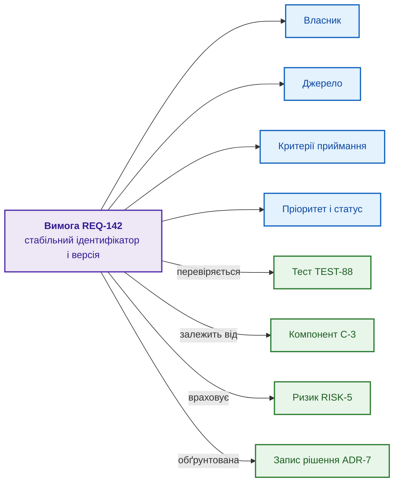
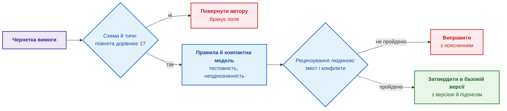
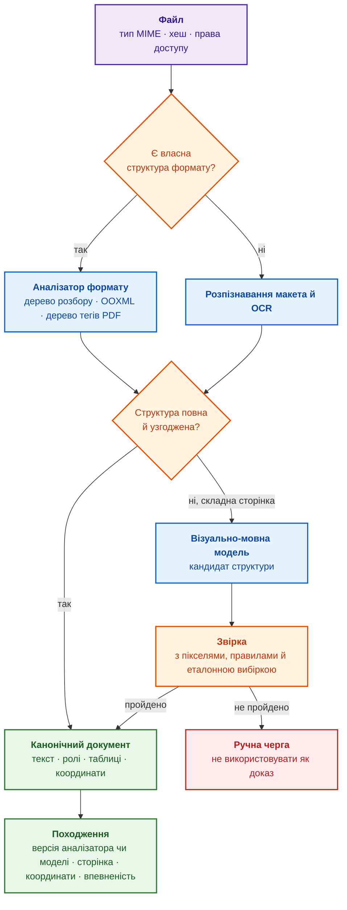
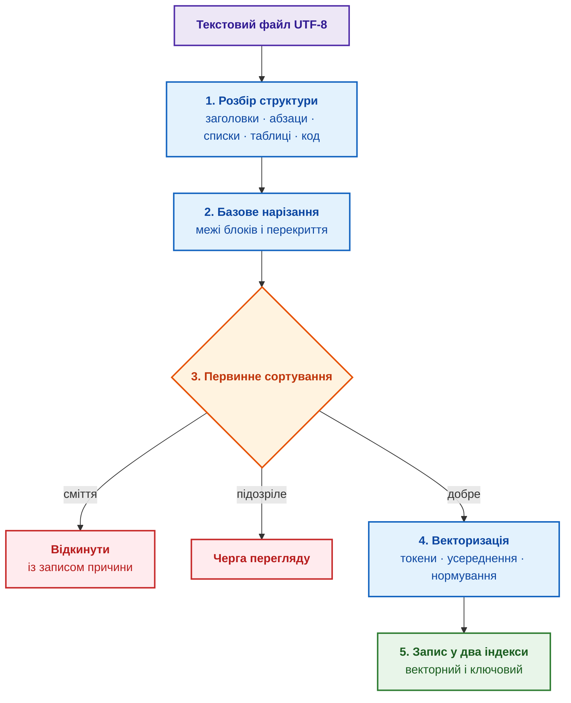
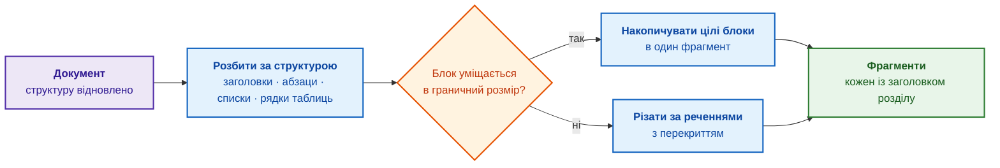
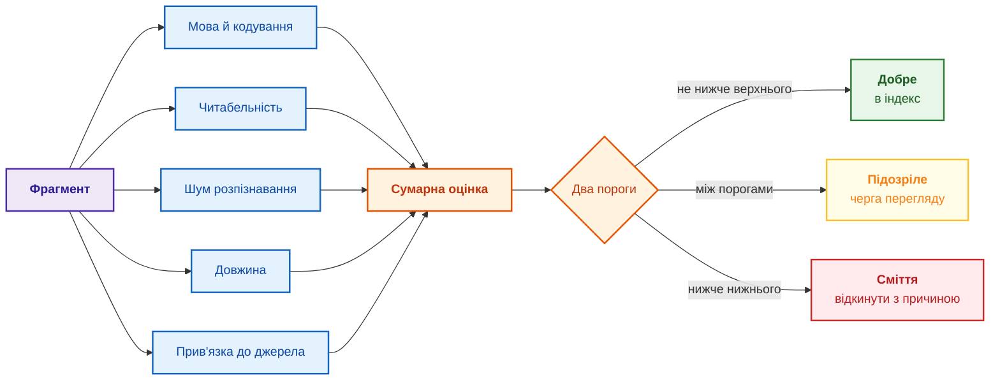
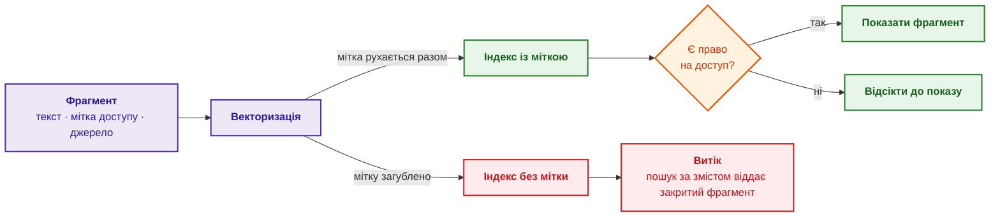
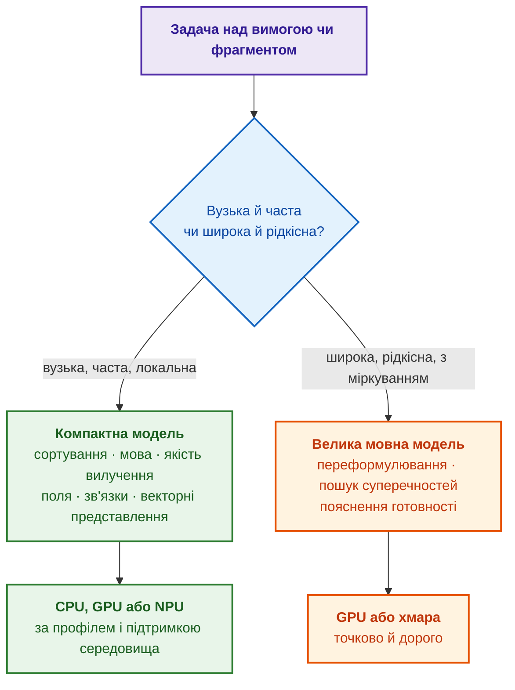

# Глава 8. Інженерні артефакти як дані експертної системи

> **Книга:** [Архітектура доказових експертних систем](README.md) · [Частина II: Математичний апарат та моделі знань](part-02-knowledge-models.md)  
> **Попередня глава:** [Глава 7. Типологія баз знань: правила, онтології, прецеденти та вектори](ch07-knowledge-base-typology.md)  
> **Наступна глава:** [Глава 9. Інженерний граф знань: простежуваність від вимог до апаратури](ch09-engineering-knowledge-graph-traceability.md)  
> **Зміст книги:** [README.md](README.md)  
> **Рівень:** базовий інженерний; псевдокод і код винесено в згорнуті блоки  
> **Очікувані результати:** описати вимогу, план чи ризик як версійований об'єкт даних; оцінити, скільки структури зберігає формат файла; пройти шлях від файла до фрагмента з походженням, перевіркою якості, векторним представленням і міткою доступу; обирати між правилом, компактною моделлю й великою мовною моделлю за виміряним результатом.

Перед засіданням наглядової ради проєкту менеджер збирає статус із трекера задач, системи керування тестуванням, бази вимог, чатів і таблиць, переносить зібране у звіт, а за два дні звіт уже застарів. Вимога «інформаційна система керування замовленнями має швидко реагувати на запити користувача» зрозуміла людині, але не відповідає на прості запитання: що означає «швидко», хто власник вимоги, які тести вимогу перевіряють і чи змінювалася вимога після затвердження базової версії. Мовна модель прочитає й перекаже такий текст, проте переказ не перетворює залежності на дані: інструмент не може детерміновано визначити заблоковані контрольні точки, обчислити покриття чи відтворити аналіз впливу зміни.

Мета глави: показати, що інженерний артефакт спершу має бути структурованим об'єктом даних, а вже потім документом чи звітом, і пройти шлях, яким сирий файл стає матеріалом для доказової експертної системи. Глава починає з моделі артефакта (вимога, план, ризик, контрольна точка), далі показує, як формат файла визначає, скільки структури збережеться, і розбирає конвеєр від файла до фрагмента з походженням, векторним представленням і міткою доступу. Попередні глави пояснили, чому корпоративна пам'ять потребує доказів ([Глава 5](ch05-triad-of-trust-and-corporate-memory.md)) і які бази знань використовують структуровані дані ([Глава 7](ch07-knowledge-base-typology.md)); як об'єкти зв'язуються в граф простежуваності, розповідає [Глава 9](ch09-engineering-knowledge-graph-traceability.md), а як будується повний конвеєр здобуття знань, [Глава 10](ch10-knowledge-acquisition-systems.md).

## Карта глави: проблема, метод і вимірювання

У стандартах і процесних моделях результати роботи називають робочими продуктами (*work products*): вимога, план, протокол тестування, запис рішення, доказовий пакет. Поруч існують робочі елементи (*work items*): задача, дефект, запит на зміну, у яких теж осідають рішення й контекст. Для експертної системи обидва види є артефактами, тобто об'єктами зі стабільним ідентифікатором, зв'язками, статусом і доказами. Таблиця зводить проблеми, які розв'язує глава, і для кожної називає метод, метрику, типову відмову й шлях виправлення.

| Проблема | Метод | Що вимірюють | Типова відмова | Шлях виправлення |
| --- | --- | --- | --- | --- |
| Вимога неповна або нечітка | схема об'єкта й контрольна точка якості | повнота полів, частка прийнятих вимог, дефекти після рецензування | перевірка приймає граматично чисту, але нетестовну вимогу | числові критерії й погодження людиною |
| Зв'язки існують лише в тексті | граф простежуваності | покриття вимог тестами й доказами | посилання існує, але веде на неактуальну версію | версійовані зв'язки й перевірка змісту зв'язку |
| Файл PDF або скан втрачає структуру | синтаксичний аналізатор, розпізнавання макета й символів, модель для документів | порядок читання, точність таблиць і формул, походження | візуально-мовна модель створює правдоподібний, але відсутній у джерелі текст | звірка з координатами, оцінка впевненості й ручна черга |
| Фрагмент не знаходиться за запитом | структурне нарізання й гібридний пошук | повнота й якість ранжування на перших позиціях, затримка | оптимізація лише косинусної подібності | ключовий і векторний пошук, злиття рангів, повторне ранжування |
| Закритий текст з'являється у відповіді | фільтр доступу до пошуку | нуль несанкціонованих видач у негативних тестах | права доступу перевіряють уже після пошуку | фільтрація кандидатів до ранжування |

Таблиця задає методологічну межу: твердження «модель запрацювала» не є критерієм готовності. Кожен статистичний крок потребує контрольної вибірки, метрики, порога приймання й безпечної поведінки, коли поріг не пройдено. Наступні розділи розбирають рядки таблиці по черзі, починаючи з того, чому вільного тексту недостатньо.

## Чому тексту недостатньо

Вимога у вільному тексті не дає детермінованих машинно-зчитуваних відповідей на запитання про власника, джерело, тести, зачеплені компоненти й актуальність. Поля можна вилучити правилами або моделлю, але вилучення є окремим перетворенням із похибкою, версією алгоритму й потребою перевірки. Тому навколо текстових вимог завжди виростає ручна праця: хтось веде окрему матрицю простежуваності (*traceability matrix*), хтось вручну звіряє тести з вимогами, хтось перед аудитом збирає докази з листування й старих версій документів.

Проєктні плани мають ту саму проблему. У складному апаратно-програмному чи регульованому проєкті артефактів багато: структура декомпозиції робіт (*Work Breakdown Structure*, WBS), графік, карта залежностей, запити на зміну, записи базових версій (*baselines*), план верифікації, тренди дефектів, статус постачальників, висновки аудиту, перелік перевірок готовності до випуску. Якщо всі артефакти живуть у документах, команда переходить від керування проєктом до ручної синхронізації документів. Аналіз впливу (*impact analysis*) теж залежить від дисципліни людей: після зміни вимоги платформа керування життєвим циклом застосунків (*Application Lifecycle Management*, ALM) або експертна система мала б показати зачеплені пакети робіт, тести, ризики й погодження, але текстовий документ зв'язків не виконує. Люди під тиском термінів рідко оновлюють три місця одночасно.

Підсумок розділу: текст зрозумілий людині, але не дає відтворюваних відповідей на структурні запити, а кожне автоматичне вилучення полів із тексту додає похибку. Вихід полягає в тому, щоб змінити роль документа.

## Артефакт як об'єкт даних, а не документ

У машинно-орієнтованому (*machine-first*) підході артефакт є структурованим об'єктом із полями, зв'язками й правилами. З об'єкта можна згенерувати PDF для перегляду, сторінку для зацікавлених сторін, панель для керівництва чи експорт для аудиторського пакета, тобто документ стає поданням (*view*), а не джерелом істини (*source of truth*). Якщо хтось змінює дату контрольної точки, змінюється об'єкт, а не рядок у презентації.

Розробка програмного забезпечення давно пройшла такий перехід: інфраструктура як код, політики як код і документація як код (текст під контролем версій із рецензуванням через запити на злиття й перевірками в конвеєрі) показують, що знімок екрана з конфігурацією не є джерелом істини. Керування проєктами повільніше доходить до тієї самої ідеї, але план, модель ризиків і визначення контрольної точки теж можуть бути структурованими артефактами. Практичний критерій простий: якщо зміна в артефакті має наслідки, інструмент керування вимогами, ризиками чи випуском повинен ці наслідки бачити. Якщо контрольну точку пересунули на два тижні, мають підсвітитися залежні постачання, точки випуску й зобов'язання перед замовником.

Великі мовні моделі (*large language models*, LLM) не скасували потреби в структурі, а змістили потребу. Природна мова стала зручним інтерфейсом: нею легко сформулювати намір, попросити чернетку вимоги чи обговорити варіант рішення. Але інтерфейс не є джерелом істини. Сформульоване з допомогою мовної моделі має стати структурованим об'єктом із власником, критеріями й зв'язками, інакше результат не пройде ні аналізу впливу, ні аудиту, ні перевірки покриття. Мовна модель здешевлює створення кандидата на об'єкт, але не прибирає перевірки полів, зв'язків і повноважень: формальні критерії однаково застосовують до тексту людини й до чернетки моделі.

Структурований об'єкт корисний не лише експертній системі: довідкова інформаційна система, консультаційний інтерфейс і система підтримки рішень теж отримують надійніший пошук, фільтрацію й аналіз впливу. Експертною система стає тоді, коли поверх фактів і зв'язків застосовує кодифіковані знання до конкретного випадку й показує доказовий ланцюжок висновку ([Глава 3](ch03-beyond-reference-information-systems.md)). Структура дає матеріал для міркування, але не замінює міркування. Найважливіший випадок структурування становлять вимоги.

## Вимога як структурований об'єкт

Структурована вимога є об'єктом з обов'язковими атрибутами:

- **власник** (*owner*): хто відповідає за зміст і актуальність вимоги;
- **джерело** (*source*): стандарт, замовник, регуляторний документ або рішення архітектора, з якого походить вимога;
- **критерії приймання** (*acceptance criteria*): як перевірити, що вимогу виконано;
- **пріоритет і статус**: важливість і стан життєвого циклу (чернетка, затверджено, змінено після базової версії, застаріло);
- **зв'язки**: інші вимоги, компоненти, тести, ризики й рішення, з якими пов'язана вимога.

Схема показує вимогу як вузол графа: у центрі вимога зі стабільним ідентифікатором, навколо поля, а стрілки ведуть до пов'язаних об'єктів.



Фіолетовий вузол є вимогою, сині вузли є атрибутами, зелені вузли є пов'язаними об'єктами: тестом, компонентом, ризиком і записом архітектурного рішення (*Architecture Decision Record*, ADR). Коли вимога має таку структуру, можна виконати запити «покажи всі затверджені вимоги без жодного тесту», «знайди вимоги, змінені після заморожування базової версії» чи «які вимоги залежать від компонента, сертифікацію якого ще не завершено». Над текстом такі запити потребують ручного читання або статистичного вилучення, а над графом об'єктів виконуються детерміновано.

Структура тримається на двох механізмах. Стабільний ідентифікатор не змінюється, коли вимогу переформульовують: тест посилається на вимогу, а не на конкретне формулювання, тож редагування тексту не рве ланцюжка. Версійність зберігає історію змін і знімки базових версій, тож на запитання «що саме затвердили у випуску 2.1» є відтворювана відповідь. Без двох механізмів структура розсиплеться після першого масштабного редагування, тому ідентичність і версійність об'єкта так само важливі, як поля. Наступний крок полягає в тому, щоб перевіряти якість вимог автоматично.

## Автоматична перевірка якості вимог

Коли вимога стає об'єктом, частину перевірки якості можна автоматизувати. Інструмент перевірки не замінює інженера-аналітика, але прибирає механічну роботу. Стандарт ISO/IEC/IEEE 29148 перелічує властивості якісної вимоги [[1]](#src-1), і чотири з властивостей добре піддаються автоматичній перевірці:

- **повнота**: вимога має власника, джерело й критерії приймання;
- **тестовність** (*testability*): для вимоги можна побудувати перевірку; формулювання «інтерфейс має бути зручним» одразу позначають як проблемне;
- **однозначність**: немає слів-пасток («швидко», «надійно», «за потреби») без числових порогів;
- **несуперечність**: вимога не конфліктує з іншою, наприклад дві вимоги не задають різних граничних значень того самого параметра.

Найпростіша числова оцінка є структурною повнотою вимоги:

```math
C_{\text{req}}(r)=\frac{1}{m}\sum_{j=1}^{m} I_j(r)
```

Величини структурної повноти:

- $r$ є вимогою, $`m>0`$ є кількістю обов'язкових полів схеми, а $j$ позначає поле;
- $I_j(r)$ дорівнює 1, якщо поле $j$ заповнене значенням правильного типу, і 0 інакше;
- $\sum_{j=1}^{m}$ додає результати перевірок усіх полів, а ділення на $m$ обчислює їхню частку.

Результат лежить між 0 і 1: за чотирьох заповнених полів із п'яти $C_{\text{req}}=4/5=0{,}8$. Заповнене поле ще не є якісним полем: запис `owner: TBD` формально існує, але не називає відповідального. Тому контрольну точку якості (*quality gate*) записують як добуток незалежних перевірок:

```math
Q_{\text{gate}}(r)=\mathbf{1}[C_{\text{req}}(r)=1]\cdot\mathbf{1}[T(r)=1]\cdot\mathbf{1}[A(r)=1]\cdot\mathbf{1}[S(r)=1]
```

Перевірки контрольної точки:

- $r$ є вимогою, а $C_{\text{req}}(r)=1$ означає, що всі обов'язкові поля заповнено коректно;
- $\mathbf{1}[\cdot]$ дорівнює 1, якщо умова в дужках істинна, і 0 інакше;
- $T(r)$ позначає тестовність, $A(r)$ позначає відсутність відомої неоднозначності, а $S(r)$ позначає несуперечність із чинною базовою версією;
- знак множення вимагає, щоб кожна блокувальна перевірка дорівнювала 1.

Отже, $Q_{\text{gate}}(r)$ набуває лише значень 0 і 1 та дорівнює 1, коли пройдено всі умови. Статистична модель може оцінити $T$ або запропонувати проблему, але контрольна точка не повинна мовчки замінювати оцінкою моделі інженерне рішення. Схема показує порядок перевірок.



Сині блоки є перевірками, червоні блоки повертають вимогу на доопрацювання, зелений блок фіксує вимогу в базовій версії. Дефекти вимог ловлять під час написання, а не на аудиті чи в тестуванні.

Єдиного універсального інструмента для якості вимог немає, тож перевірку складають шарами. Статичний аналізатор прози [Vale](https://github.com/vale-cli/vale) з власними українськими правилами ловить слова-пастки й порушення шаблону просто в конвеєрі безперервної інтеграції. Бібліотека мовою Go [prose](https://github.com/jdkato/prose) дає токенізацію, поділ на речення, розмітку частин мови й розпізнавання іменованих сутностей (*named entity recognition*, NER) з точними зміщеннями в тексті, але навчені моделі бібліотеки англомовні, тож переносити оцінки на українські вимоги не можна. Для виконання нейронних моделей у Go можна оцінити [Cybertron](https://github.com/nlpodyssey/cybertron) або [Hugot](https://github.com/knights-analytics/hugot) поверх ONNX Runtime; сумісність архітектури моделі, токенізатора й апаратного прискорення перевіряють тестом. Модель [GLiNER](https://github.com/urchade/GLiNER) корисна як кандидат для гнучкого вилучення сутностей, але розпізнавання сутностей не замінює вилучення відношень (*relation extraction*) і перевірки схеми. Комерційні інструменти оцінюють тим самим протоколом, не вважаючи закриту оцінку інструмента доказом якості.

Помічник на основі великої мовної моделі може запропонувати чіткіше формулювання, підказати відсутні критерії приймання, виявити можливу суперечність із сусідньою вимогою чи запропонувати тест для критерію. Пропозиції помічника лишаються пропозиціями: рішення ухвалює людина, а зміна фіксується як зміна об'єкта з історією. Підсумок розділу: структура робить якість вимоги вимірюваною, але остаточну оцінку змісту дає людина. Найсильніший аргумент за структуру, проте, не перевірка якості, а простежуваність.

## Простежуваність як головна причина структури

У регульованих дослідженнях і розробці треба показати неперервний ланцюжок: потреба зацікавленої сторони, вимога системного рівня, вимога до програмного забезпечення, проєктне рішення, тест, доказ виконання. Стандарт ISO/IEC/IEEE 29148 вимагає двобічної простежуваності вимог [[1]](#src-1). Якщо будь-яка ланка існує лише як текст, ланцюжок рветься й відновлюється вручну.

Структура робить ланцюжок навігаційним. Аналіз впливу стає швидким і відтворюваним настільки, наскільки актуальний граф: після зміни вимоги платформа показує зачеплені тести, ризики, рішення й контрольні точки випуску; після провалу тесту видно непідтверджені вимоги; після оновлення стандарту знаходяться пов'язані заходи контролю. Механізм зводиться до обходу графа зв'язків і перевірки цілісності, тож пропущений чи хибний зв'язок дає пропущений чи хибний вплив. Першу діагностичну метрику графа легко пояснити без теорії графів:

```math
\mathrm{Coverage}_{R\rightarrow T}=\frac{\left|\left\{r\in R:\ \exists\,t\in T,\ (r,t)\in E_{RT}\right\}\right|}{|R|}
```

Позначення покриття:

- $R$ є множиною чинних вимог, $T$ є множиною тестів, а $E_{RT}$ є множиною підтверджених зв'язків «вимога перевіряється тестом»;
- $r$ позначає одну вимогу, $t$ один тест, а $(r,t)\in E_{RT}$ означає, що підтверджений зв'язок поєднує саме цю пару;
- $\exists$ означає «існує хоча б один», а $|\cdot|$ є кількістю елементів множини;
- чисельник рахує вимоги з принаймні одним тестом, а знаменник рахує всі чинні вимоги.

За непорожньої множини $R$ покриття лежить між 0 і 1: за умовних чисел, якщо зі 100 чинних вимог хоча б один тест мають 92, покриття дорівнює $92/100=0{,}92$. Для порожньої множини вимог частка не визначена. Це індикатор прогалини, а не доказ якості: застарілий або формальний тест теж збільшить чисельник. Тому додатково перевіряють версії обох вузлів, статус тесту, тип зв'язку й наявність виконаного результату. Проблема «зв'язок є, доказу немає» розв'язується не черговим векторним представленням, а обмеженнями графа й правилами цілісності, які докладно розбирає [Глава 9](ch09-engineering-knowledge-graph-traceability.md).

## Плани, ризики й контрольні точки як об'єкти

Те, що працює для вимог, працює для всього проєктного плану. У світі документів план випуску є таблицею з контрольними точками, відповідальними й датами плюс кілька абзаців про ризики. У машинно-орієнтованому світі план випуску складається з об'єктів.

Контрольна точка має критерії входу й виходу, пов'язані з вимогами, тестами чи погодженнями. Пакет робіт має залежності й розподіл потужностей. Ризик має тригер, оцінку ймовірності й наслідків, заходи зниження, відповідального й правило ескалації. Контрольна точка випуску має машинно-перевірювані умови: немає відкритих критичних дефектів, усі обов'язкові тести пройдено, усі змінені вимоги підтверджено, усі дозволи на виняток (*waivers*) затверджено, перевірку безпеки завершено. Якщо умову не виконано, платформа керування випуском одразу показує проблему готовності, а не чекає, поки менеджер оновить звіт.

З тих самих об'єктів генерують щотижневий статус, але звіт відображає стан, а не створює стан. Якщо звіт красивий, а об'єкти під звітом червоні, панель готовності показує червоний статус, і команда захищена від презентаційного оптимізму. Модель об'єктів готова; тепер треба з'ясувати, скільки структури доживає до експертної системи, коли об'єкт лежить у файлі.

## Формат носія визначає, скільки структури збережеться

Кожен артефакт зберігається у файлі певного формату, і формат визначає, скільки структури доживе до індексатора, експертної системи чи аудиторського конвеєра. Той самий план у форматі розмітки й у вигляді сканованого PDF є для машини двома різними джерелами. Формати зручно впорядкувати за тим, наскільки явно записано структуру:

- **текст і розмітка** (*plain text, markup*): Markdown, HTML, reStructuredText, AsciiDoc, а в інженерії формати на основі XML (*eXtensible Markup Language*), наприклад обмінний формат вимог ReqIF (*Requirements Interchange Format*) [[2]](#src-2). Структуру записано прямо в тексті: заголовок позначено символом, таблицю роздільниками, зв'язок ідентифікатором. Файл можна порівнювати порядково, тримати під контролем версій і адресувати до рядка;
- **структуровані двійкові формати** (*structured binary*): офісні файли .docx і .xlsx є ZIP-архівами з XML-частинами формату Office Open XML (OOXML). Структура є, але схована за упаковкою й стилями, і зв'язок між стилем і змістом не завжди однозначний;
- **формати верстки** (*layout-oriented*): звичайний, особливо нетегований PDF описує розташування тексту й графіки на сторінці, тож порядок читання, межі таблиць та ієрархію заголовків доводиться відновлювати. Тегований PDF (*tagged PDF*) має дерево логічної структури, а стандарт PDF/UA задає вимоги до семантичних тегів і порядку читання [[3]](#src-3); проте автоматично створене дерево тегів буває неповним і потребує перевірки;
- **растрові зображення** (*raster scans*): растр без прихованого текстового шару містить лише пікселі, тож кожен символ спершу розпізнають оптично, і кожне розпізнавання може помилитися.

Закономірність проста: чим явніше записано структуру, тим дешевша й надійніша обробка й тим точніше можна відтворити, звідки взято фрагмент і як фрагмент вилучено. Розмітку синтаксичний аналізатор читає майже без втрат, структуровані двійкові формати з помірними зусиллями, верстку з втратами й евристиками, растр найдорожче й з ризиком помилки в кожному символі.

Окремий клас становлять формати серіалізації, створені для обміну структурованими даними між програмами. XML описує дані вкладеними тегами (`<owner>Storage</owner>`), але багатослівний. JSON (*JavaScript Object Notation*) узяв синтаксис об'єктів мови JavaScript і став звичним форматом обміну між сервером і браузером [[4]](#src-4). YAML (*YAML Ain't Markup Language*) тримає структуру відступами, тож людині легко читати й писати YAML руками, і тому YAML часто використовують для конфігурацій [[5]](#src-5). У трьох форматах ключ прямо називає поле (`owner`, `acceptance_criteria`), тож формати природно зберігають «артефакт як об'єкт». Є три застороги:

1. запис перевіряють схемою до індексації: JSON Schema [[6]](#src-6), схема XML (*XML Schema Definition*, XSD) або мова обмежень форми SHACL [[7]](#src-7) відсікають хибні типи, пропущені поля й заборонені зв'язки;
2. YAML читають безпечним синтаксичним аналізатором із визначеною версією специфікації й політикою щодо дублікатів ключів, псевдонімів (*aliases*) і нестандартних типів, щоб конфігурація не стала каналом виконання коду;
3. сиру серіалізацію не варто сліпо перетворювати на вектор: службовий синтаксис додає шум, хоча змістовні назви полів іноді допомагають. На власних запитах порівнюють щонайменше два подання (сирий запис і канонічно відтворений текст), а структурні поля зберігають як метадані й фільтри. Нарізають файл за об'єктами (запис масиву, елемент XML, блок ключів разом зі шляхом), а не через фіксовану кількість символів.

Підсумок розділу: формат є питанням доказовості, а не естетики. Звідси три правила: зберігати джерело у форматі з явною структурою (текст під контролем версій замість експорту в PDF, ReqIF замість роздруківки), позначати спосіб вилучення кожного фрагмента, бо фрагмент із розмітки, з відновленої верстки й після розпізнавання мають різний клас довіри, і нести оцінку якості вилучення разом із фрагментом. Як саме машина дістає структуру з файлів різних форматів, показує наступний розділ.

## Первинна обробка: від байтів до канонічного документа

Шкала форматів є також шкалою зусиль. Два полюси шкали показують різницю найкраще: розмітка, де структура на поверхні, і скан, де структуру відновлюють із пікселів.

**Розмітка.** Синтаксичний аналізатор (*parser*) перетворює текст із розміткою на абстрактне синтаксичне дерево (*abstract syntax tree*, AST). Ідею показує простий прохід рядками, хоча повна реалізація специфікації CommonMark [[8]](#src-8) враховує блоки коду, вкладені списки й вирівнювання таблиць.

<details>
<summary>Псевдокод: розбір розмітки в дерево</summary>

```text
прочитати файл як рядок UTF-8
для кожного рядка:
    якщо рядок починається з '#'    -> вузол «заголовок», рівень = кількість '#'
    якщо рядок має вигляд '| ... |' -> рядок таблиці
    якщо рядок починається з '- '   -> елемент списку
    якщо рядок містить '[текст](ціль)' -> зв'язок (текст, ціль)
зібрати вузли в дерево за рівнями заголовків
```

</details>

На виході є заголовки, таблиці, списки й, головне, явні зв'язки з ідентифікаторами: нічого не треба вгадувати. Розбір розмітки є передньою частиною компілятора: лексичний аналізатор ділить символи на токени, а синтаксичний аналізатор за формальною граматикою будує дерево. Для форматів із граматикою розбір детермінований і відтворюваний, і в цьому ще один аргумент за структуровані формати. Там, де граматика закінчується, закінчується й транслятор: координати й пікселі PDF чи скану не описує жодна формальна мова, тож нижче на шкалі структуру вже відновлюють евристиками й розпізнаванням, з ймовірністю помилки, якої компілятор не припускає.

**Проміжні формати.** У нетегованому PDF символи прив'язані до геометрії сторінки, тож порядок читання, колонки й межі таблиць відновлюють евристиками; тегований PDF спершу читають за деревом структури, але перевіряють узгодженість дерева з видимою сторінкою. Формат .docx надійніший, бо є пакетом XML-частин, однак семантика теж залежить від дисципліни авторів: якщо заголовок зроблено більшим шрифтом, а не стилем заголовка, роль тексту доводиться вгадувати.

**Растр.** Скан проходить найдовший і найкрихкіший шлях: вирівнювання нахилу, бінаризацію, розбиття сторінки на текст, таблиці й рисунки та оптичне розпізнавання символів (*optical character recognition*, OCR).

<details>
<summary>Псевдокод: розпізнавання скану</summary>

```text
зображення -> вирівнювання нахилу -> бінаризація
розбиття сторінки: де текст, де таблиця, де рисунок
для кожної текстової області: OCR -> символи + впевненість від 0 до 1
якщо середня впевненість нижча за поріг -> у чергу ручної перевірки
```

</details>

Помилка можлива в кожному символі, тож впевненість розпізнавання несуть далі як метадані: фрагмент із низькою якістю розпізнавання не можна мовчки цитувати як доказ.

Станом на 2026 рік конвеєр інтелектуальної обробки документів (*document AI*) доцільно будувати каскадом: від найдешевшого й найбільш відтворюваного методу до статистичного запасного варіанта.

| Вхід і проблема | Перший метод | Коли підключати машинне навчання | Критерій приймання |
| --- | --- | --- | --- |
| Markdown, HTML, XML, ReqIF | синтаксичний аналізатор формату й дерево розбору | майже ніколи для синтаксису; модель лише для змістовних полів | дерево коректне, посилання й ідентифікатори збережено |
| .docx, .xlsx, .pptx | аналізатор OOXML; для масового завантаження Apache Tika [[9]](#src-9) або Docling [[10]](#src-10) | коли стилі не передають ролей тексту | заголовки, таблиці, примітки й зв'язки звірено з еталоном |
| тегований PDF | дерево структури й геометрія сторінки | якщо теги відсутні або суперечать сторінці | правильний порядок читання й семантичні ролі |
| складний PDF або скан | розпізнавання макета й OCR, наприклад Docling або PP-StructureV3 [[11]](#src-11) | візуально-мовна модель для формул, таблиць, графіків і складної верстки | частка помилкових символів і слів, точність клітинок таблиць, формул і порядку читання |
| критичний доказ | детермінований аналізатор і координати джерела | модель створює лише кандидата | підтвердження людиною або подвійна незалежна перевірка |

Моделі з урахуванням макета, як LayoutLMv3 [[12]](#src-12), поєднують текст, зображення й координати, а сучасні візуально-мовні моделі (*vision-language models*, VLM) для документів одразу повертають Markdown або JSON. Такі моделі краще за схему «OCR, потім суцільний текст» справляються з багатоколонковими сторінками, таблицями й формулами, але створюють нову проблему: генеративна модель здатна нормалізувати або вигадати символ. Тому вихід моделі стає доказом лише разом з ідентифікатором джерела, номером сторінки, прямокутником координат, версією моделі й статусом перевірки. Походження кожного перетворення зручно записувати за онтологією PROV-O [[13]](#src-13). Схема зводить конвеєр розбору.



Сині блоки обробляють файл, помаранчеві блоки перевіряють результат, зелені блоки є канонічним документом із походженням, червоний блок є ручною чергою. Візуально-мовна модель вмикається лише тоді, коли дешевші методи не дали повної структури, і вихід моделі не стає доказом без звірки.

## Від файла до фрагмента: базове нарізання

Канонічний документ ще не потрапляє в пошук цілим. Пошуковий шар працює з фрагментами (*chunks*), тобто невеликими самодостатніми частинами тексту, за якими виконується пошук і які перетворюються на векторні представлення. Розділ показує конвеєр оглядово; як будується повна система здобуття знань, що знаходить, класифікує, усуває дублікати, індексує потік файлів і не пропускає застарілого чи забороненого, розбирає [Глава 10](ch10-knowledge-acquisition-systems.md).

Постає запитання: якщо розбір структури є компілятором, чому б не «скомпілювати» й зміст вимоги в однозначне машинне подання замість нарізання й векторизації? Тому що на вході тепер людська проза без граматики, яку можна передати аналізатору: зміст речення «відповідь має бути швидкою» не виводиться із синтаксису так, як значення програми. Компілятор перекладає одну строгу мову в іншу зі збереженням точної семантики, а конвеєр знань проєктує зміст у простір, де близькі за змістом фрагменти лежать поруч, щоб фрагменти можна було знаходити. Тому інструмент інший: статистичне векторне представлення з порогами, підозрілими випадками й переглядом людиною. Схема показує п'ять кроків від файла до записаного знання.



Сині блоки є кроками обробки, помаранчевий ромб сортує фрагменти, червоні блоки відкидають або відкладають фрагмент, зелений блок є записом в індекси. Цілий документ не індексують з двох причин. Модель векторних представлень (*embedding model*) обмежує довжину входу й стосторінкову специфікацію одним шматком просто не побачить. Крім того, вектор усього документа стає усередненим і погано влучає в конкретне запитання, тоді як дрібніший фрагмент дає точніший пошук.

Базове нарізання (*basic chunking*) ріже текст не через кожні N символів, а спершу за структурними межами (заголовок, абзац, пункт списку, рядок таблиці) і лише потім обмежує розмір. Завеликий структурний блок ділять на частини з невеликим перекриттям (*overlap*), щоб думка не обірвалася на стику. Кількість фрагментів для одного блоку дає формула:

```math
N(L,c,o)=1+\left\lceil\frac{\max(0,\ L-c)}{c-o}\right\rceil
```

У формулі нарізання:

- $L$ є довжиною блоку в токенах, $c$ є граничним розміром фрагмента, а $o$ є кількістю токенів перекриття, де $0\le o<c$;
- $\max(0,L-c)$ є довжиною понад межу першого фрагмента, а $c-o$ є кроком між початками сусідніх фрагментів;
- $\lceil z\rceil$ означає округлення числа $z$ угору до цілого, а доданок 1 враховує перший фрагмент.

Результат є цілим числом не менше 1: блок, коротший за $c$, дає один фрагмент, а за умовних значень $L=1000$, $c=400$, $o=80$ маємо $1+\lceil600/320\rceil=3$ фрагменти. Більше перекриття зменшує ризик втрати контексту на межі, але збільшує індекс, затримку й кількість майже однакових фрагментів серед перших результатів. Тому $c$ і $o$ обирають на наборі реальних запитів за повнотою пошуку й витратами, а межа вимоги, таблиці чи розділу має пріоритет над формулою. Схема показує алгоритм.



Цілі блоки накопичуються в один фрагмент, доки вміщаються, а завеликий блок ріжуть за межами речень. Псевдокод і приклад розділу специфікації наведено нижче.

<details>
<summary>Псевдокод базового нарізання й приклад розділу специфікації</summary>

```text
функція базове_нарізання(документ, граничний_розмір, перекриття):
    блоки = розбити_за_структурою(документ)
    фрагменти = []
    буфер = ""
    для кожного блоку в блоки:
        якщо довжина(буфер) + довжина(блок) <= граничний_розмір:
            буфер = буфер + блок
        інакше:
            якщо буфер не порожній:
                фрагменти.додати(буфер)
            якщо довжина(блок) > граничний_розмір:
                для частини в різати_за_реченнями(блок, граничний_розмір, перекриття):
                    фрагменти.додати(частина)
                буфер = ""
            інакше:
                буфер = блок
    якщо буфер не порожній:
        фрагменти.додати(буфер)
    повернути фрагменти
```

```text
3.2 Електроживлення
Модуль має живитися від 24 В постійного струму.
Допустиме відхилення напруги: ±10 %.
Споживаний струм у режимі очікування не перевищує 50 мА.

3.3 Робоча температура
Діапазон робочих температур: від -20 °C до +60 °C.
```

</details>

Нарізання за заголовками дає два охайні фрагменти, «3.2 Електроживлення» і «3.3 Робоча температура», а не один склеєний шматок і не обірване «не переви» на двохсотому символі. Кожен фрагмент зберігає заголовок розділу як контекст, тож пошуковий шар згодом покаже, що відповідь узято саме з пункту 3.2. Семантичне нарізання за межами думок і прийом батьківського документа належать до розширеного нарізання, яке розбирає [Глава 10](ch10-knowledge-acquisition-systems.md). Базове правило звучить так: різати за структурою, не рвати думки, нести контекст разом із фрагментом. Проте не кожен отриманий фрагмент вартий індексації.

## Первинне сортування фрагментів: знання чи сміття

Після нарізання кожен фрагмент проходить первинне сортування (тріаж, *triage*): швидку перевірку за формальними сигналами якості, яка вирішує, чи індексувати фрагмент. Сортування не розуміє змісту, а оцінює сигнали:

- **мова й кодування:** мова визначається впевнено, UTF-8 коректний, немає поламаних послідовностей байтів;
- **читабельність:** частка справжніх слів проти випадкових наборів символів, частка розділових знаків і цифр (ознака зламаної таблиці чи сміття після OCR);
- **шум розпізнавання:** поодинокі літери, плутанина «l/1/I», «rn» замість «m», розірвані слова, латинські літери посеред кириличного слова;
- **довжина:** фрагмент із двох слів майже не несе знання, надто довгий фрагмент міг злитися помилково;
- **прив'язка до джерела:** посилання на документ, розділ і сторінку, без якого фрагмент не може бути доказом.



Сині блоки є сигналами, помаранчеві блоки зводять сигнали в оцінку й порівнюють оцінку з двома порогами, а кольорові кошики є рішеннями. У загальному вигляді оцінку записують так:

```math
S_{\text{triage}}(x)=\sum_i w_i\,q_i(x)-\sum_j v_j\,n_j(x),\qquad w_i,\ v_j\ge 0
```

Складники оцінки:

- $x$ є фрагментом, $q_i(x)\in[0,1]$ є нормованими корисними ознаками, а $n_j(x)\in[0,1]$ є нормованими ознаками шуму;
- $i$ та $j$ індексують відповідні ознаки, а $w_i\ge0$ і $v_j\ge0$ є вагами їхнього впливу;
- перша сума додає зважені корисні ознаки, друга віднімає зважені ознаки шуму.

Оцінка лежить між $-\sum_j v_j$ і $\sum_i w_i$. Два пороги дають три рішення: за $S\ge\tau_{\text{accept}}$ фрагмент індексують, за $S<\tau_{\text{reject}}$ відхиляють із причиною, а між порогами фрагмент перевіряє людина. Проміжна зона не маскує невпевненості під бінарну істину. Ваги й пороги підбирають на розміченій вибірці, окремо контролюючи хибне відкидання корисних фрагментів (шкодить повноті корпусу) і хибне приймання сміття (шкодить надійності цитування).

<details>
<summary>Приклад мовою Go: первинне сортування чистого фрагмента й фрагмента після OCR</summary>

Програма є повною й запускається командою `go run main.go`. Цілочислові бали є навчальним варіантом формули $S_{\text{triage}}$, а не готовою моделлю: слово з кириличними й латинськими літерами одночасно програма вважає шумом розпізнавання.

```go
package main

import (
	"fmt"
	"strings"
	"unicode"
	"unicode/utf8"
)

// Fragment є фрагментом тексту з посиланням на джерело.
type Fragment struct {
	Text   string
	Source string
}

// mixedScript повідомляє, чи містить слово одночасно кириличні й латинські літери.
func mixedScript(word string) bool {
	var cyr, lat bool
	for _, r := range word {
		switch {
		case unicode.Is(unicode.Cyrillic, r):
			cyr = true
		case unicode.Is(unicode.Latin, r):
			lat = true
		}
	}
	return cyr && lat
}

// triage повертає бали, кількість чистих слів і кошик фрагмента.
func triage(f Fragment) (score, clean, total int, verdict string) {
	if utf8.ValidString(f.Text) {
		score += 2
	}
	words := strings.Fields(f.Text)
	total = len(words)
	for _, w := range words {
		if !mixedScript(w) {
			clean++
		}
	}
	if total > 0 && float64(clean)/float64(total) > 0.9 {
		score += 3
	}
	if f.Source != "" {
		score += 2
	}
	if total >= 8 && total <= 300 {
		score++
	}
	switch {
	case score >= 7:
		verdict = "добре: в індекс"
	case score >= 4:
		verdict = "підозріле: черга перегляду"
	default:
		verdict = "сміття: відкинути з причиною"
	}
	return score, clean, total, verdict
}

func main() {
	fragments := []Fragment{
		{"3.2 Електроживлення. Модуль має живитися від 24 В постійного струму, допустиме відхилення ±10 %.", "spec-power.md#3.2"},
		{"3.2 Eлeктpoживлeння Moдyль мaє живи тися вiд 24В пocт. cтpyмy ±1O% rn", "scan-power.pdf#p4"},
	}
	for _, f := range fragments {
		score, clean, total, verdict := triage(f)
		fmt.Printf("%d балів, чистих слів %d з %d: %s\n", score, clean, total, verdict)
	}
}
```

Програма друкує:

```text
8 балів, чистих слів 14 з 14: добре: в індекс
5 балів, чистих слів 6 з 12: підозріле: черга перегляду
```

У другому фрагменті латинські «e», «p», «o», «y», «a», «i», «c» підмішано в кириличні слова, тож половина слів має змішане письмо. Фрагмент має джерело, тому не потрапляє у сміття, але й не потрапляє в індекс без перегляду людиною.

</details>

Перший фрагмент, вилучений із розмітки, проходить усі перевірки й потрапляє в індекс. Другий фрагмент є тим самим текстом після поганого розпізнавання скану: латиниця в кириличних словах, «1O» замість «10», розірвані слова й зайве «rn». Такий фрагмент не повинен мовчки потрапити в індекс, інакше пошуковий помічник упевнено процитує сміття. Фрагмент із розмітки й фрагмент після розпізнавання мають різний клас довіри ще до того, як людина прочитає текст.

Сигнали залежать від мови: те, що в англійській виглядає шумом, в українській із багатою словозміною буває нормою, тож словники й пороги налаштовують окремо. Окремий випадок становлять щільні табличні й параметричні фрагменти на кшталт «24 В; ±10 %; 50 мА»: у таких фрагментах мало слів і багато цифр, тож наївне правило «менше цифр означає краще» занизить оцінку саме структурованим інженерним даним. Для таблиць потрібне окреме правило, яке не штрафує за щільність чисел, а перевіряє цілісність таблиці й одиниць вимірювання.

Первинне сортування є класичною роботою для правил або компактного класифікатора: рішення вузьке, однотипне й повторюється на кожному фрагменті. Генеративна мовна модель може допомогти розмітити початкову вибірку чи розібрати неоднозначні випадки, але пропускати через генеративну модель кожен фрагмент варто лише після виміряного приросту точності й повноти, бо затримка, ціна й нестабільність відповіді можуть переважити користь. Фрагмент, що пройшов сортування, рухається до векторизації.

## Векторизація й два індекси

Векторизація перетворює текст фрагмента на векторне представлення (*embedding*), тобто список чисел, який відображає зміст фрагмента. Щоб зрозуміти векторизацію, спершу треба зрозуміти, з чим працює модель.

### Що таке токен

Модель не бачить ні літер, ні слів у звичному вигляді. Вхід моделі є послідовністю токенів (*tokens*), а кожен токен є номером у заздалегідь складеному словнику. Для машини текст є не рядком символів, а списком цілих чисел.

Сучасні моделі застосовують підслівну токенізацію (*subword tokenization*): часте слово лишається одним токеном, а рідкісне чи довге слово розпадається на кілька частин. Для української мови з багатою словозміною такий поділ доречний: «живлення», «живленню», «живленням» можуть мати спільну основу-підслово, а закінчення стає окремим токеном. Словник лишається компактним, а незнайоме слово збирається з відомих частин.


Поділ на підслова й номери умовні: кожен токенізатор має власний словник. Модель замінює номер на рядок чисел зі своєї таблиці, враховує контекст сусідніх токенів і лише потім збирає з усіх токенів один вектор фрагмента.

### Від токенів до вектора фрагмента

Модель векторних представлень відображає фрагмент у точку багатовимірного простору так, що близькі за змістом тексти лежать поруч. «Напруга живлення 24 В» і «живиться постійним струмом 24 вольти» стануть близькими векторами, хоча спільних слів майже немає: так працює семантичний пошук за змістом, а не за точним словом. Сучасні моделі векторних представлень речень навчають так, щоб косинусна подібність відображала близькість змісту; класичним прикладом є Sentence-BERT Нільса Раймерса й Ірини Гуревич [[14]](#src-14). Вектор фрагмента часто отримують усередненням контекстних векторів токенів із маскою (*masked mean pooling*) і нормуванням довжини до одиниці; формули усереднення й косинусної подібності наведено в [Главі 7](ch07-knowledge-base-typology.md), а контрастне навчання векторних представлень пояснює [Глава 6](ch06-applied-mathematics-for-expert-systems.md). Частина моделей бере спеціальний токен-агрегатор або останній токен, а моделі, навчені за інструкціями, чутливі до префікса завдання. Висока косинусна подібність означає близькість у просторі конкретної моделі, а не логічну істинність і не дозвіл на доступ.

Векторизацію виконує переважно спеціалізований кодувальник (*encoder*). Генеративна мовна модель теж може дати приховані представлення, але звичайний режим генерації не оптимізований під масовий пошук і коштує дорожче. Менша модель не є автоматично кращою: модель перевіряють на власній мові, домені й типах запитів. Набори тестів MTEB [[15]](#src-15) і багатомовний MMTEB [[16]](#src-16) корисні як початковий фільтр, але остаточний вибір визначають повнота й якість ранжування, затримка й пам'ять на власному корпусі, зокрема на українських і змішаних запитах.

Готовий вектор записують разом із текстом і метаданими у два індекси одночасно: векторний індекс для пошуку за близькістю змісту й ключовий індекс BM25 (*Best Matching 25*) для точного пошуку за словами, кодами й ідентифікаторами вимог, які вектор може розмити.

<details>
<summary>Псевдокод: запис фрагмента у сховище</summary>

```text
запис_у_сховище(
    id      = фрагмент.id,                # стабільний ідентифікатор
    текст   = фрагмент.текст,
    вектор  = вектор,                     # векторний індекс, косинусна подібність
    ключі   = токени_для_bm25(фрагмент),  # ключовий індекс
    джерело = фрагмент.посилання,         # документ, розділ, версія
    доступ  = фрагмент.мітка_доступу,     # мітка доступу рухається разом із фрагментом
    якість  = фрагмент.оцінка_сортування
)
```

</details>

Два індекси закривають слабкості один одного: вектор ловить перефразування й синоніми, але плутається на точних кодах і артикулах, а ключовий пошук точний на словах, але сліпий до синонімів. Функцію BM25 Стівена Робертсона й Уго Сарагоси [[17]](#src-17) і злиття рангів Гордона Кормака та співавторів [[18]](#src-18), яке поєднує два списки без зведення різних шкал оцінок, пояснює [Глава 6](ch06-applied-mathematics-for-expert-systems.md). Після злиття перших кандидатів може перевпорядкувати модель повторного ранжування (*reranker*) на основі крос-кодувальника (*cross-encoder*). Увесь каскад працює після попереднього обмеження доступу й версії, а не отримує закритих кандидатів у надії відфільтрувати кандидатів наприкінці.

Для української мови є окрема засторога: ключовий пошук без нормалізації шукає точні словоформи, тож «напруги», «напрузі» й «напругою» для індексу є трьома різними рядками. Лематизація (*lemmatization*) зводить форми слова до словникової форми («напруга»), і пошук бачить форми як одне слово. Нормалізацію перевіряють порівнянням на доменних запитах: для кодів, скорочень і назв компонентів агресивна нормалізація іноді шкодить, тож точне поле зберігають паралельно.

### Мітка доступу рухається разом із фрагментом

Фрагмент несе не лише текст: крізь увесь конвеєр разом із фрагментом рухаються мітка доступу, клас чутливості й посилання на джерело. Нехай абзац закритого договору має мітку «обмежений доступ». Якщо на кроці векторизації мітка загубиться, вектор ляже в індекс без обмежень, і користувач без прав на буденний запит «яка неустойка за прострочення» отримає саме закритий абзац, знайдений за змістом. Витік стається навіть тоді, коли ніхто не просить цитувати файл дослівно.



Зелений шлях зберігає мітку й відсікає заборонене до показу, червоний шлях губить мітку й призводить до витоку. Мітка доступу лишається прикріпленою до фрагмента на вході й на виході конвеєра, а пошук відсікає заборонене ще до ранжування; як мітка переходить на висновки й пояснення, пояснює [Глава 2](ch02-epistemology-of-machine-knowledge.md).

### Як довести, що пошук справді покращився

Косинусна подібність окремої пари не відповідає на запитання, чи покращився пошук. Потрібен набір реальних запитів, для кожного з яких експерт позначив релевантні фрагменти. Середня повнота на перших $k$ позиціях:

```math
\mathrm{Recall@}k=\frac{1}{|Q|}\sum_{q\in Q}\frac{|\mathrm{Rel}(q)\cap\mathrm{Top}_k(q)|}{|\mathrm{Rel}(q)|}
```

Параметри метрики:

- $Q$ є набором запитів, а $q$ позначає один запит;
- $\mathrm{Rel}(q)$ є множиною відомих релевантних фрагментів для запиту, а $\mathrm{Top}_k(q)$ є першими $k$ фрагментами, повернутими пошуком;
- $|\cdot|$ рахує елементи множини, а зовнішня сума й ділення на $|Q|$ обчислюють середнє за запитами.

Значення лежить між 0 і 1 і показує, яку частку потрібних доказів пошук підняв на перші позиції. Наприклад, за умовних оцінок 2 з 4 релевантних фрагментів у першому запиті та 3 з 3 у другому, середня повнота дорівнює $(2/4+3/3)/2=0{,}75$. Метрика визначена для запитів, у яких $|\mathrm{Rel}(q)|>0$; порожні еталонні множини треба обробити окремо. Нормований дисконтований сукупний виграш (*normalized Discounted Cumulative Gain*, nDCG@k) додатково штрафує неправильний порядок, а середній обернений ранг (*Mean Reciprocal Rank*, MRR) корисний, коли очікується одна головна відповідь.

Щоб знайти джерело виграшу, виконують абляційне порівняння (*ablation*): лише BM25, лише вектори, гібрид зі злиттям рангів, гібрид із повторним ранжуванням, усе на тому самому знімку корпусу й наборі запитів. Окремо вимірюють медіанну затримку й затримку 95-го процентиля, вартість, частку порожніх результатів і негативні тести прав доступу. Типова ситуація «повнота на тестовому наборі зросла, а відповіді погіршилися» означає, що загубилося походження, модель повторного ранжування налаштована на інший домен або генератор не цитує піднятих доказів; кожна причина стосується іншого компонента й має інше виправлення.

## Яке обчислення на якому обладнанні

Кожен крок конвеєра має власний характер обчислень, і характер пояснює, коли доречний центральний процесор (*Central Processing Unit*, CPU), графічний процесор (*Graphics Processing Unit*, GPU) чи нейронний процесор (*Neural Processing Unit*, NPU):

- **розбір структури й базове нарізання** працюють із рядками, деревами й численними розгалуженнями. Це задача CPU; виграш дають потокове читання, паралелізм на рівні файлів і контроль пам'яті, а не перенесення аналізатора на GPU;
- **OCR, розпізнавання макета й візуально-мовні моделі** виконують згортки, механізм уваги й декодування над зображеннями. На малому потоці досить CPU, пакетна обробка сторінок природно масштабується на GPU, компактні моделі можна запускати на NPU. Важлива не назва пристрою, а підтримка всіх операцій моделі, обсяг пам'яті й виміряна точність конкретного середовища виконання;
- **первинне сортування** є легкою статистикою: частки символів, n-грами, визначення мови. Правила виконуються на CPU; невеликий нейронний класифікатор може працювати на CPU, GPU чи NPU залежно від розміру пакета (*batch*) і доступного середовища виконання;
- **векторизація** є щільною лінійною алгеброю, тобто множенням матриць. Велику пакетну індексацію вигідно виконувати на GPU, а безперервний малий потік на підтримуваному NPU може мати кращу енергоефективність. Середовище виконання ONNX Runtime підключає різні постачальники виконання (*execution providers*): CUDA, TensorRT, OpenVINO, DirectML, Core ML [[19]](#src-19); розбиття моделі між пристроями й резервне виконання окремих операцій на CPU (*CPU fallback*) треба бачити в профілювальнику;
- **пошук в індексі** поєднує дві різні математики. BM25 обходить інвертований індекс і добре масштабується на CPU. Наближений пошук найближчих сусідів графами HNSW (*Hierarchical Navigable Small World*) теж часто працює на CPU, а великі плоскі індекси чи індекси зі стисненням векторів прискорює GPU або спеціалізований векторний рушій. NPU зазвичай прискорює обчислення векторних представлень, а не обхід графа HNSW.

Звідси практичне правило: розбір, нарізання, правила, BM25 і керування конвеєром лишаються на CPU; OCR, візуально-мовні моделі й пакетна векторизація є кандидатами на GPU; малий стабільний кодувальник можна перенести на NPU, якщо середовище виконання справді виконує модель без дорогого повернення на CPU. Класи обладнання докладно розбирає [Глава 18](ch18-execution-infrastructure.md). Форма обчислення звужує вибір, але остаточне рішення дає вимірювання всього конвеєра, а не пікова продуктивність чипа.

Експеримент автора з вилучення знань із документів [[20]](#src-20) ілюструє обережність, потрібну для таких висновків. Той самий конвеєр векторизації виконали на CPU, вбудованому графічному процесорі й NPU одного ноутбука: косинусна подібність між векторами, отриманими на різних пристроях, становила близько 0,99998, а NPU працював приблизно в 3,5 раза швидше за CPU. Результат стосується конкретної моделі, середовища виконання, точності обчислень, розміру пакета й пристрою і не є універсальним рейтингом NPU проти CPU чи GPU. Навіть дуже близькі вектори можуть поміняти місцями сусідів біля межі перших $k$ результатів, тож перед зміною обладнання порівнюють не лише косинусну подібність, а й повноту та якість ранжування, затримку 95-го процентиля, енергоспоживання й частку операцій, що повернулися на CPU.

## Від фрагмента до заповненого об'єкта

Конвеєр робить документ придатним для пошуку: ріже на фрагменти, оцінює якість, перетворює на вектори й кладе в індекси. Але знайдений фрагмент ще не є структурованим об'єктом, з якого почалася глава: вимогою з власником, критеріями приймання й зв'язками. Між «текст знайдено» і «об'єкт заповнено» лежить окремий крок: вилучення полів і зв'язків (*field and relation extraction*).

Вилучення перетворює абзац специфікації на об'єкт вимоги: виділяє кандидата у формулювання, пропонує власника за розділом-джерелом, переносить числові пороги в критерії приймання, знаходить посилання на тести й сусідні вимоги. Модель дає чернетку полів і зв'язків, інженер підтверджує або виправляє, а зміна фіксується як зміна об'єкта з історією. Регулярні поля спершу вилучають правилами аналізатора, розпізнаванням сутностей або компактною моделлю під конкретну задачу; велику мовну чи візуально-мовну модель підключають до складних таблиць і неоднозначних абзаців і вимагають від моделі відповіді за схемою. Маршрутизатор між моделями може спиратися на оцінку впевненості, але оцінку треба калібрувати: низька впевненість означає передачу людині, а не автоматичне прийняття гарнішої відповіді. Так старий корпус документів переходить у машинно-орієнтовану модель без ручного перенесення тисяч файлів, а методи вилучення докладно розбирає [Глава 15](ch15-knowledge-extraction-and-kb-construction.md). Без кроку вилучення конвеєр дає лише кращий пошук у тексті, а не структуру.

## Добрий артефакт схожий на добрий код

Добрий код не потребує довгого коментаря до кожної змінної: назви, структура й межі відповідальності вже пояснюють зміст. Добрий проєктний артефакт так само самодостатній: зрозуміла назва, чіткий власник, явні зв'язки, однозначний статус, видимі правила. Поганий проєктний документ нагадує функцію на тисячу рядків: усе є, але знайти потрібне важко, змінити небезпечно, перевірити майже неможливо. Добра машинно-орієнтована модель нагадує набір добре названих модулів: пакет робіт знає залежності, вимога знає тести, ризик знає заходи зниження, випуск знає контрольні точки, запис рішення знає факти, на яких рішення базувалося. Два записи однієї вимоги показують різницю. Перший запис:

> «Інформаційна система має надійно зберігати дані користувача.»

Запис не називає власника, не пояснює слова «надійно» й не вказує, хто вимогу перевіряє. Другий запис:

> **REQ-204 «Збереження даних користувача»**
>
> - Власник: команда Storage · Джерело: вимога зацікавленої сторони SHR-12 · Статус: затверджено (базова версія 2.1)
> - Критерій приймання: втрата даних після підтвердженого запису дорівнює нулю; час відновлення не перевищує 5 хв
> - Зв'язки: тести TEST-330, TEST-331 · ризик RISK-9 · запис рішення ADR-4

Другий запис можна перевірити автоматично, знайти за власником і простежити до тестів. Практичне правило: писати артефакт так, щоб артефакт, як добрий код, був зрозумілим без усного переказу автора.

## Як структура допомагає штучному інтелекту

Штучний інтелект (ШІ) корисніший, коли працює зі структурованими артефактами, а не із суцільним текстом. Користь проявляється на двох рівнях: яку модель обрати для потоку артефактів і як модель відповідає на запит над графом об'єктів.

### Велика генеративна чи компактна спеціалізована модель

Велика мовна модель сильна там, де треба зіставити багато контексту, запропонувати переформулювання чи пояснити статус готовності. Такі виклики відносно рідкі й дорогі, а висновок моделі однаково потребує доказів. У конвеєрі багато вузьких, однотипних і частих кроків, де кращим вибором є компактна спеціалізована модель: кодувальник, класифікатор, модель розпізнавання сутностей і відношень або мала мовна модель (*small language model*, SLM). Важливе не рекламне слово «мала», а відповідність цільовій метриці й контрольованій схемі виходу.

Компактні моделі закривають покрокову роботу над потоком фрагментів: сортування, визначення мови, оцінку якості вилучення, вилучення полів і зв'язків, векторні представлення. Компактну модель можна тримати локально й навчити повертати закритий набір класів або схему. Проте локальне виконання саме не гарантує конфіденційності: лишаються журнали, кеші, телеметрія, файли моделей і контроль доступу. Велику модель підключають лише там, де виміряний виграш виправдовує затримку, ціну й ризик.

| Критерій | Компактна спеціалізована модель | Велика генеративна модель |
| --- | --- | --- |
| Межа застосування | задача, схема виходу й класи визначені заздалегідь | задача потребує змінного контексту й відкритої відповіді |
| Де працює | локально або в сервісі; CPU, GPU чи NPU за профілем | локальний кластер GPU або керований програмний інтерфейс постачальника |
| Затримка | зазвичай нижча й стабільніша | зазвичай вища; залежить від довжини запиту й відповіді |
| Контроль виходу | клас, фрагмент тексту, відношення, вектор; легко перевірити | обмеження схемою JSON допомагають, але не доводять правильності змісту |
| Дані | простіше лишити в контрольованому периметрі | потрібні явні правила передавання, зберігання й журналювання |
| Сильна сторона | масове сортування, вилучення, векторні представлення | неоднозначні випадки, синтез і пояснення з доказами |



Зелена гілка є масовою роботою компактних моделей, помаранчева гілка є точковими викликами великої моделі. Орієнтир простий: якщо задача має фіксовані класи, повторюється тисячі разів і має розмічений набір, спершу пробують правила або компактну модель; якщо треба зважити багато різнорідних зв'язків і пояснити висновок, тестують велику модель, але з доказами з пошуку й правом утриматися від відповіді (*abstention*).

У тому самому експерименті автора [[20]](#src-20) двокласову задачу «нормативна вимога чи структурне означення» порівнювали на двох моделях: компактний класифікатор на локальному NPU дав точність 93,1 % проти 88,1 % у генеративної моделі із сімома мільярдами параметрів і працював приблизно у 130 разів швидше. Числа не переносяться на інший корпус і не доводять переваги всіх малих моделей: для такого висновку потрібні фіксовані навчальна, перевірна й тестова вибірки, визначення метрики, довірчі інтервали, однакова попередня обробка й вимірювання після прогріву. Практичний висновок вужчий: для закритої класифікації широка генерація була зайвою, а велика модель знадобилася для пояснення людині, а не для масового рішення.

### Відповіді над графом об'єктів

Другий рівень є відповіддю на запит людини, наприклад «чи готова команда до кандидата на випуск (*release candidate*)?». У світі документів відповідь потребує читання звіту про статус, результатів тестів, переліку дефектів, реєстру ризиків і нотаток погоджень, і модель залежить від якості текстів. У машинно-орієнтованому світі помічник проходить об'єктами: контрольна точка випуску, невиконані критерії, відкриті дефекти, зачеплені вимоги, погодження в очікуванні. Відповідь стає простежуваною: не «готовність середня», а «контрольну точку заблоковано двома тестами, які не пройшли; один дозвіл на виняток очікує затвердження; критичний ризик не має відповідального за зниження». Кожне твердження спирається на конкретний об'єкт. Статус контрольної точки обчислює правило або запит до графа; велику мовну модель доречно ставити після детермінованого висновку, щоб стисло пояснити багато зв'язків різним читачам, не дозволяючи моделі «переголосувати» блокувальну умову.

Структура також дозволяє помічникові ставити кращі запитання. Якщо план, ризики й контрольні точки структуровані, помічник бачить відсутні ланки: пакет робіт без власника, ризик без заходу зниження, контрольну точку без доказів, запит на зміну без зачеплених тестів. Помічник не замінює людину, але прибирає частину нудної перевірки узгодженості перед важливими переглядами. Відповідь приходить не як гладкий абзац, а зі списком об'єктів, які можна відкрити й перевірити, і саме тому таку відповідь можна використати в рішенні.

## Аудит і відповідність

Для регульованих проєктів машинно-орієнтований підхід дає можливість аудиту (*auditability*). Аудитора цікавить не красивий PDF, а контрольованість процесу: чи видно простежуваність, хто затвердив зміну, чи є доказ для вимоги, чи можна відтворити базову версію, чому прийнято дозвіл на виняток. Якщо джерелом істини є набір документів, відповідь збирають вручну; якщо джерелом істини є структурована модель, аудиторський пакет генерують, і згенерований документ містить посилання на об'єкти, версії й погодження, а не статичний експорт без зв'язку з джерелом.

Аудитор просить показати, що вимогу REQ-204 протестовано й затверджено саме у випуску 2.1. У світі документів пошук займає день-два в теках і листуванні. У структурованій моделі ланцюжок готовий: вимога, базова версія 2.1, результат тесту TEST-330, запис погодження, і кожна ланка має дату й автора. Аудит перестає бути авралом, бо доказ збирається переходами за зв'язками, а не відновленням історії з пам'яті команди. Людської відповідальності структура не скасовує, але зменшує випадковість.

## Ризики надмірної формалізації

Підхід має два очевидні ризики. Перший ризик полягає в надмірній формалізації: полів, статусів і робочих процесів стає так багато, що команда працює на інструмент, а не інструмент на команду. Якщо для заведення одного дефекту обов'язкові п'ятнадцять полів, дефекти або не заводять зовсім, або заповнюють поля навмання. Поле додають лише тоді, коли поле хтось реально використовує в рішенні чи перевірці. Другий ризик полягає у втраті читабельності: структуровані дані без доброго подання для людини перетворюються на базу, яку ніхто не хоче читати.

Машинно-орієнтований підхід не означає «людина в останню чергу». Кожен структурований артефакт має добре подання для людини: менеджер проєкту бачить розповідь, інженер технічний контекст, керівництво зведення рішень, аудитор ланцюжок доказів. Подання різні, джерело одне. Не все треба структурувати: ранній мозковий штурм, якісний зворотний зв'язок чи стратегічна дискусія можуть лишатися текстом. Але щойно артефакт впливає на обсяг робіт, ризик, відповідність вимогам, графік або рішення про випуск, артефакт потребує структури.

## Як почати без великої перебудови

Перехід не мусить бути революцією. Найгірший сценарій полягає в спробі одразу формалізувати весь проєкт: команда сприймає спробу як ще одну адміністративну надбудову й відкидає підхід. Починати краще з вузьких болючих місць, де структура дає негайну користь: перелік перевірок готовності до випуску, пакет для ради з контролю змін (*Change Control Board*, CCB), реєстр ризиків.

Команда обирає один артефакт, описує артефакт як об'єкт із кількома обов'язковими полями й зв'язками й налаштовує дві-три автоматичні перевірки. Найпростіша перевірка «кожна вимога має власника й критерій приймання» за годину знаходить десятки вимог-сиріт, яких роками ніхто не торкався, і користь одразу видно. Коли команда бачить, що структуроване джерело зменшує ручну роботу й пришвидшує перегляди, опір спадає. Структура має заробити право на існування користю, а не наказом.

## Висновок: документ стає поданням над даними

Глава почалася з менеджера, який перед кожним засіданням вручну збирає статус, і з вимоги, на яку текст не дає відповіді. Відповідь глави: вимоги й проєктні документи не зникають, а змінюють роль. Вимога, план, структура робіт, реєстр ризиків, запит на зміну, контрольна точка випуску й аудиторський пакет мають існувати як дані, які можна перевірити, зв'язати, проаналізувати й відтворити, а документ стає поданням над даними. Глава показала:

- структурний об'єкт зі стабільним ідентифікатором і версіями робить якість вимоги вимірюваною ($C_{\text{req}}$, $Q_{\text{gate}}$), а покриття графа обчислюваним ($\mathrm{Coverage}_{R\rightarrow T}$), причому обидві метрики є індикаторами прогалин, а не доказом якості;
- формат файла визначає, скільки структури збережеться: розмітку розбирає детермінований аналізатор, а верстку й растр відновлюють евристиками й моделями з перевіркою та походженням;
- конвеєр від файла до індексу (розбір, нарізання, первинне сортування, векторизація, два індекси) несе разом із фрагментом джерело, оцінку якості й мітку доступу, а покращення пошуку доводять повнотою й якістю ранжування на власних запитах;
- правило або компактна модель виконують масові вузькі кроки, а велика мовна модель підключається там, де виміряний виграш виправдовує ризик і вартість.

Межі глави: числа з експериментів автора стосуються конкретного корпусу, моделей і обладнання й потребують відтворення на власних даних; пороги сортування й параметри нарізання не універсальні. У тому самому експерименті на корпусі майже з десяти тисяч технічних специфікацій пошук за вилученими об'єктами знань випереджав пошук за сирим текстом, а як контекст для мовної моделі ті самі об'єкти давали не гіршу відповідь за меншого контексту [[20]](#src-20); результат є практичною гіпотезою для повторення, а не універсальним еталоном. Коли артефакти стали типізованими об'єктами, наступний крок полягає в об'єднанні об'єктів у наскрізний граф простежуваності, який розглядає [Глава 9](ch09-engineering-knowledge-graph-traceability.md).

## Питання до читачів

Досвід багатьох інженерів із великими мовними моделями починався не з бази знань, а з простого жесту: вставити документ у вікно чату. Запитання стосуються саме такого досвіду.

1. Коли ви востаннє вставляли великий документ або PDF у ChatGPT чи Claude, що модель зіпсувала першим: таблицю, формулу, нумерацію пунктів чи структуру розділів?
2. Чи траплялося, що відповідь звучала впевнено, але ви так і не змогли зрозуміти, з якого місця вашого файла відповідь узялася?
3. Чи відповідала модель зі старої версії документа, бо в тексті не було ні номера версії, ні дати?
4. Який артефакт у вашій роботі (вимоги, реєстр ризиків, перелік перевірок готовності до випуску, набір тестових випадків) ви досі перечитуєте вручну, бо артефакт існує як суцільний текст, а не як структуровані поля?
5. Коли ви просили модель «підсумуй ці кілька файлів», чи довіряли ви підсумку настільки, щоб передати підсумок далі без перевірки, і що вас зупиняло?

## Словник

| Український термін | Англійський відповідник | Коротке пояснення |
|---|---|---|
| Артефакт | *artifact* | Результат роботи зі стабільним ідентифікатором, зв'язками, статусом і доказами |
| Робочий продукт | *work product* | Результат процесу: вимога, план, протокол тестування, запис рішення, доказовий пакет |
| Робочий елемент | *work item* | Відстежувана одиниця роботи: задача, дефект, запит на зміну |
| Джерело істини | *source of truth* | Місце, зміна в якому вважається справжньою зміною даних |
| Подання | *view* | Згенерований із даних документ, сторінка чи панель для людини |
| Машинно-орієнтований підхід | *machine-first* | Підхід, у якому артефакт спершу є структурованими даними, а вже потім документом |
| Базова версія | *baseline* | Затверджений знімок набору артефактів, від якого відраховують зміни |
| Аналіз впливу | *impact analysis* | Визначення артефактів, яких торкається зміна |
| Матриця простежуваності | *traceability matrix* | Таблиця зв'язків між вимогами, тестами й іншими артефактами |
| Критерії приймання | *acceptance criteria* | Умови, за якими перевіряють виконання вимоги |
| Тестовність | *testability* | Можливість побудувати перевірку вимоги |
| Контрольна точка якості | *quality gate* | Набір машинно-перевірюваних умов, які артефакт має пройти перед затвердженням |
| Дозвіл на виняток | *waiver* | Затверджене відхилення від вимоги чи правила з обґрунтуванням |
| Простежуваність | *traceability* | Можливість пройти зв'язками від потреби до вимоги, рішення, тесту й доказу |
| Синтаксичний аналізатор | *parser* | Програма, що будує дерево структури з тексту за граматикою формату |
| Абстрактне синтаксичне дерево | *abstract syntax tree* | Дерево елементів, отримане синтаксичним аналізатором |
| Тегований PDF | *tagged PDF* | PDF із деревом логічної структури й семантичними тегами |
| Оптичне розпізнавання символів | *optical character recognition* | Перетворення зображення тексту на символи з оцінкою впевненості |
| Розпізнавання макета | *layout analysis* | Визначення на сторінці областей тексту, таблиць і рисунків та порядку читання |
| Інтелектуальна обробка документів | *document AI* | Відновлення структури документів методами машинного навчання |
| Візуально-мовна модель | *vision-language model* | Модель, що одночасно обробляє зображення й текст |
| Походження | *provenance* | Запис того, звідки взято фрагмент і якими перетвореннями отримано |
| Канонічний документ | *canonical document* | Єдине внутрішнє подання документа з текстом, ролями, таблицями й координатами |
| Фрагмент | *chunk* | Самодостатня частина тексту для пошуку й векторизації |
| Базове нарізання | *basic chunking* | Поділ тексту на фрагменти за структурними межами з обмеженням розміру |
| Перекриття | *overlap* | Спільна частина сусідніх фрагментів, що зберігає контекст на межі |
| Первинне сортування | *triage* | Перевірка фрагмента за формальними сигналами якості перед індексацією |
| Токен | *token* | Одиниця тексту для моделі, подана номером у словнику |
| Підслівна токенізація | *subword tokenization* | Поділ рідкісних слів на частини зі словника |
| Векторне представлення | *embedding* | Числовий вектор, що кодує зміст фрагмента |
| Модель векторних представлень | *embedding model* | Модель, що перетворює текст на векторні представлення |
| Кодувальник | *encoder* | Нейронна модель, що перетворює вхід на внутрішні представлення без генерації тексту |
| Усереднення з маскою | *masked mean pooling* | Середнє векторів токенів без службових позицій |
| Повторне ранжування | *reranking* | Уточнення порядку знайдених кандидатів окремою моделлю |
| Крос-кодувальник | *cross-encoder* | Модель, що оцінює запит і фрагмент разом |
| Лематизація | *lemmatization* | Зведення словоформ до словникової форми |
| Абляційне порівняння | *ablation* | Порівняння варіантів конвеєра з вимкненими чи заміненими компонентами |
| Мітка доступу | *security label* | Позначка рівня доступу, що рухається разом із фрагментом і висновком |
| Вилучення відношень | *relation extraction* | Знаходження в тексті зв'язків між сутностями |
| Вилучення полів і зв'язків | *field and relation extraction* | Заповнення полів і зв'язків об'єкта за текстом |
| Розмір пакета | *batch size* | Кількість входів, які модель обробляє за один виклик |
| Середовище виконання | *runtime* | Програмний шар, що виконує модель на конкретному обладнанні |
| Постачальник виконання | *execution provider* | Модуль середовища виконання, що передає операції конкретному прискорювачу |
| Резервне виконання на CPU | *CPU fallback* | Виконання непідтримуваних прискорювачем операцій на центральному процесорі |
| Мала мовна модель | *small language model* | Компактна мовна модель для вузьких задач |
| Утримання від відповіді | *abstention* | Відмова відповідати, коли доказів недостатньо |
| Можливість аудиту | *auditability* | Здатність показати, хто, коли й на якій підставі змінив артефакт |

## Абревіатури

| Скорочення | Розшифрування | Значення |
|---|---|---|
| ADR | Architecture Decision Record | запис архітектурного рішення |
| ALM | Application Lifecycle Management | керування життєвим циклом застосунків |
| AST | Abstract Syntax Tree | абстрактне синтаксичне дерево |
| BM25 | Best Matching 25 | функція ранжування документів за словами |
| CCB | Change Control Board | рада з контролю змін |
| CPU | Central Processing Unit | центральний процесор |
| GPU | Graphics Processing Unit | графічний процесор |
| HNSW | Hierarchical Navigable Small World | ієрархічний граф для наближеного пошуку найближчих сусідів |
| JSON | JavaScript Object Notation | текстовий формат обміну структурованими даними |
| LLM | Large Language Model | велика мовна модель |
| MIME | Multipurpose Internet Mail Extensions | стандарт позначення типу вмісту файла |
| MRR | Mean Reciprocal Rank | середній обернений ранг |
| nDCG | normalized Discounted Cumulative Gain | нормований дисконтований сукупний виграш |
| NER | Named Entity Recognition | розпізнавання іменованих сутностей |
| NPU | Neural Processing Unit | нейронний процесор |
| OCR | Optical Character Recognition | оптичне розпізнавання символів |
| OOXML | Office Open XML | формат офісних документів на основі XML |
| PDF/UA | PDF/Universal Accessibility | стандарт доступного PDF із семантичними тегами |
| PROV-O | PROV Ontology | онтологія W3C для запису походження |
| ReqIF | Requirements Interchange Format | обмінний формат вимог |
| SHACL | Shapes Constraint Language | мова обмежень форми для графів RDF |
| SLM | Small Language Model | мала мовна модель |
| UTF-8 | Unicode Transformation Format, 8-bit | кодування символів Unicode |
| VLM | Vision-Language Model | візуально-мовна модель |
| WBS | Work Breakdown Structure | структура декомпозиції робіт |
| XML | eXtensible Markup Language | розширювана мова розмітки |
| XSD | XML Schema Definition | мова схем XML |
| YAML | YAML Ain't Markup Language | текстовий формат структурованих даних |
| ШІ | штучний інтелект | *artificial intelligence*, AI |

## Джерела

1. <a id="src-1"></a>ISO, IEC, IEEE. [*ISO/IEC/IEEE 29148:2018 Systems and software engineering: Life cycle processes: Requirements engineering*](https://www.iso.org/standard/72089.html). 2018.
2. <a id="src-2"></a>Object Management Group. [*Requirements Interchange Format (ReqIF), Version 1.2*](https://www.omg.org/spec/ReqIF/1.2/About-ReqIF). 2016.
3. <a id="src-3"></a>ISO. [*ISO 14289-1:2014 Document management applications: Electronic document file format enhancement for accessibility: Part 1: Use of ISO 32000-1 (PDF/UA-1)*](https://www.iso.org/standard/64599.html). 2014.
4. <a id="src-4"></a>Tim Bray (ред.). [*RFC 8259: The JavaScript Object Notation (JSON) Data Interchange Format*](https://www.rfc-editor.org/info/rfc8259/). IETF, 2017.
5. <a id="src-5"></a>YAML Language Development Team. [*YAML Ain't Markup Language (YAML) Version 1.2.2*](https://yaml.org/spec/1.2.2/). 2021.
6. <a id="src-6"></a>Austin Wright, Henry Andrews, Ben Hutton, Greg Dennis. [*JSON Schema: A Media Type for Describing JSON Documents, Draft 2020-12*](https://json-schema.org/draft/2020-12).
7. <a id="src-7"></a>Holger Knublauch, Dimitris Kontokostas (ред.). [*Shapes Constraint Language (SHACL)*](https://www.w3.org/TR/shacl/). W3C Recommendation, 2017.
8. <a id="src-8"></a>John MacFarlane. [*CommonMark Spec, Version 0.31.2*](https://spec.commonmark.org/0.31.2/). 2024.
9. <a id="src-9"></a>Apache Software Foundation. [*Apache Tika: a content analysis toolkit*](https://tika.apache.org/).
10. <a id="src-10"></a>Docling Project. [*Docling: document conversion*](https://github.com/docling-project/docling).
11. <a id="src-11"></a>PaddlePaddle Authors. [*PP-StructureV3 Pipeline*](https://github.com/PaddlePaddle/PaddleOCR/blob/main/docs/version3.x/pipeline_usage/PP-StructureV3.en.md).
12. <a id="src-12"></a>Yupan Huang, Tengchao Lv, Lei Cui, Yutong Lu, Furu Wei. [*LayoutLMv3: Pre-training for Document AI with Unified Text and Image Masking*](https://arxiv.org/abs/2204.08387). *Proceedings of ACM Multimedia 2022*, 2022.
13. <a id="src-13"></a>Timothy Lebo, Satya Sahoo, Deborah McGuinness (ред.). [*PROV-O: The PROV Ontology*](https://www.w3.org/TR/prov-o/). W3C Recommendation, 2013.
14. <a id="src-14"></a>Nils Reimers, Iryna Gurevych. [*Sentence-BERT: Sentence Embeddings using Siamese BERT-Networks*](https://aclanthology.org/D19-1410/). *Proceedings of EMNLP-IJCNLP 2019*, 3982–3992, 2019.
15. <a id="src-15"></a>Niklas Muennighoff, Nouamane Tazi, Loïc Magne, Nils Reimers. [*MTEB: Massive Text Embedding Benchmark*](https://aclanthology.org/2023.eacl-main.148/). *Proceedings of EACL 2023*, 2023.
16. <a id="src-16"></a>Kenneth Enevoldsen та ін. [*MMTEB: Massive Multilingual Text Embedding Benchmark*](https://arxiv.org/abs/2502.13595). arXiv:2502.13595, 2025.
17. <a id="src-17"></a>Stephen Robertson, Hugo Zaragoza. [*The Probabilistic Relevance Framework: BM25 and Beyond*](https://doi.org/10.1561/1500000019). *Foundations and Trends in Information Retrieval*, 3(4), 333–389, 2009.
18. <a id="src-18"></a>Gordon V. Cormack, Charles L. A. Clarke, Stefan Büttcher. [*Reciprocal Rank Fusion Outperforms Condorcet and Individual Rank Learning Methods*](https://doi.org/10.1145/1571941.1572114). *Proceedings of SIGIR 2009*, 758–759, 2009.
19. <a id="src-19"></a>ONNX Runtime. [*Execution Providers*](https://onnxruntime.ai/docs/execution-providers/).
20. <a id="src-20"></a>Микола Федчик. [*Детекція знань у документах*](https://dou.ua/forums/topic/60526/). DOU.

---

[← Глава 7. Типологія баз знань](ch07-knowledge-base-typology.md) | [Зміст книги](README.md) | [Частина II](part-02-knowledge-models.md) | [Глава 9. Інженерний граф знань →](ch09-engineering-knowledge-graph-traceability.md)
