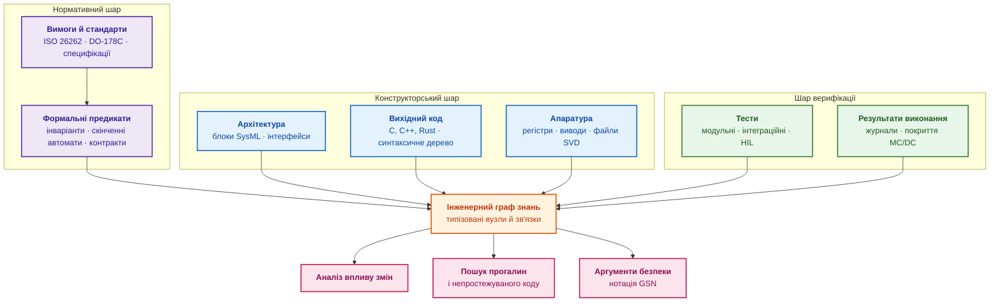
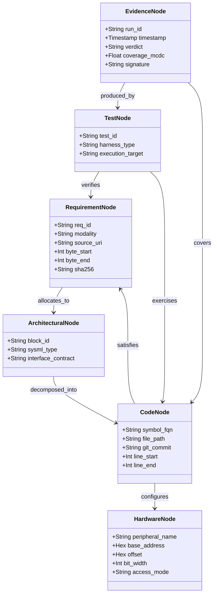
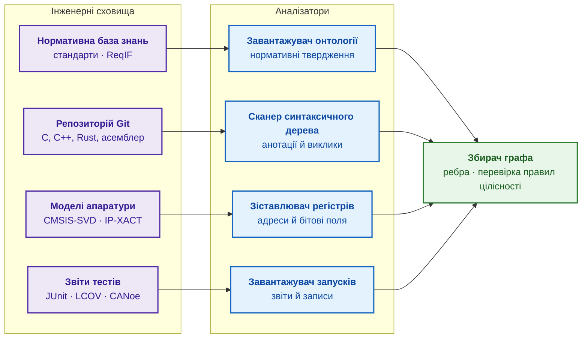
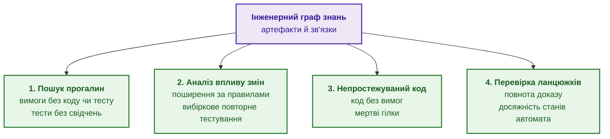
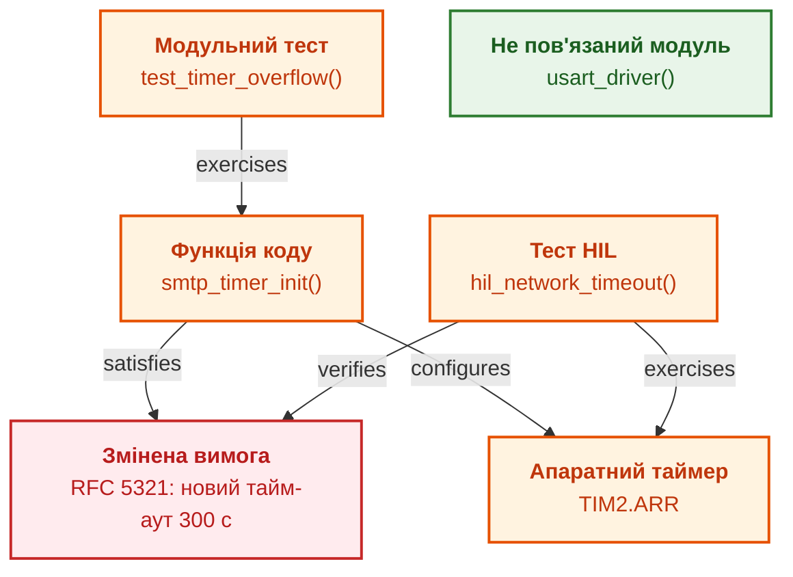
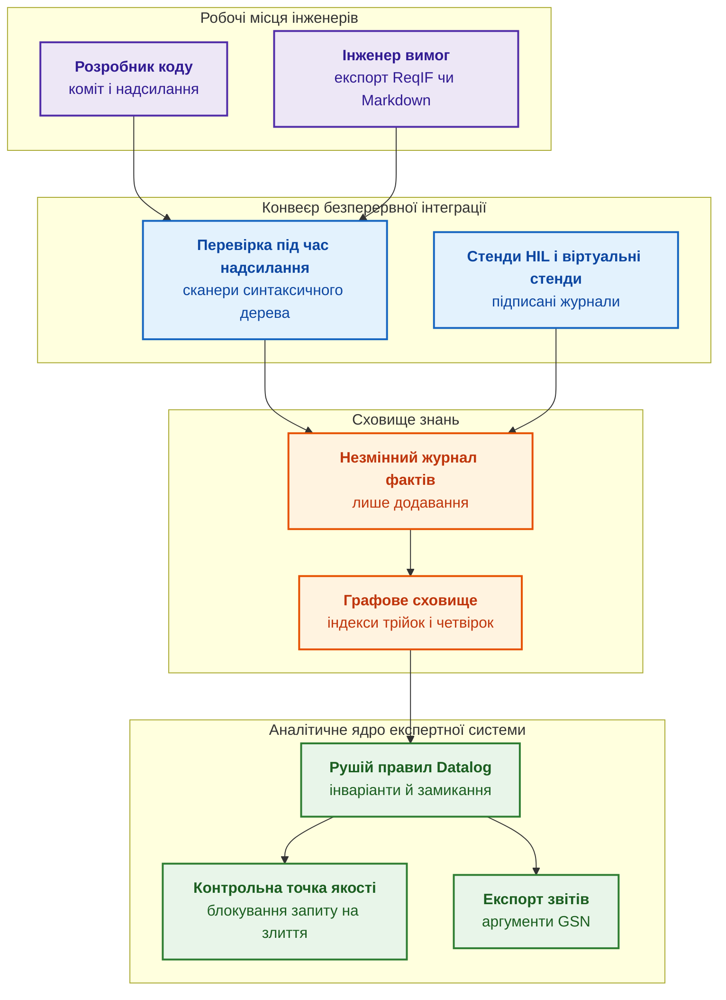
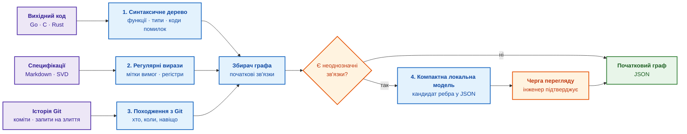
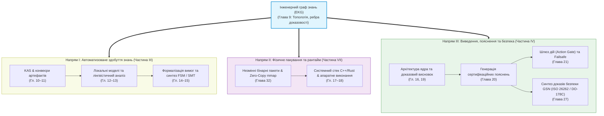

# Глава 9. Інженерний граф знань: простежуваність від вимог до апаратури

> **Книга:** [Архітектура доказових експертних систем](README.md) · [Частина II: Математичні моделі, подання та зберігання знань](part-02-knowledge-models.md)  
> **Попередня глава:** [Глава 8. Інженерні артефакти як дані експертної системи](ch08-engineering-artifacts-as-data.md)  
> **Наступна глава:** [Глава 32. Незмінні пакети знань: побайтовий допуск, індекси та відображення в пам'ять](ch32-high-performance-knowledge-packs-mmap-and-harvesting.md)  
> **Зміст книги:** [README.md](README.md)  
> **Автор:** [Микола Федчик](about-the-author.md)  
> **Рівень:** базовий інженерний; приклади коду й даних винесено в згорнуті блоки  
> **Очікувані результати:** пояснити, що таке інженерний граф знань і чим граф відрізняється від таблиці простежуваності; описати типи вузлів і ребер від вимоги до біта апаратного регістра; сформулювати запити пошуку прогалин, непростежуваного коду й впливу змін; побудувати початкову версію графа автоматично з репозиторію.

На випробувальному стенді контролер несподівано отримує переривання від апаратного таймера. Щоб з'ясувати, яка вимога задає налаштування таймера, яка функція записує регістр і який тест мав виявити проблему, інженери тижнями листуються між командами схемотехніки, програмування й верифікації. Проєкт має матрицю простежуваності, але матриця є таблицею, куди ідентифікатори вимог, назви файлів і номери тестів копіювали вручну, і після кожного коміту таблиця трохи більше розходиться з кодом. Розробка автономного транспортного засобу, авіаційного контролера, промислового робота чи захищеного мережевого шлюзу вимагає узгодити тисячі таких артефактів, а рядок таблиці «REQ-402 перевіряє test_network_timeout» не доводить, що тест справді перевіряє граничні значення з вимоги.

Мета глави: показати, як інженерний граф знань (*Engineering Knowledge Graph*, EKG) з'єднує вимоги, архітектуру, код, апаратні регістри, тести й результати випробувань в одну модель, придатну для детермінованих запитів і аудиту. Глава дає формальну модель графа, показує, як граф будується автоматично з коду, описів апаратури й звітів тестів, формулює три основні аналізи (прогалини, непростежуваний код, вплив змін) і закінчується програмою мовою Go, що збирає початкову версію графа з репозиторію. Глава спирається на [Главу 7](ch07-knowledge-base-typology.md), яка пояснила семантичні графи й онтології, і на [Главу 8](ch08-engineering-artifacts-as-data.md), яка перетворила артефакти на об'єкти даних; як вимоги формалізуються в предикати й скінченні автомати, розповідає [Глава 14](ch14-requirements-detection-and-formalization.md). Схема показує місце графа між шарами розробки.



Фіолетові блоки є нормативним шаром, сині блоки є конструкторським шаром, зелені блоки є верифікацією, помаранчевий блок є графом, рожеві блоки є аналізами, які граф уможливлює. Тести на апаратному стенді з імітацією оточення (*Hardware-in-the-Loop*, HIL) і покриття модифікованих умов і рішень (*Modified Condition/Decision Coverage*, MC/DC) належать до шару верифікації, а нотацію структурування цілей (*Goal Structuring Notation*, GSN) для аргументів безпеки розбирає [Глава 27](ch27-safety-case-gsn-synthesis.md). Спершу треба зрозуміти, чому зв'язки між шарами рвуться.

## Розрив простежуваності

У традиційній інженерії кожна роль працює в окремому інформаційному просторі:

1. **системні інженери й аналітики** ведуть вимоги в спеціалізованих базах (IBM DOORS, Jama Connect, PTC Windchill) або в обмінному форматі ReqIF;
2. **системні архітектори** моделюють компоненти мовою системного моделювання (*Systems Modeling Language*, SysML) чи в середовищі Enterprise Architect;
3. **програмісти** пишуть код у репозиторіях Git і розбивають роботу на задачі в трекерах;
4. **інженери з верифікації** пишуть тести (Python, Robot Framework, Vector CANoe), результати яких осідають у звітах конвеєра безперервної інтеграції;
5. **схемотехніки й розробники апаратури** описують регістри у форматах CMSIS-SVD чи IP-XACT, таблицях Excel або технічних описах.

Зв'язок між просторами забезпечує матриця простежуваності (*traceability matrix*), тобто таблиця, куди інженери вручну копіюють ідентифікатори вимог, назви файлів коду й номери тестів. Огляд Джейн Клеланд-Гуанг та співавторів показує, що ручна простежуваність дорога, швидко застаріває й тому часто лишається формальністю [[1]](#src-1). Причини конкретні:

- **застарівання в момент збереження:** щойно розробник змінив логіку чи перейменував функцію, статична таблиця перестає відображати код;
- **ілюзія покриття:** запис `REQ-402 -> test_network_timeout()` не гарантує, що тест перевіряє граничні значення з вимоги REQ-402, а не завершується статусом «пройдено» через закоментовану перевірку;
- **неможливість зворотного аналізу:** шлях від біта регістра до системної вимоги доводиться відновлювати розпитуванням людей;
- **непомічений зайвий код:** стандарт авіаційного програмного забезпечення DO-178C називає зайвим кодом (*extraneous code*) код, що не простежується до жодної вимоги, а мертвим кодом (*dead code*) частину зайвого коду, яку неможливо виконати; аналіз структурного покриття має виявити такий код, мертвий код видаляють, а деактивований код обґрунтовують окремо [[2]](#src-2). У таблиці простежуваності рядка для зайвого коду просто немає, тож таблиця не може показати відсутнє.

Підсумок розділу: розрив виникає тому, що зв'язки зберігаються окремо від артефактів і оновлюються вручну. Експертна система усуває розрив, коли зв'язки стають типізованими, машинно-перевірюваними й оновлюються разом з артефактами. Для цього потрібна формальна модель графа.

## Формальна модель інженерного графа знань

Семантична мережа подає знання вузлами й іменованими зв'язками, як описав Джон Сова [[3]](#src-3). Інженерний граф знань є окремим випадком семантичної мережі: різнотипним розміченим мультиграфом з атрибутами й правилами цілісності.

```math
\mathcal{G}_{\mathrm{EKG}}=\big(\mathcal{V},\ \mathcal{E},\ s,\ t,\ \tau_v,\ \tau_e,\ \mathcal{A}_v,\ \mathcal{A}_e,\ \mathcal{P}\big)
```

Компоненти графа:

- $\mathcal{V}$ є множиною вузлів, а $\mathcal{E}$ є множиною орієнтованих ребер з власними ідентифікаторами;
- $s,t:\mathcal{E}\to\mathcal{V}$ повертають початковий і кінцевий вузол ребра;
- $\tau_v:\mathcal{V}\to\mathcal{T}_V$ і $\tau_e:\mathcal{E}\to\mathcal{T}_E$ присвоюють типи вузлам і ребрам, а $\mathcal{T}_V$ та $\mathcal{T}_E$ є множинами відповідних типів;
- $\mathcal{A}_v$ і $\mathcal{A}_e$ є атрибутами вузлів і ребер, наприклад хешами, часовими мітками, зміщеннями в тексті й результатами вимірювань;
- $\mathcal{P}$ є множиною правил цілісності й логічного виведення, а дужки групують усі компоненти в один кортеж.

Це визначення задає структуру, а не число: кожен вузол і кожне ребро мають тип та атрибути, а два вузли можуть бути з'єднані кількома ребрами різних типів. Типи дозволяють запитувати, наприклад, усі функції, що налаштовують регістр, від якого залежить вимога безпеки. Діаграма показує основні класи вузлів і зв'язки між ними.



Назви класів і атрибутів записано як ідентифікатори схеми даних, тому англійською. Вимога зберігає зміщення цитати в джерелі й хеш, код зберігає коміт і діапазон рядків, апаратний вузол зберігає адресу й ширину поля, свідчення зберігає вердикт, покриття й підпис стенда.

### Типи вузлів

1. **Нормативні вузли** $V_R\subset\mathcal{V}$: розділи стандартів, нормативні твердження з модальностями (SHALL, MUST, REQUIRED), стани й переходи скінченних автоматів (*finite state machines*, FSM). Кожен нормативний вузол має прив'язку до джерела (*evidence grounding*): файл, точні межі цитати в байтах і хеш SHA-256 цитованого фрагмента.
2. **Архітектурні вузли** $V_A\subset\mathcal{V}$: компоненти, підсистеми, канали зв'язку, шини даних, контракти інтерфейсів (мови опису інтерфейсів, Protobuf, блоки SysML).
3. **Програмні вузли** $V_C\subset\mathcal{V}$: вузли абстрактного синтаксичного дерева (*abstract syntax tree*, AST), тобто модулі, структури, функції, методи й точки розгалуження, разом із хешем коміту й діапазоном рядків.
4. **Апаратні вузли** $V_H\subset\mathcal{V}$: периферійні контролери (UART, SPI, CAN, Ethernet), адреси регістрів у відображеному на пам'ять просторі введення-виведення (*memory-mapped I/O*), бітові поля регістрів, лінії переривань (IRQ), налаштування виводів (GPIO).
5. **Тестові вузли** $V_T\subset\mathcal{V}$: тестові випадки, сценарії введення несправностей (*fault injection*), специфікації тестів HIL, моделі для фазингу.
6. **Вузли свідчень** $V_E\subset\mathcal{V}$: конкретні запуски тестів, звіти про структурне покриття коду (операторами, гілками, MC/DC), записи логічних аналізаторів, дампи шин CAN чи Ethernet, підписані ключами стендів.

### Типи ребер

Ребра графа задають не довільні асоціації, а інженерні відношення з визначеним змістом. Таблиця перелічує основні типи.

| Тип ребра | Напрямок | Зміст | Де потрібне |
|---|---|---|---|
| `allocates_to` | $V_R\to V_A$ | вимогу призначено архітектурному блоку | розподіл вимог за ISO 26262-4 [[4]](#src-4) і DO-178C [[2]](#src-2) |
| `satisfies` | $V_C\to V_R$ | функція чи модуль реалізує вимогу | простежуваність коду до низькорівневих вимог за DO-178C |
| `configures` | $V_C\to V_H$ | код налаштовує або читає фізичний регістр | пакет підтримки плати, описи CMSIS-SVD |
| `verifies` | $V_T\to V_R$ | тест призначено для перевірки вимоги | верифікація й валідація за IEEE 1012 [[5]](#src-5) |
| `exercises` | $V_T\to V_C$ | тест викликає й навантажує блок коду | аналіз структурного покриття |
| `mitigates` | $V_R\to V_{\mathrm{Hazard}}$ | вимога є заходом проти визначеної небезпеки | аналіз небезпек і оцінка ризиків |
| `derived_from` | $V_R\to V_R$ | низькорівневу вимогу виведено із системної | походження вимог |
| `obsoletes` | $V_R\to V_R$ | нова редакція замінює або скасовує стару | керування версіями вимог |

Типи ребер є словником, з якого складаються запити аналізу. Підсумок розділу: граф має типізовані вузли шести класів і типізовані ребра з визначеним змістом, а правила $\mathcal{P}$ перевіряють цілісність. Модель корисна лише тоді, коли граф будується й оновлюється автоматично.

## Автоматичне вилучення й побудова графа

Ключова вимога до промислового графа полягає в автоматичному створенні й синхронізації. Якщо створення вузла чи ребра потребує ручного редагування бази даних або окремого файла конфігурації, граф деградує після перших масштабних змін у проєкті так само, як таблиця. Експертна система будує граф конвеєром спеціалізованих аналізаторів.



Фіолетові блоки є джерелами, сині блоки є аналізаторами, зелений блок збирає граф і перевіряє правила. Кожен аналізатор читає формат зі строгою структурою, тож більшість ребер виникає детерміновано, без статистичних моделей. Наступні підрозділи показують чотири аналізатори на прикладах.

### Код і вимоги через синтаксичне дерево

Практики розробки критичного програмного забезпечення передбачають явну прив'язку коду до вимог: анотацію в коментарі до функції або паралельні метадані.

<details>
<summary>Приклад мовою C: функція з анотаціями простежуваності</summary>

```c
/**
 * @brief Перевірка послідовності команд згідно зі станом сесії.
 * @satisfies REQ-PROTO-MAIL-042
 * @trace RFC-5321:Section-4.1.1.4[byte:18420-18890]
 * @fsm_state TRANSACTION_READY
 */
protocol_status_t validate_command_sequence(session_context_t *ctx, command_t cmd) {
    if (ctx->state != STATE_TRANSACTION_READY) {
        return STATUS_ERR_BAD_SEQUENCE;
    }
    return STATUS_OK;
}
```

</details>

Сканер обходить синтаксичне дерево, знаходить символ `validate_command_sequence`, фіксує сигнатуру й розташування та вилучає заяву `declares_satisfies` до `REQ-PROTO-MAIL-042`. Коментар не доводить виконання вимоги. Ребро `satisfies`, яке враховують у перевірці покриття, потребує окремої підстави: перегляду змісту, застосовного результату верифікації й рішення уповноваженого власника. Хеш цитати підтверджує незмінність фрагмента, не реалізацію описаної поведінки. Ця різниця однакова для анотації людини й пропозиції моделі.

### Код і апаратні регістри

Щоб закрити розрив між драйверами й кремнієм, аналізатор завантажує машинний опис мікроконтролера у форматі опису системного подання CMSIS-SVD (*Cortex Microcontroller Software Interface Standard, System View Description*) [[6]](#src-6), а сканер коду низького рівня аналізує розіменування вказівників і макроси.

<details>
<summary>Приклад XML і C: опис регістра USART1 і функція, що вмикає приймач-передавач</summary>

```xml
<peripheral>
  <name>USART1</name>
  <baseAddress>0x40013800</baseAddress>
  <registers>
    <register>
      <name>CR1</name>
      <description>Control register 1</description>
      <addressOffset>0x00</addressOffset>
      <fields>
        <field>
          <name>UE</name>
          <description>USART enable</description>
          <bitOffset>13</bitOffset>
          <bitWidth>1</bitWidth>
        </field>
      </fields>
    </register>
  </registers>
</peripheral>
```

```c
#define USART1_BASE 0x40013800
#define USART1_CR1  (*(volatile uint32_t *)(USART1_BASE + 0x00))

void usart_enable(void) {
    USART1_CR1 |= (1 << 13); /* вмикання USART */
}
```

</details>

Символьний аналіз обчислює адресу `0x40013800 + 0x00` і маску біта 13 та зіставляє адресу з полем `UE` регістра `CR1`. Граф отримує ребро `configures` від функції `usart_enable` до апаратного вузла `HW_REG:USART1.CR1.UE`. Якщо в новій редакції технічного опису виробник змінив бітову маску чи оголосив поле зарезервованим, експертна система позначає ребро як конфліктне.

### Тести й вимоги

Тестовий каркас не лише виконує код, а й оголошує цільову вимогу.

<details>
<summary>Приклад мовою Python: тест із позначкою перевірюваної вимоги</summary>

```python
@pytest.mark.verifies("REQ-PROTO-MAIL-042")
@pytest.mark.target_state("TRANSACTION_READY")
def test_reject_out_of_sequence_command(dut_client):
    """Перевірка повернення помилки 503 при порушенні порядку команд."""
    dut_client.reset_state()
    response = dut_client.send_raw("DATA\r\n")
    assert response.code == 503, f"Очікувався код 503, отримано {response.code}"
```

</details>

Під час запуску тестів у конвеєрі аналізатор звітів фіксує три факти. Тест `test_reject_out_of_sequence_command` пов'язаний ребром `verifies` з вимогою `REQ-PROTO-MAIL-042`. Тест викликає функцію `validate_command_sequence` (ребро `exercises`), що підтверджують дані профілювання чи трасування. Нарешті, з'являється вузол свідчення з вердиктом, часом виконання, версією стенда й хешем журналу взаємодії. Позначка в коді тесту є твердженням розробника, а ребро `exercises` і вузол свідчення є виміряними фактами, тож граф розрізняє заявлене й підтверджене.

### Сутності, кореферентність, розрідженість і часова чинність

Коли частина графа будується з неструктурованої документації, наївного розбиття тексту на фрагменти недостатньо. Дам'єн Березенко розглядає побудову графів знань для генерації з пошуком за участю агентів [[7]](#src-7), а для інженерного графа важливі чотири вимоги.

1. **Багаторівнева типізація сутностей.** Вузли мають семантичні категорії: активні модулі й керовані компоненти, рівні архітектури (від комплексу до мікросхеми чи регістра) і поняття, що охоплюють кілька підсистем («термомеханічна втома», «гальванічна розв'язка»).
2. **Розв'язання кореферентності (*coreference resolution*) й канонізація.** Технічний текст згадує ту саму сутність повною назвою, абревіатурою, займенником чи заводським артикулом. Перед створенням ребер кожну згадку зводять до одного канонічного ідентифікатора через зв'язування сутностей (*entity linking*), інакше граф розпадається на незв'язні фрагменти.
3. **Розріджений керований граф замість щільного.** Графи знань загального призначення часто будують щільними, з усіма асоціаціями, а інженерний граф будують як строго типізований розріджений граф: зайві ймовірнісні ребра створюють шум під час багатокрокових обходів, тому ребра створюють лише за перевіреними схемами онтології.
4. **Часова чинність і дрейф понять (*concept drift*).** Перехід плати з ревізії 1.1 на ревізію 2.0 може змінити допустимі напруги чи призначення виводів. Кожен вузол і кожне ребро мають часові мітки й межі чинності за ревізіями, тож аудит поточної конфігурації не використає застарілих знань.

Підсумок розділу: більшість ребер графа створюють детерміновані аналізатори строгих форматів, а ребра з неструктурованого тексту потребують канонізації сутностей, типізації й меж чинності. Побудований граф відкриває аналізи, неможливі на розрізнених таблицях.

## Аналіз на інженерному графі

Побудований граф дозволяє автоматично виконувати аналізи, які на розрізнених таблицях чи за допомогою статистичних мовних моделей не дають відтворюваного результату. Схема показує чотири класи аналізу.



Кожен клас є запитом до графа з формальним визначенням. Три перші аналізи розглянуто нижче, а перевірку доказових ланцюжків для аргументів безпеки розбирає [Глава 27](ch27-safety-case-gsn-synthesis.md).

### Пошук прогалин і покриття вимог

Покриття вимог у критичних до безпеки виробах визначають суворіше, ніж покриття рядків коду. Треба показати, що кожна вимога має реалізацію, тест і успішний запуск для потрібного випуску. У наступній навчальній формулі множини вже відфільтровано за чинною версією, схваленням, доступом і відсутністю відкликання. Заявлені й прогнозовані ребра не входять до множини підтверджених зв'язків. Перелік вимог і потрібні ділянки реєстрів мають бути оголошені повними; інакше відсутність ребра означає невідомість, а не доведену прогалину.

```math
\mathcal{U}_R=\Big\{\,r\in V_R\ \Big|\ \neg\exists\,c\in V_C:\ c\xrightarrow{\mathrm{satisfies}}r\ \ \lor\ \ \neg\exists\,t\in V_T,\ e\in V_E:\ t\xrightarrow{\mathrm{verifies}}r\ \land\ e\xrightarrow{\mathrm{produced\_by}}t\ \land\ \mathrm{verdict}(e)=\mathrm{PASS}\ \land\ \mathrm{release}(e)=\rho\,\Big\}
```

Як читати множину прогалин:

- $r$ є вимогою, $c$ є вузлом коду, $t$ є тестом, а $e$ є свідченням запуску тесту;
- $V_R$, $V_C$, $V_T$ і $V_E$ є множинами вузлів вимог, коду, тестів і свідчень відповідно, а $\rho$ є поточним випуском;
- стрілки $\xrightarrow{\mathrm{satisfies}}$, $\xrightarrow{\mathrm{verifies}}$ і $`\xrightarrow{\mathrm{produced\_by}}`$ означають відповідно «реалізує вимогу», «перевіряє вимогу» й «свідчення створене тестом»;
- $\mathrm{verdict}(e)=\mathrm{PASS}$ вимагає успішного результату, а $\mathrm{release}(e)=\rho$ вимагає, щоб запуск належав поточному випуску;
- $\neg\exists$ означає «не існує», $\lor$ означає «або», а $\land$ означає «і»; фігурні дужки збирають усі вимоги, для яких виконується умова після вертикальної риски.

Вимога потрапляє в множину, якщо немає коду, що її реалізує, або немає тесту з успішним свідченням у поточному випуску. Кількість елементів лежить від 0 до $|V_R|$, а покриття дорівнює $1-|\mathcal{U}_R|/|V_R|$, тобто уточненій версії метрики з [Глави 8](ch08-engineering-artifacts-as-data.md). Порожня множина означає відсутність відомих прогалин, але не якість тестів: її перевіряють аналізом структурного покриття й рецензуванням. Непорожня множина дає звіт із пунктами стандарту, що лишилися без підтвердження.

### Прогнозування пропущених зв'язків: кандидати, а не факти

Множина прогалин $\mathcal{U}_R$ показує вимоги без реалізації або без успішно виконаного тесту, але не каже, чи потрібного ребра справді немає, чи його просто не записали. У великих проєктах частина тестів фактично перевіряє певну вимогу, але ребро `verifies` між тестом і вимогою ніхто не провів. Прогнозування зв'язків (*link prediction*) пропонує кандидатів у такі ребра.

Метод має добре досліджене підґрунтя в аналізі мереж. Лібен-Новелл і Клейнберг показали на мережах наукового співавторства, що прості міри близькості у графі, зокрема міри спільних сусідів, передбачають майбутні зв'язки в багато разів краще за випадковий вибір, хоча абсолютна частка влучань лишається невеликою [[8]](#src-8). Фам Тхі Тху Туї та Тхінь Тхі Туї додали до структурних ознак часові й семантичні: дані бібліографічних сервісів AMiner, DBLP і Mendeley звели до спільної онтології, узгодженої зі словниками SKOS (*Simple Knowledge Organization System*) і Dublin Core, і на цих ознаках випадковий ліс (*random forest*) і графові нейронні мережі з [Глави 6](ch06-applied-mathematics-for-expert-systems.md) суттєво перевершили традиційні моделі [[9]](#src-9). Автори застосували метод до прогнозування наукової співпраці, тож для інженерного графа схема є гіпотезою, яку перевіряють на власних даних: для пари «вимога, тест» ознаками стають спільні терміни словника домену, спільні сигнали й регістри, спільний компонент і часова близькість змін.

Для експертної системи важлива не лише точність прогнозу, а й пояснення, чому кандидата запропоновано. Міра Адамік і Адара [[10]](#src-10) дає таке пояснення автоматично, бо складається з внесків конкретних спільних сусідів.

```math
\mathrm{AA}(x, y) = \sum_{z \in N(x) \cap N(y)} \frac{1}{\ln |N(z)|}
```

Складники міри Адамік і Адара:

- $x$ і $y$ є вузлами пари-кандидата, наприклад вимогою й тестом;
- $N(v)$ є множиною сусідів вузла $v$ у графі: сигналів, регістрів, компонентів і термінів словника;
- $z$ пробігає спільних сусідів обох вузлів, а $\cap$ означає перетин множин;
- $|N(z)|$ є степенем спільного сусіда, тобто кількістю його сусідів, а $\ln$ є натуральним логарифмом;
- $\mathrm{AA}(x, y)$ є невід'ємною оцінкою для ранжування пар, а не ймовірністю.

Рідкісний спільний сусід важить більше за частий: спільний специфічний регістр є сильним свідченням, а спільний загальний термін слабким. Розгляньмо вимогу про тайм-аут сторожового таймера і тест T-204, які мають трьох спільних сусідів: регістр `WDT_CTRL` зі степенем 4, сигнал `wdt_timeout` зі степенем 6 і термін «тайм-аут» зі степенем 120. Оцінка дорівнює 1/ln 4 + 1/ln 6 + 1/ln 120 ≈ 0,721 + 0,558 + 0,209 ≈ 1,49. Та сама вимога й тест T-090 мають лише термін «тайм-аут» і компонент керування живленням зі степенем 40, тож оцінка становить лише 0,209 + 0,271 ≈ 0,48. Власник вимоги бачить першою пару з тестом T-204 разом із поясненням «спільні `WDT_CTRL` і `wdt_timeout`».

Поріг для показу кандидатів обирають за виміряною точністю серед перших $k$ кандидатів (*precision@k*): частину відомих ребер тимчасово приховують і перевіряють, скільки прихованих ребер повертає ранжування. Навчені моделі можуть ранжувати краще, але гірше пояснюють порядок кандидатів, тому експертна система може ранжувати навченою моделлю, а пояснювати спільними сусідами. Обидва підходи підпорядковуються одному правилу: спрогнозоване ребро має статус кандидата й не враховується у формулі множини $\mathcal{U}_R$, доки власник вимоги не підтвердив зв'язок. Інакше покриття вимог зростатиме за рахунок догадок. Межа методу працює й у зворотний бік: прогноз знаходить зв'язки, схожі на вже записані, тому відсутність кандидата не доводить, що жоден тест не перевіряє вимогу.

Масштабний досвід побудови графів знань підтверджує необхідність калібрування довіри до кожного ребра. Донг та співавтори у проєкті Knowledge Vault поєднали екстрактори фактів із тексту з графовими апріорними оцінками (*graph priors*), отриманими аналізом топології зв'язків самого графа [[11]](#src-11). Навчені класифікатори обчислюють імовірність істинності ребра на основі злиття кількох незалежних текстових екстракцій та структурних предикатів сусідства. В інженерному графі це дає формальний фільтр: перш ніж пропонувати інженеру зв'язок між вимогою й тестом або кодом, система зіставляє текстову схожість із топологічним контекстом архітектури, усуваючи шум неправдоподібних кандидатів.

### Непростежуваний і мертвий код

Код, що не простежується до вимог, є потенційною загрозою безпеці: забуті налагоджувальні заглушки, недокументовані функції чи навмисно вбудовані вектори атаки. Наївне правило «функція без прямого ребра `satisfies` є зайвою» дає хибні спрацювання на допоміжних функціях, які викликає функція, що реалізує вимогу. Точніше визначення враховує ланцюжки викликів:

```math
\mathcal{C}_{\mathrm{untraced}}=\big\{\,c\in V_C\ \big|\ \neg\exists\,c'\in V_C,\ r\in V_R:\ c'\xrightarrow{\mathrm{satisfies}}r\ \land\ c'\xrightarrow{\mathrm{calls}^{*}}c\,\big\}
```

Позначення непростежуваного коду:

- $c$ є вузлом коду, який перевіряють, $c'$ є вузлом коду, що реалізує вимогу $r$, а $V_C$ і $V_R$ є множинами вузлів коду й вимог;
- $\xrightarrow{\mathrm{satisfies}}$ позначає реалізацію вимоги, а $\xrightarrow{\mathrm{calls}^{*}}$ позначає шлях викликів від $c'$ до $c$;
- зірочка в $\mathrm{calls}^{*}$ означає рефлексивно-транзитивне замикання: шлях може мати нуль кроків, один прямий виклик або кілька послідовних викликів;
- $\neg\exists$ означає, що не існує вузла, який задовольняє описаний шлях, а фігурні дужки формують множину таких вузлів $c$.

Результатом є множина функцій, до яких не веде шлях від реалізації вимоги; її розмір лежить від 0 до $|V_C|$. Інженер або обґрунтовує знайдену функцію похідною вимогою (*derived requirement*) з оцінкою безпеки, або видаляє її. Статичний граф викликів може не бачити викликів через вказівники на функції й таблиці переривань, тож такі виклики додають з описів апаратури чи динамічного трасування. Виявлення мертвого коду в сенсі DO-178C додатково потребує аналізу структурного покриття.

### Аналіз впливу змін

Одна з найболючіших проблем досліджень і розробки полягає в оцінці наслідків зміни. Що станеться, якщо комітет випустить нову редакцію стандарту зі зміненим тайм-аутом або замовник змінить максимальний час відповіді приводу? Без графа доводиться перечитувати сотні документів або повторно запускати весь набір тестів, що на апаратних стендах триває тижнями. На графі вплив зміни вузла $v^{*}$ визначає досяжність за правилами поширення:

```math
\mathrm{Impact}(v^{*})=\big\{\,u\in\mathcal{V}\ \big|\ v^{*}\leadsto_{\delta}u\,\big\}
```

Що означає досяжність:

- $v^{*}$ є зміненим вузлом, $u$ є будь-яким вузлом графа, а $\mathcal{V}$ є множиною всіх вузлів;
- $v^{*}\leadsto_{\delta}u$ означає, що існує шлях від зміненого вузла до $u$, а $\delta$ задає напрямок обходу для кожного типу ребра;
- $\mathrm{Impact}(v^{*})$ є множиною вузлів, досяжних за цими правилами, включно з початковим вузлом, якщо дозволено шлях нульової довжини;
- $`\{v^{*}\}`$ є множиною з одним початковим вузлом, а фігурні дужки в означенні формують усі вузли, що відповідають умові шляху.

Для зміни вимоги поширення йде проти напрямку ребер `satisfies` і `verifies`, за напрямком `configures` і проти напрямку `exercises`. Отже, аналіз охоплює код, регістри й тести, пов'язані зі зміною. Наївний обхід усіх ребер в обох напрямках позначив би як зачеплену майже всю модель і зробив би аналіз марним. Схема показує приклад.



Червоний вузол є зміненою вимогою, помаранчеві вузли є зоною впливу, зелений вузол лишається поза зоною. Алгоритм знаходить функцію `smtp_timer_init()` проти ребра `satisfies`, регістр `TIM2.ARR` за ребром `configures` і рівно два тести, які треба повторити: `test_timer_overflow` та `hil_network_timeout`. Таке вибіркове регресійне тестування (*selective regression testing*) лишає решту модулів поза повторним тестуванням і заощаджує години роботи стендів. Межа методу: якщо ребро пропущене, пропущеним буде й вплив, тому вибіркове тестування доповнюють періодичним повним прогоном.

Підсумок розділу: три аналізи є формальними запитами до графа з визначеними множинами-результатами, а корисність запитів залежить від повноти ребер і правил поширення. Щоб запити працювали на кожній зміні, граф має бути частиною конвеєра розробки.

## Архітектура промислової платформи

Монолітна графова база даних із централізованим адмініструванням рідко приживається в розподілених інженерних командах. Практичніша архітектура збирає факти з конвеєрів розробки в незмінний журнал, будує з журналу індексований граф і виконує над графом правила.



Фіолетові блоки є джерелами змін, сині блоки є конвеєром, помаранчеві блоки є сховищем, зелені блоки є аналітичним ядром. Рушій правил мовою Datalog, яку пояснила [Глава 6](ch06-applied-mathematics-for-expert-systems.md), обчислює інваріанти й транзитивні замикання, а результати використовують контрольна точка якості й експорт звітів.

Коли граф перестає вміщатися на одному вузлі, його розбивають на шарди. Ключем розбиття обирають виріб і базову версію, а не тип вузла, бо запит простежуваності проходить від вимоги через функцію до тесту. Якщо розмістити вимоги на одному вузлі, функції на іншому, а тести на третьому, кожен шлях простежуваності стає міжшардовим. Мірою якості розбиття є частка розрізаних ребер графа. За мовчання шарда запит повертає «невідомо», а не «зв'язку немає», інакше відсутнє ребро простежуваності буде прочитане як відсутній тест. Визначення й правила розбиття наведено в [Главі 7](ch07-knowledge-base-typology.md).

### Незмінні версійовані факти

Кожен вузол і кожне ребро графа зберігаються як незмінний факт у формі четвірки:

```math
\langle\,\mathrm{Subject},\ \mathrm{Predicate},\ \mathrm{Object},\ \mathrm{Context}\,\rangle
```

Поля незмінного факту:

- $\mathrm{Subject}$ є вузлом-джерелом, наприклад функцією;
- $\mathrm{Predicate}$ є типом зв'язку, наприклад `satisfies`, а $\mathrm{Object}$ є вузлом-ціллю, наприклад вимогою;
- $\mathrm{Context}$ є контекстом походження: ідентифікатором коміту чи ревізії, автором, часовою міткою й підписом інструмента, що вилучив факт;
- кутові дужки й коми задають упорядкований кортеж із чотирьох полів; трійка перших полів відповідає моделі RDF, а четверте розрізняє контекст факту.

Кортеж є фактом, який не перезаписують, а доповнюють новим фактом у новому контексті. Це дає змогу відновити стан графа на будь-яку дату й відповісти аудитору, яким було покриття вимог для прошивки 2.4.1 рік тому [[12]](#src-12).

### Контрольна точка якості в конвеєрі змін

Експертна система вбудовується в перевірку запиту на злиття (*pull request quality gate*). Перед злиттям гілки валідатор графа перевіряє три блокувальні правила:

1. **збереження цілісності:** нову функцію не можна додати без ребра `satisfies` до затвердженої вимоги або без шляху викликів від такої функції;
2. **перевірюваність:** зміна логіки функції робить результати старих запусків недостатніми для нового коміту; визначення тесту й заявлений зв'язок `verifies` можуть залишитися чинними. Новий запуск створює окремий запис, а старий лишається в історії;
3. **відсутність регресії:** підграф впливу зміни $\mathrm{Impact}(\Delta)$ не містить неперевірених вузлів найвищих рівнів критичності: ASIL D за ISO 26262 чи рівня A за DO-178C.

Підсумок розділу: незмінний журнал четвірок дає відтворюваність, а правила в конвеєрі змін не дають графу застаріти. Лишається головне заперечення скептиків: скільки коштує побудувати граф уперше.

## Холодний старт: автоматична початкова версія графа

Початковий граф не обов'язково створювати вручну. Аналізатори можуть зібрати структуру коду, явні посилання й результати запусків, а редактор Protégé допомагає переглянути схему та змістові рішення, як показує [Глава 15](ch15-knowledge-extraction-and-kb-construction.md). Автоматизація зменшує копіювання, але не скасовує інженерного моделювання. Початкова версія з анотацій є реєстром заявлених зв'язків, не готовим доказом виконання вимог.



Фіолетові блоки є джерелами, сині блоки є кроками, помаранчеві блоки відокремлюють неоднозначні зв'язки й перегляд людиною, зелений блок є результатом. Кроки працюють так.

1. **Синтаксичне дерево коду.** Аналізатор (стандартний пакет `go/parser` мови Go чи універсальний tree-sitter) обходить файли репозиторію: кожен файл стає вузлом модуля, кожна функція вузлом функції з ребром `declared_in`, кожен виклик ребром `calls`, кожен код повернення помилки вузлом контракту помилки.
2. **Регулярні вирази для вимог і апаратури.** Детерміновані шаблони `[REQ-SYS-XXX]` чи `[REQ-SW-XXX]` у текстах і коментарях створюють вузли вимог, а файли CMSIS-SVD створюють вузли регістрів із бітовими полями.
3. **Походження з Git.** Згадування `REQ-214` у повідомленні коміту створює зв'язок згадування, а `@satisfies REQ-214` створює заяву про реалізацію. Обидва записи отримують коміт як контекст, але сам коміт не перетворює заяву на підтверджене `satisfies`.
4. **Вузька компактна модель для неоднозначних зв'язків.** Коли прямого збігу ідентифікаторів немає (функція називається `ApplyThermalCutoff()`, а специфікація каже «пристрій зобов'язаний аварійно вимкнути силове коло при перегріві»), збирач графа звертається до компактної локальної мовної моделі, наприклад через середовище Ollama. Модель зобов'язана повернути лише коректний JSON з кандидатом ребра й оцінкою впевненості; кандидат отримує позначку «кандидат» і потрапляє в чергу перевірки провідним інженером, не блокуючи побудови решти графа.

Програма нижче читає визначення вимог, функції й анотації. Вона не читає історію Git, не обчислює повний граф викликів і не перевіряє поведінку. Ідентифікатор функції включає файл і тип отримувача методу, щоб однойменні символи не зливалися. Переміщення файла змінить цей навчальний ідентифікатор; стійка міжверсійна ідентичність потребує окремої моделі відповідності.

<details>
<summary>Приклад мовою Go: початковий граф із репозиторію</summary>

Програма є повною й запускається командою `go run main.go sample`, де `sample` є каталогом із файлами `requirements.md` і `thermal.go`, наведеними після програми.

```go
package main

import (
	"encoding/json"
	"fmt"
	"go/ast"
  "go/format"
	"go/parser"
	"go/token"
	"io/fs"
	"os"
	"path/filepath"
	"regexp"
  "strings"
)

// Node є вузлом графа: вимогою, модулем або функцією.
type Node struct {
	ID   string `json:"id"`
	Type string `json:"type"`
	File string `json:"file"`
}

// Edge є типізованим ребром графа.
type Edge struct {
	Source   string `json:"source"`
	Relation string `json:"relation"`
	Target   string `json:"target"`
}

// Graph є початковою версією інженерного графа знань.
type Graph struct {
	Nodes  []Node   `json:"nodes"`
	Edges  []Edge   `json:"edges"`
	Broken []string `json:"broken_links"`
}

var (
	reqDef   = regexp.MustCompile(`\[(REQ-[A-Z]+-[0-9]+)\]:`)
	reqTrace = regexp.MustCompile(`@satisfies\s+(REQ-[A-Z]+-[0-9]+)`)
)

// bootstrap обходить каталог, збирає вимоги з Markdown і функції з коду Go.
func bootstrap(root string) (*Graph, error) {
	g := &Graph{}
	fset := token.NewFileSet()
	var traces []Edge
	err := filepath.WalkDir(root, func(path string, d fs.DirEntry, err error) error {
		if err != nil || d.IsDir() {
			return err
		}
		p := filepath.ToSlash(path)
		switch filepath.Ext(path) {
		case ".md":
			data, err := os.ReadFile(path)
			if err != nil {
				return err
			}
			for _, m := range reqDef.FindAllStringSubmatch(string(data), -1) {
				g.Nodes = append(g.Nodes, Node{ID: m[1], Type: "Requirement", File: p})
			}
		case ".go":
			file, err := parser.ParseFile(fset, path, nil, parser.ParseComments)
			if err != nil {
				return err
			}
			module := "module:" + p
			g.Nodes = append(g.Nodes, Node{ID: module, Type: "Module", File: p})
			for _, decl := range file.Decls {
				fn, ok := decl.(*ast.FuncDecl)
				if !ok {
					continue
				}
        receiver := ""
        if fn.Recv != nil {
          var receiverText strings.Builder
          if err := format.Node(&receiverText, fset, fn.Recv.List[0].Type); err != nil {
            return err
          }
          receiver = receiverText.String() + "."
        }
        id := "func:" + p + "#" + receiver + fn.Name.Name
				g.Nodes = append(g.Nodes, Node{ID: id, Type: "Function", File: p})
				g.Edges = append(g.Edges, Edge{id, "declared_in", module})
				if fn.Doc == nil {
					continue
				}
				for _, m := range reqTrace.FindAllStringSubmatch(fn.Doc.Text(), -1) {
          traces = append(traces, Edge{id, "declares_satisfies", m[1]})
				}
			}
		}
		return nil
	})
	if err != nil {
		return nil, err
	}
	known := map[string]bool{}
	for _, n := range g.Nodes {
		known[n.ID] = true
	}
	for _, e := range traces {
		if known[e.Target] {
			g.Edges = append(g.Edges, e)
		} else {
			g.Broken = append(g.Broken, e.Source+" → "+e.Target)
		}
	}
	return g, nil
}

func main() {
	root := "."
	if len(os.Args) > 1 {
		root = os.Args[1]
	}
	g, err := bootstrap(root)
	if err != nil {
		fmt.Fprintln(os.Stderr, "помилка:", err)
		os.Exit(1)
	}
	out, err := json.MarshalIndent(g, "", "  ")
	if err != nil {
		fmt.Fprintln(os.Stderr, "помилка:", err)
		os.Exit(1)
	}
	fmt.Println(string(out))
}
```

Файл `sample/requirements.md`:

```markdown
# Вимоги до контролера живлення

[REQ-SYS-214]: Пристрій вимикає силове коло, якщо температура перевищує 105 °C.
[REQ-SW-214]: Функція захисту перевіряє температуру кожні 10 мс.
```

Файл `sample/thermal.go`:

```go
package thermal

// ApplyThermalCutoff вимикає силове коло за перегріву.
// @satisfies REQ-SW-214
func ApplyThermalCutoff(tempC float64) bool {
	return tempC > 105
}

// LogTemperature записує температуру в журнал.
// @satisfies REQ-SW-215
func LogTemperature(tempC float64) {}
```

Програма друкує:

```json
{
  "nodes": [
    {
      "id": "REQ-SYS-214",
      "type": "Requirement",
      "file": "sample/requirements.md"
    },
    {
      "id": "REQ-SW-214",
      "type": "Requirement",
      "file": "sample/requirements.md"
    },
    {
      "id": "module:sample/thermal.go",
      "type": "Module",
      "file": "sample/thermal.go"
    },
    {
      "id": "func:sample/thermal.go#ApplyThermalCutoff",
      "type": "Function",
      "file": "sample/thermal.go"
    },
    {
      "id": "func:sample/thermal.go#LogTemperature",
      "type": "Function",
      "file": "sample/thermal.go"
    }
  ],
  "edges": [
    {
      "source": "func:sample/thermal.go#ApplyThermalCutoff",
      "relation": "declared_in",
      "target": "module:sample/thermal.go"
    },
    {
      "source": "func:sample/thermal.go#LogTemperature",
      "relation": "declared_in",
      "target": "module:sample/thermal.go"
    },
    {
      "source": "func:sample/thermal.go#ApplyThermalCutoff",
      "relation": "declares_satisfies",
      "target": "REQ-SW-214"
    }
  ],
  "broken_links": [
    "func:sample/thermal.go#LogTemperature → REQ-SW-215"
  ]
}
```

Програма знайшла заяву для `ApplyThermalCutoff` і розірване посилання для `LogTemperature`. Вона не довела виконання жодної вимоги. Ба більше, REQ-SW-214 задає період 10 мс, а функція лише порівнює температуру; приклад навмисно показує, чому правильний ідентифікатор не означає змістового покриття. Для відсутніх підтверджень потрібен звіт прогалин або невідомостей за оголошеною повнотою реєстру.

Наступний тест перевіряє саме межі збирача: однойменні функції та методи мають різні ідентифікатори, неіснуюча вимога дає розірване посилання, а анотація не створює підтвердженого `satisfies`. Тест розміщують поруч із програмою як `main_test.go` і виконують `go test main.go main_test.go`.

```go
package main

import (
  "os"
  "path/filepath"
  "testing"
)

func TestBootstrapIdentityAndClaims(t *testing.T) {
  root := t.TempDir()
  files := map[string]string{
    "requirements.md": "[REQ-SW-1]: example\n",
    "a/code.go": "package a\ntype First struct{}\ntype Second struct{}\n// @satisfies REQ-SW-1\nfunc Run() {}\n// @satisfies REQ-SW-1\nfunc (First) Run() {}\n// @satisfies REQ-SW-9\nfunc (Second) Run() {}\n",
    "b/code.go": "package b\n// @satisfies REQ-SW-1\nfunc Run() {}\n",
  }
  for relative, content := range files {
    path := filepath.Join(root, relative)
    if err := os.MkdirAll(filepath.Dir(path), 0700); err != nil {
      t.Fatal(err)
    }
    if err := os.WriteFile(path, []byte(content), 0600); err != nil {
      t.Fatal(err)
    }
  }
  graph, err := bootstrap(root)
  if err != nil {
    t.Fatal(err)
  }
  identifiers := map[string]bool{}
  for _, node := range graph.Nodes {
    if node.Type == "Function" {
      if identifiers[node.ID] {
        t.Fatalf("duplicate function ID: %s", node.ID)
      }
      identifiers[node.ID] = true
    }
  }
  if len(identifiers) != 4 || len(graph.Broken) != 1 {
    t.Fatalf("unexpected functions or broken links: %d, %v", len(identifiers), graph.Broken)
  }
  claims := 0
  for _, edge := range graph.Edges {
    if edge.Relation == "satisfies" {
      t.Fatal("annotation promoted to verified realization")
    }
    if edge.Relation == "declares_satisfies" {
      claims++
    }
  }
  if claims != 3 {
    t.Fatalf("expected three claims, got %d", claims)
  }
}
```

</details>

Навіть мінімальний збирач дає команді видимий граф із першого дня, знаходить розірвані посилання й непокриті вимоги, а подальше збагачення відбувається в конвеєрі безперервної інтеграції. Межа методу: регулярні вирази й анотації бачать лише те, що розробники явно позначили, тож початковий граф неповний, і неповноту видно в звітах прогалин, а не приховано.

## Таблиці простежуваності проти інженерного графа

Таблиця зводить відмінності. Оцінки правої колонки справджуються лише тоді, коли граф будується автоматично в конвеєрі й має правила цілісності.

| Критерій | Таблиці простежуваності (Excel, Word, матриці DOORS) | Інженерний граф знань |
|---|---|---|
| Спосіб створення | ручне заповнення й копіювання ідентифікаторів | автоматичне вилучення із синтаксичних дерев, описів SVD, звітів тестів і бази знань |
| Синхронізація з кодом | періодична, перед аудитом, постійно відстає | на кожному коміті в конвеєрі |
| Зміст зв'язку | «рядок є» або «рядка немає» | типізовані ребра, свідчення, стани автомата |
| Аналіз впливу | експертна оцінка з пам'яті | обчислена досяжність за правилами поширення, повна настільки, наскільки повні ребра |
| Непростежуваний код | практично не виявляється без ручного аудиту | запит до графа з урахуванням ланцюжків викликів |
| Апаратура | окремо, у технічних описах | зв'язки до бітових полів регістрів і переривань |
| Підготовка до аудиту | сотні людино-годин зведення звітів | експорт актуального знімка й перегляд людиною |

Таблиця не означає, що граф безкоштовний: граф потребує дисципліни анотацій, підтримки аналізаторів і власника схеми. Але витрати графа переносяться з ручного копіювання на автоматичні перевірки, які працюють на кожній зміні.

## Висновки
**Зв'язки стають перевірюваними фактами.** Глава почалася з переривання таймера, яке тижнями не вдавалося простежити до вимоги, і з таблиці, що розходиться з кодом після кожного коміту. Відповідь глави: інженерний граф знань робить зв'язки між вимогами, кодом, апаратурою й тестами типізованими фактами з походженням, які будуються автоматично й перевіряються на кожній зміні. Глава показала:

- формальну модель графа з шістьма класами вузлів, типізованими ребрами й правилами цілісності;
- детерміновані аналізатори, що створюють ребра з анотацій коду, описів регістрів CMSIS-SVD і звітів тестів, і вимоги до ребер із неструктурованого тексту: канонізацію сутностей, розрідженість і межі чинності за ревізіями;
- три аналізи як формальні запити: множину непокритих вимог, множину непростежуваного коду з урахуванням ланцюжків викликів і вплив зміни за правилами поширення;
- прогнозування пропущених ребер між вимогами й тестами мірою Адамік і Адара, яка пояснює кандидата спільними сусідами, і правило, за яким кандидат не впливає на покриття до підтвердження власником вимоги;
- архітектуру з незмінним журналом четвірок і контрольною точкою якості в конвеєрі змін, а також мінімальний збирач початкового графа мовою Go.

Межі глави: граф повний лише настільки, наскільки повні анотації й аналізатори; статичний аналіз не бачить непрямих викликів; вибіркове тестування за графом впливу доповнюють періодичним повним прогоном; ребра, запропоновані мовною моделлю або прогнозуванням зв'язків, лишаються кандидатами до підтвердження інженером. Граф є фундаментом для аргументів безпеки, які будує [Глава 27](ch27-safety-case-gsn-synthesis.md).

## Підсумки маршруту від математичної моделі до графа

Глави 6–9 сформували математичний і структурний фундамент експертної системи:

1. [Глава 6](ch06-applied-mathematics-for-expert-systems.md) озброїла інженера прикладним математичним апаратом: дедуктивною логікою, байєсівськими мережами, нечіткими множинами Заде та причинно-наслідковим аналізом Перла (Do-Calculus).
2. [Глава 7](ch07-knowledge-base-typology.md) систематизувала типи баз знань (продукції, фрейми, онтології, прецеденти, векторні простори) та формальні критерії перевірки онтологічної чистоти методом OntoClean.
3. [Глава 8](ch08-engineering-artifacts-as-data.md) визначила інженерні артефакти як структуровані дані з незмінним походженням, байтовими координатами цитат і картами вирівнювання джерел.
4. [Глава 9](ch09-engineering-knowledge-graph-traceability.md) поєднала вимоги, архітектуру, код, тести й регістри апаратури в типізований граф; повнота простежуваності залежить від джерел і перевірки ребер.

Разом чотири глави забезпечують перехід: **математичний метод → тип подання → типізований артефакт → граф доказових зв'язків**.

## Подальший шлях пізнання

Побудова інженерного графа знань (EKG) завершує формування інформаційного та математичного каркаса системи. Утім, сам по собі граф — це статичний топологічний скелет. Щоб перетворити його на автономну, верифіковану та працездатну експертну систему промислового рівня, інженер має подолати три послідовні архітектурні виклики: автоматизоване наповнення, фізичну доставку у середовище виконання та реалізацію доказового логічного виведення.



### 1. Звідки беруться знання: Інженерія здобуття та мовний аналіз
Граф знань не створюється вручну в промислових масштабах. Справжні вимоги, протоколи випробувань і регламенти розподілені по тисячах сторінок специфікацій (ISO, IEC, DO-178C), інженерних квитків і неформалізованого досвіду провідних розробників. 

**[Частина III. Здобуття знань, мовний аналіз та оцінювання входу](part-03-knowledge-engineering-nlp.md)** розкриває конвеєр автоматизованого наповнення бази знань:
- **Архітектура систем KAS та протоколи збору**: проектування підсистем вилучення знань ([Глава 10](ch10-knowledge-acquisition-systems.md)) та методологія структурованого інтерв'ювання експертів для видобування неявного досвіду (*tacit knowledge*) без евристичних спотворень ([Глава 11](ch11-knowledge-elicitation-from-experts.md)).
- **Символічний NLP та локальні мовні моделі**: використання детермінованих синтаксичних аналізаторів і компактних онпреміс-моделей для роботи у закритому захищеному середовищі без витоку IP-даних ([Глава 12](ch12-linguistic-analysis-and-local-models.md)), а також алгоритми канонізації термінології та усунення мовної варіативності ([Глава 13](ch13-language-variability-vs-determinism.md)).
- **Строга формалізація у логіку та автомати**: детекція модальності (RFC 2119 / EARS) з трансляцією природної мови у темпоральні формули LTL/CTL ([Глава 14](ch14-requirements-detection-and-formalization.md)), автоматичний синтез кінцевих автоматів (FSM) та верифікація несуперечності правил через SMT-солвери Z3 ([Глава 15](ch15-knowledge-extraction-and-kb-construction.md)).

### 2. Як доставити граф у середовище реального часу: Пакування та рантайм
Навіть бездоганно верифікований граф залишається марним, якщо пошук по ньому займає секунди або вимагає розгортання важкої графової СУБД на бортовому комп'ютері реального часу.
- **Високопродуктивні пакети знань**: [Глава 32](ch32-high-performance-knowledge-packs-mmap-and-harvesting.md) демонструє, як скомпілювати EKG у монолітний незмінний бінарний артефакт із прямою адресацією пам'яті через системний виклик `mmap`. Це забезпечує час доступу до вузлів і ребер на рівні одиниць мікросекунд без накладних витрат на десеріалізацію (*zero-copy*), гарантуючи цілісність даних криптографічними хешами Sha256.
- **Апаратне виконання та системний стек**: [Частина VII. Середовище виконання та обмін знаннями](part-07-runtime-and-knowledge-exchange.md) переносить скомпільовані знання на апаратні платформи: від вибору системних мов розробки ядра (Rust, C++, Zig) у [Главі 17](ch17-implementation-stack.md) до оптимізації локальності даних, кеш-ліній процесора й диспетчеризації завдань у [Главі 18](ch18-execution-infrastructure.md).

### 3. Як перетворити зв'язки на рішення: Логічний висновок, пояснення та безпека
Граф надає топологію простежуваності, проте інженерні рішення вимагають динамічного виведення висновків, генерації вичерпних аудійованих обґрунтувань і безпечного керування приводами:
- **Механізми виведення та доказова база**: [Частина IV. Архітектура експертних систем та логічний висновок](part-04-architecture-and-inference.md) розбирає структуру виробничого рушія ([Глава 16](ch16-expert-systems-architecture.md)) і шлях від запиту користувача до формування ланцюжка доказів ([Глава 19](ch19-from-question-to-evidence.md)).
- **Генерація сертифікаційних пояснень**: [Глава 20](ch20-explanation-engine.md) пояснює побудову контрафактичних (*Why / Why-Not*) дерев обґрунтування для регуляторних органів.
- **Шлюз дій (Action Gate)**: [Глава 21](ch21-from-recommendation-to-action.md) встановлює захисні бар'єри (інтерлоки, двофакторне підтвердження) між порадою експертної системи та подачею керуючого імпульсу на фізичний актуатор.
- **Автоматичний синтез кейсів безпеки**: [Глава 27](ch27-safety-case-gsn-synthesis.md) показує вершину практичної віддачі EKG — пряму генерацію ієрархічних дерев безпеки у нотації GSN (Goal Structuring Notation), перетворюючи граф простежуваності на сертифікаційний пакет для регуляторів авіації (DO-178C/DO-254) та автопрому (ISO 26262).

## Запитання до читачів
1. Як у ваших проєктах організовано простежуваність між змінами в коді й вимогами: ручні таблиці, задачі в Jira чи автоматичні модулі?
2. Чи траплялося, що забутий у прошивці налагоджувальний код призводив до вразливостей або збоїв в експлуатації?
3. Наскільки тести у ваших проєктах пов'язані з описом апаратури: чи перевіряються налаштування регістрів мікроконтролерів автоматично за технічними описами?
4. Які перешкоди ви бачите для обов'язкового блокування злиття коду за критерієм непокритого графа вимог?
5. Як ви виміряли б точність автоматичних кандидатів у зв'язки «вимога, тест» у вашому проєкті, перш ніж показувати кандидатів власникам вимог?

## Словник
| Український термін | Англійський відповідник | Коротке пояснення |
|---|---|---|
| Інженерний граф знань | *engineering knowledge graph* | Типізований граф вимог, архітектури, коду, апаратури, тестів і свідчень із правилами цілісності |
| Простежуваність | *traceability* | Можливість пройти зв'язками від вимоги до реалізації, тесту й доказу та назад |
| Двобічна простежуваність | *bidirectional traceability* | Простежуваність в обох напрямках: від вимоги до коду й від коду до вимоги |
| Матриця простежуваності | *traceability matrix* | Таблиця зв'язків між вимогами, кодом і тестами, яку зазвичай ведуть вручну |
| Мультиграф | *multigraph* | Граф, у якому два вузли можуть мати кілька ребер |
| Правила цілісності | *integrity rules* | Правила, які мають виконуватися для графа, наприклад «кожна функція простежується до вимоги» |
| Прив'язка до джерела | *evidence grounding* | Посилання нормативного вузла на файл, межі цитати й хеш фрагмента |
| Скінченний автомат | *finite state machine* | Модель зі скінченною множиною станів і переходів між станами |
| Абстрактне синтаксичне дерево | *abstract syntax tree* | Дерево елементів програми, яке будує синтаксичний аналізатор |
| Відображений на пам'ять простір введення-виведення | *memory-mapped I/O* | Доступ до регістрів периферії через адреси пам'яті |
| Введення несправностей | *fault injection* | Навмисне створення несправностей для перевірки реакції |
| Свідчення | *evidence* | Запис конкретного запуску тесту з вердиктом, покриттям і підписом стенда |
| Зайвий код | *extraneous code* | Код, що не простежується до жодної вимоги |
| Мертвий код | *dead code* | Частина зайвого коду, яку неможливо виконати в жодній конфігурації |
| Деактивований код | *deactivated code* | Код, навмисно не виконуваний у певних конфігураціях |
| Похідна вимога | *derived requirement* | Вимога, що виникає з проєктних рішень, а не безпосередньо з вимог вищого рівня |
| Прогнозування зв'язків | *link prediction* | Оцінка того, які відсутні ребра графа ймовірно існують або з'являться |
| Міра Адамік і Адара | *Adamic–Adar index* | Сума внесків спільних сусідів двох вузлів, де рідкісні сусіди важать більше |
| Випадковий ліс | *random forest* | Ансамбль дерев рішень, навчених на випадкових підвибірках даних і ознак, що голосують за відповідь |
| Рефлексивно-транзитивне замикання | *reflexive-transitive closure* | Відношення «дорівнює або досяжний ланцюжком кроків» |
| Аналіз впливу змін | *change impact analysis* | Визначення вузлів, яких торкається зміна |
| Правило поширення | *propagation rule* | Напрямок, у якому зміна поширюється ребром певного типу |
| Вибіркове регресійне тестування | *selective regression testing* | Повторний запуск лише тестів, зачеплених зміною |
| Розв'язання кореферентності | *coreference resolution* | Визначення, що різні згадки в тексті стосуються однієї сутності |
| Зв'язування сутностей | *entity linking* | Зведення згадки до канонічного ідентифікатора сутності |
| Дрейф понять | *concept drift* | Зміна змісту поняття чи параметра з часом або між ревізіями |
| Часова чинність | *temporal validity* | Межі часу чи ревізій, у яких факт є чинним |
| Четвірка | *quad* | Трійка «суб'єкт, предикат, об'єкт» разом із контекстом походження |
| Іменований граф | *named graph* | Набір трійок RDF з власним ідентифікатором, що позначає походження |
| Контрольна точка якості | *quality gate* | Автоматична перевірка, яка блокує злиття змін за порушення правил |
| Вузьке місце здобуття знань | *knowledge acquisition bottleneck* | Висока вартість перенесення знань від експертів і документів у формальну модель |
| Шард | *shard* | Частина бази знань, яку обслуговує один вузол; визначення наведено в Главі 7 |
| Частка розрізаних ребер | *edge cut fraction* | Частка зв'язків графа, кінці яких розміщено в різних шардах |

## Абревіатури
| Скорочення | Розшифрування | Значення |
|---|---|---|
| ASIL | Automotive Safety Integrity Level | рівень повноти безпеки автомобільних систем |
| AST | Abstract Syntax Tree | абстрактне синтаксичне дерево |
| CAN | Controller Area Network | послідовна шина мереж контролерів |
| CMSIS-SVD | Cortex Microcontroller Software Interface Standard, System View Description | формат машинного опису регістрів мікроконтролера |
| DBLP | DataBase systems and Logic Programming (історична назва) | бібліографічна база публікацій з інформатики |
| EKG | Engineering Knowledge Graph | інженерний граф знань |
| FSM | Finite State Machine | скінченний автомат |
| GPIO | General-Purpose Input/Output | вивід загального призначення |
| GSN | Goal Structuring Notation | нотація структурування цілей для аргументів безпеки |
| HIL | Hardware-in-the-Loop | тестування з реальною апаратурою в циклі імітованого оточення |
| IRQ | Interrupt Request | запит переривання |
| MC/DC | Modified Condition/Decision Coverage | покриття модифікованих умов і рішень |
| RDF | Resource Description Framework | модель опису ресурсів трійками |
| ReqIF | Requirements Interchange Format | обмінний формат вимог |
| SKOS | Simple Knowledge Organization System | словник Консорціуму Всесвітньої павутини для тезаурусів і класифікаторів у RDF |
| SPI | Serial Peripheral Interface | послідовний периферійний інтерфейс |
| SVD | System View Description | опис системного подання мікроконтролера |
| SysML | Systems Modeling Language | мова системного моделювання |
| UART | Universal Asynchronous Receiver-Transmitter | універсальний асинхронний приймач-передавач |
| USART | Universal Synchronous/Asynchronous Receiver-Transmitter | універсальний синхронно-асинхронний приймач-передавач |

## Джерела
1. <a id="src-1"></a>Jane Cleland-Huang, Orlena C. Z. Gotel, Jane Huffman Hayes, Patrick Mäder, Andrea Zisman. [*Software Traceability: Trends and Future Directions*](https://doi.org/10.1145/2593882.2593891). *Future of Software Engineering (FOSE 2014)*, 55–69, 2014.
2. <a id="src-2"></a>RTCA. [*DO-178C: Software Considerations in Airborne Systems and Equipment Certification*](https://www.rtca.org/do-178/). 2011.
3. <a id="src-3"></a>John F. Sowa (ред.). [*Principles of Semantic Networks: Explorations in the Representation of Knowledge*](https://openlibrary.org/works/OL9203874W). San Mateo: Morgan Kaufmann, 1991.
4. <a id="src-4"></a>ISO. [*ISO 26262-4:2018 Road vehicles: Functional safety: Part 4: Product development at the system level*](https://www.iso.org/standard/68386.html). 2018.
5. <a id="src-5"></a>IEEE. [*IEEE 1012-2016: IEEE Standard for System, Software, and Hardware Verification and Validation*](https://doi.org/10.1109/IEEESTD.2017.8055462). 2017.
6. <a id="src-6"></a>Arm. [*CMSIS-SVD: System View Description*](https://arm-software.github.io/CMSIS_5/SVD/html/index.html).
7. <a id="src-7"></a>Damien Berezenko. [*Що таке граф знань та як їх приміряти в Agentic RAG із LLM*](https://dou.ua/forums/topic/49883/). DOU, 27 серпня 2024 року.
8. <a id="src-8"></a>David Liben-Nowell, Jon Kleinberg. [*The link-prediction problem for social networks*](https://doi.org/10.1002/asi.20591). *Journal of the American Society for Information Science and Technology*, 58(7), 1019–1031, 2007.
9. <a id="src-9"></a>Pham Thi Thu Thuy, Thinh Thi Thuy. [*Ontology-based semantic link prediction for enhancing academic collaboration through knowledge management*](https://doi.org/10.11591/ijeecs.v41.i3.pp1040-1048). *Indonesian Journal of Electrical Engineering and Computer Science*, 41(3), 1040–1048, 2026.
10. <a id="src-10"></a>Lada A. Adamic, Eytan Adar. [*Friends and neighbors on the Web*](https://doi.org/10.1016/S0378-8733(03)00009-1). *Social Networks*, 25(3), 211–230, 2003.
11. <a id="src-11"></a>Xin Luna Dong et al. [*Knowledge Vault: A Web-Scale Approach to Probabilistic Knowledge Extraction*](https://research.google/pubs/knowledge-vault-a-web-scale-approach-to-probabilistic-knowledge-extraction/). *Proceedings of the 20th ACM SIGKDD International Conference on Knowledge Discovery and Data Mining (KDD '14)*, 601–610, 2014.
12. <a id="src-12"></a>Grigoris Antoniou, Paul Groth, Frank van Harmelen, Rinke Hoekstra. [*A Semantic Web Primer*](https://openlibrary.org/works/OL16585333W). 3-тє видання. MIT Press, 2012.

---

[← Глава 8](ch08-engineering-artifacts-as-data.md) | [Зміст книги](README.md) | [Частина II](part-02-knowledge-models.md) | [Глава 32 →](ch32-high-performance-knowledge-packs-mmap-and-harvesting.md)
