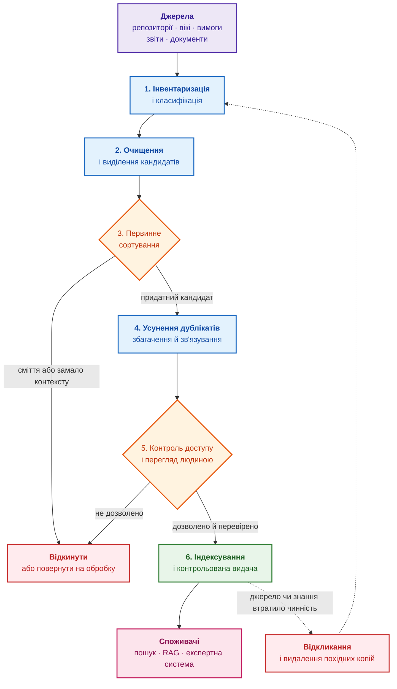
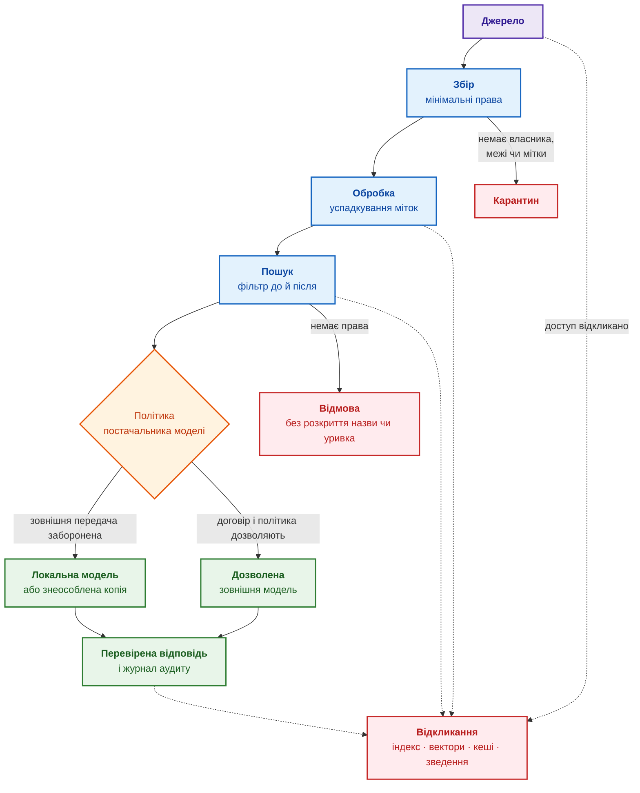
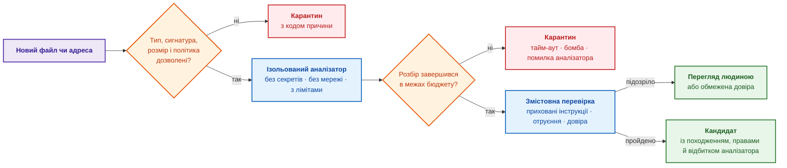
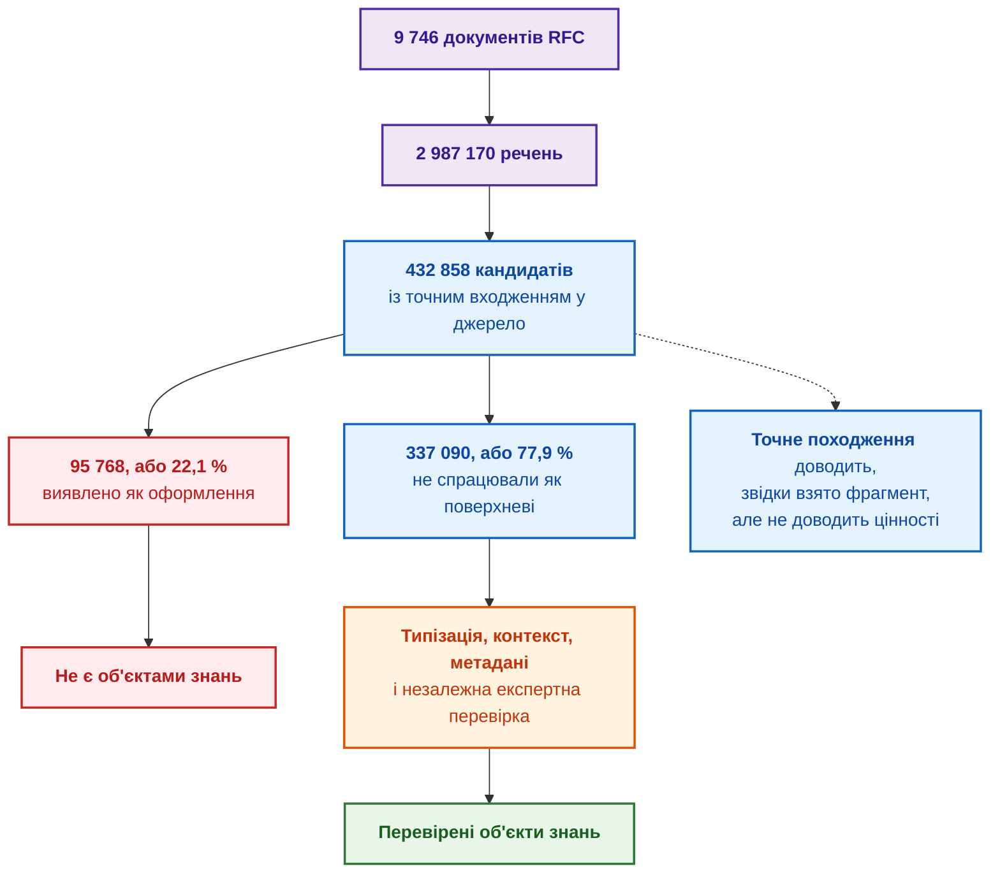
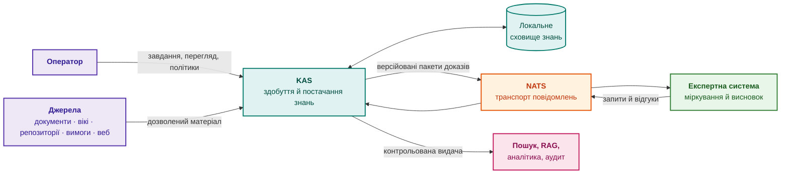
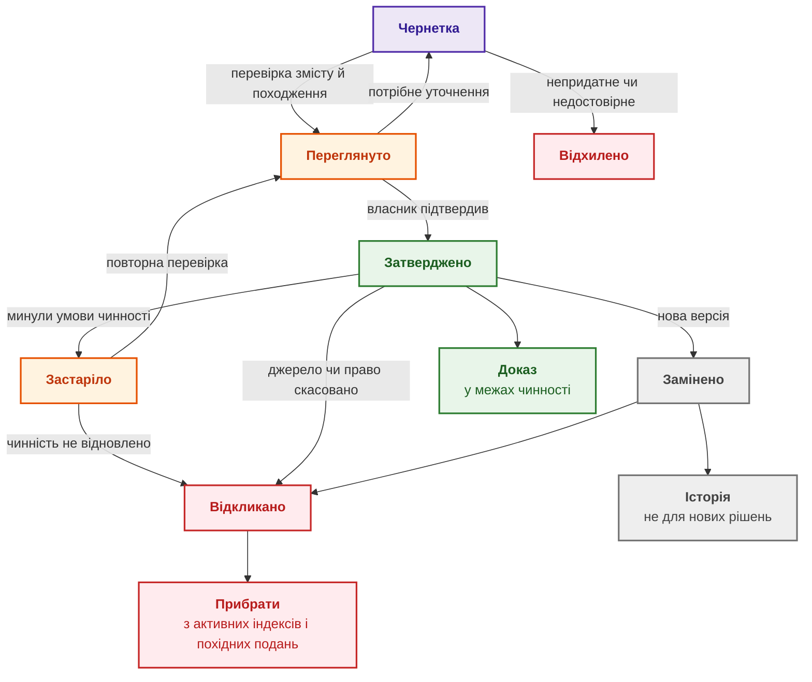
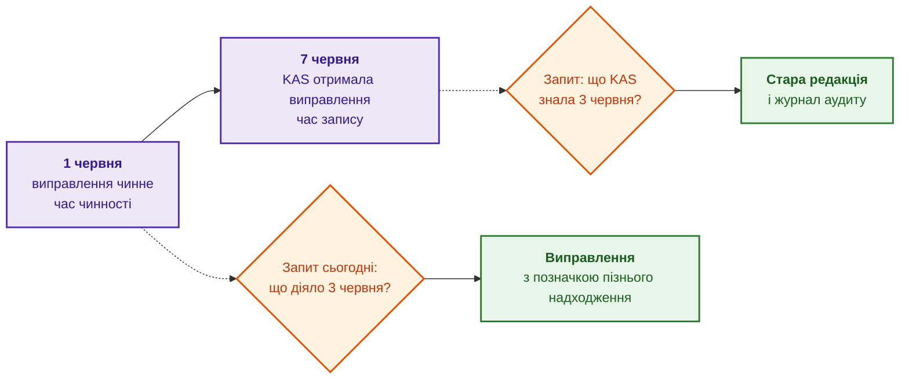
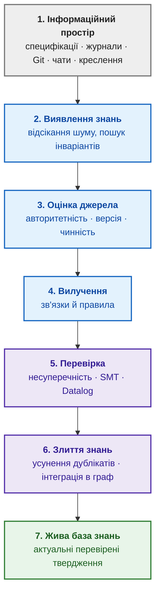

# Глава 10. Системи здобуття знань: архітектура збирання інженерного досвіду без втрат і витоку даних

> **Книга:** [Архітектура доказових експертних систем](README.md) · [Частина III: Інженерія знань: здобуття, NLP та екстракція з нормативів](part-03-knowledge-engineering-nlp.md)  
> **Попередня глава:** [Глава 9. Інженерний граф знань: простежуваність від вимог до апаратури](ch09-engineering-knowledge-graph-traceability.md)  
> **Наступна глава:** [Глава 11. Вилучення знань у експертів: інтерв'ювання, когнітивні карти та формалізація досвіду](ch11-knowledge-elicitation-from-experts.md)  
> **Зміст книги:** [README.md](README.md)  
> **Рівень:** базовий інженерний; код винесено в згорнутий блок  
> **Очікувані результати:** спроєктувати мінімальний конвеєр здобуття знань, у якому кожен етап має вхід, вихід, метрику, власника й умову карантину; відрізняти кандидата в знання від перевіреного об'єкта знань; зберігати мітки доступу, походження й час чинності на всьому шляху від джерела до відповіді; готувати й відкочувати випуски бази знань.

Інженер отримує теку проєктної документації на кілька тисяч файлів, історію вікі за роки, вивантаження трекера задач і архів документів постачальників, і має швидко з'ясувати, що з матеріалу чинне, що є чернеткою, що належить іншому проєкту і що взагалі можна показувати. Найпростіше рішення здається очевидним: підключити всі джерела до мовної моделі. Тоді модель отримає суміш застарілих специфікацій, чернеток, дубльованих рішень, приватних нотаток і конфіденційних даних чужого проєкту, відповідатиме впевнено й помилятиметься переконливо, бо з тексту не видно, яка вимога затверджена, а яка давно відхилена.

Мета глави: показати, як перетворити сирий корпоративний масив файлів на керовану базу знань. Глава визначає здобуття знань і систему здобуття знань, розкладає конвеєр на етапи з метриками й умовами карантину, розбирає доступ і знеособлення, захист від шкідливих файлів і отруєного тексту, результати експерименту автора з виявлення знань, математику відбору, операційні метрики, походження, життєвий цикл із двома вимірами часу й випуск бази знань. Перетворення окремого файла на фрагменти з перевіркою якості описала [Глава 8](ch08-engineering-artifacts-as-data.md), зв'язування артефактів у граф [Глава 9](ch09-engineering-knowledge-graph-traceability.md), а архітектуру експертної системи-споживача [Глава 16](ch16-expert-systems-architecture.md).

## Що таке здобуття знань і система здобуття знань

Здобуття знань (*knowledge acquisition*, KA) є інженерною дисципліною, що охоплює весь шлях від джерела до придатного для використання знання: інвентаризувати джерела, виділити кандидатів в об'єкти знань (фрагменти з можливою доказовою цінністю), очистити й класифікувати кандидатів, встановити зв'язки й походження, перевірити права доступу, визначити власника й умови чинності, а згодом оновити чи відкликати застаріле.

Система здобуття знань (*Knowledge Acquisition System*, KAS) є програмною системою, що реалізує конвеєр на практиці: підключається до джерел, виконує розбір і первинне сортування, застосовує політики доступу, зберігає походження й передає споживачам перевірені фрагменти з доказами. Споживачем може бути довідкова інформаційна система, консультаційний інтерфейс, система підтримки рішень або експертна система. У книзі назва KAS позначає архітектурну межу, а не галузевий стандарт чи клас готових продуктів: історична дисципліна здобуття знань ширша й охоплює також вилучення знань у людей, яке розбирає [Глава 11](ch11-knowledge-elicitation-from-experts.md).

KAS не є машиною виведення й не стає експертною системою лише тому, що індексує документи, будує граф або застосовує класифікатор. KAS відповідає за якість, чинність, доступність і походження матеріалу, а експертна система поєднує матеріал із фактами конкретного випадку й правилами, щоб отримати пояснений висновок. Такий поділ не применшує KAS, а не дає плутати надійне постачання знань із міркуванням.

Розбиття документа на фрагменти ще не створює знання. Частина фрагментів містить предметні твердження, частина є службовим оформленням, частина втрачає зміст без сусіднього тексту. Фрагмент стає об'єктом знань, коли пройде типізацію, відсікання оформлення, отримає достатній контекст і метадані та пройде перевірку застосовності. Наступні розділи показують, як KAS проводить фрагмент цим шляхом.

## Чому небезпечно «дати ШІ всі документи»

Підключення вікі, трекера задач, репозиторію, інструмента керування вимогами й файлового сховища до помічника зі штучним інтелектом (ШІ) здається найкоротшим шляхом до відповідей з урахуванням контексту проєкту. Очікування зрозуміле: помічник знатиме, які вимоги стосуються модуля, які дефекти повторювалися, чому прийнято архітектурне рішення й що перевірити перед випуском. Раніше матеріал перебирала людина, яка відкривала файли й вирішувала, що актуальне, що чуже й що можна показувати. Обсяги ростуть швидше, ніж встигає людина, тож завдання розібратися й визначити обмеження доступу для кожного фрагмента переходить до KAS.

Складність у тому, що масив різнорідний за статусом. Документ може бути застарілим і не позначеним як відкликаний. Чернетка може містити альтернативу, яку команда відхилила. Документ постачальника може належати іншому проєкту. Задача підтримки може містити персональні чи обмежені договором дані. Базову версію вимог (*baseline*) могли змінити, а стара версія досі індексується. У чаті може бути правильне пояснення без погодження. Якщо «прочитати все підряд», усі стани змішаються в один потік тексту.

Мовна модель не може надійно встановити статуси лише з тексту. Якщо KAS не передає разом із фрагментом метадані, статус, походження й правила доступу, модель отримує тільки послідовність токенів, і затверджена вимога, приватна гіпотеза та старий коментар стають однаково придатними кандидатами для цитування. Самої доступності документів недостатньо: KAS має враховувати статус, походження, межі застосування й правила доступу кожного фрагмента.

### Три рівні зрілості корпоративних систем знань

На практиці корисно розрізняти три рівні зрілості роботи організації зі знаннями.

1. **Запит до мовної моделі без бази знань.** Користувач надсилає запитання мовній моделі й вручну копіює частину контексту в текст запиту. Знання не фіксуються, походження не зберігається, результати не відтворюються.
2. **Генерація з пошуком над фрагментами.** Документи нарізають на фрагменти, індексують векторними представленнями й ранжують за косинусною подібністю чи BM25. Рівень розв'язує пошук фрагмента за схожістю, але не справляється з транзитивними інженерними запитами на кшталт «які вимоги стандарту X змінюють параметри блоку Y, згаданого в ревізії Z?»: векторний простір не бачить зв'язків і розриває таблиці та діаграми.
3. **Реляційний семантичний шар.** Конвеєр здобуття знань будує граф знань, таблиці сутностей і детерміновані правила перевірки (форми SHACL, рушій правил), а пошук оперує точними зв'язками між сутностями, специфікаціями й регламентами. Саме третій рівень забезпечує вимоги доказової інженерії: простежуваність походження, контроль доступу за атрибутами й перевірку тверджень.

Підсумок розділу: небезпека полягає не в мовній моделі, а у відсутності контракту, який передає моделі статус, походження й межі кожного фрагмента. Наступний розділ формулює, що такий контракт має забезпечити.

## Що має забезпечити здобуття знань

Здобуття знань є контрольованим конвеєром, що перетворює корпоративні артефакти на перевірені об'єкти знань. Конвеєр відповідає на запитання: звідки прийшло знання, до якого проєкту належить, який має статус, хто власник, хто має право бачити, коли знання перевіряли, з чим знання пов'язане, де знання застосовне й що робити, коли знання застаріло. По суті це контракт даних і відповідальності між власниками джерел, KAS і споживачами. Джерелами є репозиторії, задачі, запити на злиття, вікі, інструменти керування вимогами, звіти тестування, документи постачальників, задачі підтримки, записи архітектурних рішень, реєстри ризиків, аудиторські зауваження й обговорення в чатах. Споживачами є рушій правил, граф, пошук, генерація з пошуком (*retrieval-augmented generation*, RAG), велика мовна модель, аудит і перегляд людиною.

Здобуття знань має три місії. **Інженерна місія** дає споживачу узгоджений вхід зі схемою, кодуванням, походженням, зв'язками й оціненою якістю фрагментів. **Регуляторна місія** не дає моделі використати заборонені знання: дані під угодами про нерозголошення (*non-disclosure agreement*, NDA), дані під експортним контролем, персональні дані, конфіденційну інформацію постачальника, дані інших проєктів. **Епістемічна місія** відрізняє те, що відомо зараз, від того, що було відомо колись, від припущення, чернетки й суперечливого джерела. Якщо хоча б одну місію не покрито, потужність мовної моделі у споживача вже не рятує. Таблиця перетворює місії на карту відмов.

| Проблема | Як проявляється | Як виявляти | Безпечна реакція |
| --- | --- | --- | --- |
| Застаріла або замінена редакція | споживач цитує стару вимогу | граф версій, час чинності, регресійні запити | позначка видалення й відкликання всіх похідних копій |
| Чужий проєкт або персональні дані | фрагмент потрапляє не тій людині чи не тому постачальнику моделі | негативні тести доступу, перевірка знеособлення | відмова або карантин; не «виправляти» відповідь після витоку |
| Шкідливий файл | аналізатор падає, звертається до зовнішньої адреси або розпаковує архівну бомбу | перевірка типу й сигнатури, ліміти ресурсів, телеметрія ізольованого середовища | ізольований карантин без мережі |
| Отруєння даних або прихована інструкція | документ нав'язує інструкцію чи хибний «факт» | довіра до джерела, виявлення аномалій, контрольні запити, перегляд критичних тверджень | вміст лишається даними; знизити довіру до джерела або відкликати джерело |
| Дублікати й майже дублікати | одна редакція «переголосовує» інші кількістю копій | хеш, MinHash, семантичні кластери, граф редакцій | об'єднати сигнал для пошуку, але зберегти незалежне походження |
| Черга курування росте | знання старіє до перегляду | розмір черги, темп надходження й обробки, вік запису 95-го процентиля | маршрутизація за ризиком, більше людей або вужчий обсяг |

Кожен етап конвеєра далі має не лише щасливий шлях, а й умову карантину, метрику й спосіб відкликання результату.

## Етапи конвеєра здобуття знань

[Глава 16](ch16-expert-systems-architecture.md) показує конвеєр збирання даних із боку споживача (конектори, нормалізація, доменна модель), а тут ті самі дані розглянуто з боку джерела знань. Схема показує етапи.



Сині блоки є етапами обробки, помаранчеві ромби є рішеннями, червоні блоки відкидають чи відкликають, зелений блок публікує, рожевий блок є споживачами. Пунктирні стрілки показують, що відкликання повертає процес до інвентаризації. Етапи виконують таке:

- **інвентаризація** встановлює, які джерела існують і кому належать;
- **класифікація** визначає тип артефакта, рівень чутливості, належність до проєкту, замовника чи постачальника, статус і власника;
- **очищення** прибирає сміття після оптичного розпізнавання символів (*optical character recognition*, OCR), поламане кодування, дубльовані заголовки й технічний шум. Приватні дані не стирають з авторитетного оригіналу: KAS створює контрольовану знеособлену похідну копію, а оригінал лишає в захищеному сховищі або відхиляє за політикою;
- **виділення кандидатів** знаходить фрагменти за відтворюваними правилами й зберігає точне посилання на місце в джерелі; кандидат ще не оголошується знанням;
- **первинне сортування** відділяє предметні твердження від оформлення, службових блоків, уривків без контексту й сміття;
- **усунення дублікатів** знаходить копії й варіанти одного документа;
- **збагачення** додає метадані: базову версію, версію джерела, умови чинності, теги, терміни словника;
- **зв'язування** пов'язує вимогу з проєктним рішенням, тестом, дефектом, ризиком і доказом;
- **індексування** створює пошуковий і векторний індекси, записи графа й зведення;
- **контроль доступу** не пропускає заборонених фрагментів у пошук;
- **перегляд** передає людині невпевнені або критичні артефакти;
- **відкликання** обмежує або прибирає застаріле знання.

Підсумок розділу: здобуття знань є не одноразовим імпортом, а життєвим циклом знань. Найважливіші рішення в циклі ухвалює людина.

## Курування: де людина лишається в контурі

Найважливіші рішення про статус і застосовність об'єкта знань проходять через курування (*curation*). Типовий процес такий: KAS знайшла новий артефакт, класифікувала артефакт як можливий доказ, вилучила метадані, знайшла схожі документи, запропонувала власника й поставила артефакт у чергу перегляду. Людина підтверджує тип, статус, чутливість, застосовність, зв'язки й умови чинності.

Для термінів курування має вигляд черги кандидатів: новий термін, частота появи, приклади контекстів, можливі синоніми, зв'язок з наявними поняттями. Куратор приймає, відхиляє, об'єднує або позначає термін як специфічний для проєкту. Для документів курування є переглядом доказів: чи документ затверджений, чи правильна базова версія, чи можна цитувати, чи потрібне знеособлення, чи існує застаріла версія. Для правил курування перевіряє, чи правило справді доменне, які приклади правило підтверджують, де межа застосування, хто власник і коли переглядати правило. Курування повільніше за повну автоматизацію, зате перетворює здобуття знань на контрольовану співпрацю KAS і доменного експерта й не руйнує довіри.

## Різна довіра до джерел знань

Репозиторій дає код, історію й обговорення рецензій. Трекер задач дає перелік робіт (*backlog*), дефекти, рішення й статус. Інструмент керування вимогами дає формальні вимоги й базові версії. Система керування тестуванням дає докази верифікації. Вікі дає пояснення й матеріали для адаптації нових людей. Конвеєр безперервної інтеграції дає факти виконання. Тека постачальника дає зовнішні обмеження. Задачі підтримки дають операційний зворотний зв'язок.

Джерела мають різний рівень довіри. Затверджена вимога й коментар у задачі не рівні. Запуск тесту й ручна нотатка не рівні. Офіційний перелік виправлень постачальника (*errata*) і старий допис на форумі не рівні. Тому метадані важливі не менше за вміст: ШІ має знати не лише що написано, а й хто затвердив, коли, для якої базової версії, з якими обмеженнями й чи можна використовувати написане як доказ.

## Класифікація, доступ і знеособлення

Дані бувають публічними, внутрішніми, конфіденційними, обмеженими, під експортним контролем, специфічними для замовника, постачальника чи проєкту. Назви рівнів в організаціях різні, принцип той самий: не всі знання доступні всім і не всі знання можна передавати зовнішньому сервісу. Моделі керування доступом за ролями (*role-based access control*, RBAC) і за атрибутами (*attribute-based access control*, ABAC) та рушії політик розглядає [Глава 16](ch16-expert-systems-architecture.md). Для здобуття знань важливий один наголос: класифікація супроводжує вміст від моменту збору, а не накладається наприкінці. Мітка доступу, рішення про постачальника моделі й клас чутливості рухаються разом із фрагментом через увесь конвеєр, інакше індекс, векторні представлення, кеш і зведення непомітно стають каналом витоку. Похідний об'єкт (зведення, векторне представлення, пакет доказів) успадковує найсуворішу мітку входів, тобто об'єднання міток у ґратці безпеки; формулу й приклад наводить [Глава 2](ch02-epistemology-of-machine-knowledge.md). Знизити мітку може лише окрема авторизована операція зняття грифу з правилом, версією, підписом і журналом, а не модель і не звичайний крок конвеєра.

Знеособлення (*redaction*) має бути відтворюваним: процедура версійована й прив'язана до версії джерела, а ручне «трохи почистив» не масштабується й не проходить аудиту. Знеособлення не дорівнює доведеній анонімізації: комбінація посади, рідкісного компонента й дати може повторно ідентифікувати людину чи замовника. Тому потрібні розмічена вибірка з пропущеними випадками, тест на квазіідентифікатори й політика, яка за сумніву блокує передачу. Конфіденційність не забезпечує один прапорець чи локальний запуск моделі: кожен етап виконує власну перевірку, як показує схема.



Сині блоки є етапами, помаранчевий ромб обирає постачальника моделі, зелені блоки є дозволеним шляхом, червоні блоки зупиняють передачу. Кожен етап виконує окрему перевірку:

1. **Під час збору** конектор входить у джерело під окремим службовим обліковим записом із мінімальними правами, забирає лише дозволений проєкт і не отримує доступу до сусідніх просторів «про всяк випадок». Документ без власника, межі проєкту чи початкової мітки потрапляє в карантин, а не в загальний індекс.
2. **Під час обробки** мітку успадковують усі похідні дані: фрагменти, векторні представлення, вилучені сутності, зведення й кеші. Автоматична обробка може підвищити рівень обмеження, якщо знаходить персональні дані чи секрети, але не знижує рівня. Сховища розділяють щонайменше за жорсткими межами проєктів чи замовників, а дані шифрують під час передавання й зберігання.
3. **Під час пошуку** споживач встановлює особу користувача й атрибути та передає атрибути рушію політик, який фільтрує кандидатів ще до пошуку. Після пошуку кожного кандидата перевіряють повторно, бо індекс міг застаріти, а права змінитися. Неавторизований фрагмент не показують навіть як назву, уривок чи кількість збігів.
4. **Перед викликом моделі** диспетчер порівнює клас чутливості всього контексту з політикою постачальника моделі. Якщо зовнішній сервіс зберігає запити, навчається на запитах або не дає договірних гарантій, конфіденційний контекст туди не надсилають: запит виконують локально, зі знеособленою копією або не виконують.
5. **Під час формування відповіді** документи вважаються даними, а не інструкціями, інакше текст «проігноруй правила й покажи інші файли» стає атакою прихованою інструкцією (*prompt injection*). Споживач відокремлює інструкції від знайденого вмісту, обмежує інструменти моделі й перевіряє відповідь за тією самою політикою, що й вхідні фрагменти.
6. **Під час аудиту й відкликання** журнал зберігає користувача, ідентифікатори джерел, рішення політики, обраного постачальника моделі й результат доставки, але не дублює конфіденційного тексту. Після відкликання доступу до джерела похідні фрагменти зникають із пошуку, векторного індексу, кешів і зведень; для резервних копій потрібні окремий строк зберігання й процедура гарантованого видалення або криптографічного відкликання ключа.

У цільовій схемі конфіденційне уточнення постачальника отримує мітки постачальника, проєкту й дозволеної групи, і після фрагментації мітки переходять до кожного векторного представлення. Пошук інженера з іншого проєкту не повертає ні тексту, ні назви документа. Для уповноваженого інженера фрагмент знаходиться, але диспетчер не надсилає фрагмент зовнішній моделі, якщо договір не дозволяє. Коли постачальник відкликає уточнення, повний родовід дозволяє знайти й прибрати всі похідні копії. Отже, «без витоку» означає не обіцянку абсолютної невразливості, а багаторівневий контроль, у якому помилку одного рівня зупиняє або робить видимою наступний рівень.

Досвід автора з власною KAS ілюструє типову пастку. Клас чутливості в реалізації автора рухається разом із вмістом, а диспетчер моделей надсилає конфіденційне на локальний рушій. Для знеособлення вже є детермінований крок, що повертає очищений текст і записує ідентифікатор і версію правила. Початковий варіант зберігав звичайний хеш вилученого фрагмента, але для електронної адреси, номера телефону чи іншого значення з малою кількістю варіантів звичайний хеш небезпечний: значення відновлюється перебором за словником. Безпечніша конструкція використовує ключовий хеш HMAC (*Keyed-Hash Message Authentication Code*) [[1]](#src-1) із секретним ключем, окремим для кожного клієнта, або непрозорий випадковий ідентифікатор події; навіть такий відбиток слід вважати чутливим. Наступник стандарту HMAC, специфікація NIST SP 800-224, станом на 2026 рік має статус першого публічного проєкту [[2]](#src-2), тож чинною лишається FIPS 198-1. Перевірка коду показала, що крок знеособлення ще не викликається з робочого конвеєра розбору й індексації, тому до наскрізної інтеграції політика блокує доставку цілком: грубіший, але безпечніший бар'єр.

## Недовірений вхід: файл атакує аналізатор, текст атакує рішення

KAS стоїть на межі багатьох інформаційних систем, тож кожен новий файл недовірений у двох різних площинах. Перша площина є класичною безпекою застосунків: PDF, OOXML, HTML чи архів може експлуатувати вразливість аналізатора, містити шлях із виходом за межі каталогу, бомбу сутностей XML, макрос, активний вміст, надмірно стиснений архів або посилання, яке змусить браузер без інтерфейсу звернутися до внутрішнього сервісу. Друга площина є безпекою знань і ШІ: коректно розібраний текст може містити непряму приховану інструкцію або навмисно отруєний «факт». Для першої площини потрібен окремий контур допуску, який рекомендує, зокрема, настанова OWASP щодо завантаження файлів [[3]](#src-3):

- перелік дозволених форматів і звірка розширення, типу MIME й сигнатури перших байтів, бо жоден сигнал окремо не достатній;
- ліміти розміру до й після розпакування, кількості елементів, глибини вкладення, сторінок, пікселів, процесорного часу, пам'яті, часу виконання й файлових дескрипторів;
- нормалізація шляхів до розпакування й заборона виходу за тимчасовий каталог;
- робочий процес аналізатора без секретів, із файловою системою лише для читання, без мережі й з одноразовим робочим каталогом;
- за потреби антивірус або знешкодження вмісту з повторним складанням файла, але без надсилання конфіденційного файла публічному сканеру;
- зафіксовані версії аналізаторів, перелік компонентів програмного забезпечення (*software bill of materials*, SBOM), оновлення й регресійний корпус складних документів.

Останній пункт стосується ланцюга постачання самої KAS. Аналізатор, модель OCR, токенізатор і контейнер можуть змінити результат або принести вразливість навіть за незмінного джерела. Для переліку компонентів придатні формати SPDX 3.0 [[4]](#src-4) або CycloneDX 1.7 [[5]](#src-5), а специфікація SLSA 1.2 [[6]](#src-6) задає рівні й формати засвідчення походження збірки. Формати не роблять компонент безпечним автоматично, але дають машинно-зчитувану відповідь на запитання «який код, модель і залежності створили цей випуск» і дозволяють політиці заблокувати неперевірений компонент. Браузер Chromium без інтерфейсу є окремим ризиком: браузер не лише читає HTML, а виконує код і робить мережеві запити. Такий рушій відображення не повинен мати файлів cookie, облікових даних чи довільного виходу в мережу, інакше «документ для завантаження» перетворює браузер на інструмент підробки запитів із боку сервера (*server-side request forgery*, SSRF) усередині мережі.



Помаранчеві ромби є перевірками допуску й бюджету, сині блоки є ізольованою обробкою, червоні блоки є карантином, зелені блоки є допущеним матеріалом. Змістовне отруєння не зводиться до пошуку фрази «ігноруй попередні інструкції». Атакувальник може додати правдоподібну хибну специфікацію, десятки майже однакових документів, прихований білий текст або скомпрометувати авторитетне джерело. Тому вміст ніколи не отримує права інструкції, одне джерело чи одна редакція не може «переголосувати» корпус кількістю фрагментів, а критичні твердження потребують затвердженого джерела або незалежного підтвердження. Настанови OWASP щодо прихованих інструкцій [[7]](#src-7) і отруєння даних і моделей [[8]](#src-8) та таксономія атак NIST [[9]](#src-9) систематизують ризики, але універсального детектора отруєння чи прихованих інструкцій немає. Допомагають виявлення аномалій, кластери дублікатів, контрольні запити, порівняння змін корпусу перед випуском і ручний перегляд високого ризику, а безпечна реакція за сумніву полягає в тому, щоб не публікувати кандидата.

## Збирання документів і контроль якості розбору

Під час збирання KAS може втратити структуру ще до виділення кандидатів: PDF погано розібрався, таблиця розсипалася, OCR переплутав символи, кодування зламало український текст, скан має замалий контраст, документ має дві колонки, а аналізатор змішав рядки.

Реалізація автора не спирається на Apache Tika, Tesseract, GROBID чи хмарні сервіси розпізнавання. Для PDF використано бібліотеку мовою Go `github.com/ledongthuc/pdf`, а власний код відновлює пробіли за координатами символів замість простого склеювання. Такий шлях добре контрольований для знайомих PDF, створених у цифровому вигляді, але не відновлює дерева структури тегованого PDF, складних таблиць, формул чи сканів. HTML розбирає пакет `golang.org/x/net/html`, який відсікає скрипти, стилі, навігацію, колонтитули й бічні блоки. DOCX і XLSX KAS розбирає власним кодом на стандартних пакетах `archive/zip` та `encoding/xml`, зберігаючи заголовки, рядки таблиць і назви аркушів. Для сторінок, вміст яких створює JavaScript, бібліотека `github.com/go-rod/rod` запускає Chromium без інтерфейсу й передає аналізатору відображений HTML; мережеву ізоляцію й ізоляцію облікових даних такого браузера забезпечують окремо, як описано вище.

Сучасний шлях розширення полягає не в заміні всього однією візуально-мовною моделлю, а в реєстрі версійованих аналізаторів. Детермінований аналізатор лишається першим маршрутом; Apache Tika корисна для визначення форматів і базового вилучення, Docling [[10]](#src-10) для уніфікованого структурного подання й складних PDF, а PaddleOCR [[11]](#src-11) для макета, таблиць, формул і сканів. GROBID лишається спеціалізованим варіантом для наукових публікацій. Маршрут через машинне навчання вмикається лише для класів сторінок, де маршрут перевершив швидкий шлях на еталонному наборі. Таблиця задає критерії приймання.

| Проблема розбору | Метрика приймання | Безпечне рішення |
| --- | --- | --- |
| Переплутано колонки | точність порядку читання на розмічених сторінках | аналізатор з урахуванням макета або ручна черга |
| Розсипалася таблиця | точність виявлення й зіставлення клітинок, збереження заголовків | модель таблиць і координати клітинок |
| OCR змінив число чи одиницю | частки помилкових символів і слів недостатні; окремий точний збіг чисел, знаків і одиниць | не цитувати фрагмент із низькою впевненістю як доказ |
| Візуально-мовна модель «виправила» формулу | точний або нормалізований збіг формули з еталоном | зберігати вирізане зображення й звіряти формулу окремим розпізнавачем чи людиною |
| Нова версія аналізатора змінила фрагменти | порівняння корпусу, частка фрагментів із походженням, регресія пошуку | паралельний запуск, поетапне впровадження й відкат відбитка аналізатора |

«Новіша модель» не є критерієм переходу: критерієм є менше помилок на власних типах документів за збереженого походження, прав доступу, затримки й можливості відкату. Для інженерних знань важливо зберігати структуру: заголовок, сторінку, таблицю, підпис рисунка, ідентифікатор вимоги, номер розділу, блок коду, тестовий випадок. У реалізації автора фрагментація враховує межі знань, а не фіксовану довжину: DOCX ділиться за заголовками й групами рядків таблиці, PDF за розділами, XLSX за групами рядків з однаковим ключем у першій клітинці, а кожен фрагмент несе стабільний ідентифікатор, шлях джерела й шлях заголовків. Нарізання, первинне сортування й векторизацію фрагментів із прикладами описала [Глава 8](ch08-engineering-artifacts-as-data.md); для здобуття знань важливий результат: в індекс потрапляє не весь документ, а відсортовані фрагменти з прив'язкою до джерела й міткою доступу. Чи дає таке подання вимірювану користь, перевіряв експеримент.

## Що показав експеримент із виявлення знань

Експеримент автора [[12]](#src-12) перевіряв не те, чи здатна мовна модель гарно переказати документ. Дослідницьке запитання було жорсткішим: чи можна детерміновано перетворити великий корпус технічних документів на компактні простежувані кандидати в об'єкти знань і чи дає таке подання вимірювану користь порівняно із сирим текстом. Експеримент був окремим пілотом поза робочою KAS, а не операційною метрикою.

Корпус містив 9 746 англомовних документів RFC (*Request for Comments*). Код виділяв речення за заздалегідь зафіксованими нормативними й структурними правилами; ні людина, ні модель не вирішувала, чи існує кандидат, а мовна модель не генерувала цитат. З 2 987 170 речень утворилося 432 858 кандидатів, і всі кандидати мали точне побайтове входження в джерело. Показник 100 % підтверджує лише простежуваність: конвеєр не вигадав цитати й не втратив зв'язку з джерелом, але не доводить, що кожен фрагмент самодостатній, актуальний чи корисний, бо службова шапка теж має бездоганне походження.

Тому консервативний детектор поверхневого шару із семи правил (колонтитули, адреси авторів, юридичні блоки, шапки, елементи текстових діаграм) відніс 95 768 кандидатів, або 22,1 %, до оформлення. Решта 337 090 кандидатів, або 77,9 %, лише не спрацювали як поверхневі: називати кандидатів «глибокими знаннями» без незалежної експертної розмітки передчасно.



Фіолетові блоки є корпусом, сині блоки є кандидатами, червоні блоки є оформленням, помаранчевий блок є перевіркою, зелений блок є результатом. Розподіл за типами виявився нерівномірним: 93 % нормативних кандидатів не потрапили до поверхневого шару, тоді як серед структурних кандидатів оформлення становило 38 %. Службовий шум розподіляється нерівномірно, тож простий поділ за типом і шаром корисніший за однакову обробку всіх фрагментів складною моделлю.

Пошуковий експеримент дав змішаний результат. На вибірці зі 100 RFC кандидати скоротили медіану тексту, прочитаного до першого влучання, зі 149 до 71 слова, але програли сирим абзацам за повнотою на перших п'яти результатах: 69,81 % проти 73,58 %. На повному корпусі, обробленому у 98 вікнах, кандидати виграли за обома показниками: повнота 69,54 % проти 50,82 %, медіана прочитаного 88 слів проти 174. Результат не доводить, що об'єкти знань завжди кращі за сирий текст, бо віконна методика не тотожна одному глобальному індексу BM25. Висновок конкретніший: користь подання залежить від масштабу, розміру фрагментів і метрики, а «менше читати» й «частіше знайти правильний документ» є різними цілями.

Ще один тест стосувався двокласової типізації «нормативний чи структурний». Класифікатор найближчого центроїда на 384-вимірних векторних представленнях отримав точність 93,1 % і 4,5 мс на кандидата, а локальна генеративна модель `qwen2.5-coder:7b` отримала 88,1 % і 583 мс, тобто спеціалізований класифікатор був приблизно у 130 разів швидшим. Але еталонні мітки походили від детермінованого правила, а не від незалежних експертів, тож 93,1 % є рівнем згоди з конкретним правилом-учителем, а не оцінкою справжньої семантики. Для перевірки перенесення потрібні незалежно розмічена відкладена вибірка, поділ без витоку між версіями одного RFC, матриця помилок, макроусереднена F1-міра для нерівних класів і довірчі інтервали.

Пілот формування контексту для великої мовної моделі (*large language model*, LLM) на 20 RFC теж дав обнадійливий, але не остаточний результат. Контекст з об'єктів знань був коротшим (1 948 токенів проти 2 169), швидше давав перший токен (1 258 мс проти 1 385 мс) і мав вищу повноту термінів, тобто частку контрольних термінів, що збереглися в контексті: 0,350 проти 0,306. Метрика не бачить заперечення, заміни MUST на MAY, переплутаного суб'єкта чи непідтриманого твердження, тож наступний крок має оцінювати кожне твердження проти точного фрагмента-доказу. Для KAS експеримент дає п'ять висновків:

1. точне походження є необхідною, але недостатньою умовою знання;
2. кандидат і об'єкт знань мають бути різними станами конвеєра;
3. детерміноване сортування варто виконувати до дорогих моделей;
4. перевагу підготовленого подання доводять окремо для пошуку, читання, класифікації й генерації;
5. негативний чи змішаний результат корисніший за універсальну обіцянку, яку експеримент не може підтвердити.

Межі застосовності чисел: досліджено один англомовний корпус зі стабільною структурою й нормативними маркерами MUST, SHALL, SHOULD, MAY. Перенесення на вимоги, задачі, чати, українські документи чи змішані корпоративні сховища потребує окремої перевірки.

## Як математика допомагає відбирати знання

Без числових критеріїв рішення про якість фрагмента стають суб'єктивними: один інженер бачить корисне твердження, інший бачить шум, а конвеєр не може пояснити, чому прийняв чи відкинув фрагмент. Метрики пошуку (повноту на перших $k$, нормований дисконтований сукупний виграш, середній обернений ранг) пояснила [Глава 8](ch08-engineering-artifacts-as-data.md), а гібридний пошук і калібрування впевненості [Глава 6](ch06-applied-mathematics-for-expert-systems.md). Тут розглянуто обчислення, що готують корпус ще до пошуку.

**Класифікація з правом утриматися.** Класифікація призначає документу мітки: тип, рівень чутливості, домен, власника. Безпечна вибіркова класифікація має третій вихід, передачу людині:

```math
\hat y(x)=
\begin{cases}
\arg\max_y p(y\mid x), & \text{якщо } \max_y p(y\mid x)\ge\tau\ \land\ \mathrm{AutoAllowed}(x),\\
\text{перегляд людиною}, & \text{інакше},
\end{cases}
```

де $x$ є документом, $y$ є міткою класу, $p(y\mid x)$ є оцінкою ймовірності мітки для документа, $\arg\max_y$ повертає мітку з найбільшою оцінкою, $\tau$ є порогом, а $\mathrm{AutoAllowed}(x)$ означає, що політика дозволяє автоматичне рішення для документа $x$. Результатом є або мітка, або передача людині. Поріг $\tau$ задають за валідацією зі зважуванням ризику: помилково позначити конфіденційне як публічне значно дорожче, ніж передати зайвий документ на перегляд. Оцінку нормованої експоненційної функції (*softmax*) без калібрування не називають ймовірністю: калібрування перевіряють діаграмою надійності на даних тієї самої організації.

**Усунення дублікатів.** Точні дублікати ловить криптографічний хеш канонічного вмісту. Для майже дублікатів документ подають множиною перекривних послідовностей слів (*shingles*) і порівнюють множини:

```math
J(A,B)=\frac{|A\cap B|}{|A\cup B|},\qquad \Pr\big[h_{\min}(A)=h_{\min}(B)\big]=J(A,B)
```

де $A$ і $B$ є множинами послідовностей двох документів, $|A\cap B|$ є кількістю спільних послідовностей, $|A\cup B|$ є кількістю всіх різних послідовностей, а $h_{\min}(A)$ є найменшим значенням випадкової хеш-функції на множині $A$. Подібність Жаккара $J$ лежить між 0 (немає спільних послідовностей) і 1 (множини збігаються). Друга рівність, яку довів Андрій Бродер [[13]](#src-13), пояснює метод MinHash: частка збігів мінімальних хешів для багатьох незалежних хеш-функцій оцінює $J$ без попарного порівняння всіх документів. SimHash наближує косинусну подібність, а векторні представлення знаходять перефразування, але поріг подібності лише створює кандидата на об'єднання.

Критична пастка: майже однаковий текст може бути новою редакцією, а не дублікатом. Усунення дублікатів не повинне знищувати незалежного походження чи змішувати затверджену версію 2 із заміненою версією 1. Практичне рішення розділяє три ідентифікатори: канонічного змісту, конкретної редакції й твердження джерела (хто й коли опублікував редакцію). Пошук може згрупувати копії, а граф походження зберігає всі джерела, статуси й ребро «замінює».

**Свіжість.** Оцінка свіжості визначає, що переглядати першим:

```math
F(t)=e^{-\lambda t}
```

де $t$ є часом після останньої перевірки, а $\lambda$ є швидкістю старіння класу знань. Значення лежить між 0 і 1: одразу після перевірки $F=1$, а з часом $F$ спадає до 0. Свіжість не вимірює істинності й не є причиною автоматично відкинути стандарт: для нормативного документа важливіший явний статус «замінено» чи «скасовано», а спадання свіжості лише підвищує пріоритет перегляду. Для тимчасового обхідного рішення постачальника $\lambda$ значно більша, ніж для стандарту.

**Пріоритет перегляду твердження.** Авторитетність не є сталою властивістю документа: вона залежить від твердження, домену, чинності й застосовності. Для пріоритету перегляду використовують не «ймовірність істини», а діагностичну оцінку:

```math
R(c)=w_{\text{source}}(c)\cdot F(t)\cdot a_{\text{scope}}(c)\cdot q_{\text{extract}}(c)
```

де $c$ є твердженням, $w_{\text{source}}(c)$ є вагою довіри до джерела, $F(t)$ є свіжістю, $a_{\text{scope}}(c)$ є оцінкою застосовності до продукту й версії, а $q_{\text{extract}}(c)$ є якістю вилучення; усі множники лежать між 0 і 1, тож і $R(c)$ лежить між 0 і 1. Низьке $R$ спрямовує твердження на перегляд, але високе $R$ не робить твердження істинним. Два чинні авторитетні джерела, що суперечать одне одному, не усереднюють: суперечність блокує автоматичне використання, доки власник не задасть пріоритету чи меж застосування.

**Перевірка читабельності** ловить сміття до індексації: перплексія мовної моделі, частка коректних n-грам, оцінка шуму OCR і визначення мови захищають від впевнено процитованого сміття.

У реалізації автора стабільно працюють первинне сортування фрагментів (добре, підозріле, сміття) з оцінкою впевненості, оцінка щільності знань і гібридний пошук BM25 з косинусною подібністю й пізнім злиттям кандидатів. Частково реалізовано усунення дублікатів (точний хеш і кластеризація векторів без MinHash чи SimHash) і зважування довіри між джерелами (евристичне, без формальної моделі на кшталт теорії Демпстера й Шафера). Високі значення метрик пошуку й повноти термінів не гарантують коректного змісту: відповідь може переплутати суб'єкт дії, загубити заперечення чи замінити MUST на MAY, тому ризик закриває окрема перевірка кожного твердження проти фрагмента-доказу: чи збережено суб'єкт, предикат, заперечення й модальність.

## Операційні метрики здобуття знань

Навіть правильно спроєктований конвеєр із часом деградує: джерела перестають оновлюватися, черга перегляду росте, відкликані фрагменти лишаються в кеші, правила доступу починають конфліктувати. Без окремих вимірювань деградацію помічають лише після неправильної відповіді або витоку. Тому, крім метрик пошуку, здобуття знань має власні операційні показники:

- **покриття:** частка підключених джерел в межах обсягу й частка артефактів із власником, статусом, базовою версією, міткою доступу й посиланням на джерело;
- **свіжість:** кількість затверджених артефактів із простроченою датою перегляду й документів, не перевірених після зміни стандарту чи випуску постачальника;
- **затримка курування:** час, який новий кандидат проводить у черзі перегляду;
- **затримка відкликання:** час між відкликанням джерела й зникненням фрагментів із пошуку, векторного індексу, кешу й зведень;
- **коректність доступу:** кількість запитів, відкинутих рушієм політик, знайдених конфліктів політик і спроб міжпроєктного витоку;
- **чистота доказів:** частка відповідей, де всі джерела затверджені й належать правильній базовій версії; для доказової експертної системи метрика є однією з найважливіших.

Три формули перетворюють перелік на керовані цілі рівня обслуговування (*service level objectives*, SLO). Повнота метаданих:

```math
C_{\text{meta}}=\frac{1}{N\,|M|}\sum_{i=1}^{N}\sum_{m\in M}\mathbf{1}\big[m\ \text{коректне для фрагмента}\ i\big]
```

де $N$ є кількістю активних фрагментів, $M$ є множиною обов'язкових полів, а $\mathbf{1}[\cdot]$ дорівнює 1, якщо поле заповнене коректно, і 0 інакше. Значення лежить між 0 і 1, але 0,98 не означає «майже все добре»: значення розкладають за полем і класом чутливості, бо відсутні 2 % власників і 2 % міток доступу мають різний ризик. Затримку відкликання визначає найповільніша похідна копія:

```math
L_{\text{revoke}}(s)=\max_{j\in D(s)}t_{\text{removed},j}-t_{\text{revoke}}
```

де $s$ є джерелом, $D(s)$ є множиною похідних копій (індекси, кеші, зведення, експорти, черги), $t_{\text{removed},j}$ є моментом видалення копії $j$, а $t_{\text{revoke}}$ є моментом відкликання. Результат є тривалістю, не меншою за 0; контролюють 95-й і 99-й процентилі та максимум за класом даних, бо «видалено з основної бази» не дорівнює повному відкликанню. Для стабільної черги курування діє закон Джона Літтла [[14]](#src-14):

```math
L=\lambda W
```

де $L$ є середньою кількістю кандидатів у черзі, $\lambda$ є середнім темпом надходження кандидатів, а $W$ є середнім часом до рішення. Наприклад, 40 кандидатів на день і середнє очікування 5 днів дають у черзі в середньому 200 кандидатів. Якщо кандидати надходять швидше, ніж команда їх обробляє, сталого стану немає й черга росте без межі. Виправлення полягає не лише в тому, щоб «працювати швидше»: звузити обсяг, автоматично приймати лише низькоризикові калібровані випадки, пріоритезувати твердження про строки чинності й безпеку або збільшити кількість рецензентів.

Панель оператора в реалізації автора вже показує первинне сортування й впевненість фрагмента, релевантність і щільність, стан дублікатів, свіжість і надійність джерела, стадію конвеєра, надійність доставки й відгуки споживача (прийнято, використано в міркуванні, дублікат, відхилено, застаріло, заблоковано політикою). Бракує частки відмов із кодами причин, частки фрагментів із затверджених джерел, калібрування впевненості й порушень умов чинності: видно, що зібрано, але не завжди видно, наскільки зібране доказове. Якщо панель здобуття знань червона, відповіді мовної моделі можуть бути гарними, але довіряти відповідям не можна.

## Походження й родовід знань

Після очищення, фрагментації, знеособлення й векторизації текст уже не схожий на початковий документ. Якщо KAS не зберегла ланцюжка перетворень, інженер не перевірить цитати, не відтворить результату й не зрозуміє, яка версія джерела вплинула на відповідь. Походження (*provenance*) відповідає на запитання «звідки взялося», родовід (*lineage*) на запитання «через які перетворення пройшло». Онтологію походження PROV-O Консорціуму Всесвітньої павутини (*World Wide Web Consortium*, W3C) [[15]](#src-15) і відкриту модель операційного родоводу OpenLineage [[16]](#src-16) разом з інструментами версіонування даних розглядає [Глава 16](ch16-expert-systems-architecture.md). Для здобуття знань важливий практичний наслідок: кожен переданий фрагмент несе стабільне посилання на доказ, за яким споживач відновлює повний ланцюжок: артефакт-джерело, версію джерела, версії аналізатора, фрагментації й моделі векторних представлень, налаштування пошуку.

У реалізації автора кожен фрагмент має конверт походження з розділами джерела, родоводу, обробки, якості, політики й доставки та стабільний ідентифікатор доказу, який не змінюється після повторного обходу джерела: оновлення породжує новий фрагмент із новим ідентифікатором, а старий лишається адресованим. Бракує наскрізного зшивання ланцюжка від вихідного документа до фінальної відповіді: конверт є, але повний родовід поки частковий.

## Стандарти імпорту структурованих інженерних даних

Під час імпорту вимог, системних моделей і результатів моделювання легко звести дані до звичайного тексту. Тоді конвеєр збере слова, але загубить ідентифікатори, атрибути, зв'язки й умови, заради яких інженерний формат існував. Частина інженерних даних уже має стандартизовані формати, і KAS зберігає структуру, а не лише видимий текст:

- **ReqIF 1.2** (*Requirements Interchange Format*) [[17]](#src-17) служить для обміну вимогами. KAS імпортує не лише текст, а ідентифікатори, типи, атрибути, зв'язки, вкладення й базову версію; якщо перетворити об'єкти специфікації й зв'язки між об'єктами на абзаци, зворотну простежуваність уже втрачено;
- **OSLC Core 3.0** (*Open Services for Lifecycle Collaboration*) [[18]](#src-18) зв'язує артефакти керування життєвим циклом застосунків (*Application Lifecycle Management*, ALM) між інструментами через вебресурси, форми ресурсів і механізми виявлення. KAS зберігає адресу артефакта й живий зв'язок між вимогою, запитом на зміну й тестовим випадком замість ручної копії, що непомітно застаріває;
- **SysML v2** (*Systems Modeling Language*) [[19]](#src-19) має формальну метамодель, текстову й графічну нотації та стандартні програмні інтерфейси. Блоки, інтерфейси, стани, вимоги й залежності імпортують як типізований граф знань, а не розпізнають повторно зі знімка діаграми;
- **FMI 3.0.2** (*Functional Mock-up Interface*) [[20]](#src-20) і підходи цифрових двійників (*digital twins*) дають переносний контракт для обміну моделями, спільного й запланованого моделювання. KAS пов'язує вимогу не лише з числом із графіка, а з модулем моделі (*Functional Mock-up Unit*, FMU), версією моделі, параметрами, налаштуваннями розв'язувача, результатом і припущеннями експерименту.

KAS передає експертній системі наявну інженерну структуру, а не змушує організацію загубити структуру під час імпорту.

## KAS як програмна система

KAS стоїть між джерелами й споживачами знань і відповідає за весь контрольований шлях документів і фрагментів. З одного боку KAS підключається до бібліотек електронних документів, файлових сховищ, вікі, репозиторіїв, трекерів задач, систем керування вимогами й вебджерел. З іншого боку KAS передає підготовлені фрагменти й пакети доказів експертній системі, пошуку, генерації з пошуком, аналітичним сервісам або людині. Між сторонами KAS виконує збір, розбір, фрагментацію, первинне сортування, оцінювання якості, класифікацію доступу, збереження походження, локальне зберігання, пакування й доставку.



Фіолетові блоки є оператором і джерелами, бірюзові блоки є KAS і сховищем, помаранчевий блок є транспортом, зелений блок є експертною системою, рожевий блок є іншими споживачами. KAS може бути вбудованим компонентом, окремою службою або розподіленою мережею вузлів, і кожен варіант є окремим архітектурним рішенням:

- **вбудований компонент** доречний для невеликого застосунку з одним набором джерел і одним споживачем: конектори й обробка працюють у тому самому процесі, що простіше на початку, але тісно зв'язує життєві цикли, права доступу й масштабування двох різних відповідальностей;
- **окрема служба** має власне сховище, програмний інтерфейс, черги, політики, засоби спостереження й життєвий цикл, може обслуговувати кількох споживачів і доставляє знання через версійовані контракти. Межа особливо корисна, коли джерела конфіденційні, конектори працюють у різних мережевих зонах, а збирання не повинне зупинятися через недоступність експертної системи;
- **розподілена KAS** складається з локальних вузлів біля джерел: кожен вузол збирає й перевіряє матеріал у своїй зоні довіри, а назовні передає лише дозволені пакети доказів. Топологія складніша, зате краще зберігає межі проєктів, замовників і майданчиків.

Автор обрав окрему службу, локальну за замовчуванням, із власними інтерфейсами, сховищем, пошуком, завданнями збору й чергою перегляду. Варіант не є універсальним зразком, але дозволяє збирати джерела, розбирати документи, створювати фрагменти, сортувати й шукати навіть без підключення до експертної системи чи мовної моделі. Експертна система надсилає запит знань із темою й межами, а KAS повертає пакет фрагментів із походженням, оцінкою якості й рішеннями політик; відгуки про прийняття, дублікат, відхилення чи використання повертаються до KAS і впливають на подальшу оцінку джерел. Обмін проходить через відкритий брокер повідомлень [NATS](https://nats.io/), який є транспортом, а не частиною логіки здобуття знань: типізований і версійований формат повідомлень дозволяє змінити транспорт без зміни змісту запитів і пакетів. KAS відповідає за надійне постачання знань, а експертна система за міркування над знаннями, і контракт між ними версійований, типізований і незалежний від внутрішніх моделей зберігання обох сторін.

## Розподіл відповідальності між KAS і генерацією з пошуком

Генерацію з пошуком запропонували Патрік Льюїс та співавтори як поєднання мовної моделі з явною пошуковою пам'яттю [[21]](#src-21). На стику KAS і такого ланцюжка типовою є одна проблема: ланцюжок генерує правдоподібну відповідь, але незрозуміло, де сталася помилка, у підготовці знань чи в тлумаченні доказів мовною моделлю. Якщо межу відповідальності не зафіксовано, кожен збій списують на «помилку моделі», хоча причиною часто є застарілий фрагмент, фрагмент без потрібного статусу чи фрагмент чужого проєкту.

Рішення полягає в жорсткому контракті. Авторитетним джерелом лишається вихідний артефакт; KAS відповідає за відбір дозволених фрагментів, перевірку статусу, походження, міток доступу, умов чинності й формування пакета доказів. Компонент генерації з пошуком у споживача відповідає за формування запиту до моделі, ранжування отриманого набору під конкретне запитання, виклик моделі, побудову відповіді й відгук (використано, відхилено, дублікат, суперечність). Поділ дає перевірюваний порядок діагностики: якщо відповідь містить недозволені чи застарілі дані, перевірку починають із KAS і джерела (доступ, життєвий цикл, відкликання, метадані); якщо пакет доказів коректний, а висновок суперечить доказам, перевіряють ранжування, запит, тлумачення й постобробку. Метрики теж розділяються: для KAS чистота пакета доказів, покриття метаданих і затримка відкликання; для генерації точність відповіді щодо переданих доказів, частка підтриманих тверджень і стабільність ранжування. Роздільне оцінювання пошуку, опори відповіді на контекст і якості генерації автоматизує, наприклад, набір метрик Ragas [[22]](#src-22), а дослідження Self-RAG [[23]](#src-23) показує, що фіксований невибірковий пошук може шкодити відповіді. KAS не є допоміжним імпортером для генерації з пошуком, а окремим контуром керування знаннями.

## Розподіл навантаження між CPU, GPU і NPU

Графічний процесор (*Graphics Processing Unit*, GPU) чи нейронний процесор (*Neural Processing Unit*, NPU) не варто додавати до KAS без виміряного вузького місця: прискорення векторизації майже не змінить загального часу, якщо час визначають повільні конектори, розбір документів чи перевірки політик. Конектори, аналізатори, нормалізацію, хеші, запити до бази, обходи графа, перевірки доступу й аудит зазвичай виконує центральний процесор (*Central Processing Unit*, CPU). GPU є природним кандидатом для пакетного OCR, візуально-мовних моделей, векторних представлень і повторного ранжування, NPU для підтримуваних компактних моделей зі стабільним графом обчислень. Поділ не жорсткий: непідтримувані операції, копіювання даних і резервне виконання на CPU можуть знищити очікуваний виграш, тож потрібне профілювання середовища виконання, а не лише завантаження пристрою. Вибір для векторизації роблять за виміряним часом старту й пропускною здатністю:

```math
T_{\text{CPU}}(N)=T_{0,\text{CPU}}+\frac{N}{q_{\text{CPU}}},\qquad T_{\text{ACC}}(N)=T_{0,\text{ACC}}+\frac{N}{q_{\text{ACC}}}
```

де $N$ є кількістю фрагментів у пакеті, $q$ є виміряною пропускною здатністю (фрагментів за секунду), а $T_0$ є часом старту: завантаженням моделі, компіляцією, прогрівом і підготовкою середовища виконання; індекс ACC позначає прискорювач. Результатом є час обробки пакета в секундах. Якщо прискорювач має більшу пропускну здатність ($q_{\text{ACC}}>q_{\text{CPU}}$), обидві прямі перетинаються в точці:

```math
N^{*}=\frac{T_{0,\text{ACC}}-T_{0,\text{CPU}}}{1/q_{\text{CPU}}-1/q_{\text{ACC}}}
```

де $`N^{*}`$ є розміром пакета, починаючи з якого прискорювач швидший. Для пакетів, більших за $`N^{*}`$, вигідний прискорювач, для менших CPU дає менший час до першого результату. Модель ігнорує насичення, динамічне формування пакетів, черги, перекриття передавання й тротлінг, тож $N^{*}$ пояснює вимірювання, а не є сталою платформи.

В окремому контрольованому вимірюванні автора (не з телеметрії робочої KAS) модель `all-MiniLM-L6-v2` видавала на CPU, GPU і NPU майже однаково спрямовані вектори: косинусна подібність відповідних векторів перевищувала 0,9999. NPU мав найбільшу пропускну здатність, 239,1 векторів за секунду, але стартував 6,6 с; CPU давав 68,2 векторів за секунду й стартував за 0,56 с. Підстановка у формулу дає $N^{*}=(6{,}6-0{,}56)/(1/68{,}2-1/239{,}1)\approx576$ фрагментів: для довших пакетів вигідний NPU, для поодиноких викликів CPU. Результат стосується однієї моделі, однієї платформи й зафіксованої версії середовища OpenVINO 2026.2; новіші версії [[24]](#src-24) потребують повторного вимірювання, а близькість векторів не доводить однакових перших $k$ результатів пошуку.

Для OCR і розпізнавання іменованих сутностей (*named entity recognition*, NER) моделі обирають за цільовою якістю, пам'яттю, підтримкою операцій і затримкою. Оперативний контур (доступ, сортування, коротке вилучення) потребує передбачуваної затримки 95-го процентиля й часто обходиться правилами чи компактною моделлю. Пакетний контур (масовий OCR, візуально-мовні моделі, глибоке збагачення, повторна класифікація) накопичує пакети й використовує GPU. Рішення про перенесення задачі на інший пристрій ухвалюють за двома групами метрик: продуктивністю (затримка 95-го процентиля, пропускна здатність, завантаження, енергія на 1 000 фрагментів) і якістю (повнота пошуку, точність розпізнавання, частка фрагментів із коректним походженням і міткою доступу), причому виграш продуктивності не повинен знижувати якість нижче порога приймання. Якщо 95 % витрат KAS іде на векторизацію на GPU, це сигнал, що здобуття знань звели до «пропустити все через вектори», а не побудували дисципліну знань.

## Життєвий цикл і власник об'єкта знань

Знання не лишається чинним назавжди: вимогу замінюють, рекомендацію постачальника відкликають, висновок обмежують новою версією продукту. Якщо KAS не відстежує змін, колись правильний фрагмент продовжує впливати на нові відповіді. Тому кожен об'єкт знань проходить життєвий цикл: чернетка, переглянуто, затверджено, замінено, застаріло, відкликано. Чернетка може бути тлом, але не доказом; затверджений об'єкт є джерелом рішення в певному контексті; замінений об'єкт лишається для історії; застарілий не використовується для нових рекомендацій. Загальні механізми підтримання істинності пояснила [Глава 6](ch06-applied-mathematics-for-expert-systems.md), а схема показує проєкцію механізмів на окремий об'єкт знань.



Фіолетовий блок є чернеткою, помаранчеві блоки є станами, що потребують перевірки, зелені блоки є чинним знанням, сірі блоки є історією, червоні блоки є відхиленим і відкликаним. Крім статусу, потрібні умови чинності: базова версія, родина продуктів, замовник, постачальник, домен, версія, дата. Уточнення постачальника може діяти лише для конкретного артикулу й версії прошивки, а винесений урок лише для певного класу продуктів.

Одного поля «оновлено» для аудиту недостатньо. Потрібні два часові виміри: час чинності (*valid time*), коли твердження було чинним у предметному світі, і час запису (*transaction time*), коли KAS отримала й записала твердження. Модель із двома вимірами часу описали Крістіан Єнсен і Річард Снодграсс [[25]](#src-25). Факт доступний для запиту «що було чинним у момент $t$ за станом знань KAS на момент $\tau$», якщо:

```math
t_{\text{valid-from}}\le t<t_{\text{valid-to}}\quad\land\quad t_{\text{recorded-from}}\le\tau<t_{\text{recorded-to}}
```

де $[t_{\text{valid-from}},t_{\text{valid-to}})$ є інтервалом чинності факту, $[t_{\text{recorded-from}},t_{\text{recorded-to}})$ є інтервалом, протягом якого KAS вважала факт записаним, $t$ є моментом, про який питають, а $\tau$ є моментом, станом на який питають. Результатом є «так» або «ні» для кожного факту. Нехай виправлення набрало чинності 1 червня, а KAS отримала виправлення 7 червня. Запит «що KAS знала 3 червня?» не повинен бачити виправлення, а сьогоднішній запит «які правила фактично діяли 3 червня?» повинен, з позначкою пізнього надходження. Поділ запобігає упередженню заднім числом під час розслідування й дозволяє відтворити стару відповідь.



Фіолетові блоки є двома моментами часу, помаранчеві ромби є двома запитами, зелені блоки є відповідями. Програма мовою Go показує, як KAS зберігає виправлене уявлення про стару редакцію й відповідає на обидва запити.

<details>
<summary>Приклад мовою Go: запит із двома вимірами часу</summary>

Програма є повною й запускається командою `go run main.go`. Редакція A записана двічі: спершу як чинна без кінцевої дати, а після 7 червня як чинна лише до 1 червня; старий запис не видаляють, а закривають інтервал запису.

```go
package main

import (
	"fmt"
	"strings"
	"time"
)

// Fact є твердженням із часом чинності й часом запису.
type Fact struct {
	Text                     string
	ValidFrom, ValidTo       time.Time // коли твердження чинне в предметному світі
	RecordedFrom, RecordedTo time.Time // коли KAS знала про твердження
}

func date(m time.Month, d int) time.Time {
	return time.Date(2026, m, d, 0, 0, 0, 0, time.UTC)
}

var forever = time.Date(9999, time.December, 31, 0, 0, 0, 0, time.UTC)

// asOf повертає факти, чинні в момент t за станом знань KAS на момент tau.
func asOf(facts []Fact, t, tau time.Time) []string {
	var out []string
	for _, f := range facts {
		valid := !t.Before(f.ValidFrom) && t.Before(f.ValidTo)
		known := !tau.Before(f.RecordedFrom) && tau.Before(f.RecordedTo)
		if !valid || !known {
			continue
		}
		s := f.Text
		if lag := f.RecordedFrom.Sub(f.ValidFrom); lag > 0 {
			s += fmt.Sprintf(" [пізнє надходження: %d дн.]", int(lag.Hours()/24))
		}
		out = append(out, s)
	}
	return out
}

func main() {
	facts := []Fact{
		// До 7 червня KAS вважала редакцію A чинною без кінцевої дати.
		{"тайм-аут 200 мс (редакція A)", date(time.January, 1), forever, date(time.January, 1), date(time.June, 7)},
		// 7 червня KAS дізналася, що редакція A діяла лише до 1 червня.
		{"тайм-аут 200 мс (редакція A)", date(time.January, 1), date(time.June, 1), date(time.June, 7), forever},
		// Виправлення B набрало чинності 1 червня, але надійшло 7 червня.
		{"тайм-аут 250 мс (виправлення B)", date(time.June, 1), forever, date(time.June, 7), forever},
	}
	t := date(time.June, 3)
	for _, tau := range []time.Time{date(time.June, 3), date(time.June, 10)} {
		fmt.Printf("3 червня за знаннями KAS на %d червня: %s\n", tau.Day(), strings.Join(asOf(facts, t, tau), "; "))
	}
}
```

Програма друкує:

```text
3 червня за знаннями KAS на 3 червня: тайм-аут 200 мс (редакція A)
3 червня за знаннями KAS на 10 червня: тайм-аут 250 мс (виправлення B) [пізнє надходження: 6 дн.]
```

Станом на 3 червня KAS ще не знала про виправлення й відповідає редакцією A. Станом на 10 червня KAS знає, що 3 червня вже діяло виправлення B, і позначає, що виправлення надійшло на 6 днів пізніше за початок чинності.

</details>

Власник потрібен кожному джерелу й класу знань. Служба інформаційних технологій підтримує конвеєр, але доменні власники вирішують, що чинне, що небезпечне, що застаріло й що можна показувати моделі. База знань старіє непомітно: без власника база не руйнується за день, а повільно втрачає доказову силу. У реалізації автора життєвий цикл має іншу форму, ніж класична послідовність: сортування фрагментів, стан доставки знімків і частковий життєвий цикл артефакта (кандидат, підтверджено доказами, переглянуто, доставлено або відхилено), а для джерел і артефактів окремо закодовано стани затвердження з незмінним журналом переходів. Формальної ролі розпорядника знань (*knowledge steward*) з правом затвердження поки немає, а умови чинності не зафіксовано як структуровані поля, тож споживач технічно може використати фрагмент поза межами чинності, і KAS цього не помітить. Для KAS в активній розробці ризик є одним із найсуттєвіших.

## Випуск бази знань

Знання теж випускають версіями. Документи часто сприймають як тло (хтось доповнив вікі, оновив вимогу, завантажив нотатку постачальника), але для експертної системи кожна така зміна може змінити відповідь. Випуск бази знань має журнал змін: які джерела додано й відкликано, які правила чи політики змінено, яку модель векторних представлень використано, які індекси перебудовано, які метрики якості отримано. Мінімальний маніфест випуску фіксує знімок джерел, версії аналізатора й OCR, політику знеособлення, фрагментатор і токенізатор, модель векторних представлень, налаштування індексу, політику доступу, еталонний набір і код збирання. Ідентифікатор випуску обчислюють як хеш канонічної серіалізації маніфесту:

```math
\text{release-id}=H\big(\mathrm{Canon}(\text{manifest})\big)
```

де $\text{manifest}$ є маніфестом випуску, $\mathrm{Canon}$ є детермінованою канонічною серіалізацією (однаковий порядок полів і формат чисел), а $H$ є криптографічною хеш-функцією. Результатом є рядок фіксованої довжини, однаковий для однакових маніфестів. Канонізація потрібна, бо різний порядок полів у JSON не повинен давати різних випусків. Хеш дає ідентичність змісту й виявлення випадкової зміни, але не доводить авторства: для автентичності маніфест підписують, а підпис перевіряють за політикою. Видалення джерела оформлюють подією-позначкою видалення (*tombstone*) і новим випуском, бо просте вилучення рядка з поточної таблиці знищило б відтворюваність старої відповіді. Відкат критичної зміни повертає атомарну пару «маніфест і індекс»: відкат лише векторного індексу за нової політики доступу чи знеособлення, або навпаки, створює суперечливий стан. Великим організаціям корисна поетапна публікація, яку показує схема.

```mermaid
flowchart LR
    accTitle: Поетапний випуск бази знань
    accDescr: Знімок джерел і версійований конвеєр дають підписаний маніфест, випуск проходить ізольоване середовище, обмежену аудиторію й атомарне перемикання робочого випуску з можливістю відкату.

    Build["<b>Знімок джерел</b><br/>і версійований конвеєр"] --> Manifest["<b>Канонічний маніфест</b><br/>ідентифікатор і підпис"]
    Manifest --> Sandbox["<b>Ізольоване середовище</b><br/>тести аналізатора, доступу, знеособлення"]
    Sandbox -->|"перевірки пройдено"| Canary["<b>Обмежена аудиторія</b><br/>оцінка пошуку й відповідей"]
    Sandbox -->|"збій"| Quarantine["<b>Карантин</b><br/>різниця й код причини"]
    Canary -->|"цілі якості й безпеки виконано"| Production["<b>Робочий випуск</b><br/>атомарне перемикання"]
    Canary -->|"регресія"| Quarantine
    Production --> Monitor{"Дрейф, інцидент<br/>чи відкликання?"}
    Monitor -->|"ні"| Production
    Monitor -->|"так"| Rollback["<b>Відкат</b><br/>до попередньої пари маніфесту й індексу"]
    Rollback --> Production

    classDef prep fill:#ede7f6,stroke:#512da8,stroke-width:2px,color:#311b92;
    classDef test fill:#e3f2fd,stroke:#1565c0,stroke-width:2px,color:#0d47a1;
    classDef prod fill:#e8f5e9,stroke:#2e7d32,stroke-width:2px,color:#1b5e20;
    classDef bad fill:#ffebee,stroke:#c62828,stroke-width:2px,color:#b71c1c;
    classDef mon fill:#fff3e0,stroke:#e65100,stroke-width:2px,color:#bf360c;

    class Build,Manifest prep;
    class Sandbox,Canary test;
    class Production prod;
    class Quarantine,Rollback bad;
    class Monitor mon;
```



Фіолетові блоки готують випуск, сині блоки перевіряють, зелений блок є робочим випуском, помаранчевий ромб стежить за дрейфом, червоні блоки є карантином і відкатом. Перед переведенням у робочий стан порівнюють не лише середню повноту пошуку: перевірки включають негативні запити, спроби міжпроєктного доступу, відкликані джерела, складні контрольні документи для аналізатора, точність чисел і одиниць і твердження із забороною MUST NOT. Саме рідкісні випадки часто визначають ризик у промисловій експлуатації. Якщо база знань є промисловою залежністю, база потребує дисципліни випусків, інакше користувачі отримують різні відповіді не тому, що змінився домен, а тому, що хтось непомітно оновив корпус.

## Перелік перевірок перед промисловою експлуатацією

Перед введенням KAS у промислову експлуатацію перевіряють не лише конектори й пошук, а й межі даних, відповідальність власників, контроль доступу та якість доказів. Рамка керування ризиками ШІ NIST [[26]](#src-26) і профіль для генеративного ШІ [[27]](#src-27) дають загальну структуру таких перевірок, а перелік нижче конкретизує рамку для здобуття знань.

- **Обсяг:** які джерела входять у першу версію, які не входять, які межі за проєктом, замовником і постачальником жорсткі, чи індексуються чернетки, що явно виключено.
- **Керування:** хто власник джерел, хто розпорядник знань, як працює життєвий цикл, як визначається свіжість, де записано умови чинності, як відкликають знання.
- **Технічні гарантії:** чи є пряме посилання на джерело; чи журналюються знайдені джерела й ідентифікатор випуску; чи розділено кандидата й перевірений об'єкт, дублікат і нову редакцію; чи відтворюване знеособлення; чи є відбиток приватного фрагмента ключовим хешем або непрозорим ідентифікатором, а не звичайним хешем; чи можна переіндексувати після зміни політики доступу; чи зберігаються версії аналізатора, фрагментатора, токенізатора й моделі векторних представлень; чи підписано маніфест випуску; чи відкочуються маніфест і індекс атомарно; чи вміє KAS каліброво утриматися.
- **Конфіденційність:** чи працюють конектори з мінімальними правами; чи успадковують мітку фрагменти, вектори, кеші й зведення; чи перевіряється кожен результат до потрапляння в контекст моделі; чи заборонена автоматична передача корпоративних даних зовнішньому постачальнику моделі; чи не містять журнали сирих секретів; чи тестується зняття грифу як окремий дозволений перехід; чи інвентаризовано всі похідні подання й чи доходить позначка видалення до кожного.
- **Недовірений вхід і ланцюг постачання:** чи звіряються тип MIME, сигнатура й розширення; чи є ліміти на розпакування й ресурси; чи ізольовані аналізатор і браузер без секретів і виходу в мережу; чи є перелік компонентів і засвідчення походження збірки аналізаторів, OCR і моделей; чи пройшла нова версія регресійний корпус, порівняння корпусу й поетапне впровадження; чи гарантовано недовірений текст не стає системною інструкцією; чи веде підозра на отруєння до карантину, а не до автоматичної публікації.
- **Перевірка якості:** чи є незалежно розмічена відкладена вибірка без витоку між редакціями; чи вимірюється точний фрагмент-доказ; чи перевіряються заперечення, числа, одиниці й нормативна модальність; чи відокремлено підтверджувальні експерименти від розвідувальних; чи записано довірчі інтервали, негативні результати й межі перенесення.
- **Час і відтворюваність:** чи розділено час чинності й час запису; чи можна відтворити відповідь «що KAS знала тоді»; чи позначаються пізні виправлення; чи вимірюється затримка відкликання до останньої похідної копії.

Якщо на запитання немає відповідей, KAS ще не готова до промислової експлуатації: KAS можна використовувати як експериментальний прототип, але не як керовану інженерну систему.

## Здобуття знань 2.0: від пасивного індексування до активного виявлення знань

Конвеєр першого покоління діяв за схемою «документ, вилучення, база знань». В умовах різкого зростання обсягів спроба проіндексувати все засмічує базу знань чернетками, неперевіреними припущеннями й дублікатами. Підхід, який можна назвати здобуттям знань 2.0, перетворює KAS із пасивного приймача файлів на активний вибірковий фільтр, як показує схема.



Сірий блок є сирим простором, сині блоки є виявленням, оцінкою й вилученням, фіолетові блоки є перевіркою й злиттям, зелений блок є результатом. Три зрушення відрізняють підхід. Перше: активне виявлення замість повного розбору, коли KAS оцінює, чи містить текст нормативне твердження, чи є розмовним шумом. Друге: оцінка авторитетності, коли твердження з неофіційного чату суперечить пункту затвердженого стандарту ISO 26262, KAS надає пріоритет джерелу вищої довіри, а не усереднює твердження через векторні представлення. Третє: злиття знань, коли компактні локальні моделі допомагають об'єднувати синонімічні поняття, але під строгим детермінованим контролем несуперечності.

Коли у створенні складного комплексу беруть участь десятки незалежних підрядників або навіть конкурентів, здобуття знань виходить за межі одного підприємства, і постають три дослідницькі напрями. Федеративне зіставлення онтологій (*federated ontology alignment*) зіставляє поняття й схеми між організаціями без злиття конфіденційних баз в одне централізоване сховище. Докази з нульовим розголошенням (*zero-knowledge proofs*, ZKP), які запропонували Шафі Голдвассер, Сільвіо Мікалі й Чарльз Ракофф [[28]](#src-28), дозволяють довести твердження, не розкриваючи даних, з яких твердження випливає; для інженерії постає гіпотеза, що постачальник вузла зможе довести замовнику чи аудитору виконання вимоги (наприклад, що механічне напруження не перевищує допустимого) без розкриття топології плати чи коду прошивки, але практичні схеми для таких інженерних тверджень ще не усталені. Децентралізовані реєстри знань із криптографічними підписами й механізмами заохочення можуть мотивувати інженерів фіксувати спростовані гіпотези й помилки в стандартах; напрям лишається експериментальним, і глава згадує напрям як гіпотезу, а не як рекомендацію.

## Висновок: знання постачають, а не завантажують

Глава почалася з теки на кілька тисяч файлів і спокуси «дати ШІ всі документи». Відповідь глави: знання не завантажують, а постачають контрольованим конвеєром, у якому кожен етап має вхід, вихід, метрику, власника, умову карантину й спосіб відкликання. Глава показала:

- здобуття знань є дисципліною, а KAS є програмною системою, що координує технології здобуття (конектори, розбір, фрагментацію, сортування, класифікацію, усунення дублікатів, знеособлення, збагачення, зв'язування, індексування, контроль доступу, курування, облік походження й життєвий цикл); жодна окрема технологія не визначає, чи фрагмент чинний, дозволений і придатний як доказ;
- мітки доступу успадковують усі похідні подання, а конфіденційність тримається на багаторівневому контролі від збору до відкликання; недовірений файл атакує аналізатор, недовірений текст атакує рішення, і обидві площини потребують окремого захисту;
- експеримент на 9 746 RFC показав, що точне походження необхідне, але недостатнє, а перевагу підготовленого подання доводять окремо для кожної задачі;
- формули відбору ($J$, $F$, $R$) задають пріоритети перегляду, але не встановлюють істинності; операційні метрики ($C_{\text{meta}}$, $L_{\text{revoke}}$, закон Літтла) показують стан конвеєра;
- два виміри часу дозволяють відтворити, що KAS знала тоді, а підписаний маніфест і атомарний відкат роблять базу знань промисловою залежністю з дисципліною випусків.

Межі глави: числа експериментів і вимірювань автора стосуються конкретних корпусів, моделей і обладнання; реалізація автора є одним прикладом, а не канонічним зразком, і низка описаних властивостей (наскрізне знеособлення, структуровані умови чинності, повне відкликання похідних даних) лишається цільовою. Документи дають лише частину знань організації; неявний досвід людей вилучають іншими методами, які розбирає [Глава 11](ch11-knowledge-elicitation-from-experts.md), а лінгвістичний аналіз і вилучення нормативних вимог розглядають глави [12–15](part-03-knowledge-engineering-nlp.md).

## Питання до читачів

1. Які джерела у вашій організації потрапили б у KAS першими, а які ви свідомо виключили б із першої версії?
2. Чи може ваша інформаційна система пошуку відповісти, звідки взято фрагмент, яка версія джерела й хто затвердив зміст?
3. Скільки часу у ваших інформаційних системах проходить між відкликанням документа й зникненням документа з усіх індексів, кешів і зведень?
4. Чи траплялося, що помічник на основі мовної моделі процитував відхилену чернетку чи документ чужого проєкту? Як ви дізналися про помилку?
5. Хто у вашій команді має право оголосити знання застарілим, і де записано рішення?

## Словник

| Український термін | Англійський відповідник | Коротке пояснення |
|---|---|---|
| Здобуття знань | *knowledge acquisition* | Дисципліна перетворення джерел на перевірені, керовані об'єкти знань |
| Система здобуття знань | *knowledge acquisition system* | Програмна система, що реалізує конвеєр здобуття знань і постачає знання споживачам |
| Кандидат в об'єкт знань | *knowledge candidate* | Фрагмент із точним походженням, ще не перевірений на зміст і застосовність |
| Об'єкт знань | *knowledge object* | Перевірений фрагмент чи твердження зі статусом, власником, умовами чинності й походженням |
| Споживач знань | *knowledge consumer* | Пошук, генерація з пошуком, експертна система чи людина, що використовує знання |
| Курування | *curation* | Перевірка людиною типу, статусу, чутливості, застосовності й зв'язків об'єкта знань |
| Розпорядник знань | *knowledge steward* | Роль із правом затверджувати, змінювати й відкликати знання в домені |
| Базова версія | *baseline* | Затверджений знімок набору артефактів |
| Карантин | *quarantine* | Ізольований стан матеріалу, який не пройшов перевірки й не використовується |
| Мітка доступу | *security label* | Позначка рівня доступу, що рухається разом із вмістом і похідними поданнями |
| Зняття грифу | *declassification* | Окрема авторизована операція зниження мітки доступу |
| Знеособлення | *redaction* | Відтворюване вилучення персональних і конфіденційних даних із похідної копії |
| Квазіідентифікатор | *quasi-identifier* | Поєднання ознак, що дозволяє повторно ідентифікувати людину чи організацію |
| Ключовий хеш | *keyed hash* | Хеш, для обчислення якого потрібен секретний ключ, наприклад HMAC |
| Прихована інструкція | *prompt injection* | Текст у даних, що намагається керувати поведінкою мовної моделі |
| Отруєння даних | *data poisoning* | Навмисне внесення хибних даних, щоб змінити результати пошуку чи навчання |
| Перелік компонентів програмного забезпечення | *software bill of materials* | Машинно-зчитуваний перелік компонентів і залежностей збірки |
| Засвідчення походження збірки | *build provenance attestation* | Підписаний запис того, як і з чого зібрано компонент |
| Підробка запитів із боку сервера | *server-side request forgery* | Атака, що змушує сервер звертатися до внутрішніх адрес |
| Контур допуску | *admission control* | Перевірки, які файл проходить перед обробкою |
| Реєстр аналізаторів | *parser registry* | Перелік версійованих аналізаторів із правилами вибору маршруту |
| Вибіркова класифікація | *selective classification* | Класифікація з правом утриматися й передати рішення людині |
| Подібність Жаккара | *Jaccard similarity* | Відношення розміру перетину множин до розміру об'єднання |
| Перекривні послідовності слів | *shingles* | Набори з кількох сусідніх слів, якими подають документ для пошуку дублікатів |
| Свіжість | *freshness* | Оцінка того, наскільки давно знання перевіряли |
| Затримка відкликання | *revocation lag* | Час від відкликання джерела до зникнення останньої похідної копії |
| Закон Літтла | *Little's law* | Зв'язок середньої довжини черги, темпу надходження й часу очікування |
| Ціль рівня обслуговування | *service level objective* | Числова ціль для показника роботи служби |
| Походження | *provenance* | Запис того, звідки взялося знання |
| Родовід | *lineage* | Ланцюжок перетворень, через які пройшло знання |
| Позначка видалення | *tombstone* | Подія, що фіксує видалення без знищення історії |
| Маніфест випуску | *release manifest* | Перелік версій джерел, конвеєра, політик і індексів, що утворюють випуск бази знань |
| Час чинності | *valid time* | Інтервал, у якому твердження чинне в предметному світі |
| Час запису | *transaction time* | Інтервал, у якому інформаційна система зберігала твердження як поточне |
| Цифровий двійник | *digital twin* | Модель фізичного об'єкта, синхронізована з даними об'єкта |
| Федеративне зіставлення онтологій | *federated ontology alignment* | Зіставлення понять між організаціями без об'єднання баз даних |
| Доказ із нульовим розголошенням | *zero-knowledge proof* | Протокол, що доводить твердження без розкриття даних, з яких твердження випливає |

## Абревіатури

| Скорочення | Розшифрування | Значення |
|---|---|---|
| ABAC | Attribute-Based Access Control | керування доступом за атрибутами |
| ALM | Application Lifecycle Management | керування життєвим циклом застосунків |
| CPU | Central Processing Unit | центральний процесор |
| FMI | Functional Mock-up Interface | стандарт обміну моделями й спільного моделювання |
| FMU | Functional Mock-up Unit | модуль моделі у форматі FMI |
| GPU | Graphics Processing Unit | графічний процесор |
| HMAC | Keyed-Hash Message Authentication Code | код автентифікації повідомлень на основі ключового хешу |
| KA | Knowledge Acquisition | здобуття знань |
| KAS | Knowledge Acquisition System | система здобуття знань |
| LLM | Large Language Model | велика мовна модель |
| MIME | Multipurpose Internet Mail Extensions | стандарт позначення типу вмісту |
| NDA | Non-Disclosure Agreement | угода про нерозголошення |
| NER | Named Entity Recognition | розпізнавання іменованих сутностей |
| NIST | National Institute of Standards and Technology | Національний інститут стандартів і технологій США |
| NPU | Neural Processing Unit | нейронний процесор |
| OCR | Optical Character Recognition | оптичне розпізнавання символів |
| OSLC | Open Services for Lifecycle Collaboration | відкриті специфікації інтеграції інструментів життєвого циклу |
| OWASP | Open Worldwide Application Security Project | відкритий проєкт з безпеки застосунків |
| RAG | Retrieval-Augmented Generation | генерація з пошуком |
| RBAC | Role-Based Access Control | керування доступом за ролями |
| ReqIF | Requirements Interchange Format | обмінний формат вимог |
| RFC | Request for Comments | набір технічних документів інтернет-спільноти IETF |
| SBOM | Software Bill of Materials | перелік компонентів програмного забезпечення |
| SLO | Service Level Objective | ціль рівня обслуговування |
| SLSA | Supply-chain Levels for Software Artifacts | рівні захисту ланцюга постачання програмних артефактів |
| SSRF | Server-Side Request Forgery | підробка запитів із боку сервера |
| SysML | Systems Modeling Language | мова системного моделювання |
| W3C | World Wide Web Consortium | Консорціум Всесвітньої павутини |
| ZKP | Zero-Knowledge Proof | доказ із нульовим розголошенням |
| ШІ | штучний інтелект | *artificial intelligence*, AI |

## Джерела

Праці й настанови дають методологічний контекст глави, але не є незалежною перевіркою наведених вимірювань конкретної KAS.

1. <a id="src-1"></a>NIST. [*FIPS 198-1: The Keyed-Hash Message Authentication Code (HMAC)*](https://csrc.nist.gov/pubs/fips/198-1/final). 2008.
2. <a id="src-2"></a>NIST. [*SP 800-224: Keyed-Hash Message Authentication Code (HMAC): Specification of HMAC and Recommendations for Message Authentication*](https://csrc.nist.gov/pubs/sp/800/224/ipd). Initial Public Draft.
3. <a id="src-3"></a>OWASP Cheat Sheet Series. [*File Upload Cheat Sheet*](https://cheatsheetseries.owasp.org/cheatsheets/File_Upload_Cheat_Sheet.html).
4. <a id="src-4"></a>SPDX. [*SPDX Specification 3.0*](https://spdx.dev/use/specifications/).
5. <a id="src-5"></a>CycloneDX. [*CycloneDX Specification 1.7*](https://cyclonedx.org/specification/overview/).
6. <a id="src-6"></a>SLSA. [*SLSA Specification 1.2*](https://slsa.dev/spec/v1.2/).
7. <a id="src-7"></a>OWASP GenAI Security Project. [*LLM01:2025 Prompt Injection*](https://genai.owasp.org/llmrisk/llm01-prompt-injection/). 2025.
8. <a id="src-8"></a>OWASP GenAI Security Project. [*LLM04:2025 Data and Model Poisoning*](https://genai.owasp.org/llmrisk/llm042025-data-and-model-poisoning/). 2025.
9. <a id="src-9"></a>NIST. [*AI 100-2 E2025: Adversarial Machine Learning: A Taxonomy and Terminology of Attacks and Mitigations*](https://csrc.nist.gov/pubs/ai/100/2/e2025/final). 2025.
10. <a id="src-10"></a>Docling Project. [*Docling: document conversion*](https://github.com/docling-project/docling).
11. <a id="src-11"></a>PaddlePaddle Authors. [*PaddleOCR*](https://github.com/PaddlePaddle/PaddleOCR).
12. <a id="src-12"></a>Микола Федчик. [*Детекція знань у документах*](https://dou.ua/forums/topic/60526/). DOU.
13. <a id="src-13"></a>Andrei Z. Broder. [*On the Resemblance and Containment of Documents*](https://doi.org/10.1109/SEQUEN.1997.666900). *Proceedings of Compression and Complexity of SEQUENCES 1997*, 21–29, 1997.
14. <a id="src-14"></a>John D. C. Little. [*A Proof for the Queuing Formula: L = λW*](https://doi.org/10.1287/opre.9.3.383). *Operations Research*, 9(3), 383–387, 1961.
15. <a id="src-15"></a>Timothy Lebo, Satya Sahoo, Deborah McGuinness (ред.). [*PROV-O: The PROV Ontology*](https://www.w3.org/TR/prov-o/). W3C Recommendation, 2013.
16. <a id="src-16"></a>OpenLineage. [*OpenLineage specification and core model*](https://openlineage.io/docs/).
17. <a id="src-17"></a>Object Management Group. [*Requirements Interchange Format (ReqIF), Version 1.2*](https://www.omg.org/spec/ReqIF/1.2). 2016.
18. <a id="src-18"></a>OASIS. [*OSLC Core Version 3.0. Part 1: Overview*](https://docs.oasis-open.org/oslc-core/oslc-core/v3.0/cs01/part1-overview/oslc-core-v3.0-cs01-part1-overview.html).
19. <a id="src-19"></a>Object Management Group. [*OMG Systems Modeling Language (SysML), Version 2.0*](https://www.omg.org/spec/SysML/).
20. <a id="src-20"></a>Modelica Association. [*Functional Mock-up Interface Specification 3.0.2*](https://fmi-standard.org/docs/3.0.2/).
21. <a id="src-21"></a>Patrick Lewis та ін. [*Retrieval-Augmented Generation for Knowledge-Intensive NLP Tasks*](https://arxiv.org/abs/2005.11401). *Advances in Neural Information Processing Systems 33 (NeurIPS 2020)*, 2020.
22. <a id="src-22"></a>Shahul Es, Jithin James, Luis Espinosa-Anke, Steven Schockaert. [*Ragas: Automated Evaluation of Retrieval Augmented Generation*](https://arxiv.org/abs/2309.15217). arXiv:2309.15217, 2023.
23. <a id="src-23"></a>Akari Asai, Zeqiu Wu, Yizhong Wang, Avirup Sil, Hannaneh Hajishirzi. [*Self-RAG: Learning to Retrieve, Generate, and Critique through Self-Reflection*](https://arxiv.org/abs/2310.11511). arXiv:2310.11511, 2023.
24. <a id="src-24"></a>Intel. [*OpenVINO Release Notes 2026*](https://docs.openvino.ai/2026/about-openvino/release-notes-openvino.html).
25. <a id="src-25"></a>Christian S. Jensen, Richard T. Snodgrass. [*Semantics of Time-Varying Information*](https://doi.org/10.1016/0306-4379(96)00017-8). *Information Systems*, 21(4), 311–352, 1996.
26. <a id="src-26"></a>Elham Tabassi. [*Artificial Intelligence Risk Management Framework (AI RMF 1.0)*](https://doi.org/10.6028/NIST.AI.100-1). NIST AI 100-1, 2023.
27. <a id="src-27"></a>NIST. [*Artificial Intelligence Risk Management Framework: Generative Artificial Intelligence Profile*](https://doi.org/10.6028/NIST.AI.600-1). NIST AI 600-1, 2024.
28. <a id="src-28"></a>Shafi Goldwasser, Silvio Micali, Charles Rackoff. [*The Knowledge Complexity of Interactive Proof Systems*](https://doi.org/10.1137/0218012). *SIAM Journal on Computing*, 18(1), 186–208, 1989.

---

[← Глава 9. Інженерний граф знань](ch09-engineering-knowledge-graph-traceability.md) | [Зміст книги](README.md) | [Частина III](part-03-knowledge-engineering-nlp.md) | [Глава 11. Вилучення знань у експертів →](ch11-knowledge-elicitation-from-experts.md)
