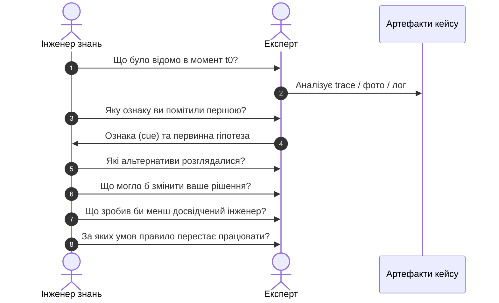
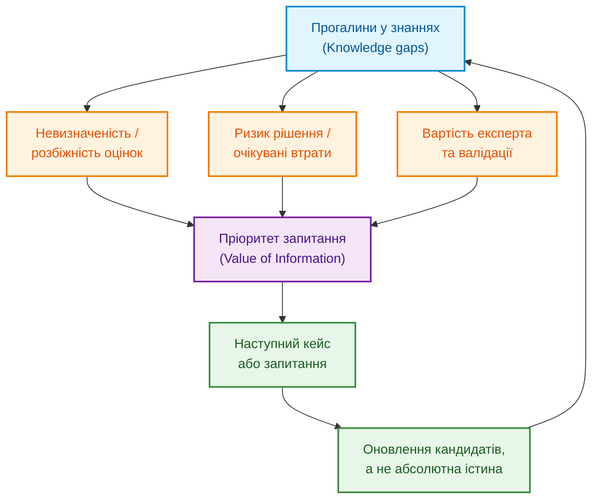
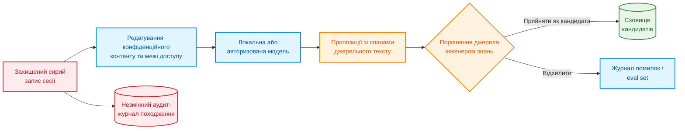
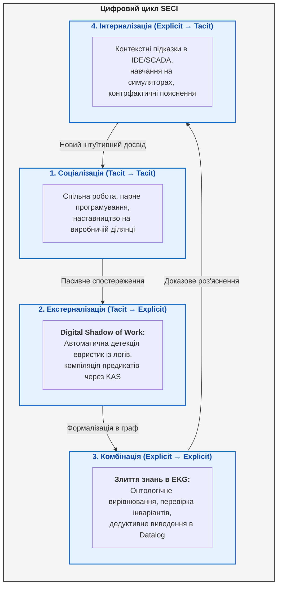

# Глава 11. Вилучення знань у експертів: інтерв'ювання, когнітивні карти та формалізація досвіду

> **Книга:** [Архітектура доказових експертних систем](README.md) · [Частина III: Інженерія знань: здобуття, NLP та екстракція з нормативів](part-03-knowledge-engineering-nlp.md)  
> **Попередня глава:** [Глава 10. Системи здобуття знань: архітектура збирання інженерного досвіду без втрат і витоку даних](ch10-knowledge-acquisition-systems.md)  
> **Наступна глава:** [Глава 12. Лінгвістичний аналіз та локальні моделі: як система розуміє текст без втрати джерела](ch12-linguistic-analysis-and-local-models.md)  
> **Зміст книги:** [README.md](README.md)  
> **Рівень:** інженери знань, розробники й технічні керівники: середній  
> **Очікувані результати:** підготувати розмову з експертом, перетворити його твердження на кандидатів знань і перевірити їх на випадках, контрприкладах та незалежних джерелах.

---

«Запитайте нашого головного інженера — він знає систему напам’ять». Команда записує розмову, мовна модель стискає її до двадцяти правил, а через місяць одне з них блокує справний виріб. Тоді інженер згадує: правило стосувалося старої ревізії плати й діяло лише за низької температури.

Так втрачається контекст неявного знання — досвіду, яким людина користується, але не завжди формулює як правило. Завдання інженера знань полягає не в тому, щоб отримати якомога більше тексту, а в тому, щоб разом із твердженням зберегти умови, винятки, походження, невпевненість і спосіб перевірки.

Розглянемо конкретний приклад. Інженер прошивки діагностує рідкісну відмову запуску пристрою. У документації є коди помилок, але немає ознаки на осцилограмі, порядку перевірок і попередження, що звичайне перезавантаження знищує найкращий доказ. Потрібно отримати перевірювану модель: ознака → гіпотеза → розрізнювальна перевірка → виняток → дія, зберігши слова й невпевненість автора. Запропонований нижче метод треба адаптувати до ризику, права на запис та організаційної культури; кількість розмов не доводить повноти.

## Чому запис розмови ще не є знанням

[Глава 10](ch10-knowledge-acquisition-systems.md) описала конвеєр ingestion документів, provenance та curation. [Глава 19](ch19-from-question-to-evidence.md) розглядає шлях від текстового фрагмента до обґрунтованого факту (grounded claim), а [Глава 20](ch20-explanation-engine.md) — як рішення пояснюється через реальне доведення (proof). Людське здобування знань (elicitation) додає складність: джерело може змінити формулювання, не усвідомлювати власну евристику або змішати побачене з пізнішим поясненням.

```mermaid
flowchart LR
    accTitle: Пайплайн здобування знань від експертів
    accDescr: Схема етапів від формулювання розриву у рішеннях до прийняття перевіреного знання у версіоновану базу знань.

    NEED["Потреба в рішенні<br/>та межі"] --> PLAN["План сесії<br/>та інформована згода"]
    PLAN --> RAW["Сирі записи,<br/>нотатки й артефакти"]
    RAW --> SEG["Атомарні висловлювання<br/>й фрагменти джерела"]
    SEG --> KC["Кандидати знань"]
    KC --> CH["Випробування:<br/>кейси, 'чому', винятки"]
    CH --> TRI["Тріангуляція:<br/>логи, документація, колеги"]
    TRI --> VAL["Валідація на<br/>відкладених випадках"]
    VAL --> GOV{"Колегія аудиту<br/>та допуску"}
    GOV -->|Схвалено| KB[("Версіонована<br/>база знань")]
    GOV -->|Доопрацювати| PLAN
    GOV -->|Брак даних| UNK["Відоме невідоме /<br/>відкрите питання"]

    classDef stage fill:#e1f5fe,stroke:#0288d1,stroke-width:2px,color:#01579b;
    classDef check fill:#fff3e0,stroke:#f57c00,stroke-width:2px,color:#e65100;
    classDef store fill:#e8f5e9,stroke:#388e3c,stroke-width:2px,color:#1b5e20;
    classDef alert fill:#ffebee,stroke:#d32f2f,stroke-width:2px,color:#b71c1c;

    class NEED,PLAN,RAW,SEG,KC stage;
    class CH,TRI,VAL,GOV check;
    class KB store;
    class UNK alert;
```



Пунктирної магії «вилучити знання» немає. Є ланцюг перетворень, де кожен крок може внести інтерпретацію. Стенограма (transcript) — свідоцтво того, що людина це сказала. Вона не є свідченням того, що твердження універсально правильне.

Корисна система статусів:

```text
utterance → candidate → corroborated candidate → validated rule → released knowledge
```

Підвищення статусу завжди потребує окремої підстави. Підсумок мовної моделі не може перескочити з `utterance` у `validated rule`.

## Спершу визначити рішення, а не призначати інтерв'ю

Запит «розкажіть усе, що знаєте про завантаження системи» створить довгу розшифровку і мало знань, придатних для тестування. Перед сесією треба визначити:

- яке рішення система має підтримати;
- хто й у якому середовищі його ухвалює;
- ціна помилок false positive, false negative й затримки;
- які випадки складні або рідкісні;
- які знання вже є в документах, телеметрії та коді;
- які твердження експерт не має права розкривати;
- що буде ознакою корисного результату сесії.

Для прикладу, рішення — не абстрактно «зрозуміти запуск», а «до перезапуску живлення вибрати наступне спостереження, яке розрізнить несправність шини живлення, збій генератора тактової частоти та пошкодження прошивки». Таке формулювання одразу породжує конкретні питання.

Добре визначене рішення задає межу всієї подальшої роботи. Воно показує, які випадки принести на розмову, які помилки особливо дорогі й за якою поведінкою майбутньої системи можна буде судити, що знання справді допомагає.

## Як вибрати спосіб роботи з експертом

Один метод систематично втрачає певний тип знання. Вільне інтерв'ю добре збирає мову предметної області, але погано відтворює тиск часу. Спостереження фіксує дії, але не завжди їх мотиви. Метод мислення вголос (think-aloud) відкриває послідовність, проте саме промовляння може змінити структуру роботи.

| Метод | Найкраще виявляє | Основне обмеження |
|---|---|---|
| Напівструктуроване інтерв'ю | поняття, межі, пояснення | ретроспективна раціоналізація |
| Спостереження / контекстний аналіз | реальний робочий процес, інструменти, обхідні шляхи | невидимі міркування, приватність |
| Метод «мислення вголос» | порядок уваги й проміжні гіпотези | реактивність, високе навантаження |
| Метод критичних рішень (CDM) | ключові сигнали (cues), опції, тиск часу в конкретному інциденті | залежність від пам'яті про подію |
| Драбина запитань («як?», «чому?») | ієрархію цілей, критеріїв і дій | навідні запитання можуть нав'язати структуру |
| Репертуарні решітки / тріади | приховані біполярні конструкти та відмінності випадків | штучність та складність на великій множині кейсів |
| Сортування карток | категорії й ментальну таксономію | не дає достатньо процедурних знань |
| Сценарії / симуляції | умовну поведінку й реакцію на аномалії | якість залежить від реалізму сценарію |

### Тріада замість питання «що важливо?»

Покажемо експерту три часові діаграми запуску (boot traces) і спитаємо: «Які два схожі між собою, але відрізняються від третього — і за якою ознакою?» Відповідь може відкрити конструкт `clock begins before rail stabilization ↔ after stabilization`, якого немає в формальній схемі даних. Потім треба уточнити вимірюване визначення, одиниці, пороги, винятки й перевірити конструкт на нових діаграмах.

### Критичний випадок замість загального правила

Для реального інциденту корисна реконструкція часової шкали:



Питання ставлять відносно інформації, доступної **тоді**, а не результату (outcome), відомого сьогодні. Інакше упередження ретроспективи (hindsight bias) робить шлях до рішення оманливо прямим.

## Як перетворити фразу на кандидата знання

Експерт каже: «Якщо друга сходинка на фронті живлення пласка, майже завжди винен клок; плату не перезапускайте». Це ще не готове правило. Треба розкласти його на типізовані поля:

```yaml
candidate_id: candidate:clock-startup-flat-slope:017
source:
  session: ses-2026-08-26-02
  speaker: expert-07
  span: "00:31:14.220/00:31:27.810"
context:
  board_revisions: [C, D]
  temperature_c: "< -10"
observation:
  feature: rail_second_step_slope
  operator: "<"
  threshold: null
hypothesis:
  value: clock_startup_fault
  speaker_modality: "almost_always"
action:
  prohibit: power_cycle_before_trace_capture
exceptions: []
open_questions:
  - operational threshold for "flat"
  - applicability to revision E
status: candidate
```

Значення `threshold: null` — не дефект серіалізації, а чесна прогалина. Поставити числове значення `0.1` на основі інтонації було б штучною добудовою. Поле `speaker_modality` зберігає слова експерта, але не стає автоматично каліброваною ймовірністю.

Кандидат знання має посилання і на сирий фрагмент джерела, і на інтерпретацію інженера знань. Редагування кандидата не переписує стенограму. Якщо запис заборонено, підписані сесійні нотатки також версіонують, але позначають нижчу аудитоздатність.

## Як ставити питання, що виявляють межі

Після позитивного прикладу обов'язково потрібен цикл критичної перевірки (challenge loop):

- **Уточнення:** що саме означає «пласка» і як це виміряти інструментально?
- **Контраст:** яка діаграма виглядає схоже, але веде до зовсім іншої гіпотези?
- **Виняток:** коли ознака присутня, але тактовий генератор повністю справний?
- **Відсутність:** що робити, якщо потрібного вимірювального каналу немає?
- **Час:** чи змінюється правило після прогріву або повторного старту?
- **Походження:** ви це спостерігали особисто, читали в документації чи вивели дедуктивно?
- **Незгода:** хто з колег вирішив би інакше і чому?
- **Перевірка:** який експеримент або тест міг би повністю спростувати ваше правило?

Так розмова збирає не лише підтвердження правила, а й межу його застосовності. Питання «чи правильно, що X завжди веде до Y?» є навідним: воно пропонує спрощене твердження і підштовхує до згоди. Надійніше показати випадок без мітки й запитати прогноз до розкриття фактичного результату.

Якщо експерт не може назвати жодного можливого контрприкладу, це сигнал шукати інші випадки й незалежні джерела, а не вважати правило абсолютним.

## Як відрізнити впевненість від частоти

Слово «зазвичай» різні люди вживають для принципово різних частот. Якщо є вибірка випадків, суб'єктивне твердження можна зіставити з емпіричними даними. Для $n$ релевантних випадків, де результат спостерігався $k$ разів, проста частота:

```math
\hat p=\frac{k}{n}
```

без інтервалу невизначеності створює хибне враження точності. За використання апріорного розподілу Бета $p\sim\mathrm{Beta}(\alpha,\beta)$ апостеріорний розподіл становить:

```math
p\mid k,n\sim\mathrm{Beta}(\alpha+k,\beta+n-k).
```

Тут $0\le k\le n$, а $\alpha>0$ і $\beta>0$ задають попередні припущення. За малої кількості випадків результат може істотно залежати від цього вибору, тому разом з оцінкою обов'язково наводять дані та використаний апріорний розподіл.

Мета полягає не в тому, щоб «замінити експерта статистикою», а в розрізненні трьох величин: суб'єктивної впевненості мовця (`speaker confidence`), емпіричної частоти та каліброваної ймовірності моделі. Вони можуть суттєво різнитися і мають зберігатися в окремих полях.

Для кількох експертів-розмітників простий рівень згоди штучно завищується, якщо одна категорія трапляється значно частіше за інші. Коефіцієнт Каппа Коена ($\kappa$) для двох розмітників враховує випадковий збіг:

```math
\kappa=\frac{p_o-p_e}{1-p_e},
```

де $p_o$ — спостережувана згода, а $p_e$ — згода, очікувана з маргінальних частот. Низька $\kappa$ може сигналізувати про нечіткі інструкції, різні ментальні моделі або сильний перекіс класів; вона не свідчить автоматично про низьку кваліфікацію експерта. Для більшої кількості оцінювачів та пропущених міток застосовують альфу Кріппендорффа із заздалегідь визначеною метрикою розбіжностей. Якщо $p_e=1$, знаменник стає нульовим і $\kappa$ невизначена — це вироджений випадок, а не ідеальна доказова згода.

## Яке питання поставити наступним

Час предметного фахівця обмежений і дорогий, тому не всі прогалини однаково важливі. Нехай $\Theta$ — невідомі параметри або правила, $D$ — уже зібрані спостереження, $q$ — потенційне запитання, а $a$ — можлива відповідь. Очікуваний приріст інформації (information gain):

```math
IG(q)=H(\Theta\mid D)-
\mathbb E_{a\sim P(a\mid q,D)}[H(\Theta\mid D,q,a)].
```

Ентропія для дискретної змінної:

```math
H(\Theta)=-\sum_i P(\theta_i)\log P(\theta_i).
```

Проте запитання з найбільшою невизначеністю може мати мінімальну операційну цінність для бізнесу. Практичний пріоритет враховує ризик рішення, очікуване зменшення втрат і сукупну вартість запитання:

```math
q^*=\arg\max_q
\frac{\mathbb E[L(a_0)-L(a_q)]}{C_{expert}(q)+C_{validation}(q)}.
```

Тут $a_0$ — оптимальна дія за поточних знань, $a_q$ — дія після отримання відповіді на запитання $q$, а $L$ — функція втрат. Знаменник $C_{expert}(q)+C_{validation}(q)$ має бути додатним і враховувати як тривалість консультації, так і вартість перевірки отриманої гіпотези. Цей підхід тісно пов'язаний з активним навчанням (active learning), однак експерт-оракул у реальному житті теж може помилятися і має право сказати «не знаю».



## Кілька експертів: розбіжності не усереднюють автоматично

Експерти можуть працювати з різними апаратними ревізіями, цільовими ринками, інструментами чи вимогами до надійності. Якщо перший каже `0.7`, другий — `0.3`, а система механічно фіксує `0.5`, це не консенсус, а втрата критичного контексту.

Спочатку структурують розбіжність:

```math
d=(claim, expert, context, rationale, evidence, confidence\_type).
```

Після цього з'ясовують корінь розбіжності: суперечність емпіричних фактів, відмінність визначень понять, різні умови застосування чи різні критерії компромісу. У багатьох інженерних задачах коректним результатом стають два окремих взаємодоповнюючих правила з чітким контекстом замість одного розмитого компромісу. Для політик і регламентів уповноважений власник знань приймає управлінську норму; для емпіричних тверджень потрібні тести; оцінні судження фіксують окремо від об'єктивних фактів.

Анонімний цикл за методом Дельфі може згладити авторитетний тиск посади, проте консенсус більшості не є гарантією істини. Контрприклад фахівця в меншості необхідно зберігати, а не відкидати як шумові дані.

## Роль мовних моделей у процесі здобування знань

Сучасні малі (SLM) та великі (LLM) мовні моделі здатні суттєво прискорити процес:

- транскрибувати аудіо із точною прив'язкою часових міток;
- виконувати первинну сегментацію тексту та виділяти предметні терміни;
- виявляти потенційні логічні суперечності між різними сесіями;
- генерувати **кандидати** уточнювальних та контрфактичних запитань;
- структурувати фрагменти стенограми в стандартизований чорновий формат.

Водночас модель не може встановлювати фактичну істинність, межі відповідальності чи юридичні дозволи. Моделі схильні додумувати пропущені пороги та штучно згладжувати професійні суперечки. Будь-яке згенероване поле мусить мати спан у джерелі або явний статус `model_hypothesis`.



Стенограма може містити персональні дані, паролі, вразливості або комерційну таємницю. Право провести інтерв'ю не означає автоматичного дозволу на використання даних для донавчання сторонніх хмарних моделей. Терміни зберігання, правила видалення та доступ до локальних чи ізольованих моделей узгоджуються до початку запису.

## Як перевірити отримане правило

Підтвердження формулювання автором (member checking) є обов'язковим: експерт засвідчує, що кандидат адекватно передає його думку. Але це лише перевірка коректності запису, а не істинності правила. Повноцінний ланцюг верифікації охоплює:

- **Точність джерела:** кандидат точно відтворює матеріали сесії без спотворень.
- **Тріангуляція джерел:** правило зіставлено з логами, технічною документацією та незалежними спостереженнями колег.
- **Контрприклади:** визначено граничні режими та умови, за яких правило скасовується.
- **Вимірюваність:** усі змінні, числові пороги та часові вікна мають однозначні операційні визначення.
- **Відкладені випадки:** інженер знань перевіряє правило на нових вибірках, а не лише на відомих успішних прикладах.
- **Перспективна перевірка:** система прогнозує наслідки до того, як стає відомим фактичний результат.
- **Керування та відповідальність:** визначено власника правила, термін його дії та критерії перегляду.

Для правила $r$ на розміченій вибірці випадків оцінюють традиційні точність (precision) і повноту (recall), проте у складних інженерних системах функція втрат зазвичай асиметрична:

```math
\widehat R(r)=\frac{1}{N}\sum_{i=1}^{N}
L\bigl(r(x_i),y_i; context_i\bigr).
```

Ця оцінка вимагає $N>0$ та попередньо погодженої матриці вартості помилок. Обов'язково проводять зрізи (slice analysis) за ревізіями виробів, температурними діапазонами та рідкісними режимами збоїв. Усереднена загальна оцінка може замаскувати відмову саме на тому критичному режимі, заради якого правило й розроблялося.

## Типові помилки здобування знань

Навіть добре організована розмова може завершитися хибним правилом, якщо знехтувати когнітивними упередженнями людської пам'яті та артефактами комунікації.

| Тип помилки | Наслідок | Спосіб протидії |
|---|---|---|
| Інтерв'ю без фокусу на рішенні | Багато тексту, відсутність знань для тестів | Аналіз завдань і попередній вибір діагностичних кейсів |
| Упередження ретроспективи (hindsight bias) | Ланцюжок міркувань здається оманливо очевидним | Реконструкція за часовою шкалою: «що було відомо на момент t0?» |
| Навідні запитання (leading questions) | Інженер знань підказує бажане правило | Нейтральні формулювання, тестування на «сліпих» кейсах |
| Неявна ознака лишилася прикметником | Якісні описи на кшталт «нестабільний сигнал» неможливо закодувати | Вимірювані визначення, числові пороги, експерименти |
| Модель штучно заповнила прогалину | Додуманий поріг отримує статус авторитетного знання | Поля з підтримкою null, обов'язкова прив'язка до спанів джерела |
| Консенсус стер корисну розбіжність | Втрата контекстних винятків через механічне усереднення | Збереження конфліктуючих гіпотез з різними умовами |
| Повтор сприйнято як незалежне підтвердження | Подвійний підрахунок однакової інформації з одного джерела | Графи походження знань (provenance graphs) |
| Експерт підтвердив власне судження | Перевірку запису (member check) названо верифікацією правила | Тестування на незалежних, відкладених та перспективних даних |
| Штучне «насичення» вибірки | Рідкісні, але критичні аварії залишилися поза увагою | Явний облік невідомого, цільовий вибір граничних режимів |

Усі перелічені помилки безпідставно завищують статус твердження: здогадка стає правилом, соціальна згода — фізичною істиною, а короткий переказ мовної моделі — підтвердженим фактом. Системна протидія повертає твердження до першоджерела та експерименту.

## Організація першого циклу здобування знань

Розпочинати доцільно з одного важливого рішення та 10–20 різнопланових історичних інцидентів. До запису узгоджують правовий статус матеріалів, конфіденційність та доступ. Коротка установча сесія фіксує базовий глосарій термінів і розбиває процес на дискретні кроки.

Наступний крок — спільна покрокова реконструкція двох критичних випадків без передчасного розкриття їх фіналу. Тріади та запитання «як?» і «чому?» застосовують до найбільш нечітких понять. Кожне зафіксоване формулювання оформлюють як кандидата зі збереженням цитати джерела, контексту, відомих винятків і списку відкритих питань.

Окрема сесія присвячується цілеспрямованому пошуку контрприкладів. Після цього правила валідують на відкладених даних та незалежних апаратних тестах. Лише знання, які пройшли багатовимірний аудит, отримують статус перевіреного правила, закріпленого власника і допуск до промислової бази знань.

Для діагностики відмови запуску цінним підсумком циклу є не «завершена всеохопна система», а три перевірені діагностичні ознаки, один абсолютний інваріант безпеки `зафіксувати осцилограму перед вимкненням живлення` та перелік відкритих питань. Це значно надійніший результат, ніж десятки неперевірених евристик.

---

## Управління неявними знаннями: від моделі SECI до «цифрової тіні» інженерної праці

Класична інженерія знань часто зазнає поразки через феномен, сформульований філософом Майклом Полані: **«Ми знаємо більше, ніж можемо розповісти»** (*Tacit Knowledge*).

До 80% критичного виробничого та архітектурного досвіду належить до категорії неявних знань. Це інтуїтивне відчуття «де зазвичай ховається помилка», неписані правила калібрування стендів, навички розпізнавання ледь помітних акустичних шумів редуктора або розуміння того, які саме пункти офіційного регламенту є формальними, а які рятують життя.

### Еволюція моделі SECI у цифрову еру

Класична модель трансформації знань Нонаки та Такеучі (**SECI**: *Socialization $\to$ Externalization $\to$ Combination $\to$ Internalization*) набуває нового технологічного змісту в сучасних експертних системах:



### Пасивний майнінг знань через «цифрову тінь» інженерної діяльності (Digital Shadow of Work)

Традиційний підхід до екстерналізації — примусити провідного архітектора писати документацію або годинами відповідати на запитання аналітика — створює колосальний спротив і рідко дає актуальний результат.

Сучасна парадигма базується на **пасивному вилученні знань (Passive Knowledge Harvesting)**:

1. **Аналіз слідів вирішення проблем у коді та Git:** система досліджує не лише фінальний коміт, а послідовність спроб, структуру правок, коментарі в Code Review та обговорення в Pull Requests.
2. **Розбір аварійних Post-Mortem комунікацій:** аналіз інженерних чатів під час усунення критичних інцидентів виявляє реальний, а не декларований алгоритм діагностики: які команди в терміналі запускалися першими, які параметри телеметрії перевірялися, які гіпотези відкидалися.
3. **Автоматична матриця компетенцій (Expertise Retrieval):** замість суб'єктивних опитувальників система будує динамічний граф *«Хто реально володіє знанням про підсистему X»* на основі аналізу авторів коду, учасників розслідувань та успішно закритих нетипових дефектів.

> [!IMPORTANT]
> **Етичний та безпековий бар'єр:** збір «цифрової тіні» інженерної роботи має бути суворо відокремлений від оцінки персональної продуктивності працівників. Система повинна агрегувати інженерні факти, схеми та предикати, але не перетворюватися на інструмент нагляду (*Surveillance*), інакше інженери миттєво почнуть спотворювати свої цифрові сліди, руйнуючи достовірність бази знань.

---

## Підсумки

Здобування знань — це не переписування готових правил із пам'яті людини в програмний код. Це дисциплінований інженерний процес поетапного перетворення висловлювання на кандидата, кандидата — на формалізовану гіпотезу, а гіпотези — на багаторазово перевірене правило із зафіксованими межами застосовності та походженням.

У наступних главах ми розглянемо автоматизоване вилучення знань із природномовних та інженерних документів: [Глава 12](ch12-linguistic-analysis-and-local-models.md) присвячена лінгвістичному аналізу та застосуванню локальних мовних моделей, а [Глава 13](ch13-language-variability-vs-determinism.md) — подоланню варіативності природної мови для забезпечення детермінізму експертних систем.

---

### Питання для самоперевірки

1. Яке конкретне рішення, а не просто широку тему, покликана підтримати ваша наступна сесія здобування знань?
2. Як у вашій структурі даних розмежовуються слова експерта, інтерпретація інженера знань та верифіковане правило?
3. Які неявні ознаки у вашій системі досі не мають вимірюваного інструментального визначення?
4. Яким чином зберігаються суперечності між експертами без їх механічного усереднення?
5. Чи передбачає протокол інтерв'ю право експерта відповісти «не знаю» без ризику, що модель штучно заповнить цю прогалину?
6. Який перспективний тест здатен спростувати отримане правило на нових даних?

---

## Словник

## Абревіатури

## Джерела

- Anna Hart. [Knowledge Elicitation: Issues and Methods](https://doi.org/10.1016/0010-4485(85)90293-3), *Computer-Aided Design*, 1985.
- Nancy J. Cooke. [Varieties of Knowledge Elicitation Techniques](https://doi.org/10.1006/ijhc.1994.1083), *International Journal of Human-Computer Studies*, 1994.
- Robert R. Hoffman, Nigel R. Shadbolt, A. Mike Burton, Gary Klein. [Eliciting Knowledge from Experts: A Methodological Analysis](https://doi.org/10.1006/obhd.1995.1039), 1995.
- A. Mike Burton, Nigel R. Shadbolt, Gordon Rugg, A. P. Hedgecock. [The Efficacy of Knowledge Elicitation Techniques: A Comparison across Domains and Levels of Expertise](https://doi.org/10.1016/S1042-8143(05)80010-X), *Knowledge Acquisition*, 1990.
- Brian R. Gaines, Mildred L. G. Shaw. [Knowledge Acquisition Tools Based on Personal Construct Psychology](https://doi.org/10.1016/0747-5632(93)90003-I), 1993.
- Gary Klein, Roberta Calderwood, Donald MacGregor. [Critical Decision Method for Eliciting Knowledge](https://doi.org/10.1109/21.31053), *IEEE Transactions on Systems, Man, and Cybernetics*, 1989.
- K. Anders Ericsson, Herbert A. Simon. [Protocol Analysis: Verbal Reports as Data](https://mitpress.mit.edu/9780262550239/protocol-analysis/), MIT Press.
- Guus Schreiber et al. [Knowledge Engineering and Management: The CommonKADS Methodology](https://mitpress.mit.edu/9780262193009/knowledge-engineering-and-management/), MIT Press, 2000.
- Burr Settles. [Active Learning Literature Survey](https://minds.wisconsin.edu/handle/1793/60660), University of Wisconsin–Madison, 2009.
- Claude E. Shannon. [A Mathematical Theory of Communication](https://doi.org/10.1002/j.1538-7305.1948.tb01338.x), 1948.
- Jacob Cohen. [A Coefficient of Agreement for Nominal Scales](https://doi.org/10.1177/001316446002000104), 1960.
- Klaus Krippendorff. [Content Analysis: An Introduction to Its Methodology](https://us.sagepub.com/en-us/nam/content-analysis/book258450), SAGE.
- Daniel Kahneman, Paul Slovic, Amos Tversky (eds.). [Judgment under Uncertainty: Heuristics and Biases](https://doi.org/10.1017/CBO9780511809477), Cambridge University Press, 1982.

---

[← Попередня глава](ch10-knowledge-acquisition-systems.md) · [Частина III](part-03-knowledge-engineering-nlp.md) · [Зміст](README.md) · [Наступна глава →](ch12-linguistic-analysis-and-local-models.md)
