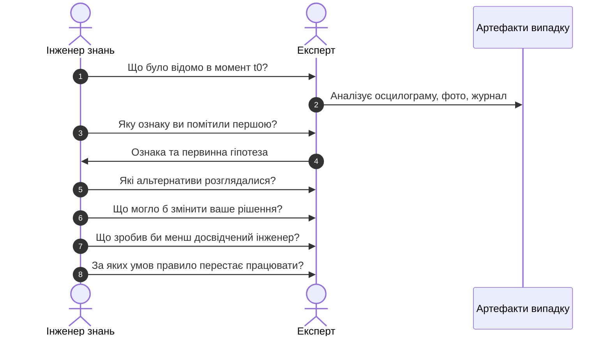
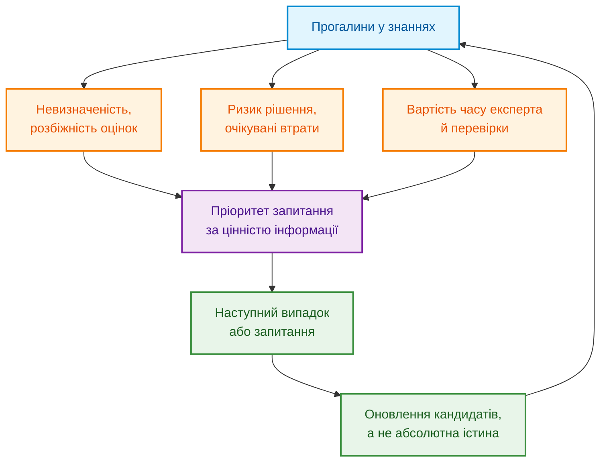
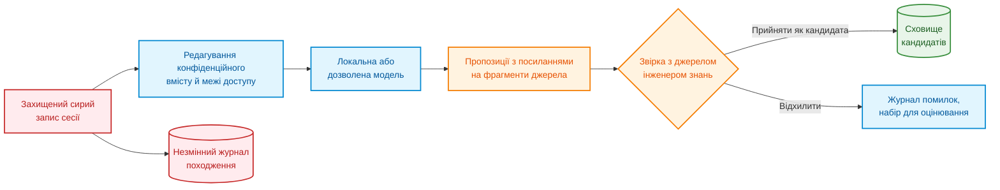
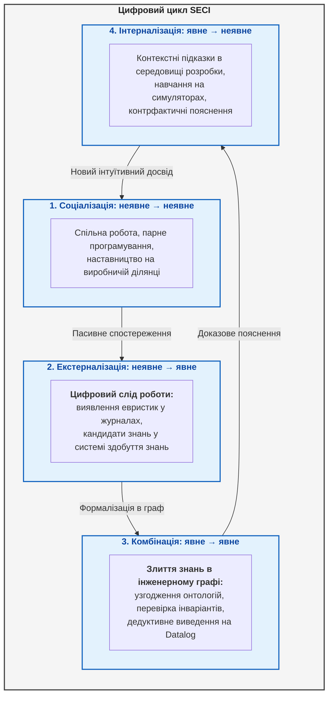

# Глава 11. Вилучення знань у експертів: інтерв'ювання, когнітивні карти та формалізація досвіду

> **Книга:** [Архітектура доказових експертних систем](README.md) · [Частина III: Здобуття знань, мовний аналіз та оцінювання входу](part-03-knowledge-engineering-nlp.md)  
> **Попередня глава:** [Глава 10. Системи здобуття знань: джерела, допуск і життєвий цикл](ch10-knowledge-acquisition-systems.md)  
> **Наступна глава:** [Глава 12. Лінгвістичний аналіз і локальні моделі: збереження змісту та джерела](ch12-linguistic-analysis-and-local-models.md)  
> **Зміст книги:** [README.md](README.md)  
> **Автор:** [Микола Федчик](about-the-author.md)  
> **Рівень:** середній: інженери знань, розробники й технічні керівники  
> **Очікувані результати:** підготувати розмову з експертом навколо конкретного рішення; відокремлювати предметні знання, операції виведення й порядок виконання задачі за CommonKADS; перетворити висловлювання експерта на кандидата знань з умовами, винятками й походженням; перевірити кандидата на випадках, контрприкладах і незалежних джерелах; відрізняти впевненість мовця від частоти й від каліброваної ймовірності.

## Анотація

У цій главі досліджено методологію та інженерні протоколи подолання класичного «вузького місця здобуття знань» (*Knowledge Acquisition Bottleneck*) в експертних системах шляхом формалізації неявного експертного досвіду (*tacit knowledge*) фахівців. Проаналізовано когнітивні пастки прямого інтерв'ювання, семантичний розрив між суб'єктивною евристикою та об'єктивними фактами, а також застосування методології CommonKADS для декомпозиції експертизи на рівні предметної моделі, операцій виведення та задачі для наповнення бази правил. Представлено формальні техніки репертуарних ґраток Келлі, методики аналізу критичних інцидентів та когнітивних карт. Описано процедури синтезу перевірюваних правил, протоколи розв'язання експертних колізій, математичне калібрування суб'єктивної впевненості проти емпіричної частоти, а також архітектурні межі використання локальних LLM як інструментів структурування діалогу без галюцинацій та підміни джерел для надійного функціонування експертної системи.

«Запитайте нашого головного інженера, він знає систему напам'ять». Команда записує розмову, мовна модель стискає запис до двадцяти правил, а через місяць одне з правил блокує справний виріб. Тоді інженер згадує: правило стосувалося старої ревізії плати й діяло лише за низької температури.

Так втрачається контекст **неявного знання** (*tacit knowledge*), тобто досвіду, яким людина користується, але не завжди формулює як правило. Майкл Полані описав це явище коротко: ми знаємо більше, ніж можемо розповісти [[1]](#src-1). Тому завдання інженера знань полягає не в тому, щоб отримати якомога більше тексту, а в тому, щоб разом із твердженням зберегти умови, винятки, походження, невпевненість і спосіб перевірки.

Розглянемо приклад, який проходить через усю главу. Інженер прошивки діагностує рідкісну відмову запуску пристрою. У документації є коди помилок, але немає ознаки на осцилограмі, порядку перевірок і попередження, що звичайне перезавантаження знищує найкращий доказ. Потрібно отримати перевірювану модель «ознака → гіпотеза → розрізнювальна перевірка → виняток → дія» і при цьому зберегти слова й невпевненість автора. Головне запитання глави: **як перетворити розмову з експертом на знання, яке можна перевірити, а не лише записати?** Метод нижче треба адаптувати до ризику, права на запис і організаційної культури; кількість розмов сама не доводить повноти.

## 1. Епістемічні бар'єри та когнітивні пастки інтерв'ювання експертів

Чому прямий запис розмови ще не є знанням? [Глава 10](ch10-knowledge-acquisition-systems.md) описала конвеєр здобуття знань із документів, походження й курування. [Глава 19](ch19-from-question-to-evidence.md) розглядає шлях від текстового фрагмента до обґрунтованого твердження, а [Глава 20](ch20-explanation-engine.md) пояснює, як рішення пояснюють через реальне доведення. **Вилучення знань у людей** (*knowledge elicitation*) додає власну складність: джерело може змінити формулювання, не усвідомлювати власної евристики або змішати побачене з пізнішим поясненням. Анна Гарт ще 1985 року описувала вилучення знань як окрему методичну проблему інженерії знань [[2]](#src-2), а Ненсі Кук систематизувала різновиди технік вилучення [[3]](#src-3).

```mermaid
flowchart LR
    accTitle: Конвеєр вилучення знань у експертів
    accDescr: Етапи від формулювання рішення до прийняття перевіреного знання у версійовану базу знань.

    NEED["Потреба в рішенні<br/>та межі"] --> PLAN["План сесії<br/>та інформована згода"]
    PLAN --> RAW["Сирі записи,<br/>нотатки й артефакти"]
    RAW --> SEG["Атомарні висловлювання<br/>й фрагменти джерела"]
    SEG --> KC["Кандидати знань"]
    KC --> CH["Випробування:<br/>випадки, «чому», винятки"]
    CH --> TRI["Тріангуляція:<br/>журнали, документація, колеги"]
    TRI --> VAL["Перевірка на<br/>відкладених випадках"]
    VAL --> GOV{"Рада допуску"}
    GOV -->|"Схвалено"| KB[("Версійована<br/>база знань")]
    GOV -->|"Доопрацювати"| PLAN
    GOV -->|"Бракує даних"| UNK["Відоме невідоме,<br/>відкрите питання"]

    classDef stage fill:#e1f5fe,stroke:#0288d1,stroke-width:2px,color:#01579b;
    classDef check fill:#fff3e0,stroke:#f57c00,stroke-width:2px,color:#e65100;
    classDef store fill:#e8f5e9,stroke:#388e3c,stroke-width:2px,color:#1b5e20;
    classDef alert fill:#ffebee,stroke:#d32f2f,stroke-width:2px,color:#b71c1c;

    class NEED,PLAN,RAW,SEG,KC stage;
    class CH,TRI,VAL,GOV check;
    class KB store;
    class UNK alert;
```



Схема показує, що магічного кроку «вилучити знання» немає. Є ланцюг перетворень, і кожен крок може внести інтерпретацію. Стенограма є свідченням того, що людина це сказала, а не свідченням того, що твердження правильне завжди.

Тому корисно завести систему статусів:

```text
utterance → candidate → corroborated candidate → validated rule → released knowledge
```

Українською: висловлювання → кандидат → підтверджений кандидат → перевірене правило → випущене знання. Підвищення статусу завжди потребує окремої підстави. Підсумок мовної моделі не може перескочити від висловлювання одразу до перевіреного правила.

## 2. Цільове проєктування сесії вилучення: орієнтація на прийняття рішень

Запит «розкажіть усе, що знаєте про завантаження системи» дає довгу стенограму й мало знань, придатних для тестування. Методологія CommonKADS (*Common Knowledge Acquisition and Documentation Structuring*) тому починає інженерію знань з аналізу організації й задачі, а не з розмови [[4]](#src-4). Перед сесією треба визначити:

- яке рішення експертна система має підтримати;
- хто й у якому середовищі ухвалює це рішення;
- ціну хибнопозитивних і хибнонегативних помилок та ціну затримки;
- які випадки складні або рідкісні;
- які знання вже є в документах, телеметрії та коді;
- які твердження експерт не має права розкривати;
- за якою ознакою можна буде судити, що сесія була корисною.

У прикладі рішенням є не абстрактне «зрозуміти запуск», а «до перезапуску живлення вибрати наступне спостереження, яке розрізнить несправність шини живлення, збій генератора тактової частоти й пошкодження прошивки». Таке формулювання одразу породжує конкретні запитання.

Добре визначене рішення задає межу всієї подальшої роботи. Воно показує, які випадки принести на розмову, які помилки особливо дорогі й за якою поведінкою майбутньої експертної системи можна буде судити, що знання справді допомагає.

### 2.1. Методологія CommonKADS: рівні предметних знань, виведення та задачі

Після формулювання рішення залишається інша проблема: стенограма змішує опис пристрою, висновки експерта й порядок роботи. Якщо зберегти лише правила про несправності, експертна система може втратити заборону перезапуску до запису осцилограми. Якщо зберегти лише послідовність команд, експертна система не зможе пояснити, чому наступне спостереження розрізняє дві гіпотези.

CommonKADS описує шість пов'язаних моделей: організації, задачі, агента, знань, комунікації й проєктування [[4]](#src-4). Моделі організації, задачі й агента визначають потребу, обмеження роботи та відповідального виконавця. Модель комунікації описує обмін між людиною й програмою, а модель проєктування переводить попередні рішення в програмні компоненти. **Модель знань** (*knowledge model*) окремо розкладає зміст експертної роботи на три складові. Таблиця показує ці складові для вже введеного прикладу запуску пристрою.

| Складова моделі знань | Що документує інженер знань | Приклад діагностики запуску |
|---|---|---|
| Предметні знання (*domain knowledge*) | поняття, відношення, факти й правила предметної області | ревізія плати, температура, часові параметри живлення й тактування, умови застосовності правила |
| Знання про виведення (*inference knowledge*) | операції міркування та ролі їхніх входів і виходів | запропонувати гіпотезу, передбачити ознаку за гіпотезою, зіставити передбачення з осцилограмою |
| Знання про задачу (*task knowledge*) | мету, порядок операцій, умови переходу й завершення | спочатку зберегти осцилограму; потім вибрати розрізнювальне спостереження; за нестачі даних передати випадок експертові |

**Роль знання** (*knowledge role*) позначає, для чого конкретний запис використано в операції міркування. Час появи тактового сигналу є предметним фактом; у порівнянні з передбаченням цей факт займає роль «спостереження». Припущення про збій генератора займає роль «гіпотеза», а очікуваний порядок фронтів займає роль «передбачення». Такий поділ дозволяє повторно використати операцію «порівняти спостереження з передбаченням» для іншого пристрою, не переносячи специфічних параметрів першої плати.

Розгляньмо дві розмови про той самий збій. Перший експерт називає ознаку на фронті живлення. Другий експерт пояснює, чому не можна перезапускати пристрій до запису осцилограми. Перша відповідь поповнює предметну модель і умови виведення, друга уточнює керування задачею. Заміна вимірювального приладу змінює отримання спостереження, але не обов'язково змінює правило діагностики. Нова ревізія плати, навпаки, може змінити предметне правило без зміни порядку збереження свідчень.

Перед програмуванням інженер знань перевіряє три окремі результати: чи описано потрібні поняття й умови; чи має кожна операція визначені входи й виходи; чи є наступний крок для успіху, суперечності й нестачі даних. Це проєктна перевірка, а не доказ правильності діагнозу. Предметні правила ще потребують випробувань на нових випадках. Реалізацію операцій у компонентах експертної системи розглядає [Глава 16](ch16-expert-systems-architecture.md). Тепер вибір техніки інтерв'ю можна прив'язати до конкретної прогалини моделі, а не до кількості вже записаних сторінок.

## 3. Методичні стратегії та протоколи взаємодії з експертами

Кожен метод вилучення систематично втрачає певний тип знання. Вільне інтерв'ю добре збирає мову предметної області, але погано відтворює тиск часу. Спостереження фіксує дії, але не завжди їхні мотиви. Метод мислення вголос відкриває послідовність міркування, проте саме промовляння може змінити структуру роботи. Методологічний аналіз Гоффмана, Шедболта, Бертона й Кляйна порівнює такі методи за типом знання, яке вони дають [[5]](#src-5), а Бертон та співавтори порівнювали ефективність технік на різних предметних областях і рівнях експертизи [[6]](#src-6).

| Метод | Найкраще виявляє | Основне обмеження |
|---|---|---|
| Напівструктуроване інтерв'ю | поняття, межі, пояснення | раціоналізація заднім числом |
| Спостереження в робочому контексті | реальний робочий процес, інструменти, обхідні шляхи | невидимі міркування, приватність |
| Мислення вголос (*think-aloud*) | порядок уваги й проміжні гіпотези | вплив промовляння на роботу, високе навантаження |
| Метод критичних рішень (*critical decision method*, CDM) | сигнали, на які зважав експерт, варіанти, тиск часу в конкретному інциденті | залежність від пам'яті про подію |
| Драбина запитань «як?» і «чому?» (*laddering*) | ієрархію цілей, критеріїв і дій | навідні запитання можуть нав'язати структуру |
| Репертуарні решітки й тріади | приховані біполярні конструкти й відмінності випадків | штучність і складність на великій множині випадків |
| Сортування карток | категорії й ментальну таксономію | мало процедурного знання |
| Сценарії й симуляції | умовну поведінку й реакцію на аномалії | якість залежить від реалізму сценарію |

Протокольний аналіз Еріксона й Саймона розглядає словесні звіти як дані й обговорює, за яких умов промовляння змінює саму роботу [[7]](#src-7). Метод критичних рішень Кляйна, Калдервуда й Макгрегора відтворює конкретний інцидент за часовою шкалою [[8]](#src-8). Репертуарні решітки походять із психології особистісних конструктів, і Гейнс та Шоу описали засоби вилучення знань на цій основі [[9]](#src-9). Рагг і Макджордж подали сортування карток як самостійну техніку поряд із решітками й драбиною запитань [[10]](#src-10). Жоден метод не заміняє інших, тому план вилучення комбінує кілька методів.

### 3.1. Метод репертуарних ґраток Келлі: тріадний аналіз розрізнень

У структурі бази знань експертної системи діагностичні предикати вимагають чітких біполярних розрізнень, проте пряме опитування експерта («як саме ви відрізняєте нормальний старт від аварійного?») зазвичай спричиняє раціоналізацію заднім числом: фахівець наводить загальні фрази зі специфікацій, пропускаючи неявні емпіричні ознаки. Якщо база знань спирається лише на поверхневі ознаки, машина виведення генерує хибнопозитивні спрацьовування на прикордонних режимах, що в місійно-критичних застосунках призводить до невиправданої зупинки апаратури. Метод репертуарних ґраток Джорджа Келлі долає цей когнітивний бар'єр за допомогою структурованого тріадного порівняння конкретних прецедентів або артефактів $(e_1, e_2, e_3)$.

Інженер знань демонструє експертові три реальні часові діаграми запуску пристрою й ставить фіксоване методичне запитання: «Які два випадки подібні між собою, проте відрізняються від третього, і за якою саме фізичною ознакою?» Така когнітивна операція змушує фахівця виділити прихований біполярний конструкт, наприклад: *«тактовий генератор стартує до стабілізації шини живлення»* $\longleftrightarrow$ *«генератор стартує після стабілізації»*. Цього предикату не було у формальній схемі даних, проте саме він є вирішальним фактором розрізнення відмов. На наступному етапі інженер знань закріплює конструкт вимірюваними фізичними параметрами (одиниці, допустимі часові інтервали $\Delta t$, граничні пороги напруги) та проводить валідацію отриманого біполярного правила на незалежному наборі осцилограм.

### 3.2. Метод аналізу критичних інцидентів (Critical Decision Method)

Для проєктування знань про керування задачею (*task knowledge*) та виявлення аварійних інваріантів у базі знань експертної системи критично важливо зафіксувати поведінку фахівця в позаштатних ситуаціях з високим рівнем невизначеності й дефіцитом часу. Якщо опитувати експерта узагальнено («як ви зазвичай дієте під час збою живлення?»), виникає систематичне спотворення ретроспективного аналізу (*hindsight bias*, Baruch Fischhoff [[11]](#src-11)): фахівець несвідомо конструює раціоналізований, ідеалізований сценарій із підручника, вилучаючи критичні евристики, нелінійні перевірки та негативні інваріанти (наприклад, сувору заборону натискати скидання до фіксації аналізатора шини). Метод аналізу критичних інцидентів (*Critical Decision Method*, CDM) базується на покроковій хронологічній реконструкції реального зафіксованого інциденту навколо конкретних збережених артефактів (логів, осцилограм, знімків пам'яті):



Запитання ставлять щодо інформації, доступної **тоді**, а не щодо результату, відомого сьогодні. Баррух Фішгофф показав, що знання результату змінює судження: подія заднім числом здається більш передбачуваною, ніж була насправді [[11]](#src-11). Без часової реконструкції шлях до рішення виглядає оманливо прямим.

## 4. Синтаксична та логічна формалізація: перетворення висловлювання на кандидата знань

Прямі стенограми інтерв'ю чи розмовні висловлювання фахівців не можуть передаватися безпосередньо в рушій виведення чи верифікатор бази знань через наявність семантичної багатозначності та неявних контекстних припущень. Будь-яке розмовне твердження, прийняте як аксіома без формальної типізації, викликає семантичний дрейф бази знань і робить логічне виведення недетермінованим. Конвеєр вилучення перетворює сире висловлювання на структурованого **кандидата знань** (*Knowledge Candidate*, $KC$) із фіксацією джерела, меж контексту, предикатів спостереження, модальності та стану дослідження винятків.

Розглянемо висловлювання провідного розробника вбудованого ПЗ: *«Якщо друга сходинка на фронті живлення пласка, майже завжди винен тактовий генератор; плату в жодному разі не перезапускайте»*. Для інтеграції в експертну систему це твердження декомпонується на структуровані типізовані атрибути. Порожній перелік винятків не означає їх відсутності: атрибут `exceptions_status: not_assessed` явно фіксує обов'язкову вимогу подальшої верифікації.

<details>
<summary>Приклад кандидата з невідомим порогом і недослідженими винятками</summary>

```yaml
candidate_id: candidate:clock-startup-flat-slope:017
source:
  session: ses-2026-08-26-02
  speaker: expert-07
  span: "00:31:14.220/00:31:27.810"
context:
  board_revisions: [C, D]
  temperature_c: "< -10"
observation:
  feature: rail_second_step_slope
  operator: "<"
  threshold: null
hypothesis:
  value: clock_startup_fault
  speaker_modality: "almost_always"
action:
  prohibit: power_cycle_before_trace_capture
exceptions: []
exceptions_status: not_assessed
open_questions:
  - operational threshold for "flat"
  - applicability to revision E
status: candidate
```

</details>

Значення `threshold: null` не є дефектом запису, а явно позначає прогалину. Поставити числове значення на основі інтонації експерта означало б добудувати знання, якого немає. Поле `speaker_modality` зберігає слова експерта «майже завжди», але не стає автоматично каліброваною ймовірністю.

Кандидат знання посилається і на сирий фрагмент джерела, і на інтерпретацію інженера знань. Редагування кандидата не переписує стенограми. Якщо запис розмови заборонено, підписані нотатки сесії теж версіонують, але позначають їхню нижчу придатність для аудиту.

## 5. Протоколи фальсифікації: виявлення крайових умов та дефітерів

У місійно-критичних системах (відповідно до стандартів ISO 26262 ASIL D, IEC 61508 SIL 3/4) правило бази знань вважається інженерно надійним не тоді, коли експерт зміг навести для нього низку підтверджувальних прикладів, а тоді, коли воно успішно витримало попперіанський цикл цілеспрямованої фальсифікації. Природне людське упередження підтвердження (*confirmation bias*) спонукає експерта наводити успішні випадки зі своєї практики, замовчуючи межі застосовності. Якщо правило допускається до бази знань без явного визначення умов скасування — дефітерів (*defeaters*), експертна система формулюватиме хибні діагнози щоразу, коли зовнішні фізичні умови (наприклад, температура або ревізія кристала) вийдуть за неявні межі контексту експерта.

Для захисту периметра верифікації бази знань після формулювання позитивного правила обов'язково активується протокол критичної фальсифікації за фіксованими напрямами:

- **Уточнення:** що саме означає «пласка» і як це виміряти приладом?
- **Контраст:** яка діаграма виглядає схоже, але веде до зовсім іншої гіпотези?
- **Виняток:** коли ознака присутня, але тактовий генератор повністю справний?
- **Відсутність:** що робити, якщо потрібного вимірювального каналу немає?
- **Час:** чи змінюється правило після прогріву або повторного старту?
- **Походження:** ви спостерігали це особисто, читали в документації чи вивели міркуванням?
- **Незгода:** хто з колег вирішив би інакше і чому?
- **Перевірка:** який експеримент міг би повністю спростувати ваше правило?

Так розмова збирає не лише підтвердження правила, а й межу його застосовності. Запитання «чи правильно, що X завжди веде до Y?» є навідним: воно пропонує спрощене твердження й підштовхує до згоди. Надійніше показати випадок без мітки й запитати прогноз до того, як стане відомим фактичний результат.

Якщо експерт не може назвати жодного можливого контрприкладу, це сигнал шукати інші випадки й незалежні джерела, а не підстава вважати правило абсолютним.

## 6. Математичне розмежування суб'єктивної впевненості та статистичної частоти

У базі знань експертної системи суб'єктивні модальні судження фахівців (наприклад, маркери «зазвичай», «майже завжди», «рідко») створюють критичну невизначеність для алгоритмів логічного виведення. Якщо інженер знань транслює такі словесні оцінки у фіксовані вагові коефіцієнти впевненості (*Certainty Factors*, CF) без емпіричного калібрування, ланцюжки міркувань у машині виведення стають стохастично розбалансованими: накопичення суб'єктивних множників призводить до непередбачуваної деградації рішень або помилкового спрацьовування аварійного захисту. Рут Бейт-Маром експериментально довела, що фахівці демонструють катастрофічний розкид числових значень для однакових словесних квантифікаторів (варіація сягає від 0,40 до 0,85 для терміна «ймовірно») [[12]](#src-12). Тому будь-яке висловлювання експерта, що претендує на статус діагностичного правила, підлягає обов'язковому математичному розмежуванню на точкову частоту, байєсівський апостеріорний інтервал та калібровану міжекспертну узгодженість.

Для верифікації евристичного твердження інженер знань формує вибірку з $n$ контрольних запусків або зафіксованих інцидентів на тестових стендах. Якщо цільова ознака відмови спостерігалася $k$ разів, точкова емпірична частота становить:

```math
\hat p=\frac{k}{n}
```

Складники та розмірність оцінки:

- $\hat p$ є безрозмірною точковою оцінкою частки випадків із цільовим результатом у діапазоні $[0, 1]$;
- $k$ є кількістю успішних фіксацій ознаки серед залікових інцидентів ($0 \le k \le n$);
- $n$ є загальним обсягом верифікаційної вибірки ($n > 0$, ціле додатне число).

Інженерні обмеження та прийняття рішень:
Точкова оцінка $\hat p$ не враховує статистичну похибку вибірки малого обсягу. Відповідно до вимог функціональної безпеки, якщо $n < 10$, точкова частота $\hat p$ вважається калібрувально нестійкою: кандидату знання суворо заборонено присвоювати статус робочого правила бази знань, а сам предикат блокується в стані карантину до накопичення щонайменше $n \ge 30$ незалежних спостережень (поріг застосовності центральної граничної теореми). За умовних $k = 7$ при $n = 10$ частота $\hat p = 0{,}70$ є лише приводом для подальших апаратних випробувань.

Для врахування невизначеності за обмеженого обсягу тестів застосовують спряжене байєсівське оновлення за схемою випробувань Бернуллі. Приймаючи за неінформативний апріорний розподіл закон Лапласа $p\sim\mathrm{Beta}(1, 1)$ (де $\alpha = 1, \beta = 1$), апостеріорний розподіл частки відмов має вигляд:

```math
p\mid k,n\sim\mathrm{Beta}(\alpha+k,\ \beta+n-k).
```

Параметри бета-розподілу:

- $p \in [0, 1]$ є неперервною випадковою величиною істинної ймовірності відмови;
- $\alpha > 0$ та $\beta > 0$ — безрозмірні гіперпараметри псевдоспостережень апріорного розподілу;
- $\mathrm{Beta}(\alpha+k,\beta+n-k)$ є щільністю ймовірності апостеріорного розподілу після врахування $k$ підтверджень та $n-k$ контрприкладів;
- символи $\mid$ та $\sim$ позначають умовну залежність та відповідність розподілу ймовірностей.

Практичне застосування та критерій спрацьовування:
Апостеріорний розподіл дозволяє машині виведення обчислити 95%-й байєсівський довірчий інтервал (байєсівську область довіри) $[p_{\mathrm{low}}, p_{\mathrm{high}}]$ за формулою квантилів: $\int_0^{p_{\mathrm{low}}} \mathrm{Beta} = 0{,}025$ та $\int_0^{p_{\mathrm{high}}} \mathrm{Beta} = 0{,}975$.
- Якщо ширина інтервалу $\Delta p = p_{\mathrm{high}} - p_{\mathrm{low}} \le 0{,}15$, правило вважається статистично зрілим і допускається до продуктивного використання в базі знань.
- Якщо ширина інтервалу $\Delta p > 0{,}30$ (наприклад, для вибірки $k=7, n=10$, де $\mathrm{Beta}(8, 4)$ дає $95\%$-й інтервал приблизно $[0{,}39; 0{,}89]$), невизначеність є неприпустимою для місійно-критичних рішень. Експертна система переходить у захисний режим (*fail-safe hold*), блокуючи прийняття автоматичного рішення й вимагаючи залучення резервного консервативного правила або ручного втручання оператора.

Коли випадки розмічають кілька експертів, проста частка збігів є завищеною, якщо одна категорія трапляється набагато частіше за інші. Коефіцієнт каппа Коена для двох розмітників враховує випадковий збіг [[13]](#src-13):

```math
\kappa=\frac{p_o-p_e}{1-p_e}.
```

Складники каппи та нормування:

- $p_o$ є спостережуваною часткою конкордантних (узгоджених) оцінок двох експертів на калібрувальній вибірці прецедентів;
- $p_e$ є теоретичною очікуваною часткою випадкових збігів за незмінних маргінальних розподілів оцінок ($p_e < 1$);
- $\kappa$ є безрозмірним коефіцієнтом міжекспертної згоди в теоретичному діапазоні $[-1, 1]$.

Інженерні пороги допуску знань до компіляції:
Отримане числове значення $\kappa$ слугує детермінованим шлюзом валідації в конвеєрі підготовки бази знань:
1. **$\kappa \ge 0{,}75$ (Висока узгодженість):** розбіжності між експертами є статистично незначущими; правило автоматично верифікується й отримує допуск до стадії формування коду правил;
2. **$0{,}40 \le \kappa < 0{,}75$ (Помірна узгодженість):** наявний прихований семантичний конфлікт або невраховані граничні умови; призначається обов'язкова сесія виділення дефітерів (контекстних умов скасування) для поділу правила на два спеціалізовані підправила;
3. **$\kappa < 0{,}40$ (Критична неузгодженість або суперечність):** фундаментальне розходження ментальних моделей чи визначень; автоматичне вилучення правила повністю блокується, кандидат негайно відправляється в карантинний ізолятор зі складанням протоколу колізії для арбітражної комісії.

Для більшої кількості оцінювачів і пропущених міток застосовують альфу Кріппендорфа із заздалегідь визначеною метрикою розбіжностей [[14]](#src-14). Якщо $p_e=1$, знаменник дорівнює нулю й каппа не визначена: це вироджений випадок, а не ідеальна згода.

## 7. Алгоритми активного опитування: максимізація інформаційного виграшу

Час експерта обмежений і дорогий, тому не всі прогалини однаково важливі. Нехай $\Theta$ позначає невідомі параметри або правила, $D$ уже зібрані спостереження, $q$ можливе запитання, а $a$ можливу відповідь. Очікуваний приріст інформації дорівнює

```math
IG(q)=H(\Theta\mid D)-\mathbb E_{a\sim P(a\mid q,D)}\bigl[H(\Theta\mid D,q,a)\bigr].
```

Величини приросту інформації:

- $\Theta$ є невідомими параметрами або правилами, $D$ є вже зібраними спостереженнями, а $q$ є можливим запитанням;
- $a$ є можливою відповіддю, $P(a\mid q,D)$ є розподілом відповідей за запитанням і наявними даними, а $\mathbb E$ усереднює за цим розподілом;
- $H(\Theta\mid D)$ є невизначеністю до запитання, а $H(\Theta\mid D,q,a)$ є невизначеністю після отримання відповіді $a$;
- віднімання очікуваної невизначеності після запитання від поточної невизначеності дає очікуваний приріст інформації.

За узгодженої ймовірнісної моделі $IG(q)$ не від'ємний: нуль означає, що відповідь не зменшує невизначеність, а більше значення означає очікуване сильніше зменшення. Одиницею є біти за логарифма з основою 2 або нати за натурального логарифма. Ентропію дискретної величини визначив Клод Шеннон [[15]](#src-15):

```math
H(\Theta)=-\sum_i P(\theta_i)\log_2 P(\theta_i).
```

Символи ентропії:

- $\Theta$ є дискретною невідомою величиною, $\theta_i$ є її можливим значенням, а $P(\theta_i)$ є ймовірністю цього значення;
- $i$ перебирає всі можливі значення, сума додає їхній внесок, а $\log_2$ означає логарифм за основою 2;
- $H(\Theta)$ вимірюється в бітах, дорівнює нулю за певного результату й зростає, коли ймовірність розподілена між кількома варіантами.

Для двох однаково ймовірних варіантів маємо умовний приклад $H=-2(0{,}5\log_2 0{,}5)=1$ біт.

Зупинка алгоритму активного опитування:
Формування запитань експертові припиняється за правилом збіжності інформаційного виграшу: якщо для всіх кандидатних запитань $q \in Q$ виконується умова $\max_q IG(q) < \epsilon_{\mathrm{stop}}$ (де поріг зупинки встановлюється на рівні $\epsilon_{\mathrm{stop}} = 0{,}05\ \text{біт}$), подальші уточнення вважаються неінформативними й сесія переходить до формалізації результатів, запобігаючи когнітивному виснаженню експерта.

Вибір запитань за приростом інформації близький до активного навчання, огляд якого подав Берр Сеттлз [[16]](#src-16). Проте запитання з найбільшою невизначеністю може мати мінімальну практичну цінність. Теорія цінності інформації Рональда Говарда оцінює інформацію за тим, наскільки вона покращує рішення [[17]](#src-17), тому практичний пріоритет враховує ризик рішення, очікуване зменшення втрат і вартість запитання:

```math
q^*=\arg\max_q\frac{\mathbb E\bigl[L(a_0)-L(a_q)\bigr]}{C_{\mathrm{expert}}(q)+C_{\mathrm{validation}}(q)}.
```

Критерій вибору запитання:

- $q$ є можливим запитанням, а $q^{*}$ є запитанням із найбільшим відношенням очікуваного зменшення втрат до витрат;
- $a_0$ є найкращою дією за поточних знань, $a_q$ є дією після відповіді, а $L(a)$ є втратою для дії $a$;
- $\mathbb E[L(a_0)-L(a_q)]$ усереднює очікуване зменшення втрат за можливими відповідями;
- $C_{\mathrm{expert}}(q)$ є вартістю часу експерта, $C_{\mathrm{validation}}(q)$ є вартістю перевірки відповіді, а їхня сума має бути додатною;
- витрати треба подати в узгоджених одиницях, щоб відношення мало зміст як очікувана користь на одиницю витрат.

Економічний та безпековий критерій доцільності:
Чисельник представляє математичне сподівання скорочення збитків (у грошовому або штрафному вираженні ризику), а знаменник — пряму вартість сесії фахівця та стендових випробувань.
- Якщо $\max_q \mathbb E[L(a_0)-L(a_q)] \le C_{\mathrm{expert}}(q) + C_{\mathrm{validation}}(q)$, економічна та інженерна цінність запитання вичерпана. Система зупиняє опитування, маркує залишкову невизначеність як неприводиме «відоме невідоме» ($UNK$) та транслює її в обмежувальний інваріант безпеки експертної системи.



Схема підсумовує, що пріоритет запитання залежить від трьох чинників одночасно, а відповідь експерта оновлює кандидатів знань, а не встановлює остаточну істину.

## 8. Мультиекспертна колізія: протоколи розв'язання розбіжностей та консенсусу

Експерти можуть працювати з різними апаратними ревізіями, ринками, інструментами чи вимогами до надійності. Якщо перший експерт каже 0,7, другий 0,3, а експертна система механічно записує 0,5, це не консенсус, а втрата критичного контексту.

Спочатку розбіжність структурують:

```math
d=(\mathrm{claim},\ \mathrm{expert},\ \mathrm{context},\ \mathrm{rationale},\ \mathrm{evidence},\ \text{confidence-type}).
```

Поля запису розбіжності:

- $d$ є одним структурованим записом про твердження й позицію;
- `claim` є твердженням, `expert` є ідентифікатором експерта, а `context` є умовами, за яких висловлено позицію;
- `rationale` є поясненням міркування, `evidence` є посиланням на свідчення, а `confidence-type` є типом упевненості;
- коми розділяють поля кортежу, а не означають, що різні позиції треба усереднити.

Такий запис зберігає контекст, обґрунтування, свідчення й тип упевненості окремо. Потім з'ясовують причину розбіжності: суперечність емпіричних фактів, різні визначення понять, різні умови застосування чи різні критерії компромісу. У багатьох інженерних задачах правильним результатом стають два окремі правила з чітким контекстом замість одного розмитого компромісу. Для політик і регламентів норму приймає уповноважений власник знань, для емпіричних тверджень потрібні тести, а оцінні судження фіксують окремо від фактів.

Анонімні раунди методу Дельфі, який Далкі й Гельмер описали як спосіб отримати узгоджену думку експертів без прямого тиску авторитету [[18]](#src-18), можуть послабити вплив посади. Проте консенсус більшості не гарантує істини. Контрприклад фахівця в меншості треба зберігати, а не відкидати як шум.

## 9. Роль мовних моделей у фасилітації та структуруванні діалогу

Малі й великі мовні моделі можуть суттєво прискорити роботу:

- транскрибувати аудіо з прив'язкою до часових міток;
- виконувати первинну сегментацію тексту й виділяти предметні терміни;
- виявляти можливі логічні суперечності між різними сесіями;
- пропонувати **кандидатів** уточнювальних і контрфактичних запитань;
- розкладати фрагменти стенограми в стандартизований чорновий формат.

Водночас модель не може встановлювати фактичної істинності, меж відповідальності чи юридичних дозволів. Огляд Цзі та співавторів систематизує схильність моделей генерації тексту до галюцинацій, тобто до тексту, не підтриманого джерелом [[19]](#src-19). У вилученні знань це проявляється конкретно: модель додумує пропущені пороги й згладжує професійні суперечки. Тому кожне згенероване поле має посилатися на фрагмент джерела або мати явний статус `model_hypothesis`.



Схема показує, що модель отримує вже відредагований запис і пропонує кандидатів, а рішення про прийняття ухвалює інженер знань після звірки з джерелом. Стенограма може містити персональні дані, паролі, вразливості чи комерційну таємницю. Право провести інтерв'ю не означає дозволу використовувати дані для донавчання сторонніх хмарних моделей. Строки зберігання, правила видалення й доступ до локальних чи ізольованих моделей узгоджують до початку запису.

## 10. Регламент верифікації та валідації вилучених правил

Перевірка формулювання учасником (*member checking*) обов'язкова: експерт засвідчує, що кандидат правильно передає його думку. Берт та співавтори описують таку перевірку як повернення даних або результатів учасникам для звірки з їхнім досвідом і критикують спрощене використання цієї техніки як достатньої валідації [[20]](#src-20). Для експертної системи висновок такий: перевірка учасником підтверджує правильність запису, а не істинність правила. Повноцінна перевірка охоплює:

- **точність джерела:** кандидат відтворює матеріали сесії без спотворень;
- **тріангуляцію:** правило зіставлено з журналами, технічною документацією й незалежними спостереженнями колег;
- **контрприклади:** визначено граничні режими й умови, за яких правило не діє;
- **вимірюваність:** усі змінні, пороги й часові вікна мають однозначні операційні визначення;
- **відкладені випадки:** правило перевірено на нових вибірках, а не лише на відомих успішних прикладах;
- **перспективну перевірку:** експертна система прогнозує наслідки до того, як стає відомим фактичний результат;
- **відповідальність:** визначено власника правила, строк дії та критерії перегляду.

Для правила $r$ на розміченій вибірці оцінюють точність і повноту, проте в інженерних системах функція втрат зазвичай асиметрична:

```math
\widehat R(r)=\frac{1}{N}\sum_{i=1}^{N}L\bigl(r(x_i),y_i;\ \mathrm{context}_i\bigr).
```

Середня оцінка правила:

- $r$ є перевірюваним правилом, $N>0$ є кількістю прикладів, а $i$ позначає один приклад;
- $x_i$ є входом прикладу, $y_i$ є його очікуваним результатом, а $r(x_i)$ є результатом застосування правила;
- $L(r(x_i),y_i;\ \mathrm{context}_i)$ є вартістю помилки або правильного рішення з урахуванням контексту $\mathrm{context}_i$; крапка з комою відокремлює контекст;
- сума додає втрати за всіма прикладами, а ділення на $N$ дає середню втрату, в одиницях матриці вартості.

Інженерні критерії приймання та розшарування ризику:
Правило допускається до релізу лише за умови, що емпіричний ризик на генеральній тестовій сукупності не перевищує нормативного ліміту безпеки: $\widehat R(r) \le \tau_{\mathrm{risk}}$ (де для місійно-критичних функцій ASIL D поріг $\tau_{\mathrm{risk}} = 0{,}001$). Додатково проводиться стратифікований аналіз втрат за окремими оперативними зрізами: якщо на будь-якій критичній підмножині випадків (наприклад, холодний старт при $T < -10^\circ\mathrm{C}$) втрата $L_{\mathrm{slice}} > 0$ (невиявлення аварійної деградації), правило безумовно відхиляється від випуску незалежно від ідеального інтегрального середнього. За умовних втрат 0, 1 і 2 на трьох випадках середнє дорівнює $(0+1+2)/3=1$. Загальне середнє ніколи не повинне маскувати поодиноку катастрофічну відмову в граничному режимі.

## 11. Антипатерни та типові помилки когнітивної інженерії знань

Навіть добре організована розмова може завершитися хибним правилом, якщо знехтувати упередженнями пам'яті й артефактами спілкування. Збірка Канемана, Словіка й Тверскі систематизує евристики й упередження суджень в умовах невизначеності [[21]](#src-21); таблиця показує, як такі упередження проявляються у вилученні знань.

| Тип помилки | Наслідок | Протидія |
|---|---|---|
| Інтерв'ю без фокусу на рішенні | багато тексту, мало знань для тестів | аналіз задачі й попередній вибір діагностичних випадків |
| Упередження заднім числом | ланцюжок міркувань здається оманливо очевидним | реконструкція за часовою шкалою: «що було відомо в момент t0?» |
| Навідні запитання | інженер знань підказує бажане правило | нейтральні формулювання, перевірка на випадках без мітки |
| Неявна ознака лишилася прикметником | «нестабільний сигнал» неможливо закодувати | вимірювані визначення, числові пороги, експерименти |
| Модель заповнила прогалину | додуманий поріг отримує статус знання | поля з дозволеним `null`, обов'язкове посилання на фрагмент джерела |
| Консенсус стер корисну розбіжність | втрата контекстних винятків через усереднення | збереження конфліктних гіпотез з різними умовами |
| Повтор сприйнято як незалежне підтвердження | подвійний підрахунок інформації з одного джерела | графи походження знань |
| Експерт підтвердив власне судження | перевірку запису названо перевіркою правила | тести на незалежних, відкладених і перспективних даних |
| Штучне «насичення» вибірки | рідкісні критичні відмови залишилися поза увагою | явний облік невідомого, цільовий вибір граничних режимів |

Усі перелічені помилки безпідставно підвищують статус твердження: здогадка стає правилом, соціальна згода стає фізичною істиною, а короткий переказ мовної моделі стає підтвердженим фактом. Протидія в кожному рядку однакова за суттю: повернути твердження до першоджерела й експерименту.

## 12. Ітеративний операційний регламент першого циклу вилучення знань

Для розвідувального пілоту можна почати з одного рішення й 10–20 різнопланових інцидентів. Це організаційний орієнтир, не обґрунтований розмір вибірки для оцінювання рідкісних відмов. Повтори одного інциденту й ті самі плати залишають у спільній групі під час поділу даних. До запису узгоджують правовий статус, конфіденційність і доступ; установча сесія фіксує словник і кроки роботи.

Наступний крок полягає в спільній покроковій реконструкції двох критичних випадків без передчасного розкриття їхнього фіналу. Тріади й запитання «як?» і «чому?» застосовують до найбільш нечітких понять. Кожне зафіксоване формулювання оформлюють як кандидата з цитатою джерела, контекстом, відомими винятками й переліком відкритих запитань.

Окрему сесію присвячують цілеспрямованому пошуку контрприкладів. Після цього правила перевіряють на відкладених даних і незалежних апаратних тестах. Лише знання, що пройшли таку перевірку, отримують статус перевіреного правила, власника й допуск до робочої бази знань.

Для діагностики запуску метою пілоту можуть бути кілька випробуваних ознак, правило збереження осцилограми перед плановим перезапуском і перелік відкритих запитань. Правило збереження свідчень не має блокувати аварійну дію для захисту людей. Це запропонований підсумок навчального пілоту, не повідомлення про отримані експериментальні результати.

## 13. Екстерналізація неявних знань: трансформація моделі SECI та аналіз цифрового сліду

Класична інженерія знань часто зазнає невдачі саме через явище, яке описав Полані: частину знання людина не може виразити словами на запит [[1]](#src-1). Прикладами є відчуття, де зазвичай ховається помилка, неписані правила калібрування стендів, уміння розпізнати ледь помітний шум редуктора або розуміння, які пункти регламенту формальні, а які рятують життя.

### 13.1. Модель динаміки знань SECI у контексті автоматизованої інженерії

Ікудзіро Нонака й Хіротака Такеучі описали чотири способи перетворення знань: соціалізацію, екстерналізацію, комбінацію та інтерналізацію (*Socialization, Externalization, Combination, Internalization*, SECI) [[22]](#src-22). Наступна схема є інженерною інтерпретацією моделі, не обов'язковим порядком виконання й не доказом, що цифровий слід відновлює весь неявний досвід.



Цикл показує, що знання не лише витягують з людини, а й повертають людині у вигляді пояснень і підказок, після чого з'являється новий досвід. Експертна система тому бере участь в усіх чотирьох кроках, а не лише в екстерналізації.

### 13.2. Пасивна екстракція знань із цифрового сліду інженерних процесів

Традиційна екстерналізація змушує провідного архітектора писати документацію або годинами відповідати на запитання аналітика. Такий підхід викликає спротив і рідко дає актуальний результат. Альтернативою є **пасивне здобуття знань** з цифрового сліду інженерної роботи:

1. **Сліди розв'язання проблем у коді й Git.** Аналізують не лише остаточний коміт, а й послідовність спроб, структуру правок, коментарі рецензування коду й обговорення запитів на злиття.
2. **Розбір комунікацій під час інцидентів.** Інженерні чати під час усунення аварії показують реальний, а не декларований алгоритм діагностики: які команди запускали першими, які параметри телеметрії перевіряли, які гіпотези відкидали.
3. **Пошук експертизи** (*expertise retrieval*). Авторство коду й участь у розслідуваннях дають кандидатів на консультацію, не об'єктивний рейтинг компетентності. Відсутність цифрового сліду може означати іншу роль або обмеження доступу, а не відсутність знань. Огляд Балога та співавторів систематизує пошук експертів за документами й діяльністю [[23]](#src-23).

> [!IMPORTANT]
> **Етичний і безпековий бар'єр:** збирання цифрового сліду інженерної роботи має бути суворо відокремлене від оцінювання персональної продуктивності працівників. Експертна система агрегує інженерні факти, схеми й предикати, але не стає інструментом нагляду за людьми, інакше інженери почнуть спотворювати свої цифрові сліди й зруйнують достовірність бази знань.

## Висновки
Глава почалася із запитання, як перетворити розмову з експертом на знання, яке можна перевірити. Відповідь така: вилучення знань є дисциплінованим інженерним процесом, у якому висловлювання стає кандидатом, кандидат стає формалізованою гіпотезою, а гіпотеза стає перевіреним правилом із зафіксованими межами застосовності й походженням. Розмова починається з конкретного рішення, методи комбінують, бо кожен втрачає свій тип знання, а впевненість експерта, емпірична частота й калібрована ймовірність зберігаються окремо.

Модель знань CommonKADS пояснила, чому запис предметного правила не замінює опису операцій виведення й керування задачею. На прикладі запуску пристрою ознака несправності й заборона перезапуску стали різними керованими артефактами: правило діагностики описує залежність, а модель задачі зберігає порядок отримання свідчень.

Межі підходу теж визначені. Кількість розмов не доводить повноти, перевірка учасником підтверджує запис, а не правило, мовна модель пропонує кандидатів, але не встановлює істини, а цифровий слід роботи корисний лише за умови, що він не стає наглядом за людьми. Автоматизоване вилучення знань із документів продовжують [Глава 12](ch12-linguistic-analysis-and-local-models.md), присвячена лінгвістичному аналізу й локальним мовним моделям, і [Глава 13](ch13-language-variability-vs-determinism.md) про подолання варіативності природної мови.

## Запитання для самоперевірки
1. Яке конкретне рішення, а не широку тему, має підтримати ваша наступна сесія вилучення знань?
2. Як у вашій структурі даних розмежовано слова експерта, інтерпретацію інженера знань і перевірене правило?
3. Які неявні ознаки у вашій системі досі не мають вимірюваного визначення?
4. Як зберігаються суперечності між експертами без механічного усереднення?
5. Чи дає протокол інтерв'ю експертові право відповісти «не знаю» без ризику, що модель заповнить цю прогалину?
6. Який перспективний тест здатен спростувати отримане правило на нових даних?
7. Які частини прикладу діагностики належать до предметних знань, знань про виведення й знань про задачу? Що зміниться після заміни вимірювального приладу, а що після зміни ревізії плати?

## Словник
| Український термін | Англійський відповідник | Коротке пояснення |
|---|---|---|
| Неявне знання | *tacit knowledge* | Досвід, яким людина користується, але не може повністю виразити словами |
| Вилучення знань | *knowledge elicitation* | Отримання знань від людей-експертів методами інтерв'ю, спостереження й завдань |
| Кандидат знання | *knowledge candidate* | Формалізоване висловлювання з джерелом і контекстом, яке ще не перевірено |
| Мислення вголос | *think-aloud protocol* | Метод, у якому експерт промовляє міркування під час роботи |
| Метод критичних рішень | *critical decision method* | Реконструкція конкретного інциденту за часовою шкалою |
| Репертуарна решітка | *repertory grid* | Техніка виявлення біполярних конструктів через порівняння елементів, зокрема тріад |
| Драбина запитань | *laddering* | Послідовні запитання «як?» і «чому?» для виявлення ієрархії цілей |
| Упередження заднім числом | *hindsight bias* | Схильність вважати подію передбачуваною після того, як відомий результат |
| Перевірка учасником | *member checking* | Повернення запису чи результатів учасникові для звірки |
| Тріангуляція | *triangulation* | Підтвердження твердження кількома незалежними джерелами |
| Цінність інформації | *value of information* | Очікуване покращення рішення завдяки новій інформації |
| Метод Дельфі | *Delphi method* | Анонімні раунди опитування експертів зі зворотним зв'язком |
| Пошук експертизи | *expertise retrieval* | Визначення людей, які володіють знанням про тему, за їхніми документами й діяльністю |
| Цифровий слід роботи | *digital shadow of work* | Артефакти, що залишаються після інженерної діяльності: коміти, чати, журнали |
| Модель знань | *knowledge model* | Опис предметного змісту, операцій виведення й керування задачею в CommonKADS |
| Роль знання | *knowledge role* | Призначення запису як входу чи виходу операції міркування, наприклад спостереження або гіпотеза |

## Абревіатури
| Скорочення | Розшифрування | Значення |
|---|---|---|
| CDM | Critical Decision Method | метод критичних рішень |
| CommonKADS | Common Knowledge Acquisition and Documentation Structuring | методологія інженерії знань і керування знаннями |
| SECI | Socialization, Externalization, Combination, Internalization | модель перетворення знань Нонаки й Такеучі |
| YAML | YAML Ain't Markup Language | текстовий формат структурованих даних |

## Джерела
1. <a id="src-1"></a>Michael Polanyi. [*The Tacit Dimension*](https://openlibrary.org/works/OL117061W). 1966.
2. <a id="src-2"></a>Anna Hart. [*Knowledge Elicitation: Issues and Methods*](https://doi.org/10.1016/0010-4485(85)90293-3). *Computer-Aided Design*, 17(9), 455–462, 1985.
3. <a id="src-3"></a>Nancy J. Cooke. [*Varieties of Knowledge Elicitation Techniques*](https://doi.org/10.1006/ijhc.1994.1083). *International Journal of Human-Computer Studies*, 41(6), 801–849, 1994.
4. <a id="src-4"></a>Guus Schreiber, Hans Akkermans, Anjo Anjewierden, Robert de Hoog, Nigel Shadbolt, Walter Van de Velde, Bob Wielinga. [*Knowledge Engineering and Management: The CommonKADS Methodology*](https://mitpress.mit.edu/9780262193009/knowledge-engineering-and-management/). MIT Press, 1999.
5. <a id="src-5"></a>Robert R. Hoffman, Nigel R. Shadbolt, A. Mike Burton, Gary Klein. [*Eliciting Knowledge from Experts: A Methodological Analysis*](https://doi.org/10.1006/obhd.1995.1039). *Organizational Behavior and Human Decision Processes*, 62(2), 129–158, 1995.
6. <a id="src-6"></a>A. M. Burton, N. R. Shadbolt, G. Rugg, A. P. Hedgecock. [*The Efficacy of Knowledge Elicitation Techniques: A Comparison across Domains and Levels of Expertise*](https://doi.org/10.1016/S1042-8143(05)80010-X). *Knowledge Acquisition*, 2(2), 167–178, 1990.
7. <a id="src-7"></a>K. Anders Ericsson, Herbert A. Simon. [*Protocol Analysis: Verbal Reports as Data*](https://openlibrary.org/works/OL4305747W). MIT Press, 1984.
8. <a id="src-8"></a>G. A. Klein, R. Calderwood, D. MacGregor. [*Critical Decision Method for Eliciting Knowledge*](https://doi.org/10.1109/21.31053). *IEEE Transactions on Systems, Man, and Cybernetics*, 19(3), 462–472, 1989.
9. <a id="src-9"></a>Brian R. Gaines, Mildred L. G. Shaw. [*Knowledge Acquisition Tools Based on Personal Construct Psychology*](https://doi.org/10.1017/S0269888900000060). *The Knowledge Engineering Review*, 8(1), 49–85, 1993.
10. <a id="src-10"></a>Gordon Rugg, Peter McGeorge. [*The Sorting Techniques: A Tutorial Paper on Card Sorts, Picture Sorts and Item Sorts*](https://doi.org/10.1111/1468-0394.00045). *Expert Systems*, 14(2), 80–93, 1997.
11. <a id="src-11"></a>Baruch Fischhoff. [*Hindsight Is Not Equal to Foresight: The Effect of Outcome Knowledge on Judgment under Uncertainty*](https://doi.org/10.1037/0096-1523.1.3.288). *Journal of Experimental Psychology: Human Perception and Performance*, 1(3), 288–299, 1975.
12. <a id="src-12"></a>Ruth Beyth-Marom. [*How Probable Is Probable? A Numerical Translation of Verbal Probability Expressions*](https://doi.org/10.1002/for.3980010305). *Journal of Forecasting*, 1(3), 257–269, 1982.
13. <a id="src-13"></a>Jacob Cohen. [*A Coefficient of Agreement for Nominal Scales*](https://doi.org/10.1177/001316446002000104). *Educational and Psychological Measurement*, 20(1), 37–46, 1960.
14. <a id="src-14"></a>Klaus Krippendorff. [*Content Analysis: An Introduction to Its Methodology*](https://openlibrary.org/works/OL5282413W). SAGE, 1980; книга має пізніші перевидання.
15. <a id="src-15"></a>C. E. Shannon. [*A Mathematical Theory of Communication*](https://doi.org/10.1002/j.1538-7305.1948.tb01338.x). *Bell System Technical Journal*, 27(3), 379–423, 1948.
16. <a id="src-16"></a>Burr Settles. [*Active Learning Literature Survey*](https://minds.wisconsin.edu/handle/1793/60660). University of Wisconsin–Madison, Computer Sciences Technical Report 1648, 2009.
17. <a id="src-17"></a>Ronald A. Howard. [*Information Value Theory*](https://doi.org/10.1109/TSSC.1966.300074). *IEEE Transactions on Systems Science and Cybernetics*, 2(1), 22–26, 1966.
18. <a id="src-18"></a>Norman Dalkey, Olaf Helmer. [*An Experimental Application of the Delphi Method to the Use of Experts*](https://doi.org/10.1287/mnsc.9.3.458). *Management Science*, 9(3), 458–467, 1963.
19. <a id="src-19"></a>Ziwei Ji, Nayeon Lee, Rita Frieske, Tiezheng Yu та ін. [*Survey of Hallucination in Natural Language Generation*](https://doi.org/10.1145/3571730). *ACM Computing Surveys*, 55(12), 1–38, 2023.
20. <a id="src-20"></a>Linda Birt, Suzanne Scott, Debbie Cavers, Christine Campbell, Fiona Walter. [*Member Checking: A Tool to Enhance Trustworthiness or Merely a Nod to Validation?*](https://doi.org/10.1177/1049732316654870). *Qualitative Health Research*, 26(13), 1802–1811, 2016.
21. <a id="src-21"></a>Daniel Kahneman, Paul Slovic, Amos Tversky (ред.). [*Judgment under Uncertainty: Heuristics and Biases*](https://doi.org/10.1017/CBO9780511809477). Cambridge University Press, 1982.
22. <a id="src-22"></a>Ikujiro Nonaka, Hirotaka Takeuchi. [*The Knowledge-Creating Company*](https://openlibrary.org/works/OL3515903W). Oxford University Press, 1995.
23. <a id="src-23"></a>Krisztian Balog, Yi Fang, Maarten de Rijke, Pavel Serdyukov, Luo Si. [*Expertise Retrieval*](https://doi.org/10.1561/1500000024). *Foundations and Trends in Information Retrieval*, 6(2–3), 127–256, 2012.

---

[← Глава 10](ch10-knowledge-acquisition-systems.md) | [Зміст книги](README.md) | [Частина III](part-03-knowledge-engineering-nlp.md) | [Глава 12 →](ch12-linguistic-analysis-and-local-models.md)
