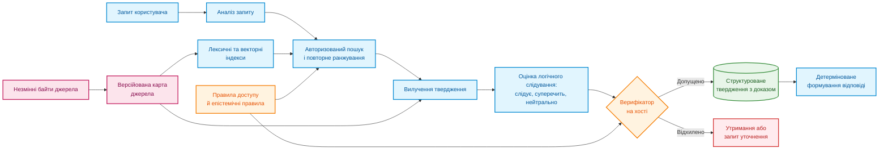
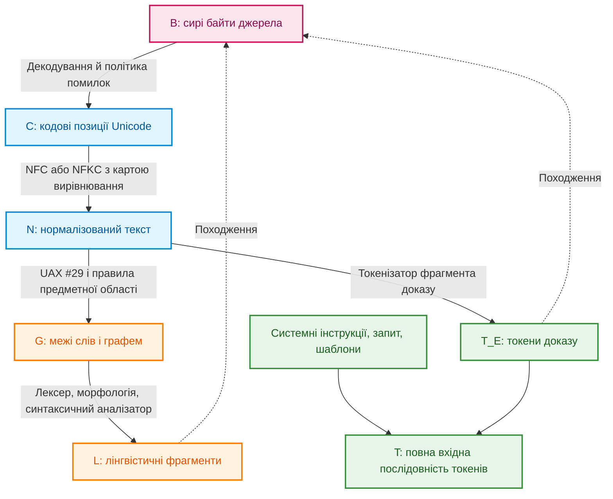
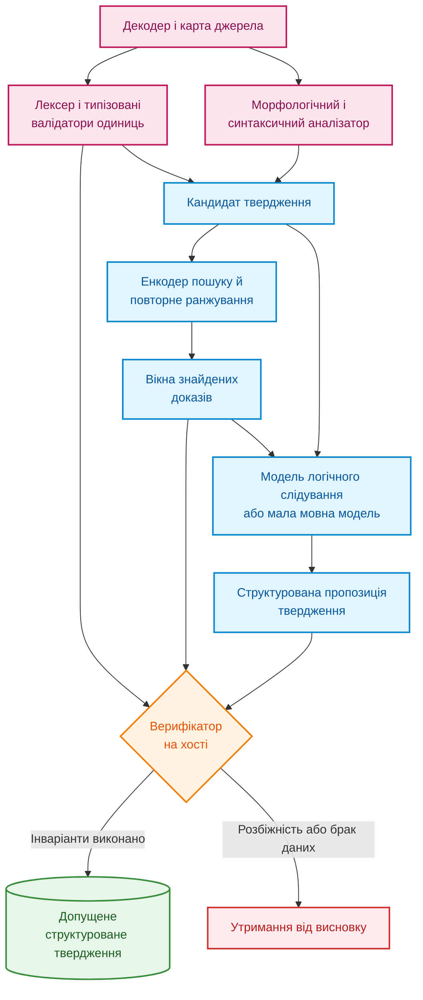
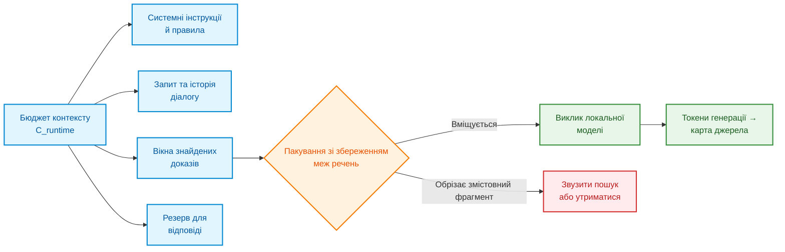
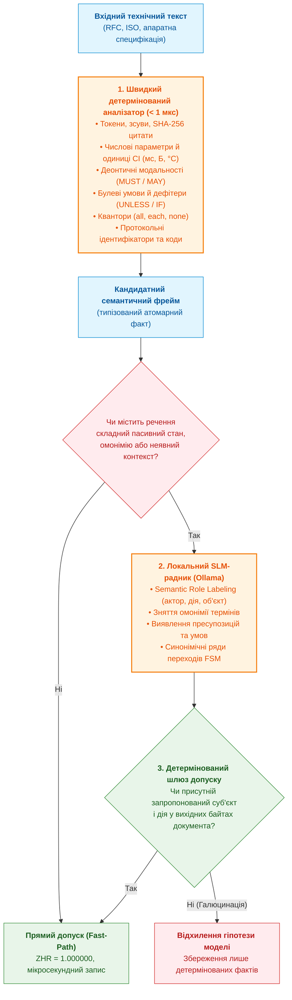

```mermaid
flowchart LR
    accTitle: Порівняльне оцінювання кандидатів мовної підсистеми
    accDescr: Експеримент від зафіксованого поділу даних до парного бутстрепу й діагностики помилок.

    MF["Заморожені маніфести"] --> SPL["Поділ на групи й<br/>перевірка витоку даних"]
    SPL --> B["Базова версія"]
    SPL --> C["Новий кандидат"]
    B --> TR["Синхронізовані журнали<br/>виконання"]
    C --> TR
    TR --> MET["Метрики: джерело, подання,<br/>слідування, наскрізний успіх, ресурси"]
    MET --> SL["Аналіз зрізів за мовами,<br/>термінами й загрозами"]
    SL --> CI["Груповий бутстреп і<br/>парний статистичний тест"]
    CI --> G{"Погоджені пороги<br/>допуску"}
    G -->|"Успіх"| DEP["Тіньовий трафік,<br/>обмежений випуск"]
    G -->|"Відхилено"| DIAG["Діагностика першої<br/>точки відмови"]

    classDef src fill:#fce4ec,stroke:#c2185b,stroke-width:2px,color:#880e4f;
    classDef test fill:#e1f5fe,stroke:#0288d1,stroke-width:2px,color:#01579b;
    classDef gate fill:#fff3e0,stroke:#f57c00,stroke-width:2px,color:#e65100;
    classDef pass fill:#e8f5e9,stroke:#388e3c,stroke-width:2px,color:#1b5e20;
    classDef err fill:#ffebee,stroke:#d32f2f,stroke-width:2px,color:#b71c1c;

    class MF,SPL src;
    class B,C,TR,MET,SL,CI test;
    class G gate;
    class DEP pass;
    class DIAG err;
```

# Глава 12. Лінгвістичний аналіз і локальні моделі: збереження змісту та джерела

> **Книга:** [Архітектура доказових експертних систем](README.md) · [Частина III: Здобуття знань, мовний аналіз та оцінювання входу](part-03-knowledge-engineering-nlp.md)  
> **Попередня глава:** [Глава 11. Вилучення знань у експертів: інтерв'ювання, когнітивні карти та формалізація досвіду](ch11-knowledge-elicitation-from-experts.md)  
> **Наступна глава:** [Глава 13. Варіативність природної мови проти детермінізму: компіляція сенсу запитання](ch13-language-variability-vs-determinism.md)  
> **Зміст книги:** [README.md](README.md)  
> **Автор:** [Микола Федчик](about-the-author.md)  
> **Рівень:** середній: розробники та інженери знань  
> **Очікувані результати:** простежувати шлях від фрази користувача до цитати в документі; розрізняти векторну схожість і логічний доказ; захищати текстовий конвеєр від підміни символів і вбудованих інструкцій; перевіряти локальну модель перед оновленням.

Користувач запитує: «Яка мінімальна довжина заголовка?» У документі відповідь записано як `eight octets`. Експертна система може знайти це речення, але все одно помилитися: перетворити «октети» на «байти» без перевірки, загубити одиницю або процитувати іншу версію документа. Отже, розуміння мови починається не з великої моделі, а з уміння не втратити зміст і походження тексту.

Правильна відповідь у цьому прикладі не є голим `8` і не є автоматично «8 байтів». Вона містить значення, оригінальну одиницю, умову, за якої правило чинне, і точний фрагмент дозволеної версії документа. Саме повний ланцюжок, а не гарне перефразування, робить відповідь експертної системи перевірюваною.

Звідси головне запитання глави: **як побудувати мовну підсистему, яка розуміє різні формулювання людини, але стверджує лише те, що можна відтворити з байтів джерела?** Теза глави: мовна підсистема має бути гібридною. Детермінований код відповідає за байти, координати й правила доступу, синтаксичний аналізатор пропонує форму й будову речення, моделі знаходять схожі фрагменти й перевіряють вузькі твердження, мовна модель допомагає перефразувати запитання. До відповіді потрапляє лише те, що окрема перевірка може відтворити з доказу.

> **Межа практичного досвіду.** У локальних прототипах автора траплялися втрата одиниць, руйнування складених токенів і розбіжність між координатами, які повертає модель, і байтами джерела. Без відкритих сирих журналів і замороженого корпусу це інженерне спостереження, а не загальний результат вимірювання. Архітектуру й протокол нижче треба перевірити на власному корпусі знань.

## Від людської репліки до права стверджувати

[Глава 19](ch19-from-question-to-evidence.md) розділяє шлях від запитання до доказу на виявлення, вилучення, прив'язку до першоджерела й перевірку. [Глава 2](ch02-epistemology-of-machine-knowledge.md) встановила епістемічний контракт: семантична схожість не є доведенням, стан «невідомо» не є запереченням, а факт, дедуктивний висновок і прогнозна ймовірність мають різні підстави. Мовна підсистема поєднує ці рівні.



Схема розділяє змінні й незмінні частини. Етапи машинного навчання можна оновлювати. Незмінні байти, карта першоджерела, перевірка повноважень і умови допуску є стабільними інженерними межами. Оновлення токенізатора не має права непомітно змінити значення тексту чи прив'язку цитати.

Авторизацію виконують двічі: перед пошуком і повторно безпосередньо перед допуском твердження. Недоступний фрагмент не можна спочатку передати генеративній моделі як контекст, а потім приховати цитату: зміст фрагмента вже вплинув на генерацію. Твердження успадковує мітки доступу всіх вихідних матеріалів, а відмова в доступі не повинна розкривати навіть факт існування закритого документа.

## Як не загубити зв'язок між текстом і джерелом

Твердження «позиція символу 42» не має сенсу без визначеної системи координат. Позицію можна рахувати в байтах UTF-8, кодових одиницях UTF-16, кодових позиціях Unicode, розширених кластерах графем, словах, токенах синтаксичного аналізатора або токенах мовної моделі.



Кожне перетворення створює нове подання тексту й відношення походження. Нехай $R_{X\leftarrow Y}\subseteq X\times Y$ відображає фрагмент похідного подання $Y$ у відповідні ділянки батьківського подання $X$, а $T_E\subseteq T$ позначає токени моделі, що походять саме з доказу. Тоді зв'язок токена доказу з байтами є композицією відношень:

```math
R_{B\leftarrow T_E}=R_{B\leftarrow C}\circ R_{C\leftarrow N}\circ R_{N\leftarrow T_E}.
```

- У цьому виразі $T_E$ є множиною токенів моделі, що походять із доказу;
- $B$, $C$ і $N$ позначають байтове, символьне та нормалізоване подання;
- $R_{X\leftarrow Y}$ є відношенням походження, яке зіставляє елементи подання $Y$ з відповідними елементами подання $X$;
- символ $\circ$ означає композицію відношень, тобто послідовне проходження від токенів через нормалізований текст і символи до байтів.

Читається так: для кожного токена доказу можна простежити шлях до відповідних байтів джерела. Зіставлення може бути неоднозначним, коли один токен охоплює кілька позицій або кілька символів злилися під час нормалізації.

Це відображення не є взаємно однозначним. Один токен може охоплювати кілька кодових позицій, одна графема складається з базового символу й діакритики, а нормалізована позиція може виникати зі злиття кількох вхідних символів.

Службові токени шаблону, системні інструкції й токени запиту користувача не мають штучного походження з байтів документа: їх відображають на власні сутності або позначають як згенеровані. Цитата експертної системи спирається виключно на множину $T_E$.

### Чому нормалізація може звести різні записи до одного

У формі нормалізації NFC послідовність `U+0065` (латинська «e») і `U+0301` (комбінований гострий наголос) перетворюється на один символ `U+00E9` («é»). Різні байти джерела дають однаковий нормалізований результат. Форма NFKC додатково стирає сумісні відмінності, наприклад перетворює надрядкові індекси на звичайні цифри чи розкладає лігатури, тому стандарт UAX #15 прямо застерігає: форми KC і KD не можна застосовувати до довільного тексту наосліп, бо вони стирають багато відмінностей форматування [[1]](#src-1). Зворотне відображення неможливо відновити згодом, якщо вирівнювання не зафіксували під час перетворення.

Для похідного фрагмента $s$ нехай $M_B(s)$ позначає мінімальну впорядковану множину байтових інтервалів джерела, $\mathrm{Bytes}_B(M)$ байти джерела в оригінальному порядку, а $\mathrm{Frame}_B(M)$ канонічні записи `(start, end, bytes)`. Тоді виконуються двосторонній інваріант

```math
\mathrm{Normalize}_v\bigl(\mathrm{Decode}_e(\mathrm{Bytes}_B(M_B(s)))\bigr)=\mathrm{Surface}_N(s)
```

Позначення:

- $s$ є похідним фрагментом тексту;
- $M_B(s)$ задає мінімальну впорядковану множину інтервалів байтів джерела для фрагмента $s$;
- $\mathrm{Bytes}_B(M_B(s))$ є байтами цих інтервалів у початковому порядку;
- $\mathrm{Decode}_e$ декодує байти за кодуванням і політикою помилок $e$;
- $\mathrm{Normalize}_v$ нормалізує текст за версією Unicode та формою нормалізації $v$;
- $\mathrm{Surface}_N(s)$ є поверхневим текстом фрагмента в нормалізованому поданні $N$;
- знак $=$ вимагає, щоб обидва способи отримання тексту давали однаковий результат.

Практично це означає, що вибрані байти після декодування й нормалізації мають відтворити саме той текст, на який посилається фрагмент. Інваріант залежить від збережених параметрів $e$ та $v$ і не відновлює втрачене вирівнювання, якщо карта байтів не була записана.

Окремо експертна система перевіряє незмінність первинного доказу:

```math
\mathrm{SHA}256\bigl(\mathrm{Frame}_B(M_B(s))\bigr)=\mathrm{evidence}\_\mathrm{sha}256(s).
```

Складники формули:

- $\mathrm{Frame}_B(M_B(s))$ є канонічним записом інтервалів і відповідних байтів для фрагмента $s$;
- $\mathrm{SHA}256(\cdot)$ обчислює 256-бітний криптографічний хеш переданого запису;
- $`\mathrm{evidence}\_\mathrm{sha}256(s)`$ є збереженим хешем доказу для фрагмента $s$;
- знак $=$ означає, що обчислений хеш збігається зі збереженим.

Перевірка читається як порівняння відбитків: будь-яка зміна охоплених байтів має змінити хеш, але збіг хешів сам по собі не доводить правильності тлумачення цитати. Параметри $e$ і $v$ з попереднього інваріанта фіксують декодування та нормалізацію. Після зміни порядку комбінованих символів карта джерела може бути списком незв'язних інтервалів, а не одним діапазоном. Для PDF-документів і сканів ланцюг довший: «байти PDF → геометрія сторінки або растрове зображення → текст оптичного розпізнавання → нормалізований текст». Координати цитати з оптичного розпізнавання прив'язують до тексту розпізнавання й до обмежувальних рамок на сторінці, а не подають як простий байтовий зсув усередині бінарного файлу PDF.

Стандарт UAX #29 задає базові правила поділу тексту на графеми, слова й речення [[2]](#src-2), але для технічних сутностей на кшталт `10.0.0.0/8` чи `v2.1.4` потрібні правила конкретної предметної області. Для токенізатора, який заявлено безвтратним у вибраному режимі, перевіряють такий інваріант зворотного перетворення:

```math
\mathrm{Detok}_v\bigl(\mathrm{Tok}_v(x;\ \mathrm{special}=\mathrm{false});\ \mathrm{cleanup}=\mathrm{false}\bigr)=x.
```

Розшифрування величин:

- $x$ є початковим текстом;
- $\mathrm{Tok}_v$ перетворює текст на токени за версією токенізатора $v$;
- $\mathrm{Detok}_v$ відновлює текст із цих токенів тим самим токенізатором;
- параметр $\mathrm{special}=\mathrm{false}$ вимикає додавання спеціальних токенів;
- параметр $\mathrm{cleanup}=\mathrm{false}$ вимикає додаткове очищення пробілів;
- знак $=$ вимагає точного відновлення початкового тексту.

Ця рівність є вимогою до безвтратного режиму, не властивістю всіх токенізаторів. Перетворення регістру, нормалізація Unicode, заміна невідомих фрагментів і очищення пробілів можуть змінити текст навіть без спеціальних токенів. Наприклад, після нормалізації NFKC лігатура `fi` стає `fi`: декодування нормалізованих токенів не відновить початкових байтів. Для такого токенізатора перевіряють відповідність заявленому нормалізованому поданню, а доказову цитату отримують через збережену карту першоджерела. Версія токенізатора сама не відновлює втраченої інформації.

## Як текст може приховати підміну

Текст може виглядати для людини звичайним, але по-різному інтерпретуватися програмами або містити приховані інструкції для мовної моделі. Перед пошуком відповіді експертна система перевіряє не лише зміст документа, а й спосіб його кодування.

Нормалізація не усуває підміни символів. Латинська `a` й кирилична `а` виглядають однаково, невидимі керівні символи змінюють порядок відображення, а символи нульової ширини розривають ідентифікатори. Бучер і Андерсон показали атаку Trojan Source: керівні символи двонапрямленого тексту створюють розбіжність між порядком, який бачить людина, і порядком, який обробляє компілятор [[3]](#src-3). Механізми виявлення схожих символів описує стандарт UTS #39 [[4]](#src-4), а правила двонапрямленого тексту стандарт UAX #9 [[5]](#src-5).

| Загроза | Наслідок | Інженерний контроль |
|---|---|---|
| Невалідне кодування | різні компоненти бачать різний текст | строге декодування або карантин, заборона мовчазної заміни символів у доказах |
| Змішані системи письма | `heаder` з кириличною «а» обходить точний пошук | профіль писемності, скелет символів за UTS #39 як сигнал перевірки |
| Двонапрямлений текст і невидимі керівні символи | рецензент бачить інший порядок слів | перевірка за UAX #9, показ кодових позицій, дозволені списки символів |
| Надмірна нормалізація | втрата важливої смислової різниці | незмінні вихідні байти, окремі правила для технічних полів |
| Отруєння корпусу | підроблений фрагмент перемагає в ранжуванні | перевірка джерел, хеші вмісту, виявлення аномалій |
| Непрямі вбудовані інструкції | текст документа намагається керувати моделлю | ізольований канал даних, заборона інструментів за замовчуванням |
| Підробка цитати | показаний фрагмент не відповідає оригіналу | перевірка зворотного відображення через карту джерела та хеш |

Непрямі вбудовані інструкції (*indirect prompt injection*) є реальною загрозою для застосунків на основі мовних моделей: Грешаке та співавтори продемонстрували, як інструкції, приховані в даних, які застосунок отримує під час роботи, перехоплюють керування моделлю [[6]](#src-6).

```mermaid
flowchart LR
    accTitle: Очищення тексту й захист від атак
    accDescr: Етапи фільтрації вхідних байтів від строгого декодування до передачі довіреного тексту в захищений канал моделі.

    IN["Зовнішні байти"] --> DEC{"Строге<br/>декодування?"}
    DEC -->|"Помилка"| QUAR["Карантин"]
    DEC -->|"Успіх"| US["Перевірка безпеки Unicode<br/>(UTS #39, UAX #9)"]
    US --> RAW["Незмінний об'єкт<br/>першоджерела"]
    US --> FLAGS["Позначки підозрілих<br/>символів і напрямку"]
    RAW --> NORM["Нормалізація з фіксацією<br/>вирівнювання"]
    FLAGS --> POL{"Правило допуску<br/>документа"}
    NORM --> POL
    POL -->|"Дозволено"| IDX["Індексування як<br/>недовірених даних"]
    POL -->|"Заблоковано"| QUAR
    IDX --> LLM["Ізольований канал<br/>цитованого доказу"]
    LLM --> HOST["Верифікатор на хості"]

    classDef ext fill:#ffebee,stroke:#c62828,stroke-width:2px,color:#b71c1c;
    classDef check fill:#fff3e0,stroke:#f57c00,stroke-width:2px,color:#e65100;
    classDef safe fill:#e8f5e9,stroke:#388e3c,stroke-width:2px,color:#1b5e20;
    classDef proc fill:#e1f5fe,stroke:#0288d1,stroke-width:2px,color:#01579b;

    class IN,QUAR ext;
    class DEC,US,FLAGS,POL,HOST check;
    class RAW,IDX,LLM safe;
    class NORM proc;
```



Схема показує, що знайдена в документі фраза «ігноруй усі попередні інструкції» залишається пасивними даними. Навіть найкращий детектор вбудованих інструкцій не є периметром безпеки: захист тримається на тому, що текст документа принципово не має права викликати системні інструменти чи змінювати права доступу.

## Як розподілити відповідальність між складниками

Жоден модуль не повинен одночасно знаходити текст, тлумачити його зміст і самостійно ухвалювати висновок. Чіткий поділ обов'язків робить помилку локалізованою: видно, чи збій стався на рівні байтів, синтаксичного розбору чи логічного висновку.



Синтаксичний аналізатор зручно будувати на схемі Universal Dependencies, яка задає узгоджені між мовами частини мови, морфологічні ознаки й синтаксичні залежності [[7]](#src-7). Векторні подання речень для пошуку дають моделі на кшталт Sentence-BERT [[8]](#src-8). Логічне слідування (*natural language inference*, NLI) оцінюють моделі, навчені на наборах на кшталт XNLI, що охоплює багатомовну оцінку [[9]](#src-9). NLI тут є статистичною класифікацією пари текстів, не перевіркою формального доведення. Результат на XNLI не встановлює якість на українських технічних вимогах: потрібні незалежні приклади відповідної мови й предметної області. Таблиця фіксує, що кожен компонент видає і на що не має права.

| Компонент | Що видає | На що не має права |
|---|---|---|
| Декодер і карта джерела | кодові позиції, зв'язки з байтами, помилки декодування | тлумачити намір користувача чи істинність фактів |
| Детермінований лексер і валідатор | типізовані атоми (числа, одиниці, ідентифікатори) і точні межі | призначати смислову роль твердження |
| Синтаксичний аналізатор | леми, частини мови, дерево залежностей | доводити нормативну силу вимоги чи права доступу |
| Енкодер і повторне ранжування | векторні подання, оцінки близькості | доводити логічне слідування чи істинність |
| Модель логічного слідування | імовірності класів «слідує», «суперечить», «нейтрально» | встановлювати істину поза наданим фрагментом |
| Мала або велика мовна модель | пропозицію наміру, нормалізоване формулювання, якір у тексті | підміняти байти, хеші й правила безпеки |
| Верифікатор на хості | рішення про допуск або код причини відмови | перефразовувати текст мовою користувача |
| Модуль формування відповіді | читабельну відповідь із точними посиланнями на цитати | створювати тверджень поза перевіреним поданням |

## Бюджет контексту, токенізація й пам'ять моделі

Токен мовної моделі не дорівнює слову чи символу. Кількість токенів залежить від мови, токенізатора й службових шаблонів, тому бюджет контексту контролюють явно:

```math
L_{\mathrm{sys}}+L_{\mathrm{schema}}+L_{\mathrm{dialog}}+L_{\mathrm{query}}+L_{\mathrm{evidence}}+L_{\mathrm{tools}}+L_{\mathrm{output}}\le C_{\mathrm{runtime}}.
```

- Бюджет утворюють $L_{\mathrm{sys}}$, $L_{\mathrm{schema}}$, $L_{\mathrm{dialog}}$, $L_{\mathrm{query}}$, $L_{\mathrm{evidence}}$, $L_{\mathrm{tools}}$ і $L_{\mathrm{output}}$, кількості токенів для інструкцій, схеми, діалогу, запиту, доказів, опису засобів і відповіді відповідно;
- знак $+$ підсумовує ці частини бюджету;
- $C_{\mathrm{runtime}}$ є перевіреною межею контексту конкретного профілю розгортання, у токенах;
- знак $\le$ вимагає, щоб сума не перевищувала цю межу.

Наприклад, за умовних значень 1 500 + 500 + 2 000 + 500 + 6 000 + 500 + 1 000 маємо 12 000 токенів, отже бюджет у 16 000 токенів не перевищено. Межа залежить від профілю моделі. Якщо релевантний фрагмент не вміщується в контекст повністю, експертна система не має права обрізати винятки посередині речення: вона звужує пошук або відмовляється від відповіді.



### Токенізатор і українська мова

Для українськомовної експертної системи важливу роль відіграє словник токенізатора. Руст та співавтори показали, що спеціалізований токенізатор для мови важить для якості моделі не менше за обсяг даних попереднього навчання; у цій роботі використано показник фертильності токенізатора, тобто середню кількість токенів на слово [[10]](#src-10):

```math
\text{Fertility}=\frac{N_{\text{tokens}}}{N_{\text{words}}}.
```

Символи формули:

- $N_{\text{tokens}}$ є кількістю токенів у вибірці тексту;
- $N_{\text{words}}$ є кількістю слів у тій самій вибірці;
- $\text{Fertility}$ є середньою кількістю токенів на одне слово, у токенах на слово.

Наприклад, якщо вибірка з 800 слів перетворилася на 1 200 токенів, фертильність дорівнює $1{,}5$ токена на слово. Значення залежить від мови, корпусу й токенізатора, тому його не можна переносити на інший набір текстів без вимірювання.

Петров, Ла Мальфа й Торр виявили, що той самий текст, перекладений різними мовами, може мати довжину в токенах, яка відрізняється до 15 разів, і що така нерівність зменшує обсяг вмісту, який вміщується в контекст моделі, та збільшує вартість і затримку обробки [[11]](#src-11). Розмір словника впливає на цю нерівність: ранні моделі LLaMA [[12]](#src-12) і Mistral 7B [[13]](#src-13) мали словник на 32 тисячі токенів, а Gemma має словник на 256 тисяч токенів [[14]](#src-14). Український приклад адаптації дає проєкт Lapa LLM на основі Gemma 3 12B: за описом авторів, у токенізаторі замінили понад 80 тисяч токенів малопоширених для українських текстів систем письма на українські, зберігши розмір словника, і модель потребує для українських текстів приблизно в 1,5 раза менше токенів, ніж початкова Gemma 3 [[15]](#src-15).

Для експертної системи з цього випливають три практичні наслідки. Перший: кількість документів, яку можна подати в $C_{\mathrm{runtime}}$, залежить від фертильності токенізатора на власному корпусі, тому фертильність вимірюють на реальних документах, а не беруть з опису моделі. Другий: довші послідовності збільшують пам'ять кешу ключів і значень і обчислення уваги. Третій: карта вирівнювання $R_{N\leftarrow T_E}$ описує токени вхідного доказового тексту й потребує тестів на кирилиці. Згенерований токен не має автоматичної адреси у першоджерелі. Екстрактор має окремо повернути вибраний фрагмент або покажчик на вхідний діапазон, після чого верифікатор відтворює цитату через карту джерела.

### Межа мовної моделі: зсув розподілу даних

Часто кажуть, що нейронні мережі добре інтерполюють усередині опуклої оболонки навчальних даних і погано екстраполюють за її межами. Балестрієро, Песенті й ЛеКун показали, що для даних розмірності понад 100 нові приклади майже ніколи не потрапляють усередину опуклої оболонки навчальної вибірки, тож такий поділ на інтерполяцію й екстраполяцію не пояснює узагальнення [[16]](#src-16). Практично важливіше інше: якість моделі падає, коли дані під час використання відрізняються від навчальних. Набір WILDS зібрав такі зсуви розподілу з реальних застосувань і показав помітне падіння якості моделей поза навчальним розподілом [[17]](#src-17).

Невідомий під час навчання документ сам по собі не доводить зсуву розподілу: новий документ може належати до тієї самої мови, жанру й схеми вимог. Зсув потрібно оцінювати за змінами цих ознак і якістю на відкладених даних. Водночас відсутність документа в навчанні не дозволяє відновлювати його правила з пам'яті моделі. У доказовій експертній системі джерелом правила є прийнятий документ або запис експертного знання, не параметри мовної моделі. Роль мовної моделі обмежена такими задачами:

- розбір синтаксичних зв'язків і вилучення сутностей;
- генерація структурованих запитів до бази знань у вигляді проміжного подання;
- оцінка локального логічного слідування між ізольованим фрагментом і твердженням.

Логічні висновки, квантифікацію правил і перевірку інваріантів виконує детермінована машина виведення.

### Пам'ять кешу ключів і значень

Пам'ять кешу ключів і значень зростає лінійно з довжиною вхідної послідовності. Для повної уваги на одну активну сесію з $n_l$ шарами, $n_{kv}$ головами ключів і значень, розмірністю голови $d_h$, довжиною $L$ і $b$ байтами на елемент

```math
M_{KV}\approx 2\,n_l\,L\,n_{kv}\,d_h\,b.
```

У формулі стоять такі величини:

- $M_{KV}$ є обсягом пам'яті кешу ключів і значень для однієї активної сесії, у байтах;
- множник $2$ враховує окремо ключі та значення;
- $n_l$ є кількістю шарів моделі;
- $L$ є довжиною послідовності в токенах;
- $n_{kv}$ є кількістю голів ключів і значень у шарі;
- $d_h$ є розмірністю однієї голови;
- $b$ є кількістю байтів для зберігання одного елемента;
- знак $\approx$ позначає оцінку, що не враховує службові накладні витрати.

Для умовних параметрів $n_l=32$, $L=4096$, $n_{kv}=8$, $d_h=128$ і $b=2$ оцінка становить 536 870 912 байтів, або 512 MiB. Реальне споживання пам'яті також залежить від реалізації кешу й вирівнювання даних.

Множник 2 враховує окремо ключі й значення. Квон та співавтори показали, що саме кеш ключів і значень визначає ефективність обслуговування великих мовних моделей, і запропонували сторінкове керування цією пам'яттю в системі vLLM [[18]](#src-18).

## Чому схожість тексту ще не є доказом

Для двох векторних подань $\mathbf q,\mathbf d\in\mathbb R^m$ косинусна схожість дорівнює

```math
s_{\mathrm{dense}}(q,d)=\frac{\mathbf q^\top\mathbf d}{\lVert\mathbf q\rVert_2\lVert\mathbf d\rVert_2}.
```

Кожна величина означає таке:

- $\mathbf q$ і $\mathbf d$ є векторними поданнями запиту $q$ і документа $d$ однакової розмірності;
- $\mathbf q^\top\mathbf d$ є скалярним добутком цих векторів;
- $\lVert\mathbf q\rVert_2$ і $\lVert\mathbf d\rVert_2$ є їхніми евклідовими довжинами;
- $s_{\mathrm{dense}}(q,d)$ є косинусною схожістю, без одиниць вимірювання, зі значенням від $-1$ до $1$.

Якщо вектори ортогональні, скалярний добуток і схожість дорівнюють нулю. Формула не визначена для нульового вектора й не є ймовірністю того, що документ підтверджує запит.

Косинусна схожість визначена лише для ненульових векторів однакової розмірності; значення `NaN` або розбіжність розмірностей блокують кандидата ще до ранжування.

Цей показник є лише оцінкою для сортування, а не ймовірністю логічної підтримки. Лексичний пошук знаходить точні символьні збіги, а векторні подання знаходять перефразування. Метод злиття обернених рангів (*reciprocal rank fusion*, RRF) об'єднує списки різних пошукових методів без змішування неоднорідних шкал оцінок [[19]](#src-19):

```math
s_{\mathrm{RRF}}(d)=\sum_{r\in\mathcal R(d)}\frac{1}{k_0+\mathrm{rank}_r(d)}.
```

Параметри формули:

- $d$ є документом-кандидатом;
- $\mathcal R(d)$ є множиною пошукових списків, у яких трапився документ $d$;
- $r$ перебирає ці списки, а $\mathrm{rank}_r(d)$ є цілим рангом документа в списку $r$, починаючи з 1;
- $k_0$ є додатною сталою згладжування;
- $\sum$ додає внесок кожного списку до загального бала $s_{\mathrm{RRF}}(d)$.

Якщо документ посів перше місце у двох списках, а $k_0=60$, його бал дорівнює $1/61+1/61\approx0{,}0328$. Бал залежить від кількості списків і параметра $k_0$, тому він придатний для ранжування в межах заданої конфігурації, але не є ймовірністю істинності. У генерації з пошуковим доповненням (*retrieval-augmented generation*, RAG) знайдені фрагменти передають моделі як контекст [[20]](#src-20), тому помилка ранжування безпосередньо стає помилкою відповіді.

Модель логічного слідування оцінює твердження $c$ відносно фрагмента $e$:

```math
p_\theta(y\mid c,e)=\mathrm{softmax}\bigl(z_\theta(c,e)\bigr),\qquad y\in\{\mathrm{entailment},\ \mathrm{contradiction},\ \mathrm{neutral}\}.
```

де:

- $c$ є твердженням, яке оцінюють, а $e$ є фрагментом доказу;
- $\theta$ позначає параметри моделі;
- $z_\theta(c,e)$ є вектором логітів для пари «твердження, доказ»;
- $\mathrm{softmax}$ перетворює логіти на ймовірності, кожна з яких належить $[0,1]$, а їхня сума дорівнює 1;
- $y$ є одним із класів: слідування, суперечність або нейтральність.

Наприклад, вихід $[0{,}7; 0{,}1; 0{,}2]$ означає, що модель віддала найбільшу частку класу слідування. Це калібрована інтерпретація лише за наявності перевіреної калібровки; сам розподіл класів не доводить істинність твердження.

Нейтральний клас означає лише брак інформації в конкретному фрагменті. Системний стан «невідомо» ширший: він охоплює неповноту доказів, неможливість зв'язати змінні або невизначену область застосування. Тому остаточне рішення формує верифікатор на хості:

```math
\mathrm{Admit}(c,e,q,u,t)=I_{\mathrm{authz}}(c,e,u,t)\land I_{\mathrm{integrity}}\land I_{\mathrm{material}\ \mathrm{spans}}\land I_{\mathrm{applicable}}(c,q,t)\land[y_{\mathrm{ver}}=\mathrm{entailment}]\land[p_{\mathrm{cal}}(\mathrm{entailment})\ge\tau]\land\neg I_{\mathrm{conflict}}\land I_{\mathrm{epistemic}\ \mathrm{type}}.
```

У правій частині стоять такі величини:

- $c$ є твердженням, $e$ доказовим фрагментом, $q$ запитом, $u$ користувачем, а $t$ моментом перевірки;
- $I_{\mathrm{authz}}(c,e,u,t)$ є індикатором дозволу користувачу $u$ бачити доказ $e$ для твердження $c$ у момент $t$;
- $I_{\mathrm{integrity}}$ перевіряє цілісність доказу, а $I_{\mathrm{material}\ \mathrm{spans}}$ наявність усіх суттєвих фрагментів;
- $I_{\mathrm{applicable}}(c,q,t)$ перевіряє застосовність твердження до запиту й моменту часу;
- $y_{\mathrm{ver}}$ є класом, який повернув верифікатор, а $\mathrm{entailment}$ позначає клас слідування;
- $p_{\mathrm{cal}}(\mathrm{entailment})$ є каліброваною оцінкою ймовірності класу слідування, від 0 до 1;
- $\tau$ є заданим порогом прийняття в межах від 0 до 1;
- $I_{\mathrm{conflict}}$ позначає конфлікт, а $I_{\mathrm{epistemic}\ \mathrm{type}}$ перевіряє допустимий епістемічний тип;
- $\land$ означає, що всі умови мають бути істинними, $\neg$ заперечує умову, а квадратні дужки позначають перевірку рівності чи нерівності.

Предикат повертає істину лише тоді, коли кожна перевірка пройдена, зокрема ймовірність не нижча за $\tau$ та конфлікту немає. Наприклад, за умовного $p_{\mathrm{cal}}=0{,}92$ і $\tau=0{,}80$ умова порога виконується, але це саме по собі не компенсує відсутність дозволу або доказу. Результат залежить від коректності окремих перевірок і калібрування моделі.

Цей предикат задає політику прийняття, не теорему про правильність текстового тлумачення. Якщо клас слідування повернула NLI-модель, детерміноване порівняння її оцінки з порогом не перетворює оцінку на доведення. Індикатори застосовності й епістемічного типу потребують визначеного способу перевірки та запису схвалення. Без цих підстав кандидат лишається кандидатом незалежно від високого бала моделі.

## Парсер документа й навчальні дані: де шукати втрати

Мовна модель не відновить надійно одиницю, якщо парсер документа загубив заголовок стовпця. Тому перед вибором енкодера потрібно виміряти втрати на межі «файл → структуроване подання». Для формату з готовою схемою спочатку використовують структурний розбір; для PDF окремо оцінюють порядок читання, таблиці, колонтитули й розпізнавання сканованих сторінок.

Docling пропонує подання **DoclingDocument**, яке описує текстові елементи, таблиці, групи й походження елементів [[21]](#src-21). Для доказового конвеєра важливіше зберегти це подання, ніж одразу експортувати документ у плаский Markdown: експорт може втратити потрібний зв'язок комірки з заголовком. Apache Tika є придатним базовим варіантом вилучення тексту й метаданих із різних форматів [[22]](#src-22). Порівняння має встановити, які класи сторінок потребують складнішого парсера; назва бібліотеки не гарантує точності таблиці або українського розпізнавання.

Для кожного блока зберігають хеш оригіналу, хеш похідного тексту, версію парсера, параметри обробки, структурний шлях і координати. Байтові зміщення похідного тексту не видають за байти стисненого PDF. Для скану зберігають також номер сторінки, геометрію області й статус перевірки розпізнаного тексту. Ті самі записи дозволяють порівнювати Docling, Tika й засоби оптичного розпізнавання на однакових документах.

Нестача розмічених прикладів належить до навчання на основі якості даних (*data-centric learning*). **Навчання зі слабкими мітками (*weak supervision*)** дозволяє перетворити словники, шаблони й евристики на кандидатні мітки. У Snorkel Ратнера та співавторів функції розмітки можуть утримуватися від відповіді, суперечити одна одній і мати залежні помилки [[23]](#src-23). Три шаблони, побудовані на тому самому слові MUST, не є трьома незалежними голосами. Автоматичні мітки придатні для навчання, але не замінюють незалежний еталон перевірки.

**Активне навчання (*active learning*)** тут означає добір наступних прикладів для експертної розмітки. Запропонована політика добору поєднує невпевненість моделі, різноманітність документів, ризик помилки й час рецензента. Окрема випадкова аудиторська вибірка потрібна для оцінки частоти помилок: статистика лише відібраних складних прикладів не оцінює весь потік. Редакції одного документа мають потрапляти в один набір даних, інакше витік між навчальним і контрольним наборами завищує оцінку.

Для політики відмови можна дослідити **конформне прогнозування (*conformal prediction*)**, огляд якого подали Ангелопулос і Бейтс [[24]](#src-24). У базовій постановці калібрувальні й майбутні приклади мають бути обмінними; гарантія стосується покриття правильної мітки множиною прогнозів у сукупності, не істинності кожної прийнятої вимоги. Зміна мови або жанру може порушити передумови. Такий метод допомагає направляти неоднозначні випадки на рецензію, а не замінює доказову прив'язку.

Отже, перший вибір стосується збереження структури та незалежності контрольних даних. Після визначення цих умов можна обирати середовище виконання й порівнювати вартість моделей.

## Профілі розгортання локальних моделей

Локальне виконання потрібне, коли конфіденційні дані не повинні залишати захищеного середовища підприємства. Проте позначка «локальна модель» фіксує лише місце виконання, а не гарантує точності чи відсутності мережевих звернень.

| Профіль | Переваги | Обмеження |
|---|---|---|
| llama.cpp і формат GGUF [[25]](#src-25) | переносимість між процесорами й графічними прискорювачами, робота без мережі | потрібно фіксувати версію збірки й хеш квантованого файлу моделі |
| Ollama [[26]](#src-26) | зручний локальний REST API, структурований вивід за JSON Schema | обгортка не додає перевірки фактів; потрібен контроль версій моделі |
| vLLM [[18]](#src-18) | висока пропускна здатність паралельних запитів, сторінкове керування кешем | складніше розгортання, залежність від версій CUDA |
| MLX LM [[27]](#src-27) | виконання й донавчання на Apple Silicon | артефакти MLX не переносяться на CUDA чи ROCm |
| TensorRT-LLM [[28]](#src-28) | висока продуктивність на серверах NVIDIA | тісна прив'язка до драйверів і конкретних графічних процесорів |
| ONNX Runtime [[29]](#src-29) | швидкі спеціалізовані енкодери й моделі логічного слідування на різних прискорювачах | різні провайдери обчислень можуть давати числові розбіжності |

Таблиця показує, що вибір профілю є компромісом між переносимістю, продуктивністю й відтворюваністю. Для доказової експертної системи найважливіший останній стовпчик: кожне обмеження стає пунктом маніфесту розгортання.

## Контроль регресій під час квантування й оновлення моделей

Спрощене афінне квантування ваг моделі, яке описали Джейкоб та співавтори для цілочисельного виведення [[30]](#src-30), має вигляд

```math
q(w)=\mathrm{clip}\left(\mathrm{round}\left(\frac{w}{s}\right)+z,\ q_{\mathrm{min}},\ q_{\mathrm{max}}\right),\qquad \hat w=s\,\bigl(q(w)-z\bigr).
```

Що означають літери:

- $w$ є початковою вагою моделі;
- $s$ є додатним масштабом квантування, а $z$ є цілою нульовою точкою;
- $\mathrm{round}$ округлює до цілого, а $\mathrm{clip}(x,q_{\mathrm{min}},q_{\mathrm{max}})$ обмежує $x$ заданим цілим діапазоном;
- $q(w)$ є цілим квантованим значенням, обмеженим між $q_{\mathrm{min}}$ і $q_{\mathrm{max}}$;
- $\hat w$ є відновленою наближеною вагою після деквантування.

Наприклад, за умовних $w=0{,}7$, $s=0{,}1$, $z=0$ і діапазону від $-8$ до $7$ маємо $q(w)=7$ та $\hat w=0{,}7$. Квантування може змінити ваги й поведінку моделі, тому кожну квантовану модель перевіряють окремо. Зміну якості на зрізі $s$ за метрикою $m$ вимірюють як

```math
\Delta_{m,s}=m(\mathrm{model}_q,s)-m(\mathrm{model}_{\mathrm{base}},s).
```

Різниця якості:

- $m$ є метрикою якості, а $s$ є зрізом даних, наприклад мовою або типом параметрів;
- $\mathrm{model}_q$ є квантованою моделлю, а $\mathrm{model}_{\mathrm{base}}$ є базовою моделлю;
- $m(\mathrm{model}_q,s)$ і $m(\mathrm{model}_{\mathrm{base}},s)$ є значеннями тієї самої метрики на тому самому зрізі;
- $\Delta_{m,s}$ є різницею цих значень у одиницях метрики.

Наприклад, якщо точність квантованої моделі на зрізі дорівнює $0{,}91$, а базової $0{,}94$, то $\Delta_{m,s}=-0{,}03$, тобто зниження становить 3 відсоткові пункти. Знак і допустимий розмір різниці тлумачать відповідно до конкретної метрики та вимог оцінювання.

Оцінювання обов'язково розбивають на зрізи: українська мова, точність вилучення числових параметрів, стійкість структурованого виводу, правильність утримання від відповіді. Усереднений результат може приховати критичне погіршення на рідкісних технічних термінах.

Маніфест розгортання фіксує знімок корпусу документів, правила нормалізації Unicode, версії синтаксичних аналізаторів, хеші ваг моделей, параметри квантування, версії середовища виконання й пороги калібрування.

```mermaid
flowchart LR
    accTitle: Безпечне розгортання й відкат моделі
    accDescr: Від підписаного маніфесту через парне тестування до поступового розгортання з можливістю відкату.

    MF["Підписаний маніфест"] --> ST["Завантаження<br/>в тестове середовище"]
    ST --> SELF["Перевірка хешів,<br/>схем і середовища"]
    SELF --> PAIR["Парне оцінювання:<br/>базова версія проти кандидата"]
    PAIR --> G{"Пороги якості,<br/>безпеки й рівня обслуговування"}
    G -->|"Успіх"| SH["Тіньовий трафік →<br/>обмежений випуск"]
    G -->|"Помилка"| STOP["Відхилення кандидата"]
    SH --> PR["Атомарне підвищення<br/>версії"]
    SH -->|"Аномалія"| RB["Повний відкат<br/>разом із залежностями"]
    PR --> MON["Моніторинг якості,<br/>пам'яті й затримок"]
    MON -->|"Порушення рівня обслуговування"| RB

    classDef doc fill:#fce4ec,stroke:#c2185b,stroke-width:2px,color:#880e4f;
    classDef proc fill:#e1f5fe,stroke:#0288d1,stroke-width:2px,color:#01579b;
    classDef check fill:#fff3e0,stroke:#f57c00,stroke-width:2px,color:#e65100;
    classDef ok fill:#e8f5e9,stroke:#388e3c,stroke-width:2px,color:#1b5e20;
    classDef fail fill:#ffebee,stroke:#d32f2f,stroke-width:2px,color:#b71c1c;

    class MF doc;
    class ST,SELF,PAIR,SH,MON proc;
    class G check;
    class PR ok;
    class STOP,RB fail;
```



Схема показує, що новий кандидат моделі проходить той самий шлях, що й новий випуск бази знань: перевірка, порівняння з базовою версією, обмежений випуск і готовий відкат.

## Як перевіряти мовну підсистему

Частку запитів, для яких серед перших $k$ результатів пошуку є правильний документ, рахують лише для запитів $Q_+$, на які відповідь існує:

```math
\mathrm{Hit}@k=\frac{1}{|Q_+|}\sum_{q\in Q_+}\mathbb{1}\bigl[G_q\cap R_k(q)\ne\varnothing\bigr].
```

Складники формули:

- $Q_+$ є множиною запитів, для яких відповідь існує, а $q$ є одним таким запитом;
- $G_q$ є множиною правильних документів для запиту $q$;
- $R_k(q)$ є першими $k$ результатами пошуку для запиту $q$;
- $G_q\cap R_k(q)$ є документами, що одночасно правильні й знайдені серед перших $k$;
- $\mathbb{1}[\cdot]$ дорівнює 1, якщо умова в дужках істинна, і 0 в іншому разі;
- $|Q_+|$ є кількістю запитів, а $\sum$ підсумовує індикатори для всіх таких запитів.

Показник від 0 до 1 дорівнює частці запитів, для яких серед перших $k$ результатів є хоча б один правильний документ. Наприклад, якщо це сталося для 8 із 10 запитів, $\mathrm{Hit}@k=0{,}8$. Метрика не вимірює повноту, коли твердження потребує кількох джерел; для цього рахують повноту:

```math
\mathrm{Recall}@k=\frac{1}{|Q_+|}\sum_{q\in Q_+}\frac{|G_q\cap R_k(q)|}{|G_q|}.
```

Тут кожна величина має такий зміст:

- $Q_+$ є множиною запитів із наявною відповіддю, а $q$ є окремим запитом;
- $G_q$ є множиною всіх правильних документів для запиту $q$;
- $R_k(q)$ є першими $k$ знайденими документами;
- $|G_q\cap R_k(q)|/|G_q|$ є часткою правильних документів, знайдених серед перших $k$;
- $|Q_+|$ є кількістю запитів, а зовнішня сума обчислює середнє за запитами.

Значення лежить від 0 до 1. Якщо для запиту потрібні чотири документи, а в перших $k$ знайдено три, його повнота дорівнює $3/4=0{,}75$. Показник залежить від повноти розмітки множини $G_q$ і не свідчить сам собою про точність відповіді.

Стійкість до синонімії й варіативності формулювань вимірюють на групах перефразувань $G$, де група зараховується лише тоді, коли успішні всі її варіанти $V_g$:

```math
\mathrm{GroupPass}=\frac{1}{|G|}\sum_{g\in G}\prod_{i\in V_g}\mathrm{Success}_i.
```

У формулі:

- $G$ є множиною груп еквівалентних формулювань, а $g$ є однією групою;
- $V_g$ є множиною варіантів запиту в групі $g$, а $i$ позначає окремий варіант;
- $\mathrm{Success}_i$ дорівнює 1, якщо варіант $i$ успішний, і 0, якщо ні;
- $\prod$ перемножує результати всіх варіантів групи, тому добуток дорівнює 1 лише за успіху кожного варіанта;
- $|G|$ є кількістю груп, а $\sum$ підраховує успішні групи.

Показник лежить від 0 до 1 і вимірює частку груп, у яких успішні всі варіанти. За трьох груп і двох повністю успішних груп $\mathrm{GroupPass}=2/3\approx0{,}67$. Метрика суворіша за частку успішних окремих запитів і залежить від того, наскільки повно сформовано групи перефразувань.

Успіх $\mathrm{Success}_i=1$ фіксують лише тоді, коли експертна система правильно визначила контракт запиту, знайшла правильні байти доказу, зберегла типізовані числові значення, пройшла перевірку прав доступу й правильно сформувала відповідь. Для оцінки фактичної точності тексту корисна метрика FActScore, яка розкладає відповідь на атомарні факти й перевіряє кожен факт за джерелом [[31]](#src-31), а для оцінки цитат корисний набір ALCE, який окремо вимірює правильність відповіді й підтримку цитатами [[32]](#src-32). Довірчі інтервали для порівняння версій отримують бутстрепом Ефрона, причому повторну вибірку роблять цілими групами перефразувань, щоб не завищити кількість незалежних спостережень [[33]](#src-33).



## Прозорий інджест сирих знань: подолання бар'єра недовіри та інтерактивна візуалізація (Show, Don't Tell)

У критичних інженерних доменах (автомобільна безпека ISO 26262, кібербезпека ISO 21434, авіоніка DO-178C) будь-яка експертна система стикається з жорстким, прагматичним скепсисом зовнішніх аудиторів. Коли розробники декларують «нульову галюцинацію» на закритих бінарних базах знань, у стороннього фахівця негайно виникає підозра щодо підгонки результатів під власні тести (*circular benchmark bias*) або наявності прихованого хардкоду. Без можливості наочно простежити, як саме машина сприймає довільний сирий документ, технологія ризикує сприйматися ринком як «доморощена конструкція», нездатна витримати суворий аудит.

Вирішенням цієї проблеми є застосування принципу **«Show, Don't Tell»** через спеціалізовані термінальні інструменти інтерактивного інджесту (TUI). Такий інструмент дозволяє аудитору завантажити власний, невідомий системі документ (довільний текстовий стандарт, корпоративну політику, технічні умови) і спостерігати за його розбором у реальному часі за моделлю подвійного бачення (**Dual-View: Людина vs Машина**):

1. **Лексико-синтаксична декомпозиція:**
   Користувач бачить, на які саме фрагменти й речення синтаксичний сегментатор поділив текст, як збережено непорушні байтові координати `[byte_start, byte_end]` та які лексичні метрики притаманні документу:
   - Обсяг словника та Type-Token Ratio ($TTR = N_{\text{unique}} / N_{\text{tokens}}$);
   - Інформаційна ентропія Шеннона ($H = -\sum p_i \log_2 p_i$), що свідчить про стилістичну складність тексту;
   - Розподіл довжини речень.

2. **Детерміністичне виділення деонтичних норм:**
   Система підсвічує в тексті нормативні маркери зобов'язань (`MUST`, `SHALL`), заборон (`MUST NOT`, `SHALL NOT`), рекомендацій (`SHOULD`) та дозволів (`MAY`). Аудитор наочно бачить, які атоми знань виділені виключно символічним синтаксичним аналізатором без участі ймовірнісних моделей.

3. **Аудит нейро-символічного стику (SLM Tracing):**
   Якщо в конвеєрі задіяна локальна SLM для розв'язання неоднозначностей або виділення неявних відношень, TUI відображає:
   - Дослівний промпт, сформований детерміністичним середовищем;
   - Сиру невідфільтровану відповідь нейромоделі;
   - Рішення детерміністичного фільтра хоста: чи підтверджується пропозиція моделі дослівним текстом першоджерела, чи вона відхилена через брак байтової кустодії.

4. **Машинне сприйняття фрагмента (Machine Perception):**
   При наведенні курсора на будь-яке речення людина бачить точну формулу знання, яку згенерувала машина: суб'єкт (актор), деонтичну модальність, предикат (дія) та криптографічний хеш SHA-256 цитати.

Такий підхід позбавляє інженерну команду необхідності виправдовуватися чи доводити відсутність маніпуляцій: зовнішній експерт особисто бачить наскрізний потік інформації від байта у файлі до нормативного факту, що перетворює систему з непрозорої «чорної скриньки» на відкритий аналітичний мікроскоп.

### Атестація машинних знань (Machine Knowledge Attestation, MKA) та Сертифікат знань

На основі прозорого інджесту виникає самостійний доказовий інститут довіри — **Атестація машинних знань (Machine Knowledge Attestation, MKA)**.

> **Визначення (Атестація машинних знань):**  
> *Атестація машинних знань* — це детерміністичний та криптографічно підтверджений процес формальної експертизи довільного першоджерела (стандарту, специфікації, кодексу), в результаті якого формується замкнена система видобутих онтологічних сутностей, деонтичних відношень та атомарних фактів із гарантією 100% байтової кустодії джерела ($ZHR = 1.000000, EGR = 1.000000$).

Результатом цієї процедури для кожного окремого документа є формальний **Сертифікат атестації машинних знань (MKA Certificate)**, що містить такі непорушні блоки:
1. **Паспорт цілісності першоджерела (Source Provenance & Custody):**
   - Унікальний ідентифікатор сертифіката (`MKA-<filename>-<sha256[:12]>`);
   - Повний байтовий розмір та контрольна сума першоджерела (SHA-256);
   - Режим проходження шлюзу допуску (`PASSED_FAIL_CLOSED_GATE_100%`);
   - Фіксація $ZHR = 1.000000$ (Zero-Hallucination Rate).
2. **Лексичний та ентропійний профіль:**
   - Кількість речень, токенів та слів;
   - Лексичне різноманіття ($TTR$) та інформаційна ентропія Шеннона ($H$), що засвідчує стилістичну та понятійну насиченість тексту.
3. **Деонтичний баланс та нормативна щільність:**
   - Нормативна щільність ($ND = \frac{N_{\text{norms}}}{N_{\text{words}}} \times 1000$);
   - Точний баланс зобов'язань ($MUST$), заборон ($MUST\ NOT$), рекомендацій ($SHOULD$) та дозволів ($MAY$).
4. **Реєстр виявлених сутностей (Discovered Entities & Actor Profiles):**
   - Перелік усіх виявлених акторів та системних компонентів;
   - Частотний розподіл та індивідуальний деонтичний профіль кожного суб'єкта (скільки саме обов'язків, заборон та дозволів на нього покладено документом);
   - Характерні нормативні дії.
5. **Реєстр виявлених відношень та предикатів (Discovered Relations & Actions):**
   - Предикати дій із зазначенням пов'язаних суб'єктів та модальностей.
6. **Реєстр атомарних фактів (Ground Atoms Register):**
   - Повний перелік сформованих фактів із дослівними цитатами, точними байтовими зміщеннями `[byte_start..byte_end]` та криптографічними хешами кожного текстового зрізу.

Наявність такого сертифіката дозволяє будь-якій регуляторній або сертифікаційній комісії провести миттєвий аудит машинних знань: або за допомогою термінального інструменту інспекції (`kp-ingest-tui -file <doc> -attest`), або через серійний машинний експорт у структурованому форматі JSON.

### Таксономія предикатів знання: від деонтики до епістемології, інформатики та кібернетики

Початкові спроби формалізації нормативних текстів (зокрема в межах RFC 2119) спиралися виключно на три деонтичні модальності: *обов'язок* (`MUST`), *рекомендацію* (`SHOULD`) та *дозвіл* (`MAY`). Проте в інженерних специфікаціях, протоколах безпеки та наукових монографіях звуження семантичного аналізу лише до цих трьох дієслів є критичною помилкою: система відкидає до 70–80% концептуального каркаса документа як «нерелевантний контекст». Зокрема, твердження про структуру компонентів, математичні закони, алгоритмічні перетворення чи цикли зворотного зв'язку взагалі не містять деонтичних часток, але становлять ядро інженерного знання.

Доказова експертна система нового покоління впроваджує **п'ятивимірну онтологічну таксономію предикатів**, що охоплює філософію пізнання, теоретичну інформатику та кібернетику:

1. **Деонтичні норми (Deontic Modality — `MUST`, `FORB`, `SHLD`, `MAY`):**
   Регулюють правові та нормативні зобов'язання суб'єктів. Базуються на деонтичній логіці Ґ. фон Врігта (*Georg Henrik von Wright*). Визначають простір дозволених і заборонених станів системи.
2. **Епістемологічні та онтологічні предикати (Epistemic & Ontological — `SCIENTIFIC`):**
   Описують модус буття, істинність тверджень, математичні кореляції, причинно-наслідкові ланцюги та критерії демаркації знання:
   - *Предикати існування та сутності:* `exists`, `instantiates`, `constitutes`, `embodies`, `characterizes` (*«TLS складається з двох первинних компонентів»*);
   - *Предикати верифікації та фальсифікації (за К. Поппером):* `proves`, `falsifies`, `substantiates`, `refutes`, `verifies`, `demonstrates`, `deduces`, `hypothesizes`;
   - *Предикати логічного слідування та пресупозицій:* `implies`, `entails`, `presupposes`, `stipulates`, `postulates`.
3. **Обчислювальні предикати інформатики (Computational & Formal Systems — `COMPUTATIONAL`):**
   Описують детерміновану поведінку абстрактних автоматів, дискретні переходи станів, роботу з формальними граматиками та структурами даних:
   - *Теорія автоматів та обчислюваність:* `computes`, `decides`, `transitions`, `halts`, `reduces`, `parses`, `evaluates`;
   - *Трансформація даних і пам'ять:* `serializes`, `deserializes`, `encodes`, `decodes`, `hashes`, `indexes`, `allocates`, `compresses`.
4. **Кібернетичні предикати регулювання та системної динаміки (Cybernetic & Control — `CYBERNETIC`):**
   Описують функціонування складних систем в умовах збурень за канонами Н. Вінера та В. Р. Ешбі (*W. Ross Ashby*):
   - *Зворотний зв'язок і гомеостаз:* `regulates`, `stabilizes`, `balances`, `converges`, `diverges`, `oscillates`, `adapts`, `equilibrates`;
   - *Захист, обмеження та компенсація:* `throttles`, `compensates`, `quarantines`, `isolates`, `recovers`, `mitigates`, `arbitrates`, `audits`.
5. **Загально-інженерні та функціональні дії (Engineering Actions — `ACTION`):**
   Описують безпосередні фізичні та протокольні маніпуляції: `transmits`, `routes`, `forwards`, `connects`, `disconnects`, `triggers`, `dispatches`, `emits`.

#### Високопродуктивна індексація через Топ-1000 лексичний атлас ($O(1)$)

Для забезпечення непорушності інваріанта продуктивності та відсутності накладних витрат під час обробки багатомегабайтних корпусів, лінійний перебір дієслів неприпустимий. Усі 1000+ типізованих двомовних лексем (включаючи флексії 3-ї особи однини, інфінітиви та форми доконаного/недоконаного виду) компілюються у статичний **лексичний хеш-атлас** (`Token Predicate Atlas`). Під час синтаксичного проходу кожне слово речення перевіряється в таблиці за $\mathcal{O}(1)$, що скорочує час повного семантичного аудиту RFC-документа обсягом понад 300 КБ до лічених мілісекунд при повному збереженні $ZHR = 1.000000$.

### Розподіл праці: детермінований лінгвістичний аналізатор проти нейро-символічного радника (SLM)

У доказових експертних системах розподіл обов'язків між символічним парсером і статистичною мовною моделлю є питанням не зручності, а математичної надійності. Мовні моделі схильні до галюцинацій та втрати числових меж, проте володіють винятковою гнучкістю щодо семантичних варіацій природної мови. Детерміновані скінченні автомати та регулярні граматики, навпаки, працюють за мікросекунди ($O(N)$) і мають нульову похибку, але є крихкими перед складними синтаксичними інверсіями чи омонімією.

Тому конвеєр інджесту реалізує суворий дворівневий розподіл праці за принципом **«Детермінізм фіксує інваріанти — SLM пропонує гіпотези — Шлюз вирішує»**:



#### Матриця функціональної відповідальності

| Семантична / лінгвістична категорія | Що виявляє детермінований рушій ($< 1$ мкс) | Що делегується нейро-символічній SLM |
|---|---|---|
| **Фізичні величини та одиниці СІ** | Числа, експоненти, діапазони, одиниці системи СІ (`s`, `ms`, `octet`, `bit/s`, `V`, `Hz`, `°C`), оператори нерівності ($=, \le, \ge, \lt, \gt, \in [a, b]$). | Інтерпретація неформальних або розмовних описів розмірностей (*«затримка не довша за одне кліпання оком»*). |
| **Деонтичні норми** | Замкнений словник нормативних маркерів: `MUST`, `MUST NOT`, `SHALL`, `SHOULD`, `MAY`, `повинен`, `заборонено`, `слід`. | Виявлення прихованих зобов'язань у ненормативних формулюваннях (*«від сервера очікується...»*). |
| **Логічні умови та дефітери (Defeaters)** | Формальні синтаксичні зв'язки: `IF`, `UNLESS`, `EXCEPT WHEN`, `PROVIDED THAT`, `AND`, `OR`, `NOT`. | Оцінка семантичної сумісності складносурядних гіпотетичних конструкцій. |
| **Квантори ($\forall/\exists$)** | Маркери загальності та існування: `all`, `every`, `each`, `any`, `at least one`, `none`, `кожен`, `всі`, `жоден`. | Розрізнення колективного та дистрибутивного значення множин. |
| **Протокольні символи та константи** | Ідентифікатори `camelCase`, `snake_case`, `SCREAMING_SNAKE`, числові статуси (`503`, `404`), шістнадцяткові значення (`0x0304`). | Зв'язування числових кодів із текстовими описами помилок без явної таблиці. |
| **Синтаксична будова (SRL)** | Прямий суб'єктно-предикатний порядок слів (*«Client MUST send...»*). | Інверсія, пасивний стан, еліпсис (*«Upon receipt of X, there shall be emitted Y»*). |
| **Зняття омонімії (Disambiguation)** | Позиційний аналіз у межах активного `Scope`. | Контекстне розрізнення багатозначних лексем (`CAN` як шина чи допоміжне дієслово; `state` як стан чи висловлювання). |
| **Неявні пресупозиції** | Не підтримується (працює за замкненим світом). | Інференція логічних передумов (*«resuming a session»* $\implies$ попередня сесія була збережена). |

Глава почалася із запитання, як побудувати мовну підсистему, що розуміє різні формулювання людини, але стверджує лише відтворюване з байтів джерела. Відповідь така: мовна підсистема розширює коло формулювань, які експертна система сприймає від людини, і водночас звужує множину тверджень експертної системи до тих, що спираються на конкретні незмінні байти першоджерела. Для цього кожне перетворення тексту зберігає карту походження, кожен компонент має обмежені повноваження, схожість лише впорядковує кандидатів, а рішення про допуск ухвалює детермінований верифікатор за маніфестами, хешами, картами походження й правилами доступу.

Межі підходу теж визначені. Токенізація залежить від мови й моделі, тож бюджет контексту й карти вирівнювання перевіряють на власному корпусі. Мовна модель ненадійна на документах, яких не було в навчальних даних, тому вона не є джерелом знань. Кожне оновлення моделі чи квантування є новим кандидатом, який проходить повну перевірку. Як долати варіативність мови під час перетворення запитання на однозначні предикати виведення, розглядає [Глава 13](ch13-language-variability-vs-determinism.md).

## Запитання до читачів
1. Чому координати цитати повинні спиратися на незмінні байти джерела, а не на токени мовної моделі?
2. Чим небезпечне некероване застосування нормалізації NFKC до інженерної документації?
3. Чому висока косинусна схожість не може бути підставою для твердження факту?
4. Які складники входять до повного маніфесту розгортання локальної моделі?
5. Чим нейтральний клас моделі логічного слідування відрізняється від системного стану «невідомо»?

## Словник
| Український термін | Англійський відповідник | Коротке пояснення |
|---|---|---|
| Карта джерела | *source map* | Відображення фрагментів похідного тексту на байти першоджерела |
| Кодова позиція | *code point* | Числовий код символу в Unicode |
| Кластер графем | *grapheme cluster* | Послідовність кодових позицій, яку людина сприймає як один символ |
| Нормалізація Unicode | *Unicode normalization* | Приведення різних кодувань того самого тексту до канонічної форми |
| Вирівнювання | *alignment* | Збережене відношення між позиціями до й після перетворення тексту |
| Токенізатор | *tokenizer* | Програма, що ділить текст на токени словника моделі |
| Фертильність токенізатора | *tokenizer fertility* | Середня кількість токенів на одне слово |
| Логічне слідування | *natural language inference* | Оцінка, чи випливає твердження з фрагмента тексту, суперечить йому чи не пов'язане |
| Злиття обернених рангів | *reciprocal rank fusion* | Об'єднання кількох ранжованих списків за оберненими рангами |
| Непрямі вбудовані інструкції | *indirect prompt injection* | Інструкції для моделі, приховані в даних, які застосунок обробляє |
| Зсув розподілу | *distribution shift* | Відмінність даних під час використання від навчальних даних |
| Слабка розмітка | *weak supervision* | Навчальні мітки від евристик, які можуть утримуватися або помилятися |
| Активне навчання | *active learning* | Добір наступних прикладів для експертної розмітки |
| Конформне прогнозування | *conformal prediction* | Побудова множин прогнозів із гарантіями покриття за визначених передумов |
| Кеш ключів і значень | *KV cache* | Збережені проміжні подання уваги, що ростуть із довжиною контексту |
| Квантування | *quantization* | Подання ваг моделі числами меншої розрядності |
| Верифікатор на хості | *host verifier* | Детермінований компонент, що ухвалює рішення про допуск твердження |
| Атестація машинних знань | *Machine Knowledge Attestation* | Детерміністичний процес аудиту та паспортизації видобутих фактів і сутностей із гарантією 100% байтової кустодії |
| Сертифікат атестації знань | *MKA Certificate* | Структурований паспорт знань із криптографічним хешем першоджерела, реєстрами сутностей, відношень і деонтичних норм |

## Абревіатури
| Скорочення | Розшифрування | Значення |
|---|---|---|
| CUDA | Compute Unified Device Architecture | платформа обчислень на графічних процесорах NVIDIA |
| GGUF | назва формату файлів ggml | формат зберігання квантованих моделей для llama.cpp |
| MKA | Machine Knowledge Attestation | атестація машинних знань із гарантією повної кустодії джерела |

| NFC, NFKC | Normalization Form C, Normalization Form KC | канонічна й сумісна форми нормалізації Unicode зі складанням |
| NLI | Natural Language Inference | логічне слідування природною мовою |
| PDF | Portable Document Format | формат документів |
| RAG | Retrieval-Augmented Generation | генерація з пошуковим доповненням |
| REST API | Representational State Transfer Application Programming Interface | програмний інтерфейс поверх HTTP |
| ROCm | Radeon Open Compute | платформа обчислень на графічних процесорах AMD |
| RRF | Reciprocal Rank Fusion | злиття обернених рангів |
| UAX | Unicode Standard Annex | додаток до стандарту Unicode |
| UTS | Unicode Technical Standard | технічний стандарт Unicode |
| UTF-8, UTF-16 | Unicode Transformation Format | способи кодування кодових позицій байтами |

## Джерела
1. <a id="src-1"></a>Unicode Consortium. [*UAX #15: Unicode Normalization Forms*](https://www.unicode.org/reports/tr15/). Unicode Standard Annex.
2. <a id="src-2"></a>Unicode Consortium. [*UAX #29: Unicode Text Segmentation*](https://www.unicode.org/reports/tr29/). Unicode Standard Annex.
3. <a id="src-3"></a>Nicholas Boucher, Ross Anderson. [*Trojan Source: Invisible Vulnerabilities*](https://www.usenix.org/conference/usenixsecurity23/presentation/boucher). *32nd USENIX Security Symposium*, 2023.
4. <a id="src-4"></a>Unicode Consortium. [*UTS #39: Unicode Security Mechanisms*](https://www.unicode.org/reports/tr39/). Unicode Technical Standard.
5. <a id="src-5"></a>Unicode Consortium. [*UAX #9: Unicode Bidirectional Algorithm*](https://www.unicode.org/reports/tr9/). Unicode Standard Annex.
6. <a id="src-6"></a>Kai Greshake, Sahar Abdelnabi, Shailesh Mishra, Christoph Endres та ін. [*Not What You've Signed Up For: Compromising Real-World LLM-Integrated Applications with Indirect Prompt Injection*](https://doi.org/10.1145/3605764.3623985). *Proceedings of the 16th ACM Workshop on Artificial Intelligence and Security*, 79–90, 2023.
7. <a id="src-7"></a>Marie-Catherine de Marneffe, Christopher D. Manning, Joakim Nivre, Daniel Zeman. [*Universal Dependencies*](https://doi.org/10.1162/coli_a_00402). *Computational Linguistics*, 47(2), 255–308, 2021.
8. <a id="src-8"></a>Nils Reimers, Iryna Gurevych. [*Sentence-BERT: Sentence Embeddings using Siamese BERT-Networks*](https://aclanthology.org/D19-1410/). *Proceedings of EMNLP-IJCNLP 2019*.
9. <a id="src-9"></a>Alexis Conneau, Ruty Rinott, Guillaume Lample, Adina Williams та ін. [*XNLI: Evaluating Cross-lingual Sentence Representations*](https://aclanthology.org/D18-1269/). *Proceedings of EMNLP 2018*.
10. <a id="src-10"></a>Phillip Rust, Jonas Pfeiffer, Ivan Vulić, Sebastian Ruder, Iryna Gurevych. [*How Good is Your Tokenizer? On the Monolingual Performance of Multilingual Language Models*](https://arxiv.org/abs/2012.15613). arXiv:2012.15613; *Proceedings of ACL-IJCNLP 2021*.
11. <a id="src-11"></a>Aleksandar Petrov, Emanuele La Malfa, Philip H. S. Torr, Adel Bibi. [*Language Model Tokenizers Introduce Unfairness Between Languages*](https://arxiv.org/abs/2305.15425). arXiv:2305.15425, 2023.
12. <a id="src-12"></a>Hugo Touvron, Thibaut Lavril, Gautier Izacard та ін. [*LLaMA: Open and Efficient Foundation Language Models*](https://arxiv.org/abs/2302.13971). arXiv:2302.13971, 2023.
13. <a id="src-13"></a>Albert Q. Jiang, Alexandre Sablayrolles, Arthur Mensch та ін. [*Mistral 7B*](https://arxiv.org/abs/2310.06825). arXiv:2310.06825, 2023.
14. <a id="src-14"></a>Gemma Team. [*Gemma: Open Models Based on Gemini Research and Technology*](https://arxiv.org/abs/2403.08295). arXiv:2403.08295, 2024.
15. <a id="src-15"></a>Lapa LLM. [*Lapa LLM v0.1.2 Instruct: model card*](https://huggingface.co/lapa-llm/lapa-v0.1.2-instruct); опис токенізатора: [*lapa-llm/tokenizer*](https://huggingface.co/lapa-llm/tokenizer). Hugging Face.
16. <a id="src-16"></a>Randall Balestriero, Jerome Pesenti, Yann LeCun. [*Learning in High Dimension Always Amounts to Extrapolation*](https://arxiv.org/abs/2110.09485). arXiv:2110.09485, 2021.
17. <a id="src-17"></a>Pang Wei Koh, Shiori Sagawa, Henrik Marklund та ін. [*WILDS: A Benchmark of in-the-Wild Distribution Shifts*](https://arxiv.org/abs/2012.07421). arXiv:2012.07421; *Proceedings of ICML 2021*.
18. <a id="src-18"></a>Woosuk Kwon, Zhuohan Li, Siyuan Zhuang, Ying Sheng та ін. [*Efficient Memory Management for Large Language Model Serving with PagedAttention*](https://doi.org/10.1145/3600006.3613165). *Proceedings of the 29th Symposium on Operating Systems Principles*, 611–626, 2023.
19. <a id="src-19"></a>Gordon V. Cormack, Charles L. A. Clarke, Stefan Buettcher. [*Reciprocal Rank Fusion Outperforms Condorcet and Individual Rank Learning Methods*](https://doi.org/10.1145/1571941.1572114). *Proceedings of SIGIR 2009*, 758–759, 2009.
20. <a id="src-20"></a>Patrick Lewis та ін. [*Retrieval-Augmented Generation for Knowledge-Intensive NLP Tasks*](https://arxiv.org/abs/2005.11401). *Advances in Neural Information Processing Systems 33* (NeurIPS 2020).
21. <a id="src-21"></a>Учасники Docling. [*Docling*](https://docling-project.github.io/docling/) і [*DoclingDocument*](https://docling-project.github.io/docling/concepts/docling_document/). Офіційна документація форматів, структури й походження елементів.
22. <a id="src-22"></a>Apache Software Foundation. [*Apache Tika*](https://tika.apache.org/). Офіційна документація вилучення тексту й метаданих.
23. <a id="src-23"></a>Alexander Ratner, Stephen H. Bach, Henry Ehrenberg, Jason Fries, Sen Wu, Christopher Ré. [*Snorkel: Rapid Training Data Creation with Weak Supervision*](https://arxiv.org/abs/1711.10160). *Proceedings of the VLDB Endowment*, 11(3), 269–282, 2017.
24. <a id="src-24"></a>Anastasios N. Angelopoulos, Stephen Bates. [*A Gentle Introduction to Conformal Prediction and Distribution-Free Uncertainty Quantification*](https://arxiv.org/abs/2107.07511). Препринт, 2021; редакція 2022.
25. <a id="src-25"></a>ggml-org. [*llama.cpp: LLM Inference in C/C++*](https://github.com/ggml-org/llama.cpp). Репозиторій GitHub.
26. <a id="src-26"></a>Ollama. [*Structured Outputs*](https://ollama.com/blog/structured-outputs). Блог Ollama.
27. <a id="src-27"></a>ml-explore. [*MLX LM: Run LLMs with MLX*](https://github.com/ml-explore/mlx-lm). Репозиторій GitHub.
28. <a id="src-28"></a>NVIDIA. [*TensorRT-LLM*](https://github.com/NVIDIA/TensorRT-LLM). Репозиторій GitHub.
29. <a id="src-29"></a>Microsoft. [*ONNX Runtime*](https://onnxruntime.ai/). Офіційний сайт.
30. <a id="src-30"></a>Benoit Jacob, Skirmantas Kligys, Bo Chen, Menglong Zhu та ін. [*Quantization and Training of Neural Networks for Efficient Integer-Arithmetic-Only Inference*](https://doi.org/10.1109/CVPR.2018.00286). *2018 IEEE/CVF Conference on Computer Vision and Pattern Recognition*, 2704–2713, 2018.
31. <a id="src-31"></a>Sewon Min, Kalpesh Krishna, Xinxi Lyu, Mike Lewis та ін. [*FActScore: Fine-grained Atomic Evaluation of Factual Precision in Long Form Text Generation*](https://aclanthology.org/2023.emnlp-main.741/). *Proceedings of EMNLP 2023*.
32. <a id="src-32"></a>Tianyu Gao, Howard Yen, Jiatong Yu, Danqi Chen. [*Enabling Large Language Models to Generate Text with Citations*](https://aclanthology.org/2023.emnlp-main.398/). *Proceedings of EMNLP 2023*.
33. <a id="src-33"></a>B. Efron. [*Bootstrap Methods: Another Look at the Jackknife*](https://doi.org/10.1214/aos/1176344552). *The Annals of Statistics*, 7(1), 1–26, 1979.

---

[← Глава 11](ch11-knowledge-elicitation-from-experts.md) | [Зміст книги](README.md) | [Частина III](part-03-knowledge-engineering-nlp.md) | [Глава 13 →](ch13-language-variability-vs-determinism.md)
