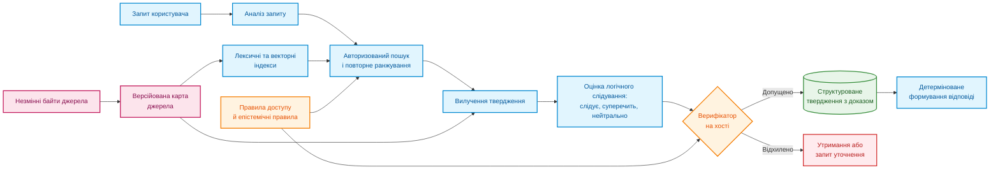
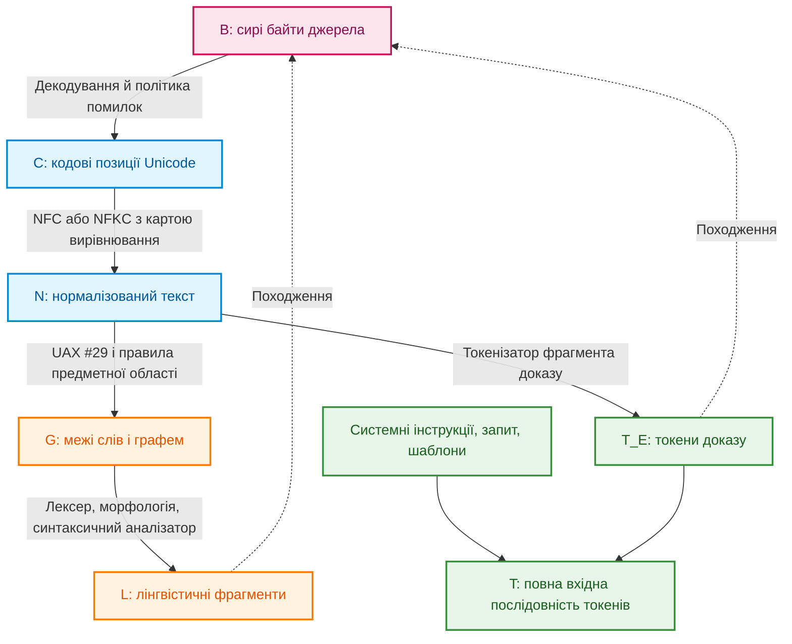
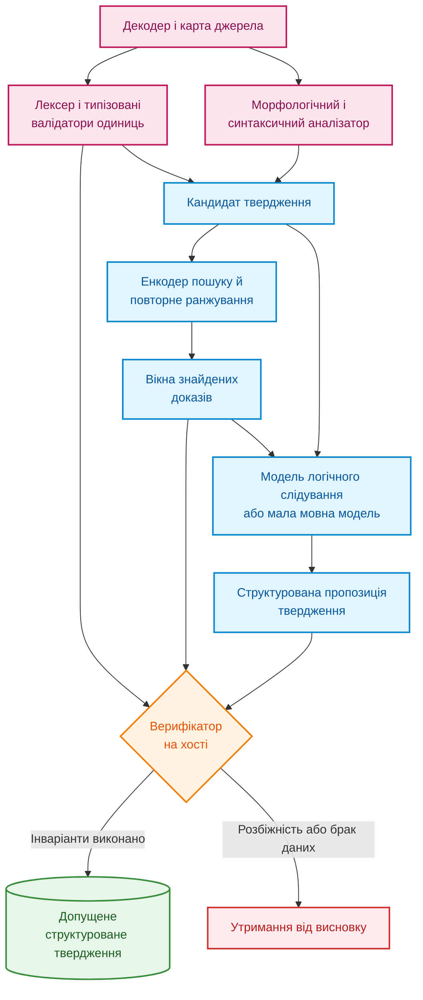
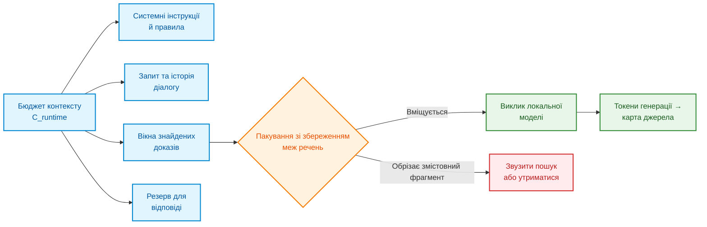

# Глава 12. Лінгвістичний аналіз та локальні моделі: як система розуміє текст без втрати джерела

> **Книга:** [Архітектура доказових експертних систем](README.md) · [Частина III: Інженерія знань: здобуття, NLP та екстракція з нормативів](part-03-knowledge-engineering-nlp.md)  
> **Попередня глава:** [Глава 11. Вилучення знань у експертів: інтерв'ювання, когнітивні карти та формалізація досвіду](ch11-knowledge-elicitation-from-experts.md)  
> **Наступна глава:** [Глава 13. Варіативність природної мови проти детермінізму: компіляція сенсу запитання](ch13-language-variability-vs-determinism.md)  
> **Зміст книги:** [README.md](README.md)  
> **Автор:** [Микола Федчик](about-the-author.md)  
> **Рівень:** середній: розробники та інженери знань  
> **Очікувані результати:** простежувати шлях від фрази користувача до цитати в документі; розрізняти векторну схожість і логічний доказ; захищати текстовий конвеєр від підміни символів і вбудованих інструкцій; перевіряти локальну модель перед оновленням.

Користувач запитує: «Яка мінімальна довжина заголовка?» У документі відповідь записано як `eight octets`. Експертна система може знайти це речення, але все одно помилитися: перетворити «октети» на «байти» без перевірки, загубити одиницю або процитувати іншу версію документа. Отже, розуміння мови починається не з великої моделі, а з уміння не втратити зміст і походження тексту.

Правильна відповідь у цьому прикладі не є голим `8` і не є автоматично «8 байтів». Вона містить значення, оригінальну одиницю, умову, за якої правило чинне, і точний фрагмент дозволеної версії документа. Саме повний ланцюжок, а не гарне перефразування, робить відповідь експертної системи перевірюваною.

Звідси головне запитання глави: **як побудувати мовну підсистему, яка розуміє різні формулювання людини, але стверджує лише те, що можна відтворити з байтів джерела?** Теза глави: мовна підсистема має бути гібридною. Детермінований код відповідає за байти, координати й правила доступу, синтаксичний аналізатор пропонує форму й будову речення, моделі знаходять схожі фрагменти й перевіряють вузькі твердження, мовна модель допомагає перефразувати запитання. До відповіді потрапляє лише те, що окрема перевірка може відтворити з доказу.

> **Межа практичного досвіду.** У локальних прототипах автора траплялися втрата одиниць, руйнування складених токенів і розбіжність між координатами, які повертає модель, і байтами джерела. Без відкритих сирих журналів і замороженого корпусу це інженерне спостереження, а не загальний результат вимірювання. Архітектуру й протокол нижче треба перевірити на власному корпусі знань.

## Від людської репліки до права стверджувати

[Глава 19](ch19-from-question-to-evidence.md) розділяє шлях від запитання до доказу на виявлення, вилучення, прив'язку до першоджерела й перевірку. [Глава 2](ch02-epistemology-of-machine-knowledge.md) встановила епістемічний контракт: семантична схожість не є доведенням, стан «невідомо» не є запереченням, а факт, дедуктивний висновок і прогнозна ймовірність мають різні підстави. Мовна підсистема поєднує ці рівні.



Схема розділяє змінні й незмінні частини. Етапи машинного навчання можна оновлювати. Незмінні байти, карта першоджерела, перевірка повноважень і умови допуску є стабільними інженерними межами. Оновлення токенізатора не має права непомітно змінити значення тексту чи прив'язку цитати.

Авторизацію виконують двічі: перед пошуком і повторно безпосередньо перед допуском твердження. Недоступний фрагмент не можна спочатку передати генеративній моделі як контекст, а потім приховати цитату: зміст фрагмента вже вплинув на генерацію. Твердження успадковує мітки доступу всіх вихідних матеріалів, а відмова в доступі не повинна розкривати навіть факт існування закритого документа.

## Як не загубити зв'язок між текстом і джерелом

Твердження «позиція символу 42» не має сенсу без визначеної системи координат. Позицію можна рахувати в байтах UTF-8, кодових одиницях UTF-16, кодових позиціях Unicode, розширених кластерах графем, словах, токенах синтаксичного аналізатора або токенах мовної моделі.



Кожне перетворення створює нове подання тексту й відношення походження. Нехай $R_{X\leftarrow Y}\subseteq X\times Y$ відображає фрагмент похідного подання $Y$ у відповідні ділянки батьківського подання $X$, а $T_E\subseteq T$ позначає токени моделі, що походять саме з доказу. Тоді зв'язок токена доказу з байтами є композицією відношень:

```math
R_{B\leftarrow T_E}=R_{B\leftarrow C}\circ R_{C\leftarrow N}\circ R_{N\leftarrow T_E}.
```

Це відображення не є взаємно однозначним. Один токен може охоплювати кілька кодових позицій, одна графема складається з базового символу й діакритики, а нормалізована позиція може виникати зі злиття кількох вхідних символів.

Службові токени шаблону, системні інструкції й токени запиту користувача не мають штучного походження з байтів документа: їх відображають на власні сутності або позначають як згенеровані. Цитата експертної системи спирається виключно на множину $T_E$.

### Чому нормалізація може звести різні записи до одного

У формі нормалізації NFC послідовність `U+0065` (латинська «e») і `U+0301` (комбінований гострий наголос) перетворюється на один символ `U+00E9` («é»). Різні байти джерела дають однаковий нормалізований результат. Форма NFKC додатково стирає сумісні відмінності, наприклад перетворює надрядкові індекси на звичайні цифри чи розкладає лігатури, тому стандарт UAX #15 прямо застерігає: форми KC і KD не можна застосовувати до довільного тексту наосліп, бо вони стирають багато відмінностей форматування [[1]](#src-1). Зворотне відображення неможливо відновити згодом, якщо вирівнювання не зафіксували під час перетворення.

Для похідного фрагмента $s$ нехай $M_B(s)$ позначає мінімальну впорядковану множину байтових інтервалів джерела, $Bytes_B(M)$ байти джерела в оригінальному порядку, а $Frame_B(M)$ канонічні записи `(start, end, bytes)`. Тоді виконуються двосторонній інваріант

```math
Normalize_v\bigl(Decode_e(Bytes_B(M_B(s)))\bigr)=Surface_N(s)
```

та інваріант незмінності первинного доказу

```math
SHA256\bigl(Frame_B(M_B(s))\bigr)=evidence\_sha256(s),
```

де параметр $e$ фіксує кодування й політику обробки помилок, а $v$ фіксує версію Unicode й форму нормалізації. Після зміни порядку комбінованих символів карта джерела може бути списком незв'язних інтервалів, а не одним діапазоном. Для PDF-документів і сканів ланцюг довший: «байти PDF → геометрія сторінки або растрове зображення → текст оптичного розпізнавання → нормалізований текст». Координати цитати з оптичного розпізнавання прив'язують до тексту розпізнавання й до обмежувальних рамок на сторінці, а не подають як простий байтовий зсув усередині бінарного файлу PDF.

Стандарт UAX #29 задає базові правила поділу тексту на графеми, слова й речення [[2]](#src-2), але для технічних сутностей на кшталт `10.0.0.0/8` чи `v2.1.4` потрібні правила конкретної предметної області. Для токенізатора мовної моделі контролюють інваріант зворотного перетворення:

```math
Detok_v\bigl(Tok_v(x;\ special=false);\ cleanup=false\bigr)=x.
```

## Як текст може приховати підміну

Текст може виглядати для людини звичайним, але по-різному інтерпретуватися програмами або містити приховані інструкції для мовної моделі. Перед пошуком відповіді експертна система перевіряє не лише зміст документа, а й спосіб його кодування.

Нормалізація не усуває підміни символів. Латинська `a` й кирилична `а` виглядають однаково, невидимі керівні символи змінюють порядок відображення, а символи нульової ширини розривають ідентифікатори. Бучер і Андерсон показали атаку Trojan Source: керівні символи двонапрямленого тексту створюють розбіжність між порядком, який бачить людина, і порядком, який обробляє компілятор [[3]](#src-3). Механізми виявлення схожих символів описує стандарт UTS #39 [[4]](#src-4), а правила двонапрямленого тексту стандарт UAX #9 [[5]](#src-5).

| Загроза | Наслідок | Інженерний контроль |
|---|---|---|
| Невалідне кодування | різні компоненти бачать різний текст | строге декодування або карантин, заборона мовчазної заміни символів у доказах |
| Змішані системи письма | `heаder` з кириличною «а» обходить точний пошук | профіль писемності, скелет символів за UTS #39 як сигнал перевірки |
| Двонапрямлений текст і невидимі керівні символи | рецензент бачить інший порядок слів | перевірка за UAX #9, показ кодових позицій, дозволені списки символів |
| Надмірна нормалізація | втрата важливої смислової різниці | незмінні вихідні байти, окремі правила для технічних полів |
| Отруєння корпусу | підроблений фрагмент перемагає в ранжуванні | перевірка джерел, хеші вмісту, виявлення аномалій |
| Непрямі вбудовані інструкції | текст документа намагається керувати моделлю | ізольований канал даних, заборона інструментів за замовчуванням |
| Підробка цитати | показаний фрагмент не відповідає оригіналу | перевірка зворотного відображення через карту джерела та хеш |

Непрямі вбудовані інструкції (*indirect prompt injection*) є реальною загрозою для застосунків на основі мовних моделей: Грешаке та співавтори продемонстрували, як інструкції, приховані в даних, які застосунок отримує під час роботи, перехоплюють керування моделлю [[6]](#src-6).

```mermaid
flowchart LR
    accTitle: Очищення тексту й захист від атак
    accDescr: Етапи фільтрації вхідних байтів від строгого декодування до передачі довіреного тексту в захищений канал моделі.

    IN["Зовнішні байти"] --> DEC{"Строге<br/>декодування?"}
    DEC -->|"Помилка"| QUAR["Карантин"]
    DEC -->|"Успіх"| US["Перевірка безпеки Unicode<br/>(UTS #39, UAX #9)"]
    US --> RAW["Незмінний об'єкт<br/>першоджерела"]
    US --> FLAGS["Позначки підозрілих<br/>символів і напрямку"]
    RAW --> NORM["Нормалізація з фіксацією<br/>вирівнювання"]
    FLAGS --> POL{"Правило допуску<br/>документа"}
    NORM --> POL
    POL -->|"Дозволено"| IDX["Індексування як<br/>недовірених даних"]
    POL -->|"Заблоковано"| QUAR
    IDX --> LLM["Ізольований канал<br/>цитованого доказу"]
    LLM --> HOST["Верифікатор на хості"]

    classDef ext fill:#ffebee,stroke:#c62828,stroke-width:2px,color:#b71c1c;
    classDef check fill:#fff3e0,stroke:#f57c00,stroke-width:2px,color:#e65100;
    classDef safe fill:#e8f5e9,stroke:#388e3c,stroke-width:2px,color:#1b5e20;
    classDef proc fill:#e1f5fe,stroke:#0288d1,stroke-width:2px,color:#01579b;

    class IN,QUAR ext;
    class DEC,US,FLAGS,POL,HOST check;
    class RAW,IDX,LLM safe;
    class NORM proc;
```



Схема показує, що знайдена в документі фраза «ігноруй усі попередні інструкції» залишається пасивними даними. Навіть найкращий детектор вбудованих інструкцій не є периметром безпеки: захист тримається на тому, що текст документа принципово не має права викликати системні інструменти чи змінювати права доступу.

## Як розподілити відповідальність між складниками

Жоден модуль не повинен одночасно знаходити текст, тлумачити його зміст і самостійно ухвалювати висновок. Чіткий поділ обов'язків робить помилку локалізованою: видно, чи збій стався на рівні байтів, синтаксичного розбору чи логічного висновку.



Синтаксичний аналізатор зручно будувати на схемі Universal Dependencies, яка задає узгоджені між мовами частини мови, морфологічні ознаки й синтаксичні залежності [[7]](#src-7). Векторні подання речень для пошуку дають моделі на кшталт Sentence-BERT [[8]](#src-8). Логічне слідування (*natural language inference*, NLI) оцінюють моделі, навчені на наборах на кшталт XNLI, що охоплює й багатомовну оцінку [[9]](#src-9). Таблиця фіксує, що кожен компонент видає і на що не має права.

| Компонент | Що видає | На що не має права |
|---|---|---|
| Декодер і карта джерела | кодові позиції, зв'язки з байтами, помилки декодування | тлумачити намір користувача чи істинність фактів |
| Детермінований лексер і валідатор | типізовані атоми (числа, одиниці, ідентифікатори) і точні межі | призначати смислову роль твердження |
| Синтаксичний аналізатор | леми, частини мови, дерево залежностей | доводити нормативну силу вимоги чи права доступу |
| Енкодер і повторне ранжування | векторні подання, оцінки близькості | доводити логічне слідування чи істинність |
| Модель логічного слідування | імовірності класів «слідує», «суперечить», «нейтрально» | встановлювати істину поза наданим фрагментом |
| Мала або велика мовна модель | пропозицію наміру, нормалізоване формулювання, якір у тексті | підміняти байти, хеші й правила безпеки |
| Верифікатор на хості | рішення про допуск або код причини відмови | перефразовувати текст мовою користувача |
| Модуль формування відповіді | читабельну відповідь із точними посиланнями на цитати | створювати тверджень поза перевіреним поданням |

## Бюджет контексту, токенізація й пам'ять моделі

Токен мовної моделі не дорівнює слову чи символу. Кількість токенів залежить від мови, токенізатора й службових шаблонів, тому бюджет контексту контролюють явно:

```math
L_{sys}+L_{schema}+L_{dialog}+L_{query}+L_{evidence}+L_{tools}+L_{output}\le C_{runtime},
```

де $C_{runtime}$ є перевіреною межею контексту конкретного профілю розгортання. Якщо релевантний фрагмент не вміщується в контекст повністю, експертна система не має права обрізати винятки посередині речення: вона звужує пошук або відмовляється від відповіді.



### Токенізатор і українська мова

Для українськомовної експертної системи важливу роль відіграє словник токенізатора. Руст та співавтори показали, що спеціалізований токенізатор для мови важить для якості моделі не менше за обсяг даних попереднього навчання; у цій роботі використано показник фертильності токенізатора, тобто середню кількість токенів на слово [[10]](#src-10):

```math
\text{Fertility}=\frac{N_{\text{tokens}}}{N_{\text{words}}}.
```

Петров, Ла Мальфа й Торр виявили, що той самий текст, перекладений різними мовами, може мати довжину в токенах, яка відрізняється до 15 разів, і що така нерівність зменшує обсяг вмісту, який вміщується в контекст моделі, та збільшує вартість і затримку обробки [[11]](#src-11). Розмір словника впливає на цю нерівність: ранні моделі LLaMA [[12]](#src-12) і Mistral 7B [[13]](#src-13) мали словник на 32 тисячі токенів, а Gemma має словник на 256 тисяч токенів [[14]](#src-14). Український приклад адаптації дає проєкт Lapa LLM на основі Gemma 3 12B: за описом авторів, у токенізаторі замінили понад 80 тисяч токенів малопоширених для українських текстів систем письма на українські, зберігши розмір словника, і модель потребує для українських текстів приблизно в 1,5 раза менше токенів, ніж початкова Gemma 3 [[15]](#src-15).

Для експертної системи з цього випливають три практичні наслідки. Перший: кількість документів, яку можна подати в $C_{runtime}$, залежить від фертильності токенізатора на власному корпусі, тому фертильність вимірюють на реальних документах, а не беруть з опису моделі. Другий: довші послідовності збільшують пам'ять кешу ключів і значень і обчислення уваги. Третій: дрібні фрагменти слів ускладнюють точну зворотну прив'язку згенерованого токена до байтів джерела, тож карта вирівнювання $R_{N\leftarrow T_E}$ потребує тестів саме на кириличному тексті.

### Межа мовної моделі: зсув розподілу даних

Часто кажуть, що нейронні мережі добре інтерполюють усередині опуклої оболонки навчальних даних і погано екстраполюють за її межами. Балестрієро, Песенті й ЛеКун показали, що для даних розмірності понад 100 нові приклади майже ніколи не потрапляють усередину опуклої оболонки навчальної вибірки, тож такий поділ на інтерполяцію й екстраполяцію не пояснює узагальнення [[16]](#src-16). Практично важливіше інше: якість моделі падає, коли дані під час використання відрізняються від навчальних. Набір WILDS зібрав такі зсуви розподілу з реальних застосувань і показав помітне падіння якості моделей поза навчальним розподілом [[17]](#src-17).

Внутрішній регламент підприємства, нова інженерна специфікація чи конфіденційний стандарт, яких не було в навчальному корпусі, є саме таким зсувом. Спроба змусити мовну модель «здогадатися» про правила в такому документі дає правдоподібні, але хибні відповіді. Тому в доказовій експертній системі мовна модель **ніколи не є первинним джерелом знань**. Її роль обмежена мовним інтерфейсом:

- розбір синтаксичних зв'язків і вилучення сутностей;
- генерація структурованих запитів до бази знань у вигляді проміжного подання;
- оцінка локального логічного слідування між ізольованим фрагментом і твердженням.

Логічні висновки, квантифікацію правил і перевірку інваріантів виконує детермінована машина виведення.

### Пам'ять кешу ключів і значень

Пам'ять кешу ключів і значень зростає лінійно з довжиною вхідної послідовності. Для повної уваги на одну активну сесію з $n_l$ шарами, $n_{kv}$ головами ключів і значень, розмірністю голови $d_h$, довжиною $L$ і $b$ байтами на елемент

```math
M_{KV}\approx 2\,n_l\,L\,n_{kv}\,d_h\,b.
```

Множник 2 враховує окремо ключі й значення. Квон та співавтори показали, що саме кеш ключів і значень визначає ефективність обслуговування великих мовних моделей, і запропонували сторінкове керування цією пам'яттю в системі vLLM [[18]](#src-18).

## Чому схожість тексту ще не є доказом

Для двох векторних подань $\mathbf q,\mathbf d\in\mathbb R^m$ косинусна схожість дорівнює

```math
s_{dense}(q,d)=\frac{\mathbf q^\top\mathbf d}{\lVert\mathbf q\rVert_2\lVert\mathbf d\rVert_2}.
```

Косинусна схожість визначена лише для ненульових векторів однакової розмірності; значення `NaN` або розбіжність розмірностей блокують кандидата ще до ранжування.

Цей показник є лише оцінкою для сортування, а не ймовірністю логічної підтримки. Лексичний пошук знаходить точні символьні збіги, а векторні подання знаходять перефразування. Метод злиття обернених рангів (*reciprocal rank fusion*, RRF) об'єднує списки різних пошукових методів без змішування неоднорідних шкал оцінок [[19]](#src-19):

```math
s_{RRF}(d)=\sum_{r\in\mathcal R(d)}\frac{1}{k_0+rank_r(d)},
```

де $\mathcal R(d)$ є множиною списків, у яких трапився документ $d$, а $k_0$ є сталою згладжування. У генерації з пошуковим доповненням (*retrieval-augmented generation*, RAG) знайдені фрагменти передають моделі як контекст [[20]](#src-20), тому помилка ранжування безпосередньо стає помилкою відповіді.

Модель логічного слідування оцінює твердження $c$ відносно фрагмента $e$:

```math
p_\theta(y\mid c,e)=\mathrm{softmax}\bigl(z_\theta(c,e)\bigr),\qquad y\in\{entailment,\ contradiction,\ neutral\}.
```

Нейтральний клас означає лише брак інформації в конкретному фрагменті. Системний стан «невідомо» ширший: він охоплює неповноту доказів, неможливість зв'язати змінні або невизначену область застосування. Тому остаточне рішення формує верифікатор на хості:

```math
Admit(c,e,q,u,t)=I_{authz}(c,e,u,t)\land I_{integrity}\land I_{material\ spans}\land I_{applicable}(c,q,t)\land[y_{ver}=entailment]\land[p_{cal}(entailment)\ge\tau]\land\neg I_{conflict}\land I_{epistemic\ type}.
```

Складники предиката перевіряють авторизацію користувача $u$ на момент $t$, цілісність доказу, наявність суттєвих фрагментів, застосовність до запиту $q$, клас слідування, калібровану ймовірність із порогом $\tau$, відсутність конфлікту й відповідність епістемічного типу. Такий предикат не дає видати чернетку за чинну норму, а гіпотезу за доведений факт.

## Профілі розгортання локальних моделей

Локальне виконання потрібне, коли конфіденційні дані не повинні залишати захищеного контуру підприємства. Проте позначка «локальна модель» фіксує лише місце виконання, а не гарантує точності чи відсутності мережевих звернень.

| Профіль | Переваги | Обмеження |
|---|---|---|
| llama.cpp і формат GGUF [[21]](#src-21) | переносимість між процесорами й графічними прискорювачами, робота без мережі | потрібно фіксувати версію збірки й хеш квантованого файлу моделі |
| Ollama [[22]](#src-22) | зручний локальний REST API, структурований вивід за JSON Schema | обгортка не додає перевірки фактів; потрібен контроль версій моделі |
| vLLM [[18]](#src-18) | висока пропускна здатність паралельних запитів, сторінкове керування кешем | складніше розгортання, залежність від версій CUDA |
| MLX LM [[23]](#src-23) | виконання й донавчання на Apple Silicon | артефакти MLX не переносяться на CUDA чи ROCm |
| TensorRT-LLM [[24]](#src-24) | висока продуктивність на серверах NVIDIA | тісна прив'язка до драйверів і конкретних графічних процесорів |
| ONNX Runtime [[25]](#src-25) | швидкі спеціалізовані енкодери й моделі логічного слідування на різних прискорювачах | різні провайдери обчислень можуть давати числові розбіжності |

Таблиця показує, що вибір профілю є компромісом між переносимістю, продуктивністю й відтворюваністю. Для доказової експертної системи найважливіший останній стовпчик: кожне обмеження стає пунктом маніфесту розгортання.

## Контроль регресій під час квантування й оновлення моделей

Спрощене афінне квантування ваг моделі, яке описали Джейкоб та співавтори для цілочисельного виведення [[26]](#src-26), має вигляд

```math
q(w)=\mathrm{clip}\left(\mathrm{round}\left(\frac{w}{s}\right)+z,\ q_{min},\ q_{max}\right),\qquad \hat w=s\,\bigl(q(w)-z\bigr),
```

де $s$ є масштабом, $z$ нульовою точкою, а $\hat w$ відновленою вагою. Квантована модель є новим кандидатом, який потребує окремої повної перевірки. Зміну якості на зрізі $s$ за метрикою $m$ вимірюють як

```math
\Delta_{m,s}=m(model_q,s)-m(model_{base},s).
```

Оцінювання обов'язково розбивають на зрізи: українська мова, точність вилучення числових параметрів, стійкість структурованого виводу, правильність утримання від відповіді. Усереднений результат може приховати критичне погіршення на рідкісних технічних термінах.

Маніфест розгортання фіксує знімок корпусу документів, правила нормалізації Unicode, версії синтаксичних аналізаторів, хеші ваг моделей, параметри квантування, версії середовища виконання й пороги калібрування.

```mermaid
flowchart LR
    accTitle: Безпечне розгортання й відкат моделі
    accDescr: Від підписаного маніфесту через парне тестування до поступового розгортання з можливістю відкату.

    MF["Підписаний маніфест"] --> ST["Завантаження<br/>в тестове середовище"]
    ST --> SELF["Перевірка хешів,<br/>схем і середовища"]
    SELF --> PAIR["Парне оцінювання:<br/>базова версія проти кандидата"]
    PAIR --> G{"Пороги якості,<br/>безпеки й рівня обслуговування"}
    G -->|"Успіх"| SH["Тіньовий трафік →<br/>обмежений випуск"]
    G -->|"Помилка"| STOP["Відхилення кандидата"]
    SH --> PR["Атомарне підвищення<br/>версії"]
    SH -->|"Аномалія"| RB["Повний відкат<br/>разом із залежностями"]
    PR --> MON["Моніторинг якості,<br/>пам'яті й затримок"]
    MON -->|"Порушення рівня обслуговування"| RB

    classDef doc fill:#fce4ec,stroke:#c2185b,stroke-width:2px,color:#880e4f;
    classDef proc fill:#e1f5fe,stroke:#0288d1,stroke-width:2px,color:#01579b;
    classDef check fill:#fff3e0,stroke:#f57c00,stroke-width:2px,color:#e65100;
    classDef ok fill:#e8f5e9,stroke:#388e3c,stroke-width:2px,color:#1b5e20;
    classDef fail fill:#ffebee,stroke:#d32f2f,stroke-width:2px,color:#b71c1c;

    class MF doc;
    class ST,SELF,PAIR,SH,MON proc;
    class G check;
    class PR ok;
    class STOP,RB fail;
```



Схема показує, що новий кандидат моделі проходить той самий шлях, що й новий випуск бази знань: перевірка, порівняння з базовою версією, обмежений випуск і готовий відкат.

## Як перевіряти мовну підсистему

Частку запитів, для яких серед перших $k$ результатів пошуку є правильний документ, рахують лише для запитів $Q_+$, на які відповідь існує:

```math
Hit@k=\frac{1}{|Q_+|}\sum_{q\in Q_+}\mathbb{1}\bigl[G_q\cap R_k(q)\ne\varnothing\bigr],
```

де $G_q$ є множиною правильних документів, а $R_k(q)$ першими $k$ результатами. Якщо повне твердження потребує кількох джерел, рахують повноту:

```math
Recall@k=\frac{1}{|Q_+|}\sum_{q\in Q_+}\frac{|G_q\cap R_k(q)|}{|G_q|}.
```

Стійкість до синонімії й варіативності формулювань вимірюють на групах перефразувань $G$, де група зараховується лише тоді, коли успішні всі її варіанти $V_g$:

```math
GroupPass=\frac{1}{|G|}\sum_{g\in G}\prod_{i\in V_g}Success_i.
```

Успіх $Success_i=1$ фіксують лише тоді, коли експертна система правильно визначила контракт запиту, знайшла правильні байти доказу, зберегла типізовані числові значення, пройшла перевірку прав доступу й правильно сформувала відповідь. Для оцінки фактичної точності тексту корисна метрика FActScore, яка розкладає відповідь на атомарні факти й перевіряє кожен факт за джерелом [[27]](#src-27), а для оцінки цитат корисний набір ALCE, який окремо вимірює правильність відповіді й підтримку цитатами [[28]](#src-28). Довірчі інтервали для порівняння версій отримують бутстрепом Ефрона, причому повторну вибірку роблять цілими групами перефразувань, щоб не завищити кількість незалежних спостережень [[29]](#src-29).

```mermaid
flowchart LR
    accTitle: Порівняльне оцінювання кандидатів мовної підсистеми
    accDescr: Експеримент від зафіксованого поділу даних до парного бутстрепу й діагностики помилок.

    MF["Заморожені маніфести"] --> SPL["Поділ на групи й<br/>перевірка витоку даних"]
    SPL --> B["Базова версія"]
    SPL --> C["Новий кандидат"]
    B --> TR["Синхронізовані журнали<br/>виконання"]
    C --> TR
    TR --> MET["Метрики: джерело, подання,<br/>слідування, наскрізний успіх, ресурси"]
    MET --> SL["Аналіз зрізів за мовами,<br/>термінами й загрозами"]
    SL --> CI["Груповий бутстреп і<br/>парний статистичний тест"]
    CI --> G{"Погоджені пороги<br/>допуску"}
    G -->|"Успіх"| DEP["Тіньовий трафік,<br/>обмежений випуск"]
    G -->|"Відхилено"| DIAG["Діагностика першої<br/>точки відмови"]

    classDef src fill:#fce4ec,stroke:#c2185b,stroke-width:2px,color:#880e4f;
    classDef test fill:#e1f5fe,stroke:#0288d1,stroke-width:2px,color:#01579b;
    classDef gate fill:#fff3e0,stroke:#f57c00,stroke-width:2px,color:#e65100;
    classDef pass fill:#e8f5e9,stroke:#388e3c,stroke-width:2px,color:#1b5e20;
    classDef err fill:#ffebee,stroke:#d32f2f,stroke-width:2px,color:#b71c1c;

    class MF,SPL src;
    class B,C,TR,MET,SL,CI test;
    class G gate;
    class DEP pass;
    class DIAG err;
```



## Висновок

Глава почалася із запитання, як побудувати мовну підсистему, що розуміє різні формулювання людини, але стверджує лише відтворюване з байтів джерела. Відповідь така: мовна підсистема розширює коло формулювань, які експертна система сприймає від людини, і водночас звужує множину тверджень експертної системи до тих, що спираються на конкретні незмінні байти першоджерела. Для цього кожне перетворення тексту зберігає карту походження, кожен компонент має обмежені повноваження, схожість лише впорядковує кандидатів, а рішення про допуск ухвалює детермінований верифікатор за маніфестами, хешами, картами походження й правилами доступу.

Межі підходу теж визначені. Токенізація залежить від мови й моделі, тож бюджет контексту й карти вирівнювання перевіряють на власному корпусі. Мовна модель ненадійна на документах, яких не було в навчальних даних, тому вона не є джерелом знань. Кожне оновлення моделі чи квантування є новим кандидатом, який проходить повну перевірку. Як долати варіативність мови під час перетворення запитання на однозначні предикати виведення, розглядає [Глава 13](ch13-language-variability-vs-determinism.md).

### Запитання для самоперевірки

1. Чому координати цитати повинні спиратися на незмінні байти джерела, а не на токени мовної моделі?
2. Чим небезпечне некероване застосування нормалізації NFKC до інженерної документації?
3. Чому висока косинусна схожість не може бути підставою для твердження факту?
4. Які складники входять до повного маніфесту розгортання локальної моделі?
5. Чим нейтральний клас моделі логічного слідування відрізняється від системного стану «невідомо»?

## Словник

| Український термін | Англійський відповідник | Коротке пояснення |
|---|---|---|
| Карта джерела | *source map* | Відображення фрагментів похідного тексту на байти першоджерела |
| Кодова позиція | *code point* | Числовий код символу в Unicode |
| Кластер графем | *grapheme cluster* | Послідовність кодових позицій, яку людина сприймає як один символ |
| Нормалізація Unicode | *Unicode normalization* | Приведення різних кодувань того самого тексту до канонічної форми |
| Вирівнювання | *alignment* | Збережене відношення між позиціями до й після перетворення тексту |
| Токенізатор | *tokenizer* | Програма, що ділить текст на токени словника моделі |
| Фертильність токенізатора | *tokenizer fertility* | Середня кількість токенів на одне слово |
| Логічне слідування | *natural language inference* | Оцінка, чи випливає твердження з фрагмента тексту, суперечить йому чи не пов'язане |
| Злиття обернених рангів | *reciprocal rank fusion* | Об'єднання кількох ранжованих списків за оберненими рангами |
| Непрямі вбудовані інструкції | *indirect prompt injection* | Інструкції для моделі, приховані в даних, які застосунок обробляє |
| Зсув розподілу | *distribution shift* | Відмінність даних під час використання від навчальних даних |
| Кеш ключів і значень | *KV cache* | Збережені проміжні подання уваги, що ростуть із довжиною контексту |
| Квантування | *quantization* | Подання ваг моделі числами меншої розрядності |
| Верифікатор на хості | *host verifier* | Детермінований компонент, що ухвалює рішення про допуск твердження |

## Абревіатури

| Скорочення | Розшифрування | Значення |
|---|---|---|
| CUDA | Compute Unified Device Architecture | платформа обчислень на графічних процесорах NVIDIA |
| GGUF | назва формату файлів ggml | формат зберігання квантованих моделей для llama.cpp |
| NFC, NFKC | Normalization Form C, Normalization Form KC | канонічна й сумісна форми нормалізації Unicode зі складанням |
| NLI | Natural Language Inference | логічне слідування природною мовою |
| PDF | Portable Document Format | формат документів |
| RAG | Retrieval-Augmented Generation | генерація з пошуковим доповненням |
| REST API | Representational State Transfer Application Programming Interface | програмний інтерфейс поверх HTTP |
| ROCm | Radeon Open Compute | платформа обчислень на графічних процесорах AMD |
| RRF | Reciprocal Rank Fusion | злиття обернених рангів |
| UAX | Unicode Standard Annex | додаток до стандарту Unicode |
| UTS | Unicode Technical Standard | технічний стандарт Unicode |
| UTF-8, UTF-16 | Unicode Transformation Format | способи кодування кодових позицій байтами |

## Джерела

1. <a id="src-1"></a>Unicode Consortium. [*UAX #15: Unicode Normalization Forms*](https://www.unicode.org/reports/tr15/). Unicode Standard Annex.
2. <a id="src-2"></a>Unicode Consortium. [*UAX #29: Unicode Text Segmentation*](https://www.unicode.org/reports/tr29/). Unicode Standard Annex.
3. <a id="src-3"></a>Nicholas Boucher, Ross Anderson. [*Trojan Source: Invisible Vulnerabilities*](https://www.usenix.org/conference/usenixsecurity23/presentation/boucher). *32nd USENIX Security Symposium*, 2023.
4. <a id="src-4"></a>Unicode Consortium. [*UTS #39: Unicode Security Mechanisms*](https://www.unicode.org/reports/tr39/). Unicode Technical Standard.
5. <a id="src-5"></a>Unicode Consortium. [*UAX #9: Unicode Bidirectional Algorithm*](https://www.unicode.org/reports/tr9/). Unicode Standard Annex.
6. <a id="src-6"></a>Kai Greshake, Sahar Abdelnabi, Shailesh Mishra, Christoph Endres та ін. [*Not What You've Signed Up For: Compromising Real-World LLM-Integrated Applications with Indirect Prompt Injection*](https://doi.org/10.1145/3605764.3623985). *Proceedings of the 16th ACM Workshop on Artificial Intelligence and Security*, 79–90, 2023.
7. <a id="src-7"></a>Marie-Catherine de Marneffe, Christopher D. Manning, Joakim Nivre, Daniel Zeman. [*Universal Dependencies*](https://doi.org/10.1162/coli_a_00402). *Computational Linguistics*, 47(2), 255–308, 2021.
8. <a id="src-8"></a>Nils Reimers, Iryna Gurevych. [*Sentence-BERT: Sentence Embeddings using Siamese BERT-Networks*](https://aclanthology.org/D19-1410/). *Proceedings of EMNLP-IJCNLP 2019*.
9. <a id="src-9"></a>Alexis Conneau, Ruty Rinott, Guillaume Lample, Adina Williams та ін. [*XNLI: Evaluating Cross-lingual Sentence Representations*](https://aclanthology.org/D18-1269/). *Proceedings of EMNLP 2018*.
10. <a id="src-10"></a>Phillip Rust, Jonas Pfeiffer, Ivan Vulić, Sebastian Ruder, Iryna Gurevych. [*How Good is Your Tokenizer? On the Monolingual Performance of Multilingual Language Models*](https://arxiv.org/abs/2012.15613). arXiv:2012.15613; *Proceedings of ACL-IJCNLP 2021*.
11. <a id="src-11"></a>Aleksandar Petrov, Emanuele La Malfa, Philip H. S. Torr, Adel Bibi. [*Language Model Tokenizers Introduce Unfairness Between Languages*](https://arxiv.org/abs/2305.15425). arXiv:2305.15425, 2023.
12. <a id="src-12"></a>Hugo Touvron, Thibaut Lavril, Gautier Izacard та ін. [*LLaMA: Open and Efficient Foundation Language Models*](https://arxiv.org/abs/2302.13971). arXiv:2302.13971, 2023.
13. <a id="src-13"></a>Albert Q. Jiang, Alexandre Sablayrolles, Arthur Mensch та ін. [*Mistral 7B*](https://arxiv.org/abs/2310.06825). arXiv:2310.06825, 2023.
14. <a id="src-14"></a>Gemma Team. [*Gemma: Open Models Based on Gemini Research and Technology*](https://arxiv.org/abs/2403.08295). arXiv:2403.08295, 2024.
15. <a id="src-15"></a>Lapa LLM. [*Lapa LLM v0.1.2 Instruct: model card*](https://huggingface.co/lapa-llm/lapa-v0.1.2-instruct); опис токенізатора: [*lapa-llm/tokenizer*](https://huggingface.co/lapa-llm/tokenizer). Hugging Face.
16. <a id="src-16"></a>Randall Balestriero, Jerome Pesenti, Yann LeCun. [*Learning in High Dimension Always Amounts to Extrapolation*](https://arxiv.org/abs/2110.09485). arXiv:2110.09485, 2021.
17. <a id="src-17"></a>Pang Wei Koh, Shiori Sagawa, Henrik Marklund та ін. [*WILDS: A Benchmark of in-the-Wild Distribution Shifts*](https://arxiv.org/abs/2012.07421). arXiv:2012.07421; *Proceedings of ICML 2021*.
18. <a id="src-18"></a>Woosuk Kwon, Zhuohan Li, Siyuan Zhuang, Ying Sheng та ін. [*Efficient Memory Management for Large Language Model Serving with PagedAttention*](https://doi.org/10.1145/3600006.3613165). *Proceedings of the 29th Symposium on Operating Systems Principles*, 611–626, 2023.
19. <a id="src-19"></a>Gordon V. Cormack, Charles L. A. Clarke, Stefan Buettcher. [*Reciprocal Rank Fusion Outperforms Condorcet and Individual Rank Learning Methods*](https://doi.org/10.1145/1571941.1572114). *Proceedings of SIGIR 2009*, 758–759, 2009.
20. <a id="src-20"></a>Patrick Lewis та ін. [*Retrieval-Augmented Generation for Knowledge-Intensive NLP Tasks*](https://arxiv.org/abs/2005.11401). *Advances in Neural Information Processing Systems 33* (NeurIPS 2020).
21. <a id="src-21"></a>ggml-org. [*llama.cpp: LLM Inference in C/C++*](https://github.com/ggml-org/llama.cpp). Репозиторій GitHub.
22. <a id="src-22"></a>Ollama. [*Structured Outputs*](https://ollama.com/blog/structured-outputs). Блог Ollama.
23. <a id="src-23"></a>ml-explore. [*MLX LM: Run LLMs with MLX*](https://github.com/ml-explore/mlx-lm). Репозиторій GitHub.
24. <a id="src-24"></a>NVIDIA. [*TensorRT-LLM*](https://github.com/NVIDIA/TensorRT-LLM). Репозиторій GitHub.
25. <a id="src-25"></a>Microsoft. [*ONNX Runtime*](https://onnxruntime.ai/). Офіційний сайт.
26. <a id="src-26"></a>Benoit Jacob, Skirmantas Kligys, Bo Chen, Menglong Zhu та ін. [*Quantization and Training of Neural Networks for Efficient Integer-Arithmetic-Only Inference*](https://doi.org/10.1109/CVPR.2018.00286). *2018 IEEE/CVF Conference on Computer Vision and Pattern Recognition*, 2704–2713, 2018.
27. <a id="src-27"></a>Sewon Min, Kalpesh Krishna, Xinxi Lyu, Mike Lewis та ін. [*FActScore: Fine-grained Atomic Evaluation of Factual Precision in Long Form Text Generation*](https://aclanthology.org/2023.emnlp-main.741/). *Proceedings of EMNLP 2023*.
28. <a id="src-28"></a>Tianyu Gao, Howard Yen, Jiatong Yu, Danqi Chen. [*Enabling Large Language Models to Generate Text with Citations*](https://aclanthology.org/2023.emnlp-main.398/). *Proceedings of EMNLP 2023*.
29. <a id="src-29"></a>B. Efron. [*Bootstrap Methods: Another Look at the Jackknife*](https://doi.org/10.1214/aos/1176344552). *The Annals of Statistics*, 7(1), 1–26, 1979.

---

[← Глава 11. Вилучення знань у експертів](ch11-knowledge-elicitation-from-experts.md) | [Зміст книги](README.md) | [Частина III](part-03-knowledge-engineering-nlp.md) | [Глава 13. Варіативність природної мови проти детермінізму →](ch13-language-variability-vs-determinism.md)
