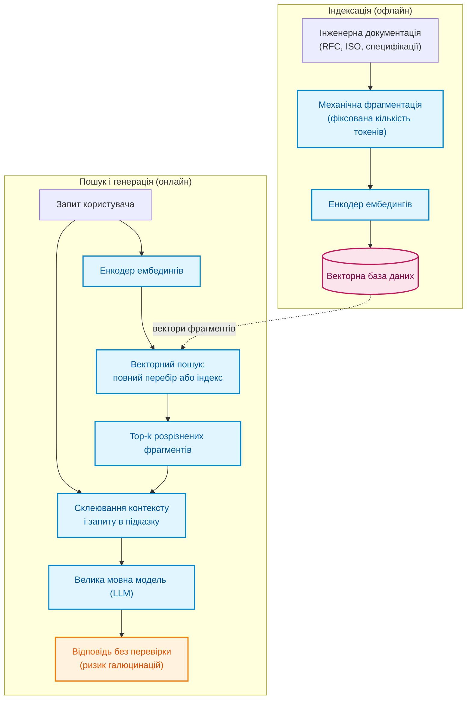
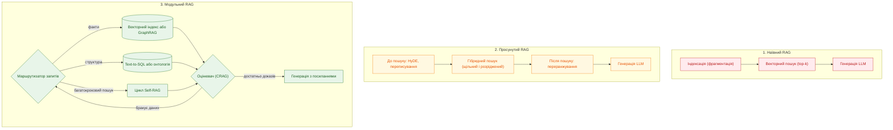
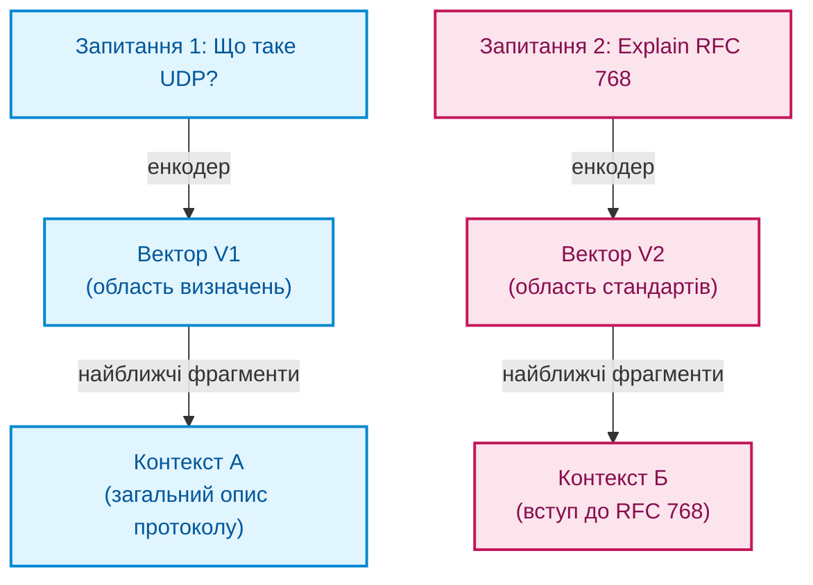
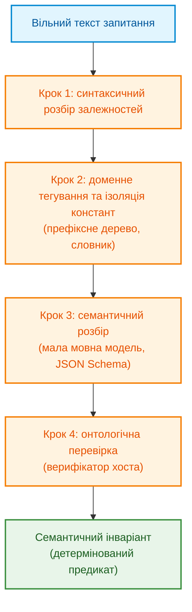
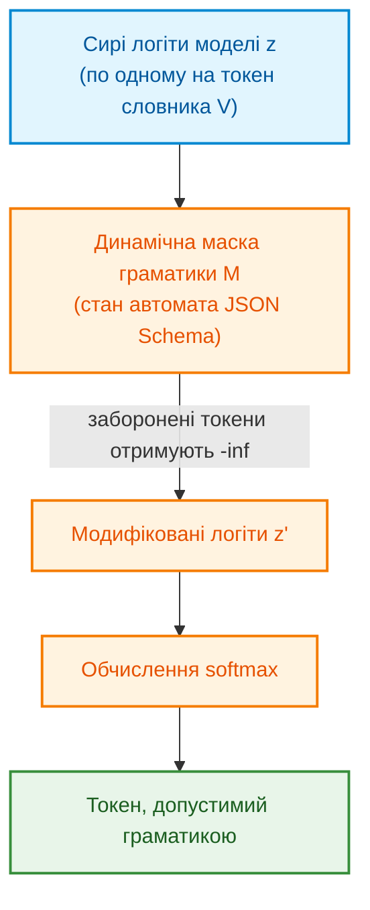
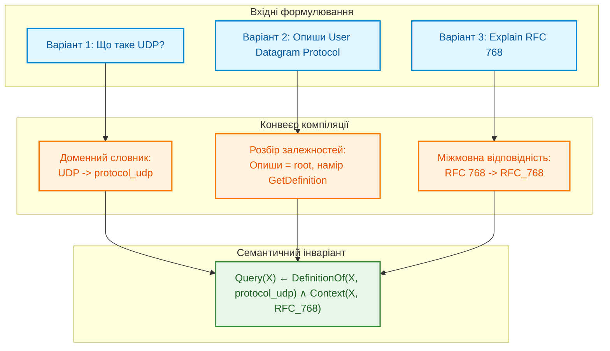
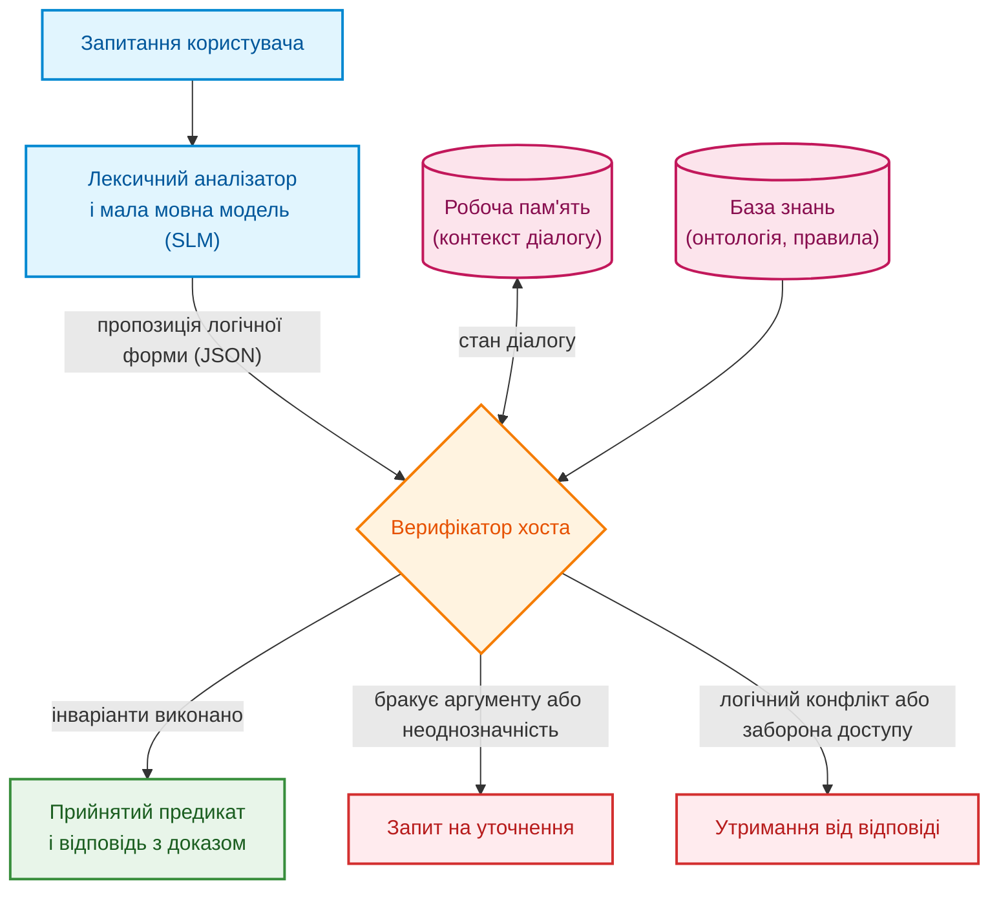

# Глава 13. Варіативність природної мови проти детермінізму: компіляція сенсу запитання

> **Книга:** [Архітектура доказових експертних систем](README.md) · [Частина III: Інженерія знань: здобуття, NLP та екстракція з нормативів](part-03-knowledge-engineering-nlp.md)  
> **Попередня глава:** [Глава 12. Лінгвістичний аналіз та локальні моделі: як система розуміє текст без втрати джерела](ch12-linguistic-analysis-and-local-models.md)  
> **Наступна глава:** [Глава 14. Детекція вимог та модальностей: від SHALL/MUST до формальних інваріантів](ch14-requirements-detection-and-formalization.md)  
> **Зміст книги:** [README.md](README.md)  
> **Автор:** [Микола Федчик](about-the-author.md)  
> **Рівень:** середній: розробники та інженери знань  
> **Очікувані результати:** розрізняти поверхневу форму запитання і його логічний зміст; пояснювати межі наївного, просунутого і модульного RAG; проєктувати конвеєр, який компілює запитання в перевірюваний предикат; ізолювати гіпотези користувача від бази фактів; вимірювати стійкість мовного інтерфейсу групами еквівалентних запитань.

Інженер запитує експертну систему: «Що таке UDP?». Колега формулює те саме інакше: «Опиши User Datagram Protocol». Третій пише англійською: «Explain the core concept of RFC 768». Для людини це одне запитання про один об'єкт знань: протокол датаграм користувача (*User Datagram Protocol*, UDP), визначений у документі RFC 768 із серії стандартів інтернету «Запит коментарів» (*Request for Comments*, RFC). Для конвеєра, який шукає схожий текст, це три різні вектори, три різні набори знайдених фрагментів і, можливо, три різні відповіді.

Доповнення генерації результатами пошуку (*Retrieval-Augmented Generation*, RAG) поєднує мовну модель із пошуковою пам'яттю [[1]](#src-1). Найпростіший варіант добирає векторно близькі фрагменти й передає їх великій мовній моделі (*Large Language Model*, LLM). Для експертної системи (ЕС) потрібний сильніший контракт: за однакового наміру, знімка знань, контексту й повноважень вердикти мають бути узгоджені. Різні придатні підстави не є автоматично помилкою; однаковий вибір підстав потребує окремої політики. Саму еквівалентність двох формулювань теж треба перевірити.

Звідси головне запитання глави: **як зробити так, щоб різні формулювання одного запитання приводили до однієї перевірюваної відповіді експертної системи?** Теза глави: запитання треба не шукати, а компілювати. Мовна підсистема ЕС зводить формулювання до канонічної логічної форми, яку ця глава називає семантичним інваріантом. Мала мовна модель лише пропонує цю форму, детермінований верифікатор хоста приймає або відхиляє пропозицію, а стійкість інтерфейсу перевіряють не окремими фразами, а групами еквівалентних запитань.

Глава продовжує главу 12. Там мовна підсистема вчилася не втрачати джерело тексту, тут вона вчиться відрізняти зміну формулювання від зміни наміру. Спочатку глава простежує розвиток RAG і межі пошукової схожості. Потім вона описує конвеєр семантичної компіляції, обмежене декодування та перевірку стійкості групами еквівалентних і контрастних запитань. Назва архітектури не встановлює інваріантності без цих перевірок.

Схема нижче показує цільовий шлях: від довільного формулювання через лексико-семантичний аналіз до логічного предиката над базою знань.

```mermaid
flowchart LR
    accTitle: Компіляція синтаксичних варіацій запиту в детерміновану відповідь
    accDescr: Схема перетворення довільного формулювання запиту через лексико-семантичний аналіз у предикат над базою знань.

    U["Синтаксичні варіації запитання<br/>(репліки користувача)"] --> QA["Лексико-семантичний аналіз<br/>та ізоляція констант"]
    QA --> SI["Семантичний інваріант<br/>(логічний предикат)"]
    SI --> KB[("База знань<br/>(граф, аксіоми, правила)")]
    KB --> DET["Детермінована перевірена<br/>відповідь з доказом"]

    classDef in fill:#e1f5fe,stroke:#0288d1,stroke-width:2px,color:#01579b;
    classDef proc fill:#fff3e0,stroke:#f57c00,stroke-width:2px,color:#e65100;
    classDef store fill:#e8f5e9,stroke:#388e3c,stroke-width:2px,color:#1b5e20;
    classDef out fill:#f3e5f5,stroke:#7b1fa2,stroke-width:2px,color:#4a148c;

    class U in;
    class QA,SI proc;
    class KB store;
    class DET out;
```



Головне на схемі: між текстом запитання і базою знань стоїть не пошук схожого тексту, а явний логічний предикат. Саме предикат, а не формулювання, визначає, яку відповідь поверне ЕС.

## Як еволюціонував RAG: три парадигми та їхні межі

Щоб зрозуміти, чого бракує пошуковим конвеєрам, варто простежити, як їх удосконалювали. Гао та співавтори в огляді 2023 року виділили три парадигми RAG: наївну, просунуту і модульну [[2]](#src-2). Кожна наступна парадигма виправляла конкретні вади попередньої, але всі три залишаються конвеєрами пошуку тексту.

Векторний пошук є одним із компонентів RAG, не обов'язковою основою кожної реалізації. Він знаходить найближчі вектори за мірою схожості. Повний перебір (*exhaustive linear scan*) має складність $\mathcal{O}(N\cdot d)$ для $N$ векторів розмірності $d$. Для великих сховищ застосовують наближені індекси HNSW (*Hierarchical Navigable Small World*) [[3]](#src-3) або інвертований файл IVF (*inverted file*) із квантуванням добутку [[4]](#src-4). Наближення може пропустити сусідів. Геометрична близькість не виконує логічного правила, хоча навчене подання може відображати частину семантичних відмінностей. Повнотекстові, реляційні й графові запити також можуть бути пошуковими компонентами.

### Наївний RAG: «знайти і прочитати»

Наївний RAG (*Naive RAG*) реалізує схему «знайти і прочитати» (*Retrieve-Read*) [[2]](#src-2) у три кроки:

1. **Фрагментація та індексація.** Документи перетворюють на текст і ріжуть на фрагменти фіксованої довжини, наприклад по кількасот токенів із невеликим перекриттям. Розріз виконують механічно, за кількістю символів або токенів, без урахування меж розділів, таблиць чи лістингів коду. Кожен фрагмент кодують енкодером ембедингів і зберігають у векторній базі даних.
2. **Пошук.** Запит кодують тим самим енкодером і знаходять $k$ фрагментів із найвищою схожістю (*top-k*).
3. **Генерація.** Знайдені фрагменти склеюють у контекст і разом із запитом передають LLM. Очікується, що модель сама відкине шум, пов'яже розрізнені факти і сформулює відповідь.

Схема нижче розділяє офлайн-індексацію документів і онлайн-обробку запиту.



На схемі видно, що між пошуком і відповіддю немає жодної перевірки. Відповідь є текстом моделі, а не висновком, прив'язаним до байтів джерела. Для інженерних документів звідси випливають п'ять ризиків:

* **Розрив знання між фрагментами.** Якщо умова застосування норми і її числове обмеження потрапили в різні фрагменти, пошук може повернути умову без обмеження.
* **Неповнота і шум.** Релевантний фрагмент може не потрапити в top-k, а замість нього потрапить зовні схожий, але неактуальний фрагмент.
* **Втрата середини контексту.** Лю та співавтори показали, що мовні моделі найкраще використовують інформацію, розташовану на початку або в кінці довгого контексту, а якість помітно падає, коли потрібний фрагмент стоїть посередині [[5]](#src-5).
* **Ілюзія релевантності.** Висока схожість свідчить про спільну лексику, а не про нормативну силу твердження: вимога зі словом SHALL і коментар до неї можуть бути однаково схожими на запит.
* **Відсутність доказового зв'язку.** Згенерована відповідь не прив'язана до незмінних байтів джерела, тому під час аудиту її не можна відтворити.

### Просунутий RAG: оптимізація до і після пошуку

Просунутий RAG (*Advanced RAG*) зберігає лінійний потік «пошук, потім генерація», але додає оптимізації на двох стиках: до пошуку (*pre-retrieval*) і після нього (*post-retrieval*) [[2]](#src-2).

До пошуку розробники виправляють дві вади: грубу нарізку документів і недосконале формулювання запиту. Замість механічної нарізки застосовують ієрархічну індексацію: пошук іде за малими фрагментами, а в контекст передають ширший батьківський розділ. Близький прийом, пошук за окремими реченнями з наступним додаванням сусідніх речень, зберігає локальний контекст. Кожен фрагмент збагачують метаданими: номером розділу, версією документа, рівнем цілісності безпеки автомобільної системи (*Automotive Safety Integrity Level*, ASIL), хешем вихідного файлу. Метадані дають змогу поєднати векторний пошук із точною фільтрацією.

Запит теж обробляють. LLM може переписати розмовне запитання нормативною термінологією або згенерувати кілька варіантів запиту для ширшого покриття синонімів. Метод гіпотетичних ембедингів документа (*Hypothetical Document Embeddings*, HyDE) іде далі: модель спочатку пише гіпотетичну відповідь, а пошук виконують за ембедингом цієї відповіді, бо текст відповіді за будовою ближчий до цільового документа, ніж коротке запитання [[6]](#src-6). Гібридний пошук поєднує щільний векторний пошук із розрідженим лексичним, наприклад з функцією ранжування BM25 [[7]](#src-7) або з розрідженою нейромережевою моделлю SPLADE [[8]](#src-8). Лексична складова знаходить точні ідентифікатори, номери регістрів і константи, які векторні моделі схильні розмивати.

Після пошуку система зазвичай має більше кандидатів, ніж варто передавати моделі. Переранжування перехресним кодувальником (*cross-encoder*) оцінює кожну пару «запит і фрагмент» разом, з урахуванням взаємодії токенів обох текстів. Ногейра і Чо показали ефективність такого переранжування на моделі-кодувальнику BERT (*Bidirectional Encoder Representations from Transformers*) [[9]](#src-9). Типова схема така: швидкий первинний пошук відбирає кілька десятків кандидатів, а перехресний кодувальник залишає кілька найкращих. Стиснення контексту, наприклад методом LLMLingua [[10]](#src-10), вилучає малоінформативні токени з підказки. Упорядкування контексту ставить найважливіші фрагменти на початок і в кінець підказки, що безпосередньо випливає з результату Лю та співавторів про втрату середини [[5]](#src-5).

### Модульний RAG: компоненти замість конвеєра

Модульний RAG (*Modular RAG*) замінює фіксований ланцюжок набором незалежних модулів, які можна комбінувати, маршрутизувати і заміняти залежно від типу задачі [[2]](#src-2). Модуль пошуку працює не лише з векторним сховищем, а й з повнотекстовим індексом, з реляційною базою через перетворення тексту на запити мовою структурованих запитів (*Structured Query Language*, SQL), тобто *Text-to-SQL*, або з графом знань через запити мовами Cypher чи SPARQL. Модуль пам'яті використовує історію попередніх сесій. Модуль маршрутизації аналізує намір запиту і спрямовує його: визначення до векторного індексу, структурні залежності до графа знань.

Один із поширених прийомів модульного RAG, злиття кількох запитів (*RAG-Fusion*), розмножує запитання на кілька варіантів і об'єднує результати методом злиття обернених рангів (*Reciprocal Rank Fusion*, RRF), який запропонували Кормак, Кларк і Бюттхер [[11]](#src-11):

```math
\mathrm{RRF}(d) = \sum_{m \in M} \frac{1}{k + r_m(d)}
```

Параметри ранжування:

- $d$ є документом-кандидатом, $M$ є множиною виконаних пошукових запитів, а $m$ позначає один запит;
- $r_m(d)$ є рангом документа $d$ у списку результатів запиту $m$, зазвичай цілим числом від 1;
- $k$ є додатною константою згладжування, у первинній роботі її значення дорівнює 60;
- $\sum_{m\in M}$ додає внески документа з усіх списків, а кожен внесок дорівнює оберненому сумі $k+r_m(d)$.

Документ, який стабільно з'являється високо в кількох списках, отримує більший сумарний бал, ніж документ, що лише один раз опинився на першому місці. Бал залежить від кількості запитів і параметра $k$, тому він служить для ранжування, а не вимірює ймовірність правильності.

Поруч із трьома парадигмами з'являються окремі архітектурні патерни. GraphRAG будує граф сутностей і ієрархію підсумків для спільнот цього графа, щоб відповідати на запитання про корпус загалом [[12]](#src-12). Self-RAG навчає модель самостійно вирішувати, коли шукати, і критично оцінювати знайдені фрагменти та власну відповідь за допомогою спеціальних токенів рефлексії [[13]](#src-13). Коригувальний RAG (*Corrective RAG*, CRAG) додає легкий оцінювач якості знайдених документів і за низької оцінки запускає додатковий пошук [[14]](#src-14).

Схема нижче зіставляє три парадигми. У модульній парадигмі з'являються маршрутизатор і оцінювач, які можуть повернути запит на повторний пошук.



Порівняння показує напрям розвитку: від одного проходу до керованого циклу з оцінкою якості. Проте навіть у модульній парадигмі на виході стоїть генерація тексту.

**Результат розділу.** Класифікація RAG описує організацію пошуку й генерації, а не забороняє семантичного розбору або формального запиту. Модульний застосунок може поєднати обидва механізми. Важливо перевіряти, де саме формується логічна форма та хто перевіряє її зміст, а не вважати назву архітектури доказом або спростуванням надійності.

## Чому схожість тексту не є доказом розуміння

Глава 12 уже вводила косинусну схожість ембедингів запиту $\mathbf{q}$ і документа $\mathbf{d}$:

```math
s(\mathbf{q}, \mathbf{d}) = \frac{\mathbf{q}^\top \mathbf{d}}{\lVert\mathbf{q}\rVert_2 \, \lVert\mathbf{d}\rVert_2}
```

Геометричне тлумачення:

- $\mathbf{q}$ і $\mathbf{d}$ є векторними поданнями запиту та документа однакової розмірності;
- $\mathbf{q}^\top\mathbf{d}$ є скалярним добутком векторів, а $\lVert\cdot\rVert_2$ позначає евклідову довжину;
- $s(\mathbf{q},\mathbf{d})$ є косинусною схожістю без одиниць вимірювання, зі значенням від $-1$ до $1$.

Для ортогональних векторів схожість дорівнює нулю. Вона не визначена для нульових векторів і не доводить, що документ містить правильну відповідь.

Значення $s$ є ранговим балом у латентному просторі конкретної моделі. Воно показує, наскільки близько модель розмістила два тексти, але не доводить, що документ містить відповідь, і тим більше не доводить, що відповідь правильна. Схема нижче показує типовий наслідок для двох формулювань запитання про UDP.



Перше формулювання потрапляє ближче до навчальних визначень, друге ближче до тексту стандарту. Обидва результати можуть бути правдивими, але це різні фрагменти, і згенеровані відповіді відрізнятимуться. Для ЕС це означає, що відповідь залежить від того, хто і як поставив запитання.

Слабкість суто векторного підходу для інженерних доменів виявляється у трьох аспектах:

1. **Нечутливість до заперечення.** Частка «не» змінює логічне значення твердження на протилежне, але мало змінює лексичний склад тексту. Еттінгер показала, що модель BERT у психолінгвістичних діагностичних тестах явно нечутлива до впливу заперечення на зміст речення [[15]](#src-15). Ембединги, побудовані на подібних моделях, успадковують цей ризик: твердження «вимога застосовується» і «вимога не застосовується» можуть опинитися поруч.
2. **Дрейф за стилем і мовою.** Перехід від розмовного стилю до формального або з української на англійську зсуває вектор запиту і змінює набір знайдених фрагментів, як на схемі вище.
3. **Відсутність композиційності.** Векторний пошук порівнює запит з окремими фрагментами. Він не обчислює транзитивний зв'язок на кшталт «вимога A уточнює вимогу B, а B посилається на стандарт C», якщо ланки описані в різних розділах.

**Результат розділу.** Схожість векторів корисна для відбору кандидатів, але не може бути підставою для твердження. Потрібен механізм, який зводить формулювання до однієї логічної форми і обчислює відповідь над базою знань. Наступний розділ описує такий механізм.

## Конвеєр семантичної компіляції запитання

Компіляція запитання в цій главі означає перетворення довільного формулювання на канонічний логічний предикат над базою знань. Як і компілятор мови програмування, конвеєр виконує кілька проходів: розбір, заміну ідентифікаторів, побудову проміжного представлення і перевірку типів. Результат компіляції, семантичний інваріант, не залежить від формулювання: три запитання про UDP мають дати той самий предикат. Схема нижче показує чотири основні кроки.



Розбір залежностей зазвичай використовує навчену модель: фіксовані ваги можуть давати повторюваний результат, але не роблять дерево граматично правильним. Доменний словник задає кандидатів, мовна модель пропонує логічну форму, а верифікатор перевіряє оголошені типи й обмеження. Жоден із цих кроків сам не доводить, що форма правильно передає намір людини.

### Крок 1. Синтаксичний розбір залежностей

Синтаксичний аналізатор будує дерево залежностей речення за схемою універсальних залежностей (*Universal Dependencies*, UD) [[16]](#src-16). Він визначає частини мови, леми і зв'язки між словами, наприклад корінь речення (`root`), підмет (`nsubj`) і прямий додаток (`obj`). Для української мови придатні відкриті інструменти UDPipe [[17]](#src-17) і Stanza [[18]](#src-18). Розбір відокремлює синтаксичний кістяк запитання від морфологічних форм: «опиши протокол», «описати протокол» і «опис протоколу» зводяться до спільних лем.

### Крок 2. Доменне тегування та ізоляція констант

Префіксне дерево (*trie*) доменного словника і регулярні вирази знаходять у тексті точні технічні ідентифікатори. Рядки «UDP», «User Datagram Protocol», розмовне «юдіпі» і «RFC 768» [[19]](#src-19) замінюються неподільним атомом онтології, наприклад `Entity(id: protocol_udp, source: RFC_768)`, ще до того, як текст потрапить до мовної моделі. Ізоляція констант захищає ідентифікатори від перефразування: модель не може перетворити «RFC 768» на «RFC 786», бо бачить не цифри, а готовий атом.

### Крок 3. Семантичний розбір малою мовною моделлю

Мала мовна модель (*Small Language Model*, SLM) пропонує намір і ролі аргументів. Вихід обмежують схемою JSON Schema для формату JSON (*JavaScript Object Notation*). Схема задає структуру, не правильність тлумачення. Приклад форми:

<details>
<summary>Приклад кандидатної логічної форми</summary>

```json
{
  "intent": "GetDefinition",
  "arguments": {
    "target": "protocol_udp",
    "scope": "RFC_768"
  }
}
```

</details>

Поле `intent` перевіряють за закритим переліком, а `target` і `scope` за списком дозволених кандидатів цього запиту. Тип `string` сам не забороняє вигаданий ідентифікатор: потрібний динамічний перелік допустимих значень або явна перевірка належності. Навіть два допустимі аргументи можна помилково переставити місцями. Тому окремо перевіряють ролі, заперечення, квантори, одиниці й контекст та уточнюють неоднозначний запит.

### Крок 4. Онтологічна перевірка верифікатором хоста

Детермінований код хоста, верифікатор хоста (*host verifier*), звіряє запропонований JSON з поточною версією онтології і з правами доступу користувача. Він перевіряє, чи існує намір, чи сумісний намір з типом цілі і чи дозволено користувачу бачити джерело. Лише після цієї перевірки формується предикат логіки першого порядку:

```math
\mathrm{Query}(X) \leftarrow \mathrm{DefinitionOf}(X, \mathrm{protocol\_udp}) \land \mathrm{Context}(X, \mathrm{RFC\_768})
```

Логічна форма:

- $X$ є змінною для об'єкта, про який запитують;
- $`\mathrm{DefinitionOf}(X,\mathrm{protocol\_udp})`$ означає, що $X$ є визначенням протоколу UDP;
- $`\mathrm{Context}(X,\mathrm{RFC\_768})`$ обмежує це визначення контекстом RFC 768;
- $`\mathrm{protocol\_udp}`$ і $`\mathrm{RFC\_768}`$ є сталими ідентифікаторами цільового поняття й документа;
- $\land$ означає «і», а стрілка $\leftarrow$ читається як правило: вивести ліву частину, якщо істинні всі умови праворуч.

Отже, запит істинний лише для об'єкта, який одночасно є визначенням UDP і належить до контексту RFC 768. Предикат працює лише з поняттями й відношеннями, визначеними в онтології.

Цей предикат і є семантичним інваріантом. Рушій логічного виведення обчислює його над базою знань, а відповідь несе посилання на фрагмент RFC 768, з якого виведено визначення.

### Умовні запитання: гіпотези окремо від фактів

Інженери рідко обмежуються однокроковими запитаннями. Типовим є умовне запитання з гіпотетичними засновками: «Якщо наш клієнт реалізує SMTP за RFC 5321, а сервер вимагає TLS, чи зобов'язаний клієнт надіслати STARTTLS перед передачею листа?» Тут простий протокол передачі пошти (*Simple Mail Transfer Protocol*, SMTP) визначено в RFC 5321 [[20]](#src-20), а розширення STARTTLS, яке вмикає в сеансі протокол безпеки транспортного рівня (*Transport Layer Security*, TLS), визначено в RFC 3207 [[21]](#src-21).

Для таких запитань семантичний розбір будує план умовного доведення: перелік гіпотетичних засновків, ціль виведення і область нормативів. Головний інваріант безпеки такий: засновки користувача існують лише в контексті доведення поточного сеансу і ніколи не записуються в постійну базу фактів. Інакше одне запитання «а якщо...» непомітно змінило б відповіді для всіх наступних користувачів.

Приклад показовий ще й тим, що правильна відповідь умовна. Розділ 4 RFC 3207 дозволяє серверу, який не є публічно зазначеним (*not publicly referenced*), вимагати TLS до прийняття команд. Такий сервер SHOULD відповідати кодом `530 Must issue a STARTTLS command first` на кожну команду, крім NOOP, EHLO, STARTTLS і QUIT. Водночас публічно зазначений сервер, тобто сервер на порту 25 хоста, вказаного в записі поштового обмінника (*Mail Exchanger*, MX) домену одержувача, MUST NOT вимагати STARTTLS для локальної доставки [[21]](#src-21). Отже, повна відповідь ЕС звучить так: «Так, якщо сервер не є публічно зазначеним; для публічно зазначеного сервера засновок "сервер вимагає TLS для локальної доставки" суперечить RFC 3207». Варто помітити, що RFC 3207 не формулює для клієнта окремої вимоги MUST. Обов'язок клієнта виводиться з поведінки сервера, який відхилятиме інші команди.

Наступний мінімальний приклад мовою Go показує, як відокремити гіпотези сеансу від бази фактів і повернути одну з трьох типізованих відповідей: ствердну з умовою, запит на уточнення або конфлікт. Правило закодовано вручну лише для одного пункту RFC 3207; у реальній ЕС його вивів би рушій з формалізованої бази правил. Програма не має зовнішніх залежностей і запускається командою `go run .` в окремому модулі.

<details>
<summary>Приклад мовою Go: гіпотези сеансу, відокремлені від бази фактів</summary>

```go
package main

import "fmt"

// Fact is a ground atom, for example "RequiresTLS(server)".
type Fact string

// FactBase holds verified facts that outlive the session.
type FactBase map[Fact]bool

// ProofContext layers session hypotheses over the fact base without changing it.
type ProofContext struct {
	base       FactBase
	hypotheses map[Fact]bool
}

func (c ProofContext) Value(f Fact) (value, known, conflict bool) {
    baseValue, baseKnown := c.base[f]
    hypothesisValue, hypothesisKnown := c.hypotheses[f]
    if baseKnown && hypothesisKnown && baseValue != hypothesisValue {
        return false, true, true
    }
    if hypothesisKnown {
        return hypothesisValue, true, false
    }
    return baseValue, baseKnown, false
}

type Answer struct {
    Decision  string // CONDITIONAL, CLARIFY or CONFLICT
	Condition string // condition under which the answer holds
	Source    string // clause that supports the answer
}

// mustSendSTARTTLS encodes RFC 3207, section 4, for local delivery only.
func mustSendSTARTTLS(c ProofContext) Answer {
    requiresTLS, known, conflict := c.Value("RequiresTLS(server)")
    if conflict {
        return Answer{Decision: "CONFLICT", Condition: "гіпотеза суперечить перевіреному факту"}
    }
    if !known || !requiresTLS {
		return Answer{Decision: "CLARIFY", Condition: "чи вимагає сервер TLS?"}
	}
    public, publicKnown, publicConflict := c.Value("PubliclyReferenced(server)")
    if publicConflict {
        return Answer{Decision: "CONFLICT", Condition: "суперечні підстави статусу сервера"}
    }
    if !publicKnown {
        return Answer{Decision: "CLARIFY", Condition: "чи є сервер публічно зазначеним?"}
    }
    if public {
		return Answer{Decision: "CONFLICT",
			Source: "RFC 3207 §4: publicly-referenced server MUST NOT require STARTTLS for local delivery"}
	}
    return Answer{Decision: "CONDITIONAL",
		Condition: "сервер не є публічно зазначеним (not publicly referenced)",
		Source:    "RFC 3207 §4: server SHOULD reply 530 to every command other than NOOP, EHLO, STARTTLS, QUIT"}
}

func main() {
	base := FactBase{}
	ask := func(h ...Fact) {
		ctx := ProofContext{base: base, hypotheses: map[Fact]bool{}}
		for _, f := range h {
			ctx.hypotheses[f] = true
		}
        if ctx.hypotheses["ExplicitlyNonPublic(server)"] {
            ctx.hypotheses["PubliclyReferenced(server)"] = false
        }
		fmt.Printf("%v -> %+v\n", h, mustSendSTARTTLS(ctx))
	}
	ask("Implements(client, RFC5321)")
	ask("Implements(client, RFC5321)", "RequiresTLS(server)")
    ask("RequiresTLS(server)", "ExplicitlyNonPublic(server)")
	ask("RequiresTLS(server)", "PubliclyReferenced(server)")
	fmt.Println("facts in base after session:", len(base))
}
```

Тест зберігають поруч як `context_test.go` і запускають `go test -v main.go context_test.go`:

```go
package main

import "testing"

func TestUnknownAndConflictingHypotheses(testCase *testing.T) {
    base := FactBase{}
    context := ProofContext{base: base, hypotheses: map[Fact]bool{"RequiresTLS(server)": true}}
    if answer := mustSendSTARTTLS(context); answer.Decision != "CLARIFY" {
        testCase.Fatal("unknown public status treated as false")
    }
    context.hypotheses["PubliclyReferenced(server)"] = false
    if answer := mustSendSTARTTLS(context); answer.Decision != "CONDITIONAL" {
        testCase.Fatal("explicit non-public hypothesis not recognized")
    }
    context.hypotheses["PubliclyReferenced(server)"] = true
    if answer := mustSendSTARTTLS(context); answer.Decision != "CONFLICT" {
        testCase.Fatal("normative conflict ignored")
    }
    base["PubliclyReferenced(server)"] = false
    if _, _, conflict := context.Value("PubliclyReferenced(server)"); !conflict {
        testCase.Fatal("hypothesis overrode contrary verified fact")
    }
    if len(base) != 1 || base["PubliclyReferenced(server)"] {
        testCase.Fatal("session changed fact base")
    }
}
```

Програма виводить:

```text
[Implements(client, RFC5321)] -> {Decision:CLARIFY Condition:чи вимагає сервер TLS? Source:}
[Implements(client, RFC5321) RequiresTLS(server)] -> {Decision:CLARIFY Condition:чи є сервер публічно зазначеним? Source:}
[RequiresTLS(server) ExplicitlyNonPublic(server)] -> {Decision:CONDITIONAL Condition:сервер не є публічно зазначеним (not publicly referenced) Source:RFC 3207 §4: server SHOULD reply 530 to every command other than NOOP, EHLO, STARTTLS, QUIT}
[RequiresTLS(server) PubliclyReferenced(server)] -> {Decision:CONFLICT Condition: Source:RFC 3207 §4: publicly-referenced server MUST NOT require STARTTLS for local delivery}
facts in base after session: 0
```

</details>

Відсутній статус сервера дає уточнення, а явна гіпотеза про непублічний сервер дозволяє лише умовний висновок. Висновок не створює нової нормативної модальності `MUST` для клієнта: клієнт може виконати умови продовження сеансу або відмовитися від сеансу. Суперечність гіпотези перевіреному факту не приховується. Останній рядок і тест перевіряють, що робоча база не змінюється. Це вузька навчальна модель, не повний аналіз усіх режимів протоколу.

**Результат розділу.** Конвеєр зводить формулювання до предиката за чотири кроки. Модель відповідає лише за розбір наміру, а ідентифікатори і перевірку забезпечує детермінований код. Залишається питання, як гарантувати, що модель на кроці 3 взагалі поверне коректну структуру. Цю задачу розв'язує обмежене декодування.

## Обмежене декодування за граматикою

У вільному режимі мовна модель на кожному кроці обчислює ймовірність наступного токена $i$ зі словника $V$ через функцію softmax від логітів $\mathbf{z}$:

```math
p_i = \frac{e^{z_i}}{\sum_{j \in V} e^{z_j}}
```

де:

- $V$ є словником токенів, а $i$ та $j$ є індексами токенів;
- $z_i$ є логітом, тобто необмеженою числовою оцінкою токена $i$;
- $e^{z_i}$ є експонентою логіта, а знаменник додає експоненти всіх токенів словника;
- $p_i$ є ймовірністю вибору токена $i$, від 0 до 1; сума $p_i$ для всіх токенів дорівнює 1.

Softmax перетворює оцінки всіх токенів на спільний розподіл імовірностей. Він не гарантує, що найімовірніший токен утворить коректну структуру, тому наступний етап обмежує допустимий словник.

Ніщо в цій формулі не заважає моделі згенерувати незакриту дужку, зайве поле чи вільний текст замість JSON. Обмежене декодування (*constrained decoding*) на кожному кроці будує множину $M \subseteq V$ токенів, допустимих граматикою в поточному стані, і замінює логіти решти токенів на $-\infty$:

```math
z'_i = \begin{cases} z_i, & i \in M, \\ -\infty, & i \notin M, \end{cases}
\qquad
p'_i = \frac{e^{z'_i}}{\sum_{j \in V} e^{z'_j}}
```

- Тут $V$ є словником токенів, $i$ та $j$ є індексами, а $M\subseteq V$ є множиною токенів, дозволених граматикою в поточному стані;
- $z_i$ є початковим логітом токена, а $z'_i$ є логітом після застосування маски;
- $i\in M$ означає, що логіт зберігається, а $i\notin M$ означає, що логіт замінюється на $-\infty$;
- $p'_i$ є ймовірністю токена після маскування, отриманою через експоненту й нормалізацію сумою по $V$;
- $-\infty$ є від'ємною нескінченністю, для якої експонента дорівнює нулю.

Отже, заборонений токен має нульову ймовірність, а дозволені токени ділять між собою всю ймовірнісну масу. Це гарантує відповідність граматиці лише для синтаксису, але не для правильності вибраних значень.

Для заборонених токенів $p'_i = 0$, тож модель не може вийти за межі граматики. Схема нижче показує місце маски в обчисленні.



Маска діє до softmax, а не після вибору токена. Тому ймовірнісна маса перерозподіляється лише між допустимими варіантами, а модель зберігає свої переваги серед них.

Практична складність полягає в тому, щоб швидко обчислювати маску для словника з десятками тисяч токенів. Віллард і Луф запропонували перетворювати регулярні вирази і граматики на скінченні автомати та заздалегідь індексувати, які токени словника допустимі в кожному стані автомата [[22]](#src-22). Проте JSON з довільною вкладеністю не є регулярною мовою. За ієрархією, яку описав Хомський [[23]](#src-23), JSON належить до контекстно-вільних мов, і для його розпізнавання потрібен автомат із магазинною пам'яттю (*pushdown automaton*). Бібліотека XGrammar Дуна та співавторів працює саме з контекстно-вільними граматиками. Вона ділить словник на токени, які можна перевірити заздалегідь незалежно від контексту, і токени, які треба перевіряти під час генерації [[24]](#src-24).

Гарантія обмеженого декодування стосується підтримуваного граматикою піднабору схеми, коректної інтеграції з токенізатором і завершеної генерації. Не кожний засіб підтримує всі обмеження JSON Schema. Вичерпання бюджету або відсутність допустимого продовження не є успішним результатом. Після генерації незалежний валідатор повторно перевіряє повну схему. Навіть правильна структура може містити хибний намір, сутність або область заперечення; перевірка типів не доводить відповідності первісному запитанню.

**Результат розділу.** Обмежене декодування зменшує помилки форми, але не встановлює правильності змісту. Непідтверджену семантику верифікатор передає на уточнення або рецензію. Наступне питання: як перевірити правильність предиката для різних формулювань.

## Перевірка стійкості групами еквівалентних запитань

Одиницею тестування мовного інтерфейсу ЕС є не окрема фраза, а об'єкт знань (*knowledge object*) і група еквівалентних за змістом запитань до нього. Ідея близька до тестів інваріантності з методики CheckList Рібейро та співавторів: до вхідного тексту застосовують зміни, які не повинні змінювати результат, і перевіряють, чи результат справді не змінився [[25]](#src-25). Для визначення UDP група може містити три формулювання:

1. «Що таке UDP?»: пряме запитання українською;
2. «Опиши User Datagram Protocol»: повна технічна назва;
3. «Explain the core concept of RFC 768»: англійською, через номер стандарту.

Схема нижче показує, як три формулювання різними шляхами конвеєра приходять до одного предиката.



Кожне формулювання спрацьовує через іншу частину конвеєра: перше через словник, друге через розбір наміру, третє через міжмовну відповідність. Тест групи перевіряє, що всі шляхи сходяться в одній точці.

Група проходить перевірку лише тоді, коли всі формулювання дають правильний предикат за однакових контексту, знімка й повноважень. Експерт спочатку схвалює саму еквівалентність формулювань: запит визначення протоколу й огляд усіх положень RFC не завжди є одним наміром. Частку успішних груп вимірює показник:

```math
\mathrm{GroupPass} = \frac{1}{|G|}\sum_{g \in G} \prod_{i \in V_g} \mathrm{Success}_i
```

- Для групової метрики $G$ є множиною груп еквівалентних запитань, $g$ є однією групою, а $V_g$ є множиною її формулювань;
- $i$ позначає одне формулювання, а $\mathrm{Success}_i$ дорівнює 1 за правильної відповіді й 0 за помилки;
- $\prod_{i\in V_g}$ перемножує успіхи в групі, тому дає 1 лише тоді, коли успішні всі варіанти;
- $|G|$ є кількістю груп, а $\sum$ підсумовує їхні результати;
- $\mathrm{GroupPass}$ лежить у діапазоні від 0 до 1 і є часткою повністю успішних груп.

За трьох груп, з яких дві пройшли всі перевірки, значення дорівнює $2/3\approx0{,}67$. Така метрика суворіша за частку успішних окремих запитів і залежить від якості групування перефразувань.

Нехай є три групи по три формулювання, і лише одне з дев'яти формулювань дало хибний предикат. Частка успішних окремих запитань становить $8/9 \approx 0{,}89$, але $\mathrm{GroupPass} = 2/3 \approx 0{,}67$, бо одна група провалена цілком. Цей розрив і робить показник корисним: середня точність за окремими фразами приховує нестійкість, а груповий показник її виявляє. Якщо показник нижчий за поріг, який встановила команда, релізний шлюз блокує оновлення мовного інтерфейсу. Поріг є рішенням команди для конкретного домену, а не універсальною константою.

Поруч із перефразуваннями потрібні **контрастні пари**: «клієнт надсилає серверу» проти «сервер надсилає клієнту», «менше 100 ms» проти «не більше 100 ms», чинна редакція проти історичної. Тут очікувана логічна форма має змінитися. Водночас заміна «2 хвилини» на «120 секунд» не має змінити величини. Позитивна стійкість без чутливості до зміни змісту може приховати модель, що повертає той самий предикат для всіх запитань.

**Результат розділу.** Перевіряють дві різні властивості: сталість для схвалених перефразувань і правильну зміну для контрастних випадків. GroupPass є метрикою тестового набору, не калібруванням імовірностей і не доказом для всіх речень. Лишається вибрати засоби реалізації та визначити відповідального за неповний запит.

## Засоби реалізації: від сутності до типізованого запиту

Розпізнати назву ще не означає вибрати правильний запис онтології. Розпізнавання сутностей знаходить фрагмент тексту й тип; зв'язування сутностей вибирає ідентифікатор; екстракція відношень визначає ролі учасників. Умова, виняток і модальність є додатковими полями. Порівняння засобів має розділяти ці задачі.

| Засіб або підхід | Де застосовувати | Що перевіряти окремо |
|---|---|---|
| Словник і правила залежностей, аналізатори Stanza або UDPipe | точні ідентифікатори, канонічні шаблони й базовий варіант | помилки дерева залежностей, омонімія та область заперечення |
| Початкова архітектура GLiNER [[26]](#src-26) | сутності за заданими назвами типів | межі фрагмента; знайдений тип не є ідентифікатором онтології |
| Архітектура RelEx у поточному GLiNER [[27]](#src-27) | спільні кандидати сутностей і відношень | конкретний контрольний знімок моделі, напрямок відношення й ролі |
| GLiNER2 [[28]](#src-28) | класифікація й ієрархічна екстракція за схемою | український корпус, пропущені поля, час і винятки |
| Мала генеративна модель з XGrammar [[24]](#src-24) | складні наміри в закритому наборі форм | повна схема, дозволені ідентифікатори, відсутність домислених аргументів |
| Типізований валідатор, наприклад Pydantic [[29]](#src-29) | перевірка структури на межі сервісів | явний режим перетворення типів і предметні обмеження |

Властивості архітектури не переносять на всі моделі з назвою GLiNER. Для кожного досліду фіксують бібліотеку, ваги, токенізатор, схему й пороги. У Pydantic строгий режим обмежує неявні перетворення, але поведінка залежить від типу й входу: деякі дати з JSON допускають рядкове подання навіть у строгому режимі. Тому предметний договір потрібно перевірити негативними прикладами, а не самим прапорцем `strict`.

Доцільний початковий дослід порівнює словниково-шаблонний варіант, модель фрагментів і обмежену генерацію на тих самих схвалених групах. Переможець має зменшити помилки ролей, заперечень і домислювання при заданій частці відмов, а не лише частіше видавати JSON. Незалежну оцінку виконують на групах документів, які не брали участі ні в доборі прикладів, ні в донавчанні.

## Розподіл відповідальності між компонентами

Надійність гібридного конвеєра залежить від того, наскільки чітко розділено обов'язки. Схема нижче показує, хто пропонує, хто вирішує і які три результати можливі.



Мала модель лише пропонує логічну форму. Рішення ухвалює верифікатор хоста з урахуванням робочої пам'яті діалогу і бази знань. Результатів три: прийнятий предикат, запит на уточнення або утримання від відповіді.

Розгляньмо коротке неповне запитання «Яка мінімальна довжина заголовка?» без назви протоколу. Верифікатор хоста діє так:

1. Мала модель повертає неповну структуру `{"intent": "GetMinimumLength", "arguments": {"target": "header"}}`.
2. Верифікатор хоста фіксує відсутність обов'язкового аргументу `scope`.
3. Верифікатор звертається до робочої пам'яті. Якщо в попередній репліці йшлося про UDP, він підставляє `scope = RFC_768` і позначає у відповіді, що контекст узято з попередньої репліки.
4. Якщо робоча пам'ять порожня, верифікатор не домислює протокол і повертає детермінований запит на уточнення: «Уточніть протокол або стандарт».

Робоча пам'ять зберігає лише контекст діалогу і не є джерелом тверджень. Аргумент, підставлений з пам'яті, проходить ту саму перевірку, що й аргумент із запитання, а відповідь посилається на фрагмент нормативу, а не на попередню репліку.

## Висновок

Узгоджені відповіді потребують перевіреної відповідності між наміром і логічною формою за однакових контексту, знімка й повноважень. Пошукова схожість сама такої відповідності не встановлює. RAG можна поєднати із семантичним компілятором і формальною перевіркою; властивості визначає фактичний склад конвеєра, а не назва парадигми. Нечутливість до заперечення є ризиком конкретних моделей, не універсальним законом усіх векторних подань.

Конвеєр семантичної компіляції розподіляє роботу інакше. Детермінований код ізолює константи і перевіряє онтологію, мала модель лише розбирає намір у межах граматики, а верифікатор хоста приймає пропозицію, просить уточнення або утримується від відповіді. Приклад зі SMTP і RFC 3207 показав, що правильна відповідь може бути умовною і що гіпотези користувача мають жити в контексті доведення, а не в базі фактів. Показник GroupPass перетворює вимогу інваріантності на вимірюваний критерій релізу.

Межі підходу теж треба назвати. Компіляція працює лише для намірів і сутностей, які вже є в онтології; запитання поза нею отримає уточнення або відмову, а не відповідь. Якість кроку 3 залежить від моделі і перевіряється лише емпірично, тому GroupPass є оцінкою на тестовому наборі груп, а не доведенням для всіх можливих формулювань. Обмежене декодування гарантує форму виходу, а не його зміст.

Наступна глава застосовує ту саму ідею до іншого боку діалогу: не до запитань користувача, а до нормативних текстів, з яких ЕС отримує вимоги. Там треба розрізняти модальності SHALL, SHOULD і MAY та перетворювати вимоги на формальні інваріанти.

## Запитання для самоперевірки

1. Чому косинусна близькість у векторній базі даних не гарантує логічної еквівалентності тверджень?
2. Яку задачу розв'язує доменне тегування та ізоляція констант перед передачею тексту в мовну модель?
3. Як працює маскування логітів при обмеженому декодуванні і що саме воно гарантує?
4. Чому для JSON з довільною вкладеністю недостатньо скінченного автомата?
5. Чому гіпотези з умовного запитання не можна записувати в базу фактів?
6. Чим показник GroupPass відрізняється від середньої точності за окремими запитаннями?
7. Як верифікатор хоста реагує на неповне запитання за порожньої робочої пам'яті?

---

## Словник

| Український термін | Англійський відповідник | Коротке пояснення |
|---|---|---|
| автомат із магазинною пам'яттю | pushdown automaton | автомат зі стеком, що розпізнає контекстно-вільні мови |
| верифікатор хоста | host verifier | детермінований код, який приймає або відхиляє запропоновану моделлю логічну форму |
| векторний пошук | vector search | пошук найближчих векторів за мірою схожості |
| втрата середини контексту | lost in the middle | погіршення використання інформації, розташованої посередині довгого контексту |
| гібридний пошук | hybrid search | поєднання щільного векторного і розрідженого лексичного пошуку |
| група еквівалентних запитань | equivalence group | набір формулювань з однаковим логічним змістом для тесту стійкості |
| доповнення генерації результатами пошуку | retrieval-augmented generation | генерація відповіді мовною моделлю з використанням знайдених фрагментів |
| дерево залежностей | dependency tree | синтаксична структура речення як зв'язки між словами |
| ізоляція констант | constant isolation | заміна технічних ідентифікаторів неподільними атомами онтології до обробки моделлю |
| злиття обернених рангів | reciprocal rank fusion | об'єднання кількох ранжованих списків за сумою обернених рангів |
| компіляція запитання | query compilation | перетворення формулювання на канонічний логічний предикат |
| контекст доведення | proof context | сеансове сховище гіпотез, відокремлене від бази фактів |
| контекстно-вільна мова | context-free language | мова, яку задає контекстно-вільна граматика; допускає довільну вкладеність |
| кваліфікована відмова | qualified non-answer | відмова з поясненням, якої ланки виведення бракує |
| мала мовна модель | small language model | мовна модель з кількома мільярдами параметрів для локального запуску |
| маска логітів | logit mask | множина допустимих граматикою токенів на поточному кроці генерації |
| обмежене декодування | constrained decoding | генерація, у якій модель може вибирати лише допустимі граматикою токени |
| переранжування | re-ranking | повторне впорядкування кандидатів точнішою моделлю |
| перехресний кодувальник | cross-encoder | модель, що оцінює запит і фрагмент разом як одну пару |
| повний перебір | exhaustive linear scan | порівняння запиту з кожним вектором сховища |
| робоча пам'ять | working memory | контекст поточного діалогу, який не є джерелом тверджень |
| семантичний інваріант | semantic invariant | логічна форма запитання, що не залежить від його формулювання |
| тест інваріантності | invariance test | перевірка, що зміна входу, яка не змінює змісту, не змінює результату |

## Абревіатури

| Скорочення | Розшифрування | Значення |
|---|---|---|
| ASIL | Automotive Safety Integrity Level | рівень цілісності безпеки автомобільної системи |
| BERT | Bidirectional Encoder Representations from Transformers | модель-кодувальник на архітектурі трансформера |
| BM25 | Best Matching 25 | функція лексичного ранжування документів |
| CRAG | Corrective Retrieval Augmented Generation | RAG з оцінювачем якості знайдених документів |
| ЕС | експертна система | система, яка робить висновки з бази знань і пояснює їх |
| HNSW | Hierarchical Navigable Small World | графовий індекс для наближеного пошуку сусідів |
| HyDE | Hypothetical Document Embeddings | пошук за ембедингом згенерованої гіпотетичної відповіді |
| IVF | Inverted File | індекс, що ділить векторний простір на кластери |
| JSON | JavaScript Object Notation | текстовий формат структурованих даних |
| k-NN | k Nearest Neighbors | пошук $k$ найближчих сусідів |
| LLM | Large Language Model | велика мовна модель |
| MX | Mail Exchanger | запис системи доменних імен, що вказує поштовий сервер домену |
| RAG | Retrieval-Augmented Generation | доповнення генерації результатами пошуку |
| RFC | Request for Comments | серія документів, у якій публікують стандарти інтернету |
| RRF | Reciprocal Rank Fusion | злиття обернених рангів |
| SLM | Small Language Model | мала мовна модель |
| SMTP | Simple Mail Transfer Protocol | протокол передачі електронної пошти |
| SPARQL | SPARQL Protocol and RDF Query Language | мова запитів до графів у моделі даних RDF (Resource Description Framework) |
| SPLADE | Sparse Lexical and Expansion Model | розріджена нейромережева модель лексичного пошуку |
| SQL | Structured Query Language | мова запитів до реляційних баз даних |
| TLS | Transport Layer Security | протокол захисту транспортного рівня |
| UD | Universal Dependencies | міжмовна схема синтаксичної розмітки |
| UDP | User Datagram Protocol | протокол датаграм користувача |

## Джерела

1. <a id="src-1"></a>Patrick Lewis, Ethan Perez, Aleksandra Piktus, et al. [*Retrieval-Augmented Generation for Knowledge-Intensive NLP Tasks*](https://proceedings.neurips.cc/paper/2020/hash/6b493230205f780e1bc26945df7481e5-Abstract.html). *Advances in Neural Information Processing Systems 33 (NeurIPS 2020)*, 2020.
2. <a id="src-2"></a>Yunfan Gao, Yun Xiong, Xinyu Gao, Kangxiang Jia, et al. [*Retrieval-Augmented Generation for Large Language Models: A Survey*](https://arxiv.org/abs/2312.10997). arXiv:2312.10997, 2023.
3. <a id="src-3"></a>Yu. A. Malkov, D. A. Yashunin. [*Efficient and Robust Approximate Nearest Neighbor Search Using Hierarchical Navigable Small World Graphs*](https://doi.org/10.1109/TPAMI.2018.2889473). *IEEE Transactions on Pattern Analysis and Machine Intelligence*, 42(4), 824–836, 2020.
4. <a id="src-4"></a>Hervé Jégou, Matthijs Douze, Cordelia Schmid. [*Product Quantization for Nearest Neighbor Search*](https://doi.org/10.1109/TPAMI.2010.57). *IEEE Transactions on Pattern Analysis and Machine Intelligence*, 33(1), 117–128, 2011.
5. <a id="src-5"></a>Nelson F. Liu, Kevin Lin, John Hewitt, Ashwin Paranjape, Michele Bevilacqua, Fabio Petroni, Percy Liang. [*Lost in the Middle: How Language Models Use Long Contexts*](https://doi.org/10.1162/tacl_a_00638). *Transactions of the Association for Computational Linguistics*, 12, 157–173, 2024.
6. <a id="src-6"></a>Luyu Gao, Xueguang Ma, Jimmy Lin, Jamie Callan. [*Precise Zero-Shot Dense Retrieval without Relevance Labels*](https://arxiv.org/abs/2212.10496). arXiv:2212.10496, 2022; *ACL 2023*.
7. <a id="src-7"></a>Stephen Robertson, Hugo Zaragoza. [*The Probabilistic Relevance Framework: BM25 and Beyond*](https://doi.org/10.1561/1500000019). *Foundations and Trends in Information Retrieval*, 2009.
8. <a id="src-8"></a>Thibault Formal, Benjamin Piwowarski, Stéphane Clinchant. [*SPLADE: Sparse Lexical and Expansion Model for First Stage Ranking*](https://doi.org/10.1145/3404835.3463098). *Proceedings of SIGIR 2021*, 2288–2292, 2021.
9. <a id="src-9"></a>Rodrigo Nogueira, Kyunghyun Cho. [*Passage Re-ranking with BERT*](https://arxiv.org/abs/1901.04085). arXiv:1901.04085, 2019.
10. <a id="src-10"></a>Huiqiang Jiang, Qianhui Wu, Chin-Yew Lin, Yuqing Yang, Lili Qiu. [*LLMLingua: Compressing Prompts for Accelerated Inference of Large Language Models*](https://arxiv.org/abs/2310.05736). arXiv:2310.05736, 2023; *EMNLP 2023*.
11. <a id="src-11"></a>Gordon V. Cormack, Charles L. A. Clarke, Stefan Büttcher. [*Reciprocal Rank Fusion Outperforms Condorcet and Individual Rank Learning Methods*](https://doi.org/10.1145/1571941.1572114). *Proceedings of SIGIR 2009*, 758–759, 2009.
12. <a id="src-12"></a>Darren Edge, Ha Trinh, Newman Cheng, Joshua Bradley, et al. [*From Local to Global: A Graph RAG Approach to Query-Focused Summarization*](https://arxiv.org/abs/2404.16130). arXiv:2404.16130, 2024.
13. <a id="src-13"></a>Akari Asai, Zeqiu Wu, Yizhong Wang, Avirup Sil, Hannaneh Hajishirzi. [*Self-RAG: Learning to Retrieve, Generate, and Critique through Self-Reflection*](https://arxiv.org/abs/2310.11511). arXiv:2310.11511, 2023.
14. <a id="src-14"></a>Shi-Qi Yan, Jia-Chen Gu, Yun Zhu, Zhen-Hua Ling. [*Corrective Retrieval Augmented Generation*](https://arxiv.org/abs/2401.15884). arXiv:2401.15884, 2024.
15. <a id="src-15"></a>Allyson Ettinger. [*What BERT Is Not: Lessons from a New Suite of Psycholinguistic Diagnostics for Language Models*](https://doi.org/10.1162/tacl_a_00298). *Transactions of the Association for Computational Linguistics*, 8, 34–48, 2020.
16. <a id="src-16"></a>Marie-Catherine de Marneffe, Christopher D. Manning, Joakim Nivre, Daniel Zeman. [*Universal Dependencies*](https://doi.org/10.1162/coli_a_00402). *Computational Linguistics*, 47(2), 255–308, 2021.
17. <a id="src-17"></a>Milan Straka, Jan Hajič, Jana Straková. [*UDPipe: Trainable Pipeline for Processing CoNLL-U Files Performing Tokenization, Morphological Analysis, POS Tagging and Parsing*](https://aclanthology.org/L16-1680/). *Proceedings of LREC 2016*, 4290–4297, 2016.
18. <a id="src-18"></a>Peng Qi, Yuhao Zhang, Yuhui Zhang, Jason Bolton, Christopher D. Manning. [*Stanza: A Python Natural Language Processing Toolkit for Many Human Languages*](https://doi.org/10.18653/v1/2020.acl-demos.14). *Proceedings of ACL 2020: System Demonstrations*, 101–108, 2020.
19. <a id="src-19"></a>J. Postel. [*User Datagram Protocol*](https://www.rfc-editor.org/rfc/rfc768). RFC 768, 1980.
20. <a id="src-20"></a>J. Klensin. [*Simple Mail Transfer Protocol*](https://www.rfc-editor.org/rfc/rfc5321). RFC 5321, 2008.
21. <a id="src-21"></a>P. Hoffman. [*SMTP Service Extension for Secure SMTP over Transport Layer Security*](https://www.rfc-editor.org/rfc/rfc3207). RFC 3207, 2002.
22. <a id="src-22"></a>Brandon T. Willard, Rémi Louf. [*Efficient Guided Generation for Large Language Models*](https://arxiv.org/abs/2307.09702). arXiv:2307.09702, 2023.
23. <a id="src-23"></a>Noam Chomsky. [*Three Models for the Description of Language*](https://doi.org/10.1109/TIT.1956.1056813). *IRE Transactions on Information Theory*, 2(3), 113–124, 1956.
24. <a id="src-24"></a>Yixin Dong, Charlie F. Ruan, Yaxing Cai, Ruihang Lai, et al. [*XGrammar: Flexible and Efficient Structured Generation Engine for Large Language Models*](https://arxiv.org/abs/2411.15100). arXiv:2411.15100, 2024.
25. <a id="src-25"></a>Marco Tulio Ribeiro, Tongshuang Wu, Carlos Guestrin, Sameer Singh. [*Beyond Accuracy: Behavioral Testing of NLP Models with CheckList*](https://doi.org/10.18653/v1/2020.acl-main.442). *Proceedings of ACL 2020*, 4902–4912, 2020.
26. <a id="src-26"></a>Urchade Zaratiana, Nadi Tomeh, Pierre Holat, Thierry Charnois. [*GLiNER: Generalist Model for Named Entity Recognition using Bidirectional Transformer*](https://aclanthology.org/2024.naacl-long.300/). *NAACL 2024*, 5364–5376.
27. <a id="src-27"></a>Учасники GLiNER. [*Architectures and Usage*](https://github.com/urchade/GLiNER). Офіційний репозиторій; можливості залежать від архітектури й ваг моделі.
28. <a id="src-28"></a>Urchade Zaratiana, Gil Pasternak, Oliver Boyd, George Hurn-Maloney, Ash Lewis. [*GLiNER2: An Efficient Multi-Task Information Extraction System with Schema-Driven Interface*](https://arxiv.org/abs/2507.18546). Препринт, 2025.
29. <a id="src-29"></a>Учасники Pydantic. [*Strict Mode*](https://pydantic.dev/docs/validation/latest/concepts/strict_mode/). Офіційна документація перевірки типів та обмежень перетворення.

---

[← Глава 12. Лінгвістичний аналіз та локальні моделі](ch12-linguistic-analysis-and-local-models.md) | [Зміст книги](README.md) | [Частина III](part-03-knowledge-engineering-nlp.md) | [Глава 14. Детекція вимог та модальностей →](ch14-requirements-detection-and-formalization.md)
