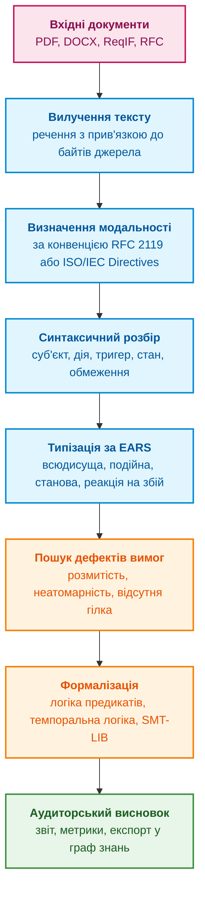
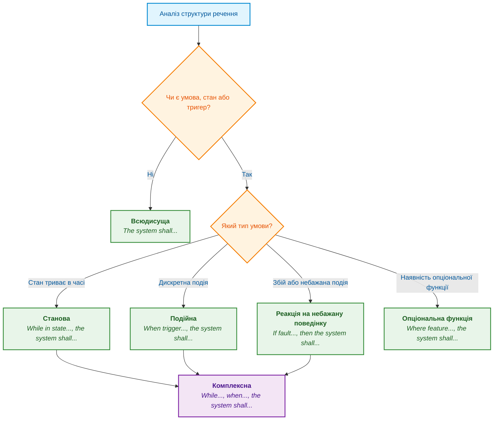
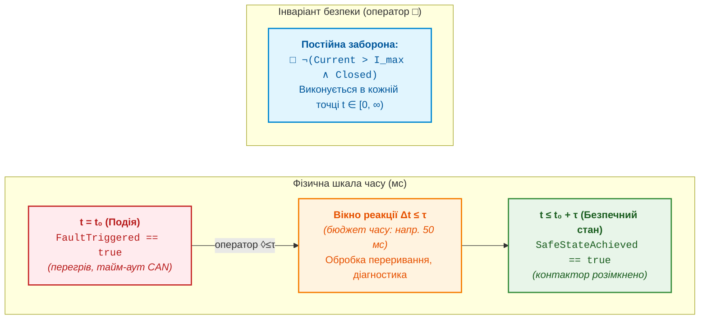
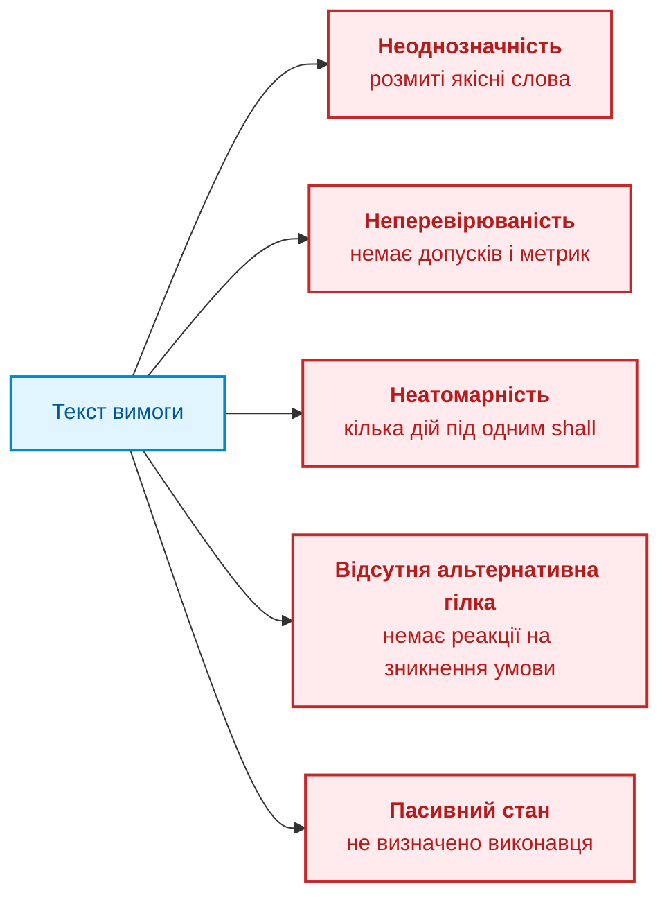
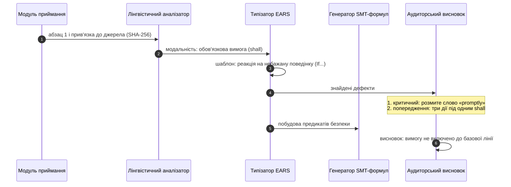

# Глава 14. Виявлення вимог і модальностей: від нормативного тексту до інваріантів

> **Книга:** [Архітектура доказових експертних систем](README.md) · [Частина III: Здобуття знань, мовний аналіз та оцінювання входу](part-03-knowledge-engineering-nlp.md)  
> **Попередня глава:** [Глава 13. Варіативність природної мови проти детермінізму: компіляція сенсу запитання](ch13-language-variability-vs-determinism.md)  
> **Наступна глава:** [Глава 15. Вилучення знань і побудова бази знань: факти, граматики та автомати](ch15-knowledge-extraction-and-kb-construction.md)  
> **Зміст книги:** [README.md](README.md)  
> **Автор:** [Микола Федчик](about-the-author.md)  
> **Рівень:** середній і поглиблений: системні інженери, архітектори, розробники, фахівці з верифікації та валідації  
> **Очікувані результати:** відрізняти нормативні речення від описових за правилами документа-джерела; зводити вимоги до шаблонів EARS; перекладати шаблони в логіку предикатів, темпоральну логіку й формули SMT-LIB; знаходити суперечності між вимогами за допомогою SMT-розв'язувача; формувати аудиторський висновок про якість вимог із прив'язкою до джерела.

## Анотація

У цій главі досліджено проблему автоматизованого виявлення вимог та деонтичних модальностей у технічних специфікаціях, галузевих стандартах (ISO 26262, DO-178C) та RFC для синтезу формальних інваріантів доказових експертних систем. Проаналізовано синтаксичні пастки природної мови й запропоновано алгоритм типізації вимог за граматичними шаблонами EARS (Easy Approach to Requirements Syntax). Розглянуто трансляцію формалізованих вимог у мову предикатів першого порядку, лінійну темпоральну логіку (LTL) та формат SMT-LIB для автоматизованої перевірки суперечностей розв'язувачем Z3, що формує детерміноване ядро правил для експертної системи. Наведено детерміновану реалізацію конвеєра мовою Go та наскрізний інженерний кейс аудиту вимог до системи керування батареєю (BMS).

Розроблення складного виробу, від блока керування тяговою батареєю електромобіля до бортового програмного забезпечення літака, починається не з коду, а з вимог. Вимоги приходять із трьох джерел: міжнародних і галузевих стандартів, технічного завдання замовника та документації на елементну базу, тобто технічних описів мікросхем і переліків їхніх відомих помилок. Технічне завдання часто надходить як PDF, DOCX або обмінний файл формату ReqIF (*Requirements Interchange Format*) [[1]](#src-1). Стандарти функціональної безпеки, як-от ISO 26262 для автомобілів [[2]](#src-2) чи DO-178C для бортового програмного забезпечення авіації [[3]](#src-3), вимагають, щоб від кожної вимоги можна було простежити шлях до архітектурного рішення, коду й тесту.

Усі подальші етапи, від проєктування до сертифікації, потребують точності, а першоджерело написане природною мовою: розмитими словами, пасивними конструкціями, винятками всередині одного речення. Якщо команда доручає роботу з такими документами пошуку за схожістю тексту чи великій мовній моделі (*Large Language Model*, LLM), вона отримує типові збої: модель губить квантор «для всіх», пропускає часову межу, плутає заборону з рекомендацією й не може гарантувати, що знайшла всі вимоги. Для сертифікаційного аудиту відповідь «вимога, найімовірніше, задоволена» нічого не важить. Чому схожість тексту не дорівнює розумінню, пояснює [Глава 13](ch13-language-variability-vs-determinism.md).

Звідси головне запитання глави: **як автоматично знайти вимоги в нормативних документах і перетворити їх на перевірювані формальні інваріанти, не втративши зв'язку з джерелом?** Теза глави: вимогу визначає не саме слово SHALL, а модальність за правилами конкретного документа, синтаксична структура речення й перевірювані параметри. Експертна система розглядає специфікацію як нескомпільований вихідний код: детерміновано визначає модальність, зводить речення до шаблону, перекладає шаблон у логічну формулу й перевіряє формули на суперечності, а мовна модель лише пропонує кандидатів, які перевіряє детермінований код.



Схема задає порядок глави. Перші два кроки визначають, чи є речення вимогою взагалі. Наступні два кроки зводять вимогу до однієї з небагатьох форм. Останні три кроки перевіряють якість, перекладають вимогу в логіку й формують висновок, який може перевірити людина.

## 1. Деонтична модальність та критерії демаркації нормативних вимог

Технічний документ складається не лише з вимог. У ньому є обґрунтування рішень (*rationale*), примітки, приклади застосування й поради щодо зручності. Якщо експертна система внесе до бази знань усі речення поспіль, база наповниться твердженнями, які ніхто не зобов'язаний виконувати, і висновки експертної системи стануть ненадійними. Тому перший крок полягає в тому, щоб визначити **модальність** речення: чи воно зобов'язує, забороняє, рекомендує, дозволяє чи лише описує.

Модальність задають правила оформлення документа, і різні сімейства документів мають різні правила. Документ RFC 2119 визначає ключові слова специфікацій інтернету: MUST, SHALL і REQUIRED позначають обов'язкову вимогу, MUST NOT і SHALL NOT заборону, SHOULD і RECOMMENDED рекомендацію, MAY і OPTIONAL дозвіл [[4]](#src-4). RFC 8174 уточнює, що особливого значення ці слова набувають лише тоді, коли їх написано великими літерами [[5]](#src-5). Стандарти ISO та IEC пишуть за іншими правилами: Директиви ISO/IEC, частина 2, закріплюють дієслівні форми малими літерами, де shall означає вимогу, should рекомендацію, may дозвіл, can можливість чи здатність, а must позначає зовнішнє обмеження, яке не є вимогою самого документа [[6]](#src-6).

Класифікатор має знати конвенцію й роль розділу. RFC 8174 задає спеціальне значення слів у верхньому регістрі, але відсутність такого маркера не доводить, що речення не містить вимоги. Обов'язок може бути виражений звичайною мовою або посиланням на інший пункт. Тому результат пошуку маркерів є кандидатом модальності; цитати, приклади й інформаційні примітки перевіряють окремо. Невідома конвенція не повинна мовчки ставати «описовим реченням».

| Нормативна сила | Маркери RFC 2119 і RFC 8174 | Маркери Директив ISO/IEC | Що робить експертна система |
|---|---|---|---|
| **Обов'язкова вимога** | MUST, SHALL, REQUIRED | shall | Створює обов'язковий інваріант; вимога потребує трасованої верифікації |
| **Заборона** | MUST NOT, SHALL NOT | shall not | Створює інваріант безпеки «стан ніколи не настає»; планує негативні тести |
| **Рекомендація** | SHOULD, RECOMMENDED | should | Фіксує м'яке обмеження; відхилення потребує записаного обґрунтування |
| **Небажана дія** | SHOULD NOT, NOT RECOMMENDED | should not | Створює попередження для рецензії архітектора |
| **Дозвіл** | MAY, OPTIONAL | may, need not | Реєструє опціональну функцію; не є підставою відхилити випуск |
| **Можливість або здатність** | немає | can, cannot | Записує властивість, а не вимогу |
| **Зовнішнє обмеження** | немає | must | Записує передумову середовища, наприклад закон чи фізичне обмеження |
| **Твердження** | малі літери, is, will | is, will | Записує контекст; вимогою не є |

Таблиця показує, що одне й те саме слово має різну силу в різних документах. Тому модальність зберігають разом з ідентифікатором конвенції, і рецензент може перевірити, за якими правилами експертна система класифікувала речення.

### 1.1. Синтаксичні пастки та семантична неоднозначність природної мови

Пошук слова SHALL регулярним виразом знаходить лише частину вимог. Реальні документи пишуть різні автори, часто не носії мови, і в документах повторюються три типові пастки.

**Пасивний стан без виконавця.** У реченні *«Data shall be validated before transmission»* незрозуміло, хто перевіряє дані: драйвер датчика, комунікаційний контролер чи застосунок верхнього рівня. Вимогу без виконавця не можна призначити компоненту, а отже, не можна й простежити до коду. Синтаксичний розбір залежностей, описаний у [Главі 13](ch13-language-variability-vs-determinism.md#крок-1-синтаксичний-розбір-залежностей), знаходить у такому реченні відсутній суб'єкт і дає підставу повернути вимогу авторові.

**Прихована нормативність.** Речення *«The ECU is responsible for monitoring battery voltage»* або *«The firmware needs to reboot if a watchdog timeout occurs»* не містять слова shall, але за змістом є обов'язковими вимогами. Тому експертна система тримає перелік квазімодальних конструкцій (*is responsible for*, *has to*, *needs to*, *is required to*) і позначає такі речення як кандидатів для перевірки людиною.

**Винятки всередині речення.** Речення *«The system shall maintain 50 Hz PWM frequency under all load conditions, except during initial power-up calibration where 20 Hz is permitted for a maximum of 200 ms»* містить загальну вимогу, умову винятку, альтернативну поведінку й часове обмеження. Експертна система розкладає таке речення на атомарні логічні гілки, інакше виняток загубиться під час формалізації.

Отже, модальність і синтаксис треба визначати разом: модальність каже, чи є речення вимогою, а синтаксис каже, хто, коли й що мусить зробити. Наступний крок полягає в тому, щоб звести різноманітні речення до невеликого набору стандартних форм.

## 2. Шаблони EARS: структурна стандартизація інженерних вимог

Щоб вільний текст став придатним до формалізації, вимоги записують за шаблонами. Найвідомішим набором шаблонів є простий підхід до синтаксису вимог (*Easy Approach to Requirements Syntax*, EARS), який Алістер Мевін і співавтори з компанії Rolls-Royce запропонували 2009 року для вимог до систем керування авіаційними двигунами [[7]](#src-7). EARS обмежує вимоги кількома формами, і кожна форма відповідає одному типу умови.



Дерево рішень ставить лише два запитання: чи є в реченні умова і якого вона типу. Від відповіді залежить шаблон, а від шаблону логічна форма, яку розглядає наступний розділ.

**Всюдисуща вимога** діє постійно, без прив'язки до подій чи станів. Шаблон: `The <system name> shall <system response>.` Приклад: *«The CAN controller shall support extended 29-bit identifiers»*.

**Подійна вимога** описує реакцію на дискретну подію. Шаблон: `When <trigger>, the <system name> shall <system response>.` Приклад: *«When the E-STOP button is pressed, the motor driver shall disable gate drive outputs within 5 ms»*.

**Станова вимога** діє лише тоді, коли компонент перебуває у визначеному режимі. Шаблон: `While <in a specific state>, the <system name> shall <system response>.` Приклад: *«While in PRE-CHARGE mode, the BMS shall limit the pre-charge resistor current to 10 A»*.

**Реакція на небажану поведінку** описує дію в разі збою, порушення протоколу чи виходу за безпечний діапазон. Шаблон: `If <trigger>, then the <system name> shall <system response>.` Приклад: *«If the cell temperature exceeds 65 °C, then the cooling controller shall activate the refrigerant pump at 100% duty cycle»*.

**Опціональна функція** діє лише за наявності модуля чи ліцензії. Шаблон: `Where <feature is included>, the <system name> shall <system response>.` Приклад: *«Where the hardware watchdog is populated, the CPU supervisor shall toggle the WDI pin every 50 ms»*.

**Комплексна вимога** поєднує умови, наприклад стан і подію: *«While in CHARGING state, when the charge plug is unlocked, the charger shall open the high-voltage interlock loop within 10 ms»*.

EARS упорядковує умови й реакцію, але не визначає єдиної формальної семантики. Станова вимога може потребувати інваріанта, обмеженої реакції або правила входу в стан залежно від дієслова й часового контексту. Невідповідність EARS є сигналом перегляду, не доказом дефекту кожного нормативного документа. Формальні передумови, одиниці й винятки задають окремо.

## 3. Математична формалізація: від шаблонів до формальної логіки

Шаблон EARS упорядковує текст, але ще не дає змоги машині перевіряти вимоги. Для перевірки шаблон перекладають у формальну мову: логіку предикатів першого порядку, темпоральну логіку або мову SMT-LIB, яку розуміють автоматичні розв'язувачі.

### 3.1. Логіка предикатів першого порядку

Узагальнену вимогу записують як відношення над простором станів $\mathcal{S}$, вхідними сигналами $\mathbf{x}\in\mathcal{X}$ і вихідними сигналами $\mathbf{y}\in\mathcal{Y}$:

```math
\forall s\in\mathcal{S},\ \forall\mathbf{x}\in\mathcal{X}:\quad \Phi_{\mathrm{pre}}(s,\mathbf{x})\Rightarrow\exists s'\in\mathcal{S},\ \exists\mathbf{y}\in\mathcal{Y}:\ \bigl(\Phi_{\mathrm{post}}(s',\mathbf{y})\land\mathcal{T}(s,s')\bigr).
```

- У загальному контракті $s\in\mathcal{S}$ є поточним станом зі множини станів, а $\mathbf{x}\in\mathcal{X}$ є вектором входів;
- $\mathbf{y}\in\mathcal{Y}$ є вектором вихідних сигналів, а $s'$ є наступним станом;
- $\Phi_{\mathrm{pre}}(s,\mathbf{x})$ є передумовою, що поєднує стан (While), подію (When) і збій (If);
- $\Phi_{\mathrm{post}}(s',\mathbf{y})$ є післяумовою після дії shall, а $\mathcal{T}(s,s')$ задає допустимість переходу, зокрема обмеження часу $\Delta t\le t_{\mathrm{timeout}}$;
- $\forall$ означає «для кожного», $\exists$ означає «існує», $\Rightarrow$ означає логічний наслідок, а $\land$ вимагає виконання обох умов.

Читається так: для кожної пари стану й входу, що задовольняє передумову, має існувати перехід із допустимими виходами й післяумовою. Формула описує контракт, але сама не доводить, що конкретна реалізація виконує контракт у фізичному середовищі.

### 3.2. Лінійна темпоральна логіка (LTL) для часових інваріантів

Вбудовані системи працюють у часі, тому статичних предикатів недостатньо. Амір Пнуелі запропонував використовувати для міркувань про програми лінійну темпоральну логіку (*Linear Temporal Logic*, LTL) [[8]](#src-8). У ній оператор $\Box$ означає «завжди, в усіх майбутніх станах», а оператор $\Diamond$ означає «колись у майбутньому». Метрична темпоральна логіка (*Metric Temporal Logic*, MTL), яку для вимог реального часу описав Рон Коайманс, додає до операторів часові межі, наприклад $\Diamond_{\le\tau}$ означає «не пізніше ніж через час $\tau$» [[9]](#src-9). Сигнальна темпоральна логіка (*Signal Temporal Logic*, STL) Малера й Ніковича переносить такі формули на неперервні сигнали, як-от струм чи температуру [[10]](#src-10).

Два типи властивостей трапляються найчастіше. **Інваріант безпеки** стверджує, що поганий стан ніколи не настає:

```math
\Box\,\neg\bigl(\mathit{Current}>I_{\max}\land\mathit{ContactorState}=\mathit{CLOSED}\bigr).
```

- У цій властивості $\mathit{Current}$ є виміряним струмом, зазвичай у амперах, а $I_{\max}$ є допустимою верхньою межею в тих самих одиницях;
- $\mathit{ContactorState}$ є станом контактора, а $\mathit{CLOSED}$ означає замкнений стан;
- $>$ означає «більше за», $=$ означає рівність станів, а $\land$ поєднує дві умови;
- $\neg$ заперечує заборонений стан, а $\Box$ вимагає виконання властивості завжди в межах моделі часу.

Отже, струм не повинен перевищувати межу, коли контактор замкнений. Властивість стосується лише правильно заданих сигналів, одиниць і часової моделі.

**Обмежена живучість** стверджує, що потрібна подія настає вчасно:

```math
\Box\Bigl(\mathit{FaultTriggered}\Rightarrow\Diamond_{\le\tau}\,\mathit{SafeStateAchieved}\Bigr).
```

- Часова межа $\tau$ є додатним терміном, наприклад у секундах;
- $\mathit{FaultTriggered}$ означає, що зафіксовано збій, а $\mathit{SafeStateAchieved}$ означає досягнення безпечного стану;
- $\Diamond_{\le\tau}$ означає, що подія має настати колись не пізніше ніж через $\tau$;
- $\Rightarrow$ означає «якщо ..., то ...», а зовнішній оператор $\Box$ поширює вимогу на всі моменти часу.

Формула вимагає обмеженої в часі реакції на кожний зафіксований збій. Вона не уточнює сама собою, чи є визначений безпечний стан достатнім для конкретної небезпеки, тому це перевіряють окремо.



> [!TIP] Пастка вакуозної істинності (Vacuous Truth)
> У математичній логіці вираз $A \Rightarrow B$ є тотожно істинним, коли $A = \text{False}$ (з хиби випливає що завгодно). Якщо в тесті передумова $\mathit{FaultTriggered}$ ніколи не була згенерована стендом (наприклад, датчик не зміг змоделювати стрибок температури понад 100 °C), автоматичний верифікатор із задоволенням повідомить: *«Вимогу успішно верифіковано на 100 %!»*. Насправді ж реалізація коду в безпечному стані не виконувалася жодного разу! Для запобігання вакуозній верифікації аудиторський конвеєр зобов'язаний супроводжувати кожну імплікацію тестом досяжності передумови: перевіряти, що $\Diamond\,\Phi_{\mathrm{pre}}$ виконується хоча б в одному тестовому прогоні.

Тепер можна запропонувати формули для прикладів EARS. Таблиця показує навчальні інтерпретації, а не однозначний переклад кожного шаблону: вибір часової моделі, одиниці кроку, початку відліку й області кванторів залишається явним рішенням формалізації.

| Шаблон EARS | Приклад | Логічна форма |
|---|---|---|
| Всюдисуща | CAN-контролер підтримує 29-бітні ідентифікатори | $`\Box\,\mathit{Supports}(\mathit{CAN},\mathit{Ext29})`$ |
| Подійна | після натискання E-STOP драйвер вимикає виходи за 5 мс | $`\Box\bigl(\mathit{Pressed}\Rightarrow\Diamond_{\le5\,\mathrm{ms}}\,\mathit{Disabled}\bigr)`$ |
| Станова | у режимі PRE-CHARGE струм не перевищує 10 А | $`\Box\bigl(\mathit{State}=\mathit{PRECHARGE}\Rightarrow\mathit{Current}\le10\,\mathrm{A}\bigr)`$ |
| Реакція на небажану поведінку | за температури понад 65 °C насос працює на 100 % | $\Box\bigl(\mathit{Temp}>65\Rightarrow\mathit{PumpDuty}=1{,}0\bigr)$ |
| Опціональна функція | за наявності сторожового таймера сигнал WDI перемикається кожні 50 мс | $`\mathit{HasWatchdog}\Rightarrow\Box\,(\mathit{ToggleInterval}=50\,\mathrm{ms})`$ |

Таблиця показує навчальні варіанти перекладу, не загальний однозначний компілятор. Рецензент перевіряє також квантори, часові межі, одночасність, умови скасування й відповідність сигналів. Треба розрізняти існування допустимої реакції та виконання вимоги всіма допустимими поведінками реалізації. Якщо передумова ніколи не настає, імплікація може бути істинною тривіально; окремий тест досяжності передумови запобігає такій вакуозній перевірці.

### 3.3. Автоматизована перевірка несуперечливості вимог SMT-розв'язувачем

Формули самі нічого не перевіряють. Перевірку виконує **SMT-розв'язувач** (*satisfiability modulo theories*): програма, яка вирішує, чи існує присвоєння змінних, що задовольняє всі формули одночасно з урахуванням теорій арифметики, логічних значень і типів даних. Поширеним розв'язувачем є Z3 Леонардо де Моури й Ніколая Бйорнера [[11]](#src-11), а формули для розв'язувачів записують стандартною мовою SMT-LIB [[12]](#src-12).

Для експертної системи найцінніший результат розв'язувача полягає в пошуку суперечностей між вимогами. Розгляньмо дві вимоги до системи керування батареєю (*battery management system*, BMS). REQ-BMS-042 каже, що за температури комірки понад 60 °C контактор треба розімкнути. REQ-BMS-077 каже, що в режимі заряджання контактор має бути замкнений. Кожна вимога окремо розумна. Скрипт нижче перевіряє, чи можуть обидві вимоги виконуватися, коли комірки перегріваються під час заряджання; кожне твердження має ім'я, щоб розв'язувач міг назвати винуватців.

<details>
<summary>Формальна модель SMT-LIB</summary>

```lisp
(set-option :produce-unsat-cores true)
(declare-datatype BmsState ((INIT) (STANDBY) (CHARGE) (DISCHARGE) (FAULT)))
(declare-const state BmsState)
(declare-const cell_temp_c Real)
(declare-const contactor_closed Bool)

; REQ-BMS-042 (If): якщо температура комірки перевищує 60 °C, BMS розмикає контактор.
(assert (! (=> (> cell_temp_c 60.0) (not contactor_closed)) :named REQ_BMS_042))

; REQ-BMS-077 (While): у режимі CHARGE BMS тримає контактор замкненим.
(assert (! (=> (= state CHARGE) contactor_closed) :named REQ_BMS_077))

; Сценарій: комірки перегріваються під час заряджання.
(assert (! (and (= state CHARGE) (> cell_temp_c 60.0)) :named SCENARIO))

(check-sat)
(get-unsat-core)
```

</details>


Скрипт можна виконати пакетом z3-solver для Python (`pip install z3-solver`) через функцію `Z3_eval_smtlib2_string`. Розв'язувач Z3 версії 5.1.0 повертає:

<details>
<summary>Дані або результат прикладу</summary>

```text
unsat
(REQ_BMS_042 REQ_BMS_077 SCENARIO)
```

</details>


`unsat` означає несумісність формалізованих тверджень у заданому сценарії. Ядро незадовільності (*unsat core*) є достатньою для суперечності підмножиною, не обов'язково мінімальною. Результат не визначає автоматично, яку вимогу змінювати. Додавання умови `(<= cell_temp_c 60.0)` до правила заряджання є одним навчальним варіантом узгодження, який потребує схвалення власника. `sat` після зміни показує виконуваність моделі, не доводить безпеки виробу. Вичерпання часу або статус `unknown` не прирівнюють до `sat` чи `unsat`.

Цей приклад показує межу методу. Розв'язувач знаходить суперечності лише між формалізованими вимогами і лише в моделі, яку записав інженер. Якщо змінна `cell_temp_c` неправильно відповідає фізичному датчику, розв'язувач цього не помітить. Тому формалізація теж проходить рецензію, а результат розв'язувача стає доказом лише разом із записом про те, хто й за якою версією вимог побудував модель.

## 4. Метрики та автоматизований аудит якості вимог (Requirements Smells)

Формалізація можлива лише для якісних вимог. Стандарт ISO/IEC/IEEE 29148:2018 перелічує характеристики добре сформульованої вимоги: вона має бути необхідною, однозначною, повною, одиничною, здійсненною, перевірюваною й коректною [[13]](#src-13). Хеннінг Феммер і співавтори запропонували автоматично шукати порушення цих характеристик як «запахи вимог» (*requirements smells*): суб'єктивну мову, неоднозначні прислівники й прикметники, лазівки, відкриті неперевірювані терміни, вищі ступені порівняння, заперечення, розмиті займенники й неповні посилання [[14]](#src-14).



Схема групує дефекти за наслідком: неоднозначну вимогу різні розробники зрозуміють по-різному, неперевірювану неможливо закрити тестом, неатомарну неможливо простежити до одного тесту, а вимога без альтернативної гілки залишає розробникові вирішувати, що робити після збою.

**Неоднозначність і розмиті терміни.** Слова *fast*, *promptly*, *immediately*, *as soon as possible*, *user-friendly*, *robust*, *adequate*, *approximately* чи *etc.* не мають фізичного виміру. Експертна система тримає перелік таких слів і для кожного пропонує заміну: замість *promptly* записати межу часу, наприклад $t\le15$ мс, замість *approximately* записати номінал і допуск.

**Неатомарність.** Речення *«The gateway shall parse the incoming CAN message, verify the CRC, update the internal state machine, and transmit an acknowledgment frame»* містить чотири незалежні дії. Якщо провалиться лише перевірка контрольної суми, статус усієї вимоги стане «частково виконано», а для простежуваності за ISO 26262 потрібні окремі вимоги з окремими тестами.

**Відсутня альтернативна гілка.** Вимога *«If the battery temperature exceeds 55 °C, the cooling fan shall turn ON»* не каже, коли вентилятор вимикати. Якщо вимикати його за тієї самої температури 55 °C, реле почне часто перемикатися на межі спрацювання (*chattering*). Інженерне рішення полягає в гістерезисі: вмикати за $`T>55\,^{\circ}\mathrm{C}`$, а вимикати лише за $`T\le48\,^{\circ}\mathrm{C}`$. Без парної вимоги розробник вибере межу на власний розсуд, і ця межа не пройде рецензії.

**Пасивний стан без виконавця.** Як показав попередній розділ, вимогу без суб'єкта не можна призначити компоненту. Експертна система позначає такі вимоги й пропонує вказати точну назву компонента.

Аудит формує кандидата для формалізації або перелік питань до автора. Ознаки кількох дій, пропущеної гілки чи невизначеного строку є сигналами перегляду, не універсальними дефектами: кілька дій можуть бути неподільною транзакцією, а незгадана поведінка може навмисно лишатися необмеженою. Готовність до базової версії встановлюють предметна перевірка й схвалення, не лише відсутність знайдених запахів.

## 5. Програмна реалізація: детермінований конвеєр аналізу на Go

Попередні розділи описали кроки окремо. Програма нижче поєднує їх у мінімальний детермінований конвеєр: визначає модальність за конвенцією документа, зводить речення до шаблону EARS, шукає розмиті терміни, неатомарність, загальний суб'єкт і відсутню межу часу. Програма використовує лише стандартну бібліотеку Go й запускається командою `go run main.go`.

<details>
<summary>Приклад мовою Go: детермінований конвеєр аудиту вимог</summary>

```go
package main

import (
	"crypto/sha256"
	"fmt"
	"regexp"
	"strconv"
	"strings"
)

// Convention визначає правила оформлення документа-джерела.
type Convention int

const (
	RFC2119       Convention = iota // BCP 14: нормативні лише слова ВЕЛИКИМИ літерами (RFC 8174)
	ISODirectives                   // ISO/IEC Directives, Part 2: дієслівні форми малими літерами
)

type Modality string

const (
	Requirement        Modality = "REQUIREMENT"
	Prohibition        Modality = "PROHIBITION"
	Recommendation     Modality = "RECOMMENDATION"
	NotRecommended     Modality = "NOT_RECOMMENDED"
	Permission         Modality = "PERMISSION"
	Capability         Modality = "CAPABILITY"          // ISO: can, cannot
	ExternalConstraint Modality = "EXTERNAL_CONSTRAINT" // ISO: must
	Statement          Modality = "STATEMENT"
	UnknownConvention  Modality = "UNKNOWN_CONVENTION"
)

type rule struct {
	re *regexp.Regexp
	m  Modality
}

// Заперечні форми перевіряють раніше за ствердні.
var rules = map[Convention][]rule{
	RFC2119: {
		{regexp.MustCompile(`\b(MUST NOT|SHALL NOT)\b`), Prohibition},
		{regexp.MustCompile(`\b(MUST|SHALL|REQUIRED)\b`), Requirement},
		{regexp.MustCompile(`\b(SHOULD NOT|NOT RECOMMENDED)\b`), NotRecommended},
		{regexp.MustCompile(`\b(SHOULD|RECOMMENDED)\b`), Recommendation},
		{regexp.MustCompile(`\b(MAY|OPTIONAL)\b`), Permission},
	},
	ISODirectives: {
		{regexp.MustCompile(`(?i)\bshall not\b`), Prohibition},
		{regexp.MustCompile(`(?i)\bshall\b`), Requirement},
		{regexp.MustCompile(`(?i)\bshould not\b`), NotRecommended},
		{regexp.MustCompile(`(?i)\bshould\b`), Recommendation},
		{regexp.MustCompile(`(?i)\bmay\b`), Permission},
		{regexp.MustCompile(`(?i)\bmust\b`), ExternalConstraint},
		{regexp.MustCompile(`(?i)\bcan(not)?\b`), Capability},
	},
}

func ClassifyModality(text string, c Convention) Modality {
	patterns, known := rules[c]
	if !known {
		return UnknownConvention
	}
	for _, r := range patterns {
		if r.re.MatchString(text) {
			return r.m
		}
	}
	return Statement
}

type EARS string

// Шаблони EARS (Mavin et al., 2009); перемагає перший збіг.
var earsPatterns = []struct {
	kind EARS
	re   *regexp.Regexp
}{
	{"COMPLEX", regexp.MustCompile(`(?i)^While (?P<state>.+?), when (?P<trigger>.+?), the (?P<subject>[\w -]+?) shall (?P<action>.+?)\.?$`)},
	{"UNWANTED_BEHAVIOUR", regexp.MustCompile(`(?i)^If (?P<trigger>.+?), then the (?P<subject>[\w -]+?) shall (?P<action>.+?)\.?$`)},
	{"STATE_DRIVEN", regexp.MustCompile(`(?i)^While (?P<state>.+?), the (?P<subject>[\w -]+?) shall (?P<action>.+?)\.?$`)},
	{"EVENT_DRIVEN", regexp.MustCompile(`(?i)^When (?P<trigger>.+?), the (?P<subject>[\w -]+?) shall (?P<action>.+?)\.?$`)},
	{"OPTIONAL_FEATURE", regexp.MustCompile(`(?i)^Where (?P<feature>.+?), the (?P<subject>[\w -]+?) shall (?P<action>.+?)\.?$`)},
	{"UBIQUITOUS", regexp.MustCompile(`(?i)^The (?P<subject>[\w -]+?) shall (?P<action>.+?)\.?$`)},
}

func ParseEARS(text string) (EARS, map[string]string) {
	for _, p := range earsPatterns {
		m := p.re.FindStringSubmatch(text)
		if m == nil {
			continue
		}
		g := map[string]string{}
		for i, name := range p.re.SubexpNames() {
			if name != "" {
				g[name] = m[i]
			}
		}
		return p.kind, g
	}
	return "NON_CONFORMANT", nil
}

var (
	reTiming   = regexp.MustCompile(`(?i)\b(?:within|no later than|in less than)\s+(\d+(?:\.\d+)?)\s*(ms|s)\b`)
	reVague    = regexp.MustCompile(`(?i)\b(promptly|quickly|as soon as possible|user[- ]friendly|robust|adequate|sufficient(?:ly)?|approximately|etc)\b`)
	reTwoVerbs = regexp.MustCompile(`(?i)\band (?:then )?(open|close|set|send|transmit|notify|flash|update|verify|validate|disable|enable|activate|trigger|log|store)\b`)
)

type Finding struct{ Severity, Code, Detail string }

func Audit(text string, c Convention) (Modality, EARS, float64, []Finding) {
	mod := ClassifyModality(text, c)
	if mod == UnknownConvention {
		return mod, "UNASSESSED", 0, []Finding{{"CRITICAL", "UNKNOWN_CONVENTION", "document convention is not defined"}}
	}
	if mod != Requirement && mod != Prohibition {
		return mod, "", 0, nil // речення не перевіряють як вимогу
	}
	kind, g := ParseEARS(text)
	var f []Finding
	if kind == "NON_CONFORMANT" {
		f = append(f, Finding{"CRITICAL", "NON_CONFORMANT_EARS", "no EARS template matches"})
	}
	if w := reVague.FindString(text); w != "" {
		f = append(f, Finding{"CRITICAL", "VAGUE_TERM", fmt.Sprintf("%q is not objectively verifiable", w)})
	}
	if v := reTwoVerbs.FindStringSubmatch(g["action"]); v != nil {
		f = append(f, Finding{"WARNING", "NON_ATOMIC", fmt.Sprintf("second action %q under one shall", v[1])})
	}
	if s := strings.ToLower(g["subject"]); s == "system" || s == "software" {
		f = append(f, Finding{"WARNING", "GENERIC_SUBJECT", fmt.Sprintf("subject %q names no component", s)})
	}
	var ms float64
	if t := reTiming.FindStringSubmatch(g["action"]); t != nil {
		ms, _ = strconv.ParseFloat(t[1], 64)
		if strings.EqualFold(t[2], "s") {
			ms *= 1000
		}
	} else if kind == "EVENT_DRIVEN" || kind == "UNWANTED_BEHAVIOUR" {
		f = append(f, Finding{"CRITICAL", "MISSING_TIME_BOUND", "reaction without a deadline"})
	}
	return mod, kind, ms, f
}

func main() {
	samples := []struct {
		id   string
		conv Convention
		text string
	}{
		{"REQ-1", ISODirectives, "When the cell temperature exceeds 60 °C, the BMS shall open the main contactor within 100 ms."},
		{"REQ-2", ISODirectives, "The system shall promptly validate incoming CAN messages and flash the status LED."},
		{"REQ-3", ISODirectives, "If the CAN bus is lost, then the gateway shall enter the SAFE state."},
		{"REQ-4", ISODirectives, "The installer must follow local electrical codes."},
		{"REQ-5", RFC2119, "The client should retry the connection."},
	}
	for _, s := range samples {
		mod, kind, ms, findings := Audit(s.text, s.conv)
		sum := sha256.Sum256([]byte(s.text))
		if kind == "" {
			fmt.Printf("%s sha256:%x %s (not audited as a requirement)\n", s.id, sum[:4], mod)
			continue
		}
		fmt.Printf("%s sha256:%x %s %s deadline=%gms parser_checks_passed=%v\n",
			s.id, sum[:4], mod, kind, ms, !hasCritical(findings))
		for _, f := range findings {
			fmt.Printf("    [%s] %s: %s\n", f.Severity, f.Code, f.Detail)
		}
	}
}

func hasCritical(fs []Finding) bool {
	for _, f := range fs {
		if f.Severity == "CRITICAL" {
			return true
		}
	}
	return false
}
```

Негативні випадки в `audit_test.go` перевіряють область строку й невідому конвенцію; команда: `go test -v main.go audit_test.go`.

```go
package main

import "testing"

func TestDeadlineScopeAndConvention(testCase *testing.T) {
	text := "When the input arrives within 2 s, the gateway shall respond within 100 ms."
	_, _, deadline, findings := Audit(text, ISODirectives)
	if deadline != 100 || hasCritical(findings) {
		testCase.Fatalf("trigger time became action deadline: %g %v", deadline, findings)
	}
	text = "When the input arrives within 2 s, the gateway shall respond."
	_, _, deadline, findings = Audit(text, ISODirectives)
	if deadline != 0 || !hasCritical(findings) {
		testCase.Fatal("trigger time concealed missing response deadline")
	}
	modality, _, _, findings := Audit("The gateway shall respond.", Convention(99))
	if modality != UnknownConvention || !hasCritical(findings) {
		testCase.Fatal("unknown convention silently accepted")
	}
	if ClassifyModality("The client MUST NOT retry.", RFC2119) != Prohibition {
		testCase.Fatal("negative normative marker lost")
	}
}
```

Навчальний вивід:

```text
REQ-1 sha256:0d8de9d2 REQUIREMENT EVENT_DRIVEN deadline=100ms parser_checks_passed=true
REQ-2 sha256:96ae8a8f REQUIREMENT UBIQUITOUS deadline=0ms parser_checks_passed=false
    [CRITICAL] VAGUE_TERM: "promptly" is not objectively verifiable
    [WARNING] NON_ATOMIC: second action "flash" under one shall
    [WARNING] GENERIC_SUBJECT: subject "system" names no component
REQ-3 sha256:7ba442f9 REQUIREMENT UNWANTED_BEHAVIOUR deadline=0ms parser_checks_passed=false
    [CRITICAL] MISSING_TIME_BOUND: reaction without a deadline
REQ-4 sha256:611be070 EXTERNAL_CONSTRAINT (not audited as a requirement)
REQ-5 sha256:cdf96e2a STATEMENT (not audited as a requirement)
```

</details>

Вивід відображає обмежені евристики прикладу. REQ-1 має розпізнану подійну форму й строк 100 мс, але ще не є схваленою вимогою. Для REQ-2 програма повідомляє про *promptly*, кілька дій і загальну назву виконавця. Для REQ-3 програма не знаходить строку реакції. REQ-4 містить маркер зовнішнього обмеження за Директивами ISO/IEC. У REQ-5 мале should не отримує спеціального значення RFC 8174; нормативність усього речення потребує контексту. Префікс SHA-256 прив'язує результат до точного тексту, але не доводить правильності класифікації.

`parser_checks_passed` означає лише проходження реалізованих евристик, не готовність до затвердженої базової версії. `STATEMENT` у коді означає відсутність розпізнаного спеціального маркера, не підтверджену відсутність нормативності. Регулярні вирази не розв'язують області дії модальностей, цитування, кількох строків і семантику слова «негайно». Межу часу, число й оператор слід зберігати в проміжному поданні з власною адресою джерела; низька впевненість веде до перегляду. Жодна кількість успішних синтаксичних перевірок не замінює предметного схвалення.

## 6. Практичний кейс: аудит системи керування батареєю (BMS) за ISO 26262

Розгляньмо фрагмент технічного завдання на систему керування тяговою батареєю з рівнем цілісності ASIL C за ISO 26262.

<details>
<summary>Дані або результат прикладу</summary>

```text
Document: SRS_HV_Battery_Management_v2.4.docx
Section: 5.3 Safety Mechanisms and Thermal Runaway Prevention

Paragraph 1:
"If an over-temperature condition (cell temperature > 60°C) is detected by the analog front-end,
the BMS controller shall promptly open the pyrotechnic switch, set the fault register to 0xEF,
and notify the vehicle VCU via CAN message within 50 ms."

Paragraph 2:
"The battery status should be robust and user-friendly under normal driving states."
```

</details>


Перший абзац є обов'язковою вимогою, другий рекомендацією з двома розмитими словами. Діаграма показує, як перший абзац проходить через конвеєр.



Аудит має чотири результати.

1. **Прив'язка до джерела.** Висновок посилається на файл `SRS_HV_Battery_Management_v2.4.docx`, його контрольну суму, розділ 5.3 і абзац 1.
2. **Декомпозиція.** Умова містить температуру понад 60 °C і факт виявлення. Дії: розімкнути вимикач, записати 0xEF, повідомити контролер. Область `within 50 ms` неоднозначна: строк може стосуватися останньої дії або всієї групи. Парсер не має мовчки обрати один варіант.
3. **Висновок.** Потрібно уточнити строк, початок його відліку й залежності між діями. ISO 26262 визначає інтервал толерантності до відмови (*fault tolerant time interval*, FTTI) [[15]](#src-15); перевірка достатності реакції потребує аналізу небезпек, затримки виявлення й виконання. Сам синтаксичний аудит не встановлює відповідності ASIL C.
4. **Запропоноване виправлення.** Автор має підтвердити область 50 мс і визначити строки інших дій. До підтвердження вимога зберігає статус чернетки. Під час поділу зберігають початковий тригер виявлення, дію запису замість домисленого утримання стану та невідомі параметри; не додають вигаданих 10 мс або ідентифікатора повідомлення. Поділ допускається лише після перевірки, що транзакційні й часові зв'язки не втрачено.

Для конвеєрів безперервної інтеграції висновок серіалізують у машинно-читаний формат. Фрагмент нижче показує можливу структуру; поля статистики заповнено умовними значеннями.

<details>
<summary>Структуровані дані JSON</summary>

```json
{
  "audit_run_id": "audit-run-2026-09-20-0042",
  "source_document": {
    "filename": "SRS_HV_Battery_Management_v2.4.docx",
    "hash_sha256": "8f4c2e17a3b94091d32a0fbc556281e0129a00b21a8f902345bc7981ef40a012",
    "section": "5.3 Safety Mechanisms and Thermal Runaway Prevention"
  },
  "verdict": "REJECTED_FOR_BASELINE",
  "statistics": {
    "total_sentences_scanned": 142,
    "requirements_detected": 38,
    "ears_compliant_ratio": 0.763,
    "critical_smells_count": 3,
    "warnings_count": 8
  },
  "findings": [
    {
      "requirement_id": "DRAFT_REQ_042",
      "modality": "REQUIREMENT",
      "convention": "ISO_IEC_DIRECTIVES_PART2",
      "ears_pattern": "UNWANTED_BEHAVIOUR",
      "formal_invariants": {
        "fault_condition": "cell_temperature > 60.0",
        "action_predicates": [
          "open(pyro_switch)",
          "set(fault_register, 0xEF)",
          "broadcast_can(VCU_ALARM)"
        ]
      },
      "blocking_issues": [
        {
          "code": "VAGUE_TERM",
          "severity": "CRITICAL",
          "target_token": "promptly",
          "explanation": "A qualitative time bound cannot be verified against the FTTI."
        },
        {
          "code": "NON_ATOMIC",
          "severity": "WARNING",
          "target_token": "and",
          "explanation": "Three actions need separate traceability identifiers."
        }
      ]
    }
  ]
}
```

</details>


Структура повторює кроки конвеєра: джерело з хешем, модальність разом із конвенцією, шаблон EARS, формальні предикати й дефекти, що блокують базову лінію. Такий файл можна перевірити програмно, а рецензент бачить, з якого саме тексту виведено кожен висновок.

## 7. Проміжне подання вимог (IR): уніфікований контракт верифікатора

Прямий перехід від речення до формули приховує домислені аргументи. Проміжне подання (*intermediate representation*, IR) робить кожне рішення видимим до запуску розв'язувача. Для вимоги потрібні не лише числа, а й ролі та адреси підстав.

| Поля подання | Перевірка перед компіляцією |
|---|---|
| Виконавець, дія, об'єкт | дозволені типи й ідентифікатори; фрагмент для кожної ролі |
| Модальність, конвенція, роль розділу | обов'язок, заборона, рекомендація чи дозвіл; цитата не стає вимогою автоматично |
| Передумова, тригер, виняток | окремі дерева умов; відома область кожної умови |
| Квантор і заперечення | «усі», «існує», «не» з явно визначеною областю |
| Оператор, число, одиниця | строгість нерівності, розмірність, первісний запис і правило перетворення |
| Початок відліку, строк, порядок дій | час передумови не стає часом реакції; невідомий порядок лишається невідомим |
| Джерело, редакція, статус | адреси полів, застосовність і окреме схвалення тлумачення |

Компілятор є **частковим**: він обробляє лише підтримувані форми й повертає нерозв'язані зобов'язання перевірки для інших. Якщо невідомо, чи 50 мс охоплює всі дії, компілятор не створює довільної часової формули. Обмежене декодування з [Глави 13](ch13-language-variability-vs-determinism.md) забезпечує форму кандидата IR, але не заповнює предметних прогалин.

Для чисел придатні бібліотеки одиниць, наприклад Pint [[16]](#src-16), із власними тестами предметних конвенцій. Перетворення градусів Цельсія у кельвіни має зсув, а не лише множник; octet означає вісім бітів, тоді як ширину `byte` потрібно встановити. Десятковий префікс M не замінюють двійковим Mi. Значення «менше» й «не більше» не можна звести до одного оператора. Нормалізовану величину зберігають разом із первісним записом і фрагментом джерела.

Z3 перевіряє формальну модель, а не текст. Для обраного піднабору можна порівняти Z3 із cvc5 [[17]](#src-17), зафіксувавши логіку SMT-LIB, версії, ліміти й очікувані результати. Збіг двох розв'язувачів не виправляє однаково хибну формалізацію. Потрібні окремі випадки для недосяжного тригера, граничного часу, суперечності й нерозв'язаного поля.

Результат такого подання є перевірюваним кандидатом формули з відомими межами. Саме цей артефакт, разом із джерелами й схваленням, можна передати до побудови бази знань.

## Висновки
Кандидатів нормативних вимог знаходять за конвенцією й контекстом документа, розбирають у типізоване подання, перевіряють і лише потім компілюють. EARS обмежує форму речення, але не задає єдиного логічного перекладу. Аудит виявляє питання до автора; розв'язувач перевіряє узгодженість обраної формалізації. Невідомі поля й неоднозначні часові області блокують відповідний переклад, а не заповнюються здогадкою.

Синтетичні тести програми Go перевіряють, що строк із тригера не підмінює строк реакції, невідома конвенція не проходить аудит і MUST NOT зберігає заборону. Приклад SMT-LIB показує модель суперечності та її зміну; наведений результат не є сертифікацією батареї. Проходження евристик парсера й задовільність формули не замінюють предметного схвалення.

Межі методу теж визначені. Регулярні вирази розпізнають лише канонічні форми, тому реальні документи потребують синтаксичного розбору й кандидатів від мовної моделі під детермінованою перевіркою. Розв'язувач перевіряє лише формалізовану частину вимог і лише в моделі, яку записав інженер, тож формалізація теж проходить рецензію. [Глава 15](ch15-knowledge-extraction-and-kb-construction.md) продовжує цей шлях і показує, як перевірені вимоги стають частиною бази знань.

## Запитання для самоперевірки
1. Чому класифікатор модальності має знати конвенцію документа-джерела? Наведіть приклад слова, яке має різну силу в RFC і в стандарті ISO.
2. Які три синтаксичні пастки пропускає пошук слова SHALL регулярним виразом і як експертна система виявляє кожну з них?
3. Який шаблон EARS підходить для вимоги «у режимі заряджання струм не перевищує 20 А» і яка логічна формула йому відповідає?
4. Що означає відповідь `unsat` разом із ядром незадовільності в прикладі з батареєю і чому сама відповідь розв'язувача ще не доводить правильності вимог?
5. Чому вимога без альтернативної гілки небезпечна для релейного керування і як гістерезис розв'язує цю проблему?

## Словник
| Український термін | Англійський відповідник | Коротке пояснення |
|---|---|---|
| Модальність | *modality* | Нормативна сила речення: вимога, заборона, рекомендація, дозвіл, можливість чи твердження |
| Конвенція документа | *drafting convention* | Правила, за якими документ уживає модальні слова, наприклад RFC 2119 чи Директиви ISO/IEC |
| Квазімодальна конструкція | *quasi-modal construction* | Вираз, що зобов'язує без слова shall, наприклад *is responsible for* |
| Шаблон EARS | *EARS template* | Одна з форм простого підходу до синтаксису вимог |
| Інваріант | *invariant* | Умова, яка має виконуватися в усіх допустимих станах |
| Інваріант безпеки | *safety invariant* | Твердження, що поганий стан ніколи не настає |
| Обмежена живучість | *bounded liveness* | Твердження, що потрібна подія настає не пізніше заданого часу |
| Темпоральна логіка | *temporal logic* | Логіка з операторами «завжди», «колись» і часовими межами |
| SMT-розв'язувач | *SMT solver* | Програма, що перевіряє виконуваність формул з урахуванням теорій арифметики й типів даних |
| Ядро незадовільності | *unsat core* | Підмножина тверджень, достатня для суперечності; мінімальність потребує окремої перевірки |
| Запах вимоги | *requirement smell* | Ознака можливого дефекту формулювання вимоги |
| Неатомарна вимога | *non-atomic requirement* | Вимога, що містить кілька незалежних дій |
| Гістерезис | *hysteresis* | Різні пороги вмикання й вимикання, що запобігають частому перемиканню |
| Базова лінія вимог | *requirements baseline* | Затверджений набір вимог, від якого ведуть розроблення й трасування |
| Інтервал толерантності до відмови | *fault tolerant time interval* | Найменший проміжок від відмови до можливої небезпеки без спрацювання механізмів безпеки |

## Абревіатури
| Скорочення | Розшифрування | Значення |
|---|---|---|
| IR | Intermediate Representation | типізоване проміжне подання вимоги |
| ASIL | Automotive Safety Integrity Level | рівень цілісності безпеки автомобільних систем за ISO 26262 |
| BMS | Battery Management System | система керування батареєю |
| CAN | Controller Area Network | шина обміну між контролерами транспортного засобу |
| CRC | Cyclic Redundancy Check | циклічна контрольна сума |
| EARS | Easy Approach to Requirements Syntax | простий підхід до синтаксису вимог |
| ECU | Electronic Control Unit | електронний блок керування |
| FTTI | Fault Tolerant Time Interval | інтервал толерантності до відмови |
| LLM | Large Language Model | велика мовна модель |
| LTL | Linear Temporal Logic | лінійна темпоральна логіка |
| MTL | Metric Temporal Logic | метрична темпоральна логіка |
| PWM | Pulse-Width Modulation | широтно-імпульсна модуляція |
| ReqIF | Requirements Interchange Format | обмінний формат вимог |
| RFC | Request for Comments | серія документів зі специфікаціями інтернету |
| SHA-256 | Secure Hash Algorithm, 256 bits | криптографічна хеш-функція |
| SMT | Satisfiability Modulo Theories | виконуваність з урахуванням теорій |
| STL | Signal Temporal Logic | сигнальна темпоральна логіка |
| VCU | Vehicle Control Unit | контролер транспортного засобу |

## Джерела
1. <a id="src-1"></a>Object Management Group. [*Requirements Interchange Format (ReqIF), Version 1.2*](https://www.omg.org/spec/ReqIF/1.2/About-ReqIF). OMG, 2016.
2. <a id="src-2"></a>ISO. [*ISO 26262-8:2018. Road vehicles: Functional safety: Part 8: Supporting processes*](https://www.iso.org/standard/68390.html). 2018.
3. <a id="src-3"></a>RTCA. [*DO-178C: Software Considerations in Airborne Systems and Equipment Certification*](https://www.rtca.org/do-178/). RTCA, 2011.
4. <a id="src-4"></a>S. Bradner. [*RFC 2119: Key Words for Use in RFCs to Indicate Requirement Levels*](https://www.rfc-editor.org/rfc/rfc2119). IETF, 1997.
5. <a id="src-5"></a>B. Leiba. [*RFC 8174: Ambiguity of Uppercase vs Lowercase in RFC 2119 Key Words*](https://www.rfc-editor.org/rfc/rfc8174). IETF, 2017.
6. <a id="src-6"></a>ISO, IEC. [*ISO/IEC Directives, Part 2: Principles and Rules for the Structure and Drafting of ISO and IEC Documents*](https://www.iso.org/sites/directives/current/part2/index.xhtml). 9th edition, 2021.
7. <a id="src-7"></a>Alistair Mavin, Philip Wilkinson, Adrian Harwood, Mark Novak. [*Easy Approach to Requirements Syntax (EARS)*](https://doi.org/10.1109/RE.2009.9). *2009 17th IEEE International Requirements Engineering Conference*, 317–322, 2009.
8. <a id="src-8"></a>Amir Pnueli. [*The Temporal Logic of Programs*](https://doi.org/10.1109/SFCS.1977.32). *18th Annual Symposium on Foundations of Computer Science*, 46–57, 1977.
9. <a id="src-9"></a>Ron Koymans. [*Specifying Real-Time Properties with Metric Temporal Logic*](https://doi.org/10.1007/BF01995674). *Real-Time Systems*, 2(4), 255–299, 1990.
10. <a id="src-10"></a>Oded Maler, Dejan Nickovic. [*Monitoring Temporal Properties of Continuous Signals*](https://doi.org/10.1007/978-3-540-30206-3_12). *Formal Techniques, Modelling and Analysis of Timed and Fault-Tolerant Systems*, LNCS, 152–166, 2004.
11. <a id="src-11"></a>Leonardo de Moura, Nikolaj Bjørner. [*Z3: An Efficient SMT Solver*](https://doi.org/10.1007/978-3-540-78800-3_24). *Tools and Algorithms for the Construction and Analysis of Systems (TACAS)*, LNCS, 337–340, 2008.
12. <a id="src-12"></a>Clark Barrett, Pascal Fontaine, Cesare Tinelli. [*The SMT-LIB Standard: Version 2.6*](https://smtlib.cs.uiowa.edu/papers/smt-lib-reference-v2.6-r2021-05-12.pdf). 2021.
13. <a id="src-13"></a>ISO, IEC, IEEE. [*ISO/IEC/IEEE 29148:2018. Systems and Software Engineering: Life Cycle Processes: Requirements Engineering*](https://www.iso.org/standard/72089.html). 2018.
14. <a id="src-14"></a>Henning Femmer, Daniel Méndez Fernández, Stefan Wagner, Sebastian Eder. [*Rapid Quality Assurance with Requirements Smells*](https://doi.org/10.1016/j.jss.2016.02.047). *Journal of Systems and Software*, 123, 190–213, 2017.
15. <a id="src-15"></a>ISO. [*ISO 26262-1:2018. Road vehicles: Functional safety: Part 1: Vocabulary*](https://www.iso.org/standard/68383.html). 2018.
16. <a id="src-16"></a>Учасники Pint. [*Non-Multiplicative Units*](https://pint.readthedocs.io/en/stable/user/nonmult.html). Документація температурних шкал і зміщень.
17. <a id="src-17"></a>Учасники cvc5. [*cvc5 Documentation*](https://cvc5.github.io/docs/latest/). Документація розв'язувача та підтримуваних логік.

---

[← Глава 13](ch13-language-variability-vs-determinism.md) | [Зміст книги](README.md) | [Частина III](part-03-knowledge-engineering-nlp.md) | [Глава 15 →](ch15-knowledge-extraction-and-kb-construction.md)
