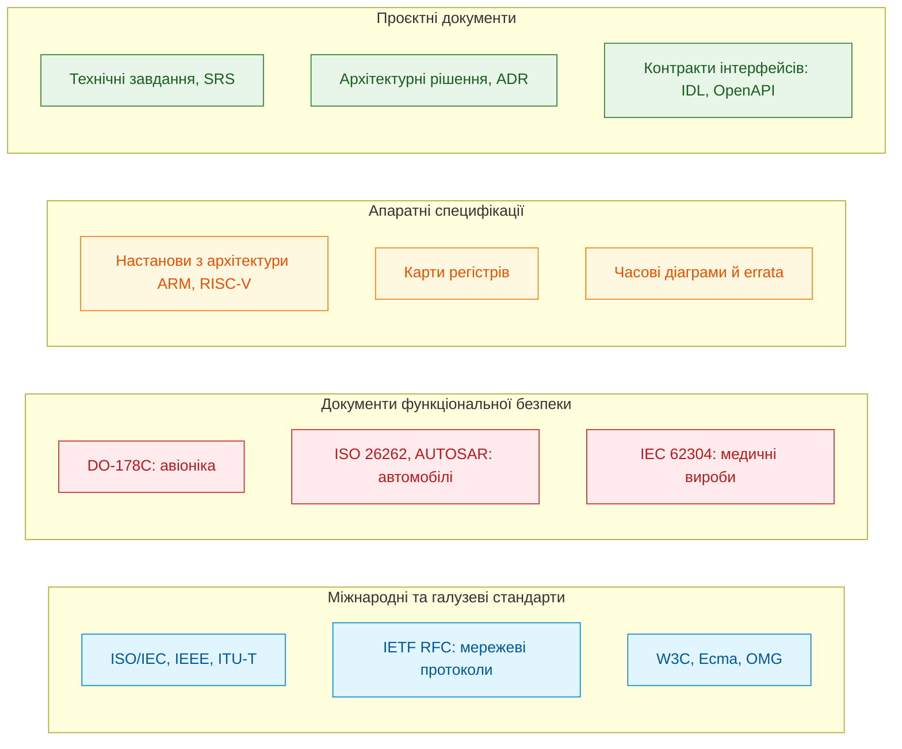
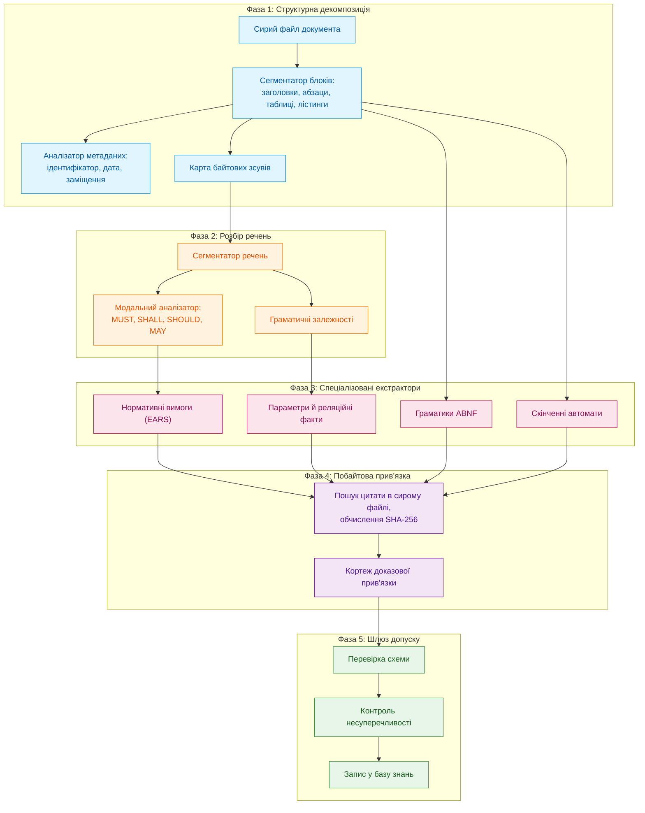
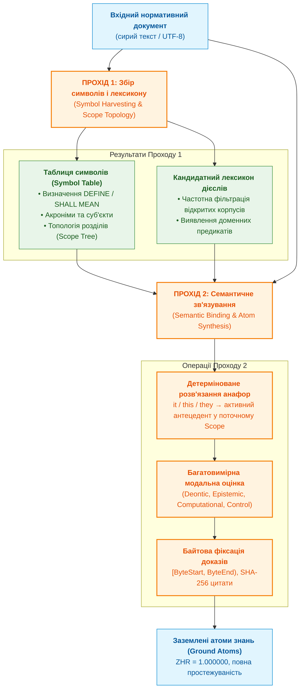
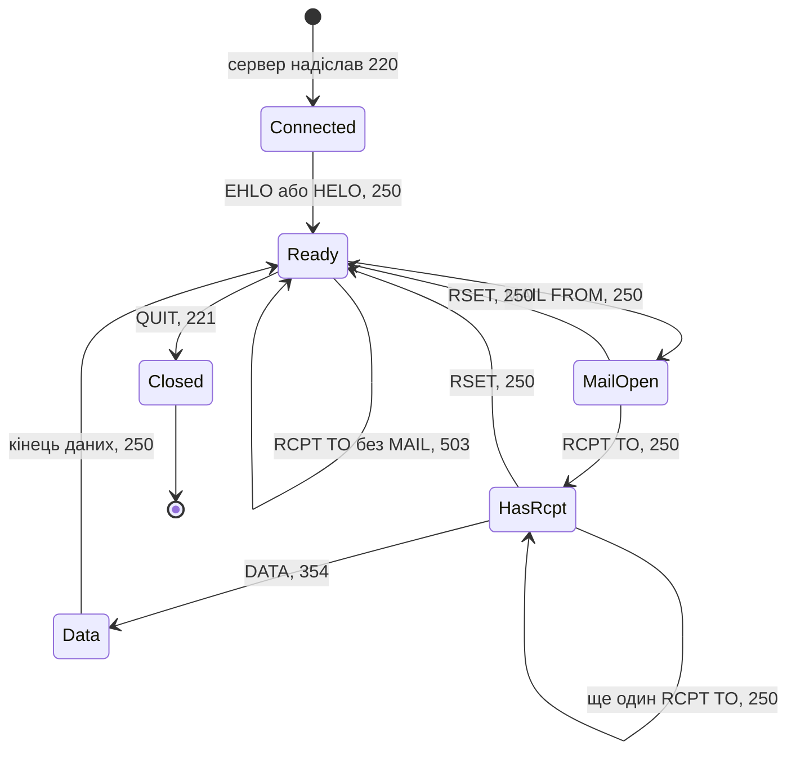
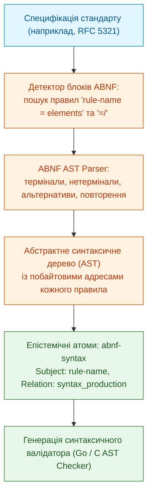
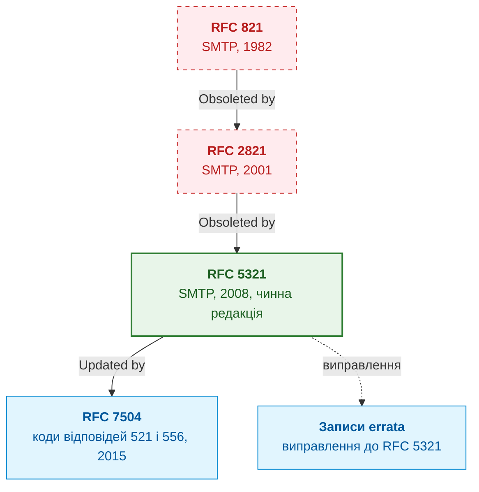
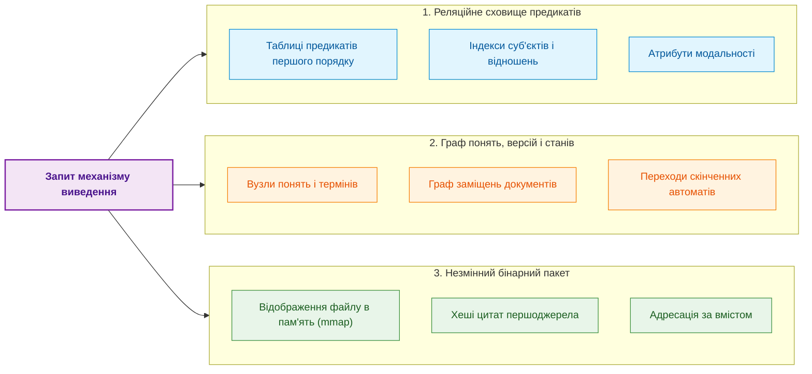
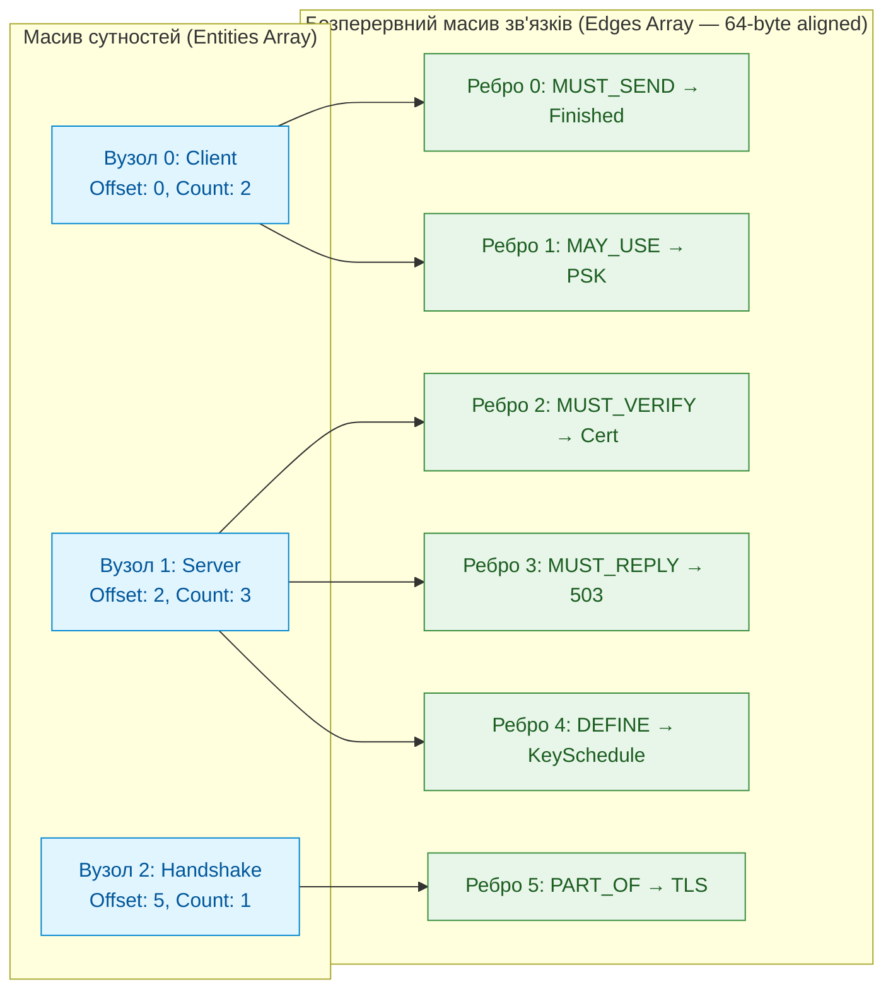
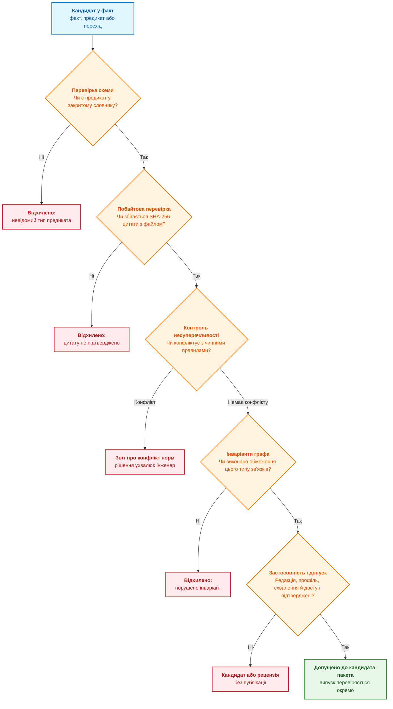
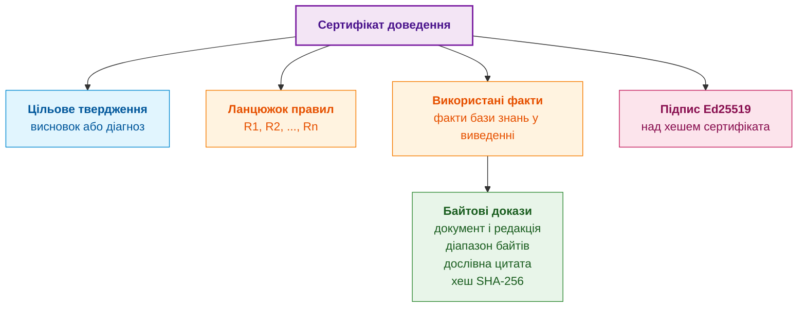

# Глава 15. Вилучення знань і побудова бази знань: факти, граматики та автомати

> **Книга:** [Архітектура доказових експертних систем](README.md) · [Частина III: Здобуття знань, мовний аналіз та оцінювання входу](part-03-knowledge-engineering-nlp.md)  
> **Попередня глава:** [Глава 14. Виявлення вимог і модальностей: від нормативного тексту до інваріантів](ch14-requirements-detection-and-formalization.md)  
> **Наступна глава:** [Глава 37. Оцінювання вхідної інформації: джерела, свідчення та невизначеність](ch37-input-information-assessment-and-algorithmic-skepticism.md)  
> **Зміст книги:** [README.md](README.md)  
> **Автор:** [Микола Федчик](about-the-author.md)  
> **Рівень:** середній і поглиблений: інженери знань, системні архітектори, розробники експертних систем  
> **Очікувані результати:** розкладати інженерний документ на структурні одиниці та метадані версії; прив'язувати кожен вилучений факт до байтового діапазону першоджерела й перевіряти цю прив'язку програмно; вилучати з тексту параметри, нормативні вимоги, граматики та скінченні автомати; враховувати заміщення, оновлення й виправлення документів; будувати цикл редагування й перевірки онтології через Protégé та ROBOT; пояснювати, які перевірки виконує шлюз допуску і що саме доводить сертифікат доведення.

Інженер, який розробляє мережевий контролер, операційну систему реального часу чи модуль керування приводом, працює в межах сотень взаємопов'язаних документів: міжнародних стандартів, галузевих директив, технічних умов замовника й технічних описів мікросхем. Знання, зафіксоване в цих документах, для організації не менш цінне за вихідний код, але користуватися ним заважають три обставини:

1. **Обсяг і розпорошеність.** Десятки тисяч сторінок тексту, таблиць і схем розподілено між стандартами, директивами, технічними умовами й технічними описами мікросхем (*datasheets*).
2. **Різнорідність форматів.** Поруч існують машиночитні схеми, текстові специфікації з формальними граматиками та скановані PDF-документи з розмитим форматуванням.
3. **Еволюція документів.** Стандарти оновлюються, нові редакції скасовують попередні (*obsoletion*), окремі документи виправляють помилки (*errata*) або додають розширення (*extensions*), тому одна й та сама норма в різні роки може звучати по-різному.

Поширена сьогодні відповідь на ці труднощі полягає у зв'язці «пошук фрагментів плюс генерація тексту» (*Retrieval-Augmented Generation*, RAG): механізм пошуку знаходить фрагменти, схожі на запитання, а велика мовна модель (*Large Language Model*, LLM) складає з них відповідь [[1]](#src-1). Для інженерних корпусів цього недостатньо. Пошук за схожістю відповідає на запитання «які фрагменти схожі на запит», а інженерові потрібна відповідь на інше запитання: «яка норма чинна, з якого місця документа вона взята і що з неї випливає». Схожість тексту не кодує відношень на кшталт «документ B скасовує розділ 3 документа A» чи «команда Y має передувати команді X», а згенерована відповідь не містить доведення, яке можна перевірити без довіри до моделі.

Експертна система підходить до корпусу інакше: вона розглядає технічну документацію як нескомпільований вихідний код знання, так само як [Глава 14](ch14-requirements-detection-and-formalization.md) розглядала окремі вимоги. Ця глава відповідає на запитання: **як перетворити текст специфікацій на базу знань, у якій кожен запис можна перевірити до байта першоджерела?** Теза глави така: **екстракція знань є компіляцією, а не переказом. Документ розбирають на структурні одиниці, кожен кандидат у факт прив'язують до байтового діапазону першоджерела, а до бази знань його пропускає лише детермінований шлюз допуску. Мовна модель у такому конвеєрі може пропонувати кандидатів, але не вирішує, що стає знанням.**

Глава рухається від типів джерел до конвеєра екстракції, далі розглядає вилучення скінченних автоматів, облік версій документів, сховище бази знань, шлюз допуску та сертифікат доведення. Наскрізним прикладом слугує протокол передавання електронної пошти SMTP (*Simple Mail Transfer Protocol*) у редакції RFC 5321 [[2]](#src-2). Цей документ відкритий, містить формальну граматику, правила порядку команд і має довгу історію редакцій, тому на ньому видно всі етапи конвеєра.

## Джерела інженерних знань: чотири класи документів

Перш ніж проєктувати екстрактор, треба знати, з якими артефактами він працюватиме. Єдиного формату інженерного знання не існує: документи відрізняються ступенем формалізації, суворістю формулювань і призначенням. Діаграма групує їх у чотири класи.



Діаграма показує не ієрархію важливості, а різні форми, у яких знання надходить до експертної системи. Кожен клас потребує власного способу вилучення.

**Міжнародні та галузеві стандарти** описують правила взаємодії компонентів і протоколів. Специфікації IETF (*Internet Engineering Task Force*) серії RFC (*Request for Comments*) є класичним прикладом: поруч із природною мовою вони містять формальні граматики в нотації ABNF (*Augmented Backus-Naur Form*), визначеній у RFC 5234 [[3]](#src-3). Зі стандарту такого типу експертна система вилучає дві форми знання: нормативні речення й граматику, яку можна скомпілювати в синтаксичний аналізатор.

**Документи функціональної безпеки** визначають не лише поведінку виробу, а й життєвий цикл його розроблення та перевірки. DO-178C для бортового програмного забезпечення авіації вимагає простежуваності від вимог до коду й тестів та аналізу структурного покриття [[4]](#src-4). ISO 26262 вводить для автомобільної електроніки рівні цілісності безпеки ASIL (*Automotive Safety Integrity Level*) від A до D [[5]](#src-5). IEC 62304 регламентує процеси життєвого циклу програмного забезпечення медичних виробів [[6]](#src-6). Знання з цих документів має форму обов'язків щодо артефактів процесу: які зв'язки простежуваності мають існувати, які докази покриття треба зібрати, хто й коли затверджує зміни.

**Апаратні специфікації** містять знання іншого типу. Настанови з архітектури процесорів (*Architecture Reference Manuals*), технічні описи контролерів і переліки відомих помилок кристала (*Errata Sheets*) подають знання у вигляді карт регістрів із бітовими полями й режимами доступу, часових діаграм, граничних електричних параметрів і обхідних рішень (*workarounds*) для дефектів кристала. Запис із переліку помилок діє лише для певної ревізії кристала, тому факт без умови застосовності стає хибним для іншої ревізії.

**Проєктні документи** (технічні завдання, специфікації вимог до програмного забезпечення, записи архітектурних рішень) фіксують конкретні правила проєкту. Вони змінюються найчастіше й мають узгоджуватися з вищими за ієрархією стандартами, тому для них особливо важливий облік версій, якому присвячено окремий розділ нижче.

Отже, один екстрактор не впорається з усіма класами документів. Граматику розбирає синтаксичний аналізатор, нормативні речення класифікує модальний аналізатор із [Глави 14](ch14-requirements-detection-and-formalization.md), таблиці регістрів обробляє аналізатор таблиць, а порядок дій вилучає екстрактор автоматів. Проте всі екстрактори мають видавати результат в одному форматі: кандидат у факт разом з адресою в першоджерелі. Формат цієї адреси визначає наступний розділ.

## Інваріант доказовості: кожен факт має адресу в першоджерелі

Як відрізнити знання, вилучене з документа, від правдоподібної вигадки? Відповідь експертної системи має бути формальною: **жоден факт, предикат чи правило не потрапляє до бази знань без прямого зв'язку з незмінним першоджерелом**. Цей інваріант реалізує кортеж доказової прив'язки (*evidence grounding*):

```math
\mathcal{E} = \langle \mathrm{DocID}, \mathrm{ByteStart}, \mathrm{ByteEnd}, \mathrm{SectionPath}, H_{\mathrm{quote}} \rangle
```

- Кортеж адресації $\mathcal{E}$ об'єднує такі поля:
- $\mathrm{DocID}$ ідентифікує документ; надійний варіант є хешем SHA-256 усього файлу [[7]](#src-7), який зміниться після редагування файла;
- $\mathrm{ByteStart}$ і $\mathrm{ByteEnd}$ задають напіввідкритий діапазон байтів сирого файла з нумерацією від нуля;
- $\mathrm{SectionPath}$ задає шлях у дереві розділів, наприклад `3.3 Mail Transactions`;
- $H_{\mathrm{quote}}$ є хешем SHA-256 дослівної цитати, обчисленим для байтів між початком і кінцем діапазону;
- кутові дужки $\langle\cdot\rangle$ позначають упорядкований кортеж, а квадратні дужки в $[\mathrm{ByteStart},\mathrm{ByteEnd})$ означають, що початок включено, а кінець ні.

Для прикладу, діапазон від 10 до 20 охоплює 10 байтів, тобто індекси 10–19. Кортеж дає змогу відтворити адресу цитати, але не доводить правильності її тлумачення.

Будь-хто, хто має архівну копію документа, може прочитати вказані байти, обчислити хеш і порівняти його з $H_{\mathrm{quote}}$. Якщо файл першоджерела змінився хоча б на один байт у межах цитати, хеш не збігається, і механізм перевірки блокує факт. Так зникає категорія «фантомних знань»: тверджень, для яких неможливо показати місце в документі.

Межу інваріанта треба назвати одразу. Хеш доводить, що цитата існує і не змінилася, але не доводить, що екстрактор правильно витлумачив її зміст. Тлумачення перевіряють інші етапи: класифікація модальності, шлюз допуску й рецензія інженера. Наступний розділ показує, на якій фазі конвеєра виникає кожна складова кортежу.

## Конвеєр екстракції: від байтів до кандидатів у факти

Екстракція знань із технічного тексту не зводиться ні до пошуку за словами, ні до стислого переказу тексту нейромережею (*summarization*). Це багатостадійний детермінований процес, який перетворює потік байтів на типізовані факти, правила й графи поведінки. Діаграма показує п'ять фаз цього процесу.



Кожна фаза отримує результат попередньої і може відхилити кандидата, але остаточне рішення про допуск ухвалює лише фаза 5. Розгляньмо фази по черзі; фазу 5 описано в окремому розділі про шлюз допуску.

### Фаза 1. Структурна декомпозиція

Зміст речення залежить від місця, де воно стоїть. Те саме формулювання в нормативній частині стандарту встановлює обов'язок, в інформаційному додатку (*informative annex*) лише пояснює, а в розділі про мотивацію є історичною довідкою. Без структури документа екстрактор перетворить пояснення на обов'язкове правило.

На першій фазі конвеєр розпізнає каркас документа: дерево розділів, типи текстових блоків (звичайний текст, таблиця, лістинг коду, формальна граматика, діаграма в символах ASCII) і метадані: ідентифікатор, дату, статус чинності та зв'язки з іншими документами. Одночасно фаза 1 будує карту зсувів, тобто запам'ятовує для кожного блоку його байтовий діапазон у сирому файлі.

Заголовок RFC 5321 у текстовому форматі містить рядки `Obsoletes: 2821` і `Updates: 1123` [[2]](#src-2). Аналізатор метаданих перетворює їх на ребра графа версій без участі людини: RFC 5321 скасовує RFC 2821 і оновлює RFC 1123. Той самий файл містить на кожній сторінці колонтитул із прізвищем автора, категорією документа й номером сторінки, наприклад `Klensin ... Standards Track ... [Page 95]`. Фаза 1 позначає їх як службові блоки, щоб жоден екстрактор не сприйняв колонтитул як частину норми.

Результатом фази 1 є дерево документа, кожен вузол якого має тип, шлях і байтовий діапазон. Це дерево потрібне всім наступним фазам.

### Фази 2 і 3. Розбір речень і спеціалізовані екстрактори

Фаза 2 ділить текстові блоки на речення, визначає модальність кожного нормативного речення й будує граматичні залежності. Фаза 3 запускає паралельні екстрактори, кожен з яких шукає власний тип знання.

#### Параметри й реляційні факти

Технічні специфікації містять багато фіксованих параметрів: номери портів, розміри буферів, тайм-аути, бітові маски, температурні діапазони. Екстрактор реляційних фактів зводить такі твердження до атомарної структури:

```math
\mathrm{Fact} = \langle \mathrm{Subject}, \mathrm{Relation}, \mathrm{Value}, \mathrm{Unit}, \mathcal{E} \rangle
```

Запис факту:

- $\mathrm{Subject}$ є предметом твердження, а $\mathrm{Relation}$ задає відношення між предметом і значенням;
- $\mathrm{Value}$ є значенням, $\mathrm{Unit}$ задає його одиницю, а $\mathcal{E}$ містить адресу доказового фрагмента;
- кутові дужки позначають упорядкований кортеж, тож значення без одиниці чи адреси джерела не є повним записом у цьому форматі.

Наприклад, розділ 4.5.3.1.1 RFC 5321 містить речення *«The maximum total length of a user name or other local-part is 64 octets»* [[2]](#src-2). Екстрактор перетворює його на факт $\langle \text{local-part}, \mathrm{maxLength}, 64, \text{octet}, \mathcal{E} \rangle$, де $\mathcal{E}$ вказує на байти цього речення. Розділ 4.5.3.1.6 того самого документа задає інше обмеження: рядок тексту разом із символами кінця рядка не може перевищувати 1000 октетів. Обидва факти стають перевірюваними правилами, і експертна система може звірити з ними журнал поштового сервера.

#### Нормативні вимоги

Речення з нормативними словами (*MUST*, *SHALL*, *SHOULD*, *MAY* та їхні заперечення) екстрактор нормалізує за шаблонами EARS (*Easy Approach to Requirements Syntax*) [[8]](#src-8). Правила класифікації модальності залежать від конвенції документа-джерела, тому їх детально розібрано в [Главі 14](ch14-requirements-detection-and-formalization.md). Для цієї глави достатньо прикладу з розділу 3.3 RFC 5321. Речення *«If a RCPT command appears without a previous MAIL command, the server MUST return a 503 "Bad sequence of commands" response»* [[2]](#src-2) стає подієвою вимогою EARS: «Коли SMTP-сервер отримує команду RCPT без попередньої команди MAIL, SMTP-сервер повинен повернути код відповіді 503». Ця вимога ще знадобиться в розділі про скінченні автомати.

#### Формальні граматики

Багато стандартів описують синтаксис повідомлень формальною нотацією. Розділ 4.1.1.1 RFC 5321 задає синтаксис команд привітання так [[2]](#src-2):

<details>
<summary>Граматичне правило ABNF</summary>

```abnf
ehlo           = "EHLO" SP ( Domain / address-literal ) CRLF
helo           = "HELO" SP Domain CRLF
```

</details>


Екстрактор граматик знаходить такі блоки, компілює їх у синтаксичні дерева й перевіряє, що кожне правило визначене. Правила `SP` і `CRLF` належать до базових правил, визначених у додатку B RFC 5234 [[3]](#src-3), а `Domain` і `address-literal` визначено в інших розділах RFC 5321. Тому екстрактор має розв'язувати посилання між розділами й документами; невизначене правило є помилкою екстракції, а не приводом мовчки пропустити граматику. Скомпільована граматика стає валідатором у складі бази знань: команду `HELO` без доменного імені експертна система відхилить як синтаксично неправильну, не звертаючись до мовної моделі.

### Фаза 4. Побайтова прив'язка

Екстрактор чи мовна модель повертає цитату-кандидат одним рядком, а в сирому файлі та сама цитата розірвана перенесенням рядка й відступом. Пошук байт-у-байт такої цитати не знайде, хоча вона дослівно присутня в документі. Друга проблема протилежна: коротка цитата може траплятися в документі кілька разів, і тоді незрозуміло, яке з місць є доказом.

Розв'язок полягає в нормалізації з картою зсувів. Програма стискає кожну послідовність пробільних символів до одного пробілу, але для кожного байта нормалізованого тексту пам'ятає позицію в сирому файлі. Пошук виконується в нормалізованому тексті, а діапазон і хеш обчислюються за сирими байтами. Цитата приймається, лише якщо вона трапляється рівно один раз. Програма нижче реалізує цю перевірку мовою Go. Їй потрібен файл `rfc5321.txt`, завантажений з RFC Editor у той самий каталог; крім стандартної бібліотеки Go, програма нічого не потребує.

<details>
<summary>Приклад мовою Go: побайтова прив'язка цитати з нормалізацією й картою зсувів</summary>

```go
package main

import (
	"bytes"
	"crypto/sha256"
	"encoding/hex"
	"fmt"
    "os"
    "unicode/utf8"
)

// Evidence описує побайтову прив'язку цитати до сирого файлу першоджерела.
type Evidence struct {
	Start, End int    // зсуви в сирих байтах; End не входить до діапазону
	SHA256     string // хеш сирих байтів [Start, End)
}

// normalize стискає кожну послідовність пробільних символів до одного пробілу
// і запам'ятовує, з якого байта сирого файлу походить кожен байт результату.
func normalize(raw []byte) ([]byte, []int) {
	var out []byte
	var pos []int
	inSpace := false
	for i, b := range raw {
		switch b {
		case ' ', '\t', '\r', '\n', '\f':
			if !inSpace && len(out) > 0 {
				out = append(out, ' ')
				pos = append(pos, i)
			}
			inSpace = true
			continue
		}
		inSpace = false
		out = append(out, b)
		pos = append(pos, i)
	}
	return out, pos
}

// Ground приймає цитату-кандидат лише тоді, коли вона трапляється
// в нормалізованому тексті документа рівно один раз.
func Ground(raw []byte, quote string) (Evidence, error) {
    return GroundIn(raw, quote, 0, len(raw))
}

func GroundIn(raw []byte, quote string, regionStart, regionEnd int) (Evidence, error) {
    if regionStart < 0 || regionEnd > len(raw) || regionStart >= regionEnd {
        return Evidence{}, fmt.Errorf("некоректні межі ділянки джерела")
    }
    if !utf8.Valid(raw) || !utf8.ValidString(quote) || !utf8.Valid(raw[regionStart:regionEnd]) {
        return Evidence{}, fmt.Errorf("некоректний UTF-8 або розріз усередині символу")
    }
    norm, pos := normalize(raw[regionStart:regionEnd])
	q, _ := normalize([]byte(quote))
	q = bytes.TrimSpace(q)
	if len(q) == 0 {
		return Evidence{}, fmt.Errorf("порожня цитата")
	}
	first := bytes.Index(norm, q)
	if first < 0 {
		return Evidence{}, fmt.Errorf("цитату не знайдено дослівно")
	}
	if bytes.Contains(norm[first+1:], q) {
		return Evidence{}, fmt.Errorf("цитата неоднозначна: кілька входжень")
	}
    start := regionStart + pos[first]
    end := regionStart + pos[first+len(q)-1] + 1
	sum := sha256.Sum256(raw[start:end])
	return Evidence{Start: start, End: end, SHA256: hex.EncodeToString(sum[:])}, nil
}

func main() {
	raw, err := os.ReadFile("rfc5321.txt")
	if err != nil {
		fmt.Println("помилка читання:", err)
		os.Exit(1)
	}
	doc := sha256.Sum256(raw)
	fmt.Printf("DocID: sha256:%x...\n", doc[:8])

	candidates := []string{
		// Дослівна цитата з розділу 3.3; у файлі її розриває перенесення рядка.
		`If a RCPT command appears without a previous MAIL command, the server MUST return a 503 "Bad sequence of commands" response.`,
		// Парафраз тієї самої норми: зміст схожий, але таких байтів у файлі немає.
		`If RCPT is sent before MAIL, the server MUST answer 503.`,
		// Надто коротка цитата: у документі вона трапляється кілька разів.
		`503 Bad sequence of commands`,
	}
	for _, c := range candidates {
		ev, err := Ground(raw, c)
		if err != nil {
			fmt.Println("ВІДХИЛЕНО:", err)
			continue
		}
		fmt.Printf("ПРИЙНЯТО: байти [%d, %d), sha256:%s...\n", ev.Start, ev.End, ev.SHA256[:16])
	}
}
```

Тест `ground_test.go` виконується через `go test -v main.go ground_test.go` і не потребує зовнішнього корпусу:

```go
package main

import (
    "crypto/sha256"
    "encoding/hex"
    "testing"
)

func TestGroundingRegionsAndEncoding(testCase *testing.T) {
    raw := []byte("first: limit 100 ms\nsecond: limit\n  100 ms")
    if _, err := Ground(raw, "limit 100 ms"); err == nil {
        testCase.Fatal("ambiguous global quote accepted")
    }
    start := len("first: limit 100 ms\nsecond: ")
    evidence, err := GroundIn(raw, "limit 100 ms", start, len(raw))
    if err != nil || evidence.Start != start || evidence.End != len(raw) {
        testCase.Fatalf("incorrect source region: %+v %v", evidence, err)
    }
    checksum := sha256.Sum256(raw[evidence.Start:evidence.End])
    if evidence.SHA256 != hex.EncodeToString(checksum[:]) {
        testCase.Fatal("quote hash does not match original bytes")
    }
    if _, err := Ground(raw, "limit 90 ms"); err == nil {
        testCase.Fatal("changed parameter accepted")
    }
    for _, bounds := range [][2]int{{-1, 2}, {0, len(raw) + 1}, {3, 2}} {
        if _, err := GroundIn(raw, "limit", bounds[0], bounds[1]); err == nil {
            testCase.Fatal("invalid region accepted")
        }
    }
    if _, err := Ground([]byte{0xff, 'a'}, "a"); err == nil {
        testCase.Fatal("invalid UTF-8 accepted")
    }
    if _, err := GroundIn([]byte("ї"), "ї", 1, 2); err == nil {
        testCase.Fatal("region splits Unicode character")
    }
}
```

Архівний вивід автора для файла розміром 225 929 байтів:

```text
DocID: sha256:7d560eddff1b213c...
ПРИЙНЯТО: байти [52658, 52788), sha256:48f3063677f109b3...
ВІДХИЛЕНО: цитату не знайдено дослівно
ВІДХИЛЕНО: цитата неоднозначна: кілька входжень
```

</details>

Перша цитата прийнята: у файлі вона займає байти з 52 658 до 52 788 і містить перенесення рядка з відступом. Нормалізація знайшла цитату, а хеш обчислено за сирими байтами разом зі службовими символами, тому повторна перевірка від нормалізації не залежить: досить прочитати 130 байтів із вказаного діапазону. Друга цитата передає зміст тієї самої норми, але таких байтів у документі немає, тому програма відхиляє її як парафраз. Третя цитата дослівна, проте трапляється двічі, у двох переліках кодів відповідей (розділи 4.2.2 і 4.2.3), тому прийняти її без уточнення розділу неможливо.

Приклад нормалізує лише перелічені ASCII-пробіли. `GroundIn` дозволяє шукати в наперед установленій ділянці розділу й повертає глобальні координати; ділянку має визначити структурний аналізатор, не сама модель після невдалого пошуку. Повторна цитата в іншому розділі тоді не створює неоднозначності всередині погодженої ділянки. Тест також відхиляє неправильне кодування й розріз символу.

Для PDF-документа або скану потрібний незмінний текстовий артефакт із власним ідентифікатором і зв'язок до оригінального файла, сторінки та геометричних рамок. Байтовий діапазон у текстовому артефакті не є діапазоном символів усередині стиснутого PDF. Переноси слів, видалення колонтитулів і лігатури потребують карти перетворень, як пояснює [Глава 12](ch12-linguistic-analysis-and-local-models.md).

### Двопрохідний семантичний компілятор знань: від збору символів до зв'язування анафор

Однопрохідна лінійна екстракція, типова для простих парсерів і наївних RAG-конвеєрів, принципово непридатна для складних інженерних та наукових специфікацій. Причина полягає в природній анафорі та контекстній залежності мови стандартів: значна частина нормативних вимог починається займенниками або контекстно зумовленими дефініціями: *«It MUST verify the peer's certificate...»*, *«This parameter MUST NOT exceed 1024 octets»*, *«They SHOULD abort the handshake upon receiving...»*.

За однопрохідної обробки суб'єктом такого факту стає або займенник `it`, або узагальнений заповнювач `system`, що руйнує детерміновану типізацію та унеможливлює точне логічне виведення. Ба більше, технічні терміни, локальні акроніми та специфічні предметні дієслова визначаються в документі лише один раз (у розділі визначень або при першому введенні), а використовуються в десятках наступних розділів.

Розв'язанням є **двопрохідна модель компіляції знань (Two-Pass Ingestion Compiler)**, аналогічна класичній двоетапній компіляції вихідного коду (збір символів $\to$ генерація проміжного коду та зв'язування адрес):



#### Фаза 1 компілятора: Збір символів, топології та лексикону (Symbol Harvesting)

Під час першого проходу компілятор не продукує фінальних норм, а формує просторово-типізовану **Таблицю символів документа** ($\mathrm{SymbolTable}$):
1. **Витяг локальних дефініцій і глосаріїв:** компілятор детектує нормативні конструкції визначень (`DEFINE`, `SHALL MEAN`, `IS DEFINED AS`, `STANDS FOR`) і реєструє введені терміни, їхні синоніми та акроніми.
2. **Побудова топології областей видимості (Scope Topology):** кожен пункт, таблиця або розділ специфікації формує лексичний простір імен ($\mathrm{Scope}$). В межах цього простору фіксуються явно заявлені суб'єкти (актори: наприклад, `Client`, `Server`, `Controller`, `Receiver`).
3. **Автоматичне виявлення кандидатних дієслів (Candidate Verb Harvesting):** обмежувати семантичний розбір фіксованим списком слів небезпечно. Компілятор аналізує вхідний текст через морфологічні словники (такі як WordNet, VerbNet, СУМ-20 для української мови, науковий лексикон Academic Word List (AWL), а також термінологічний стандарт ISO/IEC/IEEE 24765). Дієслова, чия частота в документі перевищує емпіричний поріг, пропонуються шлюзу допуску як кандидати до багатовимірної онтології дій.

#### Фаза 2 компілятора: Семантичне зв'язування та розв'язання анафор (Semantic Binding)

Під час другого проходу здійснюється повнотекстовий синтактико-семантичний аналіз із використанням уже заповненої Таблиці символів:
- **Типізоване розв'язання анафор (Typed Anaphora Resolution):** коли граматичний парсер зустрічає займенник (`it`, `this`, `they`) у позиції підмета нормативного речення, компілятор звертається до активного $\mathrm{Scope}$. Займенник однозначно зв'язується з найближчим домінантним антецедентом відповідного граматичного числа та роду (наприклад, у контексті розділу *«Handshake Protocol: Client»* речення *«It MUST compute the Finished verify_data...»* однозначно транслюється у суб'єкт `Client`).
- **Незмінність доказового інваріанта:** нормалізація суб'єкта до канонічного ідентифікатора символу відбувається в семантичному шарі факту ($\mathrm{Subject} = \text{"Client"}$), тоді як кортеж прив'язки $\mathcal{E} = \langle \mathrm{DocID}, \mathrm{ByteStart}, \mathrm{ByteEnd}, \dots \rangle$ і хеш $H_{\mathrm{quote}}$ незмінно зберігають буквальний байтовий діапазон вихідного тексту першоджерела (з оригінальним словом *«It»*).
- **Матеріалізація заземлених атомів:** результат другого проходу — це множина валідованих тверджень, вільних від невизначених займенників, прив'язаних до точно адресованих символів онтології.

### Структурне розбиття для пошуку

Крім екстракції, експертній системі потрібен пошук: щоб знайти кандидатні фрагменти для екстрактора або для відповіді на запитання інженера. Поширений прийом, розбиття тексту на фрагменти фіксованої довжини (наприклад, по 500 токенів), руйнує нормативну структуру: межа фрагмента може пройти посередині пункту, і тоді умова й наслідок норми опиняться в різних фрагментах.

Структурне розбиття використовує дерево з фази 1. Фрагментом стає структурна одиниця: розділ, пункт або підпункт. Кожен фрагмент отримує повний шлях від кореня документа (*breadcrumbs*). Підпункт «має спрацьовувати за 15 мс» без контексту нічого не означає, а зі шляхом «Вимоги до гальмівної системи → Аварійне гальмування → пункт 4.2» стає зрозумілим і для механізму пошуку, і для людини.

Сам пошук краще будувати гібридним. Лексичний пошук BM25 добре знаходить точні збіги: номери розділів, коди відповідей, назви команд [[9]](#src-9). Векторний пошук знаходить перефразовані запитання; для швидкого пошуку найближчих векторів застосовують графовий індекс HNSW (*Hierarchical Navigable Small World*) [[10]](#src-10), доступний, наприклад, у розширенні pgvector для PostgreSQL [[11]](#src-11). Два ранжовані списки об'єднують методом злиття обернених рангів RRF (*Reciprocal Rank Fusion*) [[12]](#src-12):

```math
\mathrm{RRF}(d) = \sum_{m \in \{\mathrm{BM25}, \mathrm{Dense}\}} \frac{1}{k + \mathrm{rank}_m(d)}.
```

- Для злиття списків $d$ є документом, $m$ є методом пошуку з множини $`\{\mathrm{BM25},\mathrm{Dense}\}`$, а $\mathrm{rank}_m(d)$ є позицією документа в його списку, починаючи з 1;
- $k$ є додатною константою згладжування, у першій роботі використано $k=60$;
- $\sum$ додає обернені ранги з обох списків, а $\mathrm{RRF}(d)$ є сумарним балом документа.

Формула винагороджує документи, які обидва методи ставлять високо, і не потребує узгодження шкал оцінок різних методів. Бал придатний для порівняння в межах заданого пошуку, але не є ймовірністю правильності.

Вибір моделі векторних представлень (*embeddings*) теж потребує перевірки на власних даних. Автори порівняльного набору MTEB (*Massive Text Embedding Benchmark*) показали, що жоден метод векторних представлень не переважає на всіх типах задач [[13]](#src-13). Тому загальний рейтинг не гарантує якості на вузькодоменному україномовному корпусі нормативів; модель обирають за результатами на наборі запитань із заздалегідь відомими правильними фрагментами.

Пошук лише пропонує кандидатів. Він не вирішує, чи норма чинна і чи застосовна до випадку: ці рішення ухвалюють граф версій і механізм виведення. Конвеєр, описаний у цьому розділі, видає кандидатів у факти з адресами в першоджерелі. Проте статичні факти не описують порядку дій, а значна частина інженерних норм стосується саме порядку. Наступний розділ показує, як вилучати поведінку.

## Динаміка: вилучення скінченних автоматів

Протоколи зв'язку, драйвери периферійних пристроїв, алгоритми керування живленням і захисні блокування працюють як дискретні автомати: вони мають стан, реагують на події й переходять у нові стани. Якщо експертна система не вилучить автоматну логіку зі специфікації, вона не зможе ні діагностувати порушення послідовності дій, ні згенерувати коректний сценарій роботи.

### Математична модель

Скінченний автомат формально визначають п'ятіркою [[14]](#src-14):

```math
\mathcal{M} = \langle S, \Sigma, \delta, s_0, F \rangle
```

- П'ятірка автомата $\mathcal{M}$ має такі складники:
- $S$: скінченна множина станів;
- $\Sigma$: вхідний алфавіт подій або команд;
- $`\delta: S \times \Sigma \to S \cup \{\bot\}`$: функція переходів, де значення $\bot$ означає, що перехід заборонено;
- $s_0 \in S$: початковий стан;
- $F \subseteq S$: множина кінцевих станів.

Класичне визначення детермінованого автомата задає повну функцію переходів. Для протоколів зручніша часткова функція з явним значенням $\bot$, бо саме заборонені переходи несуть найціннішу діагностичну інформацію. Протокольні автомати, крім того, видають на кожен перехід код відповіді, тобто фактично є автоматами з виходом; у цій главі код відповіді записано як позначку переходу.

> [!WARNING] Діагностична сила забороненого переходу ($\bot$)
> В академічних курсах дискретної математики функцію переходів $\delta$ часто роблять повною, додаючи фіктивний стан помилки, або просто ігнорують невизначені переходи. Для експертних систем функціональної безпеки (ISO 26262, DO-178C) кожна пара $(s, e)$, для якої $\delta(s, e) = \bot$, є безцінною знахідкою. Саме множина заборонених переходів визначає простір потенційних атак, аномалій протоколу та фізичних збоїв апаратури. Автоматичний генератор тестів експертної системи бере ці переходи й транслює їх у негативні тестові сценарії (*fault-injection test suite*): надіслати команду `DATA` до узгодження `EHLO`, спробувати замкнути високовольтний контактор у стані попереднього заряджання або змінити ID пакета в шині CAN. Якщо контролер на стенді не відхилить таку команду чи не перейде в аварійний стан — збій фіксується ще до фізичного випуску виробу.

### Приклад: сеанс SMTP

Розділ 4.1.4 RFC 5321 починається реченням *«There are restrictions on the order in which these commands may be used»*, а розділ 3.3 описує поштову транзакцію [[2]](#src-2). З цих розділів екстрактор будує автомат, спрощену версію якого показано на діаграмі.



Діаграма читається так. Після з'єднання сервер надсилає привітання з кодом 220, і сеанс переходить у стан `Connected`. Команда `EHLO` або `HELO` ініціалізує сеанс (`Ready`). Команда `MAIL FROM` відкриває транзакцію (`MailOpen`), одна або кілька команд `RCPT TO` додають одержувачів (`HasRcpt`), а команда `DATA` з відповіддю 354 переводить сервер у приймання тексту листа. Рядок, що складається з однієї крапки, завершує дані, і після відповіді 250 сеанс повертається в `Ready`. Команда `RSET` скасовує відкриту транзакцію. Петля на стані `Ready` показує заборонений перехід: команда `RCPT TO` без попередньої `MAIL FROM` отримує відповідь 503 і не змінює стану.

### Як автомат вилучається з тексту

Специфікації описують автомати у двох формах. Перша форма складається з явних таблиць переходів або діаграм із колонками «поточний стан», «команда», «наступний стан», «код відповіді»; такі таблиці аналізатор таблиць перекладає у функцію $\delta$ безпосередньо. Друга форма складається з речень про порядок дій, розкиданих по тексту. У RFC 5321 екстрактор знаходить чотири типи таких речень:

- **Передумова.** *«A session that will contain mail transactions MUST first be initialized by the use of the EHLO command»* (розділ 4.1.4): перехід `MAIL FROM` можливий лише зі стану, досяжного після `EHLO`.
- **Заборона в стані.** *«MAIL (or SEND, SOML, or SAML) MUST NOT be sent if a mail transaction is already open»* (розділ 4.1.4): у станах `MailOpen` і `HasRcpt` клієнтові заборонено надсилати `MAIL FROM`.
- **Скидання.** *«This command specifies that the current mail transaction will be aborted»* (розділ 4.1.1.5 про `RSET`): з кожного стану транзакції існує перехід назад у `Ready`.
- **Реакція на порушення.** Речення про `RCPT` без `MAIL` з розділу 3.3, розглянуте вище, задає для забороненого переходу код відповіді 503.

Для кожного стану екстрактор обчислює множину допустимих команд

```math
\mathrm{ValidNext}(s) = \{ e \in \Sigma \mid \delta(s, e) \neq \bot \}
```

- Для перевірки переходів $s$ є поточним станом, $\Sigma$ є множиною вхідних подій або команд, а $e$ є окремою подією;
- $\delta(s,e)$ є результатом переходу, а $\bot$ означає, що перехід заборонено;
- $`\{e\in\Sigma\mid\ldots\}`$ задає множину елементів $e$ з умови після вертикальної риски, а $\neq$ означає «не дорівнює»;
- $\mathrm{ValidNext}(s)$ є множиною всіх подій, для яких перехід із $s$ визначений.

Наприклад, у стані `Ready` до множини входять лише команди з дозволеним переходом; заборонений перехід до $\bot$ не потрапляє до множини. Перевірка має сенс лише для повного й коректно вилученого автомата.

Екстрактор також зберігає для кожного переходу та кожної заборони кортеж доказової прив'язки до відповідного речення.

### Негативні тести з автомата

Автомат дає змогу автоматично будувати негативні тести на відповідність протоколу. Для кожного стану $s$ і кожної команди $e \notin \mathrm{ValidNext}(s)$ генерується тест: перевести сервер у стан $s$, надіслати $e$, перевірити відповідь. Очікуваний результат тесту визначає модальність речення-джерела, і тут видно, навіщо [Глава 14](ch14-requirements-detection-and-formalization.md) так ретельно розрізняє MUST і MAY. Таблиця показує три тести, побудовані з RFC 5321.

| Стан | Команда поза порядком | Норма RFC 5321 | Очікування тесту |
|---|---|---|---|
| `Ready` | `RCPT TO` | розділ 3.3: сервер MUST повернути 503 | рівно 503; інший код означає порушення обов'язкової вимоги |
| `Ready` або `MailOpen` без прийнятого `RCPT` | `DATA` | розділ 3.3: сервер MAY повернути 503 або 554 | 503 або 554 очікувані; інший код дає попередження, а не провал, бо норма має силу MAY |
| `MailOpen` або `HasRcpt` | `MAIL FROM` | розділ 4.1.4: клієнт MUST NOT надсилати | тест перевіряє клієнта: клієнт не повинен надіслати команду |

Таблиця показує, що автомат без модальності дав би неправильні тести. Якби екстрактор записав обидві норми розділу 3.3 як однаково обов'язкові, тест провалив би сервер, який законно відповідає на `DATA` іншим кодом помилки.

Повнота автомата обмежена повнотою тексту. Розділ 4.1.4 дозволяє команди NOOP, HELP, EXPN, VRFY і RSET *«at any time during a session»*. Якщо екстрактор не додасть для цих команд петлі в усіх станах, генератор тестів вважатиме їх порушенням порядку й видасть хибні результати. Тому автомат, вилучений з тексту, перевіряє інженер, а розбіжності між автоматом і реальними журналами сеансів стають кандидатами на уточнення.

### Чотири стратегії виявлення автоматних переходів (FSM Patterns)

На практиці інженерні специфікації описують автомати неоднорідно. Сучасний екстрактор поведінки реалізує чотири взаємодоповнюючі евристичні стратегії виявлення переходів $\delta(s, e) = s'$:

1. **Стратегія A (Явні прозові предикати):** Речення з прямим причинно-наслідковим дієсловом переходу:
   <details>
   <summary>Дані або результат прикладу</summary>

   ```text
   "Upon receiving {Event}, the entity transitions from {SourceState} to {TargetState}."
   "The system enters {TargetState} after completing {Event} while in {SourceState}."
   ```

   </details>

2. **Стратегія B (ASCII-діаграми та стрілкові графи):** Багато специфікацій IETF та апаратних даташитів малюють графи символами псевдографіки:
   <details>
   <summary>Дані або результат прикладу</summary>

   ```text
   CONNECTED --------[ EHLO / 250 ]--------> READY
   READY ------------[ MAIL / 250 ]--------> MAIL_OPEN
   ```

   </details>

   Парсер виділяє стрілкові маркери (`--->`, `==>`, `->`), витягує сутності ліворуч і праворуч як стани, а підпис над стрілкою трактує як кортеж `Event / Action`.
3. **Стратегія C (Пайп-таблиці станів):** Таблиці у форматі Markdown або plain-text із колонками `Current State | Trigger / Event | Next State | Output`:
   Табличний аналізатор безпосередньо заповнює матрицю переходів автомата.
4. **Стратегія D (Модальні тригери переходу):** Речення з імперативними вимогами модальності MUST:
   <details>
   <summary>Дані або результат прикладу</summary>

   ```text
   "In the {SourceState} state, the client MUST transition to {TargetState} upon {Event}."
   ```

   </details>


Мінімізація можлива лише після визначення семантики автомата. Для повного детермінованого автомата розпізнавання класичний алгоритм Хопкрофта зберігає прийняту мову [[14]](#src-14), але не довільні виходи, часові межі й нормативні анотації. Для протокольної моделі з виходами еквівалентність має враховувати також відповіді та умови переходів. Не можна зливати стани лише через схожі назви або форму діаграми. Відсутній у неповній моделі перехід не є доведено забороненим; перед негативними тестами потрібні межа повноти й перевірена норма.

---

## Формальні граматики: ABNF-екстракція та компіляція синтаксичних дерев

Мережеві протоколи, сервісні інтерфейси та файлові формати описують структуру своїх повідомлень формальними граматиками. У стандартах IETF серії RFC для цього слугує розширена форма Бекуса-Наура (**ABNF, Augmented BNF**), визначена стандартом RFC 5234 [[3]](#src-3).

Якщо експертна система не вилучає граматику, вона не може перевірити синтаксичну валідність команд, що надсилаються чи приймаються.



### Елементи вилученого правила ABNF:
- **Базове визначення (`=`):** `Reverse-path = Path / "<>"`
- **Інкрементна альтернатива (`=/`):** дозволяє розширювати правило в наступних документах або додатках без перезапису всього правила.
- **Діапазони та повторення:** `1*digit`, `[ CFWS ]`, `%d32-126`.

Екстрактор формує кандидат `abnf-syntax`; наведене подання ще не має перевірених координат і не допускається до пакета.

<details>
<summary>Кандидат граматичного правила без вигаданих координат</summary>

```json
{
  "id": "rfc5321:abnf:Reverse-path",
  "subject": "Reverse-path",
  "relation": "syntax_production",
  "value": "Path / \"<>\"",
  "source": "rfc5321",
    "source_span": null,
    "status": "candidate"
}
```

</details>

Прив'язка має встановити фрагмент правила, його продовження й імпорти. Виявлення рядка `rule-name =` не замінює розбору всієї граматики та правил регістру її літералів.

---

## Параметри та структуровані фізичні величини: нормалізація одиниць СІ та розв'язання нерівностей

Інженерні документи містять числові параметри: час очікування, довжину повідомлення, температуру, напругу й частоту. Частку кількісних вимог потрібно виміряти на конкретному корпусі; універсального відсотка глава не встановлює.

Якщо система трактує рядок `"тайм-аут становить 5 хвилин"` як неструктурований текст, вона не зможе відповісти на запитання: *«Чи порушує сервер вимогу, якщо він очікує відповіді 250 секунд?»*.

### Математична нормалізація структурованих параметрів

Екстрактор параметрів перетворює природні описи у типізований атом **`structured-quantity`**:

```math
\mathcal{Q} = \langle \text{Parameter}, \; \text{Operator}, \; \text{Value}_{\text{norm}}, \; \text{BaseUnit}, \; \text{RawQuote} \rangle.
```

Складники структурованої величини:

- $\mathcal{Q}$ є типізованим атомом нормалізованої кількісної вимоги;
- $\text{Parameter}$ є канонічною назвою інженерної або протокольної величини;
- $`\text{Operator} \in \{ =, \le, \ge, \lt, \gt, \in [a, b] \}`$ є оператором рівності, нерівності чи належності діапазону;
- $\text{Value}_{\text{norm}}$ є числовим нормалізованим значенням величини;
- $\text{BaseUnit}$ є канонічною одиницею вимірювання системи SI або галузевих стандартів (секунда $\text{s}$, байт $\text{B}$, герц $\text{Hz}$, вольт $\text{V}$);
- $\text{RawQuote}$ є точним підрядком вихідного тексту першоджерела.

| Вихідне формулювання в стандарті | Вилучений оператор | Нормалізоване значення | Канонічна одиниця |
|---|:---:|:---:|:---:|
| *"Server MUST wait at least 5 minutes"* | $\ge$ | `300.0` | `s` (секунда) |
| *"Maximum command length is 512 octets"* | $\le$ | `512` | `octet` (вісім бітів) |
| *"CAN bus bit rate shall not exceed 1 Mbps"* | $\le$ | `1000000` | `bit/s` (десятковий префікс M) |
| *"Operating temperature is at least -40 °C and at most +85 °C"* | $\in [-40, +85]$ | `[-40, 85]` | `°C` (градус Цельсія) |

Рядки таблиці є навчальними формулюваннями, не дослівними нормами одного стандарту. Нормалізація зберігає первісну одиницю, точне десяткове значення й оператор. Octet не замінюють на byte без установленої ширини байта; швидкість бітів не ототожнюють із швидкістю символів у бодах. Для температур потрібне афінне перетворення, а для неоднозначного «between» автор має підтвердити включення меж. Теорію й засоби перевірки одиниць описує [Глава 14](ch14-requirements-detection-and-formalization.md).

Завдяки нормалізації символьний рушій здатен автоматично розв'язувати системи нерівностей під час верифікації вимог: $250\ \text{s} < 300\ \text{s} \implies$ **Порушення мінімального тайм-ауту**.

---

## Деонтичні винятки та умови скасування (Defeaters)

Специфікації рідко містять безумовні правила. У реальних інженерних системах більшість обов'язкових норм супроводжуються умовами скасування або винятками.

Екстрактор деонтичних винятків шукає специфічні синтаксичні конструкції:
- `UNLESS` (*«крім випадків, коли...»*);
- `EXCEPT WHEN` (*«за винятком ситуації...»*);
- `PROVIDED THAT` (*«за умови, що...»*);
- `EXCLUSIVE OF` (*«виключаючи...»*).

Виняток потрібно відрізняти від передумови: `provided that` часто обмежує застосовність, а не скасовує вже застосовне правило. Область заперечення й охоплену дію перевіряють окремо. Приклад нижче є **синтетичною політикою сервісу**, не винятком із RFC 5321; для команд RCPT не слід вигадувати режим, що дозволяє обійти попередню MAIL.

<details>
<summary>Навчальний кандидат винятку з явним джерелом політики</summary>

```json
{
    "id": "example-policy:exc:latency",
    "subject": "response_latency",
  "relation": "exception_clause",
    "value": "Latency limit applies unless an approved exception covers this release and report",
    "defeater_condition": "approved_exception_matches_release_and_report",
    "source": "synthetic-project-policy",
    "source_span": "to_be_grounded",
    "status": "candidate"
}
```

</details>

Не встановлений стан винятку залишається невідомим. Спрацьовування допустиме лише за перевіреної застосовності й схвалення, а не за наявності слова `unless`. Координати джерела не заповнюють умовними числами; до прив'язки приклад не є допущеним знанням.

---

## Версії документів: заміщення, оновлення та виправлення

Жоден стандарт не існує окремо від своїх попередників і наступників. Нові редакції скасовують старі, оновлення змінюють окремі розділи, а записи про помилки виправляють дефекти тексту. Якщо фрагменти різних редакцій лежать в одному індексі без позначки версії, механізм пошуку поверне скасовану норму з тією самою впевненістю, що й чинну.



Історія SMTP добре ілюструє ці відношення. RFC 821, опублікований Джоном Постелом 1982 року [[15]](#src-15), скасовано RFC 2821 2001 року, який одночасно скасував RFC 974 і RFC 1869 [[16]](#src-16). RFC 2821 своєю чергою скасовано RFC 5321 [[2]](#src-2). RFC 7504 не замінює RFC 5321, а оновлює його, додаючи коди відповідей 521 і 556 [[17]](#src-17). До RFC 5321 також опубліковано записи про помилки з різними статусами: частину перевірено (*Verified*), а частину відкладено до наступного перегляду документа (*Held for Document Update*) [[18]](#src-18). Експертна система не може застосовувати їх однаково: перевірене виправлення уточнює, як читати норму, а відкладене лише фіксує зауваження до наступної редакції.

Граф версій розрізняє повне заміщення (*Obsoletes*), часткове оновлення (*Updates*) і виправлення (*Errata*). Позначення застарілості (*Deprecates*) є окремим предметним відношенням; його наслідки визначає конкретна норма, а не універсальна заборона використання. Нижче наведено обмежену навчальну політику статусу правила $P$ для редакції $V$: усі події вже перевірені на застосовність, а скасоване правило з тим самим ідентифікатором не вводиться повторно.

```math
\mathrm{Status}(P, V) = \begin{cases}
\mathrm{Obsolete}, & \text{якщо } \exists D \in \mathrm{Lineage}(V) : \mathrm{Revokes}(D, P) \\
\mathrm{Deprecated}, & \text{інакше, якщо } \exists D \in \mathrm{Lineage}(V) : \mathrm{Deprecates}(D, P) \\
\mathrm{Active}, & \text{інакше, якщо } \exists D \in \mathrm{Lineage}(V) : \mathrm{Defines}(D, P) \\
\mathrm{Unknown}, & \text{в інших випадках}
\end{cases}
```

- Для статусу $P$ є фактом або правилом, $V$ є цільовою редакцією, а $\mathrm{Lineage}(V)$ є множиною документів у її ланцюгу версій;
- $\mathrm{Revokes}(D,P)$ означає, що документ $D$ скасовує $P$, $\mathrm{Deprecates}(D,P)$ позначає його застарілим, а $\mathrm{Defines}(D,P)$ означає, що документ його визначає;
- $\mathrm{Obsolete}$, $\mathrm{Deprecated}$, $\mathrm{Active}$ і $\mathrm{Unknown}$ є можливими статусами;
- $\exists$ означає «існує», а умови після нього шукають відповідний документ $D$ у $\mathrm{Lineage}(V)$;
- конструкція cases вибирає перший істинний рядок згори вниз, отже скасування має пріоритет над застарілістю, а застарілість над активним визначенням.

За цієї політики скасування має пріоритет. Якщо предметна модель дозволяє повторне введення правила, наведена формула недостатня: потрібні впорядковані події визначення, заміни й скасування, межі області та пріоритети джерел. Непорівнянні конфліктні зміни потребують перегляду. $\mathrm{Unknown}$ не прирівнюється до активного стану й не компенсується збігом цитати.

Повторна прив'язка (*re-grounding*) створює кандидата відповідності між редакціями, не переносить чинності автоматично. Незмінне речення може опинитися в інформаційному додатку, отримати нову передумову в заголовку або інший виняток у сусідньому пункті. Після знаходження цитати перевіряють роль розділу, залежні визначення, модальність, область і зміни нормативного контексту. Лише схвалена відповідність дозволяє використовувати новий запис; стара редакція лишається історичною.

### Секційні патчі спадкоємності: точкова резолюція оновлень замість повторного перепарсингу

У реальній інженерній практиці нові стандарти надзвичайно рідко замінюють попередній 500-сторінковий документ повністю. Набагато частіше специфікація вводить точкові секційні дельти:
- *«Updates Section 4.2.1 of RFC XXX»*;
- *«Replaces Section 3.1: New State Transition Logic»*;
- *«Amends Paragraph 4 of ISO 26262-6 Clause 7»*.

Якщо експертна система при кожному точковому оновленні вимагатиме повного перепарсингу всього історичного корпусу, виникає загроза комбінаторного вибуху та регресії валідованих фактів.

Для інкрементальної обробки можна спроєктувати **обробник оновлень розділів**. Це архітектурна пропозиція, не готова універсальна реалізація. Кандидат `section-patch` має називати редакції, вузол дерева розділів, вид зміни й підставу. Наступний запис є синтетичним прикладом форми, не перевіреним тлумаченням RFC 7504.

<details>
<summary>Синтетичний кандидат оновлення розділу</summary>

```json
{
    "id": "example-update:patch:sec-4.2",
  "subject": "rfc5321:section:4.2",
  "relation": "section_patch",
  "target_document": "rfc5321",
  "target_section": "4.2",
  "patch_action": "amends",
  "patch_scope": "adds response codes 521 and 556",
    "source": "synthetic-section-update",
    "source_span": null,
    "status": "candidate"
}
```

</details>

Обробник знаходить вузли за структурним шляхом: префікс рядка `4.2` не має захопити розділ `4.20`. Потім обчислює залежності визначень, правил, автоматів і індексів. Тип `Updates` сам не означає простого додавання: оновлення може звузити дозвіл, змінити виняток або скасувати частину поведінки. Таку дельту класифікують і перевіряють до нового випуску. Для приймання інкрементальний результат порівнюють із повним повторним збиранням за тим самим маніфестом; відмінності потребують пояснення або блокують випуск.

Факти, автомати й граф версій треба зберігати так, щоб кожен тип запиту виконувався ефективно. Цьому присвячено наступний розділ.

## Сховище бази знань: три моделі для трьох типів запитів

Розгляньмо три типи запитів до бази знань. Перший тип фільтрує факти за суб'єктом, відношенням чи модальністю. Другий тип проходить транзитивні зв'язки: ланцюжок заміщень, простежуваність від вимоги до тесту, шлях в автоматі. Третій тип читає незмінний знімок бази під час виведення. Наведена архітектура поєднує три подання, але не вимагає трьох окремих технологій зберігання: реляційна база також може виконувати рекурсивні запити, а потребу в бінарному пакеті встановлює вимірювання навантаження.



**Реляційне сховище предикатів** зберігає факти першого порядку в таблицях з індексами за суб'єктом і відношенням. Воно обслуговує детерміновану фільтрацію на кшталт «усі обов'язкові вимоги до SMTP-сервера з розділу 3.3».

**Граф понять, версій і станів** зберігає онтологію термінів, граф заміщень і переходи автоматів. На графі природно виконуються транзитивні запити: «чи чинна ця норма в редакції $V$», «чи досяжний стан `Data` без команди `RCPT TO`».

**Незмінний бінарний пакет** є скомпільованим знімком бази знань для механізму виведення. Файл пакета відображається в адресний простір процесу викликом `mmap` [[19]](#src-19), тому механізм виведення читає записи без копіювання й повторного розбору. Ідентифікатором пакета слугує хеш його вмісту: будь-яка зміна знань створює новий пакет із новим ідентифікатором, а кожну відповідь можна зв'язати з точним знімком бази. Час доступу до запису визначає структура індексу всередині пакета, наприклад хеш-таблиця чи відсортований масив, а не сам механізм відображення.

Всі три моделі можна розмістити на одному вузлі. Коли база не вміщується на вузлі або вузли потребують різних профілів знань, її розбивають на шарди, тобто частини, які обслуговують окремі вузли. Ключем розбиття для бази, з якої виводять чинність норм, є родина документів, тобто множина редакцій, пов'язаних графом версій (множина $\mathrm{Lineage}(V)$ з розділу про версії документів), бо статус правила обчислюють за усіма документами родини. Якщо редакція зі скасуванням лежить у шарді, що мовчить, статус правила стане $\mathrm{Active}$ замість $\mathrm{Obsolete}$. Тому відповідь «відсутнє» або статус допускають лише тоді, коли відповіли всі потрібні шарди. Розбиття бази знань не слід плутати з розбиттям тексту для пошуку: структурне розбиття, описане вище, ділить текст на фрагменти тексту, а шардування розміщує на вузлах фрагменти бази знань. Визначення й правила розбиття наведено в [Главі 7](ch07-knowledge-base-typology.md), реалізацію з перевіркою розбиття в розділі 10 [Глави 32](ch32-high-performance-knowledge-packs-mmap-and-harvesting.md).

### Високопродуктивний граф знань у пам'яті (CSR / In-Memory Adjacency Array) проти зовнішніх графових СУБД

Традиційний підхід до побудови баз знань полягає у розгортанні зовнішніх мережевих графових СУБД (наприклад, Neo4j, Memgraph чи Amazon Neptune) та надсиланні до них декларативних запитів мовою Cypher або SPARQL. Для корпоративного вебпошуку або аналітики бізнес-зв'язків цей підхід є прийнятним, проте для **місійно-критичних експертних систем реального часу** та детермінованих віртуальних машин (таких як EVM) він виявляється фундаментально непридатним з низки технічних причин:

1. **Мережеві та IPC-накладні витрати:** запит через TCP-сокет або REST API додає затримку від 0.5 до 10 мілісекунд на кожен крок виведення. Якщо детерміноване доведення теореми потребує тисяч переходів графом зв'язків, загальний час відповіді деградує на порядки (до секунд замість мікросекунд).
2. **Паузи збирача сміття (Garbage Collection):** графові рушії на керованих платформах (Java JVM) створюють мільйони дрібних об'єктів для вузлів і ребер. Паузи GC спричиняють непередбачувані сплески затримок (*tail latency spikes*), що є неприпустимим в авіоніці, системах керування або високочастотних інженерних шлюзах.
3. **Витрати на серіалізацію/десеріалізацію:** перетворення внутрішнього двійкового представлення вузлів у рядки JSON/Cypher і назад споживає до 70% процесорного часу.
4. **Втрата побайтової доказовості (Break of Byte Custody):** зовнішня СКБД зберігає дані у власних динамічних форматах сторінок (B-Tree, Heap pages), де зв'язок із початковими байтами першоджерела стає непрямим вторинним атрибутом, розриваючи прямий ланцюг апаратної верифікації (регістровий доказ `%ebx`).

#### Архітектура нульового копіювання: Compressed Sparse Row (CSR) та In-Memory Adjacency Array

Замість важкої зовнішньої СУБД база знань компілюється у компактний двійковий статичний пакет знань (Knowledge Pack), який проєктується безпосередньо в оперативну пам'ять процесу через системний виклик `mmap(MAP_SHARED)`. Графова структура відношень подається за допомогою компактного формату **стисненого рядкового розрідженого масиву (Compressed Sparse Row, CSR)** або масиву суміжності:



Структура CSR організована трьома неперервними векторами пам'яті:
- $\mathrm{Entities}[\cdot]$: плоский масив структур фіксованого розміру (64 байти, вирівняні під рядок процесорного кешу L1/L2), що містить числовий ID поняття, тип і діапазон у масиві ребер: $(\mathrm{Offset}, \mathrm{Count})$;
- $\mathrm{Edges}[\cdot]$: суцільний масив цільових індексів сутностей і типів зв'язків (деонтична модальність, синтаксичне підпорядкування, каузальність);
- $\mathrm{EvidencePool}[\cdot]$: пул незмінних байтових хешів і координат першоджерел, на які посилаються ребра через 32-бітні зміщення.

Переваги такого подання над зовнішніми СУБД:
- **Нульове копіювання (Zero-Copy) і миттєвий старт:** процес монтує гігабайтну базу знань викликом `mmap` за частки мікросекунди; сторінки підвантажуються ядром ОС за потребою (*demand paging*);
- **Продуктивність понад $10^7$ переходів на секунду на ядро:** обхід суміжних ребер вузла $\mathrm{Edges}[\mathrm{Offset} \dots \mathrm{Offset}+\mathrm{Count}-1]$ є суто послідовним лінійним читанням пам'яті, що ідеально утилізує апаратний попередній вибір кешу (*hardware cache prefetcher*);
- **Детермінована локальність пам'яті:** відсутність фрагментації купи та відсутність динамічних вказівників (всі адреси є відносними зміщеннями в межах відображеного бінарного сегмента);
- **Абсолютна цілісність доказів:** кожен запис ребра безпосередньо містить або посилається на незмінні координати першоджерела, уможливлюючи побайтову верифікацію без запитів до сторонніх сервісів.

Три моделі мають генеруватися з одного джерела істини: множини прийнятих фактів із кортежами прив'язки. Якщо реляційне сховище й граф оновлюються незалежно, вони розійдуться, і експертна система почне давати різні відповіді на те саме запитання залежно від маршруту запиту. Архітектуру механізму виведення, який читає ці моделі, розглянуто в [Главі 16](ch16-expert-systems-architecture.md), а стек реалізації в [Главі 17](ch17-implementation-stack.md). Залишається визначити, хто вирішує, які кандидати потрапляють до цих моделей.

## Шлюз допуску: що потрапляє до бази знань

Конвеєр видає кандидатів, частина з яких хибна: екстрактор помилився з модальністю, модель запропонувала парафраз, новий факт суперечить чинному правилу. Шлюз допуску (*admission gate*) перевіряє кандидата за версійованою політикою. Автоматичні перевірки відтворювані, а предметне схвалення надходить як окремий підписаний запис рецензії. Успішні перевірки ще не публікують факт: доступ до факту змінює процедура випуску пакета.



Діаграма показує п'ять груп перевірок. Перевірка схеми встановлює типи й дозволені предикати; перевірка джерела відтворює прив'язку до незмінного артефакту. Контроль несуперечливості формує звіт для інженера, а не приховує суперечність між джерелами. Інваріанти графа залежать від відношення: порядок заміщення редакцій може вимагати ациклічності, тоді як автомат сеансу закономірно має цикли. Цикл підкласів також не обов'язково є логічною суперечністю. Транзитивний обхід циклічного графа з множиною відвіданих вузлів має визначений зміст; забороняти потрібно порушення конкретної схеми, а не всі цикли. Остання група перевіряє паспорт об'єкта знань із [Глави 10](ch10-knowledge-acquisition-systems.md): застосовність, схвалення, доступ і залежності. Невідомий результат перевірки не прирівнюється до успіху.

### Мовна модель пропонує, шлюз вирішує: GBNF-граматики та попперіанське самоспростування

Поєднати повноту мовних моделей зі строгістю детермінованих перевірок можна розподілом ролей. Традиційний наївний підхід полягає в тому, що мовна модель повертає довільний JSON, який потім намагаються розпарсити регулярними виразами. Проте такий шлях створює від 3% до 7% випадкового синтаксичного браку (незакриті лапки, пропущені коми, галюцинації назв полів).

Сучасна архітектура заземлення знань застосовує **граматично-скероване декодування (Grammar-Constrained Decoding / GBNF Logit-Masking)** безпосередньо в циклі генерації токенів:

$$P(w_t \mid w_{<t}) = \text{Softmax}\left( \frac{z_t + M(w_t, \text{State}_{G})}{\tau} \right)$$

де маска $M(w_t, \text{State}_G) = -\infty$ для будь-якого токена, який не відповідає формальній BNF-граматиці структури факту. Модель фізично не здатна згенерувати некоректний ключ або вийти за межі деонтичних модальностей (`MUST`, `SHOULD`, `MAY`, `MUST NOT`):

<details>
<summary>Формальна GBNF-граматика факту та структурований вивід</summary>

```bnf
root        ::= "{" ws "\"facts\":" ws "[" ws fact_list? ws "]" ws "}"
fact_list   ::= fact (ws "," ws fact)*
fact        ::= "{" ws
                "\"subject\":" ws string ws ","
                "\"modality\":" ws modality ws ","
                "\"predicate\":" ws string ws ","
                "\"defeater\":" ws (string | "null") ws ","
                "\"quantity\":" ws (quantity_spec | "null") ws ","
                "\"verbatim_quote\":" ws string ws
                "}"
modality    ::= "\"MUST\"" | "\"MUST NOT\"" | "\"SHOULD\"" | "\"SHOULD NOT\"" | "\"MAY\""
quantity_spec ::= "{" ws "\"value\":" ws number ws "," "\"unit\":" ws string ws "}"
string      ::= "\"" ([^"\\] | "\\" (["\\/bfnrt] | "u" [0-9a-fA-F]{4}))* "\""
number      ::= ("-"? [0-9]+ ("." [0-9]+)?)
ws          ::= [ \t\n\r]*
```

```json
{
  "subject": "SMTP server",
  "modality": "MUST",
  "predicate": "return 503 Bad sequence of commands response",
  "defeater": "RCPT command appears after previous MAIL command",
  "quantity": { "value": 503, "unit": "status_code" },
  "verbatim_quote": "If a RCPT command appears without a previous MAIL command, the server MUST return a 503 \"Bad sequence of commands\" response."
}
```

</details>

#### Двосторонній попперіанський гейт ($F^+$ проти $F^-$)
Дослівна перевірка підтверджує існування цитати в архівному артефакті, але не правильність тлумачення. Для запобігання надмірному узагальненню екстрактор разом із кандидатом $F^+$ генерує контрастний софізм або контрприклад $F^-$ (наприклад, симуляцію ігнорування умови або підміну обов'язку на дозвіл).

Шлюз допуску перевіряє обидва кандидати через детермінований рушій правил:
1. Позитивний факт $F^+$ зобов'язаний бути прийнятий із підтвердженням цитати (`ACCEPT`, побайтова кустодія `%ebx`);
2. Контрастний контрприклад $F^-$ зобов'язаний викликати детерміновану типізовану відмову (`REFUSAL`, Fail-Closed);
3. Якщо контрприклад не відхиляється — правило визнається логічно слабким (*under-constrained rule defect*) і відхиляється.

#### Теплові карти дефіциту знань (KDI Heatmaps)
Щоб гарантувати повноту набуття знань і уникнути «сліпих зон», конвеєр обчислює **Індекс щільності знань (Knowledge Density Index, KDI)** ковзним вікном уздовж документа. Області з високою концентрацією деонтичних дієслів, термінів та числових одиниць, із яких не витягнуто жодного підтвердженого факту, позначаються на тепловій карті як **Knowledge Deficits (Прогалини знань)** і автоматично спрямовуються на додатковий примусовий інджест.

### Безперервне поповнення бази знань

Для великих бібліотек нормативів, що налічують тисячі документів RFC, W3C чи ISO, конвеєр працює пакетно у фоновому режимі. Корпус сегментується за розділами, екстрактори працюють паралельно в пулі виконавців, і кожен кандидат проходить той самий шлюз допуску. Прийняті факти додаються до бази знань інкрементально, а кандидати з конфліктами потрапляють до звіту про суперечності. Обхідного шляху повз шлюз у такій схемі немає: пакетний режим змінює лише швидкість, а не правила допуску.

Кандидати отримали правила допуску, але змінюються не лише факти: інженер знань змінює також поняття й аксіоми, за якими факти інтерпретуються. Перед отриманням відповіді потрібно перевірити кандидат онтології як окремий артефакт.

## Практичний цикл онтології: Protégé й ROBOT

Додавання правильного факту до неправильної моделі може породити хибний висновок. Тому зміни онтології проходять власний цикл: запитання до компетентності, редагування, збирання, перевірка й допуск. Метод постановки запитань і перевірку понять за OntoClean пояснює [Глава 7](ch07-knowledge-base-typology.md). Тут потрібні інструменти, які перетворюють метод на повторювану процедуру.

Редактор **Protégé** дозволяє інженерові знань редагувати класи й аксіоми мовою вебонтологій OWL (*Web Ontology Language*), переглядати класифікацію й досліджувати пояснення логічних наслідків. **WebProtégé** надає браузерне середовище спільного редагування [[20]](#src-20). Редактор не встановлює, чи правильно витлумачено нормативне речення: походження аксіоми й предметне схвалення зберігають окремо від її логічної перевірки.

Інструмент **ROBOT** (*ROBOT is an OBO Tool*, де OBO означає *Open Biomedical Ontologies*) автоматизує роботу з онтологіями: створює аксіоми за табличними шаблонами, об'єднує модулі, запускає логічний рушій, виконує контрольні запити й порівнює аксіоми між версіями [[21]](#src-21). ROBOT походить із практики біомедичних онтологій; можливості інструмента можна застосовувати до інженерної моделі OWL, але предметні правила перевірки потрібно визначити для цієї моделі. Таблиця розподіляє відповідальність у циклі.

| Етап | Виконавець і інструмент | Артефакт для наступного етапу |
|---|---|---|
| Визначення зміни | інженер знань і предметний експерт | запитання, очікуваний результат, джерело й межі застосовності |
| Редагування моделі | інженер знань у Protégé або WebProtégé | авторські аксіоми й обґрунтування зміни |
| Збирання кандидата | ROBOT: шаблони й об'єднання модулів | кандидат онтології з зафіксованими імпортами |
| Логічна перевірка | ROBOT із явно обраним рушієм | звіт про несуперечність, нездійсненні класи й виведені аксіоми |
| Поведінкова перевірка | контрольні запити й порівняння очікуваних відповідей | результати позитивних і негативних випадків |
| Допуск і випуск | предметний експерт та процедура випуску | схвалена версія онтології, звіти й маніфест пакета знань |

Авторські аксіоми й виведені аксіоми не редагують як два незалежні джерела істини. Якщо модуль збирається з таблиці, правку повертають у таблицю; якщо модуль ведеться в Protégé, правку повертають в авторський модуль. Виведений файл є похідним артефактом. Для відтворення збирання фіксують коміт авторських аксіом і шаблонів, версії ROBOT і рушія, імпортовані онтології та результати перевірок. Завантаження змінного імпорту з мережі під час кожного збирання не забезпечує повторення того самого результату.

### Мінімальна перевірка запитання до компетентності

Повернімося до SMTP. Навчальне запитання «чи належить команда DATA до протокольних команд?» вимагає зберегти шлях між класами. Приклад нижче є авторським поданням класифікації команд, а не дослівною аксіомою RFC 5321. Дані й запит самодостатні; команди виконання потребують Java 11 або новішої та встановленого ROBOT у шляху пошуку програм. Версії інструментів потрібно зафіксувати перед запуском.

<details>
<summary>Навчальна онтологія, контрольний запит і команди PowerShell</summary>

Вхідний файл `candidate.ttl` містить авторські класи. Turtle є синтаксисом запису графа RDF (*Resource Description Framework*).

```turtle
@prefix ex: <https://example.org/protocol/> .
@prefix owl: <http://www.w3.org/2002/07/owl#> .
@prefix rdfs: <http://www.w3.org/2000/01/rdf-schema#> .

ex:ProtocolCommand a owl:Class .
ex:SMTPCommand a owl:Class ; rdfs:subClassOf ex:ProtocolCommand .
ex:DataCommand a owl:Class ; rdfs:subClassOf ex:SMTPCommand .
```

Запит `missing-command-path.rq` мовою SPARQL (*SPARQL Protocol and RDF Query Language*) повертає порушення очікування, а не успішну відповідь.

```sparql
PREFIX ex: <https://example.org/protocol/>
PREFIX rdfs: <http://www.w3.org/2000/01/rdf-schema#>
SELECT ?command WHERE {
    VALUES ?command { ex:DataCommand }
    FILTER NOT EXISTS {
        ?command rdfs:subClassOf+ ex:ProtocolCommand .
    }
}
```

ROBOT виконує логічну перевірку рушієм HermiT і перевірку запиту. Після ненульового коду завершення наступна команда не запускається.

```powershell
robot reason --reasoner hermit --input candidate.ttl --output reasoned.owl
if ($LASTEXITCODE -ne 0) { throw "Ontology reasoning failed" }
robot verify --input reasoned.owl --queries missing-command-path.rq --output-dir checks --fail-on-violation true
if ($LASTEXITCODE -ne 0) { throw "Competency check failed" }
```

</details>

Оператор `rdfs:subClassOf+` проходить один або більше зв'язків підкласу, тому контрольний запит не залежить від наявності окремої матеріалізованої трійки `DataCommand subClassOf ProtocolCommand`. Для наведених даних запит повертає нуль рядків. Якщо прибрати зв'язок `SMTPCommand subClassOf ProtocolCommand` з авторського файлу й повторити збирання, запит поверне один рядок із `DataCommand`, а команда `verify` завершиться з помилкою [[22]](#src-22). Отже, негативний випадок показує, що перевірка справді реагує на втрату потрібного шляху. Цей приклад перевіряє класифікацію, а не правильність поведінки сервера під час сеансу.

Команда `reason` відхиляє логічну суперечність або нездійсненні класи в межах можливостей обраного рушія. Команда `verify` виконує запити до наданого графа, а не довільне повне виведення. За документацією ROBOT, типовий результат `reason` матеріалізує аксіоми підкласів; інші потрібні наслідки слід явно налаштувати або перевіряти засобом, який підтримує відповідний режим виведення [[22]](#src-22). Нуль рядків одного запиту не доводить правильності всіх аксіом і не замінює перевірки походження.

Після перевірок онтологія ще має статус кандидата. Предметне схвалення й шлюз допуску не обходять через успішний запуск ROBOT; доступ до опублікованих знань змінюється лише процедурою випуску. Побудову незмінного пакета знань розглядає [Глава 32](ch32-high-performance-knowledge-packs-mmap-and-harvesting.md). Експертна система споживає опублікований пакет для відповідей і водночас може допомагати інженерові знань: застосовувати правила допуску, знаходити прогалини й пояснювати відмову. Наступний розділ показує, як зробити перевірюваною саму відповідь.

## Сертифікат доведення: відповідь, яку може перевірити програма

Відповідь експертної системи на запитання «чи порушив сервер протокол у цьому сеансі» має бути перевірюваною без довіри до самої експертної системи. Для цього відповідь супроводжується сертифікатом доведення (*proof certificate*), структуру якого показано на діаграмі.



Сертифікат містить цільове твердження, ланцюжок застосованих правил, факти, використані у виведенні, і для кожного факту байтові докази: документ і редакцію, діапазон, дослівну цитату та хеш. Увесь сертифікат підписано алгоритмом Ed25519 [[23]](#src-23). Незалежний валідатор перевіряє такий сертифікат у чотири кроки:

1. Перевіряє підпис над однозначним канонічним поданням сертифіката й довіру до ключа за політикою перевірки. Коректний підпис установлює зв'язок із ключем, але не самостійно встановлює особу, повноваження або відсутність компрометації ключа.
2. Для кожного факту відтворює цитату з адресованого хешем артефакту. Для PDF потрібні також незмінний текстовий шар, версія парсера та зв'язок із сторінкою оригіналу. Хеш підтверджує відповідність архівним байтам, а не нормативний статус цитати.
3. Перевіряє кожен крок за точною версією правила, підстановками змінних і визначеною семантикою. Самого списку ідентифікаторів правил недостатньо. Непідтримуване правило або відсутня передумова дає результат «не перевірено», а не «доведено».
4. Перевіряє редакцію, профіль застосовності й схвалення фактів за довіреним маніфестом та актуальною політикою відкликання. Знімок бази для історичного висновку не скасовує чинних заборон доступу або відкликань.

Вердикт «доведено в межах зазначеної формальної моделі» валідатор видає лише після всіх чотирьох кроків. Мовна модель не потрібна, але потрібні визначення правил, архівні артефакти, маніфест, довірені ключі та політика відкликання. Ці залежності можна включити до перевірюваного комплекту; без залежностей незалежне відтворення не забезпечене.

Межі сертифіката теж треба розуміти. Сертифікат доводить, що висновок випливає з прийнятих фактів за вказаними правилами, але не доводить, що самі правила правильні й повні. Перевірка правил є завданням верифікації бази знань, якій присвячено [Главу 23](ch23-knowledge-base-verification.md). Підпис підтверджує цілісність і походження сертифіката, а не істинність твердження.

## Що запозичити з аналізу даних і процесів

Вилучення нормативних правил і виявлення закономірностей у даних мають різні цілі. Нормативне правило визначає дозволену поведінку за прийнятим джерелом; закономірність описує частоту спостережень. Змішування цих статусів створює помилку навіть за правильного розбору тексту.

**Аналіз процесів за журналами подій (*process mining*)** допомагає знайти непокриті сценарії. Бібліотека PM4Py (*Process Mining for Python*) підтримує побудову моделей процесів і перевірку відповідності журналів моделі [[24]](#src-24). Для конвеєра знань корисне порівняння нормативного автомата з журналом нейтрального процесу, наприклад приймання файлу: отримання, перевірка, відхилення або збереження. Журнал, у якому жодного разу не було відхилення, не доводить, що відхилення заборонене. Знайдене розходження може бути порушенням реалізації, неповнотою журналу або помилкою нормативної моделі; інженер має розділити ці пояснення.

**Асоціативний аналіз** знаходить часті поєднання помилок парсера. Засоби `fpgrowth` і `association_rules` бібліотеки mlxtend дозволяють оцінювати частоту наборів ознак, умовну частоту й перевищення над незалежним очікуванням (*lift*) [[25]](#src-25). Якщо втрата заголовка таблиці часто супроводжується неправильною одиницею, результат підказує спільний тест структури й екстракції. Високий lift не доводить причину помилки й не створює нового нормативного правила. Пошук багатьох комбінацій потребує перевірки на відкладених родинах документів.

**Інкрементальні збирання** доцільно перевіряти як компілятор. Зміна абзацу має перевірити не лише факти цього абзацу, а й залежні правила, результати й подання; зміна заголовка або винятку може вплинути на незмінні цитати нижче. Еталоном є повне збирання з того самого корпусу, конфігурації й схвалень. Порівнюють семантичні записи й відповіді, а не час запуску або випадкові службові ідентифікатори.

Усі три напрями відокремлюють спостереження, кандидатні гіпотези й допущені знання, а негативні випадки перевіряють, що шлюз не пропускає кандидата без підстави. Після цих меж можна порівняти базу знань із типовим генеративним пошуком.

## Порівняння: база знань із доказами та пошук із генерацією

Таблиця підсумовує відмінності між двома підходами до інженерних корпусів.

| Характеристика | Експертна система з перевіреною базою знань | Пошук із генерацією (RAG і LLM) |
|---|---|---|
| **Природа результату** | Логічне виведення з прийнятих фактів і правил | Генерація тексту на основі знайдених фрагментів |
| **Прив'язка до джерела** | Байтовий діапазон і хеш цитати | Фрагмент, знайдений за схожістю; посилання може бути неточним |
| **Порядок дій і стани** | Явна модель переходів, якщо побудована й перевірена | У базовому варіанті порядок відтворюється з тексту; можливі зовнішні моделі станів |
| **Синтаксис** | Граматики ABNF, скомпільовані у валідатори | Можливе обмежене декодування; граматика не підтверджує зміст |
| **Версії документів** | Граф заміщень і повторна прив'язка фактів | Фрагменти різних редакцій можуть змішуватися в одному індексі |
| **Перевірка результату** | Сертифікат доведення, який перевіряє програма | Потрібен ручний аудит |
| **Реакція на брак знань** | Явна відмова, якщо політика й модель передбачають невідомі значення | Потребує окремої політики відмови та її перевірки |
| **Вартість** | Дорога побудова бази знань, дешеве повторне виведення | Дешевий старт, кожна відповідь потребує виклику моделі |

Таблиця порівнює явно перевірюване виведення з базовим генеративним пошуком, а не всі можливі реалізації RAG. Генеративний пошук також можна доповнити адресами джерел, фільтром редакцій, граматикою та зовнішнім перевірювачем. Відмінність визначає фактичний договір перевірки результату, а не назва технології. У конвеєрі цієї глави пошук і мовна модель пропонують кандидатів, а допуск і випуск залежать від окремих перевірок та схвалень.

## Висновки
Текст специфікацій перетворюється на перевірювану базу знань через компіляцію в п'ять фаз: структурну декомпозицію, розбір речень, спеціалізовані екстрактори, побайтову прив'язку й шлюз допуску. Кожен прийнятий факт має адресу в першоджерелі: документ, байтовий діапазон, шлях у дереві розділів і хеш цитати. Мовна модель у цьому процесі пропонує кандидатів, а рішення ухвалюють детерміновані перевірки.

Глава показала прив'язку цитат на RFC 5321 і межі навчального автомата SMTP. Порушення застосовної обов'язкової норми є підставою для негативного вердикту; невикористання дозволеної можливості MAY саме по собі не є порушенням чи попередженням. Повторна прив'язка між редакціями знаходить кандидатну відповідність цитат, але не переносить чинність факту без перевірки нового контексту. Додані синтетичні тести перевіряють неоднозначність цитати, вибір відомої області, хеш сирих байтів і межі UTF-8; повноту нормативної моделі ці тести не доводять.

Цикл Protégé й ROBOT відокремив авторські аксіоми від похідних файлів і логічну перевірку від предметного схвалення. Контрольний запит для класифікації команд показав, як запитання до компетентності стає перевіркою, яка виявляє втрату потрібного зв'язку до випуску онтології.

Межі підходу теж визначено. Побайтова перевірка доводить існування цитати, а не правильність її тлумачення; для тлумачення потрібні перевірки узгодженості й рецензія інженера. Автомат, вилучений з тексту, повний настільки, наскільки повний текст специфікації. PDF-документи потребують окремого незмінного текстового шару. Сертифікат доведення перевіряє виведення, а не правильність правил.

## Підсумки маршруту здобуття та формалізації

Глави 10–15 розглянули здобуття й формалізацію кандидатів у знання:

1. [Глава 10](ch10-knowledge-acquisition-systems.md) побудувала архітектуру систем здобуття знань (KAS): двочасову модель чинності фактів, паспорти об'єктів знань та реєстри відкликань.
2. [Глава 11](ch11-knowledge-elicitation-from-experts.md) описала дисципліновані протоколи вилучення неявного досвіду (SECI, CommonKADS, CDM) без змішування суб'єктивних оцінок з об'єктивними фактами.
3. [Глава 12](ch12-linguistic-analysis-and-local-models.md) поєднала лінгвістичний аналіз із локальними SLM, запровадивши побайтові карти зміщення (Source Maps) та інваріант збереження першоджерела.
4. [Глава 13](ch13-language-variability-vs-determinism.md) вирішила проблему мовної варіативності через семантичну компіляцію запитань у детерміновані структури та перевірку групами еквівалентності.
5. [Глава 14](ch14-requirements-detection-and-formalization.md) формалізувала нормативні модальності (RFC 2119 / ISO/IEC Directives), трансформуючи вимоги SHALL/MUST на перевірювані інженерні інваріанти.
6. [Глава 15](ch15-knowledge-extraction-and-kb-construction.md) замкнула конвеєр синтезом скінченних автоматів (FSM) та криптографічних сертифікатів доведення (Ed25519) із побайтовою доказовістю.

Разом шість глав забезпечили маршрут: **сирий норматив / експерт → лінгвістична нормалізація → формальна вимога → доказова база знань**.

## Подальший шлях пізнання

Після вилучення змісту потрібно оцінити якість підстав. Наступна в тематичному порядку [глава 37](ch37-input-information-assessment-and-algorithmic-skepticism.md) розрізняє надійність джерела, підтвердження твердження й залежність свідчень. Лише після цього маршрут переходить до застосування знань:

- **[Частина IV](part-04-architecture-and-inference.md)** розглядає архітектуру, перевірку підстав, застосування норм, пояснення та допуск дії. **[Частина VII](part-07-runtime-and-knowledge-exchange.md)** окремо розглядає технологічний стек, апаратуру й фізичний зворотний зв'язок.

## Запитання до читачів
1. Чому пошук за схожістю тексту не може самостійно визначити, яка з двох редакцій стандарту чинна?
2. З яких складових складається кортеж доказової прив'язки і що саме доводить збіг хеша цитати?
3. Чому програма з фази 4 відхиляє цитату «503 Bad sequence of commands», хоча вона дослівно присутня в RFC 5321? Що треба додати, щоб прийняти таку цитату?
4. Як скінченний автомат сеансу SMTP дає змогу генерувати негативні тести і чому очікування тесту залежить від модальності речення-джерела?
5. Що відбувається з фактом, вилученим з RFC 2821, коли до бази знань надходить RFC 5321?
6. Які чотири кроки виконує валідатор сертифіката доведення і чого сертифікат не доводить?
7. Чому виведені аксіоми не можна редагувати як друге джерело істини? Які версії й імпорти потрібно зафіксувати для повторення збирання?
8. Чим логічна перевірка `reason` відрізняється від контрольного запиту `verify`? Чому нуль рядків запиту не замінює предметного схвалення онтології?

## Словник
| Український термін | Англійський відповідник | Коротке пояснення |
|---|---|---|
| Екстракція знань | Knowledge extraction | Перетворення тексту документів на типізовані факти, правила й автомати з прив'язкою до джерела |
| База знань | Knowledge base | Сукупність прийнятих фактів і правил, з якою працює механізм виведення |
| Побайтова прив'язка до джерела | Evidence grounding | Зв'язок факту з точним діапазоном байтів у незмінному файлі першоджерела |
| Кортеж доказової прив'язки | Evidence tuple | Ідентифікатор документа, діапазон байтів, шлях у дереві розділів і хеш цитати |
| Карта зсувів | Offset map | Відповідність між позиціями нормалізованого тексту та байтами сирого файлу |
| Структурна декомпозиція | Structural decomposition | Розпізнавання розділів, типів блоків і метаданих документа |
| Інформаційний додаток | Informative annex | Частина стандарту, яка пояснює, але не встановлює обов'язків |
| Шлюз допуску | Admission gate | Детермінований набір перевірок, після якого кандидат стає фактом бази знань |
| Відмова в разі сумніву | Fail-closed | Принцип, за яким неперевірений кандидат відхиляється, а не приймається |
| Скінченний автомат | Finite-state machine | Модель зі скінченною множиною станів і переходами за подіями |
| Функція переходів | Transition function | Відображення пари «стан, подія» в наступний стан або заборону |
| Негативний тест | Negative test | Тест, що подає недопустиму послідовність і перевіряє реакцію |
| Граф версій | Document lineage | Граф заміщень, оновлень і виправлень між документами |
| Родина документів | Document family | Множина редакцій, пов'язаних графом версій; одиниця розміщення під час розбиття бази знань на шарди |
| Шард | Shard | Частина бази знань, яку обслуговує один вузол; визначення наведено в Главі 7 |
| Повторна прив'язка | Re-grounding | Пошук цитат старої редакції в новій для перенесення фактів |
| Записи про помилки | Errata | Офіційні виправлення окремих місць опублікованого документа |
| Структурне розбиття | Structural chunking | Поділ тексту для пошуку за структурними одиницями з повним шляхом |
| Злиття обернених рангів | Reciprocal rank fusion | Об'єднання ранжованих списків сумою обернених позицій |
| Векторне представлення | Embedding | Числовий вектор, що відображає зміст фрагмента тексту |
| Відображення файлу в пам'ять | Memory mapping | Доступ до файлу як до області пам'яті процесу без копіювання |
| Адресація за вмістом | Content addressing | Ідентифікація об'єкта хешем його вмісту |
| Сертифікат доведення | Proof certificate | Підписаний набір висновку, правил, фактів і байтових доказів |
| Авторські аксіоми | Asserted axioms | Аксіоми, явно записані в керованих джерелах онтології |
| Виведені аксіоми | Inferred axioms | Логічні наслідки авторських аксіом, отримані обраним рушієм |
| Аналіз процесів за подіями | Process mining | Побудова й перевірка моделей спостережуваних процесів за журналами |
| Асоціативний аналіз | Association rule mining | Пошук частих поєднань ознак, що не встановлює причинності або нормативного статусу |

## Абревіатури
| Скорочення | Розшифрування | Значення |
|---|---|---|
| ABNF | Augmented Backus-Naur Form | розширена форма Бекуса-Наура для опису синтаксису |
| ADR | Architecture Decision Record | запис архітектурного рішення |
| ASCII | American Standard Code for Information Interchange | семибітове кодування символів |
| ASIL | Automotive Safety Integrity Level | рівень цілісності безпеки в автомобільній електроніці |
| AUTOSAR | AUTomotive Open System ARchitecture | стандартизована архітектура програмного забезпечення автомобілів |
| AWL | Academic Word List | академічний лексичний список наукових термінів і предикатів |
| BM25 | Best Matching 25 | функція лексичного ранжування документів |
| CSR | Compressed Sparse Row | формат стисненого розрідженого рядкового масиву для графів |
| EARS | Easy Approach to Requirements Syntax | шаблони синтаксису вимог |
| FIPS | Federal Information Processing Standards | федеральні стандарти обробки інформації США |
| HNSW | Hierarchical Navigable Small World | графовий індекс для пошуку найближчих векторів |
| IDL | Interface Definition Language | мова опису інтерфейсів |
| IEC | International Electrotechnical Commission | Міжнародна електротехнічна комісія |
| IEEE | Institute of Electrical and Electronics Engineers | Інститут інженерів з електротехніки та електроніки |
| IETF | Internet Engineering Task Force | інженерна рада інтернету |
| ISO | International Organization for Standardization | Міжнародна організація зі стандартизації |
| ITU-T | International Telecommunication Union, Telecommunication Standardization Sector | сектор стандартизації телекомунікацій Міжнародного союзу електрозв'язку |
| JSON | JavaScript Object Notation | текстовий формат обміну даними |
| LLM | Large Language Model | велика мовна модель |
| MTEB | Massive Text Embedding Benchmark | порівняльний набір задач для векторних представлень тексту |
| OMG | Object Management Group | консорціум стандартів моделювання |
| OBO | Open Biomedical Ontologies | відкриті біомедичні онтології |
| OWL | Web Ontology Language | мова вебонтологій |
| PDF | Portable Document Format | формат документів |
| POSIX | Portable Operating System Interface | стандарт інтерфейсу операційних систем |
| PM4Py | Process Mining for Python | бібліотека аналізу процесів за журналами подій |
| RAG | Retrieval-Augmented Generation | генерація з доповненням знайденими фрагментами |
| RDF | Resource Description Framework | модель опису ресурсів графом трійок |
| RFC | Request for Comments | серія документів зі специфікаціями інтернету |
| ROBOT | ROBOT is an OBO Tool | інструмент автоматизації роботи з онтологіями |
| RRF | Reciprocal Rank Fusion | злиття обернених рангів |
| SHA-256 | Secure Hash Algorithm, 256 bits | криптографічна хеш-функція |
| SMTP | Simple Mail Transfer Protocol | протокол передавання електронної пошти |
| SPARQL | SPARQL Protocol and RDF Query Language | мова запитів до графів RDF |
| SRS | Software Requirements Specification | специфікація вимог до програмного забезпечення |
| W3C | World Wide Web Consortium | консорціум зі стандартів вебу |

## Джерела
1. <a id="src-1"></a>Patrick Lewis та ін. [*Retrieval-Augmented Generation for Knowledge-Intensive NLP Tasks*](https://arxiv.org/abs/2005.11401). *Advances in Neural Information Processing Systems 33 (NeurIPS 2020)*, 2020.
2. <a id="src-2"></a>J. Klensin. [*RFC 5321: Simple Mail Transfer Protocol*](https://www.rfc-editor.org/rfc/rfc5321). IETF, 2008.
3. <a id="src-3"></a>D. Crocker, P. Overell. [*RFC 5234: Augmented BNF for Syntax Specifications: ABNF*](https://www.rfc-editor.org/rfc/rfc5234). IETF, 2008.
4. <a id="src-4"></a>RTCA. [*DO-178C: Software Considerations in Airborne Systems and Equipment Certification*](https://www.rtca.org/do-178/). RTCA, 2011.
5. <a id="src-5"></a>ISO. [*ISO 26262-1:2018. Road vehicles: Functional safety: Part 1: Vocabulary*](https://www.iso.org/standard/68383.html). 2018.
6. <a id="src-6"></a>IEC. [*IEC 62304:2006+AMD1:2015. Medical device software: Software life cycle processes*](https://webstore.iec.ch/en/publication/22794). 2015.
7. <a id="src-7"></a>National Institute of Standards and Technology. [*FIPS PUB 180-4: Secure Hash Standard (SHS)*](https://doi.org/10.6028/NIST.FIPS.180-4). 2015.
8. <a id="src-8"></a>Alistair Mavin, Philip Wilkinson, Adrian Harwood, Mark Novak. [*Easy Approach to Requirements Syntax (EARS)*](https://doi.org/10.1109/RE.2009.9). *2009 17th IEEE International Requirements Engineering Conference*, 317–322, 2009.
9. <a id="src-9"></a>Stephen Robertson, Hugo Zaragoza. [*The Probabilistic Relevance Framework: BM25 and Beyond*](https://doi.org/10.1561/1500000019). *Foundations and Trends in Information Retrieval*, 2009.
10. <a id="src-10"></a>Yu. A. Malkov, D. A. Yashunin. [*Efficient and Robust Approximate Nearest Neighbor Search Using Hierarchical Navigable Small World Graphs*](https://doi.org/10.1109/TPAMI.2018.2889473). *IEEE Transactions on Pattern Analysis and Machine Intelligence*, 42(4), 824–836, 2020.
11. <a id="src-11"></a>pgvector. [*pgvector: Open-Source Vector Similarity Search for Postgres*](https://github.com/pgvector/pgvector). GitHub.
12. <a id="src-12"></a>Gordon V. Cormack, Charles L. A. Clarke, Stefan Buettcher. [*Reciprocal Rank Fusion Outperforms Condorcet and Individual Rank Learning Methods*](https://doi.org/10.1145/1571941.1572114). *Proceedings of the 32nd International ACM SIGIR Conference on Research and Development in Information Retrieval*, 758–759, 2009.
13. <a id="src-13"></a>Niklas Muennighoff, Nouamane Tazi, Loïc Magne, Nils Reimers. [*MTEB: Massive Text Embedding Benchmark*](https://doi.org/10.18653/v1/2023.eacl-main.148). *Proceedings of the 17th Conference of the European Chapter of the Association for Computational Linguistics*, 2014–2037, 2023.
14. <a id="src-14"></a>John E. Hopcroft, Rajeev Motwani, Jeffrey D. Ullman. [*Introduction to Automata Theory, Languages, and Computation*](https://openlibrary.org/works/OL21407442W). 3rd edition, Pearson Addison-Wesley, 2006.
15. <a id="src-15"></a>J. Postel. [*RFC 821: Simple Mail Transfer Protocol*](https://www.rfc-editor.org/rfc/rfc821). RFC Editor, 1982.
16. <a id="src-16"></a>J. Klensin. [*RFC 2821: Simple Mail Transfer Protocol*](https://www.rfc-editor.org/rfc/rfc2821). IETF, 2001.
17. <a id="src-17"></a>J. Klensin. [*RFC 7504: SMTP 521 and 556 Reply Codes*](https://www.rfc-editor.org/rfc/rfc7504). IETF, 2015.
18. <a id="src-18"></a>RFC Editor. [*Errata for RFC 5321*](https://www.rfc-editor.org/errata/rfc5321). Онлайн-реєстр виправлень.
19. <a id="src-19"></a>The Open Group. [*mmap: Map Pages of Memory*](https://pubs.opengroup.org/onlinepubs/9799919799/functions/mmap.html). *The Open Group Base Specifications Issue 8, IEEE Std 1003.1-2024*, 2024.
20. <a id="src-20"></a>Stanford University. [*Protégé: Ontology Editor*](https://protege.stanford.edu/). Офіційний сайт і опис Protégé Desktop та WebProtégé.
21. <a id="src-21"></a>Rebecca C. Jackson, James P. Balhoff, Eric Douglass, Nomi L. Harris, Christopher J. Mungall, James A. Overton. [*ROBOT: A Tool for Automating Ontology Workflows*](https://doi.org/10.1186/s12859-019-3002-3). *BMC Bioinformatics*, 20, стаття 407, 2019.
22. <a id="src-22"></a>Учасники проєкту ROBOT. [*Getting Started*](https://robot.obolibrary.org/), [*Template*](https://robot.obolibrary.org/template), [*Reason*](https://robot.obolibrary.org/reason), [*Verify*](https://robot.obolibrary.org/verify). Офіційна документація команд і передумов виконання.
23. <a id="src-23"></a>S. Josefsson, I. Liusvaara. [*RFC 8032: Edwards-Curve Digital Signature Algorithm (EdDSA)*](https://www.rfc-editor.org/rfc/rfc8032). IRTF, 2017.
24. <a id="src-24"></a>Alessandro Berti, Sebastiaan van Zelst, Daniel Schuster. [*PM4Py: A Process Mining Library for Python*](https://doi.org/10.1016/j.simpa.2023.100556). *Software Impacts*, 17, 100556, 2023. [Офіційний репозиторій і ліцензійні умови](https://github.com/process-intelligence-solutions/pm4py).
25. <a id="src-25"></a>Sebastian Raschka та учасники mlxtend. [*Association Rules: Metrics and Examples*](https://rasbt.github.io/mlxtend/user_guide/frequent_patterns/association_rules/). Документація метрик і генерації асоціативних правил.

---

[← Глава 14](ch14-requirements-detection-and-formalization.md) | [Зміст книги](README.md) | [Частина III](part-03-knowledge-engineering-nlp.md) | [Глава 37 →](ch37-input-information-assessment-and-algorithmic-skepticism.md)
