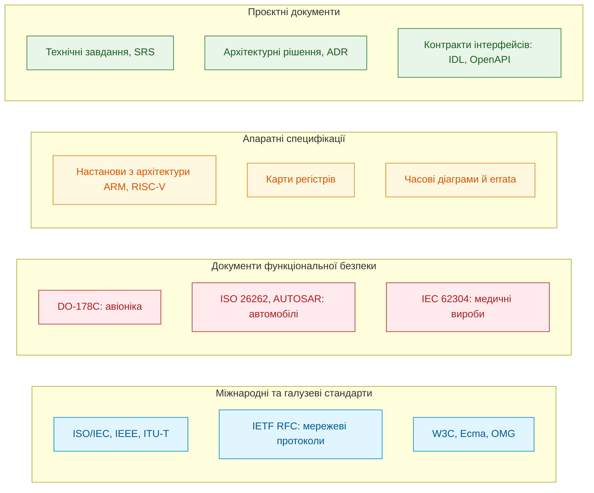
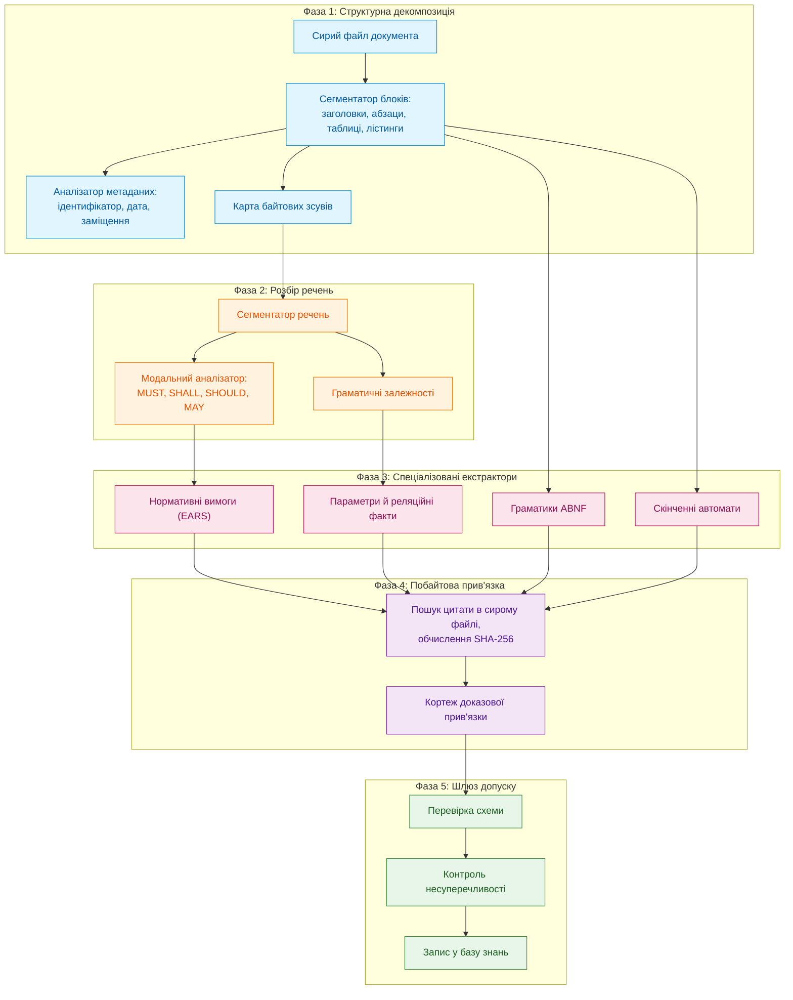
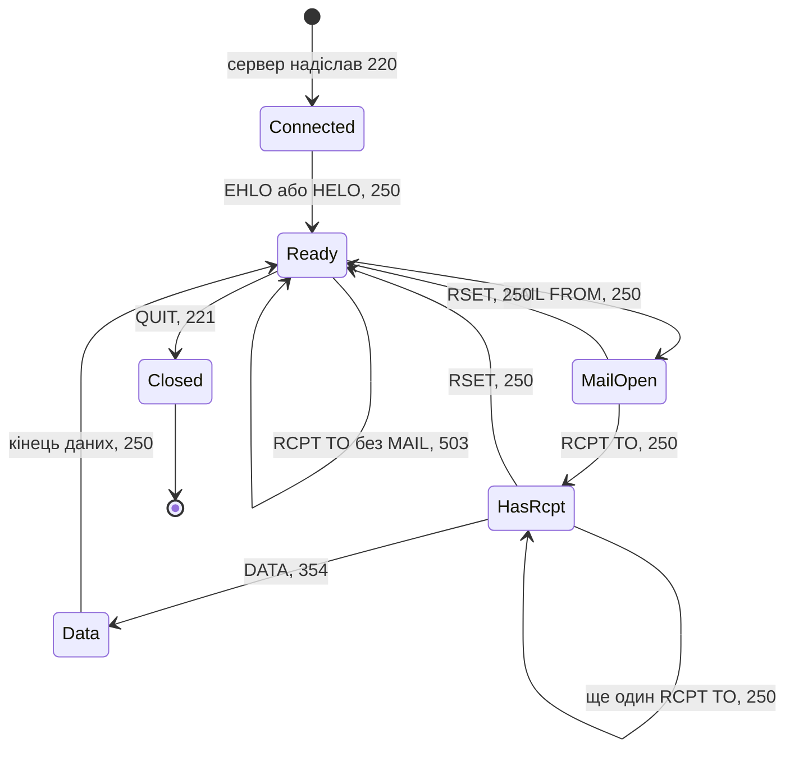
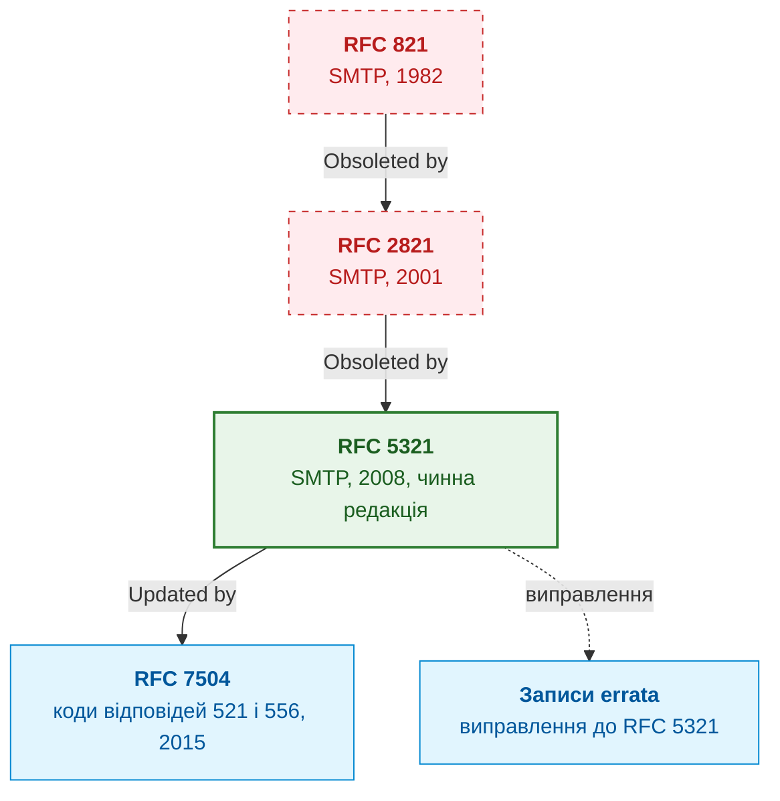
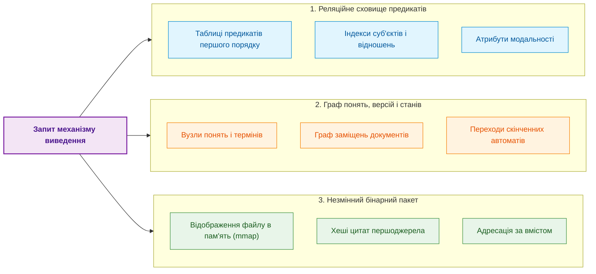
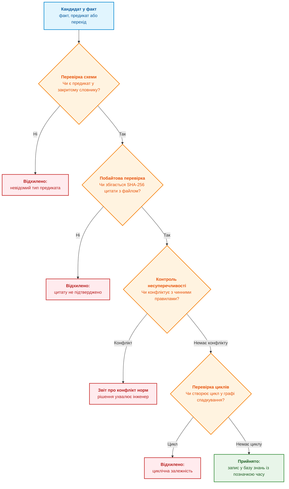
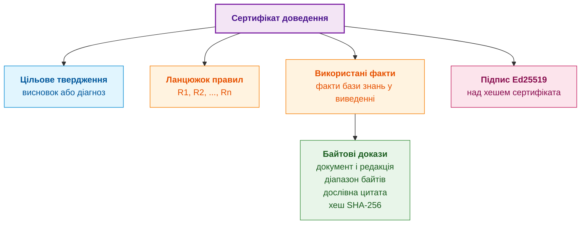

# Глава 15. Екстракція знань і побудова бази знань: від тексту специфікацій до онтологій

> **Книга:** [Архітектура доказових експертних систем](README.md) · [Частина III: Інженерія знань: здобуття, NLP та екстракція з нормативів](part-03-knowledge-engineering-nlp.md)  
> **Попередня глава:** [Глава 14. Детекція вимог та модальностей: від SHALL/MUST до формальних інваріантів](ch14-requirements-detection-and-formalization.md)  
> **Наступна глава:** [Глава 16. Архітектура експертної системи: від формального знання до доказового рішення](ch16-expert-systems-architecture.md)  
> **Наступна частина:** [Частина IV: Архітектура, виконання та механізми висновку](part-04-architecture-and-inference.md)  
> **Зміст книги:** [README.md](README.md)  
> **Автор:** [Микола Федчик](about-the-author.md)  
> **Рівень:** середній і поглиблений: інженери знань, системні архітектори, розробники експертних систем  
> **Очікувані результати:** розкладати інженерний документ на структурні одиниці та метадані версії; прив'язувати кожен вилучений факт до байтового діапазону першоджерела й перевіряти цю прив'язку програмно; вилучати з тексту параметри, нормативні вимоги, граматики та скінченні автомати; враховувати заміщення, оновлення й виправлення документів; пояснювати, які перевірки виконує шлюз допуску і що саме доводить сертифікат доведення.

Інженер, який розробляє мережевий контролер, операційну систему реального часу чи модуль керування приводом, працює в межах сотень взаємопов'язаних документів: міжнародних стандартів, галузевих директив, технічних умов замовника й технічних описів мікросхем. Знання, зафіксоване в цих документах, для організації не менш цінне за вихідний код, але користуватися ним заважають три обставини:

1. **Обсяг і розпорошеність.** Десятки тисяч сторінок тексту, таблиць і схем розподілено між стандартами, директивами, технічними умовами й технічними описами мікросхем (*datasheets*).
2. **Різнорідність форматів.** Поруч існують машиночитні схеми, текстові специфікації з формальними граматиками та скановані PDF-документи з розмитим форматуванням.
3. **Еволюція документів.** Стандарти оновлюються, нові редакції скасовують попередні (*obsoletion*), окремі документи виправляють помилки (*errata*) або додають розширення (*extensions*), тому одна й та сама норма в різні роки може звучати по-різному.

Поширена сьогодні відповідь на ці труднощі полягає у зв'язці «пошук фрагментів плюс генерація тексту» (*Retrieval-Augmented Generation*, RAG): механізм пошуку знаходить фрагменти, схожі на запитання, а велика мовна модель (*Large Language Model*, LLM) складає з них відповідь [[1]](#src-1). Для інженерних корпусів цього недостатньо. Пошук за схожістю відповідає на запитання «які фрагменти схожі на запит», а інженерові потрібна відповідь на інше запитання: «яка норма чинна, з якого місця документа вона взята і що з неї випливає». Схожість тексту не кодує відношень на кшталт «документ B скасовує розділ 3 документа A» чи «команда Y має передувати команді X», а згенерована відповідь не містить доведення, яке можна перевірити без довіри до моделі.

Експертна система підходить до корпусу інакше: вона розглядає технічну документацію як нескомпільований вихідний код знання, так само як [Глава 14](ch14-requirements-detection-and-formalization.md) розглядала окремі вимоги. Ця глава відповідає на запитання: **як перетворити текст специфікацій на базу знань, у якій кожен запис можна перевірити до байта першоджерела?** Теза глави така: **екстракція знань є компіляцією, а не переказом. Документ розбирають на структурні одиниці, кожен кандидат у факт прив'язують до байтового діапазону першоджерела, а до бази знань його пропускає лише детермінований шлюз допуску. Мовна модель у такому конвеєрі може пропонувати кандидатів, але не вирішує, що стає знанням.**

Глава рухається від типів джерел до конвеєра екстракції, далі розглядає вилучення скінченних автоматів, облік версій документів, сховище бази знань, шлюз допуску та сертифікат доведення. Наскрізним прикладом слугує протокол передавання електронної пошти SMTP (*Simple Mail Transfer Protocol*) у редакції RFC 5321 [[2]](#src-2). Цей документ відкритий, містить формальну граматику, правила порядку команд і має довгу історію редакцій, тому на ньому видно всі етапи конвеєра.

## Джерела інженерних знань: чотири класи документів

Перш ніж проєктувати екстрактор, треба знати, з якими артефактами він працюватиме. Єдиного формату інженерного знання не існує: документи відрізняються ступенем формалізації, суворістю формулювань і призначенням. Діаграма групує їх у чотири класи.



Діаграма показує не ієрархію важливості, а різні форми, у яких знання надходить до експертної системи. Кожен клас потребує власного способу вилучення.

**Міжнародні та галузеві стандарти** описують правила взаємодії компонентів і протоколів. Специфікації IETF (*Internet Engineering Task Force*) серії RFC (*Request for Comments*) є класичним прикладом: поруч із природною мовою вони містять формальні граматики в нотації ABNF (*Augmented Backus-Naur Form*), визначеній у RFC 5234 [[3]](#src-3). Зі стандарту такого типу експертна система вилучає дві форми знання: нормативні речення й граматику, яку можна скомпілювати в синтаксичний аналізатор.

**Документи функціональної безпеки** визначають не лише поведінку виробу, а й життєвий цикл його розроблення та перевірки. DO-178C для бортового програмного забезпечення авіації вимагає простежуваності від вимог до коду й тестів та аналізу структурного покриття [[4]](#src-4). ISO 26262 вводить для автомобільної електроніки рівні цілісності безпеки ASIL (*Automotive Safety Integrity Level*) від A до D [[5]](#src-5). IEC 62304 регламентує процеси життєвого циклу програмного забезпечення медичних виробів [[6]](#src-6). Знання з цих документів має форму обов'язків щодо артефактів процесу: які зв'язки простежуваності мають існувати, які докази покриття треба зібрати, хто й коли затверджує зміни.

**Апаратні специфікації** містять знання іншого типу. Настанови з архітектури процесорів (*Architecture Reference Manuals*), технічні описи контролерів і переліки відомих помилок кристала (*Errata Sheets*) подають знання у вигляді карт регістрів із бітовими полями й режимами доступу, часових діаграм, граничних електричних параметрів і обхідних рішень (*workarounds*) для дефектів кристала. Запис із переліку помилок діє лише для певної ревізії кристала, тому факт без умови застосовності стає хибним для іншої ревізії.

**Проєктні документи** (технічні завдання, специфікації вимог до програмного забезпечення, записи архітектурних рішень) фіксують конкретні правила проєкту. Вони змінюються найчастіше й мають узгоджуватися з вищими за ієрархією стандартами, тому для них особливо важливий облік версій, якому присвячено окремий розділ нижче.

Отже, один екстрактор не впорається з усіма класами документів. Граматику розбирає синтаксичний аналізатор, нормативні речення класифікує модальний аналізатор із [Глави 14](ch14-requirements-detection-and-formalization.md), таблиці регістрів обробляє аналізатор таблиць, а порядок дій вилучає екстрактор автоматів. Проте всі екстрактори мають видавати результат в одному форматі: кандидат у факт разом з адресою в першоджерелі. Формат цієї адреси визначає наступний розділ.

## Інваріант доказовості: кожен факт має адресу в першоджерелі

Як відрізнити знання, вилучене з документа, від правдоподібної вигадки? Відповідь експертної системи має бути формальною: **жоден факт, предикат чи правило не потрапляє до бази знань без прямого зв'язку з незмінним першоджерелом**. Цей інваріант реалізує кортеж доказової прив'язки (*evidence grounding*):

```math
\mathcal{E} = \langle \mathrm{DocID}, \mathrm{ByteStart}, \mathrm{ByteEnd}, \mathrm{SectionPath}, H_{\mathrm{quote}} \rangle
```

- Кортеж адресації $\mathcal{E}$ об'єднує такі поля:
- $\mathrm{DocID}$ ідентифікує документ; надійний варіант є хешем SHA-256 усього файлу [[7]](#src-7), який зміниться після редагування файла;
- $\mathrm{ByteStart}$ і $\mathrm{ByteEnd}$ задають напіввідкритий діапазон байтів сирого файла з нумерацією від нуля;
- $\mathrm{SectionPath}$ задає шлях у дереві розділів, наприклад `3.3 Mail Transactions`;
- $H_{\mathrm{quote}}$ є хешем SHA-256 дослівної цитати, обчисленим для байтів між початком і кінцем діапазону;
- кутові дужки $\langle\cdot\rangle$ позначають упорядкований кортеж, а квадратні дужки в $[\mathrm{ByteStart},\mathrm{ByteEnd})$ означають, що початок включено, а кінець ні.

Для прикладу, діапазон від 10 до 20 охоплює 10 байтів, тобто індекси 10–19. Кортеж дає змогу відтворити адресу цитати, але не доводить правильності її тлумачення.

Будь-хто, хто має архівну копію документа, може прочитати вказані байти, обчислити хеш і порівняти його з $H_{\mathrm{quote}}$. Якщо файл першоджерела змінився хоча б на один байт у межах цитати, хеш не збігається, і механізм перевірки блокує факт. Так зникає категорія «фантомних знань»: тверджень, для яких неможливо показати місце в документі.

Межу інваріанта треба назвати одразу. Хеш доводить, що цитата існує і не змінилася, але не доводить, що екстрактор правильно витлумачив її зміст. Тлумачення перевіряють інші етапи: класифікація модальності, шлюз допуску й рецензія інженера. Наступний розділ показує, на якій фазі конвеєра виникає кожна складова кортежу.

## Конвеєр екстракції: від байтів до кандидатів у факти

Екстракція знань із технічного тексту не зводиться ні до пошуку за словами, ні до стислого переказу тексту нейромережею (*summarization*). Це багатостадійний детермінований процес, який перетворює потік байтів на типізовані факти, правила й графи поведінки. Діаграма показує п'ять фаз цього процесу.



Кожна фаза отримує результат попередньої і може відхилити кандидата, але остаточне рішення про допуск ухвалює лише фаза 5. Розгляньмо фази по черзі; фазу 5 описано в окремому розділі про шлюз допуску.

### Фаза 1. Структурна декомпозиція

Зміст речення залежить від місця, де воно стоїть. Те саме формулювання в нормативній частині стандарту встановлює обов'язок, в інформаційному додатку (*informative annex*) лише пояснює, а в розділі про мотивацію є історичною довідкою. Без структури документа екстрактор перетворить пояснення на обов'язкове правило.

На першій фазі конвеєр розпізнає каркас документа: дерево розділів, типи текстових блоків (звичайний текст, таблиця, лістинг коду, формальна граматика, діаграма в символах ASCII) і метадані: ідентифікатор, дату, статус чинності та зв'язки з іншими документами. Одночасно фаза 1 будує карту зсувів, тобто запам'ятовує для кожного блоку його байтовий діапазон у сирому файлі.

Заголовок RFC 5321 у текстовому форматі містить рядки `Obsoletes: 2821` і `Updates: 1123` [[2]](#src-2). Аналізатор метаданих перетворює їх на ребра графа версій без участі людини: RFC 5321 скасовує RFC 2821 і оновлює RFC 1123. Той самий файл містить на кожній сторінці колонтитул із прізвищем автора, категорією документа й номером сторінки, наприклад `Klensin ... Standards Track ... [Page 95]`. Фаза 1 позначає їх як службові блоки, щоб жоден екстрактор не сприйняв колонтитул як частину норми.

Результатом фази 1 є дерево документа, кожен вузол якого має тип, шлях і байтовий діапазон. Це дерево потрібне всім наступним фазам.

### Фази 2 і 3. Розбір речень і спеціалізовані екстрактори

Фаза 2 ділить текстові блоки на речення, визначає модальність кожного нормативного речення й будує граматичні залежності. Фаза 3 запускає паралельні екстрактори, кожен з яких шукає власний тип знання.

#### Параметри й реляційні факти

Технічні специфікації містять багато фіксованих параметрів: номери портів, розміри буферів, тайм-аути, бітові маски, температурні діапазони. Екстрактор реляційних фактів зводить такі твердження до атомарної структури:

```math
\mathrm{Fact} = \langle \mathrm{Subject}, \mathrm{Relation}, \mathrm{Value}, \mathrm{Unit}, \mathcal{E} \rangle
```

Запис факту:

- $\mathrm{Subject}$ є предметом твердження, а $\mathrm{Relation}$ задає відношення між предметом і значенням;
- $\mathrm{Value}$ є значенням, $\mathrm{Unit}$ задає його одиницю, а $\mathcal{E}$ містить адресу доказового фрагмента;
- кутові дужки позначають упорядкований кортеж, тож значення без одиниці чи адреси джерела не є повним записом у цьому форматі.

Наприклад, розділ 4.5.3.1.1 RFC 5321 містить речення *«The maximum total length of a user name or other local-part is 64 octets»* [[2]](#src-2). Екстрактор перетворює його на факт $\langle \text{local-part}, \mathrm{maxLength}, 64, \text{octet}, \mathcal{E} \rangle$, де $\mathcal{E}$ вказує на байти цього речення. Розділ 4.5.3.1.6 того самого документа задає інше обмеження: рядок тексту разом із символами кінця рядка не може перевищувати 1000 октетів. Обидва факти стають перевірюваними правилами, і експертна система може звірити з ними журнал поштового сервера.

#### Нормативні вимоги

Речення з нормативними словами (*MUST*, *SHALL*, *SHOULD*, *MAY* та їхні заперечення) екстрактор нормалізує за шаблонами EARS (*Easy Approach to Requirements Syntax*) [[8]](#src-8). Правила класифікації модальності залежать від конвенції документа-джерела, тому їх детально розібрано в [Главі 14](ch14-requirements-detection-and-formalization.md). Для цієї глави достатньо прикладу з розділу 3.3 RFC 5321. Речення *«If a RCPT command appears without a previous MAIL command, the server MUST return a 503 "Bad sequence of commands" response»* [[2]](#src-2) стає подієвою вимогою EARS: «Коли SMTP-сервер отримує команду RCPT без попередньої команди MAIL, SMTP-сервер повинен повернути код відповіді 503». Ця вимога ще знадобиться в розділі про скінченні автомати.

#### Формальні граматики

Багато стандартів описують синтаксис повідомлень формальною нотацією. Розділ 4.1.1.1 RFC 5321 задає синтаксис команд привітання так [[2]](#src-2):

```abnf
ehlo           = "EHLO" SP ( Domain / address-literal ) CRLF
helo           = "HELO" SP Domain CRLF
```

Екстрактор граматик знаходить такі блоки, компілює їх у синтаксичні дерева й перевіряє, що кожне правило визначене. Правила `SP` і `CRLF` належать до базових правил, визначених у додатку B RFC 5234 [[3]](#src-3), а `Domain` і `address-literal` визначено в інших розділах RFC 5321. Тому екстрактор має розв'язувати посилання між розділами й документами; невизначене правило є помилкою екстракції, а не приводом мовчки пропустити граматику. Скомпільована граматика стає валідатором у складі бази знань: команду `HELO` без доменного імені експертна система відхилить як синтаксично неправильну, не звертаючись до мовної моделі.

### Фаза 4. Побайтова прив'язка

Екстрактор чи мовна модель повертає цитату-кандидат одним рядком, а в сирому файлі та сама цитата розірвана перенесенням рядка й відступом. Пошук байт-у-байт такої цитати не знайде, хоча вона дослівно присутня в документі. Друга проблема протилежна: коротка цитата може траплятися в документі кілька разів, і тоді незрозуміло, яке з місць є доказом.

Розв'язок полягає в нормалізації з картою зсувів. Програма стискає кожну послідовність пробільних символів до одного пробілу, але для кожного байта нормалізованого тексту пам'ятає позицію в сирому файлі. Пошук виконується в нормалізованому тексті, а діапазон і хеш обчислюються за сирими байтами. Цитата приймається, лише якщо вона трапляється рівно один раз. Програма нижче реалізує цю перевірку мовою Go. Їй потрібен файл `rfc5321.txt`, завантажений з RFC Editor у той самий каталог; крім стандартної бібліотеки Go, програма нічого не потребує.

<details>
<summary>Приклад мовою Go: побайтова прив'язка цитати з нормалізацією й картою зсувів</summary>

```go
package main

import (
	"bytes"
	"crypto/sha256"
	"encoding/hex"
	"fmt"
	"os"
)

// Evidence описує побайтову прив'язку цитати до сирого файлу першоджерела.
type Evidence struct {
	Start, End int    // зсуви в сирих байтах; End не входить до діапазону
	SHA256     string // хеш сирих байтів [Start, End)
}

// normalize стискає кожну послідовність пробільних символів до одного пробілу
// і запам'ятовує, з якого байта сирого файлу походить кожен байт результату.
func normalize(raw []byte) ([]byte, []int) {
	var out []byte
	var pos []int
	inSpace := false
	for i, b := range raw {
		switch b {
		case ' ', '\t', '\r', '\n', '\f':
			if !inSpace && len(out) > 0 {
				out = append(out, ' ')
				pos = append(pos, i)
			}
			inSpace = true
			continue
		}
		inSpace = false
		out = append(out, b)
		pos = append(pos, i)
	}
	return out, pos
}

// Ground приймає цитату-кандидат лише тоді, коли вона трапляється
// в нормалізованому тексті документа рівно один раз.
func Ground(raw []byte, quote string) (Evidence, error) {
	norm, pos := normalize(raw)
	q, _ := normalize([]byte(quote))
	q = bytes.TrimSpace(q)
	if len(q) == 0 {
		return Evidence{}, fmt.Errorf("порожня цитата")
	}
	first := bytes.Index(norm, q)
	if first < 0 {
		return Evidence{}, fmt.Errorf("цитату не знайдено дослівно")
	}
	if bytes.Contains(norm[first+1:], q) {
		return Evidence{}, fmt.Errorf("цитата неоднозначна: кілька входжень")
	}
	start := pos[first]
	end := pos[first+len(q)-1] + 1
	sum := sha256.Sum256(raw[start:end])
	return Evidence{Start: start, End: end, SHA256: hex.EncodeToString(sum[:])}, nil
}

func main() {
	raw, err := os.ReadFile("rfc5321.txt")
	if err != nil {
		fmt.Println("помилка читання:", err)
		os.Exit(1)
	}
	doc := sha256.Sum256(raw)
	fmt.Printf("DocID: sha256:%x...\n", doc[:8])

	candidates := []string{
		// Дослівна цитата з розділу 3.3; у файлі її розриває перенесення рядка.
		`If a RCPT command appears without a previous MAIL command, the server MUST return a 503 "Bad sequence of commands" response.`,
		// Парафраз тієї самої норми: зміст схожий, але таких байтів у файлі немає.
		`If RCPT is sent before MAIL, the server MUST answer 503.`,
		// Надто коротка цитата: у документі вона трапляється кілька разів.
		`503 Bad sequence of commands`,
	}
	for _, c := range candidates {
		ev, err := Ground(raw, c)
		if err != nil {
			fmt.Println("ВІДХИЛЕНО:", err)
			continue
		}
		fmt.Printf("ПРИЙНЯТО: байти [%d, %d), sha256:%s...\n", ev.Start, ev.End, ev.SHA256[:16])
	}
}
```

</details>

На файлі розміром 225 929 байтів, завантаженому автором з RFC Editor, програма вивела:

```text
DocID: sha256:7d560eddff1b213c...
ПРИЙНЯТО: байти [52658, 52788), sha256:48f3063677f109b3...
ВІДХИЛЕНО: цитату не знайдено дослівно
ВІДХИЛЕНО: цитата неоднозначна: кілька входжень
```

Перша цитата прийнята: у файлі вона займає байти з 52 658 до 52 788 і містить перенесення рядка з відступом. Нормалізація знайшла цитату, а хеш обчислено за сирими байтами разом зі службовими символами, тому повторна перевірка від нормалізації не залежить: досить прочитати 130 байтів із вказаного діапазону. Друга цитата передає зміст тієї самої норми, але таких байтів у документі немає, тому програма відхиляє її як парафраз. Третя цитата дослівна, проте трапляється двічі, у двох переліках кодів відповідей (розділи 4.2.2 і 4.2.3), тому прийняти її без уточнення розділу неможливо.

Приклад нормалізує лише пробільні символи. Цитата, що перетинає межу сторінки, міститиме колонтитул, а текст, отриманий із PDF, може містити переноси слів і лігатури. Такі випадки обробляє карта зсувів фази 1, яка виключає службові блоки з нормалізованого потоку. Для PDF-документів зсуви в стиснутому файлі не мають змісту, тому експертна система зберігає витягнутий текстовий шар як окремий незмінний артефакт із власним DocID і зв'язує його з хешем оригінального PDF.

### Структурне розбиття для пошуку

Крім екстракції, експертній системі потрібен пошук: щоб знайти кандидатні фрагменти для екстрактора або для відповіді на запитання інженера. Поширений прийом, розбиття тексту на фрагменти фіксованої довжини (наприклад, по 500 токенів), руйнує нормативну структуру: межа фрагмента може пройти посередині пункту, і тоді умова й наслідок норми опиняться в різних фрагментах.

Структурне розбиття використовує дерево з фази 1. Фрагментом стає структурна одиниця: розділ, пункт або підпункт. Кожен фрагмент отримує повний шлях від кореня документа (*breadcrumbs*). Підпункт «має спрацьовувати за 15 мс» без контексту нічого не означає, а зі шляхом «Вимоги до гальмівної системи → Аварійне гальмування → пункт 4.2» стає зрозумілим і для механізму пошуку, і для людини.

Сам пошук краще будувати гібридним. Лексичний пошук BM25 добре знаходить точні збіги: номери розділів, коди відповідей, назви команд [[9]](#src-9). Векторний пошук знаходить перефразовані запитання; для швидкого пошуку найближчих векторів застосовують графовий індекс HNSW (*Hierarchical Navigable Small World*) [[10]](#src-10), доступний, наприклад, у розширенні pgvector для PostgreSQL [[11]](#src-11). Два ранжовані списки об'єднують методом злиття обернених рангів RRF (*Reciprocal Rank Fusion*) [[12]](#src-12):

```math
\mathrm{RRF}(d) = \sum_{m \in \{\mathrm{BM25}, \mathrm{Dense}\}} \frac{1}{k + \mathrm{rank}_m(d)}.
```

- Для злиття списків $d$ є документом, $m$ є методом пошуку з множини $`\{\mathrm{BM25},\mathrm{Dense}\}`$, а $\mathrm{rank}_m(d)$ є позицією документа в його списку, починаючи з 1;
- $k$ є додатною константою згладжування, у першій роботі використано $k=60$;
- $\sum$ додає обернені ранги з обох списків, а $\mathrm{RRF}(d)$ є сумарним балом документа.

Формула винагороджує документи, які обидва методи ставлять високо, і не потребує узгодження шкал оцінок різних методів. Бал придатний для порівняння в межах заданого пошуку, але не є ймовірністю правильності.

Вибір моделі векторних представлень (*embeddings*) теж потребує перевірки на власних даних. Автори порівняльного набору MTEB (*Massive Text Embedding Benchmark*) показали, що жоден метод векторних представлень не переважає на всіх типах задач [[13]](#src-13). Тому загальний рейтинг не гарантує якості на вузькодоменному україномовному корпусі нормативів; модель обирають за результатами на наборі запитань із заздалегідь відомими правильними фрагментами.

Пошук лише пропонує кандидатів. Він не вирішує, чи норма чинна і чи застосовна до випадку: ці рішення ухвалюють граф версій і механізм виведення. Конвеєр, описаний у цьому розділі, видає кандидатів у факти з адресами в першоджерелі. Проте статичні факти не описують порядку дій, а значна частина інженерних норм стосується саме порядку. Наступний розділ показує, як вилучати поведінку.

## Динаміка: вилучення скінченних автоматів

Протоколи зв'язку, драйвери периферійних пристроїв, алгоритми керування живленням і захисні блокування працюють як дискретні автомати: вони мають стан, реагують на події й переходять у нові стани. Якщо експертна система не вилучить автоматну логіку зі специфікації, вона не зможе ні діагностувати порушення послідовності дій, ні згенерувати коректний сценарій роботи.

### Математична модель

Скінченний автомат формально визначають п'ятіркою [[14]](#src-14):

```math
\mathcal{M} = \langle S, \Sigma, \delta, s_0, F \rangle
```

- П'ятірка автомата $\mathcal{M}$ має такі складники:
- $S$: скінченна множина станів;
- $\Sigma$: вхідний алфавіт подій або команд;
- $`\delta: S \times \Sigma \to S \cup \{\bot\}`$: функція переходів, де значення $\bot$ означає, що перехід заборонено;
- $s_0 \in S$: початковий стан;
- $F \subseteq S$: множина кінцевих станів.

Класичне визначення детермінованого автомата задає повну функцію переходів. Для протоколів зручніша часткова функція з явним значенням $\bot$, бо саме заборонені переходи несуть найціннішу діагностичну інформацію. Протокольні автомати, крім того, видають на кожен перехід код відповіді, тобто фактично є автоматами з виходом; у цій главі код відповіді записано як позначку переходу.

### Приклад: сеанс SMTP

Розділ 4.1.4 RFC 5321 починається реченням *«There are restrictions on the order in which these commands may be used»*, а розділ 3.3 описує поштову транзакцію [[2]](#src-2). З цих розділів екстрактор будує автомат, спрощену версію якого показано на діаграмі.



Діаграма читається так. Після з'єднання сервер надсилає привітання з кодом 220, і сеанс переходить у стан `Connected`. Команда `EHLO` або `HELO` ініціалізує сеанс (`Ready`). Команда `MAIL FROM` відкриває транзакцію (`MailOpen`), одна або кілька команд `RCPT TO` додають одержувачів (`HasRcpt`), а команда `DATA` з відповіддю 354 переводить сервер у приймання тексту листа. Рядок, що складається з однієї крапки, завершує дані, і після відповіді 250 сеанс повертається в `Ready`. Команда `RSET` скасовує відкриту транзакцію. Петля на стані `Ready` показує заборонений перехід: команда `RCPT TO` без попередньої `MAIL FROM` отримує відповідь 503 і не змінює стану.

### Як автомат вилучається з тексту

Специфікації описують автомати у двох формах. Перша форма складається з явних таблиць переходів або діаграм із колонками «поточний стан», «команда», «наступний стан», «код відповіді»; такі таблиці аналізатор таблиць перекладає у функцію $\delta$ безпосередньо. Друга форма складається з речень про порядок дій, розкиданих по тексту. У RFC 5321 екстрактор знаходить чотири типи таких речень:

- **Передумова.** *«A session that will contain mail transactions MUST first be initialized by the use of the EHLO command»* (розділ 4.1.4): перехід `MAIL FROM` можливий лише зі стану, досяжного після `EHLO`.
- **Заборона в стані.** *«MAIL (or SEND, SOML, or SAML) MUST NOT be sent if a mail transaction is already open»* (розділ 4.1.4): у станах `MailOpen` і `HasRcpt` клієнтові заборонено надсилати `MAIL FROM`.
- **Скидання.** *«This command specifies that the current mail transaction will be aborted»* (розділ 4.1.1.5 про `RSET`): з кожного стану транзакції існує перехід назад у `Ready`.
- **Реакція на порушення.** Речення про `RCPT` без `MAIL` з розділу 3.3, розглянуте вище, задає для забороненого переходу код відповіді 503.

Для кожного стану екстрактор обчислює множину допустимих команд

```math
\mathrm{ValidNext}(s) = \{ e \in \Sigma \mid \delta(s, e) \neq \bot \}
```

- Для перевірки переходів $s$ є поточним станом, $\Sigma$ є множиною вхідних подій або команд, а $e$ є окремою подією;
- $\delta(s,e)$ є результатом переходу, а $\bot$ означає, що перехід заборонено;
- $`\{e\in\Sigma\mid\ldots\}`$ задає множину елементів $e$ з умови після вертикальної риски, а $\neq$ означає «не дорівнює»;
- $\mathrm{ValidNext}(s)$ є множиною всіх подій, для яких перехід із $s$ визначений.

Наприклад, у стані `Ready` до множини входять лише команди з дозволеним переходом; заборонений перехід до $\bot$ не потрапляє до множини. Перевірка має сенс лише для повного й коректно вилученого автомата.

Екстрактор також зберігає для кожного переходу та кожної заборони кортеж доказової прив'язки до відповідного речення.

### Негативні тести з автомата

Автомат дає змогу автоматично будувати негативні тести на відповідність протоколу. Для кожного стану $s$ і кожної команди $e \notin \mathrm{ValidNext}(s)$ генерується тест: перевести сервер у стан $s$, надіслати $e$, перевірити відповідь. Очікуваний результат тесту визначає модальність речення-джерела, і тут видно, навіщо [Глава 14](ch14-requirements-detection-and-formalization.md) так ретельно розрізняє MUST і MAY. Таблиця показує три тести, побудовані з RFC 5321.

| Стан | Команда поза порядком | Норма RFC 5321 | Очікування тесту |
|---|---|---|---|
| `Ready` | `RCPT TO` | розділ 3.3: сервер MUST повернути 503 | рівно 503; інший код означає порушення обов'язкової вимоги |
| `Ready` або `MailOpen` без прийнятого `RCPT` | `DATA` | розділ 3.3: сервер MAY повернути 503 або 554 | 503 або 554 очікувані; інший код дає попередження, а не провал, бо норма має силу MAY |
| `MailOpen` або `HasRcpt` | `MAIL FROM` | розділ 4.1.4: клієнт MUST NOT надсилати | тест перевіряє клієнта: клієнт не повинен надіслати команду |

Таблиця показує, що автомат без модальності дав би неправильні тести. Якби екстрактор записав обидві норми розділу 3.3 як однаково обов'язкові, тест провалив би сервер, який законно відповідає на `DATA` іншим кодом помилки.

Повнота автомата обмежена повнотою тексту. Розділ 4.1.4 дозволяє команди NOOP, HELP, EXPN, VRFY і RSET *«at any time during a session»*. Якщо екстрактор не додасть для цих команд петлі в усіх станах, генератор тестів вважатиме їх порушенням порядку й видасть хибні результати. Тому автомат, вилучений з тексту, перевіряє інженер, а розбіжності між автоматом і реальними журналами сеансів стають кандидатами на уточнення. Автомат прив'язаний до конкретної редакції RFC, і наступний розділ показує, що відбувається, коли редакція змінюється.

## Версії документів: заміщення, оновлення та виправлення

Жоден стандарт не існує окремо від своїх попередників і наступників. Нові редакції скасовують старі, оновлення змінюють окремі розділи, а записи про помилки виправляють дефекти тексту. Якщо фрагменти різних редакцій лежать в одному індексі без позначки версії, механізм пошуку поверне скасовану норму з тією самою впевненістю, що й чинну.



Історія SMTP добре ілюструє ці відношення. RFC 821, опублікований Джоном Постелом 1982 року [[15]](#src-15), скасовано RFC 2821 2001 року, який одночасно скасував RFC 974 і RFC 1869 [[16]](#src-16). RFC 2821 своєю чергою скасовано RFC 5321 [[2]](#src-2). RFC 7504 не замінює RFC 5321, а оновлює його, додаючи коди відповідей 521 і 556 [[17]](#src-17). До RFC 5321 також опубліковано записи про помилки з різними статусами: частину перевірено (*Verified*), а частину відкладено до наступного перегляду документа (*Held for Document Update*) [[18]](#src-18). Експертна система не може застосовувати їх однаково: перевірене виправлення уточнює, як читати норму, а відкладене лише фіксує зауваження до наступної редакції.

Граф версій містить щонайменше чотири типи відношень: повне заміщення (*Obsoletes*), коли документ B скасовує документ A; часткове оновлення (*Updates*), коли B змінює окремі розділи A; виправлення (*Errata*), що стосуються окремих місць тексту; і оголошення застарілим (*Deprecates*), коли функцію залишено для сумісності, але нові реалізації не повинні її використовувати. Статус факту або правила $P$ для редакції $V$ обчислюється з цих відношень:

```math
\mathrm{Status}(P, V) = \begin{cases}
\mathrm{Obsolete}, & \text{якщо } \exists D \in \mathrm{Lineage}(V) : \mathrm{Revokes}(D, P) \\
\mathrm{Deprecated}, & \text{інакше, якщо } \exists D \in \mathrm{Lineage}(V) : \mathrm{Deprecates}(D, P) \\
\mathrm{Active}, & \text{інакше, якщо } \exists D \in \mathrm{Lineage}(V) : \mathrm{Defines}(D, P) \\
\mathrm{Unknown}, & \text{в інших випадках}
\end{cases}
```

- Для статусу $P$ є фактом або правилом, $V$ є цільовою редакцією, а $\mathrm{Lineage}(V)$ є множиною документів у її ланцюгу версій;
- $\mathrm{Revokes}(D,P)$ означає, що документ $D$ скасовує $P$, $\mathrm{Deprecates}(D,P)$ позначає його застарілим, а $\mathrm{Defines}(D,P)$ означає, що документ його визначає;
- $\mathrm{Obsolete}$, $\mathrm{Deprecated}$, $\mathrm{Active}$ і $\mathrm{Unknown}$ є можливими статусами;
- $\exists$ означає «існує», а умови після нього шукають відповідний документ $D$ у $\mathrm{Lineage}(V)$;
- конструкція cases вибирає перший істинний рядок згори вниз, отже скасування має пріоритет над застарілістю, а застарілість над активним визначенням.

Якщо документ ланцюга скасовує правило, статус буде $\mathrm{Obsolete}$; якщо такого запису немає, але документ позначає правило застарілим, статус буде $\mathrm{Deprecated}$. $\mathrm{Unknown}$ не прирівнюється до активного стану: він означає брак даних для висновку.

Коли надходить нова редакція, експертна система виконує повторну прив'язку (*re-grounding*): для кожного факту старої редакції шукає його цитату в новому тексті тією самою процедурою, що й програма з фази 4. Якщо цитата знайдена рівно один раз, факт переходить у нову редакцію з новим кортежем прив'язки. Якщо цитату не знайдено або вона неоднозначна, факт потрапляє до черги перегляду інженером. Так факт, вилучений з RFC 2821, не відповідатиме на запитання про RFC 5321, доки його не підтверджено текстом RFC 5321.

Факти, автомати й граф версій треба зберігати так, щоб кожен тип запиту виконувався ефективно. Цьому присвячено наступний розділ.

## Сховище бази знань: три моделі для трьох типів запитів

Запити до бази знань бувають трьох типів. Перший тип фільтрує факти за суб'єктом, відношенням чи модальністю. Другий тип проходить транзитивні зв'язки: ланцюжок заміщень, простежуваність від вимоги до тесту, шлях в автоматі. Третій тип швидко читає незмінний знімок бази під час виведення. Одна модель зберігання погано обслуговує всі три типи, тому база знань поєднує три моделі.



**Реляційне сховище предикатів** зберігає факти першого порядку в таблицях з індексами за суб'єктом і відношенням. Воно обслуговує детерміновану фільтрацію на кшталт «усі обов'язкові вимоги до SMTP-сервера з розділу 3.3».

**Граф понять, версій і станів** зберігає онтологію термінів, граф заміщень і переходи автоматів. На графі природно виконуються транзитивні запити: «чи чинна ця норма в редакції $V$», «чи досяжний стан `Data` без команди `RCPT TO`».

**Незмінний бінарний пакет** є скомпільованим знімком бази знань для механізму виведення. Файл пакета відображається в адресний простір процесу викликом `mmap` [[19]](#src-19), тому механізм виведення читає записи без копіювання й повторного розбору. Ідентифікатором пакета слугує хеш його вмісту: будь-яка зміна знань створює новий пакет із новим ідентифікатором, а кожну відповідь можна зв'язати з точним знімком бази. Час доступу до запису визначає структура індексу всередині пакета, наприклад хеш-таблиця чи відсортований масив, а не сам механізм відображення.

Три моделі мають генеруватися з одного джерела істини: множини прийнятих фактів із кортежами прив'язки. Якщо реляційне сховище й граф оновлюються незалежно, вони розійдуться, і експертна система почне давати різні відповіді на те саме запитання залежно від маршруту запиту. Архітектуру механізму виведення, який читає ці моделі, розглянуто в [Главі 16](ch16-expert-systems-architecture.md), а стек реалізації в [Главі 17](ch17-implementation-stack.md). Залишається визначити, хто вирішує, які кандидати потрапляють до цих моделей.

## Шлюз допуску: що потрапляє до бази знань

Конвеєр видає тисячі кандидатів, і частина з них хибна: екстрактор помилився з модальністю, модель запропонувала парафраз, новий факт суперечить чинному правилу. Шлюз допуску (*admission gate*) є єдиним місцем, де кандидат стає знанням, тому його перевірки детерміновані й виконуються в незмінному порядку.



Діаграма показує чотири перевірки. Перевірка схеми відкидає предикати, яких немає в закритому словнику понять: експертна система не може міркувати про відношення, значення якого ніде не визначено. Побайтова перевірка повторює процедуру фази 4 і відкидає кандидата, якщо хеш цитати не збігається з файлом. Контроль несуперечливості не відкидає кандидата мовчки, а формує звіт про конфлікт норм, бо суперечність між двома джерелами сама є знанням про корпус і її має розглянути інженер. Перевірка циклів не допускає циклу в графі спадкування чи графі версій, бо транзитивні запити на такому графі втрачають зміст. Дешеві перевірки стоять на початку, а дорогий контроль несуперечливості виконується лише для кандидатів, що пройшли попередні перевірки.

### Мовна модель пропонує, шлюз вирішує

Поєднати повноту мовних моделей зі строгістю детермінованих перевірок можна розподілом ролей. Мовна модель, локальна чи хмарна, читає фрагмент специфікації та пропонує кандидатів у структурованому вигляді:

```json
{
  "subject": "SMTP server",
  "relation": "must_reply",
  "value": "503",
  "condition": "RCPT received without previous MAIL",
  "quote_candidate": "If a RCPT command appears without a previous MAIL command, the server MUST return a 503 \"Bad sequence of commands\" response."
}
```

Шлюз перевіряє поле `quote_candidate` процедурою з фази 4. Якщо цитату знайдено рівно один раз, кандидат отримує кортеж прив'язки й переходить до наступних перевірок. Якщо цитата відрізняється хоча б одним символом (парафраз, описка, вигадка), кандидата відхиляють без винятків: шлюз працює за принципом відмови в разі сумніву (*fail-closed*).

Дослівна перевірка доводить менше, ніж здається на перший погляд. Вона гарантує, що цитата існує в джерелі, але не гарантує, що модель правильно витлумачила її зміст: модель могла приєднати правильну цитату до хибного значення, наприклад записати `"value": "550"`. Тому шлюз додає детерміновані перевірки узгодженості: значення з поля `value` має траплятися в тексті цитати, а модальне слово цитати (*MUST*, *SHOULD*, *MAY*) має відповідати модальності відношення `must_reply`. Кандидат, що не пройшов ці перевірки, не відхиляється, а йде на рецензію інженеру. Отже, шлюз гарантує, що кожна цитата в базі знань справжня, а правильність тлумачення забезпечують додаткові перевірки та рецензія.

### Безперервне поповнення бази знань

Для великих бібліотек нормативів, що налічують тисячі документів RFC, W3C чи ISO, конвеєр працює пакетно у фоновому режимі. Корпус сегментується за розділами, екстрактори працюють паралельно в пулі виконавців, і кожен кандидат проходить той самий шлюз допуску. Прийняті факти додаються до бази знань інкрементально, а кандидати з конфліктами потрапляють до звіту про суперечності. Обхідного шляху повз шлюз у такій схемі немає: пакетний режим змінює лише швидкість, а не правила допуску.

Факти в базі знань тепер перевірені, але інженерові потрібна не база, а відповідь. Останній розділ показує, як зробити перевірюваною саму відповідь.

## Сертифікат доведення: відповідь, яку може перевірити програма

Відповідь експертної системи на запитання «чи порушив сервер протокол у цьому сеансі» має бути перевірюваною без довіри до самої експертної системи. Для цього відповідь супроводжується сертифікатом доведення (*proof certificate*), структуру якого показано на діаграмі.



Сертифікат містить цільове твердження, ланцюжок застосованих правил, факти, використані у виведенні, і для кожного факту байтові докази: документ і редакцію, діапазон, дослівну цитату та хеш. Увесь сертифікат підписано алгоритмом Ed25519 [[20]](#src-20). Незалежний валідатор перевіряє такий сертифікат у чотири кроки:

1. Перевіряє підпис. Правильний підпис доводить, що сертифікат не змінено після видачі і що його видав власник ключа.
2. Для кожного факту читає з архівної копії документа байти вказаного діапазону й обчислює SHA-256. Збіг із записаним хешем доводить, що цитата справжня.
3. Відтворює ланцюжок правил: кожен крок має спиратися лише на факти сертифіката або на висновки попередніх кроків.
4. Перевіряє за графом версій, що кожен документ-джерело має статус Active для редакції, про яку ставили запитання.

Вердикт «доведено» валідатор видає лише тоді, коли пройдено всі чотири кроки. Жоден крок не потребує мовної моделі чи доступу до бази знань: досить сертифіката, архіву документів і графа версій.

Межі сертифіката теж треба розуміти. Сертифікат доводить, що висновок випливає з прийнятих фактів за вказаними правилами, але не доводить, що самі правила правильні й повні. Перевірка правил є завданням верифікації бази знань, якій присвячено [Главу 23](ch23-knowledge-base-verification.md). Підпис підтверджує цілісність і походження сертифіката, а не істинність твердження.

## Порівняння: база знань із доказами та пошук із генерацією

Таблиця підсумовує відмінності між двома підходами до інженерних корпусів.

| Характеристика | Експертна система з перевіреною базою знань | Пошук із генерацією (RAG і LLM) |
|---|---|---|
| **Природа результату** | Логічне виведення з прийнятих фактів і правил | Генерація тексту на основі знайдених фрагментів |
| **Прив'язка до джерела** | Байтовий діапазон і хеш цитати | Фрагмент, знайдений за схожістю; посилання може бути неточним |
| **Порядок дій і стани** | Скінченні автомати з переходами й кодами відповідей | Модель стану відсутня, порядок кроків відтворюється з тексту |
| **Синтаксис** | Граматики ABNF, скомпільовані у валідатори | Генерація за зразком без гарантії відповідності граматиці |
| **Версії документів** | Граф заміщень і повторна прив'язка фактів | Фрагменти різних редакцій можуть змішуватися в одному індексі |
| **Перевірка результату** | Сертифікат доведення, який перевіряє програма | Потрібен ручний аудит |
| **Реакція на брак знань** | Відмова з поясненням, якого факту бракує | Правдоподібна відповідь без ознаки браку |
| **Вартість** | Дорога побудова бази знань, дешеве повторне виведення | Дешевий старт, кожна відповідь потребує виклику моделі |

Таблиця не означає, що підходи виключають один одного. Пошук із генерацією корисний на вході конвеєра: для пошуку кандидатних фрагментів і пропонування кандидатів у факти. Різниця полягає в тому, хто ухвалює рішення. У зв'язці RAG і LLM текст відповіді формує модель, а в експертній системі кандидат стає знанням лише після шлюзу допуску, і відповідь формує механізм виведення.

## Висновок

Текст специфікацій перетворюється на перевірювану базу знань через компіляцію в п'ять фаз: структурну декомпозицію, розбір речень, спеціалізовані екстрактори, побайтову прив'язку й шлюз допуску. Кожен прийнятий факт має адресу в першоджерелі: документ, байтовий діапазон, шлях у дереві розділів і хеш цитати. Мовна модель у цьому процесі пропонує кандидатів, а рішення ухвалюють детерміновані перевірки.

Глава показала цей процес на відкритому документі RFC 5321. Програма мовою Go знайшла дослівну цитату, розірвану перенесенням рядка, і відхилила як парафраз, так і неоднозначну коротку цитату. Автомат сеансу SMTP, вилучений із розділів 3.3 і 4.1.4, дав негативні тести, очікування яких залежить від модальності: порушення норми MUST означає провал тесту, а відхилення від норми MAY дає лише попередження. Граф версій SMTP від RFC 821 до RFC 5321 і RFC 7504 показав, чому факт без редакції небезпечний і як повторна прив'язка переносить факти в нову редакцію.

Межі підходу теж визначено. Побайтова перевірка доводить існування цитати, а не правильність її тлумачення; для тлумачення потрібні перевірки узгодженості й рецензія інженера. Автомат, вилучений з тексту, повний настільки, наскільки повний текст специфікації. PDF-документи потребують окремого незмінного текстового шару. Сертифікат доведення перевіряє виведення, а не правильність правил.

Ця глава завершує Частину III. Глави 10 і 11 показали, як збирати знання з документів і від експертів, глави 12 і 13 пояснили, як обробляти природну мову без втрати прив'язки до джерела, а глави 14 і 15 перетворили нормативний текст на вимоги, автомати й факти з доказовою прив'язкою. [Частина IV](part-04-architecture-and-inference.md) переходить від того, що знає експертна система, до того, як вона міркує: [Глава 16](ch16-expert-systems-architecture.md) описує архітектуру, у якій механізм виведення працює з побудованою базою знань.

## Запитання для самоперевірки

1. Чому пошук за схожістю тексту не може самостійно визначити, яка з двох редакцій стандарту чинна?
2. З яких складових складається кортеж доказової прив'язки і що саме доводить збіг хеша цитати?
3. Чому програма з фази 4 відхиляє цитату «503 Bad sequence of commands», хоча вона дослівно присутня в RFC 5321? Що треба додати, щоб прийняти таку цитату?
4. Як скінченний автомат сеансу SMTP дає змогу генерувати негативні тести і чому очікування тесту залежить від модальності речення-джерела?
5. Що відбувається з фактом, вилученим з RFC 2821, коли до бази знань надходить RFC 5321?
6. Які чотири кроки виконує валідатор сертифіката доведення і чого сертифікат не доводить?

## Словник

| Український термін | Англійський відповідник | Коротке пояснення |
|---|---|---|
| Екстракція знань | Knowledge extraction | Перетворення тексту документів на типізовані факти, правила й автомати з прив'язкою до джерела |
| База знань | Knowledge base | Сукупність прийнятих фактів і правил, з якою працює механізм виведення |
| Побайтова прив'язка до джерела | Evidence grounding | Зв'язок факту з точним діапазоном байтів у незмінному файлі першоджерела |
| Кортеж доказової прив'язки | Evidence tuple | Ідентифікатор документа, діапазон байтів, шлях у дереві розділів і хеш цитати |
| Карта зсувів | Offset map | Відповідність між позиціями нормалізованого тексту та байтами сирого файлу |
| Структурна декомпозиція | Structural decomposition | Розпізнавання розділів, типів блоків і метаданих документа |
| Інформаційний додаток | Informative annex | Частина стандарту, яка пояснює, але не встановлює обов'язків |
| Шлюз допуску | Admission gate | Детермінований набір перевірок, після якого кандидат стає фактом бази знань |
| Відмова в разі сумніву | Fail-closed | Принцип, за яким неперевірений кандидат відхиляється, а не приймається |
| Скінченний автомат | Finite-state machine | Модель зі скінченною множиною станів і переходами за подіями |
| Функція переходів | Transition function | Відображення пари «стан, подія» в наступний стан або заборону |
| Негативний тест | Negative test | Тест, що подає недопустиму послідовність і перевіряє реакцію |
| Граф версій | Document lineage | Граф заміщень, оновлень і виправлень між документами |
| Повторна прив'язка | Re-grounding | Пошук цитат старої редакції в новій для перенесення фактів |
| Записи про помилки | Errata | Офіційні виправлення окремих місць опублікованого документа |
| Структурне розбиття | Structural chunking | Поділ тексту для пошуку за структурними одиницями з повним шляхом |
| Злиття обернених рангів | Reciprocal rank fusion | Об'єднання ранжованих списків сумою обернених позицій |
| Векторне представлення | Embedding | Числовий вектор, що відображає зміст фрагмента тексту |
| Відображення файлу в пам'ять | Memory mapping | Доступ до файлу як до області пам'яті процесу без копіювання |
| Адресація за вмістом | Content addressing | Ідентифікація об'єкта хешем його вмісту |
| Сертифікат доведення | Proof certificate | Підписаний набір висновку, правил, фактів і байтових доказів |

## Абревіатури

| Скорочення | Розшифрування | Значення |
|---|---|---|
| ABNF | Augmented Backus-Naur Form | розширена форма Бекуса-Наура для опису синтаксису |
| ADR | Architecture Decision Record | запис архітектурного рішення |
| ASCII | American Standard Code for Information Interchange | семибітове кодування символів |
| ASIL | Automotive Safety Integrity Level | рівень цілісності безпеки в автомобільній електроніці |
| AUTOSAR | AUTomotive Open System ARchitecture | стандартизована архітектура програмного забезпечення автомобілів |
| BM25 | Best Matching 25 | функція лексичного ранжування документів |
| EARS | Easy Approach to Requirements Syntax | шаблони синтаксису вимог |
| FIPS | Federal Information Processing Standards | федеральні стандарти обробки інформації США |
| HNSW | Hierarchical Navigable Small World | графовий індекс для пошуку найближчих векторів |
| IDL | Interface Definition Language | мова опису інтерфейсів |
| IEC | International Electrotechnical Commission | Міжнародна електротехнічна комісія |
| IEEE | Institute of Electrical and Electronics Engineers | Інститут інженерів з електротехніки та електроніки |
| IETF | Internet Engineering Task Force | інженерна рада інтернету |
| ISO | International Organization for Standardization | Міжнародна організація зі стандартизації |
| ITU-T | International Telecommunication Union, Telecommunication Standardization Sector | сектор стандартизації телекомунікацій Міжнародного союзу електрозв'язку |
| JSON | JavaScript Object Notation | текстовий формат обміну даними |
| LLM | Large Language Model | велика мовна модель |
| MTEB | Massive Text Embedding Benchmark | порівняльний набір задач для векторних представлень тексту |
| OMG | Object Management Group | консорціум стандартів моделювання |
| PDF | Portable Document Format | формат документів |
| POSIX | Portable Operating System Interface | стандарт інтерфейсу операційних систем |
| RAG | Retrieval-Augmented Generation | генерація з доповненням знайденими фрагментами |
| RFC | Request for Comments | серія документів зі специфікаціями інтернету |
| RRF | Reciprocal Rank Fusion | злиття обернених рангів |
| SHA-256 | Secure Hash Algorithm, 256 bits | криптографічна хеш-функція |
| SMTP | Simple Mail Transfer Protocol | протокол передавання електронної пошти |
| SRS | Software Requirements Specification | специфікація вимог до програмного забезпечення |
| W3C | World Wide Web Consortium | консорціум зі стандартів вебу |

## Джерела

1. <a id="src-1"></a>Patrick Lewis та ін. [*Retrieval-Augmented Generation for Knowledge-Intensive NLP Tasks*](https://arxiv.org/abs/2005.11401). *Advances in Neural Information Processing Systems 33 (NeurIPS 2020)*, 2020.
2. <a id="src-2"></a>J. Klensin. [*RFC 5321: Simple Mail Transfer Protocol*](https://www.rfc-editor.org/rfc/rfc5321). IETF, 2008.
3. <a id="src-3"></a>D. Crocker, P. Overell. [*RFC 5234: Augmented BNF for Syntax Specifications: ABNF*](https://www.rfc-editor.org/rfc/rfc5234). IETF, 2008.
4. <a id="src-4"></a>RTCA. [*DO-178C: Software Considerations in Airborne Systems and Equipment Certification*](https://www.rtca.org/do-178/). RTCA, 2011.
5. <a id="src-5"></a>ISO. [*ISO 26262-1:2018. Road vehicles: Functional safety: Part 1: Vocabulary*](https://www.iso.org/standard/68383.html). 2018.
6. <a id="src-6"></a>IEC. [*IEC 62304:2006+AMD1:2015. Medical device software: Software life cycle processes*](https://webstore.iec.ch/en/publication/22794). 2015.
7. <a id="src-7"></a>National Institute of Standards and Technology. [*FIPS PUB 180-4: Secure Hash Standard (SHS)*](https://doi.org/10.6028/NIST.FIPS.180-4). 2015.
8. <a id="src-8"></a>Alistair Mavin, Philip Wilkinson, Adrian Harwood, Mark Novak. [*Easy Approach to Requirements Syntax (EARS)*](https://doi.org/10.1109/RE.2009.9). *2009 17th IEEE International Requirements Engineering Conference*, 317–322, 2009.
9. <a id="src-9"></a>Stephen Robertson, Hugo Zaragoza. [*The Probabilistic Relevance Framework: BM25 and Beyond*](https://doi.org/10.1561/1500000019). *Foundations and Trends in Information Retrieval*, 2009.
10. <a id="src-10"></a>Yu. A. Malkov, D. A. Yashunin. [*Efficient and Robust Approximate Nearest Neighbor Search Using Hierarchical Navigable Small World Graphs*](https://doi.org/10.1109/TPAMI.2018.2889473). *IEEE Transactions on Pattern Analysis and Machine Intelligence*, 42(4), 824–836, 2020.
11. <a id="src-11"></a>pgvector. [*pgvector: Open-Source Vector Similarity Search for Postgres*](https://github.com/pgvector/pgvector). GitHub.
12. <a id="src-12"></a>Gordon V. Cormack, Charles L. A. Clarke, Stefan Buettcher. [*Reciprocal Rank Fusion Outperforms Condorcet and Individual Rank Learning Methods*](https://doi.org/10.1145/1571941.1572114). *Proceedings of the 32nd International ACM SIGIR Conference on Research and Development in Information Retrieval*, 758–759, 2009.
13. <a id="src-13"></a>Niklas Muennighoff, Nouamane Tazi, Loïc Magne, Nils Reimers. [*MTEB: Massive Text Embedding Benchmark*](https://doi.org/10.18653/v1/2023.eacl-main.148). *Proceedings of the 17th Conference of the European Chapter of the Association for Computational Linguistics*, 2014–2037, 2023.
14. <a id="src-14"></a>John E. Hopcroft, Rajeev Motwani, Jeffrey D. Ullman. [*Introduction to Automata Theory, Languages, and Computation*](https://openlibrary.org/works/OL21407442W). 3rd edition, Pearson Addison-Wesley, 2006.
15. <a id="src-15"></a>J. Postel. [*RFC 821: Simple Mail Transfer Protocol*](https://www.rfc-editor.org/rfc/rfc821). RFC Editor, 1982.
16. <a id="src-16"></a>J. Klensin. [*RFC 2821: Simple Mail Transfer Protocol*](https://www.rfc-editor.org/rfc/rfc2821). IETF, 2001.
17. <a id="src-17"></a>J. Klensin. [*RFC 7504: SMTP 521 and 556 Reply Codes*](https://www.rfc-editor.org/rfc/rfc7504). IETF, 2015.
18. <a id="src-18"></a>RFC Editor. [*Errata for RFC 5321*](https://www.rfc-editor.org/errata/rfc5321). Онлайн-реєстр виправлень.
19. <a id="src-19"></a>The Open Group. [*mmap: Map Pages of Memory*](https://pubs.opengroup.org/onlinepubs/9799919799/functions/mmap.html). *The Open Group Base Specifications Issue 8, IEEE Std 1003.1-2024*, 2024.
20. <a id="src-20"></a>S. Josefsson, I. Liusvaara. [*RFC 8032: Edwards-Curve Digital Signature Algorithm (EdDSA)*](https://www.rfc-editor.org/rfc/rfc8032). IRTF, 2017.

---

[← Глава 14. Детекція вимог та модальностей](ch14-requirements-detection-and-formalization.md) | [Зміст книги](README.md) | [Частина III](part-03-knowledge-engineering-nlp.md) | [Глава 16. Архітектура експертної системи →](ch16-expert-systems-architecture.md)
