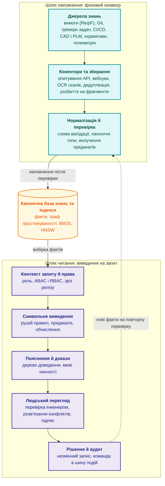
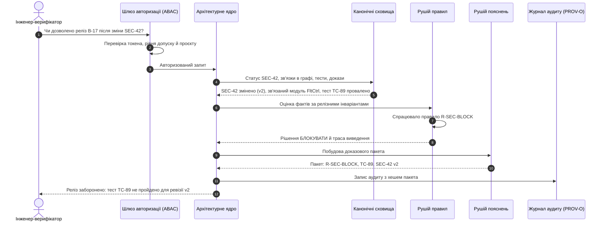
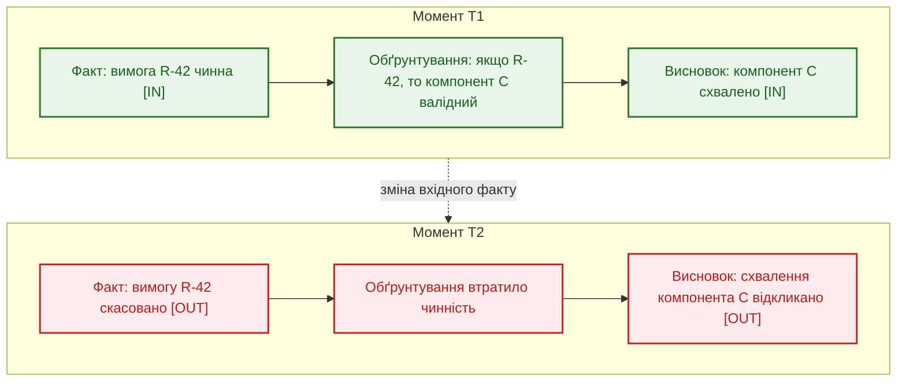
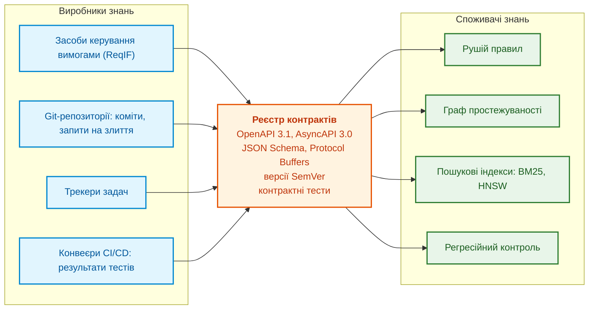

# Глава 16. Архітектура експертної системи: від формального знання до доказового рішення

> **Книга:** [Архітектура доказових експертних систем](README.md) · [Частина IV: Архітектура, технологічний стек, виведення та дія](part-04-architecture-and-inference.md)  
> **Попередня глава:** [Глава 37. Оцінювання вхідної інформації: джерела, свідчення та невизначеність](ch37-input-information-assessment-and-algorithmic-skepticism.md)  
> **Наступна глава:** [Глава 17. Технологічний стек: критерії вибору інструментів, мов програмування та рушіїв правил](ch17-implementation-stack.md)  
> **Зміст книги:** [README.md](README.md)  
> **Автор:** [Микола Федчик](about-the-author.md)  
> **Рівень:** середній і поглиблений: системні архітектори, інженери знань, розробники експертних систем  
> **Очікувані результати:** відділяти архітектурне ядро експертної системи від замінних адаптерів; проєктувати окремі шляхи наповнення знань і читання з виведенням; обирати фізичну форму зберігання для кожного типу знання; пояснювати, як підтримання істинності відкликає висновки після зміни фактів; задавати контракти даних між підсистемами; вимірювати якість пошуку, генерації та калібрування; фіксувати походження рішень за моделлю W3C PROV-O.

---

## Анотація

У главі досліджено логічну та функціональну архітектуру доказової експертної системи з чітким розмежуванням архітектурного ядра, власних підсистем і замінних адаптерів (LLM, векторних баз, пошукових рушіїв). Обґрунтовано розподіл потоків даних на фоновий шлях наповнення (*fill path*) та детермінований шлях читання й виведення (*read path*). Формалізовано концепцію операційного знання й типологію сховищ під різні гарантії узгодженості (ACID, графи простежуваності, онтології OWL, W3C PROV-O). Розглянуто математику підтримання істинності (JTMS та ATMS) з аналізом поведінки рішень при зміні або інвалідації фактів, а також контракти даних між підсистемами (OpenAPI, AsyncAPI, JSON Schema, Pact). Визначено метрики якості та надійності (Recall@k, MRR, nDCG, ECE) для запобігання прихованим відмовам і надмірній впевненості моделей у критичних інженерних доменах.

---

Попередні глави пояснили, як формалізувати інженерне знання: як вилучити вимоги, побудувати факти з прив'язкою до джерела й скінченні автомати. Але набір бібліотек, моделей і баз даних ще не утворює експертної системи. Потрібна архітектура: межі відповідальності між компонентами, окремі потоки наповнення й використання знань, сховища з відомими гарантіями та механізм, який вирішує, що вважати істинним.

Сучасна експертна система для досліджень і розробки (*Research and Development*, R&D) не має одного монолітного центру. Вона не є ні «чатом над документами», ні «рушієм правил над таблицею». У ній співіснують кілька класів тверджень із різною надійністю: детерміновані факти, логічні правила, граф зв'язків, результати лексичного й векторного пошуку, виходи навчених моделей, рішення людей і доказовий слід. Рамка керування ризиками штучного інтелекту NIST AI RMF 1.0 називає серед характеристик надійних систем штучного інтелекту валідність і надійність, підзвітність і прозорість, пояснюваність та інтерпретованість [[1]](#src-1). Архітектура визначає, як забезпечити ці характеристики не деклараціями, а будовою експертної системи.

Ця глава відповідає на запитання: **з яких частин складається доказова експертна система і хто відповідає за допустимість її рішення?** Теза глави: канонічна база, механізм виведення, політика допуску й журнал походження формують рішення в межах схваленої моделі. Пошук, мовні моделі й конектори постачають кандидатів або обчислення. Сам архітектурний поділ не встановлює істинності джерел і правильності правил: потрібні предметна перевірка, застосовність та схвалення.

Глава зосереджена на логічному рівні архітектури: що таке знання в інженерному сенсі, де воно зберігається, як проходить запит, як експертна система реагує на зміну фактів, як підсистеми домовляються про формат даних і як вимірюється якість. Фізичний рівень (де виконуються моделі, які апаратні прискорювачі потрібні, які затримки допустимі) розглянуто в [Главі 18](ch18-execution-infrastructure.md).

## 1. Архітектурне ядро і межі відповідальності

В інженерному проєктуванні доказових систем найнебезпечнішою архітектурною помилкою є розмивання меж між механізмом ухвалення рішень та допоміжними статистичними чи пошуковими сервісами. Якщо експертна система делегує встановлення істинності стороннім інструментам (як-от нейромережевим моделям генерації чи векторним базам даних), вона втрачає детермінізм і стає вразливою до прихованих відмов та стохастичних галюцинацій, несумісних із вимогами стандартів функціональної безпеки (ISO 26262 ASIL D, IEC 61508 SIL 3). **Архітектурне ядро експертної системи** є тією строго контрольованою і верифікованою частиною, яка одноосібно володіє змістом рішення: доменною моделлю, канонічними фактами, правилами, обмеженнями, графом зв'язків, доказами, політиками доступу, життєвим циклом знань і повною трасою міркування. Лише архітектурне ядро дає авторитетні відповіді на п'ять фундаментальних запитань:

- які знання чинні на цей момент;
- які правила застосовано і в якому порядку;
- чому висновок дозволений технічно чи юридично;
- на які першоджерела спирається кожен крок виведення;
- як відтворити весь ланцюг рішення через місяць чи рік.

Тому архітектурне ядро не можна ототожнювати з інструментами навколо нього. Механізм пошуку, векторна база даних, велика мовна модель (*Large Language Model*, LLM) чи середовище виконання моделей можуть бути дуже корисними, але не мають права самостійно вирішувати, що є істинним. Їхнє завдання полягає в тому, щоб постачати кандидатів, обчислювати статистичні оцінки, знаходити змістову схожість або формулювати текст. Рішення стає експертним лише тоді, коли архітектурне ядро пропускає ці результати через формальні правила, інваріанти й перевірку походження та формує доказовий слід. Таблиця розподіляє компоненти на три групи.

| Група | Що входить | Хто володіє логікою |
|---|---|---|
| **Архітектурне ядро** | Доменна модель, канонічна база знань, правила, інваріанти, граф доказів, політики, аудит, життєвий цикл знань | Експертна система |
| **Власні функціональні підсистеми** | Конектори, збирання й нормалізація даних, розбиття на фрагменти, індексація, калібрування, пояснення, людський перегляд, зворотний зв'язок | Експертна система, яка фіксує контракти й вимоги до якості |
| **Сторонні сервіси** | Сховища даних, механізми пошуку, векторні СУБД, середовища виконання моделей, LLM, модулі оптичного розпізнавання символів (OCR), засоби керування життєвим циклом виробу (PLM) і застосунків (ALM), трекери задач, конвеєри CI/CD, реєстри моделей | Сторонні сервіси виконують обчислення, але не володіють експертним рішенням |

Такий розподіл робить експертну систему керованою в трьох типових збоях. Якщо стороння мовна модель вигадала твердження, архітектурне ядро виявляє брак доказу й блокує висновок. Якщо пошуковий індекс пошкоджено або він застарів, архітектурне ядро перебудовує індекс із канонічного сховища. Якщо зовнішній трекер задач змінив схему полів, шар конекторів і нормалізації локалізує зміну в межах контракту даних, і правила виведення не ламаються.

З практики автора: межу варто проводити жорстко з першого дня. Коли пошук, вектори, конектори й середовище виконання нейромереж підключено як замінні адаптери, кожен адаптер може тимчасово деградувати або бути заміненим, не зачіпаючи доменних сутностей, правил, статусів, траси рішень і журналу аудиту. Зворотний підхід, коли логіка рішення частково живе в промптах мовної моделі чи в налаштуваннях індексу, згодом доводиться розплутувати.

Щоб архітектурне ядро могло володіти знанням, треба визначити, що саме вважається знанням.

## 2. Операційне знання в інженерному сенсі

Для експертної системи знання не є просто текстом. Інженерний документ може бути першоджерелом знання, але сам по собі не є операційним знанням, з яким може працювати механізм виведення.

Операційне знання має типізовану структуру, власника, версію, статус у життєвому циклі, джерело походження, область застосування, зв'язки з іншими артефактами, часові межі чинності та формальні правила використання. Затверджена нормативна вимога, чернетка інженерної нотатки, уточнення від постачальника, звіт про випробування й коментар у месенджері мають різний статус, навіть якщо всі ці тексти написані однією природною мовою. Операційне знання складається з шести типів складових:

- **Факти** описують перевірений стан об'єкта чи середовища: вимога REQ-101 затверджена, тест TEST-404 провалено, дефект DEF-12 має критичний статус.
- **Правила** формалізують причинно-наслідкові зв'язки та логіку рішень: якщо критичний дефект зачіпає підсистему безпеки, перехід до польових випробувань блокується.
- **Онтології** задають систему понять і відношень предметної області: що є вимогою, компонентом, тестом, ризиком, сертифікаційним доказом. Стандартною мовою онтологій є OWL 2 консорціуму W3C [[2]](#src-2).
- **Обмеження та інваріанти** визначають заборонені стани. Наприклад, внутрішнє правило організації може вимагати, щоб вимога рівня цілісності безпеки SIL 3 (*Safety Integrity Level*) не вважалася закритою без двох незалежних звітів верифікації. Для графів знань такі обмеження записують мовою SHACL (*Shapes Constraint Language*) [[3]](#src-3).
- **Прецеденти** зберігають структурований досвід: історію усунення кавітації в насосних вузлах, погоджені винятки з правил.
- **Походження** (*provenance*) фіксує родовід знання: хто вніс факт, на підставі якого документа, у якій ревізії, за яких припущень. Модель походження PROV-O консорціуму W3C описує такий родовід як граф сутностей, дій і агентів [[4]](#src-4).

Отже, база знань є не каталогом файлів, а контрольованим графом взаємопов'язаних артефактів, які експертна система може перевіряти на несуперечливість, поєднувати у висновки, пояснювати й відкликати. Наступне запитання полягає в тому, у яких фізичних формах цей граф зберігати.

## 3. Фізичні форми та типологія сховищ знань

Одне й те саме інженерне знання не має універсального формату зберігання. Вимога, тест, дефект, доказ, правило, ваги моделі та подія аудиту описують той самий життєвий цикл виробу, але запити до них потребують різних гарантій: десь потрібні транзакції з властивостями ACID, десь обхід зв'язків у графі, десь лексичний пошук, а десь пошук за векторною схожістю. Діаграма групує фізичні форми за призначенням.

```mermaid
flowchart TB
    accTitle: Фізичні форми зберігання знань
    accDescr: Інженерні знання розподілено між трьома групами сховищ: структуровані дані, пошук і першоджерела, керованість і відтворюваність.

    K["<b>Фізичні форми знань</b>"]

    subgraph Structured["Структуровані дані"]
        direction LR
        R["<b>Реляційна СУБД</b><br/>таблиці, з'єднання, транзакції ACID"]
        G["<b>Графова СУБД</b><br/>вузли, ребра, простежуваність"]
        RDF["<b>Сховище RDF і OWL</b><br/>трійки, дескриптивна логіка"]
        D["<b>Документна СУБД</b><br/>JSON-документи зі схемами"]
    end

    subgraph Retrieval["Пошук і першоджерела"]
        direction LR
        S["<b>Лексичний індекс</b><br/>BM25, фасети, N-грами"]
        V["<b>Векторна СУБД</b><br/>HNSW, змістова схожість"]
        O["<b>Об'єктне сховище</b><br/>PDF, CAD-моделі, бінарні файли"]
    end

    subgraph Governance["Керованість і відтворюваність"]
        direction LR
        A["<b>Журнал аудиту</b><br/>лише дописування, PROV-O, хеші"]
        M["<b>Реєстр моделей</b><br/>картки моделей, ваги, квантування"]
    end

    K --> R & G & RDF & D
    K --> S & V & O
    K --> A & M

    classDef root fill:#e1f5fe,stroke:#0288d1,stroke-width:2px,color:#01579b;
    classDef struct fill:#e8f5e9,stroke:#2e7d32,stroke-width:2px,color:#1b5e20;
    classDef retr fill:#fff3e0,stroke:#e65100,stroke-width:2px,color:#bf360c;
    classDef gov fill:#ede7f6,stroke:#512da8,stroke-width:2px,color:#311b92;

    class K root;
    class R,G,RDF,D struct;
    class S,V,O retr;
    class A,M gov;
```



Діаграма показує три групи сховищ. Структуровані дані тримають канонічні факти й зв'язки, сховища пошуку й першоджерел дають доступ до текстів і файлів, а сховища керованості забезпечують відтворюваність. Кожна форма має власне призначення:

- **Реляційні таблиці** зберігають сутності з фіксованими атрибутами, ключами й гарантіями цілісності: статуси погоджень, версії специфікацій, ролі користувачів.
- **Графові структури** обслуговують пошук шляхів, аналіз впливу змін (*change impact analysis*) і простежуваність між вимогами, кодом і тестами.
- **Трійки RDF з онтологіями OWL** потрібні для автоматичного онтологічного виведення за стандартами W3C.
- **Документні сховища** утримують складні структуровані звіти, налаштування та контекст інженерних сесій.
- **Лексичні індекси** забезпечують фільтрацію за точними ідентифікаторами (номер стандарту, пункт регламенту, код деталі), фасетну навігацію та повнотекстовий пошук; типовою функцією ранжування для них є BM25 [[5]](#src-5).
- **Векторні індекси** знаходять змістово схожі прецеденти й нормативи з різною термінологією; для швидкого пошуку найближчих векторів застосовують графові індекси HNSW (*Hierarchical Navigable Small World*) [[6]](#src-6).
- **Об'єктні сховища** зберігають оригінальні файли (скани актів, нормативні PDF, графіки телеметрії) разом із контрольними сумами SHA-256.
- **Журнали аудиту** є структурами лише з дописуванням (*append-only*), що фіксують хронологію виведення, спрацьовані правила й рішення експертів.
- **Реєстри моделей** версіонують метадані, метрики точності, параметри квантування й артефакти навчених мовних моделей.

З практики автора: будувати експертну систему на одній універсальній базі даних не варто. Керовані факти, правила й статуси краще тримати в канонічній транзакційній формі, зв'язки в графі простежуваності, лексичний і векторний шари як похідні індекси, які можна швидко перебудувати, а оригінальні файли в незмінному об'єктному сховищі. Такий підхід вимагає дисципліни в синхронізації, зате кожен запит обробляє механізм, спроєктований саме для цього типу операцій.

Найпоширеніша спокуса полягає в тому, щоб звести всі форми до однієї, векторної бази. Наступний розділ пояснює, чому так робити не можна.

## 4. Обмеження векторних сховищ та відокремлення семантичного пошуку від канонічної істини

Векторна база даних відповідає на вузьке запитання: які фрагменти тексту мають найближчі до запиту векторні представлення (*embeddings*). Пошук зводиться до обчислення косинусної близькості або скалярного добутку. Це корисний механізм змістового зіставлення, але він не відповідає на інженерні та регуляторні запитання:

- Чи чинний цей пункт стандарту на дату випуску виробу?
- Чи скасовано цю вимогу пізнішим бюлетенем змін?
- Чи має користувач допуск до цього фрагмента?
- Чи не суперечить знайдений фрагмент обмеженню безпеки з іншого документа?

Відповідь на кожне з цих запитань залежить не від змістової схожості, а від метаданих і зв'язків: статусу документа, графа заміщень, політики доступу, правил несуперечливості. Тому експертна система, побудована лише на векторному пошуку над фрагментами, упевнено цитуватиме застарілі інструкції, скасовані стандарти й суперечливі правила. [Глава 15](ch15-knowledge-extraction-and-kb-construction.md) показала цю проблему на прикладі редакцій протоколу SMTP.

Архітектурний інваріант звучить так: **векторний пошук повертає лише кандидатів, і кожен кандидат несе повні метадані**:

- однозначний ідентифікатор канонічного джерела;
- номер ревізії та часові межі чинності;
- юридичний статус: чинний, відкликаний, на перегляді;
- мітку класифікації доступу;
- контрольну суму першоджерела;
- відбиток конвеєра векторизації: назву й ревізію моделі векторних представлень, параметри нормалізації, розмір фрагмента.

Після перевірки метаданих кандидат ще потребує перевірки змісту й допуску; правильна ревізія не доводить правильності тлумачення. Вектори різних моделей зазвичай не можна безпосередньо зіставляти без установленої сумісності. Інше розбиття тексту з тим самим енкодером не обов'язково змінює координатний простір, але змінює одиниці пошуку й еталон релевантності. Відбиток конвеєра потрібний для обох видів змін.

Тепер можна зібрати компоненти в цілісну архітектуру.

## 5. Референсна архітектура: шлях наповнення і шлях читання

Референсна архітектура доказової експертної системи розводить два потоки з різними вимогами до часу й надійності:

1. **Шлях наповнення** (*fill path*) є фоновим конвеєром, який перетворює сирі інженерні джерела на канонічні, структуровані й перевірені знання.
2. **Шлях читання й виведення** (*read path*) обробляє запит: визначає контекст і права доступу, вибирає факти, застосовує правила, будує пояснення й фіксує аудиторський слід.

Розділення потрібне тому, що розбір PDF, оптичне розпізнавання сканів і перевірка цитат тривають хвилини або години й можуть завершитися помилкою, а відповідь на запит має прийти за секунди й спиратися лише на вже перевірені знання. Якби розбір джерел виконувався під час запиту, кожна відповідь залежала б від того, чи вдалося саме зараз розібрати документ. Діаграма показує обидва шляхи.



На діаграмі шлях наповнення завершується канонічною базою знань та індексами, а шлях читання лише читає з неї. Нові факти, які породжує шлях читання, не потрапляють до бази знань напряму: вони повертаються на нормалізацію й перевірку, як і будь-які інші вхідні дані. Компоненти мають такі обов'язки:

- **Конектори джерел** ізолюють протоколи зовнішніх інформаційних систем (трекерів задач, репозиторіїв коду, засобів керування вимогами й життєвим циклом виробу, вікі) і гарантують стабільний імпорт подій і документів.
- **Конвеєр збирання** (*ingestion*) розбирає складні формати (PDF, DOCX, ReqIF, XML), витягує таблиці й формули, виконує оптичне розпізнавання низькоякісних креслень, обчислює контрольні суми й записує метадані походження.
- **Шар нормалізації** перетворює різнорідні дані на єдину онтологічну структуру, замінює локальні ідентифікатори глобальними, узгоджує одиниці вимірювання з SI.
- **Символьний механізм виведення** перевіряє правила, знаходить суперечності й обчислює інженерні формули. Його реалізують, зокрема, алгоритмом зіставлення зразків Rete для продукційних правил [[7]](#src-7) або мовою Datalog для рекурсивних запитів над фактами [[8]](#src-8).
- **Шар пояснення** будує дерево доведення: які правила спрацювали, які факти стали основою і яких даних забракло для категоричного висновку.
- **Модуль людського перегляду** (*human-in-the-loop*) задає поріг автономності й надсилає критичні висновки на затвердження експертам потрібного рівня.
- **Шлюз авторизації** обмежує доступ до фактів і фрагментів. Рольова модель доступу RBAC (*Role-Based Access Control*) надає права за ролями [[9]](#src-9), а модель доступу на основі атрибутів ABAC (*Attribute-Based Access Control*) враховує атрибути користувача, ресурсу й контексту, наприклад проєкт і рівень допуску [[10]](#src-10). Політики доступу зручно задавати декларативно, наприклад мовою Rego в Open Policy Agent [[11]](#src-11).

Щоб побачити, як ці компоненти взаємодіють, простежимо один запит.

## 6. Життєвий цикл запиту: від запитання до доказового пакета

Розглянемо умовний приклад запиту інженера-верифікатора: *«Чи дозволено випуск релізу бортового програмного забезпечення версії B-17 після зміни вимоги з кібербезпеки SEC-42?»* Діаграма послідовності показує, які компоненти беруть участь у відповіді.



Таблиця деталізує п'ять етапів обробки.

| Етап | Дія | Компоненти | Результат |
|---|---|---|---|
| **1. Контекст і безпека** | Автентифікація інженера, визначення проєкту, ролі, рівня допуску й гілки релізу | Шлюз авторизації, сервіс політик | Перевірений контекст із фільтрами доступу |
| **2. Вибірка фактів** | Статус вимоги SEC-42, обхід графа простежуваності до зв'язаних компонентів, звіти тестів | Графова СУБД, реляційне сховище, лексичний індекс | Набір перевірених фактів із ревізіями |
| **3. Правила й виведення** | Зіставлення фактів із формальними релізними критеріями безпеки | Рушій правил (Datalog або Rete) | Висновок «блокувати реліз» і перелік порушених інваріантів |
| **4. Пояснення** | Збирання доказового пакета: змінена вимога, код, провалений тест TC-89, правило R-SEC-BLOCK | Рушій пояснень; мовна модель лише для стислого текстового опису | Доказовий пакет із точними посиланнями |
| **5. Рішення й аудит** | Фіксація рішення експерта або автоматичного вето в журналі | Підсистема аудиту, брокер подій | Підписаний запис рішення |

Мовна модель у цьому ланцюжку з'являється лише на етапі 4 і лише для стислого текстового опису вже побудованого доказового пакета. Рішення «блокувати» ухвалило правило R-SEC-BLOCK за фактами з канонічних сховищ, тому це рішення можна відтворити без мовної моделі. Але факти змінюються: тест TC-89 перезапустять, вимогу SEC-42 переглянуть. Що тоді відбувається з уже ухваленими висновками, пояснює наступний розділ.

## 7. Системи підтримання істинності та інвалідація висновків при зміні фактів

В інженерних проєктах знання змінюється: специфікації оновлюються, стандарти доповнюються, тести перезапускаються. Експертна система, яка претендує на доказовість, має відповісти на запитання: що відбувається з раніше прийнятими висновками, коли вихідний факт спростовано або змінено? Без механізму підтримання істинності (*Truth Maintenance System*, TMS) база знань поступово заповнюється застарілими й взаємно суперечливими висновками.

Класична література пропонує два типи таких механізмів. Механізм підтримання істинності на основі обґрунтувань (*Justification-based TMS*, JTMS), запропонований Джоном Дойлом, позначає кожне твердження міткою IN (прийняте) або OUT (неприйняте) залежно від того, чи має твердження хоча б одне чинне обґрунтування [[12]](#src-12). Механізм на основі припущень (*Assumption-based TMS*, ATMS) Йохана де Клеєра зберігає для кожного твердження множини припущень, за яких воно істинне, і тому дає змогу одночасно розглядати кілька гіпотетичних сценаріїв, наприклад «що станеться з допуском виробу, якщо маса конструкції зросте на 5 %» [[13]](#src-13).

> [!NOTE] Архітектурне розмежування JTMS та ATMS у практичній інженерії
> - **JTMS (односвітова модель):** Працює за принципом перемикання станів `IN / OUT`. Якщо один із вхідних фактів спростовано, JTMS здійснює немонотонне відкликання залежних висновків вздовж графа обґрунтувань. Це ідеально підходить для реактивного контролю конфігурацій (наприклад, перевірка чинності релізу в CI/CD).
> - **ATMS (багатосвітова модель):** Кожному факту приписується мітка середовища (*environment label*) — множина припущень, за яких факт істинний. ATMS підтримує паралельне існування кількох несумісних гіпотетичних станів одночасно без витратного бектрекінгу. Це фундаментально для інженерного trade-off аналізу: система одночасно обчислює варіант A («титановий корпус: маса -15%, вартість +40%») та варіант B («композит: маса -20%, ризик розшарування за температури >120°C»).

Діаграма показує найпростіший випадок: висновок спирається на один факт, і відкликання факту відкликає висновок.



Мовою JTMS діаграма означає таке. На момент T1 вимога R-42 має мітку IN, обґрунтування чинне, і висновок «компонент C схвалено» теж має мітку IN. На момент T2 вимогу R-42 скасовано, обґрунтування втрачає чинність, і висновок отримує мітку OUT.

Наївне правило «відкликай усе, що залежить від зміненого факту» помилкове: може залишитися інше чинне обґрунтування. Програма нижче обчислює позитивний фрагмент підтримання обґрунтувань, не повний JTMS. IN означає підтримку прийнятими посилками, OUT означає відсутність такої підтримки, не доведене заперечення. Навчальна політика допускає заміну тесту звітом моделювання; це припущення прикладу, не універсальний критерій верифікації виробу.

<details>
<summary>Приклад мовою Go: мітки JTMS для висновку з кількома обґрунтуваннями</summary>

```go
package main

import "fmt"

// Node є твердженням у мережі обґрунтувань.
type Node struct {
	Name    string
	Premise bool       // посилка: має мітку IN, доки її не відкликано
	Just    [][]string // обґрунтування: кожне є набором тверджень-підстав
}

// label обчислює мітки з нуля: спершу всі твердження мають мітку OUT,
// потім мітка IN поширюється, доки є що змінювати. Тому твердження
// не може обґрунтувати саме себе через цикл.
func label(nodes []Node, retracted map[string]bool) (map[string]bool, error) {
    known := map[string]bool{}
    for _, node := range nodes {
        if node.Name == "" || known[node.Name] {
            return nil, fmt.Errorf("empty or duplicate node: %q", node.Name)
        }
        known[node.Name] = true
    }
    for _, node := range nodes {
        for _, justification := range node.Just {
            for _, antecedent := range justification {
                if !known[antecedent] {
                    return nil, fmt.Errorf("unknown antecedent: %q", antecedent)
                }
            }
        }
    }
	in := map[string]bool{}
	for changed := true; changed; {
		changed = false
		for _, n := range nodes {
			v := n.Premise && !retracted[n.Name]
			for _, j := range n.Just {
				all := true
				for _, a := range j {
					all = all && in[a]
				}
				v = v || all
			}
			if in[n.Name] != v {
				in[n.Name] = v
				changed = true
			}
		}
	}
    return in, nil
}

func mark(b bool) string {
	if b {
		return "IN"
	}
	return "OUT"
}

func main() {
	nodes := []Node{
		{Name: "R-42 чинна", Premise: true},
		{Name: "TC-89 пройдено", Premise: true},
		{Name: "SIM-12 затверджено", Premise: true},
		{Name: "DOC-3 погоджено", Premise: true},
		{Name: "C валідний", Just: [][]string{
			{"R-42 чинна", "TC-89 пройдено"},
			{"R-42 чинна", "SIM-12 затверджено"},
		}},
		{Name: "реліз дозволено", Just: [][]string{{"C валідний", "DOC-3 погоджено"}}},
	}
	for _, r := range []string{"", "TC-89 пройдено", "R-42 чинна"} {
        in, err := label(nodes, map[string]bool{r: true})
        if err != nil {
            panic(err)
        }
		if r == "" {
			r = "нічого"
		}
		fmt.Printf("відкликано: %-14s | C валідний: %-3s | реліз дозволено: %s\n",
			r, mark(in["C валідний"]), mark(in["реліз дозволено"]))
	}
}
```

Негативні й перестановочні випадки перевіряє окремий тест; виконання: `go test -v main.go main_test.go`.

```go
package main

import "testing"

func TestPositiveSupport(testCase *testing.T) {
    nodes := []Node{
        {Name: "source", Premise: true},
        {Name: "alternative", Premise: true},
        {Name: "claim", Just: [][]string{{"source"}, {"alternative"}}},
    }
    remaining, err := label(nodes, map[string]bool{"source": true})
    if err != nil || !remaining["claim"] {
        testCase.Fatalf("alternative support lost: %v", err)
    }
    removed, err := label(nodes, map[string]bool{"source": true, "alternative": true})
    if err != nil || removed["claim"] {
        testCase.Fatalf("unsupported claim accepted: %v", err)
    }
    for left, right := 0, len(nodes)-1; left < right; left, right = left+1, right-1 {
        nodes[left], nodes[right] = nodes[right], nodes[left]
    }
    reordered, err := label(nodes, map[string]bool{"source": true})
    if err != nil || reordered["claim"] != remaining["claim"] {
        testCase.Fatalf("order changed result: %v", err)
    }
    cycle := []Node{{Name: "first", Just: [][]string{{"second"}}},
        {Name: "second", Just: [][]string{{"first"}}}}
    cyclic, err := label(cycle, nil)
    if err != nil || cyclic["first"] || cyclic["second"] {
        testCase.Fatalf("unfounded cycle accepted: %v", err)
    }
    if _, err := label([]Node{{Name: "same", Premise: true}, {Name: "same"}}, nil); err == nil {
        testCase.Fatal("duplicate nodes accepted")
    }
    if _, err := label([]Node{{Name: "claim", Just: [][]string{{"missing"}}}}, nil); err == nil {
        testCase.Fatal("unknown antecedent accepted")
    }
}
```

Очікуваний вивід навчальної програми:

```text
відкликано: нічого         | C валідний: IN  | реліз дозволено: IN
відкликано: TC-89 пройдено | C валідний: IN  | реліз дозволено: IN
відкликано: R-42 чинна     | C валідний: OUT | реліз дозволено: OUT
```

</details>

Відкликання результату тесту TC-89 не змінило жодного висновку, бо компонент C зберіг друге обґрунтування через звіт SIM-12. Наївне каскадне відкликання тут помилково заблокувало б реліз. Відкликання вимоги R-42 зачепило обидва обґрунтування, тому висновки «C валідний» і «реліз дозволено» отримали мітку OUT. Мітки обчислюються від стану «усе OUT» з поширенням мітки IN, тому твердження не може підтримати саме себе через цикл обґрунтувань. Дойл описав інкрементне оновлення міток, яке не перераховує всю мережу [[12]](#src-12). Програма для простоти перераховує мітки з нуля, але для обґрунтувань без умов на відсутність тверджень отримує ті самі мітки.

Кількість середовищ ATMS може зростати комбінаторно. Для позитивних правил без породження нескінченних нових значень наведений алгоритм обчислює найменшу нерухому точку на скінченній множині вузлів; негативні обґрунтування й конфліктні припущення не реалізовано. Відкликання посилки не оголошує всі залежні твердження хибними: механізм повторно перевіряє альтернативні підстави. Граф простежуваності не зобов'язаний бути орієнтованим ациклічним графом (*directed acyclic graph*, DAG); цикли дозволені для відповідних відношень, але не мають створювати підтримку без первинної підстави.

## 8. Узгоджений контекст читання й повторення рішення

Відтворювана відповідь потребує одного контексту: ідентифікатор пакета, версії правил і схеми, предметний профіль, цільова дата, явні припущення та політика доступу. Канонічна база й похідні індекси мають називати покоління даних. Якщо пошук повернув інше покоління, верифікатор перевіряє кандидата в закріпленому знімку або відмовляє; не змішує факти двох випусків. Те саме правило діє, коли базу розбито на шарди: запит використовує одне покоління в усіх шардах, а відповідь шарда з іншим поколінням прирівнюють до мовчання. Мовчання шарда не є відсутністю факту: чотири можливі підсумки запиту і шість правил розбиття наведено в [Главі 7](ch07-knowledge-base-typology.md), реалізацію маршрутизатора в розділі 10 [Глави 32](ch32-high-performance-knowledge-packs-mmap-and-harvesting.md).

Історичне повторення й поточна авторизація є різними перевірками. Можна відтворювати старе міркування без права показувати відкликаний або закритий фрагмент сьогодні. Ключ кешу має враховувати контекст і повноваження, а актуальне відкликання може скасувати видачу навіть вже обчисленої відповіді. Залежності та історію зберігають згідно з правами й політикою строку зберігання, а не необмежено через слово «аудит».

Контроль архітектури перевіряє не лише штатну відповідь, а й заміну адаптера, змішування поколінь, альтернативне обґрунтування, повторну подію й відкликання доступу. Контекст визначає, які дані можна використати; наступний розділ визначає формат обміну цими даними.

Підтримання істинності працює лише тоді, коли факти надходять у передбачуваному форматі. Якщо джерело мовчки змінить назву поля, механізм виведення не побачить зміни факту взагалі. Цю проблему розв'язують контракти даних.

## 9. Контракти даних між підсистемами

Підсистеми експертної системи мають взаємодіяти лише через строго типізовані версіоновані контракти даних (*data contracts*). Прямий доступ компонентів до внутрішніх таблиць один одного або обмін довільними неструктурованими повідомленнями призводить до прихованих відмов. Типовий сценарій: конвеєр CI/CD перейменовує поле результату тесту з `verdict` на `result`. Правило «блокувати реліз, якщо тест безпеки має вердикт fail» більше не знаходить фактів із вердиктом fail, і експертна система видає хибне схвалення, не повідомивши про жодну помилку.



Діаграма показує, що виробники знань не передають дані споживачам напряму: кожна подія проходить через реєстр контрактів, де описано її схему й версію. Контракт складається з чотирьох елементів:

- **Семантичне версіонування.** Несумісна зміна схеми збільшує старший номер версії за правилами SemVer [[14]](#src-14), наприклад `EngineeringRequirementUpdated.v2`.
- **Схема структури.** JSON Schema [[15]](#src-15) або Protocol Buffers [[16]](#src-16) фіксують типи полів, допустимі значення, обов'язковість атрибутів походження й підписів. Синхронні інтерфейси описують специфікацією OpenAPI [[17]](#src-17), а асинхронні потоки подій специфікацією AsyncAPI [[18]](#src-18).
- **Політика сумісності.** Реєстр схем перевіряє зворотну сумісність нової версії до публікації й не дає зламати черги обробки.
- **Контрактне тестування.** Споживач фіксує очікування щодо повідомлень, а конвеєр CI/CD виробника перевіряє ці очікування до випуску змін, як це робить, наприклад, інструмент Pact [[19]](#src-19).

У сценарії з перейменованим полем контрактний тест механізму виведення очікує поле `verdict` зі значеннями `pass`, `fail`, `error`. Збірка конвеєра CI/CD з новою назвою поля не пройде перевірки, і помилку буде виявлено до випуску, а не після хибного схвалення релізу. Контракти закривають один клас прихованих відмов, але не єдиний; наступний розділ збирає типові приховані відмови кожного шару.

## 10. Режими прихованих відмов та механізми протидії

Надійність архітектури оцінюють не лише за штатною роботою, а й за тим, як вона локалізує й компенсує відмови. Для експертної системи найнебезпечніші приховані збої: сервіс працює, але видає технічно чи юридично небезпечний висновок через неповні або спотворені дані. Таблиця підсумовує такі збої для кожного шару.

| Архітектурний шар | Прихована відмова | Наслідок | Протидія |
|---|---|---|---|
| **Конектори джерел** | Часткове переривання синхронізації, наприклад через тайм-аут мережі | Механізм виведення працює з неповними фактами | Позначка останньої обробленої події (*watermark*), звірка контрольних сум із джерелом, статус `DEGRADED_SOURCE`, який блокує остаточні рішення |
| **Нормалізація** | Неправильне зіставлення статусів, наприклад `Resolved` як `Closed` | Правила вважають дефект закритим і пропускають реліз | Карантинний буфер для нерозпізнаних значень, закриті словники значень, перевірка на вхідному шлюзі |
| **Граф знань** | «Висячі» вузли й застарілі зв'язки після видалення сутностей | Неправильний аналіз впливу, ризик залишається непоміченим | Каскадні транзакції, періодична перевірка ізольованих підграфів, перевірка зв'язків походження |
| **Механізм виведення** | Залежність результату від порядку спрацювання правил над спільним змінним станом | Однакові факти дають різні результати | Заборона змінювати глобальний стан, детермінований порядок правил із явними пріоритетами (*salience*), ізоляція фактів сесії |
| **Векторний індекс** | Змішування векторів від різних моделей чи різного розбиття тексту | Помилкові результати пошуку й хибний контекст | Відбиток конвеєра з кожним вектором, окремі індекси, повна переіндексація після зміни моделі |
| **Мовна модель** | Твердження без посилання на джерело | Хибний доказовий пакет, введення аудитора в оману | Обов'язкове зіставлення кожного твердження з цитатою з канонічної бази, вето за відсутності посилання |

Усі шість рядків мають спільний принцип: у разі сумніву шар не мовчить, а позначає дані як деградовані, переносить їх у карантин чи блокує рішення. Прихована відмова стає явною, і її видно в журналі й у доказовому пакеті. Проте щоб помітити повільну деградацію якості, а не різкий збій, потрібні вимірювання.

## 11. Калібрування якості та регресійний контроль

Коли в експертній системі оновлюється словник, додається правило чи змінюється модель векторних представлень, розробник має об'єктивно довести, що якість не погіршилася. Для цього потрібен багаторівневий регресійний контроль, у якому кожен рівень має власні метрики.

**Тестування правил.** Набір еталонних інженерних сценаріїв фіксує для кожного сценарію обов'язковий набір активованих правил, похідних фактів і остаточних рішень. Будь-яка зміна бази знань запускає весь набір, і розбіжність з еталоном блокує випуск.

**Оцінювання пошуку.** У конвеєрі неперервної інтеграції (CI/CD) регресійний контроль гібридного пошуку (поєднання BM25 та HNSW) виявляє деградацію повноти вибірки нормативних знань. Проблема відмови полягає в тому, що внаслідок зміни моделі векторних представлень чи параметрів токенізації критична вимога функціональної безпеки (наприклад, пункт ISO 26262-8 або інваріант DO-178C) випадає з перших $k$ результатів, через що механізм виведення формує рішення на неповному контексті. Для вимірювання повноти та якості ранжування над верифікованою множиною еталонних інженерних запитів $Q$ обчислюють безрозмірнісні показники $\mathrm{Recall@}k$, $\mathrm{Precision@}k$ та середній обернений ранг $\mathrm{MRR}$:

```math
\mathrm{Recall@}k = \frac{\lvert\mathrm{Rel} \cap \mathrm{Top}_k\rvert}{\lvert\mathrm{Rel}\rvert}, \qquad
\mathrm{Precision@}k = \frac{\lvert\mathrm{Rel} \cap \mathrm{Top}_k\rvert}{k}, \qquad
\mathrm{MRR} = \frac{1}{\lvert Q \rvert} \sum_{q \in Q} \frac{1}{\mathrm{rank}_q}.
```

**Параметри та допустимі діапазони:**
- $Q$ — еталонна тестова вибірка інженерних запитів зі строго розміченою релевантністю ($\lvert Q \rvert \ge 100$).
- $\mathrm{Rel} \subset \mathcal{D}$ — множина фрагментів бази знань, які є нормативно обов'язковими для закриття запиту $q$ ($\lvert\mathrm{Rel}\rvert \ge 1$).
- $\mathrm{Top}_k \subset \mathcal{D}$ — множина з перших $k$ результатів, повернутих пошуковим адаптером (де $k \in \{5, 10, 20\}$).
- $\lvert\cdot\rvert$ — потужність множини, $\cap$ — операція перетину множин фрагментів.
- $\mathrm{rank}_q \in \{1, 2, \dots, \lvert\mathcal{D}\rvert\}$ — позиція першого релевантного фрагмента у списку видачі для запиту $q$. Якщо жодного релевантного фрагмента в межах ліміту не знайдено, внесок $1/\mathrm{rank}_q$ детерміновано приймається рівним 0.
- $\mathrm{Recall@}k \in [0, 1]$ — повнота пошуку (частка знайдених релевантних нормативів серед усіх обов'язкових).
- $\mathrm{Precision@}k \in [0, 1]$ — точність видачі (частка релевантних документів у вікні з $k$ кандидатів).
- $\mathrm{MRR} \in [0, 1]$ — середній обернений ранг (*Mean Reciprocal Rank*), що оцінює швидкість доступу до першого істинного факту.

**Практичне застосування та інженерні висновки:**
- Розрахунок виконується автоматично у нічному регресійному конвеєрі при кожному оновленні пошукових індексів або зміні ваг гібридного ранжування.
- Критерії допуску релізу (Quality Gate): для нормативної бази вимог безпеки встановлюються мінімальні пороги $\mathrm{Recall@}5 \ge 0{,}98$ та $\mathrm{MRR} \ge 0{,}85$.
- Якщо $\mathrm{Recall@}5 < 0{,}98$, конвеєр розгортання негайно переривається зі статусом `BUILD_BLOCKED_RETRIEVAL_REGRESSION`: випуск нової версії індексу блокується, оскільки ризик пропуску обов'язкового нормативу перевищує допустимий ліміт для систем класу ASIL D.

**Числовий приклад розрахунку:**
Для тестового запиту про конфігурацію таймера WDT норматив вимагає $\lvert\mathrm{Rel}\rvert = 4$ фрагменти. У вікні $k = 5$ повернуто 3 релевантні фрагменти ($\lvert\mathrm{Rel} \cap \mathrm{Top}_5\rvert = 3$), перший з яких стоїть на другій позиції ($\mathrm{rank}_q = 2$):
```math
\mathrm{Recall@}5 = \frac{3}{4} = 0{,}75, \qquad \mathrm{Precision@}5 = \frac{3}{5} = 0{,}60, \qquad \mathrm{RR}_q = \frac{1}{2} = 0{,}50
```
Оскільки $\mathrm{Recall@}5 = 0{,}75 < 0{,}98$, регресійний шлюз блокує оновлення індексу та вказує на втрату одного обов'язкового пункту специфікації.

Коли релевантні фрагменти мають різну технічну й юридичну силу (мандаторні норми стандарту, рекомендовані практики, загальний опис), бінарної оцінки релевантності недостатньо. Для врахування градації важливості застосовують нормалізований дисконтований сукупний виграш nDCG (*Normalized Discounted Cumulative Gain*) Ярвеліна й Кекяляйнен [[20]](#src-20):

```math
\mathrm{DCG@}k = \sum_{i=1}^{k} \frac{\mathrm{rel}_i}{\log_2(i+1)}, \qquad
\mathrm{nDCG@}k = \frac{\mathrm{DCG@}k}{\mathrm{IDCG@}k}.
```

**Параметри та допустимі діапазони:**
- $i \in \{1, \dots, k\}$ — порядковий номер позиції фрагмента у ранжованій видачі.
- $\mathrm{rel}_i \in \{0, 1, 2, 3\}$ — дискретний рівень значущості фрагмента: 3 — мандаторний інваріант безпеки (порушення неприпустиме), 2 — рекомендована галузева норма, 1 — довідковий контекст, 0 — нерелевантний шум.
- $\log_2(i+1)$ — коефіцієнт логарифмічного дисконтування глибини (штраф за зміщення важливого факту вниз по списку).
- $\mathrm{DCG@}k \in [0, \infty)$ — дисконтований сукупний виграш на перших $k$ позиціях.
- $\mathrm{IDCG@}k \in (0, \infty)$ — ідеальний виграш (*Ideal DCG*), обчислений для тієї самої вибірки оцінок, відсортованих за спаданням значущості. При $\mathrm{IDCG@}k = 0$ метрика покладається рівною 1, якщо $\mathrm{DCG@}k = 0$, або 0 в іншому разі.
- $\mathrm{nDCG@}k \in [0, 1]$ — нормалізований показник ідеальності впорядкування знань.

**Практичне застосування та інженерні висновки:**
- Розрахунок дозволяє верифікувати, чи не витісняють другорядні довідкові нотатки першочергові заборонні правила безпеки.
- Поріг регресійного шлюзу: $\mathrm{nDCG@}10 \ge 0{,}92$.
- Якщо для будь-якого еталонного запиту з категорії критичної безпеки мандаторний інваріант ($\mathrm{rel}_i = 3$) опиняється нижче третьої позиції ($i > 3$), система фіксує порушення пріоритетності знань і повертає конфігурацію пошукового енкодера на повторне калібрування.

**Оцінювання генерації.** Якщо мовна модель формулює текст пояснення, перевіряють три властивості з набору метрик RAGAS [[21]](#src-21): вірність (*faithfulness*), тобто чи підтверджує наданий контекст кожне твердження відповіді; релевантність відповіді запитанню; релевантність знайденого контексту запитанню.

**Калібрування впевненості.** Якщо статистичний класифікатор чи нейромережа повертає оцінку впевненості для предикатів, ця оцінка має суворо відповідати емпіричній частоті правильних відповідей. Гуо та співавтори показали, що сучасні глибокі нейромережі систематично страждають на надмірну впевненість [[22]](#src-22). Ступінь відхилення оцінки вимірюють очікуваною похибкою калібрування ECE (*Expected Calibration Error*):

```math
\mathrm{ECE} = \sum_{m=1}^{M} \frac{\lvert B_m \rvert}{n} \left\lvert \mathrm{acc}(B_m) - \mathrm{conf}(B_m) \right\rvert.
```

**Параметри та допустимі діапазони:**
- $M \in \mathbb{N}$ — кількість інтервалів (бінів) розбиття шкали ймовірностей на відрізку $[0, 1]$ (стандартне інженерне значення $M = 10$, крок інтервалу 0,1).
- $m \in \{1, \dots, M\}$ — індекс поточного інтервалу ймовірностей $I_m = \left(\frac{m-1}{M}, \frac{m}{M}\right]$.
- $B_m$ — множина інженерних зразків із тестового набору, для яких прогнозована моделлю впевненість потрапила в інтервал $I_m$.
- $n$ — загальна кількість перевірених зразків ($n = \sum_{m=1}^M \lvert B_m \rvert$).
- $\lvert B_m \rvert/n \in [0, 1]$ — статистична вага інтервалу $m$ у загальній вибірці.
- $\mathrm{acc}(B_m) = \frac{1}{\lvert B_m \rvert} \sum_{i \in B_m} \mathbf{1}(\hat y_i = y_i) \in [0, 1]$ — емпірична точність прогнозів у біні $m$ (частка правильних відповідей, де $\mathbf{1}$ є індикаторною функцією).
- $\mathrm{conf}(B_m) = \frac{1}{\lvert B_m \rvert} \sum_{i \in B_m} \hat p_i \in [0, 1]$ — середня впевненість моделі у біні $m$.
- $\mathrm{ECE} \in [0, 1]$ — очікувана похибка калібрування (вимірюється в частках одиниці або у відсотках).

**Практичне застосування та інженерні висновки:**
- Калібрування обчислюється під час кваліфікаційного аудиту моделей-класифікаторів фактів перед їхньою інтеграцією в шлях наповнення.
- Інженерні межі: для систем з автономним допуском фактів вимагається $\mathrm{ECE} \le 0{,}03$ (3 %).
- Якщо $\mathrm{ECE} > 0{,}05$, вихідні оцінки впевненості моделі визнаються некаліброваними. Їх категорично заборонено використовувати як прямі порогові значення для спрацювання правил. Модель підлягає постобробці через ізотонічну регресію або температурне масштабування (*Temperature Scaling*), а до підтвердження результатів калібрування всі згенеровані нею факти скеровуються на обов'язковий людський перегляд (*Human-in-the-Loop*).

**Числовий приклад калібрування:**
Вибірка з $n = 1\,000$ класифікацій дефектів розбита на 2 агреговані біни:
- Бін 1 ($I_1$): $\lvert B_1 \rvert = 600$, середня впевненість $\mathrm{conf} = 0{,}92$, фактична точність $\mathrm{acc} = 0{,}90$;
- Бін 2 ($I_2$): $\lvert B_2 \rvert = 400$, середня впевненість $\mathrm{conf} = 0{,}70$, фактична точність $\mathrm{acc} = 0{,}68$.
```math
\mathrm{ECE} = \frac{600}{1000} \cdot \lvert 0{,}90 - 0{,}92 \rvert + \frac{400}{1000} \cdot \lvert 0{,}68 - 0{,}70 \rvert = 0{,}6 \cdot 0{,}02 + 0{,}4 \cdot 0{,}02 = 0{,}012 + 0{,}008 = 0{,}020
```
Оскільки $\mathrm{ECE} = 0{,}020 \le 0{,}030$, класифікатор задовольняє критерії автономного використання у продуктивному середовищі.

> [!WARNING] Пастка надмірної впевненості (*Overconfidence*) у критичних системах
> Сучасні глибокі моделі та LLM страждають на системну надмірну впевненість: модель видає `conf = 0.99` для гіпотези, де емпірична точність ледь сягає `acc = 0.65`. У задачах функціональної безпеки (ISO 26262 ASIL-D, DO-178C DAL A) це створює критичну ілюзію надійності: фільтри пропускають неперевірений артефакт повз інженерний рецензент. Без попереднього калібрування ймовірностей (наприклад, температурного масштабування *Temperature Scaling* або ізотонічної регресії) вихідні скори класифікаторів **категорично заборонено** використовувати як порогові критерії допуску релізу.

Кожна з метрик ловить свій тип деградації, і жодна не замінює іншої: ідеальний Recall@k не гарантує вірності пояснення, а низька ECE не гарантує правильності правил. Метрики показують якість на момент вимірювання. Щоб через рік відтворити, на якому стані знань ухвалено рішення, потрібні версіонування й походження.

## 12. Версіонування та походження рішень

Головна обіцянка доказової експертної системи полягає в тому, щоб через роки відтворити стан знань, на підставі якого ухвалили критичне рішення. Збереженого текстового звіту для цього недостатньо: треба знати, які саме версії артефактів брали участь у рішенні. Версіонуванню підлягають:

- редакції нормативних документів і специфікацій вимог;
- пакети правил і декларативних обмежень;
- онтологічні схеми й класифікатори понять;
- моделі векторних представлень, ваги квантованих нейромереж і системні промпти;
- конфігурації розбиття тексту на фрагменти;
- матриці прав доступу на момент запиту.

Модель PROV-O описує походження через три базові поняття [[4]](#src-4). Сутність (*Entity*) є будь-яким артефактом даних: документом, фактом, правилом, доказовим пакетом. Дія (*Activity*) є процесом, що використовує й породжує сутності: розбором ReqIF, прогоном правил, векторизацією, людським переглядом. Агент (*Agent*) є відповідальною стороною: конектором, моделлю-екстрактором, конкретним інженером. Рішення щодо релізу B-17 з розділу про життєвий цикл запиту в синтаксисі Turtle [[23]](#src-23) виглядає так:

<details>
<summary>Граф у форматі Turtle</summary>

```turtle
@prefix prov: <http://www.w3.org/ns/prov#> .
@prefix ex:   <https://example.org/kb/> .

ex:decision-B17 a prov:Entity ;
    prov:wasGeneratedBy ex:release-check-0314 ;
    prov:wasDerivedFrom ex:SEC-42-v2 , ex:TC-89-run-1187 , ex:rule-R-SEC-BLOCK-v3 .

ex:release-check-0314 a prov:Activity ;
    prov:used ex:SEC-42-v2 , ex:TC-89-run-1187 , ex:rule-R-SEC-BLOCK-v3 ;
    prov:wasAssociatedWith ex:inference-engine-1-4-2 , ex:engineer-petrenko .

ex:SEC-42-v2 a prov:Entity ;
    prov:wasRevisionOf ex:SEC-42-v1 .

ex:inference-engine-1-4-2 a prov:Agent , prov:SoftwareAgent .
ex:engineer-petrenko a prov:Agent , prov:Person .
```

</details>


Рішення є сутністю, яку породила дія перевірки релізу. Ця дія використала другу ревізію вимоги SEC-42, результат прогону тесту TC-89 і третю версію правила R-SEC-BLOCK, а відповідальними агентами були механізм виведення версії 1.4.2 та інженер. Друга ревізія вимоги SEC-42 пов'язана з першою відношенням `prov:wasRevisionOf`.

Запитання про походження над таким графом ставлять мовою запитів SPARQL 1.1 [[24]](#src-24). Шлях властивостей `prov:wasDerivedFrom/prov:wasRevisionOf*` проходить від рішення до його безпосередніх джерел, а потім довільну кількість кроків назад по ревізіях. Програма мовою Python з бібліотекою rdflib (перевірено з rdflib 7.6.0 на Python 3.14) читає файл `prov.ttl` з наведеним графом і виконує такий запит:

<details>
<summary>Приклад мовою Python</summary>

```python
from rdflib import Graph

g = Graph().parse("prov.ttl", format="turtle")
print("трійок:", len(g))

QUERY = """
PREFIX prov: <http://www.w3.org/ns/prov#>
PREFIX ex:   <https://example.org/kb/>
SELECT DISTINCT ?src WHERE {
  ex:decision-B17 prov:wasDerivedFrom/prov:wasRevisionOf* ?src .
}
ORDER BY ?src
"""

for row in g.query(QUERY):
    print(row.src.split("/")[-1])
```

</details>


Програма виводить:

<details>
<summary>Дані або результат прикладу</summary>

```text
трійок: 17
SEC-42-v1
SEC-42-v2
TC-89-run-1187
rule-R-SEC-BLOCK-v3
```

</details>


Запит повертає три безпосередні підстави рішення, включно з правилом, і попередню ревізію вимоги. Це заявлені залежності наведеного графа, не підтвердження повноти всіх залежностей реального запуску. Для конвеєрів даних аналогічний родовід задач і наборів даних фіксує OpenLineage [[25]](#src-25). Журнал має зв'язувати події з точними артефактами й результатами перевірок; сам граф не засвідчує істинності чи авторства кожного запису.

## 13. Сім архітектурних правил доказової системи

Розглянуті механізми зводяться до семи правил:

1. **Доказовий пакет є офіційним інтерфейсом експертної системи.** Зовнішнім результатом є не число, не рядок тексту й не статус `true/false`, а пакет, що містить висновок, ланцюг правил, цитати з перевірених джерел, перелік припущень та ідентифікатор особи чи агента, що ухвалив рішення.
2. **Індекс є похідною структурою, а не джерелом істини.** Єдине авторитетне джерело становлять канонічні факти й правила; будь-який пошуковий чи векторний індекс можна знищити й детерміновано відтворити з канонічного сховища. Зміна джерела без інвалідації похідних індексів є архітектурним дефектом.
3. **Вектор без відбитка конвеєра не має змісту.** Вектор валідний лише разом із відбитком усього конвеєра, наприклад `hash(model_name, weights_revision, chunk_size, overlap, tokenizer_version)`; змішування векторів різного походження в одному просторі неприпустиме.
4. **Назви тем і подій є частиною доменної схеми.** Зміна назви події чи атрибута в брокері повідомлень без зміни старшої версії контракту призводить до втрати фактів механізмом виведення.
5. **Внутрішня структура СУБД не просочується в інтерфейси.** Публічні та міжсервісні інтерфейси оперують стійкими доменними поняттями й приховують фізичну оптимізацію таблиць чи графових вузлів.
6. **Історія змін не підмінюється новим станом.** Зміна або відкликання створює новий запис із автором, часом і підставою. Зміст зберігають лише в межах дозволу й строку зберігання; журнал аудиту не скасовує вимог видалення закритих або персональних даних.
7. **Правила виведення не мають спільного змінного стану.** Правило є детермінованою функцією вхідних фактів і власного контексту; неявні глобальні змінні руйнують відтворюваність і роблять доведення недійсним.

## Висновки
Канонічна база, механізм виведення й політика допуску формують допустиме рішення за закріпленим контекстом. Замінні адаптери постачають кандидатів і обчислення; правильність їхніх результатів не випливає з архітектурної назви. Відтворення потребує версій джерел, правил, припущень і визначеної семантики, а поточна видача також перевіряє доступ та відкликання.

Глава показала, як цей поділ працює на кількох рівнях. Шлях наповнення відокремлено від шляху читання, тому відповідь спирається лише на перевірені знання. Програма JTMS мовою Go показала, що відкликання факту має враховувати альтернативні обґрунтування: відкликання результату тесту TC-89 не заблокувало реліз, бо залишився звіт моделювання, а відкликання вимоги R-42 заблокувало. Сценарій із перейменованим полем показав, як контрактний тест перетворює приховану відмову на помилку збірки. Граф PROV-O із запитом SPARQL відтворив походження рішення разом із попередньою ревізією вимоги.

Архітектура не робить правила правильними й сама не гарантує відтворюваності. Навчальний алгоритм перевіряє позитивну підтримку, не всі форми немонотонного міркування. Граф походження записує заявлений родовід; без збережених залежностей і перевірки записів він не доводить повторення. Перевірку самих правил розглянуто в [Главі 23](ch23-knowledge-base-verification.md).

[Глава 17](ch17-implementation-stack.md) переходить від логічної архітектури до технологічного стеку: як обрати мови програмування, рушії правил і бібліотеки для компонентів, описаних у цій главі.

## Запитання для самоперевірки
1. Чим роль великої мовної моделі відрізняється від ролі архітектурного ядра експертної системи і чому мовна модель не повинна ухвалювати експертний вердикт?
2. Чому розбір інженерних документів не можна виконувати під час обробки запиту користувача? Які ризики це створює для шляху читання?
3. Які метадані має нести кожен кандидат векторного пошуку і навіщо потрібен відбиток конвеєра векторизації?
4. Чому в програмі JTMS відкликання результату тесту TC-89 не змінило мітки висновку «C валідний», а відкликання вимоги R-42 змінило?
5. Як контрактне тестування виявляє перейменування поля в повідомленнях конвеєра CI/CD до того, як перейменування призведе до хибного схвалення релізу?
6. Що вимірює ECE і чому погано відкалібрована оцінка впевненості небезпечна для правил із порогами?
7. Як граф PROV-O і запит SPARQL дають змогу відновити версії артефактів, на яких ґрунтувалося рішення?

## Словник
| Український термін | Англійський відповідник | Коротке пояснення |
|---|---|---|
| Архітектурне ядро | Architectural core | Частина експертної системи, яка володіє фактами, правилами, рішенням і аудитом |
| Адаптер | Adapter | Замінний компонент, що виконує обчислення, але не ухвалює рішення |
| Шлях наповнення | Fill path | Фоновий конвеєр перетворення джерел на канонічні знання |
| Шлях читання | Read path | Обробка запиту від контексту до доказового пакета |
| Канонічне сховище | Canonical store | Авторитетне джерело фактів і правил, з якого відтворюються похідні індекси |
| Доказовий пакет | Proof package | Висновок разом із правилами, цитатами, припущеннями та відповідальним агентом |
| Підтримання істинності | Truth maintenance | Механізм відкликання й відновлення висновків після зміни фактів |
| Обґрунтування | Justification | Набір тверджень, з яких випливає інше твердження |
| Онтологія | Ontology | Формальна система понять і відношень предметної області |
| Походження | Provenance | Родовід артефакту: хто, з чого і якою дією його породив |
| Контракт даних | Data contract | Версіонована схема повідомлень між підсистемами з правилами сумісності |
| Контрактне тестування | Contract testing | Перевірка виробника на відповідність очікуванням споживача до випуску |
| Відбиток конвеєра | Pipeline fingerprint | Хеш параметрів, якими отримано вектор |
| Векторне представлення | Embedding | Числовий вектор, що відображає зміст фрагмента тексту |
| Калібрування | Calibration | Відповідність оцінок впевненості фактичній частоті правильних відповідей |
| Людський перегляд | Human-in-the-loop | Затвердження критичних висновків людиною |
| Аналіз впливу змін | Change impact analysis | Пошук артефактів, яких зачіпає зміна |
| Прихована відмова | Silent failure | Збій, за якого сервіс працює, але результат хибний |
| Мовчання шарда | Shard silence | Стан, коли потрібний шард не відповів або відповів із покоління, відмінного від закріпленого; не дорівнює відсутності факту |
| Шард | Shard | Частина бази знань, яку обслуговує один вузол; визначення наведено в Главі 7 |

## Абревіатури
| Скорочення | Розшифрування | Значення |
|---|---|---|
| ABAC | Attribute-Based Access Control | керування доступом на основі атрибутів |
| ACID | Atomicity, Consistency, Isolation, Durability | властивості надійних транзакцій |
| ALM | Application Lifecycle Management | керування життєвим циклом застосунків |
| API | Application Programming Interface | програмний інтерфейс |
| ATMS | Assumption-based Truth Maintenance System | підтримання істинності на основі припущень |
| BM25 | Best Matching 25 | функція лексичного ранжування |
| CAD | Computer-Aided Design | автоматизоване проєктування |
| CI/CD | Continuous Integration / Continuous Delivery | безперервна інтеграція та доставка |
| DAG | Directed Acyclic Graph | орієнтований ациклічний граф |
| DCG | Discounted Cumulative Gain | дисконтований сукупний виграш |
| DOCX | Office Open XML Document | формат текстових документів |
| ECE | Expected Calibration Error | очікувана похибка калібрування |
| HNSW | Hierarchical Navigable Small World | графовий індекс для пошуку найближчих векторів |
| JSON | JavaScript Object Notation | текстовий формат обміну даними |
| JTMS | Justification-based Truth Maintenance System | підтримання істинності на основі обґрунтувань |
| LLM | Large Language Model | велика мовна модель |
| MRR | Mean Reciprocal Rank | середній обернений ранг |
| nDCG | Normalized Discounted Cumulative Gain | нормалізований дисконтований сукупний виграш |
| NIST | National Institute of Standards and Technology | Національний інститут стандартів і технологій США |
| OCR | Optical Character Recognition | оптичне розпізнавання символів |
| OWL | Web Ontology Language | мова онтологій W3C |
| PDF | Portable Document Format | формат документів |
| PLM | Product Lifecycle Management | керування життєвим циклом виробу |
| PROV-O | PROV Ontology | онтологія походження W3C |
| R&D | Research and Development | дослідження і розробки |
| RAGAS | Retrieval Augmented Generation Assessment | набір метрик для оцінювання генерації з доповненням |
| RBAC | Role-Based Access Control | рольове керування доступом |
| RDF | Resource Description Framework | модель даних у вигляді трійок |
| ReqIF | Requirements Interchange Format | обмінний формат вимог |
| SemVer | Semantic Versioning | семантичне версіонування |
| SHA-256 | Secure Hash Algorithm, 256 bits | криптографічна хеш-функція |
| SHACL | Shapes Constraint Language | мова обмежень для графів RDF |
| SI | Système international d'unités | Міжнародна система одиниць |
| SIL | Safety Integrity Level | рівень цілісності безпеки |
| SPARQL | SPARQL Protocol and RDF Query Language | мова запитів до графів RDF |
| СУБД | система управління базами даних | програмне забезпечення для зберігання даних і запитів до них |
| TMS | Truth Maintenance System | механізм підтримання істинності |
| W3C | World Wide Web Consortium | консорціум зі стандартів вебу |
| XML | Extensible Markup Language | мова розмітки |

## Джерела
1. <a id="src-1"></a>Elham Tabassi. [*Artificial Intelligence Risk Management Framework (AI RMF 1.0)*](https://doi.org/10.6028/NIST.AI.100-1). NIST AI 100-1, National Institute of Standards and Technology, 2023.
2. <a id="src-2"></a>W3C OWL Working Group. [*OWL 2 Web Ontology Language Document Overview (Second Edition)*](https://www.w3.org/TR/owl2-overview/). W3C Recommendation, 2012.
3. <a id="src-3"></a>Holger Knublauch, Dimitris Kontokostas (ред.). [*Shapes Constraint Language (SHACL)*](https://www.w3.org/TR/shacl/). W3C Recommendation, 2017.
4. <a id="src-4"></a>Timothy Lebo, Satya Sahoo, Deborah McGuinness (ред.). [*PROV-O: The PROV Ontology*](https://www.w3.org/TR/prov-o/). W3C Recommendation, 2013.
5. <a id="src-5"></a>Stephen Robertson, Hugo Zaragoza. [*The Probabilistic Relevance Framework: BM25 and Beyond*](https://doi.org/10.1561/1500000019). *Foundations and Trends in Information Retrieval*, 2009.
6. <a id="src-6"></a>Yu. A. Malkov, D. A. Yashunin. [*Efficient and Robust Approximate Nearest Neighbor Search Using Hierarchical Navigable Small World Graphs*](https://doi.org/10.1109/TPAMI.2018.2889473). *IEEE Transactions on Pattern Analysis and Machine Intelligence*, 42(4), 824–836, 2020.
7. <a id="src-7"></a>Charles L. Forgy. [*Rete: A Fast Algorithm for the Many Pattern/Many Object Pattern Match Problem*](https://doi.org/10.1016/0004-3702(82)90020-0). *Artificial Intelligence*, 19(1), 17–37, 1982.
8. <a id="src-8"></a>S. Ceri, G. Gottlob, L. Tanca. [*What You Always Wanted to Know About Datalog (and Never Dared to Ask)*](https://doi.org/10.1109/69.43410). *IEEE Transactions on Knowledge and Data Engineering*, 1(1), 146–166, 1989.
9. <a id="src-9"></a>R. S. Sandhu, E. J. Coyne, H. L. Feinstein, C. E. Youman. [*Role-Based Access Control Models*](https://doi.org/10.1109/2.485845). *Computer*, 29(2), 38–47, 1996.
10. <a id="src-10"></a>Vincent C. Hu та ін. [*Guide to Attribute Based Access Control (ABAC) Definition and Considerations*](https://doi.org/10.6028/NIST.SP.800-162). NIST Special Publication 800-162, 2014.
11. <a id="src-11"></a>Open Policy Agent. [*Policy Language*](https://www.openpolicyagent.org/docs/latest/policy-language/). Документація OPA.
12. <a id="src-12"></a>Jon Doyle. [*A Truth Maintenance System*](https://doi.org/10.1016/0004-3702(79)90008-0). *Artificial Intelligence*, 12(3), 231–272, 1979.
13. <a id="src-13"></a>Johan de Kleer. [*An Assumption-Based TMS*](https://doi.org/10.1016/0004-3702(86)90080-9). *Artificial Intelligence*, 28(2), 127–162, 1986.
14. <a id="src-14"></a>Tom Preston-Werner. [*Semantic Versioning 2.0.0*](https://semver.org/spec/v2.0.0.html).
15. <a id="src-15"></a>JSON Schema. [*JSON Schema Specification*](https://json-schema.org/specification).
16. <a id="src-16"></a>Google. [*Protocol Buffers Documentation*](https://protobuf.dev/).
17. <a id="src-17"></a>OpenAPI Initiative. [*OpenAPI Specification v3.1.0*](https://spec.openapis.org/oas/v3.1.0.html). 2021.
18. <a id="src-18"></a>AsyncAPI Initiative. [*AsyncAPI Specification 3.0.0*](https://www.asyncapi.com/docs/reference/specification/v3.0.0). 2023.
19. <a id="src-19"></a>Pact Foundation. [*Pact Docs: Introduction*](https://docs.pact.io/).
20. <a id="src-20"></a>Kalervo Järvelin, Jaana Kekäläinen. [*Cumulated Gain-Based Evaluation of IR Techniques*](https://doi.org/10.1145/582415.582418). *ACM Transactions on Information Systems*, 20(4), 422–446, 2002.
21. <a id="src-21"></a>Shahul Es, Jithin James, Luis Espinosa Anke, Steven Schockaert. [*RAGAs: Automated Evaluation of Retrieval Augmented Generation*](https://doi.org/10.18653/v1/2024.eacl-demo.16). *Proceedings of the 18th Conference of the European Chapter of the Association for Computational Linguistics: System Demonstrations*, 150–158, 2024.
22. <a id="src-22"></a>Chuan Guo, Geoff Pleiss, Yu Sun, Kilian Q. Weinberger. [*On Calibration of Modern Neural Networks*](https://arxiv.org/abs/1706.04599). *Proceedings of the 34th International Conference on Machine Learning (ICML)*, PMLR 70, 2017.
23. <a id="src-23"></a>David Beckett, Tim Berners-Lee, Eric Prud'hommeaux, Gavin Carothers. [*RDF 1.1 Turtle*](https://www.w3.org/TR/turtle/). W3C Recommendation, 2014.
24. <a id="src-24"></a>Steve Harris, Andy Seaborne (ред.). [*SPARQL 1.1 Query Language*](https://www.w3.org/TR/sparql11-query/). W3C Recommendation, 2013.
25. <a id="src-25"></a>OpenLineage. [*OpenLineage Object Model*](https://openlineage.io/docs/spec/object-model). Специфікація OpenLineage.

---

[← Глава 37](ch37-input-information-assessment-and-algorithmic-skepticism.md) | [Зміст книги](README.md) | [Частина IV](part-04-architecture-and-inference.md) | [Глава 17 →](ch17-implementation-stack.md)
