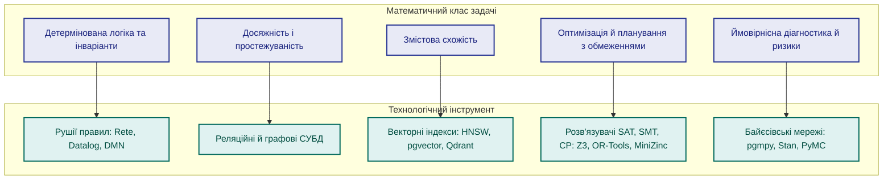

# Глава 17. Технологічний стек: критерії вибору інструментів, мов програмування та рушіїв правил

> **Книга:** [Архітектура доказових експертних систем](README.md) · [Частина IV: Архітектура, виконання та механізми висновку](part-04-architecture-and-inference.md)  
> **Попередня глава:** [Глава 16. Архітектура експертної системи: від формального знання до доказового рішення](ch16-expert-systems-architecture.md)  
> **Наступна глава:** [Глава 18. Інфраструктура виконання: локальні моделі, апаратні прискорювачі, Edge та On-Premise](ch18-execution-infrastructure.md)  
> **Зміст книги:** [README.md](README.md)  
> **Автор:** [Микола Федчик](about-the-author.md)  
> **Рівень:** середній і поглиблений: системні архітектори, розробники експертних систем, інженери даних  
> **Очікувані результати:** обирати інструмент за математичним класом задачі, роллю в архітектурі та поведінкою під час відмов; розподіляти мови програмування за шарами відповідальності; знаходити залежні артефакти рекурсивним запитом SQL; записувати рішення таблицями DMN і помічати в них прогалини; зіставляти задачі оптимізації й планування з розв'язувачами; пояснювати, чому зміна середовища виконання моделі впливає на відтворюваність доказового пакета.

Попередні глави розібрали математичний апарат експертних систем (логіку, мережі Rete, підтримання істинності, ймовірнісні оцінки, міркування за прецедентами, графові алгоритми) і архітектуру, у якій ці методи працюють разом. Тепер постає практичне запитання: якими мовами програмування, бібліотеками й рушіями реалізувати цю архітектуру. Доки розробник не розуміє, до якого математичного класу належить інженерна задача, вибір інструмента перетворюється на колекціонування модних назв.

Єдиного правильного технологічного стека не існує: промислова експертна система неминуче різнорідна. Знання розподілено між реляційними таблицями, графами простежуваності, декларативними правилами, векторними індексами, документами й політиками доступу. Ця глава відповідає на запитання: **як обрати інструменти реалізації так, щоб вибір випливав із задачі, а не з моди?** Теза глави: **інструмент обирають за трьома критеріями: математичним класом задачі, роллю компонента в архітектурі (архітектурне ядро чи замінний адаптер) і поведінкою інструмента під час відмов. Правила, запити й обмеження варто записувати декларативними мовами, придатними для перевірки, а мови загального програмування розподіляти за шарами відповідальності.**

Перший критерій найлегше показати діаграмою: п'ять математичних класів задач і технологічні класи, що їм відповідають.



Діаграма читається зліва направо: спершу формулюють задачу математично, потім обирають клас інструмента. Перевірка інваріанта «вимога рівня SIL 3 не закрита без двох звітів» є задачею детермінованої логіки, і для неї потрібен рушій правил, а не векторний пошук. Запитання «які модулі зачіпає зміна вимоги» є задачею досяжності в графі. Запитання «чи є схожі інциденти в минулому» є задачею змістової схожості. Наступні розділи розглядають кожен шар стека, починаючи з мов програмування.

## Мови програмування за шарами відповідальності

Ранні експертні системи часто писали цілком на Lisp чи Prolog. Сучасні промислові експертні системи будують переважно на мовах загального програмування, бо вимоги до середовища змінилися: потрібні зрілі системні бібліотеки, передбачуване керування пам'яттю, підтримка конкурентності, інтерфейс до бібліотек на C (*Foreign Function Interface*, FFI) та інтеграція з інфраструктурою розгортання. Логічні мови при цьому не зникли: вони живуть у вигляді вбудованих декларативних мов правил і запитів, про які йдеться далі. Кожна мова загального програмування займає свій шар.

### Go: сервісний шар і координація

Go добре підходить для комунікаційного каркаса експертної системи: сервісів архітектурного ядра, брокерів подій, утиліт командного рядка, агентів синхронізації та вхідних шлюзів API. Компілятор Go створює статично зв'язаний виконуваний файл без зовнішніх залежностей, а легкі потоки виконання (*goroutines*) дають змогу обробляти сотні паралельних потоків даних. На Go написано, зокрема, середовище запуску локальних мовних моделей Ollama [[1]](#src-1) і сервер обміну повідомленнями NATS [[2]](#src-2), тому інтеграція експертної системи з цими компонентами не потребує мовних мостів.

Для задач експертної системи на Go є такі бібліотеки:

- `hyperjumptech/grule-rule-engine`: рушій правил із власною мовою правил GRL, натхненний Drools [[3]](#src-3);
- `sashabaranov/go-openai`: клієнт API у форматі OpenAI, який працює й з локальними сервісами, сумісними з цим форматом [[4]](#src-4);
- `yalue/onnxruntime_go`: обгортка над ONNX Runtime для виконання локальних моделей векторних представлень і класифікаторів [[5]](#src-5);
- `ledongthuc/pdf`: читання PDF-документів засобами Go [[6]](#src-6);
- `tree-sitter/go-tree-sitter`: прив'язки до tree-sitter для структурного розбору вихідного коду на синтаксичні дерева [[7]](#src-7).

### C і C++: обчислювальні ядра

C і C++ лишаються основою всього, що працює близько до апаратури й потребує максимальної продуктивності: обчислювальних ядер векторизації, драйверів апаратних прискорювачів, бібліотек квантування нейромереж. Проєкт llama.cpp виконує мовні моделі засобами C/C++ [[8]](#src-8), а набір інструментів OpenVINO оптимізує й розгортає моделі на процесорах, графічних процесорах і нейронних процесорах (*Neural Processing Unit*, NPU) Intel [[9]](#src-9). Класичний рушій продукційних правил CLIPS написано мовою C для переносності між платформами [[10]](#src-10); CLIPS досі використовують як вбудований рушій правил у застосунках на C і C++.

### Rust: безпека пам'яті на межі з ненадійними даними

Rust обирають для модулів, де потрібна швидкодія рівня C++ разом із гарантіями компілятора щодо безпеки пам'яті: відсутністю звертань до звільненої пам'яті (*use-after-free*) і гонок даних (*data races*). Типові місця застосування: розбір мережевих повідомлень і файлів із ненадійних джерел, агенти на периферійних пристроях, потокова обробка телеметрії. Рушій бізнес-правил Zen має ядро на Rust і прив'язки до багатьох мов [[11]](#src-11). Варто зауважити, що Zen описує рішення власною моделлю JDM (*JSON Decision Model*), а не стандартом DMN, тож переносити таблиці рішень між Zen і рушіями DMN без перетворення не вийде.

### Python: офлайнова лабораторія знань

Python є стандартом для досліджень, прототипування, навчання моделей та офлайнового оцінювання якості. Тут працюють бібліотеки PyTorch, scikit-learn, spaCy, NetworkX, PyMC для ймовірнісного програмування, Google OR-Tools для комбінаторної оптимізації та Ragas для оцінювання генерації з доповненням. У шляху читання з жорсткими вимогами до затримки Python поступається скомпільованим програмам. Одна з причин полягає в глобальному блокуванні інтерпретатора (*Global Interpreter Lock*, GIL), яке в стандартній збірці CPython не дає потокам виконувати байт-код паралельно. PEP 703 зробив GIL необов'язковим, і в Python 3.13 з'явилася експериментальна збірка без GIL [[12]](#src-12), але сторонні бібліотеки підтримують таку збірку не всі. Тому Python у промисловій експертній системі зазвичай працює офлайн: готує еталонні набори даних, навчає моделі, рахує метрики.

### TypeScript: інтерфейси експертного аудиту

TypeScript потрібен для робочих місць експертів: візуалізації графів простежуваності, інтерактивного аналізу дерев доведення, редагування таблиць рішень. Інженерний інтерфейс є повноцінним компонентом доказової експертної системи, бо саме через нього людина бачить логіку рішення й ухвалює остаточне рішення.

З практики автора: в одному з проєктів добре себе показав такий розподіл. Сервіси архітектурного ядра, черги й координацію написано на Go; числові операції векторизації виконують бібліотеки C++ (OpenVINO, ONNX Runtime), викликані через cgo; Python винесено в офлайнову частину для навчання й підготовки еталонних наборів; інтерфейс написано на TypeScript. Цей розподіл не є єдино правильним: він залежить від компетенцій команди й вимог до затримки. Межі між шарами задають контракти даних із [Глави 16](ch16-expert-systems-architecture.md), тому мову окремого шару можна замінити, не зачіпаючи інших шарів.

## Мови запитів до знань

Мови загального програмування реалізують сервіси, але факти й зв'язки краще адресувати декларативними мовами запитів. Декларативний запит описує, що треба знайти, а не як, тому його легше перевірити, оптимізувати й відтворити.

### SQL і рекурсивні запити

SQL забезпечує транзакційну цілісність і зберігає версії артефактів, події аудиту, матриці доступу й канонічні таблиці фактів. Рекурсивні загальні табличні вирази (*Common Table Expressions*, CTE) дають змогу обходити ієрархії й графи без окремої графової СУБД [[13]](#src-13). Розгляньмо задачу аналізу впливу змін: які артефакти зачіпає зміна вимоги REQ-7, якщо зв'язки простежуваності зберігаються в таблиці `trace(src, dst)`. Програма мовою Python використовує лише стандартний модуль `sqlite3`; у даних навмисно є зворотне посилання, що утворює цикл.

```python
import sqlite3

con = sqlite3.connect(":memory:")
con.executescript("""
CREATE TABLE trace(src TEXT, dst TEXT);
INSERT INTO trace VALUES
  ('REQ-7',  'DES-3'),
  ('DES-3',  'MOD-12'),
  ('DES-3',  'MOD-14'),
  ('MOD-12', 'TC-40'),
  ('MOD-14', 'TC-41'),
  ('MOD-14', 'MOD-12'),
  ('TC-41',  'DES-3'),   -- зворотне посилання утворює цикл
  ('REQ-9',  'MOD-14');
""")

QUERY = """
WITH RECURSIVE impact(node, depth, path) AS (
  SELECT 'REQ-7', 0, '/REQ-7/'
  UNION ALL
  SELECT t.dst, i.depth + 1, i.path || t.dst || '/'
  FROM trace AS t JOIN impact AS i ON t.src = i.node
  WHERE instr(i.path, '/' || t.dst || '/') = 0
)
SELECT node, MIN(depth) FROM impact GROUP BY node ORDER BY 2, 1;
"""

for node, depth in con.execute(QUERY):
    print(depth, node)
print("SQLite", sqlite3.sqlite_version)
```

Програма виводить:

```text
0 REQ-7
1 DES-3
2 MOD-12
2 MOD-14
3 TC-40
3 TC-41
SQLite 3.50.4
```

Рекурсивна частина запиту крок за кроком додає артефакти, на які посилаються вже знайдені, і записує шлях у стовпець `path`. Умова `instr(...) = 0` не пускає запит у вузол, який уже є на поточному шляху: без цієї умови цикл DES-3, MOD-14, TC-41, DES-3 породжував би рядки нескінченно. `MIN(depth)` залишає для кожного артефакту найкоротшу відстань: модуль MOD-12 досяжний і за два кроки, і за три (через MOD-14), а результат показує два. Вимога REQ-9 теж посилається на MOD-14, але не залежить від REQ-7, тому до результату не потрапила. Для неглибоких ієрархій такого запиту достатньо; графова СУБД стає виправданою, коли запити шукають шаблони шляхів змінної довжини на мільйонах ребер або потребують графових алгоритмів.

### Cypher, GQL і SPARQL

Мови запитів до графів властивостей описують шаблони вузлів і ребер. Мова Cypher поширилася разом із графовою СУБД Neo4j, а 2024 року ISO і IEC опублікували стандарт мови запитів до графів GQL (ISO/IEC 39075:2024) [[14]](#src-14). SPARQL є стандартом W3C для запитів до трійок RDF та онтологій OWL [[15]](#src-15); у [Главі 16](ch16-expert-systems-architecture.md) запит SPARQL зі шляхом властивостей відновлював походження рішення.

### Datalog

Datalog є декларативною логічною мовою, синтаксично близькою до підмножини Prolog без функціональних символів [[16]](#src-16). Те саме відношення впливу, що й у прикладі SQL, мовою Datalog записують двома правилами:

```prolog
affects(X, Y) :- trace(X, Y).
affects(X, Z) :- trace(X, Y), affects(Y, Z).
```

Перше правило каже, що прямий зв'язок є впливом, друге робить вплив транзитивним. Обчислення Datalog над скінченною множиною фактів завжди завершується, бо множина можливих висновків скінченна, тому циклічні зв'язки не потребують ручного захисту, як у запиті SQL. Ця властивість робить Datalog зручним для правил дедуктивного виведення, перевірки інваріантів безпеки й аналізу досяжності.

## Рушії правил і таблиці рішень

Декларативні правила не повинні розпорошуватися по вихідному коду у вигляді розрізнених операторів `if/else`. Правило є керованим інженерним артефактом з однозначним ідентифікатором, версією, автором, зв'язком із пунктом нормативу та власним життєвим циклом. Рушій правил дає змогу зберігати правила окремо від коду й застосовувати їх передбачувано.

### Класичні рушії правил

Більшість продукційних рушіїв спирається на алгоритм Rete Чарльза Форгі, який зберігає часткові збіги умов між циклами виведення й не перевіряє всі правила проти всіх фактів заново [[17]](#src-17). CLIPS виконує пряме виведення (*forward chaining*) і вбудовується в застосунки на C. Drools є рушієм правил, рушієм DMN і рушієм обробки складних подій для Java; Drools використовує алгоритм Phreak, розвиток Rete [[18]](#src-18). Grule для Go та NRules для .NET [[19]](#src-19) вбудовуються безпосередньо в сервіси.

### DMN і FEEL

Стандарт моделі й нотації рішень DMN (*Decision Model and Notation*) консорціуму OMG, остання версія якого 1.5 вийшла у серпні 2024 року [[20]](#src-20), розв'язує проблему взаємодії розробників з інженерами предметної області. Стандарт має три складові: таблиці рішень, які може перевіряти людина без навичок програмування; діаграми вимог до рішень (*Decision Requirements Diagrams*, DRD), що показують залежності між рішеннями та вхідними даними; і мову виразів FEEL (*Friendly Enough Expression Language*) без побічних ефектів.

Таблиця нижче є прикладом рішення про допуск релізу. Перша клітинка задає політику спрацювання U (*Unique*): для будь-яких вхідних даних може спрацювати не більше ніж одне правило. У клітинках умов записано унарні тести FEEL, а прочерк означає «будь-яке значення».

| U | Відкриті критичні дефекти | Покриття вимог тестами | Тести безпеки | Рішення |
|---|---|---|---|---|
| 1 | `> 0` | `-` | `-` | `"BLOCK"` |
| 2 | `0` | `< 0.95` | `-` | `"BLOCK"` |
| 3 | `0` | `>= 0.95` | `"fail"` | `"BLOCK"` |
| 4 | `0` | `>= 0.95` | `"pass"` | `"RELEASE"` |

Правила не перетинаються: перше охоплює будь-яку кількість критичних дефектів понад нуль, друге і третє з четвертим ділять решту випадків за покриттям і результатом тестів безпеки. Проте таблиця неповна. Якщо тести безпеки повернули значення `"error"`, жодне правило не спрацює, і рушій DMN поверне порожній результат. Експертна система, що трактує порожній результат як дозвіл, пропустить реліз з незавершеними тестами безпеки. Тому порожній результат має означати блокування, а ще краще додати до таблиці явне правило для `"error"`. Перевірку повноти й несуперечливості таблиць рішень розглянуто в [Главі 23](ch23-knowledge-base-verification.md).

## Сховища за фізичною формою даних

Вибір сховища визначає природа знання, яке в ньому зберігається. Причини такого розподілу пояснено в [Главі 16](ch16-expert-systems-architecture.md); таблиця зіставляє типи сховищ із прикладами продуктів і типовими запитами.

| Тип сховища | Приклади продуктів | Клас знань | Типовий запит |
|---|---|---|---|
| **Реляційні СУБД** | PostgreSQL, SQLite, Microsoft SQL Server | Канонічні факти, ревізії нормативів, аудит | «Яка редакція правила діяла під час випробувань 12 травня?» |
| **Графові СУБД** | Neo4j, ArangoDB, Amazon Neptune | Простежуваність «вимога, тест, дефект» | «Які модулі зачіпає зміна вимоги з ISO 26262?» |
| **Сховища трійок RDF** | GraphDB, Stardog, Apache Jena | Онтології OWL, таксономії | «Знайти всі типи датчиків, що належать до класу SafetyCritical» |
| **Лексичний пошук** | OpenSearch, Elasticsearch, SQLite FTS5 | Специфікації, коди помилок, артикули | «Знайти звіти про дефекти зі словами overheat і vibration» |
| **Векторні СУБД** | Qdrant, pgvector, Milvus, Weaviate | Змістові фрагменти нормативів, схожі прецеденти | «Знайти нормативи зі схожими вимогами до вологозахисту корпусу» |
| **Бази часових рядів** | TimescaleDB, InfluxDB, Prometheus | Тренди надійності, динаміка покриття тестами | «Чи зростає час спрацювання клапана за останні п'ять циклів?» |

Таблиця підкреслює, що жоден продукт не закриває всіх рядків. Приклад із рекурсивним SQL показав, що частину графових запитів можна виконати в реляційній СУБД, тому окреме сховище варто додавати лише тоді, коли воно розв'язує конкретну задачу, яку наявні сховища не розв'язують.

## Оптимізація, планування та розв'язання обмежень

Рушій правил відповідає на запитання «чи допустимий цей стан». Інструменти оптимізації відповідають на інше запитання: «як знайти найкращий допустимий стан серед мільйонів можливих». Цей клас поділяється на чотири групи:

- **Розв'язувачі SAT і SMT** перевіряють, чи існують вхідні значення, за яких специфікація порушується. Поширені розв'язувачі цього класу: Z3 [[21]](#src-21) і cvc5 [[22]](#src-22); приклад пошуку суперечності між вимогами за допомогою Z3 наведено в [Главі 14](ch14-requirements-detection-and-formalization.md).
- **Програмування в обмеженнях** розв'язує комбінаторні задачі з жорсткими обмеженнями: складання розкладів випробувань, конфігурацію модульного обладнання. Сюди належать розв'язувач CP-SAT з OR-Tools [[23]](#src-23) і мова моделювання MiniZinc [[24]](#src-24), яка відокремлює опис задачі від конкретного розв'язувача.
- **Математичне програмування** (лінійне, квадратичне, змішане цілочисельне) балансує ресурси дослідницьких проєктів.
- **Автоматичне планування** будує послідовність дій, що переводить об'єкт керування з початкового стану в цільовий. Планувальник Fast Downward розв'язує задачі, описані мовою PDDL (*Planning Domain Definition Language*) [[25]](#src-25). Якщо експертна система фіксує провал сертифікації, планувальник може запропонувати мінімальну послідовність коригувальних дій, а експертна система перевіряє цю послідовність правилами.

Усі чотири групи мають спільну властивість, важливу для доказовості: результат можна перевірити незалежно від розв'язувача. Знайдений розклад перевіряють підстановкою в обмеження, а для висновку «рішення не існує» SMT-розв'язувачі можуть видати ядро суперечності, як показано в Главі 14.

## Виконання моделей і апаратні прискорювачі

Локальні нейромережеві моделі виконують в експертній системі роль адаптерів: класифікують документи, витягують параметри, формулюють чернетки пояснень. Їхнє виконання підкоряється ланцюжку перетворень від файлу моделі до апаратного прискорювача, показаному на діаграмі.

```mermaid
flowchart LR
    accTitle: Ланцюжок виконання моделі від файлу до апаратури
    accDescr: Модель проходить через проміжне представлення, компілятор, середовище виконання й апаратний прискорювач, а метрики виконання повертаються для калібрування.

    A["<b>Модель і токенізатор</b><br/>GGUF, FP16, INT8, INT4"] --> B["<b>Проміжне представлення</b><br/>ONNX, OpenVINO IR"]
    B --> C["<b>Компілятор і SDK</b><br/>CUDA, ROCm, oneAPI, QNN"]
    C --> D["<b>Середовище виконання</b><br/>OpenVINO, llama.cpp, vLLM, ONNX Runtime"]
    D --> E["<b>Апаратний прискорювач</b><br/>CPU, GPU, NPU, ASIC"]
    E --> F["<b>Метрики</b><br/>токени за секунду, затримка P95, пам'ять, потужність"]
    F -.->|"калібрування"| A

    classDef src fill:#e1f5fe,stroke:#0288d1,stroke-width:2px,color:#01579b;
    classDef ir fill:#ede7f6,stroke:#512da8,stroke-width:2px,color:#311b92;
    classDef hw fill:#fff3e0,stroke:#e65100,stroke-width:2px,color:#bf360c;
    classDef metrics fill:#e8f5e9,stroke:#2e7d32,stroke-width:2px,color:#1b5e20;

    class A,B src;
    class C,D ir;
    class E hw;
    class F metrics;
```



Кожна ланка ланцюжка впливає на результат: формат і точність ваг (FP16, INT8, INT4), версія компілятора, середовище виконання й навіть тип прискорювача. Таблиця порівнює чотири поширені середовища виконання.

| Інструмент | Мова реалізації | Ніша | Особливість |
|---|---|---|---|
| **llama.cpp** | C/C++ | Робочі станції, периферійні й вбудовані пристрої | Не потребує Python, підтримує квантовані формати GGUF |
| **Ollama** | Go, використовує llama.cpp | Локальні сервери розробки, автономні робочі місця | Простий REST API, завантаження й керування моделями |
| **vLLM** | Python, CUDA, C++ | Сервери з графічними процесорами під високим навантаженням | Керування пам'яттю кешу ключів і значень за алгоритмом PagedAttention [[26]](#src-26) |
| **OpenVINO** | C++, Python | Сервери й робочі станції на апаратурі Intel | Оптимізація під процесори, графічні процесори й NPU Intel |

Для доказовості важливо, що зміна будь-якої ланки змінює числові результати моделі. Перехід із FP16 на INT4 або оновлення середовища виконання може змінити класифікацію документа чи текст пояснення. Якщо доказовий пакет посилається на вихід моделі, цей пакет має фіксувати відбиток усього ланцюжка (модель, квантування, середовище виконання, версію драйвера), а після зміни ланцюжка регресійні тести з [Глави 16](ch16-expert-systems-architecture.md) треба запустити повторно. Фізичне розгортання цього ланцюжка на конкретній апаратурі розглядає [Глава 18](ch18-execution-infrastructure.md).

## Карта п'ятнадцяти класів технологій

Щоб стек не розростався безсистемно, корисно звіряти його з картою класів технологій, згрупованих за п'ятьма рівнями.

```mermaid
flowchart TD
    accTitle: Карта п'ятнадцяти класів технологій доказової експертної системи
    accDescr: П'ятнадцять класів технологій, згрупованих за рівнями: символьне виведення, моделі знань і сховища, пошук і оптимізація, нейромережеві адаптери, контроль і безпека.

    subgraph CoreLevel["Рівень 1: Символьне виведення"]
        C1["1. Рушії правил і Rete"]
        C2["2. Підтримання істинності (TMS)"]
        C3["3. Облік впевненості й невизначеності"]
        C4["4. Таблиці рішень (DMN, FEEL)"]
    end

    subgraph DataLevel["Рівень 2: Моделі знань і сховища"]
        D1["5. Семантичний веб (RDF, OWL, SHACL)"]
        D2["6. Ймовірнісні графові моделі"]
        D3["7. Бази прецедентів (CBR)"]
        D4["8. Реляційні, графові й часові СУБД"]
    end

    subgraph AlgLevel["Рівень 3: Пошук і оптимізація"]
        A1["9. Розв'язувачі SAT, SMT і оптимізатори"]
        A2["10. Планувальники дій (PDDL)"]
        A3["11. Гібридний пошук (BM25 і HNSW)"]
    end

    subgraph MLLevel["Рівень 4: Нейромережеві адаптери"]
        M1["12. Локальні середовища виконання моделей"]
        M2["13. Збирання документів (OCR, tree-sitter, ReqIF)"]
        M3["14. Пояснюваний ШІ та метрики генерації"]
    end

    subgraph GovLevel["Рівень 5: Контроль і безпека"]
        G1["15. Рушії політик (OPA, Rego) і походження (PROV-O)"]
    end

    CoreLevel --> DataLevel
    DataLevel --> AlgLevel
    AlgLevel --> MLLevel
    MLLevel --> GovLevel

    classDef clrCore fill:#e3f2fd,stroke:#1565c0,stroke-width:2px,color:#0d47a1;
    classDef clrData fill:#e8f5e9,stroke:#2e7d32,stroke-width:2px,color:#1b5e20;
    classDef clrAlg fill:#fff3e0,stroke:#e65100,stroke-width:2px,color:#bf360c;
    classDef clrML fill:#f3e5f5,stroke:#7b1fa2,stroke-width:2px,color:#4a148c;
    classDef clrGov fill:#fbe9e7,stroke:#d84315,stroke-width:2px,color:#bf360c;

    class C1,C2,C3,C4 clrCore;
    class D1,D2,D3,D4 clrData;
    class A1,A2,A3 clrAlg;
    class M1,M2,M3 clrML;
    class G1 clrGov;
```



Карта не вимагає використовувати всі п'ятнадцять класів у кожному проєкті. Вона слугує контрольним списком: для кожного класу архітектор має або назвати обраний інструмент, або обґрунтувати, чому цей клас задач у проєкті не виникає. Порожня клітинка без обґрунтування зазвичай означає, що задача розв'язується неявно, наприклад правилами, захованими в коді, або оцінками впевненості без калібрування.

## Три уроки вибору технологій

1. **Інструмент обирають під клас задачі.** Вибір, що починається з гасла «впровадимо векторну базу», а не з математичного формулювання проблеми, веде в архітектурний глухий кут. Для контролю несуперечливості потрібні Datalog або SHACL, для простежуваності графові структури, для змістової схожості векторні індекси.
2. **Фреймворк не компенсує відсутності канонічної моделі знань.** Жоден оркестратор на кшталт LangChain чи LlamaIndex не зробить експертну систему доказовою, якщо документи не мають статусів ревізій, міток допуску й зв'язків у графі. Підключення нейромережі до неструктурованих даних лише пришвидшує генерацію правдоподібних помилок.
3. **Технологію оцінюють за поведінкою під час відмови.** Головне запитання до бібліотеки звучить не як «наскільки гарна демонстрація», а як «що станеться при втраті зв'язку, мовчазній зміні схеми чи оновленні ваг моделі». Якщо оновлення моделі векторних представлень непомітно ламає відтворюваність учорашнього сертифіката, інструмент не готовий до промислової експлуатації.

## Висновок

Технологічний стек експертної системи випливає з трьох критеріїв: математичного класу задачі, ролі компонента в архітектурі та поведінки під час відмов. Детерміновані правила виконують рушії правил і таблиці рішень, досяжність і простежуваність обслуговують рекурсивні запити й графові сховища, оптимізацію виконують розв'язувачі, а нейромережеві компоненти працюють як адаптери під контролем контрактів і регресійних тестів.

Глава показала ці критерії на перевірюваних прикладах. Рекурсивний запит SQL знайшов усі артефакти, яких зачіпає зміна вимоги, і не зациклився на зворотному посиланні; той самий запит мовою Datalog займає два правила й завершується без ручного захисту. Таблиця рішень DMN виявила прогалину для результату тестів `"error"`, яку треба закрити явним правилом або трактуванням порожнього результату як блокування. Огляд середовищ виконання моделей показав, чому зміна квантування чи середовища вимагає повторного регресійного контролю.

Межі цих порад теж треба назвати. Перелічені продукти й бібліотеки є прикладами, а не рекомендаціями на всі випадки: їхні можливості змінюються з версіями, і перед вибором треба перевірити поточну документацію. Розподіл мов за шарами відображає один практичний досвід і залежить від команди. [Глава 18](ch18-execution-infrastructure.md) переходить від вибору інструментів до фізичного розгортання: як забезпечити автономність експертної системи на локальній апаратурі, енергоспоживання на периферійних пристроях і стабільну затримку в закритих промислових мережах.

## Запитання для самоперевірки

1. Чому для сервісного шару експертної системи часто обирають Go, а Python залишають в офлайновій частині? Яку роль тут відіграє GIL?
2. Навіщо в рекурсивному запиті SQL умова на стовпець `path` і чому запит Datalog для того самого відношення такої умови не потребує?
3. Коли реляційної СУБД із рекурсивними запитами недостатньо і варто додавати графову СУБД?
4. Що означає політика спрацювання U у таблиці DMN і яку прогалину має наведена таблиця допуску релізу?
5. Чим завдання розв'язувача SMT відрізняється від завдання рушія правил і як перевірити результат розв'язувача незалежно від нього?
6. Чому зміна квантування моделі з FP16 на INT4 чи оновлення середовища виконання впливає на відтворюваність доказового пакета?

## Словник

| Український термін | Англійський відповідник | Коротке пояснення |
|---|---|---|
| Технологічний стек | Technology stack | Сукупність мов, бібліотек, рушіїв і сховищ, з яких зібрано експертну систему |
| Рушій правил | Rule engine | Програма, що застосовує декларативні правила до фактів |
| Пряме виведення | Forward chaining | Виведення від фактів до висновків |
| Таблиця рішень | Decision table | Табличний запис правил, у якому рядки є правилами, а стовпці умовами й результатами |
| Політика спрацювання | Hit policy | Правило DMN, що визначає, скільки рядків таблиці може спрацювати і як поєднати результати |
| Унарний тест | Unary test | Умова FEEL у клітинці таблиці рішень, наприклад `>= 0.95` |
| Рекурсивний табличний вираз | Recursive CTE | Запит SQL, що повторно звертається до власного результату |
| Аналіз впливу змін | Change impact analysis | Пошук артефактів, яких зачіпає зміна |
| Програмування в обмеженнях | Constraint programming | Розв'язання задач, заданих змінними та обмеженнями на них |
| Автоматичне планування | Automated planning | Побудова послідовності дій, що переводить об'єкт керування в цільовий стан |
| Квантування | Quantization | Зменшення розрядності ваг моделі, наприклад з FP16 до INT4 |
| Середовище виконання моделі | Inference runtime | Програма, що виконує навчену модель на апаратурі |
| Проміжне представлення | Intermediate representation | Формат моделі між навчанням і компіляцією під апаратуру |
| Легкий потік виконання | Goroutine | Потік виконання Go, яким керує середовище виконання мови |
| Глобальне блокування інтерпретатора | Global Interpreter Lock | Механізм CPython, що не дає потокам виконувати байт-код паралельно |

## Абревіатури

| Скорочення | Розшифрування | Значення |
|---|---|---|
| API | Application Programming Interface | програмний інтерфейс |
| ASIC | Application-Specific Integrated Circuit | спеціалізована інтегральна схема |
| CBR | Case-Based Reasoning | міркування за прецедентами |
| CLIPS | C Language Integrated Production System | рушій продукційних правил мовою C |
| CP | Constraint Programming | програмування в обмеженнях |
| CPU | Central Processing Unit | центральний процесор |
| CTE | Common Table Expression | загальний табличний вираз SQL |
| DMN | Decision Model and Notation | модель і нотація рішень OMG |
| DRD | Decision Requirements Diagram | діаграма вимог до рішень |
| FEEL | Friendly Enough Expression Language | мова виразів DMN |
| FFI | Foreign Function Interface | інтерфейс виклику функцій іншої мови |
| GGUF | формат файлів бібліотеки ggml | формат зберігання квантованих моделей для llama.cpp |
| GIL | Global Interpreter Lock | глобальне блокування інтерпретатора |
| GPU | Graphics Processing Unit | графічний процесор |
| GQL | Graph Query Language | стандартна мова запитів до графів |
| GRL | Grule Rule Language | мова правил Grule |
| HNSW | Hierarchical Navigable Small World | графовий індекс для пошуку найближчих векторів |
| IR | Intermediate Representation | проміжне представлення |
| JDM | JSON Decision Model | модель рішень рушія Zen |
| NPU | Neural Processing Unit | нейронний процесор |
| OCR | Optical Character Recognition | оптичне розпізнавання символів |
| OMG | Object Management Group | консорціум стандартів моделювання |
| OPA | Open Policy Agent | рушій декларативних політик доступу |
| PDDL | Planning Domain Definition Language | мова опису задач планування |
| PEP | Python Enhancement Proposal | пропозиція щодо розвитку Python |
| RDF | Resource Description Framework | модель даних у вигляді трійок |
| SAT | Boolean Satisfiability | задача виконуваності булевих формул |
| SIL | Safety Integrity Level | рівень цілісності безпеки |
| SMT | Satisfiability Modulo Theories | виконуваність з урахуванням теорій |
| SPARQL | SPARQL Protocol and RDF Query Language | мова запитів до графів RDF |
| SQL | Structured Query Language | мова запитів до реляційних баз даних |
| СУБД | система управління базами даних | програмне забезпечення для зберігання даних і запитів до них |

## Джерела

1. <a id="src-1"></a>Ollama. [*ollama/ollama*](https://github.com/ollama/ollama). GitHub.
2. <a id="src-2"></a>NATS.io. [*nats-io/nats-server: High-Performance Server for NATS.io*](https://github.com/nats-io/nats-server). GitHub.
3. <a id="src-3"></a>hyperjumptech. [*grule-rule-engine: Rule Engine Implementation in Golang*](https://github.com/hyperjumptech/grule-rule-engine). GitHub.
4. <a id="src-4"></a>sashabaranov та учасники проєкту. [*go-openai: OpenAI API Clients for Go*](https://github.com/sashabaranov/go-openai). GitHub.
5. <a id="src-5"></a>yalue. [*onnxruntime_go: A Go Library Wrapping Microsoft ONNX Runtime*](https://github.com/yalue/onnxruntime_go). GitHub.
6. <a id="src-6"></a>ledongthuc. [*pdf: PDF Reader*](https://github.com/ledongthuc/pdf). GitHub.
7. <a id="src-7"></a>Tree-sitter. [*go-tree-sitter: Go Bindings for Tree-sitter*](https://github.com/tree-sitter/go-tree-sitter). GitHub.
8. <a id="src-8"></a>ggml-org. [*llama.cpp: LLM Inference in C/C++*](https://github.com/ggml-org/llama.cpp). GitHub.
9. <a id="src-9"></a>Intel Corporation. [*OpenVINO Documentation*](https://docs.openvino.ai/).
10. <a id="src-10"></a>CLIPS. [*CLIPS: A Tool for Building Expert Systems*](https://www.clipsrules.net/).
11. <a id="src-11"></a>GoRules. [*zen: Open-Source Business Rules Engine*](https://github.com/gorules/zen). GitHub.
12. <a id="src-12"></a>Sam Gross. [*PEP 703: Making the Global Interpreter Lock Optional in CPython*](https://peps.python.org/pep-0703/). Python Software Foundation, 2023.
13. <a id="src-13"></a>SQLite. [*The WITH Clause*](https://www.sqlite.org/lang_with.html). Документація SQLite.
14. <a id="src-14"></a>ISO, IEC. [*ISO/IEC 39075:2024. Information Technology: Database Languages: GQL*](https://www.iso.org/standard/76120.html). 2024.
15. <a id="src-15"></a>Steve Harris, Andy Seaborne (ред.). [*SPARQL 1.1 Query Language*](https://www.w3.org/TR/sparql11-query/). W3C Recommendation, 2013.
16. <a id="src-16"></a>S. Ceri, G. Gottlob, L. Tanca. [*What You Always Wanted to Know About Datalog (and Never Dared to Ask)*](https://doi.org/10.1109/69.43410). *IEEE Transactions on Knowledge and Data Engineering*, 1(1), 146–166, 1989.
17. <a id="src-17"></a>Charles L. Forgy. [*Rete: A Fast Algorithm for the Many Pattern/Many Object Pattern Match Problem*](https://doi.org/10.1016/0004-3702(82)90020-0). *Artificial Intelligence*, 19(1), 17–37, 1982.
18. <a id="src-18"></a>Apache KIE. [*Drools Rule Engine*](https://docs.drools.org/latest/drools-docs/drools/rule-engine/index.html). Документація Drools.
19. <a id="src-19"></a>NRules. [*NRules: Rules Engine for .NET, Based on the Rete Matching Algorithm*](https://github.com/NRules/NRules). GitHub.
20. <a id="src-20"></a>Object Management Group. [*Decision Model and Notation (DMN), Version 1.5*](https://www.omg.org/spec/DMN/1.5/About-DMN). OMG, 2024.
21. <a id="src-21"></a>Leonardo de Moura, Nikolaj Bjørner. [*Z3: An Efficient SMT Solver*](https://doi.org/10.1007/978-3-540-78800-3_24). *Tools and Algorithms for the Construction and Analysis of Systems (TACAS)*, LNCS, 337–340, 2008.
22. <a id="src-22"></a>Haniel Barbosa та ін. [*cvc5: A Versatile and Industrial-Strength SMT Solver*](https://doi.org/10.1007/978-3-030-99524-9_24). *Tools and Algorithms for the Construction and Analysis of Systems (TACAS)*, LNCS, 415–442, 2022.
23. <a id="src-23"></a>Google. [*CP-SAT Solver*](https://developers.google.com/optimization/cp/cp_solver). Документація OR-Tools.
24. <a id="src-24"></a>Nicholas Nethercote, Peter J. Stuckey, Ralph Becket, Sebastian Brand, Gregory J. Duck, Guido Tack. [*MiniZinc: Towards a Standard CP Modelling Language*](https://doi.org/10.1007/978-3-540-74970-7_38). *Principles and Practice of Constraint Programming (CP 2007)*, LNCS, 529–543, 2007.
25. <a id="src-25"></a>Malte Helmert. [*The Fast Downward Planning System*](https://doi.org/10.1613/jair.1705). *Journal of Artificial Intelligence Research*, 26, 191–246, 2006.
26. <a id="src-26"></a>Woosuk Kwon та ін. [*Efficient Memory Management for Large Language Model Serving with PagedAttention*](https://doi.org/10.1145/3600006.3613165). *Proceedings of the 29th Symposium on Operating Systems Principles (SOSP)*, 611–626, 2023.

---

[← Глава 16. Архітектура експертної системи](ch16-expert-systems-architecture.md) | [Зміст книги](README.md) | [Частина IV](part-04-architecture-and-inference.md) | [Глава 18. Інфраструктура виконання →](ch18-execution-infrastructure.md)
