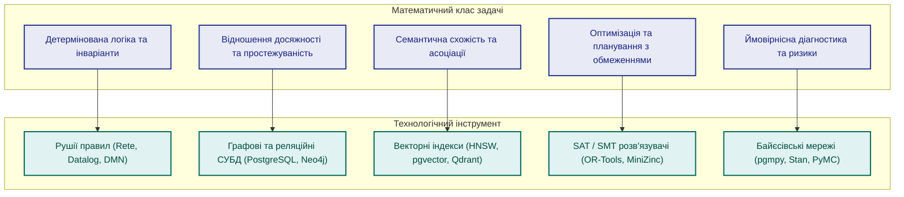

# Глава 17. Технологічний стек: критерії вибору інструментів, мов програмування та рушіїв правил

> **Книга:** [Архітектура доказових експертних систем](README.md) · [Частина IV: Архітектура, виконання та механізми висновку](part-04-architecture-and-inference.md)  
> **Попередня глава:** [Глава 16. Архітектура експертної системи: від формального знання до доказового рішення](ch16-expert-systems-architecture.md)  
> **Наступна глава:** [Глава 18. Інфраструктура виконання: локальні моделі, апаратні прискорювачі, Edge та On-Premise](ch18-execution-infrastructure.md)  
> **Зміст книги:** [README.md](README.md)  
> **Рівень:** системні архітектори, розробники ядра, інженери даних: середній / просунутий  
> **Очікувані результати:** формувати збалансований технологічний стек експертної системи за об'єктивними математичними критеріями; обирати мови програмування за шарами відповідальності (Go/C++/Python/Rust); зіставляти класи задач із відповідними рушіями правил (Rete, Datalog, DMN/FEEL); підбирати спеціалізовані сховища (SQL, Graph, Vector, Time-series); організовувати інтеграцію локальних нейромережевих рантаймів (OpenVINO, ONNX Runtime, llama.cpp, Ollama) із символьним ядром без втрати детермінізму.

У попередніх главах ми розібрали математичний фундамент експертних систем: формальну логіку, мережі Rete, системи підтримання істинності (TMS), ймовірнісні оцінки невизначеності, байєсівські мережі, аналіз прецедентів (CBR), графові алгоритми та оптимізаційне планування. Доки розробник чітко не розуміє, до якого математичного класу належить інженерна проблема, вибір мови програмування чи бібліотеки перетворюється на хаотичне колекціонування модних назв.

Ця глава присвячена практичному вибору інструментів реалізації. Єдиного «ідеального» технологічного стека не існує: промислова експертна система принципово гетерогенна. Знання розподіляються між реляційними таблицями, графами простежуваності, декларативними правилами, векторними просторами ембедингів, неструктурованими документами та політиками доступу. Завдання архітектора — не шукати універсальну платформу для всього, а детерміновано розкласти відповідальність між технологічними шарами.

> **Практичний досвід.** Наведені архітектурні рішення перевірені на практиці у виробничих контурах. Вони підтверджують ефективність конкретних комбінацій технологій, проте вимагають калібрування під профіль навантаження, наявні інженерні компетенції команди та вимоги до часу відгуку в реальному часі.

---

## Мови програмування: шари системної відповідальності

При побудові сучасних систем знань відмова від архаїчних мов раннього ШІ (Lisp, Prolog як основа всього моноліту) на користь сучасних мов загального призначення зумовлена вимогами до надійності середовища: зрілістю системних бібліотек, ефективним керуванням пам'яттю, підтримкою асинхронності, наявністю FFI (Foreign Function Interface) та інтеграцією з хмарною інфраструктурою.

Розподіл мов програмування за шарами відповідальності:

### Go: сервісне ядро, координація та брокери

Go демонструє найвищу ефективність для створення комунікаційного каркаса експертної системи: сервісного ядра, брокерів подій, CLI-інструментів, агентів синхронізації та вхідних API-шлюзів.

- **Переваги:** компіляція у статичний бінарний файл без сторонніх залежностей, низькі накладні витрати на виділення пам'яті, легковажні горутини для конкурентної обробки сотень паралельних потоків даних.
- **AI-інфраструктура:** ключові компоненти сучасного стеків (Ollama, NATS, Docker, Kubernetes) написані саме на Go.
- **Екосистема бібліотек:**
  - `hyperjumptech/grule-rule-engine`: повноцінний рушій правил на базі алгоритму Rete із власною мовою GRL;
  - `sashabaranov/go-openai`: типізований клієнт для взаємодії з локальними рантаймами (Ollama, vLLM) через стандартизований API;
  - `yalue/onnxruntime_go`: швидкі CGO-байндінги до ONNX Runtime для виконання локальних ембедерів і класифікаторів;
  - `ledongthuc/pdf`: нативний розбір PDF-документів без залучення важких C-бібліотек;
  - `tree-sitter/go-tree-sitter`: структурний розбір вихідного коду (C/C++, Python, Rust) на рівні синтаксичних дерев.

### C та C++: високопродуктивні обчислювальні ядра

C/C++ залишаються безальтернативним фундаментом для всього, що взаємодіє з апаратними регістрами та вимагає максимальної продуктивності.

- **Роль у системі:** реалізація обчислювальних ядер векторизації, драйверів апаратних прискорювачів, бібліотек квантування нейромереж.
- **Критичні компоненти:** бібліотека `GGML` та проєкт `llama.cpp`, нативні рушії `whisper.cpp`, оптимізовані інференс-пакети `OpenVINO` та `TensorRT`. Класичний рушій продукційних правил `CLIPS`, написаний на ANSI C, залишається еталоном швидкодії та детермінізму алгоритму Rete.

### Rust: безпека пам'яті та критичні вузли на Edge

Rust обирають для модулів, де критично поєднати швидкодію C++ із математичними гарантіями відсутності помилок роботи з пам'яттю (data races, use-after-free).

- **Роль у системі:** вхідні мережеві парсери ненадійних форматів, критичні агенти на периферійних контролерах (Edge), потокова обробка телеметрії.
- **Інструменти:** `gorules/zen` (Zen Engine) — сучасний високопродуктивний рушій прийняття рішень у стандарті DMN із ядром на Rust; `KSD-CO/rust-rule-engine` — швидка реалізація Rete з підтримкою зворотного виведення.

### Python: дослідницька лабораторія знань та ML-конвеєри

Python є світовим стандартом для етапу досліджень, прототипування, навчання моделей та офлайн-оцінювання якості (Offline Evaluation).

- **Роль у системі:** лабораторія експериментів, аналіз даних, верифікація гіпотез, навчання SLM/LLM.
- **Спеціалізовані бібліотеки:** `PyTorch`, `scikit-learn`, `spaCy`, `NetworkX`, `PyMC` (ймовірнісне програмування), `Google OR-Tools` (комбінаторна оптимізація), `Ragas` (оцінювання доказовості RAG).
- **Архітектурне застереження:** у високопродуктивному production-контурі прийняття рішень у реальному часі інтерпретований Python часто поступається скомпільованим бінарникам через накладні витрати GIL та складність ізоляції середовищ.

### TypeScript / Web: інтерфейси експертного аудиту

TypeScript необхідний для робочих місць експертів: візуалізації графів простежуваності, інтерактивного аналізу дерев доведення (Proof Trees) та конфігурації таблиць рішень. Інженерний інтерфейс — це повноцінний компонент доказової системи, що забезпечує людині прозоре вікно в логіку машини.

> **Практичний досвід.** Оптимальна архітектурна формула: сервісне ядро, черги та координація будуються на Go; числові операції векторизації транслюються у C++ бібліотеки (OpenVINO / ONNX) через cgo; Python повністю виноситься в офлайн-контур для навчання та підготовки еталонних датасетів; користувацький інтерфейс реалізується на Vue / TypeScript.

---

## Мови запитів до знань

Факти та зв'язки в експертній системі потребують виразних засобів адресації:

1. **SQL (Structured Query Language):** фундамент транзакційної цілісності. Зберігає версії артефактів, аудиторські події, матриці доступів та канонічні таблиці фактів. Рекурсивні запити (Common Table Expressions, CTE) дозволяють здійснювати ієрархічний обхід структур без додаткових графових баз.
2. **Cypher / GQL (Graph Query Language):** декларативні мови запитів до топології графів. Оптимізовані для швидкого пошуку ланцюгів трасування, виявлення циклічних залежностей та аналізу впливу змін.
3. **SPARQL:** стандарт консорціуму W3C для виконання запитів до семантичних RDF-трійок та онтологій OWL. Дозволяє формулювати запити до розподілених графів знань із урахуванням правил таксономічного наслідування.
4. **Datalog:** декларативна логічна мова запитів, підмножина Прологу. Ідеально підходить для визначення правил дедуктивного виведення, перевірки інваріантів безпеки та аналізу досяжності у великих графах фактів.

---

## Рушії правил та таблиці рішень (DMN)

Декларативні правила не повинні губитися у вигляді розрізнених імперативних операторів `if/else` у вихідному коді. Правило — це керований інженерний артефакт, що має унікальний ідентифікатор, версію, автора, зв'язок із пунктом нормативу та власний життєвий цикл.

### Класичні рушії правил

- **CLIPS (C Language Integrated Production System):** класичний інструмент на основі алгоритму Rete. Забезпечує детерміноване пряме (Forward Chaining) виведення, наднизьке споживання оперативної пам'яті та пряму інтеграцію з C/C++.
- **Drools (KIE Community):** потужна корпоративна платформа для Java-інфраструктур. Підтримує розширений алгоритм Phreak (оптимізована еволюція Rete), інтеграцію з бізнес-процесами (jBPM) та виконання таблиць рішень.
- **Grule (Go) / NRules (.NET):** сучасні вбудовувані рушії, що дозволяють виконувати продукційні правила безпосередньо в середовищі мікросервісів.

### Стандарт DMN (Decision Model and Notation) та FEEL

Стандарт DMN від Object Management Group (OMG) вирішує фундаментальну проблему взаємодії розробників та інженерів предметної області:

- **Decision Tables (Таблиці рішень):** двовимірні матриці умов та результатів, доступні для аудиту непрограмістами.
- **DRD (Decision Requirements Diagrams):** графічні діаграми залежностей між рішеннями, вхідними даними та бізнес-знаннями.
- **FEEL (Friendly Enough Expression Language):** строго типізована, безпечна мова виразів без побічних ефектів, що виключає зациклення та неконтрольований доступ до пам'яті.

---

## Сховища знань: розподіл за фізичною формою даних

Вибір бази даних диктується математичною природою зберігання знання:

| Тип сховища | Технологічні представники | Цільовий клас знань | Типовий інженерний запит |
|---|---|---|---|
| **Реляційні СУБД** | PostgreSQL, SQLite, MS SQL | Канонічні факти, ревізії нормативів, ACID-аудит | «Яка редакція правила діяла під час випробувань 12 травня?» |
| **Графові СУБД** | Neo4j, ArangoDB, Amazon Neptune | Графи простежуваності, зв'язки «вимога — тест — дефект» | «Які модулі системи зачіпає зміна стандарту ISO-26262?» |
| **RDF / Тріплстори** | GraphDB, Stardog, Apache Jena | Формальні онтології, OWL-аксіоми, таксономії SKOS | «Знайти всі типи датчиків, що є екземплярами класу SafetyCritical» |
| **Лексичний пошук** | OpenSearch, Elasticsearch, SQLite FTS5 | Інженерні специфікації, точні коди помилок, артикули | «Знайти звіти про дефекти за ключовими токенами 'overheat' та 'vibration'» |
| **Векторні СУБД** | Qdrant, pgvector, Milvus, Weaviate | Семантичні фрагменти нормативів, пошук схожих кейсів | «Знайти нормативи зі схожими вимогами до вологозахисту корпусу» |
| **Бази часових рядів** | TimescaleDB, InfluxDB, Prometheus | Тренди надійності, динаміка покриття тестами | «Чи спостерігається деградація часу спрацьовування клапана за останні 5 циклів?» |

---

## Оптимізація, планування та розв'язання обмежень

Якщо рушій правил відповідає на питання «чи валідний стан», то системи оптимізації відповідають на питання «як знайти найкращий стан серед мільйонів можливих»:

- **SAT / SMT Solvers (Z3, CVC5):** доведення теорем та верифікація формальних специфікацій. Перевіряють, чи існує набір вхідних параметрів, що може перевести систему в аварійний стан.
- **Constraint Programming (Google OR-Tools CP-SAT, MiniZinc):** розв'язання складних комбінаторних задач із жорсткими обмеженнями (складання розкладів випробувань, конфігурація модульного обладнання).
- **Mathematical Programming (SciPy, JuMP, Gurobi):** лінійне, квадратичне та змішано-цілочисельне програмування для балансування ресурсів R&D проєктів.
- **AI Planning (PDDL, Fast Downward):** автоматична генерація планів дій. Якщо експертна система фіксує провал сертифікації, планувальник будує мінімальний граф необхідних коригувальних дій.

---

## Обслуговування моделей та апаратні прискорювачі

Локальні нейромережеві моделі (SLM) виконують у системі роль адаптерів: класифікують неструктуровані документи, витягують параметри або формулюють чернетки пояснень. Їхнє виконання повинно підкорятися жорсткому контракту: від вихідної квантованої моделі до апаратного прискорювача.

```mermaid
flowchart LR
    accTitle: Конвеєр виконання моделі від графа до заліза
    accDescr: Послідовність перетворень нейромережі - модель, проміжне представлення, компілятор, рантайм, апаратний чип та метрики якості.

    A["<b>Модель і токенізатор</b><br/>GGUF, FP16, INT4/INT8"] --> B["<b>Проміжне представлення</b><br/>ONNX, OpenVINO IR"]
    B --> C["<b>Компілятор і SDK</b><br/>CUDA, ROCm, oneAPI, QNN"]
    C --> D["<b>Рантайм виконання</b><br/>OpenVINO, llama.cpp, vLLM, ORT"]
    D --> E["<b>Апаратний прискорювач</b><br/>CPU, GPU, NPU, ASIC"]
    E --> F["<b>Метрики та SLO</b><br/>Tokens/s, P95 Latency, VRAM, Watts"]
    F -.->|"Зворотне калібрування"| A

    classDef src fill:#e1f5fe,stroke:#0288d1,stroke-width:2px,color:#01579b;
    classDef ir fill:#ede7f6,stroke:#512da8,stroke-width:2px,color:#311b92;
    classDef hw fill:#fff3e0,stroke:#e65100,stroke-width:2px,color:#bf360c;
    classDef metrics fill:#e8f5e9,stroke:#2e7d32,stroke-width:2px,color:#1b5e20;

    class A,B src;
    class C,D ir;
    class E hw;
    class F metrics;
```

Порівняння основних середовищ обслуговування моделей:

| Інструмент | Базовий стек | Архітектурна ніша | Ключова перевага |
|---|---|---|---|
| **llama.cpp** | C/C++ (нативний) | Edge-пристрої, вбудовані системи, робочі станції | Відсутність залежностей від Python, мінімальне споживання VRAM |
| **Ollama** | Go + llama.cpp | Локальні сервери розробки, автономні робочі місця | Зручний REST/OpenAI API, автоматичне завантаження моделей |
| **vLLM** | Python / CUDA / C++ | Високонавантажені корпоративні GPU-кластери | Алгоритм PagedAttention, високий паралельний throughput |
| **OpenVINO** | C++ / Python | Промислові сервери на базі процесорів Intel, NPU | Глибока оптимізація під AVX-512, AMX та вбудовані NPU |

---

## Мапа 15 класів технологій для доказової системи

Щоб уникнути безсистемного накопичення інструментів, архітектор має звірятися з функціональною картою 15 класів технологій:

```mermaid
flowchart TD
    accTitle: Карта 15 технологічних класів доказової експертної системи
    accDescr: Класифікація компонентів за п'ятьма функціональними рівнями системи.

    subgraph CoreLevel["Рівень 1: Символьне ядро та логіка"]
        C1["1. Рушії правил і Rete"]
        C2["2. Системи підтримання істинності (TMS)"]
        C3["3. Облік впевненості та невизначеності"]
        C4["4. Таблиці рішень (DMN / FEEL)"]
    end

    subgraph DataLevel["Рівень 2: Моделі знань та сховища"]
        D1["5. Семантичний веб (RDF / OWL / SHACL)"]
        D2["6. Ймовірнісні графові моделі (PGM)"]
        D3["7. Бази прецедентів (CBR)"]
        D4["8. Реляційні, графові та часові СУБД"]
    end

    subgraph AlgLevel["Рівень 3: Пошук та оптимізація"]
        A1["9. SAT/SMT та комбінаторні оптимізатори"]
        A2["10. Планувальники дій (AI Planning / PDDL)"]
        A3["11. Гібридний пошук (BM25 + HNSW вектори)"]
    end

    subgraph MLLevel["Рівень 4: Нейромережеві адаптери"]
        M1["12. Локальні рантайми інференсу (OpenVINO, llama.cpp)"]
        M2["13. Документний Ingestion (OCR, Tree-sitter, ReqIF)"]
        M3["14. Пояснюваний ШІ (XAI) та метрики RAG"]
    end

    subgraph GovLevel["Рівень 5: Контроль та безпека"]
        G1["15. Рушії політик (OPA/Rego) та родовід (W3C PROV-O)"]
    end

    CoreLevel --> DataLevel
    DataLevel --> AlgLevel
    AlgLevel --> MLLevel
    MLLevel --> GovLevel

    classDef clrCore fill:#e3f2fd,stroke:#1565c0,stroke-width:2px,color:#0d47a1;
    classDef clrData fill:#e8f5e9,stroke:#2e7d32,stroke-width:2px,color:#1b5e20;
    classDef clrAlg fill:#fff3e0,stroke:#e65100,stroke-width:2px,color:#bf360c;
    classDef clrML fill:#f3e5f5,stroke:#7b1fa2,stroke-width:2px,color:#4a148c;
    classDef clrGov fill:#fbe9e7,stroke:#d84315,stroke-width:2px,color:#bf360c;

    class C1,C2,C3,C4 clrCore;
    class D1,D2,D3,D4 clrData;
    class A1,A2,A3 clrAlg;
    class M1,M2,M3 clrML;
    class G1 clrGov;
```

---

## Три практичні уроки вибору технологій

1. **Інструмент підбирається виключно під клас задачі.** Вибір, що починається з гасла «впровадимо Vector DB», а не з математичного формулювання проблеми, веде до архітектурного тупика. Якщо потрібен строгий контроль несуперечливості — використовують Datalog або SHACL; якщо потрібна топологічна простежуваність — графові структури; якщо семантична схожість — векторні простори.
2. **Фреймворк не компенсує відсутність канонічної моделі знань.** Жоден оркестратор на кшталт LangChain чи LlamaIndex не зробить систему доказовою, якщо вихідні документи не мають статусів ревізій, міток допуску та зв'язків у графі. Хаос на рівні даних при підключенні нейромережі лише прискорює генерацію правдоподібних помилок.
3. **Технологію оцінюють за поведінкою під час аварії.** Головне питання до бібліотеки — не «наскільки швидко вона будує графік на демо», а «що станеться при втраті зв'язку, тихому спотворенні схеми чи оновленні ваг моделі». Якщо оновлення ембедера непомітно ламає відтворюваність вчорашнього сертифіката — цей інструмент не готовий до експлуатації у промисловому контурі.

---

## Резюме глави

Технологічний стек експертної системи є матеріалізацією математичних методів: детерміновані правила виконуються продукційними рушіями, інваріанти цілісності контролюються реляційними СУБД, простежуваність реалізується графовими моделями, а нейромережеві компоненти слугують допоміжними перетворювачами під суворим наглядом політик доступу та родоводу даних.

У наступній главі ми перейдемо до фізичного розгортання: як забезпечити локальну автономність експертної системи на апаратних прискорювачах, оптимізувати енергоспоживання на Edge та гарантувати стабільну затримку в закритих промислових контурах.

---

## Питання для самоперевірки та дискусії

1. **Розподіл мов:** Чому використання Go для координаційного сервісного ядра експертної системи є ефективнішим за традиційний моноліт на базі Python?
2. **Типологія баз даних:** У яких сценаріях спроба замінити реляційну базу даних із рекурсивними CTE на повноцінну графову СУБД (наприклад, Neo4j) створює надлишкові експлуатаційні витрати?
3. **Рушії правил:** За якими критеріями приймається рішення: написати власний предикатний рушій правил чи розгорнути промислову платформу рівня Drools / CLIPS?
4. **Контракти апаратури:** Чому оновлення версії CUDA або зміна бібліотеки квантування моделі (з FP16 на INT4) може зруйнувати юридичну силу раніше згенерованого доказового пакета?
5. **DMN проти коду:** Які переваги дає застосування таблиць рішень стандарту DMN і мови FEEL при взаємодії з інженерами з функціональної безпеки?

---

## Словник

## Абревіатури

## Джерела

- Object Management Group. [*Decision Model and Notation (DMN) Specification v1.5*](https://www.omg.org/dmn/). Стандарт інженерного опису таблиць рішень та вимог.
- W3C. [*SPARQL 1.1 Query Language*](https://www.w3.org/TR/sparql11-query/) та [*Shapes Constraint Language (SHACL)*](https://www.w3.org/TR/shacl/). Специфікації семантичних запитів та валідації форм графів.
- Patrick Lewis та ін. [*Retrieval-Augmented Generation for Knowledge-Intensive NLP Tasks*](https://arxiv.org/abs/2005.11401), NeurIPS, 2020. Основоположна стаття про архітектуру RAG.
- Woosuk Kwon та ін. [*Efficient Memory Management for Large Language Model Serving with PagedAttention*](https://arxiv.org/abs/2309.06180), SOSP, 2023. Архітектура vLLM та управління сторінковою пам'яттю KV-кешу.
- Gary Riley. [*CLIPS: An Expert System Building Tool*](http://www.clipsrules.net/). Документація класичного продукційного рушія правил на алгоритмі Rete.
- Intel Corporation. [*OpenVINO Toolkit Documentation*](https://docs.openvino.ai/). Інженерне керівництво з оптимізації локального інференсу моделей на гетерогенних CPU/NPU/GPU.

---

[← Попередня глава](ch16-expert-systems-architecture.md) · [Частина IV](part-04-architecture-and-inference.md) · [Зміст](README.md) · [Наступна глава →](ch18-execution-infrastructure.md)
