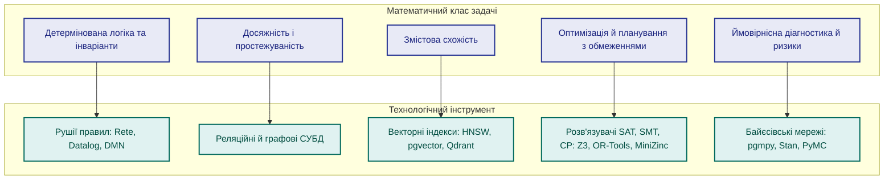

# Глава 17. Технологічний стек: критерії вибору інструментів, мов програмування та рушіїв правил

> **Книга:** [Архітектура доказових експертних систем](README.md) · [Частина VII: Реалізація, розгортання та обмін знаннями](part-07-runtime-and-knowledge-exchange.md)  
> **Попередня глава:** [Глава 38. Машинні галюцинації та дефіцит знань: доказовий контроль відповідей](ch38-curing-machine-hallucinations-and-knowledge-deficits.md)  
> **Наступна глава:** [Глава 18. Інфраструктура виконання: локальні моделі, апаратні прискорювачі, Edge та On-Premise](ch18-execution-infrastructure.md)  
> **Зміст книги:** [README.md](README.md)  
> **Автор:** [Микола Федчик](about-the-author.md)  
> **Рівень:** середній і поглиблений: системні архітектори, розробники експертних систем, інженери даних  
> **Очікувані результати:** обирати інструмент за математичним класом задачі, роллю в архітектурі та поведінкою під час відмов; розподіляти мови програмування за шарами відповідальності; знаходити залежні артефакти рекурсивним запитом SQL; записувати рішення таблицями DMN і помічати в них прогалини; зіставляти задачі оптимізації й планування з розв'язувачами; пояснювати, чому зміна середовища виконання моделі впливає на відтворюваність доказового пакета; зіставляти шари стека з бажаною основною апаратурою; зіставляти компоненти Go з шарами можливостей і приймати компонент лише після порівняльного виміру з базовим варіантом.

Попередні глави розібрали математичний апарат експертних систем (логіку, мережі Rete, підтримання істинності, ймовірнісні оцінки, міркування за прецедентами, графові алгоритми) і архітектуру, у якій ці методи працюють разом. Тепер постає практичне запитання: якими мовами програмування, бібліотеками й рушіями реалізувати цю архітектуру. Доки розробник не розуміє, до якого математичного класу належить інженерна задача, вибір інструмента перетворюється на колекціонування модних назв.

Єдиного правильного технологічного стека не існує. Велика експертна система може поєднувати таблиці, графи, правила, індекси й документи, але вузька перевірка може працювати в одному процесі. Ця глава відповідає на запитання: **як обрати інструменти за потрібними операціями й відмовами?** Декларативні мови допомагають керувати великими наборами правил; для першої перевірки достатньо явної функції, відокремлених даних і тестів.

## Мінімальна реалізація перед каталогом технологій

Почніть із програми перевірки випуску в [Главі 1](ch01-introduction-to-expert-systems.md). Для неї потрібні лише Go, стандартна бібліотека й локальні тести. Спочатку перевірте позитивний випадок, чужий випуск, відсутній звіт, відкликання та виняток. Потім зафіксуйте формат політики, звіту й вердикту; лише після цього додавайте збереження та імпорт із конвеєра тестування.

| Нове обмеження | Найменше обґрунтоване доповнення | Що не потрібно додавати автоматично |
|---|---|---|
| треба зберігати політики й запуски між виконаннями | версійовані файли або SQLite з перевіркою схеми | сервер графа й векторний індекс |
| багато правил змінюють фахівці без зміни коду | таблиці рішень або рушій правил із регресійними тестами | мовна модель як арбітр правил |
| потрібні багатокрокові залежності артефактів | рекурсивний запит або граф із типізованими ребрами | нейронна модель для самої досяжності |
| потрібно шукати підстави у вільному тексті | пошук кандидатів із походженням і доступом | дозвіл ухвалювати рішення за подібністю |
| декілька споживачів потребують незалежних випусків | версійований контракт і процедура доставки | брокер повідомлень до появи такої потреби |

Це маршрут поступового розширення, не опис уже реалізованих адаптерів навчальної програми. Межі відповідальності з [Глави 16](ch16-expert-systems-architecture.md) потрібні й одному процесу; окремий сервіс для кожної межі не є обов'язковим.

Перший критерій найлегше показати діаграмою: п'ять математичних класів задач і технологічні класи, що їм відповідають.



Діаграма читається зліва направо: спершу формулюють задачу математично, потім обирають клас інструмента. Перевірка інваріанта «вимога рівня SIL 3 не закрита без двох звітів» є задачею детермінованої логіки, і для неї потрібен рушій правил, а не векторний пошук. Запитання «які модулі зачіпає зміна вимоги» є задачею досяжності в графі. Запитання «чи є схожі інциденти в минулому» є задачею змістової схожості. Наступні розділи розглядають кожен шар стека, починаючи з мов програмування.

## Мови програмування за шарами відповідальності

Ранні експертні системи часто писали цілком на Lisp чи Prolog. Сучасні промислові експертні системи будують переважно на мовах загального програмування, бо вимоги до середовища змінилися: потрібні зрілі системні бібліотеки, передбачуване керування пам'яттю, підтримка конкурентності, інтерфейс до бібліотек на C (*Foreign Function Interface*, FFI) та інтеграція з інфраструктурою розгортання. Логічні мови при цьому не зникли: вони живуть у вигляді вбудованих декларативних мов правил і запитів, про які йдеться далі. Кожна мова загального програмування займає свій шар.

### Go: сервісний шар і координація

Go підходить для сервісів, утиліт командного рядка, синхронізації й програмних інтерфейсів. Програма лише на Go може постачатися одним виконуваним файлом; прив'язки через cgo можуть додавати нативні бібліотеки й платформні вимоги. Легкі потоки виконання (*goroutines*) допомагають координувати конкурентні задачі, але не гарантують продуктивності без вимірювання. На Go написано, зокрема, частини середовища локальних моделей Ollama [[1]](#src-1) і сервер повідомлень NATS [[2]](#src-2); інтеграцію визначає протокол, не сама мова реалізації сервера.

Для задач експертної системи на Go є такі бібліотеки:

- `hyperjumptech/grule-rule-engine`: рушій правил із власною мовою правил GRL, натхненний Drools [[3]](#src-3);
- `sashabaranov/go-openai`: клієнт API у форматі OpenAI, який працює й з локальними сервісами, сумісними з цим форматом [[4]](#src-4);
- `yalue/onnxruntime_go`: обгортка над ONNX Runtime для виконання локальних моделей векторних представлень і класифікаторів [[5]](#src-5);
- `ledongthuc/pdf`: читання PDF-документів засобами Go [[6]](#src-6);
- `tree-sitter/go-tree-sitter`: прив'язки до tree-sitter для структурного розбору вихідного коду на синтаксичні дерева [[7]](#src-7).

### C і C++: обчислювальні ядра

C і C++ лишаються основою всього, що працює близько до апаратури й потребує максимальної продуктивності: обчислювальних ядер векторизації, драйверів апаратних прискорювачів, бібліотек квантування нейромереж. Проєкт llama.cpp виконує мовні моделі засобами C/C++ [[8]](#src-8), а набір інструментів OpenVINO оптимізує й розгортає моделі на процесорах, графічних процесорах і нейронних процесорах (*Neural Processing Unit*, NPU) Intel [[9]](#src-9). Класичний рушій продукційних правил CLIPS написано мовою C для переносності між платформами [[10]](#src-10); CLIPS досі використовують як вбудований рушій правил у застосунках на C і C++.

### Rust: безпека пам'яті на межі з ненадійними даними

Rust обирають для модулів, де потрібна швидкодія рівня C++ разом із гарантіями компілятора щодо безпеки пам'яті: відсутністю звертань до звільненої пам'яті (*use-after-free*) і гонок даних (*data races*). Типові місця застосування: розбір мережевих повідомлень і файлів із ненадійних джерел, агенти на периферійних пристроях, потокова обробка телеметрії. Рушій бізнес-правил Zen має ядро на Rust і прив'язки до багатьох мов [[11]](#src-11). Варто зауважити, що Zen описує рішення власною моделлю JDM (*JSON Decision Model*), а не стандартом DMN, тож переносити таблиці рішень між Zen і рушіями DMN без перетворення не вийде.

### Python: офлайнова лабораторія знань

Python придатний для досліджень, навчання й оцінювання моделей; бібліотеки PyTorch, scikit-learn, spaCy, NetworkX та засоби оптимізації підтримують ці задачі. У звичайній збірці CPython глобальне блокування інтерпретатора (*Global Interpreter Lock*, GIL) обмежує паралельне виконання байт-коду, але нативні бібліотеки можуть звільняти GIL, а процеси працюють незалежно. PEP 703 започаткував збірки без GIL [[12]](#src-12); сумісність конкретних бібліотек треба перевірити. Мова сама не визначає затримки: обчислення моделі, черги, передавання даних і частота викликів можуть домінувати. Тому Python можна залишити й у сервісі моделей, якщо вимірювання підтверджує бюджет; офлайнова роль є варіантом архітектури, не загальною вимогою.

### TypeScript: інтерфейси експертного аудиту

TypeScript потрібен для робочих місць експертів: візуалізації графів простежуваності, інтерактивного аналізу дерев доведення, редагування таблиць рішень. Інженерний інтерфейс є повноцінним компонентом доказової експертної системи, бо саме через нього людина бачить логіку рішення й ухвалює остаточне рішення.

З практики автора: в одному з проєктів добре себе показав такий розподіл. Сервіси архітектурного ядра, черги й координацію написано на Go; числові операції векторизації виконують бібліотеки C++ (OpenVINO, ONNX Runtime), викликані через cgo; Python винесено в офлайнову частину для навчання й підготовки еталонних наборів; інтерфейс написано на TypeScript. Цей розподіл не є єдино правильним: він залежить від компетенцій команди й вимог до затримки. Межі між шарами задають контракти даних із [Глави 16](ch16-expert-systems-architecture.md), тому мову окремого шару можна замінити, не зачіпаючи інших шарів.

## Мови запитів до знань

Мови загального програмування реалізують сервіси, але факти й зв'язки краще адресувати декларативними мовами запитів. Декларативний запит описує, що треба знайти, а не як, тому його легше перевірити, оптимізувати й відтворити.

### SQL і рекурсивні запити

SQL забезпечує транзакційну цілісність і зберігає версії артефактів, події аудиту, матриці доступу й канонічні таблиці фактів. Рекурсивні загальні табличні вирази (*Common Table Expressions*, CTE) дають змогу обходити ієрархії й графи без окремої графової СУБД [[13]](#src-13). Розгляньмо задачу аналізу впливу змін: які артефакти зачіпає зміна вимоги REQ-7, якщо зв'язки простежуваності зберігаються в таблиці `trace(src, dst)`. Програма мовою Python використовує лише стандартний модуль `sqlite3`; у даних навмисно є зворотне посилання, що утворює цикл.

<details>
<summary>Приклад мовою Python</summary>

```python
import sqlite3

con = sqlite3.connect(":memory:")
con.executescript("""
CREATE TABLE trace(src TEXT, dst TEXT);
INSERT INTO trace VALUES
  ('REQ-7',  'DES-3'),
  ('DES-3',  'MOD-12'),
  ('DES-3',  'MOD-14'),
  ('MOD-12', 'TC-40'),
  ('MOD-14', 'TC-41'),
  ('MOD-14', 'MOD-12'),
  ('TC-41',  'DES-3'),   -- зворотне посилання утворює цикл
  ('REQ-9',  'MOD-14');
""")

QUERY = """
WITH RECURSIVE impact(node, depth, path) AS (
    SELECT 'REQ-7', 0, json_array('REQ-7')
  UNION ALL
    SELECT t.dst, i.depth + 1, json_insert(i.path, '$[#]', t.dst)
  FROM trace AS t JOIN impact AS i ON t.src = i.node
    WHERE NOT EXISTS (SELECT 1 FROM json_each(i.path) AS visited
                                        WHERE visited.value = t.dst)
)
SELECT node, MIN(depth) FROM impact GROUP BY node ORDER BY 2, 1;
"""

for node, depth in con.execute(QUERY):
    print(depth, node)
assert dict(con.execute(QUERY)) == {
    "REQ-7": 0, "DES-3": 1, "MOD-12": 2, "MOD-14": 2,
    "TC-40": 3, "TC-41": 3,
}
con.executemany("INSERT INTO trace VALUES (?, ?)",
                [("REQ-7", "DOC/ANNEX"), ("DOC/ANNEX", "ANNEX")])
assert dict(con.execute(QUERY))["ANNEX"] == 2
print("SQLite", sqlite3.sqlite_version)
con.close()
```

</details>


Програма виводить:

<details>
<summary>Дані або результат прикладу</summary>

```text
0 REQ-7
1 DES-3
2 MOD-12
2 MOD-14
3 TC-40
3 TC-41
SQLite 3.50.4
```

</details>


Шлях є масивом JSON, а `json_each` перевіряє точну рівність ідентифікаторів [[14]](#src-14). Це не плутає окремий вузол `ANNEX` із частиною `DOC/ANNEX`; доданий негативний випадок перевіряє таке розрізнення. Повторний вузол на поточному шляху не допускається, тому цикл не породжує нескінченного продовження. `MIN(depth)` повертає найкоротшу відстань серед знайдених простих шляхів. Кількість простих шляхів може зростати експоненційно навіть без циклів, тому приклад не є масштабованим алгоритмом для всіх графів. Якщо потрібна лише множина досяжних вузлів, рекурсивний `UNION` над одним полем вузла усуває повтори без переліку всіх шляхів. Окрему графову СУБД обґрунтовують вимірюванням запитів, а не довільною межею кількості ребер.

### Cypher, GQL і SPARQL

Мови запитів до графів властивостей описують шаблони вузлів і ребер. Мова Cypher поширилася разом із графовою СУБД Neo4j, а 2024 року ISO і IEC опублікували стандарт мови запитів до графів GQL (ISO/IEC 39075:2024) [[15]](#src-15). SPARQL є стандартом W3C для запитів до трійок RDF та онтологій OWL [[16]](#src-16); у [Главі 16](ch16-expert-systems-architecture.md) запит SPARQL зі шляхом властивостей відновлював походження рішення.

### Datalog

Datalog є декларативною логічною мовою, синтаксично близькою до підмножини Prolog без функціональних символів [[17]](#src-17). Те саме відношення впливу, що й у прикладі SQL, мовою Datalog записують двома правилами:

<details>
<summary>Правила логічною мовою</summary>

```prolog
affects(X, Y) :- trace(X, Y).
affects(X, Z) :- trace(X, Y), affects(Y, Z).
```

</details>


Перше правило задає прямий вплив, друге робить його транзитивним. Для позитивного Datalog без функціональних символів, із безпечними правилами й скінченним активним доменом множина висновків скінченна, а обчислення найменшої нерухомої точки завершується. Цикл сам не створює нових констант. Розширення з генерацією чисел, зовнішніми функціями або нестратифікованим запереченням потребують окремої семантики й перевірки завершення. SQL також може обробляти цикли через множинний `UNION`; відмінність визначає алгоритм конкретного запиту.

## Рушії правил і таблиці рішень

Декларативні правила не повинні розпорошуватися по вихідному коду у вигляді розрізнених операторів `if/else`. Правило є керованим інженерним артефактом з однозначним ідентифікатором, версією, автором, зв'язком із пунктом нормативу та власним життєвим циклом. Рушій правил дає змогу зберігати правила окремо від коду й застосовувати їх передбачувано.

### Класичні рушії правил

Більшість продукційних рушіїв спирається на алгоритм Rete Чарльза Форгі, який зберігає часткові збіги умов між циклами виведення й не перевіряє всі правила проти всіх фактів заново [[18]](#src-18). CLIPS виконує пряме виведення (*forward chaining*) і вбудовується в застосунки на C. Drools є рушієм правил, рушієм DMN і рушієм обробки складних подій для Java; Drools використовує алгоритм Phreak, розвиток Rete [[19]](#src-19). Grule для Go та NRules для .NET [[20]](#src-20) вбудовуються безпосередньо в сервіси.

### DMN і FEEL

Розгляньмо версію 1.5 стандарту моделі й нотації рішень DMN (*Decision Model and Notation*) консорціуму OMG [[21]](#src-21). Стандарт поєднує таблиці рішень, діаграми вимог до рішень (*Decision Requirements Diagrams*, DRD) та мову виразів FEEL (*Friendly Enough Expression Language*). Людина може рецензувати таблицю, але доступність нотації не встановлює її повноти; потрібні перевірки перетинів, прогалин, типів і політики спрацювання.

Таблиця нижче є прикладом рішення про допуск релізу. Перша клітинка задає політику спрацювання U (*Unique*): для будь-яких вхідних даних може спрацювати не більше ніж одне правило. У клітинках умов записано унарні тести FEEL, а прочерк означає «будь-яке значення».

| U | Відкриті критичні дефекти | Покриття вимог тестами | Тести безпеки | Рішення |
|---|---|---|---|---|
| 1 | `> 0` | `-` | `-` | `"BLOCK"` |
| 2 | `0` | `< 0.95` | `-` | `"BLOCK"` |
| 3 | `0` | `>= 0.95` | `"fail"` | `"BLOCK"` |
| 4 | `0` | `>= 0.95` | `"pass"` | `"RELEASE"` |

Правила не перетинаються: перше охоплює будь-яку кількість критичних дефектів понад нуль, друге і третє з четвертим ділять решту випадків за покриттям і результатом тестів безпеки. Проте таблиця неповна. Якщо тести безпеки повернули значення `"error"`, жодне правило не спрацює, і рушій DMN поверне порожній результат. Експертна система, що трактує порожній результат як дозвіл, пропустить реліз з незавершеними тестами безпеки. Тому порожній результат має означати блокування, а ще краще додати до таблиці явне правило для `"error"`. Перевірку повноти й несуперечливості таблиць рішень розглянуто в [Главі 23](ch23-knowledge-base-verification.md).

## Сховища за фізичною формою даних

Вибір сховища визначає природа знання, яке в ньому зберігається. Причини такого розподілу пояснено в [Главі 16](ch16-expert-systems-architecture.md); таблиця зіставляє типи сховищ із прикладами продуктів і типовими запитами.

| Тип сховища | Приклади продуктів | Клас знань | Типовий запит |
|---|---|---|---|
| **Реляційні СУБД** | PostgreSQL, SQLite, Microsoft SQL Server | Канонічні факти, ревізії нормативів, аудит | «Яка редакція правила діяла під час випробувань 12 травня?» |
| **Графові СУБД** | Neo4j, ArangoDB, Amazon Neptune | Простежуваність «вимога, тест, дефект» | «Які модулі зачіпає зміна вимоги з ISO 26262?» |
| **Сховища трійок RDF** | GraphDB, Stardog, Apache Jena | Онтології OWL, таксономії | «Знайти всі типи датчиків, що належать до класу SafetyCritical» |
| **Лексичний пошук** | OpenSearch, Elasticsearch, SQLite FTS5 | Специфікації, коди помилок, артикули | «Знайти звіти про дефекти зі словами overheat і vibration» |
| **Векторні СУБД** | Qdrant, pgvector, Milvus, Weaviate | Змістові фрагменти нормативів, схожі прецеденти | «Знайти нормативи зі схожими вимогами до вологозахисту корпусу» |
| **Бази часових рядів** | TimescaleDB, InfluxDB, Prometheus | Тренди надійності, динаміка покриття тестами | «Чи зростає час спрацювання клапана за останні п'ять циклів?» |

Таблиця підкреслює, що жоден продукт не закриває всіх рядків. Приклад із рекурсивним SQL показав, що частину графових запитів можна виконати в реляційній СУБД, тому окреме сховище варто додавати лише тоді, коли воно розв'язує конкретну задачу, яку наявні сховища не розв'язують.

## Оптимізація, планування та розв'язання обмежень

Рушій правил відповідає на запитання «чи допустимий цей стан». Інструменти оптимізації відповідають на інше запитання: «як знайти найкращий допустимий стан серед мільйонів можливих». Цей клас поділяється на чотири групи:

- **Розв'язувачі SAT і SMT** перевіряють, чи існують вхідні значення, за яких специфікація порушується. Поширені розв'язувачі цього класу: Z3 [[22]](#src-22) і cvc5 [[23]](#src-23); приклад пошуку суперечності між вимогами за допомогою Z3 наведено в [Главі 14](ch14-requirements-detection-and-formalization.md).
- **Програмування в обмеженнях** розв'язує комбінаторні задачі з жорсткими обмеженнями: складання розкладів випробувань, конфігурацію модульного обладнання. Сюди належать розв'язувач CP-SAT з OR-Tools [[24]](#src-24) і мова моделювання MiniZinc [[25]](#src-25), яка відокремлює опис задачі від конкретного розв'язувача.
- **Математичне програмування** (лінійне, квадратичне, змішане цілочисельне) балансує ресурси дослідницьких проєктів.
- **Автоматичне планування** будує послідовність дій, що переводить об'єкт керування з початкового стану в цільовий. Планувальник Fast Downward розв'язує задачі, описані мовою PDDL (*Planning Domain Definition Language*) [[26]](#src-26). Якщо експертна система фіксує провал сертифікації, планувальник може запропонувати мінімальну послідовність коригувальних дій, а експертна система перевіряє цю послідовність правилами.

Знайдений допустимий розклад можна перевірити підстановкою в обмеження, але це не доводить оптимальності. Ядро незадовільності називає достатній суперечливий піднабір, проте саме не є незалежним доказом `unsat`: його треба повторно перевірити або перевірити формальний доказ підтримуваного формату. Підтримка доказів залежить від розв'язувача й теорії. Результати `unknown`, timeout і помилка не означають ні допустимості, ні неможливості.

## Семантична перевірка кандидата рушія

Rete зіставляє умови, Datalog задає дедуктивні правила, DMN описує рішення, а CEL (*Common Expression Language*) та Rego обчислюють вирази або політики. Ці компоненти не є взаємозамінними лише тому, що повертають логічне значення. Перед вимірюванням швидкості потрібний договір семантики.

| Властивість | Контрольний випадок |
|---|---|
| Невідоме значення й явне заперечення | відсутній тест не стає доведеним успіхом або невдачею |
| Порядок і нерухома точка | перестановка фактів і правил не змінює декларативного результату |
| Відкликання | видалення однієї підстави зберігає незалежну альтернативу |
| Цикли й завершення | непідкріплений цикл не створює факту; перевищення ліміту є окремим статусом |
| Таблиця рішень | пропуск, перетин і невідомий тип не дають неявного дозволу |
| Зовнішні функції | мережа, поточний час і випадковість не приховані в правилі |
| Пояснення | рушій повертає використані підстановки й залежності, не лише вердикт |

Порівняння виконує той самий підтримуваний набір правил із однаковою політикою відмови. OPA придатний для окремих рішень доступу, CEL для охоронних виразів, продукційний рушій для керування активаціями, а Datalog для рекурсивних відношень. Вибір із цієї карти є гіпотезою до перевірки.

## Виконання моделей і апаратні прискорювачі

Локальні нейромережеві моделі виконують в експертній системі роль адаптерів: класифікують документи, витягують параметри, формулюють чернетки пояснень. Їхнє виконання підкоряється ланцюжку перетворень від файлу моделі до апаратного прискорювача, показаному на діаграмі.

```mermaid
flowchart LR
    accTitle: Ланцюжок виконання моделі від файлу до апаратури
    accDescr: Модель проходить через проміжне представлення, компілятор, середовище виконання й апаратний прискорювач, а метрики виконання повертаються для калібрування.

    A["<b>Модель і токенізатор</b><br/>GGUF, FP16, INT8, INT4"] --> B["<b>Проміжне представлення</b><br/>ONNX, OpenVINO IR"]
    B --> C["<b>Компілятор і SDK</b><br/>CUDA, ROCm, oneAPI, QNN"]
    C --> D["<b>Середовище виконання</b><br/>OpenVINO, llama.cpp, vLLM, ONNX Runtime"]
    D --> E["<b>Апаратний прискорювач</b><br/>CPU, GPU, NPU, ASIC"]
    E --> F["<b>Метрики</b><br/>токени за секунду, затримка P95, пам'ять, потужність"]
    F -.->|"калібрування"| A

    classDef src fill:#e1f5fe,stroke:#0288d1,stroke-width:2px,color:#01579b;
    classDef ir fill:#ede7f6,stroke:#512da8,stroke-width:2px,color:#311b92;
    classDef hw fill:#fff3e0,stroke:#e65100,stroke-width:2px,color:#bf360c;
    classDef metrics fill:#e8f5e9,stroke:#2e7d32,stroke-width:2px,color:#1b5e20;

    class A,B src;
    class C,D ir;
    class E hw;
    class F metrics;
```



Кожна ланка ланцюжка впливає на результат: формат і точність ваг (FP16, INT8, INT4), версія компілятора, середовище виконання й навіть тип прискорювача. Таблиця порівнює чотири поширені середовища виконання.

| Інструмент | Мова реалізації | Ніша | Особливість |
|---|---|---|---|
| **llama.cpp** | C/C++ | Робочі станції, периферійні й вбудовані пристрої | Не потребує Python, підтримує квантовані формати GGUF |
| **Ollama** | Go, використовує llama.cpp | Локальні сервери розробки, автономні робочі місця | Простий REST API, завантаження й керування моделями |
| **vLLM** | Python, CUDA, C++ | Сервери з графічними процесорами під високим навантаженням | Керування пам'яттю кешу ключів і значень за алгоритмом PagedAttention [[27]](#src-27) |
| **OpenVINO** | C++, Python | Сервери й робочі станції на апаратурі Intel | Оптимізація під процесори, графічні процесори й NPU Intel |

Для доказовості важливо, що зміна будь-якої ланки змінює числові результати моделі. Перехід із FP16 на INT4 або оновлення середовища виконання може змінити класифікацію документа чи текст пояснення. Якщо доказовий пакет посилається на вихід моделі, цей пакет має фіксувати відбиток усього ланцюжка (модель, квантування, середовище виконання, версію драйвера), а після зміни ланцюжка регресійні тести з [Глави 16](ch16-expert-systems-architecture.md) треба запустити повторно. Ланцюжок закінчується апаратним прискорювачем, тому наступний підрозділ зіставляє з апаратурою всі шари стека, а не лише виконання моделей.

### Бажана основна апаратура для шарів стека

Вибір мови, рушія й сховища вже визначає профіль навантаження кожного шару, а отже й апаратуру, на якій шар працюватиме найкраще. Поширена помилка проєкту полягає в купівлі графічного прискорювача до того, як цей профіль визначено: рушій правил, транзакції SQL і обхід графа простежуваності складаються з розгалужень і переходів за вказівниками, тому тензорні блоки GPU чи NPU їх не пришвидшують. Друга помилка полягає в недооцінці пам'яті. Для локальних моделей з'явилися обчислювальні платформи з уніфікованою пам'яттю, у яких CPU і GPU однієї системи на кристалі користуються спільною оперативною пам'яттю без копіювання між окремими пам'ятями; обсяг такої пам'яті визначає, яка модель узагалі поміститься. Таблиця зіставляє шари стека з цієї глави з бажаною основною апаратурою.

| Шар стека | Профіль операцій | Бажана основна апаратура | Коли додавати прискорювач |
|---|---|---|---|
| Рушій правил, таблиці рішень, Datalog | розгалуження, хеш-таблиці, зіставлення умов | багатоядерний CPU з великим кешем | зазвичай не додають: розгалужене зіставлення не відповідає профілю тензорних блоків |
| Реляційне й графове сховище, рекурсивні запити, журнал аудиту | довільний доступ до пам'яті, транзакції, синхронний запис журналу | CPU, оперативна пам'ять ECC, що вміщує індекси й часто вживані дані бази знань, накопичувач NVMe | якщо вимір показує обмеження введення-виведення, допомагає швидший накопичувач, а не GPU |
| Лексичний і точний векторний пошук | сканування індексу, скалярні добутки | CPU з векторними розширеннями: AVX-512 на x86-64, SVE на сучасних процесорах Arm | GPU для пакетного точного пошуку серед десятків мільйонів векторів |
| Векторизація, класифікація, переранжування | щільні тензорні операції малими пакетами | NPU або вбудований GPU; CPU лишається запасним маршрутом | якщо середовище виконання підтримує модель і всі її оператори на цьому прискорювачі |
| OCR і розбір сканів | згортки, механізм уваги, пакети сторінок | дискретний GPU або платформа з уніфікованою пам'яттю | коли потік сторінок перевищує пропускну здатність CPU |
| Локальна генеративна модель | читання всіх активних ваг на кожному токені | GPU з великою пам'яттю або платформа з уніфікованою пам'яттю на 64–128 ГБ | коли політика розміщення забороняє зовнішній сервіс або потрібна автономність |
| Розв'язувачі SAT, SMT і CP | пошук із поверненням і навчанням на конфліктах | CPU з високою частотою ядра; незалежні запуски паралельно на кількох ядрах | лише за наявності реалізації розв'язувача для прискорювача й порівняльного виміру |

Перші три рядки таблиці описують детерміновану частину експертної системи, і для неї основною апаратурою лишається CPU. Вимога корекції помилок оперативної пам'яті випливає з доказовості. Б'янка Шредер, Едуардо Пінейру й Вольф-Дітріх Вебер проаналізували помилки динамічної оперативної пам'яті (DRAM) на великому парку серійних серверів за 2,5 року й показали, що такі помилки є поширеним видом апаратних відмов в обчислювальних кластерах [[28]](#src-28). Непомічена зміна біта в індексі фактів дає хибний вердикт, а зміна біта в буфері перед обчисленням хешу дає хибну невідповідність хешу, причому повторний запуск не обов'язково відтворить причину. Пам'ять із кодом корекції помилок (*Error-Correcting Code*, ECC) у типовому виконанні виправляє один хибний біт у слові пам'яті й виявляє два. Наявність ECC перевіряють у специфікації конкретної платформи, бо вона є не в усіх настільних комп'ютерах.

Останні рядки таблиці стосуються нейромережевих адаптерів, і для них прискорювач додають за правилом порівняльного виміру з розділу про компоненти Go. Частина нових настільних платформ має процесори архітектури Arm ([Глава 18](ch18-execution-infrastructure.md)), тому сервіси на Go, прив'язки cgo й нативні бібліотеки C++ треба зібрати й протестувати для arm64 ще до перенесення моделей. Звідси мінімальна апаратна конфігурація першої версії експертної системи: CPU, пам'ять ECC і накопичувач NVMe. Прискорювач з'являється разом із першою моделлю, яку справді треба виконувати локально, і змінює відбиток ланцюжка виконання. Порівняння конкретних платформ станом на жовтень 2026 року, оцінку швидкості генерації за пропускною здатністю пам'яті й фізичне розгортання розглядає [Глава 18](ch18-execution-infrastructure.md).

## Карта п'ятнадцяти класів технологій

Щоб стек не розростався безсистемно, корисно звіряти його з картою класів технологій, згрупованих за п'ятьма рівнями.

```mermaid
flowchart TD
    accTitle: Карта п'ятнадцяти класів технологій доказової експертної системи
    accDescr: П'ятнадцять класів технологій, згрупованих за рівнями: символьне виведення, моделі знань і сховища, пошук і оптимізація, нейромережеві адаптери, контроль і безпека.

    subgraph CoreLevel["Рівень 1: Символьне виведення"]
        C1["1. Рушії правил і Rete"]
        C2["2. Підтримання істинності (TMS)"]
        C3["3. Облік впевненості й невизначеності"]
        C4["4. Таблиці рішень (DMN, FEEL)"]
    end

    subgraph DataLevel["Рівень 2: Моделі знань і сховища"]
        D1["5. Семантичний веб (RDF, OWL, SHACL)"]
        D2["6. Ймовірнісні графові моделі"]
        D3["7. Бази прецедентів (CBR)"]
        D4["8. Реляційні, графові й часові СУБД"]
    end

    subgraph AlgLevel["Рівень 3: Пошук і оптимізація"]
        A1["9. Розв'язувачі SAT, SMT і оптимізатори"]
        A2["10. Планувальники дій (PDDL)"]
        A3["11. Гібридний пошук (BM25 і HNSW)"]
    end

    subgraph MLLevel["Рівень 4: Нейромережеві адаптери"]
        M1["12. Локальні середовища виконання моделей"]
        M2["13. Збирання документів (OCR, tree-sitter, ReqIF)"]
        M3["14. Пояснюваний ШІ та метрики генерації"]
    end

    subgraph GovLevel["Рівень 5: Контроль і безпека"]
        G1["15. Рушії політик (OPA, Rego) і походження (PROV-O)"]
    end

    CoreLevel --> DataLevel
    DataLevel --> AlgLevel
    AlgLevel --> MLLevel
    MLLevel --> GovLevel

    classDef clrCore fill:#e3f2fd,stroke:#1565c0,stroke-width:2px,color:#0d47a1;
    classDef clrData fill:#e8f5e9,stroke:#2e7d32,stroke-width:2px,color:#1b5e20;
    classDef clrAlg fill:#fff3e0,stroke:#e65100,stroke-width:2px,color:#bf360c;
    classDef clrML fill:#f3e5f5,stroke:#7b1fa2,stroke-width:2px,color:#4a148c;
    classDef clrGov fill:#fbe9e7,stroke:#d84315,stroke-width:2px,color:#bf360c;

    class C1,C2,C3,C4 clrCore;
    class D1,D2,D3,D4 clrData;
    class A1,A2,A3 clrAlg;
    class M1,M2,M3 clrML;
    class G1 clrGov;
```



Карта не вимагає використовувати всі п'ятнадцять класів у кожному проєкті. Вона слугує контрольним списком: для кожного класу архітектор має або назвати обраний інструмент, або обґрунтувати, чому цей клас задач у проєкті не виникає. Порожня клітинка без обґрунтування зазвичай означає, що задача розв'язується неявно, наприклад правилами, захованими в коді, або оцінками впевненості без калібрування.

## Компоненти Go за шарами можливостей

Карта класів показує, які задачі треба закрити, але не називає конкретних компонентів. Для сервісного шару на Go, який розглянуто на початку глави, корисна вужча карта: які бібліотеки й сервери, написані на Go або доступні з Go, закривають окремі шари можливостей експертної системи і які обмеження кожного кандидата треба перевірити до прийняття. Таблиця описує проєкти станом на жовтень 2026 року; версії й активність розробки змінюються, тому перед вибором таблицю звіряють із репозиторіями.

| Шар можливостей | Кандидати | Що дає експертній системі | Що перевірити до прийняття |
|---|---|---|---|
| Продукційні правила (клас 1) | Grule [[3]](#src-3) | правила мовою GRL, які зберігаються окремо від коду сервісу | детермінованість порядку спрацювання правил, що конкурують за той самий факт; час циклу виведення на реальній кількості фактів |
| Вирази й охоронні умови (роль, яку в DMN виконує FEEL) | cel-go [[29]](#src-29) | мова виразів CEL без повноти за Тюрингом: перевірка типів до виконання, обчислення без побічних ефектів, час обчислення лінійний щодо розміру виразу й вхідних даних, якщо макроси вимкнено | макроси й власні функції виходять за межі лінійної оцінки; канонічний шлях імпорту змінився на `cel.dev/cel-go` |
| Дедуктивні запити (Datalog) | Mangle [[30]](#src-30) | Datalog з агрегатами, викликами функцій, необов'язковою перевіркою типів і часовими інтервалами чинності фактів | розширення понад Datalog скасовують частину гарантій, зокрема гарантію завершення; проєкт розвивається незалежно від Google, останній випуск 0.4.0 вийшов у листопаді 2025 року |
| Політики доступу (клас 15) | OPA [[31]](#src-31) | рішення про доступ мовою Rego як окремий версійований артефакт із власними тестами; вбудовування в сервіс як бібліотеки Go | затримка рішення під навантаженням, обсяг даних політики в пам'яті сервісу |
| Графове сховище (клас 8) | Dgraph [[32]](#src-32), EliasDB [[33]](#src-33), Cayley [[34]](#src-34) | від розподіленої графової СУБД із транзакціями ACID (Dgraph) до легкої графової бази, яку можна вбудувати в програму (EliasDB) | Dgraph офіційно підтримує лише Linux на amd64 і arm64; останній випуск EliasDB вийшов у 2022 році, Cayley у 2019 році |
| Лексичний пошук (клас 11) | Bleve [[35]](#src-35) | повнотекстовий індекс усередині процесу сервісу з ранжуванням BM25, наближеним пошуком векторів і злиттям результатів гібридного пошуку | серед готових мовних аналізаторів Bleve немає українського, тож якість пошуку українських текстів треба виміряти окремо |
| Векторний пошук (клас 11) | chromem-go [[36]](#src-36), pgvector через клієнт pgvector-go [[37]](#src-37), Weaviate [[38]](#src-38) | від вбудованого точного пошуку без сторонніх залежностей (chromem-go) до розширення PostgreSQL і окремої векторної СУБД | chromem-go перебирає всі вектори й до версії 1.0 має статус бета; pgvector і Weaviate потребують окремого сервера |

З таблиці випливають два спостереження. Для більшості шарів існує вибір між вбудованою бібліотекою й окремим сервером: бібліотека спрощує розгортання на ізольованих робочих станціях, а сервер дає масштабування ціною ще одного процесу, який треба оновлювати, резервувати й захищати. Крім того, частина кандидатів має обмеження, яких не видно з короткого опису проєкту: втрату гарантії завершення, відсутність аналізатора для української мови, підтримку лише однієї операційної системи чи багаторічну паузу у випусках.

### Правило: спершу порівняльний вимір, потім прийняття

Жоден рядок таблиці не є рекомендацією. Кандидата приймають до стека лише після порівняльного виміру (*benchmark*) із базовим варіантом (*baseline*), тобто з найпростішою реалізацією, яку команда вже має або може написати за день: рекурсивним запитом SQL для простежуваності, індексом SQLite FTS5 для лексичного пошуку, перебором усіх векторів для змістового пошуку. Вимір проводять на власних даних і власних еталонних запитах, а критерії прийняття записують до запуску виміру:

1. якість кандидата не гірша за базовий варіант на еталонному наборі: ті самі висновки правил і не нижчий показник Recall@k з [Глави 16](ch16-expert-systems-architecture.md) для пошуку;
2. виграш у затримці P95, пам'яті чи часі індексування перевищує заздалегідь заданий поріг, або кандидат дає можливість, якої базовий варіант не має;
3. поведінку кандидата під час відмов перевірено: обрив з'єднання, пошкоджений індекс, оновлення версії;
4. результат виміру разом із версіями кандидата й базового варіанта записано як архітектурне рішення, а вимір повторюють під час кожного оновлення старшої версії кандидата.

Для 100 000 векторів розмірності 768 у `float32` самі вектори займають 307,2 МБ без метаданих; один точний скалярний пошук потребує приблизно 76,8 млн пар множення-додавання. Для 10 млн векторів ці оцінки зростають до 30,72 ГБ і 7,68 млрд пар. З цього не випливає лінійне зростання затримки: кеші, пропускна здатність, пакетність і конкуренція можуть змінити режим. Оцінка автора chromem-go [[36]](#src-36) є зовнішнім виміром конкретної конфігурації, не значенням P95 для цього проєкту. Точний пошук лишають, якщо він виконує погоджені вимоги якості й ресурсу на власному навантаженні; наближений індекс приймають за окремим порівнянням. Найближчі вектори є еталоном геометричного пошуку, не автоматично еталоном предметної релевантності.

Порівняльний вимір конкретизує третій урок наступного розділу: поведінку інструмента перевіряють на власних даних до прийняття, а не після першого збою.

## Три уроки вибору технологій

1. **Інструмент обирають під операцію й семантику.** SHACL перевіряє задані обмеження графа, а не довільну логічну несуперечність OWL. Datalog обчислює наслідки свого піднабору правил; SMT перевіряє формули підтримуваних теорій. Простежуваність потребує типізованих зв'язків, а схожість кандидатного ранжування. Назва інструмента не замінює договору результату.
2. **Фреймворк не компенсує відсутності канонічної моделі знань.** Жоден оркестратор на кшталт LangChain чи LlamaIndex не зробить експертну систему доказовою, якщо документи не мають статусів ревізій, міток допуску й зв'язків у графі. Підключення нейромережі до неструктурованих даних лише пришвидшує генерацію правдоподібних помилок.
3. **Технологію оцінюють за поведінкою під час відмови.** Головне запитання до бібліотеки звучить не як «наскільки гарна демонстрація», а як «що станеться при втраті зв'язку, мовчазній зміні схеми чи оновленні ваг моделі». Якщо оновлення моделі векторних представлень непомітно ламає відтворюваність учорашнього сертифіката, інструмент не готовий до промислової експлуатації.

## Висновки
Технологічний стек експертної системи випливає з трьох критеріїв: математичного класу задачі, ролі компонента в архітектурі та поведінки під час відмов. Детерміновані правила виконують рушії правил і таблиці рішень, досяжність і простежуваність обслуговують рекурсивні запити й графові сховища, оптимізацію виконують розв'язувачі, а нейромережеві компоненти працюють як адаптери під контролем контрактів і регресійних тестів.

Глава показала ці критерії на перевірюваних прикладах. Рекурсивний запит SQL знайшов усі артефакти, яких зачіпає зміна вимоги, і не зациклився на зворотному посиланні; той самий запит мовою Datalog займає два правила й завершується без ручного захисту. Таблиця рішень DMN виявила прогалину для результату тестів `"error"`, яку треба закрити явним правилом або трактуванням порожнього результату як блокування. Огляд середовищ виконання моделей показав, чому зміна квантування чи середовища вимагає повторного регресійного контролю. Таблиця апаратури за шарами стека показала, що детерміновані шари працюють на CPU з пам'яттю ECC і накопичувачем NVMe, а прискорювач потрібен лише нейромережевим адаптерам. Карта компонентів Go показала, що для більшості шарів існує вибір між вбудованою бібліотекою й окремим сервером, а порівняльний вимір із базовим варіантом робить цей вибір перевірюваним: для 100 000 фрагментів точний перебір векторів може виявитися достатнім, а для 10 млн фрагментів стає еталоном для наближеного індексу.

Межі цих порад теж треба назвати. Перелічені продукти й бібліотеки є прикладами, а не рекомендаціями на всі випадки: їхні можливості змінюються з версіями, і перед вибором треба перевірити поточну документацію. Розподіл мов за шарами відображає один практичний досвід і залежить від команди. [Глава 18](ch18-execution-infrastructure.md) переходить від вибору інструментів до фізичного розгортання: як забезпечити автономність експертної системи на локальній апаратурі, енергоспоживання на периферійних пристроях і стабільну затримку в закритих промислових мережах.

## Запитання до читачів
1. Чому для сервісного шару експертної системи часто обирають Go, а Python залишають в офлайновій частині? Яку роль тут відіграє GIL?
2. Навіщо в рекурсивному запиті SQL умова на стовпець `path` і чому запит Datalog для того самого відношення такої умови не потребує?
3. Коли реляційної СУБД із рекурсивними запитами недостатньо і варто додавати графову СУБД?
4. Що означає політика спрацювання U у таблиці DMN і яку прогалину має наведена таблиця допуску релізу?
5. Чим завдання розв'язувача SMT відрізняється від завдання рушія правил і як перевірити результат розв'язувача незалежно від нього?
6. Чому зміна квантування моделі з FP16 на INT4 чи оновлення середовища виконання впливає на відтворюваність доказового пакета?
7. З яким базовим варіантом ви порівняли б графову СУБД чи векторний індекс перед прийняттям до стека і чому точний перебір векторів лишається корисним навіть після переходу на наближений індекс?
8. Чому купівля графічного прискорювача не пришвидшить рушій правил і граф простежуваності і яка апаратура потрібна першій версії експертної системи?

## Словник
| Український термін | Англійський відповідник | Коротке пояснення |
|---|---|---|
| Технологічний стек | Technology stack | Сукупність мов, бібліотек, рушіїв і сховищ, з яких зібрано експертну систему |
| Рушій правил | Rule engine | Програма, що застосовує декларативні правила до фактів |
| Пряме виведення | Forward chaining | Виведення від фактів до висновків |
| Таблиця рішень | Decision table | Табличний запис правил, у якому рядки є правилами, а стовпці умовами й результатами |
| Політика спрацювання | Hit policy | Правило DMN, що визначає, скільки рядків таблиці може спрацювати і як поєднати результати |
| Унарний тест | Unary test | Умова FEEL у клітинці таблиці рішень, наприклад `>= 0.95` |
| Рекурсивний табличний вираз | Recursive CTE | Запит SQL, що повторно звертається до власного результату |
| Аналіз впливу змін | Change impact analysis | Пошук артефактів, яких зачіпає зміна |
| Програмування в обмеженнях | Constraint programming | Розв'язання задач, заданих змінними та обмеженнями на них |
| Автоматичне планування | Automated planning | Побудова послідовності дій, що переводить об'єкт керування в цільовий стан |
| Квантування | Quantization | Зменшення розрядності ваг моделі, наприклад з FP16 до INT4 |
| Середовище виконання моделі | Inference runtime | Програма, що виконує навчену модель на апаратурі |
| Проміжне представлення | Intermediate representation | Формат моделі між навчанням і компіляцією під апаратуру |
| Легкий потік виконання | Goroutine | Потік виконання Go, яким керує середовище виконання мови |
| Глобальне блокування інтерпретатора | Global Interpreter Lock | Механізм CPython, що не дає потокам виконувати байт-код паралельно |
| Базовий варіант | Baseline | Найпростіша наявна реалізація, з якою порівнюють кандидата перед прийняттям до стека |
| Порівняльний вимір | Benchmark | Вимірювання якості, затримки й ресурсів кандидата й базового варіанта на однакових даних |
| Точний пошук найближчих сусідів | Exact nearest neighbor search | Пошук перебором усіх векторів, який завжди повертає справжніх найближчих сусідів |
| Уніфікована пам'ять | Unified memory | Оперативна пам'ять, яку CPU і GPU однієї системи на кристалі використовують спільно без копіювання між окремими пам'ятями |
| Пам'ять із корекцією помилок | Error-correcting code memory | Оперативна пам'ять із додатковими контрольними бітами, що виправляє одиночні помилки й виявляє частину кратних |

## Абревіатури
| Скорочення | Розшифрування | Значення |
|---|---|---|
| ACID | Atomicity, Consistency, Isolation, Durability | атомарність, узгодженість, ізольованість і довговічність транзакцій |
| API | Application Programming Interface | програмний інтерфейс |
| ASIC | Application-Specific Integrated Circuit | спеціалізована інтегральна схема |
| AVX-512 | Advanced Vector Extensions 512 | 512-бітні векторні розширення процесорів x86-64 |
| BM25 | Best Matching 25 | функція ранжування документів у лексичному пошуку |
| CBR | Case-Based Reasoning | міркування за прецедентами |
| CEL | Common Expression Language | мова виразів без повноти за Тюрінгом |
| CLIPS | C Language Integrated Production System | рушій продукційних правил мовою C |
| CP | Constraint Programming | програмування в обмеженнях |
| CPU | Central Processing Unit | центральний процесор |
| CTE | Common Table Expression | загальний табличний вираз SQL |
| DMN | Decision Model and Notation | модель і нотація рішень OMG |
| DRAM | Dynamic Random-Access Memory | динамічна оперативна пам'ять |
| DRD | Decision Requirements Diagram | діаграма вимог до рішень |
| ECC | Error-Correcting Code | код корекції помилок оперативної пам'яті |
| FEEL | Friendly Enough Expression Language | мова виразів DMN |
| FFI | Foreign Function Interface | інтерфейс виклику функцій іншої мови |
| FTS5 | Full-Text Search, version 5 | модуль повнотекстового пошуку SQLite |
| GGUF | формат файлів бібліотеки ggml | формат зберігання квантованих моделей для llama.cpp |
| GIL | Global Interpreter Lock | глобальне блокування інтерпретатора |
| GPU | Graphics Processing Unit | графічний процесор |
| GQL | Graph Query Language | стандартна мова запитів до графів |
| GRL | Grule Rule Language | мова правил Grule |
| HNSW | Hierarchical Navigable Small World | графовий індекс для пошуку найближчих векторів |
| IR | Intermediate Representation | проміжне представлення |
| JDM | JSON Decision Model | модель рішень рушія Zen |
| NPU | Neural Processing Unit | нейронний процесор |
| NVMe | Non-Volatile Memory Express | протокол доступу до твердотільних накопичувачів |
| OCR | Optical Character Recognition | оптичне розпізнавання символів |
| OMG | Object Management Group | консорціум стандартів моделювання |
| OPA | Open Policy Agent | рушій декларативних політик доступу |
| P95 | 95th percentile | 95-й процентиль, тобто значення, яке не перевищують 95 % вимірювань |
| PDDL | Planning Domain Definition Language | мова опису задач планування |
| PEP | Python Enhancement Proposal | пропозиція щодо розвитку Python |
| RDF | Resource Description Framework | модель даних у вигляді трійок |
| SAT | Boolean Satisfiability | задача виконуваності булевих формул |
| SIL | Safety Integrity Level | рівень цілісності безпеки |
| SMT | Satisfiability Modulo Theories | виконуваність з урахуванням теорій |
| SPARQL | SPARQL Protocol and RDF Query Language | мова запитів до графів RDF |
| SQL | Structured Query Language | мова запитів до реляційних баз даних |
| SVE | Scalable Vector Extension | масштабовані векторні розширення процесорів Arm |
| СУБД | система управління базами даних | програмне забезпечення для зберігання даних і запитів до них |

## Джерела
1. <a id="src-1"></a>Ollama. [*ollama/ollama*](https://github.com/ollama/ollama). GitHub.
2. <a id="src-2"></a>NATS.io. [*nats-io/nats-server: High-Performance Server for NATS.io*](https://github.com/nats-io/nats-server). GitHub.
3. <a id="src-3"></a>hyperjumptech. [*grule-rule-engine: Rule Engine Implementation in Golang*](https://github.com/hyperjumptech/grule-rule-engine). GitHub.
4. <a id="src-4"></a>sashabaranov та учасники проєкту. [*go-openai: OpenAI API Clients for Go*](https://github.com/sashabaranov/go-openai). GitHub.
5. <a id="src-5"></a>yalue. [*onnxruntime_go: A Go Library Wrapping Microsoft ONNX Runtime*](https://github.com/yalue/onnxruntime_go). GitHub.
6. <a id="src-6"></a>ledongthuc. [*pdf: PDF Reader*](https://github.com/ledongthuc/pdf). GitHub.
7. <a id="src-7"></a>Tree-sitter. [*go-tree-sitter: Go Bindings for Tree-sitter*](https://github.com/tree-sitter/go-tree-sitter). GitHub.
8. <a id="src-8"></a>ggml-org. [*llama.cpp: LLM Inference in C/C++*](https://github.com/ggml-org/llama.cpp). GitHub.
9. <a id="src-9"></a>Intel Corporation. [*OpenVINO Documentation*](https://docs.openvino.ai/).
10. <a id="src-10"></a>CLIPS. [*CLIPS: A Tool for Building Expert Systems*](https://www.clipsrules.net/).
11. <a id="src-11"></a>GoRules. [*zen: Open-Source Business Rules Engine*](https://github.com/gorules/zen). GitHub.
12. <a id="src-12"></a>Sam Gross. [*PEP 703: Making the Global Interpreter Lock Optional in CPython*](https://peps.python.org/pep-0703/). Python Software Foundation, 2023.
13. <a id="src-13"></a>SQLite. [*The WITH Clause*](https://www.sqlite.org/lang_with.html). Документація SQLite.
14. <a id="src-14"></a>Учасники SQLite. [*JSON Functions and Operators*](https://www.sqlite.org/json1.html). Офіційна документація `json_array`, `json_insert` і `json_each`.
15. <a id="src-15"></a>ISO, IEC. [*ISO/IEC 39075:2024. Information Technology: Database Languages: GQL*](https://www.iso.org/standard/76120.html). 2024.
16. <a id="src-16"></a>Steve Harris, Andy Seaborne (ред.). [*SPARQL 1.1 Query Language*](https://www.w3.org/TR/sparql11-query/). W3C Recommendation, 2013.
17. <a id="src-17"></a>S. Ceri, G. Gottlob, L. Tanca. [*What You Always Wanted to Know About Datalog (and Never Dared to Ask)*](https://doi.org/10.1109/69.43410). *IEEE Transactions on Knowledge and Data Engineering*, 1(1), 146–166, 1989.
18. <a id="src-18"></a>Charles L. Forgy. [*Rete: A Fast Algorithm for the Many Pattern/Many Object Pattern Match Problem*](https://doi.org/10.1016/0004-3702(82)90020-0). *Artificial Intelligence*, 19(1), 17–37, 1982.
19. <a id="src-19"></a>Apache KIE. [*Drools Rule Engine*](https://docs.drools.org/latest/drools-docs/drools/rule-engine/index.html). Документація Drools.
20. <a id="src-20"></a>NRules. [*NRules: Rules Engine for .NET, Based on the Rete Matching Algorithm*](https://github.com/NRules/NRules). GitHub.
21. <a id="src-21"></a>Object Management Group. [*Decision Model and Notation (DMN), Version 1.5*](https://www.omg.org/spec/DMN/1.5/About-DMN). OMG, 2024.
22. <a id="src-22"></a>Leonardo de Moura, Nikolaj Bjørner. [*Z3: An Efficient SMT Solver*](https://doi.org/10.1007/978-3-540-78800-3_24). *Tools and Algorithms for the Construction and Analysis of Systems (TACAS)*, LNCS, 337–340, 2008.
23. <a id="src-23"></a>Haniel Barbosa та ін. [*cvc5: A Versatile and Industrial-Strength SMT Solver*](https://doi.org/10.1007/978-3-030-99524-9_24). *Tools and Algorithms for the Construction and Analysis of Systems (TACAS)*, LNCS, 415–442, 2022.
24. <a id="src-24"></a>Google. [*CP-SAT Solver*](https://developers.google.com/optimization/cp/cp_solver). Документація OR-Tools.
25. <a id="src-25"></a>Nicholas Nethercote, Peter J. Stuckey, Ralph Becket, Sebastian Brand, Gregory J. Duck, Guido Tack. [*MiniZinc: Towards a Standard CP Modelling Language*](https://doi.org/10.1007/978-3-540-74970-7_38). *Principles and Practice of Constraint Programming (CP 2007)*, LNCS, 529–543, 2007.
26. <a id="src-26"></a>Malte Helmert. [*The Fast Downward Planning System*](https://doi.org/10.1613/jair.1705). *Journal of Artificial Intelligence Research*, 26, 191–246, 2006.
27. <a id="src-27"></a>Woosuk Kwon та ін. [*Efficient Memory Management for Large Language Model Serving with PagedAttention*](https://doi.org/10.1145/3600006.3613165). *Proceedings of the 29th Symposium on Operating Systems Principles (SOSP)*, 611–626, 2023.
28. <a id="src-28"></a>Bianca Schroeder, Eduardo Pinheiro, Wolf-Dietrich Weber. [*DRAM Errors in the Wild: A Large-Scale Field Study*](https://doi.org/10.1145/1555349.1555372). *Proceedings of the Eleventh International Joint Conference on Measurement and Modeling of Computer Systems (SIGMETRICS/Performance 2009)*, 193–204, 2009.
29. <a id="src-29"></a>cel-expr. [*cel-go: Fast, Portable, Non-Turing Complete Expression Evaluation with Gradual Typing*](https://github.com/cel-expr/cel-go). GitHub.
30. <a id="src-30"></a>Учасники проєкту Mangle. [*Mangle: a Programming Language for Deductive Database Programming*](https://codeberg.org/TauCeti/mangle-go). Codeberg; дзеркало [google/mangle](https://github.com/google/mangle) на GitHub.
31. <a id="src-31"></a>Open Policy Agent. [*OPA: an Open Source, General-Purpose Policy Engine*](https://github.com/open-policy-agent/opa). GitHub.
32. <a id="src-32"></a>dgraph-io. [*Dgraph: High-Performance Graph Database for Real-Time Use Cases*](https://github.com/dgraph-io/dgraph). GitHub.
33. <a id="src-33"></a>krotik. [*EliasDB: a Graph-Based Database*](https://github.com/krotik/eliasdb). GitHub.
34. <a id="src-34"></a>cayleygraph. [*Cayley: an Open-Source Graph Database*](https://github.com/cayleygraph/cayley). GitHub.
35. <a id="src-35"></a>blevesearch. [*Bleve: a Modern Text, Numeric, Geo-Spatial and Vector Indexing Library for Go*](https://github.com/blevesearch/bleve). GitHub.
36. <a id="src-36"></a>philippgille. [*chromem-go: Embeddable Vector Database for Go with Chroma-Like Interface and Zero Third-Party Dependencies*](https://github.com/philippgille/chromem-go). GitHub.
37. <a id="src-37"></a>pgvector. [*pgvector: Open-Source Vector Similarity Search for Postgres*](https://github.com/pgvector/pgvector) і [*pgvector-go: pgvector Support for Go*](https://github.com/pgvector/pgvector-go). GitHub.
38. <a id="src-38"></a>Weaviate. [*Weaviate: an Open-Source Vector Database*](https://github.com/weaviate/weaviate). GitHub.

---

[← Глава 38](ch38-curing-machine-hallucinations-and-knowledge-deficits.md) | [Зміст книги](README.md) | [Частина VII](part-07-runtime-and-knowledge-exchange.md) | [Глава 18 →](ch18-execution-infrastructure.md)
