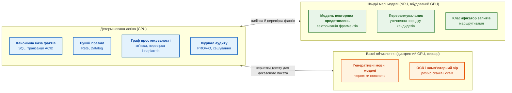
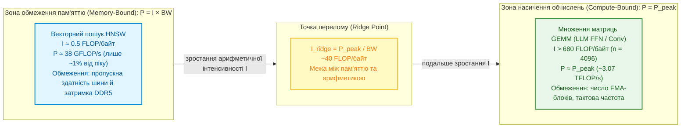
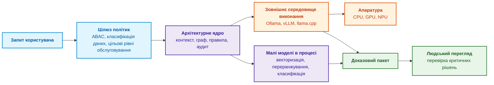
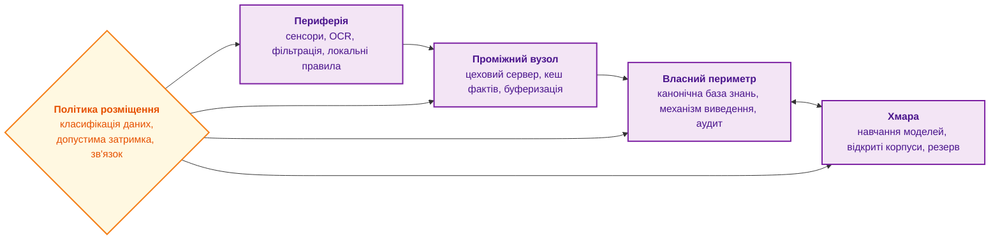
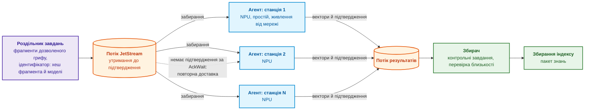
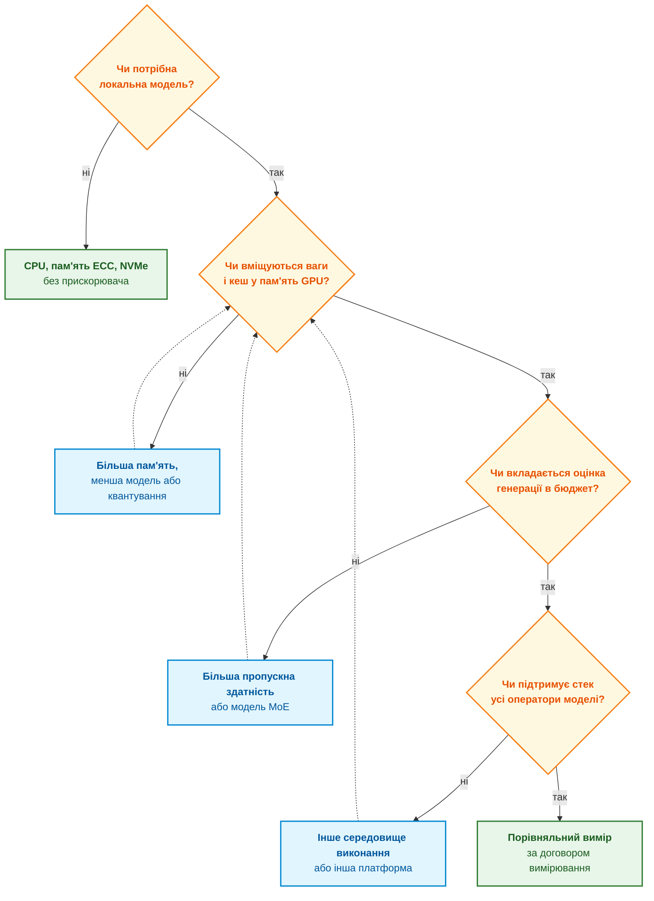
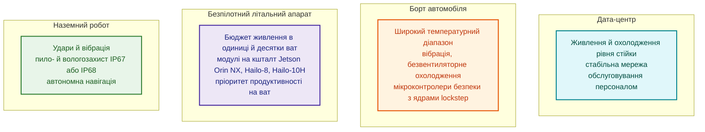
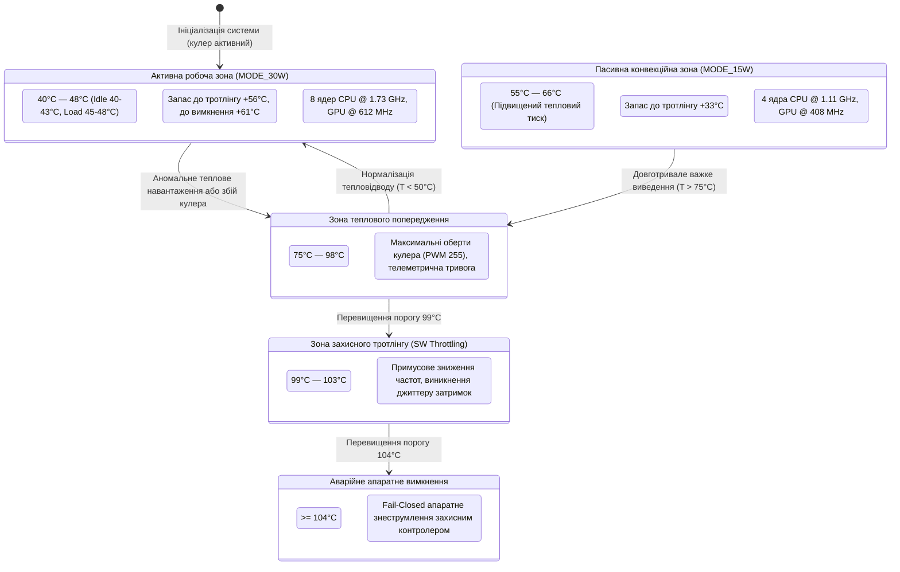
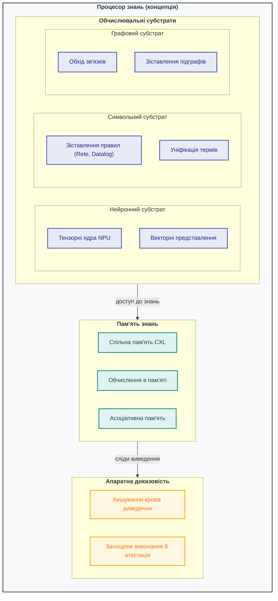

# Глава 18. Інфраструктура виконання: локальні моделі, апаратні прискорювачі, Edge та On-Premise

> **Книга:** [Архітектура доказових експертних систем](README.md) · [Частина VII: Реалізація, розгортання та обмін знаннями](part-07-runtime-and-knowledge-exchange.md)  
> **Попередня глава:** [Глава 17. Технологічний стек: критерії вибору інструментів, мов програмування та рушіїв правил](ch17-implementation-stack.md)  
> **Наступна глава:** [Глава 22. Кібернетичний цикл керування: сенсори, периферія та зворотний зв'язок](ch22-cybernetics-edge-to-backend.md)  
> **Зміст книги:** [README.md](README.md)  
> **Автор:** [Микола Федчик](about-the-author.md)  
> **Рівень:** середній і поглиблений: системні інженери, архітектори інфраструктури машинного навчання, розробники вбудованих і периферійних пристроїв  
> [!NOTE]
> **Очікувані результати:** розподіляти компоненти експертної системи між CPU, GPU і NPU за профілем обчислень; оцінювати досяжну продуктивність за моделлю Roofline; порівнювати локальні платформи для моделей станом на жовтень 2026 року за місткістю й пропускною здатністю пам'яті та оцінювати верхню межу швидкості генерації; вирішувати, які моделі виконувати в процесі експертної системи, а які в окремих процесах; обирати топологію розміщення від периферійного пристрою до хмари; складати бюджет затримки за перцентилями; пояснювати й контролювати числовий дрейф результатів після оновлення драйверів і середовищ виконання.

## Анотація

Попередні глави визначили логічну архітектуру та технологічний стек експертної системи. Але програмні абстракції виконуються фізично: в оперативній пам'яті, на системних шинах, у центральних процесорах (*Central Processing Unit*, CPU), графічних процесорах (*Graphics Processing Unit*, GPU) і нейронних процесорах (*Neural Processing Unit*, NPU). Виконуються вони в хмарних кластерах, на серверах у власному периметрі організації (*on-premise*) або на компактних контролерах поруч із сенсорами (*edge*).

Ця глава відповідає на запитання: **як обґрунтувати апаратуру й топологію виконання для заданої якості, затримки та автономності?** Профіль обчислень дає початкову гіпотезу: розгалужені правила часто доцільні на CPU, а щільна лінійна алгебра може виграти від GPU або NPU. Рішення залежить також від підтримки операторів, розміру пакета запитів, передавання даних, пам'яті й допустимих відмов. Назва прискорювача не гарантує детермінізму чи ізоляції. Огляд конкретних платформ зафіксовано станом на 8 жовтня 2026 року за матеріалами виробників; анонсовані продукти позначено окремо від тих, що вже продаються.

Діаграма показує базовий розподіл компонентів за трьома обчислювальними зонами.



Діаграма не є догмою: на робочій станції всі три зони можуть працювати на одному процесорі з вбудованим NPU. Але межі між зонами відображають різну природу обчислень, і наступний розділ пояснює цю різницю кількісно.

## 1. Профіль обчислень: порівняльний аналіз вимог символьних правил і нейромереж

У загальній архітектурі доказової експертної системи інфраструктурний рівень виконання слугує фізичним фундаментом, на якому одночасно співіснують кардинально відмінні обчислювальні парадигми: детерміноване символьне виведення (рушії Rete, Datalog, SMT-солвери) та стохастичне нейромережеве сприйняття й семантичний пошук (векторні представлення, моделі переранжування, авторегресивні трансформери). Якщо системний архітектор не враховує цієї дуальності та проєктує апаратну інфраструктуру виходячи лише з узагальнених маркетингових показників пікової обчислювальної потужності (TFLOPS), система стикається з катастрофічною деградацією продуктивності: некеровані випадкові переходи за вказівниками (*pointer chasing*) в графах знань вщент вичерпують пропускну здатність шини пам'яті, спричиняючи масові простої обчислювальних конвеєрів (*pipeline stalls*), джиттер часу відгуку та зрив жорстких часових дедлайнів у місійно-критичних циклах керування (ISO 26262, IEC 61508). Наївне переконання, ніби придбання потужнішого графічного прискорювача здатне прискорити символьний логічний висновок чи поодиноке декодування токенів, зазнає краху, оскільки ці операції фізично обмежені латентністю та пропускною здатністю підсистеми оперативної пам'яті, а не кількістю кремнієвих помножувачів.

Для кількісного зіставлення та вибору цільового апаратного субстрату під кожен компонент експертної системи застосовується аналітична модель Roofline Вільямса, Вотермана й Паттерсона [[1]](#src-1). Вона встановлює точну верхню межу досяжної швидкодії обчислювача на основі балансу між піковою продуктивністю кремнієвих ядер та пропускною здатністю шини пам'яті.

Пікова теоретична продуктивність процесора обчислюється для визначення граничної обчислювальної потужності ядра або прискорювача під час виконання щільних матричних операцій:

```math
P_{\text{peak}} = N_{\text{cores}} \times f \times \mathrm{FLOP}_{\text{cycle}}
```

де:
- $P_{\text{peak}}$ — теоретична пікова продуктивність процесора або прискорювача, вимірювана в операціях з рухомою комою за секунду ($\text{FLOP}/\text{s}$, зазвичай $\text{TFLOP}/\text{s}$ або $\text{GFLOP}/\text{s}$);
- $N_{\text{cores}}$ — фізична кількість паралельних обчислювальних ядер або потокових мультипроцесорів, задіяних під виконання завдання ($N_{\text{cores}} \in \mathbb{N}$, діапазон від 1 до 16 384);
- $f$ — стала тактова частота функціонування обчислювальних блоків під стабільним навантаженням, вимірювана в герцах ($\text{Hz}$, типово $0{,}7 \times 10^9 - 5{,}5 \times 10^9\text{ Hz}$);
- $\mathrm{FLOP}_{\text{cycle}}$ — кількість елементарних операцій з рухомою комою, яку одне ядро здатне виконати за один такт за рахунок векторних блоків SIMD/SIMT (наприклад, для ядра з двома 512-бітними блоками FMA у форматі FP32 виконується $2 \times 16 \times 2 = 64\text{ FLOP}/\text{cycle}$, де операція $a \cdot b + c$ враховується як два FLOP).

**Практичне застосування та інженерні висновки:**
1. Розрахунок виконується на етапі специфікації апаратного комплексу для оцінки верхньої планки продуктивності при виконанні щільної лінійної алгебри (GEMM у шарах нейромережевого кодера чи декодера).
2. Для умовного 16-ядерного CPU на частоті 3,0 ГГц із двома FMA-блоками на ядро пік становить:

   ```math
   P_{\text{peak}} = 16 \times (3{,}0 \times 10^9) \times 64 = 3{,}072 \times 10^{12}\text{ FLOP/s} \approx 3{,}07\text{ TFLOP/s}
   ```

3. **Критерій відмови:** Якщо виміряна реальна швидкодія щільного множення матриць становить $P_{\text{observed}} < 0{,}60 \times P_{\text{peak}}$, це свідчить про наявність мікроархітектурних аномалій: термодинамічного тротлінгу (частота $f$ впала нижче базової), неоптимального вирівнювання пам'яті в реєстрах або витіснення даних із кешу інструкцій L1i.

Пропускна здатність інтерфейсу пам'яті визначає максимальний темп прокачування байтів із системного ОЗП або відеопам'яті до обчислювальних регістрів:

```math
\mathrm{BW} = f_{\text{mem}} \times \frac{W_{\text{bus}}}{8} \times N_{\text{channels}}
```

де:
- $`\mathrm{BW}`$ — пікова теоретична пропускна здатність інтерфейсу оперативної пам'яті, вимірювана в байтах за секунду ($\text{B}/\text{s}$ або $\text{GB}/\text{s}$);
- $`f_{\text{mem}}`$ — ефективна швидкість передавання даних інтерфейсу пам'яті в мегатрансферах за секунду ($\text{MT}/\text{s}$ або передачах за секунду, наприклад $4{,}8 \times 10^9\text{ T/s}$ для DDR5-4800 або $8{,}533 \times 10^9\text{ T/s}$ для LPDDR5X);
- $`W_{\text{bus}}`$ — розрядність шини даних одного фізичного каналу пам'яті в бітах (типово 64 біти для стандартних модулів DDR4/DDR5, 32 або 16 бітів для субканалів LPDDR5/LPDDR5X), де ділення на 8 переводить біти в байти;
- $`N_{\text{channels}}`$ — кількість незалежних чергованих каналів пам'яті контролера процесора ($`N_{\text{channels}} \in \{1, 2, 4, 8, 12\}`$).

**Практичне застосування та інженерні висновки:**
1. Розрахунок застосовується для визначення стелі продуктивності під час вилучення неструктурованих даних, обходу списків суміжності графа та зчитування матриць ваг при поодинокому авторегресивному інференсі.
2. Для двоканальної конфігурації DDR5-4800 (ширина шини 64 біти на канал) пікова смуга дорівнює:

   ```math
   \mathrm{BW} = 4{,}8 \times 10^9 \times \frac{64}{8} \times 2 = 76{,}8 \times 10^9\text{ B/s} = 76{,}8\text{ GB/s}
   ```

3. **Інженерний поріг утилізації:** Фактична прикладна пропускна здатність $\mathrm{BW}_{\text{eff}}$ через накладні витрати протоколу DRAM (рядкові конфлікти, команди активації/регенерації `tRFC`, латентність `CAS`) рідко перевищує $75-85\,\%$ від теоретичної $\mathrm{BW}$. Якщо алгоритм утилізує $> 80\,\%$ пропускної здатності шини, будь-які спроби оптимізації алгоритму за рахунок збільшення кількості обчислювальних потоків призведуть лише до взаємного блокування шини та деградації затримки.

Модель Roofline поєднує обидва фізичні ліміти через арифметичну (операційну) інтенсивність алгоритму $I$:

```math
P_{\text{observed}} \le \min\left(P_{\text{peak}},\; I \times \mathrm{BW}\right)
```

де:
- $`P_{\text{observed}}`$ — реально досяжна обчислювальна продуктивність експертної системи для конкретного алгоритму, вимірювана в $\text{FLOP}/\text{s}$;
- $`I`$ — арифметична інтенсивність алгоритмічного ядра, тобто кількість виконаних операцій з рухомою комою на один байт даних, переданий системною шиною пам'яті ($\text{FLOP}/\text{byte}$);
- $`\mathrm{BW}`$ — пропускна здатність підсистеми пам'яті ($\text{byte}/\text{s}$);
- $`P_{\text{peak}}`$ — пікова продуктивність процесора чи прискорювача ($\text{FLOP}/\text{s}$);
- $\min(a, b)$ — функція мінімуму, що визначає домінуючий фізичний бар'єр системи.

**Практичне застосування, граничні переходи та інженерні висновки:**
1. **Точка перелому (Ridge Point):**

   ```math
   I_{\text{ridge}} = \frac{P_{\text{peak}}}{\mathrm{BW}}
   ```

   Для розглянутої робочої станції ($`P_{\text{peak}} = 3{,}07\text{ TFLOP/s}`$, $`\mathrm{BW} = 76{,}8\text{ GB/s}`$) критична точка становить:

   ```math
   I_{\text{ridge}} = \frac{3{,}072 \times 10^{12}}{76{,}8 \times 10^9} = 40{,}0\text{ FLOP/byte}
   ```

2. **Зона обмеження пам'яттю ($`I < I_{\text{ridge}}`$):** Векторний пошук у графовому індексі HNSW (*Hierarchical Navigable Small World*) [[2]](#src-2) для вектора розмірністю 768 у форматі FP32 (3072 байти) виконує приблизно $2 \times 768 = 1536$ операцій, що дає арифметичну інтенсивність $I \approx 1536 / 3072 = 0{,}5\text{ FLOP/byte}$. Оскільки $0{,}5 \ll 40{,}0$, гранична продуктивність обмежена шиною пам'яті:

   ```math
   P_{\text{observed}} \le 0{,}5 \times 76{,}8 \times 10^9 = 38{,}4\text{ GFLOP/s}
   ```

   Це становить лише $\approx 1{,}25\,\%$ від обчислювального потенціалу процесора. Інженерний висновок: нарощування тактової частоти чи купівля багатоядерного GPU не дасть прискорення пошуку фактів; прискорення досягається виключно квантуванням векторів (Scalar Quantization INT8 подвоює інтенсивність до $1{,}0\text{ FLOP/byte}$, знижуючи трафік удвічі) або розширенням шини пам'яті.
3. **Зона обмеження обчисленнями ($`I \ge I_{\text{ridge}}`$):** Множення квадратних матриць розміром $n = 4096$ у прямому проході багатошарового трансформера оперує інтенсивністю $I \approx n / 6 \approx 682{,}6\text{ FLOP/byte}$. Тут процесор повністю розкриває свій потенціал $P_{\text{peak}}$, і критичним фактором стає ефективність використання векторних інструкцій та тензорних ядер.



> [!TIP] Практичний наслідок для інженера інфраструктури
> - **Для memory-bound операцій (HNSW, Rete-мережі, обхід графа):** Інвестувати в дорожчі обчислювальні процесори (GPGPU з сотнями TFLOPs) марно — ядра будуть простоювати в очікуванні пам'яті (*memory stall*). Ефект дають: збільшення каналів пам'яті (quad-channel замість dual), кешування векторів в L3/SRAM, або квантування векторів (Product Quantization, Scalar Int8), що скорочує кількість переданих байтів.
> - **Для compute-bound операцій (важкі LLM-трансформери, батчевий GEMM):** Обмежувальним фактором стає кремнієва арифметика. Тут вирішальну роль відіграють спеціалізовані тензорні ядра, матричні прискорювачі та підтримка мікроформатів (FP8 / BF16).

## 2. Експертна система як координатор гетерогенного виконання

У гетерогенній архітектурі доказової системи підсистема координації виконання є контрольно-пропускним шлюзом, що розділяє детерміноване символьне ядро (канонічну базу знань, рушій логічного виведення та криптографічний журнал аудиту) і недетерміністичні середовища виконання нейромереж. Якщо архітектор не забезпечує цього розмежування і перетворює експертну систему на неструктуровану обгортку над викликами API мовних моделей, виникає критичний системний збій: недетерміновані збої сторонніх середовищ виконання чи вичерпання відеопам'яті безпосередньо руйнують транзакційну цілісність бази фактів, а неперевірені контексти призводять до витоку конфіденційних знань поза периметр безпеки (порушення ISO/SAE 21434 та вимог ABAC). Тривіальний підхід прямого звернення компонентів логіки до нейромережевих бекендів без централізованого диспетчера відмовляє за першого ж збою черги запитів або деградації пропускної здатності шини. Роль координатора полягає в суворому розділенні відповідальності через п'ять інженерних функцій:

- **Маршрутизація за змістом запиту.** Класифікатор визначає тип запиту й обирає спеціалізовану модель, наприклад компактну модель для текстів стандартів функціональної безпеки замість моделі загального аналізу специфікацій.
- **Фільтрація контексту за політиками доступу.** Фрагменти документів, до яких користувач не має допуску, не потрапляють у контекст генеративної моделі ще до її виклику.
- **Аудит викликів.** Журнал фіксує повний відбиток виклику: хеш моделі, версію токенізатора, температуру генерації, параметри квантування.
- **Виконання малих моделей у процесі.** Моделі векторних представлень і класифікатори працюють у пам'яті процесу експертної системи без мережевих накладних витрат.
- **Делегування важких моделей.** Генерацію тексту виконують окремі середовища виконання (Ollama, vLLM, llama.cpp), описані в [Главі 17](ch17-implementation-stack.md).



З практики автора: експертна система добре працює як клієнт середовищ виконання з аудитом. Генерацію тексту делеговано окремому процесу через REST API, а векторизація виконується в процесі експертної системи через бібліотеки OpenVINO або ONNX Runtime. Падіння зовнішнього сервера мовної моделі тоді фіксується як помилка сервісу й не зупиняє роботу з базою знань. Межу між «у процесі» і «в окремому процесі» варто проводити свідомо, і наступний розділ пояснює, за якими критеріями.

## 3. Ізоляція середовищ виконання і керування оперативною пам'яттю

Фізична ізоляція процесів та суворе керування розподілом оперативної пам'яті визначають надійність і живучість експертної системи в умовах високих обчислювальних навантажень. Відсутність чіткої межі ізоляції між runtime-бібліотеками нейромережевих прискорювачів і ядром логічного виведення призводить до фатальних аварій: помилка сегментації (`SIGSEGV`) у закритому вендорному драйвері GPU або вичерпання віртуальної пам'яті (`OOM Killer`) миттєво знищує весь процес експертної системи, перериваючи активні сесії аудиту, скидаючи стан транзакцій ACID у сховищі фактів та призводячи до аварійної зупинки місійно-критичного циклу керування. Наївна спроба скомпонувати всі моделі інференсу в єдиний адресний простір заради економії кількох мікросекунд на міжпроцесній взаємодії створює системну вразливість, оскільки C-біндінги тензорних бібліотек не мають гарантій безпеки пам'яті. Таблиця порівнює інженерні компроміси обох підходів.

| Критерій | Виконання в процесі | Виконання в окремому процесі |
|---|---|---|
| **Накладні витрати** | Немає міжпроцесної взаємодії, затримка в мікросекундах | Серіалізація тензорів і мережевий обмін |
| **Наслідок збою** | Аварійне завершення бібліотеки драйвера прискорювача зупиняє всю експертну систему | Збій ізольовано в окремому процесі, архітектурне ядро продовжує роботу |
| **Масштабування** | Разом з експертною системою | Незалежне, з чергою запитів |
| **Типове застосування** | Стабільні легкі бібліотеки: OpenVINO на CPU чи NPU, ONNX Runtime | Великі генеративні моделі, експериментальні драйвери GPU |

Правило вибору випливає з наслідку збою: у процесі експертної системи виконують лише те, збій чого прийнятно зупиняє всю експертну систему. Для великих моделей і нестабільних драйверів ціна ізоляції (мілісекунди на серіалізацію) значно менша за ціну аварійного зупину архітектурного ядра.

### 3.1. Відображення бази фактів у пам'ять (mmap)

Друга проблема пов'язана з розміром бази знань. Коли база налічує мільйони фактів, потоковий розбір текстових файлів (наприклад, JSONL) у купу процесу під час старту може займати десятки секунд і гігабайти оперативної пам'яті. Для периферійних пристроїв та інтерактивних утиліт командного рядка це неприйнятно.

Розв'язок полягає в компіляції бази фактів у двійковий файл, який відображається в адресний простір процесу викликом `mmap` [[4]](#src-4). Операційна система не читає такий файл цілком під час відкриття: сторінки файлу підвантажуються лише тоді, коли процес звертається до відповідних адрес. Діаграма показує дворівневу організацію такого файлу.


Перший рівень, компактна таблиця нормалізованих сутностей і зсувів, постійно лежить в оперативній пам'яті й дає змогу швидко перевірити, чи згадана в запитанні сутність взагалі є в базі знань. Другий рівень містить повні атрибути й цитати; ці байти операційна система читає лише для сутностей, задіяних у поточному ланцюжку доведення. Записи фіксованого двійкового формату читаються безпосередньо з відображеної пам'яті без розбору тексту й без виділення об'єктів у купі. Такий самий незмінний пакет знань з адресацією за вмістом описано в [Главі 15](ch15-knowledge-extraction-and-kb-construction.md); тут важливо, що відображення файлу переносить вартість старту з «прочитати все» на «прочитати потрібне».

Один відображений файл вміщується в пам'ять одного вузла. Якщо індекс більший за пам'ять вузла, є дві відповіді: явне читання з власним буфером або розбиття пакета на шарди, кожен з яких відображається окремим вузлом або процесом. Розбиття не змінює двох рівнів індексу всередині шарда, але додає маршрутизатор перед ними й питання, що робити, коли шард мовчить. Межі застосовності `mmap` описано в розділі 3.2 [Глави 32](ch32-high-performance-knowledge-packs-mmap-and-harvesting.md), правила розбиття в [Главі 7](ch07-knowledge-base-typology.md).

## 4. Топології розгортання: від дата-центру до бортового сенсора

Топологія розгортання відображає логічну структуру експертної системи на фізичну інфраструктуру зв'язку, обчислювальних вузлів і сенсорних інтерфейсів. Помилка у виборі топології створює критичні загрози функціональній безпеці: розміщення життєво важливих правил перевірки інваріантів у хмарі робить автономну машину беззахисною перед втратою радіозв'язку чи навмисним глушінням каналу (повний зрив вимог автономності ASIL-D за ISO 26262), тоді як спроба запустити надважкі генеративні моделі безпосередньо на низькопотужному периферійному контролері призводить до миттєвого вичерпання акумулятора та перегріву кристала. Наївний погляд, що сучасні бездротові мережі (5G/супутниковий зв'язок) гарантують стабільну затримку для критичних запитів, спростовується першим же радіозатіненням або польовим інцидентом. Розміщення компонентів визначають чутливість даних, допустима затримка й наявність гарантованого зв'язку, що формалізується багаторівневою моделлю.



Кожен рівень має свою роль:

- **Власний периметр** (*on-premise*) є типовим вибором для оборонних, авіаційних, енергетичних і медичних застосувань: дані не залишають периметра безпеки організації, а канонічна база знань і журнал аудиту перебувають під її повним контролем.
- **Периферія** (*edge*) виконує критичні інваріанти безпеки безпосередньо на борту машини чи промислового робота і працює навіть за повного обриву мережі.
- **Проміжні вузли** агрегують потоки телеметрії від десятків периферійних контролерів, виконують дедуплікацію й фільтрацію перед передаванням до центральної бази. Концепцію таких вузлів між периферією та хмарою Бономі та співавтори назвали туманними обчисленнями (*fog computing*) [[5]](#src-5).
- **Хмара** підходить для навчання моделей, обробки відкритих корпусів і резервних пакетних обчислень, але конфіденційні дані туди потрапляють лише за явним рішенням політики розміщення.

Топології описують, де працює експертна система, коли відповідає користувачеві. Пакетні задачі на кшталт повного переіндексування корпусу мають інший профіль: вони не потребують відповіді за мілісекунди, але потребують багато обчислень, і для них існує ще одна топологія.

## 5. Фонове індексування на простійних NPU робочих станцій

Зміна моделі векторних представлень змушує переіндексувати весь корпус: вектори різних моделей не можна порівнювати між собою, тож кожен фрагмент треба векторизувати заново. Для корпусу з десятками мільйонів фрагментів один прискорювач працюватиме добу або довше, а відправити конфіденційні специфікації до хмари з GPU політика розміщення часто не дозволяє. Водночас ноутбуки й робочі станції інженерів дедалі частіше мають вбудований нейронний процесор, який більшу частину часу простоює. Ідея використати простій чужих машин давня: система керування пакетними задачами Condor Літцкова, Лівні й Мутки ще 1988 року запускала задачі на робочих станціях, власники яких на той момент не працювали [[6]](#src-6), а платформа BOINC Андерсона поширила той самий підхід на добровільні обчислення в інтернеті [[7]](#src-7). Для експертної системи цей підхід дає мережу фонового індексування: роздільник завдань ділить корпус на незалежні одиниці роботи, а агенти на робочих станціях виконують векторизацію на своїх NPU.

Розподілена мережа є кандидатом для порівняння, не доведеним виграшем. Уже придбане обладнання зменшує капітальні витрати, але енергію на прийнятий результат, доступність і вартість супроводу потрібно виміряти. NPU не завжди споживає менше енергії за CPU на всьому маршруті: додаткове передавання, запуск моделі й повернення на CPU можуть змінити результат. Периметр організації теж не є одним рівнем довіри: фрагмент дозволяють передати лише конкретно авторизованому вузлу.

### 5.1. Класифікація задач для розподіленої мережі NPU

Задача підходить для мережі NPU лише тоді, коли виконуються всі шість умов:

1. **Підтримуваний режим моделі.** У цьому проєкті мережа виконує навчені моделі; можливості конкретного NPU й програмного стека перевіряють окремо.
2. **Підтримувані оператори й форми.** Компілятор може вимагати фіксованих розмірів або обмежень динамічних форм [[8]](#src-8). Успішне завантаження моделі не доводить, що всі її оператори виконуються на NPU.
3. **Незалежні одиниці роботи.** Фрагменти обробляються окремо, без обміну даними між вузлами.
4. **Терпимість до затримки.** Вузол може заснути, вимкнутися чи зайнятися роботою власника, тож мережа годиться для пакетів, а не для відповіді користувачеві.
5. **Достатня точність FP16 чи INT8.** Задача не потребує обчислень подвійної точності.
6. **Дозволене переміщення даних.** Політика класифікації дозволяє передати фрагмент на інший вузол ([Глава 10](ch10-knowledge-acquisition-systems.md)).

Векторизація, переранжування й класифікація є кандидатами, але кожну модель перевіряють за шістьма умовами. Не можна загалом виключити генерацію на NPU: придатність визначають модель, оператори й середовище виконання. Натомість звичайне стиснення DEFLATE або zstd не слід переносити на тензорний прискорювач без відповідної реалізації та вимірювань; CPU є базовим варіантом ([Глава 32](ch32-high-performance-knowledge-packs-mmap-and-harvesting.md)).

### 5.2. Архітектура та протокол координації мережі

Схема показує мережу на основі NATS JetStream, шару надійного зберігання повідомлень у тому самому брокері NATS, через який система здобуття знань обмінюється даними з експертною системою ([Глава 10](ch10-knowledge-acquisition-systems.md), [Глава 17](ch17-implementation-stack.md)).



Фіолетовий блок готує роботу, помаранчеві блоки є потоками брокера, сині блоки є агентами на станціях, зелені блоки перевіряють і використовують результат. Надійність мережі тримається на чотирьох рішеннях.

1. **Одиниці роботи й ідемпотентність.** Ідентифікатор охоплює вміст, модель, токенізатор, конфігурацію й схему виходу. JetStream допускає повторну доставку після втрати підтвердження [[9]](#src-9); збереження результату має бути ідемпотентним. Підтвердження надсилають після надійного прийняття результату, а збій між записом і підтвердженням перевіряють окремо. Два різні результати для одного ідентифікатора потребують перевірки конфлікту, не мовчазного вибору першого.
2. **Поведінка «доброго сусіда».** Агент бере роботу, лише коли станція простоює, живиться від мережі й NPU вільний, і звільняє NPU, щойно NPU знадобився власникові: операційна система й застосунки власника, наприклад обробка відео під час наради, теж можуть використовувати NPU. Агент також обмежує власне споживання пам'яті, бо вбудований NPU ділить оперативну пам'ять із рештою станції.
3. **Відтворюваність між вузлами.** Станції мають різні покоління NPU й різні версії драйверів, а обчислення у FP16 дають на різній апаратурі трохи різні вектори (розділ про числовий дрейф нижче). Тому модель і її версію фіксують, кожен вузол перед допуском проходить перевірку на контрольному наборі фрагментів із відомими векторами (косинусна близькість не нижча за поріг), а збирач періодично підкидає контрольні завдання з відомою відповіддю. Вузол, що не пройшов перевірку, виключають з мережі до з'ясування причини.
4. **Безпека передавання.** З'єднання захищають взаємною автентифікацією TLS і обліковими даними NATS, а до мережі потрапляють лише фрагменти, гриф яких дозволяє переміщення. Агент не зберігає текст фрагмента після векторизації.

### 5.3. Оцінка сумарної обчислювальної продуктивності

Планування ресурсів для масштабного оновлення моделей векторних представлень або первинного індексування нормативної бази вимагає точного розрахунку досяжної пропускної здатності. Номінальна сума паспортних характеристик NPU є оманливою, оскільки клієнтські станції мають змінний графік увімкнення, використовуються співробітниками для повсякденних задач, а мережевий транспорт вносить затримки узгодження. Розрахунок ефективної пропускної здатності кластера $Q_{\text{eff}}$ спирається на стохастичну доступність та накладні втрати:

```math
Q_{\text{eff}} = \sum_{i=1}^{M} q_i \, a_i \, (1 - o_i)
```

де:
- $Q_{\text{eff}}$ — математичне сподівання інтегральної пропускної здатності розподіленої мережі фонового індексування, вимірюване у згенерованих та верифікованих векторах за секунду ($\text{vectors}/\text{s}$);
- $M$ — загальна кількість зареєстрованих робочих станцій з NPU в локальній мережі підприємства ($M \in \mathbb{N}$, діапазон від 10 до $10^4$ вузлів);
- $q_i$ — експериментально виміряна пропускна здатність NPU $i$-ї робочої станції для обраної моделі векторних представлень у стабільному режимі виконання ($\text{vectors}/\text{s}$, наприклад $240\text{ vectors/s}$ для квантованої моделі 384-d на Intel NPU);
- $a_i$ — коефіцієнт експлуатаційної доступності $i$-ї станції ($a_i \in [0, 1]$), що визначає частку часу, коли машина живиться від стаціонарної електромережі, процесор перебуває в стані простою (відсутня активність користувача $> 5$ хв), а системний планувальник дозволяє запуск фонового демона;
- $o_i$ — коефіцієнт накладних витрат і втрат продуктивності ($o_i \in [0, 1]$), що враховує затримки TLS-рукостискання, передавання пакетів через NATS JetStream, повторні відправлення при перевищенні `AckWait` та витрати на обчислення контрольних завдань валідації.

**Практичне застосування та інженерні висновки:**
1. Розрахунок викликається системним архітектором перед початком міграції бази знань на нову розмірність або архітектуру ембеддингів для оцінки тривалості технологічного вікна:

   ```math
   T_{\text{reindex}} = \frac{N_{\text{total}}}{Q_{\text{eff}}}
   ```

   де $`N_{\text{total}}`$ — загальна кількість фрагментів нормативного корпусу.
2. **Числовий орієнтир і калібрування:** Для парку з $`M = 200`$ офісних станцій ($`q_i \approx 240\text{ vectors/s}`$, $`a_i \approx 0{,}10`$, $`o_i \approx 0{,}20`$) ефективний темп становить:

   ```math
   Q_{\text{eff}} = 200 \times 240 \times 0{,}10 \times (1 - 0{,}20) = 3\,840\text{ vectors/s}
   ```

   Корпус із 20 мільйонів фрагментів переіндексується за $`T_{\text{reindex}} \approx 20 \times 10^6 / 3840 \approx 5\,208\text{ s} \approx 1{,}45\text{ год}`$. Для порівняння, виділений серверний CPU ($`q = 68\text{ vectors/s}`$) виконував би це завдання понад 81 годину.
3. **Критерії диспетчеризації та карантину:**
   - Якщо $`a_i < 0{,}03`$ (станція постійно відключається або працює від батареї), агент виключається з пулу індексування для запобігання перевантаженню черги повторними доставками;
   - Якщо розрахунковий час $`T_{\text{reindex}}`$ перевищує регламентне нічне вікно обслуговування ($`T_{\text{reindex}} > T_{\text{maintenance\_window}} = 6\text{ год}`$), система автоматично генерує інженерне попередження та масштабує навантаження, тимчасово залучаючи центральні сервери або зменшуючи поріг неактивності користувача.

Мережа простійних NPU розширює обчислювальні можливості власного периметра без нових серверів, але працює лише для пакетних задач. Інтерактивна генерація пояснень потребує окремої станції, і наступний розділ порівнює платформи, доступні або анонсовані станом на жовтень 2026 року.

## 6. Локальні платформи для моделей: стан на жовтень 2026 року

Мережа простійних NPU виконує пакетну векторизацію, але інтерактивна генерація пояснень і доналаштування моделей у власному периметрі потребують окремої робочої станції. Протягом 2025–2026 років виробники запропонували для цього новий клас компактних комп'ютерів: система на кристалі в них поєднує CPU і GPU зі спільною уніфікованою пам'яттю на 128 ГБ ([Глава 17](ch17-implementation-stack.md)), а наступні покоління вже анонсовано. Розділ відповідає на запитання: **які з цих платформ придатні для нейромережевих адаптерів експертної системи і за якими числами їх порівнювати?**

У таблиці нижче пікову продуктивність наведено так, як її подає виробник: у TOPS (трильйонах операцій за секунду), TFLOPS або PFLOPS (трильйонах чи квадрильйонах операцій з рухомою комою за секунду) для форматів FP4, FP8 або FP16, тобто 4-, 8- чи 16-бітних чисел з рухомою комою. LPDDR5X є енергоощадною оперативною пам'яттю, спільною для CPU і GPU, а GDDR6 і GDDR7 є окремою пам'яттю графічного прискорювача. У стовпці програмного стека CUDA (*Compute Unified Device Architecture*) є платформою обчислень на GPU NVIDIA, ROCm є відкритою платформою AMD того самого призначення, а WSL (*Windows Subsystem for Linux*) є підсистемою Windows для виконання програм Linux. Рядки впорядковано від настільних станцій до серверних прискорювачів і NPU ноутбуків.

| Платформа | Статус на 8 жовтня 2026 року | Пам'ять для моделі | Пропускна здатність пам'яті | Заявлений пік і формат | Програмний стек |
|---|---|---|---|---|---|
| **NVIDIA DGX Spark**, настільна станція на системі на кристалі GB10 | продається з 15 жовтня 2025 року [[10]](#src-10) | 128 ГБ уніфікованої LPDDR5X | 273 ГБ/с [[11]](#src-11) | до 1 PFLOPS у FP4 з розрідженістю; 20 ядер Arm | DGX OS на основі Ubuntu, CUDA |
| **NVIDIA RTX Spark** у ноутбуках і компактних комп'ютерах ASUS, Dell, HP, Lenovo, Microsoft Surface, MSI | оголошено 31 травня 2026 року, продаж восени 2026 року [[12]](#src-12) | до 128 ГБ уніфікованої, залежно від конфігурації | виробник не вказав | до 1 PFLOPS у FP4 з розрідженістю; 20 ядер Grace і 6144 ядра CUDA у ноутбуках, 18 і 5120 у настільних моделях [[13]](#src-13) | Windows 11 на Arm, CUDA, TensorRT |
| **Microsoft Surface RTX Spark Dev Box**, компактний комп'ютер розробника на RTX Spark | оголошено 2 червня 2026 року [[14]](#src-14); попереднє замовлення в США з 7 жовтня 2026 року, відвантаження з листопада [[15]](#src-15) | 128 ГБ уніфікованої; GPU адресує меншу частину | виробник не вказав | до 1 PFLOPS у FP4 з розрідженістю; тепловий бюджет 100 Вт [[16]](#src-16) | Windows 11 Pro, WSL 2 із підтримкою CUDA, Windows ML |
| **NVIDIA DGX Station for Windows**, станція на модулі GB300 Grace Blackwell Ultra | оголошено 31 травня 2026 року, очікується в IV кварталі 2026 року [[17]](#src-17) | до 748 ГБ когерентної | виробник не вказав | до 20 PFLOPS у FP4; 72 ядра Grace | Windows, WSL |
| **NVIDIA RTX PRO 6000 Blackwell Workstation Edition**, дискретний GPU | продається | 96 ГБ GDDR7 з кодом корекції помилок (ECC) | 1792 ГБ/с | 4000 TOPS у FP4 з розрідженістю; до 600 Вт [[18]](#src-18) | CUDA, TensorRT |
| **AMD Ryzen AI Halo** на процесорі Ryzen AI Max+ 395 | попереднє замовлення з червня 2026 року [[19]](#src-19) | 128 ГБ уніфікованої LPDDR5X | 256 ГБ/с | до 60 TFLOPS у FP16; 16 ядер Zen 5, GPU Radeon 8060S на 40 обчислювальних блоків, NPU XDNA 2 [[20]](#src-20) | Linux або Windows 11, ROCm |
| **AMD Ryzen AI Max PRO 400** у наступному поколінні Ryzen AI Halo і комп'ютерах HP та Lenovo | оголошено в травні 2026 року, постачання заявлено з III кварталу 2026 року | до 192 ГБ, з них до 160 ГБ як відеопам'ять | виробник не вказав | NPU до 55 TOPS; налаштовувана потужність 45–120 Вт [[19]](#src-19) | ROCm |
| **Intel Core Ultra Series 3** у ноутбуках і периферійних комп'ютерах | продається з 27 січня 2026 року | оперативна пам'ять комп'ютера | залежить від конфігурації | NPU до 50 TOPS; до 16 ядер CPU і 12 ядер Xe [[21]](#src-21) | OpenVINO |
| **Intel Crescent Island**, серверний GPU для виконання моделей з повітряним охолодженням | оголошено 14 жовтня 2025 року; зразки замовникам у II півріччі 2026 року [[22]](#src-22) | 160 ГБ LPDDR5X | виробник не вказав в анонсі | архітектура Xe3P; пік в анонсі не наведено | відкритий програмний стек Intel, що розробляється |
| **Qualcomm Snapdragon X2 Elite** у ноутбуках на Arm | пристрої з I півріччя 2026 року [[23]](#src-23) | оперативна пам'ять комп'ютера | до 228 ГБ/с залежно від моделі | NPU Hexagon до 85 TOPS; до 18 ядер Oryon [[24]](#src-24) | засоби Qualcomm AI Engine Direct |
| **Tenstorrent Blackhole p150**, плата розширення | продається | 32 ГБ GDDR6 | 512 ГБ/с | 664 TFLOPS у блоковому форматі FP8; 120 ядер Tensix і 16 ядер RISC-V; 300 Вт [[25]](#src-25) | відкритий програмний стек Tenstorrent |

Таблиця показує три речі. По-перше, стовпець заявленого піку не можна читати як рейтинг, бо виробники наводять числа в різних форматах. NVIDIA наводить пік FP4 із структурованою розрідженістю 2:4: у кожному блоці з чотирьох значень ваг два мають дорівнювати нулю, тензорні блоки обробляють лише ненульові значення, і паспортний пік подвоюється [[26]](#src-26). Модель без такої розрідженості отримує щонайбільше половину піку, а виграш від розрідженості на рівні застосунку зазвичай менший за двократний. AMD для Ryzen AI Halo наводить пік FP16, а виробники NPU рахують цілочисельні операції. По-друге, для генерації тексту першим фільтром є місткість пам'яті: ваги моделі й кеш ключів і значень ([Глава 12](ch12-linguistic-analysis-and-local-models.md)) мають уміститися в пам'ять, доступну GPU. На платформах із уніфікованою пам'яттю ця частина менша за повний обсяг: Microsoft прямо зазначає, що найбільший обсяг, який адресує GPU, залежить від конфігурації й навантаження і менший за загальний [[15]](#src-15). По-третє, у п'яти рядках виробник не вказав пропускної здатності пам'яті, хоча саме вона визначає швидкість генерації малими пакетами. Це число потрібно запитати в постачальника або виміряти, і наступний підрозділ показує чому.

### 6.1. Оцінка швидкості генерації за пропускною здатністю пам'яті

Для інтерактивної взаємодії людини-експерта з експертною системою критичним показником є час генерації тексту пояснення. На відміну від етапу префіксного аналізу (Prompt Processing), де матричні множення паралелізуються, поетапне декодування кожного наступного токена (Token Generation) працює в режимі суворого обмеження пам'яттю (*memory-bound*). На кожному кроці авторегресивного виведення прискорювач зобов'язаний зчитати з пам'яті повний обсяг активних ваг моделі та оновити кеш ключів і значень (KV-кеш). Теоретична верхня межа швидкості генерації для одного потоку запитів описується формулою:

```math
r_{\text{dec}} \le \frac{\mathrm{BW}}{N_{\text{act}} \cdot q / 8 + S_{\text{KV}}}
```

де:
- $r_{\text{dec}}$ — максимальна швидкість авторегресивного декодування для поодинокого потоку запитів, вимірювана в токенах за секунду ($\text{tokens}/\text{s}$ або $\text{tps}$);
- $\mathrm{BW}$ — фактична пропускна здатність інтерфейсу оперативної пам'яті платформи, вимірювана в байтах за секунду ($\text{bytes}/\text{s}$);
- $N_{\text{act}}$ — кількість активних параметрів моделі, задіяних в обчисленні поточного токена (для щільних dense-моделей $N_{\text{act}} = N_{\text{total}}$, для розріджених моделей суміші експертів MoE $N_{\text{act}} \ll N_{\text{total}}$);
- $q$ — розрядність квантування ваг моделі в бітах на один параметр ($q \in \{4, 8, 16\}$, де ділення на 8 переводить біти в байти);
- $`S_{\text{KV}}`$ — обсяг трафіку кешу ключів і значень (KV-кеш), що передається через шину для одного кроку декодування, вимірюваний у байтах на токен:

  ```math
  S_{\text{KV}} = 2 \times n_{\text{layers}} \times d_{\text{head}} \times n_{\text{heads\_kv}} \times L_{\text{ctx}} \times \frac{q_{\text{kv}}}{8}
  ```

  де $`L_{\text{ctx}}`$ — поточна довжина контексту в токенах, $`n_{\text{layers}}`$ — глибина моделі, $`q_{\text{kv}}`$ — розрядність збереження KV-кешу (типово 16 бітів для FP16 або 8 бітів для FP8).

**Практичне застосування та інженерні висновки:**
1. Розрахунок виконується під час кваліфікації апаратної платформи для перевірки, чи здатна станція забезпечити інтерактивний поріг SLA без затримки роботи користувача.
2. **Числові орієнтири для настільних платформ (273 ГБ/с):**
   - **Щільна модель 70B (INT4, $`N_{\text{act}} = 70 \times 10^9`$, $`q = 4`$):** Трафік на один токен складає $`35\text{ GB}`$. За смуги $`\mathrm{BW} = 273\text{ GB/s}`$ швидкість становить лише:

     ```math
     r_{\text{dec}} \le \frac{273 \times 10^9}{35 \times 10^9} \approx 7{,}8\text{ tokens/s}
     ```

     Генерація вичерпного обґрунтування на 150 токенів займе $`\approx 19{,}2\text{ с}`$, що порушує інтерактивний бюджет ($`< 1\text{ с}`$).
   - **Модель суміші експертів MoE 117B ($`N_{\text{total}} = 117\text{B}`$, $`N_{\text{act}} = 5{,}1\text{B}`$, $`q = 4`$):** Трафік на токен зменшується до $`2{,}55\text{ GB}`$. Досяжна швидкість зростає у 14 разів:

     ```math
     r_{\text{dec}} \le \frac{273 \times 10^9}{2{,}55 \times 10^9} \approx 107\text{ tokens/s}
     ```

     Те саме пояснення генерується за $`1{,}4\text{ с}`$. Проте для завантаження всіх 117B ваг потрібно не менше 59 ГБ пам'яті (платформи на 32 ГБ відпадають).
3. **Критерії допуску та архітектурні шлюзи:**
   - $`r_{\text{dec}} \ge 15\text{ tokens/s}`$: **Комфортна інтерактивність**. Потоковий вивід тексту пояснення сприймається людиною-експертом плавно, без когнітивного дискомфорту;
   - $`8 \le r_{\text{dec}} < 15\text{ tokens/s}`$: **Допустимий робочий темп**. Дозволено для настільних терміналів, однак інтерфейс зобов'язаний виводити структурований символьний вердикт (дозвіл/заборона, номер правила) негайно до початку посимвольної генерації текстового коментаря;
   - $`r_{\text{dec}} < 8\text{ tokens/s}`$: **Порушення SLA інтерактивності**. Заборонено для розгортання в оперативних системах. Архітектура зобов'язана відхилити щільні 70B моделі на цій шині й переключитися на архітектури MoE, спекулятивне декодування (Speculative Decoding) або делегувати генерацію зовнішньому прискорювачу з GDDR7/HBM.

### 6.2. Критерії вибору та функціональні ролі платформ

З таблиці й оцінки випливає послідовність перевірок, показана на діаграмі.



Діаграма читається згори вниз: кожна перевірка дешевша за наступну, а порівняльний вимір виконують лише для платформ, що пройшли всі попередні фільтри. Пунктирні стрілки означають, що зміна моделі чи платформи повертає до перевірки пам'яті. За цим порядком платформи з таблиці отримують такі ролі:

- **Станція одного розробника.** DGX Spark, Ryzen AI Halo і Surface RTX Spark Dev Box мають близький клас пам'яті й відрізняються насамперед програмним стеком: Linux і CUDA, Linux або Windows і ROCm, Windows 11 Pro і CUDA через WSL 2. Для доказового пакета ця різниця істотна, бо відбиток ланцюжка виконання з [Глави 17](ch17-implementation-stack.md) охоплює драйвер і середовище виконання: перенесення моделі між станціями різних виробників є зміною ланцюжка й вимагає повторного регресійного прогону.
- **Робоча станція з дискретним GPU.** RTX PRO 6000 має найбільшу пропускну здатність серед розглянутих варіантів, але обмежує модель 96 ГБ і споживає до 600 Вт.
- **Спільний вузол команди у власному периметрі.** DGX Station for Windows і серверний Crescent Island розраховані на великі моделі й багато одночасних запитів, але на 8 жовтня 2026 року перша платформа перебуває на етапі анонсу, а друга на етапі зразків. Визначати архітектуру виконання через такі платформи можна лише як гіпотезу з резервним варіантом.
- **NPU у ноутбуках інженерів.** Core Ultra Series 3 і Snapdragon X2 Elite мають NPU на 50–85 TOPS, придатні для векторизації, класифікації й мережі фонового індексування з попереднього розділу. Генерацію на таких NPU перевіряють окремо для кожної моделі за шістьма умовами з того самого розділу.
- **Дослідницький стенд відкритої апаратури.** Плата Tenstorrent Blackhole поєднує ядра RISC-V з матричними ядрами й відкритим програмним стеком, тож підходить для експериментів із розділу про перспективні напрями нижче.

Жодна з платформ таблиці не пришвидшує рушій правил, граф простежуваності чи транзакції SQL: ці шари лишаються на CPU ([Глава 17](ch17-implementation-stack.md)). Анонси виробників є підставою для планування, а не для архітектурного рішення: характеристики можуть змінитися до початку продажу, а частину чисел, зокрема пропускну здатність пам'яті, виробники не оприлюднюють. Настільні платформи розраховані на офіс і лабораторію з живленням від мережі. Найжорсткіші фізичні обмеження діють на периферійному рівні, тому наступний розділ розглядає апаратуру саме з цього погляду.

## 7. Апаратна база й фізичні обмеження периферійних систем

Вбудована та периферійна апаратна база становить фізичну лінію безпосередньої взаємодії кіберфізичної експертної системи з навколишнім середовищем: саме на борту рухомих об'єктів виконується первинне сенсорне сприйняття, фільтрація шумів та автономна валідація інваріантів безпеки. Нехтування фізичними обмеженнями апаратного середовища — тепловим бюджетом розсіювання (TDP), вібраційною стійкістю та механізмами апаратної реплікації — призводить до катастрофічних системних аварій: потрапляння обчислювального кристала в зону програмного або апаратного тротлінгу ($T_{\mathrm{tj}} > 99^\circ\text{C}$) спричиняє неконтрольований джиттер затримок обробки сенсорних кадрів, втрату телеметричних пакетів та аварійне вимкнення силових агрегатів (пряме порушення стандартів функціональної безпеки ISO 26262 ASIL-D та IEC 61508). Наївна спроба перенести серверні або споживчі плати прискорювачів без промислової сертифікації в реальні бортові умови зазнає краху через збої живлення, відсутність захисту від пилу й вологи та спонтанні бітові інверсії пам'яті (*Single Event Upsets*). Різні класи обчислень потребують спеціалізованої кремнієвої архітектури, що підсумовано в порівняльній таблиці.

| Клас обчислень | Характер операцій | Апаратура | Програмні платформи |
|---|---|---|---|
| **Символьна логіка, предикати, SQL** | Розгалуження, обхід графів, цілочисельні індекси | Багатоядерні CPU (x86-64, ARM64) | Стандартні компілятори, векторні розширення (AVX-512, AMX) |
| **Щільна лінійна алгебра** | Множення матриць, тензорні операції | Серверні й робочі GPU | CUDA і TensorRT, ROCm |
| **Енергоефективне виконання моделей** | Квантовані тензори (INT8, INT4), згортки | Вбудовані NPU, мобільні прискорювачі | OpenVINO, Qualcomm QNN, Core ML |
| **Потокова обробка сигналів** | Детерміновані конвеєри з мікросекундною затримкою, злиття даних сенсорів | ПЛІС (FPGA), сигнальні процесори (DSP) | Засоби проєктування AMD і Altera |

На борту рухомих об'єктів (автомобілів, безпілотних літальних апаратів, наземних робототехнічних комплексів) до вибору апаратури додаються обмеження розміру, маси й енергоспоживання (*Size, Weight and Power*, SWaP). Діаграма порівнює умови трьох типів бортового розміщення з дата-центром.



Для безпілотного літального апарата кожен ват живлення скорочує час польоту, тому важить не пікова продуктивність, а продуктивність на ват. Модулі Jetson Orin NX дають до 100 TOPS (трильйонів операцій за секунду) з налаштовуваною потужністю від 10 до 25 Вт [[29]](#src-29), а прискорювач Hailo-8 дає до 26 TOPS за типового споживання 2,5 Вт [[30]](#src-30). Для генеративних моделей на борту з'явилося наступне покоління: модулі Jetson Thor дають до 2070 TFLOPS у FP4 з розрідженістю й до 128 ГБ пам'яті за потужності 40–130 Вт [[31]](#src-31), а прискорювач Hailo-10H дає 40 TOPS у форматі INT4 за типового споживання 2,5 Вт і має власний інтерфейс до зовнішньої пам'яті LPDDR4 для мовних і візуально-мовних моделей [[32]](#src-32). Intel уперше сертифікувала периферійні версії Core Ultra Series 3 для вбудованих і промислових застосувань із розширеним температурним діапазоном і цілодобовою роботою [[21]](#src-21). Ці числа є паспортними піковими значеннями в різних форматах чисел; реальну швидкість конкретної моделі треба вимірювати на борту.

В автомобільній електроніці та автономній робототехніці критичним є розділення рівнів керування. Важке тензорне виведення для сприйняття обстановки виконує продуктивна система на кристалі, як-от промисловий комп'ютер **Seeed Studio reServer Industrial J501** на базі модуля **NVIDIA Jetson AGX Orin** (до 275 TOPS, уніфікована пам'ять LPDDR5 до 64 ГБ під керуванням **JetPack 6.2** та локального рантайму **Ollama** із прямими ізольованими портами CAN FD). Детерміновану логіку безпеки й правила аварійної зупинки закріплюють за мікроконтролером безпеки або апаратною матрицею FPGA (детальніше розглянуто в [Додатку Б](appendix-b-robotics-and-cyber-physical-systems.md)). Безпекові мікроконтролери мають ядра, що працюють у режимі lockstep: два ядра виконують ті самі інструкції, а апаратура порівнює результати й виявляє збій. Прикладом такого мікроконтролера є Texas Instruments TMS570LC4357, який виробник позиціює для застосувань, критичних щодо безпеки [[33]](#src-33). Для наземних роботів важливий ще й захист корпусу від пилу й води, який позначають кодом IP за IEC 60529 [[34]](#src-34).

Таке розділення допомагає забезпечити три властивості, важливі для функціональної безпеки за ISO 26262 [[35]](#src-35), особливо на найвищому рівні цілісності ASIL D:

- **Передбачувана затримка.** Мікроконтролер обробляє правила безпеки за обмежений час без пауз на збирання сміття.
- **Локалізація збоїв.** Якщо нейромережевий модуль сприйняття зависає чи видає шум через засліплення камер, мікроконтролер безпеки продовжує утримувати фізичні інваріанти, наприклад дистанцію аварійного гальмування.
- **Автономність.** Захисний маневр не потребує стільникового зв'язку чи підтвердження з хмари.

Це цілі проєктування, не доведені властивості будь-якого мікроконтролера. Lockstep може виявляти певні розходження виконання, але не однакову помилку програми на двох ядрах. Потрібні аналіз небезпек, часові межі, перевірка сенсорних даних, спільних ресурсів і незалежності захисного механізму. Наявність контролера сама не встановлює відповідності ASIL D.

### 7.1. Емпіричний профіль бортової телеметрії: випробування Jetson AGX Orin у пасивному режимі MODE_15W

Для перевірки теоретичних оцінок енергоефективності та теплової стабільності автор провів цикл інженерних експериментів на фізичному апаратному стенді **Seeed Studio reServer Industrial J501** (модуль **NVIDIA Jetson AGX Orin 64GB Unified Memory**, 12 ядер ARM Cortex-A78AE, Ampere GPU з 2048 ядрами CUDA та 64 ядрами Tensor, середовище **JetPack 6.2 / Linux 5.15 aarch64**). 

Особливістю цього промислового шасі є **повністю пасивне конвекційне охолодження** через масивний алюмінієвий радіатор без вентилятора. Для критичних автономних і бортових застосувань систему було сконфігуровано в енергетичний профіль `MODE_15W`:
* Активні 4 енергоефективні процесорні ядра кластера (CPU0..CPU3), інші 8 ядер вимкнено для усунення перехресного теплового шуму;
* Тактова частота ядер CPU обмежена діапазоном 729–1113 МГц;
* Тактова частота графічного прискорювача обмежена до 408 МГц;
* Граничний поріг аварійної теплової відсічки встановлено на рівні $75{,}0^\circ\text{C}$ (за паспортного максимуму кристала $99^\circ\text{C}$).

Телеметрія фіксувалася в реальному часі через апаратний інтерфейс `tegrastats` з дискретністю 500 мс, синхронізуючи вектори температур ($T_{\text{cpu}}, T_{\text{tj}}, T_{\text{soc}}$), потужностей за основними шинами живлення (`VIN_SYS_5V0`, `VDD_GPU_SOC`, `VDD_CPU_CV`) та завантаження ядер. Порівнювалися спеціалізовані моделі екстракції знань класів 7B та 14B на нормативних текстах інженерних стандартів (RFC 9110 HTTP Semantics та ISO 26262-4 ASIL-D).

| Сценарій / Норматив | Модель екстракції | Latency (s) | Prompt Speed | Eval Speed | Середня потужність $P_{\text{sys}}$ | Енергія на факт $\int P dt$ | Збереження дефітерів | Пікова температура $T_{\text{tj}}$ |
| :--- | :--- | :---: | :---: | :---: | :---: | :---: | :---: | :---: |
| **RFC 9110 Sec 7.2 (Authority)** | 7B SLM | 16{,}75 s | 129{,}2 tps | 4{,}7 tps | 5 860{,}6 mW | **98{,}17 J** | 0 % (втрачено `unless`) | 55{,}81°C |
| **RFC 9110 Sec 7.2 (Authority)** | 14B SLM | 42{,}13 s | 65{,}2 tps | 2{,}5 tps | 6 076{,}6 mW | **256{,}01 J** | **100 %** (вилучено `unless`) | 56{,}69°C |
| **RFC 9110 Sec 7.6.1 (Framing)** | 7B SLM | 28{,}62 s | 197{,}6 tps | 4{,}7 tps | 6 452{,}0 mW | **184{,}65 J** | **100 %** | 57{,}28°C |
| **RFC 9110 Sec 7.6.1 (Framing)** | 14B SLM | 97{,}73 s | 102{,}8 tps | 2{,}5 tps | 6 624{,}1 mW | **647{,}39 J** | **100 %** | 58{,}75°C |
| **ISO 26262-4 Cl 6.4.7 (ASIL-D)** | 7B SLM | 32{,}10 s | 131{,}3 tps | 4{,}7 tps | 6 470{,}8 mW | **207{,}72 J** | **100 %** | 59{,}22°C |
| **ISO 26262-4 Cl 6.4.7 (ASIL-D)** | 14B SLM | 57{,}60 s | 66{,}3 tps | 2{,}5 tps | 6 547{,}9 mW | **377{,}15 J** | **100 %** | **60{,}00°C** |

#### 7.1.1. Інженерні висновки з аналізу телеметрії

1. **Ефект збереження винятків (Defeater Retention):** Моделі класу 7B на контекстах складних нормативів схильні оптимізувати відповідь, втрачаючи обмежувальні застереження (*defeaters*, наприклад підрядне речення `unless authority contains userinfo`). Моделі класу 14B продемонстрували **100 % повноту дефітерів**, вилучаючи деонтичне правило разом із граничними умовами його спростування.
2. **Ціна точності в джоулях:** Вища якість моделі 14B потребує більшого енергетичного бюджету: від 250 до 650 Джоулів на факт проти 98–200 Джоулів для 7B. Однак у перерахунку на середню споживану потужність система утримується в діапазоні **5{,}8–6{,}6 Вт**, що повністю вкладається в жорсткі обмеження акумуляторного живлення автономних платформ.
3. **Термодинамічний запас пасивного шасі:** Під час безперервного інференсу найважчого сценарію пікова температура кристала ($T_{\mathrm{tj}}$) склала рівно **60{,}0°C**. Це забезпечує запас у $15{,}0^\circ\text{C}$ до порогу безпеки ($75^\circ\text{C}$) навіть без примусового обдуву, підтверджуючи можливість тривалого бортового функціонування експертної системи в закритих промислових корпусах.

### 7.2. Активне термодинамічне керування та конфігурація MODE_30W: розширення обчислювального бюджету

Повністю пасивний режим конвекційного охолодження `MODE_15W` довів працездатність бортового комплексу за умов суворого обмеження шуму й вібрацій, однак обмежував доступну обчислювальну потужність лише 4 ядрами CPU та зниженими частотами GPU й шини пам'яті. Для подолання цього бар'єра та дослідження екстракції знань на повнорозмірних моделях класу 14B апаратний стенд Seeed Studio reServer Industrial J501 було дооснащено компактним активним кулером з автономним ШІМ-регулюванням обертів, а профіль живлення переведено в режим `MODE_30W` (`nvpmodel -m 2`) [[42]](#src-42), [[43]](#src-43).

Зміна апаратної топології при перемиканні енергетичного профілю забезпечила якісний стрибок доступних ресурсів системи на кристалі:
* **Подвоєння обчислювальних ядер CPU:** активація ядер CPU0–CPU7 (8 активних ядер ARM Cortex-A78AE проти 4 у базовому режимі, приріст +100 %);
* **Підвищення тактових частот:** максимальна тактова частота ядер CPU зросла з 1{,}11 ГГц до **1{,}73 ГГц** (+55{,}8 %), а графічного процесора NVIDIA Ampere — з 408 МГц до **612 МГц** (+50{,}0 %);
* **Зняття лімітів шини уніфікованої пам'яті (EMC):** контролер пам'яті LPDDR5 переведено в динамічний режим максимальної пропускної здатності (`EMC MAX_FREQ`), що зняло вузьке місце при прокачуванні KV-кешу моделей 14B;
* **Параметри системи теплового захисту:** граничний ліміт програмного тротлінгу (SW Throttling Limit) зафіксовано на рівні $99{,}0^\circ\text{C}$, а поріг апаратного захисного вимкнення (Hardware Shutdown Limit) — на рівні $104{,}0^\circ\text{C}$.

Нижче наведено діаграму станів системи теплового захисту бортового обчислювача та співвідношення температурних запасів.



#### 7.2.1. Емпірична телеметрія випробувань у режимі MODE_30W з GBNF-маскуванням

Під час порівняльного експерименту на моделях 7B та 14B (`znavets-rfc` та `znavets-automotive`) було зафіксовано 699 зрізів телеметрії через апаратний інтерфейс `tegrastats` з дискретністю 500 мс. Оцінювалися швидкодія первинної обробки нормативного контексту (Prompt Speed), темп генерації токенів (Eval Speed), сумарна енергія, температурний пік кристала ($T_{\mathrm{tj}}$), синтаксичний брак та проходження попперіанського шлюзу фальсифікації.

| ID Сценарію | Модель і норматив | Режим декодування | Latency (s) | Prompt Speed | Eval Speed | Потужність $P_{\mathrm{sys}}$ | Енергія на факт | Пік $T_{\mathrm{tj}}$ | Синтаксичний брак | Попперіанський допуск |
| :--- | :--- | :---: | :---: | :---: | :---: | :---: | :---: | :---: | :---: | :---: |
| **EXP3-S1** | RFC 9110 (7B) | **GBNF Constrained** | 23{,}01 s | 209{,}9 tps | 8{,}0 tps | 7 216{,}8 mW | **166{,}03 J** | 45{,}00°C | 0{,}00 % | **ДОПУЩЕНО ($F^+$ OK, $F^-$ REFUSED)** |
| **EXP3-S2** | RFC 9110 (7B) | Некерований Baseline | 15{,}31 s | 527{,}5 tps | 8{,}3 tps | 7 565{,}5 mW | **115{,}79 J** | 45{,}59°C | 0{,}00 % | **ВІДХИЛЕНО (Нестабільна схема)** |
| **EXP3-S3** | RFC 9110 (14B) | **GBNF Constrained** | 31{,}69 s | 112{,}8 tps | 4{,}3 tps | 7 183{,}6 mW | **227{,}65 J** | 46{,}28°C | 0{,}00 % | **ДОПУЩЕНО ($F^+$ OK, $F^-$ REFUSED)** |
| **EXP3-S4** | RFC 9110 (14B) | Некерований Baseline | 35{,}79 s | 383{,}4 tps | 4{,}4 tps | 7 788{,}0 mW | **278{,}70 J** | 47{,}97°C | 0{,}00 % | **ВІДХИЛЕНО (Нестабільна схема)** |
| **EXP3-S5** | ISO 26262 (7B) | **GBNF Constrained** | 29{,}05 s | 226{,}4 tps | 7{,}8 tps | 7 532{,}6 mW | **218{,}82 J** | 47{,}66°C | 0{,}00 % | **ДОПУЩЕНО ($F^+$ OK, $F^-$ REFUSED)** |
| **EXP3-S6** | ISO 26262 (14B) | **GBNF Constrained** | 39{,}86 s | 121{,}4 tps | 4{,}3 tps | 7 701{,}4 mW | **307{,}00 J** | 48{,}25°C | 0{,}00 % | **ДОПУЩЕНО ($F^+$ OK, $F^-$ REFUSED)** |
| **EXP3-S7** | ISO 26262 (14B) | Некерований Baseline | 24{,}72 s | 456{,}4 tps | 4{,}5 tps | 7 748{,}5 mW | **191{,}56 J** | 48{,}66°C | 0{,}00 % | **ВІДХИЛЕНО (Нестабільна схема)** |

#### 7.2.2. Порівняльний аналіз MODE_15W проти MODE_30W: інженерні наслідки

Зіставлення емпіричних профілів двох режимів виявляє ключові закономірності:

1. **Термодинамічний прорив активного охолодження:** Попри зростання електричної потужності системи на кристалі ($P_{\mathrm{sys}}$ піднялася з 5{,}8–6{,}6 Вт до 7{,}2–7{,}7 Вт), активний конвективний тепловідвід зменшив робочу температуру кристала на $\approx 15-20^\circ\text{C}$. Запас до початку програмного тротлінгу ($99^\circ\text{C}$) зріс з $+33^\circ\text{C}$ до **$+56^\circ\text{C}$**, а до аварійного вимкнення ($104^\circ\text{C}$) — до **$+61^\circ\text{C}$**. Це доводить, що застосування компактного активного кулера повністю ліквідує загрозу потрапляння процесора у фазу динамічного зниження частот, гарантуючи детермінований час відгуку експертної системи.
2. **Стрибок темпу генерації для моделей класу 14B:** Швидкість генерації токенів (Eval Speed) для повнорозмірної 14B моделі зросла з 2{,}5 tps (у пасивному режимі 15W) до **4{,}3–4{,}5 tps** (у режимі 30W), тобто на **+72–80 %**. Це скоротило латентність вилучення складного правила ISO 26262 з 57{,}6 с до 39{,}8 с.
3. **Енергетична нейтральність за рахунок швидкодії:** Хоча миттєва споживана потужність у режимі 30W є на 15–20 % вищою, сумарна інтегральна енергія на видобуток одного валідованого факту ($\int P_{\mathrm{sys}} dt$) виявилася навіть нижчою: для моделі 14B на нормативі RFC 9110 Sec 7.2 витрати енергії зменшилися з **256{,}01 Дж** (у 15W за тривалості 42{,}1 с) до **227{,}65 Дж** (у 30W за тривалості 31{,}7 с). Скорочення тривалості виконання повністю компенсувало вищу миттєву потужність.
4. **Необхідність логітного маскування (GBNF Logit-Masking):** Порівняння сценаріїв GBNF із базовими некерованими запусками (EXP3-S2, S4, S7) показало, що без синтаксичного фільтра вихід мовної моделі не є структурно стабільним (модель генерує вільний пояснювальний текст, змінює ключі JSON або огортає відповідь у довільні markdown-блоки). Лише апаратне та програмне маскування логітів гарантує 0{,}00 % синтаксичного браку та безпомилковий інджест до попперіанського шлюзу верифікації.

Апаратура визначає, що можна виконати; наступний розділ розглядає, як швидко й наскільки відтворювано.

## 8. Бюджет затримки й числовий дрейф результатів

### 8.1. Формування та декомпозиція бюджету затримки

Для забезпечення детермінованого часу відгуку в інтерактивних та місійно-критичних сценаріях інженер зобов'язаний сформувати наскрізний бюджет часу обробки запиту. Деградація затримки на будь-якому з етапів гетерогенного тракту призводить до вичерпання черг повідомлень, переповнення вхідних буферів та зриву дедлайнів взаємодії з користувачем або підсистемою керування. Наскрізний час послідовного запиту декомпонується за функціональними ланками конвеєра:

```math
T_{\text{total}} = T_{\text{retrieval}} + T_{\text{embedding}} + T_{\text{reranking}} + T_{\text{rules}} + T_{\text{LLM}} + T_{\text{overhead}}
```

де:
- $T_{\text{total}}$ — наскрізний час обробки експертного запиту від моменту надходження до повернення валідованого результату, вимірюваний у мілісекундах ($\text{ms}$);
- $T_{\text{retrieval}}$ — тривалість пошуку кандидатних фактів у реляційній базі SQL та індексі повнотекстового пошуку BM25 ($\text{ms}$, типово $20-60\text{ ms}$);
- $T_{\text{embedding}}$ — час векторизації запиту на локальному NPU або CPU ($\text{ms}$, типово $5-15\text{ ms}$);
- $T_{\text{reranking}}$ — час нейромережевого переранжування знайдених фрагментів моделлю cross-encoder ($\text{ms}$, типово $20-40\text{ ms}$ для пулу з 50 кандидатів);
- $T_{\text{rules}}$ — час детермінованого виконання рушія логічних правил Rete/Datalog на CPU ($\text{ms}$, типово $2-10\text{ ms}$);
- $T_{\text{LLM}}$ — тривалість авторегресивного синтезу природномовного обґрунтування мовною моделлю ($\text{ms}$, зазвичай $500-1500\text{ ms}$);
- $T_{\text{overhead}}$ — накладні витрати на IPC-серіалізацію тензорів, валідацію схем JSON/GBNF, криптографічне хешування аудиту PROV-O та мережевий транспорт ($\text{ms}$, типово $5-20\text{ ms}$).

**Практичне застосування та інженерні висновки:**
1. Розрахунок використовується для наскрізного профілювання системи через трейси OpenTelemetry та встановлення квот на кожен етап обробки.
2. **Неадитивність перцентилів (контрприклад):** Сума перцентилів окремих етапів не дорівнює наскрізному перцентилю запиту $\mathrm{p95}(T_{\text{total}}) \ne \sum \mathrm{p95}(T_k)$. Якщо два незалежні етапи тривають 0 мс із імовірністю 0,95 і 100 мс із імовірністю 0,05, то $\mathrm{p95}$ кожного дорівнює 0 мс, проте нульовий сумарний час має ймовірність лише $0{,}95 \times 0{,}95 = 0{,}9025$, тому наскрізний $\mathrm{p95}(T_{\text{total}}) = 100\text{ ms}$. Планування спирається на аналітичну суму, але SLA валідується суто експериментальним вимірюванням навантаження.
3. **Критерії fail-safe та аварійні шлюзи:**
   - Для інтерактивного робочого місця встановлюється жорсткий поріг $\mathrm{p95}(T_{\text{total}}) \le 1\,000\text{ ms}$; для периферійного тракту реального часу — $\mathrm{p99}(T_{\text{total}}) \le 100\text{ ms}$;
   - Якщо $T_{\text{retrieval}} + T_{\text{rules}} > 50\text{ ms}$, генерується тривога про фрагментацію таблиць SQLite або перевантаження вузлів Rete;
   - Якщо $T_{\text{LLM}} > 800\text{ ms}$ (або черга GPU перевищує 3 запити), спрацьовує аварійний автомат деградації: генерація тексту скасовується, а користувачу негайно повертається структуроване символьне дерево доведення (перелік правил, що спрацювали, та пункти стандарту), запобігаючи порушенню SLA.

### 8.2. Регламент вимірювання та вимоги до автономності

Профіль досліду фіксує ваги, токенізатор, довжину входу й виходу, точність, пристрій, версії драйверів і кількість паралельних запитів. Окремо вимірюють холодний запуск, прогріте виконання, час до першого токена й повної відповіді, пік пам'яті, енергію на результат та якість. Автоматичне повернення частини операторів на CPU має бути видимим у звіті.

Локальна інсталяція не доводить автономності. Перевіряють роботу без зовнішньої мережі, наявність ваг і залежностей, відсутність недозволеної телеметрії, поведінку за нестачі пам'яті й доступ до незмінного пакета знань. Окремий процес локалізує частину програмних збоїв, але не спільну нестачу пам'яті, живлення або відмову драйвера. Простий маршрут CPU є базовим варіантом для порівняння OpenVINO, ONNX Runtime та сервісів генерації.

### 8.3. Природа та верифікація числового дрейфу

Доказовість вимагає, щоб оновлення драйвера, компілятора чи вбудованого програмного забезпечення NPU не змінювало результатів змістового зіставлення непомітно. Проте навіть з незмінними вагами моделі результати змінюються, бо додавання чисел з рухомою комою не асоціативне: результат залежить від порядку операцій [[36]](#src-36). Різні ядра обчислень, кількість потоків чи смуг векторного блока додають ті самі доданки в різному порядку. Програма мовою Go показує цей ефект.

<details>
<summary>Приклад мовою Go: числовий дрейф суми з рухомою комою</summary>

```go
package main

import (
	"fmt"
	"math"
	"math/rand"
)

// dotSeq додає добутки послідовно, як простий цикл на одному ядрі.
func dotSeq(a, b []float32) float32 {
	var s float32
	for i := range a {
		s += a[i] * b[i]
	}
	return s
}

// dotLanes імітує векторне ядро з 8 смугами: кожна смуга має власну
// часткову суму, а наприкінці часткові суми додаються між собою.
func dotLanes(a, b []float32) float32 {
	var lane [8]float32
	for i := range a {
		lane[i%8] += a[i] * b[i]
	}
	var s float32
	for _, v := range lane {
		s += v
	}
	return s
}

func cosine(dot func(a, b []float32) float32, a, b []float32) float64 {
	return float64(dot(a, b)) / math.Sqrt(float64(dot(a, a))*float64(dot(b, b)))
}

func main() {
	big := float32(1e8)
	fmt.Println("(1e8 + 1) - 1e8 =", (big+1)-big)
	fmt.Println("(1e8 - 1e8) + 1 =", (big-big)+1)

	r := rand.New(rand.NewSource(42))
	a := make([]float32, 768)
	b := make([]float32, 768)
	for i := range a {
		a[i] = float32(r.NormFloat64())
		b[i] = a[i] + 0.3*float32(r.NormFloat64())
	}
	s1, s2 := dotSeq(a, b), dotLanes(a, b)
	fmt.Printf("скалярний добуток: %.7f проти %.7f, різниця %.1e\n", s1, s2, s1-s2)
	c1, c2 := cosine(dotSeq, a, b), cosine(dotLanes, a, b)
	fmt.Printf("косинус: %.9f проти %.9f, різниця %.1e\n", c1, c2, c1-c2)
}
```

</details>

З Go 1.27.1 на процесорі архітектури amd64 програма виводить:

<details>
<summary>Дані або результат прикладу</summary>

```text
(1e8 + 1) - 1e8 = 0
(1e8 - 1e8) + 1 = 1
скалярний добуток: 657.9636841 проти 657.9638672, різниця -1.8e-04
косинус: 0.952824235 проти 0.952824475, різниця -2.4e-07
```

</details>


Перші два рядки показують ефект у найпростішій формі: у форматі float32 число $10^8 + 1$ округлюється до $10^8$, тому порядок дій змінює результат з 1 на 0. Наступні рядки показують той самий ефект для векторів розмірністю 768: послідовне додавання й додавання вісьмома смугами дають скалярні добутки, що різняться в четвертому знаку після коми, а косинусна близькість різниться приблизно на $2 \times 10^{-7}$. На іншій архітектурі чи з іншою версією компілятора числа можуть бути іншими, і саме тому відтворюваність не можна гарантувати порівнянням на точну рівність.

Тому регресійні тести порівнюють поточні вектори з еталонними (*gold baseline*) за косинусною близькістю з порогом:

```math
\cos(\vec{v}_{\text{now}}, \vec{v}_{\text{base}}) = \frac{\vec{v}_{\text{now}} \cdot \vec{v}_{\text{base}}}{\|\vec{v}_{\text{now}}\| \, \|\vec{v}_{\text{base}}\|} \geq \tau_{\text{drift}}
```

де:
- $\vec{v}_{\text{now}} \in \mathbb{R}^d$ — вектор нормативного фрагмента, згенерований поточною версією середовища виконання або оновленим драйвером NPU/GPU;
- $\vec{v}_{\text{base}} \in \mathbb{R}^d$ — еталонний базовий вектор (*gold baseline*), отриманий на сертифікованій стабільній збірці та збережений у контрольному реєстрі регресійних тестів;
- $\vec{v}_{\text{now}} \cdot \vec{v}_{\text{base}} = \sum_{j=1}^d v_{\text{now}, j} \, v_{\text{base}, j}$ — скалярний добуток двох векторів однакової розмірності $d$;
- $\|\vec{v}\| = \sqrt{\sum_{j=1}^d v_j^2}$ — евклідова $L_2$-норма вектора;
- $\tau_{\text{drift}}$ — нормативно встановлений поріг допустимого числового дрейфу ($\tau_{\text{drift}} \in [0, 1]$, безрозмірна величина).

**Практичне застосування та інженерні висновки:**
1. Розрахунок викликається в автоматизованому конвеєрі CI/CD перед допуском будь-якого оновлення драйвера, оптимізатора ONNX або прошивки NPU до робочого середовища.
2. **Інженерні пороги допуску та критерії відхилення:**
   - $\cos \ge \tau_{\text{drift}} = 0{,}999$: **ПОВНИЙ ДОПУСК (Green Gate)**. Числові коливання викликані природною неасоціативністю операцій float32; оновлення допускається без переіндексації корпусу знань;
   - $0{,}990 \le \cos < 0{,}999$: **КАРАНТИННИЙ РЕЖИМ (Yellow Gate)**. Призначається обов'язкове проведення стрес-тесту на перестановку порядку кандидатів (Rank Inversion Test) на граничних випадках норм безпеки. Якщо семантичний порядок top-5 фактів порушено, реліз блокується;
   - $\cos < 0{,}990$: **ВІДХИЛЕННЯ (Red Gate / Fail-Closed)**. Зафіксовано неприпустимий семантичний дрейф, що загрожує спотворенням логічного виведення. Оновлення драйвера відхиляється, або призначається повна переіндексація всього пакета знань.

Поріг є параметром досліду, не універсальною межею прийнятності драйвера. Навіть близькі вектори можуть змінити порядок майже однакових кандидатів або перейти поріг класифікації. Перевіряють також розмірність, скінченність, норму за договором, якість пошуку й остаточні вердикти на граничних прикладах. Розходження потребує діагностики; повна переіндексація потрібна не за будь-якого числового шуму. Для побітового повторення фіксують підтримувані детерміновані операції, ядра, потоки й порядок редукції та перевіряють повторні запуски.

## 9. Перспективні напрями апаратури для систем знань

Сучасну інфраструктуру машинного навчання часто зводять до закупівлі найпродуктивніших GPU. Проте розрахунок Roofline вище показав, що профіль експертної системи інший: обхід графів знань, зіставлення правил і пошук у просторі станів обмежені затримкою довільного доступу до пам'яті (*pointer chasing*), а не кількістю операцій з рухомою комою. Тому для систем знань цікаві напрями апаратури, які атакують саме вузьке місце пам'яті. Таблиця підсумовує напрями, для яких є відкриті дослідження чи стандарти.

| Напрям | Яке вузьке місце усуває | Стан |
|---|---|---|
| **Прискорювачі графової аналітики** | Нерегулярний доступ до пам'яті під час обходу графа | Дослідницькі прототипи, наприклад Graphicionado [[37]](#src-37) |
| **Обчислення в пам'яті** (*processing-in-memory*) | Передавання даних між пам'яттю й процесором під час обходу ребер | Дослідницькі прототипи, наприклад Tesseract для паралельної обробки графів [[38]](#src-38) |
| **Спільна пам'ять за CXL** (*Compute Express Link*) | Розміщення великих графів знань у пам'яті кількох процесорів без серіалізації через мережу | Відкритий промисловий стандарт [[39]](#src-39) |
| **Власні інструкції RISC-V** | Відсутність команд для уніфікації термів і бітових масок предикатів | Відкрита архітектура набору команд із простором для розширень [[40]](#src-40); серійні плати Tenstorrent Blackhole вже поєднують ядра RISC-V із матричними ядрами й відкритим програмним стеком [[25]](#src-25) |
| **Нейро-символьні прискорювачі** | Обмін між векторним простором нейромереж і дискретними фактами | Концепції й ранні дослідження |

Таблиця розділяє напрями за зрілістю: CXL і RISC-V вже доступні для проєктування, прискорювачі графів і обчислення в пам'яті існують як дослідницькі прототипи, а нейро-символьні прискорювачі поки що є концепцією.

### 9.1. Концептуальна модель спеціалізованого процесора знань

Поєднання цих напрямів автор описує як концептуальну модель процесора знань (*Knowledge Processing Unit*, KPU). Це гіпотеза для досліджень, а не наявний продукт. Модель поєднує три обчислювальні субстрати, кожен з яких оптимізовано під власну природу даних.



Нейронний субстрат перетворює сенсорні потоки й тексти на векторні представлення та символи. Символьний субстрат детерміновано перевіряє правила й контракти. Графовий субстрат зберігає контекст і причинно-наслідкові зв'язки. Рівень апаратної доказовості хешує кроки виведення в захищеній пам'яті, щоб журнал аудиту не можна було непомітно змінити.

Найпрактичніший шлях до експериментів з такою моделлю сьогодні полягає не у виготовленні власної спеціалізованої мікросхеми, а в апаратно-програмному співпроєктуванні на ПЛІС з ядрами RISC-V. Специфікація RISC-V залишає простір кодів операцій для власних розширень, тож дослідник може додати команди для найгарячіших операцій механізму виведення. Наприклад, гіпотетичний набір команд для систем знань міг би виглядати так:

<details>
<summary>Дані або результат прикладу</summary>

```text
K_UNIFY      rd, rs1, rs2   ; зіставлення двох предикатних термів
K_SUBGRAPH   rd, rs1, imm   ; крок переходу за дескриптором ребра графа
K_RULE_MATCH rd, rs1, rs2   ; перевірка бітової маски активних умов Rete
```

</details>


Ці команди є ілюстрацією дослідницького запитання «які операції механізму виведення варто перенести в апаратуру», а не описом наявного розширення. Відповідь на це запитання має давати профілювання реальної експертної системи, а не інтуїція.

> [!NOTE]
> **Прикладні дослідницькі програми на фізичних апаратних стендах розгорнуто в додатках книги:**
> - [Додаток Б. Робототехніка та кіберфізичні системи](appendix-b-robotics-and-cyber-physical-systems.md) — дослідницькі програми для промислового комп'ютера Seeed Studio reServer Industrial J501 (NVIDIA Jetson AGX Orin 64GB) та плати Xilinx Virtex FPGA, а також тандем через шину PCIe Gen4 x8 із попперівськими критеріями для ISO 26262 ASIL-D.
> - [Додаток В. Автономна навігація без GNSS: геопросторове зіставлення (TRN/DSMAC), візуальна одометрія (VIO) та експертний арбітраж](appendix-c-autonomous-navigation-and-geosearch.md) — експериментальний стенд оптичної навігації на Jetson Orin (KLT/PVA) та апаратний арбітр Махаланобіса на Xilinx Virtex у режимі радіомовчання.
> - [Додаток Г. Аналогові експертні системи, нейроморфні обчислення та апаратне логічне виведення](appendix-d-analog-expert-systems-and-neuromorphic-computing.md) — дослідницька програма для відкритих кремнієвих PDK (SkyWater 130nm / Tiny Tapeout) та реконфігурованих аналогових блоків Infineon PSoC™.
> - [Додаток Д. Змішані аналого-цифрові експертні системи: нейроморфні, аналогові та інші нетрадиційні обчислювачі під доказовим контролем](appendix-e-mixed-signal-neuromorphic-expert-systems.md) — дослідницька програма для змішаного нейроморфного стенду (BrainScaleS-2 / Loihi / Dynap-SE) та апаратного верифікатора EPU.

## 10. Мінімальна автономна конфігурація для відмовостійкого розгортання

Повна інфраструктура з кількома зонами й рівнями розміщення не є обов'язковою на старті. Доказове ядро експертної системи можна згорнути до конфігурації, яка працює на звичайній робочій станції чи польовому ноутбуці без дискретного GPU та без мережі.


Конфігурація використовує один файл бази даних SQLite, у якому розширення FTS5 дає повнотекстовий пошук із вбудованою функцією ранжування `bm25()` [[41]](#src-41). Генеративна модель тут необов'язкова: пояснення складається з правила, що спрацювало, і пункту стандарту, на який правило посилається. Такої конфігурації досить, щоб перевірити на реальних документах, чи правильно сформульовано предметну модель, перш ніж інвестувати в прискорювачі.

## Висновки
Профіль обчислень допомагає сформувати гіпотезу розміщення, а вимірювання підтримки операторів, якості, затримки, пам'яті й енергії дозволяє її прийняти або відхилити. Roofline є моделлю верхньої межі для обраних операцій, не універсальним прогнозом обходу графа чи генерації. Розподілена мережа простійних NPU є окремою дослідницькою пропозицією; наведені числа планування не є виміряним прискоренням такого кластера.

Порівняння локальних платформ станом на 8 жовтня 2026 року показало, що для генерації тексту першим фільтром є місткість пам'яті, а другим її пропускна здатність. Для щільної моделі на 70 млрд параметрів у 4-бітному поданні станція з 273 ГБ/с дає не більше 7,8 токена за секунду, а модель із сумішшю експертів і 5,1 млрд активних параметрів дає не більше 107. Заявлені піки у FP4 з розрідженістю, у FP16 і в TOPS для NPU не є порівнюваними між собою. DGX Station for Windows, Ryzen AI Max PRO 400 і Crescent Island на дату огляду є анонсами або зразками, тож архітектура виконання не має спиратися на них без резервного варіанта.

Незалежний контрприклад показав, що сума p95 етапів може бути нижчою за p95 повного запиту. Програма Go демонструє неасоціативність обчислень float32; близькість векторів потрібно доповнити перевіркою якості пошуку й рішень. Окремий процес зменшує область програмного збою, але спільні фізичні ресурси й відмови перевіряють додатково.

Межі глави такі. Числа продуктивності для умовного процесора й паспортні дані прискорювачів не замінюють вимірювань на конкретній апаратурі. Характеристики платформ зафіксовано за матеріалами виробників на 8 жовтня 2026 року без власних вимірювань, а оцінка швидкості генерації є верхньою межею. Розділ про перспективну апаратуру спирається на дослідницькі прототипи, а модель процесора знань є гіпотезою автора. [Глава 22](ch22-cybernetics-edge-to-backend.md) переходить від апаратної бази до безпосереднього замикання кібернетичного циклу керування та обробки телеметрії від сенсорів до бекенду.

## Запитання для самоперевірки
1. Чому велику генеративну модель небезпечно виконувати в тому самому адресному просторі, що й рушій правил? За яким критерієм обирати між виконанням у процесі та в окремому процесі?
2. Обчисліть за моделлю Roofline арифметичну інтенсивність пошуку найближчих векторів розмірністю 768 у форматі float32. Чому додаткові обчислювальні ядра майже не прискорюють такий пошук?
3. Чому відображення бази фактів у пам'ять викликом `mmap` скорочує час старту порівняно з розбором текстових файлів?
4. Чому для безпілотного літального апарата важливіша продуктивність на ват, ніж пікова продуктивність?
5. Як в автомобільній електроніці розділено нейромережеве сприйняття й логіку аварійної зупинки і яку роль відіграють ядра lockstep?
6. Чому сума перцентилів p95 етапів не дорівнює p95 наскрізної затримки?
7. Чому скалярний добуток тих самих векторів може відрізнятися після оновлення драйвера, навіть якщо ваги моделі не змінювалися, і як регресійні тести контролюють такий дрейф?
8. Які шість умов має задовольнити задача, щоб її варто було передати мережі простійних NPU, і чому стиснення пакетів знань таких умов не задовольняє?
9. Чому модель із сумішшю експертів на 117 млрд параметрів може генерувати текст швидше за щільну модель на 70 млрд параметрів на тій самій станції і яку умову щодо пам'яті вона все одно має виконати?
10. Чому заявлені піки 1 PFLOPS у FP4 з розрідженістю, 60 TFLOPS у FP16 і 50 TOPS для NPU не можна порівнювати між собою?

## Словник
| Український термін | Англійський відповідник | Коротке пояснення |
|---|---|---|
| Власний периметр | On-premise | Розміщення на серверах організації всередині її периметра безпеки |
| Периферія | Edge | Обчислення на пристроях поруч із сенсорами й виконавчими механізмами |
| Туманні обчислення | Fog computing | Проміжний рівень обчислень між периферією та хмарою |
| Арифметична інтенсивність | Arithmetic intensity | Кількість операцій на байт прочитаних з пам'яті даних |
| Обмеженість пам'яттю | Memory-bound | Стан, коли продуктивність обмежує пропускна здатність або затримка доступу до пам'яті |
| Обмеженість обчисленнями | Compute-bound | Стан, коли продуктивність визначають обчислювальні блоки |
| Злите множення-додавання | Fused multiply-add | Операція $a \cdot b + c$ з одним округленням |
| Бюджет затримки | Latency budget | Розподіл допустимої затримки між етапами обробки запиту |
| Перцентиль | Percentile | Значення, нижче якого лежить задана частка вимірювань |
| Числовий дрейф | Numerical drift | Зміна числових результатів моделі без зміни її ваг |
| Відображення файлу в пам'ять | Memory mapping | Доступ до файлу як до області пам'яті процесу з підвантаженням сторінок на вимогу |
| Режим lockstep | Lockstep | Виконання тих самих інструкцій двома ядрами з апаратним порівнянням результатів |
| Обчислення в пам'яті | Processing-in-memory | Виконання операцій безпосередньо в мікросхемах пам'яті |
| Процесор знань | Knowledge processing unit | Концептуальна модель процесора для систем знань, запропонована автором |
| Співпроєктування апаратури й програм | Hardware/software co-design | Спільне проєктування апаратної та програмної частин під задачу |
| Мережа фонового індексування | Idle-cycle compute mesh | Агенти на робочих станціях, що виконують пакетну векторизацію на простійних NPU |
| Утримання до підтвердження | Work-queue retention | Політика потоку JetStream, за якої повідомлення зникає після підтвердження обробки одним споживачем |
| Повторна доставка | Redelivery | Видача непідтвердженої одиниці роботи іншому споживачеві після спливу часу очікування |
| Шард | Shard | Частина бази знань чи її індексу, яку обслуговує один вузол або процес; визначення наведено в Главі 7 |
| Суміш експертів | Mixture of experts | Архітектура моделі, у якій вентильна мережа для кожного токена вибирає лише кілька підмереж-експертів |
| Активні параметри | Active parameters | Параметри моделі, які беруть участь в обчисленні одного токена |
| Структурована розрідженість | Structured sparsity | Шаблон нулів у вагах, наприклад 2:4, який тензорні блоки пропускають і цим подвоюють паспортний пік |
| Спекулятивне декодування | Speculative decoding | Генерація, за якої кілька запропонованих токенів перевіряють одним проходом основної моделі |

## Абревіатури
| Скорочення | Розшифрування | Значення |
|---|---|---|
| ABAC | Attribute-Based Access Control | керування доступом на основі атрибутів |
| AMX | Advanced Matrix Extensions | матричні розширення процесорів Intel |
| ASIL | Automotive Safety Integrity Level | рівень цілісності безпеки в автомобільній електроніці |
| AVX-512 | Advanced Vector Extensions 512 | 512-бітні векторні розширення x86 |
| BM25 | Best Matching 25 | функція лексичного ранжування |
| CPU | Central Processing Unit | центральний процесор |
| CUDA | Compute Unified Device Architecture | платформа обчислень на GPU NVIDIA |
| CXL | Compute Express Link | стандарт з'єднання процесорів, прискорювачів і пам'яті |
| DDR5 | Double Data Rate 5 | стандарт оперативної пам'яті |
| DSP | Digital Signal Processor | сигнальний процесор |
| ECC | Error-Correcting Code | код корекції помилок пам'яті |
| FMA | Fused Multiply-Add | злите множення-додавання |
| FP16 | 16-bit floating point | формат чисел з рухомою комою половинної точності |
| FP4 | 4-bit floating point | 4-бітний формат чисел з рухомою комою для квантованих моделей |
| FP8 | 8-bit floating point | 8-бітний формат чисел з рухомою комою |
| FPGA | Field-Programmable Gate Array | програмовна логічна інтегральна схема (ПЛІС) |
| FTS5 | Full-Text Search 5 | розширення повнотекстового пошуку SQLite |
| GDDR6, GDDR7 | Graphics Double Data Rate 6, 7 | покоління оперативної пам'яті графічних прискорювачів |
| GPU | Graphics Processing Unit | графічний процесор |
| HNSW | Hierarchical Navigable Small World | графовий індекс для пошуку найближчих векторів |
| INT4 | 4-bit integer | цілі 4-бітні числа, формат квантованих моделей |
| INT8 | 8-bit integer | цілі 8-бітні числа, формат квантованих моделей |
| IP | Ingress Protection | код ступеня захисту корпусу за IEC 60529 |
| JSONL | JSON Lines | текстовий формат з одним записом JSON на рядок |
| KPU | Knowledge Processing Unit | процесор знань (концепція) |
| LPDDR4, LPDDR5X | Low-Power Double Data Rate 4, 5X | покоління енергоощадної оперативної пам'яті |
| MoE | Mixture of Experts | суміш експертів |
| NPU | Neural Processing Unit | нейронний процесор |
| OCR | Optical Character Recognition | оптичне розпізнавання символів |
| PFLOPS | Peta Floating-Point Operations Per Second | квадрильйонів операцій з рухомою комою за секунду |
| PROV-O | PROV Ontology | онтологія походження W3C |
| RISC-V | Reduced Instruction Set Computer, п'ята версія | відкрита архітектура набору команд |
| ROCm | власна назва виробника | відкрита платформа обчислень на GPU AMD |
| SWaP | Size, Weight and Power | обмеження розміру, маси й енергоспоживання |
| TFLOPS | Tera Floating-Point Operations Per Second | трильйонів операцій з рухомою комою за секунду |
| TLS | Transport Layer Security | протокол захищеного з'єднання; у взаємному варіанті сертифікат перевіряють обидві сторони |
| TOPS | Tera Operations Per Second | трильйонів операцій за секунду |
| WSL | Windows Subsystem for Linux | підсистема Windows для виконання програм Linux |
| ПЛІС | програмовна логічна інтегральна схема | мікросхема з конфігуровною логікою |

## Джерела
1. <a id="src-1"></a>Samuel Williams, Andrew Waterman, David Patterson. [*Roofline: An Insightful Visual Performance Model for Multicore Architectures*](https://doi.org/10.1145/1498765.1498785). *Communications of the ACM*, 52(4), 65–76, 2009.
2. <a id="src-2"></a>Yu. A. Malkov, D. A. Yashunin. [*Efficient and Robust Approximate Nearest Neighbor Search Using Hierarchical Navigable Small World Graphs*](https://doi.org/10.1109/TPAMI.2018.2889473). *IEEE Transactions on Pattern Analysis and Machine Intelligence*, 42(4), 824–836, 2020.
3. <a id="src-3"></a>Vijay Janapa Reddi та ін. [*MLPerf Inference Benchmark*](https://doi.org/10.1109/ISCA45697.2020.00045). *2020 ACM/IEEE 47th Annual International Symposium on Computer Architecture (ISCA)*, 446–459, 2020.
4. <a id="src-4"></a>The Open Group. [*mmap: Map Pages of Memory*](https://pubs.opengroup.org/onlinepubs/9799919799/functions/mmap.html). *The Open Group Base Specifications Issue 8, IEEE Std 1003.1-2024*, 2024.
5. <a id="src-5"></a>Flavio Bonomi, Rodolfo Milito, Jiang Zhu, Sateesh Addepalli. [*Fog Computing and Its Role in the Internet of Things*](https://doi.org/10.1145/2342509.2342513). *Proceedings of the First Edition of the MCC Workshop on Mobile Cloud Computing*, 13–16, 2012.
6. <a id="src-6"></a>Michael J. Litzkow, Miron Livny, Matt W. Mutka. [*Condor: A Hunter of Idle Workstations*](https://doi.org/10.1109/DCS.1988.12507). *Proceedings of the 8th International Conference on Distributed Computing Systems*, 104–111, 1988.
7. <a id="src-7"></a>David P. Anderson. [*BOINC: A System for Public-Resource Computing and Storage*](https://doi.org/10.1109/GRID.2004.14). *Fifth IEEE/ACM International Workshop on Grid Computing*, 4–10, 2004.
8. <a id="src-8"></a>OpenVINO. [*NPU Device*](https://docs.openvino.ai/2024/openvino-workflow/running-inference/inference-devices-and-modes/npu-device.html). Документація OpenVINO 2024.
9. <a id="src-9"></a>NATS.io. [*JetStream*](https://docs.nats.io/nats-concepts/jetstream). Документація NATS.
10. <a id="src-10"></a>NVIDIA. [*NVIDIA DGX Spark Arrives for World's AI Developers*](https://nvidianews.nvidia.com/news/nvidia-dgx-spark-arrives-for-worlds-ai-developers). Прес-реліз, 13 жовтня 2025 року.
11. <a id="src-11"></a>NVIDIA. [*DGX Spark User Guide: Hardware Overview*](https://docs.nvidia.com/dgx/dgx-spark/hardware.html). Документація NVIDIA, версія від 10 вересня 2026 року.
12. <a id="src-12"></a>NVIDIA. [*NVIDIA and Microsoft Reinvent Windows PCs for the Age of Personal AI*](https://nvidianews.nvidia.com/news/nvidia-microsoft-windows-pcs-agents-rtx-spark). Прес-реліз, 31 травня 2026 року.
13. <a id="src-13"></a>NVIDIA. [*NVIDIA RTX Spark*](https://www.nvidia.com/en-us/products/rtx-spark/). Сторінка продукту, розділ характеристик.
14. <a id="src-14"></a>Andrew Hill. [*Building the Next Generation of Devices for Developers: Surface RTX Spark Dev Box*](https://blogs.windows.com/devices/2026/06/02/building-the-next-generation-of-devices-for-developers-surface-rtx-spark-dev-box/). Windows Blog, 2 червня 2026 року.
15. <a id="src-15"></a>Brett Ostrum. [*Pre-order Our Most Powerful Surface Devices Ever*](https://blogs.windows.com/devices/2026/10/07/pre-order-our-most-powerful-surface-devices-ever/). Windows Blog, 7 жовтня 2026 року.
16. <a id="src-16"></a>Microsoft. [*Introducing Surface RTX Spark Dev Box*](https://www.microsoft.com/en-us/surface/devices/surface-rtx-spark-dev-box). Сторінка продукту.
17. <a id="src-17"></a>NVIDIA. [*NVIDIA DGX Station for Windows Puts a Trillion-Parameter AI Supercomputer on Every Enterprise Desk*](https://nvidianews.nvidia.com/news/nvidia-dgx-station-for-windows-puts-a-trillion-parameter-ai-supercomputer-on-every-enterprise-desk). Прес-реліз, 31 травня 2026 року.
18. <a id="src-18"></a>NVIDIA. [*NVIDIA RTX PRO 6000 Blackwell Workstation Edition*](https://www.nvidia.com/en-us/products/workstations/professional-desktop-gpus/rtx-pro-6000/). Сторінка продукту, розділ характеристик.
19. <a id="src-19"></a>AMD. [*AMD Powers Next-Generation Agent Computers with New Ryzen AI Halo Developer Platform and Ryzen AI Max PRO 400 Series Processors*](https://www.amd.com/en/blogs/2026/amd-powers-next-generation-agent-computers-with-new-ryzen-ai-hal.html). Блог AMD, 20 травня 2026 року.
20. <a id="src-20"></a>AMD. [*AMD Ryzen AI Halo Developer Platform with Ryzen AI Max+ 395 Processor*](https://www.amd.com/en/products/processors/desktops/ryzen/ryzen-ai-halo/ryzen-ai-max-plus-395.html). Сторінка продукту, технічні характеристики.
21. <a id="src-21"></a>Intel. [*CES 2026: Intel Core Ultra Series 3 Debut as First Built on Intel 18A*](https://www.intel.com/content/www/us/en/newsroom/news/artificial-intelligence/ces-2026-intel-core-ultra-series-3-debut-first-built-on-intel-18a.html). Intel Newsroom, 5 січня 2026 року.
22. <a id="src-22"></a>Intel. [*Intel to Expand AI Accelerator Portfolio with New GPU*](https://www.intel.com/content/www/us/en/newsroom/news/artificial-intelligence/intel-to-expand-ai-accelerator-portfolio-with-new-gpu.html). Intel Newsroom, 14 жовтня 2025 року.
23. <a id="src-23"></a>Qualcomm. [*New Snapdragon X2 Elite Extreme and Snapdragon X2 Elite Are the Fastest and Most Efficient Processors for Windows PCs*](https://www.qualcomm.com/news/releases/2025/09/new-snapdragon-x2-elite-extreme-and-snapdragon-x2-elite-are-the-). Прес-реліз, 24 вересня 2025 року.
24. <a id="src-24"></a>Qualcomm. [*Snapdragon X2 Elite*](https://www.qualcomm.com/laptops/products/snapdragon-x2-elite). Сторінка продукту, порівняння моделей Snapdragon X.
25. <a id="src-25"></a>Tenstorrent. [*Blackhole*](https://tenstorrent.com/hardware/blackhole). Сторінка продукту, порівняння моделей p100a, p150a і p150b.
26. <a id="src-26"></a>Jeff Pool, Abhishek Sawarkar, Jay Rodge. [*Accelerating Inference with Sparsity Using the NVIDIA Ampere Architecture and NVIDIA TensorRT*](https://developer.nvidia.com/blog/accelerating-inference-with-sparsity-using-ampere-and-tensorrt/). NVIDIA Technical Blog, 20 липня 2021 року.
27. <a id="src-27"></a>Noam Shazeer, Azalia Mirhoseini, Krzysztof Maziarz, Andy Davis, Quoc Le, Geoffrey Hinton, Jeff Dean. [*Outrageously Large Neural Networks: The Sparsely-Gated Mixture-of-Experts Layer*](https://doi.org/10.48550/arXiv.1701.06538). arXiv:1701.06538, 2017.
28. <a id="src-28"></a>OpenAI. [*gpt-oss-120b & gpt-oss-20b Model Card*](https://doi.org/10.48550/arXiv.2508.10925). arXiv:2508.10925, 2025; картка моделі [openai/gpt-oss-120b](https://huggingface.co/openai/gpt-oss-120b) на Hugging Face.
29. <a id="src-29"></a>NVIDIA. [*Jetson Orin*](https://www.nvidia.com/en-us/autonomous-machines/embedded-systems/jetson-orin/). Сторінка продукту.
30. <a id="src-30"></a>Hailo. [*Hailo-8 AI Accelerator*](https://hailo.ai/products/ai-accelerators/hailo-8-ai-accelerator/). Сторінка продукту.
31. <a id="src-31"></a>NVIDIA. [*NVIDIA Jetson Thor*](https://www.nvidia.com/en-us/autonomous-machines/embedded-systems/jetson-thor/). Сторінка продукту.
32. <a id="src-32"></a>Hailo. [*Hailo-10H AI Accelerator*](https://hailo.ai/products/ai-accelerators/hailo-10h-ai-accelerator/). Сторінка продукту.
33. <a id="src-33"></a>Texas Instruments. [*TMS570LC4357: High-Performance Automotive-Grade Microcontroller for Safety-Critical Applications*](https://www.ti.com/product/TMS570LC4357). Сторінка продукту.
34. <a id="src-34"></a>IEC. [*IEC 60529:1989+A1:1999+A2:2013. Degrees of Protection Provided by Enclosures (IP Code)*](https://webstore.iec.ch/en/publication/2452). 2013.
35. <a id="src-35"></a>ISO. [*ISO 26262-1:2018. Road vehicles: Functional safety: Part 1: Vocabulary*](https://www.iso.org/standard/68383.html). 2018.
36. <a id="src-36"></a>David Goldberg. [*What Every Computer Scientist Should Know About Floating-Point Arithmetic*](https://doi.org/10.1145/103162.103163). *ACM Computing Surveys*, 23(1), 5–48, 1991.
37. <a id="src-37"></a>Tae Jun Ham, Lisa Wu, Narayanan Sundaram, Nadathur Satish, Margaret Martonosi. [*Graphicionado: A High-Performance and Energy-Efficient Accelerator for Graph Analytics*](https://doi.org/10.1109/MICRO.2016.7783759). *2016 49th Annual IEEE/ACM International Symposium on Microarchitecture (MICRO)*, 1–13, 2016.
38. <a id="src-38"></a>Junwhan Ahn, Sungpack Hong, Sungjoo Yoo, Onur Mutlu, Kiyoung Choi. [*A Scalable Processing-in-Memory Accelerator for Parallel Graph Processing*](https://doi.org/10.1145/2749469.2750386). *Proceedings of the 42nd Annual International Symposium on Computer Architecture (ISCA)*, 105–117, 2015.
39. <a id="src-39"></a>CXL Consortium. [*Compute Express Link*](https://computeexpresslink.org/).
40. <a id="src-40"></a>RISC-V International. [*Ratified Specifications*](https://riscv.org/specifications/ratified/).
41. <a id="src-41"></a>SQLite. [*SQLite FTS5 Extension*](https://www.sqlite.org/fts5.html). Документація SQLite.
42. <a id="src-42"></a>NVIDIA. [*Jetson AGX Orin Series Thermal Design Guide*](https://developer.nvidia.com/embedded/learn/jetson-agx-orin-devkit-user-guide). Technical Whitepaper, 2024.
43. <a id="src-43"></a>NVIDIA. [*Jetson Linux Developer Guide: Power Management and nvpmodel*](https://docs.nvidia.com/jetson/archives/r36.2/DeveloperGuide/text/SD/PlatformPowerAndPerformance/JetsonOrinNanoSeriesJetsonOrinNxSeriesAndJetsonAgxOrinSeries.html). JetPack 6.2 Documentation, 2025.

---

[← Глава 17](ch17-implementation-stack.md) | [Зміст книги](README.md) | [Частина VII](part-07-runtime-and-knowledge-exchange.md) | [Глава 22 →](ch22-cybernetics-edge-to-backend.md)
