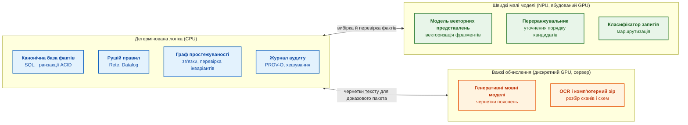
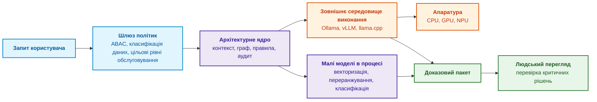
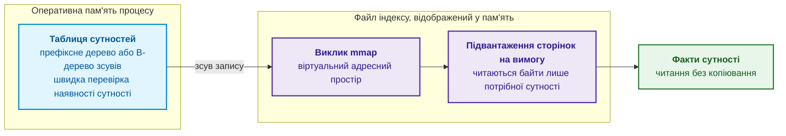
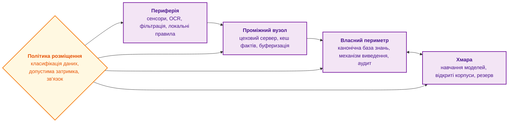
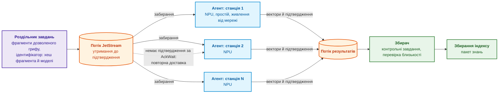
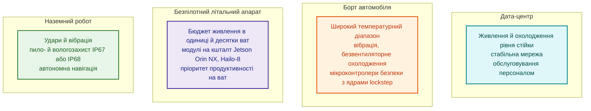
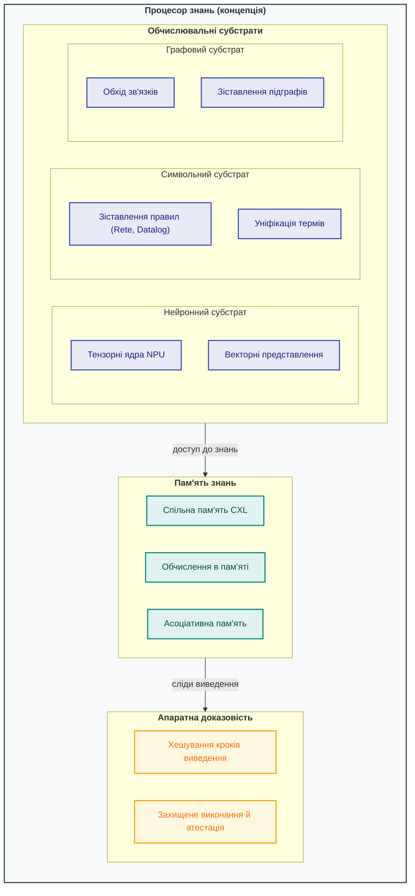

# Глава 18. Інфраструктура виконання: локальні моделі, апаратні прискорювачі, Edge та On-Premise

> **Книга:** [Архітектура доказових експертних систем](README.md) · [Частина VII: Реалізація, розгортання та обмін знаннями](part-07-runtime-and-knowledge-exchange.md)  
> **Попередня глава:** [Глава 17. Технологічний стек: критерії вибору інструментів, мов програмування та рушіїв правил](ch17-implementation-stack.md)  
> **Наступна глава:** [Глава 22. Кібернетичний цикл керування: сенсори, периферія та зворотний зв'язок](ch22-cybernetics-edge-to-backend.md)  
> **Зміст книги:** [README.md](README.md)  
> **Автор:** [Микола Федчик](about-the-author.md)  
> **Рівень:** середній і поглиблений: системні інженери, архітектори інфраструктури машинного навчання, розробники вбудованих і периферійних пристроїв  
> **Очікувані результати:** розподіляти компоненти експертної системи між CPU, GPU і NPU за профілем обчислень; оцінювати досяжну продуктивність за моделлю Roofline; вирішувати, які моделі виконувати в процесі експертної системи, а які в окремих процесах; обирати топологію розміщення від периферійного пристрою до хмари; складати бюджет затримки за перцентилями; пояснювати й контролювати числовий дрейф результатів після оновлення драйверів і середовищ виконання.

Попередні глави визначили логічну архітектуру та технологічний стек експертної системи. Але програмні абстракції виконуються фізично: в оперативній пам'яті, на системних шинах, у центральних процесорах (*Central Processing Unit*, CPU), графічних процесорах (*Graphics Processing Unit*, GPU) і нейронних процесорах (*Neural Processing Unit*, NPU). Виконуються вони в хмарних кластерах, на серверах у власному периметрі організації (*on-premise*) або на компактних контролерах поруч із сенсорами (*edge*).

Ця глава відповідає на запитання: **як обґрунтувати апаратуру й топологію виконання для заданої якості, затримки та автономності?** Профіль обчислень дає початкову гіпотезу: розгалужені правила часто доцільні на CPU, а щільна лінійна алгебра може виграти від GPU або NPU. Рішення залежить також від підтримки операторів, розміру пакета запитів, передавання даних, пам'яті й допустимих відмов. Назва прискорювача не гарантує детермінізму чи ізоляції.

Діаграма показує базовий розподіл компонентів за трьома обчислювальними зонами.



Діаграма не є догмою: на робочій станції всі три зони можуть працювати на одному процесорі з вбудованим NPU. Але межі між зонами відображають різну природу обчислень, і наступний розділ пояснює цю різницю кількісно.

## Профіль обчислень: чому правила й нейромережі потребують різної апаратури

Логічні правила, транзакції SQL і обхід графа простежуваності складаються з розгалужень і переходів за вказівниками: процесор постійно чекає на дані з пам'яті, а не на арифметику. Векторизація й генеративні моделі, навпаки, виконують мільярди однотипних множень і додавань. Щоб порівняти ці профілі кількісно, використовують модель Roofline Вільямса, Вотермана й Паттерсона [[1]](#src-1).

Пікова продуктивність процесора залежить від кількості ядер $N_{\text{cores}}$, тактової частоти $f$ і кількості операцій з рухомою комою за такт на ядро:

```math
P_{\text{peak}} = N_{\text{cores}} \times f \times \mathrm{FLOP}_{\text{cycle}}
```

- Пікова оцінка $P_{\text{peak}}$ дорівнює кількості ядер $N_{\text{cores}}$, помноженій на частоту $f$ та число операцій з рухомою комою за такт $\mathrm{FLOP}_{\text{cycle}}$;
- $N_{\text{cores}}$ вимірюється в ядрах, $f$ у тактах за секунду, а $\mathrm{FLOP}_{\text{cycle}}$ в операціях на такт на одне ядро;
- знак $\times$ позначає множення, а результат $P_{\text{peak}}$ має одиницю операцій за секунду, зазвичай FLOP/s.

Це теоретична верхня межа за заданої частоти й набору інструкцій, а не гарантована швидкість програми. Умовний приклад із 16 ядрами, 3 ГГц і 64 операціями на такт дає $16\times3\times10^9\times64=3{,}072\times10^{12}$ FLOP/s.

Для ядра з двома блоками злитого множення-додавання (*fused multiply-add*, FMA), кожен з яких обробляє 16 чисел одинарної точності, $`\mathrm{FLOP}_{\text{cycle}} = 2 \times 16 \times 2 = 64`$, бо одна операція FMA $a \cdot b + c$ рахується як дві операції. Умовний процесор із 16 ядрами на частоті 3 ГГц матиме $`P_{\text{peak}} \approx 3{,}07`$ TFLOP/s.

Пропускна здатність пам'яті залежить від швидкості передачі $f_{\text{mem}}$ (мільйонів передач за секунду), ширини шини $W_{\text{bus}}$ у бітах і кількості каналів:

```math
\mathrm{BW} = f_{\text{mem}} \times \frac{W_{\text{bus}}}{8} \times N_{\text{channels}}
```

- Пропускна здатність $\mathrm{BW}$ обчислюється з частоти передавання $f_{\text{mem}}$, ширини шини $W_{\text{bus}}$ та кількості каналів $N_{\text{channels}}$;
- $f_{\text{mem}}$ задається в передачах за секунду, $W_{\text{bus}}$ у бітах, а ділення на 8 перетворює біти на байти;
- множник $N_{\text{channels}}$ додає пропускну здатність незалежних каналів, результат вимірюється в байтах за секунду.

Для двох каналів шириною 64 біти й швидкістю 4 800 мільйонів передач за секунду формула дає $4{,}8\times10^9\times8\times2=76{,}8$ ГБ/с. Фактична прикладна пропускна здатність може бути нижчою через протокольні накладні витрати.

Для двох 64-бітних каналів DDR5-4800 це $4800 \times 10^6 \times 8 \times 2 \approx 76{,}8$ ГБ/с. Модель Roofline поєднує обидва обмеження через арифметичну інтенсивність задачі $I$, тобто кількість операцій на байт прочитаних даних:

```math
P_{\text{observed}} \le \min\left(P_{\text{peak}},\; I \times \mathrm{BW}\right)
```

- $P_{\text{observed}}$ є спостережуваною продуктивністю, а права частина є межею Roofline для заданих піку й пропускної здатності;
- $I$ є арифметичною інтенсивністю, тобто кількістю операцій з рухомою комою на байт даних;
- $\mathrm{BW}$ є пропускною здатністю пам'яті в байтах за секунду, тому $I\times\mathrm{BW}$ також вимірюється в FLOP/s;
- $\min(a,b)$ вибирає менше значення, що відображає обмеження або обчислювальних блоків, або пропускної здатності пам'яті.

Для наведеного далі пошуку векторів $I\approx0{,}5$ FLOP/байт і $\mathrm{BW}=76{,}8$ ГБ/с дають близько 38,4 GFLOP/s, тобто межу пам'яті нижче піку процесора. Це оцінка Roofline, а не виміряний результат конкретної програми.

Обчислимо інтенсивність для двох задач експертної системи. Пошук найближчих векторів у графовому індексі HNSW (*Hierarchical Navigable Small World*) [[2]](#src-2) на кожному кроці читає з пам'яті вектор сусіда й обчислює відстань до запиту. Для вектора розмірністю 768 у форматі float32 це 3072 байти й приблизно $2 \times 768 = 1536$ операцій, тобто $I \approx 0{,}5$ FLOP/байт. Якщо вектори не лежать у кеші (а в графі з мільйонами вузлів переходи випадкові), досяжна продуктивність становить $0{,}5 \times 76{,}8 \approx 38$ GFLOP/s, тобто близько 1 % піку. Множення двох квадратних матриць розміром $n$ виконує $2n^3$ операцій над $3 \times 4n^2$ байтами, тому $I \approx n/6$; для $n = 4096$ інтенсивність перевищує 680 FLOP/байт, і задача впирається вже в обчислювальні блоки.

Roofline дає верхню межу, не передбачає досягнення цієї межі. Випадковий обхід HNSW може обмежуватися затримкою залежних читань, а не лише сумарною пропускною здатністю пам'яті (*memory-bound*). Генеративна модель також не завжди обмежена арифметикою (*compute-bound*): попередня обробка входу й поетапне декодування мають різні профілі, а декодування малого пакета часто обмежує читання ваг і кешу. Додаткові ядра можуть допомогти незалежним запитам навіть тоді, коли один запит їх не завантажує. Перевіряти треба конкретний режим, а MLPerf Inference [[3]](#src-3) використовувати як методичний орієнтир, не заміну власного навантаження.

## Експертна система як координатор виконання

Експертна система не повинна перетворюватися на загальний сервер виконання моделей. Її роль полягає в координації викликів разом із політиками безпеки, контролем контексту й доказовим аудитом. Координатор виконує п'ять функцій:

- **Маршрутизація за змістом запиту.** Класифікатор визначає тип запиту й обирає спеціалізовану модель, наприклад компактну модель для текстів стандартів функціональної безпеки замість моделі загального аналізу специфікацій.
- **Фільтрація контексту за політиками доступу.** Фрагменти документів, до яких користувач не має допуску, не потрапляють у контекст генеративної моделі ще до її виклику.
- **Аудит викликів.** Журнал фіксує повний відбиток виклику: хеш моделі, версію токенізатора, температуру генерації, параметри квантування.
- **Виконання малих моделей у процесі.** Моделі векторних представлень і класифікатори працюють у пам'яті процесу експертної системи без мережевих накладних витрат.
- **Делегування важких моделей.** Генерацію тексту виконують окремі середовища виконання (Ollama, vLLM, llama.cpp), описані в [Главі 17](ch17-implementation-stack.md).



З практики автора: експертна система добре працює як клієнт середовищ виконання з аудитом. Генерацію тексту делеговано окремому процесу через REST API, а векторизація виконується в процесі експертної системи через бібліотеки OpenVINO або ONNX Runtime. Падіння зовнішнього сервера мовної моделі тоді фіксується як помилка сервісу й не зупиняє роботу з базою знань. Межу між «у процесі» і «в окремому процесі» варто проводити свідомо, і наступний розділ пояснює, за якими критеріями.

## Ізоляція середовищ виконання і керування пам'яттю

Модель можна виконувати в адресному просторі процесу експертної системи або в окремому процесі. Таблиця порівнює обидва варіанти.

| Критерій | Виконання в процесі | Виконання в окремому процесі |
|---|---|---|
| **Накладні витрати** | Немає міжпроцесної взаємодії, затримка в мікросекундах | Серіалізація тензорів і мережевий обмін |
| **Наслідок збою** | Аварійне завершення бібліотеки драйвера прискорювача зупиняє всю експертну систему | Збій ізольовано в окремому процесі, архітектурне ядро продовжує роботу |
| **Масштабування** | Разом з експертною системою | Незалежне, з чергою запитів |
| **Типове застосування** | Стабільні легкі бібліотеки: OpenVINO на CPU чи NPU, ONNX Runtime | Великі генеративні моделі, експериментальні драйвери GPU |

Правило вибору випливає з наслідку збою: у процесі експертної системи виконують лише те, збій чого прийнятно зупиняє всю експертну систему. Для великих моделей і нестабільних драйверів ціна ізоляції (мілісекунди на серіалізацію) значно менша за ціну аварійного зупину архітектурного ядра.

### Відображення бази фактів у пам'ять

Друга проблема пов'язана з розміром бази знань. Коли база налічує мільйони фактів, потоковий розбір текстових файлів (наприклад, JSONL) у купу процесу під час старту може займати десятки секунд і гігабайти оперативної пам'яті. Для периферійних пристроїв та інтерактивних утиліт командного рядка це неприйнятно.

Розв'язок полягає в компіляції бази фактів у двійковий файл, який відображається в адресний простір процесу викликом `mmap` [[4]](#src-4). Операційна система не читає такий файл цілком під час відкриття: сторінки файлу підвантажуються лише тоді, коли процес звертається до відповідних адрес. Діаграма показує дворівневу організацію такого файлу.



Перший рівень, компактна таблиця нормалізованих сутностей і зсувів, постійно лежить в оперативній пам'яті й дає змогу швидко перевірити, чи згадана в запитанні сутність взагалі є в базі знань. Другий рівень містить повні атрибути й цитати; ці байти операційна система читає лише для сутностей, задіяних у поточному ланцюжку доведення. Записи фіксованого двійкового формату читаються безпосередньо з відображеної пам'яті без розбору тексту й без виділення об'єктів у купі. Такий самий незмінний пакет знань з адресацією за вмістом описано в [Главі 15](ch15-knowledge-extraction-and-kb-construction.md); тут важливо, що відображення файлу переносить вартість старту з «прочитати все» на «прочитати потрібне».

Один відображений файл вміщується в пам'ять одного вузла. Якщо індекс більший за пам'ять вузла, є дві відповіді: явне читання з власним буфером або розбиття пакета на шарди, кожен з яких відображається окремим вузлом або процесом. Розбиття не змінює двох рівнів індексу всередині шарда, але додає маршрутизатор перед ними й питання, що робити, коли шард мовчить. Межі застосовності `mmap` описано в розділі 3.2 [Глави 32](ch32-high-performance-knowledge-packs-mmap-and-harvesting.md), правила розбиття в [Главі 7](ch07-knowledge-base-typology.md).

## Топології розгортання: від дата-центру до сенсора

Розміщення компонентів визначають чутливість даних, допустима затримка й наявність зв'язку. Діаграма показує чотири рівні розміщення та політику, що розподіляє між ними дані й задачі.



Кожен рівень має свою роль:

- **Власний периметр** (*on-premise*) є типовим вибором для оборонних, авіаційних, енергетичних і медичних застосувань: дані не залишають периметра безпеки організації, а канонічна база знань і журнал аудиту перебувають під її повним контролем.
- **Периферія** (*edge*) виконує критичні інваріанти безпеки безпосередньо на борту машини чи промислового робота і працює навіть за повного обриву мережі.
- **Проміжні вузли** агрегують потоки телеметрії від десятків периферійних контролерів, виконують дедуплікацію й фільтрацію перед передаванням до центральної бази. Концепцію таких вузлів між периферією та хмарою Бономі та співавтори назвали туманними обчисленнями (*fog computing*) [[5]](#src-5).
- **Хмара** підходить для навчання моделей, обробки відкритих корпусів і резервних пакетних обчислень, але конфіденційні дані туди потрапляють лише за явним рішенням політики розміщення.

Топології описують, де працює експертна система, коли відповідає користувачеві. Пакетні задачі на кшталт повного переіндексування корпусу мають інший профіль: вони не потребують відповіді за мілісекунди, але потребують багато обчислень, і для них існує ще одна топологія.

## Фонове індексування на простійних NPU робочих станцій

Зміна моделі векторних представлень змушує переіндексувати весь корпус: вектори різних моделей не можна порівнювати між собою, тож кожен фрагмент треба векторизувати заново. Для корпусу з десятками мільйонів фрагментів один прискорювач працюватиме добу або довше, а відправити конфіденційні специфікації до хмари з GPU політика розміщення часто не дозволяє. Водночас ноутбуки й робочі станції інженерів дедалі частіше мають вбудований нейронний процесор, який більшу частину часу простоює. Ідея використати простій чужих машин давня: система керування пакетними задачами Condor Літцкова, Лівні й Мутки ще 1988 року запускала задачі на робочих станціях, власники яких на той момент не працювали [[6]](#src-6), а платформа BOINC Андерсона поширила той самий підхід на добровільні обчислення в інтернеті [[7]](#src-7). Для експертної системи цей підхід дає мережу фонового індексування: роздільник завдань ділить корпус на незалежні одиниці роботи, а агенти на робочих станціях виконують векторизацію на своїх NPU.

Розподілена мережа є кандидатом для порівняння, не доведеним виграшем. Уже придбане обладнання зменшує капітальні витрати, але енергію на прийнятий результат, доступність і вартість супроводу потрібно виміряти. NPU не завжди споживає менше енергії за CPU на всьому маршруті: додаткове передавання, запуск моделі й повернення на CPU можуть змінити результат. Периметр організації теж не є одним рівнем довіри: фрагмент дозволяють передати лише конкретно авторизованому вузлу.

### Які задачі підходять для мережі NPU

Задача підходить для мережі NPU лише тоді, коли виконуються всі шість умов:

1. **Підтримуваний режим моделі.** У цьому проєкті мережа виконує навчені моделі; можливості конкретного NPU й програмного стека перевіряють окремо.
2. **Підтримувані оператори й форми.** Компілятор може вимагати фіксованих розмірів або обмежень динамічних форм [[8]](#src-8). Успішне завантаження моделі не доводить, що всі її оператори виконуються на NPU.
3. **Незалежні одиниці роботи.** Фрагменти обробляються окремо, без обміну даними між вузлами.
4. **Терпимість до затримки.** Вузол може заснути, вимкнутися чи зайнятися роботою власника, тож мережа годиться для пакетів, а не для відповіді користувачеві.
5. **Достатня точність FP16 чи INT8.** Задача не потребує обчислень подвійної точності.
6. **Дозволене переміщення даних.** Політика класифікації дозволяє передати фрагмент на інший вузол ([Глава 10](ch10-knowledge-acquisition-systems.md)).

Векторизація, переранжування й класифікація є кандидатами, але кожну модель перевіряють за шістьма умовами. Не можна загалом виключити генерацію на NPU: придатність визначають модель, оператори й середовище виконання. Натомість звичайне стиснення DEFLATE або zstd не слід переносити на тензорний прискорювач без відповідної реалізації та вимірювань; CPU є базовим варіантом ([Глава 32](ch32-high-performance-knowledge-packs-mmap-and-harvesting.md)).

### Як влаштована мережа

Схема показує мережу на основі NATS JetStream, шару надійного зберігання повідомлень у тому самому брокері NATS, через який система здобуття знань обмінюється даними з експертною системою ([Глава 10](ch10-knowledge-acquisition-systems.md), [Глава 17](ch17-implementation-stack.md)).



Фіолетовий блок готує роботу, помаранчеві блоки є потоками брокера, сині блоки є агентами на станціях, зелені блоки перевіряють і використовують результат. Надійність мережі тримається на чотирьох рішеннях.

1. **Одиниці роботи й ідемпотентність.** Ідентифікатор охоплює вміст, модель, токенізатор, конфігурацію й схему виходу. JetStream допускає повторну доставку після втрати підтвердження [[9]](#src-9); збереження результату має бути ідемпотентним. Підтвердження надсилають після надійного прийняття результату, а збій між записом і підтвердженням перевіряють окремо. Два різні результати для одного ідентифікатора потребують перевірки конфлікту, не мовчазного вибору першого.
2. **Поведінка «доброго сусіда».** Агент бере роботу, лише коли станція простоює, живиться від мережі й NPU вільний, і звільняє NPU, щойно NPU знадобився власникові: операційна система й застосунки власника, наприклад обробка відео під час наради, теж можуть використовувати NPU. Агент також обмежує власне споживання пам'яті, бо вбудований NPU ділить оперативну пам'ять із рештою станції.
3. **Відтворюваність між вузлами.** Станції мають різні покоління NPU й різні версії драйверів, а обчислення у FP16 дають на різній апаратурі трохи різні вектори (розділ про числовий дрейф нижче). Тому модель і її версію фіксують, кожен вузол перед допуском проходить перевірку на контрольному наборі фрагментів із відомими векторами (косинусна близькість не нижча за поріг), а збирач періодично підкидає контрольні завдання з відомою відповіддю. Вузол, що не пройшов перевірку, виключають з мережі до з'ясування причини.
4. **Безпека передавання.** З'єднання захищають взаємною автентифікацією TLS і обліковими даними NATS, а до мережі потрапляють лише фрагменти, гриф яких дозволяє переміщення. Агент не зберігає текст фрагмента після векторизації.

### Скільки дасть мережа

Пікова пропускна здатність мережі оманлива: станції сплять, виконують роботу власників і витрачають час на передавання. Тому планування спирається на ефективну пропускну здатність, яка враховує доступність кожної станції й втрати.

```math
Q_{\text{eff}} = \sum_{i=1}^{M} q_i \, a_i \, (1 - o_i)
```

Позначення ефективної пропускної здатності:

- $M$ є кількістю станцій у мережі;
- $q_i$ є виміряною пропускною здатністю NPU станції $i$, у векторах за секунду;
- $a_i$ є часткою часу, коли станція доступна для роботи (простоює, живиться від мережі, NPU вільний), від 0 до 1;
- $o_i$ є часткою втрат на передавання, повторні доставки й контрольні завдання, від 0 до 1;
- $Q_{\text{eff}}$ є ефективною пропускною здатністю мережі, у векторах за секунду.

Час переіндексування корпусу з $N$ фрагментів дорівнює $N / Q_{\text{eff}}$. Приклад. Мережа має 200 станцій, і NPU кожної дає близько 240 векторів за секунду (порядок величини з вимірювання в [Главі 10](ch10-knowledge-acquisition-systems.md)). Станції доступні лише 10 % часу, а втрати становлять 20 %. Тоді ефективна пропускна здатність становить 200 · 240 · 0,1 · 0,8 = 3 840 векторів за секунду, і корпус із 20 мільйонів фрагментів переіндексується приблизно за 5 200 с, тобто за півтори години. Один NPU з тією самою пропускною здатністю працював би приблизно 23 години, а CPU з 68 векторами за секунду приблизно 82 години. Формула не враховує нерівномірності доступності протягом доби, черг і часу старту моделі на кожному вузлі, тож оцінку перевіряють пілотним запуском на 10–20 станціях.

Мережа простійних NPU розширює обчислювальні можливості власного периметра без нових серверів, але працює лише для пакетних задач. Найжорсткіші фізичні обмеження діють на периферійному рівні, тому наступний розділ розглядає апаратуру саме з цього погляду.

## Апаратна база й фізичні обмеження периферії

Різні класи обчислень потребують різної архітектури кристала. Таблиця зіставляє класи операцій з апаратурою та програмними платформами.

| Клас обчислень | Характер операцій | Апаратура | Програмні платформи |
|---|---|---|---|
| **Символьна логіка, предикати, SQL** | Розгалуження, обхід графів, цілочисельні індекси | Багатоядерні CPU (x86-64, ARM64) | Стандартні компілятори, векторні розширення (AVX-512, AMX) |
| **Щільна лінійна алгебра** | Множення матриць, тензорні операції | Серверні й робочі GPU | CUDA і TensorRT, ROCm |
| **Енергоефективне виконання моделей** | Квантовані тензори (INT8, INT4), згортки | Вбудовані NPU, мобільні прискорювачі | OpenVINO, Qualcomm QNN, Core ML |
| **Потокова обробка сигналів** | Детерміновані конвеєри з мікросекундною затримкою, злиття даних сенсорів | ПЛІС (FPGA), сигнальні процесори (DSP) | Засоби проєктування AMD і Altera |

На борту рухомих об'єктів (автомобілів, безпілотних літальних апаратів, наземних робототехнічних комплексів) до вибору апаратури додаються обмеження розміру, маси й енергоспоживання (*Size, Weight and Power*, SWaP). Діаграма порівнює умови трьох типів бортового розміщення з дата-центром.



Для безпілотного літального апарата кожен ват живлення скорочує час польоту, тому важить не пікова продуктивність, а продуктивність на ват. Модулі Jetson Orin NX дають до 100 TOPS (трильйонів операцій за секунду) з налаштовуваною потужністю від 10 до 25 Вт [[10]](#src-10), а прискорювач Hailo-8 дає до 26 TOPS за типового споживання 2,5 Вт [[11]](#src-11). Ці числа є паспортними піковими значеннями для цілочисельних операцій; реальну швидкість конкретної моделі треба вимірювати на борту.

В автомобільній електроніці критичним є розділення рівнів керування. Важке тензорне виведення для сприйняття обстановки виконує продуктивна система на кристалі, а детерміновану логіку безпеки й правила аварійної зупинки закріплюють за мікроконтролером безпеки. Такі мікроконтролери мають ядра, що працюють у режимі lockstep: два ядра виконують ті самі інструкції, а апаратура порівнює результати й виявляє збій. Прикладом такого мікроконтролера є Texas Instruments TMS570LC4357, який виробник позиціює для застосувань, критичних щодо безпеки [[12]](#src-12). Для наземних роботів важливий ще й захист корпусу від пилу й води, який позначають кодом IP за IEC 60529 [[13]](#src-13).

Таке розділення допомагає забезпечити три властивості, важливі для функціональної безпеки за ISO 26262 [[14]](#src-14), особливо на найвищому рівні цілісності ASIL D:

- **Передбачувана затримка.** Мікроконтролер обробляє правила безпеки за обмежений час без пауз на збирання сміття.
- **Локалізація збоїв.** Якщо нейромережевий модуль сприйняття зависає чи видає шум через засліплення камер, мікроконтролер безпеки продовжує утримувати фізичні інваріанти, наприклад дистанцію аварійного гальмування.
- **Автономність.** Захисний маневр не потребує стільникового зв'язку чи підтвердження з хмари.

Це цілі проєктування, не доведені властивості будь-якого мікроконтролера. Lockstep може виявляти певні розходження виконання, але не однакову помилку програми на двох ядрах. Потрібні аналіз небезпек, часові межі, перевірка сенсорних даних, спільних ресурсів і незалежності захисного механізму. Наявність контролера сама не встановлює відповідності ASIL D.

Апаратура визначає, що можна виконати; наступний розділ розглядає, як швидко й наскільки відтворювано.

## Бюджет затримки й числовий дрейф

### Бюджет затримки

Затримку вимірюють розподілом, зокрема p95 і p99, а також відмовами й перевищеннями строку. Перцентиль не є гарантованою верхньою межею: частина запитів буде повільнішою. Для жорсткого строку потрібні окремі обмеження входу, черги й виконання. Наскрізний час послідовного запиту складається з етапів; для паралельних етапів враховують критичний шлях:

```math
T_{\text{total}} = T_{\text{retrieval}} + T_{\text{embedding}} + T_{\text{reranking}} + T_{\text{rules}} + T_{\text{LLM}} + T_{\text{overhead}}
```

- Наскрізний бюджет $T_{\text{total}}$ є сумою затримок пошуку, векторизації, переранжування, правил, мовної моделі та накладних витрат;
- кожна величина $T_{\text{...}}$ є часом відповідного етапу, зазвичай у мілісекундах;
- знаки $+$ додають тривалості послідовних етапів; сума є планувальною оцінкою, а не автоматично перцентилем повного запиту.

У наведеному далі умовному бюджеті $40+8+25+5+900+12=990$ мс. Однак перцентилі окремих етапів не додаються точно, тому наскрізний p95 потрібно вимірювати окремо.

Умовний бюджет для інтерактивної інженерної експертизи за перцентилем p95 може виглядати так: пошук фактів у SQL і BM25 займає 40 мс, векторизація запиту на NPU 8 мс, переранжування 50 кандидатів 25 мс, виведення в рушії правил 5 мс, потокова генерація тексту обґрунтування 900 мс, авторизація й аудит 12 мс. Разом бюджет становить близько 990 мс, і майже весь він припадає на генерацію тексту. Звідси випливає, що оптимізувати рушій правил тут марно, а скоротити затримку можна, генеруючи коротші тексти або показуючи висновок раніше за пояснення.

Перцентилі не додаються й без додаткових припущень не дають верхньої чи нижньої межі суми. Контрприклад: два незалежні етапи тривають 0 мс із імовірністю 0,95 і 100 мс із імовірністю 0,05. p95 кожного етапу дорівнює 0, але нульовий сумарний час має імовірність лише 0,9025, тому p95 суми дорівнює 100 мс. Бюджет етапів придатний для планування, а наскрізні перцентилі потрібно вимірювати разом із чергою й накладними витратами.

### Договір вимірювання й автономності

Профіль досліду фіксує ваги, токенізатор, довжину входу й виходу, точність, пристрій, версії драйверів і кількість паралельних запитів. Окремо вимірюють холодний запуск, прогріте виконання, час до першого токена й повної відповіді, пік пам'яті, енергію на результат та якість. Автоматичне повернення частини операторів на CPU має бути видимим у звіті.

Локальна інсталяція не доводить автономності. Перевіряють роботу без зовнішньої мережі, наявність ваг і залежностей, відсутність недозволеної телеметрії, поведінку за нестачі пам'яті й доступ до незмінного пакета знань. Окремий процес локалізує частину програмних збоїв, але не спільну нестачу пам'яті, живлення або відмову драйвера. Простий маршрут CPU є базовим варіантом для порівняння OpenVINO, ONNX Runtime та сервісів генерації.

### Числовий дрейф

Доказовість вимагає, щоб оновлення драйвера, компілятора чи вбудованого програмного забезпечення NPU не змінювало результатів змістового зіставлення непомітно. Проте навіть з незмінними вагами моделі результати змінюються, бо додавання чисел з рухомою комою не асоціативне: результат залежить від порядку операцій [[15]](#src-15). Різні ядра обчислень, кількість потоків чи смуг векторного блока додають ті самі доданки в різному порядку. Програма мовою Go показує цей ефект.

<details>
<summary>Приклад мовою Go: числовий дрейф суми з рухомою комою</summary>

```go
package main

import (
	"fmt"
	"math"
	"math/rand"
)

// dotSeq додає добутки послідовно, як простий цикл на одному ядрі.
func dotSeq(a, b []float32) float32 {
	var s float32
	for i := range a {
		s += a[i] * b[i]
	}
	return s
}

// dotLanes імітує векторне ядро з 8 смугами: кожна смуга має власну
// часткову суму, а наприкінці часткові суми додаються між собою.
func dotLanes(a, b []float32) float32 {
	var lane [8]float32
	for i := range a {
		lane[i%8] += a[i] * b[i]
	}
	var s float32
	for _, v := range lane {
		s += v
	}
	return s
}

func cosine(dot func(a, b []float32) float32, a, b []float32) float64 {
	return float64(dot(a, b)) / math.Sqrt(float64(dot(a, a))*float64(dot(b, b)))
}

func main() {
	big := float32(1e8)
	fmt.Println("(1e8 + 1) - 1e8 =", (big+1)-big)
	fmt.Println("(1e8 - 1e8) + 1 =", (big-big)+1)

	r := rand.New(rand.NewSource(42))
	a := make([]float32, 768)
	b := make([]float32, 768)
	for i := range a {
		a[i] = float32(r.NormFloat64())
		b[i] = a[i] + 0.3*float32(r.NormFloat64())
	}
	s1, s2 := dotSeq(a, b), dotLanes(a, b)
	fmt.Printf("скалярний добуток: %.7f проти %.7f, різниця %.1e\n", s1, s2, s1-s2)
	c1, c2 := cosine(dotSeq, a, b), cosine(dotLanes, a, b)
	fmt.Printf("косинус: %.9f проти %.9f, різниця %.1e\n", c1, c2, c1-c2)
}
```

</details>

З Go 1.27.1 на процесорі архітектури amd64 програма виводить:

<details>
<summary>Дані або результат прикладу</summary>

```text
(1e8 + 1) - 1e8 = 0
(1e8 - 1e8) + 1 = 1
скалярний добуток: 657.9636841 проти 657.9638672, різниця -1.8e-04
косинус: 0.952824235 проти 0.952824475, різниця -2.4e-07
```

</details>


Перші два рядки показують ефект у найпростішій формі: у форматі float32 число $10^8 + 1$ округлюється до $10^8$, тому порядок дій змінює результат з 1 на 0. Наступні рядки показують той самий ефект для векторів розмірністю 768: послідовне додавання й додавання вісьмома смугами дають скалярні добутки, що різняться в четвертому знаку після коми, а косинусна близькість різниться приблизно на $2 \times 10^{-7}$. На іншій архітектурі чи з іншою версією компілятора числа можуть бути іншими, і саме тому відтворюваність не можна гарантувати порівнянням на точну рівність.

Тому регресійні тести порівнюють поточні вектори з еталонними (*gold baseline*) за косинусною близькістю з порогом:

```math
\cos(\vec{v}_{\text{now}}, \vec{v}_{\text{base}}) = \frac{\vec{v}_{\text{now}} \cdot \vec{v}_{\text{base}}}{\|\vec{v}_{\text{now}}\| \, \|\vec{v}_{\text{base}}\|} \geq \tau_{\text{drift}}
```

- Перевірка порівнює поточний вектор $`\vec{v}_{\text{now}}`$ з еталонним $`\vec{v}_{\text{base}}`$;
- крапка між векторами означає скалярний добуток, а $`\|\cdot\|`$ позначає евклідову довжину;
- косинусна близькість є безрозмірним числом від $-1$ до $1$ для ненульових векторів однакової розмірності;
- $\tau_{\text{drift}}$ є встановленим порогом допустимого дрейфу, а $\geq$ означає, що близькість має бути не нижчою за поріг.

За умовного порога $0{,}99$ значення $0{,}995$ проходить тест, а $0{,}98$ ні. Поріг треба калібрувати на конкретній моделі й даних: сам тест близькості не встановлює, чи збережено семантичну правильність.

Поріг є параметром досліду, не універсальною межею прийнятності драйвера. Навіть близькі вектори можуть змінити порядок майже однакових кандидатів або перейти поріг класифікації. Перевіряють також розмірність, скінченність, норму за договором, якість пошуку й остаточні вердикти на граничних прикладах. Розходження потребує діагностики; повна переіндексація потрібна не за будь-якого числового шуму. Для побітового повторення фіксують підтримувані детерміновані операції, ядра, потоки й порядок редукції та перевіряють повторні запуски.

## Перспективні напрями апаратури для систем знань

Сучасну інфраструктуру машинного навчання часто зводять до закупівлі найпродуктивніших GPU. Проте розрахунок Roofline вище показав, що профіль експертної системи інший: обхід графів знань, зіставлення правил і пошук у просторі станів обмежені затримкою довільного доступу до пам'яті (*pointer chasing*), а не кількістю операцій з рухомою комою. Тому для систем знань цікаві напрями апаратури, які атакують саме вузьке місце пам'яті. Таблиця підсумовує напрями, для яких є відкриті дослідження чи стандарти.

| Напрям | Яке вузьке місце усуває | Стан |
|---|---|---|
| **Прискорювачі графової аналітики** | Нерегулярний доступ до пам'яті під час обходу графа | Дослідницькі прототипи, наприклад Graphicionado [[16]](#src-16) |
| **Обчислення в пам'яті** (*processing-in-memory*) | Передавання даних між пам'яттю й процесором під час обходу ребер | Дослідницькі прототипи, наприклад Tesseract для паралельної обробки графів [[17]](#src-17) |
| **Спільна пам'ять за CXL** (*Compute Express Link*) | Розміщення великих графів знань у пам'яті кількох процесорів без серіалізації через мережу | Відкритий промисловий стандарт [[18]](#src-18) |
| **Власні інструкції RISC-V** | Відсутність команд для уніфікації термів і бітових масок предикатів | Відкрита архітектура набору команд із простором для розширень [[19]](#src-19) |
| **Нейро-символьні прискорювачі** | Обмін між векторним простором нейромереж і дискретними фактами | Концепції й ранні дослідження |

Таблиця розділяє напрями за зрілістю: CXL і RISC-V вже доступні для проєктування, прискорювачі графів і обчислення в пам'яті існують як дослідницькі прототипи, а нейро-символьні прискорювачі поки що є концепцією.

### Концептуальна модель процесора знань

Поєднання цих напрямів автор описує як концептуальну модель процесора знань (*Knowledge Processing Unit*, KPU). Це гіпотеза для досліджень, а не наявний продукт. Модель поєднує три обчислювальні субстрати, кожен з яких оптимізовано під власну природу даних.



Нейронний субстрат перетворює сенсорні потоки й тексти на векторні представлення та символи. Символьний субстрат детерміновано перевіряє правила й контракти. Графовий субстрат зберігає контекст і причинно-наслідкові зв'язки. Рівень апаратної доказовості хешує кроки виведення в захищеній пам'яті, щоб журнал аудиту не можна було непомітно змінити.

Найпрактичніший шлях до експериментів з такою моделлю сьогодні полягає не у виготовленні власної спеціалізованої мікросхеми, а в апаратно-програмному співпроєктуванні на ПЛІС з ядрами RISC-V. Специфікація RISC-V залишає простір кодів операцій для власних розширень, тож дослідник може додати команди для найгарячіших операцій механізму виведення. Наприклад, гіпотетичний набір команд для систем знань міг би виглядати так:

<details>
<summary>Дані або результат прикладу</summary>

```text
K_UNIFY      rd, rs1, rs2   ; зіставлення двох предикатних термів
K_SUBGRAPH   rd, rs1, imm   ; крок переходу за дескриптором ребра графа
K_RULE_MATCH rd, rs1, rs2   ; перевірка бітової маски активних умов Rete
```

</details>


Ці команди є ілюстрацією дослідницького запитання «які операції механізму виведення варто перенести в апаратуру», а не описом наявного розширення. Відповідь на це запитання має давати профілювання реальної експертної системи, а не інтуїція.

## Мінімальна автономна конфігурація

Повна інфраструктура з кількома зонами й рівнями розміщення не є обов'язковою на старті. Доказове ядро експертної системи можна згорнути до конфігурації, яка працює на звичайній робочій станції чи польовому ноутбуці без дискретного GPU та без мережі.


Конфігурація використовує один файл бази даних SQLite, у якому розширення FTS5 дає повнотекстовий пошук із вбудованою функцією ранжування `bm25()` [[20]](#src-20). Генеративна модель тут необов'язкова: пояснення складається з правила, що спрацювало, і пункту стандарту, на який правило посилається. Такої конфігурації досить, щоб перевірити на реальних документах, чи правильно сформульовано предметну модель, перш ніж інвестувати в прискорювачі.

## Висновки
Профіль обчислень допомагає сформувати гіпотезу розміщення, а вимірювання підтримки операторів, якості, затримки, пам'яті й енергії дозволяє її прийняти або відхилити. Roofline є моделлю верхньої межі для обраних операцій, не універсальним прогнозом обходу графа чи генерації. Розподілена мережа простійних NPU є окремою дослідницькою пропозицією; наведені числа планування не є виміряним прискоренням такого кластера.

Незалежний контрприклад показав, що сума p95 етапів може бути нижчою за p95 повного запиту. Програма Go демонструє неасоціативність обчислень float32; близькість векторів потрібно доповнити перевіркою якості пошуку й рішень. Окремий процес зменшує область програмного збою, але спільні фізичні ресурси й відмови перевіряють додатково.

Межі глави такі. Числа продуктивності для умовного процесора й паспортні дані прискорювачів не замінюють вимірювань на конкретній апаратурі. Розділ про перспективну апаратуру спирається на дослідницькі прототипи, а модель процесора знань є гіпотезою автора. [Глава 19](ch19-from-question-to-evidence.md) повертається від апаратури до логіки й показує, як неструктуроване запитання інженера перетворюється на ланцюжок фактів і доведення.

## Запитання до читачів
1. Чому велику генеративну модель небезпечно виконувати в тому самому адресному просторі, що й рушій правил? За яким критерієм обирати між виконанням у процесі та в окремому процесі?
2. Обчисліть за моделлю Roofline арифметичну інтенсивність пошуку найближчих векторів розмірністю 768 у форматі float32. Чому додаткові обчислювальні ядра майже не прискорюють такий пошук?
3. Чому відображення бази фактів у пам'ять викликом `mmap` скорочує час старту порівняно з розбором текстових файлів?
4. Чому для безпілотного літального апарата важливіша продуктивність на ват, ніж пікова продуктивність?
5. Як в автомобільній електроніці розділено нейромережеве сприйняття й логіку аварійної зупинки і яку роль відіграють ядра lockstep?
6. Чому сума перцентилів p95 етапів не дорівнює p95 наскрізної затримки?
7. Чому скалярний добуток тих самих векторів може відрізнятися після оновлення драйвера, навіть якщо ваги моделі не змінювалися, і як регресійні тести контролюють такий дрейф?
8. Які шість умов має задовольнити задача, щоб її варто було передати мережі простійних NPU, і чому стиснення пакетів знань таких умов не задовольняє?

## Словник
| Український термін | Англійський відповідник | Коротке пояснення |
|---|---|---|
| Власний периметр | On-premise | Розміщення на серверах організації всередині її периметра безпеки |
| Периферія | Edge | Обчислення на пристроях поруч із сенсорами й виконавчими механізмами |
| Туманні обчислення | Fog computing | Проміжний рівень обчислень між периферією та хмарою |
| Арифметична інтенсивність | Arithmetic intensity | Кількість операцій на байт прочитаних з пам'яті даних |
| Обмеженість пам'яттю | Memory-bound | Стан, коли продуктивність обмежує пропускна здатність або затримка доступу до пам'яті |
| Обмеженість обчисленнями | Compute-bound | Стан, коли продуктивність визначають обчислювальні блоки |
| Злите множення-додавання | Fused multiply-add | Операція $a \cdot b + c$ з одним округленням |
| Бюджет затримки | Latency budget | Розподіл допустимої затримки між етапами обробки запиту |
| Перцентиль | Percentile | Значення, нижче якого лежить задана частка вимірювань |
| Числовий дрейф | Numerical drift | Зміна числових результатів моделі без зміни її ваг |
| Відображення файлу в пам'ять | Memory mapping | Доступ до файлу як до області пам'яті процесу з підвантаженням сторінок на вимогу |
| Режим lockstep | Lockstep | Виконання тих самих інструкцій двома ядрами з апаратним порівнянням результатів |
| Обчислення в пам'яті | Processing-in-memory | Виконання операцій безпосередньо в мікросхемах пам'яті |
| Процесор знань | Knowledge processing unit | Концептуальна модель процесора для систем знань, запропонована автором |
| Співпроєктування апаратури й програм | Hardware/software co-design | Спільне проєктування апаратної та програмної частин під задачу |
| Мережа фонового індексування | Idle-cycle compute mesh | Агенти на робочих станціях, що виконують пакетну векторизацію на простійних NPU |
| Утримання до підтвердження | Work-queue retention | Політика потоку JetStream, за якої повідомлення зникає після підтвердження обробки одним споживачем |
| Повторна доставка | Redelivery | Видача непідтвердженої одиниці роботи іншому споживачеві після спливу часу очікування |
| Шард | Shard | Частина бази знань чи її індексу, яку обслуговує один вузол або процес; визначення наведено в Главі 7 |

## Абревіатури
| Скорочення | Розшифрування | Значення |
|---|---|---|
| ABAC | Attribute-Based Access Control | керування доступом на основі атрибутів |
| AMX | Advanced Matrix Extensions | матричні розширення процесорів Intel |
| ASIL | Automotive Safety Integrity Level | рівень цілісності безпеки в автомобільній електроніці |
| AVX-512 | Advanced Vector Extensions 512 | 512-бітні векторні розширення x86 |
| BM25 | Best Matching 25 | функція лексичного ранжування |
| CPU | Central Processing Unit | центральний процесор |
| CXL | Compute Express Link | стандарт з'єднання процесорів, прискорювачів і пам'яті |
| DDR5 | Double Data Rate 5 | стандарт оперативної пам'яті |
| DSP | Digital Signal Processor | сигнальний процесор |
| FMA | Fused Multiply-Add | злите множення-додавання |
| FP16 | 16-bit floating point | формат чисел з рухомою комою половинної точності |
| FPGA | Field-Programmable Gate Array | програмовна логічна інтегральна схема (ПЛІС) |
| FTS5 | Full-Text Search 5 | розширення повнотекстового пошуку SQLite |
| GPU | Graphics Processing Unit | графічний процесор |
| HNSW | Hierarchical Navigable Small World | графовий індекс для пошуку найближчих векторів |
| INT8 | 8-bit integer | цілі 8-бітні числа, формат квантованих моделей |
| IP | Ingress Protection | код ступеня захисту корпусу за IEC 60529 |
| JSONL | JSON Lines | текстовий формат з одним записом JSON на рядок |
| KPU | Knowledge Processing Unit | процесор знань (концепція) |
| NPU | Neural Processing Unit | нейронний процесор |
| OCR | Optical Character Recognition | оптичне розпізнавання символів |
| PROV-O | PROV Ontology | онтологія походження W3C |
| RISC-V | Reduced Instruction Set Computer, п'ята версія | відкрита архітектура набору команд |
| SWaP | Size, Weight and Power | обмеження розміру, маси й енергоспоживання |
| TLS | Transport Layer Security | протокол захищеного з'єднання; у взаємному варіанті сертифікат перевіряють обидві сторони |
| TOPS | Tera Operations Per Second | трильйонів операцій за секунду |
| ПЛІС | програмовна логічна інтегральна схема | мікросхема з конфігуровною логікою |

## Джерела
1. <a id="src-1"></a>Samuel Williams, Andrew Waterman, David Patterson. [*Roofline: An Insightful Visual Performance Model for Multicore Architectures*](https://doi.org/10.1145/1498765.1498785). *Communications of the ACM*, 52(4), 65–76, 2009.
2. <a id="src-2"></a>Yu. A. Malkov, D. A. Yashunin. [*Efficient and Robust Approximate Nearest Neighbor Search Using Hierarchical Navigable Small World Graphs*](https://doi.org/10.1109/TPAMI.2018.2889473). *IEEE Transactions on Pattern Analysis and Machine Intelligence*, 42(4), 824–836, 2020.
3. <a id="src-3"></a>Vijay Janapa Reddi та ін. [*MLPerf Inference Benchmark*](https://doi.org/10.1109/ISCA45697.2020.00045). *2020 ACM/IEEE 47th Annual International Symposium on Computer Architecture (ISCA)*, 446–459, 2020.
4. <a id="src-4"></a>The Open Group. [*mmap: Map Pages of Memory*](https://pubs.opengroup.org/onlinepubs/9799919799/functions/mmap.html). *The Open Group Base Specifications Issue 8, IEEE Std 1003.1-2024*, 2024.
5. <a id="src-5"></a>Flavio Bonomi, Rodolfo Milito, Jiang Zhu, Sateesh Addepalli. [*Fog Computing and Its Role in the Internet of Things*](https://doi.org/10.1145/2342509.2342513). *Proceedings of the First Edition of the MCC Workshop on Mobile Cloud Computing*, 13–16, 2012.
6. <a id="src-6"></a>Michael J. Litzkow, Miron Livny, Matt W. Mutka. [*Condor: A Hunter of Idle Workstations*](https://doi.org/10.1109/DCS.1988.12507). *Proceedings of the 8th International Conference on Distributed Computing Systems*, 104–111, 1988.
7. <a id="src-7"></a>David P. Anderson. [*BOINC: A System for Public-Resource Computing and Storage*](https://doi.org/10.1109/GRID.2004.14). *Fifth IEEE/ACM International Workshop on Grid Computing*, 4–10, 2004.
8. <a id="src-8"></a>OpenVINO. [*NPU Device*](https://docs.openvino.ai/2024/openvino-workflow/running-inference/inference-devices-and-modes/npu-device.html). Документація OpenVINO 2024.
9. <a id="src-9"></a>NATS.io. [*JetStream*](https://docs.nats.io/nats-concepts/jetstream). Документація NATS.
10. <a id="src-10"></a>NVIDIA. [*Jetson Orin*](https://www.nvidia.com/en-us/autonomous-machines/embedded-systems/jetson-orin/). Сторінка продукту.
11. <a id="src-11"></a>Hailo. [*Hailo-8 AI Accelerator*](https://hailo.ai/products/ai-accelerators/hailo-8-ai-accelerator/). Сторінка продукту.
12. <a id="src-12"></a>Texas Instruments. [*TMS570LC4357: High-Performance Automotive-Grade Microcontroller for Safety-Critical Applications*](https://www.ti.com/product/TMS570LC4357). Сторінка продукту.
13. <a id="src-13"></a>IEC. [*IEC 60529:1989+A1:1999+A2:2013. Degrees of Protection Provided by Enclosures (IP Code)*](https://webstore.iec.ch/en/publication/2452). 2013.
14. <a id="src-14"></a>ISO. [*ISO 26262-1:2018. Road vehicles: Functional safety: Part 1: Vocabulary*](https://www.iso.org/standard/68383.html). 2018.
15. <a id="src-15"></a>David Goldberg. [*What Every Computer Scientist Should Know About Floating-Point Arithmetic*](https://doi.org/10.1145/103162.103163). *ACM Computing Surveys*, 23(1), 5–48, 1991.
16. <a id="src-16"></a>Tae Jun Ham, Lisa Wu, Narayanan Sundaram, Nadathur Satish, Margaret Martonosi. [*Graphicionado: A High-Performance and Energy-Efficient Accelerator for Graph Analytics*](https://doi.org/10.1109/MICRO.2016.7783759). *2016 49th Annual IEEE/ACM International Symposium on Microarchitecture (MICRO)*, 1–13, 2016.
17. <a id="src-17"></a>Junwhan Ahn, Sungpack Hong, Sungjoo Yoo, Onur Mutlu, Kiyoung Choi. [*A Scalable Processing-in-Memory Accelerator for Parallel Graph Processing*](https://doi.org/10.1145/2749469.2750386). *Proceedings of the 42nd Annual International Symposium on Computer Architecture (ISCA)*, 105–117, 2015.
18. <a id="src-18"></a>CXL Consortium. [*Compute Express Link*](https://computeexpresslink.org/).
19. <a id="src-19"></a>RISC-V International. [*Ratified Specifications*](https://riscv.org/specifications/ratified/).
20. <a id="src-20"></a>SQLite. [*SQLite FTS5 Extension*](https://www.sqlite.org/fts5.html). Документація SQLite.

---

[← Глава 17](ch17-implementation-stack.md) | [Зміст книги](README.md) | [Частина VII](part-07-runtime-and-knowledge-exchange.md) | [Глава 22 →](ch22-cybernetics-edge-to-backend.md)
