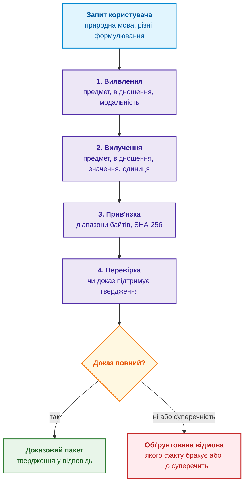
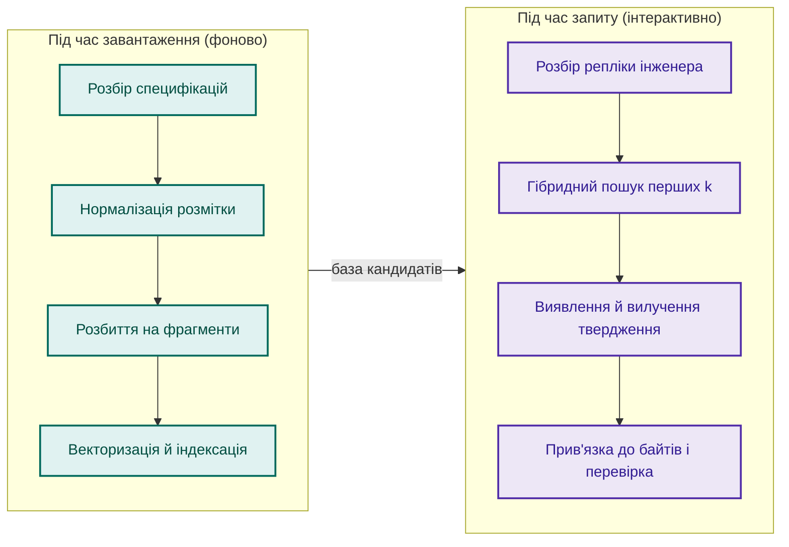
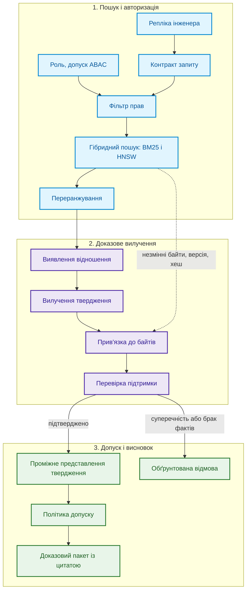
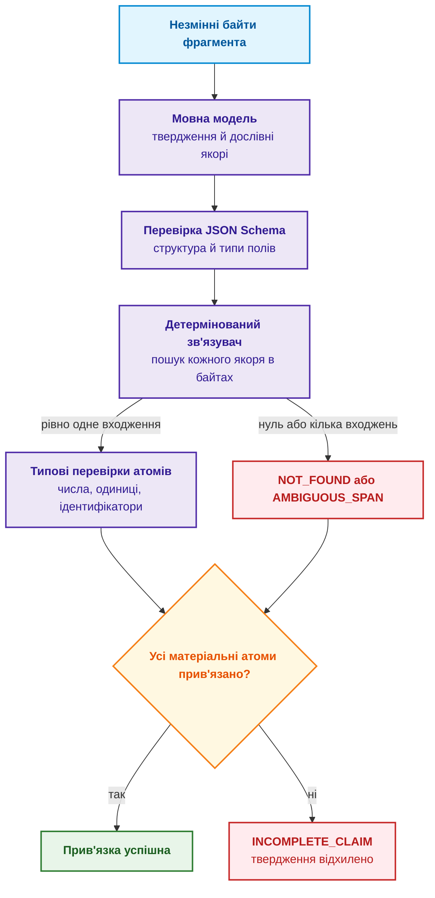
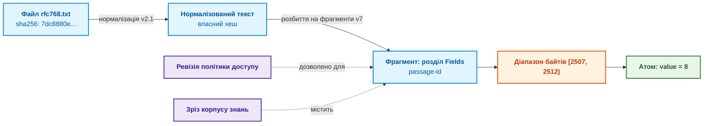
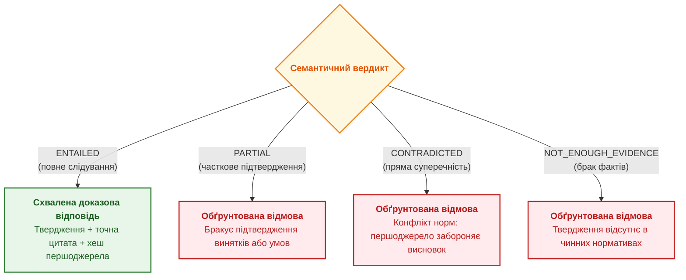
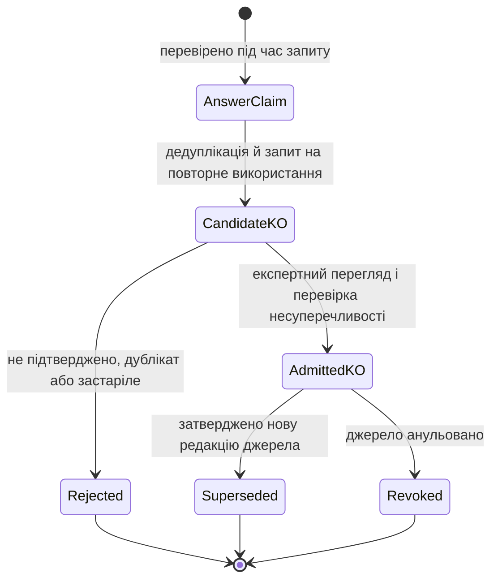

# Глава 19. Від запитання до доказу: пошук, прив'язка та перевірка твердження

> **Книга:** [Архітектура доказових експертних систем](README.md) · [Частина IV: Архітектура, виведення, пояснення та дія](part-04-architecture-and-inference.md)  
> **Попередня глава:** [Глава 16. Архітектура експертної системи: від формального знання до доказового рішення](ch16-expert-systems-architecture.md)  
> **Наступна глава:** [Глава 31. Виведення за нормами: ієрархії предикатів, винятки та чинність](ch31-syllogistic-reasoning-and-relation-lattices.md)  
> **Зміст книги:** [README.md](README.md)  
> **Автор:** [Микола Федчик](about-the-author.md)  
> **Рівень:** середній і поглиблений: розробники, інженери знань, фахівці з мовних моделей  
> **Очікувані результати:** розкладати запитання природною мовою на предмет, відношення й комунікативну дію; розрізняти етапи виявлення, вилучення, прив'язки й перевірки твердження; прив'язувати кожен матеріальний атом твердження до байтів першоджерела й обчислювати повноту прив'язки; нормалізувати значення й одиниці вимірювання; будувати проміжне представлення твердження з доказом; організовувати регресійне тестування й безпечний допуск тверджень до бази знань.

Уявімо експертну систему, яка аналізує мережеві специфікації й відповідає інженерові лише тоді, коли в корпусі є доказ. Інженер запитує: *«Яка мінімальна довжина UDP-датаграми?»* Механізм пошуку, побудований за схемою пошуку з генерацією (*Retrieval-Augmented Generation*, RAG) [[1]](#src-1), безпомилково знаходить RFC 768, специфікацію протоколу UDP (*User Datagram Protocol*), і потрібний абзац [[2]](#src-2):

> *Length is the length in octets of this user datagram including this header and the data. (This means the minimum value of the length is eight.)*

Генеративна модель відповідає коротко: *«8»*. Число правильне, але інженерна відповідь неповна. Вісім чого: бітів, октетів, 32-розрядних слів? У тексті число записано словом *eight*, а одиниця *octets* стоїть в іншій частині речення, тож пошук цифр регулярним виразом тут не знайшов би нічого. До того ж інженер міг поставити те саме запитання по-різному:

- *«Яка мінімальна довжина UDP-датаграми?»* (пряме запитання);
- *«Скільки щонайменше займає UDP-датаграма?»* (прохання про розрахунок);
- *«Покажи в RFC, де визначено мінімальну довжину датаграми»* (запит на доказ);
- *«Чи правильно, що мінімальна UDP-датаграма має 8 октетів?»* (запит на перевірку твердження).

Ці репліки різняться граматикою й комунікативною дією, але спираються на одне інженерне твердження. Набір даних Natural Questions формалізував схожу різницю між довгою відповіддю (абзацом, що містить відповідь) і короткою відповіддю (точним фрагментом усередині абзацу) [[3]](#src-3). Для експертної системи навіть коротка відповідь недостатня: потрібне твердження з предметом, відношенням, значенням, одиницею й доказом для кожної складової.

Ця глава відповідає на запитання: **як перетворити знайдений фрагмент на перевірюване твердження для відповіді?** Мовна модель пропонує структуру й якорі, зв'язувач відтворює адреси, а окрема перевірка встановлює ролі, застосовність і відповідність запитанню. Повна прив'язка є необхідною умовою джерельної перевірки, не достатньою умовою правильного тлумачення. Непідтверджені поля ведуть до уточнення або відмови, а не до домислювання.



Діаграма показує, що відповідь можлива лише після всіх чотирьох етапів, а будь-який збій веде до відмови з поясненням. Наступний розділ уточнює, де саме в архітектурі експертної системи працює цей процес.

## Місце задачі в архітектурі

[Глава 10](ch10-knowledge-acquisition-systems.md) описала підготовку знань: інвентаризацію корпусів, сортування документів, розбір розмітки й класифікацію доступу. [Глава 7](ch07-knowledge-base-typology.md) розмежувала пошукового кандидата й логічний факт. Ця глава розглядає короткий відрізок шляху читання з [Глави 16](ch16-expert-systems-architecture.md): документ уже авторизовано, версіоновано й розбито на фрагменти, механізм пошуку повернув перші $k$ кандидатів, і тепер текст фрагмента треба перетворити на формальне твердження.

На цьому короткому відрізку правильність результату розпадається на шість незалежних критеріїв. Таблиця показує для кожного етапу контрольне запитання й типовий прихований дефект.

| Етап | Контрольне запитання | Типовий прихований дефект |
|---|---|---|
| **Пошук** (*retrieval*) | Чи потрапив потрібний фрагмент у перші $k$ результатів? | Знайдено правильний документ, але застарілу редакцію |
| **Виявлення** (*detection*) | Чи містить фрагмент саме те відношення, про яке питають? | Речення про довжину датаграми прийнято за відповідь про довжину заголовка |
| **Вилучення** (*extraction*) | Чи збережено повну структуру значення? | `eight octets` скорочено до числа `8` |
| **Прив'язка** (*grounding*) | Чи має кожен атом точні координати в документі? | Цитата правильна, але взята з нечинної редакції |
| **Перевірка** (*verification*) | Чи підтримує доказ твердження повністю? | Не помічено винятку на кшталт «крім випадків протоколу X» |
| **Допуск** (*admission*) | Чи має користувач право отримати цей фрагмент? | Модель використала закритий документ у відповіді на відкритий запит |

Кожен рядок таблиці описує окремий клас помилок, і кожен потребує окремої перевірки. Перша з цих перевірок починається ще до пошуку: з розбору самого запитання.

## Чому людське запитання слабо формалізоване

Запит до реляційної СУБД підпорядковується граматиці SQL, а виклик програмного інтерфейсу вимагає типізованих параметрів. Людська мова такого контракту не має. Інженер може пропустити предмет (*«А яка її мінімальна довжина?»*), спираючись на контекст діалогу, вжити синонім (*«розмір»* замість *«довжина»*) або змішати вимогу до змісту з вимогою до форми (*«Стисло поясни й наведи точний пункт»*).

Тому експертна система розкладає репліку на три незалежні складові:

1. **Предмет запиту** (*subject*): технічний об'єкт чи підсистема, наприклад UDP-датаграма.
2. **Відношення** (*relation*): властивість чи характеристика, наприклад мінімальна довжина.
3. **Комунікативна дія** (*speech act*): намір того, хто питає, тобто пряма відповідь, наведення доказу, перевірка гіпотези чи її спростування. Поняття мовленнєвого акту як дії, що виконується висловлюванням, систематизував Джон Серл [[4]](#src-4).

Замість нескінченних крихких регулярних виразів сучасна архітектура використовує мовну модель як семантичний аналізатор, що заповнює типізований контракт запиту. Схему контракту фіксують мовою JSON Schema [[5]](#src-5), і відповідь моделі, яка не відповідає схемі, відхиляється ще до пошуку. Для прикладу з UDP контракт виглядає так:

<details>
<summary>Структуровані дані JSON</summary>

```json
{
  "schema_version": "query-contract.v1",
  "subject": "UDP datagram",
  "relation": "minimum length",
  "speech_act": "request_evidence",
  "answer_shape": "quantity",
  "constraints": {
    "document_family": "IETF RFC",
    "status": "current"
  },
  "dialogue_context_refs": []
}
```

</details>


Поле `answer_shape` зі значенням `quantity` заздалегідь повідомляє наступним етапам, що відповідь мусить містити число з одиницею, а `speech_act` зі значенням `request_evidence` вимагає показати цитату. Контракт запиту задає, що шукати; наступне запитання полягає в тому, коли саме експертна система добуває знання з документів.

## Два часові шляхи здобуття знань

Здобуття знань відбувається у двох часових режимах, показаних на діаграмі.



Фонове здобуття (*ingest-time acquisition*) виконується, коли до репозиторію додають нові документи: воно зберігає структуру й версії, розпізнає таблиці, обчислює контрольні суми фрагментів. Цей процес детально описано в [Главі 15](ch15-knowledge-extraction-and-kb-construction.md). Здобуття під час запиту (*query-time acquisition*) вмикається у відповідь на конкретне запитання. Причина двох режимів проста: той самий абзац специфікації може відповідати на десятки різних запитань (довжина поля, діапазон напруг, допустима похибка), і заздалегідь вилучити всі можливі твердження неможливо. Під час запиту експертна система вилучає й перевіряє лише те твердження, якого вимагає контракт запиту.

## Конвеєр перетворення запиту

Повний цикл від репліки до доказового пакета поєднує пошук із символьною перевіркою. Діаграма показує три послідовні етапи: пошук з авторизацією, доказове вилучення і допуск з висновком.



Пунктирна стрілка від пошуку до прив'язки важлива: прив'язка працює з незмінними байтами, версією й хешем документа, які надає пошук, а не з текстом, який повернула мовна модель. Саме тому прив'язка може виявити вигадку моделі, і наступний розділ показує, як це відбувається.

## Вилучення та детерміноване зв'язування з байтами

Головна небезпека генеративних моделей полягає в довільному перефразуванні й утраті розмірностей. Щоб цього уникнути, експертна система розділяє ролі. Мовна модель пропонує твердження і для кожної його складової дослівний якір, тобто фрагмент тексту, на який ця складова спирається. Детермінований зв'язувач (*deterministic span binder*) шукає кожен якір у байтах документа й перевіряє тип кожної складової.



### Повнота прив'язки

Твердження приймається лише тоді, коли всі його матеріальні атоми (предмет, відношення, значення, одиниця, обмеження) однозначно прив'язано до тексту. Повноту прив'язки рахують так:

```math
\mathrm{Comp}(C) = \frac{\sum_{a \in A_m(C)} w_a \cdot \mathbb{I}[b(a) \neq \varnothing]}{\sum_{a \in A_m(C)} w_a}.
```

- Для твердження $C$ множина $A_m(C)$ містить його матеріальні атоми, наприклад предмет, відношення, значення, одиницю та обмеження;
- $a$ позначає один атом, а $w_a>0$ є його додатною вагою;
- $b(a)$ є байтовим діапазоном, до якого однозначно прив'язано атом, а $\varnothing$ означає, що такого діапазону немає;
- індикатор $\mathbb{I}[b(a)\neq\varnothing]$ дорівнює 1 за наявності прив'язки й 0 без неї;
- $\sum$ підсумовує ваги всіх атомів, а $\mathrm{Comp}(C)$ є відношенням покритої ваги до загальної.

За додатної сумарної ваги показник лежить від 0 до 1; значення 1 означає, що всі атоми прив'язано. За вагами з прикладу нижче, якщо предмет, відношення й значення прив'язані, а одиниця ні, повнота дорівнює $0{,}1+0{,}2+0{,}4=0{,}7$. Ваги не змінюють правила прийняття, бо твердження з $\mathrm{Comp}(C)<1$ відхиляється; вони допомагають побачити, якого важливого атома бракує.

> [!IMPORTANT] Чому в критичній інженерії допустима лише 100% прив'язка ($\mathrm{Comp}(C) = 1{,}0$)
> У споживчих чат-ботах відповідь із «частковою точністю» 70% вважається задовільною. В авіоніці (DO-178C) або автомобільних контролерах (ISO 26262) твердження із $\mathrm{Comp}(C) = 0{,}7$ — це пряма передумова аварії. Якщо система вилучила твердження «мінімальна затримка сигналу — 8», але не прив'язала атом розмірності (`мс` vs `мкс`) або втратила обмежувальне застереження («за температури вище 85°C»), це не неточність, а хибний факт, здатний зруйнувати апаратний контур. Тому шлюз допуску експертної системи працює в режимі жорсткого відсікання: будь-яке $\mathrm{Comp}(C) < 1{,}0$ спричиняє відмову з точним зазначенням неприв'язаного атома.

### Приклад: прив'язка твердження з RFC 768

Програма мовою Go реалізує зв'язувач для прикладу з UDP. Їй потрібен файл `rfc768.txt` (5896 байтів), завантажений з RFC Editor у той самий каталог. Функція `normalize` така сама, як у [Главі 15](ch15-knowledge-extraction-and-kb-construction.md): вона стискає пробільні символи й пам'ятає позиції сирих байтів, тому якір знаходиться навіть тоді, коли в тексті RFC між словами стоїть кілька пробілів чи перенесення рядка. Ваги атомів обрано так: предмет 0,1, відношення 0,2, значення 0,4, одиниця 0,3.

<details>
<summary>Приклад мовою Go: зв'язувач твердження з RFC 768</summary>

```go
package main

import (
	"bytes"
  "fmt"
  "math"
	"os"
	"strconv"
	"strings"
)

// normalize стискає пробільні символи й запам'ятовує позиції сирих байтів.
func normalize(raw []byte) ([]byte, []int) {
	var out []byte
	var pos []int
	inSpace := false
	for i, b := range raw {
		switch b {
		case ' ', '\t', '\r', '\n', '\f':
			if !inSpace && len(out) > 0 {
				out = append(out, ' ')
				pos = append(pos, i)
			}
			inSpace = true
			continue
		}
		inSpace = false
		out = append(out, b)
		pos = append(pos, i)
	}
	return out, pos
}

// bind прив'язує якір до діапазону сирих байтів; якір має траплятися рівно один раз.
func bind(norm []byte, pos []int, anchor string) (int, int, string) {
	q, _ := normalize([]byte(anchor))
	q = bytes.TrimSpace(q)
	first := bytes.Index(norm, q)
	switch {
	case len(q) == 0 || first < 0:
		return 0, 0, "NOT_FOUND"
	case bytes.Contains(norm[first+1:], q):
		return 0, 0, "AMBIGUOUS_SPAN"
	}
	return pos[first], pos[first+len(q)-1] + 1, "OK"
}

type Atom struct {
	Name, Anchor string
	Weight       float64
}

var numberWords = map[string]int{"four": 4, "eight": 8, "sixteen": 16}
var unitCodes = map[string]string{"octets": "By", "bits": "bit"} // коди UCUM

// typed перевіряє тип атома: значення має бути числом, одиниця має бути відомою.
func typed(a Atom) (string, bool) {
	w := strings.Fields(strings.ToLower(a.Anchor))
  if len(w) == 0 {
    return "", false
  }
	last := w[len(w)-1]
	switch a.Name {
	case "value":
		if n, ok := numberWords[last]; ok {
			return strconv.Itoa(n), true
		}
		_, err := strconv.Atoi(last)
		return last, err == nil
	case "unit":
		c, ok := unitCodes[last]
		return c, ok
	}
  return a.Anchor, a.Name == "subject" || a.Name == "relation"
}

func check(norm []byte, pos []int, name string, atoms []Atom) string {
	fmt.Println("==", name)
  required := map[string]bool{"subject": false, "relation": false, "value": false, "unit": false}
  var weightSum float64
  for _, atom := range atoms {
    seen, known := required[atom.Name]
    if !known || seen || atom.Weight <= 0 || math.IsNaN(atom.Weight) || math.IsInf(atom.Weight, 0) {
      fmt.Println("  INVALID_CLAIM_SCHEMA")
      return "INCOMPLETE_CLAIM"
    }
    required[atom.Name] = true
    weightSum += atom.Weight
  }
  if len(atoms) != len(required) || math.IsInf(weightSum, 0) || len(pos) != len(norm) {
    fmt.Println("  INVALID_CLAIM_SCHEMA")
    return "INCOMPLETE_CLAIM"
  }
	var got, total float64
  allBound := true
	for _, a := range atoms {
		total += a.Weight
		s, e, st := bind(norm, pos, a.Anchor)
		v, ok := typed(a)
		if st == "OK" && !ok {
			st = "TYPE_ERROR"
		}
		if st == "OK" {
			got += a.Weight
			fmt.Printf("  %-8s %-34q [%d, %d) -> %s\n", a.Name, a.Anchor, s, e, v)
		} else {
      allBound = false
			fmt.Printf("  %-8s %-34q %s\n", a.Name, a.Anchor, st)
		}
	}
	comp := got / total
	verdict := "GROUNDED"
  if !allBound {
		verdict = "INCOMPLETE_CLAIM"
	}
	fmt.Printf("  Comp = %.2f -> %s\n", comp, verdict)
  return verdict
}

func main() {
	raw, err := os.ReadFile("rfc768.txt")
	if err != nil {
		fmt.Println("помилка читання:", err)
		os.Exit(1)
	}
	norm, pos := normalize(raw)
	subj := Atom{"subject", "this user datagram", 0.1}
	rel := Atom{"relation", "the minimum value of the length", 0.2}
	val := Atom{"value", "eight", 0.4}
	unit := Atom{"unit", "in octets", 0.3}

	check(norm, pos, "A: повне твердження", []Atom{subj, rel, val, unit})
	check(norm, pos, "B: вигадана одиниця", []Atom{subj, rel, val, {"unit", "in bits", 0.3}})
	check(norm, pos, "C: надто короткий якір", []Atom{subj, {"relation", "length", 0.2}, val, unit})
}
```

Синтетичний тест не потребує RFC-файла; команда виконання: `go test -v main.go main_test.go`.

```go
package main

import (
	"math"
	"testing"
)

func TestGroundingCompleteness(testCase *testing.T) {
	norm, positions := normalize([]byte("The datagram minimum is eight octets."))
	valid := []Atom{{"subject", "datagram", 0.1}, {"relation", "minimum", 0.2},
		{"value", "eight", 0.4}, {"unit", "octets", 0.3}}
	if check(norm, positions, "valid", valid) != "GROUNDED" {
		testCase.Fatal("valid anchors rejected")
	}
	if check(norm, positions, "empty", nil) == "GROUNDED" {
		testCase.Fatal("empty claim accepted")
	}
	if check(norm, positions, "missing unit", valid[:3]) == "GROUNDED" {
		testCase.Fatal("missing required field accepted")
	}
	for _, weight := range []float64{0, -1, math.NaN(), math.Inf(1)} {
		invalid := append([]Atom(nil), valid...)
		invalid[0].Weight = weight
		if check(norm, positions, "invalid weight", invalid) == "GROUNDED" {
			testCase.Fatal("invalid weight accepted")
		}
	}
	missing := append([]Atom(nil), valid...)
	missing[3].Anchor = ""
	if check(norm, positions, "empty anchor", missing) == "GROUNDED" {
		testCase.Fatal("empty anchor accepted")
	}
	duplicate := append([]Atom(nil), valid...)
	duplicate[3] = duplicate[0]
	if check(norm, positions, "duplicate field", duplicate) == "GROUNDED" {
		testCase.Fatal("duplicate field accepted")
	}
	if _, ok := typed(Atom{Name: "unit", Anchor: ""}); ok {
		testCase.Fatal("empty typed anchor accepted")
	}
}
```

</details>

Архівний приклад виводу для зазначеної копії RFC; інші байти або перенесення рядків змінять координати:

<details>
<summary>Дані або результат прикладу</summary>

```text
== A: повне твердження
  subject  "this user datagram"               [2398, 2416) -> this user datagram
  relation "the minimum value of the length"  [2472, 2503) -> the minimum value of the length
  value    "eight"                            [2507, 2512) -> 8
  unit     "in octets"                        [2384, 2393) -> By
  Comp = 1.00 -> GROUNDED
== B: вигадана одиниця
  subject  "this user datagram"               [2398, 2416) -> this user datagram
  relation "the minimum value of the length"  [2472, 2503) -> the minimum value of the length
  value    "eight"                            [2507, 2512) -> 8
  unit     "in bits"                          NOT_FOUND
  Comp = 0.70 -> INCOMPLETE_CLAIM
== C: надто короткий якір
  subject  "this user datagram"               [2398, 2416) -> this user datagram
  relation "length"                           AMBIGUOUS_SPAN
  value    "eight"                            [2507, 2512) -> 8
  unit     "in octets"                        [2384, 2393) -> By
  Comp = 0.80 -> INCOMPLETE_CLAIM
```

</details>


Твердження A прив'язано повністю: значення *eight* нормалізовано до числа 8, одиницю *octets* до коду `By`, і кожен атом має власний діапазон байтів. Твердження B відтворює типову помилку генерації: модель «знала», що довжину часто вимірюють у бітах, але таких слів у документі немає, тому одиниця не прив'язана, повнота дорівнює 0,70, і твердження відхилено. Твердження C показує протилежну помилку: якір *length* дослівно присутній, але трапляється в документі чотири рази, і зв'язувач не може вибрати, яке входження є доказом. Обидва відхилення детерміновані й не залежать від того, наскільки впевнено звучала відповідь моделі.

Межі прикладу такі. Словник числівників і одиниць тут мінімальний; промисловий зв'язувач використовує повні таблиці числівників і довідник одиниць. Програма шукає якорі в усьому документі; реальний зв'язувач шукає їх у межах знайденого фрагмента, що зменшує кількість неоднозначностей. Нарешті, прив'язка доводить, що всі атоми дослівно присутні, але ще не доводить, що текст підтримує саме те твердження, про яке питали. Це завдання етапу перевірки, описаного нижче.

## Типізовані атоми знань

Зв'язувач перевіряє не лише наявність якоря, а й тип атома. Експертна система розрізняє чотири типи:

- **Кількісний атом**: число обов'язково пов'язане з одиницею вимірювання. Одиниці нормалізують за міжнародною системою SI або за уніфікованим кодом одиниць вимірювання UCUM (*Unified Code for Units of Measure*) [[6]](#src-6), у якому, наприклад, байт має код `By`. Число без одиниці відхиляється вже на рівні схеми.
- **Ідентифікатор**: складене позначення документа чи об'єкта (RFC 768, ISO 26262, MIL-STD-1553B), яке перевіряють шаблоном формату.
- **Модальність**: ступінь нормативності (MUST, SHALL, SHOULD, MAY) за правилами з [Глави 14](ch14-requirements-detection-and-formalization.md). Речення з RFC 768 не містить жодного з цих слів: RFC 768 опубліковано 1980 року, задовго до конвенції RFC 2119. Тому модальність такого твердження фіксують як визначальну, а не нормативну.
- **Межі чинності**: редакція документа, діапазон температур, режим роботи, у яких твердження діє.

Типи атомів дають змогу перевіряти твердження машинно: дві відповіді «8 октетів» і «64 біти» після нормалізації одиниць стають порівнянними, а «8» без одиниці взагалі не проходить перевірки схеми.

## Походження: від файлу до атома

Посилання на джерело в доказовій експертній системі не обмежується назвою файлу. Воно є ланцюжком перетворень, кожне з яких має власний хеш. Діаграма показує цей ланцюжок у термінах моделі походження PROV-O [[7]](#src-7) для атома-значення з прикладу.



Ідентифікатор фрагмента обчислюють хеш-функцією $H$ від усіх параметрів, що впливають на його вміст:

```math
\text{passage-id} = H(\text{document-id} \,\|\, \text{revision} \,\|\, \text{transform-chain} \,\|\, \text{byte-start} \,\|\, \text{byte-end} \,\|\, \text{bytes}).
```

- Для ідентифікатора $H$ є детермінованою криптографічною хеш-функцією, а її аргументи задають повний набір параметрів, від яких залежить вміст фрагмента;
- $\text{document-id}$ ідентифікує документ, $\text{revision}$ його редакцію, а $\text{transform-chain}$ ланцюг перетворень тексту;
- $\text{byte-start}$ і $\text{byte-end}$ є початковим і кінцевим зсувами, а $\text{bytes}$ є вмістом вибраного діапазону;
- $`\|`$ означає однозначне канонічне кодування полів із довжинами або структурною схемою, а $\text{passage-id}$ є хешем отриманих байтів; проста конкатенація без меж може ототожнити різні набори полів.

Якщо змінюється будь-яке поле, змінюється вхід хеш-функції, і стійка криптографічна функція практично завжди дає інший ідентифікатор; теоретична колізія все ж можлива. Старе посилання тому або веде до тих самих байтів і перетворень, або перевірка виявляє невідповідність.

## Проміжне представлення твердження з доказом

Контрактом між мовною моделлю й детермінованою частиною експертної системи є проміжне представлення твердження з доказом (*evidence claim intermediate representation*). Для твердження A воно виглядає так (діапазони байтів напіввідкриті: кінець не входить до діапазону):

<details>
<summary>Структуровані дані JSON</summary>

```json
{
  "claim_id": "claim:rfc768:udp-min-length",
  "contract_ref": "query-contract.v1#q-120",
  "statement": {
    "subject": "UDP datagram",
    "relation": "minimum_length",
    "modality": "DEFINITIONAL",
    "value": 8,
    "unit": "By"
  },
  "provenance": {
    "document_urn": "urn:ietf:rfc:768",
    "document_sha256_prefix": "7dc8880e1ecef9c3",
    "atoms": {
      "subject":  {"bytes": [2398, 2416], "quote": "this user datagram"},
      "relation": {"bytes": [2472, 2503], "quote": "the minimum value of the length"},
      "value":    {"bytes": [2507, 2512], "quote": "eight"},
      "unit":     {"bytes": [2384, 2393], "quote": "in octets"}
    }
  },
  "grounding_status": "ALL_ATOMS_BOUND",
  "verification": {
    "verdict": "NOT_ENOUGH_EVIDENCE",
    "method": "grounding_only",
    "semantic_review": "required",
    "unsupported_atoms": []
  }
}
```

</details>


Зразок відокремлює повну прив'язку від невиконаної семантичної перевірки. Порожній список непідтверджених якорів не означає `ENTAILED`: код зв'язувача не перевірив ролей і висновку. Префікс хеша наведено для читання; машинний комплект потребує повного SHA-256 та незмінного артефакту. Після предметної рецензії або перевірки підтримуваною формальною моделлю вердикт записують разом із методом і версією перевірювача. Статистичну впевненість зберігають окремо, не підмінюють нею статус перевірки.

## Перевірка: чи доказ справді підтримує твердження

Прив'язка показала, що всі атоми дослівно присутні в тексті. Перевірка відповідає на інше запитання: чи випливає твердження з тексту. У мовознавчій обробці таку задачу називають розпізнаванням текстового слідування (*recognizing textual entailment*): текст $T$ підтримує гіпотезу $H$, якщо людина, прочитавши $T$, зробила б висновок, що $H$ найімовірніше істинна [[8]](#src-8). Для експертної системи цього визначення замало, бо «найімовірніше» не є доказом, тому перевірку поєднують з детермінованими правилами: значення й одиниця твердження мають збігатися з прив'язаними атомами, модальність має відповідати модальному слову цитати, а речення не повинно містити винятків, яких твердження не враховує.

Приклад з UDP показує, навіщо потрібен окремий етап. Припустімо, інженер запитав не про датаграму, а про *заголовок*: «Яка довжина заголовка UDP?» Речення з RFC 768 прив'язується так само успішно, але відношення в ньому інше: йдеться про мінімальну довжину всієї датаграми, яка включає заголовок і дані. Етап виявлення має помітити цю розбіжність, а відповідь треба вивести з іншого доказу. Схема формату заголовка в RFC 768 показує чотири поля по 16 бітів (порт джерела, порт призначення, довжина, контрольна сума), тобто 64 біти, або 8 октетів. Відповідь «заголовок має 8 октетів» є тоді ланцюжком із двох кроків: факт про чотири 16-бітові поля і арифметичне правило, яке виконує механізм виведення, а не мовна модель. Речення про мінімальну довжину датаграми слугує незалежним підтвердженням: датаграма без даних складається лише із заголовка. Саме так запитання перетворюється на ланцюг фактів, про який ідеться в назві глави.

Вердикт перевірки має одне з чотирьох значень: твердження випливає з доказу (`ENTAILED`), доказ підтримує лише частину твердження (`PARTIAL`), доказ суперечить твердженню (`CONTRADICTED`) або доказу недостатньо (`NOT_ENOUGH_EVIDENCE`). Лише перше значення дає відповідь; решта дають обґрунтовану відмову, текст якої формує рушій пояснень із [Глави 20](ch20-explanation-engine.md).



## Повнота пошуку, безпечна відмова й рецензія

Якщо серед перших $k$ фрагментів немає доказу, експертна система знає лише, що поточний маршрут доказу не знайшов. Це не доводить, що норми немає в корпусі. Відмова має називати область пошуку, покоління індексу й невиконані перевірки; за дозволеної політики можна розширити лексичний пошук або звернутися до структурованих фактів, а не підвищувати впевненість генератора.

Та сама межа діє, коли корпус розбито на шарди. Якщо потрібний шард не відповів або відповів із покоління, відмінного від закріпленого, відмова називає цей шард, а результат пошуку позначають як неповний. Права доступу застосовують у кожному шарді до складання кандидатів. Доказ, знайдений у шарді, що відповів, не доводить чинності норми, поки не відповів шард, що може містити заміщувальну редакцію ([Глава 7](ch07-knowledge-base-typology.md), розділ 10 [Глави 32](ch32-high-performance-knowledge-packs-mmap-and-harvesting.md)).

Під час запиту нове тлумачення документа зберігається як кандидат, якщо ще не має схваленого предметного правила чи рецензії. Його можна показати як кандидат для аналізу, але не видавати за чинний нормативний висновок. Цей режим не суперечить незмінному шляху читання з [Глави 16](ch16-expert-systems-architecture.md): відповідь із прийнятих фактів і дослідницька екстракція мають різні статуси.

Схема матеріальних полів визначається видом задачі, не самою моделлю. Наявність чотирьох атомів у цьому прикладі не покриває часових умов, винятків чи кількох дій іншої вимоги. Для PDF діапазон адресує похідний текст і зв'язується з оригінальною сторінкою. Перевірка текстового слідування є статистичним сигналом, якщо її виконує навчена модель; високий бал не замінює рецензії або доведення за формальною моделлю.

Пошук, прив'язку до цитати, семантичну перевірку й пояснення вимірюють окремими метриками. Відмови, конфлікти й частково підтримані результати оцінюють окремо від правильних відповідей; інакше модель, яка завжди відмовляє, може здаватися безпомилковою.

## Регресійне тестування конвеєра

Конвеєр здобуття знань змінюється: оновлюють модель, промпти, правила нормалізації. Кожну зміну перевіряють порівнянням базової й кандидатської версій на еталонному наборі запитань, як показано на діаграмі.

```mermaid
flowchart LR
    accTitle: Регресійне оцінювання конвеєра здобуття знань
    accDescr: Базову й кандидатську версії запускають на тих самих зрізах еталонного набору, порівнюють парно, перевіряють статистично й допускають до тіньового розгортання з можливістю відкату.

    M["<b>Еталонний набір</b>"] --> SPLIT["Розподіл на критичні зрізи"]
    SPLIT --> B["Прогін базової версії"]
    SPLIT --> C["Прогін кандидатської версії"]
    B --> PAIR["Парне зіставлення трас"]
    C --> PAIR
    PAIR --> SL["Метрики за зрізами: одиниці, ідентифікатори, доступ"]
    SL --> STAT["Статистична перевірка: тест Мак-Немара, бутстреп"]
    STAT --> GATE{"<b>Шлюз випуску</b><br/>регресії на критичних зрізах?"}
    GATE -->|немає| SHADOW["Тіньове або поступове розгортання"]
    GATE -->|є| DIAG["Діагностика першого дефектного етапу"]
    SHADOW --> MON["Моніторинг відхилень"]
    MON -->|аномалія| ROLL["Відкат"]

    classDef src fill:#e1f5fe,stroke:#0288d1,stroke-width:2px,color:#01579b;
    classDef run fill:#ede7f6,stroke:#512da8,stroke-width:2px,color:#311b92;
    classDef gate fill:#fff8e1,stroke:#f57f17,stroke-width:2px,color:#e65100;
    classDef err fill:#ffebee,stroke:#c62828,stroke-width:2px,color:#b71c1c;

    class M,SPLIT src;
    class B,C,PAIR,SL,STAT,SHADOW,MON run;
    class GATE gate;
    class DIAG,ROLL err;
```



Якість оцінюють не середнім показником по всьому набору, а за критичними зрізами (*critical slices*): окремо для тверджень з одиницями вимірювання, з ідентифікаторами документів, із запитами, що зачіпають обмеження доступу. Середня точність 98 % може приховати зріз «одиниці вимірювання», де кандидатська версія втратила половину відповідей, бо цей зріз становить малу частку набору.

Версії порівнюють парно; тест Мак-Немара враховує випадки розбіжності двох класифікаторів [[9]](#src-9), а бутстреп оцінює невизначеність метрик [[10]](#src-10). Перефразування й редакції не є незалежними одиницями: повторну вибірку роблять групами документів або намірів. Відсутність статистично значущої різниці не доводить еквівалентності; потрібна наперед визначена межа допустимої регресії. Для критичних контрольних випадків будь-яка знайдена помилка може блокувати випуск, але нуль спостережуваних помилок не доводить нульового ризику поза набором.

## Життєвий цикл об'єктів знань: від відповіді до бази

Твердження, перевірене під час відповіді на запит, автоматично не стає постійним фактом бази знань. Щоб стати довготривалим знанням, воно проходить процедуру просування (*promotion*), показану на діаграмі станів.



Твердження з відповіді (`AnswerClaim`) стає кандидатом (`CandidateKO`) лише тоді, коли його хочуть використати повторно, і допускається до бази знань (`AdmittedKO`) лише після перегляду експертом і перевірки на несуперечливість. Допущений об'єкт знань не видаляють, а переводять у стан `Superseded` чи `Revoked`, зберігаючи історію.

Ця процедура захищає базу знань від самопідсилювальної петлі помилок: випадкова помилка генеративної моделі, записана в сховище, згодом поверталася б як «авторитетне джерело» для нових висновків. Схожий ефект описано для навчання моделей: Шумайлов та співавтори показали, що моделі, навчені на даних, згенерованих попередніми моделями, поступово деградують і втрачають рідкісні частини розподілу [[11]](#src-11). База знань без процедури просування ризикує аналогічною деградацією, тільки в масштабі фактів, а не ваг. Для запобігання генеративним помилкам архітектура спирається на принцип явного семантичного ретрівера, подібний до підходу REALM Гуу та співавторів [[12]](#src-12): генеративний модуль не вигадує знання з параметричної пам'яті ваг, а навчається виключно видобувати й інтерпретувати докази з наданого корпусу першоджерел, зберігаючи повну простежуваність висновку до конкретного текстового пасажу.

## Висновки
Знайденого фрагмента тексту недостатньо для відповіді. Між пошуком і відповіддю працюють чотири етапи: виявлення відношення, вилучення твердження, прив'язка кожного атома до байтів першоджерела й перевірка того, що доказ підтримує твердження. Мовна модель пропонує твердження з дослівними якорями, а детермінований код вирішує, чи прийняти запропоноване твердження.

Глава показала це на реальному тексті RFC 768. Програма мовою Go прив'язала твердження про мінімальну довжину UDP-датаграми до чотирьох діапазонів байтів, нормалізувала число, записане словом *eight*, і одиницю *octets*, і відхилила два хибні варіанти: з вигаданою одиницею (повнота 0,70) і з неоднозначним якорем (повнота 0,80). Розбір запитання про довжину заголовка показав, що успішна прив'язка ще не означає правильної відповіді: відповідь треба вивести ланцюжком із факту про формат заголовка й арифметичного правила.

Межі підходу теж визначено. Прив'язка доводить присутність атомів у тексті, а не правильність тлумачення; перевірка слідування спирається на детерміновані правила, а модель текстового слідування дає лише сигнал. Мінімальні словники числівників і одиниць у прикладі треба замінити повними довідниками. Регресійне тестування за критичними зрізами й процедура просування захищають якість у часі, але потребують еталонних наборів і експертного перегляду. [Глава 20](ch20-explanation-engine.md) переходить від перевірки твердження до пояснення: як експертна система обґрунтовує рішення, відмову й межі своєї компетентності.

## Запитання до читачів
1. Чому відповідь «8» на запитання про мінімальну довжину UDP-датаграми неприйнятна для експертної системи, хоча число правильне?
2. На які три складові експертна система розкладає запитання і навіщо в контракті запиту поле `answer_shape`?
3. Чому зв'язувач відхилив якір *length* і що треба змінити, щоб прив'язка стала однозначною?
4. Що означає значення повноти 0,70 для твердження B і чому ваги атомів не впливають на рішення про прийняття?
5. Чому речення з RFC 768 про мінімальну довжину датаграми не є прямою відповіддю на запитання про довжину заголовка і як вивести правильну відповідь?
6. Чому якість конвеєра оцінюють за критичними зрізами, а не середньою точністю, і навіщо парне порівняння версій?
7. Яку загрозу для бази знань усуває процедура просування твердження від відповіді до об'єкта знань?

## Словник
| Український термін | Англійський відповідник | Коротке пояснення |
|---|---|---|
| Контракт запиту | Query contract | Типізоване представлення запитання: предмет, відношення, комунікативна дія, форма відповіді |
| Комунікативна дія | Speech act | Намір, з яким людина ставить запитання: отримати відповідь, доказ чи перевірку |
| Виявлення знання | Knowledge detection | Встановлення, чи містить фрагмент потрібне відношення |
| Вилучення твердження | Claim extraction | Побудова структурованого твердження з тексту фрагмента |
| Прив'язка | Grounding | Зв'язок кожного атома твердження з діапазоном байтів першоджерела |
| Якір | Anchor | Дослівний фрагмент тексту, на який спирається атом твердження |
| Детермінований зв'язувач | Deterministic span binder | Програма, що шукає якорі в байтах документа й перевіряє їхню однозначність |
| Матеріальний атом | Material atom | Складова твердження, без якої твердження змінює зміст: предмет, відношення, значення, одиниця, обмеження |
| Повнота прив'язки | Grounding completeness | Зважена частка матеріальних атомів, однозначно прив'язаних до джерела |
| Текстове слідування | Textual entailment | Відношення, за якого гіпотеза випливає з тексту |
| Проміжне представлення твердження | Evidence claim IR | Структура, що містить твердження, атоми, їхні діапазони байтів і вердикти |
| Критичний зріз | Critical slice | Підмножина еталонного набору, на якій помилки найнебезпечніші |
| Просування | Promotion | Процедура перетворення твердження з відповіді на об'єкт бази знань |
| Здобуття під час запиту | Query-time acquisition | Вилучення й перевірка твердження у відповідь на конкретне запитання |
| Неповний результат пошуку | Partial result | Результат, зібраний без відповіді одного з потрібних шардів; не доводить і чинності норми, і її відсутності |

## Абревіатури
| Скорочення | Розшифрування | Значення |
|---|---|---|
| ABAC | Attribute-Based Access Control | керування доступом на основі атрибутів |
| BM25 | Best Matching 25 | функція лексичного ранжування |
| HNSW | Hierarchical Navigable Small World | графовий індекс для пошуку найближчих векторів |
| IR | Intermediate Representation | проміжне представлення |
| JSON | JavaScript Object Notation | текстовий формат обміну даними |
| KO | Knowledge Object | об'єкт знань |
| PROV-O | PROV Ontology | онтологія походження W3C |
| RAG | Retrieval-Augmented Generation | генерація з доповненням знайденими фрагментами |
| RFC | Request for Comments | серія документів зі специфікаціями інтернету |
| SHA-256 | Secure Hash Algorithm, 256 bits | криптографічна хеш-функція |
| SI | Système international d'unités | Міжнародна система одиниць |
| SQL | Structured Query Language | мова запитів до реляційних баз даних |
| UCUM | Unified Code for Units of Measure | уніфікований код одиниць вимірювання |
| UDP | User Datagram Protocol | протокол датаграм користувача |
| URN | Uniform Resource Name | однозначне ім'я ресурсу |
| СУБД | система управління базами даних | програмне забезпечення для зберігання даних і запитів до них |

## Джерела
1. <a id="src-1"></a>Patrick Lewis та ін. [*Retrieval-Augmented Generation for Knowledge-Intensive NLP Tasks*](https://arxiv.org/abs/2005.11401). *Advances in Neural Information Processing Systems 33 (NeurIPS 2020)*, 2020.
2. <a id="src-2"></a>J. Postel. [*RFC 768: User Datagram Protocol*](https://www.rfc-editor.org/rfc/rfc768). RFC Editor, 1980.
3. <a id="src-3"></a>Tom Kwiatkowski та ін. [*Natural Questions: A Benchmark for Question Answering Research*](https://doi.org/10.1162/tacl_a_00276). *Transactions of the Association for Computational Linguistics*, 7, 453–466, 2019.
4. <a id="src-4"></a>John R. Searle. [*Speech Acts: An Essay in the Philosophy of Language*](https://doi.org/10.1017/CBO9781139173438). Cambridge University Press, 1969.
5. <a id="src-5"></a>JSON Schema. [*JSON Schema Specification*](https://json-schema.org/specification).
6. <a id="src-6"></a>Regenstrief Institute. [*The Unified Code for Units of Measure (UCUM)*](https://ucum.org/ucum).
7. <a id="src-7"></a>Timothy Lebo, Satya Sahoo, Deborah McGuinness (ред.). [*PROV-O: The PROV Ontology*](https://www.w3.org/TR/prov-o/). W3C Recommendation, 2013.
8. <a id="src-8"></a>Ido Dagan, Oren Glickman, Bernardo Magnini. [*The PASCAL Recognising Textual Entailment Challenge*](https://doi.org/10.1007/11736790_9). *Machine Learning Challenges*, LNCS 3944, 177–190, 2006.
9. <a id="src-9"></a>Thomas G. Dietterich. [*Approximate Statistical Tests for Comparing Supervised Classification Learning Algorithms*](https://doi.org/10.1162/089976698300017197). *Neural Computation*, 10(7), 1895–1923, 1998.
10. <a id="src-10"></a>B. Efron. [*Bootstrap Methods: Another Look at the Jackknife*](https://doi.org/10.1214/aos/1176344552). *The Annals of Statistics*, 7(1), 1–26, 1979.
11. <a id="src-11"></a>Ilia Shumailov, Zakhar Shumaylov, Yiren Zhao, Nicolas Papernot, Ross Anderson, Yarin Gal. [*AI Models Collapse When Trained on Recursively Generated Data*](https://doi.org/10.1038/s41586-024-07566-y). *Nature*, 631, 755–759, 2024.
12. <a id="src-12"></a>Kelvin Guu, Kenton Lee, Zora Tung, Panupong Pasupat, Ming-Wei Chang. [*REALM: Retrieval-Augmented Language Model Pre-Training*](https://research.google/pubs/realm-retrieval-augmented-language-model-pre-training/). *Proceedings of the 37th International Conference on Machine Learning (ICML 2020)*, PMLR 119, 3929–3938, 2020.

---

[← Глава 16](ch16-expert-systems-architecture.md) | [Зміст книги](README.md) | [Частина IV](part-04-architecture-and-inference.md) | [Глава 31 →](ch31-syllogistic-reasoning-and-relation-lattices.md)
