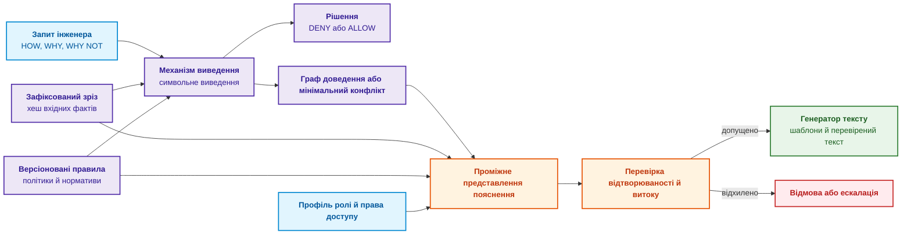
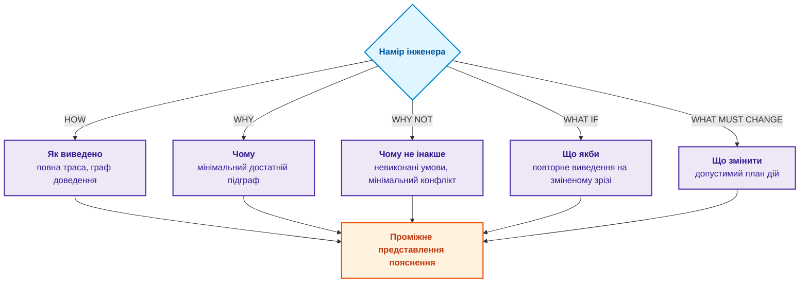
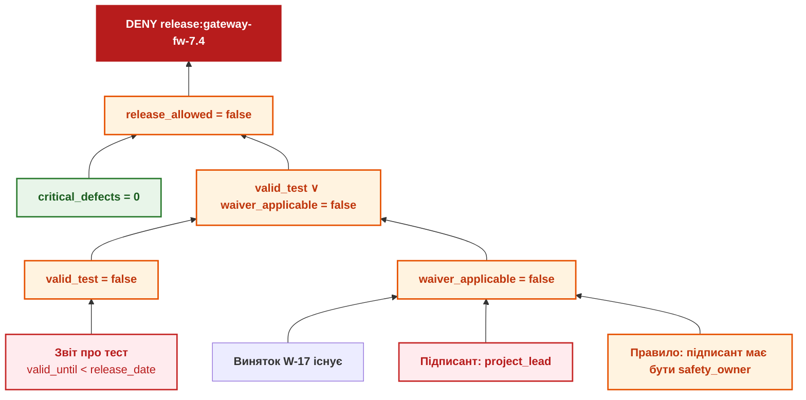
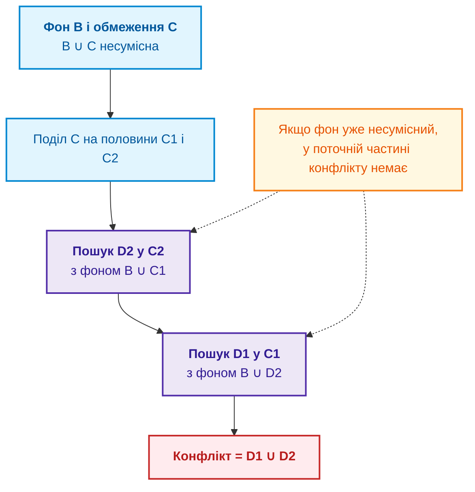
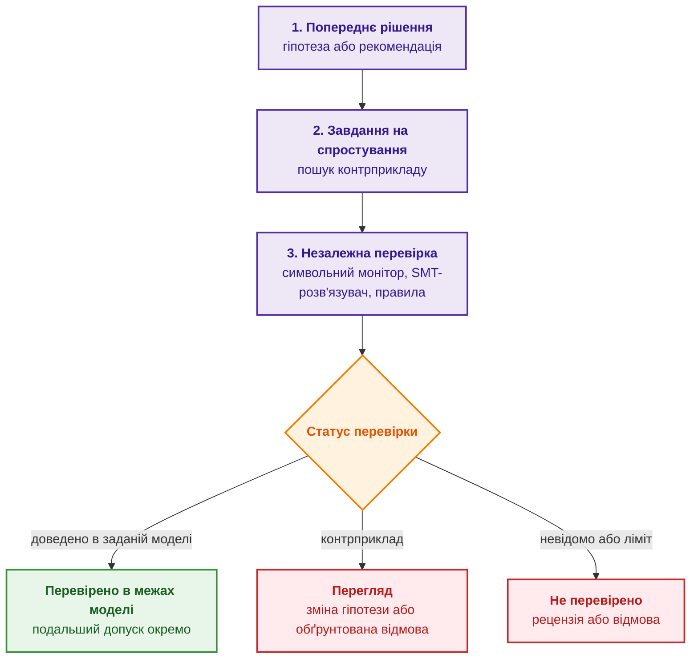
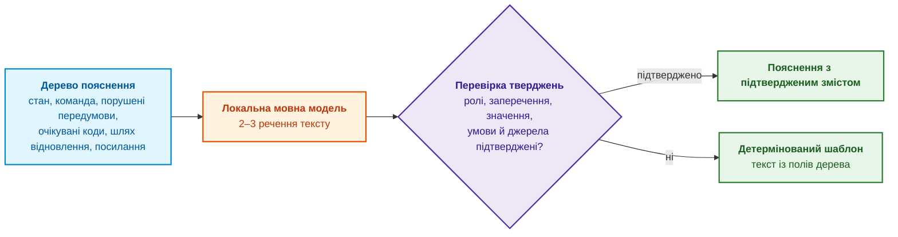

# Глава 20. Рушій пояснень: як система обґрунтовує рішення, відмову та межі компетентності

> **Книга:** [Архітектура доказових експертних систем](README.md) · [Частина IV: Архітектура, виконання та механізми висновку](part-04-architecture-and-inference.md)  
> **Попередня глава:** [Глава 19. Від запитання до доказу: як система трансформує неструктурований запит на ланцюг фактів](ch19-from-question-to-evidence.md)  
> **Наступна глава:** [Глава 21. Від рекомендації до дії: контроль повноважень і безпечне виконання у виробничому середовищі](ch21-from-recommendation-to-action.md)  
> **Зміст книги:** [README.md](README.md)  
> **Автор:** [Микола Федчик](about-the-author.md)  
> **Рівень:** середній і поглиблений: розробники механізмів виведення, архітектори, інженери знань  
> **Очікувані результати:** проєктувати рушій пояснень, що працює над тією самою трасою виведення, що й рішення; розрізняти п'ять типів пояснювальних запитів (HOW, WHY, WHY NOT, WHAT IF, WHAT MUST CHANGE); знаходити мінімальний конфлікт обмежень алгоритмом QuickXPlain; формулювати контрфактичні пояснення й допустимі дії з урахуванням повноважень; маскувати в поясненнях закриту інформацію; поєднувати природномовне пояснення з детермінованою перевіркою.

Уявімо, що експертна система заблокувала реліз прошивки мережевого шлюзу. Журнал фіксує машинний статус `decision=DENY`, а діалоговий асистент пояснює: *«Ризик перевищує допустимий рівень безпеки»*. Відповідь звучить правдоподібно, але для інженера марна, бо не відповідає на робочі запитання:

- Яке саме правило спрацювало?
- Які вхідні факти стали вирішальними?
- Чому підписаний виняток (*waiver*) не застосовано?
- Яких даних забракло для статусу `ALLOW`?
- Чи зміниться рішення після повторного випробування?

Пояснення в доказовій експертній системі не є оповіддю, яку мовна модель складає після рішення (*post-hoc rationalization*). Ще Вільям Кленсі, аналізуючи пояснення медичної експертної системи MYCIN, показав, що трасування спрацьованих правил саме по собі не пояснює рішення: для пояснення потрібні також знання про те, чому правила такі, і про стратегію їх застосування [[1]](#src-1). Тім Міллер, узагальнивши дослідження з соціальних наук, показав, що люди ставлять контрастні запитання («чому P, а не Q?») і очікують кількох відібраних причин, а не повного переліку [[2]](#src-2).

Ця глава відповідає на запитання: **як експертна система має пояснювати рішення, відмову й межі компетентності так, щоб пояснення можна було перевірити?** Теза глави: **пояснення є окремим артефактом, який обчислюється з тієї самої траси виведення, що й рішення: зрізу фактів, версій правил і графа доведення. Різні запитання потребують різних обчислень: повної траси, мінімального достатнього підграфа, мінімального конфлікту, повторного прогону чи пошуку допустимої дії. Мовна модель може лише озвучити перевірене пояснення, але не додати до нього причин.**

## Пояснення як окремий інженерний артефакт

Рушій пояснень (*explanation engine*) не реконструює історію рішення здогадками. Він працює над зафіксованим зрізом фактів (*snapshot*), версіями правил і трасою доведення, які породили рішення. Діаграма показує, як ці артефакти перетворюються на пояснення.



Проміжне представлення пояснення (*explanation intermediate representation*) відокремлює логічний зміст пояснення від мови, якою його подано. Мовна модель може бути лише вербалізатором перевірених фактів: додавати непідтверджені причини їй заборонено. Пояснення прив'язане до зафіксованого рішення, контракт якого виглядає так:

<details>
<summary>Структуровані дані JSON</summary>

```json
{
  "decision_id": "dec:gateway-fw-7.4:9f1c",
  "decision": "DENY",
  "subject": "release:gateway-fw-7.4",
  "snapshot_hash": "sha256:<хеш зрізу вхідних фактів>",
  "knowledge_version": "kb:release-policy@v7.3",
  "policy_version": "authz-rules@v12",
  "proof_root": "proof:tree:4711",
  "evaluated_at": "2026-09-27T10:15:00Z"
}
```

</details>


Без закріплених залежностей і версій повторення рішення може бути неможливим. Водночас сам хеш або корінь графа не встановлює юридичного статусу: він залежить від застосовних процедур, повноважень і вимог. Методи на кшталт SHAP оцінюють внесок ознак у передбачення статистичної моделі [[3]](#src-3). Вони корисні для аналізу поведінки моделі, але не замінюють логічної перевірки рішення за правилами.

## П'ять типів пояснювальних запитів

Одного запитання «чому?» для інженерної практики замало. Діаграма показує п'ять типів пояснювальних запитів, кожен з яких потребує окремого обчислення.



Таблиця уточнює, кому потрібен кожен тип і що саме обчислює експертна система.

| Запит | Цільова аудиторія | Що обчислює експертна система | Результат |
|---|---|---|---|
| **HOW** | Розробники механізму виведення, верифікатори | Повну трасу: усі спрацьовані правила й проміжні предикати | Повний граф доведення |
| **WHY** | Аудитори, сертифікаційні органи | Мінімальний набір фактів, достатній для вердикту | Достатній підграф доведення |
| **WHY NOT** | Автори релізу, інженери | Чому бажаний результат `ALLOW` не виведено | Невідома передумова, невиконана умова або конфлікт; мінімізація лише за встановленої несумісності |
| **WHAT IF** | Аналітики ризиків, архітектори | Що станеться після зміни окремих вхідних фактів | Повторне виведення на дочірньому зрізі |
| **WHAT MUST CHANGE** | Інженери-виконавці | Які допустимі зміни можуть забезпечити бажаний результат у моделі | Умовний план із перевіркою результатів; критерій вартості задано явно |

Запити WHY NOT і WHAT MUST CHANGE мають контрастну форму, про яку писав Міллер: інженера цікавить не «чому DENY» взагалі, а «чому DENY, а не ALLOW» і «що відділяє DENY від ALLOW». Наступні розділи показують кожен тип запиту на одному прикладі.

## Граф доведення на прикладі

Розглянемо блокування релізу прошивки шлюзу версії 7.4. Правило випуску в умовній політиці релізів записано так:

```math
\mathrm{release\_allowed} \Leftrightarrow (\mathrm{valid\_test} \lor \mathrm{waiver\_applicable}) \land \mathrm{critical\_defects} = 0
```

- У правилі випуску $`\mathrm{release\_allowed}`$ означає дозвіл на реліз;
- $`\mathrm{valid\_test}`$ позначає наявність чинного звіту про тестування, а $`\mathrm{waiver\_applicable}`$ позначає застосовний виняток;
- $`\mathrm{critical\_defects}`$ є кількістю критичних дефектів, а $0$ означає, що таких дефектів немає;
- $\lor$ означає «або», $\land$ означає «і», $=$ перевіряє рівність, а $\Leftrightarrow$ означає еквівалентність у повній навчальній політиці: дозвіл існує тоді й лише тоді, коли виконано праву частину.

Політика прикладу замкнена й усі вхідні значення відомі. Одне лише достатнє правило з односторонньою імплікацією не дозволяло б вивести заперечення дозволу, коли його передумови не виконані. Для реальної політики невідомий результат тесту або неповний перелік дефектів потребує окремого статусу й правила відмови в допуску.

Тобто реліз дозволено, якщо немає критичних дефектів і є або чинний звіт про тестування безпеки, або застосовний виняток, підписаний відповідальним за функціональну безпеку (роль `safety_owner`). У зрізі фактів зафіксовано: звіт про тестування прострочений (`valid_until < release_date`), виняток W-17 існує, але підписаний керівником проєкту (роль `project_lead`), критичних дефектів немає. Діаграма показує граф доведення рішення DENY.



Граф читається знизу вгору. Кожна з двох гілок окремо не пояснює відмови: якби звіт був чинним, реліз дозволили б навіть без винятку, і навпаки. Тому відповідь на запит WHY містить обидві гілки, а факт про відсутність критичних дефектів до мінімального пояснення не входить, бо ця умова виконана. Для запиту HOW експертна система додає до цього повну трасу з версіями правил і хешами фактів. Інтерфейс аудитора може показувати ту саму трасу у вигляді дерева:

<details>
<summary>Дані або результат прикладу</summary>

```text
[ЦІЛЬ] release_allowed = false
├── [ПРАВИЛО] release_allowed ⇐ (valid_test ∨ waiver_applicable) ∧ critical_defects = 0
├── [ГІЛКА 1] valid_test = false
│   └── [ФАКТ] TestReport-7.4: valid_until = 2026-08-01 < release_date = 2026-09-27
├── [ГІЛКА 2] waiver_applicable = false
│   ├── [ПРАВИЛО] виняток чинний лише з підписом ролі safety_owner
│   └── [ФАКТ] W-17 підписано роллю project_lead
└── [ФАКТ] critical_defects = 0 (умову виконано)
```

</details>


Експертна система не висуває гіпотез на кшталт «прошивка зламає мережу», а констатує, яку умову формальної політики не виконано і на яких фактах це ґрунтується. Кожен факт дерева посилається на байти джерела, а все дерево може бути оформлене як сертифікат доведення з підписом, описаний у [Главі 15](ch15-knowledge-extraction-and-kb-construction.md).

## WHY NOT: мінімальний конфлікт і алгоритм QuickXPlain

У прикладі з релізом причина відмови видна з одного правила. Коли ж діють сотні взаємопов'язаних обмежень, інженерові потрібна мінімальна підмножина обмежень, яка вже несумісна, тобто мінімальний конфлікт (*minimal conflict*, у термінах розв'язувачів також мінімальне ядро несумісності, *minimal unsatisfiable core*). Формально для бази знань $K$ і множини обмежень $C$:

```math
\mathrm{Core} \subseteq C, \quad K \cup \mathrm{Core} \vdash \bot, \quad \forall C' \subsetneq \mathrm{Core} : K \cup C' \nvdash \bot
```

- Для конфлікту $K$ є базою знань, $C$ є множиною обмежень, а $\mathrm{Core}$ є знайденою підмножиною конфліктних обмежень;
- $\subseteq$ означає включення з можливою рівністю, $\cup$ об'єднує множини, а $\subsetneq$ означає власну підмножину;
- $\vdash$ означає «логічно виводить», $\bot$ позначає суперечність, а $\nvdash$ означає, що суперечність не виводиться;
- $C'$ є будь-якою власною підмножиною ядра, а $\forall$ означає «для кожної» такої підмножини.

Формула вимагає, щоб база знань разом із ядром була несумісною, а видалення будь-якого його елемента усувало суперечність. Вона задає мінімальність за включенням, а не обов'язково найменшу кількість елементів.

Найпростіший спосіб знайти мінімальний конфлікт полягає в тому, щоб видаляти обмеження по одному й залишати видалення, якщо множина лишається несумісною. Цей спосіб потребує стільки перевірок сумісності, скільки є обмежень. Ульріх Юнкер запропонував алгоритм QuickXPlain, який ділить множину обмежень навпіл і рекурсивно шукає конфлікт у половинах, накопичуючи вже знайдені елементи конфлікту як фон [[4]](#src-4). За поділу навпіл QuickXPlain у гіршому випадку потребує $2k \log_2(n/k) + 2k$ перевірок сумісності, де $n$ є кількістю обмежень, а $k$ розміром конфлікту. Діаграма показує один крок рекурсії.



Програма мовою Go порівнює обидва способи на задачі планування релізу. Змінні задачі є днями тесту ($t$), завершення документації ($d$) і релізу ($r$) у межах від 0 до 20. Перевірка сумісності перебирає всі розклади, тож на великих задачах її замінює розв'язувач SAT чи SMT. Серед обмежень є три, що разом несумісні: лабораторія вільна лише з 10-го дня, замовник вимагає реліз не пізніше 12-го дня, а після тесту потрібно п'ять днів стабілізації. Решта обмежень стосується документації й нічому не заважає. Програма запускає пошук для 8 і для 200 обмежень.

<details>
<summary>Приклад мовою Go: мінімальний конфлікт обмежень методами QuickXPlain і видалення по одному</summary>

```go
package main

import "fmt"

// Constraint є обмеженням на дні тесту (t), документації (d) і релізу (r).
type Constraint struct {
	Name string
	Ok   func(t, d, r int) bool
}

var checks int

// consistent шукає хоча б один розклад у межах 0..20 днів, що задовольняє всі обмеження.
func consistent(cs []Constraint) bool {
	checks++
	for t := 0; t <= 20; t++ {
		for d := 0; d <= 20; d++ {
			for r := 0; r <= 20; r++ {
				all := true
				for _, c := range cs {
					if !c.Ok(t, d, r) {
						all = false
						break
					}
				}
				if all {
					return true
				}
			}
		}
	}
	return false
}

func join(a, b []Constraint) []Constraint {
	return append(append([]Constraint{}, a...), b...)
}

// qx є рекурсивною частиною QuickXPlain (Junker, 2004).
func qx(b, delta, c []Constraint) []Constraint {
  if len(c) == 0 {
    return nil
  }
	if len(delta) > 0 && !consistent(b) {
		return nil
	}
	if len(c) == 1 {
		return c
	}
	k := len(c) / 2
	c1, c2 := c[:k], c[k:]
	d2 := qx(join(b, c1), c1, c2)
	d1 := qx(join(b, d2), d2, c1)
	return join(d1, d2)
}

func quickXPlain(background, candidates []Constraint) ([]Constraint, error) {
  if !consistent(background) {
    return nil, fmt.Errorf("background is inconsistent")
  }
  if consistent(join(background, candidates)) {
    return nil, nil
  }
  return qx(background, nil, candidates), nil
}

// deletion видаляє обмеження по одному, доки множина лишається несумісною.
func deletion(c []Constraint) []Constraint {
	core := append([]Constraint{}, c...)
	for i := 0; i < len(core); {
		rest := join(core[:i], core[i+1:])
		if !consistent(rest) {
			core = rest
		} else {
			i++
		}
	}
	return core
}

func names(cs []Constraint) []string {
	var s []string
	for _, c := range cs {
		s = append(s, c.Name)
	}
	return s
}

func main() {
	core := map[int]Constraint{
		17:  {"лабораторія вільна з 10-го дня: t >= 10", func(t, d, r int) bool { return t >= 10 }},
		101: {"дедлайн замовника: r <= 12", func(t, d, r int) bool { return r <= 12 }},
		188: {"стабілізація після тесту: r >= t + 5", func(t, d, r int) bool { return r >= t+5 }},
	}
	for _, n := range []int{8, 200} {
		var cs []Constraint
		for i := 0; i < n; i++ {
			pos := i
			if n == 8 {
				pos = []int{0, 17, 1, 101, 2, 3, 188, 4}[i]
			}
			if c, ok := core[pos]; ok {
				cs = append(cs, c)
				continue
			}
			j := i % 4
			cs = append(cs, Constraint{fmt.Sprintf("документація: d >= %d", j), func(t, d, r int) bool { return d >= j }})
		}
		checks = 0
    conflict, err := quickXPlain(nil, cs)
    if err != nil {
      panic(err)
    }
		qxChecks := checks
		checks = 0
		del := deletion(cs)
		fmt.Printf("n = %d, перевірок сумісності: QuickXPlain %d, видалення по одному %d\n", n, qxChecks, checks)
		fmt.Printf("  конфлікт: %q\n", names(conflict))
    fmt.Printf("  збігається з результатом видалення: %v\n", fmt.Sprint(names(conflict)) == fmt.Sprint(names(del)))
	}
}
```

Перевірка контракту й мінімальності не залежить від кількості викликів; виконання: `go test -v main.go main_test.go`.

```go
package main

import "testing"

func TestQuickXPlainContract(testCase *testing.T) {
  if result, err := quickXPlain(nil, nil); err != nil || len(result) != 0 {
    testCase.Fatalf("empty set: %v, %v", result, err)
  }
  compatible := []Constraint{{Name: "nonnegative test day",
    Ok: func(testDay, documentationDay, releaseDay int) bool { return testDay >= 0 }}}
  if result, err := quickXPlain(nil, compatible); err != nil || len(result) != 0 {
    testCase.Fatalf("compatible set reported as conflict: %v", err)
  }
  candidates := []Constraint{
    {Name: "lab", Ok: func(testDay, documentationDay, releaseDay int) bool { return testDay >= 10 }},
    {Name: "deadline", Ok: func(testDay, documentationDay, releaseDay int) bool { return releaseDay <= 12 }},
    {Name: "stabilization", Ok: func(testDay, documentationDay, releaseDay int) bool { return releaseDay >= testDay+5 }},
    compatible[0],
  }
  conflict, err := quickXPlain(nil, candidates)
  if err != nil || len(conflict) != 3 || consistent(conflict) {
    testCase.Fatalf("invalid conflict: %v, %v", names(conflict), err)
  }
  for index := range conflict {
    if !consistent(join(conflict[:index], conflict[index+1:])) {
      testCase.Fatal("conflict is not inclusion-minimal")
    }
  }
  if _, err := quickXPlain(candidates, compatible); err == nil {
    testCase.Fatal("inconsistent background accepted")
  }
}
```

</details>

Програма виводить:

<details>
<summary>Дані або результат прикладу</summary>

```text
n = 8, перевірок сумісності: QuickXPlain 13, видалення по одному 8
  конфлікт: ["лабораторія вільна з 10-го дня: t >= 10" "дедлайн замовника: r <= 12" "стабілізація після тесту: r >= t + 5"]
  збігається з результатом видалення: true
n = 200, перевірок сумісності: QuickXPlain 33, видалення по одному 200
  конфлікт: ["лабораторія вільна з 10-го дня: t >= 10" "дедлайн замовника: r <= 12" "стабілізація після тесту: r >= t + 5"]
  збігається з результатом видалення: true
```

</details>


Обидва способи знаходять у цьому прикладі конфлікт із трьох обмежень: тест не раніше 10-го дня й п'ять днів стабілізації суперечать релізу до 12-го дня. Обгортка додає дві перевірки передумов; загалом маємо 13 проти 8 викликів для малого набору та 33 проти 200 для великого. Це кількість звернень до оракула, не вимірювання часу й не перевага на всіх задачах. Може існувати кілька мінімальних конфліктів; мінімальність за включенням не означає найменшої кількості або вартості. Оракул прикладу точно перебирає скінченний домен. Для SMT статус `unknown` не можна трактувати як несумісність, а неперевірений фон не можна передавати до QuickXPlain як сумісний.

## WHAT IF і WHAT MUST CHANGE: контрфакти й допустимі дії

Запит WHAT IF виконують повторним виведенням на дочірньому зрізі фактів, у якому змінено один чи кілька фактів; вихідний зріз при цьому не змінюється. Запит WHAT MUST CHANGE складніший: експертна система має знайти найближчий стан, у якому рішення змінюється на бажане. Ваштер, Міттельштадт і Рассел запропонували такі контрфактичні пояснення як спосіб пояснити автоматизоване рішення, не розкриваючи внутрішньої будови моделі [[5]](#src-5). Формально це задача мінімізації відстані $d$ між поточним станом $x$ і цільовим станом $x'$, для якого рішення $D(x') = \mathrm{ALLOW}$:

```math
x^* = \arg\min_{x'} d(x, x') \quad \text{за умов} \quad x' \in F_{\text{feasible}} \cap F_{\text{actionable}} \cap F_{\text{authorized}},\quad D(x')=\mathrm{ALLOW}.
```

- Для пошуку дії $x$ є поточним станом, $x'$ є можливим зміненим станом, а $x^*$ є станом з найменшою допустимою відстанню від $x$;
- $d(x,x')$ є мірою вартості або віддаленості зміни, заданою для конкретної задачі;
- $\arg\min_{x'}$ означає «значення $x'$, яке мінімізує», а умова $x'\in F_{\text{feasible}}$ вимагає фізичної здійсненності;
- $F_{\text{actionable}}$ є множиною станів, досяжних діями людини, а $F_{\text{authorized}}$ є множиною станів, дозволених повноваженнями;
- $\cap$ означає перетин; $D(x')$ є результатом рішення на зміненому стані, який обов'язково має дорівнювати $\mathrm{ALLOW}$.

Експертна система шукає не просто найближчий математичний стан, а найближчу фізично здійсненну, дієву й дозволену зміну. Результат залежить від визначеної метрики $d$ та повноти обмежень.

Устун, Спенгер і Лю показали, що математично найближчий контрфакт часто недосяжний на практиці, бо змінює атрибути, на які людина не може вплинути, і запропонували шукати саме дієві зміни (*actionable recourse*) [[6]](#src-6). В експертній системі простір пошуку обмежують три множини:

1. **Фізична можливість** ($F_{\text{feasible}}$) виключає неможливі стани, наприклад зміну дати вже проведеного випробування.
2. **Дієвість** ($F_{\text{actionable}}$) залишає лише те, що людина реально може змінити: призначити повторний тест, отримати новий підпис. Незмінні атрибути, наприклад версія вже скомпільованого образу прошивки, мають нескінченну вартість зміни.
3. **Повноваження** ($F_{\text{authorized}}$) залишає лише дії, дозволені ролі користувача. Автор релізу не може змінити роль підписанта винятку з `project_lead` на `safety_owner`: така «порада» була б порадою підробити документ.

Для автора релізу можна запропонувати запит повторного тестування або рецензії винятку, якщо такі дії дозволені. Проте тест може завершитися невдачею, а відповідальний може відмовити в підписі. Це умовні плани, не гарантії переходу до ALLOW; після результату потрібне нове виведення. Контрфактичний стан не змінює вихідних фактів і не є причинним доказом успішності дії. Вартість зміни має враховувати лише допустимі дії, а не підроблення дат або ролей.

## Захист від витоку через пояснення

Пояснення розкривають інформацію, і серія запитів WHY NOT може стати каналом витоку. Якщо підрядник запитує статус релізу й отримує відповідь *«DENY: порушено вимоги до часових параметрів шини проєкту Project_Titan_v2»*, він дізнається про існування закритого проєкту. Небезпека не умоглядна: Айводжі, Боло й Ґамб показали, що за контрфактичними поясненнями можна відновити модель, яка їх породила [[7]](#src-7).

Тому експертна система маскує проміжне представлення пояснення за правами користувача:

```math
\mathrm{EIR}_{\text{redacted}} = \{ e \in \mathrm{EIR} \mid \mathrm{ACL}(e, \text{роль}) = \mathrm{ALLOW} \}
```

- Для фільтрації $\mathrm{EIR}$ є множиною елементів проміжного подання пояснення, а $e$ є одним таким елементом;
- $\mathrm{ACL}(e,\text{роль})$ є результатом перевірки списку керування доступом для елемента $e$ і ролі запитувача;
- $\mathrm{ALLOW}$ означає, що доступ дозволено, а $=$ перевіряє, чи дорівнює результат саме цьому рішенню;
- фігурні дужки з умовою після $\mid$ задають множину всіх елементів, що задовольняють умову, а $\in$ означає належність до множини.

Отже, до відфільтрованого подання потрапляють лише ті елементи пояснення, які дозволено показати цій ролі. Приховування окремих елементів не повинно створювати враження, що видиме пояснення є повним.

Фільтрація окремих фактів необхідна, але недостатня: кількість прихованих причин, назва правила й сам вердикт можуть розкрити закриту інформацію. Політика має окремо дозволити агрегований результат і будь-яке повідомлення про приховані підстави. Якщо повідомляти про наявність такої підстави заборонено, повертають однакову нейтральну відмову без лічильника чи ідентифікатора. Видимий фрагмент пояснення не позначають повним; за дозволу повідомляють межі видимого подання. Перевіряють також серії запитів, час відповіді, кеші й журнали. Парні тести порівнюють входи з однаковими дозволеними даними й різними закритими даними.

## Межі компетентності й самоперевірка

Пояснювати треба не лише рішення, а й відмову від рішення. Для цього експертна система перед видачею висновку ставить собі метакогнітивні запитання (*metacognition*, міркування про власне міркування). У систематичному огляді нейро-символьних досліджень 2024 року Колелоу й Реглі виявили, що метакогніція є найменш дослідженою областю: лише 5 % розглянутих праць [[8]](#src-8). Інженерна практика при цьому потребує п'яти перевірок:

1. **Межа компетентності.** Чи належить запит до формально визначеної предметної області експертної системи?
2. **Достатність знань.** Чи досить фактів у базі знань для однозначного висновку, чи відповідь була б здогадкою?
3. **Узгодженість і чинність.** Чи узгоджені використані джерела між собою і чи застосовні вони для цільової редакції та профілю?
4. **Вибір стратегії.** Що доречніше: строга дедукція, міркування за прецедентами чи запит на уточнення з відмовою за замовчуванням (*fail-closed*)?
5. **Калібрована надійність.** Наскільки висновок доведений, а наскільки спирається на статистичні оцінки?

Негативна відповідь на будь-яке з перших трьох запитань дає обґрунтовану відмову, і пояснення відмови будується так само, як пояснення рішення: з указанням, якої умови не виконано. Для критичних рішень експертна система додатково намагається спростувати власний висновок, як показує діаграма.



Невдалий пошук контрприкладу не є доведенням: причина може бути в ліміті, неповному просторі пошуку чи непідтримуваній теорії. Точний перебір скінченного домену або перевірений формальний доказ дає висновок лише для заданої моделі. Для заяви «розкладу немає» контрприкладом є знайдений допустимий розклад. Два перевірювачі з однаково хибним перекладом вимоги можуть узгоджено помилятися; незалежність перевірки й предметну правильність моделі оцінюють окремо.

## Природномовне пояснення поверх перевіреного дерева

Інженер рідко читає проміжне представлення у форматі JSON чи граф доведення. Йому потрібне стисле пояснення природною мовою, але без вигаданих причин. Передати рішення генеративній моделі з проханням «поясни» небезпечно: модель може згадати неіснуючі пункти стандартів чи хибні кроки відновлення. Тому природномовне пояснення будують поверх перевіреного дерева, як показано на діаграмі.



Повернімося до автомата сеансу SMTP з [Глави 15](ch15-knowledge-extraction-and-kb-construction.md). Клієнт надіслав команду DATA одразу після з'єднання, не ініціалізувавши сеанс і не відкривши поштової транзакції. Механізм виведення формує дерево пояснення, кожне поле якого спирається на розділи 3.3 і 4.1.4 RFC 5321 [[9]](#src-9):

<details>
<summary>Структуровані дані JSON</summary>

```json
{
  "protocol": "SMTP",
  "current_state": "Connected",
  "attempted_command": "DATA",
  "claim": "DATA is out of sequence: no mail transaction is open",
  "violated_prerequisites": [
    "session initialized by EHLO or HELO",
    "MAIL FROM accepted",
    "at least one RCPT TO accepted"
  ],
  "expected_reply": ["503", "554"],
  "remediation_path": ["EHLO", "MAIL FROM", "RCPT TO", "DATA"],
  "citations": ["RFC 5321, section 3.3", "RFC 5321, section 4.1.4"]
}
```

</details>


Локальна мовна модель отримує дерево з інструкцією озвучити лише наведені поля. Шлюз перевірки виділяє з тексту моделі всі сутності, які можна перевірити (назви команд і станів, коди відповідей, номери розділів), і порівнює їх із полями дерева. Якщо модель згадала команду, код чи розділ, яких немає в дереві, або пропустила обов'язкову передумову, користувач отримує детермінований шаблон, складений із полів дерева:

*«SMTP: команда DATA надійшла поза порядком. Поштову транзакцію не відкрито: потрібні EHLO або HELO, прийнята команда MAIL FROM і хоча б одна прийнята команда RCPT TO (RFC 5321, розділи 3.3 і 4.1.4). Сервер може відповісти кодом 503 або 554. Шлях відновлення: EHLO, MAIL FROM, RCPT TO, DATA.»*

Коди 503 і 554 у цьому поданні спираються на дозвіл розділу 3.3 для DATA без MAIL або RCPT чи після їх відхилення, не є універсальними кодами будь-якої помилки SMTP. Шлях відновлення є навчальною послідовністю за успіху кожного кроку; відмова сервера або погоджене розширення потребує іншої гілки. Схвалений профіль має явно розрізняти обов'язок клієнта дотримуватися порядку й допустиму реакцію сервера на порушення.

Словникова перевірка ловить зайві назви, але не всі зміни змісту. Речення «тест прострочений, тому реліз дозволено» може містити лише відомі сутності й усе одно суперечити дереву. Аналогічні помилки виникають через переставлені ролі, пропущений виняток або SHOULD замість MUST. Статистичний оцінювач може допомогти рецензії, але не робить вільний текст доведеним.

Для критичного подання базовим варіантом є детермінований шаблон над схваленими полями. Модель може пропонувати порядок ідентифікаторів або вибір готових формулювань, а рендерер підставляє лише дозволені значення. Якщо потрібен вільний текст, кожне його суттєве твердження потребує окремої перевірки й збереженого статусу. Успішність входового дерева не переноситься автоматично на текст виходу.

## Протокол перевірки вірності пояснення

Порівняти три маршрути: шаблон; модель із вибором готових тверджень; вільну генерацію з перевіркою. Кожен маршрут отримує той самий граф і той самий профіль доступу. Контрольні зміни вводять неправильне заперечення, одиницю, роль, редакцію й пропущену підставу. Окремо перевіряють достатність підграфа, відмову за невідомого факту та збереження вихідного знімка для контрфакту.

Метрики розділяють правильність суттєвих тверджень, повноту потрібних підстав, правильність адрес, витік, частку переходу до шаблону й зрозумілість для рецензента. Відсутність вигадки при порожньому поясненні не є достатньою якістю. Результат пошуку, граф доведення й текст пояснення мають різні одиниці оцінки, тому кожен етап оцінюють окремо.

## Висновок

Пояснення в доказовій експертній системі є окремим артефактом, який обчислюється з тієї самої траси виведення, що й рішення: зрізу фактів, версій правил і графа доведення. П'ять типів запитів потребують п'яти різних обчислень, і жоден з них не зводиться до прохання до мовної моделі «поясни».

Навчальна замкнена політика показала дві причини відмови й умовні плани її перегляду. QuickXPlain із перевіркою передумов знайшов мінімальний за включенням конфлікт; для 200 обмежень програма виконала 33 перевірки проти 200 у методу видалення. Негативні тести охоплюють порожній набір, сумісний набір і несумісний фон. Приклад текстового пояснення показав, чому відомих назв недостатньо для підтвердження ролей, заперечень і причин.

Правильні правила й факти є необхідними, але рендерер також може спотворити їхній зміст. Маскування має контролювати дозволений результат, а не лише вилучати рядки. Пошук контрприкладів має відрізняти доказ від незавершеної перевірки. [Глава 21](ch21-from-recommendation-to-action.md) переходить від умовної рекомендації до виконання з окремою перевіркою повноважень і фактичного результату.

## Запитання для самоперевірки

1. Чому пояснення, яке мовна модель складає після рішення класифікатора, не є доказовим? Що, за Кленсі, бракує простій трасі спрацьованих правил?
2. Навіщо розробнику механізму виведення запит HOW, а автору відхиленого релізу запит WHAT MUST CHANGE?
3. Чому мінімальне пояснення відмови в релізі містить обидві гілки графа доведення, але не містить факту про відсутність критичних дефектів?
4. Як QuickXPlain знаходить мінімальний конфлікт без перевірки всіх підмножин і чому на восьми обмеженнях він виконав більше перевірок, ніж видалення по одному?
5. Чому порада «змініть дату звіту про тест» неприпустима, хоча вона математично найближча до бажаного рішення?
6. Як серія запитів WHY NOT може розкрити закриту інформацію і що робить маскування проміжного представлення пояснення?
7. Які сутності перевіряє шлюз природномовного пояснення в прикладі з SMTP і що відбувається, коли модель згадує зайву команду?

## Словник

| Український термін | Англійський відповідник | Коротке пояснення |
|---|---|---|
| Рушій пояснень | Explanation engine | Підсистема, що обчислює пояснення з траси виведення рішення |
| Пояснення після рішення | Post-hoc rationalization | Правдоподібна оповідь, складена без зв'язку з реальною трасою виведення |
| Зріз фактів | Snapshot | Зафіксований набір вхідних фактів, на якому ухвалено рішення |
| Граф доведення | Proof graph | Орієнтований граф фактів, правил і проміжних висновків, що веде до рішення |
| Контрастне запитання | Contrastive question | Запитання виду «чому P, а не Q?» |
| Мінімальний конфлікт | Minimal conflict | Несумісна множина обмежень, будь-яка власна підмножина якої сумісна |
| Перевірка сумісності | Consistency check | Перевірка, чи існує стан, що задовольняє всі обмеження |
| Контрфактичне пояснення | Counterfactual explanation | Опис найближчого стану, у якому рішення було б іншим |
| Дієва зміна | Actionable recourse | Зміна, яку людина може реально виконати, щоб отримати бажане рішення |
| Маскування пояснення | Explanation redaction | Приховування елементів пояснення, до яких користувач не має доступу |
| Метакогніція | Metacognition | Міркування експертної системи про власне міркування й межі компетентності |
| Відмова за замовчуванням | Fail-closed | Принцип, за яким у разі сумніву експертна система відмовляє, а не схвалює |
| Виняток | Waiver | Погоджений дозвіл відступити від правила за певних умов |

## Абревіатури

| Скорочення | Розшифрування | Значення |
|---|---|---|
| ACL | Access Control List | список прав доступу |
| EIR | Explanation Intermediate Representation | проміжне представлення пояснення |
| JSON | JavaScript Object Notation | текстовий формат обміну даними |
| MYCIN | назва системи, не абревіатура | медична експертна система 1970-х років для діагностики інфекцій |
| RFC | Request for Comments | серія документів зі специфікаціями інтернету |
| SAT | Boolean Satisfiability | задача виконуваності булевих формул |
| SHAP | SHapley Additive exPlanations | метод оцінки внеску ознак у передбачення моделі |
| SMT | Satisfiability Modulo Theories | виконуваність з урахуванням теорій |
| SMTP | Simple Mail Transfer Protocol | протокол передавання електронної пошти |

## Джерела

1. <a id="src-1"></a>William J. Clancey. [*The Epistemology of a Rule-Based Expert System: A Framework for Explanation*](https://doi.org/10.1016/0004-3702(83)90008-5). *Artificial Intelligence*, 20(3), 215–251, 1983.
2. <a id="src-2"></a>Tim Miller. [*Explanation in Artificial Intelligence: Insights from the Social Sciences*](https://doi.org/10.1016/j.artint.2018.07.007). *Artificial Intelligence*, 267, 1–38, 2019.
3. <a id="src-3"></a>Scott M. Lundberg, Su-In Lee. [*A Unified Approach to Interpreting Model Predictions*](https://papers.nips.cc/paper_files/paper/2017/hash/8a20a8621978632d76c43dfd28b67767-Abstract.html). *Advances in Neural Information Processing Systems 30 (NeurIPS 2017)*, 2017.
4. <a id="src-4"></a>Ulrich Junker. [*QUICKXPLAIN: Preferred Explanations and Relaxations for Over-Constrained Problems*](https://cdn.aaai.org/AAAI/2004/AAAI04-027.pdf). *Proceedings of the 19th National Conference on Artificial Intelligence (AAAI 2004)*, 2004.
5. <a id="src-5"></a>Sandra Wachter, Brent Mittelstadt, Chris Russell. [*Counterfactual Explanations without Opening the Black Box: Automated Decisions and the GDPR*](https://arxiv.org/abs/1711.00399). *Harvard Journal of Law & Technology*, 31(2), 2018.
6. <a id="src-6"></a>Berk Ustun, Alexander Spangher, Yang Liu. [*Actionable Recourse in Linear Classification*](https://doi.org/10.1145/3287560.3287566). *Proceedings of the Conference on Fairness, Accountability, and Transparency (FAT\* 2019)*, 10–19, 2019.
7. <a id="src-7"></a>Ulrich Aïvodji, Alexandre Bolot, Sébastien Gambs. [*Model Extraction from Counterfactual Explanations*](https://arxiv.org/abs/2009.01884). arXiv:2009.01884, 2020.
8. <a id="src-8"></a>Brandon C. Colelough, William Regli. [*Neuro-Symbolic AI in 2024: A Systematic Review*](https://arxiv.org/abs/2501.05435). arXiv:2501.05435, 2025.
9. <a id="src-9"></a>J. Klensin. [*RFC 5321: Simple Mail Transfer Protocol*](https://www.rfc-editor.org/rfc/rfc5321). IETF, 2008.

---

[← Глава 19. Від запитання до доказу](ch19-from-question-to-evidence.md) | [Зміст книги](README.md) | [Частина IV](part-04-architecture-and-inference.md) | [Глава 21. Від рекомендації до дії →](ch21-from-recommendation-to-action.md)
