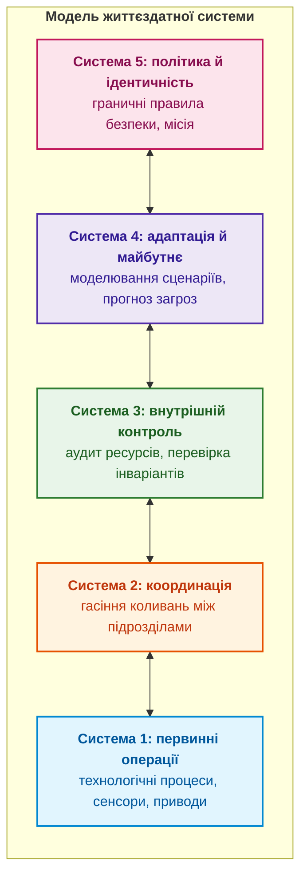
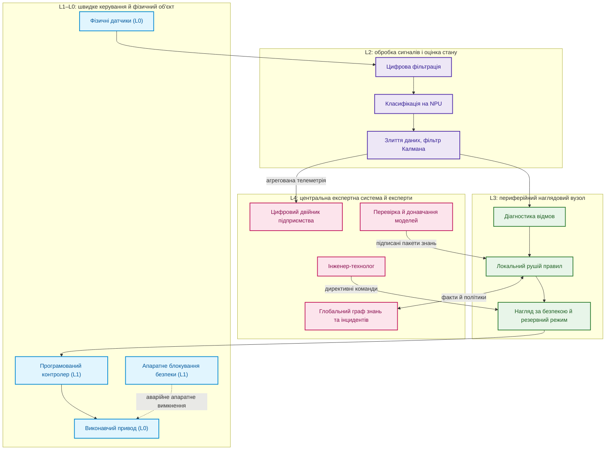
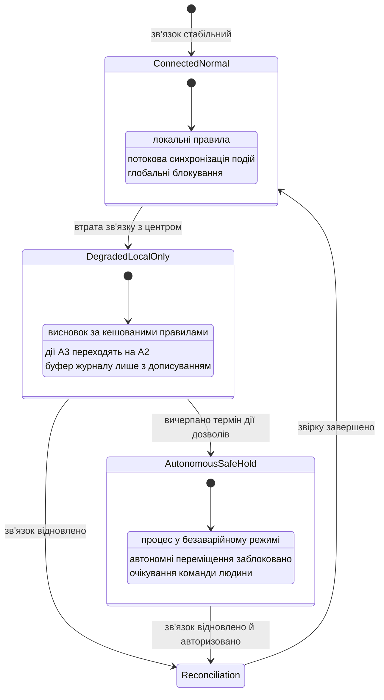
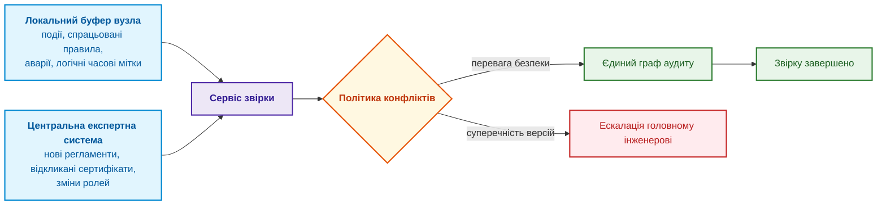

# Глава 22. Кібернетичний цикл керування XXI століття: від сенсорів на периферії до центру ухвалення рішень

> **Книга:** [Архітектура доказових експертних систем](README.md) · [Частина IV: Архітектура, виконання та механізми висновку](part-04-architecture-and-inference.md)  
> **Попередня глава:** [Глава 21. Від рекомендації до дії: контроль повноважень і безпечне виконання у виробничому середовищі](ch21-from-recommendation-to-action.md)  
> **Наступна глава:** [Глава 23. Верифікація бази знань: як перевірити несуперечливість, повноту та надійність правил](ch23-knowledge-base-verification.md)  
> **Наступна частина:** [Частина V: Верифікація, діагностика та неперервне навчання](part-05-verification-and-learning.md)  
> **Зміст книги:** [README.md](README.md)  
> **Автор:** [Микола Федчик](about-the-author.md)  
> **Рівень:** середній і поглиблений: системні архітектори, інженери кіберфізичних комплексів, розробники периферійних обчислень  
> **Очікувані результати:** застосовувати закон необхідної різноманітності Ешбі й теорему про добрий регулятор до архітектури експертної системи; оцінювати стан об'єкта фільтром замість сирого сигналу; розподіляти функції між рівнями L0–L4 за часовими горизонтами; передавати від сенсорів підписані ознаки, а не вердикти; проєктувати режими деградації за обриву зв'язку й звірку станів після відновлення; оновлювати знання на периферії підписаними пакетами.

На автоматизованій виробничій лінії високочастотний датчик фіксує нетиповий сплеск вібрації в підшипниковому вузлі. Як реагувати? Можна негайно вимкнути приводний двигун, можна надіслати інженерові сповіщення про огляд у найближчу регламентну паузу, а можна знехтувати сигналом як короткочасною завадою від сусіднього преса. Числовий вихід нейромережевого класифікатора сам не дає відповіді. Рішення залежить від контексту: стадії технологічного процесу, достовірності калібрування датчика, температури мастила, вартості зупинки конвеєра, наявності резервного каналу й повноважень вузла, що ухвалює рішення.

Якщо зв'язок із центральним сервером обірвався, захисна логіка мусить спрацювати безпосередньо біля обладнання, на периферії (*edge*). Водночас локальний контролер не знає повної історії обслуговування парку машин і не має права сам змінювати технологічний регламент заводу. Така поведінка типова для кіберфізичних систем, у яких обчислення тісно переплетені з фізичними процесами й мають встигати за ними [[1]](#src-1).

Ця глава відповідає на запитання: **як замкнути зворотний зв'язок між фізичним процесом, периферійними вузлами й центральною експертною системою так, щоб керування залишалося безпечним за затримок, шуму й обриву зв'язку?** Теза глави: **цикл керування розкладають за часовими горизонтами. Швидкі захисні реакції виконують детерміновані контролери біля обладнання, периферійний вузол оцінює стан об'єкта й застосовує кешовані правила, а центральна експертна система змінює правила й моделі лише підписаними пакетами. Кожен рівень має достатню різноманітність реакцій для своїх збурень, внутрішню модель об'єкта, власний режим деградації й правила звірки після відновлення зв'язку.**

## Кібернетика й закон необхідної різноманітності

Норберт Вінер визначив кібернетику як науку про керування й зв'язок у тваринах і машинах, побудовану навколо зворотного зв'язку [[2]](#src-2). Для експертної системи з цієї рамки випливає практичне запитання: чи здатна експертна система розрізнити всі стани об'єкта, на які вона мусить реагувати по-різному. Кількісну відповідь дає закон необхідної різноманітності Вільяма Росса Ешбі [[3]](#src-3).

Різноманітністю скінченної множини станів $\Omega$ Ешбі називав кількість її розрізнюваних елементів; у логарифмічній формі

```math
V(\Omega) = \log_2 |\Omega|
```

- Для вимірювання різноманітності $\Omega$ є скінченною множиною станів, а $|\Omega|$ є кількістю її розрізнюваних елементів;
- $\log_2$ є логарифмом за основою 2, а $V(\Omega)$ вимірюється в бітах;
- рівність задає число бітів, потрібне для розрізнення станів множини за цією моделлю.

Якщо множина містить 1 024 стани, $V(\Omega)=\log_2(1024)=10$ біт. Така оцінка рахує лише кількість станів, а не складність чи ймовірність кожного стану.

Закон необхідної різноманітності в такій формі стверджує, що різноманітність результатів $V_O$ не може бути меншою за різноманітність збурень $V_D$ мінус різноманітність реакцій регулятора $V_R$:

```math
V_O \geq V_D - V_R
```

Закон обмеження:

- $V_O$ є різноманітністю результатів, $V_D$ є різноманітністю збурень, а $V_R$ є різноманітністю реакцій регулятора;
- кожна величина вимірюється в бітах у межах тієї самої моделі станів;
- $\geq$ означає «не менше ніж», а знак $-$ віднімає здатність регулятора поглинути збурення від різноманітності самих збурень.

За наведеного далі прикладу $V_D=10$ біт і $V_R=1$ біт, тому неврегульована різноманітність результатів має бути не меншою за $9$ біт. Нерівність задає нижню межу й не визначає сама собою, які саме реакції забезпечать безпечну поведінку.

Інакше кажучи, лише різноманітність регулятора може поглинути різноманітність збурень. Нехай фізичне середовище може спричинити $2^{10} = 1024$ різні несправності, кожна з яких потребує власної компенсації, а діагностичний класифікатор видає лише два статуси, `NORMAL` або `FAIL`. Тоді $V_D = 10$ біт, $V_R = 1$ біт, і $V_O \geq 9$ біт: щонайменше 512 різних результатів залишаються неконтрольованими, бо бінарний статус не дає змоги обрати відповідну компенсацію. Експертна система збільшує різноманітність регулятора онтологією відмов: замість бінарного статусу вона формує типізовану діагностичну гіпотезу з рівнем впевненості й прив'язкою до поточного режиму експлуатації.

Конант і Ешбі довели доповнення до цього закону: кожен добрий регулятор системи мусить бути моделлю цієї системи [[4]](#src-4). Тому в циклі керування між сенсорами й правилами стоїть оцінювач стану, тобто внутрішня модель об'єкта: фільтр Калмана [[5]](#src-5) чи цифровий двійник. Діаграма показує повний цикл зі зворотним зв'язком.

```mermaid
flowchart LR
    accTitle: Цикл керування зі зворотним зв'язком
    accDescr: Фізичний процес дає сигнали сенсорам, сигнали фільтруються, оцінювач стану формує модель об'єкта, експертна система ухвалює дозволене рішення, виконавчий механізм змінює процес, а оператор контролює повноваження.

    ENV["<b>Фізичний процес</b><br/>механіка, термодинаміка"] --> SEN["<b>Сенсори й телеметрія</b><br/>вібрація, тиск, струм"]
    SEN --> OBS["<b>Фільтрація й перевірка</b><br/>часові мітки, відсів шуму"]
    OBS --> EST["<b>Оцінювач стану</b><br/>фільтр Калмана, цифровий двійник"]
    EST --> EXP["<b>Експертна система</b><br/>правила, нормативи, діагностика"]
    EXP --> DEC["<b>Дозволене рішення</b>"]
    DEC --> ACT["<b>Виконавчий механізм</b><br/>частотний перетворювач, клапан"]
    ACT --> ENV
    ENV -.->|"фізичний відгук"| SEN

    HUM["<b>Оператор</b><br/>контроль повноважень"] --> DEC
    EXP --> HUM

    classDef env fill:#fff3e0,stroke:#e65100,stroke-width:2px,color:#bf360c;
    classDef sens fill:#e1f5fe,stroke:#0288d1,stroke-width:2px,color:#01579b;
    classDef est fill:#ede7f6,stroke:#512da8,stroke-width:2px,color:#311b92;
    classDef core fill:#e8f5e9,stroke:#2e7d32,stroke-width:2px,color:#1b5e20;
    classDef hum fill:#fce4ec,stroke:#c2185b,stroke-width:2px,color:#880e4f;

    class ENV,ACT env;
    class SEN,OBS sens;
    class EST est;
    class EXP,DEC core;
    class HUM hum;
```



Діаграма підкреслює, що правила експертної системи отримують не сирі сигнали, а оцінку стану. Наступний розділ показує на числах, чому ця різниця принципова.

## Паралельний програмний приклад: черга обробки завдань

Зворотний зв'язок потрібний і без фізичних сенсорів. Нехай програмний сервіс приймає завдання, обробники виконують їх, а контролер масштабує кількість обробників за телеметрією. Затримка метрик, повтори й обмеження залежного сервісу тут відіграють роль затримок, шуму й меж виконавчого механізму.

| Частина циклу | Програмний відповідник | Перевірка експертною системою |
|---|---|---|
| об'єкт керування | черга й обробники | розрізняти зростання навантаження та падіння пропускної здатності |
| спостереження | вік найстарішого завдання, темп надходження, завершення й повтори | перевірити часові мітки й повноту метрик |
| оцінка стану | припущення про нестачу обробників або перевантаження залежного сервісу | не трактувати один великий розмір черги як готовий діагноз |
| дозволена дія | зміна числа обробників, обмеження приймання або повідомлення оператору | застосувати погоджені межі й повноваження |
| відгук | зміна віку завдань, помилок і повторів | перевірити, чи дія поліпшила стан, а не лише зменшила видиму чергу |

Якщо контролер бачить старі метрики, він може кілька разів поспіль збільшити число обробників до того, як побачить результат першої зміни. Якщо вузьке місце в базі даних, додаткові обробники й повтори лише збільшать конкуренцію. Експертна система може пояснити ці гіпотези й перевірити правила дії, але не замінює штатного регулятора масштабування.

Перед автоматизацією перевіряють затримку спостереження й виконання, коливання числа обробників, вік завдань і частку повторів. Погоджують час очікування ефекту, верхню межу дії та режим за відсутньої телеметрії. Навчальний приклад не задає універсальних порогів: для конкретного сервісу потрібні навантажувальні випробування. Та сама проблема оцінювання стану далі розглядається на фізичному сигналі.

## Оцінювання стану: фільтр замість сирого сигналу

Розгляньмо правило захисту силових транзисторів у блоці розподілу живлення: знизити потужність удвічі, якщо температура перевищує 85 °C і зростає швидше за 2,5 °C/с:

```math
T > 85\,^\circ\mathrm{C} \;\land\; \frac{dT}{dt} > 2{,}5\,^\circ\mathrm{C/s} \;\Rightarrow\; \mathrm{DeratePower}(50\,\%)
```

- Правило термозахисту використовує $T$, поточну температуру транзистора в градусах Цельсія, і поріг $`85\, ^\circ\mathrm{C}`$;
- $\frac{dT}{dt}$ є швидкістю зміни температури в градусах Цельсія за секунду, а $`2{,}5\, ^\circ\mathrm{C/s}`$ є порогом швидкості нагрівання;
- $>$ означає «більше за», $\land$ вимагає одночасної істинності обох умов;
- $\Rightarrow$ означає, що за виконання умов запускається дія $`\mathrm{DeratePower}(50\,\%)`$, тобто зниження потужності до 50 %.

Отже, правило знижує потужність лише тоді, коли температура вже перевищила 85 °C і продовжує зростати швидше за заданий поріг. Похідну треба оцінювати з урахуванням шуму сенсора й інтервалу опитування, інакше випадковий шум може спричинити хибне спрацювання.

Правило виглядає простим, але похідна шумного сигналу є підступною величиною. Якщо датчик опитують кожні 50 мс, а шум вимірювання має стандартне відхилення 0,5 °C, то різниця двох сусідніх вимірювань, поділена на 0,05 с, має шум порядку $0{,}5 \cdot \sqrt{2} / 0{,}05 \approx 14$ °C/с, що в кілька разів більше за поріг правила. Програма мовою Go моделює 60 секунд роботи у двох сценаріях: транзистор гарячий (86 °C), але не нагрівається, і транзистор нагрівається на 3 °C/с від 80 °C. Похідну обчислюють двома способами: наївно, з двох сусідніх вимірювань, і альфа-бета-фільтром, найпростішим оцінювачем стану з моделлю сталої швидкості зміни, який уточнює оцінку температури й швидкості на кожному кроці.

<details>
<summary>Приклад мовою Go: наївна похідна й альфа-бета-фільтр для правила за швидкістю нагріву</summary>

```go
package main

import (
	"fmt"
	"math/rand"
)

const dt = 0.05 // період опитування датчика, с

// rule є правилом зниження потужності: температура понад 85 °C і зростає швидше за 2,5 °C/с.
func rule(temp, rate float64) bool { return temp > 85 && rate > 2.5 }

// run моделює 60 с роботи й повертає кількість спрацювань правила та момент першого спрацювання.
// Якщо alpha == 0, похідну рахують «наївно» з двох сусідніх вимірювань.
func run(trueTemp func(t float64) float64, alpha, beta float64) (fires int, first float64) {
	r := rand.New(rand.NewSource(7))
	first = -1
	var x, v, prev float64
	for k := 0; k <= int(60/dt); k++ {
		t := float64(k) * dt
		z := trueTemp(t) + 0.5*r.NormFloat64() // вимірювання з шумом σ = 0,5 °C
		var temp, rate float64
		if k == 0 {
			x, prev = z, z
		}
		if alpha == 0 {
			temp, rate = z, (z-prev)/dt
		} else {
			xp := x + v*dt // прогноз альфа-бета-фільтра
			res := z - xp
			x, v = xp+alpha*res, v+beta/dt*res
			temp, rate = x, v
		}
		prev = z
		if k > 0 && rule(temp, rate) {
			fires++
			if first < 0 {
				first = t
			}
		}
	}
	return fires, first
}

func main() {
	stable := func(t float64) float64 { return 86 } // гаряче, але не нагрівається
	ramp := func(t float64) float64 { // нагрів 3 °C/с протягом 10 с від 80 °C
		if t < 10 {
			return 80 + 3*t
		}
		return 110
	}
	for _, f := range []struct {
		name        string
		alpha, beta float64
	}{{"наївна похідна", 0, 0}, {"альфа-бета-фільтр", 0.1, 0.005}} {
		falseFires, _ := run(stable, f.alpha, f.beta)
		_, first := run(ramp, f.alpha, f.beta)
		fmt.Printf("%-18s | хибних спрацювань за 60 с: %4d | перше спрацювання під час нагріву: %.2f с\n",
			f.name, falseFires, first)
	}
}
```

</details>

Програма виводить:

```text
наївна похідна     | хибних спрацювань за 60 с:  520 | перше спрацювання під час нагріву: 1.55 с
альфа-бета-фільтр  | хибних спрацювань за 60 с:    0 | перше спрацювання під час нагріву: 1.80 с
```

З наївною похідною правило спрацювало 520 разів із 1200 вимірювань, хоча транзистор не нагрівався: блок розподілу живлення без причини знижував би потужність майже половину часу. Альфа-бета-фільтр не дав жодного хибного спрацювання. Ціна фільтрації є затримкою: під час справжнього нагріву температура перетинає 85 °C на позначці 1,67 с, і фільтр спрацював на 1,80 с, тобто на 0,13 с пізніше. Наївна похідна «спрацювала» на 1,55 с, ще до перетину порогу, але це теж наслідок шуму, а не виявлення. Коефіцієнти фільтра ($\alpha = 0{,}1$, $\beta = 0{,}005$) тут підібрано під заданий шум; у реальному пристрої їх обчислюють із моделі шуму й допустимої затримки, а для багатовимірних станів застосовують фільтр Калмана. Приклад показує зміст теореми Конанта й Ешбі на практиці: без моделі об'єкта навіть правильне правило керує шумом, а не процесом.

## Кібернетика другого порядку, модель життєздатної системи й активний висновок

Класична кібернетика розглядала керований об'єкт як зовнішній щодо регулятора. У складних соціотехнічних застосуваннях це припущення порушується, і три ідеї другої половини XX і початку XXI століття допомагають це врахувати.

**Кібернетика другого порядку.** Гайнц фон Ферстер запропонував розглядати спостерігача як частину системи, яку він спостерігає [[6]](#src-6). Для експертної системи це не абстракція: щойно вона видає рекомендацію чи діагноз, оператори змінюють поведінку, змінюючи тим самим дані, на яких експертна система навчається й перевіряє свої правила. Тому журнал рішень експертної системи є не лише аудитом, а й частиною даних про об'єкт керування, і правила оцінювання якості мають враховувати вплив попередніх рекомендацій.

**Модель життєздатної системи.** Стаффорд Бір запропонував модель життєздатної системи (*Viable System Model*, VSM), у якій будь-яка організація, здатна зберігати життєздатність, має п'ять функціональних підсистем [[7]](#src-7). Діаграма показує ці підсистеми.



У цій моделі експертна система природно займає місце між Системою 3 (перевірка дотримання регламентів тут і зараз) і Системою 4 (моделювання розвитку зносу чи аварій), діючи в межах граничних правил Системи 5. Корисність моделі для архітектора полягає в контрольному запитанні: якщо в організації немає явної Системи 2, конфлікти між автономними периферійними вузлами (наприклад, два вузли одночасно знижують навантаження на ту саму лінію живлення) ніхто не гасить.

**Активний висновок.** Карл Фрістон запропонував принцип вільної енергії як єдину теорію роботи мозку: адаптивна система мінімізує варіаційну вільну енергію $F$, верхню межу «здивування» від спостережень $\tilde{y}$ [[8]](#src-8):

```math
F = \mathbb{E}_{q(\vartheta)}\left[\ln q(\vartheta) - \ln p(\tilde{y}, \vartheta)\right] = \mathrm{KL}\left[q(\vartheta) \,\|\, p(\vartheta \mid \tilde{y})\right] - \ln p(\tilde{y})
```

- У формулі вільної енергії $F$ є скаляром, а $\vartheta$ позначає прихований стан об'єкта;
- $q(\vartheta)$ є наближеним розподілом переконань адаптивної моделі, а $p(\tilde{y},\vartheta)$ є спільним розподілом спостереження $\tilde{y}$ і стану $\vartheta$ за породжувальною моделлю $p$;
- $\mathbb{E}_{q(\vartheta)}$ означає математичне сподівання за розподілом $q$, а $\ln$ є натуральним логарифмом;
- $p(\vartheta\mid\tilde{y})$ є апостеріорним розподілом прихованого стану після спостереження, а $`\mathrm{KL}[q\|p]`$ є дивергенцією Кульбака-Лейблера між розподілами;
- $p(\tilde{y})$ є граничною ймовірністю спостереження, а рівність показує тотожність між очікуваною формою та KL-формою з доданком $-\ln p(\tilde{y})$;
- за натурального логарифма значення інформаційної величини вимірюють у натах.

Мінімізувати $F$ можна двома шляхами: змінити переконання $q$, щоб вони краще пояснювали спостереження (сприйняття), або змінити світ дією, щоб спостереження відповідали очікуванням (активний висновок). Для експертної системи ця теорія є корисною аналогією, а не інженерною вимогою: оцінювач стану з попереднього розділу виконує роль сприйняття, а виконавчі механізми з [Глави 21](ch21-from-recommendation-to-action.md) виконують роль дії. Принцип вільної енергії сформульовано для нейронауки, і експертній системі не обов'язково реалізовувати його буквально, щоб замикати цикл керування.

Ці три ідеї ведуть до одного організаційного висновку: знання в організації рухається двома циклами різної швидкості. Швидкий оперативний цикл охоплює робочі обговорення, чернетки, експериментальні гіпотези й роботу автономних агентів; він допускає ймовірнісні оцінки, але не має регуляторного авторитету. Повільний керований цикл утримує граф знань, затверджені архітектурні рішення, перевірені онтології й нормативні обмеження. Знання переходить зі швидкого циклу в повільний лише через процедуру просування з перевіркою інваріантів і підписом відповідальної особи, описану в [Главі 19](ch19-from-question-to-evidence.md).

## Ієрархія часових горизонтів L0–L4

Різні рішення потребують різних часових бюджетів, і компонент, прийнятний на одному горизонті, неприпустимий на іншому. Таблиця розподіляє функції за п'ятьма рівнями.

| Рівень | Часовий горизонт | Призначення | Неприпустимо на цьому рівні |
|:---:|---|---|---|
| **L0** | Безперервний | Фізичний об'єкт: механіка, матеріали, енергетика | Програмні припущення без підтвердження сенсорами |
| **L1** | 1 мкс–10 мс | Жорстке локальне керування: сервоприводи, програмовані логічні контролери, ПЛІС, апаратні блокування | Недетерміновані нейромережі, мовні моделі, мережеві з'єднання |
| **L2** | 10 мс–1 с | Сприйняття: цифрова фільтрація сигналів, злиття даних сенсорів, класифікація на NPU | Факти без часової мітки й оцінки похибки |
| **L3** | 1 с–1 хв | Периферійний нагляд: правила, оцінка ризику, керування аварійними режимами | Повноваження змінювати глобальну політику |
| **L4** | 1 хв–дні | Центральна експертна система: глобальний граф знань, ретроспективний аналіз, оновлення моделей | Припущення про постійний зв'язок із периферією |

Діаграма показує, як рівні взаємодіють.



Пунктирна стрілка від апаратного блокування до приводу важлива: аварійне вимкнення на рівні L1 не проходить через жодне програмне забезпечення вищих рівнів. Центральна експертна система впливає на периферію лише двома шляхами: синхронізацією фактів і політик та підписаними пакетами знань. Обидва шляхи повільні й перевірювані, і жоден не є частиною швидкого захисного циклу.

## Контракти сенсорних подій

Сенсори вібрації чи акустики дають тисячі відліків за секунду, і передавати кожен сирий відлік у центральну базу знань і технічно неможливо, і безглуздо. Периферійний вузол рівня L2 перетворює вікно сирих відліків на типізовану подію з ознаками сигналу й метаданими якості:

```json
{
  "event_id": "evt:vibr:sensor-42:2026-09-27T10:14:02.105Z",
  "source_urn": "urn:plant:sector-b:motor-07:vibr-probe-1",
  "measurement_window_ms": 100,
  "sampling_rate_hz": 20000,
  "features": {
    "peak_acceleration_g": 4.82,
    "rms_velocity_mms": 11.4,
    "dominant_frequency_hz": 142.5,
    "kurtosis": 5.12
  },
  "signal_integrity": {
    "snr_db": 28.4,
    "sensor_status": "CALIBRATED_VALID",
    "clipping_detected": false
  },
  "local_classification": {
    "anomaly_probability": 0.89,
    "model_fingerprint": "sha256:<хеш моделі класифікатора>",
    "inference_device": "NPU"
  }
}
```

Фактами для правил стають лише події з достатнім відношенням сигнал/шум (*signal-to-noise ratio*, SNR), чинним калібруванням і без обрізання сигналу. Поле `local_classification` при цьому має статус підказки: правило може використати ймовірність аномалії, але рішення ґрунтується на ознаках.

### Підписувати ознаки, а не вердикти

Петро Сідлярчук сформулював принцип, важливий для розподілених сенсорних мереж: підпис доводить авторство, але не доводить істинності [[9]](#src-9). Якщо периферійний пристрій підписує готовий вердикт («ціль виявлено», «поріг перевищено»), приймальна сторона може лише прийняти або відкинути вердикт, але не може встановити, на чому він ґрунтувався. В описаних у тому ж репозиторії випробуваннях акустичний детектор упевнено тримав стабільну основну частоту 84 Гц із гармоніками й повідомив про ціль, хоча джерелом звуку була лінія електропередачі за кількасот метрів. Детектор працював точно за специфікацією; просто ознака, за якою він судив, у цьому місці належала іншому об'єкту.

Тому доказовий контракт сенсорного рівня має три вимоги:

1. **Підписуються ознаки.** Пристрій підписує апаратним криптографічним модулем канонізований набір первинних вимірювань (основну частоту, дисперсію, SNR над фоном), а не висновок.
2. **Неможливі комбінації відкидаються до підпису.** Прошивка пристрою відмовляється підписувати фізично суперечливі набори ознак.
3. **Вердикт обчислюється заново.** Приймальний вузол рівня L3 сам обчислює діагностичне правило з підписаних ознак, і розбіжність між заявленим пристроєм вердиктом та перерахованим є окремим сигналом, що знімає довіру до пристрою.

Цей принцип узгоджується з архітектурою віддаленої атестації RATS (*Remote ATtestation procedureS*), у якій пристрій-атестант надає докази, а окремий верифікатор оцінює їх за власною політикою [[10]](#src-10). Приклад з лінією електропередачі показує ще одну межу: навіть справжні підписані ознаки можуть належати не тому об'єкту, тому правила рівня L3 мають враховувати контекст місця, а не лише сигнал.

### Нефункціональні інтерфейси й неявні припущення

Значна частина відмов розподілених кіберфізичних комплексів виникає не у функціональних інтерфейсах (формат повідомлень, протокол шини), а в неявних припущеннях модулів одне про одного. Ґарлан, Аллен і Окербльом показали на прикладі програмних компонентів, що повторне використання ламається саме через такі неузгоджені архітектурні припущення [[11]](#src-11). У кіберфізичних системах до програмних припущень додаються фізичні: спільні лінії живлення, де пусковий струм двигуна просаджує напругу датчиків; електромагнітні завади від сусідніх блоків; поступовий дрейф датчиків після багатьох термічних циклів чи коливання затримок шини замість повної відмови. Тому матриця припущень кожного модуля має фіксувати не лише формат пакетів, а й фізичні умови, які модуль вважає стабільними, щоб порушення цих умов можна було виявити як окрему подію.

## Режими деградації за обриву зв'язку

Головна вимога до кіберфізичної експертної системи формулюється просто: **безпека не повинна залежати від стабільності мережевого з'єднання**. Коли зв'язок із центром зникає, периферійний вузол переходить між станами, показаними на діаграмі.



Автономний режим має три правила. Дії, які в нормальному режимі виконувалися автоматично на рівні A3, переходять на рівень A2 з підтвердженням місцевого оператора (рівні описано в [Главі 21](ch21-from-recommendation-to-action.md)). Дозволи вузла мають обмежений термін дії, наприклад 30 хвилин: якщо зв'язок не відновлено, лінія сповільнюється або зупиняється, і вузол переходить у стан безпечного утримання. Нарешті, усі локальні рішення записуються в журнал лише з дописуванням із підписами, щоб центр міг перевірити їх після відновлення зв'язку.

## Звірка станів після відновлення зв'язку

Після відновлення зв'язку центр і периферійний вузол мають узгодити стани, накопичені окремо: локальні події й рішення вузла та зміни регламентів, відкликані сертифікати й зміни ролей у центрі. Діаграма показує цю процедуру.



Щоб звірка була можливою, події мають логічні часові мітки. Годинники вузлів розходяться, тому фізичний час не дає надійного порядку подій. Лемпорт показав, що для розподіленої обчислювальної системи достатньо часткового порядку «сталося раніше», який забезпечують логічні годинники [[12]](#src-12), а векторні часові мітки Фіджа дають змогу ще й розпізнати конкурентні події, тобто такі, що сталися незалежно одна від одної [[13]](#src-13). Саме конкурентні події потребують політики конфліктів.

Політика конфліктів спирається на інваріант «безпека насамперед». Якщо під час автономної роботи вузол заблокував двигун з міркувань безпеки, а центр за розкладом надіслав команду запуску нової партії, команда центру не скасовує блокування заднім числом. Зняти блокування може лише явне підтвердження інженера на місці.

## Безпечне оновлення знань: підписані пакети

Оновлення правил, моделей і онтологій на периферійних пристроях не можна виконувати довільними скриптами. Пакет знань є скомпільованим, типізованим і підписаним артефактом:

```math
\mathrm{KnowledgeBundle} = \{\mathrm{Rules},\; \mathrm{Models},\; \mathrm{Schemas},\; \mathrm{Signatures},\; \mathrm{ValidFrom},\; \mathrm{ValidTo}\}
```

Поля пакета знань:

- $\mathrm{Rules}$ є набором правил, $\mathrm{Models}$ є моделями, а $\mathrm{Schemas}$ є схемами даних;
- $\mathrm{Signatures}$ містить цифрові підписи пакета, а $\mathrm{ValidFrom}$ і $\mathrm{ValidTo}$ задають початок і кінець періоду чинності;
- $\mathrm{KnowledgeBundle}$ позначає один пакет, а фігурні дужки тут групують його поля як складники запису.

Отже, пакет містить не лише правила й моделі, а й схеми, підписи та часові межі чинності. Перелік полів сам собою не визначає алгоритм перевірки підпису або трактування кінцевого моменту, це має задавати процедура оновлення.

Процедура оновлення складається з п'яти кроків:

1. Нову версію правил перевіряють на симуляторі в конвеєрі CI/CD, зокрема регресійними тестами з [Глави 16](ch16-expert-systems-architecture.md).
2. З правил, моделей і схем формують один двійковий пакет із контрольною сумою SHA-256.
3. Пакет підписують кілька відповідальних осіб, і пристрій приймає пакет лише за порогової кількості підписів.
4. Периферійний вузол перевіряє підписи, спираючись на апаратний корінь довіри, як-от модуль TPM і захищене завантаження.
5. Вузол атомарно перемикається на новий пакет і автоматично повертається до попереднього, якщо перевірка після запуску не пройшла.

Порогові підписи й розділення ролей ключів є центральними ідеями каркаса оновлень TUF (*The Update Framework*), який Семюел та співавтори спроєктували так, щоб компрометація одного ключа не давала змоги поширити шкідливе оновлення [[14]](#src-14). Для промислових систем автоматизації вимоги до безпеки, зокрема до процесу оновлення, задає серія стандартів IEC 62443 [[15]](#src-15).

## Наскрізні приклади

**Блок розподілу живлення.** Розгляньмо, як усі рівні працюють разом у блоці розподілу живлення на мікроконтролері. На рівнях L0–L1 датчик струму на шунті й терморезистор силових транзисторів опитуються через вбудований аналого-цифровий перетворювач, а апаратний компаратор розмикає захисне реле за короткого замикання без участі прошивки. На рівнях L2–L3 оцінювач стану згладжує температуру й оцінює швидкість її зміни, а правило зниження потужності з розділу про оцінювання стану надсилає команду інверторові приводу через шину CAN. Якщо шину CAN перебито, сторожовий таймер переводить блок у безпечне утримання: струм обмежується безпечним рівнем, а подія записується в захищену флеш-пам'ять. Після відновлення зв'язку підписаний журнал інциденту надходить до центральної експертної системи (L4), яка зіставляє його з графом знань. Якщо з'ясується, що на цій ревізії плати стоять транзистори з партії, для якої виробник у переліку помилок повідомив про підвищений тепловий опір, центр формує новий пакет знань зі зміненим порогом для всього парку пристроїв.

**Вузол безпеки з розділенням сприйняття й логіки.** У системах найвищого рівня цілісності за ISO 26262 логіка керування гальмами й кермом не може довіряти ймовірнісному сприйняттю. Периферійний прискорювач обробляє потоки камер і лідарів і формує семантичні факти на кшталт «перешкода за 12 м із вектором руху на переріз». Мікроконтролер безпеки з ядрами lockstep (приклад такого мікроконтролера наведено в [Главі 18](ch18-execution-infrastructure.md)) приймає ці факти й за обмежений час перевіряє правила просторово-часових коридорів безпеки. Між мікроконтролером і силовими виконавчими механізмами стоїть ПЛІС з апаратним автоматом станів, який блокує керуючі імпульси, що порушують інваріант мінімальної дистанції, незалежно від програмних збоїв. Якщо нейромережеве сприйняття відмовило або обірвалася шина Ethernet, мікроконтролер і ПЛІС виконують керовану аварійну зупинку й зберігають підписаний знімок телеметрії для аудиту.

Обидва приклади ілюструють той самий принцип: кожен рівень має власну модель об'єкта, власну відповідь на збій сусіднього рівня й жоден не покладається на мережу для захисних дій.

## Висновок

Безпечний цикл керування експертної системи розкладають за часовими горизонтами: апаратні блокування й детерміновані контролери L1 реагують за мікросекунди й мілісекунди, рівень L2 оцінює стан, периферійний вузол L3 застосовує кешовані правила, а центральна експертна система L4 змінює правила лише підписаними пакетами. Закон необхідної різноманітності Ешбі пояснює, навіщо експертній системі онтологія відмов замість бінарного статусу, а теорема Конанта й Ешбі пояснює, навіщо між сенсорами й правилами потрібна модель об'єкта.

Глава показала цю потребу на числах: програма мовою Go продемонструвала, що правило з похідною температури на сирому сигналі хибно спрацьовує 520 разів за хвилину, а альфа-бета-фільтр усуває хибні спрацювання ціною затримки 0,13 с. Принцип «підписувати ознаки, а не вердикти» разом із прикладом детектора, що прийняв лінію електропередачі за ціль, показав, чому приймальна сторона мусить перераховувати висновок сама. Режими деградації, логічні часові мітки й інваріант «безпека насамперед» визначають поведінку за обриву зв'язку й після відновлення.

Межі глави такі. Коефіцієнти фільтра й параметри прикладів підібрано для ілюстрації; реальні значення виводять із моделі шуму й вимог безпеки. Принцип вільної енергії залучено як аналогію, а не як інженерну вимогу. Функції аварійного захисту мають реалізовувати сертифіковані засоби функціональної безпеки, а не сама експертна система.

Ця глава завершує Частину IV. Глави 16–18 описали архітектуру, технологічний стек та інфраструктуру виконання, глави 19–21 простежили шлях від запитання до доказу, пояснення й дії, а глава 22 замкнула цей шлях у цикл керування фізичним об'єктом. [Частина V](part-05-verification-and-learning.md) переходить до якості самої експертної системи: [Глава 23](ch23-knowledge-base-verification.md) показує, як перевірити несуперечливість і повноту бази знань.

## Запитання для самоперевірки

1. Як за законом необхідної різноманітності оцінити, чи достатньо діагностичному класифікаторові двох статусів для об'єкта з 1024 різними несправностями?
2. Що стверджує теорема Конанта й Ешбі і як вона пов'язана з оцінювачем стану в циклі керування?
3. Чому наївна похідна температури дала 520 хибних спрацювань і яку ціну платить альфа-бета-фільтр за їх усунення?
4. Чому мовну модель неприпустимо розміщувати на рівні L1, наприклад у циклі аварійної зупинки турбіни?
5. Чому периферійний пристрій має підписувати ознаки, а не вердикт, і чого навчає приклад акустичного детектора й лінії електропередачі?
6. Які механізми не дають периферійному вузлові накопичувати помилки в режимі `DegradedLocalOnly`?
7. Як розв'язується конфлікт, коли вузол під час автономної роботи заблокував двигун, а центр надіслав команду запуску нової партії?
8. Чому оновлення ваг нейромережі на периферійному контролері потребує такої самої процедури підпису, як і оновлення правил?

## Словник

| Український термін | Англійський відповідник | Коротке пояснення |
|---|---|---|
| Кібернетика | Cybernetics | Наука про керування й зв'язок у системах зі зворотним зв'язком |
| Зворотний зв'язок | Feedback | Передавання результату дії назад на вхід регулятора |
| Різноманітність | Variety | Кількість розрізнюваних станів множини, часто в логарифмічній мірі |
| Закон необхідної різноманітності | Law of requisite variety | Лише різноманітність регулятора може поглинути різноманітність збурень |
| Теорема про добрий регулятор | Good regulator theorem | Добрий регулятор системи мусить бути моделлю цієї системи |
| Оцінювач стану | State estimator | Алгоритм, що оцінює приховані змінні стану з шумних вимірювань |
| Альфа-бета-фільтр | Alpha-beta filter | Простий оцінювач положення й швидкості зміни з постійними коефіцієнтами |
| Периферія | Edge | Обчислення на пристроях поруч із сенсорами й виконавчими механізмами |
| Модель життєздатної системи | Viable System Model | Модель Біра з п'яти підсистем, потрібних для життєздатності організації |
| Активний висновок | Active inference | Мінімізація вільної енергії через зміну переконань або дію |
| Кібернетика другого порядку | Second-order cybernetics | Кібернетика, що включає спостерігача в об'єкт спостереження |
| Режим деградації | Degraded mode | Робота з обмеженими функціями за відмови частини компонентів |
| Звірка станів | Reconciliation | Узгодження станів, накопичених окремо під час розриву зв'язку |
| Логічний годинник | Logical clock | Лічильник, що впорядковує події за відношенням «сталося раніше» |
| Пакет знань | Knowledge bundle | Підписаний артефакт із правилами, моделями й схемами для оновлення вузла |
| Віддалена атестація | Remote attestation | Процедура, у якій верифікатор оцінює докази стану пристрою |

## Абревіатури

| Скорочення | Розшифрування | Значення |
|---|---|---|
| CAN | Controller Area Network | шина зв'язку контролерів |
| CI/CD | Continuous Integration / Continuous Delivery | безперервна інтеграція та доставка |
| IEC | International Electrotechnical Commission | Міжнародна електротехнічна комісія |
| KL | Kullback-Leibler | відстань Кульбака-Лейблера між розподілами |
| NPU | Neural Processing Unit | нейронний процесор |
| RATS | Remote ATtestation procedureS | архітектура віддаленої атестації IETF |
| SHA-256 | Secure Hash Algorithm, 256 bits | криптографічна хеш-функція |
| SNR | Signal-to-Noise Ratio | відношення сигнал/шум |
| TPM | Trusted Platform Module | апаратний модуль довіри |
| TUF | The Update Framework | каркас безпечних оновлень програмного забезпечення |
| URN | Uniform Resource Name | однозначне ім'я ресурсу |
| VSM | Viable System Model | модель життєздатної системи |
| ПЛІС | програмовна логічна інтегральна схема | мікросхема з конфігуровною логікою (FPGA) |

## Джерела

1. <a id="src-1"></a>Edward A. Lee, Sanjit A. Seshia. [*Introduction to Embedded Systems: A Cyber-Physical Systems Approach*](https://ptolemy.berkeley.edu/books/leeseshia/). 2nd edition, MIT Press, 2017.
2. <a id="src-2"></a>Norbert Wiener. [*Cybernetics or Control and Communication in the Animal and the Machine*](https://doi.org/10.7551/mitpress/11810.001.0001). MIT Press, перевидання 2019 (перше видання 1948).
3. <a id="src-3"></a>W. Ross Ashby. [*An Introduction to Cybernetics*](https://archive.org/details/introductiontocy00ashb). Chapman & Hall, 1956.
4. <a id="src-4"></a>Roger C. Conant, W. Ross Ashby. [*Every Good Regulator of a System Must Be a Model of That System*](https://doi.org/10.1080/00207727008920220). *International Journal of Systems Science*, 1(2), 89–97, 1970.
5. <a id="src-5"></a>R. E. Kalman. [*A New Approach to Linear Filtering and Prediction Problems*](https://doi.org/10.1115/1.3662552). *Journal of Basic Engineering*, 82(1), 35–45, 1960.
6. <a id="src-6"></a>Heinz von Foerster. [*Understanding Understanding: Essays on Cybernetics and Cognition*](https://doi.org/10.1007/b97451). Springer, 2003.
7. <a id="src-7"></a>Stafford Beer. [*The Viable System Model: Its Provenance, Development, Methodology and Pathology*](https://doi.org/10.1057/jors.1984.2). *Journal of the Operational Research Society*, 35(1), 7–25, 1984.
8. <a id="src-8"></a>Karl Friston. [*The Free-Energy Principle: A Unified Brain Theory?*](https://doi.org/10.1038/nrn2787). *Nature Reviews Neuroscience*, 11(2), 127–138, 2010.
9. <a id="src-9"></a>Petro Sidliarchuk. [*witness-integrity: Witness Integrity for Measurement Devices*](https://github.com/sidliarchukpetro/witness-integrity). GitHub.
10. <a id="src-10"></a>H. Birkholz, D. Thaler, M. Richardson, N. Smith, W. Pan. [*RFC 9334: Remote ATtestation procedureS (RATS) Architecture*](https://www.rfc-editor.org/rfc/rfc9334). IETF, 2023.
11. <a id="src-11"></a>D. Garlan, R. Allen, J. Ockerbloom. [*Architectural Mismatch: Why Reuse Is So Hard*](https://doi.org/10.1109/52.469757). *IEEE Software*, 12(6), 17–26, 1995.
12. <a id="src-12"></a>Leslie Lamport. [*Time, Clocks, and the Ordering of Events in a Distributed System*](https://doi.org/10.1145/359545.359563). *Communications of the ACM*, 21(7), 558–565, 1978.
13. <a id="src-13"></a>C. Fidge. [*Logical Time in Distributed Computing Systems*](https://doi.org/10.1109/2.84874). *Computer*, 24(8), 28–33, 1991.
14. <a id="src-14"></a>Justin Samuel, Nick Mathewson, Justin Cappos, Roger Dingledine. [*Survivable Key Compromise in Software Update Systems*](https://doi.org/10.1145/1866307.1866315). *Proceedings of the 17th ACM Conference on Computer and Communications Security (CCS)*, 61–72, 2010.
15. <a id="src-15"></a>IEC. [*IEC TS 62443-1-1:2009. Industrial Communication Networks: Network and System Security: Part 1-1: Terminology, Concepts and Models*](https://webstore.iec.ch/en/publication/7029). 2009.

---

[← Глава 21. Від рекомендації до дії](ch21-from-recommendation-to-action.md) | [Зміст книги](README.md) | [Частина IV](part-04-architecture-and-inference.md) | [Глава 23. Верифікація бази знань →](ch23-knowledge-base-verification.md)
