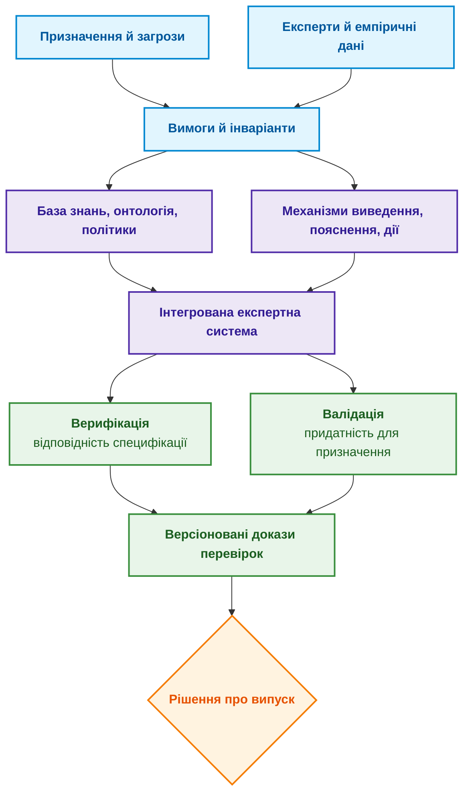
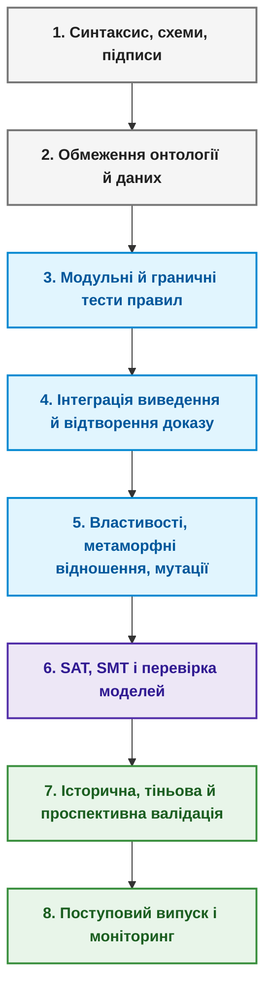
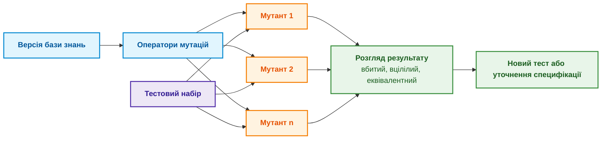
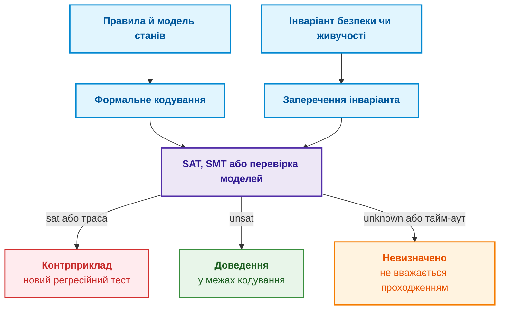
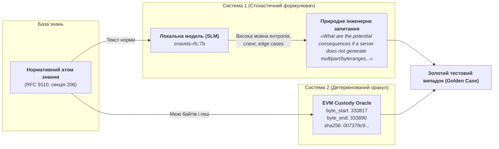

# Глава 23. Верифікація бази знань: як перевірити несуперечливість, повноту та надійність правил

> **Книга:** [Архітектура доказових експертних систем](README.md) · [Частина V: Верифікація, діагностика, навчання та обґрунтування безпеки](part-05-verification-and-learning.md)  
> **Попередня глава:** [Глава 21. Від рекомендації до дії: контроль повноважень і безпечне виконання у виробничому середовищі](ch21-from-recommendation-to-action.md)  
> **Наступна глава:** [Глава 36. Піраміда тестування знань: правила, взаємодії та стійкість відповідей](ch36-knowledge-testing-pyramid-and-variational-calibration.md)  
> **Зміст книги:** [README.md](README.md)  
> **Автор:** [Микола Федчик](about-the-author.md)  
> **Рівень:** середній і поглиблений: розробники експертних систем, інженери знань, інженери з якості  
> **Очікувані результати:** відрізняти верифікацію від валідації; знаходити типові аномалії бази знань; тестувати правила на граничних і невідомих станах; формулювати інваріанти й перевіряти їх перебором скінченної моделі чи SMT-розв'язувачем; оцінювати силу тестів мутаційним аналізом; перевіряти рішення разом із доказом і поясненням; організовувати керований випуск змін бази знань.

## Анотація

Експертна система правильно відповіла на двадцять знайомих запитів, і команда готує нову базу правил до випуску. Уже в роботі з'ясовується, що одне правило ніколи не спрацьовує, два правила утворюють цикл, а зміна одиниці вимірювання дає змогу випустити реліз без чинного тесту безпеки. Приклади були правильними, але база правил виявилася ненадійною.

Ця глава відповідає на запитання: **як переконатися, що правилам бази знань можна довіряти, якщо кілька правильних відповідей цього не доводять?** Теза глави: **довіру дає не кількість зелених прикладів, а набір перевірок різної природи: перевірка форми й посилань, тести кожного правила на граничних станах, інваріанти, перевірені на всіх станах скінченної моделі або розв'язувачем, мутаційний аналіз сили тестів і відтворення доказу разом із рішенням. Кожна перевірка доводить щось лише відносно своєї моделі й припущень, тому рішення про випуск ухвалюють за сукупністю блокувальних критеріїв.**

Глава є навчальним оглядом, а не сертифікаційним звітом. Формальні методи доводять властивості лише відносно моделі та припущень, тестування показує наявність помилок у перевіреній області, але не їхню відсутність, а галузеві стандарти можуть вимагати додаткових незалежних процедур. Усі приклади нижче перевіряють одне правило з [Глави 20](ch20-explanation-engine.md): реліз можна схвалити лише для підписаного артефакту, за підтвердженої відсутності блокувального дефекту і за чинного тесту безпеки; чинний тест може замінити лише виняток, підписаний відповідальним за функціональну безпеку.

## 1. Верифікація і валідація бази знань: різниця між виконанням і змістом

Баррі Боем розрізнив два запитання до програмного продукту: чи правильно ми будуємо продукт і чи будуємо ми правильний продукт [[1]](#src-1). Перше запитання називають верифікацією (*verification*): чи відповідає реалізація задекларованій специфікації. Друге називають валідацією (*validation*): чи придатні сама специфікація й побудована на ній експертна система для реального рішення.

Для бази знань ця різниця особливо помітна. Можна точно реалізувати хибне правило експерта, і верифікація цього не помітить. Можна мати правильне правило, але механізм виведення з помилковим розв'язанням конфліктів між правилами. Тому знання, вилучені від експертів за методами з [Глави 11](ch11-knowledge-elicitation-from-experts.md), потребують валідації на реальних випадках, а доказові пакети з [Глав 16](ch16-expert-systems-architecture.md) і [20](ch20-explanation-engine.md) потребують верифікації відтворенням. Діаграма показує, як обидва процеси сходяться в рішенні про випуск.



Діаграма показує, що верифікація й валідація мають спільний вхід (вимоги) і спільний вихід (версіоновані докази), але відповідають на різні запитання. Окремої уваги потребує еталон, з яким порівнюють відповідь, тобто оракул тесту (*test oracle*). Елейн Вейюкер показала, що для багатьох програм правильну відповідь неможливо або дуже дорого обчислити незалежно, і тоді тестування втрачає звичну опору [[2]](#src-2). Для бази знань із цього випливає практичне правило: оракул теж має походження. Якщо очікувану відповідь у тесті записав той самий автор, що й правило, такий тест корисний як модульний, але не є незалежною валідацією.

## 2. Системний контекст верифікації: взаємодія правил, фактів та механізмів виведення

Перевірити лише файл правил недостатньо, бо рішення експертної системи залежить від багатьох складових:

```math
y = F(x, K, O, P, C, M, R)
```

Позначення:

- $y$ є результатом обчислення, тобто рішенням експертної системи;
- $F$ позначає функцію, що формує рішення з перелічених складових;
- $x$ є зрізом вхідних фактів;
- $K$ є базою знань, $O$ є онтологією, а $P$ є політиками доступу;
- $C$ задає стратегію розв'язання конфліктів між правилами;
- $M$ позначає моделі машинного навчання в конвеєрі, а $R$ є конфігурацією середовища виконання.

Практично ця залежність означає, що зміна аналізатора документів, нормалізатора одиниць чи порогу може змінити рішення без зміни правил. Маніфест тестового прогону фіксує хеші складових, зерно генератора випадкових чисел, політику годинника, зовнішні тестові дані й середовище виконання, якщо воно впливає на результат. Для мовних моделей і наближеного пошуку зберігають виходи кожного етапу, щоб недетермінізм не приховав порушення детермінованих інваріантів.

## 3. Типологія структурних і логічних аномалій бази знань

Перш ніж тестувати поведінку, базу знань перевіряють статично, без запуску на прикладах. Пріс і Шингал описали аномалії бази знань, такі як надлишкові, суперечливі й неповні знання, як симптоми ймовірних помилок і обґрунтували їх виявлення як метод верифікації систем на правилах [[3]](#src-3). На практиці шукають чотири типи аномалій:

- **Мертве правило** ніколи не спрацьовує, бо його передумови несумісні між собою або посилаються на предикат, який жодне джерело не породжує.
- **Надлишкове правило** дублює інше правило або поглинається ним: якщо правило A має ті самі висновки за слабших умов, правило B зайве.
- **Суперечливі правила** за сумісних передумов дають несумісні висновки, наприклад ALLOW і DENY для того самого стану.
- **Цикл залежностей** потребує перевірки семантики, а не автоматичного відхилення. Позитивна рекурсія Datalog може бути правильною; проблема виникає за підтримки без первинної підстави, нестратифікованого заперечення або нескінченного породження станів. Навчальний алгоритм [Глави 16](ch16-expert-systems-architecture.md) перевіряє лише скінченне позитивне замикання.

Статичний аналіз знаходить ці аномалії до будь-якого запуску. Але аномалія є лише симптомом: мертве правило може описувати рідкісну небезпеку, для якої ще немає даних, тому кожну знахідку розглядає власник правила.

## 4. Багаторівнева стратегія перевірок: від синтаксису до випробувань у реальних умовах

Перевірки бази знань утворюють піраміду: від дешевих і швидких на кожну зміну до дорогих і повільних перед випуском. Діаграма показує вісім рівнів.



Вищий рівень не замінює нижчого. Висока точність на історичних випадках не знайде дубльованого ідентифікатора правила, а перевірка схеми не покаже, що правило шкодить призначенню експертної системи. Розгляньмо перші три рівні докладніше.

**Форма й посилання.** На кожну зміну перевіряють, що правила розбираються, типи й одиниці узгоджені, ідентифікатори однозначні, предикати, на які посилаються правила, існують, а обмеження версій, підписи, власник і термін чинності вказані. Поле `valid_until` має бути позначкою часу з часовим поясом, а не рядком, лексикографічне порівняння якого випадково «працює».

**Поняття й дані.** Засоби логічного виведення для OWL знаходять логічні суперечності онтології за семантикою OWL [[4]](#src-4), а SHACL перевіряє, чи граф даних RDF відповідає заданим формам: кратності, типам даних, діапазонам і складнішим обмеженням [[5]](#src-5). Це різні запитання. OWL виходить із припущення відкритого світу, у якому відсутність факту не означає його хибності, тоді як перевірка форми даних потребує замкненого світу. Наприклад, форма для кожного звіту `SafetyTest` може вимагати полів `artifact`, `result`, `performed_at`, `valid_until`, `method_version` і `source_hash`. Звіт SHACL є версіонованим артефактом конвеєра CI, але висновок `sh:conforms = true` доводить лише правильність форми, а не правильність вимірювання.

**Кожне правило окремо.** Кожне правило тестують щонайменше на номінальному позитивному випадку; на випадках, де бракує кожної передумови окремо; на граничних значеннях і різних одиницях; на активному винятку; на невідомих, суперечливих і недоступних даних; на застосовності до версії, часу й контексту. Перевіряють не лише остаточну відповідь, а й очікувані елементи доказу. Для правила

```math
\mathrm{valid\_test} \land \mathrm{signed} \land \neg \mathrm{blocker} \rightarrow \mathrm{allow}
```

- У цьому правилі $`\mathrm{valid\_test}`$ означає, що тест чинний;
- $\mathrm{signed}$ означає, що потрібний підпис наявний;
- $\mathrm{blocker}$ позначає блокувальний дефект, а $\neg$ заперечує його наявність;
- $\land$ означає «і», а $\rightarrow$ читається як «тоді дозволити»;
- $\mathrm{allow}$ є дозволом на дію.

Трьох позитивних фактів недостатньо. Треба перевірити, що стан «невідомо, чи є блокувальний дефект» не трактується як $\neg \mathrm{blocker}$, якщо політика вимагає явного підтвердження відсутності дефекту.

## 5. Метрики покриття правил та межі їхньої показовості

Покриття спрацюванням показує частку правил випуску, які хоча б раз активувалися на тестовому наборі:

```math
C_{\text{fire}} = \frac{|R_f|}{|R|}
```

Складники формули:

- $C_{\text{fire}}$ є часткою покриття спрацюванням у діапазоні від 0 до 1;
- $R$ є множиною правил у випуску, а $R_f$ є підмножиною правил, що спрацювали хоча б раз;
- вертикальні риски $|\cdot|$ означають кількість елементів множини, а дріб ділить кількість спрацьованих правил на загальну кількість правил.

Наприклад, за умовних чисел 8 правил, що спрацювали, із 10 правил у випуску покриття дорівнює $`8/10=0{,}8`$, або 80 %. Це вимірює лише факт спрацювання, не повноту перевірки передумов.

Високе $C_{\text{fire}}$ не означає, що перевірено всі умови: для правила з $m$ передумовами потрібні випадки для кожної умови й кожної межі. Низьке покриття може означати мертве правило, рідкісну небезпеку або слабкий генератор тестів, і ці три причини потребують різних рішень. Корисніша за саме покриття матриця простежуваності, яка пов'язує небезпеку з правилом, тестами й власником:

| Вимога чи небезпека | Правило | Позитивний тест | Негативні й граничні тести | Власник |
|---|---|---|---|---|
| Лише чинний доказ безпеки | `REL-12` | `case-104` | від `case-105` до `case-109` | Безпека |
| Виняток підписує відповідальний за безпеку | `AUTH-7` | `case-205` | від `case-206` до `case-211` | Відповідність вимогам |
| Блокувальний дефект завжди забороняє ALLOW | `REL-2` | немає | властивість `INV-01` | Випуск |

Порожня клітинка матриці не завжди є дефектом, але завжди є видимою прогалиною, яку хтось має свідомо прийняти або закрити.

## 6. Інваріанти, граничні стани та генерація контрприкладів

Тести на прикладах фіксують відомі випадки. Тестування властивостями (*property-based testing*), яке популяризував інструмент QuickCheck Класена й Г'юза [[6]](#src-6), працює інакше: генератор створює багато допустимих і навмисно недопустимих станів, а перевірка застосовує до кожного стану інваріант. Головний інваріант правила релізу:

```math
\forall s:\ \mathrm{blocker}(s) \neq \mathrm{no} \Rightarrow \mathrm{decision}(s) \neq \mathrm{ALLOW}
```

Прочитаємо умови по черзі:

- $s$ є станом експертної системи, а $\forall$ означає «для кожного» такого стану;
- $\mathrm{blocker}(s)$ є статусом блокувального дефекту в стані $s$;
- $\neq$ означає «не дорівнює», тому $\mathrm{blocker}(s) \neq \mathrm{no}$ охоплює і наявний дефект, і невідомий стан;
- $\Rightarrow$ означає «якщо, то», а $\mathrm{decision}(s) \neq \mathrm{ALLOW}$ забороняє дозвіл у такому стані.

Усі наступні властивості також слід читати як окремі інваріанти:

```math
\mathrm{decision}(s) = \mathrm{ALLOW} \Rightarrow \mathrm{valid\_test}(s) \lor \mathrm{authorized\_waiver}(s)
```

де:

- $\mathrm{decision}(s)$ є рішенням експертної системи у стані $s$, а $\mathrm{ALLOW}$ означає дозвіл на дію;
- $`\mathrm{valid\_test}(s)`$ означає наявність чинного тесту, а $`\mathrm{authorized\_waiver}(s)`$ означає належно дозволений виняток;
- $\lor$ означає «або», а $\Rightarrow$ означає «якщо, то»: дозвіл допускається лише за чинного тесту або авторизованого винятку.

Отже, правило не дозволяє дію без чинного тесту, якщо немає належно авторизованого винятку.

```math
\mathrm{retract}(e, s) \Rightarrow e \notin \mathrm{support}\bigl(\mathrm{recompute}(s)\bigr)
```

Позначення:

- $e$ є фактом, який відкликають, а $s$ є станом до перерахунку;
- $\mathrm{retract}(e,s)$ означає відкликання факту $e$ у стані $s$;
- $\mathrm{recompute}(s)$ є станом після повторного обчислення, а $\mathrm{support}$ позначає множину фактів, що обґрунтовують висновок;
- $\notin$ означає «не належить», а $\Rightarrow$ пов'язує відкликання з обов'язковою відсутністю факту серед підстав.

Практично відкликаний факт не може лишитися підставою висновку після того, як база знань перерахувала його залежності.

```math
\mathrm{unauthorized}(u, e) \Rightarrow \mathrm{output}(u, s) \text{ не залежить від закритого факту } e
```

- $u$ є користувачем, $e$ є закритим фактом, а $s$ є станом запиту;
- $\mathrm{unauthorized}(u,e)$ означає, що користувач $u$ не має права на факт $e$;
- $\mathrm{output}(u,s)$ є відповіддю, яку отримує користувач $u$ у стані $s$;
- $\Rightarrow$ пов'язує заборону доступу з незалежністю відповіді від закритого факту.

Перша властивість вимагає підстави для дозволу, друга вимагає, щоб відкликаний факт зникав з обґрунтування після перерахунку, а третя є властивістю інформаційного потоку: відповідь користувачеві без доступу до факту $e$ не повинна від $e$ залежати. Третю властивість важко довести для всієї експертної системи, тому в тестах її наближають парними входами, що різняться лише закритим фактом, і контрольними маркерами витоку. Якщо генератор знайшов порушення, процедура зменшення (*shrinking*) скорочує його до мінімального контрприкладу, наприклад «дефект є плюс один застарілий прапорець кешу».

Випадковість не замінює знання предметної області. Генератор має знати допустимі залежності між полями, інакше витратить бюджет на неможливі стани або ніколи не породить рідкісної комбінації. Коли простір станів малий, генератор можна замінити повним перебором, і тоді перевірка інваріанта стає доведенням у межах моделі. Наступний розділ поєднує такий перебір із перевіркою сили самих тестів.

## 7. Мутаційне тестування та оцінка чутливості тестового набору

Тести можуть бути зеленими лише тому, що не перевіряють нічого суттєвого. Мутаційне тестування, ідею якого запропонували Де Мілло, Ліптон і Сейворд [[7]](#src-7), навмисно вносить у правило типові дефекти й перевіряє, чи помітять їх тести. Для бази знань типові оператори мутацій такі: заміна `>` на `>=`, `AND` на `OR`, `ALLOW` на `DENY`; видалення передумови чи винятку; заміна годин на дні; зсув порогу чи інтервалу чинності; підміна ролі, орендаря чи версії джерела; інверсія пріоритету правил; розрив зв'язку походження.

Мутант вважається вбитим, якщо хоча б один тест падає. Мутаційний бал дорівнює

```math
MS = \frac{M_{\text{killed}}}{M_{\text{total}} - M_{\text{equivalent}}}
```

Розшифрування величин:

- $MS$ є мутаційним балом, безрозмірною часткою від 0 до 1;
- $M_{\text{killed}}$ є кількістю мутантів, на яких хоча б один тест виявив дефект;
- $M_{\text{total}}$ є загальною кількістю створених мутантів, а $M_{\text{equivalent}}$ є кількістю еквівалентних мутантів, що не змінюють семантики правила;
- знаменник виключає еквівалентних мутантів, які не може виявити жоден тест.

На практиці вищий бал означає, що тестовий набір виявляє більшу частку змістовних мутацій, але не доводить відсутності всіх дефектів. Джа й Гарман у своєму огляді наголошують, що розпізнавання еквівалентних мутантів є однією з головних проблем методу, бо в загальному випадку воно алгоритмічно нерозв'язне [[8]](#src-8). Тому оголошувати 100 % без процедури розгляду вцілілих мутантів не можна, а вцілілий критичний мутант, наприклад з видаленою перевіркою повноважень підписанта винятку, блокує випуск незалежно від загального балу. Діаграма показує цей процес.

Формула має зміст за додатного знаменника й відомої класифікації мутантів. Невалідний кандидат, помилка запуску й непідтверджена еквівалентність мають окремі статуси; їх не приховують як «еквівалентні». Тайм-аут зараховують як виявлений дефект лише за перевіреної часової властивості й відтворюваного порушення, а не через випадкове перевантаження стенду. Якщо придатних нееквівалентних мутантів немає, бал невизначений, не 100 %.

> [!WARNING] Семантична пастка еквівалентних мутантів (Equivalent Mutants) у сертифікації
> Визначення того, чи є вцілілий мутант семантично еквівалентним (тобто таким, що поводиться ідентично за будь-яких допустимих входів), є алгоритмічно нерозв'язною задачею в загальному випадку (зводиться до проблеми зупинки або перевірки загальнозначущості формули першого порядку).
> Під час сертифікації за стандартами ISO 26262 ASIL-D чи DO-178C DAL A небезпечно автоматично списувати невбитих мутантів на «еквівалентність», аби штучно отримати $MS = 100\%$:
> - Якщо мутація `signer == safety_owner` змінена на `signer != nil`, і жоден тест не впав — це не еквівалентність, а критична діра в наборі тестів, яка дозволяє неавторизований випуск.
> - Кожен невбитий мутант має проходити обов'язковий інженерний триаж (*triage*): або доводиться формальна еквівалентність за допомогою SMT-доведення, або створюється новий цільовий тест-кейс.



Скінченна навчальна модель має 36 станів: чинність тесту, підпис артефакту, три стани дефекту й три стани винятку. Булеві прапорці та роль у цій моделі означають уже перевірені входи; вони не реалізують перевірки справжнього підпису, редакції й доступу. Програма порівнює три приклади з повним перебором трьох заборонних інваріантів і явного еталона дозволених станів. Без позитивного еталона правило «завжди DENY» пройшло б усі заборони. Еталон нижче є авторською навчальною таблицею, не незалежною валідацією предметної політики.

<details>
<summary>Приклад мовою Go: перевірка правила випуску на всіх 36 станах</summary>

```go
package main

import "fmt"

type Blocker int

const (
	NoBlocker Blocker = iota
	HasBlocker
	UnknownBlocker // даних про дефекти немає
)

func (b Blocker) String() string { return [...]string{"немає", "є", "невідомо"}[b] }

type Waiver int

const (
	NoWaiver Waiver = iota
	ByProjectLead
	BySafetyOwner
)

func (w Waiver) String() string {
	return [...]string{"немає", "керівник проєкту", "відповідальний за безпеку"}[w]
}

type State struct {
	TestValid, Signed bool
	Blocker           Blocker
	Waiver            Waiver
}

type Rule func(s State) bool // true означає ALLOW

// release є правильним правилом: підписаний артефакт, підтверджена відсутність
// блокувального дефекту, чинний тест або виняток від відповідального за безпеку.
func release(s State) bool {
	return s.Signed && s.Blocker == NoBlocker && (s.TestValid || s.Waiver == BySafetyOwner)
}

var allowedStates = map[State]bool{
	{true, true, NoBlocker, NoWaiver}:       true,
	{true, true, NoBlocker, ByProjectLead}:  true,
	{true, true, NoBlocker, BySafetyOwner}:  true,
	{false, true, NoBlocker, BySafetyOwner}: true,
}

// invariants повертає опис першого порушеного інваріанта або порожній рядок.
func invariants(s State, allow bool) string {
	switch {
	case allow && s.Blocker != NoBlocker:
		return "I1: ALLOW без підтвердженої відсутності дефекту"
	case allow && !s.TestValid && s.Waiver != BySafetyOwner:
		return "I2: ALLOW без чинного тесту й належного винятку"
	case allow && !s.Signed:
		return "I3: ALLOW непідписаного артефакту"
	case !allow && allowedStates[s]:
		return "I4: DENY для дозволеного стану навчальної таблиці"
	}
	return ""
}

// allStates перебирає всі 2·2·3·3 = 36 станів скінченної моделі.
func allStates() []State {
	var out []State
	for _, tv := range []bool{false, true} {
		for _, sg := range []bool{false, true} {
			for b := NoBlocker; b <= UnknownBlocker; b++ {
				for w := NoWaiver; w <= BySafetyOwner; w++ {
					out = append(out, State{tv, sg, b, w})
				}
			}
		}
	}
	return out
}

// examples є невеликим набором прикладів, яким команда перевіряла правило.
var examples = []struct {
	s     State
	allow bool
}{
	{State{true, true, NoBlocker, NoWaiver}, true},
	{State{true, true, HasBlocker, NoWaiver}, false},
	{State{false, true, NoBlocker, NoWaiver}, false},
}

func killedByExamples(r Rule) bool {
	for _, e := range examples {
		if r(e.s) != e.allow {
			return true
		}
	}
	return false
}

func firstViolation(r Rule) (State, string, bool) {
	for _, s := range allStates() {
		if v := invariants(s, r(s)); v != "" {
			return s, v, true
		}
	}
	return State{}, "", false
}

func main() {
	if _, v, bad := firstViolation(release); bad {
		fmt.Println("правильне правило порушує інваріант:", v)
		return
	}
	fmt.Println("правильне правило: 36 станів, порушень немає")

	mutants := []struct {
		name string
		r    Rule
	}{
		{"M1 видалено перевірку дефекту", func(s State) bool { return s.Signed && (s.TestValid || s.Waiver == BySafetyOwner) }},
		{"M2 невідомо трактується як «немає»", func(s State) bool {
			return s.Signed && s.Blocker != HasBlocker && (s.TestValid || s.Waiver == BySafetyOwner)
		}},
		{"M3 будь-який виняток приймається", func(s State) bool {
			return s.Signed && s.Blocker == NoBlocker && (s.TestValid || s.Waiver != NoWaiver)
		}},
		{"M4 AND замінено на OR", func(s State) bool { return s.Signed || (s.Blocker == NoBlocker && s.TestValid) }},
		{"M5 переставлено умови", func(s State) bool {
			return (s.Waiver == BySafetyOwner || s.TestValid) && s.Blocker == NoBlocker && s.Signed
		}},
		{"M6 завжди DENY", func(s State) bool { return false }},
	}
	killed, killedEx := 0, 0
	for _, m := range mutants {
		ex := killedByExamples(m.r)
		if ex {
			killedEx++
		}
		s, v, inv := firstViolation(m.r)
		fmt.Printf("%-36s | приклади: %-5v | інваріанти: %-5v\n", m.name, ex, inv)
		if inv {
			killed++
			fmt.Printf("    %s; контрприклад: %+v\n", v, s)
		}
	}
	fmt.Printf("мутаційний бал без еквівалентного M5: приклади %d/5, властивості %d/5\n", killedEx, killed)
}
```

Тест перевіряє всі стани еталона й те, що вето для всіх входів не видається за правильну реалізацію. Команда: `go test -v main.go main_test.go`.

```go
package main

import "testing"

func TestReleaseOracle(testCase *testing.T) {
	if len(allStates()) != 36 || len(allowedStates) != 4 {
		testCase.Fatal("wrong finite-model domain")
	}
	for _, state := range allStates() {
		if release(state) != allowedStates[state] {
			testCase.Fatalf("decision-table mismatch: %+v", state)
		}
		if violation := invariants(state, release(state)); violation != "" {
			testCase.Fatal(violation)
		}
	}
	denyAll := func(state State) bool { return false }
	if _, _, detected := firstViolation(denyAll); !detected {
		testCase.Fatal("always-DENY mutant survived")
	}
	equivalent := func(state State) bool {
		return (state.Waiver == BySafetyOwner || state.TestValid) && state.Blocker == NoBlocker && state.Signed
	}
	if _, _, detected := firstViolation(equivalent); detected {
		testCase.Fatal("equivalent pure rule reported as defective")
	}
}
```

</details>

Програма виводить:

<details>
<summary>Дані або результат прикладу</summary>

```text
правильне правило: 36 станів, порушень немає
M1 видалено перевірку дефекту        | приклади: true  | інваріанти: true
    I1: ALLOW без підтвердженої відсутності дефекту; контрприклад: {TestValid:false Signed:true Blocker:є Waiver:відповідальний за безпеку}
M2 невідомо трактується як «немає»   | приклади: false | інваріанти: true
    I1: ALLOW без підтвердженої відсутності дефекту; контрприклад: {TestValid:false Signed:true Blocker:невідомо Waiver:відповідальний за безпеку}
M3 будь-який виняток приймається     | приклади: false | інваріанти: true
    I2: ALLOW без чинного тесту й належного винятку; контрприклад: {TestValid:false Signed:true Blocker:немає Waiver:керівник проєкту}
M4 AND замінено на OR                | приклади: true  | інваріанти: true
    I2: ALLOW без чинного тесту й належного винятку; контрприклад: {TestValid:false Signed:true Blocker:немає Waiver:немає}
M5 переставлено умови                | приклади: false | інваріанти: false
M6 завжди DENY                       | приклади: true  | інваріанти: true
    I4: DENY для дозволеного стану навчальної таблиці; контрприклад: {TestValid:false Signed:true Blocker:немає Waiver:відповідальний за безпеку}
мутаційний бал без еквівалентного M5: приклади 3/5, властивості 5/5
```

</details>


Три приклади виявили три з п'яти змістовних мутацій, але пропустили невідомий дефект (M2) й неналежний виняток (M3). Повний набір властивостей виявив усі п'ять, зокрема надмірну відмову M6. `firstViolation` повертає перший стан за порядком перебору, не мінімальний контрприклад: процедура зменшення тут не реалізована. M5 еквівалентний у цій чистій булевій моделі без побічних ефектів. 100 % для п'яти обраних дефектів не доводить відсутності інших; 36 станів не охоплюють часових меж, криптографії, кешу й зміни політики під час виконання.

### 7.1. Скорочення набору зі збереженням контрольних перевірок

Регресійний набір росте з кожним виправленим дефектом, і повний прогін на кожну зміну бази знань з часом стає дорогим. Шарма й Чоудхарі запропонували мінімізацію тестового набору кластеризацією DB K-means: метод відокремлює випадки-викиди від решти, у кожній групі схожих випадків прибирає надлишкові й об'єднує залишки в менший набір, що зберігає покриття початкового набору [[9]](#src-9). Для бази правил «те саме покриття» варто перевіряти не метрикою покриття коду, а мутаційним балом: скорочений набір допускають до щоденних прогонів, лише якщо скорочений набір вбиває тих самих змістовних мутантів, що й повний.

```math
\mathrm{Accept}(T') \iff T_{\mathrm{crit}} \subseteq T' \subseteq T \;\land\; \mathrm{Killed}(T') = \mathrm{Killed}(T)
```

Умови допуску скороченого набору:

- $T$ є повним регресійним набором, а $T'$ є скороченим набором-кандидатом;
- $T_{\mathrm{crit}}$ є критичними випадками, які не видаляють ніколи: інваріанти безпеки, відтворені інциденти й викиди, знайдені кластеризацією;
- $\mathrm{Killed}(T)$ є множиною нееквівалентних мутантів, яких вбиває набір $T$;
- $\subseteq$ означає «є підмножиною», $\land$ означає логічне «і», а $\iff$ означає «тоді й лише тоді».

Рівність множин виявлених мутантів сильніша за рівність числового бала: два набори можуть мати однаковий бал і пропускати різні дефекти. Критерій стосується лише зафіксованого каталогу мутацій та критичних випадків, не всіх майбутніх помилок.

Уявний розрахунок показує механізм: повний набір із 1200 випадків виявляє 46 мутантів, скорочений із 355 лише 45. Повернення трьох граничних тестів може відновити ті самі 46 виявлень, якщо повторний прогін це підтвердить. Числа не є результатом експерименту цієї книги. Час не слід автоматично масштабувати за кількістю випадків: тривалість і підготовка тестів можуть відрізнятися. Залишають повний контроль перед випуском і переоцінюють скорочення після зміни правил або операторів мутації.

## 8. Метаморфні та диференційні методи перевірки знань

Коли точна очікувана відповідь дорога чи невідома, перевіряють відношення між відповідями на пов'язані входи. Метаморфне тестування, огляд якого зробили Чень та співавтори [[10]](#src-10), формулює такі відношення явно. Перестановка нерелевантних доказів не повинна змінювати рішення:

```math
F(\mathrm{permute}_{\text{irrelevant}}(x)) = F(x)
```

- $x$ є набором доказів, а $F$ є функцією рішення експертної системи;
- $\mathrm{permute}_{\text{irrelevant}}$ переставляє нерелевантні докази, не змінюючи їхнього складу;
- знак $=$ вимагає однакового рішення до й після перестановки.

Отже, порядок нерелевантних доказів не має змінювати результат.

Якщо політика забороняє подвійний підрахунок, додавання дубліката джерела не повинно змінювати впевненості:

```math
\mathrm{confidence}(x \cup \mathrm{duplicate}(e)) = \mathrm{confidence}(x)
```

Символи формули мають такий зміст:

- $x$ є початковим набором доказів, а $e$ є джерелом доказу;
- $\mathrm{duplicate}(e)$ позначає додану копію того самого джерела;
- $\cup$ означає об'єднання наборів, $\mathrm{confidence}$ є оцінкою впевненості, а $=$ вимагає незмінності оцінки.

Отже, копія вже врахованого джерела не має вдруге підвищити впевненість експертної системи.

Для доступу відповідь не повинна ставати детальнішою після зменшення прав:

```math
\mathrm{ACL}(u_2) \subseteq \mathrm{ACL}(u_1) \Rightarrow \mathrm{disclosure}(u_2, x) \subseteq \mathrm{disclosure}(u_1, x)
```

- $u_1$ і $u_2$ є користувачами, а $x$ є вхідними даними запиту;
- $\mathrm{ACL}(u)$ позначає набір дозволів користувача $u$, а $\subseteq$ означає «є підмножиною»;
- $\mathrm{disclosure}(u,x)$ є набором відомостей, які відповідь розкриває користувачеві $u$ для запиту $x$;
- $\Rightarrow$ означає, що менші права не дають більшого розкриття.

Практичний наслідок: користувач із меншим набором дозволів не має отримати більше відомостей у відповіді.

Такі відношення застосовують лише там, де вони справді є інваріантами. У немонотонній логіці додавання нового факту може законно скасувати висновок, тому безумовний тест монотонності був би хибним.

Диференційне тестування запускає той самий маніфест на двох реалізаціях і порівнює рішення, статус та перевірені залежності. Для категоріальних відповідей ALLOW і DENY різниця не є арифметичним відніманням: розбіжність фіксують явним предикатом нерівності. Допустимі альтернативні доведення визначають заздалегідь. Згода двох реалізацій не доводить правильності: вони можуть повторювати ту саму помилку специфікації.

Для мовних компонентів експертної системи (розбір запитання, пошук, мовна модель) технічний звіт ISO/IEC TR 29119-11 рекомендує ті самі прийоми, що й для інших систем на основі штучного інтелекту: метаморфне, порівняльне (*back-to-back*) і A/B-тестування та перевірку на змагальних входах [[11]](#src-11). Таблиця перелічує метаморфні відношення, корисні саме для запитань до експертної системи.

| Відношення | Перетворення входу | Очікувана поведінка | Що виявляє |
|---|---|---|---|
| Інваріантність до перефразування | схвалено еквівалентне запитання за того самого контексту | те саме рішення й допустимі перевірені докази | залежність від формулювання |
| Міжмовна інваріантність | те саме запитання українською й англійською | те саме рішення | розбіжність мовних моделей і словників |
| Стійкість до нерелевантного контексту | до запитання додано сторонній абзац | рішення не змінюється | відволікання мовної моделі |
| Інваріантність до порядку фрагментів | знайдені фрагменти переставлено | рішення не змінюється | залежність від позиції фрагмента в контексті мовної моделі |
| Чутливість до заперечення | в умову додано чи з умови прибрано «не» | рішення змінюється або експертна система відмовляє | ігнорування заперечень |

Чутливість до заперечення перевіряють за еталонним наміром: додане «не» не завжди змінює остаточний вердикт, якщо незалежний блокер однаково забороняє обидва варіанти. Тому порівнюють також логічну форму й підстави, а не вимагають довільного перевертання ALLOW/DENY. Змагальні входи перевіряють межу між даними й командами ([Глава 21](ch21-from-recommendation-to-action.md)): текстова ін'єкція не має змінити повноваження або запустити несхвалену дію [[12]](#src-12). Розкриття закритого змісту контролює окрема політика [[13]](#src-13). Якщо політика дозволяє лише агрегований вердикт, його залежність від закритих фактів не дорівнює дозволу показати ці факти; парні тести фіксують точну межу дозволеного розкриття.

## 9. Формальні методи: доведення інваріантів та пошук забороненого стану

Набір правил можна закодувати як обмеження й запитати розв'язувач, чи існує стан, де порушено інваріант. Для блокувального дефекту запитання звучить так:

```math
\exists s:\ \mathrm{blocker}(s) \land \mathrm{decision}(s) = \mathrm{ALLOW}\ ?
```

Розберімо запит:

- $\exists s$ означає «чи існує стан $s$»;
- $\mathrm{blocker}(s)$ означає, що в стані є блокувальний дефект;
- $\land$ вимагає одночасного виконання умов, а $=$ перевіряє рівність;
- $\mathrm{decision}(s)=\mathrm{ALLOW}$ означає, що експертна система дозволяє дію попри дефект;
- знак питання позначає запит до розв'язувача, а не частину логічної умови.

Відповідь `sat` дає контрмодель, тобто конкретний стан порушення. Відповідь `unsat` доводить, що такого стану немає, але лише **в межах кодування**: якщо модель не врахувала кеш, час чи пріоритет винятків, доведення не поширюється на промислову реалізацію. Розв'язувачі SMT, як-от Z3 [[14]](#src-14), особливо корисні там, де перебір неможливий: в арифметиці, одиницях, позначках часу й обмеженнях ролей.

Повернімося до третьої проблеми з початку глави: зміна одиниці вимірювання дала змогу випустити реліз без чинного тесту. Програма мовою Python кодує правило мовою SMT-LIB і запускає Z3 через модуль `z3` (перевірено з версією модуля 5.1.0). У правилі з помилкою термін дії звіту в годинах порівнюється з днем релізу, а у виправленому правилі день релізу спершу переводиться в години.

<details>
<summary>Приклад мовою Python</summary>

```python
import z3

COMMON = """
(reset)
(declare-const release_day Int)        ; день релізу від початку проєкту
(declare-const valid_until_hour Int)   ; термін дії звіту, години від початку проєкту
(declare-const blocker Bool)
(declare-const signed Bool)
(assert (>= release_day 0))
(assert (>= valid_until_hour 0))
"""

BUGGY = "(define-fun valid_test () Bool (>= valid_until_hour release_day))"         # години порівнюються з днями
FIXED = "(define-fun valid_test () Bool (>= valid_until_hour (* 24 release_day)))"  # одиниці узгоджено

QUERY = """
(define-fun allow () Bool (and valid_test signed (not blocker)))
; заперечення інваріанта: реліз дозволено, хоча звіт прострочений
(assert allow)
(assert (< valid_until_hour (* 24 release_day)))
(check-sat)
"""

ctx = z3.main_ctx().ref()
for name, rule in [("з помилкою одиниць", BUGGY), ("виправлене правило", FIXED)]:
    verdict = z3.Z3_eval_smtlib2_string(ctx, COMMON + rule + QUERY).strip()
    print("==", name, "->", verdict)
    if verdict == "sat":
        model = z3.Z3_eval_smtlib2_string(ctx, "(get-value (release_day valid_until_hour blocker signed))")
        print(model.strip())
```

</details>


Програма виводить:

<details>
<summary>Дані або результат прикладу</summary>

```text
== з помилкою одиниць -> sat
((release_day 1)
 (valid_until_hour 23)
 (blocker false)
 (signed true))
== виправлене правило -> unsat
```

</details>


Для правила з помилкою Z3 знайшов контрприклад: звіт чинний до 23-ї години проєкту, а реліз запланований на перший день, тобто на 24-ту годину. Звіт прострочений на годину, але правило з помилкою порівнює 23 з 1 і дозволяє реліз. Для виправленого правила розв'язувач довів, що стану порушення немає. Важливо, що контрприклад знайдено не перебором (цілі числа необмежені), а розв'язуванням обмежень, і що він мінімально простий, тому його легко перетворити на регресійний тест.

У цій моделі день є рівно 24 годинами від спільної точки відліку; календарні дати, часові пояси й включення кінцевої межі чинності потребують окремої конвенції. Z3 не зобов'язаний повертати найменшу контрмодель без задачі мінімізації. Виконаний приклад перевіряє одну помилку одиниць, не весь часовий контракт випуску.

Для робочих процесів із часом корисні темпоральні властивості, описані в [Главі 14](ch14-requirements-detection-and-formalization.md). Для дій із [Глави 21](ch21-from-recommendation-to-action.md) властивість живучості звучить так:

```math
\forall a:\ \Box\bigl(\mathrm{committed}(a)\Rightarrow\Diamond(\mathrm{verified}(a)\lor\mathrm{safe\_hold}(a))\bigr).
```

У формулі стоять такі величини:

- $\Box$ означає «завжди» на всіх наступних станах, а $\Diamond$ означає «колись у майбутньому»;
- $a$ є ідентифікатором дії, а $\forall a$ вимагає властивості для кожної дії;
- $\mathrm{committed}(a)$ позначає фіксацію дії $a$, $\mathrm{verified}(a)$ є підтвердженим результатом саме цієї дії, а $`\mathrm{safe\_hold}(a)`$ є її утриманням без подальших автономних кроків;
- $\Rightarrow$ означає «якщо, то», а $\lor$ означає «або».

Після фіксації кожна дія має зрештою отримати підтвердження або перейти в утримання; результат іншої дії цього зобов'язання не закриває. TLA+ [[15]](#src-15) дає мову для такого опису переходів. Локальний таймер може забезпечити утримання навіть за постійної недоступності зовнішнього сервісу, якщо сам виконавець і журнал продовжують працювати. Тому припущення доступності й справедливості формулюють для конкретного маршруту, не вимагають зовнішньої відповіді для обох альтернатив. Формула не задає строку завершення й не доводить фізичної безпеки стану утримання; обидві властивості перевіряють окремо.



Відповідь `unknown` чи тайм-аут розв'язувача не можна перетворювати на проходження. Кодування, версія розв'язувача, його параметри й межі моделі є частиною доказів перевірки.

## 10. Відтворюваність виведення та сумісна верифікація пояснень

Два різні дефекти можуть випадково дати правильний результат DENY. Тому очікуваний результат тесту містить не лише рішення, а й епістемічний статус; корінь доказу й допустимі альтернативні докази; використані правила й факти; відсутні передумови чи активні винятки; версії знань, політик, моделей і зрізу; елементи пояснення та клас розкриття інформації; для дій точний контракт дії або заборону на нього. Засіб відтворення перевіряє кожну вершину й кожне ребро графа доведення $P$:

```math
\mathrm{ValidProof}(P,K,s)=\mathrm{RootMatches}(P,s)\land\mathrm{AnchoredSupport}(P,K,s)\land\bigwedge_{v\in P}\mathrm{ValidNode}(v,K,s)\land\bigwedge_{a\in\mathrm{Applications}(P)}\mathrm{ValidApplication}(a,K,s).
```

Кожна величина означає таке:

- $P$ є графом доказу, $K$ є версією бази знань, а $s$ є станом, для якого перевіряють доказ;
- $\mathrm{RootMatches}$ перевіряє непорожній корінь і відповідність заявленому висновку; $\mathrm{AnchoredSupport}$ вимагає підтримки довіреними посилками, не циклом без підстав;
- $\mathrm{ValidProof}(P,K,s)$ означає проходження заданого договору перевірки; $\bigwedge$ вимагає успіху для кожного елемента;
- $\mathrm{ValidNode}$ перевіряє вершину $v$, а $\mathrm{Applications}(P)$ містить повні застосування правил;
- $\mathrm{ValidApplication}$ перевіряє для застосування $a$ версію правила, всі передумови разом, підстановку, область і висновок. Окремі ребра не замінюють цієї перевірки.

Для правила «A і B дають C» наявність A не підтверджує C без B. Порожній граф не стає доведенням через істинність порожньої кон'юнкції. Перевіряють також схвалення й застосовність посилок; чинний історичний доказ не відновлює сьогодні відкликаного доступу до його змісту.

Відповідь мовної моделі порівнюють не за лексичною схожістю, а прив'язуючи її твердження до проміжного представлення й доказу, як описано в [Главах 19](ch19-from-question-to-evidence.md) і [20](ch20-explanation-engine.md). Інакше правильна мітка з вигаданим обґрунтуванням пройде тест.

### 10.1. Маніфест середовища та відтворюваності відповіді

Граф доказу перевіряє логіку відповіді, але не умови, за яких відповідь отримано. Щоб відтворити відповідь через місяці, експертна система записує для кожної відповіді маніфест запуску (*answer run manifest*): мінімальний набір ідентифікаторів, без якого повторний запуск неможливо порівняти з оригіналом. Таблиця показує поля такого маніфесту.

| Поле маніфесту | Приклад значення | Що відтворює |
|---|---|---|
| версія механізму виведення | номер випуску й хеш збірки | правила й поведінку рушія |
| покоління пакета знань | ідентифікатор покоління ([Глава 32](ch32-high-performance-knowledge-packs-mmap-and-harvesting.md)) | точний стан знань |
| мовна модель | назва, хеш ваг, квантування | генерацію тексту |
| модель векторних представлень | назва, версія, розмірність вектора | пошук кандидатів |
| версія індексу й параметри пошуку | ідентифікатор збірки, кількість кандидатів, пороги, ваги, фільтри | набір знайдених фрагментів |
| шаблон запиту до мовної моделі | версія й хеш шаблону | контекст генерації |
| параметри декодування | температура, зерно генератора випадкових чисел | недетерміновану частину генерації |
| докази відповіді | упорядковані ідентифікатори фрагментів і хеші їхнього вмісту | граф доказу |

Відтворення повторно виконує запит за маніфестом і порівнює новий результат з оригіналом. Кожне порівняння потрапляє в один із трьох класів: точний збіг, рівноцінна відповідь (те саме рішення й ті самі докази за іншого формулювання тексту) і розбіжність. Частка розбіжностей стає вимірюваною характеристикою експертної системи.

```math
R_{\mathrm{div}} = \frac{N_{\mathrm{div}}}{N_{\mathrm{exact}} + N_{\mathrm{equiv}} + N_{\mathrm{div}}}
```

Позначення частки розбіжностей:

- $N_{\mathrm{exact}}$ є кількістю відтворень із точним збігом відповіді;
- $N_{\mathrm{equiv}}$ є кількістю відтворень із рівноцінною відповіддю;
- $N_{\mathrm{div}}$ є кількістю відтворень із розбіжністю рішення чи доказів;
- $R_{\mathrm{div}}$ є часткою розбіжностей від 0 до 1.

Приклад. З 500 відтворених відповідей 430 збіглися точно, 62 виявилися рівноцінними, а 8 розійшлися, тож частка розбіжностей становить 8 / 500 = 0,016, тобто 1,6 %. Кожну розбіжність розбирають окремо. Якщо причиною є поле, якого немає в маніфесті (наприклад, версія драйвера прискорювача), дефект має маніфест, а не модель. Якщо причиною є недетермінований компонент, рішення про допустимість ухвалюють за режимом роботи: для строгого режиму з цитатами або відмовою ([Глава 28](ch28-dual-mode-expert-systems.md)) допустима лише нульова частка розбіжностей, а для дорадчого режиму допуск оголошують заздалегідь. Для систем штучного інтелекту високого ризику Регламент ЄС 2024/1689 вимагає автоматичного журналювання подій протягом усього життя системи (стаття 12) [[16]](#src-16). Маніфест запуску є технічною формою такого журналу для експертної системи, але сам маніфест не доводить відповідності регламенту.

## 11. Верифікація гібридних neuro-symbolic конфігурацій

Пошук, переранжування, моделі текстового слідування, класифікатори й мовні моделі роблять ймовірнісні помилки. Їх оцінюють і поетапно, і наскрізно, на заморожених наборах з ізоляцією за часом і групами та на зрізах загроз, як описано в [Главах 25](ch25-how-expert-systems-learn.md), [19](ch19-from-question-to-evidence.md) і [12](ch12-linguistic-analysis-and-local-models.md). Символьна коректність не компенсує пропуску пошуку: правило не виведе твердження, якого конвеєр не побачив. І навпаки, висока повнота пошуку не компенсує обходу політики доступу. Тому рішення про випуск є кон'юнкцією блокувальних критеріїв, а не однією середньою метрикою:

```math
\mathrm{Release} = \mathrm{SchemaPass} \land \mathrm{InvariantsPass} \land \mathrm{SecurityPass} \land \mathrm{EvidenceQualityPass} \land \mathrm{NoBlockingRegression}
```

Розшифрування умов:

- $\mathrm{Release}$ означає допуск версії до випуску;
- $\mathrm{SchemaPass}$ означає проходження перевірки схеми, $\mathrm{InvariantsPass}$ означає проходження перевірки інваріантів;
- $\mathrm{SecurityPass}$ означає проходження перевірки безпеки, $\mathrm{EvidenceQualityPass}$ означає достатню якість доказів;
- $\mathrm{NoBlockingRegression}$ означає відсутність блокувальної регресії;
- $\land$ означає логічне «і», тому для випуску мають пройти всі п'ять умов.

Читається так: версію допускають до випуску лише тоді, коли пройдено кожну перевірку й немає блокувальної регресії.

Для статистичних метрик порівнюють парну різницю $\Delta = m_{\text{candidate}} - m_{\text{baseline}}$ з довірчим інтервалом і заздалегідь визначають допустимий запас невідставання (*non-inferiority margin*). Дрор та співавтори показали, що в обробці природної мови статистичну значущість різниці між системами часто не перевіряють або перевіряють невідповідним тестом, і запропонували правила вибору тесту [[17]](#src-17). Проте статистика не скасовує нульової толерантності: один допущений витік між правами доступу чи одна небезпечна дія блокує випуск незалежно від довірчого інтервалу.

## 12. Регресійне тестування на історичних прецедентах та контроль витоку

Еталонні випадки легко забруднити: автори правил бачать ці випадки й підганяють під них правила. Тому потрібні окремі набори:

- набір для розроблення, на якому команда працює щодня;
- регресійний набір для відомих дефектів;
- запечатаний підтверджувальний набір, недоступний під час налаштування правил;
- проспективні й тіньові випадки, зібрані після заморожування версії;
- набір атак для безпеки й рідкісних небезпек.

Випадки групують за спільним джерелом, інцидентом чи виробом, щоб майже однакові фрагменти не потрапили одночасно в набір для розроблення й підтверджувальний набір. Крім того, відтворення історичного рішення не завжди є правильним оракулом, бо минуле рішення людини могло бути помилковим. Тому для кожного випадку окремо зберігають зафіксований результат, висновок експертного розгляду й нормативно очікуване рішення.

## 13. Процедура керованого внесення змін та версіонування бази правил

Зміна знань потребує процесу, схожого на перегляд коду: різниця версій, обґрунтування, джерело, власник, перелік зачеплених тверджень, правил і тестів, схвалення й підписаний маніфест. Діаграма показує конвеєр такої зміни.

```mermaid
flowchart LR
    accTitle: Конвеєр контрольованих змін бази правил
    accDescr: Зміна проходить аналіз впливу, швидкі тести, мутаційний набір, формальні перевірки, відтворення доказів і тести безпеки; після шлюзу випуску йде тіньове розгортання з моніторингом і атомарним відкатом, а провал веде до карантину.

    CH["<b>Зміна знань або коду</b>"] --> IMP["<b>Аналіз впливу й простежуваність</b>"]
    IMP --> FAST["<b>Швидкі тести</b><br/>схеми, модульні, властивості"]
    FAST --> MUT["<b>Критичний мутаційний набір</b>"]
    MUT --> FORM["<b>Формальні перевірки</b><br/>SMT, перевірка моделей"]
    FORM --> REP["<b>Відтворення доказів</b><br/>історичні випадки"]
    REP --> ADV["<b>Тести безпеки й атак</b>"]
    ADV --> GATE{"<b>Оголошені критерії випуску</b>"}
    GATE -->|"пройдено"| SH["<b>Тіньове або поступове розгортання</b>"]
    GATE -->|"провал"| Q["<b>Карантин і діагностика</b>"]
    SH --> MON["<b>Моніторинг інваріантів і дрейфу</b>"]
    MON --> RB["<b>Атомарний відкат маніфесту</b>"]

    classDef ch fill:#e1f5fe,stroke:#0288d1,stroke-width:2px,color:#01579b;
    classDef test fill:#ede7f6,stroke:#512da8,stroke-width:2px,color:#311b92;
    classDef gate fill:#fff3e0,stroke:#f57c00,stroke-width:2px,color:#e65100;
    classDef rel fill:#e8f5e9,stroke:#388e3c,stroke-width:2px,color:#1b5e20;
    classDef fail fill:#ffebee,stroke:#d32f2f,stroke-width:2px,color:#c62828;

    class CH,IMP ch;
    class FAST,MUT,FORM,REP,ADV test;
    class GATE gate;
    class SH,MON rel;
    class Q,RB fail;
```



Відкат має повернути сумісні онтологію, правила, індекси, моделі й калібрування, але не відкликані права або недозволені версії. Поточна політика доступу перевіряється окремо від історичного комплекту. Звітують провали й карантин із власником, причиною, ризиком і строком; нестабільний інваріант не приховують як шум. Ця дисципліна узгоджується з NIST SSDF [[18]](#src-18), а поняття оракула й технік тестування систематизує ISO/IEC/IEEE 29119-1 [[19]](#src-19).

## 14. Інструментальні засоби генерації тестів і аналізу даних

Малі скінченні моделі доцільно перебирати повністю. Для великих або послідовних станів потрібні структурні генератори, модель переходів і каталог дефектів; випадкова зміна довільних байтів не покриває всі предметні ризики.

| Засіб | Прикладна роль | Необхідна умова |
|---|---|---|
| Rapid для Go [[20]](#src-20) | генерація структур, перевірка автоматів і зменшення знайдених порушень | предметний генератор та оракул; скорочений приклад не обов'язково глобально найменший |
| Hypothesis для Python [[21]](#src-21) | послідовності додавання, відкликання, зміни доступу й повторного запиту | незалежно описана модель; неправильний еталон може погоджено помилятися |
| Z3 і cvc5 | арифметика, ролі й часові обмеження | точне кодування, контроль `unknown`, ліміти й межі доведення |
| TLC для TLA+ та Apalache [[22]](#src-22) | переходи виконання, звірки й випуску | перевірений піднабір, межі станів або довжини траси; обмежена перевірка не доводить необмеженої живучості |
| Предметні мутації й матриця «тест–дефект» | пошук сліпих місць і добір швидкого набору | однаковий каталог і розгляд вцілілих, еквівалентних та невиконаних мутантів |

Із виявлення закономірностей у даних (*data mining*) корисні кластеризація дефектів, пошук рідкісних зрізів і добір тестів за покриттям конкретних помилок. Можна сформувати задачу покриття множини: вибрати тести, які охоплюють потрібні мутанти, зваживши тривалість і залишивши критичні випадки. Кластеризовані «схожі» тести можуть перевіряти різні межі й не є автоматично взаємозамінними.

Навчений пріоритизатор може передбачати, які тести першими знайдуть дефект, але не вилучає обов'язкових перевірок. Його оцінюють на майбутніх випусках або відкладених родинах інцидентів, зберігаючи випадкову контрольну вибірку. Історичне рішення ALLOW/DENY не стає нормативною міткою без перегляду.

Окремий напрям, індуктивне логічне програмування, пропонує правила з прикладів. AMIE (*Association Rule Mining under Incomplete Evidence*) шукає правила Горна в графах фактів [[23]](#src-23), а ILASP (*Inductive Learning of Answer Set Programs*) навчає логічні програми на основі фонових знань і прикладів [[24]](#src-24). Кандидатна закономірність між вимогою, методом тесту й типом дефекту може підказати нову перевірку або запит до експерта. Неповний граф не дає автоматично негативних міток, а статистична підтримка не є нормативним схваленням. Допуск кандидатного правила проходить процедуру з [Глави 15](ch15-knowledge-extraction-and-kb-construction.md); навчання й незалежний контроль розділяють за [Главою 25](ch25-how-expert-systems-learn.md).

## 15. Каталог типових хибних висновків та архітектурні бар'єри захисту

Таблиця збирає поширені хибні висновки про якість бази знань і способи їх виправити.

| Хибний висновок | Чому він хибний | Що робити |
|---|---|---|
| «Усі демонстраційні випадки зелені» | Приклади не покривають меж і структури | Властивості, мутації, формальні контрприклади |
| «SHACL пройшов, отже граф правдивий» | Форма перевіряє структуру, а не світ | Походження й предметна валідація |
| «Розв'язувач дав unsat, отже робоче середовище безпечне» | Модель могла бути неповною | Явні припущення, простежуваність моделі до коду, тести середовища виконання |
| «Дві реалізації погодилися» | Можлива спільна помилка специфікації | Незалежний оракул і предметний розгляд |
| «Покриття спрацюванням 100 %» | Умови, межі й оракул можуть бути слабкими | Покриття умов і мутаційний бал |
| «Історична точність висока» | Витік між наборами, дисбаланс класів, помилкові історичні мітки | Розбиття за групами й часом, запечатаний і проспективний набори |
| «Синтетичні тести на базі шаблонів мають точність 99 %» | Шаблони дослівно містять слова правила; система вгадує збігом токенів (TF-IDF/BM25) без розуміння семантики (ілюзія підглядання) | Нейро-символічний синтез варіативних запитань через локальні SLM з детермінованим побайтовим оракулом |
| «Мовна модель пояснила правильну мітку» | Обґрунтування може бути вигаданим | Прив'язка тверджень і відтворення доказу |
| «Жодного інциденту за місяць» | Рідкісна небезпека могла просто не трапитися | Оцінки з урахуванням експозиції, тести атак |
| «Кожний шард пройшов тести, отже, база коректна» | Повнота, неперетин, відновлюваність, цілісність родин і цитат стосуються розбиття в цілому, а не окремого шарда | Перевірка розбиття перед публікацією випуску |
| «Шард не відповів, отже, факту немає» | Мовчання шарда не є відсутністю факту; навіть у закритій ділянці потрібна відповідь усіх потрібних шардів | Підсумки «знайдено частково» і «невідомо», тести на недоступний шард і шард іншого покоління |

### 15.1. Нейро-символічний тест-оракул: подолання евристичного підглядання

Коли інженери знань переходять від ручного складання тестів до автоматичної генерації за шаблонами (*Matrix Template Generation*), виникає системний артефакт, відомий як **ілюзія підглядання через ключові слова (The Keyword-Cheating Illusion)**. 

Якщо шаблон генерує запитання шляхом механічної підстановки сутностей стандарту (наприклад: *«Чи зобов'язаний 206 response генерувати "multipart/byteranges" контент згідно з RFC 9110?»*), то до 90 % слів у запиті дослівно збігаються з текстом нормативного першоджерела. У цьому випадку навіть найпростіший класифікатор або синтаксичний парсер демонструє майже стовідсотковий результат ($F_1 \approx 0{,}99$), оскільки він орієнтується на статистичний збіг рідкісних токенів, а не на розуміння деонтичної семантики (зобов'язання проти дозволу) чи реляційного контексту. Такий тестовий набір створює оманливе враження надійності, яке миттєво руйнується, щойно реальний фахівець ставить запитання природною мовою, використовуючи синоніми або описуючи граничний сценарій взаємодії.

Щоб подолати цю ілюзію, верифікаційний процес доказової експертної системи розгортає **нейро-символічний тандем тестування**:



1. **Система 1 (Стохастичний формулювач):** локальна спеціалізована мовна модель (SLM), навчена на предметній області (`znavets-rfc:7b`), отримує сирий текст вимоги й синтезує запитання від імені практикуючого архітектора або аудитора. Вона перефразовує вимогу, моделює наслідки порушення норми, використовує професійний сленг та змінює синтаксичну структуру речення.
2. **Система 2 (Детермінований оракул):** символьне ядро експертної системи формує еталонну відповідь не з виходу мовної моделі (що унеможливлює галюцинації оракула), а безпосередньо з побайтових зміщень першоджерела (`byte_start`, `byte_end`) та криптографічного гешу SHA-256 цитати, зафіксованих у незмінному двійковому пакеті знань.

Таке поєднання гарантує повну незалежність оракула від лінгвістичного формулювання: запитання перевіряє справжню здатність системи до семантичного виведення в умовах лексичного шуму, водночас верифікація зберігає строгість математичного доказу з нульовим допуском галюцинацій ($ZHR = 1{,}00$).

### 15.2. Рубрикатор технічного боргу бази знань

У розробці програмного забезпечення технічний борг зазвичай пов'язують із неохайним кодом чи браком документації. У системах на основі даних і правил технічний борг набуває системнішого характеру. Скаллі та співавтори у дослідженні прихованого технічного боргу систем машинного навчання показали, що найбільші витрати супроводу виникають не через код алгоритмів, а через ерозію меж компонентів, неявні зворотні зв'язки, заплутані конвеєри та застарілі конфігурації [[25]](#src-25).

Для інженерії знань рубрикатор технічного боргу (*Knowledge Debt Rubric*) оцінює три групи ризиків:
1. **Заплутаність правил (Entanglement):** зміна або додавання одного локального правила змінює контекст спрацьовування інших правил у непов'язаних гілках виведення за принципом «зміна будь-чого змінює все» (*CACE: Changing Anything Changes Everything*).
2. **Конвеєрні нашарування (Pipeline Jungles):** використання тимчасових скриптів і проміжних перетворювачів форматів для стикування різних джерел знань замість єдиної декларативної схеми.
3. **Мертві та зомбі-правила (Dead and Zombie Rules):** правила, тестові випадки яких давно не оновлювалися або чиї нормативні передумови скасовано у першоджерелах, але які продовжують брати участь у виведенні.

## 16. Практичний регламент розгортання системи верифікації

1. Інвентаризувати версії знань, механізму виведення, моделей, політик і середовища виконання.
2. Записати мовою предметної області 5–10 інваріантів безпеки.
3. Побудувати простежуваність «небезпека, вимога, правило, тести, власник».
4. Додати перевірки схем і SHACL та граничні модульні тести правил на кожну зміну.
5. Реалізувати генератор допустимих і недопустимих станів зі зменшенням контрприкладів або повний перебір для малих моделей.
6. Створити предметні оператори мутацій, насамперед для повноважень, одиниць і винятків.
7. Закодувати одну-дві критичні властивості для SMT-розв'язувача чи засобу перевірки моделей.
8. Перевіряти рішення разом із доказом, поясненням і контрактом дії.
9. Відокремити набори для розроблення, запечатаний підтверджувальний і проспективний набори.
10. Випускати атомарний маніфест через тіньове чи поступове розгортання з відрепетируваним відкатом.
11. Записувати маніфест запуску для кожної відповіді й регулярно вимірювати частку розбіжностей відтворення.
12. Якщо базу розбито на шарди, перевіряти повноту, неперетин і відновлюваність розбиття, цілісність родин документів і цитат та однакові довідкові дані, а відповідь шарда, що мовчить, не трактувати як відсутність факту ([Глава 7](ch07-knowledge-base-typology.md), розділ 10 [Глави 32](ch32-high-performance-knowledge-packs-mmap-and-harvesting.md)).

## Висновки
Правильні відповіді на кількох прикладах не доводять, що правилам можна довіряти. Довіру дає набір перевірок різної природи, кожна з яких закриває окремий клас помилок: статичний аналіз знаходить аномалії бази знань, граничні тести перевіряють кожне правило, інваріанти й розв'язувачі шукають заборонені стани, мутаційний аналіз перевіряє силу самих тестів, а відтворення доказу перевіряє, що правильну відповідь отримано з правильних причин. Маніфест запуску додає до цього переліку вимірювану відтворюваність: частку відповідей, які через місяці розходяться з оригіналом.

Навчальний перебір 36 станів перевірив три заборони й явну таблицю чотирьох дозволених станів. Три приклади пропустили дві небезпечні мутації, а повний набір виявив також правило «завжди DENY». Знайдений стан є першим у переборі, не результатом мінімізації. Приклад SMT окремо перевіряє узгодження годин і днів; його висновок обмежений арифметичним кодуванням.

Межі цих методів теж визначено. Перебір і розв'язувач доводять властивості лише в межах моделі й кодування; еквівалентні мутанти не можна розпізнати автоматично в загальному випадку; статистичні порівняння не скасовують нульової толерантності до витоків і небезпечних дій. [Глава 24](ch24-system-diagnosis.md) переносить цю дисципліну з перевірки власних правил на діагностику зовнішнього об'єкта: як із симптомів і ненадійних даних отримати кілька сумісних пояснень і обрати наступну безпечну перевірку.

## Запитання для самоперевірки
1. Чим верифікація відрізняється від валідації і чому правильно реалізоване правило може бути хибним за змістом?
2. Які чотири типи аномалій бази знань шукають статичним аналізом і чому мертве правило не завжди треба видаляти?
3. Чому OWL і SHACL відповідають на різні запитання про ті самі дані?
4. Чому три приклади в програмі не вбили мутантів M2 і M3 і які контрприклади знайшов повний перебір?
5. Чому мутант M5 вцілів і чому його виключено зі знаменника мутаційного балу?
6. Що саме доводить відповідь `unsat` для виправленого правила і чого вона не доводить? Як зараховують відповідь `unknown`?
7. Чому очікуваний результат тесту має містити доказ, а не лише рішення ALLOW чи DENY?
8. Чому рішення про випуск є кон'юнкцією блокувальних критеріїв, а не середньою метрикою?
9. Чому скорочений регресійний набір допускають за мутаційним балом, а не за близькістю випадків у кластерах?
10. Які поля маніфесту запуску потрібні, щоб відтворити відповідь через місяці, і як тлумачити розбіжність, спричинену полем, якого в маніфесті немає?

## Словник
| Український термін | Англійський відповідник | Коротке пояснення |
|---|---|---|
| Верифікація | Verification | Перевірка відповідності реалізації специфікації |
| Валідація | Validation | Перевірка придатності специфікації й експертної системи для призначення |
| Оракул тесту | Test oracle | Джерело очікуваної правильної відповіді для тесту |
| Аномалія бази знань | Knowledge base anomaly | Ознака ймовірної помилки: мертве, надлишкове, суперечливе правило чи цикл |
| Мертве правило | Dead rule | Правило, яке не може спрацювати за жодних допустимих фактів |
| Покриття спрацюванням | Firing coverage | Частка правил, що спрацювали хоча б раз на тестовому наборі |
| Матриця простежуваності | Traceability matrix | Таблиця зв'язків між небезпеками, вимогами, правилами, тестами й власниками |
| Інваріант | Invariant | Властивість, що має виконуватися в кожному допустимому стані |
| Тестування властивостями | Property-based testing | Перевірка інваріантів на багатьох згенерованих станах |
| Зменшення контрприкладу | Shrinking | Скорочення порушення за дозволеними перетвореннями, не обов'язково до глобально найменшого прикладу |
| Мутаційне тестування | Mutation testing | Оцінка сили тестів через навмисне внесення дефектів |
| Еквівалентний мутант | Equivalent mutant | Змінене правило з тією самою семантикою, яке неможливо вбити тестом |
| Мутаційний бал | Mutation score | Частка вбитих мутантів серед нееквівалентних |
| Метаморфне відношення | Metamorphic relation | Відношення між відповідями на пов'язані входи |
| Диференційне тестування | Differential testing | Порівняння відповідей двох реалізацій на тих самих входах |
| Властивість живучості | Liveness property | Властивість виду «щось добре зрештою станеться» |
| Запас невідставання | Non-inferiority margin | Допустиме погіршення метрики, заздалегідь визначене для порівняння версій |
| Запечатаний набір | Sealed set | Набір випадків, недоступний під час налаштування правил |
| Мінімізація тестового набору | Test suite minimization | Вибір меншого набору зі збереженням заданих контрольних властивостей |
| Непряма ін'єкція запиту | Indirect prompt injection | Інструкція, вбудована в документ корпусу, яка намагається керувати мовною моделлю |
| Маніфест запуску відповіді | Answer run manifest | Мінімальний набір версій і параметрів, потрібний для повторного виконання запиту |
| Частка розбіжностей відтворення | Divergence rate | Частка повторних запусків, у яких рішення чи докази розійшлися з оригіналом |
| Перевірка розбиття | Partition verification | Перевірка повноти, неперетину і відновлюваності розбиття бази знань, цілісності родин і цитат та однакових довідкових даних |
| Мовчання шарда | Shard silence | Стан, коли потрібний шард не відповів або відповів із покоління, відмінного від закріпленого; не дорівнює відсутності факту |

## Абревіатури
| Скорочення | Розшифрування | Значення |
|---|---|---|
| ACL | Access Control List | список прав доступу |
| AMIE | Association Rule Mining under Incomplete Evidence | вилучення кандидатних правил із неповних графів |
| CI | Continuous Integration | безперервна інтеграція |
| ILASP | Inductive Learning of Answer Set Programs | індуктивне навчання логічних програм |
| LLM | Large Language Model | велика мовна модель; префікс номерів ризиків у переліку OWASP |
| NIST | National Institute of Standards and Technology | Національний інститут стандартів і технологій США |
| OWASP | Open Worldwide Application Security Project | відкритий проєкт з безпеки застосунків |
| OWL | Web Ontology Language | мова онтологій W3C |
| RDF | Resource Description Framework | модель даних у вигляді трійок |
| SAT | Boolean Satisfiability | задача виконуваності булевих формул |
| SHACL | Shapes Constraint Language | мова обмежень форм для графів RDF |
| SMT | Satisfiability Modulo Theories | виконуваність з урахуванням теорій |
| SMT-LIB | SMT Library | стандартна мова задач для SMT-розв'язувачів |
| SSDF | Secure Software Development Framework | каркас практик безпечної розробки NIST |
| TLA+ | Temporal Logic of Actions | мова специфікацій Лемпорта для перевірки моделей |
| TR | Technical Report | технічний звіт ISO або IEC, що містить настанови, а не вимоги |
| ЄС | Європейський Союз | видавець Регламенту 2024/1689 про штучний інтелект |

## Джерела
1. <a id="src-1"></a>B. W. Boehm. [*Verifying and Validating Software Requirements and Design Specifications*](https://doi.org/10.1109/MS.1984.233702). *IEEE Software*, 1(1), 75–88, 1984.
2. <a id="src-2"></a>E. J. Weyuker. [*On Testing Non-Testable Programs*](https://doi.org/10.1093/comjnl/25.4.465). *The Computer Journal*, 25(4), 465–470, 1982.
3. <a id="src-3"></a>Alun D. Preece, Rajjan Shinghal. [*Foundation and Application of Knowledge Base Verification*](https://doi.org/10.1002/int.4550090804). *International Journal of Intelligent Systems*, 9(8), 683–701, 1994.
4. <a id="src-4"></a>W3C OWL Working Group. [*OWL 2 Web Ontology Language Document Overview (Second Edition)*](https://www.w3.org/TR/owl2-overview/). W3C Recommendation, 2012.
5. <a id="src-5"></a>Holger Knublauch, Dimitris Kontokostas (ред.). [*Shapes Constraint Language (SHACL)*](https://www.w3.org/TR/shacl/). W3C Recommendation, 2017.
6. <a id="src-6"></a>Koen Claessen, John Hughes. [*QuickCheck: A Lightweight Tool for Random Testing of Haskell Programs*](https://doi.org/10.1145/351240.351266). *Proceedings of the Fifth ACM SIGPLAN International Conference on Functional Programming (ICFP)*, 268–279, 2000.
7. <a id="src-7"></a>R. A. DeMillo, R. J. Lipton, F. G. Sayward. [*Hints on Test Data Selection: Help for the Practicing Programmer*](https://doi.org/10.1109/C-M.1978.218136). *Computer*, 11(4), 34–41, 1978.
8. <a id="src-8"></a>Yue Jia, Mark Harman. [*An Analysis and Survey of the Development of Mutation Testing*](https://doi.org/10.1109/TSE.2010.62). *IEEE Transactions on Software Engineering*, 37(5), 649–678, 2011.
9. <a id="src-9"></a>Sanjay Sharma, Jitendra Choudhary. [*Evaluating test case minimization with DB K-means*](https://doi.org/10.11591/ijeecs.v41.i2.pp555-563). *Indonesian Journal of Electrical Engineering and Computer Science*, 41(2), 555–563, 2026.
10. <a id="src-10"></a>Tsong Yueh Chen та ін. [*Metamorphic Testing: A Review of Challenges and Opportunities*](https://doi.org/10.1145/3143561). *ACM Computing Surveys*, 51(1), 1–27, 2018.
11. <a id="src-11"></a>ISO, IEC. [*ISO/IEC TR 29119-11:2020. Software and Systems Engineering: Software Testing: Part 11: Guidelines on the Testing of AI-based Systems*](https://www.iso.org/standard/79016.html). 2020.
12. <a id="src-12"></a>OWASP Gen AI Security Project. [*LLM01:2025 Prompt Injection*](https://genai.owasp.org/llmrisk/llm01-prompt-injection/). 2025.
13. <a id="src-13"></a>OWASP Gen AI Security Project. [*LLM02:2025 Sensitive Information Disclosure*](https://genai.owasp.org/llmrisk/llm022025-sensitive-information-disclosure/). 2025.
14. <a id="src-14"></a>Leonardo de Moura, Nikolaj Bjørner. [*Z3: An Efficient SMT Solver*](https://doi.org/10.1007/978-3-540-78800-3_24). *Tools and Algorithms for the Construction and Analysis of Systems (TACAS)*, LNCS, 337–340, 2008.
15. <a id="src-15"></a>Leslie Lamport. [*Specifying Systems: The TLA+ Language and Tools for Hardware and Software Engineers*](https://lamport.azurewebsites.net/tla/book.html). Addison-Wesley, 2002.
16. <a id="src-16"></a>European Parliament, Council of the European Union. [*Regulation (EU) 2024/1689 Laying Down Harmonised Rules on Artificial Intelligence (Artificial Intelligence Act)*](https://eur-lex.europa.eu/eli/reg/2024/1689/oj). *Official Journal of the European Union*, L series, 12 July 2024.
17. <a id="src-17"></a>Rotem Dror, Gili Baumer, Segev Shlomov, Roi Reichart. [*The Hitchhiker's Guide to Testing Statistical Significance in Natural Language Processing*](https://aclanthology.org/P18-1128/). *Proceedings of the 56th Annual Meeting of the Association for Computational Linguistics (ACL)*, 2018.
18. <a id="src-18"></a>Murugiah Souppaya, Karen Scarfone, Donna Dodson. [*Secure Software Development Framework (SSDF) Version 1.1*](https://doi.org/10.6028/NIST.SP.800-218). NIST Special Publication 800-218, 2022.
19. <a id="src-19"></a>ISO, IEC, IEEE. [*ISO/IEC/IEEE 29119-1:2022. Software and Systems Engineering: Software Testing: Part 1: General Concepts*](https://www.iso.org/standard/81291.html). 2022.
20. <a id="src-20"></a>Учасники Rapid. [*Rapid: Go Property-Based Testing*](https://github.com/flyingmutant/rapid). Офіційний репозиторій генераторів, зменшення й перевірки автоматів.
21. <a id="src-21"></a>Учасники Hypothesis. [*Stateful Tests*](https://hypothesis.readthedocs.io/en/latest/stateful.html). Офіційна документація послідовностей дій, передумов та інваріантів.
22. <a id="src-22"></a>Учасники Apalache. [*Apalache Documentation*](https://apalache-mc.org/docs/). Документація символьної перевірки моделей TLA+; режими й обмеження фіксують для кожного досліду.
23. <a id="src-23"></a>Учасники AMIE. [*AMIE: Rule Mining in Knowledge Graphs*](https://github.com/dig-team/AMIE). Офіційний репозиторій; версію засобу фіксують окремо від наведених публікацій.
24. <a id="src-24"></a>ILASP. [*Logic-Based Machine Learning*](https://ilasp.com/). Опис індуктивного навчання логічних програм; застосовність до нормативної бази потребує окремої перевірки.
25. <a id="src-25"></a>D. Sculley et al. [*Hidden Technical Debt in Machine Learning Systems*](https://research.google/pubs/hidden-technical-debt-in-machine-learning-systems/). *Advances in Neural Information Processing Systems (NIPS 2015)*, 28, 2503–2511, 2015.

---

[← Глава 21](ch21-from-recommendation-to-action.md) | [Зміст книги](README.md) | [Частина V](part-05-verification-and-learning.md) | [Глава 36 →](ch36-knowledge-testing-pyramid-and-variational-calibration.md)
