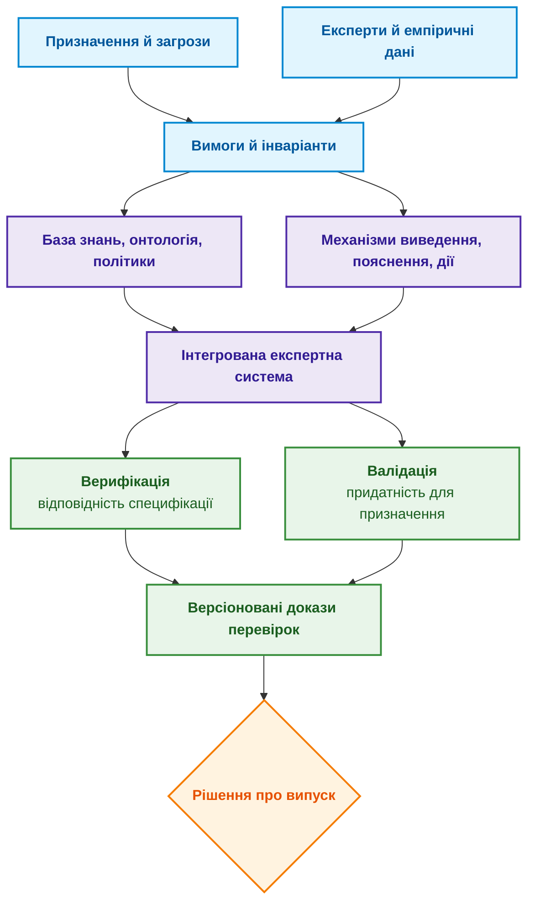
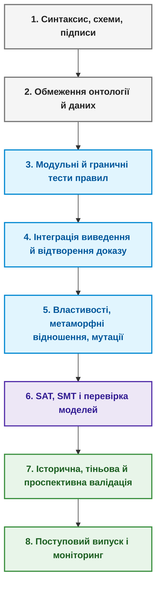
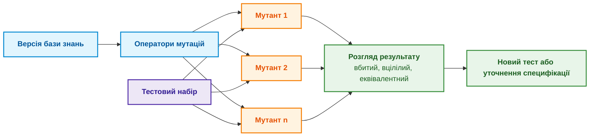
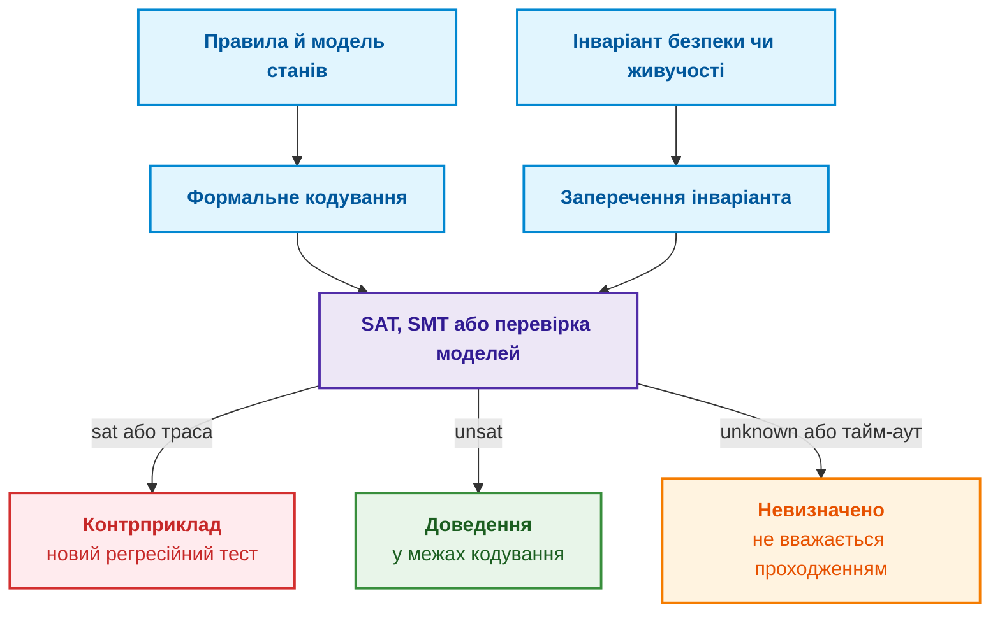

# Глава 23. Верифікація бази знань: як перевірити несуперечливість, повноту та надійність правил

> **Книга:** [Архітектура доказових експертних систем](README.md) · [Частина V: Верифікація, діагностика та неперервне навчання](part-05-verification-and-learning.md)  
> **Попередня частина:** [Частина IV: Архітектура, виконання та механізми висновку](part-04-architecture-and-inference.md)  
> **Попередня глава:** [Глава 22. Кібернетичний цикл керування XXI століття: від сенсорів на периферії до центру ухвалення рішень](ch22-cybernetics-edge-to-backend.md)  
> **Наступна глава:** [Глава 24. Технічна діагностика: як не сплутати симптом із першопричиною в умовах неповноти](ch24-system-diagnosis.md)  
> **Зміст книги:** [README.md](README.md)  
> **Автор:** [Микола Федчик](about-the-author.md)  
> **Рівень:** середній і поглиблений: розробники експертних систем, інженери знань, інженери з якості  
> **Очікувані результати:** відрізняти верифікацію від валідації; знаходити типові аномалії бази знань; тестувати правила на граничних і невідомих станах; формулювати інваріанти й перевіряти їх перебором скінченної моделі чи SMT-розв'язувачем; оцінювати силу тестів мутаційним аналізом; перевіряти рішення разом із доказом і поясненням; організовувати керований випуск змін бази знань.

Експертна система правильно відповіла на двадцять знайомих запитів, і команда готує нову базу правил до випуску. Уже в роботі з'ясовується, що одне правило ніколи не спрацьовує, два правила утворюють цикл, а зміна одиниці вимірювання дає змогу випустити реліз без чинного тесту безпеки. Приклади були правильними, але база правил виявилася ненадійною.

Ця глава відповідає на запитання: **як переконатися, що правилам бази знань можна довіряти, якщо кілька правильних відповідей цього не доводять?** Теза глави: **довіру дає не кількість зелених прикладів, а набір перевірок різної природи: перевірка форми й посилань, тести кожного правила на граничних станах, інваріанти, перевірені на всіх станах скінченної моделі або розв'язувачем, мутаційний аналіз сили тестів і відтворення доказу разом із рішенням. Кожна перевірка доводить щось лише відносно своєї моделі й припущень, тому рішення про випуск ухвалюють за сукупністю блокувальних критеріїв.**

Глава є навчальним оглядом, а не сертифікаційним звітом. Формальні методи доводять властивості лише відносно моделі та припущень, тестування показує наявність помилок у перевіреній області, але не їхню відсутність, а галузеві стандарти можуть вимагати додаткових незалежних процедур. Усі приклади нижче перевіряють одне правило з [Глави 20](ch20-explanation-engine.md): реліз можна схвалити лише для підписаного артефакту, за підтвердженої відсутності блокувального дефекту і за чинного тесту безпеки; чинний тест може замінити лише виняток, підписаний відповідальним за функціональну безпеку.

## Верифікація і валідація: правило може бути правильно виконаним, але хибним за змістом

Баррі Боем розрізнив два запитання до програмного продукту: чи правильно ми будуємо продукт і чи будуємо ми правильний продукт [[1]](#src-1). Перше запитання називають верифікацією (*verification*): чи відповідає реалізація задекларованій специфікації. Друге називають валідацією (*validation*): чи придатні сама специфікація й побудована на ній експертна система для реального рішення.

Для бази знань ця різниця особливо помітна. Можна точно реалізувати хибне правило експерта, і верифікація цього не помітить. Можна мати правильне правило, але механізм виведення з помилковим розв'язанням конфліктів між правилами. Тому знання, вилучені від експертів за методами з [Глави 11](ch11-knowledge-elicitation-from-experts.md), потребують валідації на реальних випадках, а доказові пакети з [Глав 16](ch16-expert-systems-architecture.md) і [20](ch20-explanation-engine.md) потребують верифікації відтворенням. Діаграма показує, як обидва процеси сходяться в рішенні про випуск.



Діаграма показує, що верифікація й валідація мають спільний вхід (вимоги) і спільний вихід (версіоновані докази), але відповідають на різні запитання. Окремої уваги потребує еталон, з яким порівнюють відповідь, тобто оракул тесту (*test oracle*). Елейн Вейюкер показала, що для багатьох програм правильну відповідь неможливо або дуже дорого обчислити незалежно, і тоді тестування втрачає звичну опору [[2]](#src-2). Для бази знань із цього випливає практичне правило: оракул теж має походження. Якщо очікувану відповідь у тесті записав той самий автор, що й правило, такий тест корисний як модульний, але не є незалежною валідацією.

## Перевіряють не файл правил, а всю систему рішення

Перевірити лише файл правил недостатньо, бо рішення експертної системи залежить від багатьох складових:

```math
y = F(x, K, O, P, C, M, R)
```

Тут $x$ є зрізом вхідних фактів, $K$ базою знань, $O$ онтологією, $P$ політиками доступу, $C$ стратегією розв'язання конфліктів між правилами, $M$ моделями машинного навчання в конвеєрі, а $R$ конфігурацією середовища виконання. Зміна аналізатора документів, нормалізатора одиниць чи порогу може змінити рішення, хоча жодне правило не змінювалося. Тому маніфест тестового прогону фіксує хеші всіх складових, зерно генератора випадкових чисел, політику годинника, зовнішні тестові дані й середовище виконання, якщо воно впливає на результат. Для мовних моделей і наближеного пошуку зберігають виходи кожного етапу, щоб недетермінізм усього ланцюжка не приховав порушення детермінованих інваріантів.

## Аномалії бази знань

Перш ніж тестувати поведінку, базу знань перевіряють статично, без запуску на прикладах. Пріс і Шингал описали аномалії бази знань, такі як надлишкові, суперечливі й неповні знання, як симптоми ймовірних помилок і обґрунтували їх виявлення як метод верифікації систем на правилах [[3]](#src-3). На практиці шукають чотири типи аномалій:

- **Мертве правило** ніколи не спрацьовує, бо його передумови несумісні між собою або посилаються на предикат, який жодне джерело не породжує.
- **Надлишкове правило** дублює інше правило або поглинається ним: якщо правило A має ті самі висновки за слабших умов, правило B зайве.
- **Суперечливі правила** за сумісних передумов дають несумісні висновки, наприклад ALLOW і DENY для того самого стану.
- **Цикл правил** виникає, коли висновок одного правила стає передумовою іншого, а висновок другого повертається до першого. Механізм підтримання істинності з [Глави 16](ch16-expert-systems-architecture.md) не дає циклу обґрунтувати самого себе, але цикл у базі знань зазвичай свідчить про помилку моделювання.

Статичний аналіз знаходить ці аномалії до будь-якого запуску. Але аномалія є лише симптомом: мертве правило може описувати рідкісну небезпеку, для якої ще немає даних, тому кожну знахідку розглядає власник правила.

## Від простих перевірок до випробування в реальних умовах

Перевірки бази знань утворюють піраміду: від дешевих і швидких на кожну зміну до дорогих і повільних перед випуском. Діаграма показує вісім рівнів.



Вищий рівень не замінює нижчого. Висока точність на історичних випадках не знайде дубльованого ідентифікатора правила, а перевірка схеми не покаже, що правило шкодить призначенню експертної системи. Розгляньмо перші три рівні докладніше.

**Форма й посилання.** На кожну зміну перевіряють, що правила розбираються, типи й одиниці узгоджені, ідентифікатори однозначні, предикати, на які посилаються правила, існують, а обмеження версій, підписи, власник і термін чинності вказані. Поле `valid_until` має бути позначкою часу з часовим поясом, а не рядком, лексикографічне порівняння якого випадково «працює».

**Поняття й дані.** Засоби логічного виведення для OWL знаходять логічні суперечності онтології за семантикою OWL [[4]](#src-4), а SHACL перевіряє, чи граф даних RDF відповідає заданим формам: кратності, типам даних, діапазонам і складнішим обмеженням [[5]](#src-5). Це різні запитання. OWL виходить із припущення відкритого світу, у якому відсутність факту не означає його хибності, тоді як перевірка форми даних потребує замкненого світу. Наприклад, форма для кожного звіту `SafetyTest` може вимагати полів `artifact`, `result`, `performed_at`, `valid_until`, `method_version` і `source_hash`. Звіт SHACL є версіонованим артефактом конвеєра CI, але висновок `sh:conforms = true` доводить лише правильність форми, а не правильність вимірювання.

**Кожне правило окремо.** Кожне правило тестують щонайменше на номінальному позитивному випадку; на випадках, де бракує кожної передумови окремо; на граничних значеннях і різних одиницях; на активному винятку; на невідомих, суперечливих і недоступних даних; на застосовності до версії, часу й контексту. Перевіряють не лише остаточну відповідь, а й очікувані елементи доказу. Для правила

```math
\mathrm{valid\_test} \land \mathrm{signed} \land \neg \mathrm{blocker} \rightarrow \mathrm{allow}
```

трьох позитивних фактів недостатньо. Треба перевірити, що стан «невідомо, чи є блокувальний дефект» не трактується як $\neg \mathrm{blocker}$, якщо політика вимагає явного підтвердження відсутності дефекту.

## Кількість перевірених правил ще не доводить якості

Нехай $R$ є множиною правил у випуску, а $R_f \subseteq R$ множиною правил, які хоча б раз спрацювали на тестовому наборі. Покриття спрацюванням дорівнює

```math
C_{\text{fire}} = \frac{|R_f|}{|R|}
```

Високе $C_{\text{fire}}$ не означає, що перевірено всі умови: для правила з $m$ передумовами потрібні випадки для кожної умови й кожної межі. Низьке покриття може означати мертве правило, рідкісну небезпеку або слабкий генератор тестів, і ці три причини потребують різних рішень. Корисніша за саме покриття матриця простежуваності, яка пов'язує небезпеку з правилом, тестами й власником:

| Вимога чи небезпека | Правило | Позитивний тест | Негативні й граничні тести | Власник |
|---|---|---|---|---|
| Лише чинний доказ безпеки | `REL-12` | `case-104` | від `case-105` до `case-109` | Безпека |
| Виняток підписує відповідальний за безпеку | `AUTH-7` | `case-205` | від `case-206` до `case-211` | Відповідність вимогам |
| Блокувальний дефект завжди забороняє ALLOW | `REL-2` | немає | властивість `INV-01` | Випуск |

Порожня клітинка матриці не завжди є дефектом, але завжди є видимою прогалиною, яку хтось має свідомо прийняти або закрити.

## Інваріанти й контрприклади

Тести на прикладах фіксують відомі випадки. Тестування властивостями (*property-based testing*), яке популяризував інструмент QuickCheck Класена й Г'юза [[6]](#src-6), працює інакше: генератор створює багато допустимих і навмисно недопустимих станів, а перевірка застосовує до кожного стану інваріант. Головний інваріант правила релізу:

```math
\forall s:\ \mathrm{blocker}(s) \neq \mathrm{no} \Rightarrow \mathrm{decision}(s) \neq \mathrm{ALLOW}
```

Тут $\mathrm{blocker}(s) \neq \mathrm{no}$ охоплює і наявний дефект, і невідомий стан. Інші властивості:

```math
\mathrm{decision}(s) = \mathrm{ALLOW} \Rightarrow \mathrm{valid\_test}(s) \lor \mathrm{authorized\_waiver}(s)
```

```math
\mathrm{retract}(e, s) \Rightarrow e \notin \mathrm{support}\bigl(\mathrm{recompute}(s)\bigr)
```

```math
\mathrm{unauthorized}(u, e) \Rightarrow \mathrm{output}(u, s) \text{ не залежить від закритого факту } e
```

Перша властивість вимагає підстави для дозволу, друга вимагає, щоб відкликаний факт зникав з обґрунтування після перерахунку, а третя є властивістю інформаційного потоку: відповідь користувачеві без доступу до факту $e$ не повинна від $e$ залежати. Третю властивість важко довести для всієї експертної системи, тому в тестах її наближають парними входами, що різняться лише закритим фактом, і контрольними маркерами витоку. Якщо генератор знайшов порушення, процедура зменшення (*shrinking*) скорочує його до мінімального контрприкладу, наприклад «дефект є плюс один застарілий прапорець кешу».

Випадковість не замінює знання предметної області. Генератор має знати допустимі залежності між полями, інакше витратить бюджет на неможливі стани або ніколи не породить рідкісної комбінації. Коли простір станів малий, генератор можна замінити повним перебором, і тоді перевірка інваріанта стає доведенням у межах моделі. Наступний розділ поєднує такий перебір із перевіркою сили самих тестів.

## Мутаційне тестування: чи помітять тести зламане правило

Тести можуть бути зеленими лише тому, що не перевіряють нічого суттєвого. Мутаційне тестування, ідею якого запропонували Де Мілло, Ліптон і Сейворд [[7]](#src-7), навмисно вносить у правило типові дефекти й перевіряє, чи помітять їх тести. Для бази знань типові оператори мутацій такі: заміна `>` на `>=`, `AND` на `OR`, `ALLOW` на `DENY`; видалення передумови чи винятку; заміна годин на дні; зсув порогу чи інтервалу чинності; підміна ролі, орендаря чи версії джерела; інверсія пріоритету правил; розрив зв'язку походження.

Мутант вважається вбитим, якщо хоча б один тест падає. Мутаційний бал дорівнює

```math
MS = \frac{M_{\text{killed}}}{M_{\text{total}} - M_{\text{equivalent}}}
```

Тут $M_{\text{killed}}$ є кількістю вбитих мутантів, $M_{\text{total}}$ загальною кількістю, а $M_{\text{equivalent}}$ кількістю еквівалентних мутантів, які не змінюють семантики правила й тому не можуть бути вбиті жодним тестом. Джа й Гарман у своєму огляді наголошують, що розпізнавання еквівалентних мутантів є однією з головних проблем методу, бо в загальному випадку воно алгоритмічно нерозв'язне [[8]](#src-8). Тому оголошувати 100 % без процедури розгляду вцілілих мутантів не можна, а вцілілий критичний мутант, наприклад з видаленою перевіркою повноважень підписанта винятку, блокує випуск незалежно від загального балу. Діаграма показує цей процес.



Програма мовою Go поєднує обидві ідеї для правила релізу. Скінченна модель має 36 станів: тест чинний чи ні, артефакт підписаний чи ні, блокувальний дефект є, немає чи невідомо, виняток відсутній, підписаний керівником проєкту чи відповідальним за безпеку. Програма спершу перевіряє правильне правило на всіх 36 станах, а потім порівнює дві стратегії перевірки п'яти мутантів: набір із трьох прикладів, якими команда «перевіряла» правило, і повний перебір із трьома інваріантами.

<details>
<summary>Приклад мовою Go: перевірка правила випуску на всіх 36 станах</summary>

```go
package main

import "fmt"

type Blocker int

const (
	NoBlocker Blocker = iota
	HasBlocker
	UnknownBlocker // даних про дефекти немає
)

func (b Blocker) String() string { return [...]string{"немає", "є", "невідомо"}[b] }

type Waiver int

const (
	NoWaiver Waiver = iota
	ByProjectLead
	BySafetyOwner
)

func (w Waiver) String() string {
	return [...]string{"немає", "керівник проєкту", "відповідальний за безпеку"}[w]
}

type State struct {
	TestValid, Signed bool
	Blocker           Blocker
	Waiver            Waiver
}

type Rule func(s State) bool // true означає ALLOW

// release є правильним правилом: підписаний артефакт, підтверджена відсутність
// блокувального дефекту, чинний тест або виняток від відповідального за безпеку.
func release(s State) bool {
	return s.Signed && s.Blocker == NoBlocker && (s.TestValid || s.Waiver == BySafetyOwner)
}

// invariants повертає опис першого порушеного інваріанта або порожній рядок.
func invariants(s State, allow bool) string {
	switch {
	case allow && s.Blocker != NoBlocker:
		return "I1: ALLOW без підтвердженої відсутності дефекту"
	case allow && !s.TestValid && s.Waiver != BySafetyOwner:
		return "I2: ALLOW без чинного тесту й належного винятку"
	case allow && !s.Signed:
		return "I3: ALLOW непідписаного артефакту"
	}
	return ""
}

// allStates перебирає всі 2·2·3·3 = 36 станів скінченної моделі.
func allStates() []State {
	var out []State
	for _, tv := range []bool{false, true} {
		for _, sg := range []bool{false, true} {
			for b := NoBlocker; b <= UnknownBlocker; b++ {
				for w := NoWaiver; w <= BySafetyOwner; w++ {
					out = append(out, State{tv, sg, b, w})
				}
			}
		}
	}
	return out
}

// examples є невеликим набором прикладів, яким команда перевіряла правило.
var examples = []struct {
	s     State
	allow bool
}{
	{State{true, true, NoBlocker, NoWaiver}, true},
	{State{true, true, HasBlocker, NoWaiver}, false},
	{State{false, true, NoBlocker, NoWaiver}, false},
}

func killedByExamples(r Rule) bool {
	for _, e := range examples {
		if r(e.s) != e.allow {
			return true
		}
	}
	return false
}

func firstViolation(r Rule) (State, string, bool) {
	for _, s := range allStates() {
		if v := invariants(s, r(s)); v != "" {
			return s, v, true
		}
	}
	return State{}, "", false
}

func main() {
	if _, v, bad := firstViolation(release); bad {
		fmt.Println("правильне правило порушує інваріант:", v)
		return
	}
	fmt.Println("правильне правило: 36 станів, порушень немає")

	mutants := []struct {
		name string
		r    Rule
	}{
		{"M1 видалено перевірку дефекту", func(s State) bool { return s.Signed && (s.TestValid || s.Waiver == BySafetyOwner) }},
		{"M2 невідомо трактується як «немає»", func(s State) bool {
			return s.Signed && s.Blocker != HasBlocker && (s.TestValid || s.Waiver == BySafetyOwner)
		}},
		{"M3 будь-який виняток приймається", func(s State) bool {
			return s.Signed && s.Blocker == NoBlocker && (s.TestValid || s.Waiver != NoWaiver)
		}},
		{"M4 AND замінено на OR", func(s State) bool { return s.Signed || (s.Blocker == NoBlocker && s.TestValid) }},
		{"M5 переставлено умови", func(s State) bool {
			return (s.Waiver == BySafetyOwner || s.TestValid) && s.Blocker == NoBlocker && s.Signed
		}},
	}
	killed, killedEx := 0, 0
	for _, m := range mutants {
		ex := killedByExamples(m.r)
		if ex {
			killedEx++
		}
		s, v, inv := firstViolation(m.r)
		fmt.Printf("%-36s | приклади: %-5v | інваріанти: %-5v\n", m.name, ex, inv)
		if inv {
			killed++
			fmt.Printf("    %s; контрприклад: %+v\n", v, s)
		}
	}
	fmt.Printf("мутаційний бал без еквівалентного M5: приклади %d/4, інваріанти %d/4\n", killedEx, killed)
}
```

</details>

Програма виводить:

```text
правильне правило: 36 станів, порушень немає
M1 видалено перевірку дефекту        | приклади: true  | інваріанти: true
    I1: ALLOW без підтвердженої відсутності дефекту; контрприклад: {TestValid:false Signed:true Blocker:є Waiver:відповідальний за безпеку}
M2 невідомо трактується як «немає»   | приклади: false | інваріанти: true
    I1: ALLOW без підтвердженої відсутності дефекту; контрприклад: {TestValid:false Signed:true Blocker:невідомо Waiver:відповідальний за безпеку}
M3 будь-який виняток приймається     | приклади: false | інваріанти: true
    I2: ALLOW без чинного тесту й належного винятку; контрприклад: {TestValid:false Signed:true Blocker:немає Waiver:керівник проєкту}
M4 AND замінено на OR                | приклади: true  | інваріанти: true
    I2: ALLOW без чинного тесту й належного винятку; контрприклад: {TestValid:false Signed:true Blocker:немає Waiver:немає}
M5 переставлено умови                | приклади: false | інваріанти: false
мутаційний бал без еквівалентного M5: приклади 2/4, інваріанти 4/4
```

Результат пояснює історію з початку глави. Три приклади вбили лише двох мутантів із чотирьох змістовних: вони не помітили, що невідомий стан дефекту трактується як «дефекту немає» (M2), і що виняток від керівника проєкту приймається нарівні з винятком від відповідального за безпеку (M3). Обидва дефекти небезпечні, і обидва пройшли б перевірку «на двадцяти знайомих запитах». Перебір усіх 36 станів з інваріантами вбив усіх чотирьох і для кожного видав мінімальний контрприклад, який можна одразу перетворити на регресійний тест. Мутант M5 лише переставляє умови кон'юнкції, тому семантично еквівалентний правильному правилу й справедливо вцілів; саме тому його виключено зі знаменника мутаційного балу. Межа прикладу така: перебір доводить інваріанти лише для цієї скінченної моделі з чотирма змінними, а справжнє правило працює з датами, ролями й версіями, для яких потрібні або генератори, або розв'язувачі.

## Метаморфні й диференційні перевірки

Коли точна очікувана відповідь дорога чи невідома, перевіряють відношення між відповідями на пов'язані входи. Метаморфне тестування, огляд якого зробили Чень та співавтори [[9]](#src-9), формулює такі відношення явно. Перестановка нерелевантних доказів не повинна змінювати рішення:

```math
F(\mathrm{permute}_{\text{irrelevant}}(x)) = F(x)
```

Якщо політика забороняє подвійний підрахунок, додавання дубліката джерела не повинно змінювати впевненості:

```math
\mathrm{confidence}(x \cup \mathrm{duplicate}(e)) = \mathrm{confidence}(x)
```

Для доступу відповідь не повинна ставати детальнішою після зменшення прав:

```math
\mathrm{ACL}(u_2) \subseteq \mathrm{ACL}(u_1) \Rightarrow \mathrm{disclosure}(u_2, x) \subseteq \mathrm{disclosure}(u_1, x)
```

Такі відношення застосовують лише там, де вони справді є інваріантами. У немонотонній логіці додавання нового факту може законно скасувати висновок, тому безумовний тест монотонності був би хибним.

Диференційне тестування запускає той самий маніфест на старому й новому механізмах виведення або на двох незалежних реалізаціях і розглядає кожну неочікувану розбіжність $\Delta(x) = F_{\text{new}}(x) - F_{\text{baseline}}(x)$. Згода двох реалізацій при цьому не доводить правильності: обидві можуть повторювати ту саму помилку специфікації.

## Формальні методи: пошук забороненого стану

Набір правил можна закодувати як обмеження й запитати розв'язувач, чи існує стан, де порушено інваріант. Для блокувального дефекту запитання звучить так:

```math
\exists s:\ \mathrm{blocker}(s) \land \mathrm{decision}(s) = \mathrm{ALLOW}\ ?
```

Відповідь `sat` дає контрмодель, тобто конкретний стан порушення. Відповідь `unsat` доводить, що такого стану немає, але лише **в межах кодування**: якщо модель не врахувала кеш, час чи пріоритет винятків, доведення не поширюється на промислову реалізацію. Розв'язувачі SMT, як-от Z3 [[10]](#src-10), особливо корисні там, де перебір неможливий: в арифметиці, одиницях, позначках часу й обмеженнях ролей.

Повернімося до третьої проблеми з початку глави: зміна одиниці вимірювання дала змогу випустити реліз без чинного тесту. Програма мовою Python кодує правило мовою SMT-LIB і запускає Z3 через модуль `z3` (перевірено з версією модуля 5.1.0). У правилі з помилкою термін дії звіту в годинах порівнюється з днем релізу, а у виправленому правилі день релізу спершу переводиться в години.

```python
import z3

COMMON = """
(reset)
(declare-const release_day Int)        ; день релізу від початку проєкту
(declare-const valid_until_hour Int)   ; термін дії звіту, години від початку проєкту
(declare-const blocker Bool)
(declare-const signed Bool)
(assert (>= release_day 0))
(assert (>= valid_until_hour 0))
"""

BUGGY = "(define-fun valid_test () Bool (>= valid_until_hour release_day))"         # години порівнюються з днями
FIXED = "(define-fun valid_test () Bool (>= valid_until_hour (* 24 release_day)))"  # одиниці узгоджено

QUERY = """
(define-fun allow () Bool (and valid_test signed (not blocker)))
; заперечення інваріанта: реліз дозволено, хоча звіт прострочений
(assert allow)
(assert (< valid_until_hour (* 24 release_day)))
(check-sat)
"""

ctx = z3.main_ctx().ref()
for name, rule in [("з помилкою одиниць", BUGGY), ("виправлене правило", FIXED)]:
    verdict = z3.Z3_eval_smtlib2_string(ctx, COMMON + rule + QUERY).strip()
    print("==", name, "->", verdict)
    if verdict == "sat":
        model = z3.Z3_eval_smtlib2_string(ctx, "(get-value (release_day valid_until_hour blocker signed))")
        print(model.strip())
```

Програма виводить:

```text
== з помилкою одиниць -> sat
((release_day 1)
 (valid_until_hour 23)
 (blocker false)
 (signed true))
== виправлене правило -> unsat
```

Для правила з помилкою Z3 знайшов контрприклад: звіт чинний до 23-ї години проєкту, а реліз запланований на перший день, тобто на 24-ту годину. Звіт прострочений на годину, але правило з помилкою порівнює 23 з 1 і дозволяє реліз. Для виправленого правила розв'язувач довів, що стану порушення немає. Важливо, що контрприклад знайдено не перебором (цілі числа необмежені), а розв'язуванням обмежень, і що він мінімально простий, тому його легко перетворити на регресійний тест.

Для робочих процесів із часом корисні темпоральні властивості, описані в [Главі 14](ch14-requirements-detection-and-formalization.md). Для дій із [Глави 21](ch21-from-recommendation-to-action.md) властивість живучості звучить так:

```math
\Box\bigl(\mathrm{committed} \Rightarrow \Diamond(\mathrm{verified} \lor \mathrm{safe\_hold})\bigr)
```

Тобто після фіксації дія зрештою має перейти в підтверджений стан або в безпечне утримання. Таку властивість перевіряють засоби перевірки моделей, наприклад для специфікацій мовою TLA+ Леслі Лемпорта [[11]](#src-11). Властивості живучості потребують припущень справедливості й доступності: якщо зовнішній сервіс недоступний назавжди, безумовне «зрештою» хибне. Діаграма підсумовує процедуру формальної перевірки.



Відповідь `unknown` чи тайм-аут розв'язувача не можна перетворювати на проходження. Кодування, версія розв'язувача, його параметри й межі моделі є частиною доказів перевірки.

## Відтворення пояснення разом із рішенням

Два різні дефекти можуть випадково дати правильний результат DENY. Тому очікуваний результат тесту містить не лише рішення, а й епістемічний статус; корінь доказу й допустимі альтернативні докази; використані правила й факти; відсутні передумови чи активні винятки; версії знань, політик, моделей і зрізу; елементи пояснення та клас розкриття інформації; для дій точний контракт дії або заборону на нього. Засіб відтворення перевіряє кожну вершину й кожне ребро графа доведення $P$:

```math
\mathrm{ValidProof}(P, K, s) = \bigwedge_{v \in P} \mathrm{ValidNode}(v, K, s) \land \bigwedge_{(u,v) \in P} \mathrm{ValidStep}(u, v, K)
```

Відповідь мовної моделі порівнюють не за лексичною схожістю, а прив'язуючи її твердження до проміжного представлення й доказу, як описано в [Главах 19](ch19-from-question-to-evidence.md) і [20](ch20-explanation-engine.md). Інакше правильна мітка з вигаданим обґрунтуванням пройде тест.

## Правила разом із машинним навчанням

Пошук, переранжування, моделі текстового слідування, класифікатори й мовні моделі роблять ймовірнісні помилки. Їх оцінюють і поетапно, і наскрізно, на заморожених наборах з ізоляцією за часом і групами та на зрізах загроз, як описано в [Главах 25](ch25-how-expert-systems-learn.md), [19](ch19-from-question-to-evidence.md) і [12](ch12-linguistic-analysis-and-local-models.md). Символьна коректність не компенсує пропуску пошуку: правило не виведе твердження, якого конвеєр не побачив. І навпаки, висока повнота пошуку не компенсує обходу політики доступу. Тому рішення про випуск є кон'юнкцією блокувальних критеріїв, а не однією середньою метрикою:

```math
\mathrm{Release} = \mathrm{SchemaPass} \land \mathrm{InvariantsPass} \land \mathrm{SecurityPass} \land \mathrm{EvidenceQualityPass} \land \mathrm{NoBlockingRegression}
```

Для статистичних метрик порівнюють парну різницю $\Delta = m_{\text{candidate}} - m_{\text{baseline}}$ з довірчим інтервалом і заздалегідь визначають допустимий запас невідставання (*non-inferiority margin*). Дрор та співавтори показали, що в обробці природної мови статистичну значущість різниці між системами часто не перевіряють або перевіряють невідповідним тестом, і запропонували правила вибору тесту [[12]](#src-12). Проте статистика не скасовує нульової толерантності: один допущений витік між правами доступу чи одна небезпечна дія блокує випуск незалежно від довірчого інтервалу.

## Перевірка на минулих випадках без самообману

Еталонні випадки легко забруднити: автори правил бачать ці випадки й підганяють під них правила. Тому потрібні окремі набори:

- набір для розроблення, на якому команда працює щодня;
- регресійний набір для відомих дефектів;
- запечатаний підтверджувальний набір, недоступний під час налаштування правил;
- проспективні й тіньові випадки, зібрані після заморожування версії;
- набір атак для безпеки й рідкісних небезпек.

Випадки групують за спільним джерелом, інцидентом чи виробом, щоб майже однакові фрагменти не потрапили одночасно в набір для розроблення й підтверджувальний набір. Крім того, відтворення історичного рішення не завжди є правильним оракулом, бо минуле рішення людини могло бути помилковим. Тому для кожного випадку окремо зберігають зафіксований результат, висновок експертного розгляду й нормативно очікуване рішення.

## Керовані зміни бази правил

Зміна знань потребує процесу, схожого на перегляд коду: різниця версій, обґрунтування, джерело, власник, перелік зачеплених тверджень, правил і тестів, схвалення й підписаний маніфест. Діаграма показує конвеєр такої зміни.

```mermaid
flowchart LR
    accTitle: Конвеєр контрольованих змін бази правил
    accDescr: Зміна проходить аналіз впливу, швидкі тести, мутаційний набір, формальні перевірки, відтворення доказів і тести безпеки; після шлюзу випуску йде тіньове розгортання з моніторингом і атомарним відкатом, а провал веде до карантину.

    CH["<b>Зміна знань або коду</b>"] --> IMP["<b>Аналіз впливу й простежуваність</b>"]
    IMP --> FAST["<b>Швидкі тести</b><br/>схеми, модульні, властивості"]
    FAST --> MUT["<b>Критичний мутаційний набір</b>"]
    MUT --> FORM["<b>Формальні перевірки</b><br/>SMT, перевірка моделей"]
    FORM --> REP["<b>Відтворення доказів</b><br/>історичні випадки"]
    REP --> ADV["<b>Тести безпеки й атак</b>"]
    ADV --> GATE{"<b>Оголошені критерії випуску</b>"}
    GATE -->|"пройдено"| SH["<b>Тіньове або поступове розгортання</b>"]
    GATE -->|"провал"| Q["<b>Карантин і діагностика</b>"]
    SH --> MON["<b>Моніторинг інваріантів і дрейфу</b>"]
    MON --> RB["<b>Атомарний відкат маніфесту</b>"]

    classDef ch fill:#e1f5fe,stroke:#0288d1,stroke-width:2px,color:#01579b;
    classDef test fill:#ede7f6,stroke:#512da8,stroke-width:2px,color:#311b92;
    classDef gate fill:#fff3e0,stroke:#f57c00,stroke-width:2px,color:#e65100;
    classDef rel fill:#e8f5e9,stroke:#388e3c,stroke-width:2px,color:#1b5e20;
    classDef fail fill:#ffebee,stroke:#d32f2f,stroke-width:2px,color:#c62828;

    class CH,IMP ch;
    class FAST,MUT,FORM,REP,ADV test;
    class GATE gate;
    class SH,MON rel;
    class Q,RB fail;
```



Відкат повертає узгоджений комплект онтології, правил, індексів, моделей, калібрування й політик: повернути лише файл правил недостатньо, бо решта складових могла вже змінитися під нову версію. Звіт про випуск містить провали, а не лише підсумковий бал. Тест у карантині не зникає мовчки: для нього вказують власника, причину, прийнятий ризик і строк. Нестабільний тест інваріанта є ризиком для робочого середовища, а не косметичним шумом конвеєра. Ці вимоги узгоджуються з практиками безпечної розробки NIST SSDF, які вимагають контрольованих змін, перевірок і збереження доказів [[13]](#src-13), а загальні поняття тестування, як-от оракул, рівень і техніка тестування, систематизує стандарт ISO/IEC/IEEE 29119-1 [[14]](#src-14).

## Хибні висновки, які має зупинити перевірка

Таблиця збирає поширені хибні висновки про якість бази знань і способи їх виправити.

| Хибний висновок | Чому він хибний | Що робити |
|---|---|---|
| «Усі демонстраційні випадки зелені» | Приклади не покривають меж і структури | Властивості, мутації, формальні контрприклади |
| «SHACL пройшов, отже граф правдивий» | Форма перевіряє структуру, а не світ | Походження й предметна валідація |
| «Розв'язувач дав unsat, отже робоче середовище безпечне» | Модель могла бути неповною | Явні припущення, простежуваність моделі до коду, тести середовища виконання |
| «Дві реалізації погодилися» | Можлива спільна помилка специфікації | Незалежний оракул і предметний розгляд |
| «Покриття спрацюванням 100 %» | Умови, межі й оракул можуть бути слабкими | Покриття умов і мутаційний бал |
| «Історична точність висока» | Витік між наборами, дисбаланс класів, помилкові історичні мітки | Розбиття за групами й часом, запечатаний і проспективний набори |
| «Мовна модель пояснила правильну мітку» | Обґрунтування може бути вигаданим | Прив'язка тверджень і відтворення доказу |
| «Жодного інциденту за місяць» | Рідкісна небезпека могла просто не трапитися | Оцінки з урахуванням експозиції, тести атак |

## З чого почати перевірку правил

1. Інвентаризувати версії знань, механізму виведення, моделей, політик і середовища виконання.
2. Записати мовою предметної області 5–10 інваріантів безпеки.
3. Побудувати простежуваність «небезпека, вимога, правило, тести, власник».
4. Додати перевірки схем і SHACL та граничні модульні тести правил на кожну зміну.
5. Реалізувати генератор допустимих і недопустимих станів зі зменшенням контрприкладів або повний перебір для малих моделей.
6. Створити предметні оператори мутацій, насамперед для повноважень, одиниць і винятків.
7. Закодувати одну-дві критичні властивості для SMT-розв'язувача чи засобу перевірки моделей.
8. Перевіряти рішення разом із доказом, поясненням і контрактом дії.
9. Відокремити набори для розроблення, запечатаний підтверджувальний і проспективний набори.
10. Випускати атомарний маніфест через тіньове чи поступове розгортання з відрепетируваним відкатом.

## Висновок

Правильні відповіді на кількох прикладах не доводять, що правилам можна довіряти. Довіру дає набір перевірок різної природи, кожна з яких закриває окремий клас помилок: статичний аналіз знаходить аномалії бази знань, граничні тести перевіряють кожне правило, інваріанти й розв'язувачі шукають заборонені стани, мутаційний аналіз перевіряє силу самих тестів, а відтворення доказу перевіряє, що правильну відповідь отримано з правильних причин.

Глава показала це на одному правилі релізу. Три приклади, якими команда перевіряла правило, вбили лише двох мутантів із чотирьох і пропустили два небезпечні дефекти: трактування невідомого стану дефекту як його відсутності та прийняття винятку від неналежної особи. Повний перебір 36 станів з інваріантами вбив усіх змістовних мутантів і видав мінімальні контрприклади. Розв'язувач Z3 знайшов контрприклад для помилки одиниць (звіт прострочений на годину, а реліз дозволено) і довів відсутність порушення у виправленому правилі.

Межі цих методів теж визначено. Перебір і розв'язувач доводять властивості лише в межах моделі й кодування; еквівалентні мутанти не можна розпізнати автоматично в загальному випадку; статистичні порівняння не скасовують нульової толерантності до витоків і небезпечних дій. [Глава 24](ch24-system-diagnosis.md) переносить цю дисципліну з перевірки власних правил на діагностику зовнішнього об'єкта: як із симптомів і ненадійних даних отримати кілька сумісних пояснень і обрати наступну безпечну перевірку.

## Запитання для самоперевірки

1. Чим верифікація відрізняється від валідації і чому правильно реалізоване правило може бути хибним за змістом?
2. Які чотири типи аномалій бази знань шукають статичним аналізом і чому мертве правило не завжди треба видаляти?
3. Чому OWL і SHACL відповідають на різні запитання про ті самі дані?
4. Чому три приклади в програмі не вбили мутантів M2 і M3 і які контрприклади знайшов повний перебір?
5. Чому мутант M5 вцілів і чому його виключено зі знаменника мутаційного балу?
6. Що саме доводить відповідь `unsat` для виправленого правила і чого вона не доводить? Як зараховують відповідь `unknown`?
7. Чому очікуваний результат тесту має містити доказ, а не лише рішення ALLOW чи DENY?
8. Чому рішення про випуск є кон'юнкцією блокувальних критеріїв, а не середньою метрикою?

## Словник

| Український термін | Англійський відповідник | Коротке пояснення |
|---|---|---|
| Верифікація | Verification | Перевірка відповідності реалізації специфікації |
| Валідація | Validation | Перевірка придатності специфікації й експертної системи для призначення |
| Оракул тесту | Test oracle | Джерело очікуваної правильної відповіді для тесту |
| Аномалія бази знань | Knowledge base anomaly | Ознака ймовірної помилки: мертве, надлишкове, суперечливе правило чи цикл |
| Мертве правило | Dead rule | Правило, яке не може спрацювати за жодних допустимих фактів |
| Покриття спрацюванням | Firing coverage | Частка правил, що спрацювали хоча б раз на тестовому наборі |
| Матриця простежуваності | Traceability matrix | Таблиця зв'язків між небезпеками, вимогами, правилами, тестами й власниками |
| Інваріант | Invariant | Властивість, що має виконуватися в кожному допустимому стані |
| Тестування властивостями | Property-based testing | Перевірка інваріантів на багатьох згенерованих станах |
| Зменшення контрприкладу | Shrinking | Скорочення знайденого порушення до мінімального прикладу |
| Мутаційне тестування | Mutation testing | Оцінка сили тестів через навмисне внесення дефектів |
| Еквівалентний мутант | Equivalent mutant | Змінене правило з тією самою семантикою, яке неможливо вбити тестом |
| Мутаційний бал | Mutation score | Частка вбитих мутантів серед нееквівалентних |
| Метаморфне відношення | Metamorphic relation | Відношення між відповідями на пов'язані входи |
| Диференційне тестування | Differential testing | Порівняння відповідей двох реалізацій на тих самих входах |
| Властивість живучості | Liveness property | Властивість виду «щось добре зрештою станеться» |
| Запас невідставання | Non-inferiority margin | Допустиме погіршення метрики, заздалегідь визначене для порівняння версій |
| Запечатаний набір | Sealed set | Набір випадків, недоступний під час налаштування правил |

## Абревіатури

| Скорочення | Розшифрування | Значення |
|---|---|---|
| ACL | Access Control List | список прав доступу |
| CI | Continuous Integration | безперервна інтеграція |
| NIST | National Institute of Standards and Technology | Національний інститут стандартів і технологій США |
| OWL | Web Ontology Language | мова онтологій W3C |
| RDF | Resource Description Framework | модель даних у вигляді трійок |
| SAT | Boolean Satisfiability | задача виконуваності булевих формул |
| SHACL | Shapes Constraint Language | мова обмежень форм для графів RDF |
| SMT | Satisfiability Modulo Theories | виконуваність з урахуванням теорій |
| SMT-LIB | SMT Library | стандартна мова задач для SMT-розв'язувачів |
| SSDF | Secure Software Development Framework | каркас практик безпечної розробки NIST |
| TLA+ | Temporal Logic of Actions | мова специфікацій Лемпорта для перевірки моделей |

## Джерела

1. <a id="src-1"></a>B. W. Boehm. [*Verifying and Validating Software Requirements and Design Specifications*](https://doi.org/10.1109/MS.1984.233702). *IEEE Software*, 1(1), 75–88, 1984.
2. <a id="src-2"></a>E. J. Weyuker. [*On Testing Non-Testable Programs*](https://doi.org/10.1093/comjnl/25.4.465). *The Computer Journal*, 25(4), 465–470, 1982.
3. <a id="src-3"></a>Alun D. Preece, Rajjan Shinghal. [*Foundation and Application of Knowledge Base Verification*](https://doi.org/10.1002/int.4550090804). *International Journal of Intelligent Systems*, 9(8), 683–701, 1994.
4. <a id="src-4"></a>W3C OWL Working Group. [*OWL 2 Web Ontology Language Document Overview (Second Edition)*](https://www.w3.org/TR/owl2-overview/). W3C Recommendation, 2012.
5. <a id="src-5"></a>Holger Knublauch, Dimitris Kontokostas (ред.). [*Shapes Constraint Language (SHACL)*](https://www.w3.org/TR/shacl/). W3C Recommendation, 2017.
6. <a id="src-6"></a>Koen Claessen, John Hughes. [*QuickCheck: A Lightweight Tool for Random Testing of Haskell Programs*](https://doi.org/10.1145/351240.351266). *Proceedings of the Fifth ACM SIGPLAN International Conference on Functional Programming (ICFP)*, 268–279, 2000.
7. <a id="src-7"></a>R. A. DeMillo, R. J. Lipton, F. G. Sayward. [*Hints on Test Data Selection: Help for the Practicing Programmer*](https://doi.org/10.1109/C-M.1978.218136). *Computer*, 11(4), 34–41, 1978.
8. <a id="src-8"></a>Yue Jia, Mark Harman. [*An Analysis and Survey of the Development of Mutation Testing*](https://doi.org/10.1109/TSE.2010.62). *IEEE Transactions on Software Engineering*, 37(5), 649–678, 2011.
9. <a id="src-9"></a>Tsong Yueh Chen та ін. [*Metamorphic Testing: A Review of Challenges and Opportunities*](https://doi.org/10.1145/3143561). *ACM Computing Surveys*, 51(1), 1–27, 2018.
10. <a id="src-10"></a>Leonardo de Moura, Nikolaj Bjørner. [*Z3: An Efficient SMT Solver*](https://doi.org/10.1007/978-3-540-78800-3_24). *Tools and Algorithms for the Construction and Analysis of Systems (TACAS)*, LNCS, 337–340, 2008.
11. <a id="src-11"></a>Leslie Lamport. [*Specifying Systems: The TLA+ Language and Tools for Hardware and Software Engineers*](https://lamport.azurewebsites.net/tla/book.html). Addison-Wesley, 2002.
12. <a id="src-12"></a>Rotem Dror, Gili Baumer, Segev Shlomov, Roi Reichart. [*The Hitchhiker's Guide to Testing Statistical Significance in Natural Language Processing*](https://aclanthology.org/P18-1128/). *Proceedings of the 56th Annual Meeting of the Association for Computational Linguistics (ACL)*, 2018.
13. <a id="src-13"></a>Murugiah Souppaya, Karen Scarfone, Donna Dodson. [*Secure Software Development Framework (SSDF) Version 1.1*](https://doi.org/10.6028/NIST.SP.800-218). NIST Special Publication 800-218, 2022.
14. <a id="src-14"></a>ISO, IEC, IEEE. [*ISO/IEC/IEEE 29119-1:2022. Software and Systems Engineering: Software Testing: Part 1: General Concepts*](https://www.iso.org/standard/81291.html). 2022.

---

[← Глава 22. Кібернетичний цикл керування](ch22-cybernetics-edge-to-backend.md) | [Зміст книги](README.md) | [Частина V](part-05-verification-and-learning.md) | [Глава 24. Технічна діагностика →](ch24-system-diagnosis.md)
